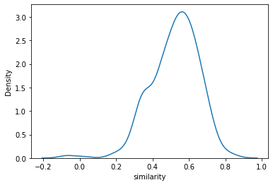
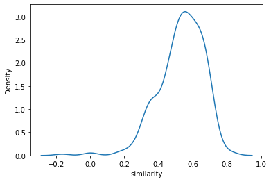
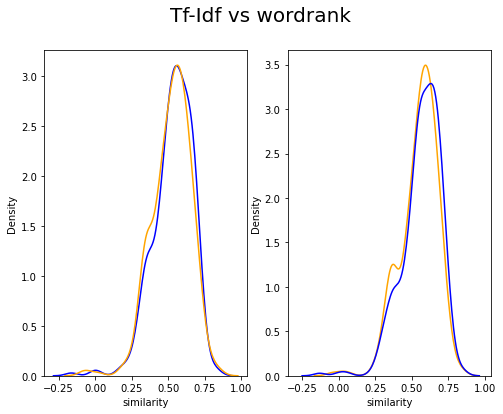
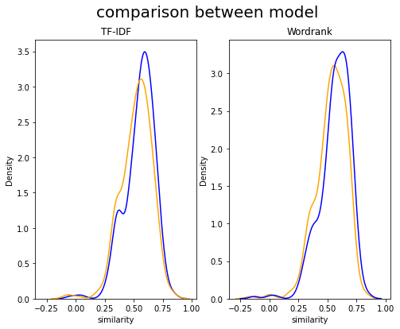

```python
from gensim.models import FastText
```


```python
'''
FastText 학습
from gensim.models import FastText
ft_model = FastText(result, size=100, window=5, min_count=5, workers=4, sg=1)
ko_model.get_sentence_vector('섬속의 섬')
'''
```


    "\nFastText 학습\nfrom gensim.models import FastText\nft_model = FastText(result, size=100, window=5, min_count=5, workers=4, sg=1)\nko_model.get_sentence_vector('섬속의 섬')\n"


```python
from gensim import models
```


```python
ko_model = models.fasttext.load_facebook_model('wiki.ko.bin')
```


```python
ko_model.similarity('우도', '땅콩')
```

    <ipython-input-5-93ee045c5a23>:1: DeprecationWarning: Call to deprecated `similarity` (Method will be removed in 4.0.0, use self.wv.similarity() instead).
      ko_model.similarity('우도', '땅콩')
    


    0.10512379


```python
import tensorflow as tf
```

# 학습

뭐뭐로 학습? 리얼소개, 리뷰


```python
import pandas as pd
import ast
import numpy as np
```


```python
#sent = pd.read_csv('PLC_review_sentence_okt.csv')
```


```python
raw_info = pd.read_csv('RE_REAL_SOGAE_TOKEN.csv')
```


```python
raw_info
```


<div>
<style scoped>
    .dataframe tbody tr th:only-of-type {
        vertical-align: middle;
    }

    .dataframe tbody tr th {
        vertical-align: top;
    }

    .dataframe thead th {
        text-align: right;
    }
</style>
<table border="1" class="dataframe">
  <thead>
    <tr style="text-align: right;">
      <th></th>
      <th>name</th>
      <th>real_sogae_tokens</th>
    </tr>
  </thead>
  <tbody>
    <tr>
      <th>0</th>
      <td>우도(해양도립공원)</td>
      <td>['소가', '모양', '일찍', '섬', '쉐섬', '불리', '웠다', '완만'...</td>
    </tr>
    <tr>
      <th>1</th>
      <td>성산일출봉(UNESCO 세계자연유산)</td>
      <td>['현재', '성산일출봉', '정부', '사회', '거리', '두기', '방역', ...</td>
    </tr>
    <tr>
      <th>2</th>
      <td>사려니숲길</td>
      <td>['사려', '제주', '비경', '곳', '중', '하나로', '로', '시작',...</td>
    </tr>
    <tr>
      <th>3</th>
      <td>카멜리아힐</td>
      <td>['태교', '순간', '아름답다', '카멜리아', '힐', '방문', '카멜리아'...</td>
    </tr>
    <tr>
      <th>4</th>
      <td>협재해수욕장</td>
      <td>['서쪽', '해수욕장', '꼽으', '단연', '위로', '꼽', '추천', '곳...</td>
    </tr>
    <tr>
      <th>...</th>
      <td>...</td>
      <td>...</td>
    </tr>
    <tr>
      <th>1082</th>
      <td>황우럭만화천국사회적협동조합</td>
      <td>['황우럭', '만화', '천국', '사회', '협동조합', '한림읍', '만화',...</td>
    </tr>
    <tr>
      <th>1083</th>
      <td>효명사</td>
      <td>['중턱', '위치', '사찰', '효', '명사', '도로', '숲속', '자리'...</td>
    </tr>
    <tr>
      <th>1084</th>
      <td>후포해변</td>
      <td>['파도', '동글동글', '몽돌들', '있다', '해변']</td>
    </tr>
    <tr>
      <th>1085</th>
      <td>휘닉스 르쏠레이테라피</td>
      <td>['스파', '커플', '룸', '프라이', '빗룸', '구성', '르쏠', '레이...</td>
    </tr>
    <tr>
      <th>1086</th>
      <td>휴림</td>
      <td>['숲속', '터', '림', '산림조합', '조성하', '개장', '에코', '힐...</td>
    </tr>
  </tbody>
</table>
<p>1087 rows × 2 columns</p>
</div>


```python
t_sogae=raw_info['real_sogae_tokens']
```


```python
so = t_sogae.apply(lambda x: ast.literal_eval(x)).tolist()
```


```python
so
```


    [['소가',
      '모양',
      '일찍',
      '섬',
      '쉐섬',
      '불리',
      '웠다',
      '완만',
      '경사',
      '옥토',
      '풍부하다',
      '어장',
      '팔경',
      '등',
      '천혜',
      '자연',
      '조건',
      '관광지',
      '로써',
      '한해',
      '약',
      '명의',
      '관광객',
      '대표',
      '부속',
      '섬',
      '항',
      '종달항',
      '배',
      '탈',
      '수',
      '있다',
      '출발',
      '정도',
      '소요',
      '섬',
      '길이',
      '둘레',
      '쉬',
      '거리',
      '대부분',
      '관광객',
      '버스',
      '자전거',
      '미니',
      '전기차',
      '타고',
      '유명하다',
      '관광지',
      '위주',
      '우도',
      '봉',
      '홍조',
      '단괴',
      '해변',
      '해변',
      '등',
      '유명하다',
      '관광지',
      '개',
      '카페나',
      '음식점',
      '휴식',
      '대략',
      '정도',
      '소요',
      '여유',
      '있다',
      '오전',
      '아침',
      '배',
      '타고',
      '오후',
      '배',
      '타고',
      '하루',
      '종일',
      '좋다',
      '단',
      '기상',
      '배',
      '운항',
      '여부',
      '있다',
      '여행',
      '일정',
      '기상',
      '조건',
      '필히',
      '확인',
      '관광객',
      '홍조',
      '단괴',
      '해변',
      '봉',
      '검멀레',
      '해변',
      '주로',
      '홍조',
      '단괴',
      '해변',
      '산호',
      '해변',
      '사장',
      '하얗다',
      '알갱이',
      '산호',
      '아니다',
      '홍조류',
      '딱딱하다',
      '굳다',
      '알갱이',
      '것',
      '홍조',
      '단괴',
      '해변',
      '홍조류',
      '사장',
      '세계',
      '드물다',
      '보호',
      '있다',
      '너른',
      '사장',
      '아름답다',
      '바다색',
      '유명하다',
      '해수욕장',
      '있다',
      '경사',
      '완만',
      '진동',
      '코스',
      '경치',
      '멋진검멀레',
      '해안',
      '코스',
      '있다',
      '봉',
      '전경',
      '수도',
      '있다',
      '자연',
      '절경',
      '이외',
      '바다낚시',
      '자전거',
      '하이킹',
      '잠수함',
      '유람선',
      '등',
      '통해',
      '재미',
      '더하다',
      '있다',
      '외부',
      '차량',
      '렌터카',
      '전세버스',
      '반입',
      '제한',
      '조치',
      '연장',
      '단',
      '급',
      '장애인',
      '만',
      '세',
      '이상',
      '노약',
      '임산부',
      '만',
      '세',
      '미만',
      '유아',
      '동반',
      '경우',
      '숙박',
      '관광객',
      '렌터카',
      '반입',
      '가능하다'],
     ['현재',
      '성산일출봉',
      '정부',
      '사회',
      '거리',
      '두기',
      '방역',
      '조치',
      '조정',
      '용인',
      '제한',
      '하루',
      '명',
      '입장',
      '가능하다',
      '방문',
      '전',
      '전화',
      '등',
      '통해',
      '이용',
      '방법',
      '미리',
      '확인',
      '마스크',
      '착용',
      '입장',
      '전',
      '발열',
      '체크',
      '참석',
      '명부',
      '작성',
      '등',
      '방역',
      '수침',
      '지침',
      '준수',
      '성산일출봉',
      '다른',
      '오름',
      '달리',
      '마그마',
      '물속',
      '분출',
      '화산',
      '체다',
      '화산',
      '활동',
      '시',
      '분출',
      '뜨겁다',
      '마그마',
      '차갑다',
      '바닷물',
      '화산재',
      '습기',
      '머금',
      '끈끈',
      '성질',
      '것',
      '층',
      '것',
      '성산일출봉',
      '바다',
      '근처',
      '퇴적',
      '층',
      '파도',
      '해류',
      '의하다',
      '침식',
      '지금',
      '경사',
      '가파른',
      '모습',
      '생',
      '당시',
      '본토',
      '주변',
      '모래',
      '자',
      '갈등',
      '간조',
      '때',
      '본토',
      '길이',
      '곳',
      '도로',
      '현재',
      '육지',
      '완벽하다',
      '연결',
      '있다',
      '정상',
      '너비',
      '평',
      '분화구',
      '볼',
      '수',
      '있다',
      '그릇',
      '오목하다',
      '형태',
      '안',
      '억새',
      '등',
      '풀이',
      '있다',
      '분화구',
      '둘레',
      '개',
      '고만고만하다',
      '봉우리',
      '암석',
      '이',
      '자리',
      '있다',
      '이',
      '모습',
      '거대하다',
      '성과',
      '같다',
      '해',
      '모습',
      '장관',
      '일출봉',
      '이름',
      '전설',
      '의하다',
      '성산일출봉',
      '봉오리',
      '호랑이',
      '사자',
      '같다',
      '맹수',
      '날',
      '것',
      '하나',
      '모자라',
      '아흔',
      '이기',
      '때문',
      '호랑이',
      '사자',
      '아니다',
      '성산일출봉',
      '아프다',
      '역사',
      '간직',
      '있다',
      '일본군',
      '곳',
      '요새화',
      '위해',
      '일출봉',
      '해안',
      '절벽',
      '개',
      '굴',
      '굴속',
      '폭탄',
      '어뢰',
      '등',
      '일전',
      '대비',
      '제대로',
      '사용',
      '못',
      '패전',
      '이',
      '굴',
      '이후',
      '잠녀',
      '탈의',
      '사용',
      '기도',
      '성산일출봉',
      '본토',
      '길목',
      '간조',
      '때',
      '길이',
      '목',
      '곳',
      '일출봉',
      '개',
      '일대',
      '항쟁',
      '당시',
      '많다',
      '민간인',
      '토벌',
      '의하다',
      '목숨',
      '성산일출봉',
      '정상',
      '가파른',
      '계단',
      '길다',
      '숨',
      '가쁘',
      '넉넉하다',
      '꼭대기',
      '정상',
      '너른',
      '분화구',
      '그',
      '뒤',
      '바다',
      '제주',
      '다른',
      '오름',
      '전혀',
      '다른',
      '웅장',
      '느낌',
      '예',
      '곳',
      '정상',
      '일출',
      '광경',
      '영주',
      '경',
      '승지',
      '중',
      '으뜸',
      '이',
      '매년',
      '일출',
      '축제',
      '린다',
      '성산일출봉',
      '지방',
      '기념물',
      '관리',
      '천연기념물',
      '지정',
      '빼어나다',
      '경관',
      '지질학',
      '가치',
      '세계',
      '유산',
      '등재',
      '또한',
      '세계',
      '지질',
      '공원',
      '인증',
      '대한민국',
      '자연',
      '생태관광',
      '으뜸',
      '명소',
      '한국',
      '관광',
      '기네스',
      '선',
      '선정'],
     ['사려',
      '제주',
      '비경',
      '곳',
      '중',
      '하나로',
      '로',
      '시작',
      '사려',
      '오름',
      '삼나무',
      '사려',
      '오름',
      '이기',
      '때문',
      '사려',
      '사려',
      '신성하다',
      '숲',
      '실',
      '따위',
      '동그랗다',
      '뜻',
      '상쾌하다',
      '삼나무',
      '향',
      '듯',
      '느낌',
      '수',
      '있다',
      '빽빽하다',
      '삼나무',
      '아니다',
      '졸참나무',
      '서어나무',
      '때죽나무',
      '편백나무',
      '등',
      '다양하다',
      '수종',
      '서식',
      '있다',
      '다양하다',
      '수종',
      '서식',
      '때문',
      '오소리',
      '족제비',
      '비롯',
      '포유류',
      '팔색조',
      '참매',
      '비롯',
      '조류',
      '쇠',
      '살모사',
      '비롯',
      '파충류',
      '등',
      '보금자리',
      '기도',
      '사려',
      '본래',
      '숲',
      '모습',
      '훼손',
      '트래킹',
      '좋아하다',
      '여행자',
      '지난',
      '유네스코',
      '지정',
      '생물권',
      '보전',
      '지역',
      '숲',
      '보호',
      '위해',
      '자연휴식년제',
      '물찻',
      '오름',
      '은',
      '탐방',
      '제한',
      '한시',
      '곳',
      '개방',
      '사려',
      '숲',
      '에코',
      '힐링',
      '행사',
      '리기',
      '사려',
      '위',
      '하늘',
      '향',
      '시원하다',
      '쭉쭉',
      '삼나무',
      '그늘',
      '그',
      '사이',
      '햇살',
      '여름',
      '제아',
      '무리',
      '무덥다',
      '날',
      '사이',
      '시원하다',
      '바람',
      '수',
      '있다',
      '청정',
      '공기',
      '몸',
      '마음',
      '치유',
      '방문',
      '좋다',
      '붉다',
      '화산',
      '송이',
      '빼곡',
      '삼나무',
      '만끽',
      '사려',
      '입',
      '출구',
      '붉다',
      '오름',
      '입',
      '출구',
      '쪽',
      '가야',
      '사려',
      '탐방',
      '방법',
      '자가용',
      '이용자',
      '탐방',
      '원하다',
      '경우',
      '사려',
      '숲',
      '주차장',
      '릿',
      '숲길',
      '입구',
      '로변',
      '소요',
      '시간',
      '가량',
      '릿',
      '노면',
      '상태',
      '나쁘다',
      '고저',
      '차갑다',
      '있다',
      '노약',
      '유모차',
      '끌',
      '고온',
      '경우',
      '남조로',
      '변',
      '입구',
      '이용',
      '남조로',
      '변',
      '사려',
      '입구',
      '주차',
      '소요',
      '시간',
      '대중교통',
      '이용자',
      '탐방',
      '원하다',
      '경우',
      '사려',
      '입구',
      '하차',
      '로변',
      '붉다',
      '오름',
      '물찻',
      '오름',
      '입구',
      '입구',
      '이동',
      '대중교통',
      '이용',
      '소요',
      '시간',
      '정도',
      '단순',
      '탐방',
      '이내',
      '관광',
      '목적',
      '원하다',
      '경우',
      '로변',
      '사려',
      '주변',
      '주차',
      '공간',
      '없다',
      '남조로',
      '변',
      '붉다',
      '오름',
      '남쪽',
      '주변',
      '차후',
      '탐방'],
     ['태교',
      '순간',
      '아름답다',
      '카멜리아',
      '힐',
      '방문',
      '카멜리아',
      '힐',
      '동양',
      '가장',
      '동백',
      '수목원',
      '토종',
      '동백',
      '아기',
      '동백',
      '유럽',
      '동백',
      '등',
      '여',
      '개국',
      '여',
      '품종',
      '수많다',
      '동백꽃',
      '만날',
      '수',
      '있다',
      '수목원',
      '안',
      '아기자기하다',
      '포토',
      '스폿',
      '많다',
      '연인',
      '단위',
      '관광객',
      '인기',
      '높다',
      '동백꽃',
      '계절',
      '이면',
      '흐',
      '드럽다',
      '피어',
      '동백꽃',
      '배경',
      '멋지다',
      '인생',
      '사진',
      '위해',
      '발걸음',
      '어디',
      '동백꽃',
      '뿐이다',
      '여름',
      '시작',
      '파란',
      '하늘',
      '꽃',
      '관람객',
      '맞이',
      '가을',
      '억새',
      '핑크',
      '뮬',
      '리가',
      '가을',
      '가득',
      '계절',
      '새롭다',
      '옷',
      '덕분',
      '때',
      '방문',
      '인생',
      '샷',
      '의',
      '공률',
      '자랑',
      '곳곳',
      '센스',
      '넘치다',
      '가렌',
      '역시',
      '인생',
      '샷',
      '스팟',
      '한몫',
      '더하다',
      '다양하다',
      '문구',
      '가렌',
      '별다르다',
      '소품',
      '없다',
      '기분',
      '맘껏',
      '이니스프리',
      '의',
      '배경',
      '새소리',
      '바람소리',
      '길다',
      '돌담',
      '이어진',
      '전통',
      '올레길',
      '노랗다',
      '구들',
      '감성',
      '사진',
      '꼭',
      '가야',
      '촬영',
      '포인트',
      '카멜리아',
      '힐',
      '바퀴',
      '경우',
      '대략',
      '정도',
      '소요',
      '구석구석',
      '포토',
      '존',
      '많다',
      '여기저기',
      '사진',
      '시간',
      '줄',
      '관람',
      '시간',
      '넉넉하다',
      '잡고',
      '방문'],
     ['서쪽',
      '해수욕장',
      '꼽으',
      '단연',
      '위로',
      '꼽',
      '추천',
      '곳',
      '제주시',
      '한림읍',
      '자리',
      '올레',
      '코스',
      '일부',
      '금능',
      '해수욕장',
      '이웃',
      '있다',
      '쌍둥이',
      '해수욕장',
      '투명하다',
      '물',
      '에메랄드',
      '빛',
      '물감',
      '서서히',
      '듯',
      '바다',
      '빛',
      '것',
      '힐링',
      '썰물',
      '때',
      '조개',
      '껍질',
      '은',
      '모래',
      '빛',
      '백사',
      '바다',
      '앞',
      '왕자',
      '속',
      '보아뱀',
      '코끼리',
      '그림',
      '모양',
      '있다',
      '바다',
      '위로',
      '석양',
      '곳',
      '수',
      '없다',
      '또',
      '하나',
      '장관',
      '여름',
      '야간',
      '개장',
      '하니',
      '야자나무',
      '제주도',
      '푸른',
      '밤',
      '만끽',
      '수',
      '있다',
      '경사',
      '완만',
      '수심',
      '얕다',
      '소나무',
      '숲',
      '있다',
      '어린이',
      '있다',
      '단위',
      '여행객',
      '휴가',
      '지로',
      '좋다',
      '주위',
      '다양하다',
      '카페',
      '맛집',
      '숙소',
      '있다',
      '주변',
      '관광지',
      '한림',
      '공원',
      '금능',
      '해수욕장',
      '금능',
      '물',
      '월령',
      '선인장',
      '자생',
      '등',
      '있다'],
     ['동쪽',
      '위치',
      '있다',
      '월',
      '정리',
      '달이',
      '뜻',
      '이름',
      '서정',
      '마을',
      '아름답다',
      '에메랄드',
      '빛',
      '바다',
      '폭',
      '그림',
      '있다',
      '그',
      '위',
      '달이',
      '풍경화',
      '아름답다',
      '월',
      '정리',
      '해변',
      '방문',
      '여행객',
      '저',
      '다양하다',
      '방법',
      '해변',
      '경치',
      '만끽',
      '수심',
      '얕다',
      '편',
      '이기',
      '때문',
      '아이',
      '동반',
      '물놀이',
      '좋다',
      '월',
      '정리',
      '아름답다',
      '광',
      '여행객',
      '사이',
      '점점',
      '유명하다',
      '수록',
      '월',
      '정리',
      '해변',
      '방문',
      '사람',
      '더욱',
      '그',
      '다양하다',
      '식당',
      '카페',
      '숙박시설',
      '등',
      '있다',
      '몇몇',
      '카페',
      '사람',
      '바다',
      '수',
      '있다',
      '의자',
      '이',
      '의자',
      '사진',
      '유명하다',
      '지면',
      '하나',
      '포토',
      '스팟',
      '기도',
      '월',
      '정리',
      '카메라',
      '여행',
      '추억',
      '사람',
      '모습',
      '볼',
      '수',
      '있다',
      '그',
      '서핑',
      '스노클링',
      '등',
      '다양하다',
      '수상',
      '레',
      '포츠',
      '역',
      '적',
      '해변',
      '즐거움',
      '만끽',
      '사람',
      '있다',
      '월',
      '정리',
      '해변',
      '일정하다',
      '높이',
      '파도',
      '지속',
      '때문',
      '서핑',
      '좋다',
      '서퍼',
      '올레길',
      '코스',
      '올레',
      '월정',
      '지질',
      '트레일',
      '코스',
      '의',
      '일부',
      '뚜벅',
      '여행객',
      '바다',
      '아름답다',
      '시원하다',
      '바다',
      '음',
      '있다',
      '아름답다',
      '해변'],
     ['올레',
      '코스',
      '에메랄드',
      '빛',
      '보석',
      '있다',
      '함덕',
      '해수욕장',
      '만날',
      '수',
      '있다',
      '조천읍',
      '함덕',
      '리',
      '자리',
      '함덕',
      '해수욕장',
      '해수욕장',
      '바로',
      '옆',
      '우뚝',
      '선',
      '오름',
      '서우',
      '봉',
      '덕분',
      '함덕',
      '서우',
      '봉',
      '해변',
      '공항',
      '불과',
      '곳',
      '도착',
      '순간',
      '다른',
      '나라',
      '온',
      '것',
      '같다',
      '기분',
      '입구',
      '환영',
      '키',
      '야자수',
      '하얗다',
      '모래',
      '대조',
      '에메랄드',
      '빛',
      '바다',
      '모래',
      '미역',
      '투명하다',
      '맑은',
      '물',
      '하얗다',
      '파도',
      '그러하다',
      '수많다',
      '해수욕장',
      '중',
      '바다색',
      '가장',
      '예쁘다',
      '곳',
      '꼽는다',
      '단연',
      '협재',
      '함덕',
      '해수욕장',
      '물이',
      '맑다',
      '수심',
      '얕다',
      '단위',
      '피',
      '지로',
      '좋다',
      '해수욕장',
      '서쪽',
      '구름다리',
      '연결',
      '있다',
      '바다',
      '위',
      '듯',
      '경험',
      '수',
      '있다',
      '피크닉',
      '좋다',
      '잔디밭',
      '밤',
      '안심',
      '바다',
      '수',
      '있다',
      '산책로',
      '매력',
      '사계절',
      '이',
      '발길',
      '여름',
      '야간',
      '개장',
      '있다',
      '푸른',
      '밤',
      '바다',
      '수',
      '있다',
      '바로',
      '옆',
      '자리',
      '서우',
      '봉',
      '봄',
      '노랗다',
      '유채꽃',
      '여름',
      '초록빛',
      '계절',
      '그림',
      '같다',
      '선사',
      '서우',
      '봉',
      '함덕',
      '해수욕장',
      '한눈',
      '담',
      '수',
      '있다',
      '호사',
      '수',
      '있다',
      '날씨',
      '좋다',
      '동쪽',
      '오름',
      '수',
      '있다',
      '최고',
      '전망',
      '포인트',
      '주변',
      '관광지',
      '북촌',
      '돌하르방',
      '공원',
      '너븐숭',
      '기념관',
      '만세',
      '동산',
      '만장굴',
      '등',
      '있다'],
     ['특별자치도',
      '천연기념물',
      '제',
      '호로',
      '지정',
      '분화구',
      '굼',
      '부리',
      '화산',
      '체',
      '분화구',
      '주말',
      '여개',
      '기생화산',
      '중',
      '하나',
      '다른',
      '기생화산',
      '달리',
      '커다랗다',
      '분화구',
      '가지',
      '있다',
      '산체',
      '비',
      '화구',
      '크기',
      '비교',
      '편이',
      '점',
      '특이하다',
      '곳',
      '다양하다',
      '희귀',
      '식물',
      '공간',
      '존재',
      '분화구',
      '식물원',
      '식생',
      '동부',
      '원식',
      '생',
      '유추',
      '수',
      '있다',
      '중요하다',
      '단서',
      '때문',
      '보호',
      '있다',
      '지질학',
      '가치',
      '또한',
      '높다',
      '여러',
      '방면',
      '학문',
      '가치',
      '상당하다',
      '곳',
      '수',
      '있다',
      '가파르',
      '쭉',
      '금세',
      '정상',
      '정상',
      '비치',
      '있다',
      '망원경',
      '주변',
      '성산일출봉',
      '오름',
      '비롯',
      '다양하다',
      '경관',
      '좀',
      '자세하다',
      '눈',
      '담',
      '수',
      '있다',
      '가을',
      '바람',
      '밭',
      '서서',
      '가을',
      '만끽',
      '사람',
      '가득',
      '피어',
      '억새',
      '은빛',
      '물결',
      '푸른',
      '하늘',
      '멋지다',
      '경관',
      '연출',
      '가을',
      '아니다',
      '모든',
      '계절',
      '각자',
      '계절',
      '다양하다',
      '식물',
      '사계절',
      '내내',
      '새롭다',
      '때문',
      '사계절',
      '중',
      '계절',
      '방문',
      '멋지다',
      '경관',
      '눈앞',
      '것'],
     ['오름',
      '주소',
      '산지',
      '내비게이션',
      '검색',
      '시',
      '정확하다',
      '위치',
      '알',
      '수',
      '없다',
      '주차장',
      '없다',
      '곳',
      '많다',
      '또한',
      '일부',
      '오름',
      '유지',
      '출입',
      '제한',
      '통제',
      '곳도',
      '있다',
      '이',
      '오름',
      '방문',
      '시',
      '사전',
      '관광',
      '정보',
      '센터',
      '등',
      '통해',
      '정확하다',
      '정보',
      '확인',
      '방문',
      '바리',
      '메',
      '오름',
      '누운',
      '오름',
      '금오름',
      '등',
      '많다',
      '오름',
      '있다',
      '밀집',
      '서부',
      '중산',
      '오름',
      '지대',
      '중',
      '으뜸',
      '서부',
      '대표',
      '오름',
      '저녁',
      '하늘',
      '샛별',
      '외롭다',
      '이름',
      '아름답다',
      '왕따',
      '나무',
      '근처',
      '있다',
      '관광객',
      '오름',
      '중',
      '하나',
      '경사',
      '약간',
      '있다',
      '해발',
      '정상',
      '시간',
      '내외',
      '로',
      '높다',
      '정상',
      '서쪽',
      '아름답다',
      '해변',
      '남봉',
      '정점',
      '남서',
      '북서',
      '북동',
      '방향',
      '등성이',
      '있다',
      '등성이',
      '봉우리',
      '있다',
      '서쪽',
      '삼태기',
      '모양',
      '넓다',
      '있다',
      '북쪽',
      '우묵하다',
      '있다',
      '마치',
      '별표',
      '둥그런',
      '표창',
      '같다',
      '개',
      '봉우리',
      '존재',
      '전체',
      '풀밭',
      '이루',
      '북쪽',
      '사면',
      '일부',
      '잡목',
      '형성',
      '있다',
      '서북쪽',
      '사면',
      '공동묘지',
      '조성',
      '있다',
      '매년',
      '정월대보름',
      '전후',
      '대표',
      '축제',
      '들불',
      '축제',
      '린다',
      '부터',
      '농',
      '한기',
      '소',
      '방목',
      '위해',
      '풀',
      '해충',
      '문화',
      '있다',
      '들불',
      '축제',
      '이러하다',
      '목축',
      '문화',
      '계승',
      '축제',
      '오름',
      '전체',
      '불타',
      '모습',
      '장관',
      '시작',
      '문화',
      '체육관',
      '광부',
      '로부터',
      '우수',
      '축제',
      '지정',
      '가을',
      '억새',
      '만발',
      '장관',
      '연출',
      '사시',
      '사철',
      '관광객',
      '많다',
      '인근',
      '주차장',
      '정비'],
     ['동부',
      '성산',
      '일출봉',
      '배경',
      '해안',
      '일품',
      '들머리',
      '해변',
      '사장',
      '끝',
      '머리',
      '언덕',
      '위',
      '평원',
      '유채',
      '밭',
      '풀',
      '조랑말',
      '바위',
      '친',
      '해안',
      '절벽',
      '우뚝',
      '전설',
      '선바위',
      '등',
      '전형',
      '아름답다',
      '움',
      '만날',
      '수',
      '있다',
      '다른',
      '해안',
      '달리',
      '송이',
      '붉다',
      '화산재',
      '있다',
      '밀물',
      '썰물',
      '물속',
      '괴석',
      '어디',
      '볼',
      '수',
      '없다',
      '자연',
      '전시회',
      '연출',
      '재사',
      '배출',
      '지세',
      '뜻',
      '코지',
      '육지',
      '바다로',
      '톡',
      '곶',
      '뜻',
      '주방언',
      '역사',
      '과학',
      '배경',
      '지식',
      '더욱',
      '풍부하다',
      '관망',
      '수',
      '있다',
      '먼저',
      '화산',
      '송이',
      '언덕',
      '등대',
      '근처',
      '조선시대',
      '왜구',
      '침입',
      '볼',
      '수',
      '있다',
      '높이',
      '가로세로',
      '길이',
      '약',
      '의',
      '그',
      '모양',
      '거의',
      '원형',
      '가깝다',
      '보존',
      '있다',
      '사용',
      '조선시대',
      '위급',
      '상황',
      '역사',
      '발자취',
      '볼',
      '수',
      '있다',
      '과학',
      '시각',
      '화산폭발',
      '시',
      '마그마',
      '분출',
      '분화구',
      '중심부',
      '관찰',
      '수',
      '있다',
      '훌륭하다',
      '자연',
      '학습',
      '장',
      '바로',
      '이',
      '화도',
      '분출',
      '스코리아',
      '분석',
      '것',
      '선돌',
      '바위',
      '그',
      '화도',
      '있다',
      '마그마',
      '형성',
      '암경',
      '스코리아',
      '겸',
      '관찰',
      '통해',
      '화산폭발',
      '시',
      '육지',
      '형성',
      '과정',
      '간접',
      '상상',
      '있다',
      '반면',
      '선돌',
      '바위',
      '같다',
      '슬프다',
      '전설',
      '전해',
      '하늘',
      '선녀',
      '반한',
      '동해',
      '용왕',
      '신의',
      '막내',
      '아들',
      '정성',
      '부족하다',
      '선녀',
      '혼인',
      '슬픔',
      '그',
      '하늘',
      '선녀',
      '주기',
      '그',
      '자리',
      '선채',
      '돌이',
      '사랑',
      '못',
      '용왕',
      '신의',
      '아들',
      '애틋하다',
      '마음',
      '때문',
      '선돌',
      '앞',
      '사랑',
      '맹세',
      '혼인',
      '훌륭하다',
      '자녀',
      '수',
      '있다',
      '전설'],
     ['개관',
      '국내외',
      '차',
      '관련',
      '물품',
      '푸른',
      '녹차',
      '밭',
      '서광',
      '원',
      '입구',
      '위치',
      '있다',
      '서양',
      '전통',
      '현대',
      '조화',
      '문화',
      '공간',
      '이자',
      '자연',
      '친',
      '적',
      '휴식',
      '공간',
      '건물',
      '전체',
      '녹차',
      '잔',
      '형상',
      '화하다',
      '녹차',
      '한국',
      '전통',
      '차',
      '문화',
      '이해',
      '수',
      '있다',
      '학습',
      '공간',
      '설',
      '록차',
      '모든',
      '것',
      '볼',
      '수',
      '있다',
      '곳',
      '오설록',
      '오',
      '경쾌하다',
      '감탄',
      '의미',
      '의',
      '의미',
      '가지',
      '있다',
      '실내',
      '가득하다',
      '녹차',
      '향',
      '통',
      '유리',
      '너머',
      '푸른',
      '녹차',
      '밭',
      '마음',
      '편하다',
      '많다',
      '관광객',
      '한번',
      '명소',
      '티',
      '하우스',
      '티',
      '마스터',
      '직접',
      '따뜻하다',
      '차',
      '오설록',
      '녹차',
      '음료',
      '아이스크림',
      '롤',
      '케익',
      '등',
      '수',
      '있다',
      '진하다',
      '녹색',
      '그린티',
      '롤',
      '케익',
      '달',
      '어른',
      '환영'],
     ['긴급',
      '탐방',
      '예약',
      '실시',
      '국립공원',
      '탐방',
      '약제',
      '시행',
      '별도',
      '고시',
      '예약',
      '방법',
      '예약',
      '시스템',
      '전화',
      '예약',
      '시기',
      '탐방',
      '월',
      '기준',
      '전월',
      '예약',
      '수',
      '있다',
      '단체',
      '인',
      '명',
      '예약',
      '가능',
      '국립공원',
      '홈페이지',
      '지리산',
      '북한',
      '금강산',
      '한반도',
      '영산',
      '속',
      '한반도',
      '최',
      '남단',
      '위치',
      '있다',
      '높이',
      '해발',
      '로',
      '남한',
      '가장',
      '높다',
      '다양하다',
      '식생',
      '분포',
      '학술',
      '가치',
      '매우',
      '높다',
      '동식물',
      '보고',
      '로서',
      '천연기념물',
      '제',
      '호인',
      '보호',
      '구역',
      '지정',
      '보호',
      '있다',
      '국립공원',
      '지정',
      '생물권',
      '보전',
      '지역',
      '지정',
      '신생대',
      '제',
      '기',
      '젊다',
      '화산섬',
      '지금',
      '전',
      '화산',
      '분화',
      '활동',
      '주변',
      '여',
      '개',
      '오름',
      '분포',
      '있다',
      '특이하다',
      '경관',
      '창',
      '출하',
      '있다',
      '섬',
      '중앙',
      '우뚝',
      '웅장',
      '자태',
      '자애롭다',
      '강인하다',
      '기상',
      '가슴',
      '있다',
      '듯',
      '자만',
      '홍',
      '가을',
      '만산홍엽',
      '수',
      '없다',
      '경관',
      '유독',
      '눈',
      '속',
      '설경',
      '한라',
      '절경',
      '중',
      '절경',
      '철',
      '형형색색',
      '자연',
      '경관',
      '이로',
      '탄성',
      '태고',
      '신비',
      '그대로',
      '간직',
      '아름답다',
      '땅',
      '신',
      '우리',
      '선물',
      '최고',
      '보물',
      '이자',
      '세계',
      '소중하다',
      '유산',
      '화산섬',
      '용암동굴',
      '우리나라',
      '최초',
      '유네스코',
      '세계',
      '유산',
      '등재',
      '세계',
      '지질',
      '공원',
      '인증',
      '등산',
      '코스',
      '안내',
      '국립공원',
      '세계',
      '유산',
      '자연보호',
      '탐방',
      '객',
      '안전',
      '확보',
      '위',
      '도민',
      '포함',
      '국내외',
      '모든',
      '탐방',
      '객',
      '대상',
      '탐방',
      '약제',
      '실시',
      '판악',
      '코스',
      '예약',
      '탐방',
      '가능하다',
      '목',
      '실',
      '돈',
      '코',
      '코스',
      '기존',
      '예약',
      '탐방',
      '가능',
      '사전예약',
      '탐방',
      '로',
      '예약',
      '시스템',
      '예약',
      '수',
      '있다',
      '등반',
      '달전',
      '예약',
      '가능하다',
      '예',
      '등반',
      '예약',
      '가능',
      '판악',
      '코스',
      '명',
      '코스',
      '명',
      '예약',
      '가능하다',
      '청정',
      '보전',
      '위해',
      '일회용',
      '도시락',
      '반입',
      '금지',
      '김밥',
      '햄버거',
      '허용',
      '등산',
      '코스',
      '총',
      '개',
      '코스',
      '있다',
      '현재',
      '정상',
      '부인',
      '등반',
      '판악',
      '코스',
      '로만',
      '등반',
      '가능하다',
      '실',
      '목',
      '돈',
      '코',
      '등반',
      '수',
      '있다',
      '남벽',
      '코스',
      '현재',
      '낙석',
      '인하다',
      '사고',
      '위험',
      '통제',
      '젼셜',
      '옛날',
      '옛적',
      '몸집',
      '아주',
      '설문',
      '망',
      '있다',
      '설문',
      '망은',
      '힘',
      '또한',
      '장사',
      '날',
      '치마폭',
      '흙',
      '가득',
      '넓다',
      '넓다',
      '푸른',
      '바다',
      '한가운데',
      '붓기',
      '시작',
      '얼마나',
      '부지런하다',
      '부다',
      '바다',
      '위로',
      '섬',
      '형체',
      '저절로',
      '오름',
      '보기',
      '좋다',
      '설문',
      '흙',
      '섬',
      '여기저기',
      '오름',
      '만들기',
      '시작',
      '흙',
      '것',
      '주먹',
      '봉우리',
      '탁',
      '균형',
      '봉우리',
      '움푹',
      '오름',
      '것',
      '섬',
      '한가운데',
      '은하수',
      '수',
      '있다',
      '만큼',
      '높다',
      '산이',
      '것',
      '바로'],
     ['봉개동',
      '위치',
      '평화',
      '공원',
      '사건',
      '당시',
      '희생',
      '자',
      '리기',
      '위',
      '공간',
      '공원',
      '안',
      '평화',
      '기념관',
      '위령',
      '제단',
      '위령',
      '탑',
      '봉안',
      '관',
      '등',
      '곳',
      '있다',
      '위령',
      '제단',
      '연중',
      '희생',
      '대해',
      '참배',
      '진행',
      '곳',
      '그',
      '모시',
      '있다',
      '위패',
      '봉안',
      '실',
      '마련',
      '봉안',
      '관',
      '유해',
      '발굴',
      '사업',
      '시기',
      '발굴',
      '기',
      '유해',
      '봉안',
      '있다',
      '각',
      '비원',
      '희생',
      '성명',
      '성별',
      '당시',
      '연령',
      '등',
      '기록',
      '제',
      '평화',
      '기념관',
      '총',
      '개',
      '특별',
      '전시관',
      '있다',
      '제',
      '관',
      '주민',
      '피신',
      '처',
      '활용',
      '동굴',
      '주제',
      '역사관',
      '있다',
      '제',
      '관',
      '해방',
      '좌절',
      '주제',
      '해방',
      '후',
      '절',
      '기념',
      '행사',
      '사망',
      '명의',
      '민간인',
      '이야기',
      '있다',
      '제',
      '관',
      '무장',
      '봉기',
      '분단',
      '거부',
      '주제',
      '무장',
      '봉기',
      '대한',
      '이야기',
      '있다',
      '제',
      '관',
      '학살',
      '관',
      '내용',
      '있다',
      '마지막',
      '관',
      '관',
      '진상',
      '규명',
      '운동',
      '상처',
      '극복',
      '과정',
      '관람',
      '후의',
      '소감',
      '문',
      '있다'],
     ['증기기관차',
      '볼드윈',
      '종',
      '모델',
      '기차',
      '타고',
      '약',
      '거리',
      '체험',
      '테마',
      '곶자왈',
      '숲',
      '뜻',
      '곶',
      '과',
      '돌밭',
      '뜻',
      '자왈',
      '이',
      '말로',
      '화산',
      '분출',
      '때',
      '용암',
      '덩어리',
      '요철',
      '지형',
      '형성',
      '독특하다',
      '숲',
      '보온',
      '보습',
      '효과',
      '높다',
      '다양하다',
      '기후',
      '대의',
      '식물',
      '공존',
      '학술',
      '가치',
      '높다',
      '생명력',
      '신비',
      '로움',
      '관찰',
      '있다',
      '독특하다',
      '분위기',
      '곳',
      '각기',
      '다른',
      '테마',
      '역',
      '있다',
      '메인',
      '역다',
      '편의',
      '시설',
      '이용',
      '수',
      '있다',
      '에코',
      '브리지',
      '역다',
      '규모',
      '호수',
      '수상',
      '데크',
      '있다',
      '레이크',
      '사이드',
      '역',
      '풍차',
      '목초지',
      '국적',
      '감상',
      '수',
      '있다',
      '피크닉',
      '가든',
      '역다',
      '어린이',
      '수',
      '있다',
      '키즈',
      '타운',
      '숲길',
      '에코',
      '로드',
      '볼',
      '수',
      '있다',
      '라벤더',
      '그린티',
      '로',
      '가든',
      '역',
      '허브',
      '장미',
      '녹차',
      '유럽',
      '볼',
      '수',
      '있다',
      '사계절',
      '내내',
      '다른',
      '분위기',
      '있다',
      '봄',
      '여름',
      '푸른',
      '녹음',
      '따뜻하다',
      '햇살',
      '가을',
      '알록달록',
      '피어',
      '코스모스',
      '억새',
      '물결',
      '겨울',
      '새',
      '하얗다',
      '설경',
      '볼',
      '수',
      '있다'],
     ['자연휴식년제',
      '시행',
      '오름',
      '식생',
      '복원',
      '보전',
      '관리',
      '위',
      '자연휴식년제',
      '출입',
      '제한',
      '시행',
      '출입',
      '제한',
      '지역',
      '구좌읍',
      '종',
      '달리',
      '산',
      '번지',
      '일원',
      '면적',
      '출입',
      '제한',
      '기간',
      '출입',
      '제한',
      '방법',
      '전면',
      '출입통제',
      '및',
      '입목',
      '벌채',
      '토지형질변경',
      '취사',
      '행위',
      '제한',
      '위반',
      '시',
      '조치',
      '자연환경보전법',
      '의거',
      '이하',
      '과태료',
      '부과',
      '관련',
      '문의',
      '특별자치도',
      '환경',
      '정책',
      '구좌읍',
      '위치',
      '용눈',
      '오름',
      '해발',
      '높이',
      '둘레',
      '정도',
      '오름',
      '여개',
      '오름',
      '중',
      '유일하다',
      '분화구',
      '개',
      '봄',
      '여름',
      '잔디',
      '가을',
      '겨울',
      '억새',
      '계절',
      '옷',
      '인체',
      '곡선',
      '부드럽다',
      '능선',
      '유독',
      '아름답다',
      '많다',
      '사진작가',
      '가운데',
      '움푹',
      '패',
      '있다',
      '용이',
      '자리',
      '같다',
      '뜻',
      '용',
      '악',
      '용이',
      '자리',
      '뜻',
      '용유악',
      '용의',
      '얼굴',
      '같다',
      '용',
      '안악',
      '등',
      '표기',
      '실제',
      '위',
      '화구',
      '모습',
      '용의',
      '눈',
      '처럼',
      '보',
      '다른',
      '오름',
      '달리',
      '세',
      '개',
      '능선',
      '전체',
      '부드럽다',
      '인상',
      '강하다',
      '정상',
      '사도',
      '완만',
      '남녀',
      '노소',
      '누구',
      '걷기',
      '편하다',
      '위치',
      '동쪽',
      '끝',
      '있다',
      '좋다',
      '날씨',
      '멀리',
      '성산일출봉',
      '전망',
      '가능하다',
      '주변',
      '다랑쉬오름',
      '지미',
      '봉',
      '볼',
      '수',
      '있다',
      '세',
      '개',
      '분화구',
      '중심',
      '오름',
      '바퀴',
      '산책',
      '시간',
      '내외',
      '주변',
      '최적',
      '조건',
      '억새',
      '가을',
      '스몰',
      '웨딩',
      '사진',
      '촬영',
      '지로',
      '있다'],
     ['현재',
      '정부',
      '사회',
      '거리',
      '두기',
      '방역',
      '조치',
      '조정',
      '용인',
      '제한',
      '하루',
      '명',
      '입장',
      '가능하다',
      '방문',
      '전',
      '전화',
      '등',
      '통해',
      '이용',
      '방법',
      '미리',
      '확인',
      '마스크',
      '착용',
      '입장',
      '전',
      '발열',
      '체크',
      '참석',
      '명부',
      '작성',
      '등',
      '방역',
      '수침',
      '지침',
      '준수',
      '아이',
      '숲속',
      '신비',
      '로움',
      '추천',
      '천년',
      '세월',
      '신비',
      '로움',
      '가득하다',
      '비자나무',
      '자생',
      '세계',
      '희귀',
      '장소',
      '벼락',
      '나무',
      '세월',
      '아름드리',
      '나무',
      '다양하다',
      '비자나무',
      '만날',
      '수',
      '있다',
      '비자나무',
      '외',
      '단풍나무',
      '후박나무',
      '등',
      '다양하다',
      '수종',
      '숲',
      '있다',
      '덕분',
      '숲',
      '입구',
      '기분',
      '좋다',
      '향기',
      '피톤치드',
      '머',
      '금은',
      '상쾌하다',
      '산림',
      '욕',
      '매력',
      '산책로',
      '코스',
      '코스',
      '좋다',
      '코스',
      '다소',
      '돌멩이',
      '길이',
      '포함',
      '있다',
      '만삭',
      '산모',
      '초보',
      '부모',
      '코스',
      '이용',
      '추천',
      '코스',
      '숲',
      '안',
      '형성',
      '사거리',
      '기준',
      '코스',
      '거리',
      '로',
      '대략',
      '정도',
      '소요',
      '대부분',
      '화산',
      '송이',
      '평지',
      '있다',
      '유모차',
      '이용도',
      '가능하다',
      '코스',
      '모두',
      '안쪽',
      '위치',
      '새천년',
      '비자나무',
      '리목',
      '연결',
      '있다',
      '비자나무',
      '매력',
      '충분하다',
      '눈',
      '잠시',
      '아래쪽',
      '시선',
      '풍란',
      '콩',
      '비자',
      '란',
      '등',
      '희귀',
      '과',
      '식물',
      '자생',
      '있다',
      '울창',
      '숲',
      '웅장',
      '함',
      '외',
      '아기자기하다',
      '모습',
      '수',
      '있다',
      '숲',
      '속',
      '이야기',
      '궁금하다',
      '탐방',
      '설사',
      '프로그램',
      '참여',
      '매',
      '시간',
      '입구',
      '있다',
      '탐방',
      '해설',
      '대기',
      '장소',
      '출발',
      '다양하다',
      '식물',
      '이야기',
      '수',
      '있다',
      '해설',
      '프로그램',
      '무료',
      '이상',
      '소요'],
     ['현재',
      '정부',
      '사회',
      '거리',
      '두기',
      '방역',
      '조치',
      '조정',
      '용인',
      '제한',
      '하루',
      '최대',
      '명',
      '입장',
      '제한',
      '있다',
      '방문',
      '전',
      '전화',
      '등',
      '통해',
      '이용',
      '방법',
      '미리',
      '확인',
      '마스크',
      '착용',
      '입장',
      '전',
      '발열',
      '체크',
      '참석',
      '명부',
      '작성',
      '등',
      '방역',
      '수침',
      '지침',
      '준수',
      '다른',
      '지역',
      '용천',
      '수가',
      '하층',
      '물이',
      '응회암',
      '널리',
      '분포',
      '다른',
      '지역',
      '상대',
      '폭포',
      '많다',
      '그렇다',
      '폭포',
      '중',
      '규모',
      '경관',
      '면',
      '단연',
      '으뜸',
      '관광객',
      '발길',
      '곳',
      '있다',
      '천지연',
      '폭포',
      '바로',
      '곳',
      '천지연',
      '하늘',
      '땅',
      '연못',
      '의미',
      '있다',
      '폭포',
      '길이',
      '그',
      '못',
      '깊이',
      '로',
      '하늘',
      '땅',
      '연못',
      '천지연',
      '폭포',
      '남쪽',
      '구실잣밤나무',
      '동백나무',
      '등',
      '상록수',
      '난',
      '종류',
      '울창',
      '거',
      '난대',
      '림',
      '한여름',
      '시원하다',
      '현무암',
      '산책로',
      '조성',
      '있다',
      '남녀',
      '노소',
      '모두',
      '편안하다',
      '자연',
      '감상',
      '걸',
      '수',
      '있다',
      '이',
      '숲',
      '자생',
      '담팔수',
      '나무',
      '곳',
      '그',
      '북방한계선',
      '천연기념물',
      '호로',
      '지정',
      '난대',
      '림',
      '자체',
      '천연기념물',
      '호로',
      '지정',
      '보호',
      '있다',
      '벌목',
      '식물',
      '채집',
      '야생동물',
      '포획',
      '엄격하다',
      '금',
      '폭포',
      '깊이',
      '의',
      '못',
      '속',
      '무태장어',
      '서식',
      '것',
      '유명하다',
      '무태장어',
      '바다',
      '산란하다',
      '하천',
      '호수',
      '회유',
      '어류',
      '낮',
      '하천',
      '호수',
      '깊다',
      '곳',
      '있다',
      '밤',
      '얕다',
      '곳',
      '먹이',
      '것',
      '길이',
      '무게',
      '천지연',
      '폭포',
      '무태장어',
      '서식',
      '분포',
      '북방한계선',
      '이기',
      '때문',
      '천연기념물',
      '호로',
      '지정',
      '이쯤',
      '이면',
      '천연기념물',
      '보고',
      '법',
      '산책로',
      '끝',
      '위치',
      '오후',
      '야간',
      '개장',
      '밤',
      '폭포',
      '모습',
      '장관',
      '천지연',
      '폭포',
      '다음',
      '같다',
      '전설',
      '전해',
      '옛날',
      '이조',
      '중엽',
      '일이',
      '이',
      '얼굴',
      '어여쁘다',
      '마음',
      '곱다',
      '행실',
      '얌전하다',
      '소문',
      '난',
      '여자',
      '살',
      '있다',
      '그녀',
      '이름',
      '순천',
      '동네',
      '총각',
      '그녀',
      '마음',
      '있다',
      '그러하다',
      '총각',
      '중',
      '명문',
      '있다',
      '순천',
      '아홉',
      '살이',
      '부모님',
      '정해준',
      '대로',
      '이웃',
      '법환리',
      '강씨',
      '댁',
      '시집',
      '총각',
      '서운하다',
      '명문',
      '그',
      '후',
      '로부터',
      '형편',
      '없다',
      '생활',
      '한편',
      '시집',
      '간',
      '순천',
      '요조숙녀',
      '로서',
      '여자',
      '도리',
      '가운데',
      '화락하다',
      '결혼',
      '생활',
      '있다',
      '가을',
      '순천',
      '술',
      '떡',
      '마련',
      '친정',
      '나들이',
      '그',
      '모습',
      '명문',
      '법환',
      '천지연',
      '입구',
      '그녀',
      '것',
      '날',
      '쯤',
      '순천',
      '친정',
      '집',
      '천지연',
      '폭포',
      '바로',
      '위',
      '이르렀',
      '때',
      '명문',
      '불쑥',
      '순천',
      '손',
      '살',
      '자고',
      '순천',
      '사태',
      '급박하다',
      '명문',
      '누구',
      '이',
      '일',
      '방해',
      '폭포',
      '그때',
      '소리',
      '바로',
      '천지연',
      '물',
      '교룡',
      '순식간',
      '명문',
      '하늘',
      '것',
      '순천',
      '순식간',
      '일이',
      '깜빡',
      '정신',
      '다시',
      '교룡',
      '모습',
      '그녀',
      '다시',
      '정신',
      '눈',
      '자기',
      '주위',
      '때',
      '자신',
      '발밑',
      '있다',
      '여의주',
      '발견',
      '그녀',
      '그',
      '여의주',
      '가지',
      '밤길',
      '시집',
      '여의주',
      '몰래',
      '간직',
      '있다',
      '그녀',
      '모든',
      '모',
      '형통',
      '그',
      '집안',
      '일가',
      '이',
      '모든',
      '며느리',
      '덕이',
      '칭송',
      '자자하다'],
     ['올레',
      '코스',
      '화',
      '민속',
      '오일장',
      '해녀',
      '사이',
      '작다',
      '해변',
      '하나',
      '만날',
      '수',
      '있다',
      '구좌읍',
      '화리',
      '위치',
      '이',
      '해변',
      '정식',
      '해수욕장',
      '아니다',
      '규모',
      '눈',
      '시리',
      '맑다',
      '파란',
      '바다',
      '선물',
      '물이',
      '하얗다',
      '모래',
      '검다',
      '현무암',
      '에메랄드',
      '빛',
      '바다',
      '아름답다',
      '조화',
      '곳',
      '많다',
      '해변',
      '중',
      '작다',
      '화',
      '해변',
      '널리',
      '것',
      '롱',
      '화',
      '민속',
      '오일장',
      '덕분',
      '부지역',
      '가장',
      '규모',
      '오일장',
      '이자',
      '바닷가',
      '바로',
      '옆',
      '이',
      '오일장',
      '매',
      '도민',
      '삶',
      '수',
      '있다',
      '제주',
      '프리',
      '마켓',
      '원조',
      '롱',
      '끊임없다',
      '관광객',
      '유혹',
      '있다',
      '최근',
      '의자',
      '예쁘다',
      '바다',
      '배경',
      '인생',
      '사진',
      '수',
      '있다',
      '곳',
      '많다',
      '사랑',
      '있다',
      '주변',
      '관광지',
      '해녀',
      '삶',
      '문화',
      '해녀',
      '우리나라',
      '유일',
      '문주란',
      '자생',
      '외세',
      '침입',
      '대비',
      '성곽',
      '방진',
      '여름',
      '종',
      '달리',
      '길',
      '천년',
      '비자나무',
      '숲',
      '등',
      '있다',
      '월',
      '정리',
      '평',
      '대리',
      '화리',
      '종',
      '달리',
      '항',
      '해안',
      '도로',
      '드라이브',
      '추천',
      '화',
      '해변',
      '화리',
      '정류장',
      '해녀',
      '정류장',
      '도보',
      '여분',
      '거리',
      '있다'],
     ['에메랄드',
      '빛',
      '햇살',
      '하얗다',
      '푸른빛',
      '서빈',
      '백사',
      '해변',
      '서쪽',
      '하얗다',
      '모래',
      '해변',
      '서빈',
      '백사',
      '곳',
      '모래',
      '해양',
      '조류',
      '중',
      '하나',
      '홍조',
      '해안',
      '퇴적',
      '것',
      '홍조',
      '단괴',
      '산호',
      '해변',
      '수심',
      '바다',
      '빛깔',
      '달라',
      '남태평양',
      '지중해',
      '바다',
      '비교',
      '손색',
      '없다',
      '홍조',
      '단괴란',
      '홍조류',
      '생리',
      '과정',
      '탄산칼슘',
      '축적',
      '돌',
      '단단하다',
      '상태',
      '말',
      '홍조',
      '단',
      '괴롭다',
      '해변',
      '세계',
      '곳',
      '없다',
      '학술',
      '희소가치',
      '우리나라',
      '천연기념물',
      '제',
      '호로',
      '지정',
      '반출',
      '금지',
      '보호',
      '있다',
      '여름',
      '해수욕장',
      '봄',
      '가을',
      '사진',
      '찍기',
      '좋다',
      '곳',
      '인기',
      '많다',
      '인근',
      '땅콩',
      '아이스크림',
      '수제',
      '버거',
      '등',
      '식당',
      '아기자기하다',
      '카페',
      '있다'],
     ['성산일출봉',
      '향',
      '길목',
      '있다',
      '광',
      '치기',
      '해변',
      '올레',
      '코스',
      '마지막',
      '이자',
      '코스',
      '시작',
      '곳',
      '용암',
      '바다',
      '빠르다',
      '형성',
      '지질',
      '구조',
      '특징',
      '썰물',
      '때',
      '바닷물',
      '비경',
      '비경',
      '선사',
      '용암',
      '지질',
      '녹색',
      '이끼',
      '연출',
      '장관',
      '전',
      '세계',
      '어디',
      '서도',
      '볼',
      '수',
      '없다',
      '많다',
      '사진작가',
      '사진',
      '명소',
      '성산일출봉',
      '옆',
      '일출',
      '프레임',
      '담',
      '수',
      '있다',
      '연말',
      '시',
      '많다',
      '사람',
      '광',
      '치기',
      '해변',
      '모래',
      '현무암',
      '풍화작용',
      '세월',
      '입자',
      '검다',
      '색',
      '것',
      '특징'],
     ['하늘',
      '모습',
      '한문',
      '평',
      '모양',
      '있다',
      '김녕마을',
      '있다',
      '해수욕장',
      '거대하다',
      '럭',
      '바위',
      '용암',
      '위',
      '모래',
      '세기',
      '외세',
      '침략',
      '위',
      '작다',
      '성',
      '뜻',
      '있다',
      '하얗다',
      '모래',
      '파도',
      '시원하다',
      '소리',
      '코발트',
      '빛',
      '바다',
      '제주',
      '자연',
      '아름답다',
      '움',
      '새삼',
      '곳',
      '해변',
      '바람',
      '풍력',
      '발전기',
      '관찰',
      '수',
      '있다',
      '인근',
      '돔',
      '노래미',
      '돔',
      '갯',
      '바위',
      '낚시터',
      '낚시꾼',
      '인기',
      '명소',
      '용천동굴',
      '처물',
      '동굴',
      '등',
      '다양하다',
      '굴',
      '근처',
      '위치',
      '있다',
      '여름',
      '시원하다',
      '피',
      '를',
      '수',
      '있다',
      '특이하다',
      '지형',
      '인하다',
      '지질',
      '트레일',
      '조성',
      '있다',
      '지질',
      '트레일',
      '유네스코',
      '세계',
      '지질',
      '공원',
      '활용',
      '각',
      '지역',
      '지질',
      '자원',
      '역사',
      '및',
      '문화',
      '도보',
      '길이',
      '김녕월정',
      '지질',
      '트레일',
      '바로가기'],
     ['제주',
      '아시아',
      '최대',
      '규모',
      '면적',
      '톤',
      '를',
      '자랑',
      '아쿠아리움',
      '씨월드',
      '약',
      '배',
      '달',
      '규모',
      '단일',
      '수조',
      '세계',
      '최대',
      '보유',
      '있다',
      '여종',
      '마리',
      '전시',
      '생물',
      '또한',
      '세계',
      '안',
      '교육',
      '문화',
      '엔터테인먼트',
      '를',
      '동시',
      '수',
      '있다',
      '어뮤즈먼트',
      '테마',
      '를',
      '표방',
      '아쿠아',
      '플라넷',
      '제주',
      '앞',
      '바다',
      '재현',
      '초대형',
      '수조',
      '바다',
      '를',
      '비롯',
      '해양',
      '과학',
      '관',
      '대형',
      '해양',
      '공연장',
      '등',
      '운영',
      '있다',
      '다양하다',
      '컨텐츠',
      '접',
      '수',
      '있다'],
     ['남쪽',
      '손',
      '듯',
      '바닷가',
      '불끈',
      '산이',
      '개',
      '작다',
      '봉우리',
      '일명',
      '봉',
      '세계',
      '유례',
      '드물다',
      '이중',
      '분화구',
      '차',
      '폭발',
      '형성',
      '제',
      '안',
      '차',
      '폭발',
      '개',
      '분화구',
      '존재',
      '의',
      '화산',
      '지형',
      '올레',
      '코스',
      '둘레길',
      '방목',
      '말',
      '가까이',
      '볼',
      '수',
      '있다',
      '완만',
      '오르다',
      '가파도',
      '멀리',
      '있다',
      '주변',
      '없다',
      '날',
      '좋다',
      '꽤',
      '장관',
      '볼',
      '수',
      '있다',
      '길이',
      '험하다',
      '누구',
      '수',
      '있다',
      '바람',
      '많다',
      '편이',
      '바람',
      '나',
      '날',
      '중',
      '하나',
      '바람',
      '온몸',
      '수',
      '있다',
      '일제강점기',
      '일본군',
      '군사기지',
      '만들기',
      '위해',
      '강제',
      '동원',
      '사람',
      '고통',
      '참상',
      '다크',
      '투어',
      '현장',
      '활용',
      '수',
      '있다',
      '예전',
      '그',
      '이름',
      '소나무',
      '동백',
      '후박',
      '느릅나무',
      '등',
      '무성',
      '일제',
      '시기',
      '군사기지',
      '불',
      '지금',
      '일부',
      '구간',
      '제외',
      '풀',
      '무성',
      '뿐',
      '해안가',
      '절벽',
      '차',
      '세계대전',
      '당시',
      '일본군',
      '사람',
      '동원',
      '인공',
      '동굴',
      '개',
      '있다'],
     ['한라산',
      '온',
      '물줄기',
      '남쪽',
      '효돈',
      '끝',
      '자락',
      '위치',
      '있다',
      '효돈',
      '담수',
      '해수',
      '깊다',
      '웅덩이',
      '바로',
      '쇠소',
      '소가',
      '있다',
      '모습',
      '연못',
      '은',
      '마지막',
      '끝',
      '의미',
      '양벽',
      '괴석',
      '병풍',
      '있다',
      '그',
      '위로',
      '숲',
      '거',
      '신비하다',
      '계곡',
      '온',
      '기분',
      '수',
      '있다',
      '예전',
      '가뭄',
      '해소',
      '기우제',
      '신성하다',
      '땅',
      '함부로',
      '돌',
      '거나',
      '물놀이',
      '계곡',
      '입구',
      '천일염',
      '만들기',
      '사용',
      '바위',
      '민물',
      '푸르다',
      '맑다',
      '짙다',
      '회색',
      '괴석',
      '절경',
      '올레',
      '코스',
      '코스',
      '연결하다',
      '곳',
      '올레',
      '산책로',
      '계속',
      '검다',
      '모래',
      '유명하다',
      '효',
      '해변',
      '사이',
      '축제',
      '맨손',
      '고기',
      '잡기',
      '다우',
      '렁길',
      '걷기',
      '등',
      '다양하다',
      '행사',
      '수',
      '있다',
      '애틋하다',
      '전설',
      '전',
      '지금',
      '약',
      '여',
      '년',
      '전',
      '효',
      '부잣집',
      '귀엽다',
      '무남독녀',
      '그',
      '집',
      '머슴',
      '동갑',
      '내기',
      '아들',
      '신분',
      '서로',
      '사랑',
      '꽃',
      '피우지',
      '이',
      '비관',
      '총각',
      '상류',
      '있다',
      '남',
      '소',
      '몸',
      '자살',
      '뒤',
      '안',
      '처녀',
      '남자',
      '죽음',
      '슬프다',
      '시신',
      '수습',
      '바위',
      '동안',
      '기도',
      '마침',
      '큰비',
      '총각',
      '시신',
      '냇물',
      '처녀',
      '시신',
      '안고',
      '다가',
      '기원',
      '바위',
      '사랑',
      '님',
      '쇠소',
      '몸',
      '그',
      '후',
      '효',
      '주민',
      '가련하다',
      '처녀',
      '각의',
      '넋',
      '위로',
      '위해',
      '동쪽',
      '있다',
      '응',
      '동산',
      '당',
      '마련',
      '영혼',
      '모시',
      '무사',
      '안녕',
      '번영',
      '기원',
      '지금',
      '망',
      '여드레',
      '있다'],
     ['바닥',
      '훤히',
      '투명하다',
      '물',
      '빛과',
      '바닷물',
      '얕다',
      '수심',
      '물놀이',
      '후',
      '따뜻하다',
      '온수',
      '샤워',
      '아이',
      '최적',
      '조건',
      '해수욕장',
      '금능',
      '해수욕장',
      '제격',
      '한림읍',
      '위치',
      '금능',
      '해수욕장',
      '서쪽',
      '인기',
      '명소',
      '바로',
      '있다',
      '파란',
      '물감',
      '것',
      '같다',
      '바다',
      '생김새',
      '귀엽다',
      '촉감',
      '보슬거리',
      '모래사장',
      '이웃',
      '해변',
      '비슷하다',
      '있다',
      '그',
      '사람',
      '여유',
      '것',
      '매력',
      '더구나',
      '주차장',
      '해변',
      '바로',
      '연결',
      '있다',
      '짐',
      '때',
      '부담',
      '없다',
      '새롭다',
      '신축',
      '샤워실',
      '온수',
      '샤워',
      '가능하다',
      '해수욕장',
      '이용',
      '편리하다',
      '곳',
      '방문',
      '땐',
      '물이',
      '간조',
      '시간',
      '가기',
      '추천',
      '바닷물',
      '멀리',
      '넓다',
      '곱다',
      '모래사장',
      '곳곳',
      '수심',
      '얕다',
      '아이',
      '좋다',
      '천연',
      '풀',
      '바닷물',
      '해조류',
      '작다',
      '등',
      '자연',
      '아이',
      '장난감',
      '덕분',
      '아무렇다',
      '준비',
      '재미있다',
      '수',
      '있다',
      '단',
      '해변',
      '입구',
      '작다',
      '조개',
      '껍질',
      '모래',
      '있다',
      '아쿠아',
      '슈즈',
      '착용',
      '물놀이',
      '후',
      '일몰',
      '서서히',
      '노을',
      '순식간',
      '파란',
      '하늘',
      '노랗다',
      '빛',
      '아이',
      '여행',
      '황홀하다',
      '선사'],
     ['한국',
      '최',
      '남단',
      '섬',
      '면적',
      '약',
      '최',
      '길이',
      '약',
      '모슬포',
      '남쪽',
      '해상',
      '위치',
      '항',
      '배',
      '타고',
      '소요',
      '정기',
      '여객선',
      '관광',
      '유람선',
      '하루',
      '수',
      '차례',
      '왕복',
      '운항',
      '있다',
      '위',
      '고구마',
      '형태',
      '띠',
      '있다',
      '전체',
      '평평하다',
      '등대',
      '있다',
      '동쪽',
      '해풍',
      '영향',
      '절벽',
      '등대',
      '있다',
      '가장',
      '높다',
      '곳',
      '약',
      '해발',
      '서쪽',
      '해식',
      '동굴',
      '발달',
      '있다',
      '섬',
      '중앙',
      '서쪽',
      '기슭',
      '자리',
      '잡고',
      '있다',
      '주민',
      '약',
      '여명',
      '기준',
      '주로',
      '어업',
      '종사',
      '하나',
      '관광객',
      '민박',
      '겸',
      '주민',
      '많다',
      '원래',
      '사람',
      '살',
      '세농',
      '어민',
      '세대',
      '당시',
      '목사',
      '로부터',
      '개간',
      '허가',
      '화전',
      '시작',
      '면서',
      '사람',
      '이주',
      '탐라순력도',
      '의',
      '칡',
      '넝쿨',
      '섬',
      '표현',
      '알',
      '수',
      '있다',
      '본래',
      '원시림',
      '울창',
      '숲',
      '화전민',
      '개간',
      '숲',
      '모두',
      '불',
      '지금',
      '섬',
      '전체',
      '낮다',
      '풀',
      '푸르른',
      '초원',
      '군데군데',
      '작다',
      '건물',
      '가을',
      '억새',
      '만발',
      '장관',
      '볼',
      '수',
      '있다',
      '가장',
      '높다',
      '지대',
      '자리',
      '등대',
      '전',
      '세계',
      '해도',
      '꼭',
      '기재',
      '중요하다',
      '등대',
      '로이',
      '지역',
      '항해',
      '국제',
      '선박',
      '및',
      '어선',
      '안내',
      '역할',
      '등대',
      '주변',
      '태양광',
      '발전',
      '시설',
      '전세계',
      '유명',
      '등대',
      '모형',
      '볼거리',
      '있다',
      '섬',
      '전체',
      '가파르',
      '남녀',
      '노소',
      '부담',
      '수',
      '있다',
      '섬',
      '바퀴',
      '도',
      '데',
      '충분하다',
      '무엇',
      '이건',
      '모두',
      '최',
      '남단',
      '수식어',
      '성당',
      '기원',
      '정사',
      '등',
      '종교시설',
      '분교',
      '짜장면',
      '집',
      '있다',
      '남쪽',
      '끝',
      '최남',
      '단비',
      '있다',
      '인증',
      '사진',
      '사람',
      '발길',
      '도착',
      '섬',
      '시계',
      '방향',
      '바퀴',
      '돌',
      '때',
      '제일',
      '먼저',
      '것',
      '망',
      '처녀',
      '비바리',
      '등',
      '본향',
      '당',
      '있다',
      '래야',
      '돌담',
      '둥',
      '그',
      '안',
      '제단',
      '마련',
      '것',
      '전부',
      '곳',
      '잠녀',
      '안녕',
      '뱃길',
      '무사하다',
      '본향',
      '신',
      '있다',
      '사람',
      '지금',
      '당',
      '있다',
      '바위',
      '바람',
      '분다',
      '금기',
      '시',
      '있다',
      '아기',
      '이',
      '본향',
      '다음',
      '같다',
      '전설',
      '전해',
      '옛날',
      '사람',
      '살',
      '있다',
      '적',
      '해산물',
      '풍부하다',
      '모슬포',
      '잠녀',
      '배',
      '식량',
      '며칠',
      '물질',
      '해인',
      '모슬포',
      '잠녀',
      '아기',
      '아기',
      '애기',
      '업',
      '를',
      '데리',
      '배',
      '바다',
      '일',
      '며칠',
      '바다',
      '일',
      '마치',
      '바람',
      '불',
      '파도',
      '거세',
      '일간',
      '수가',
      '없다',
      '죽',
      '판이',
      '그',
      '날',
      '밤',
      '상',
      '잠녀',
      '꿈',
      '누군가',
      '애기',
      '업',
      '섬',
      '무사하다',
      '수',
      '있다',
      '것',
      '꿈',
      '사실',
      '아니다',
      '모두',
      '죽',
      '판이',
      '사람',
      '의논',
      '꿈',
      '은',
      '애기',
      '업',
      '어떻다',
      '모두',
      '배',
      '타고',
      '애기',
      '업',
      '아기',
      '옷',
      '애기',
      '업',
      '배',
      '리자',
      '바람',
      '롭',
      '수',
      '있다',
      '달라',
      '손',
      '발버둥',
      '애기',
      '업',
      '온',
      '사람',
      '내내',
      '마음',
      '애기',
      '업',
      '애기',
      '업',
      '애원',
      '뒤',
      '사람',
      '해',
      '다시',
      '바릇잡',
      '애기',
      '업',
      '돌',
      '덕',
      '언덕',
      '뼈',
      '앙상하다',
      '남아',
      '있다',
      '애기',
      '업',
      '대한',
      '미안하다',
      '마음',
      '사람',
      '그녀',
      '넋',
      '위로',
      '위',
      '고사',
      '그로',
      '잠녀',
      '그',
      '자리',
      '애기',
      '업',
      '당',
      '당제',
      '애기',
      '업',
      '개인',
      '자신',
      '사람',
      '원한',
      '있다',
      '원혼',
      '위로',
      '제',
      '당제',
      '본향',
      '자리',
      '생활',
      '관장',
      '당신',
      '이',
      '것',
      '도보',
      '지도',
      '다운로드'],
     ['북서',
      '부의',
      '해안선',
      '따라서',
      '이어진',
      '해안',
      '도로',
      '빼어나다',
      '바다',
      '감상',
      '수',
      '있다',
      '약',
      '의',
      '드라이브',
      '코스',
      '자전거',
      '전용',
      '도로',
      '도',
      '보길도',
      '있다',
      '드라이브',
      '외',
      '사이클링',
      '산책',
      '등',
      '방법',
      '다양하다',
      '수',
      '있다',
      '환상',
      '자전거',
      '위',
      '있다',
      '자전거',
      '여행자',
      '사랑',
      '해',
      '안길',
      '모두',
      '경험',
      '수',
      '있다',
      '올레길',
      '코스',
      '곱다',
      '광령',
      '올레',
      '일부',
      '지그재그',
      '해안로',
      '따라서',
      '일몰',
      '아름답다',
      '소금',
      '구엄리',
      '돌',
      '염전',
      '등',
      '채',
      '볼거리',
      '있다',
      '다양하다',
      '맛집',
      '카페',
      '숙박시설',
      '등',
      '있다',
      '여행객',
      '여행',
      '코스',
      '로서',
      '인기',
      '많다'],
     ['곽',
      '해수욕장',
      '길이',
      '너비',
      '의',
      '사장',
      '평균',
      '수심',
      '경사',
      '도의',
      '좋다',
      '조건',
      '해수욕장',
      '이러하다',
      '조건',
      '때문',
      '청소년',
      '수련',
      '설치',
      '단체',
      '피',
      '객',
      '곽',
      '선사시대',
      '패총',
      '발견',
      '정도',
      '유서',
      '깊다',
      '지금',
      '곽',
      '해수욕장',
      '옛날',
      '있다',
      '곳',
      '날',
      '모래',
      '전설',
      '전'],
     ['현재',
      '용머리',
      '정부',
      '사회',
      '거리',
      '두기',
      '방역',
      '조치',
      '조정',
      '용인',
      '제한',
      '시간',
      '명',
      '입장',
      '제한',
      '있다',
      '방문',
      '전',
      '전화',
      '등',
      '통해',
      '이용',
      '방법',
      '미리',
      '확인',
      '마스크',
      '착용',
      '입장',
      '전',
      '발열',
      '체크',
      '참석',
      '명부',
      '작성',
      '등',
      '방역',
      '수침',
      '지침',
      '준수',
      '용머리',
      '해안',
      '자락',
      '해안가',
      '곳',
      '위치',
      '마치',
      '바다',
      '속',
      '용의',
      '머리',
      '용머리',
      '만년',
      '동안',
      '층층',
      '층',
      '암벽',
      '파도',
      '기묘하다',
      '절벽',
      '있다',
      '파도',
      '비밀',
      '방',
      '움푹',
      '패인',
      '굴',
      '방이',
      '암벽',
      '간직',
      '있다',
      '파도',
      '흔적',
      '장황하다',
      '역사',
      '마주',
      '때',
      '웅장',
      '감',
      '길이',
      '의',
      '절벽',
      '장관',
      '영화',
      '배경',
      '촬영',
      '바',
      '있다',
      '해식애',
      '앞쪽',
      '좁다',
      '평탄하다',
      '파식대',
      '발달',
      '용머리',
      '일주',
      '수',
      '있다',
      '탐방',
      '로',
      '역할',
      '있다',
      '바퀴',
      '정도',
      '소요',
      '기상',
      '악화',
      '때',
      '위험성',
      '높다',
      '출입',
      '금',
      '방문',
      '전',
      '미리',
      '관람',
      '가능',
      '시간',
      '확인',
      '좋다',
      '층',
      '해안가',
      '일대',
      '해녀',
      '좌판',
      '해산물',
      '판매',
      '있다',
      '근처',
      '네덜란드',
      '선인',
      '하멜',
      '선박',
      '난파',
      '곳',
      '표',
      '착하다',
      '것',
      '기념',
      '하멜',
      '표류',
      '하멜',
      '조선',
      '억류',
      '네덜란드',
      '뒤',
      '사회',
      '조선',
      '나라',
      '인물',
      '한국',
      '국제',
      '문화',
      '협회',
      '네덜란드',
      '대사관',
      '공동',
      '세운',
      '것',
      '용머리',
      '다음',
      '같다',
      '유명하다',
      '전설',
      '전해',
      '용머리',
      '기세',
      '천하',
      '호령',
      '제왕',
      '기운',
      '있다',
      '중국',
      '진나라',
      '진시황제',
      '일지',
      '감치',
      '풍수',
      '사',
      '호',
      '종단',
      '이렇다',
      '맥',
      '오라',
      '이',
      '호',
      '종단',
      '구좌읍',
      '종',
      '달리',
      '지형',
      '지세',
      '과연',
      '왕',
      '날',
      '지세',
      '맥',
      '혈',
      '시작',
      '호',
      '종단',
      '용머리',
      '막',
      '바다로',
      '용의',
      '머리',
      '보고',
      '그',
      '칼',
      '용의',
      '꼬리',
      '먼저',
      '얼른',
      '용의',
      '등',
      '잔등',
      '칼',
      '앞',
      '용의',
      '머리',
      '순간',
      '시뻘겋다',
      '피',
      '울음',
      '토',
      '날',
      '며칠',
      '천둥',
      '번개',
      '왕',
      '날',
      '기세',
      '산도',
      '바다',
      '사납다',
      '전',
      '조수간만',
      '영향',
      '기상',
      '악화',
      '인하다',
      '안전',
      '문제',
      '출입통제',
      '수',
      '있다',
      '관람',
      '당일',
      '입장',
      '통제',
      '시간',
      '미리',
      '확인',
      '필요'],
     ['실',
      '등산로',
      '길이',
      '소요',
      '코스',
      '코스',
      '중',
      '가장',
      '짧다',
      '가장',
      '아름답다',
      '구간',
      '차로',
      '등산로',
      '앞',
      '고지',
      '있다',
      '밑',
      '남벽',
      '분기점',
      '실',
      '수월하다',
      '수',
      '있다',
      '초보자',
      '추천',
      '코스',
      '구간',
      '안전',
      '상의',
      '문제',
      '통제',
      '수',
      '없다',
      '실기',
      '암',
      '울창',
      '숲',
      '오백',
      '돌이',
      '있다',
      '자갈',
      '평지',
      '의미',
      '선작지왓',
      '위',
      '있다',
      '개',
      '오름',
      '이란',
      '뜻',
      '오름',
      '볼거리',
      '무궁무진',
      '버스',
      '택시',
      '타고',
      '때',
      '목',
      '돈내코로',
      '다양하다',
      '감상',
      '수',
      '있다'],
     ['현재',
      '정부',
      '사회',
      '거리',
      '두기',
      '방역',
      '조치',
      '조정',
      '용인',
      '제한',
      '하루',
      '최대',
      '명',
      '입장',
      '제한',
      '있다',
      '방문',
      '전',
      '전화',
      '등',
      '통해',
      '이용',
      '방법',
      '미리',
      '확인',
      '마스크',
      '착용',
      '입장',
      '전',
      '발열',
      '체크',
      '참석',
      '명부',
      '작성',
      '등',
      '방역',
      '수침',
      '지침',
      '준수',
      '천제연폭포',
      '제주도',
      '폭포',
      '높이',
      '너비',
      '깊이',
      '달',
      '국내',
      '유일하다',
      '뭍',
      '바다로',
      '직접',
      '폭포',
      '시내',
      '버스',
      '거리',
      '있다',
      '입구',
      '매표소',
      '표',
      '구매',
      '소나무',
      '있다',
      '계단',
      '정도',
      '햇빛',
      '은하수',
      '빛깔',
      '변하다',
      '볼',
      '수',
      '있다',
      '멀리',
      '서도',
      '시원하다',
      '폭포',
      '소리',
      '폭포',
      '양쪽',
      '주상절리',
      '발달',
      '수직',
      '암벽',
      '볼',
      '수',
      '있다',
      '서귀포',
      '시내',
      '관통',
      '바다',
      '앞',
      '하얗다',
      '모습',
      '서양',
      '거대',
      '폭포',
      '웅장',
      '자연',
      '조화롭다',
      '단정하다',
      '모습',
      '전통',
      '수묵화',
      '감상',
      '느낌',
      '위',
      '유래',
      '수',
      '있다',
      '서복',
      '전시관',
      '있다',
      '매표소',
      '약',
      '정도',
      '감상',
      '수',
      '있다',
      '기념물',
      '제',
      '호로',
      '지정',
      '국가',
      '명승',
      '제',
      '호로',
      '승격',
      '한쪽',
      '석벽',
      '서불',
      '차',
      '글',
      '있다',
      '이',
      '관',
      '다음',
      '다음',
      '전설',
      '전해',
      '아주',
      '옛날',
      '중국',
      '진시황',
      '세상',
      '모두',
      '자기',
      '손아귀',
      '권세',
      '누리',
      '것',
      '그',
      '것',
      '없다',
      '진시황',
      '고민',
      '있다',
      '자신',
      '나이',
      '부정',
      '수',
      '없다',
      '것',
      '왕',
      '위엄',
      '왜적',
      '장수',
      '로서',
      '용맹',
      '스럽다',
      '움',
      '데',
      '없다',
      '점점',
      '쇠약하다',
      '자신',
      '모습',
      '스스로',
      '수',
      '없다',
      '음',
      '늘',
      '진시황',
      '고민',
      '영생',
      '누리',
      '진시황',
      '하루',
      '모든',
      '신하',
      '명',
      '이',
      '세상',
      '불로장생',
      '수',
      '있다',
      '방법',
      '자가',
      '없다',
      '서불',
      '꾀',
      '많다',
      '신하',
      '진시황',
      '앞',
      '또박또박',
      '그',
      '물',
      '대답',
      '소인',
      '듣기',
      '저',
      '동쪽',
      '나라',
      '작다',
      '섬',
      '영주',
      '곳',
      '영산',
      '있다',
      '곳',
      '가면',
      '불로초',
      '있다',
      '제',
      '곳',
      '그',
      '불로초',
      '자신',
      '소원',
      '진시황',
      '서불',
      '원하다',
      '동남동',
      '녀',
      '각',
      '명',
      '배',
      '것',
      '잔뜩',
      '동쪽',
      '바다',
      '서불',
      '일행',
      '깊다',
      '바다',
      '속',
      '용',
      '위기',
      '서불',
      '쩌렁쩌렁',
      '호령',
      '금방',
      '물리',
      '도착',
      '서불',
      '데리',
      '온',
      '동남동',
      '녀',
      '쌍',
      '영산',
      '불로초',
      '명',
      '동남동',
      '녀',
      '쌍',
      '불로초',
      '온',
      '산',
      '불로초',
      '못',
      '특이하다',
      '식물',
      '시로미',
      '캔',
      '뒤',
      '서쪽',
      '절벽',
      '불과',
      '마애',
      '각',
      '서쪽',
      '한편',
      '남',
      '머리',
      '사건',
      '당시',
      '정보',
      '과',
      '취조',
      '주민',
      '중',
      '즉결',
      '처형',
      '대상자',
      '대부분',
      '희생',
      '곳',
      '흔하다',
      '희생',
      '당하다',
      '희생',
      '대부분',
      '상당',
      '곳',
      '총살',
      '당하다',
      '남',
      '머리',
      '동산',
      '소나무',
      '많다',
      '이름',
      '당시',
      '중학교',
      '학생',
      '송',
      '세종',
      '그때',
      '당시',
      '어디',
      '여자',
      '절벽',
      '노송',
      '그',
      '여자',
      '임신',
      '있다',
      '군인',
      '이건',
      '하늘',
      '도운',
      '사람',
      '사람',
      '두',
      '번',
      '것',
      '없다',
      '직접',
      '눈',
      '건',
      '아니다',
      '회고',
      '귀리',
      '및',
      '서귀면',
      '중문면',
      '일대',
      '아니다',
      '남원면',
      '대정면',
      '표선면',
      '주민',
      '희생',
      '자',
      '산남',
      '지역',
      '전체',
      '출처',
      '연구소'],
     ['공항',
      '북동쪽',
      '해안',
      '있다',
      '암',
      '관광',
      '상징',
      '같다',
      '곳',
      '공항',
      '가장',
      '가깝다',
      '관광지',
      '해외여행',
      '단체',
      '여행객',
      '자주',
      '관광지',
      '용이',
      '포',
      '요하',
      '바다',
      '형상',
      '전설',
      '의하다',
      '인근',
      '계곡',
      '용이',
      '승천',
      '돌',
      '겉',
      '부분',
      '높이',
      '바다',
      '속',
      '몸',
      '길이',
      '쯤',
      '하니',
      '괴암',
      '응시',
      '있다',
      '용이',
      '꿈틀',
      '거리',
      '것',
      '같다',
      '상상',
      '법도',
      '이',
      '제대로',
      '감상',
      '서쪽',
      '쯤',
      '곳',
      '적당하다',
      '바다',
      '잔잔하다',
      '날',
      '파도',
      '심하다',
      '날',
      '적격',
      '마치',
      '천지개벽',
      '것',
      '같다',
      '신의',
      '노여움',
      '속',
      '용이',
      '으르르',
      '바다',
      '속',
      '듯',
      '도두항',
      '해안',
      '도로',
      '다양하다',
      '카페',
      '맛집',
      '있다',
      '눈',
      '입',
      '즐겁다',
      '드라이브',
      '수',
      '있다',
      '전설',
      '관',
      '같다',
      '이야기',
      '전해',
      '용담동',
      '바다',
      '깊다',
      '곳',
      '용이',
      '이무기',
      '살',
      '있다',
      '세월',
      '용이',
      '꿈',
      '어둠',
      '있다',
      '것',
      '어둠',
      '세월',
      '천년',
      '이무기',
      '꿈틀',
      '거리',
      '자신',
      '모습',
      '비관',
      '비늘',
      '날카롭다',
      '발',
      '멋지다',
      '수염',
      '커다랗다',
      '눈',
      '용',
      '부러워하다',
      '이무기',
      '용이',
      '하늘',
      '것',
      '바람',
      '얼마나',
      '간절하다',
      '천년',
      '세월',
      '빛',
      '볼',
      '수',
      '없다',
      '어둠',
      '모두',
      '것',
      '그',
      '승천',
      '날',
      '푸른빛',
      '비늘',
      '길다',
      '수염',
      '날카롭다',
      '발',
      '하늘',
      '기세',
      '등등',
      '승천',
      '한라',
      '산신',
      '화살',
      '다시',
      '바다로',
      '만',
      '것',
      '바다',
      '세월',
      '참고',
      '바람',
      '물',
      '거품',
      '억울하다',
      '차마',
      '죽지',
      '못',
      '머리',
      '바다',
      '위로',
      '포효',
      '바위',
      '억울하다',
      '울음',
      '크게',
      '눈',
      '하늘',
      '있다',
      '바다',
      '용의',
      '안타깝다',
      '움',
      '유독',
      '곳',
      '바다',
      '잔잔하다',
      '숨죽',
      '있다'],
     ['현재',
      '절물',
      '정부',
      '사회',
      '거리',
      '두기',
      '방역',
      '조치',
      '조정',
      '용인',
      '제한',
      '하루',
      '최대',
      '명',
      '입장',
      '제한',
      '있다',
      '방문',
      '전',
      '전화',
      '등',
      '통해',
      '이용',
      '방법',
      '미리',
      '확인',
      '마스크',
      '착용',
      '입장',
      '전',
      '발열',
      '체크',
      '참석',
      '명부',
      '작성',
      '등',
      '방역',
      '수침',
      '지침',
      '준수',
      '절물',
      '쭉쭉',
      '삼나무',
      '한눈',
      '시원하다',
      '청정',
      '공기',
      '숲',
      '힐링',
      '감',
      '좋다',
      '많다',
      '관광객',
      '명소',
      '안개',
      '끼',
      '몽환',
      '분위기',
      '연출',
      '비',
      '날씨',
      '절물',
      '관광객',
      '많다',
      '절물',
      '산책로',
      '경사',
      '낮다',
      '완만',
      '어린이',
      '노약',
      '장애인',
      '이용',
      '편리하다',
      '봉개동',
      '중산',
      '위치',
      '시내',
      '차로',
      '여분',
      '소요',
      '천연',
      '림',
      '인공',
      '림',
      '로',
      '약',
      '삼나무',
      '숲',
      '삼나무',
      '이외',
      '소나무',
      '산',
      '뽕나무',
      '까마귀',
      '노루',
      '등',
      '동물',
      '서식',
      '있다',
      '절',
      '물이',
      '이름',
      '근처',
      '약효',
      '좋다',
      '물이',
      '유래',
      '이전',
      '가뭄',
      '때',
      '마르지',
      '주민',
      '식수',
      '이용',
      '정도',
      '수량',
      '풍부하다',
      '신경통',
      '및',
      '위장병',
      '특효',
      '있다',
      '현재',
      '정기',
      '수질',
      '조사',
      '진행',
      '있다',
      '근처',
      '절물',
      '오름',
      '유명하다',
      '나',
      '오름',
      '족',
      '오름',
      '두',
      '개',
      '오름',
      '끼',
      '있다',
      '오름',
      '옆구리',
      '둥글다',
      '화구',
      '남아',
      '있다',
      '특이하다',
      '유형',
      '가지',
      '있다',
      '절물',
      '오름',
      '해발',
      '정상',
      '정도',
      '충분하다',
      '왕복',
      '가능하다',
      '휴양림',
      '전망대',
      '등산로',
      '등',
      '편의',
      '시설',
      '체력',
      '시설',
      '어린이',
      '놀이터',
      '야외',
      '교실',
      '자연',
      '관찰',
      '등',
      '교육',
      '시설',
      '있다',
      '주변',
      '곳',
      '노루',
      '생태',
      '관찰',
      '교',
      '돌',
      '문화',
      '공원',
      '테마',
      '등',
      '있다'],
     ['현재',
      '정부',
      '사회',
      '거리',
      '두기',
      '방역',
      '조치',
      '조정',
      '용인',
      '제한',
      '하루',
      '최대',
      '명',
      '입장',
      '제한',
      '있다',
      '방문',
      '전',
      '전화',
      '등',
      '통해',
      '이용',
      '방법',
      '미리',
      '확인',
      '마스크',
      '착용',
      '입장',
      '전',
      '발열',
      '체크',
      '참석',
      '명부',
      '작성',
      '등',
      '방역',
      '수침',
      '지침',
      '준수',
      '남부',
      '지역',
      '달리',
      '랜드마크',
      '볼',
      '수',
      '있다',
      '거대하다',
      '조각',
      '작품',
      '듯',
      '웅장',
      '함',
      '자랑',
      '남부',
      '왠만하다',
      '곳',
      '비교',
      '평탄하다',
      '지역',
      '홀로',
      '우뚝',
      '더욱',
      '눈',
      '산방',
      '은',
      '굴',
      '있다',
      '산',
      '의미',
      '샨방산',
      '작다',
      '굴',
      '부처',
      '모시',
      '있다',
      '곳',
      '산방',
      '굳다',
      '곳',
      '날',
      '낙숫물',
      '여신',
      '산',
      '방덕',
      '의',
      '눈물',
      '넓다',
      '바다',
      '아름답다',
      '웅장',
      '속',
      '푸른',
      '자연',
      '곳',
      '절',
      '마음',
      '안정',
      '여유',
      '수',
      '있다',
      '바로',
      '앞',
      '용머리',
      '해안',
      '있다',
      '전망',
      '용',
      '망원경',
      '있다',
      '용머리',
      '해안',
      '전망',
      '눈',
      '담',
      '수',
      '있다',
      '날',
      '좋다',
      '용머리',
      '바위',
      '등',
      '주변',
      '경치',
      '생생하다',
      '수',
      '있다',
      '유람선',
      '것',
      '가끔',
      '구름',
      '꼭대기',
      '모습',
      '볼',
      '수',
      '있다',
      '그림',
      '속',
      '듯',
      '신비하다',
      '느낌',
      '봄',
      '유채꽃',
      '빽빽하다',
      '만발',
      '때문',
      '노랗다',
      '빛과',
      '경치',
      '많다',
      '사람',
      '이렇다',
      '자연',
      '볼거리',
      '하멜',
      '전시관',
      '봄직',
      '하멜',
      '표류',
      '기',
      '로',
      '있다',
      '하멜',
      '네덜란드',
      '동인도',
      '회사',
      '선원',
      '난파',
      '봉착',
      '조선',
      '하멜',
      '이야기',
      '하멜',
      '상선',
      '전시관',
      '바로',
      '자락',
      '위치',
      '있다',
      '아래',
      '같다',
      '재밌다',
      '슬프다',
      '전설',
      '전해',
      '옛날',
      '어떻다',
      '사냥꾼',
      '사냥',
      '있다',
      '그날',
      '그',
      '사냥꾼',
      '마리',
      '사냥',
      '물',
      '잡지',
      '심술',
      '난',
      '사냥꾼',
      '허공',
      '향',
      '몇',
      '번의',
      '화살',
      '화살',
      '하나',
      '옥황상제',
      '엉덩이',
      '그',
      '심사',
      '한적하다',
      '휴식',
      '있다',
      '옥황상제',
      '느닷없다',
      '화살',
      '화가',
      '머리',
      '끝',
      '옆',
      '있다',
      '꼭대기',
      '그것',
      '바로',
      '하늘나라',
      '선녀',
      '잠시',
      '인간',
      '세상',
      '산',
      '방덕',
      '화순',
      '목',
      '나무꾼',
      '성실하다',
      '착하다',
      '마음',
      '그',
      '목',
      '사랑',
      '산',
      '방덕',
      '그',
      '지아비',
      '부자',
      '도우',
      '행복하다',
      '이',
      '일',
      '어쩌면',
      '좋다',
      '그',
      '사또',
      '산',
      '방덕',
      '이의',
      '미모',
      '시작',
      '몇',
      '번',
      '산',
      '방덕',
      '접근',
      '사또',
      '오직',
      '남편',
      '산',
      '방덕',
      '어떡하다',
      '산',
      '방덕',
      '목',
      '수',
      '있다',
      '고민',
      '사또',
      '목',
      '죄',
      '멀리',
      '보',
      '사랑',
      '남편',
      '수',
      '없다',
      '산',
      '방덕',
      '사또',
      '야비하다',
      '오열',
      '남편',
      '그립다',
      '며칠',
      '목',
      '남편',
      '힘',
      '그',
      '후',
      '산방굴',
      '사의',
      '천정',
      '똑똑',
      '똑',
      '세',
      '방울',
      '물이',
      '시작',
      '사람',
      '이',
      '물이',
      '산',
      '방덕',
      '이의',
      '눈물',
      '이',
      '물이',
      '영험',
      '옛날',
      '자식',
      '없다',
      '사람',
      '제',
      '아들',
      '이면',
      '물이',
      '물이',
      '부족하다'],
     ['오름',
      '주소',
      '산지',
      '내비게이션',
      '검색',
      '시',
      '정확하다',
      '위치',
      '알',
      '수',
      '없다',
      '주차장',
      '없다',
      '곳',
      '많다',
      '또한',
      '일부',
      '오름',
      '유지',
      '출입',
      '제한',
      '통제',
      '곳도',
      '있다',
      '이',
      '오름',
      '방문',
      '시',
      '사전',
      '관광',
      '정보',
      '센터',
      '등',
      '통해',
      '정확하다',
      '정보',
      '확인',
      '방문',
      '다랑쉬오름',
      '산봉우리',
      '분화구',
      '마치',
      '달',
      '둥글다',
      '쉬',
      '도랑',
      '쉬',
      '달랑',
      '쉬',
      '설',
      '높다',
      '뜻',
      '달',
      '봉우리',
      '뜻',
      '수리',
      '쉬',
      '이름',
      '주장',
      '있다',
      '유래',
      '진위',
      '여부',
      '쉬',
      '모습',
      '가지',
      '설',
      '만족',
      '매력',
      '외풍',
      '가지',
      '있다',
      '꼭대기',
      '분화구',
      '쟁반',
      '둥글다',
      '패',
      '달',
      '송당',
      '일대',
      '어디',
      '서나',
      '봉우리',
      '균형',
      '밉다',
      '오름',
      '여왕',
      '위엄',
      '아름답다',
      '움',
      '가지',
      '있다',
      '실제',
      '둥글다',
      '굼부리',
      '보름달',
      '모습',
      '송당리',
      '아니다',
      '볼',
      '수',
      '없다',
      '광경',
      '자랑거리',
      '도',
      '지도',
      '원형',
      '다랑쉬오름',
      '밑',
      '지름',
      '전체',
      '둘레',
      '로',
      '비교',
      '몸집',
      '가지',
      '있다',
      '사면',
      '쪽',
      '비',
      '탈진',
      '급경사',
      '있다',
      '산',
      '정부',
      '깊다',
      '깔대기',
      '모양',
      '원형',
      '분화구',
      '움푹',
      '패',
      '있다',
      '이',
      '화구',
      '바깥',
      '둘레',
      '약',
      '가깝다',
      '화구',
      '깊이',
      '백록담',
      '깊이',
      '똑같다',
      '설화',
      '의하다',
      '설문',
      '망',
      '치마',
      '흙',
      '줌',
      '것',
      '오름',
      '쉬',
      '오름',
      '흙',
      '높다',
      '두',
      '손',
      '탁',
      '패',
      '것',
      '지금',
      '분화구',
      '아름답다',
      '다랑쉬오름',
      '아프다',
      '역사',
      '수',
      '있다',
      '쉬',
      '오름',
      '있다',
      '쉬',
      '월',
      '이',
      '사건',
      '때',
      '토벌',
      '의하다',
      '전체',
      '초토화',
      '사건',
      '그것',
      '다랑쉬오름',
      '조금',
      '평지',
      '쉬굴',
      '곳',
      '있다',
      '피난',
      '사람',
      '모두',
      '토벌',
      '대가',
      '굴',
      '입구',
      '불',
      '질식사',
      '이',
      '주검',
      '발견',
      '당시',
      '굴',
      '속',
      '바닥',
      '어린이',
      '성인',
      '민간인',
      '시신',
      '구',
      '그릇',
      '항아리',
      '등',
      '생활용품',
      '있다',
      '이',
      '모두',
      '당국',
      '의하다',
      '화장',
      '바다',
      '현재',
      '쉬',
      '굴',
      '입구',
      '폐쇄되어',
      '있다'],
     ['문',
      '연',
      '한림',
      '공원',
      '창업',
      '송봉규',
      '한림',
      '일대',
      '광활하다',
      '벌판',
      '조성',
      '곳',
      '환상',
      '개',
      '테마',
      '있다',
      '관광명소',
      '장쩌민',
      '전',
      '중국',
      '총리와',
      '일본',
      '전',
      '총리',
      '나카소네',
      '등',
      '세계',
      '유명인사',
      '방문',
      '바',
      '있다',
      '매년',
      '백만',
      '이상',
      '국내외',
      '방문객',
      '세계',
      '유명',
      '명소',
      '야자수',
      '길다',
      '나무',
      '높이',
      '있다',
      '신비롭다',
      '느낌',
      '적당하다',
      '습도',
      '유지',
      '산책',
      '좋다',
      '용암동굴',
      '협재굴',
      '쌍용',
      '굴',
      '있다',
      '천장',
      '벽면',
      '회수',
      '용암동굴',
      '석회동굴',
      '특징',
      '한눈',
      '확인',
      '수',
      '있다',
      '재',
      '민속',
      '가면',
      '옛날',
      '모습',
      '초가집',
      '볼',
      '수',
      '있다',
      '분재',
      '다양하다',
      '분재',
      '희귀',
      '자연석',
      '구경',
      '수',
      '있다',
      '조류',
      '흔하다',
      '볼',
      '수',
      '없다',
      '동물',
      '있다',
      '아이',
      '좋다',
      '공원',
      '모두',
      '수',
      '있다',
      '중간',
      '곳',
      '필요하다',
      '숲',
      '가운데',
      '마련',
      '정자',
      '수',
      '있다',
      '정자',
      '안',
      '테이블',
      '의자',
      '있다',
      '주변',
      '식물',
      '수',
      '있다'],
     ['세계',
      '색채',
      '디자이너',
      '장',
      '필립',
      '디자인',
      '다양하다',
      '색채',
      '아름답다',
      '많다',
      '이',
      '포토',
      '스팟',
      '있다',
      '관광지',
      '아니다',
      '학교',
      '지역',
      '사회',
      '취지',
      '개방',
      '만큼',
      '관람',
      '매너',
      '필수',
      '교육활동',
      '시간',
      '피해',
      '방문',
      '교실',
      '안',
      '불쑥',
      '기웃',
      '거리',
      '행동',
      '가해',
      '야외',
      '화장실',
      '주차공간',
      '없다',
      '동물',
      '음식물',
      '반입',
      '불가하다',
      '학교',
      '탐방',
      '로',
      '이용',
      '안내',
      '숙지',
      '사항',
      '개방',
      '시간',
      '아니다',
      '탐방',
      '로',
      '이용',
      '학생',
      '교육활동',
      '방해',
      '학생',
      '사진',
      '달라',
      '애정',
      '표현',
      '언행',
      '쓰레기'],
     ['올레길',
      '코스',
      '점',
      '외돌',
      '바다',
      '높이',
      '형상',
      '돌',
      '기둥',
      '바다',
      '위',
      '홀로',
      '우뚝',
      '외돌',
      '이름',
      '장군석',
      '망',
      '바위',
      '이름',
      '최영장군',
      '원나라',
      '때',
      '이',
      '바위',
      '장군',
      '적군',
      '자멸',
      '설화',
      '있다',
      '망',
      '바위',
      '이름',
      '유래',
      '대해',
      '전설',
      '눈',
      '암석',
      '아니다',
      '바다',
      '사람',
      '사람',
      '생활',
      '상도',
      '수',
      '있다',
      '이',
      '돌',
      '기둥',
      '화산',
      '폭발',
      '때',
      '생',
      '추정',
      '주변',
      '암석',
      '파도',
      '의하다',
      '침식',
      '강하다',
      '암석',
      '남아',
      '있다',
      '굴뚝',
      '형태',
      '돌',
      '기둥',
      '과학',
      '용어',
      '시스',
      '텍',
      '외돌',
      '꼭대기',
      '소나무',
      '자생',
      '있다',
      '폭',
      '그림',
      '같다',
      '인상',
      '방향',
      '다른',
      '모습',
      '자연',
      '아름답다',
      '움',
      '수',
      '있다',
      '주변',
      '산책로',
      '조성',
      '멋지다',
      '경관',
      '눈',
      '걸',
      '수',
      '있다',
      '풍경',
      '여운',
      '진하다',
      '곳',
      '넓다',
      '바다',
      '위',
      '홀로',
      '있다',
      '우직하다',
      '조화롭다',
      '느낌',
      '외돌',
      '여행',
      '한번',
      '꼭',
      '볼',
      '곳',
      '추천',
      '외돌',
      '다음',
      '같다',
      '전설',
      '전해',
      '옛날',
      '바',
      '일로',
      '하루하루',
      '사이좋다',
      '노부',
      '부가',
      '바다',
      '마다',
      '노부',
      '일',
      '하루',
      '바다',
      '잔잔하다',
      '것',
      '배',
      '띄우기',
      '적당하다',
      '하르방',
      '바',
      '강',
      '잡',
      '옵',
      '예',
      '허주',
      '오늘',
      '날',
      '좋다',
      '고기',
      '할아버지',
      '채비',
      '마치',
      '바다로',
      '바다',
      '아니다',
      '게',
      '아니다',
      '고기',
      '떼',
      '게',
      '아니다',
      '할아버지',
      '흥겹다',
      '고기',
      '많다',
      '고기',
      '자랑',
      '생각',
      '신',
      '일',
      '만',
      '만난',
      '만선',
      '기쁘다',
      '시간',
      '살짝',
      '할아버지',
      '배',
      '섬',
      '풍랑',
      '만선',
      '할아버지',
      '발',
      '동동',
      '바다',
      '쪽',
      '있다',
      '기다림',
      '뒤',
      '채',
      '할아버지',
      '그',
      '많다',
      '고기',
      '바다',
      '깊이',
      '끝',
      '다시',
      '날',
      '또',
      '많다',
      '날',
      '다시',
      '영영',
      '할아버지',
      '애',
      '돌이',
      '그',
      '돌',
      '굳다',
      '외돌',
      '이야기',
      '전',
      '있다',
      '외돌',
      '살짝',
      '옆',
      '멀다',
      '바다',
      '애',
      '할아버지',
      '모습',
      '역',
      '하르바앙',
      '하르바',
      '곳',
      '할아버지',
      '애',
      '있다',
      '파도',
      '그',
      '이름',
      '산산이',
      '부숴',
      '리',
      '있다',
      '것'],
     ['현재',
      '정부',
      '사회',
      '거리',
      '두기',
      '방역',
      '조치',
      '조정',
      '용인',
      '제한',
      '하루',
      '최대',
      '명',
      '입장',
      '제한',
      '있다',
      '방문',
      '전',
      '전화',
      '등',
      '통해',
      '이용',
      '방법',
      '미리',
      '확인',
      '마스크',
      '착용',
      '입장',
      '전',
      '발열',
      '체크',
      '참석',
      '명부',
      '작성',
      '등',
      '방역',
      '수침',
      '지침',
      '준수',
      '연',
      '폭포',
      '시작',
      '중문',
      '바다로',
      '형성',
      '폭포',
      '중문',
      '관광',
      '단지',
      '내',
      '있다',
      '개',
      '폭포',
      '주상절리',
      '절벽',
      '연',
      '못',
      '것',
      '제',
      '폭포',
      '연',
      '물이',
      '아래',
      '형성',
      '제',
      '폭포',
      '있다',
      '제',
      '폭포',
      '높이',
      '연',
      '수심',
      '로',
      '건기',
      '폭포수',
      '주상절리',
      '암벽',
      '에매랄드',
      '빛',
      '연못',
      '굉장하다',
      '아름답다',
      '외국인',
      '불문',
      '카메라',
      '없다',
      '폭포',
      '근처',
      '있다',
      '암석',
      '동굴',
      '천정',
      '이',
      '시리',
      '도로',
      '차갑다',
      '물이',
      '백중',
      '처서',
      '이물',
      '모든',
      '병',
      '설',
      '있다',
      '지금',
      '수영',
      '금지',
      '진입',
      '수',
      '없다',
      '제',
      '폭포',
      '푸른',
      '상록수',
      '사이',
      '수묵화',
      '폭포',
      '단',
      '절벽',
      '시원하다',
      '폭포',
      '볼',
      '수',
      '있다',
      '단',
      '단',
      '폭포',
      '사이',
      '선임',
      '교',
      '아치',
      '다리',
      '있다',
      '옥황상제',
      '선녀',
      '옥',
      '피리',
      '노닐다',
      '전설',
      '있다',
      '선녀',
      '다리',
      '도',
      '연',
      '이름',
      '선녀',
      '하나님',
      '의',
      '몫',
      '유래',
      '설',
      '선녀',
      '다리',
      '양쪽',
      '선녀',
      '조각상',
      '있다',
      '야간',
      '석등',
      '아름답다',
      '신비롭다',
      '느낌',
      '천제루',
      '누각',
      '주변',
      '경관',
      '한층',
      '폭포',
      '양쪽',
      '천연기념물',
      '제',
      '호로',
      '지정',
      '난대',
      '림',
      '형성',
      '있다',
      '국내',
      '보기',
      '드물다',
      '송엽란',
      '담팔수',
      '등',
      '자생',
      '여러',
      '가지',
      '상록수',
      '덩굴식물',
      '관목',
      '류',
      '무성',
      '이',
      '계곡',
      '담팔수',
      '지방',
      '기념물',
      '제',
      '호로',
      '지정',
      '있다',
      '연',
      '인근',
      '선하다',
      '영향력',
      '청년',
      '대한',
      '전설',
      '전해',
      '중문',
      '농부',
      '결혼',
      '년',
      '자식',
      '없다',
      '무척',
      '걱정',
      '부부',
      '연',
      '밤',
      '밤',
      '깨끗하다',
      '물',
      '목욕',
      '정성',
      '기도',
      '달',
      '후',
      '부인',
      '태기',
      '있다',
      '부부',
      '하늘',
      '기쁘다',
      '달',
      '후',
      '옥동자',
      '재주',
      '비상하다',
      '행실',
      '얌전하다',
      '부모',
      '대한',
      '효성',
      '지극',
      '불행하다',
      '그',
      '아들',
      '세',
      '해',
      '아버지',
      '세상',
      '스무',
      '살이',
      '해',
      '과거',
      '응시',
      '낙방',
      '그',
      '낙심',
      '글',
      '계속',
      '그',
      '불행',
      '어머니',
      '이상하다',
      '병',
      '실명',
      '그',
      '글공부',
      '연',
      '계속',
      '기도',
      '날',
      '하늘',
      '네',
      '정성',
      '갸륵하',
      '내',
      '네',
      '어미',
      '병',
      '낫',
      '모든',
      '사람',
      '네',
      '효심',
      '세상',
      '풍습',
      '아름답다',
      '네',
      '과거',
      '보고',
      '벼슬',
      '백성',
      '일보',
      '더욱',
      '소중하다',
      '일이',
      '것',
      '집',
      '어머니',
      '자리',
      '부엌',
      '아침',
      '준비',
      '있다',
      '아들',
      '아깝다',
      '연',
      '모든',
      '이야기',
      '어머님께',
      '말씀',
      '청년',
      '과거',
      '글공부',
      '몸소',
      '착하다',
      '일',
      '살기',
      '시작',
      '사람',
      '누구',
      '그',
      '차차',
      '아름답다',
      '미풍양속'],
     ['세계',
      '건축가',
      '이타미',
      '준',
      '노아',
      '방주',
      '모티브',
      '설계',
      '교회',
      '건축물',
      '아름답다',
      '건축물',
      '유명하다',
      '인공',
      '수조',
      '조성',
      '건물',
      '물위',
      '듯',
      '느낌',
      '그',
      '모습',
      '푸른',
      '잔디밭',
      '파란',
      '하늘',
      '건축물',
      '자연',
      '조화로움',
      '사진촬영',
      '명소',
      '많다',
      '사람',
      '있다',
      '종교',
      '장소',
      '만큼',
      '주의',
      '필요하다'],
     ['부속',
      '섬',
      '중',
      '번',
      '섬',
      '위',
      '바다',
      '헤엄',
      '가오리',
      '모양',
      '있다',
      '이름',
      '가오리',
      '파리',
      '를',
      '설',
      '덮개',
      '모양',
      '개도',
      '로',
      '것',
      '설',
      '등',
      '있다',
      '상동',
      '하동',
      '자그맣다',
      '섬',
      '세대',
      '명',
      '정도',
      '거주',
      '있다',
      '근처',
      '자전거',
      '대여',
      '곳도',
      '있다',
      '오르막',
      '길이',
      '없다',
      '걸',
      '수',
      '있다',
      '도보',
      '부담',
      '없다',
      '영조',
      '목사',
      '정연',
      '유가',
      '소',
      '방목',
      '허가',
      '사람',
      '많다',
      '섬',
      '역사',
      '약탈',
      '공도',
      '정책',
      '등',
      '인하다',
      '그렇다',
      '역사',
      '가지',
      '있다',
      '선사시대',
      '고인돌',
      '보아',
      '실제',
      '사람',
      '살기',
      '시작',
      '것',
      '신석기시대',
      '거슬러',
      '있다',
      '여기',
      '고인돌',
      '중',
      '기',
      '조선시대',
      '섬',
      '뱃길',
      '활발하다',
      '시절',
      '주민',
      '봉화',
      '섬',
      '모슬포',
      '신호',
      '물',
      '식량',
      '부족하다',
      '봉화',
      '하나',
      '물',
      '식량',
      '위급',
      '환자',
      '발생',
      '봉화',
      '개',
      '사람',
      '죽',
      '위험',
      '처',
      '셋',
      '모슬포',
      '보고',
      '필요하다',
      '배',
      '물자',
      '전',
      '최',
      '남단',
      '섬',
      '관광지',
      '상대',
      '오지',
      '속',
      '청보리',
      '관광',
      '올레길',
      '조성',
      '하루',
      '정기',
      '여객선',
      '왕복',
      '운항',
      '섬',
      '상동',
      '과',
      '하동',
      '전',
      '유일하다',
      '항구',
      '하동',
      '파포',
      '중심',
      '번성',
      '지금',
      '상동',
      '근처',
      '주민',
      '거주',
      '있다',
      '올레길',
      '해안가',
      '따라서',
      '둘레',
      '중심',
      '청보리',
      '밭',
      '코스',
      '있다',
      '없다',
      '것',
      '청보리',
      '바',
      '일',
      '바쁘다',
      '농사일',
      '신경',
      '새',
      '없다',
      '주민',
      '씨',
      '보리',
      '농사',
      '밭',
      '보리',
      '재배종',
      '키',
      '를',
      '훌쩍',
      '바람',
      '조금',
      '불어',
      '파도',
      '너울',
      '같다',
      '보리',
      '물결',
      '일손',
      '없다',
      '보리',
      '돌담',
      '바다',
      '아름답다',
      '지금',
      '유명하다',
      '관광',
      '자원',
      '매년',
      '초',
      '초',
      '청보리',
      '축제',
      '청보리',
      '밭',
      '걷기',
      '올레길',
      '보물찾기',
      '야외',
      '공연',
      '등',
      '다양하다',
      '행사',
      '린다'],
     ['조랑말',
      '형상',
      '화하다',
      '등대',
      '빨갛다',
      '하얗다',
      '마리',
      '각각',
      '이호',
      '항의',
      '안쪽',
      '방파제',
      '바깥',
      '방파제',
      '마리',
      '자리',
      '잡고',
      '있다',
      '이',
      '등대',
      '푸른',
      '바다',
      '배경',
      '많다',
      '사람',
      '풍경',
      '추억',
      '사진',
      '찍기',
      '좋다',
      '곳',
      '있다',
      '꽤',
      '멀다',
      '곳',
      '이',
      '두',
      '말',
      '등대',
      '이호',
      '해변',
      '랜드마크',
      '자리'],
     ['서쪽',
      '끝',
      '연결',
      '해안',
      '도로로',
      '한경면',
      '창리',
      '고산',
      '리까',
      '정도',
      '해안',
      '도로',
      '드라이브',
      '가장',
      '무인도',
      '눈',
      '앞',
      '감상',
      '수',
      '있다',
      '날씨',
      '좋다',
      '때',
      '눈앞',
      '있다',
      '것',
      '있다',
      '구불구불하다',
      '해안선',
      '풍력',
      '발전기',
      '모습',
      '다른',
      '해안',
      '도로',
      '또',
      '다른',
      '선물',
      '서쪽',
      '위치',
      '있다',
      '일몰',
      '시간',
      '드라이브',
      '추천',
      '용',
      '수리',
      '선착장',
      '일몰',
      '광경',
      '빨갛다',
      '물든',
      '바다',
      '아름답다'],
     ['중문',
      '색달',
      '해수욕장',
      '아름답다',
      '해안',
      '야자수',
      '국적',
      '모습',
      '중문',
      '관광',
      '단지',
      '시작',
      '대포주상절리',
      '곳',
      '위치',
      '있다',
      '명',
      '사람',
      '다양하다',
      '해양스포츠',
      '위해',
      '본래',
      '진',
      '모살',
      '모래',
      '해변',
      '뜻',
      '곳',
      '모래',
      '흑색',
      '회색',
      '적색',
      '백색',
      '가지',
      '있다',
      '해',
      '방향',
      '모래',
      '해변',
      '색깔',
      '달라',
      '다른',
      '해수욕장',
      '파도',
      '높다',
      '편이',
      '서퍼',
      '인기',
      '많다',
      '국내',
      '가장',
      '규모',
      '국제',
      '서핑',
      '대회',
      '개최',
      '매년',
      '개최',
      '환경운동',
      '연합',
      '실시',
      '수질',
      '환경성',
      '조사',
      '결과',
      '전국',
      '개',
      '해수욕장',
      '가운데',
      '최고',
      '청정',
      '해수욕장',
      '기도',
      '길',
      '쪽',
      '계단',
      '중문',
      '색달',
      '해수욕장',
      '해녀',
      '통해',
      '해녀',
      '모습',
      '한눈',
      '수',
      '있다'],
     ['미로',
      '공원',
      '사계절',
      '푸르름',
      '유지',
      '상록수',
      '랠란디',
      '벽',
      '있다',
      '우리나라',
      '최초',
      '미로',
      '공원',
      '랠란디',
      '나무',
      '특유',
      '향기',
      '공원',
      '바닥',
      '내',
      '화산',
      '석',
      '송이',
      '헛',
      '미로',
      '여행자',
      '한결',
      '맑은',
      '기운',
      '연인',
      '남녀',
      '노소',
      '누구',
      '즐겁다',
      '미로',
      '공원',
      '인기',
      '많다',
      '코스',
      '도민',
      '가장',
      '사랑',
      '명소',
      '기도',
      '또한',
      '전',
      '사랑',
      '미국인',
      '더스틴',
      '교수',
      '아이디어',
      '개발',
      '운영',
      '수익금',
      '매년',
      '비롯',
      '지역',
      '사회',
      '환원',
      '있다',
      '사람',
      '키보',
      '높다',
      '미터',
      '높이',
      '나무',
      '빼곡',
      '이어진',
      '길다',
      '종착',
      '점',
      '데',
      '알쏭달쏭하다',
      '만큼',
      '정리',
      '있다',
      '길',
      '찾기',
      '정도',
      '흥미진진',
      '나무',
      '숲',
      '미로',
      '또',
      '공원',
      '곳',
      '곳',
      '여',
      '마리',
      '고양이',
      '자유롭다',
      '미로',
      '공원',
      '우리나라',
      '최초',
      '고양이',
      '공원',
      '만큼',
      '어여쁘다',
      '고양이',
      '구석구석',
      '만날',
      '수',
      '있다',
      '곳',
      '처음',
      '공원',
      '조성',
      '때',
      '주변',
      '자연',
      '그대로',
      '유지',
      '것',
      '중요하다',
      '숲',
      '살',
      '온',
      '고양이',
      '그렇다',
      '의미',
      '있다',
      '그대로',
      '것',
      '이',
      '지금',
      '것',
      '역사',
      '자랑',
      '프랑스',
      '지베르',
      '모네',
      '제주',
      '인과',
      '상생',
      '공원',
      '희망',
      '미로',
      '공원',
      '답답하다',
      '요즘',
      '생활',
      '출구',
      '건',
      '어떻다',
      '직접',
      '경험',
      '진정하다',
      '미로찾기',
      '희다',
      '열',
      '맛',
      '볼',
      '수',
      '있다',
      '것'],
     ['제주도',
      '서쪽',
      '한림읍',
      '위치',
      '섬',
      '근처',
      '섬',
      '개',
      '섬',
      '중',
      '가장',
      '나중',
      '섬',
      '탄생',
      '기록',
      '면적',
      '인',
      '작다',
      '섬',
      '정도',
      '이면',
      '충분하다',
      '수',
      '있다',
      '규모',
      '해안',
      '도로',
      '괴석',
      '볼',
      '수',
      '있다',
      '애기',
      '돌',
      '코끼리',
      '바위',
      '대표',
      '또',
      '뭍',
      '보기',
      '드물다',
      '바닷물',
      '염습',
      '필',
      '못',
      '이',
      '있다',
      '바닷물',
      '염분',
      '변화',
      '습지',
      '비양',
      '봉',
      '전망대',
      '조금',
      '하얗다',
      '등대',
      '있다',
      '그',
      '곳',
      '모습',
      '한눈',
      '볼',
      '수',
      '있다',
      '전망대',
      '있다',
      '관',
      '다음',
      '같다',
      '전설',
      '전해',
      '한림읍',
      '협재리',
      '앞바다',
      '고려시대',
      '중국',
      '중국',
      '있다',
      '오름',
      '날',
      '지금',
      '위치',
      '있다',
      '것',
      '이',
      '때문',
      '중국',
      '있다',
      '그',
      '오름',
      '없다',
      '날',
      '오름',
      '오름',
      '협재리',
      '앞바다',
      '바',
      '속',
      '있다',
      '모래',
      '넘치다',
      '협재리',
      '해안가',
      '안',
      '있다',
      '집들이',
      '모래',
      '것',
      '지금',
      '모래',
      '밑',
      '파다',
      '사람',
      '뼈',
      '그릇',
      '아주',
      '부드럽다',
      '밭흙',
      '또한',
      '오름',
      '잘못',
      '확',
      '그',
      '자리',
      '오름',
      '형체'],
     ['돌',
      '목장',
      '한림읍',
      '금악',
      '리',
      '있다',
      '목장',
      '아름답다',
      '경관',
      '독특하다',
      '건축물',
      '테',
      '쉬폰',
      '볼',
      '수',
      '있다',
      '곳',
      '돌',
      '목장',
      '내',
      '테',
      '쉬폰',
      '이라크',
      '바그다드',
      '지역',
      '인근',
      '테',
      '쉬폰',
      '곳',
      '처음',
      '건축',
      '양식',
      '시작',
      '건축물',
      '이름',
      '테',
      '쉬폰',
      '우리나라',
      '유일하다',
      '있다',
      '귀하다',
      '건축물',
      '테',
      '쉬폰',
      '돌',
      '목장',
      '스냅',
      '및',
      '웨딩촬영',
      '명소',
      '돌',
      '목장',
      '성골',
      '롬',
      '외방',
      '선',
      '교회',
      '선교사',
      '온',
      '맥',
      '린치',
      '신부',
      '황무지',
      '목장',
      '주변',
      '개간',
      '경작',
      '새롭다',
      '농업',
      '기술',
      '소개',
      '맥스',
      '린치',
      '신부',
      '가난',
      '타개',
      '위해',
      '중산',
      '개간',
      '통해',
      '목축업',
      '활성화',
      '위해',
      '돌',
      '목장',
      '설립',
      '돌',
      '목장',
      '안',
      '우유부단',
      '카페',
      '있다',
      '기념품',
      '숍',
      '운영',
      '있다',
      '기념품',
      '숍',
      '미니어처',
      '테',
      '쉬폰',
      '제품',
      '목장',
      '직접',
      '우유',
      '치즈',
      '등',
      '구매',
      '수',
      '있다'],
     ['애리',
      '서귀포시',
      '남원읍',
      '신례리',
      '자락',
      '있다',
      '자연',
      '생활',
      '공원',
      '대표',
      '계절',
      '감귤',
      '있다',
      '감귤',
      '맛',
      '좋다',
      '애리',
      '감귤',
      '어린이',
      '교육',
      '용',
      '감귤',
      '진행',
      '있다',
      '감귤',
      '밭',
      '감귤',
      '과정',
      '직접',
      '눈',
      '직접',
      '풋귤',
      '청귤',
      '은',
      '청귤청',
      '등',
      '활용',
      '수',
      '있다',
      '사진',
      '찍기',
      '좋다',
      '다양하다',
      '감귤',
      '포토',
      '존',
      '인생',
      '사진',
      '전',
      '연령',
      '직접',
      '보고',
      '귤',
      '수',
      '있다',
      '또한',
      '애리',
      '대표',
      '축제',
      '봄',
      '가장',
      '먼저',
      '매화',
      '축제',
      '시작',
      '공원',
      '곳곳',
      '산',
      '볼',
      '수',
      '있다',
      '축제',
      '가을',
      '사람',
      '핑크',
      '핑크',
      '선물',
      '핑크',
      '뮬리',
      '축제',
      '겨울',
      '대표',
      '축제',
      '등',
      '다양하다',
      '볼거리',
      '제공',
      '공원',
      '안',
      '다양하다',
      '예쁘다',
      '포토',
      '존',
      '구성',
      '있다',
      '축제',
      '외',
      '동물',
      '교감',
      '등',
      '다양하다',
      '프로그램',
      '준비',
      '있다',
      '커플',
      '단위',
      '관광객',
      '추천',
      '관광지',
      '정각',
      '인기',
      '절정',
      '돼지',
      '공연',
      '공연',
      '전',
      '공원',
      '입장',
      '원활하다',
      '공연',
      '관람',
      '수',
      '있다',
      '돼지',
      '거위',
      '공연',
      '보고',
      '난후',
      '또',
      '다른',
      '재미',
      '먹이',
      '주기',
      '수',
      '있다',
      '이',
      '외',
      '어미',
      '돼지',
      '있다',
      '아기',
      '돼지',
      '직접',
      '보고',
      '교감',
      '수',
      '있다',
      '돼지',
      '아니다',
      '토끼',
      '주마',
      '송아지',
      '염소',
      '등',
      '다양하다',
      '동물',
      '직접',
      '먹이',
      '가까이',
      '관찰',
      '수',
      '있다',
      '먹이',
      '주기',
      '수',
      '있다',
      '곤충',
      '테마',
      '관',
      '토종',
      '곤충',
      '장수풍뎅이',
      '사슴벌레',
      '수중',
      '생물',
      '등',
      '서식',
      '여러',
      '곤충',
      '관찰',
      '수',
      '있다',
      '최근',
      '인기',
      '급부',
      '중인',
      '귀뚜라미',
      '생활',
      '모습',
      '울음소리',
      '등',
      '감상',
      '볼',
      '수',
      '있다',
      '더욱',
      '좋다',
      '시간',
      '수',
      '있다',
      '계절',
      '축제',
      '테마',
      '다양하다',
      '거리',
      '있다',
      '인생',
      '사진',
      '명소',
      '애리',
      '즐겁다',
      '행복하다',
      '추억'],
     ['현재',
      '주상절리',
      '정부',
      '사회',
      '거리',
      '두기',
      '방역',
      '조치',
      '조정',
      '용인',
      '제한',
      '하루',
      '최대',
      '명',
      '입장',
      '제한',
      '있다',
      '방문',
      '전',
      '전화',
      '등',
      '통해',
      '이용',
      '방법',
      '미리',
      '확인',
      '마스크',
      '착용',
      '입장',
      '전',
      '발열',
      '체크',
      '참석',
      '명부',
      '작성',
      '등',
      '방역',
      '수침',
      '지침',
      '준수',
      '주상절리',
      '마치',
      '예리하다',
      '칼',
      '섬세하다',
      '듯',
      '각형',
      '형태',
      '기둥',
      '현무암',
      '질',
      '용암',
      '류',
      '수직',
      '절리',
      '말',
      '두껍다',
      '용암',
      '화구',
      '로부터',
      '급격하다',
      '발생',
      '수축',
      '용의',
      '결과',
      '형성',
      '마치',
      '계단',
      '듯',
      '겹겹이',
      '있다',
      '꼴',
      '돌기',
      '둥이',
      '병풍',
      '있다',
      '자연',
      '신비',
      '로움',
      '만끽',
      '수',
      '있다',
      '그',
      '기둥',
      '파도',
      '또한',
      '마음',
      '볼거리',
      '심하다',
      '때',
      '높이',
      '이상',
      '쇼',
      '기도',
      '넋',
      '중문',
      '대포',
      '주상절리',
      '높이',
      '폭',
      '약',
      '정도',
      '우리나라',
      '최대',
      '규모',
      '자랑',
      '천연기념물',
      '제',
      '호로',
      '지정',
      '있다'],
     ['검멀레',
      '해수욕장',
      '봉',
      '협곡',
      '속',
      '폭',
      '미터',
      '작다',
      '해변',
      '모래찜질',
      '겸',
      '해수욕',
      '수',
      '있다',
      '장소',
      '도로',
      '해변',
      '계단',
      '연결',
      '있다',
      '검멀레',
      '검',
      '은',
      '검다',
      '멀레',
      '모래',
      '뜻',
      '검다',
      '모래',
      '해변',
      '뜻',
      '해변',
      '끝',
      '고래',
      '전설',
      '동굴',
      '있다',
      '이',
      '동굴',
      '소의',
      '코구멍',
      '검다',
      '코',
      '망',
      '밀물',
      '때',
      '동굴',
      '부분',
      '보이',
      '썰물',
      '동굴',
      '전체',
      '동굴',
      '안',
      '접근',
      '있다',
      '동굴',
      '내부',
      '관광객',
      '작다',
      '돌탑등',
      '있다',
      '안',
      '작다',
      '음악회',
      '정도',
      '꽤',
      '규모',
      '검다',
      '코',
      '망',
      '또',
      '하나',
      '동굴',
      '내부',
      '온통',
      '붉다',
      '붉다',
      '코',
      '망',
      '안경',
      '굴',
      '팔경',
      '중',
      '하나',
      '바다',
      '쪽',
      '비경',
      '보고',
      '보트',
      '타고',
      '검멀레',
      '주변',
      '바퀴',
      '것',
      '좋다'],
     ['곽금',
      '올레길',
      '담해',
      '안',
      '산책로',
      '애월항',
      '곽',
      '과물',
      '해변',
      '해안',
      '따라서',
      '조성',
      '산책로',
      '주변',
      '경관',
      '조화',
      '있다',
      '아름답다',
      '총',
      '길이',
      '바로',
      '옆',
      '파도',
      '방',
      '거리',
      '해',
      '안길',
      '걸',
      '수',
      '있다',
      '기존',
      '관광',
      '명소',
      '이외',
      '일대',
      '대표',
      '장소',
      '곳',
      '선정',
      '발표',
      '비경',
      '곳',
      '중',
      '하나',
      '용암',
      '다양하다',
      '신기하다',
      '형태',
      '바위',
      '시선',
      '끌',
      '검다',
      '바위',
      '해안',
      '구불구불하다',
      '길다',
      '재미',
      '더하다',
      '서쪽',
      '위치',
      '있다',
      '아름답다',
      '일몰',
      '감상',
      '수',
      '있다',
      '점도',
      '곳',
      '매력',
      '포인트',
      '봄',
      '주변',
      '유채꽃',
      '피어',
      '바다',
      '샛노란',
      '유채꽃',
      '눈',
      '감상',
      '수',
      '있다',
      '야자나무',
      '사이사이',
      '유채꽃',
      '보이',
      '바로',
      '뒤편',
      '바다',
      '넓다',
      '유채꽃',
      '밭',
      '아니다',
      '바다',
      '유채꽃',
      '감상',
      '수',
      '있다',
      '매력',
      '공간'],
     ['황우',
      '해안',
      '대표',
      '관광명소',
      '외돌',
      '도보',
      '거리',
      '있다',
      '평소',
      '수많다',
      '관광객',
      '들락거리',
      '검다',
      '현무암',
      '요새',
      '황우',
      '해안',
      '이상',
      '눈',
      '올레',
      '코스',
      '시작',
      '점',
      '표',
      '사이',
      '난',
      '황우',
      '해안',
      '전적',
      '비',
      '있다',
      '바닷가',
      '절벽',
      '황우',
      '해안',
      '완만',
      '만',
      '형태',
      '있다',
      '중간',
      '돌',
      '기둥',
      '선',
      '바위',
      '섬',
      '파도',
      '있다',
      '형태',
      '암석',
      '아래쪽',
      '바닷물',
      '순환',
      '맑은',
      '물이',
      '유지',
      '모로',
      '물놀이',
      '좋다',
      '환경',
      '있다',
      '이렇다',
      '환경',
      '덕분',
      '황우',
      '지해',
      '안이',
      '스노',
      '쿨링',
      '좋다',
      '장소',
      '많다',
      '사람',
      '물놀이',
      '위해',
      '있다',
      '외돌',
      '중심',
      '산책로',
      '조성도',
      '있다',
      '피',
      '를',
      '좋다',
      '여건',
      '있다'],
     ['현재',
      '정부',
      '사회',
      '거리',
      '두기',
      '방역',
      '조치',
      '조정',
      '용인',
      '제한',
      '하루',
      '명',
      '입장',
      '가능하다',
      '방문',
      '전',
      '전화',
      '등',
      '통해',
      '이용',
      '방법',
      '미리',
      '확인',
      '마스크',
      '착용',
      '입장',
      '전',
      '발열',
      '체크',
      '참석',
      '명부',
      '작성',
      '등',
      '방역',
      '수침',
      '지침',
      '준수',
      '말로',
      '아주',
      '깊다',
      '의미',
      '만',
      '거머리',
      '굴',
      '로',
      '온',
      '약',
      '생',
      '형성',
      '것',
      '추정',
      '당시',
      '초등학교',
      '교사',
      '부종',
      '씨',
      '의하다',
      '발견',
      '세상',
      '총',
      '길이',
      '약',
      '부분',
      '층',
      '구조',
      '용암동굴',
      '인근',
      '있다',
      '밭굴',
      '개우젯굴',
      '애초',
      '모두',
      '연결',
      '있다',
      '천장',
      '붕괴',
      '분리',
      '것',
      '주',
      '통로',
      '폭',
      '높이',
      '세계',
      '규모',
      '용암동굴',
      '전',
      '세계',
      '많다',
      '용암동굴',
      '분포',
      '년',
      '전',
      '형성',
      '동굴',
      '로서',
      '내부',
      '형태',
      '지형',
      '보존',
      '있다',
      '용암동굴',
      '드물다',
      '학술',
      '보전',
      '가치',
      '매우',
      '동굴',
      '중간',
      '부분',
      '천장',
      '함몰',
      '개',
      '입구',
      '형성',
      '있다',
      '현재',
      '일반인',
      '출입',
      '수',
      '있다',
      '입구',
      '제',
      '입구',
      '만',
      '탐방',
      '가능하다',
      '내',
      '용암',
      '종유',
      '용암',
      '석순',
      '용암',
      '유석',
      '용암',
      '유선',
      '용암',
      '선반',
      '용암',
      '표석',
      '등',
      '다양하다',
      '용암동굴',
      '생',
      '물이',
      '발달',
      '개방',
      '구간',
      '끝',
      '볼',
      '수',
      '있다',
      '약',
      '높이',
      '용암',
      '석주',
      '세계',
      '가장',
      '규모',
      '있다',
      '우리나라',
      '박쥐',
      '대표',
      '종인',
      '관박쥐',
      '긴가락박쥐',
      '마리',
      '거주',
      '있다',
      '박쥐',
      '모리',
      '파리',
      '등',
      '해충',
      '마리',
      '이상',
      '훌륭하다',
      '구충제',
      '도시화',
      '인하다',
      '개체',
      '수가',
      '줄',
      '현재',
      '세계',
      '멸종위기',
      '국내',
      '박쥐',
      '최대',
      '서식지',
      '생태학',
      '가치',
      '날로',
      '전망',
      '다만',
      '입장',
      '가능',
      '구간',
      '제',
      '입구',
      '약',
      '뿐',
      '일반인',
      '굴',
      '깊숙하다',
      '곳',
      '박쥐',
      '어렵다'],
     ['노리',
      '순',
      '우리말',
      '놀이',
      '외',
      '매화',
      '매',
      '이름',
      '자',
      '연속',
      '현대',
      '감성',
      '수',
      '있다',
      '자연',
      '공원',
      '수선화',
      '매화',
      '목련',
      '작약',
      '동백',
      '조',
      '나무',
      '등',
      '다양하다',
      '꽃',
      '나무',
      '사시',
      '사철',
      '화사하다',
      '자연',
      '만끽',
      '수',
      '있다',
      '박하다',
      '돌',
      '인공',
      '폭포',
      '인공',
      '호수',
      '등',
      '자연',
      '인공',
      '미가',
      '어떻다',
      '조화롭다',
      '수',
      '있다',
      '인공',
      '연못',
      '한가운데',
      '홍완표',
      '대목장',
      '지은',
      '정자',
      '우뚝',
      '저녁',
      '시간',
      '석양',
      '신비',
      '분위기',
      '연출',
      '이',
      '자연',
      '이미지',
      '현대',
      '해석',
      '도',
      '서클',
      '비',
      '전과',
      '영상',
      '전시',
      '있다',
      '자연',
      '현대',
      '공존',
      '독특하다',
      '수',
      '있다',
      '산책로',
      '곳곳',
      '생기발랄하다',
      '포토',
      '존',
      '조성',
      '있다',
      '사진',
      '찍기',
      '좋아하다',
      '젊다',
      '층',
      '단위',
      '여행객'],
     ['오름',
      '주소',
      '산지',
      '내비게이션',
      '검색',
      '시',
      '정확하다',
      '위치',
      '알',
      '수',
      '없다',
      '주차장',
      '없다',
      '곳',
      '많다',
      '또한',
      '일부',
      '오름',
      '유지',
      '출입',
      '제한',
      '통제',
      '곳도',
      '있다',
      '이',
      '오름',
      '방문',
      '시',
      '사전',
      '관광',
      '정보',
      '센터',
      '등',
      '통해',
      '정확하다',
      '정보',
      '확인',
      '방문',
      '백약',
      '오름',
      '표선면',
      '읍',
      '리',
      '입구',
      '북동쪽',
      '약',
      '지점',
      '위치',
      '있다',
      '구좌읍',
      '송당리',
      '접경',
      '위치',
      '오름',
      '로부터',
      '약초',
      '자생',
      '있다',
      '백약',
      '오름',
      '둥굴넙적',
      '분화구',
      '굼',
      '부리',
      '형태',
      '띠',
      '있다',
      '안',
      '층층이꽃',
      '향유',
      '쑥',
      '방아풀',
      '꿀풀',
      '쇠무릎',
      '등',
      '약초',
      '자생',
      '있다',
      '백약',
      '오름',
      '답사',
      '동부',
      '산업',
      '도로',
      '정도',
      '읍',
      '리',
      '읍',
      '목장',
      '입구',
      '목',
      '장안',
      '서면',
      '좌측',
      '보초',
      '병',
      '개',
      '오름',
      '있다',
      '목장',
      '관리사',
      '사료',
      '저장',
      '로우',
      '등',
      '사거리',
      '좌측',
      '곧다',
      '시멘트',
      '포장',
      '조금',
      '길이',
      '목',
      '부들',
      '터',
      '독립',
      '가옥',
      '집',
      '너머',
      '오름',
      '백약',
      '오름',
      '조금',
      '안쪽',
      '위치',
      '방목',
      '소',
      '음수',
      '옆',
      '정도',
      '산',
      '정부',
      '도달',
      '수',
      '있다',
      '원형경기장',
      '연상',
      '케',
      '움푹',
      '패인',
      '굼부리',
      '눈앞',
      '정상',
      '트랙',
      '모양',
      '산정',
      '주변',
      '다양하다',
      '오름',
      '조',
      '망하다',
      '수',
      '있다',
      '동쪽',
      '좌',
      '보미',
      '앞',
      '설류',
      '언덕',
      '동북쪽',
      '거미',
      '오름',
      '그',
      '옆',
      '이어진',
      '오름',
      '그',
      '뒤편',
      '위용',
      '자랑',
      '높다',
      '오름',
      '북쪽',
      '넓다',
      '패인',
      '굼부리',
      '서쪽',
      '민',
      '오름',
      '비치',
      '밉다',
      '남서쪽',
      '개',
      '오름',
      '남쪽',
      '멀리',
      '등',
      '감상',
      '수',
      '있다',
      '오름',
      '자문',
      '위원회',
      '오름',
      '자연휴식년제',
      '결정',
      '백약',
      '오름',
      '정상',
      '부',
      '앞',
      '탐방',
      '로',
      '접근',
      '수',
      '있다',
      '정상',
      '봉우리',
      '수',
      '없다',
      '만약',
      '무단',
      '출입',
      '경우',
      '자연환경보전법',
      '제',
      '이하',
      '과태료',
      '부과'],
     ['봄',
      '가을',
      '메밀',
      '꽃',
      '여름',
      '라벤더',
      '볼',
      '수',
      '있다',
      '곳',
      '꽃',
      '뿐',
      '아니다',
      '염소',
      '소',
      '닭',
      '등',
      '동물',
      '볼',
      '수',
      '있다',
      '카페',
      '운영',
      '있다',
      '이',
      '곳',
      '대표',
      '메뉴',
      '보롬왓라떼',
      '고소하다',
      '맛',
      '일품',
      '주변',
      '관광지',
      '거문오름',
      '등',
      '있다',
      '입장료',
      '성인',
      '청소년',
      '경로',
      '어린이',
      '개월',
      '이상'],
     ['시내',
      '한가운데',
      '있다',
      '많다',
      '사람',
      '만남',
      '장소',
      '이정표',
      '역할',
      '등',
      '사람',
      '가장',
      '익숙하다',
      '친근하다',
      '국가',
      '지정',
      '보물',
      '제',
      '호',
      '조선시대',
      '세종',
      '때',
      '목사',
      '숙청',
      '졸',
      '훈련',
      '상무',
      '정신',
      '함양',
      '목적',
      '이',
      '건물',
      '존',
      '건물',
      '중',
      '가장',
      '오래되다',
      '건물',
      '이름',
      '관덕',
      '이란',
      '문구',
      '것',
      '활',
      '것',
      '평화',
      '시',
      '심신',
      '연마',
      '유사시',
      '나라',
      '까닭',
      '것',
      '덕행',
      '의미',
      '것',
      '대들보',
      '십장생도',
      '적벽',
      '대첩',
      '수렵',
      '등',
      '격조',
      '높다',
      '벽화',
      '있다',
      '편액',
      '안평대군',
      '친필',
      '전',
      '있다',
      '한편',
      '다음',
      '같다',
      '전설',
      '전해',
      '때',
      '목사',
      '전국',
      '유명하다',
      '목수',
      '정자',
      '다시',
      '일류',
      '목수',
      '그',
      '이유',
      '알',
      '수가',
      '없다',
      '날',
      '어떻다',
      '중이',
      '곳',
      '또',
      '목수',
      '화가',
      '중',
      '내',
      '정자',
      '다시',
      '완공',
      '다시',
      '전번',
      '중',
      '이야기',
      '소문',
      '끝',
      '중',
      '도움',
      '간청',
      '중',
      '상량식',
      '닭',
      '돼지',
      '아니다',
      '사람',
      '인',
      '상량식',
      '하자',
      '목수',
      '난색',
      '표',
      '이',
      '중',
      '상량식',
      '때',
      '상량',
      '큰소리',
      '외치',
      '솥',
      '장수',
      '죽',
      '것',
      '말',
      '말',
      '중',
      '말',
      '다시',
      '공사',
      '상량식',
      '준비',
      '진행',
      '이',
      '때',
      '솥',
      '장수',
      '솥',
      '머리',
      '정자',
      '쪽',
      '있다',
      '앞',
      '마당',
      '군중',
      '상량',
      '큰소리',
      '이',
      '솥',
      '장수',
      '깜짝',
      '머리',
      '솥',
      '무거워',
      '솥',
      '저리',
      '목',
      '중',
      '말',
      '목수',
      '솥',
      '장수',
      '희생',
      '상량식',
      '다시',
      '완공',
      '역사',
      '앞마당',
      '광장',
      '광장',
      '역사',
      '산',
      '증인',
      '조선시대',
      '이렇다',
      '역사',
      '굴곡',
      '말',
      '침묵',
      '증언',
      '곳',
      '이',
      '광장',
      '주목',
      '관아',
      '부속',
      '건물',
      '세종',
      '숙청',
      '목사',
      '의하다',
      '창건',
      '관덕',
      '이란',
      '자소',
      '관성',
      '덕',
      '즉',
      '활',
      '것',
      '높다',
      '훌륭하다',
      '덕',
      '것',
      '예기',
      '의',
      '글귀',
      '유래',
      '이름',
      '그대로',
      '곳',
      '군사',
      '활쏘기',
      '장소',
      '과거시험',
      '각종',
      '진상',
      '위',
      '봉진',
      '행사',
      '등',
      '매년',
      '입춘',
      '경이',
      '문화',
      '축제',
      '기도',
      '지금',
      '도시',
      '발전',
      '크게',
      '확장',
      '각종',
      '행정',
      '사법',
      '기관',
      '다른',
      '곳',
      '그',
      '주변',
      '조선시대',
      '때',
      '일제강점기',
      '현대',
      '주요',
      '행정관청',
      '있다',
      '정치',
      '행정',
      '문화',
      '중심지',
      '역할',
      '행사',
      '각종',
      '기념',
      '집회',
      '역사',
      '사건',
      '모두',
      '곳',
      '광장',
      '최초',
      '곳도',
      '곳',
      '조선말',
      '빈번',
      '민란',
      '최종',
      '종착',
      '지도',
      '곳',
      '이재수',
      '난',
      '당시',
      '여인',
      '교인',
      '척',
      '살이',
      '피',
      '현장',
      '발발',
      '도화선',
      '집회',
      '역시',
      '북',
      '국민학교',
      '시작',
      '곳',
      '사건',
      '의',
      '와중',
      '무장',
      '사령관',
      '시신',
      '전시',
      '등',
      '격동',
      '공간',
      '이후',
      '지역',
      '시민',
      '학생',
      '끊임없다',
      '전개',
      '민주화',
      '운동',
      '진상',
      '규명',
      '운동',
      '광장',
      '시작',
      '단절',
      '경의',
      '보구',
      '언도',
      '곳',
      '복원',
      '탐라',
      '입춘',
      '굿',
      '매년',
      '있다',
      '무슨',
      '큰일',
      '주민',
      '약속',
      '듯이',
      '자연',
      '제주',
      '역사',
      '중심지',
      '심장',
      '같다',
      '공간',
      '번영',
      '역사',
      '오히려',
      '세찬',
      '바',
      '바람',
      '상처',
      '섬',
      '사람',
      '삶',
      '역사',
      '보아',
      '온',
      '곳',
      '바로',
      '이',
      '곳',
      '광장'],
     ['바람',
      '물',
      '여자',
      '를',
      '테마',
      '조성',
      '세계',
      '최',
      '축',
      '미로',
      '공원',
      '바람',
      '미로',
      '밉다',
      '측백나무',
      '그루',
      '있다',
      '피톤치드',
      '풍부하다',
      '여자',
      '미로',
      '겨울',
      '이면',
      '붉다',
      '꽃',
      '애기',
      '동백나무',
      '랠란디',
      '그루',
      '마지막',
      '난이도',
      '돌',
      '미로',
      '짐짓',
      '마법사',
      '어색하다',
      '신비롭다',
      '분위기',
      '간직',
      '있다',
      '동산',
      '신화',
      '관련',
      '조각상',
      '관람',
      '수',
      '있다'],
     ['새롭다',
      '인연',
      '다리',
      '로',
      '유명하다',
      '포항',
      '연결하다',
      '다리',
      '로서',
      '새섬',
      '관광객',
      '좋다',
      '인연',
      '아름답다',
      '취지',
      '있다',
      '서귀포',
      '관광',
      '밉다',
      '항의',
      '랜드마크',
      '최',
      '보도',
      '교',
      '차량',
      '출입',
      '불가하다',
      '주변',
      '보행',
      '산책로',
      '산책로',
      '뮤직',
      '벤치',
      '등',
      '설치',
      '있다',
      '관광',
      '산책',
      '좋다',
      '올레길',
      '코스',
      '포함',
      '이후',
      '도',
      '방문객',
      '증가',
      '있다',
      '각종',
      '이벤트',
      '공연',
      '행사',
      '또한',
      '있다',
      '방문',
      '관광객',
      '거리',
      '제공',
      '있다',
      '왼쪽',
      '선착장',
      '오른쪽',
      '아름답다',
      '바다',
      '마주',
      '있다',
      '시원하다',
      '바람',
      '파도',
      '수',
      '있다',
      '사람',
      '살',
      '무인도',
      '조성',
      '여유',
      '산책',
      '수',
      '있다'],
     ['총',
      '면적',
      '사장',
      '제곱미터',
      '표선',
      '해수욕장',
      '백사',
      '아름답다',
      '해수욕장',
      '유명하다',
      '표선',
      '해수욕장',
      '넓다',
      '모래콥',
      '썰물',
      '시엔',
      '둥글다',
      '사장',
      '밀물',
      '시엔',
      '수심',
      '낮다',
      '애매',
      '랄드빛',
      '원형',
      '호수',
      '경관',
      '아름답다',
      '뿐',
      '아니다',
      '낮다',
      '수심',
      '때문',
      '아이',
      '물놀이',
      '즐',
      '기기',
      '좋다',
      '해수',
      '인근',
      '관광지',
      '거리',
      '민속촌',
      '차로',
      '거리',
      '허브',
      '산이',
      '있다'],
     ['김영갑',
      '갤러리',
      '악의',
      '김영갑',
      '충남',
      '부여',
      '여',
      '년',
      '동안',
      '고향',
      '못',
      '정도',
      '매력',
      '흠뻑',
      '일생',
      '동안',
      '사랑',
      '밥',
      '돈',
      '필름',
      '사',
      '사진',
      '작업',
      '모든',
      '열정',
      '이후',
      '전시관',
      '마련',
      '위해',
      '폐허',
      '초등학교',
      '구',
      '초석',
      '즘',
      '손',
      '시작',
      '허리',
      '통증',
      '나중',
      '카메라',
      '못',
      '제대로',
      '지경',
      '병원',
      '루게릭병',
      '진단',
      '병원',
      '기도',
      '힘들다',
      '거',
      '그',
      '포기',
      '손수',
      '몸',
      '전시관',
      '만들기',
      '열중',
      '여름',
      '김영갑',
      '갤러리',
      '악',
      '미술관',
      '문',
      '이후',
      '그',
      '그',
      '직접',
      '악',
      '그',
      '뼈',
      '악',
      '마당',
      '악',
      '매우',
      '사랑',
      '악',
      '김영갑',
      '선생',
      '여',
      '년',
      '작품',
      '전시',
      '있다',
      '내부',
      '전시관',
      '악관',
      '날',
      '오름',
      '관',
      '있다',
      '지금',
      '모습',
      '살',
      '볼',
      '수',
      '있다',
      '용눈',
      '오름',
      '눈',
      '비',
      '안개',
      '바람',
      '환상곡',
      '구름',
      '행복',
      '지평선',
      '너머',
      '꿈',
      '바람',
      '숲',
      '속',
      '사랑',
      '오름',
      '작품',
      '있다',
      '유품',
      '실',
      '김영갑',
      '선생',
      '유품',
      '전시',
      '평소',
      '그',
      '책',
      '카메라',
      '등',
      '전시',
      '있다',
      '상실',
      '왕성',
      '활동',
      '젊다',
      '시절',
      '그',
      '루게릭병',
      '투병',
      '사진',
      '영상',
      '나볼',
      '수',
      '있다',
      '또한',
      '야외',
      '미술관',
      '분',
      '휴식',
      '취할',
      '수',
      '있다',
      '있다',
      '사랑',
      '깊이',
      '알',
      '모든',
      '열정',
      '영혼',
      '헀던',
      '김영갑',
      '생애',
      '곳',
      '감상'],
     ['오름',
      '주소',
      '산지',
      '내비게이션',
      '검색',
      '시',
      '정확하다',
      '위치',
      '알',
      '수',
      '없다',
      '주차장',
      '없다',
      '곳',
      '많다',
      '또한',
      '일부',
      '오름',
      '유지',
      '출입',
      '제한',
      '통제',
      '곳도',
      '있다',
      '이',
      '오름',
      '방문',
      '시',
      '사전',
      '관광',
      '정보',
      '센터',
      '등',
      '통해',
      '정확하다',
      '정보',
      '확인',
      '방문',
      '표선면',
      '가시리',
      '위치',
      '개',
      '분화구',
      '굼',
      '부리',
      '개',
      '봉우리',
      '있다',
      '화산',
      '폭발',
      '때',
      '분출',
      '용암',
      '부드럽다',
      '산세',
      '가을',
      '이면',
      '오름',
      '뒤',
      '억새',
      '군락',
      '장관',
      '이렇다',
      '취한',
      '사람',
      '오름',
      '여왕',
      '시작',
      '억새',
      '오름',
      '초입',
      '화려하다',
      '넓다',
      '평원',
      '바람',
      '흐',
      '드럽다',
      '하얗다',
      '풀',
      '그',
      '사이',
      '아늑하다',
      '오솔길',
      '최고',
      '인생샷',
      '위해',
      '사람',
      '빼꼼',
      '얼굴',
      '채',
      '억새',
      '숲',
      '몸',
      '숨기',
      '기도',
      '정상',
      '정도',
      '소요',
      '누구',
      '탐방',
      '수',
      '있다',
      '계단',
      '사이',
      '잠시',
      '시야',
      '산정',
      '도착',
      '순간',
      '경이',
      '로움',
      '활짝',
      '굼부리',
      '능선',
      '감미롭다',
      '곡선',
      '수많다',
      '억새',
      '솜털',
      '뒤',
      '사슴',
      '오름',
      '대록',
      '산',
      '과',
      '풍력발전',
      '단지',
      '햇살',
      '따라비오름',
      '산정',
      '마치',
      '억새',
      '바다',
      '같다',
      '바람',
      '잔잔하다',
      '때론',
      '은빛',
      '파도',
      '능선',
      '굼부리',
      '사',
      '횡단하',
      '모든',
      '것',
      '그림',
      '해',
      '지평선',
      '금빛',
      '바다',
      '시시각각',
      '색',
      '빛',
      '조화',
      '토종',
      '억새',
      '사이',
      '만발',
      '극치',
      '겨울',
      '생명력',
      '정취',
      '유지',
      '목',
      '축지',
      '흔적',
      '이어진',
      '가시리',
      '갑',
      '마장길',
      '총',
      '도',
      '가을',
      '정취',
      '물씬',
      '이',
      '중',
      '절반',
      '해당',
      '쫄븐',
      '갑',
      '마장길',
      '은',
      '사슴',
      '오름',
      '포함',
      '있다',
      '트레킹',
      '좋아하다',
      '탐방',
      '객',
      '라면',
      '가을',
      '만끽',
      '볼',
      '일이'],
     ['중문',
      '관광',
      '단지',
      '서귀포시',
      '중문동',
      '색달동',
      '대포동',
      '있다',
      '종합',
      '관광',
      '휴양지',
      '가지',
      '있다',
      '독특하다',
      '자연',
      '경관',
      '지리',
      '환경',
      '활용',
      '관광단지로',
      '조성',
      '내부',
      '개',
      '숙박시설',
      '개',
      '휴양',
      '시설',
      '국내외',
      '관광객',
      '위',
      '기본',
      '숙박',
      '관광',
      '위락',
      '레저',
      '시설',
      '등',
      '제공',
      '인근',
      '국제',
      '회의',
      '위',
      '컨벤션',
      '쇼핑',
      '시설',
      '운동',
      '오락',
      '휴양',
      '문화',
      '시설',
      '등',
      '두루',
      '있다',
      '대표',
      '휴양',
      '시설',
      '트릭',
      '아트',
      '디지털',
      '아트',
      '오브',
      '아트',
      '등',
      '총',
      '가지',
      '테마',
      '구성',
      '테디베어',
      '뮤',
      '지엄',
      '이탈리아',
      '프랑스',
      '등',
      '다양하다',
      '화원',
      '볼',
      '수',
      '있다',
      '홀로그램',
      '기술',
      '이용',
      '한국',
      '음악',
      '역사',
      '생생하다',
      '볼',
      '수',
      '있다',
      '플레이',
      '케이팝',
      '다양하다',
      '동물',
      '신기하다',
      '공연',
      '볼',
      '수',
      '있다',
      '랜드',
      '있다',
      '이외',
      '제주',
      '국제',
      '컨벤션',
      '센터',
      '초콜릿',
      '제주',
      '국제',
      '평화',
      '센터',
      '등',
      '있다',
      '숙박시설',
      '더스',
      '위트',
      '제주',
      '롯데',
      '제주',
      '신라',
      '제주',
      '에스',
      '리조트',
      '하얏트',
      '리젠',
      '한국',
      '콘도',
      '하나',
      '켄싱턴',
      '호텔',
      '부영',
      '리조트',
      '등',
      '있다',
      '아름답다',
      '경치',
      '중문',
      '색달',
      '해변',
      '등',
      '중문',
      '관광',
      '단지',
      '안',
      '자리',
      '있다'],
     ['오름',
      '주소',
      '산지',
      '내비게이션',
      '검색',
      '시',
      '정확하다',
      '위치',
      '알',
      '수',
      '없다',
      '주차장',
      '없다',
      '곳',
      '많다',
      '또한',
      '일부',
      '오름',
      '유지',
      '출입',
      '제한',
      '통제',
      '곳도',
      '있다',
      '이',
      '오름',
      '방문',
      '시',
      '사전',
      '관광',
      '정보',
      '센터',
      '등',
      '통해',
      '정확하다',
      '정보',
      '확인',
      '방문',
      '오름',
      '제외',
      '가장',
      '높다',
      '오름',
      '인근',
      '위치',
      '목',
      '실',
      '돈',
      '코',
      '코스',
      '이용',
      '등반',
      '수',
      '있다',
      '오름',
      '개',
      '오름',
      '통칭',
      '오름',
      '휴게소',
      '사이',
      '붉다',
      '오름',
      '휴게소',
      '실',
      '코스',
      '방향',
      '누운',
      '오름',
      '민',
      '오름',
      '동남',
      '벽',
      '전망',
      '수',
      '있다',
      '전망대',
      '서치',
      '족',
      '오름',
      '통칭',
      '누운',
      '오름',
      '연중',
      '물이',
      '노루',
      '샘',
      '있다',
      '백리향',
      '희다',
      '그늘',
      '설맹초',
      '등',
      '습지',
      '있다',
      '오름',
      '백록담',
      '볼',
      '수',
      '없다',
      '대신',
      '웅장',
      '벽',
      '남벽',
      '감상',
      '수',
      '있다',
      '오름',
      '가장',
      '등산',
      '방법',
      '실',
      '탐방',
      '로',
      '이용',
      '것',
      '실',
      '휴게소',
      '약',
      '반',
      '정도',
      '평야',
      '같다',
      '선작지왓',
      '하산',
      '시간',
      '각각',
      '탐방',
      '로',
      '출입',
      '시간',
      '있다',
      '등반',
      '계획',
      '시',
      '최소',
      '정도',
      '시간',
      '여유',
      '계획',
      '것',
      '좋다',
      '곳',
      '계절',
      '별로',
      '다양하다',
      '야생화',
      '해발',
      '곳',
      '만난',
      '평야',
      '평온하다',
      '오름',
      '대피소',
      '해발',
      '휴게소',
      '매점',
      '컵라면',
      '구입',
      '간단하다',
      '요기',
      '가능하다',
      '오름',
      '휴게소',
      '목',
      '코스',
      '실',
      '코스',
      '돈',
      '코',
      '코스',
      '분기점'],
     ['수목원',
      '사철',
      '푸른',
      '동백',
      '철',
      '귀',
      '이름',
      '새',
      '풍요',
      '로움',
      '가득하다',
      '감귤',
      '남국',
      '정취',
      '동백나무',
      '꽃',
      '봄',
      '붉다',
      '은색',
      '꽃',
      '매우',
      '아름답다',
      '꽃',
      '시기',
      '백',
      '추',
      '동백',
      '수목원',
      '위',
      '미동',
      '군락',
      '근처',
      '위치',
      '있다',
      '동백',
      '꽃',
      '뿐',
      '아니다',
      '일정하다',
      '둥글다',
      '형태',
      '수형도',
      '아름답다',
      '최근',
      '포토',
      '스팟',
      '유명',
      '세',
      '있다',
      '유지',
      '최근',
      '입장료',
      '사진촬영',
      '허가',
      '있다'],
     ['의',
      '동쪽',
      '해변',
      '중앙',
      '노출',
      '암석',
      '해안',
      '의하다',
      '둘',
      '분리',
      '해변',
      '길이',
      '약',
      '정도',
      '동쪽',
      '약',
      '지점',
      '지점',
      '현무암',
      '초가',
      '노출',
      '있다',
      '배후',
      '층',
      '발달',
      '있다',
      '연안',
      '류',
      '의하다',
      '운반',
      '물질',
      '집',
      '형성',
      '해변',
      '후릿그물',
      '이용',
      '멸치',
      '수동',
      '해변',
      '모래',
      '부드럽다',
      '수심',
      '얕다',
      '단위',
      '해수욕',
      '안성맞춤',
      '수심',
      '얕다',
      '어린이',
      '동반',
      '단위',
      '피',
      '객',
      '이용',
      '좋다',
      '해변',
      '주변',
      '민박',
      '집',
      '식당',
      '입지',
      '있다',
      '탈의',
      '화장실',
      '등',
      '편의',
      '시설',
      '있다',
      '여',
      '세',
      '해녀',
      '모티브',
      '해녀',
      '상이',
      '중앙',
      '있다',
      '눈길',
      '여름밤',
      '고기잡이',
      '선박',
      '불빛',
      '찬란하다'],
     ['정상',
      '있다',
      '남북',
      '길이',
      '약',
      '동서',
      '길이',
      '둘레',
      '표고',
      '깊이',
      '의',
      '타원형',
      '분화구',
      '정상',
      '위치',
      '있다',
      '만큼',
      '남한',
      '가장',
      '높다',
      '산정',
      '화구호',
      '침식',
      '거의',
      '영향',
      '순상화산',
      '지형',
      '보존',
      '학술',
      '가치',
      '빼어나다',
      '경관',
      '화산',
      '지형',
      '또',
      '한겨울',
      '눈',
      '여름철',
      '남아',
      '있다',
      '녹담',
      '설',
      '영주',
      '경',
      '중',
      '하나로',
      '자연',
      '경관',
      '가치',
      '매우',
      '뛰어나다',
      '계절',
      '입산',
      '통제',
      '일몰',
      '전',
      '하산',
      '완료',
      '있다',
      '방문',
      '시',
      '사전',
      '확인',
      '것',
      '좋다',
      '관',
      '다음',
      '같다',
      '전설',
      '전해',
      '옛날',
      '기슭',
      '젊다',
      '사냥꾼',
      '효성',
      '지극',
      '그',
      '어머니',
      '병',
      '것',
      '소원',
      '날',
      '그',
      '나그네',
      '로부터',
      '어머니',
      '병',
      '사슴',
      '피',
      '특효',
      '말',
      '그',
      '다음',
      '날',
      '일찍',
      '사슴',
      '사냥',
      '정상',
      '짙다',
      '안개',
      '앞',
      '분간',
      '어렵다',
      '안개',
      '앞',
      '분간',
      '어렵다',
      '안개',
      '속',
      '그',
      '마침내',
      '사슴',
      '마리',
      '발견',
      '바로',
      '희다',
      '사슴',
      '화살',
      '순간',
      '어디',
      '선',
      '백발',
      '노인',
      '록',
      '더니',
      '사슴',
      '데리',
      '짙다',
      '안개',
      '속',
      '노인',
      '록',
      '곳',
      '연못',
      '있다',
      '뿐이다',
      '사슴',
      '사냥',
      '포기',
      '그',
      '대신',
      '연못',
      '물',
      '어머니',
      '그',
      '물',
      '이상하다',
      '어머니',
      '고통',
      '병',
      '하루아침',
      '것',
      '아니다',
      '이',
      '이야기',
      '사람',
      '훗날',
      '이',
      '연못'],
     ['해수욕장',
      '다른',
      '해수욕장',
      '상대',
      '관광객',
      '덜',
      '곳',
      '소박하다',
      '물이',
      '깨끗하다',
      '패사',
      '아니다',
      '화산암',
      '편',
      '규산염',
      '광물',
      '많다',
      '립질',
      '모래',
      '있다',
      '검다',
      '모래',
      '진',
      '것',
      '특징',
      '해수욕장',
      '검다',
      '모래',
      '태양열',
      '뜨겁다',
      '때',
      '그',
      '안',
      '몸',
      '찜질',
      '관절염',
      '및',
      '신경통',
      '누',
      '효과',
      '있다',
      '매년',
      '여름',
      '이면',
      '검다',
      '모래',
      '안',
      '몸',
      '찜질',
      '심심찮',
      '볼',
      '수',
      '있다',
      '모살',
      '뜸',
      '모래',
      '뜸',
      '여름',
      '검다',
      '모래',
      '테마',
      '해변',
      '축제',
      '린다'],
     ['조천읍',
      '선',
      '위치',
      '선녀',
      '나무꾼',
      '추억',
      '회상',
      '수',
      '있다',
      '실내',
      '테마',
      '공원',
      '서울역',
      '모습',
      '재현',
      '건물',
      '다양하다',
      '테마',
      '건물',
      '모형',
      '옛날',
      '물건',
      '전시',
      '있다',
      '장터',
      '모습',
      '재현',
      '장터',
      '거리',
      '고고',
      '다방',
      '만화방',
      '등',
      '도심',
      '거리',
      '달동네',
      '그',
      '시절',
      '세대',
      '추억',
      '잠기',
      '그',
      '시절',
      '경험',
      '못',
      '세대',
      '부모님',
      '삶',
      '모습',
      '짐작',
      '수',
      '있다',
      '전후',
      '극장',
      '모습',
      '재현',
      '추억',
      '영화',
      '영화',
      '하루',
      '종일',
      '상영',
      '있다',
      '무료',
      '관람',
      '수',
      '있다',
      '학교',
      '생활',
      '모습',
      '전시',
      '곳',
      '직접',
      '교복',
      '기념',
      '사진',
      '경험',
      '수',
      '있다',
      '기성세대',
      '젊다',
      '세대',
      '모두',
      '반응',
      '좋다',
      '이',
      '외',
      '닥종이',
      '인형',
      '테마',
      '별로',
      '전시',
      '있다',
      '공간',
      '농기구',
      '등',
      '민속',
      '용품',
      '전시',
      '농업',
      '등',
      '볼거리',
      '끝',
      '없다',
      '굴렁쇠',
      '팽이',
      '고무줄',
      '등',
      '추억',
      '놀이',
      '수',
      '있다',
      '관도',
      '있다',
      '꿩',
      '토끼',
      '닭',
      '등',
      '볼',
      '수',
      '있다',
      '작다',
      '동물원',
      '도깨비',
      '있다',
      '공포',
      '집',
      '특별하다',
      '추억',
      '수',
      '있다',
      '실내',
      '조성',
      '있다',
      '날씨',
      '수',
      '있다',
      '테마',
      '원인',
      '곳',
      '추억',
      '사람',
      '새롭다',
      '추억',
      '사람',
      '모두',
      '즐겁다',
      '시간',
      '수',
      '있다',
      '추억',
      '장소'],
     ['현재',
      '돌',
      '화공',
      '정부',
      '사회',
      '거리',
      '두기',
      '방역',
      '조치',
      '조정',
      '용인',
      '제한',
      '경우',
      '명',
      '미술관',
      '명',
      '입장',
      '제한',
      '있다',
      '방문',
      '전',
      '전화',
      '등',
      '통해',
      '이용',
      '방법',
      '미리',
      '확인',
      '마스크',
      '착용',
      '입장',
      '전',
      '발열',
      '체크',
      '참석',
      '명부',
      '작성',
      '등',
      '방역',
      '수침',
      '지침',
      '준수',
      '돌',
      '화공',
      '돌',
      '고향',
      '전신',
      '체계',
      '돌',
      '문화',
      '이자',
      '생태',
      '공원',
      '모든',
      '석상',
      '전시',
      '정도',
      '규모',
      '방대하다',
      '공원',
      '전체',
      '탄생',
      '신화',
      '설문대할망',
      '장군',
      '테마',
      '조성',
      '있다',
      '넉',
      '산간',
      '분위기',
      '더하다',
      '나위',
      '없다',
      '장소',
      '돌',
      '화공',
      '방문',
      '분',
      '재미있다',
      '관람',
      '수',
      '있다',
      '스마트',
      '교육',
      '용',
      '어플리케이션',
      '개발',
      '무료',
      '배포',
      '있다',
      '다운로드',
      '안드로이드',
      '구글플레이',
      '애플',
      '앱스토어'],
     ['도로',
      '있다',
      '주마',
      '방목',
      '이후',
      '천연기념물',
      '호로',
      '지정',
      '보호',
      '있다',
      '혈통',
      '조랑말',
      '볼',
      '수',
      '있다',
      '초원',
      '지대',
      '한가롭다',
      '노',
      '평화롭다',
      '모습',
      '의미',
      '수목',
      '마르다',
      '곳',
      '조랑말',
      '성질',
      '온순하다',
      '사람',
      '것',
      '있다',
      '추위',
      '강인하다',
      '가지',
      '있다',
      '주마',
      '방목',
      '문화재',
      '보호',
      '구역',
      '목장',
      '내부',
      '출입',
      '불가하다',
      '겨울',
      '방목',
      '제한',
      '말',
      '보기',
      '어렵다',
      '날씨',
      '따라서',
      '맑은',
      '날',
      '넓다',
      '넓다',
      '푸른',
      '초원',
      '풀',
      '말',
      '사진',
      '예쁘다',
      '추억',
      '간',
      '직할',
      '수',
      '있다',
      '날씨',
      '대로',
      '안개',
      '자욱하다',
      '운치',
      '있다',
      '몽환',
      '주마',
      '방목',
      '볼',
      '수가',
      '있다'],
     ['오름',
      '주소',
      '산지',
      '내비게이션',
      '검색',
      '시',
      '정확하다',
      '위치',
      '알',
      '수',
      '없다',
      '주차장',
      '없다',
      '곳',
      '많다',
      '또한',
      '일부',
      '오름',
      '유지',
      '출입',
      '제한',
      '통제',
      '곳도',
      '있다',
      '이',
      '오름',
      '방문',
      '시',
      '사전',
      '관광',
      '정보',
      '센터',
      '등',
      '통해',
      '정확하다',
      '정보',
      '확인',
      '방문',
      '다랑쉬오름',
      '동남쪽',
      '이웃',
      '있다',
      '오름',
      '동쪽',
      '오름',
      '여왕',
      '쉬',
      '오름',
      '바로',
      '맞은편',
      '자리',
      '있다',
      '쉬',
      '오름',
      '낮다',
      '자그마하다',
      '원형',
      '분화구',
      '있다',
      '비슷하다',
      '영',
      '있다',
      '쉬',
      '끈',
      '버금',
      '것',
      '둘째',
      '것',
      '뜻',
      '주방언',
      '사면',
      '난',
      '작다',
      '정도',
      '수',
      '있다',
      '억새',
      '물결',
      '장관',
      '가을',
      '라면',
      '아름답다',
      '움',
      '시간',
      '훌쩍',
      '지나',
      '수',
      '있다',
      '산',
      '정부',
      '둥',
      '패',
      '있다',
      '원형',
      '분화구',
      '둘레',
      '약',
      '아담하다',
      '소형',
      '경기장',
      '연상',
      '케',
      '사면',
      '일부',
      '잡목',
      '숲',
      '제외',
      '풀밭',
      '화구',
      '묘',
      '기와',
      '초지',
      '조성',
      '있다',
      '사면',
      '얕다',
      '구릉',
      '과거',
      '사건',
      '당시',
      '민가',
      '있다',
      '흔적',
      '돌담',
      '동백나무',
      '등',
      '볼',
      '수',
      '있다'],
     ['근교',
      '자리',
      '아침',
      '미소',
      '목장',
      '건강하다',
      '젖소',
      '친환경',
      '목장',
      '넓다',
      '초원',
      '소',
      '방목',
      '들판',
      '너머',
      '풍경',
      '평화롭다',
      '목장',
      '안',
      '경치',
      '좋다',
      '카페',
      '있다',
      '목',
      '적',
      '분위기',
      '느긋하다',
      '기도',
      '좋다',
      '곳',
      '직접',
      '우유',
      '요구르트',
      '치즈',
      '제품',
      '수',
      '있다',
      '아침',
      '미소',
      '목장',
      '목장',
      '우유',
      '이용',
      '아이스크림',
      '볼',
      '수',
      '있다',
      '우유',
      '딸기',
      '꿀',
      '등',
      '자연',
      '원료',
      '사용',
      '얼음',
      '소금',
      '이용',
      '냉동고',
      '없다',
      '아이스크림',
      '완성',
      '아이스크림',
      '만들기',
      '보통',
      '신청',
      '아이',
      '부모',
      '얼마',
      '가능하다',
      '먼저',
      '원형',
      '볼',
      '준비',
      '재료',
      '이',
      '때',
      '딸기',
      '깨',
      '편하다',
      '다음',
      '얼음',
      '소금',
      '통',
      '원형',
      '볼',
      '거품',
      '기',
      '빠르다',
      '휘저으',
      '재료',
      '점점',
      '시작',
      '얼음',
      '소금',
      '결',
      '냉동고',
      '역할',
      '때문',
      '원형',
      '볼',
      '최대한',
      '밀착',
      '아이스크림',
      '컵',
      '맛있다',
      '수제',
      '아이스크림',
      '탄생',
      '아이스크림',
      '만들기',
      '홈페이지',
      '통해',
      '미리',
      '예약',
      '젖소',
      '먹이',
      '주기',
      '카페',
      '옆',
      '자판기',
      '사료',
      '구입',
      '자유롭다',
      '사료',
      '줄',
      '때',
      '작다',
      '삽',
      '주거',
      '먹이',
      '통',
      '젖소',
      '송아지',
      '우유',
      '주기',
      '재밌다',
      '마찬가지',
      '자판기',
      '우유',
      '통',
      '구입',
      '우유',
      '통',
      '이름',
      '송아지',
      '송아지',
      '우리',
      '마다',
      '시완',
      '호동',
      '승기',
      '등',
      '인기',
      '연예인',
      '이름',
      '있다',
      '재미',
      '더하다',
      '송아지',
      '적극',
      '통',
      '우유',
      '통',
      '금세',
      '난'],
     ['시작',
      '도',
      '두봉',
      '공항',
      '북쪽',
      '해안',
      '호텔',
      '카페',
      '횟집',
      '등',
      '밀집',
      '있다',
      '올레',
      '코스',
      '중',
      '일부',
      '기도',
      '정식',
      '명칭',
      '해안로',
      '유명',
      '관광지',
      '가까이',
      '자리',
      '있다',
      '해안',
      '도로로',
      '널리',
      '있다',
      '해안',
      '도로',
      '중간',
      '중간',
      '차',
      '대고',
      '바다',
      '볼',
      '수',
      '있다',
      '공원',
      '조성',
      '있다',
      '바다',
      '조명도',
      '설치',
      '있다',
      '밤낮',
      '바다',
      '보기',
      '위해',
      '사람',
      '많다'],
     ['유네스코',
      '생물권',
      '보존',
      '구역',
      '핵심',
      '지역',
      '등재',
      '효돈',
      '검다',
      '모래',
      '해변',
      '곳',
      '있다',
      '해변',
      '비경',
      '듯',
      '묘미',
      '있다',
      '제',
      '코스',
      '포함',
      '많다',
      '올레',
      '관광객',
      '해변',
      '쇠소깍',
      '해변',
      '감상',
      '곤',
      '테',
      '등',
      '수상',
      '레저',
      '이',
      '비경',
      '만끽',
      '수',
      '있다',
      '방법',
      '중',
      '하나',
      '최근',
      '자연',
      '보존',
      '위해',
      '제한',
      '있다',
      '이렇다',
      '여름철',
      '이면',
      '해변',
      '축제',
      '를',
      '있다',
      '주변',
      '탐방',
      '객용',
      '편의',
      '시설',
      '관광',
      '시설',
      '및',
      '산책로',
      '조성',
      '있다'],
     ['세',
      '젊다',
      '나이',
      '요절',
      '천재',
      '화가',
      '이중섭',
      '리기',
      '위해',
      '피난',
      '당시',
      '거주',
      '초가',
      '중심',
      '조성',
      '거리',
      '업체',
      '창단',
      '복원',
      '주변',
      '이중섭',
      '삽화가',
      '기념품',
      '각종',
      '공예품',
      '편집',
      '등',
      '즐비하다',
      '있다',
      '수제',
      '버거',
      '피쉬앤칩스',
      '음식점',
      '등',
      '젊은이',
      '인기',
      '있다',
      '맛집',
      '어렵다',
      '수',
      '있다',
      '명작',
      '예술가',
      '삶',
      '자취',
      '어보',
      '작가',
      '조성',
      '있다'],
     ['여러',
      '섬',
      '중',
      '그',
      '자태',
      '빼어나다',
      '손',
      '듯',
      '바다',
      '모습',
      '당당하다',
      '이의',
      '넋',
      '옛날',
      '호',
      '종단',
      '중국',
      '사람',
      '장차',
      '중국',
      '대항',
      '형상',
      '이',
      '섬',
      '맥',
      '수맥',
      '한라',
      '산신',
      '날쌘',
      '매가',
      '이',
      '배',
      '침몰',
      '전설',
      '전해',
      '대섬',
      '이섬',
      '등',
      '세',
      '개',
      '섬',
      '수면',
      '위로',
      '암초',
      '장군',
      '간출암',
      '등',
      '섬',
      '아름답다',
      '움',
      '무렵',
      '노을',
      '순간',
      '바다',
      '섬',
      '석양',
      '연출',
      '장관',
      '더욱',
      '유명하다',
      '그',
      '장엄하다',
      '이의',
      '발길',
      '본섬인',
      '대섬',
      '년',
      '전',
      '해도',
      '서너',
      '가구',
      '주민',
      '현재',
      '가장',
      '무인도',
      '낚시터',
      '유명하다',
      '참돔',
      '돌돔',
      '벵에돔',
      '자바리',
      '등',
      '사이',
      '낚시꾼',
      '경',
      '고산',
      '리',
      '자구',
      '유람선',
      '타고',
      '간다',
      '잠수함',
      '타고',
      '바',
      '속',
      '재미',
      '수',
      '없다',
      '동그랗다',
      '창',
      '통해',
      '화려하다',
      '색',
      '물고기',
      '바',
      '속',
      '아름답다',
      '대섬',
      '포함',
      '보호',
      '구역',
      '아열대',
      '동식물',
      '다수',
      '서식',
      '있다',
      '생태학',
      '가치',
      '매우',
      '높다',
      '아래',
      '같다',
      '전설',
      '전해',
      '옛날',
      '중국',
      '송나라',
      '왕',
      '천하',
      '호령',
      '왕',
      '날',
      '지세',
      '호',
      '종단',
      '신하',
      '땅',
      '맥',
      '그',
      '기운',
      '명',
      '호',
      '종단',
      '땅',
      '모든',
      '맥',
      '시작',
      '바다로',
      '용의',
      '머리',
      '발견',
      '그',
      '목',
      '칼',
      '붉다',
      '피로',
      '바다',
      '산',
      '삼',
      '동안',
      '곳곳',
      '누비',
      '모든',
      '맥',
      '수맥',
      '호',
      '종단',
      '현재',
      '고산',
      '리',
      '이용',
      '중국',
      '배',
      '커다랗다',
      '독수리',
      '하늘',
      '시작',
      '그',
      '모양',
      '범',
      '상치',
      '독수리',
      '호',
      '종단',
      '그',
      '일행',
      '불안하다',
      '바다',
      '잔잔하다',
      '하늘',
      '맑은',
      '지라',
      '계획',
      '배',
      '중국',
      '방향',
      '섬',
      '하늘',
      '높이',
      '원',
      '독수리',
      '원',
      '배',
      '가까이',
      '돛대',
      '것',
      '아니다',
      '순간',
      '이상하다',
      '독수리',
      '돛대',
      '바람',
      '거세지다',
      '시작',
      '파도',
      '렁',
      '호',
      '종단',
      '순간',
      '당황',
      '배',
      '그',
      '일행',
      '순식간',
      '파도',
      '바다',
      '잠기',
      '있다',
      '그',
      '때',
      '아니다',
      '이전',
      '앞바다',
      '여느',
      '곳',
      '물살',
      '하늘',
      '섭리',
      '인간',
      '힘',
      '거',
      '스르',
      '려던',
      '호',
      '종단',
      '하늘',
      '의하다',
      '처벌',
      '것',
      '리라',
      '그',
      '후',
      '하늘',
      '독수리',
      '분노하다',
      '한라',
      '산신',
      '호',
      '종단',
      '귀향',
      '독수리',
      '바로',
      '섬',
      '돌',
      '지금껏',
      '섬',
      '수호',
      '한라',
      '신',
      '자리',
      '있다'],
     ['북촌',
      '리',
      '면',
      '동쪽',
      '끝',
      '자리',
      '해변',
      '국민학교',
      '중심',
      '형성',
      '서우',
      '봉',
      '해동',
      '서쪽',
      '또',
      '산간',
      '선',
      '방향',
      '수동',
      '이란',
      '있다',
      '북촌',
      '리',
      '일제시대',
      '항일',
      '운동',
      '가가',
      '많다',
      '해방',
      '후',
      '인민',
      '위원회',
      '중심',
      '자치',
      '조직',
      '활성화',
      '곳',
      '경찰관',
      '대한',
      '폭행',
      '사건',
      '서장',
      '살해',
      '납치사건',
      '북촌',
      '리',
      '청년',
      '의하다',
      '늘',
      '토벌',
      '대의',
      '주목',
      '의',
      '와중',
      '많다',
      '청년',
      '토벌',
      '대의',
      '횡포',
      '피해',
      '피신',
      '엄청나다',
      '희생',
      '대부분',
      '청년',
      '자의',
      '타의',
      '반',
      '수',
      '없다',
      '인명',
      '피해',
      '발생',
      '민',
      '조직',
      '토벌',
      '협조',
      '명의',
      '주민',
      '느닷없다',
      '군인',
      '복리',
      '지경',
      '난',
      '시빌레',
      '집단',
      '총살',
      '당한',
      '것',
      '좌',
      '복리',
      '희생',
      '터',
      '난',
      '시빌레',
      '참조',
      '이',
      '엄청나다',
      '충격',
      '채',
      '못',
      '세계사',
      '유래',
      '수',
      '없다',
      '대규모',
      '민간인',
      '학살',
      '북촌',
      '리',
      '자행',
      '당시',
      '사건',
      '가장',
      '많다',
      '인명',
      '희생',
      '북촌',
      '리',
      '학살',
      '사건',
      '북촌',
      '국민학교',
      '중심',
      '서쪽',
      '밭',
      '자행',
      '것',
      '이',
      '날',
      '북촌',
      '리',
      '있다',
      '불가항력',
      '남녀',
      '노소',
      '명',
      '이상',
      '날',
      '시',
      '희생',
      '명절',
      '제사',
      '날',
      '한시',
      '북촌',
      '리',
      '너븐숭',
      '애기',
      '무덤',
      '등',
      '당시',
      '상황',
      '고스',
      '란',
      '수',
      '있다',
      '많다',
      '흔적',
      '있다',
      '너븐숭',
      '애기',
      '무덤',
      '함덕',
      '주둔',
      '연대',
      '대대',
      '군인',
      '의하다',
      '북촌',
      '국민학교',
      '운동장',
      '집결',
      '북촌',
      '리민',
      '여명',
      '단위',
      '먼저',
      '학교',
      '동쪽',
      '당팟쪽',
      '소리',
      '서쪽',
      '너분숭',
      '일대',
      '주민',
      '끌',
      '고온',
      '군인',
      '탯질',
      '개수',
      '왓',
      '등지',
      '주민',
      '집단',
      '총살',
      '그',
      '일대',
      '마치',
      '무',
      '것',
      '시체',
      '널브러져',
      '있다',
      '학살',
      '부녀자',
      '등',
      '일부',
      '주민',
      '시신',
      '수습',
      '시간',
      '필요하다',
      '어른',
      '시신',
      '장하다',
      '사태',
      '안정',
      '후',
      '안장',
      '기도',
      '당시',
      '무연',
      '고자',
      '등',
      '임시',
      '매장',
      '상태',
      '지금',
      '그대로',
      '곳',
      '지금',
      '너븐숭',
      '공원',
      '곳',
      '이전',
      '아기',
      '병',
      '곳',
      '지금',
      '소나무',
      '가시',
      '덤불',
      '무성',
      '무덤',
      '북제주군',
      '공원',
      '사업',
      '부지',
      '정리',
      '것',
      '지금',
      '현재',
      '곳',
      '여기',
      '애기',
      '무덤',
      '그',
      '옆',
      '밭',
      '건너',
      '몇',
      '기',
      '애기',
      '무덤',
      '있다',
      '기',
      '이상은',
      '북촌',
      '학살',
      '당시',
      '희생',
      '무덤',
      '이',
      '곳',
      '모든',
      '무덤',
      '희생',
      '무덤',
      '아니다',
      '당시',
      '상태',
      '보존',
      '있다',
      '또한',
      '잔디',
      '변',
      '변하다',
      '장식',
      '초라하다',
      '자리',
      '있다',
      '당시',
      '참혹하다',
      '무모하다',
      '학살',
      '주기',
      '소중하다',
      '공간',
      '따라서',
      '어설프다',
      '무덤',
      '치장',
      '거나',
      '양지',
      '이장',
      '성역',
      '지금',
      '현재',
      '상태',
      '과거',
      '아프다',
      '역사',
      '반추',
      '역사교육',
      '장',
      '활용',
      '방도',
      '것',
      '출처',
      '연구소'],
     ['오름',
      '주소',
      '산지',
      '내비게이션',
      '검색',
      '시',
      '정확하다',
      '위치',
      '알',
      '수',
      '없다',
      '주차장',
      '없다',
      '곳',
      '많다',
      '또한',
      '일부',
      '오름',
      '유지',
      '출입',
      '제한',
      '통제',
      '곳도',
      '있다',
      '이',
      '오름',
      '방문',
      '시',
      '사전',
      '관광',
      '정보',
      '센터',
      '등',
      '통해',
      '정확하다',
      '정보',
      '확인',
      '방문',
      '일찍',
      '보름',
      '송',
      '당오름',
      '남쪽',
      '있다',
      '앞',
      '오름',
      '것',
      '한자',
      '빌어',
      '표기',
      '것',
      '또한',
      '산',
      '모양',
      '움푹',
      '마치',
      '가정',
      '어른',
      '믿음직하다',
      '모습',
      '같다',
      '오름',
      '둘레',
      '어렵다',
      '수',
      '있다',
      '오름',
      '모습',
      '가깝다',
      '수',
      '있다',
      '최근',
      '각광',
      '있다',
      '오름',
      '정상',
      '함지박',
      '같다',
      '둥그런',
      '굼부리',
      '굼',
      '부리',
      '안',
      '원형',
      '나무숲',
      '특징',
      '모습',
      '주목',
      '있다',
      '이',
      '오름',
      '바깥',
      '둘레',
      '약',
      '바닥',
      '둘레',
      '화구',
      '깊이',
      '전',
      '사면',
      '완만',
      '경사',
      '있다',
      '화구',
      '안사면',
      '중간',
      '부분',
      '일부',
      '자연',
      '침식',
      '스코리아',
      '층',
      '단면',
      '관찰',
      '수',
      '있다',
      '오름',
      '대부분',
      '풀밭',
      '있다',
      '인공',
      '삼나무',
      '있다',
      '그',
      '사이',
      '상수리나무',
      '보리수',
      '나무',
      '등',
      '있다',
      '풀밭',
      '송양',
      '꽃',
      '풀솜',
      '나물',
      '향유',
      '쥐손이풀',
      '청미래덩굴',
      '찔레',
      '등',
      '여기저기',
      '서식'],
     ['육로',
      '연결',
      '해변',
      '위치',
      '북동쪽',
      '정도',
      '수',
      '있다',
      '초원',
      '너른',
      '캠핑장',
      '조성',
      '있다',
      '패킹',
      '캠핑',
      '이',
      '섬속',
      '섬',
      '캠핑',
      '그대로',
      '방법',
      '중',
      '하나',
      '아니다'],
     ['서쪽',
      '해안가',
      '계속',
      '이동',
      '월령',
      '리',
      '독특하다',
      '볼',
      '수',
      '있다',
      '월령',
      '리',
      '해안',
      '높다',
      '풍력발전',
      '기와',
      '바위',
      '틈',
      '속',
      '곳곳',
      '자리',
      '잡고',
      '있다',
      '일명',
      '손바닥',
      '선인장',
      '수',
      '있다',
      '이',
      '손바닥',
      '선인장',
      '월령',
      '리',
      '자생',
      '종',
      '선인장',
      '손바닥',
      '비슷하다',
      '이름',
      '여름',
      '까맣다',
      '현무암',
      '사이',
      '노랗다',
      '꽃',
      '자색',
      '열매',
      '장관',
      '바다',
      '한가운데',
      '커다랗다',
      '풍력',
      '발전기',
      '모습',
      '볼',
      '수',
      '있다',
      '기계',
      '바람',
      '의하다',
      '모습',
      '호기심',
      '커다랗다',
      '풍력발전',
      '기와',
      '까맣다',
      '돌틈',
      '사이',
      '선인장',
      '호기심',
      '발걸음',
      '국적',
      '분위기',
      '또',
      '한번',
      '사람',
      '매료'],
     ['중문',
      '관광',
      '단지',
      '북쪽',
      '위치',
      '로',
      '수',
      '있다',
      '아름답다',
      '땅',
      '뜻',
      '동양',
      '최대',
      '온실',
      '지니',
      '있다',
      '대지',
      '의',
      '외부',
      '의',
      '실내',
      '식물원',
      '구성',
      '있다',
      '외부',
      '야자수',
      '같다',
      '커다랗다',
      '나무',
      '숲',
      '한국',
      '일본',
      '이탈리아',
      '프랑스',
      '서양',
      '감상',
      '수',
      '있다',
      '총',
      '종',
      '식물',
      '살',
      '있다',
      '온실',
      '안',
      '약',
      '절반',
      '여',
      '종',
      '식물',
      '살',
      '있다',
      '실내',
      '식물원',
      '중앙',
      '홀',
      '높다',
      '인',
      '중앙',
      '전망탑',
      '있다',
      '또한',
      '다양하다',
      '테마',
      '볼',
      '수',
      '있다',
      '신비',
      '꽃',
      '물의',
      '선인장',
      '열대',
      '열대',
      '과수원',
      '있다',
      '신비',
      '화산',
      '반석',
      '양치식물',
      '자생',
      '식물',
      '있다',
      '꽃',
      '열대',
      '및',
      '아열대',
      '식물',
      '조성',
      '물의',
      '연못',
      '습지',
      '조성',
      '있다',
      '열대',
      '열대',
      '과수원',
      '열대',
      '과수',
      '식물',
      '조성',
      '선인장',
      '어린왕자',
      '바오밥나무',
      '볼',
      '수',
      '있다'],
     ['유리',
      '성은',
      '유리공예',
      '테마',
      '문',
      '연',
      '국내',
      '최고',
      '유리',
      '전문',
      '이자',
      '테마',
      '첨단',
      '건축',
      '기법',
      '조화',
      '유리공예',
      '관',
      '현대',
      '유리',
      '조형',
      '실내',
      '전시관',
      '유리',
      '돔',
      '커피숍',
      '등',
      '복합',
      '유리',
      '테마',
      '조성'],
     ['녹',
      '봄',
      '사진',
      '명소',
      '유채꽃',
      '길이',
      '차도',
      '중심',
      '길가',
      '노랗다',
      '유채꽃',
      '피어',
      '화사하다',
      '봄',
      '수',
      '유채꽃',
      '벚꽃',
      '개화',
      '겹',
      '시기',
      '일부',
      '구간',
      '벚꽃',
      '유채꽃',
      '볼',
      '수',
      '있다',
      '장관',
      '한국',
      '아름답다',
      '선',
      '선정',
      '유명하다',
      '드라이브',
      '코스',
      '기도',
      '이',
      '설레다',
      '광경',
      '보기',
      '위해',
      '많다',
      '사람',
      '유채꽃',
      '개',
      '시기',
      '근처',
      '공터',
      '유채꽃',
      '축제',
      '린다'],
     ['서우',
      '봉',
      '함덕',
      '주둔',
      '군인',
      '의하다',
      '많다',
      '사람',
      '희생',
      '곳',
      '중산',
      '주민',
      '중',
      '도피',
      '중산',
      '인근',
      '피난민',
      '토벌',
      '발각',
      '함덕',
      '주둔',
      '즉결',
      '처형',
      '당하다',
      '희생',
      '많다',
      '이',
      '서우',
      '봉',
      '절벽',
      '총살',
      '있다',
      '희생',
      '대부분',
      '선',
      '주민',
      '로써',
      '선',
      '모든',
      '집',
      '하루아침',
      '불타',
      '없다',
      '인근',
      '굴속',
      '은신',
      '토벌',
      '온',
      '민간인',
      '때',
      '외숙',
      '송',
      '봉구',
      '교',
      '리',
      '출신',
      '세',
      '를',
      '고사',
      '남',
      '세',
      '씨',
      '희생',
      '대부분',
      '집단',
      '용소',
      '수용',
      '장년',
      '층',
      '주민',
      '몬주',
      '알',
      '가파른',
      '절벽',
      '이기',
      '때문',
      '절벽',
      '위',
      '총',
      '바다로',
      '곳',
      '총살',
      '고',
      '증언',
      '실제',
      '유족',
      '희생',
      '소식',
      '절벽',
      '밑',
      '바닷가',
      '시신',
      '등',
      '새끼',
      '줄',
      '가파른',
      '절벽',
      '수습',
      '서우',
      '봉',
      '서북',
      '벽',
      '가파른',
      '경사면',
      '타고',
      '몬주',
      '알',
      '바닷가',
      '새',
      '주둥이',
      '커다랗다',
      '바윗돌',
      '있다',
      '그',
      '모양새',
      '생',
      '이봉',
      '오지',
      '곳',
      '곳',
      '선흘',
      '출신',
      '처녀',
      '옷',
      '모두',
      '처참하다',
      '모습',
      '있다',
      '위',
      '증언',
      '고사',
      '씨',
      '말',
      '생',
      '이봉',
      '오지',
      '몬주',
      '알',
      '길다',
      '가파르',
      '예전',
      '여기',
      '계단',
      '밭',
      '경작',
      '때문',
      '좁다',
      '길이',
      '있다',
      '그',
      '희생',
      '끌',
      '이제',
      '경작',
      '때문',
      '그',
      '길다',
      '지금',
      '생각',
      '길다',
      '험난하다',
      '고',
      '정도',
      '당시',
      '길다',
      '험하다',
      '더군다나',
      '몬주',
      '알',
      '사람',
      '근접',
      '몬주',
      '알',
      '지명도',
      '절벽',
      '라서',
      '기',
      '어렵다',
      '이름',
      '출처',
      '연구소'],
     ['오름',
      '주소',
      '산지',
      '내비게이션',
      '검색',
      '시',
      '정확하다',
      '위치',
      '알',
      '수',
      '없다',
      '주차장',
      '없다',
      '곳',
      '많다',
      '또한',
      '일부',
      '오름',
      '유지',
      '출입',
      '제한',
      '통제',
      '곳도',
      '있다',
      '이',
      '오름',
      '방문',
      '시',
      '사전',
      '관광',
      '정보',
      '센터',
      '등',
      '통해',
      '정확하다',
      '정보',
      '확인',
      '방문',
      '현재',
      '거문오름',
      '정부',
      '사회',
      '거리',
      '두기',
      '방역',
      '조치',
      '조정',
      '용인',
      '제한',
      '사전예약',
      '제로',
      '운영',
      '있다',
      '방문',
      '전',
      '전화',
      '등',
      '통해',
      '이용',
      '방법',
      '미리',
      '확인',
      '마스크',
      '착용',
      '입장',
      '전',
      '발열',
      '체크',
      '참석',
      '명부',
      '작성',
      '등',
      '방역',
      '수침',
      '지침',
      '준수',
      '거문오름',
      '해발',
      '둘레',
      '의',
      '오름',
      '거문오름',
      '용암동굴',
      '형성',
      '모체',
      '있다',
      '숲',
      '거',
      '검다',
      '검다',
      '오름',
      '오름',
      '중',
      '유일하다',
      '유네스코',
      '세계',
      '유산',
      '등재',
      '거문오름',
      '용암',
      '류',
      '경사',
      '북동쪽',
      '해안가',
      '지질학',
      '가치',
      '높다',
      '화산',
      '지형',
      '용암동굴',
      '때문',
      '자연',
      '유산',
      '지구',
      '학술',
      '조사',
      '용역',
      '결과',
      '선',
      '거문오름',
      '주변',
      '발달',
      '동굴',
      '규모',
      '용암동굴',
      '로서',
      '세계',
      '수준',
      '것',
      '확인',
      '거문오름',
      '북동쪽',
      '산',
      '사면',
      '말굽',
      '분석구',
      '형태',
      '띠',
      '있다',
      '정상',
      '거문오름',
      '용암동굴',
      '화산',
      '분화구',
      '한눈',
      '보이',
      '분화구',
      '안',
      '낮다',
      '작다',
      '봉우리',
      '있다',
      '주변',
      '용암동굴',
      '비롯',
      '산탄',
      '용암',
      '함몰',
      '구',
      '수직',
      '동굴',
      '식나무',
      '붓순나무',
      '군락',
      '혈',
      '바람',
      '구멍',
      '등',
      '다양하다',
      '발달',
      '화산',
      '지형',
      '관찰',
      '수',
      '있다',
      '그',
      '갱도',
      '진지',
      '병참',
      '도로',
      '등',
      '일본군',
      '태평양',
      '전쟁',
      '때',
      '군사시설',
      '발견',
      '있다',
      '역사탐방',
      '지로',
      '활용',
      '있다',
      '자연',
      '유산',
      '등재',
      '이후',
      '트레킹',
      '예약',
      '제로',
      '운영',
      '있다',
      '탐방',
      '안내소',
      '내의',
      '전시',
      '갤러리',
      '극장',
      '자연',
      '유산',
      '전시관',
      '관',
      '일인',
      '화요일',
      '이외',
      '예약',
      '관람',
      '가능하다',
      '전화',
      '예약',
      '및',
      '인터넷',
      '예약',
      '탐방',
      '희망',
      '전',
      '달',
      '선착순',
      '당일',
      '예약',
      '불가하다',
      '예',
      '예약',
      '원하다',
      '경우',
      '예약',
      '가능',
      '거문오름',
      '탐방',
      '로',
      '정상',
      '코스',
      '약',
      '약',
      '소요',
      '분화구',
      '코스',
      '약',
      '약',
      '소요',
      '전체',
      '코스',
      '약',
      '약',
      '소요'],
     ['소인',
      '국',
      '테마',
      '부지',
      '개국',
      '여',
      '점',
      '유명',
      '건축물',
      '미니어처',
      '돌',
      '문화',
      '민속',
      '신앙',
      '공룡',
      '화석',
      '등',
      '복합',
      '화공',
      '국내',
      '최대',
      '미니어처',
      '테마',
      '앞',
      '보이',
      '생화산',
      '오름',
      '이',
      '사방',
      '천혜',
      '위치',
      '조성',
      '있다',
      '질',
      '높다',
      '상품',
      '양질',
      '서비스',
      '기업',
      '브랜드',
      '가치',
      '올해',
      '브랜드',
      '대상',
      '전시',
      '전람',
      '부문',
      '수상하다',
      '소비자',
      '브랜드',
      '대상',
      '조선일보',
      '한국',
      '브랜드',
      '경영',
      '협회',
      '주최',
      '산업',
      '통상',
      '자원부',
      '후원'],
     ['수많다',
      '동물',
      '가운데',
      '말',
      '더욱',
      '각별',
      '대접',
      '개',
      '고양이',
      '외',
      '말',
      '사람과',
      '교감',
      '마음',
      '수',
      '있다',
      '동물',
      '많다',
      '때문',
      '래서',
      '말',
      '주인공',
      '소설',
      '영화',
      '많다',
      '소녀',
      '말',
      '우정',
      '영화',
      '각설탕',
      '이나',
      '시력',
      '기수',
      '절름발',
      '경주마',
      '실화',
      '그린',
      '챔프',
      '를',
      '감동',
      '깊다',
      '스크린',
      '경주마',
      '가까이',
      '볼',
      '수',
      '있다',
      '푸른',
      '초원',
      '선',
      '말',
      '가슴',
      '뭉클하다',
      '렛츠런팜',
      '국내',
      '경주마',
      '육성',
      '관리',
      '목장',
      '면적',
      '마사',
      '교배',
      '소',
      '동물병원',
      '조교',
      '용',
      '주로',
      '등',
      '목장',
      '넓다',
      '구석구석',
      '관람',
      '위해',
      '선',
      '시간',
      '넉넉하다',
      '것',
      '좋다',
      '울타리',
      '목장',
      '늠름하다',
      '자태',
      '선',
      '말',
      '풀',
      '유유',
      '거니',
      '모습',
      '볼',
      '수',
      '있다',
      '방목',
      '안',
      '가볍다',
      '달리',
      '경주마',
      '다운',
      '기세',
      '아이',
      '동반',
      '여행객',
      '트랙터',
      '마차',
      '타고',
      '편하다',
      '목장',
      '내',
      '주요',
      '시설',
      '간단하다',
      '설명',
      '수',
      '있다',
      '목장',
      '쪽',
      '작고',
      '귀엽다',
      '포니',
      '있다',
      '맑은',
      '하늘',
      '오름',
      '푸른',
      '초원',
      '말',
      '명작',
      '깊다',
      '감동',
      '목장',
      '관람',
      '무료',
      '몇',
      '가지',
      '주의',
      '사항',
      '있다',
      '말',
      '함부로',
      '먹이',
      '어선',
      '안',
      '또한',
      '큰소리',
      '행동',
      '말',
      '사람',
      '청력',
      '몇',
      '높다',
      '큰소리',
      '돌발행동',
      '수',
      '있다',
      '때문',
      '목장',
      '안',
      '햇빛',
      '피',
      '공간',
      '마땅치',
      '모자',
      '양산',
      '준비',
      '좋다'],
     ['로',
      '중산',
      '길목',
      '자리',
      '곳',
      '계절',
      '청보리',
      '메밀',
      '꽃밭',
      '유명하다',
      '포토',
      '스팟',
      '끝',
      '보이지',
      '만큼',
      '너른',
      '부지',
      '늦',
      '겨울',
      '봄',
      '청보리',
      '봄',
      '여름',
      '메밀',
      '꽃',
      '북쪽',
      '바다',
      '아련하다',
      '보이',
      '남쪽',
      '병풍',
      '풍경',
      '아름답다',
      '기',
      '더하다',
      '나위',
      '없다',
      '시즌',
      '별로',
      '청보리',
      '축제',
      '메밀',
      '꽃',
      '축제',
      '진행',
      '아름답다',
      '자연',
      '배경',
      '사진',
      '찍기',
      '위해',
      '많다',
      '관광객',
      '발걸음',
      '있다'],
     ['민속',
      '민족',
      '얼',
      '시대',
      '환경',
      '적응하다',
      '변화',
      '대대로',
      '전승',
      '생활',
      '문화',
      '세월',
      '새롭다',
      '요소',
      '생',
      '추가',
      '또',
      '때로는',
      '부분',
      '소멸',
      '기도',
      '줄기',
      '유지',
      '것',
      '민속',
      '주민',
      '얼',
      '사상',
      '구체',
      '생활',
      '양상',
      '층',
      '문화',
      '수',
      '있다',
      '것',
      '의미',
      '도민',
      '민속',
      '문화',
      '간직',
      '있다',
      '민속촌',
      '가장',
      '다운',
      '곳',
      '수',
      '있다',
      '민속촌',
      '조선말',
      '기준',
      '연대',
      '전래',
      '민속자료',
      '체적',
      '정리',
      '전시',
      '있다',
      '민속',
      '문화',
      '제대로',
      '보존',
      '있다',
      '우리',
      '꽃',
      '나무',
      '한눈',
      '보고',
      '세계',
      '문화',
      '유사성',
      '차별성',
      '비교',
      '볼',
      '수',
      '있다',
      '화공'],
     ['해변',
      '동쪽',
      '향',
      '해안',
      '도로',
      '구좌읍',
      '도리',
      '위치',
      '해변',
      '수심',
      '낮다',
      '아이',
      '온',
      '단위',
      '피',
      '객',
      '가득하다',
      '관광객',
      '많다',
      '상대',
      '물이',
      '깨끗하다',
      '전망',
      '좋다',
      '바다낚시',
      '야영',
      '수',
      '있다',
      '야외',
      '웨딩',
      '촬영',
      '방문',
      '파도',
      '높다',
      '서핑',
      '피싱',
      '스노클링',
      '페달',
      '보트',
      '등',
      '헤',
      '레저',
      '가능하다',
      '다양하다',
      '해양',
      '생물',
      '만날',
      '수',
      '있다'],
     ['높이',
      '의',
      '작다',
      '언덕',
      '형태',
      '오름',
      '해안',
      '절벽',
      '화산재',
      '지층',
      '속',
      '다양하다',
      '화산',
      '퇴적',
      '구조',
      '인하다',
      '화산학',
      '연구',
      '교과서',
      '역할',
      '있다',
      '지구과학',
      '중요하다',
      '경관',
      '아름답다',
      '유네스코',
      '지정',
      '세계',
      '지질',
      '공원',
      '수려',
      '지질',
      '자원',
      '수',
      '있다',
      '트레일',
      '코스',
      '전',
      '마그마',
      '바닷물',
      '폭발',
      '분출',
      '고리',
      '모양',
      '화산',
      '체',
      '일부',
      '분출',
      '화산재',
      '토양',
      '신석기',
      '정착',
      '수',
      '있다',
      '삶',
      '터전',
      '현재',
      '인근',
      '가장',
      '넓다',
      '있다',
      '정상',
      '차량',
      '수',
      '있다',
      '기우제',
      '월정',
      '볼',
      '수',
      '있다',
      '꼭대기',
      '전망대',
      '송악산',
      '단산',
      '죽도',
      '한눈',
      '볼',
      '수',
      '있다',
      '낙',
      '광경',
      '일몰',
      '광경',
      '견줄',
      '녹두',
      '물',
      '효성',
      '남매',
      '전설',
      '있다',
      '설화',
      '의하다',
      '어머니',
      '병환',
      '구',
      '위해',
      '백가',
      '약초',
      '구',
      '월',
      '남매',
      '모든',
      '약초',
      '구',
      '마지막',
      '약초',
      '오갈피',
      '구',
      '수가',
      '없다',
      '있다',
      '절벽',
      '피',
      '있다',
      '월',
      '벼랑',
      '타고',
      '약초',
      '전설',
      '있다',
      '지질',
      '트레일',
      '코스',
      '전체',
      '길이',
      '약',
      '코스',
      '약',
      '코스',
      '당산',
      '봉',
      '약',
      '코스',
      '약',
      '지질',
      '트레일',
      '리플릿',
      '리플릿',
      '다운로드',
      '국문'],
     ['제',
      '호',
      '태풍',
      '마이',
      '삭',
      '및',
      '하이',
      '선',
      '영향',
      '안덕',
      '계곡',
      '탐방',
      '로',
      '데크',
      '파손',
      '안전',
      '사고',
      '발생',
      '우려',
      '있다',
      '탐방',
      '로',
      '출입통제',
      '중',
      '있다',
      '탐방',
      '로',
      '보수',
      '정비',
      '마무리',
      '예정',
      '양해',
      '계곡',
      '중',
      '가장',
      '아름답다',
      '계곡',
      '병풍',
      '절벽',
      '평평하다',
      '반',
      '바닥',
      '유유',
      '맑은',
      '물이',
      '멋',
      '운치',
      '안덕',
      '계곡',
      '멀다',
      '옛날',
      '하늘',
      '울',
      '땅',
      '진동',
      '구름',
      '안개',
      '신들',
      '시냇물',
      '암벽',
      '사이',
      '덕',
      '곳',
      '이름',
      '구실잣밤나무',
      '식나무',
      '후박나무',
      '동백나무',
      '감탕나무',
      '담팔수',
      '등',
      '난대',
      '수림',
      '뿜어',
      '수액',
      '상큼',
      '함',
      '더하다',
      '종',
      '식물',
      '분포',
      '난대',
      '림',
      '원시림',
      '천연기념물',
      '제',
      '호로',
      '지정',
      '보호',
      '있다',
      '안덕',
      '계곡',
      '상록수',
      '림',
      '지대',
      '천연기념물',
      '제',
      '호',
      '이',
      '지역',
      '하천',
      '변일',
      '대의',
      '난대',
      '림',
      '지대',
      '문화재',
      '보호',
      '법',
      '의하다',
      '천연기념물',
      '지정',
      '보호',
      '있다',
      '곳',
      '식물',
      '채취',
      '야생동물',
      '포획',
      '등',
      '자연',
      '손상',
      '행위',
      '금',
      '있다',
      '계곡',
      '양쪽',
      '상록수',
      '림',
      '하천',
      '맑은',
      '물',
      '군데군데',
      '있다',
      '동굴',
      '등',
      '선사시대',
      '삶',
      '터전',
      '알맞다',
      '것',
      '김정희',
      '등',
      '많다',
      '학자',
      '곳'],
     ['헬로키티',
      '역사',
      '캐릭터',
      '헬로키티',
      '역사',
      '이야기',
      '만날',
      '수',
      '있다',
      '어린이',
      '뿐',
      '아니다',
      '어른',
      '창의',
      '경험',
      '통해',
      '예술',
      '감수성',
      '일',
      '수',
      '있다',
      '테마',
      '방문객',
      '특별',
      '프로그램',
      '통해',
      '헬로',
      '키티',
      '독특하다',
      '문화',
      '최첨단',
      '극장',
      '관람',
      '있다',
      '한편',
      '층',
      '마련',
      '헬로키티',
      '카페',
      '향',
      '커피',
      '키티',
      '달콤하다',
      '디저트',
      '수',
      '있다',
      '휴식',
      '공간'],
     ['러브랜드',
      '성',
      '주제',
      '테마',
      '공원',
      '예술',
      '승화',
      '현대',
      '감각',
      '성',
      '예술',
      '작품',
      '알차다',
      '있다',
      '환상',
      '야간',
      '조명',
      '국적',
      '조명',
      '도입',
      '신비롭다',
      '연출',
      '대화',
      '공원',
      '전체',
      '하나',
      '거대하다',
      '예술',
      '공간',
      '활용',
      '있다',
      '즐거움',
      '해학',
      '관점',
      '성',
      '예술',
      '승화',
      '아름답다',
      '작품',
      '만날',
      '수',
      '있다',
      '곳',
      '부부',
      '커플',
      '단위',
      '관광객',
      '꾸준하다',
      '있다'],
     ['현재',
      '항몽유적',
      '정부',
      '사회',
      '거리',
      '두기',
      '방역',
      '조치',
      '조정',
      '용인',
      '제한',
      '실내',
      '전시관',
      '동시',
      '명',
      '입장',
      '제한',
      '있다',
      '방문',
      '전',
      '전화',
      '등',
      '통해',
      '이용',
      '방법',
      '미리',
      '확인',
      '마스크',
      '착용',
      '입장',
      '전',
      '발열',
      '체크',
      '참석',
      '명부',
      '작성',
      '등',
      '방역',
      '수침',
      '지침',
      '준수',
      '국가',
      '사적',
      '제',
      '호',
      '몽골',
      '침입',
      '시',
      '조국',
      '궐기',
      '삼별초',
      '최후',
      '항전',
      '유서',
      '깊다',
      '곳',
      '국가',
      '사적',
      '제',
      '로',
      '지정',
      '있다',
      '전시관',
      '토성',
      '남아',
      '있다',
      '주변',
      '김통정',
      '장군',
      '발자국',
      '물이',
      '장수',
      '물이',
      '있다',
      '삼별초',
      '고려',
      '정예',
      '부대',
      '로서',
      '고려',
      '원종',
      '고려조',
      '정이',
      '몽골',
      '강화',
      '이',
      '반대',
      '끝',
      '몽',
      '항쟁',
      '계속',
      '전라도',
      '진도',
      '근거지',
      '곳',
      '크게',
      '패',
      '곳',
      '항',
      '파두',
      '몽골',
      '대결',
      '마침내',
      '원종',
      '몽골',
      '세력',
      '의하다',
      '전원',
      '순의',
      '삼별초',
      '독자',
      '무력',
      '항몽',
      '외세',
      '침략',
      '조국',
      '수호',
      '호국',
      '충정',
      '발',
      '로서',
      '오늘날',
      '우리',
      '많다',
      '교훈',
      '일',
      '있다',
      '정부',
      '성곽',
      '일부',
      '보수',
      '의비',
      '건립',
      '착공',
      '준공'],
     ['조천',
      '있다',
      '스위스',
      '동행',
      '주제',
      '일군',
      '자연',
      '그대로',
      '색',
      '있다',
      '공간',
      '이자',
      '있다',
      '건축',
      '단지',
      '스위스',
      '아무',
      '집',
      '분양',
      '동행',
      '이웃',
      '중요시',
      '기기',
      '때문',
      '가치',
      '중요시',
      '구성원',
      '이웃',
      '맞이',
      '단지',
      '내의',
      '각',
      '건물',
      '대부분',
      '층',
      '가게',
      '층',
      '숙박',
      '거주',
      '형태',
      '동',
      '동',
      '동',
      '가구',
      '전시장',
      '동',
      '동',
      '포차',
      '동',
      '동',
      '수',
      '갤러리',
      '동',
      '디자인',
      '바름',
      '동',
      '반함',
      '철릭',
      '동',
      '록',
      '동',
      '동',
      '발',
      '이',
      '있다',
      '스위스',
      '스위스',
      '대표',
      '화가',
      '파울',
      '클레',
      '영감',
      '색채',
      '신선하다',
      '채',
      '느낌',
      '데',
      '중점',
      '개',
      '단지',
      '있다',
      '현재',
      '개',
      '단지',
      '운영',
      '은',
      '모든',
      '건물',
      '완성',
      '스위스',
      '이미지',
      '색다르다',
      '곳',
      '조천',
      '있다',
      '스위스',
      '스위스',
      '향기',
      '조금'],
     ['오름',
      '주소',
      '산지',
      '내비게이션',
      '검색',
      '시',
      '정확하다',
      '위치',
      '알',
      '수',
      '없다',
      '주차장',
      '없다',
      '곳',
      '많다',
      '또한',
      '일부',
      '오름',
      '유지',
      '출입',
      '제한',
      '통제',
      '곳도',
      '있다',
      '이',
      '오름',
      '방문',
      '시',
      '사전',
      '관광',
      '정보',
      '센터',
      '등',
      '통해',
      '정확하다',
      '정보',
      '확인',
      '방문',
      '군산',
      '대정',
      '난드르',
      '평리',
      '넓다',
      '를',
      '병풍',
      '워',
      '있다',
      '오름',
      '화산',
      '쇄설',
      '퇴적',
      '층',
      '기생화산',
      '채',
      '최대',
      '규모',
      '정상',
      '용',
      '머리',
      '쌍봉',
      '모양',
      '개',
      '뿔',
      '바위',
      '있다',
      '동남',
      '사면',
      '애기',
      '돌',
      '등',
      '퇴적',
      '층',
      '차별',
      '침식',
      '의하다',
      '형성',
      '괴석',
      '발달',
      '있다',
      '길이',
      '포장',
      '있다',
      '있다',
      '시',
      '정도',
      '소요',
      '정상',
      '중문',
      '관광',
      '단지',
      '산방산',
      '일대',
      '전망',
      '수',
      '있다',
      '동쪽',
      '해안',
      '일출',
      '장관',
      '것',
      '있다',
      '탐방',
      '객',
      '주민',
      '방문',
      '점차',
      '탐방',
      '로',
      '근처',
      '운동',
      '기구',
      '등',
      '시설',
      '물이',
      '설치',
      '있다',
      '한편',
      '군산',
      '오름',
      '다음',
      '같다',
      '전설',
      '전해',
      '창',
      '천리',
      '지경',
      '옛날',
      '겨우',
      '호가',
      '살',
      '있다',
      '정도',
      '그',
      '중',
      '강씨',
      '선생',
      '사람',
      '있다',
      '그',
      '학식',
      '있다',
      '인품',
      '훌륭하다',
      '많다',
      '이',
      '글',
      '하루',
      '제자',
      '글',
      '문밖',
      '글',
      '소리',
      '나',
      '이상하다',
      '문',
      '아무',
      '없다',
      '년',
      '날',
      '선생',
      '잠자리',
      '때',
      '선생',
      '그',
      '소리',
      '자신',
      '용왕',
      '아들',
      '선생님',
      '허락',
      '문',
      '밖',
      '글',
      '이제',
      '하직',
      '시간',
      '작별인사',
      '고',
      '그동안',
      '은혜',
      '조금',
      '어렵다',
      '있다',
      '달라',
      '나야',
      '뭐',
      '젊은이',
      '글',
      '것',
      '유일하다',
      '즐거움',
      '딱하다',
      '불편하다',
      '필요하다',
      '게',
      '없다',
      '저',
      '냇물',
      '요란하다',
      '글',
      '조금',
      '시끄럽다',
      '것',
      '라며',
      '용왕',
      '아들',
      '그것',
      '마음',
      '해결',
      '자신',
      '후',
      '며칠',
      '비',
      '바람',
      '방문',
      '꼭',
      '이레',
      '날',
      '문',
      '도록',
      '신신당부',
      '아니다',
      '다르다',
      '그',
      '얼마',
      '없다',
      '뇌',
      '병력',
      '폭우',
      '시작',
      '며칠',
      '전',
      '없다',
      '산이',
      '있다',
      '어떻다',
      '이',
      '중국',
      '곤륜산',
      '곳',
      '어떻다',
      '중국',
      '있다',
      '서산',
      '온',
      '것',
      '처음',
      '서산',
      '그',
      '모양',
      '군막',
      '같다',
      '군산',
      '또한',
      '그',
      '산',
      '날',
      '군뫼',
      '굼뫼오름',
      '기도',
      '주차장',
      '군산',
      '오름'],
     ['국내',
      '최초',
      '착시',
      '미술',
      '도입',
      '오브',
      '제',
      '아트',
      '등',
      '다양하다',
      '영역',
      '접목',
      '탄생',
      '개념',
      '놀이',
      '전시관',
      '관객',
      '자연스럽다',
      '표정',
      '리액션',
      '낼',
      '수',
      '있다',
      '유쾌하다',
      '작품',
      '국내',
      '아니다',
      '해외',
      '많다',
      '사랑',
      '있다',
      '트릭',
      '아트',
      '디지털',
      '아트',
      '오브',
      '아트',
      '스컬',
      '아트',
      '프로방스',
      '아트',
      '등',
      '개',
      '착시',
      '테마',
      '있다',
      '각각',
      '테마',
      '나름',
      '개성',
      '가지',
      '재미있다',
      '스토리',
      '제공',
      '테마',
      '속',
      '직접',
      '이야기',
      '주인공',
      '미술',
      '작품',
      '속',
      '재미있다',
      '포즈',
      '취하',
      '사진',
      '찍',
      '수',
      '있다',
      '블랙',
      '원더',
      '에피소드',
      '시크릿',
      '하우스',
      '점',
      '오픈',
      '가지',
      '환상',
      '공간',
      '전시',
      '어둠',
      '속',
      '판타지',
      '이야기',
      '테마',
      '오브',
      '제',
      '미디어아트',
      '스토리',
      '더하다',
      '스토리텔링',
      '레이스',
      '각각',
      '개성',
      '개',
      '방과',
      '개',
      '구성',
      '다양하다',
      '즐거움',
      '수',
      '있다',
      '새롭다',
      '블랙',
      '원더',
      '에피소드',
      '전시',
      '남녀',
      '노소',
      '연령',
      '상관없다',
      '수',
      '있다',
      '티켓',
      '구입',
      '추가',
      '요금',
      '관람',
      '가능하다'],
     ['태',
      '전통',
      '현대',
      '공예품',
      '통해',
      '인류',
      '공동',
      '아름답다',
      '움',
      '탐색',
      '함',
      '목적',
      '있다',
      '세계',
      '건축',
      '안도',
      '설계',
      '태',
      '대리석',
      '연상',
      '케',
      '특윺',
      '노출',
      '콘크리트',
      '빛과',
      '물이',
      '조화롭다',
      '차용',
      '뛰어나다',
      '건축',
      '밉다',
      '태',
      '과거',
      '현재',
      '통해',
      '새롭다',
      '미래',
      '가치',
      '발견',
      '목적',
      '위해',
      '전시',
      '아니다',
      '교육',
      '세미나',
      '강연',
      '등',
      '다양하다',
      '활동',
      '있다',
      '도민',
      '한국',
      '수준',
      '높다',
      '전통문화',
      '기회',
      '외국',
      '관광',
      '자연',
      '조화',
      '건축',
      '아름답다',
      '빚',
      '공예품',
      '수려',
      '박자',
      '문화',
      '공간',
      '제공',
      '있다'],
     ['제주시',
      '용담동',
      '위치',
      '계곡',
      '물이',
      '유입',
      '호수',
      '산등성이',
      '바닷가',
      '바닷물',
      '민물',
      '물이',
      '신비',
      '로움',
      '선사',
      '가뭄',
      '물이',
      '마르지',
      '곳',
      '살',
      '있다',
      '용이',
      '승천',
      '비',
      '전설',
      '선인',
      '풍류',
      '장소',
      '도',
      '이용',
      '나무',
      '연결',
      '있다',
      '용',
      '구름다리',
      '사이',
      '역할',
      '붉은빛',
      '정자',
      '에메랄드',
      '빛',
      '계곡',
      '마치',
      '그림',
      '폭',
      '경관',
      '감상',
      '수',
      '있다',
      '용',
      '구름다리',
      '야경',
      '멋지다',
      '곳',
      '저녁',
      '산책',
      '코스',
      '손색',
      '없다',
      '곳',
      '밤',
      '다리',
      '형형색색',
      '불빛',
      '잔잔하다',
      '호수',
      '나무숲',
      '장관',
      '모습',
      '볼',
      '수',
      '있다',
      '올레',
      '코스',
      '통과',
      '곳',
      '공항',
      '차로',
      '약',
      '정도',
      '달리',
      '만날',
      '수',
      '있다',
      '곳',
      '자연',
      '아름답다',
      '움',
      '은은하다',
      '수',
      '있다',
      '인근',
      '명소',
      '용머리',
      '형상',
      '있다',
      '제주',
      '역사',
      '있다',
      '가장',
      '오래되다',
      '건물',
      '등',
      '있다',
      '다음',
      '같다',
      '전설',
      '전해',
      '옛날',
      '크게',
      '목사',
      '걱정',
      '몇',
      '번',
      '기우제',
      '오지',
      '때',
      '무근',
      '유명하다',
      '고씨',
      '심방',
      '주막',
      '소리',
      '용소',
      '기우제',
      '비',
      '것',
      '말',
      '이',
      '말',
      '목사',
      '귀',
      '고씨',
      '심방',
      '동헌',
      '말',
      '사실',
      '이면',
      '곧',
      '기우제',
      '비',
      '도록',
      '해',
      '비',
      '안',
      '너',
      '각오',
      '고씨',
      '심방',
      '이레',
      '동안',
      '목욕',
      '재계',
      '몸',
      '정성',
      '댓',
      '자',
      '용',
      '짚',
      '용소',
      '바로',
      '옆',
      '밭',
      '제단',
      '댓',
      '자',
      '용의',
      '꼬리',
      '용소',
      '물',
      '머리',
      '제단',
      '위',
      '이레',
      '동안',
      '굿',
      '시작',
      '천상천',
      '하의',
      '모든',
      '신들',
      '청해',
      '이레',
      '동안',
      '단비',
      '도록',
      '하늘',
      '쾌청하다',
      '맑다',
      '기색',
      '보이지',
      '모든',
      '신들',
      '상',
      '고이',
      '이내',
      '몸',
      '오늘날',
      '마당',
      '가면',
      '목',
      '명천',
      '같다',
      '하늘',
      '무심하다',
      '고씨',
      '심방',
      '눈물',
      '신들',
      '때',
      '동쪽',
      '위로',
      '주먹',
      '검다',
      '구름',
      '이',
      '구름',
      '하늘',
      '억수',
      '비',
      '시작',
      '고씨',
      '심방',
      '이하',
      '굿',
      '심방',
      '환성',
      '댓',
      '자',
      '용',
      '어깨',
      '비',
      '성',
      '안',
      '일행',
      '동헌',
      '마당',
      '목사',
      '이하',
      '이방',
      '형방',
      '등',
      '모든',
      '관속',
      '용',
      '절',
      '네',
      '번하다',
      '백성',
      '놀이',
      '그로',
      '용소',
      '기우제',
      '효험',
      '있다',
      '가물',
      '적',
      '여기',
      '기우제'],
     ['레일바이크',
      '레일바이크',
      '바퀴',
      '개',
      '자전거',
      '타고',
      '철로',
      '달리',
      '경관',
      '레저',
      '관광',
      '중',
      '하나',
      '구좌읍',
      '주변',
      '오름',
      '성산일출봉',
      '등',
      '조',
      '망하다',
      '수',
      '있다',
      '뿐',
      '아니다',
      '목장',
      '운영',
      '있다',
      '방목',
      '여',
      '마리',
      '소',
      '감상',
      '수',
      '있다',
      '정시',
      '사이',
      '운행',
      '트레일',
      '완주',
      '약',
      '정도',
      '소요',
      '직접',
      '페달',
      '움직',
      '전기모터',
      '이용',
      '자동',
      '앞',
      '형식',
      '이기',
      '때문',
      '힘들다',
      '탈',
      '수',
      '있다',
      '풍우',
      '막',
      '있다',
      '우천',
      '시',
      '아늑하다',
      '탑승',
      '수',
      '있다',
      '레일바이크',
      '코스',
      '상',
      '도리',
      '목장',
      '출발',
      '당근',
      '밭담',
      '성산일출봉',
      '지나',
      '수산',
      '풍력',
      '단지',
      '다랑쉬오름',
      '마무리',
      '이',
      '곳',
      '별다르다',
      '예약',
      '없다',
      '현장',
      '바로',
      '이용',
      '수',
      '있다',
      '점',
      '비',
      '날',
      '수',
      '있다',
      '점',
      '장점',
      '바이크',
      '전면',
      '풍우',
      '막',
      '설치',
      '강풍',
      '우천',
      '시',
      '레일바이크',
      '탈',
      '수',
      '있다',
      '레일바이크',
      '외',
      '카페',
      '동물농장',
      '전망대',
      '등',
      '거리',
      '풍부하다',
      '층',
      '위치',
      '전망대',
      '용눈',
      '오름',
      '배경',
      '레일바이크',
      '목장',
      '모습',
      '감상',
      '수',
      '있다',
      '카페',
      '좌',
      '특산',
      '물',
      '당근',
      '주스',
      '판매',
      '있다',
      '레일바이크',
      '바퀴',
      '개',
      '자전거',
      '타고',
      '철로',
      '달리',
      '경관',
      '레저',
      '관광',
      '중',
      '하나',
      '구좌읍',
      '주변',
      '오름',
      '성산일출봉',
      '등',
      '조',
      '망하다',
      '수',
      '있다',
      '뿐',
      '아니다',
      '목장',
      '운영',
      '있다',
      '방목',
      '여',
      '마리',
      '소',
      '감상',
      '수',
      '있다',
      '정시',
      '사이',
      '운행',
      '트레일',
      '완주',
      '약',
      '정도',
      '소요',
      '직접',
      '페달',
      '움직',
      '전기모터',
      '이용',
      '자동',
      '앞',
      '형식',
      '이기',
      '때문',
      '힘들다',
      '탈',
      '수',
      '있다',
      '풍우',
      '막',
      '있다',
      '우천',
      '시',
      '아늑하다',
      '탑승',
      '수',
      '있다',
      '레일바이크',
      '외',
      '카페',
      '동물농장',
      '전망대',
      '등',
      '거리',
      '풍부하다',
      '층',
      '위치',
      '전망대',
      '용눈',
      '오름',
      '배경',
      '레일바이크',
      '목장',
      '모습',
      '감상',
      '수',
      '있다',
      '카페',
      '좌',
      '특산',
      '물',
      '당근',
      '주스',
      '판매',
      '있다'],
     ['북',
      '서부',
      '위치',
      '곽지',
      '해안',
      '산책로',
      '연안',
      '정비',
      '사업',
      '일환',
      '훌륭하다',
      '앞바다',
      '장관',
      '좀',
      '안락하다',
      '친숙하다',
      '접',
      '수',
      '있다',
      '주변',
      '환경',
      '조화',
      '주안',
      '점',
      '구불구불하다',
      '해안',
      '모양',
      '그대로',
      '구불구불하다',
      '산책로',
      '바다',
      '손',
      '가까이',
      '있다',
      '파도',
      '소리',
      '해변',
      '산책',
      '낭만',
      '더하다',
      '비경',
      '로',
      '선정',
      '이후',
      '많다',
      '관광객',
      '지금',
      '핫',
      '레이스',
      '카페나',
      '식당',
      '이상',
      '비경',
      '수식어',
      '힘들다',
      '식도락',
      '넓다',
      '푸른',
      '바다',
      '동시',
      '수',
      '있다',
      '매력',
      '명소',
      '임',
      '분명하다'],
     ['실',
      '코스',
      '가장',
      '인기',
      '있다',
      '등반',
      '코스',
      '중',
      '곳',
      '도로',
      '목',
      '입구',
      '교차로',
      '동쪽',
      '정도',
      '주차장',
      '탐방',
      '안내소',
      '있다',
      '목',
      '광장',
      '버스',
      '이용',
      '시',
      '정류장',
      '여분',
      '정도',
      '곳',
      '목',
      '계곡',
      '건너',
      '제비',
      '동산',
      '동산',
      '거치',
      '오름',
      '코스',
      '목',
      '코스',
      '등반',
      '코스',
      '가량',
      '소요',
      '코스',
      '지점',
      '즈음',
      '위치',
      '해발',
      '동산',
      '허리',
      '멀리',
      '정상',
      '왼쪽',
      '장구',
      '목',
      '쪽',
      '오름',
      '세',
      '봉우리',
      '전망',
      '수',
      '있다',
      '오름',
      '위',
      '있다',
      '세',
      '오름',
      '뜻',
      '가깝다',
      '것',
      '붉다',
      '오름',
      '누운',
      '오름',
      '새끼',
      '오름',
      '목',
      '광장',
      '겨울',
      '이면',
      '눈꽃',
      '축제',
      '린다',
      '코스',
      '반대',
      '광장',
      '북쪽',
      '임금',
      '진상',
      '말',
      '어승생오름',
      '있다',
      '지금',
      '노루',
      '곳',
      '자연',
      '나볼',
      '수',
      '있다',
      '왕복',
      '시간',
      '정도',
      '소요',
      '어린이',
      '가볍다',
      '등반',
      '좋다'],
     ['서귀포',
      '표선',
      '향',
      '번영로',
      '위치',
      '해바라기',
      '농장',
      '농장',
      '부부',
      '직접',
      '운영',
      '달',
      '대지',
      '해바라기',
      '있다',
      '모습',
      '장관',
      '시기',
      '상이',
      '전문의',
      '후',
      '방문',
      '필요',
      '사진',
      '찍기',
      '위해',
      '방문',
      '사람',
      '많다',
      '웨딩',
      '스냅',
      '사진',
      '커플',
      '모습',
      '심심',
      '치',
      '볼',
      '수',
      '있다',
      '입장료',
      '있다',
      '입장권',
      '농장',
      '판매',
      '해바라기',
      '오일',
      '아이스크림',
      '해바라기',
      '씨',
      '등',
      '구입',
      '수',
      '있다'],
     ['애월읍',
      '구',
      '위치',
      '정사',
      '올레',
      '코스',
      '포함',
      '사찰',
      '정겨운',
      '운치',
      '있다',
      '농촌',
      '아름답다',
      '모습',
      '정사',
      '마주',
      '수',
      '있다',
      '곳',
      '불교',
      '문화',
      '전승',
      '아니다',
      '문화',
      '보존',
      '위해',
      '노력',
      '공간',
      '설문대할망',
      '오백',
      '장군',
      '전각',
      '소원',
      '소원',
      '석',
      '등',
      '다양하다',
      '조형',
      '물',
      '볼',
      '수',
      '있다',
      '초저녁',
      '건물',
      '하나',
      '둘',
      '불빛',
      '밤',
      '낮',
      '사뭇',
      '다른',
      '정사',
      '시작',
      '빛',
      '마루',
      '축제',
      '하절',
      '기인',
      '일몰',
      '밤',
      '절기',
      '밤',
      '비',
      '날',
      '제외',
      '매일',
      '린다'],
     ['표선면',
      '읍리',
      '위치',
      '읍',
      '제주',
      '모습',
      '그대로',
      '유지',
      '있다',
      '곳',
      '중산',
      '도로',
      '호선',
      '번영로',
      '안',
      '통과',
      '교통',
      '요지',
      '방문',
      '편리하다',
      '다른',
      '민속촌',
      '다르다',
      '내',
      '사람',
      '실제',
      '거주',
      '있다',
      '곳',
      '조선',
      '태종',
      '성산읍',
      '성리',
      '설치',
      '정의',
      '청',
      '세종',
      '곳',
      '후',
      '여',
      '년',
      '현청소재지',
      '유서',
      '깊다',
      '정의',
      '현성',
      '안',
      '달',
      '가옥',
      '있다',
      '성',
      '밖',
      '많다',
      '가옥',
      '존재',
      '수백',
      '년',
      '동안',
      '도읍',
      '때문',
      '다양하다',
      '문화유산',
      '있다',
      '정의',
      '향교',
      '일관',
      '헌',
      '등',
      '도',
      '유형문화재',
      '지정',
      '있다',
      '관',
      '주변',
      '느티나무',
      '그루',
      '팽나무',
      '세',
      '그루',
      '천연기념물',
      '제',
      '호로',
      '지정',
      '있다',
      '오메',
      '기술',
      '소리',
      '술',
      '등',
      '도',
      '무형문화재',
      '국가',
      '무형문화재',
      '민요',
      '나볼',
      '수',
      '있다',
      '국가',
      '지정',
      '유형문화재',
      '지정',
      '훈',
      '가옥',
      '평오',
      '가옥',
      '이영숙',
      '가옥',
      '조선시대',
      '도시',
      '주거',
      '모습',
      '내',
      '마련',
      '있다',
      '전통',
      '민박',
      '문화유산',
      '공존',
      '주민',
      '삶',
      '볼',
      '수도',
      '있다'],
     ['세계',
      '자동차',
      '피아노',
      '아시아',
      '최초',
      '개장',
      '개인',
      '소장',
      '자동차',
      '전',
      '세계',
      '자동차',
      '역사',
      '눈',
      '담',
      '수',
      '있다',
      '곳',
      '피아노',
      '확장',
      '개관',
      '적',
      '자동차',
      '정적',
      '피아노',
      '만남',
      '찬란하다',
      '인류',
      '문화',
      '자산',
      '자리',
      '만날',
      '수',
      '있다',
      '자동차',
      '역사',
      '가치',
      '높다',
      '클래식',
      '자동차',
      '여',
      '대가',
      '전시',
      '있다',
      '인류',
      '최고',
      '발명품',
      '컬',
      '자동차',
      '초기',
      '시기',
      '현대',
      '시대',
      '변화',
      '수',
      '있다',
      '독일',
      '칼',
      '벤츠',
      '회사',
      '세계',
      '최초',
      '휘발유',
      '내연기관',
      '자동차',
      '전시',
      '있다',
      '최고',
      '속도',
      '시속',
      '로',
      '마차',
      '느리다',
      '이야기',
      '만날',
      '수',
      '있다',
      '힐',
      '스트레이트',
      '은',
      '전',
      '세계',
      '대만',
      '있다',
      '희귀',
      '목재',
      '자동차',
      '자동차',
      '마니아',
      '무척',
      '흥미롭다',
      '전시품',
      '스포츠카',
      '한국',
      '자동차',
      '역사',
      '전시관',
      '만하',
      '피아노',
      '한층',
      '품격',
      '있다',
      '우아하다',
      '분위기',
      '로댕',
      '조각',
      '전',
      '세계',
      '단',
      '하나',
      '뿐이다',
      '진귀하다',
      '피아노',
      '눈부시다',
      '황금',
      '피아노',
      '하프',
      '결합',
      '하프',
      '피아노',
      '등',
      '처음',
      '신기하다',
      '피아노',
      '전시',
      '있다',
      '베토벤',
      '쇼팽',
      '하이든',
      '등',
      '유명',
      '음악가',
      '피아노',
      '특별하다',
      '사연',
      '잔잔하다',
      '음악',
      '속',
      '오버',
      '랩',
      '관람',
      '후',
      '돌담',
      '이어진',
      '힐링',
      '로드',
      '이',
      '외',
      '자동차',
      '승',
      '후',
      '면허증',
      '발급',
      '어린이',
      '무료',
      '교통',
      '프로그램',
      '마련',
      '있다'],
     ['등대',
      '가장',
      '동쪽',
      '위치',
      '등대',
      '처음',
      '불',
      '높이',
      '의',
      '원형',
      '콘크리트',
      '등대',
      '신축',
      '국내',
      '기술',
      '개발',
      '대형',
      '회전',
      '등',
      '명기',
      '설치',
      '밖',
      '확인가능',
      '불빛',
      '있다',
      '주변',
      '우리나라',
      '최초',
      '등대',
      '테마',
      '등대',
      '공원',
      '조성하',
      '지역',
      '발전',
      '기여',
      '있다',
      '등대',
      '공원',
      '홍보',
      '전시',
      '실',
      '및',
      '항로',
      '표지',
      '관',
      '세계',
      '불가사의',
      '중',
      '하나',
      '파로스',
      '등대',
      '등국',
      '내외',
      '유명하다',
      '등대',
      '모형',
      '점',
      '전시',
      '봉',
      '오른',
      '사람',
      '즐거움',
      '있다'],
     ['용암',
      '분출',
      '현무암',
      '사이사이',
      '식물',
      '형성',
      '원시림',
      '용암',
      '형성',
      '통로',
      '요철',
      '지형',
      '특성',
      '때문',
      '같다',
      '내',
      '다른',
      '기후',
      '환경',
      '형성',
      '남방',
      '식물',
      '북방',
      '식물',
      '관찰',
      '독특하다',
      '생태계',
      '자랑',
      '환상',
      '숲',
      '공원',
      '도',
      '너리',
      '오름',
      '분출',
      '온',
      '용암',
      '끝',
      '자락',
      '많다',
      '궤',
      '동굴',
      '형성',
      '있다',
      '바위',
      '나무',
      '넝쿨',
      '설켜',
      '정글',
      '모습',
      '있다',
      '농촌진흥청',
      '지정',
      '농촌',
      '교육',
      '농장',
      '이자',
      '국립',
      '농산물',
      '품질',
      '관리원',
      '지정',
      '대한민국',
      '스타',
      '농장',
      '주제',
      '아이',
      '자연',
      '속',
      '마음껏',
      '책',
      '직접',
      '보고',
      '수',
      '있다',
      '학습',
      '장'],
     ['엉',
      '방언',
      '언덕',
      '뜻',
      '큰엉',
      '바위',
      '바다',
      '입',
      '크게',
      '있다',
      '언덕',
      '명칭',
      '절벽',
      '위',
      '평지',
      '부드럽다',
      '잔디',
      '높이',
      '길이',
      '의',
      '절벽',
      '세월',
      '쉬',
      '파도',
      '때',
      '자연',
      '대한',
      '감동',
      '수',
      '있다',
      '갯',
      '바위',
      '낚시터',
      '조용하다',
      '휴식',
      '처',
      '연인',
      '데이트',
      '코스',
      '유명하다'],
     ['오름',
      '주소',
      '산지',
      '내비게이션',
      '검색',
      '시',
      '정확하다',
      '위치',
      '알',
      '수',
      '없다',
      '주차장',
      '없다',
      '곳',
      '많다',
      '또한',
      '일부',
      '오름',
      '유지',
      '출입',
      '제한',
      '통제',
      '곳도',
      '있다',
      '이',
      '오름',
      '방문',
      '시',
      '사전',
      '관광',
      '정보',
      '센터',
      '등',
      '통해',
      '정확하다',
      '정보',
      '확인',
      '방문',
      '함덕',
      '서우',
      '봉',
      '해변',
      '옆',
      '위치',
      '서우',
      '봉',
      '은',
      '샛노란',
      '유채꽃',
      '활짝',
      '관광',
      '명소',
      '올레길',
      '코스',
      '조천',
      '올레',
      '의',
      '일부',
      '곳',
      '둘레길',
      '있다',
      '가을',
      '주황색',
      '코스모스',
      '장관',
      '중순',
      '꽃',
      '많다',
      '예쁘다',
      '볼',
      '수',
      '있다',
      '듯',
      '평일',
      '임',
      '불구',
      '서우',
      '봉',
      '코스모스',
      '밭',
      '보기',
      '위해',
      '많다',
      '관광객',
      '방문',
      '둘레길',
      '서우',
      '봉',
      '저리',
      '쭉',
      '수',
      '있다',
      '길이',
      '산책로',
      '함덕',
      '리',
      '주민',
      '낫',
      '호미',
      '조성',
      '약',
      '의',
      '길이',
      '경치',
      '감상',
      '수',
      '있다',
      '정자',
      '있다',
      '다양하다',
      '글귀',
      '표준어',
      '의미',
      '팻말',
      '곳',
      '곳',
      '있다',
      '즐거움',
      '더하다'],
     ['오름',
      '주소',
      '산지',
      '내비게이션',
      '검색',
      '시',
      '정확하다',
      '위치',
      '알',
      '수',
      '없다',
      '주차장',
      '없다',
      '곳',
      '많다',
      '또한',
      '일부',
      '오름',
      '유지',
      '출입',
      '제한',
      '통제',
      '곳도',
      '있다',
      '이',
      '오름',
      '방문',
      '시',
      '사전',
      '관광',
      '정보',
      '센터',
      '등',
      '통해',
      '정확하다',
      '정보',
      '확인',
      '방문',
      '응회환',
      '외륜',
      '북쪽',
      '작고',
      '나지막하다',
      '개',
      '말굽',
      '화구',
      '나란하다',
      '분포',
      '있다',
      '이',
      '화구',
      '외륜',
      '있다',
      '사람',
      '이',
      '작고',
      '아담하다',
      '산들',
      '알',
      '오름',
      '있다',
      '산이',
      '수동',
      '가까이',
      '있다',
      '것',
      '위치',
      '동쪽',
      '있다',
      '알',
      '오름',
      '비행장',
      '근처',
      '동네',
      '알드르',
      '있다',
      '오름',
      '있다',
      '이',
      '주변',
      '오름',
      '자세하다',
      '관찰',
      '알',
      '오름',
      '섯알',
      '오름',
      '사이',
      '말굽',
      '알',
      '오름',
      '분포',
      '있다',
      '음',
      '알',
      '수',
      '있다',
      '이',
      '알',
      '오름',
      '남동쪽',
      '산등성이',
      '입구',
      '산이',
      '수동',
      '입구',
      '이',
      '또한',
      '침식',
      '형태',
      '화산',
      '체일',
      '가능성',
      '있다',
      '즉',
      '곳',
      '분포',
      '있다',
      '오름',
      '외륜',
      '일정하다',
      '선상',
      '배열',
      '있다',
      '원형',
      '분화구',
      '침식',
      '원래',
      '형태',
      '대부분',
      '파괴',
      '있다',
      '이',
      '알',
      '오름',
      '모두',
      '말굽',
      '화구',
      '알',
      '오름',
      '북',
      '북',
      '동향',
      '서향',
      '가운데',
      '위치',
      '오름',
      '북향',
      '형태',
      '오름',
      '대부분',
      '풀밭',
      '오름',
      '있다',
      '일부',
      '해송',
      '조림',
      '공동묘지',
      '조성',
      '있다',
      '오름',
      '사이',
      '경작지',
      '활용',
      '있다',
      '서쪽',
      '경계',
      '송이',
      '채취',
      '훼손',
      '붉다',
      '살',
      '있다'],
     ['현재',
      '도립',
      '미술관',
      '정부',
      '사회',
      '거리',
      '두기',
      '방역',
      '조치',
      '조정',
      '용인',
      '제한',
      '동시',
      '명',
      '입장',
      '제한',
      '있다',
      '방문',
      '전',
      '전화',
      '등',
      '통해',
      '이용',
      '방법',
      '미리',
      '확인',
      '마스크',
      '착용',
      '입장',
      '전',
      '발열',
      '체크',
      '참석',
      '명부',
      '작성',
      '등',
      '방역',
      '수침',
      '지침',
      '준수',
      '산간',
      '자',
      '연속',
      '야트막하다',
      '도립',
      '미술관',
      '바다',
      '위',
      '물위',
      '모습',
      '설계',
      '도립',
      '미술관',
      '있다',
      '물',
      '그림자',
      '도립',
      '미술관',
      '하늘',
      '나무',
      '바람',
      '미술관',
      '자체',
      '하나',
      '예술',
      '작품',
      '중산',
      '함',
      '이',
      '아름답다',
      '건축물',
      '예술',
      '사랑',
      '사람',
      '뿐',
      '아니다',
      '많다',
      '여행객',
      '있다',
      '도립',
      '미술관',
      '그',
      '자체',
      '대표',
      '사람',
      '삶',
      '문화',
      '예술',
      '전시',
      '꾸준하다',
      '진행',
      '있다',
      '전통문화',
      '예술',
      '바탕',
      '세계',
      '향',
      '무한',
      '창의',
      '가능성',
      '있다',
      '미술관'],
     ['월정',
      '지역',
      '거문오름',
      '용암동굴',
      '속',
      '및',
      '다양하다',
      '용암동굴',
      '위',
      '땅',
      '위로',
      '거대하다',
      '빌레',
      '럭',
      '바위',
      '자리',
      '잡고',
      '있다',
      '척박하다',
      '땅',
      '지역',
      '주민',
      '생활',
      '및',
      '농경',
      '어로',
      '민속',
      '문화',
      '접',
      '수',
      '있다',
      '곳',
      '월정',
      '지질',
      '트레일',
      '코스',
      '총',
      '길이',
      '정도',
      '크게',
      '뭍',
      '과',
      '바닷가',
      '로',
      '있다',
      '두',
      '특징',
      '드르빌레길',
      '과',
      '바당빌레길',
      '드르빌레길',
      '길이',
      '바당빌레길',
      '길이',
      '쯤',
      '드르',
      '바',
      '은',
      '바다',
      '를',
      '빌레',
      '넓적하다',
      '반',
      '토박이',
      '말',
      '이름',
      '눈치',
      '이',
      '두',
      '온통',
      '빌레',
      '지대',
      '코스',
      '월정',
      '두',
      '드르빌레',
      '바당빌레',
      '고루',
      '나볼',
      '수',
      '있다',
      '마을',
      '다른',
      '듯',
      '듯',
      '독특하다',
      '사연',
      '볼',
      '수',
      '있다',
      '곳곳',
      '월정',
      '지질',
      '트레일',
      '진분홍',
      '빛과',
      '푸른빛',
      '리본',
      '안내',
      '갈래',
      '당황',
      '리본',
      '손짓',
      '앞',
      '빠르다',
      '걸음',
      '세',
      '시간',
      '제법',
      '거리',
      '게',
      '적지',
      '시간',
      '지도',
      '지질',
      '트레일',
      '표',
      '지질',
      '트레일',
      '코스',
      '전체',
      '길이',
      '코스',
      '약',
      '코스',
      '약',
      '지질',
      '트레일',
      '리플릿',
      '리플릿',
      '다운로드',
      '국문'],
     ['대국',
      '관광',
      '주',
      '잠수함',
      '세계',
      '아시아',
      '최초',
      '섬',
      '잠수함',
      '관광',
      '시작',
      '당시',
      '인승',
      '마리아',
      '호로',
      '시작',
      '현재',
      '지난',
      '핀란드',
      '건조하다',
      '최신',
      '예',
      '관광',
      '잠수함',
      '인승',
      '지아',
      '호로',
      '운항',
      '잠수함',
      '관광',
      '대중화',
      '많다',
      '관광객',
      '해저',
      '관광',
      '기회',
      '제공',
      '있다',
      '단일',
      '사업',
      '매출',
      '및',
      '방문객',
      '기준',
      '세계',
      '최대',
      '관광',
      '잠수함',
      '회사',
      '로써',
      '세계',
      '최초',
      '인증',
      '및',
      '기네스북',
      '등재',
      '특별자치도',
      '우수',
      '관광',
      '업체',
      '연속',
      '지정',
      '수심',
      '별로',
      '볼거리',
      '거리',
      '다양하다',
      '수심',
      '권',
      '다양하다',
      '해조류',
      '어패류',
      '해파리',
      '등',
      '수심',
      '자리돔',
      '돌돔',
      '등',
      '화련',
      '물고기',
      '떼',
      '다이버쑈',
      '수심',
      '부채',
      '산호',
      '맨드라미',
      '산호',
      '돌',
      '산호',
      '등',
      '세계',
      '최대',
      '산호',
      '군락',
      '수심',
      '국내',
      '관광',
      '잠수함',
      '중',
      '유일하다',
      '해저',
      '침몰',
      '난파선',
      '관람',
      '수',
      '있다'],
     ['아날로그',
      '감귤',
      '밭',
      '그',
      '이름',
      '아날로그',
      '감성',
      '가득',
      '감귤',
      '카페',
      '귤',
      '나',
      '철',
      '농약',
      '치',
      '귤밭',
      '직접',
      '귤',
      '있다',
      '귤밭',
      '곳곳',
      '포토',
      '스팟',
      '감귤',
      '특별하다',
      '감성',
      '있다',
      '공간',
      '선물',
      '유기농',
      '음료',
      '있다',
      '카페',
      '부공',
      '카메라',
      '셔터',
      '유발',
      '깔끔하다',
      '감각',
      '있다',
      '있다',
      '애견',
      '동반',
      '외부',
      '음식',
      '반입',
      '금지'],
     ['낮',
      '향',
      '허브',
      '향',
      '밤',
      '불빛',
      '수',
      '있다',
      '곳',
      '있다',
      '표선',
      '자리',
      '허브',
      '동산',
      '평의',
      '대지',
      '약',
      '여',
      '종',
      '허브',
      '야생화',
      '동산',
      '다양하다',
      '테마',
      '있다',
      '동산',
      '산책',
      '좋다',
      '사진',
      '찍기',
      '더하다',
      '나위',
      '좋다',
      '밤',
      '넓다',
      '불빛',
      '가득',
      '야간',
      '개장',
      '건물',
      '외벽',
      '빛',
      '파사드',
      '개',
      '조명',
      '더하다',
      '신비롭다',
      '볼거리',
      '제공',
      '허브',
      '동산',
      '볼거리',
      '다양하다',
      '포토',
      '존',
      '마련',
      '상시',
      '포토',
      '존',
      '홍학',
      '포토',
      '존',
      '하트',
      '언덕길',
      '귀신',
      '숲',
      '등',
      '다양하다',
      '포토',
      '존',
      '마련',
      '있다',
      '또한',
      '가지',
      '허브',
      '제품',
      '이용',
      '황금',
      '족욕',
      '천연',
      '허브',
      '나',
      '비누',
      '만들기',
      '수',
      '있다',
      '낮',
      '밤',
      '모두',
      '알차다',
      '사진',
      '포인트',
      '삼각대',
      '카메라',
      '있다',
      '예쁘다',
      '사진',
      '충분하다',
      '여행',
      '낮',
      '밤',
      '모두',
      '허브',
      '동산',
      '남',
      '추억',
      '사진'],
     ['동북쪽',
      '위치',
      '해변',
      '월',
      '정리',
      '해변',
      '있다',
      '구좌읍',
      '월',
      '정리',
      '가깝다',
      '월',
      '정리',
      '해변',
      '있다',
      '맛집',
      '카페',
      '많다',
      '방문자',
      '점점',
      '추세',
      '근처',
      '인기',
      '명소',
      '명진',
      '전복',
      '톰톰',
      '카레',
      '다방',
      '주바',
      '캔들',
      '평',
      '스낵',
      '등',
      '있다',
      '아기자기하다',
      '해변',
      '카페',
      '맛집',
      '대비',
      '바다',
      '쪽',
      '혜자',
      '연',
      '해안',
      '드라이브',
      '수',
      '있다',
      '한편',
      '평',
      '대리',
      '해변',
      '방향',
      '곧장',
      '관광명소',
      '중',
      '하나'],
     ['현재',
      '감귤',
      '정부',
      '사회',
      '거리',
      '두기',
      '방역',
      '조치',
      '조정',
      '용인',
      '제한',
      '시간',
      '명',
      '하루',
      '최대',
      '명',
      '입장',
      '제한',
      '있다',
      '방문',
      '전',
      '전화',
      '등',
      '통해',
      '이용',
      '방법',
      '미리',
      '확인',
      '마스크',
      '착용',
      '입장',
      '전',
      '발열',
      '체크',
      '참석',
      '명부',
      '작성',
      '등',
      '방역',
      '수침',
      '지침',
      '준수',
      '감귤',
      '제주',
      '특산',
      '물',
      '감귤',
      '테마',
      '감귤',
      '역사',
      '품종',
      '재배',
      '방법',
      '세계',
      '감귤',
      '모습',
      '등',
      '다양하다',
      '패널',
      '영상',
      '구성',
      '전시',
      '있다',
      '국내',
      '최초',
      '개관',
      '종',
      '공립',
      '시설',
      '감귤',
      '세계',
      '감귤',
      '재배',
      '유리',
      '온실',
      '감귤',
      '체험학습',
      '아열대',
      '식물원',
      '기획전',
      '실',
      '등',
      '있다',
      '내부',
      '조선시대',
      '감귤',
      '역사',
      '다양하다',
      '감귤',
      '종류',
      '감귤',
      '생태',
      '등',
      '다양하다',
      '각도',
      '관점',
      '감',
      '귤',
      '접근',
      '수',
      '있다',
      '컨텐츠',
      '제공',
      '그',
      '아이',
      '좋아하다',
      '감귤',
      '밭',
      '사진',
      '찍기',
      '감귤',
      '냄새',
      '감귤',
      '겨울',
      '시즌',
      '한정',
      '등',
      '수',
      '있다',
      '아이',
      '동반',
      '단위',
      '여행객',
      '추천',
      '명소',
      '중',
      '곳'],
     ['오설록',
      '바로',
      '옆',
      '위치',
      '이니스프리',
      '하우스',
      '비누',
      '만들기',
      '스탬프',
      '엽서',
      '만들기',
      '등',
      '있다',
      '이니스프리',
      '화장품',
      '관련',
      '제품',
      '판매',
      '있다',
      '카페',
      '스토리',
      '브런치',
      '디저트',
      '카페',
      '음료',
      '등',
      '맛',
      '있다',
      '모양',
      '케익',
      '풍경',
      '티라미수',
      '등',
      '대표'],
     ['올레',
      '코스',
      '서귀포시',
      '위치',
      '올레',
      '여행자',
      '센터',
      '출발',
      '월평',
      '왜낭목',
      '길이',
      '해',
      '안길',
      '약',
      '소요',
      '언덕길',
      '바',
      '길이',
      '조금',
      '험하다',
      '중',
      '정도',
      '난이도',
      '요구',
      '코스',
      '시작',
      '후',
      '가장',
      '먼저',
      '리',
      '공원',
      '은',
      '관련',
      '시르다',
      '바위',
      '공원',
      '상당하다',
      '넓다',
      '규모',
      '산책로',
      '있다',
      '전망대',
      '수풀',
      '뒤',
      '절벽',
      '천지연',
      '폭포',
      '새연교',
      '섬',
      '볼',
      '수',
      '있다',
      '리',
      '공원',
      '안',
      '우호',
      '친선',
      '화공',
      '있다',
      '봄',
      '방문',
      '아름답다',
      '매화',
      '향연',
      '무료',
      '감상',
      '수',
      '있다',
      '리',
      '공원',
      '작다',
      '외돌',
      '홀로',
      '바다',
      '누군가',
      '외롭다',
      '외돌',
      '이',
      '바위',
      '주변',
      '해식절벽',
      '독특하다',
      '외돌',
      '지나',
      '그',
      '끝',
      '대륜동',
      '스토리',
      '우체통',
      '있다',
      '엽서',
      '빨갛다',
      '우체통',
      '주민',
      '갈무리',
      '후',
      '추억',
      '소소하다',
      '감동',
      '수',
      '있다',
      '올레',
      '가장',
      '아름답다',
      '자연',
      '생태',
      '봉로',
      '원래',
      '덤불',
      '숲',
      '곳',
      '올레',
      '지기',
      '김수봉',
      '씨',
      '직접',
      '삽',
      '곡괭이',
      '이름',
      '봉로',
      '구불구불하다',
      '롯길',
      '운치',
      '수',
      '있다',
      '봉로',
      '험하다',
      '바위',
      '밭',
      '올레',
      '지기',
      '손',
      '하나',
      '하나',
      '강정',
      '바',
      '올레',
      '마주',
      '검다',
      '양탄자',
      '것',
      '검다',
      '바위',
      '있다',
      '옆',
      '곳곳',
      '돌',
      '조각',
      '돌',
      '공원',
      '좋다',
      '정도',
      '아름답다',
      '자연',
      '조각',
      '작품',
      '볼',
      '수',
      '있다',
      '강정',
      '바',
      '올레',
      '지나',
      '은어',
      '서식',
      '강정',
      '어느새다',
      '월평',
      '도착',
      '안',
      '송이',
      '슈퍼',
      '마지막',
      '스탬프',
      '올레',
      '코스',
      '끝'],
     ['오름',
      '주소',
      '산지',
      '내비게이션',
      '검색',
      '시',
      '정확하다',
      '위치',
      '알',
      '수',
      '없다',
      '주차장',
      '없다',
      '곳',
      '많다',
      '또한',
      '일부',
      '오름',
      '유지',
      '출입',
      '제한',
      '통제',
      '곳도',
      '있다',
      '이',
      '오름',
      '방문',
      '시',
      '사전',
      '관광',
      '정보',
      '센터',
      '등',
      '통해',
      '정확하다',
      '정보',
      '확인',
      '방문',
      '종달',
      '입구',
      '동북',
      '방향',
      '있다',
      '오름',
      '산위',
      '등성이',
      '원뿔',
      '모양',
      '동쪽',
      '봉우리',
      '봉',
      '정상',
      '북쪽',
      '두',
      '개',
      '봉우리',
      '서북쪽',
      '기슭',
      '창',
      '흥동',
      '양어',
      '있다',
      '이',
      '지역',
      '철새',
      '도래',
      '둘레',
      '약',
      '면적',
      '약',
      '로서',
      '겨울',
      '겨울철새',
      '저어새',
      '도요새',
      '청둥오리',
      '등',
      '겨울',
      '성산일출봉',
      '종달항',
      '종',
      '달리',
      '앞바다',
      '한눈',
      '수',
      '있다',
      '지미',
      '봉',
      '올레',
      '기',
      '코스',
      '자리',
      '있다',
      '많다',
      '올레길',
      '관광객',
      '경사',
      '비교',
      '높다',
      '편하다',
      '운동화',
      '착용',
      '하산',
      '시',
      '안전',
      '주의',
      '오름',
      '꼭대기',
      '흔적',
      '남아',
      '있다',
      '북서',
      '왕가',
      '봉수',
      '남동',
      '봉수',
      '교신',
      '지미',
      '이름',
      '것',
      '곳',
      '섬',
      '꼬리',
      '부분',
      '해당',
      '때문',
      '한자',
      '뜻',
      '빌어',
      '지미',
      '봉',
      '표기',
      '속칭',
      '땅끝',
      '예전',
      '한경면',
      '두모리',
      '섬',
      '머리',
      '주목',
      '머리',
      '동쪽',
      '끝',
      '이',
      '오름',
      '땅끝',
      '두산',
      '봉',
      '은월',
      '봉',
      '식산봉',
      '북사',
      '말굽',
      '분화구',
      '북향'],
     ['에코',
      '아이',
      '자연',
      '소중하다',
      '미래',
      '감성',
      '리더십',
      '어른',
      '성장하다',
      '자연',
      '보고',
      '아이',
      '지구',
      '환경',
      '생각',
      '예비',
      '리더',
      '발',
      '곳',
      '친환경',
      '테마',
      '공간',
      '프리미엄',
      '놀이기구',
      '상상력',
      '공간',
      '프로그램',
      '예술',
      '작품',
      '실내',
      '외',
      '키즈',
      '테마',
      '등',
      '다양하다',
      '시설',
      '프로그램',
      '제공',
      '있다',
      '아이',
      '엄마',
      '아빠',
      '관광지',
      '중',
      '곳'],
     ['아름답다',
      '물든',
      '바다',
      '하늘',
      '사이',
      '바다',
      '한가운데',
      '일출',
      '일몰',
      '형용',
      '수',
      '없다',
      '감동',
      '선사',
      '요트',
      '위',
      '짜릿하다',
      '손맛',
      '갓',
      '생선회',
      '주상절리',
      '매우',
      '가까이',
      '볼',
      '수',
      '있다',
      '요트',
      '물살',
      '헤엄',
      '야생',
      '돌고래',
      '만날',
      '수도',
      '있다',
      '바다',
      '수영',
      '스노클링',
      '프러포즈',
      '등',
      '별도',
      '특별하다',
      '요트',
      '가능하다'],
     ['사찰',
      '이름',
      '봄',
      '가을',
      '물이',
      '샘물',
      '사철',
      '약수',
      '있다',
      '연못',
      '때문',
      '동양',
      '최대',
      '크기',
      '법당',
      '자랑',
      '주지',
      '부임',
      '혜인',
      '의하다',
      '불사',
      '크게',
      '대적',
      '광',
      '전이',
      '유명하다',
      '높이',
      '대적',
      '광전',
      '조선',
      '초기',
      '불교',
      '건축',
      '양식',
      '띤',
      '콘크리트',
      '건물',
      '지하',
      '층',
      '지상',
      '층',
      '통층',
      '있다',
      '법당',
      '앞',
      '종각',
      '효도',
      '강조',
      '글',
      '그림',
      '무게',
      '범종',
      '있다',
      '사찰',
      '조선시대',
      '임금',
      '문종',
      '현덕왕후',
      '영친왕',
      '이방자',
      '여사',
      '등',
      '인의',
      '위패',
      '있다'],
     ['화산',
      '중',
      '군산',
      '다음',
      '산체',
      '있다',
      '곳',
      '정상',
      '둘레',
      '약',
      '가량',
      '원형',
      '화구호',
      '있다',
      '늘',
      '물이',
      '고여',
      '있다',
      '남서쪽',
      '외도',
      '상류',
      '동쪽',
      '도',
      '천',
      '상류',
      '끼',
      '있다',
      '오름',
      '정상',
      '일제시대',
      '일본군',
      '설치',
      '화포',
      '시설',
      '잔해',
      '남아',
      '있다',
      '남사면',
      '중턱',
      '샘',
      '있다',
      '오름',
      '북쪽',
      '기슭',
      '저수지',
      '있다',
      '명마',
      '산지',
      '이름나다',
      '발원',
      '물이',
      '계곡',
      '곳',
      '현재',
      '중산',
      '지대',
      '수원',
      '저수지',
      '사용',
      '있다',
      '민간',
      '어스',
      '승',
      '어스싱',
      '은',
      '한자',
      '뜻',
      '그대로',
      '임금',
      '말',
      '이',
      '때문',
      '것',
      '라면',
      '음독',
      '표기',
      '수',
      '있다',
      '민간',
      '어스',
      '승',
      '어스싱',
      '등',
      '고려',
      '음가',
      '결합',
      '표기',
      '수',
      '있다'],
     ['또',
      '의',
      '입구',
      '이름',
      '엉',
      '작다',
      '바위',
      '그늘',
      '집',
      '작다',
      '굴',
      '도',
      '입구',
      '표현',
      '숲',
      '속',
      '한바탕',
      '비',
      '때',
      '위용',
      '자태',
      '또',
      '폭포',
      '주변',
      '절벽',
      '조화',
      '독특하다',
      '매력',
      '발산',
      '폭포',
      '주변',
      '계곡',
      '천연',
      '난대',
      '림',
      '넓다',
      '지역',
      '형성',
      '있다',
      '사시',
      '사철',
      '상록',
      '치가',
      '남국',
      '독특하다',
      '아름답다',
      '움',
      '서귀포시',
      '강정동',
      '월산',
      '지나',
      '악',
      '천',
      '시가지',
      '강창학',
      '공원',
      '앞',
      '도로',
      '감귤',
      '밭',
      '이어진',
      '서북쪽',
      '백',
      '정도',
      '가면',
      '또',
      '폭포',
      '만날',
      '수',
      '있다',
      '또',
      '폭포',
      '경',
      '중',
      '하나'],
     ['돈',
      '코',
      '입구',
      '산책로',
      '정도',
      '만날',
      '수',
      '있다',
      '원앙',
      '폭포',
      '종합',
      '개발',
      '계획',
      '의하다',
      '개발',
      '관광지',
      '곳',
      '깊다',
      '골짜기',
      '폭포',
      '울창',
      '상록수',
      '림',
      '장관',
      '두',
      '개',
      '물줄기',
      '금슬',
      '좋다',
      '원앙',
      '쌍',
      '원앙',
      '폭포',
      '이름',
      '돈',
      '코',
      '차고',
      '맑은',
      '물이',
      '항상',
      '숲',
      '경치',
      '아름답다',
      '많다',
      '사람',
      '곳',
      '이',
      '계곡',
      '한가운데',
      '자리',
      '의',
      '원앙',
      '폭포',
      '매년',
      '음력',
      '백중날',
      '여름철',
      '물',
      '맞이',
      '곳',
      '유명하다',
      '물',
      '맞이',
      '폭포',
      '차갑다',
      '물',
      '통증',
      '낫',
      '전통',
      '민간요법',
      '물',
      '맞이',
      '아니다',
      '덥다',
      '여름',
      '아름답다',
      '계곡',
      '시원하다',
      '수',
      '있다',
      '곳',
      '계곡',
      '내',
      '희귀',
      '식물',
      '특산',
      '한란',
      '겨울',
      '딸기',
      '자생',
      '것',
      '볼',
      '수',
      '있다',
      '주변',
      '실기',
      '암',
      '자연휴양림',
      '외돌',
      '악',
      '계곡',
      '등',
      '관광지',
      '많다',
      '돈',
      '코',
      '아영',
      '등',
      '있다',
      '편하다',
      '이용',
      '수',
      '있다'],
     ['중',
      '피난',
      '생활',
      '그림',
      '대한',
      '열정',
      '불',
      '천재',
      '화가',
      '이중섭',
      '리기',
      '위해',
      '피난',
      '당시',
      '그',
      '거주',
      '곳',
      '일대',
      '거리',
      '이중섭',
      '거리',
      '지정',
      '이',
      '곳',
      '계란',
      '추모',
      '포석',
      '있다',
      '미술관',
      '그림',
      '감상',
      '이중섭',
      '예술제',
      '참여',
      '그',
      '예술',
      '수',
      '있다',
      '이중섭',
      '화가',
      '피난',
      '생활',
      '거주',
      '집',
      '불우하다',
      '시대',
      '그',
      '비극',
      '삶',
      '예술',
      '가슴',
      '깊이'],
     ['현재',
      '해녀',
      '정부',
      '사회',
      '거리',
      '두기',
      '방역',
      '조치',
      '조정',
      '용인',
      '제한',
      '시간',
      '명',
      '일일',
      '최대',
      '명',
      '입장',
      '제한',
      '있다',
      '방문',
      '전',
      '전화',
      '등',
      '통해',
      '이용',
      '방법',
      '미리',
      '확인',
      '마스크',
      '착용',
      '입장',
      '전',
      '발열',
      '체크',
      '참석',
      '명부',
      '작성',
      '등',
      '방역',
      '수침',
      '지침',
      '준수',
      '구좌읍',
      '화리',
      '백사',
      '어촌',
      '위치',
      '해녀',
      '기원전',
      '역사',
      '해녀',
      '문화',
      '중심',
      '해양',
      '어촌',
      '민속',
      '어업',
      '등',
      '관',
      '자료',
      '전시',
      '있다',
      '안팎',
      '전시',
      '모두',
      '해녀',
      '기부',
      '것',
      '전시관',
      '안',
      '실제',
      '해녀',
      '집도',
      '기부',
      '있다',
      '음식',
      '문화',
      '양육',
      '반어',
      '반농',
      '영등굿',
      '문화',
      '등',
      '자세하다',
      '전시',
      '있다',
      '약',
      '영상',
      '꼭',
      '볼',
      '만하',
      '앞',
      '해녀',
      '항일',
      '운동',
      '이자',
      '국내',
      '최대',
      '규모',
      '항일',
      '운동',
      '시위',
      '참여',
      '해녀',
      '차',
      '집결',
      '그',
      '곳',
      '해녀',
      '항일',
      '운동',
      '정신',
      '기리',
      '고자',
      '해녀',
      '항일',
      '운동',
      '비',
      '있다',
      '여성',
      '삶',
      '대한',
      '강인하다',
      '알',
      '수',
      '있다',
      '해녀',
      '방문',
      '분',
      '재미있다',
      '관람',
      '수',
      '있다',
      '스마트',
      '교육',
      '용',
      '어플리케이션',
      '개발',
      '무료',
      '배포',
      '있다',
      '어플리케이션',
      '다운로드',
      '안드로이드',
      '구글플레이',
      '애플',
      '앱스토어'],
     ['올레',
      '코스',
      '종점',
      '이자',
      '코스',
      '점',
      '제주도',
      '남',
      '서부',
      '지역',
      '대표',
      '항구',
      '이자',
      '최',
      '남단',
      '어업',
      '기지',
      '정기',
      '항로',
      '일찍',
      '일본',
      '오사카',
      '항로',
      '개통',
      '종',
      '어항',
      '지금',
      '국가어항',
      '지정',
      '우리나라',
      '최',
      '남단',
      '청보리',
      '유명하다',
      '배',
      '곳',
      '운항',
      '있다',
      '모슬포',
      '지명',
      '어원',
      '모살',
      '로',
      '모래',
      '있다',
      '뜻',
      '로부터',
      '강하다',
      '바람',
      '의하다',
      '해안사',
      '구가',
      '발달',
      '대정읍',
      '상',
      '모리',
      '해안',
      '지역',
      '것',
      '시작',
      '앞바다',
      '로부터',
      '남쪽',
      '바다',
      '사이',
      '방어',
      '옥돔',
      '자리돔',
      '등',
      '다양하다',
      '어족',
      '서식',
      '로부터',
      '황금',
      '어장',
      '소문',
      '난',
      '곳',
      '곳',
      '바람',
      '물살',
      '세지',
      '또한',
      '최대',
      '방어',
      '생산',
      '이자',
      '방어',
      '상품',
      '가치',
      '가장',
      '높다',
      '곳',
      '중심',
      '방어',
      '어장',
      '형성',
      '매년',
      '일원',
      '최',
      '남단',
      '방어',
      '축제',
      '린다',
      '중문',
      '여행',
      '중',
      '가장',
      '싱싱하다',
      '황금어장',
      '맛',
      '볼',
      '수',
      '있다',
      '항구',
      '인근',
      '주요',
      '관광지',
      '용머리',
      '해안',
      '알뜨르',
      '비행장',
      '유배',
      '탄산',
      '온천',
      '가파도',
      '등',
      '있다'],
     ['한국',
      '아름답다',
      '놀랍다',
      '경치',
      '형제',
      '해안로',
      '포함',
      '용머리',
      '지질',
      '트레일',
      '지구',
      '시간',
      '용머리',
      '중심',
      '주변',
      '화',
      '순리',
      '덕',
      '수리',
      '의',
      '명소',
      '흥미롭다',
      '이야기',
      '있다',
      '총',
      '개',
      '코스',
      '있다',
      '유지',
      '보고',
      '매력',
      '곳',
      '재미',
      '있다',
      '지질',
      '트레일',
      '표',
      '식기',
      '지질',
      '트레일',
      '코스',
      '코스',
      '대중',
      '코스',
      '약',
      '용머리',
      '탐방',
      '포함',
      '용머리',
      '탐방',
      '제외',
      '시',
      '약',
      '코스',
      '해안',
      '및',
      '경관',
      '탐방',
      '코스',
      '약',
      '코스',
      '지질',
      '중심',
      '코스',
      '약',
      '지질',
      '트레일',
      '리플릿',
      '리플릿',
      '다운로드',
      '국문'],
     ['오름',
      '주소',
      '산지',
      '내비게이션',
      '검색',
      '시',
      '정확하다',
      '위치',
      '알',
      '수',
      '없다',
      '주차장',
      '없다',
      '곳',
      '많다',
      '또한',
      '일부',
      '오름',
      '유지',
      '출입',
      '제한',
      '통제',
      '곳도',
      '있다',
      '이',
      '오름',
      '방문',
      '시',
      '사전',
      '관광',
      '정보',
      '센터',
      '등',
      '통해',
      '정확하다',
      '정보',
      '확인',
      '방문',
      '허리',
      '관통',
      '서귀포시',
      '제',
      '횡단',
      '도로',
      '중간',
      '지점',
      '널',
      '오름',
      '입구',
      '해발',
      '로서',
      '이',
      '도로',
      '상의',
      '가장',
      '높다',
      '지대',
      '이자',
      '남북',
      '갯',
      '마루',
      '동시',
      '동쪽',
      '척릉',
      '타고',
      '등산',
      '코스',
      '목',
      '곳',
      '국립공원',
      '관리',
      '사무소',
      '휴게소',
      '매점',
      '등',
      '등산',
      '관광객',
      '위',
      '시설',
      '넓다',
      '주차장',
      '있다',
      '여기',
      '서면',
      '바로',
      '눈앞',
      '우뚝하다',
      '웅지',
      '압도',
      '듯',
      '문헌',
      '석벽',
      '판이',
      '산',
      '중턱',
      '암벽',
      '널',
      '모양',
      '있다',
      '것',
      '마치',
      '성벽',
      '데',
      '널',
      '오름',
      '한자',
      '판악',
      '사라',
      '오름',
      '사이',
      '널',
      '오름',
      '서녘',
      '자락',
      '족',
      '밭',
      '초원',
      '북쪽',
      '즉',
      '널',
      '오름',
      '북서쪽',
      '일대',
      '밭',
      '초원',
      '지대',
      '것',
      '지금',
      '소나무',
      '삼나무',
      '모습',
      '길이',
      '없다',
      '해발',
      '지대',
      '산',
      '이',
      '밭',
      '옛날',
      '의',
      '오름',
      '서귀포시',
      '영천동',
      '산',
      '도로',
      '있다',
      '진달래',
      '꽝꽝나무',
      '군락',
      '하천',
      '등꽃',
      '산꽃',
      '수',
      '있다',
      '많다',
      '종류',
      '나비',
      '산새',
      '소리',
      '방목',
      '우마가',
      '평화',
      '경',
      '지난날',
      '나비',
      '학자',
      '석주명',
      '한라',
      '컬',
      '찬탄',
      '마',
      '벌판'],
     ['성산일출봉',
      '동쪽',
      '대표',
      '관광지',
      '코지',
      '바다로',
      '돌출',
      '지형',
      '뜻',
      '곶',
      '의',
      '방언',
      '바람',
      '언덕',
      '이자',
      '많다',
      '영화',
      '드라마',
      '광고',
      '촬영',
      '지로',
      '이용',
      '국내',
      '해외',
      '관광객',
      '발길',
      '있다',
      '곳',
      '가면',
      '성산일출봉',
      '바다',
      '멋지다',
      '광',
      '봄',
      '유채꽃',
      '가을',
      '억새',
      '감상',
      '수',
      '있다',
      '곳',
      '전',
      '편',
      '자리',
      '섭',
      '해수욕장',
      '만날',
      '수',
      '있다',
      '해수욕장',
      '곶',
      '부리',
      '안쪽',
      '자리',
      '해안선',
      '넓다',
      '반달',
      '모양',
      '파도',
      '바다로',
      '직접',
      '잔잔하다',
      '편이',
      '수심',
      '낮다',
      '모래',
      '고아',
      '아이',
      '좋다',
      '해수욕장',
      '반대쪽',
      '바다',
      '성산일출봉',
      '유채꽃',
      '조화',
      '아름답다',
      '감상',
      '수도',
      '있다',
      '또한',
      '국제',
      '윈드서핑',
      '대회',
      '개최',
      '곳',
      '윈드서핑',
      '이',
      '곳',
      '주변',
      '관광지',
      '아쿠아플라넷',
      '성산일출봉',
      '평리',
      '혼인',
      '등',
      '있다'],
     ['단산',
      '모슬봉',
      '아래쪽',
      '뜰',
      '의미',
      '알뜨르',
      '비행장',
      '일제강점기',
      '시대',
      '일본',
      '중일전쟁',
      '인하다',
      '전쟁',
      '초기',
      '지로',
      '삼은',
      '곳',
      '정뜨르',
      '비행장',
      '대표',
      '일제',
      '군사시설',
      '정',
      '르',
      '비행장',
      '현재',
      '공항',
      '군용',
      '이나',
      '현재',
      '농지',
      '임차',
      '농작물',
      '경작',
      '있다',
      '알',
      '르',
      '비행장',
      '중일전쟁',
      '남경',
      '폭격',
      '준비',
      '위해',
      '약',
      '모슬포',
      '지역',
      '주민',
      '강제',
      '징용',
      '무고',
      '도민',
      '희생',
      '아픔',
      '곳',
      '일본',
      '극단',
      '전술',
      '가미카제',
      '위',
      '조종',
      '훈련',
      '곳',
      '시행',
      '있다',
      '넓다',
      '들판',
      '가운데',
      '곳곳',
      '개',
      '격납고',
      '있다',
      '개',
      '원형',
      '모습',
      '보존',
      '있다',
      '격납고',
      '있다',
      '이',
      '제주',
      '사건',
      '학살',
      '터',
      '가슴',
      '아프다',
      '장소',
      '일제',
      '폭탄',
      '창고',
      '폭발',
      '인하다',
      '웅덩이',
      '해방',
      '후',
      '곳',
      '비검',
      '속',
      '수감',
      '일반인',
      '학살'],
     ['조천읍',
      '위치',
      '레',
      '포츠',
      '레이싱카트',
      '이태리',
      '직수입',
      '보유',
      '산악',
      '버',
      '카',
      '서바이벌',
      '사계절',
      '썰매',
      '사격',
      '등',
      '다양하다',
      '시설',
      '있다',
      '복합',
      '휴양',
      '레저',
      '테마',
      '높이',
      '의',
      '도내',
      '최고',
      '최대',
      '시설',
      '썰매',
      '안전',
      '지단',
      '통과',
      '시설',
      '신소재',
      '짜릿하다',
      '있다',
      '계절',
      '내내',
      '있다',
      '상공',
      '왕복',
      '를',
      '비행',
      '어린이',
      '어른',
      '있다',
      '스토',
      '프',
      '제동장치',
      '도입',
      '안전성',
      '레',
      '포츠',
      '방문',
      '시',
      '꼭',
      '직하다',
      '레저',
      '중',
      '하나',
      '레',
      '포츠',
      '카트',
      '길이',
      '폭',
      '로',
      '국제',
      '경기',
      '있다',
      '정도',
      '국내',
      '최대',
      '규모',
      '개',
      '언덕',
      '코스',
      '역',
      '턴',
      '코스',
      '등',
      '보유',
      '있다',
      '방문객',
      '이태리',
      '직수입',
      '체감',
      '속도',
      '의',
      '승하',
      '빠르다',
      '스피드',
      '점프',
      '등',
      '묘기',
      '주행',
      '가능하다',
      '버기카',
      '타고',
      '오프로드',
      '있다',
      '산악',
      '버',
      '카',
      '평의',
      '부지',
      '즐',
      '서바이벌',
      '생존',
      '게임',
      '등',
      '다이나믹',
      '시설',
      '안전',
      '요소',
      '종합',
      '레저',
      '명',
      '동시',
      '수용',
      '수',
      '있다',
      '단체',
      '숙박시설',
      '있다',
      '카페',
      '노래방',
      '구장',
      '족구',
      '배구',
      '농구장',
      '강당',
      '산책로',
      '등',
      '시설',
      '있다'],
     ['올레',
      '코스',
      '시작',
      '점',
      '이자',
      '동시',
      '코스',
      '종착',
      '점',
      '평',
      '현재',
      '낚싯배',
      '작다',
      '어선',
      '정박',
      '이용',
      '있다',
      '고려',
      '시대',
      '때',
      '원',
      '탐라',
      '총괄',
      '강점',
      '주마',
      '를',
      '송출하',
      '이용',
      '기도',
      '용암',
      '넓다',
      '지대',
      '있다',
      '곳',
      '평',
      '리라',
      '칭하',
      '넓다',
      '의미',
      '평리',
      '과거',
      '용왕',
      '드르',
      '난드르',
      '또한',
      '넓다',
      '의미',
      '방언',
      '넓다',
      '해',
      '안길',
      '박수',
      '기정',
      '해안',
      '절벽',
      '수려',
      '광',
      '자랑',
      '있다',
      '절벽',
      '정상',
      '향',
      '길목',
      '울창',
      '소나무',
      '거',
      '있다',
      '정상',
      '평',
      '모습',
      '조',
      '망하다',
      '수',
      '있다',
      '또한',
      '곳',
      '농촌',
      '전통',
      '테마',
      '프로그램',
      '진행',
      '있다',
      '테',
      '및',
      '소라',
      '잡기',
      '등',
      '전통문화',
      '가능하다',
      '특정',
      '기간',
      '입구',
      '있다',
      '작다',
      '야외',
      '공연장',
      '저녁',
      '해녀',
      '노래',
      '주제',
      '해상',
      '공연',
      '감상',
      '수',
      '있다'],
     ['생각',
      '농부가',
      '한경면',
      '지리',
      '황무지',
      '개척',
      '시작',
      '것',
      '지금',
      '것',
      '개인',
      '사람',
      '집념',
      '완성',
      '창조',
      '생각',
      '대지',
      '개',
      '구성',
      '있다',
      '각',
      '서로',
      '다른',
      '폭포',
      '연못',
      '돌다리',
      '연못',
      '금붕어',
      '가득하다',
      '눈',
      '즐겁다',
      '먹이',
      '쏠쏠하다',
      '재미',
      '거리',
      '길',
      '좌우',
      '언뜻',
      '정성',
      '물씬',
      '정원수',
      '분재',
      '즐비하다',
      '하늘',
      '향',
      '해송',
      '땅',
      '타고',
      '팔',
      '벌린',
      '사람',
      '듬직하다',
      '육송',
      '등',
      '수',
      '백',
      '종',
      '분재',
      '일반인',
      '눈',
      '덕분',
      '평온하다',
      '고요한',
      '분위기',
      '산책',
      '수',
      '있다',
      '특이하다',
      '형상',
      '괴석',
      '수석',
      '생명',
      '아름답다',
      '움',
      '유구',
      '세월',
      '물끄러미',
      '보고',
      '있다',
      '관람객',
      '생각',
      '잠기',
      '묘함',
      '있다',
      '생각',
      '바깥',
      '수',
      '없다',
      '돌담',
      '높다',
      '그',
      '옛날',
      '설립',
      '농부',
      '거',
      '바람',
      '나무',
      '보호',
      '위해',
      '돌담',
      '정교하다',
      '높다',
      '지금',
      '성',
      '이',
      '또',
      '관람객',
      '위해',
      '깨달음',
      '생각',
      '정리',
      '설명',
      '글',
      '볼',
      '수',
      '있다',
      '나무',
      '대한',
      '이해',
      '관람',
      '즐거움',
      '더하다',
      '창조',
      '예술',
      '심오하다',
      '사상',
      '철학',
      '융합',
      '생각',
      '사람',
      '꿈',
      '열정',
      '세계',
      '제일',
      '아름답다',
      '이',
      '어수선하다',
      '시간',
      '반복',
      '어느새다',
      '맞이',
      '가을',
      '내',
      '어떻다',
      '작품',
      '앞',
      '무슨',
      '생각',
      '스스로',
      '알',
      '수',
      '있다',
      '유익하다',
      '여기',
      '있다'],
     ['우주',
      '향',
      '인류',
      '꿈',
      '단순하다',
      '상상',
      '속',
      '이야기',
      '아니다',
      '미지',
      '세계',
      '비밀',
      '있다',
      '우주',
      '끝없다',
      '도전',
      '탐험',
      '요구',
      '신비',
      '로움',
      '그',
      '자체',
      '항공우주',
      '항공',
      '기술',
      '우주',
      '사람',
      '무한',
      '상상력',
      '하늘',
      '라이트',
      '형제',
      '수많다',
      '도전',
      '미래',
      '행성',
      '일',
      '마음껏',
      '상상',
      '나래',
      '수',
      '있다',
      '항공',
      '분야',
      '관심',
      '많다',
      '층',
      '항공역',
      '사관',
      '꼼꼼하다',
      '에어',
      '홀',
      '공중',
      '물',
      '실제',
      '상공',
      '비행',
      '항공기',
      '전시',
      '규모',
      '대한민국',
      '영토',
      '팬텀',
      '전투기',
      '실물',
      '감상',
      '수',
      '있다',
      '비행기',
      '직접',
      '조종',
      '항공',
      '시뮬레이터',
      '드론',
      '게임기',
      '줄',
      '정도',
      '인기',
      '있다',
      '시설',
      '파일럿',
      '아바타',
      '만들기',
      '좋다',
      '추억',
      '거리',
      '씽스',
      '플라이',
      '세계',
      '최대',
      '미국',
      '소니',
      '과',
      '협력',
      '특별하다',
      '교육',
      '공간',
      '각종',
      '비행',
      '원리',
      '세상',
      '항공',
      '기술',
      '수',
      '있다',
      '층',
      '우주관',
      '과거',
      '미래',
      '인류',
      '우주',
      '탐험',
      '역사',
      '수많다',
      '성과',
      '전시',
      '있다',
      '별',
      '점점이',
      '스크린',
      '속',
      '자신',
      '별자리',
      '우주',
      '여권',
      '아바타',
      '미래',
      '행성',
      '테마',
      '관도',
      '관람',
      '폴라리스',
      '도로',
      '파노라마',
      '스크린',
      '입체',
      '영상',
      '효과',
      '더하다',
      '영상',
      '상영',
      '돔영상관',
      '캐노프스',
      '우주',
      '탐험',
      '후',
      '프로시온',
      '나',
      '외계인',
      '수',
      '있다',
      '러시아',
      '과학',
      '공동',
      '제작',
      '아리',
      '어스',
      '우주과학',
      '지식',
      '로켓',
      '타고',
      '우주비행사',
      '중력가속도',
      '시설',
      '증강현실',
      '번개',
      '레이싱',
      '흥미',
      '유아',
      '위',
      '시설',
      '우주',
      '테마',
      '놀이터',
      '어린이',
      '존',
      '있다'],
     ['평리',
      '위치',
      '박수',
      '기정은',
      '중문',
      '주상절리',
      '해안',
      '도로',
      '해안',
      '절벽',
      '같다',
      '멋지다',
      '곳',
      '샘물',
      '뜻',
      '박수',
      '절벽',
      '뜻',
      '기정',
      '바가지',
      '수',
      '있다',
      '깨끗하다',
      '샘물',
      '절벽',
      '의미',
      '가지',
      '있다',
      '올레',
      '코스',
      '점',
      '올레길',
      '박수',
      '정의',
      '윗길',
      '소나무',
      '무성',
      '산길',
      '소녀',
      '등대',
      '있다',
      '한적하다',
      '평',
      '한눈',
      '박수',
      '기정',
      '위쪽',
      '평야',
      '지대',
      '밭농사',
      '것',
      '또한',
      '볼',
      '수',
      '있다',
      '박수',
      '정의',
      '절벽',
      '한눈',
      '박수',
      '기정',
      '위',
      '평',
      '근처',
      '것',
      '좋다',
      '아래',
      '자갈',
      '해안',
      '병풍',
      '쭉',
      '박수',
      '정의',
      '절경',
      '감상',
      '수',
      '있다',
      '수직',
      '있다',
      '벼랑',
      '약',
      '인근',
      '박수',
      '기정',
      '바다',
      '볼',
      '수',
      '있다',
      '카페',
      '있다',
      '여유',
      '있다',
      '무렵',
      '박수',
      '기정',
      '수',
      '있다'],
     ['지위',
      '미천',
      '굴',
      '중심',
      '변',
      '공원',
      '민속촌',
      '주종',
      '가집',
      '초가',
      '재현',
      '선인장',
      '온실',
      '아열대',
      '산책로',
      '현무암',
      '야생화',
      '재정',
      '아트',
      '센터',
      '공예',
      '시설',
      '잔디',
      '광장',
      '조각',
      '거리',
      '등',
      '다양하다',
      '테마',
      '조성',
      '있다',
      '공원',
      '내부',
      '동선',
      '해발',
      '여',
      '해발',
      '여',
      '적당하다',
      '변화',
      '지루하다',
      '때문',
      '위치',
      '주위',
      '환경',
      '느낌',
      '아름답다',
      '움',
      '다르다',
      '미천',
      '굴',
      '미디어아트',
      '전이',
      '기획',
      '진행',
      '있다',
      '동굴',
      '내부',
      '다양하다',
      '조명',
      '미디어아트',
      '설치',
      '색',
      '분위기',
      '구성',
      '미천',
      '굴',
      '미디어아트',
      '앞',
      '점진',
      '업그레이드',
      '진행중'],
     ['매립지',
      '중심',
      '위치',
      '해변',
      '공연장',
      '광장',
      '방파제',
      '명물',
      '하나',
      '백',
      '평방미터',
      '면적',
      '면적',
      '백',
      '평방미터',
      '건축물',
      '약',
      '예산',
      '지상',
      '층',
      '건축',
      '해변',
      '공연장',
      '주방',
      '사탑',
      '모양',
      '있다',
      '방사',
      '탑',
      '돌',
      '무더기',
      '둥글다',
      '모양',
      '경계',
      '곳',
      '밖',
      '침입',
      '부정',
      '악',
      '의미',
      '지니',
      '있다',
      '층',
      '시립',
      '합창단',
      '연습실',
      '준비',
      '실과',
      '분장',
      '실',
      '곳',
      '문화원',
      '문화',
      '사랑방',
      '평',
      '실',
      '자리',
      '잡고',
      '있다',
      '층',
      '음향',
      '조명',
      '조정',
      '실과',
      '휴게실',
      '커피',
      '있다',
      '해변',
      '공연장',
      '중심',
      '길다',
      '조성',
      '광장',
      '산책로',
      '도민',
      '관광객',
      '밤',
      '바다',
      '산책',
      '거나',
      '행사',
      '진행',
      '화공',
      '조성',
      '있다',
      '여름',
      '이면',
      '시원하다',
      '바',
      '소리',
      '맥주',
      '한잔',
      '사람',
      '버스킹',
      '등',
      '작다',
      '공연',
      '모습',
      '볼',
      '수',
      '있다'],
     ['현재',
      '한라',
      '수목원',
      '정부',
      '사회',
      '거리',
      '두기',
      '방역',
      '조치',
      '조정',
      '용인',
      '제한',
      '있다',
      '자세하다',
      '내용',
      '방문',
      '전',
      '전화',
      '등',
      '통해',
      '이용',
      '방법',
      '미리',
      '확인',
      '마스크',
      '착용',
      '입장',
      '전',
      '발열',
      '체크',
      '참석',
      '명부',
      '작성',
      '등',
      '방역',
      '수침',
      '지침',
      '준수',
      '연동',
      '도로',
      '변',
      '광',
      '오름',
      '기슭',
      '위치',
      '한라',
      '수목원',
      '자생',
      '수종',
      '아열대',
      '식물',
      '등',
      '여',
      '종',
      '식물',
      '전시',
      '있다',
      '수목원',
      '학생',
      '및',
      '전문',
      '위',
      '교육',
      '연구',
      '장',
      '역할',
      '있다',
      '달',
      '삼림',
      '욕',
      '의',
      '산책',
      '코스',
      '거의',
      '오름',
      '정상',
      '코스',
      '있다',
      '체력',
      '시설',
      '조성',
      '산책',
      '코스',
      '아침',
      '일찍',
      '운동',
      '사람',
      '시내',
      '가깝다',
      '주말',
      '이면',
      '단위',
      '곳',
      '사람',
      '많다'],
     ['닭머르',
      '동쪽',
      '바다',
      '가을',
      '해',
      '사진',
      '닭머르',
      '해',
      '안길',
      '먼저',
      '내비게이션',
      '닭머르',
      '해',
      '안길',
      '검색',
      '해안',
      '코스',
      '안내',
      '사진',
      '찍기',
      '좋다',
      '닭머르',
      '바위',
      '있다',
      '곳',
      '닭머르',
      '입구',
      '자동차',
      '정도',
      '있다',
      '도착',
      '전',
      '주위',
      '해안',
      '코스',
      '신촌리',
      '어촌',
      '탈의',
      '약',
      '의',
      '산책로',
      '말',
      '시간',
      '약',
      '소요',
      '닭머르',
      '바위',
      '곳도',
      '일몰',
      '감상',
      '산책',
      '좋다',
      '코스',
      '참고',
      '닭머르',
      '바위',
      '마치',
      '닭',
      '흙',
      '그',
      '안',
      '모습',
      '이름',
      '아름답다',
      '바다',
      '전망',
      '자랑',
      '곳',
      '도민',
      '알',
      '있다',
      '곳',
      '여행객',
      '그렇다',
      '한적하다',
      '산책',
      '사진',
      '찍기',
      '제격',
      '장소',
      '닭머르',
      '바위',
      '있다',
      '곳',
      '나무',
      '갑판',
      '길이',
      '있다',
      '그',
      '끝',
      '해안',
      '정자',
      '자리',
      '잡고',
      '있다',
      '해안',
      '정자',
      '길다',
      '가을',
      '성하다',
      '억새',
      '사진',
      '찍기',
      '더없이',
      '좋다',
      '배경',
      '만',
      '곳',
      '일몰',
      '장소',
      '도',
      '곳',
      '이기',
      '해',
      '지기',
      '바로',
      '직전',
      '사진',
      '것',
      '추천',
      '억새',
      '가을',
      '해',
      '아름답다',
      '배경',
      '조명',
      '줄',
      '것'],
     ['오름',
      '주소',
      '산지',
      '내비게이션',
      '검색',
      '시',
      '정확하다',
      '위치',
      '알',
      '수',
      '없다',
      '주차장',
      '없다',
      '곳',
      '많다',
      '또한',
      '일부',
      '오름',
      '유지',
      '출입',
      '제한',
      '통제',
      '곳도',
      '있다',
      '이',
      '오름',
      '방문',
      '시',
      '사전',
      '관광',
      '정보',
      '센터',
      '등',
      '통해',
      '정확하다',
      '정보',
      '확인',
      '방문',
      '공항',
      '바로',
      '옆',
      '오름',
      '경사',
      '완만',
      '남사면',
      '풀밭',
      '듬성',
      '듬성',
      '해송',
      '있다',
      '북',
      '사면',
      '삼나무',
      '낙엽수',
      '등',
      '숲',
      '있다',
      '봉우리',
      '개',
      '동쪽',
      '봉우리',
      '높다',
      '주변',
      '국수나무',
      '팥배나무',
      '덜꿩',
      '나무',
      '예덕나무',
      '외',
      '여러',
      '종류',
      '바람꽃',
      '등',
      '야생',
      '식물',
      '있다',
      '정상',
      '국제공항',
      '비행기',
      '것',
      '있다',
      '바다',
      '전망',
      '꽤',
      '장관'],
     ['현재',
      '이중섭',
      '미술관',
      '정부',
      '사회',
      '거리',
      '두기',
      '방역',
      '조치',
      '조정',
      '용인',
      '제한',
      '시간',
      '명',
      '입장',
      '제한',
      '있다',
      '방문',
      '전',
      '전화',
      '등',
      '통해',
      '이용',
      '방법',
      '미리',
      '확인',
      '마스크',
      '착용',
      '입장',
      '전',
      '발열',
      '체크',
      '참석',
      '명부',
      '작성',
      '등',
      '방역',
      '수침',
      '지침',
      '준수',
      '향',
      '이중섭',
      '화백',
      '서귀포시',
      '거주',
      '아름답다',
      '광',
      '넉넉하다',
      '이',
      '고장',
      '인심',
      '소재',
      '환상',
      '등',
      '많다',
      '작품',
      '짧다',
      '기간',
      '그',
      '체류',
      '그',
      '후',
      '향',
      '이중섭',
      '예술',
      '지대',
      '영향',
      '서귀포시',
      '이중섭',
      '미술관',
      '그',
      '높다',
      '창작',
      '열의',
      '불멸',
      '예술',
      '후대',
      '기리',
      '방문객',
      '그',
      '예술',
      '발자취',
      '대하',
      '공감',
      '수',
      '있다'],
     ['내',
      '국립',
      '대학교',
      '아라동',
      '일대',
      '위치',
      '캠퍼스',
      '별',
      '특성',
      '건물',
      '분위기',
      '주변',
      '경관',
      '아름답다',
      '있다',
      '관광객',
      '인기',
      '좋다',
      '아라동',
      '대학교',
      '진입',
      '로',
      '벛꽃길',
      '은행나무',
      '길이',
      '각각',
      '조성',
      '봄',
      '가을',
      '분위기',
      '수',
      '있다'],
     ['조천읍',
      '선',
      '위치',
      '동산',
      '생태',
      '관광',
      '또',
      '다른',
      '명소',
      '화산',
      '폭발',
      '후',
      '용암',
      '형성',
      '넓다',
      '연못',
      '어렵다',
      '구조',
      '용암',
      '식',
      '때',
      '판형',
      '지형',
      '물이',
      '고여',
      '있다',
      '파',
      '호이호',
      '용암',
      '동백동',
      '산이',
      '유일하다',
      '상수도',
      '보급',
      '전',
      '곳',
      '주민',
      '동백',
      '동산',
      '부근',
      '식수',
      '구',
      '이름',
      '연못',
      '여',
      '곳',
      '중',
      '가장',
      '것',
      '멀다',
      '물',
      '먼물깍',
      '멀리',
      '있다',
      '물',
      '의미',
      '멀다',
      '물',
      '과',
      '끝',
      '이',
      '이름',
      '습지',
      '시절',
      '마소',
      '우물',
      '터',
      '주민',
      '빨래',
      '목욕',
      '생활',
      '근거지',
      '사철',
      '마르지',
      '동산',
      '습지',
      '다양하다',
      '수생',
      '식물',
      '곤충',
      '및',
      '양서류',
      '서식',
      '생명',
      '보고',
      '도롱뇽',
      '개구리',
      '누룩',
      '뱀',
      '유혈',
      '목',
      '등',
      '관찰',
      '환경부',
      '지정',
      '멸종',
      '위기종',
      '순채',
      '세계',
      '유일하다',
      '제주',
      '고사리',
      '삼',
      '도',
      '볼',
      '수',
      '있다',
      '동산',
      '동백나무',
      '많다',
      '이름',
      '주민',
      '곳',
      '나무',
      '땔감',
      '사용',
      '기름',
      '팔',
      '수',
      '있다',
      '동백나무',
      '점차',
      '벌목',
      '금지',
      '탁월하다',
      '복원력',
      '구실잣밤나무',
      '후박나무',
      '황칠나무',
      '등',
      '다시',
      '제',
      '모습',
      '숲',
      '현재',
      '동백나무',
      '더욱',
      '크게',
      '자라',
      '탐방',
      '객',
      '시선',
      '압도',
      '동산',
      '생태',
      '우수',
      '람사르',
      '습지',
      '세계',
      '지질',
      '공원',
      '대표',
      '명소',
      '지정'],
     ['오름',
      '주소',
      '산지',
      '내비게이션',
      '검색',
      '시',
      '정확하다',
      '위치',
      '알',
      '수',
      '없다',
      '주차장',
      '없다',
      '곳',
      '많다',
      '또한',
      '일부',
      '오름',
      '유지',
      '출입',
      '제한',
      '통제',
      '곳도',
      '있다',
      '이',
      '오름',
      '방문',
      '시',
      '사전',
      '관광',
      '정보',
      '센터',
      '등',
      '통해',
      '정확하다',
      '정보',
      '확인',
      '방문',
      '고지',
      '대의',
      '동록',
      '판악',
      '등반',
      '코스',
      '남',
      '자리',
      '오름',
      '서귀포시',
      '남원읍',
      '조천읍',
      '있다',
      '오름',
      '분화구',
      '물이',
      '고여',
      '있다',
      '몇',
      '안되다',
      '산정',
      '화구호',
      '있다',
      '오름',
      '제일',
      '높다',
      '표고',
      '위치',
      '산정',
      '화구호',
      '화구호',
      '접시',
      '모양',
      '깊다',
      '둘레',
      '약',
      '화구',
      '륜',
      '이',
      '약',
      '장마철',
      '곳',
      '분화구',
      '가득',
      '물',
      '있다',
      '신비롭다',
      '사라',
      '오름',
      '나볼',
      '수',
      '있다',
      '물이',
      '데크',
      '잠기',
      '신발',
      '바지',
      '정도',
      '한여름',
      '물',
      '온도',
      '시원하다',
      '탓',
      '이',
      '수고',
      '를',
      '마다',
      '일부러',
      '사라',
      '오름',
      '이',
      '적지',
      '겨울',
      '화구호',
      '거대하다',
      '아이스링크',
      '방불',
      '케',
      '고지',
      '의',
      '꽁꽁',
      '호수',
      '설록',
      '모습',
      '또한',
      '장관',
      '많다',
      '등산',
      '매니아',
      '한편',
      '이',
      '산정',
      '화구호',
      '주변',
      '풍수지리설',
      '의하다',
      '명당',
      '있다'],
     ['문화',
      '체육관',
      '광부',
      '선정',
      '관광지',
      '선정',
      '치유',
      '숲',
      '호근동',
      '총',
      '의',
      '길이',
      '치유',
      '숲',
      '있다',
      '편백나무',
      '삼나무',
      '가득하다',
      '것',
      '몸',
      '마음',
      '치유',
      '야자수',
      '껍질',
      '엮어',
      '매트',
      '나무',
      '등',
      '산책로',
      '편안하다',
      '있다',
      '어른',
      '아이',
      '것',
      '걷기',
      '좋다',
      '곳',
      '곳',
      '총',
      '개',
      '테마',
      '있다',
      '입구',
      '방문자',
      '센터',
      '시작',
      '약',
      '의',
      '멍',
      '멍',
      '멍',
      '멍',
      '나머지',
      '개',
      '길이',
      '있다',
      '각',
      '중간',
      '중간',
      '있다',
      '수',
      '있다',
      '숲',
      '속',
      '공간',
      '터',
      '있다',
      '터',
      '마련',
      '목재',
      '의자',
      '수',
      '있다',
      '산림',
      '경관',
      '피톤',
      '치드',
      '음이온',
      '산소',
      '소리',
      '햇빛',
      '같다',
      '치유',
      '인자',
      '구성',
      '산림',
      '치유',
      '숲',
      '존재',
      '다양하다',
      '환경',
      '요소',
      '활용',
      '인체',
      '면역',
      '높이',
      '신체',
      '정신',
      '건강',
      '회복',
      '치유',
      '숲',
      '개',
      '테마',
      '멍',
      '멍',
      '치유',
      '공간',
      '숲',
      '편안하다',
      '의미',
      '유니버설',
      '디자인',
      '무장애',
      '데크',
      '시설',
      '누구',
      '이용',
      '가능하다',
      '곳',
      '힐링',
      '해설',
      '사의',
      '이야기',
      '공간',
      '베또롱',
      '치유',
      '베또롱',
      '가뿐하다',
      '가볍다',
      '의미',
      '잣',
      '옆',
      '에두',
      '옛이야기',
      '솔솔',
      '조롱',
      '치유',
      '조롱',
      '산뜻하다',
      '멋지다',
      '의미',
      '계곡',
      '길이',
      '많다',
      '녹생',
      '이끼',
      '푸르다',
      '몸',
      '마음',
      '싱그럽다',
      '상쾌하다',
      '치유',
      '공간',
      '조롱',
      '숲',
      '편백나무',
      '피톤치드',
      '수',
      '있다',
      '숨비',
      '소리',
      '치유',
      '숨비',
      '소리',
      '해녀',
      '활동',
      '중',
      '잠수',
      '뒤',
      '물밖',
      '숨소리',
      '붉가시나무',
      '군락',
      '봄',
      '숲',
      '바닥',
      '상록수',
      '낙엽',
      '볼',
      '수',
      '있다',
      '가을',
      '겨울',
      '도토리',
      '볼',
      '수',
      '있다',
      '독특하다',
      '고생',
      '치유',
      '고생',
      '있다',
      '그대로',
      '의미',
      '로부터',
      '활용',
      '함',
      '보존',
      '치유',
      '공간',
      '고생',
      '숲',
      '호흡',
      '나무',
      '보기',
      '숲',
      '향기',
      '손',
      '마사지',
      '쉬멍',
      '치유',
      '쉬멍',
      '쉬',
      '면서',
      '의미',
      '가을',
      '정취',
      '수',
      '있다',
      '단풍나무',
      '군락',
      '있다',
      '붉다',
      '나무',
      '떼골떼골',
      '도토리',
      '가득하다',
      '엄부',
      '치유',
      '엄부',
      '엄청나다',
      '의미',
      '거대하다',
      '삼나무',
      '군락',
      '지로',
      '숲',
      '신비',
      '로움',
      '호기심',
      '가지',
      '누구',
      '걸',
      '수',
      '있다',
      '치유',
      '공간',
      '엄',
      '부랑',
      '숲',
      '치유',
      '프로그램',
      '공간',
      '치유',
      '시원하다',
      '의미',
      '돌',
      '계단',
      '계곡',
      '끼',
      '있다',
      '음이온',
      '가득하다',
      '치유',
      '공간',
      '숲',
      '오감',
      '열기',
      '숲속',
      '야외',
      '공연',
      '산림',
      '교육',
      '맨발',
      '족욕',
      '등',
      '놀멍',
      '치유',
      '놀멍',
      '놀',
      '면서',
      '의미',
      '오름',
      '정상',
      '아름답다',
      '모습',
      '볼',
      '수',
      '있다',
      '하늘',
      '치유',
      '푹신하다',
      '완만',
      '로',
      '낙엽',
      '수림',
      '삼나무',
      '편백',
      '나무숲',
      '다양하다',
      '경관',
      '수',
      '있다',
      '치유',
      '공간',
      '하늘',
      '명상',
      '숲',
      '정적',
      '활동',
      '복식호흡',
      '명상',
      '힐링',
      '센터',
      '힐링',
      '센터',
      '주로',
      '산림',
      '치유',
      '프로그램',
      '진행',
      '위',
      '공간',
      '사전예약',
      '치유',
      '실',
      '편백',
      '치유',
      '실',
      '다담',
      '실',
      '차',
      '나눔',
      '마무리',
      '공간',
      '등',
      '산림',
      '치유',
      '프로그램',
      '운영',
      '건강',
      '정실',
      '자율신경계',
      '스트레스',
      '혈압',
      '등',
      '측정',
      '산림',
      '치유',
      '프로그램',
      '적용',
      '공간',
      '사전예약',
      '힐링',
      '프로그램',
      '참여',
      '분',
      '힐링',
      '센터',
      '내',
      '건강',
      '정실',
      '혈압',
      '체중',
      '측정',
      '가능',
      '나무',
      '초여름',
      '늦가을',
      '보통',
      '오전',
      '사이',
      '나무',
      '내뿜는',
      '방향성',
      '물질',
      '피톤',
      '치드',
      '테르핀',
      '음이온',
      '등',
      '가장',
      '발산',
      '산책로',
      '내',
      '치유',
      '샘',
      '곳',
      '있다',
      '졸졸',
      '냇물',
      '발',
      '맑다',
      '깨끗하다',
      '물',
      '낼',
      '수',
      '있다',
      '그',
      '외',
      '사전',
      '예약',
      '이용',
      '수',
      '있다',
      '다양하다',
      '프로그램',
      '마련',
      '있다',
      '건강',
      '정실',
      '편백나무',
      '치유',
      '실',
      '산림',
      '치유',
      '프로그램',
      '및',
      '탐방',
      '등',
      '모두',
      '사전',
      '이기',
      '때문',
      '산림',
      '휴양림',
      '홈페이지',
      '직접',
      '예약',
      '한편',
      '치유',
      '숲',
      '문화',
      '체육관',
      '광부',
      '지정',
      '관광지',
      '지정',
      '관광',
      '장애인',
      '고령자',
      '영유',
      '동반',
      '등',
      '관광',
      '취약',
      '계층',
      '이동',
      '제약',
      '편리하다',
      '안전하다',
      '수',
      '있다',
      '기존',
      '관광지',
      '개',
      '보수',
      '관광',
      '향유권',
      '보장',
      '곳',
      '예비',
      '관광',
      '개',
      '보수',
      '진행',
      '중인',
      '곳',
      '말',
      '치유',
      '숲',
      '편백',
      '삼나무',
      '가득하다',
      '야자수',
      '껍질',
      '엮어',
      '매트',
      '나무',
      '길이',
      '조성',
      '관광',
      '약자',
      '산책',
      '불편하다',
      '없다',
      '조성'],
     ['동남아',
      '휴양지',
      '연상',
      '만큼',
      '투명하다',
      '에메랄드',
      '빛',
      '바다',
      '있다',
      '월',
      '정리',
      '해변',
      '투명',
      '바다',
      '훤히',
      '투명하다',
      '타고',
      '바다',
      '위',
      '둥둥',
      '여유',
      '로움',
      '만끽',
      '수상',
      '월',
      '정리',
      '해변',
      '이외',
      '탈수',
      '있다',
      '곳',
      '몇',
      '곳',
      '있다',
      '물이',
      '맑다',
      '수심',
      '얕다',
      '월',
      '정리',
      '신비',
      '비교',
      '안정감',
      '수',
      '있다',
      '월',
      '정리',
      '투명',
      '강화유리',
      '강도',
      '배',
      '이상',
      '높다',
      '폴리카보네이트',
      '충돌',
      '기스',
      '인하다',
      '침수',
      '염려',
      '안전',
      '요원',
      '배치',
      '있다',
      '더욱',
      '안심',
      '수',
      '있다',
      '바쁘다',
      '일상',
      '자연',
      '앞',
      '있다',
      '사람',
      '집중',
      '수',
      '있다',
      '시간',
      '커플',
      '사진',
      '찍기',
      '좋아하다',
      '젊다',
      '사람',
      '사이',
      '각광',
      '계절',
      '날씨',
      '상황',
      '이용',
      '상황',
      '다르다',
      '이용',
      '전',
      '업체',
      '문의',
      '볼',
      '필요',
      '있다'],
     ['동백나무',
      '차나무',
      '상록',
      '교목',
      '나무껍질',
      '회갈색',
      '순은',
      '갈색',
      '잎',
      '타원형',
      '장타',
      '원형',
      '물결',
      '모양',
      '톱니',
      '있다',
      '길이',
      '폭',
      '로서',
      '표면',
      '짙다',
      '녹색',
      '면',
      '황',
      '록색',
      '잎자루',
      '길이',
      '꽃',
      '늦가을',
      '봄',
      '붉다',
      '피',
      '열매',
      '둥글다',
      '지름',
      '로서',
      '세',
      '개',
      '이',
      '동백나무',
      '숲',
      '황무지',
      '옥토',
      '위',
      '끈질기다',
      '집념',
      '피땀',
      '정성',
      '얼',
      '깃',
      '유서',
      '깊다',
      '곳',
      '세',
      '해',
      '이',
      '시집',
      '온',
      '맹춘',
      '해초',
      '품팔이',
      '등',
      '근면',
      '검소',
      '생활',
      '어렵다',
      '돈',
      '냥',
      '곳',
      '황무지',
      '속칭',
      '버득',
      '를',
      '후',
      '모진',
      '바람',
      '위',
      '동백',
      '씨앗',
      '곳',
      '것',
      '오늘날',
      '땅',
      '울창',
      '숲',
      '것',
      '사철',
      '푸른',
      '동백',
      '철',
      '귀',
      '이름',
      '새',
      '가을',
      '이면',
      '풍요',
      '로움',
      '가득하다',
      '감귤',
      '남국',
      '정취',
      '물씬',
      '개척',
      '정신',
      '우리',
      '가슴',
      '곳'],
     ['공룡',
      '공항',
      '남쪽',
      '여분',
      '거리',
      '위치',
      '복합',
      '가족',
      '공원',
      '총',
      '부지',
      '해양',
      '어린이',
      '체험학습',
      '관',
      '입체',
      '영화관',
      '미니',
      '보트',
      '허브',
      '동산',
      '잔디',
      '광장',
      '등',
      '다양하다',
      '시설',
      '공간',
      '있다',
      '곳곳',
      '여',
      '종',
      '마리',
      '공룡',
      '전시',
      '있다',
      '실내',
      '외',
      '시설',
      '두루',
      '있다',
      '계절',
      '방문',
      '좋다',
      '천우',
      '테마',
      '관광지',
      '처음',
      '공룡',
      '폭포',
      '초식',
      '동물',
      '풀',
      '있다',
      '평화',
      '광장',
      '가장',
      '거대하다',
      '공룡',
      '이스',
      '우르',
      '스',
      '실물',
      '크기',
      '제작',
      '있다',
      '거대하다',
      '공룡',
      '발자국',
      '볼',
      '수',
      '있다',
      '해양',
      '세계',
      '희귀',
      '광물',
      '공룡시대',
      '화석',
      '바다',
      '생물',
      '관찰',
      '수',
      '있다',
      '아이',
      '좋아하다',
      '입체',
      '영상',
      '정해진',
      '시간',
      '상영',
      '그',
      '앵무새',
      '공원',
      '다양하다',
      '앵무새',
      '나볼',
      '수',
      '있다',
      '전망대',
      '미니',
      '미로',
      '공원',
      '등',
      '볼거리',
      '놀',
      '거리',
      '다양하다',
      '단위',
      '관광객',
      '꾸준하다',
      '사랑',
      '있다'],
     ['특별자치도',
      '북동쪽',
      '구좌읍',
      '위치',
      '조용하다',
      '종',
      '달리',
      '길',
      '테마',
      '거리',
      '형성',
      '종',
      '공항',
      '동부',
      '향',
      '약',
      '달리',
      '지나',
      '지미',
      '봉',
      '자락',
      '종',
      '달리',
      '이름',
      '통달',
      '함',
      '의미',
      '가지',
      '있다',
      '종',
      '달리',
      '길',
      '피어',
      '몽글몽글하다',
      '모습',
      '도로',
      '양옆',
      '방문객',
      '흙',
      '산도',
      '색',
      '하늘색',
      '분홍색',
      '신비롭다',
      '꽃',
      '중순',
      '만',
      '때로는',
      '말',
      '말',
      '개화',
      '시기',
      '기도',
      '해안가',
      '드라이브',
      '코스',
      '도',
      '인기',
      '있다',
      '종',
      '달리',
      '길다',
      '도로',
      '한쪽',
      '자전거',
      '도로',
      '겸',
      '인도',
      '마련',
      '가까이',
      '감상',
      '수',
      '있다',
      '도로',
      '변',
      '안전',
      '유의'],
     ['사이',
      '자리',
      '건축물',
      '개개인',
      '마음',
      '공간',
      '건축가',
      '안도',
      '바람',
      '건축물',
      '건물',
      '과정',
      '자연',
      '호흡',
      '명상',
      '있다',
      '공간',
      '설계',
      '점',
      '로사',
      '단순하다',
      '건축물',
      '아니다',
      '하나',
      '커다랗다',
      '예술',
      '작품',
      '승격',
      '점',
      '방문객',
      '사이',
      '간공',
      '함',
      '자연',
      '각기',
      '다른',
      '심상',
      '마음',
      '마음',
      '정화',
      '안정',
      '휴식',
      '수',
      '있다',
      '사이',
      '각',
      '공간',
      '각도',
      '성산일출봉',
      '등대',
      '하늘',
      '바다',
      '바람',
      '마치',
      '액자',
      '안',
      '같다',
      '아름답다',
      '움',
      '발견',
      '수',
      '있다'],
     ['테디베어',
      '뮤',
      '지엄',
      '세계',
      '각국',
      '진귀하다',
      '테디베어',
      '전시',
      '있다',
      '테디베어',
      '전시',
      '통해',
      '세기',
      '인류',
      '역사',
      '소개',
      '있다',
      '엘비스',
      '프레슬리',
      '유명',
      '히트',
      '공연',
      '세계',
      '명화',
      '패러디',
      '등',
      '흥미',
      '채',
      '구성',
      '아이',
      '어른',
      '것',
      '누구',
      '좋아하다',
      '사랑',
      '테디베어',
      '만날',
      '수',
      '있다',
      '기념품',
      '카페테리아',
      '유실',
      '등',
      '부대',
      '시설',
      '있다',
      '중문',
      '색달',
      '해변',
      '잔디',
      '광장',
      '야외',
      '조성',
      '있다',
      '싱그럽다',
      '바',
      '바람',
      '산책',
      '여유',
      '로움',
      '수',
      '있다'],
     ['현재',
      '붉다',
      '오름',
      '정부',
      '사회',
      '거리',
      '두기',
      '방역',
      '조치',
      '조정',
      '용인',
      '제한',
      '숙박시설',
      '객실',
      '운영',
      '야영',
      '시설',
      '입장',
      '제한',
      '있다',
      '방문',
      '전',
      '전화',
      '등',
      '통해',
      '이용',
      '방법',
      '미리',
      '확인',
      '마스크',
      '착용',
      '입장',
      '전',
      '발열',
      '체크',
      '참석',
      '명부',
      '작성',
      '등',
      '방역',
      '수침',
      '지침',
      '준수',
      '피',
      '의',
      '백미',
      '역시',
      '바다',
      '사람',
      '있다',
      '반면',
      '진정하다',
      '피',
      '휴양림',
      '숲',
      '매니아',
      '있다',
      '두',
      '곳',
      '중',
      '더위',
      '피',
      '수',
      '있다',
      '여기',
      '붉다',
      '오름',
      '숲',
      '바다',
      '만큼',
      '피',
      '객',
      '마음',
      '머릿속',
      '시원하다',
      '위로',
      '줄',
      '수',
      '있다',
      '천연',
      '숲',
      '울창',
      '휴양지',
      '안성맞춤',
      '곳',
      '붉다',
      '오름',
      '한라산',
      '동쪽',
      '서귀포시',
      '남조로',
      '주변',
      '위치',
      '입구',
      '옆',
      '샤',
      '려니',
      '산책',
      '수',
      '있다',
      '인기',
      '많다',
      '휴양림',
      '뒤편',
      '붉다',
      '오름',
      '흙',
      '황토',
      '흑토',
      '아니다',
      '붉다',
      '색',
      '이름',
      '휴양림',
      '내부',
      '숙박',
      '지구',
      '앞',
      '해',
      '맞이',
      '말찻',
      '오름',
      '정상',
      '일출',
      '감상',
      '수',
      '있다',
      '또',
      '특이하다',
      '건',
      '조금',
      '무장애',
      '바닥',
      '산책로',
      '전체',
      '방부',
      '목',
      '설치',
      '점자',
      '등',
      '장애인',
      '걷기',
      '시설',
      '남녀',
      '노소',
      '장애인',
      '비장',
      '애인',
      '수',
      '있다',
      '유니버설',
      '디자인',
      '실현',
      '것',
      '무장애',
      '중간',
      '만날',
      '수',
      '있다',
      '생태',
      '연못',
      '먹이',
      '팔뚝',
      '금붕어',
      '만날',
      '수도',
      '있다',
      '목재',
      '문화',
      '아로마테라피',
      '실',
      '편백',
      '삼나무',
      '실',
      '신선하다',
      '기운',
      '수도',
      '있다',
      '인테리어',
      '일반',
      '펜션',
      '편리하다',
      '설계',
      '익스',
      '테리어',
      '전통',
      '가옥',
      '형태',
      '건축',
      '숙박',
      '지구',
      '보통',
      '조성',
      '독채',
      '형태',
      '운영',
      '오붓하다',
      '수',
      '있다',
      '또',
      '최근',
      '휴양림',
      '관리',
      '센터',
      '입구',
      '편',
      '숲속',
      '새롭다',
      '오픈',
      '말',
      '그대로',
      '텐트',
      '설치',
      '야영',
      '수',
      '있다',
      '장소',
      '모든',
      '선로',
      '데크',
      '연결',
      '텐트',
      '설치',
      '용이하다',
      '바닥',
      '조성',
      '주차장',
      '옆',
      '오토',
      '캠핑',
      '가능하다',
      '요즘',
      '캠핑',
      '족',
      '아주',
      '매력',
      '장소',
      '새벽녘',
      '눈',
      '비비고',
      '말찻오름',
      '일출',
      '한낮',
      '나무숲',
      '평상',
      '시간',
      '낚으',
      '자연',
      '호흡',
      '뜨겁다',
      '날씨',
      '임',
      '에어컨',
      '아쉽다',
      '만큼',
      '신선하다',
      '공기',
      '서늘하다',
      '스르르',
      '잠',
      '수도',
      '있다',
      '음',
      '다음',
      '날',
      '붉다',
      '오름',
      '곰솔',
      '나무',
      '복수초',
      '단풍나무',
      '식나무',
      '등',
      '다양하다',
      '야생',
      '식물',
      '벗',
      '운',
      '좋다',
      '노루',
      '행운',
      '수',
      '있다',
      '친환경',
      '생태관광',
      '붉다',
      '오름',
      '머릿속',
      '힐링',
      '건',
      '어떻다',
      '붉다',
      '오름',
      '숲속',
      '개장',
      '안내',
      '기준',
      '출처',
      '휴양림',
      '통합',
      '예약',
      '시스템',
      '숲',
      '운영',
      '기간',
      '이용',
      '시간',
      '당일',
      '익일',
      '최대',
      '박',
      '이용',
      '가능',
      '예약',
      '방법',
      '휴양림',
      '통합',
      '예약',
      '시스템',
      '숲',
      '예약',
      '가능',
      '숙박시설',
      '예약',
      '동일하다',
      '방법',
      '예약',
      '오픈',
      '코로나',
      '로',
      '인하다',
      '총',
      '개',
      '데크',
      '중',
      '데크',
      '운영',
      '야영',
      '데크',
      '현장',
      '판매',
      '현장',
      '오신',
      '한해',
      '사용',
      '가능',
      '이후',
      '오신',
      '야영',
      '데크',
      '비어',
      '있다',
      '이용',
      '불가',
      '자세하다',
      '사항',
      '숲',
      '사이트',
      '참조'],
     ['현재',
      '미술관',
      '정부',
      '사회',
      '거리',
      '두기',
      '방역',
      '조치',
      '조정',
      '용인',
      '제한',
      '시간',
      '명',
      '입장',
      '제한',
      '있다',
      '방문',
      '위',
      '홈페이지',
      '통해',
      '사전예약',
      '필요하다',
      '방문',
      '전',
      '전화',
      '등',
      '통해',
      '이용',
      '방법',
      '미리',
      '확인',
      '마스크',
      '착용',
      '입장',
      '전',
      '발열',
      '체크',
      '참석',
      '명부',
      '작성',
      '등',
      '방역',
      '수침',
      '지침',
      '준수',
      '문화',
      '마을',
      '안',
      '자리',
      '미술관',
      '지하',
      '층',
      '지상',
      '층',
      '규모',
      '친',
      '화성',
      '우선',
      '공모전',
      '최우수',
      '작품',
      '실시',
      '설계',
      '건물',
      '국제',
      '조각',
      '심포지엄',
      '야외',
      '공원',
      '동시',
      '관람',
      '가능하다',
      '야외',
      '공연장',
      '특별',
      '전시',
      '실',
      '상',
      '기획전',
      '실',
      '아트',
      '숍',
      '세미나',
      '실',
      '등',
      '문화',
      '예술',
      '복합',
      '기능',
      '미술관',
      '반하다',
      '수도',
      '한국',
      '미술',
      '거목',
      '김흥수',
      '화백',
      '자신',
      '대표',
      '작품',
      '무상',
      '기증',
      '유일하다',
      '미술관',
      '주변',
      '대한민국',
      '원로',
      '화백',
      '다수',
      '거주',
      '문화',
      '예술',
      '거대',
      '문화',
      '벨트',
      '조성',
      '있다',
      '예술',
      '관심',
      '있다',
      '다수',
      '갤리러',
      '전시관',
      '수',
      '있다',
      '미술관',
      '문화',
      '마을',
      '공간',
      '분리',
      '감',
      '거의',
      '없다',
      '관람',
      '후',
      '편하다',
      '수',
      '있다',
      '거주',
      '공간',
      '만큼',
      '관광',
      '매너',
      '준수'],
     ['산방산',
      '바로',
      '앞',
      '무인도',
      '남쪽',
      '지점',
      '위치',
      '작다',
      '섬',
      '마치',
      '형제',
      '마주',
      '있다',
      '길다',
      '섬',
      '섬',
      '작다',
      '섬',
      '옷섬',
      '섬',
      '작다',
      '모래사장',
      '있다',
      '옷섬',
      '있다',
      '주상절리',
      '층',
      '일품',
      '바다',
      '썰물',
      '때',
      '모습',
      '새끼',
      '섬',
      '암초',
      '있다',
      '방향',
      '섬',
      '갯수',
      '개',
      '그',
      '모양',
      '계속',
      '변하다',
      '느낌',
      '이',
      '때문',
      '일출',
      '일몰',
      '시',
      '최고',
      '사진촬영',
      '장소',
      '곳',
      '낚시',
      '포인트',
      '도',
      '유명하다',
      '수중',
      '아치',
      '버들',
      '있다',
      '해송',
      '산호',
      '군락',
      '자리돔',
      '줄',
      '도화돔',
      '떼',
      '유영',
      '비경',
      '수',
      '있다'],
     ['대한',
      '불교',
      '조계종',
      '제',
      '교구',
      '본사',
      '조선시대',
      '존재',
      '사찰',
      '기록',
      '유교',
      '국가',
      '통치',
      '이념',
      '삼은',
      '이유',
      '인하다',
      '지역',
      '사찰',
      '전부',
      '훼철되어',
      '다시',
      '중창',
      '완공',
      '중앙',
      '로',
      '시내',
      '포교',
      '대각사',
      '도민',
      '포교',
      '활동',
      '사건',
      '인하다',
      '전략',
      '요충지',
      '토벌',
      '입산',
      '무장',
      '대가',
      '대치',
      '그',
      '과정',
      '모든',
      '전각',
      '전소',
      '이후',
      '대웅전',
      '불사',
      '지금',
      '모습',
      '있다',
      '템플스테이',
      '교육',
      '있다',
      '교원',
      '직무',
      '연수',
      '교육',
      '달빛',
      '동동',
      '걷기',
      '치유',
      '명상',
      '토',
      '명상',
      '휴식',
      '행복',
      '명상',
      '힐링',
      '만다라',
      '등',
      '진행'],
     ['다희',
      '연',
      '녹차',
      '제로',
      '복합',
      '테마',
      '세계',
      '유산',
      '거문오름',
      '용암동굴',
      '자락',
      '자리',
      '있다',
      '다희',
      '연',
      '카페드',
      '너른',
      '녹차',
      '밭',
      '감상',
      '수',
      '있다',
      '가장',
      '먼저',
      '통과',
      '차',
      '화관',
      '녹차',
      '비롯',
      '다기',
      '세트',
      '등',
      '차',
      '문화',
      '접',
      '수',
      '있다',
      '컨텐츠',
      '진열',
      '있다',
      '차',
      '대한',
      '지식',
      '습득',
      '수',
      '있다',
      '그',
      '밖',
      '타고',
      '녹차',
      '밭',
      '누비',
      '카드',
      '짚라인',
      '동굴',
      '카페',
      '등',
      '유명하다',
      '녹차',
      '밭',
      '한눈',
      '허공',
      '짜릿하다',
      '선사',
      '많다',
      '관광객',
      '다희',
      '연',
      '이유',
      '중',
      '하나',
      '신장',
      '가능하다',
      '사전예약',
      '필수',
      '동굴',
      '카페',
      '용암',
      '분출',
      '형성',
      '동굴',
      '속',
      '포토',
      '존',
      '사진',
      '음료',
      '여유',
      '시간',
      '수',
      '있다',
      '녹차',
      '라떼',
      '녹차',
      '아이스크림',
      '등',
      '녹차',
      '이용',
      '음료',
      '디저트',
      '다희',
      '연',
      '생산',
      '녹차',
      '제품',
      '판매',
      '있다',
      '그',
      '피로',
      '풀',
      '기력',
      '충전',
      '수',
      '있다',
      '족욕',
      '수',
      '있다',
      '남녀',
      '노소',
      '불문',
      '관광지',
      '발돋움',
      '있다'],
     ['포항',
      '남서쪽',
      '해상',
      '위치',
      '멀리',
      '호랑이',
      '모습',
      '같다',
      '이름',
      '이',
      '섬',
      '해식',
      '쌍굴',
      '설문대할망',
      '베개',
      '누울',
      '때',
      '두발',
      '재미있다',
      '전설',
      '있다',
      '수려',
      '면',
      '기괴하다',
      '이섬',
      '자태',
      '신비하다',
      '충분하다',
      '명소',
      '유람선',
      '섬',
      '볼',
      '수',
      '있다',
      '섬',
      '주변',
      '기복',
      '심하다',
      '암초',
      '있다',
      '참돔',
      '돌돔',
      '감성돔',
      '벵어돔',
      '자바리',
      '등',
      '많다',
      '감성돔',
      '뱅어',
      '돔',
      '참돔',
      '겨울철',
      '자바리',
      '참돔',
      '돌돔',
      '등',
      '낚시',
      '가능하다'],
     ['형성',
      '시기',
      '생',
      '높이',
      '로',
      '원래',
      '정상',
      '것',
      '그',
      '자리',
      '전설',
      '있다',
      '실제',
      '도',
      '분화구',
      '없다',
      '풍화작용',
      '의하다',
      '침식',
      '아름답다',
      '움',
      '자랑',
      '암벽',
      '식물',
      '지대',
      '천연기념물',
      '호로도',
      '지정',
      '곡',
      '지네',
      '발란',
      '풍란',
      '등',
      '자생',
      '위쪽',
      '유일하다',
      '석회',
      '목',
      '자생',
      '감탄',
      '연발',
      '이외',
      '남쪽',
      '길이',
      '의',
      '굴',
      '있다',
      '아주',
      '맑은',
      '수정',
      '같다',
      '물방울',
      '사시',
      '사철',
      '굴',
      '안',
      '곱다',
      '이',
      '대하',
      '산',
      '방덕',
      '눈물',
      '전설',
      '있다',
      '굴',
      '가파도',
      '한국',
      '최',
      '남단',
      '영토',
      '용머리',
      '경관',
      '눈부시다',
      '아름답다',
      '수도승',
      '수도',
      '장소',
      '도',
      '이용',
      '반드시',
      '알',
      '아두',
      '주의',
      '점',
      '산방굴',
      '사가',
      '해빙',
      '낙석',
      '사고',
      '빈번',
      '발생',
      '것',
      '이후',
      '안전',
      '그물',
      '망',
      '있다',
      '정상',
      '바로',
      '밑',
      '낙석',
      '위',
      '안전모',
      '배치',
      '있다',
      '반드시',
      '주의',
      '휴게소',
      '여',
      '분',
      '정도',
      '앞',
      '바닷가',
      '마주',
      '수',
      '있다',
      '것',
      '용머리',
      '용이',
      '머리',
      '바다로',
      '모습',
      '용머리'],
     ['리솜',
      '마린',
      '스테이지',
      '다양하다',
      '동물',
      '교감',
      '수',
      '있다',
      '실내',
      '공연',
      '오빠',
      '바다',
      '좌충우돌',
      '모험',
      '이야기',
      '원숭이',
      '바다사자',
      '돌고래',
      '재미있다',
      '감동',
      '이야기',
      '원숭이',
      '오빠',
      '대한',
      '실마리',
      '바다사자',
      '해적선',
      '후크',
      '탐험',
      '시작',
      '돌고래',
      '도움',
      '오빠',
      '바다',
      '오빠',
      '돌고래',
      '교감',
      '마감'],
     ['산항',
      '연안',
      '화물',
      '및',
      '수산물',
      '유통',
      '원활하다',
      '여객',
      '해상',
      '교통',
      '편의',
      '제공',
      '있다',
      '연안항',
      '지정',
      '동쪽',
      '동부',
      '지역',
      '끝',
      '위치',
      '주로',
      '모래',
      '감귤',
      '등',
      '동부',
      '지역',
      '연안',
      '화물',
      '처리',
      '연안',
      '어업',
      '기지',
      '로서',
      '기능',
      '수행',
      '있다',
      '인근',
      '일출봉',
      '및',
      '등',
      '해양',
      '관광',
      '시설',
      '지리',
      '여건',
      '있다',
      '관광',
      '항',
      '개발',
      '잠재력',
      '풍부하다',
      '이웃',
      '종',
      '달리',
      '있다',
      '종달항',
      '섬',
      '속',
      '섬',
      '뱃길',
      '많다',
      '관광객',
      '항',
      '있다',
      '또한',
      '성산포',
      '전경',
      '해안',
      '절경',
      '시원하다',
      '선상',
      '수',
      '있다',
      '유람선',
      '운항',
      '서빈',
      '백사',
      '주간',
      '명월',
      '후',
      '석벽',
      '말뚝',
      '바위',
      '동안',
      '굴',
      '등',
      '빼어나다',
      '절경',
      '바다',
      '위',
      '볼',
      '수',
      '있다',
      '것',
      '특징',
      '항의',
      '인근',
      '성산일출봉',
      '광',
      '치기',
      '해변',
      '등',
      '아름답다',
      '자연',
      '경관',
      '수',
      '있다',
      '곳도',
      '가까이',
      '있다',
      '항',
      '시작',
      '동쪽',
      '종달',
      '화',
      '해안',
      '도로',
      '드라이브',
      '코스',
      '제격'],
     ['올레',
      '코스',
      '월평',
      '왜낭목',
      '터',
      '시작',
      '평',
      '코스',
      '중문',
      '색달',
      '해변',
      '코스',
      '그렇다',
      '코스',
      '로',
      '약',
      '정도',
      '소요',
      '왜',
      '나무',
      '군락',
      '있다',
      '왜낭목',
      '터',
      '출발',
      '보기',
      '드물다',
      '층',
      '법당',
      '천사',
      '풀숲',
      '사이',
      '선궷내',
      '물줄기',
      '볼',
      '수',
      '있다',
      '천',
      '옆',
      '나무',
      '데크',
      '조성',
      '있다',
      '조금',
      '작다',
      '정자',
      '있다',
      '시원하다',
      '천',
      '여유',
      '수',
      '있다',
      '천',
      '바다로',
      '대포',
      '중문',
      '해수욕장',
      '인근',
      '빼어나다',
      '경치',
      '자랑',
      '우리나라',
      '최대',
      '주상절리',
      '만날',
      '수',
      '있다',
      '두껍다',
      '용암',
      '바다',
      '급격하다',
      '형성',
      '주상절리',
      '정교하다',
      '겹겹이',
      '듯',
      '육각형',
      '돌',
      '기둥',
      '탁',
      '바다',
      '자연',
      '위대하다',
      '절묘하다',
      '동시',
      '수',
      '있다',
      '주상절리',
      '검다',
      '돌',
      '별',
      '내',
      '뜻',
      '베릿내',
      '베릿',
      '오름',
      '있다',
      '정상',
      '서면',
      '남쪽',
      '탁',
      '남태평양',
      '맑은',
      '그',
      '위',
      '가파도',
      '한눈',
      '볼',
      '수',
      '있다',
      '오름',
      '중문',
      '색달',
      '해변',
      '향',
      '코스',
      '바로',
      '중문',
      '관광',
      '단지',
      '안내소',
      '향',
      '코스',
      '중문',
      '색달',
      '해변',
      '사장',
      '백',
      '적',
      '회색',
      '등',
      '네',
      '가지',
      '색',
      '띤',
      '진',
      '모살',
      '모래',
      '볼',
      '수',
      '있다',
      '특별하다',
      '곳',
      '진',
      '모살',
      '현무암',
      '조화',
      '아름답다',
      '영화',
      '드라마',
      '단골',
      '촬영',
      '아름답다',
      '바다',
      '해안',
      '절벽',
      '생태',
      '관관',
      '수도',
      '있다',
      '여름',
      '서핑',
      '서퍼',
      '뿐',
      '아니다',
      '패러세일링',
      '윈드서핑',
      '등',
      '해양',
      '레',
      '포츠',
      '위해',
      '많다',
      '사람',
      '곳',
      '즐겁다',
      '시간',
      '수',
      '있다',
      '해변',
      '지나',
      '예',
      '생태',
      '공원',
      '산책',
      '시원하다',
      '여름',
      '수',
      '있다',
      '발견',
      '수',
      '있다',
      '해수',
      '담수',
      '담수',
      '욕',
      '아이',
      '노약',
      '안전하다',
      '물놀이',
      '수',
      '있다',
      '여름철',
      '휴양지',
      '자리',
      '또한',
      '바다',
      '쉬엄쉬엄',
      '걸',
      '수',
      '있다',
      '해안',
      '길이',
      '평',
      '위치',
      '있다',
      '멀다',
      '갯',
      '다리',
      '주변',
      '반딧불',
      '보호',
      '지역',
      '지정',
      '청정',
      '구역',
      '수풀',
      '길가',
      '옆',
      '맑은',
      '예',
      '천이',
      '이러하다',
      '어느새다',
      '배경',
      '박수',
      '정의',
      '모습',
      '평',
      '마지막',
      '코스'],
     ['해양',
      '동물',
      '다양하다',
      '해양',
      '동물',
      '재미있다',
      '신비롭다',
      '이야기',
      '수',
      '있다',
      '생명',
      '근원',
      '바다',
      '살',
      '있다',
      '다양하다',
      '어종들',
      '어종들',
      '고래상어',
      '개복치',
      '불가사리',
      '등',
      '해양',
      '동물',
      '생생하다',
      '다양하다',
      '물고기',
      '이야기',
      '한반도',
      '철갑상어',
      '등',
      '다양하다',
      '어종',
      '나볼',
      '수',
      '있다',
      '흥미',
      '재미있다',
      '배움',
      '위',
      '해양',
      '동물'],
     ['넓다',
      '연못',
      '인지',
      '신',
      '혼례',
      '자손',
      '농사',
      '시작',
      '전설',
      '있다',
      '이',
      '때문',
      '온',
      '이름',
      '평리',
      '혼인',
      '불리',
      '탐라국',
      '건국',
      '화가',
      '관련',
      '있다',
      '더욱',
      '흥미롭다',
      '수',
      '있다',
      '올레',
      '코스',
      '혼인',
      '탐라국',
      '건국',
      '신화',
      '삼신',
      '의',
      '신화',
      '있다',
      '곳',
      '넓다',
      '연못',
      '인지',
      '신',
      '혼례',
      '자손',
      '농사',
      '시작',
      '전설',
      '있다',
      '이',
      '때문',
      '온',
      '이름',
      '평리',
      '혼인',
      '불리',
      '탐라국',
      '건국',
      '화가',
      '관련',
      '있다',
      '더욱',
      '흥미롭다',
      '수',
      '있다',
      '봄',
      '벚꽃',
      '여름',
      '연꽃',
      '형형색색',
      '개',
      '사진',
      '찍기',
      '좋다',
      '산책로',
      '있다',
      '계절',
      '가도',
      '느긋하다',
      '산책',
      '가능하다',
      '혼인',
      '전통',
      '혼례',
      '수',
      '있다',
      '뿐',
      '아니다',
      '작다',
      '결혼',
      '장소',
      '개방',
      '공공시설',
      '예식장',
      '지정',
      '이색',
      '결혼식',
      '장소',
      '도',
      '손',
      '넓다',
      '잔디밭',
      '나무',
      '있다',
      '산책로',
      '길다',
      '북적',
      '관광지',
      '여유',
      '운치',
      '있다',
      '곳',
      '안',
      '장소',
      '중',
      '곳',
      '매년',
      '평리',
      '일원',
      '혼인',
      '축제',
      '린다',
      '혼인',
      '관',
      '다음',
      '같다',
      '전설',
      '전해',
      '세',
      '신인',
      '수렵',
      '평리',
      '경',
      '때',
      '바다',
      '무엇',
      '것',
      '같다',
      '그것',
      '해변',
      '자세하다',
      '함',
      '것',
      '무언가',
      '귀중하다',
      '것',
      '틀림없다',
      '고',
      '생각',
      '세',
      '신인',
      '일제',
      '쾌',
      '평리',
      '바닷가',
      '이름',
      '쾌',
      '개',
      '쾌',
      '개',
      '쾌',
      '세',
      '신인',
      '함',
      '바닷가',
      '물결',
      '함',
      '뭍',
      '것',
      '통',
      '함',
      '통',
      '것',
      '함',
      '뭍',
      '때',
      '사신',
      '말',
      '타고',
      '먼저',
      '세',
      '처녀',
      '오곡',
      '씨',
      '송아지',
      '망아지',
      '등',
      '세',
      '신',
      '발',
      '말',
      '발자국',
      '지금',
      '있다',
      '바닷가',
      '물결',
      '평평하다',
      '바위',
      '흡사',
      '발자국',
      '패',
      '있다',
      '것',
      '그것',
      '여기',
      '물성',
      '평리',
      '남쪽',
      '약',
      '곳',
      '희다',
      '죽',
      '못',
      '있다',
      '세',
      '신인',
      '세',
      '처녀',
      '이',
      '못',
      '목욕',
      '혼인',
      '이',
      '못',
      '혼인',
      '지라',
      '희다',
      '죽',
      '이름',
      '혼인',
      '의',
      '음',
      '변하다',
      '것',
      '아니다',
      '혼인',
      '바로',
      '곁',
      '자그마하다',
      '굴',
      '있다',
      '세',
      '시인',
      '혼인',
      '잠',
      '잔',
      '곳',
      '전'],
     ['겨울',
      '수',
      '있다',
      '감귤',
      '수',
      '있다',
      '귤밭',
      '가면',
      '넓다',
      '귤',
      '과수원',
      '온통',
      '노랗다',
      '감귤',
      '감상',
      '수',
      '있다',
      '뿐',
      '아니다',
      '감귤',
      '직접',
      '볼',
      '수',
      '있다',
      '프로그램',
      '준비',
      '있다',
      '직원',
      '안내',
      '감귤',
      '밭',
      '귤',
      '과정',
      '귤밭',
      '전반',
      '과정',
      '대한',
      '설명',
      '단순하다',
      '감귤',
      '과정',
      '것',
      '아니다',
      '귤',
      '우리',
      '손',
      '과정',
      '수',
      '있다',
      '아이',
      '방문',
      '교육',
      '좋다',
      '것',
      '본격',
      '귤',
      '전',
      '주의',
      '사항',
      '공지',
      '가위',
      '장갑',
      '이',
      '때',
      '귤',
      '손',
      '가위',
      '조심',
      '나무',
      '좋다',
      '하니',
      '주의',
      '것',
      '좋다',
      '수확',
      '귤',
      '수',
      '있다',
      '귤',
      '향',
      '귤',
      '향기',
      '수확',
      '성취',
      '감',
      '수',
      '있다',
      '특색',
      '강하다',
      '이',
      '추천',
      '노랗다',
      '감귤',
      '밭',
      '관람',
      '이',
      '위',
      '개방',
      '있다',
      '감귤',
      '밭',
      '곳곳',
      '포토',
      '존',
      '마련',
      '있다',
      '여행',
      '인증샷',
      '남',
      '기기',
      '좋다',
      '장소'],
     ['오름',
      '주소',
      '산지',
      '내비게이션',
      '검색',
      '시',
      '정확하다',
      '위치',
      '알',
      '수',
      '없다',
      '주차장',
      '없다',
      '곳',
      '많다',
      '또한',
      '일부',
      '오름',
      '유지',
      '출입',
      '제한',
      '통제',
      '곳도',
      '있다',
      '이',
      '오름',
      '방문',
      '시',
      '사전',
      '관광',
      '정보',
      '센터',
      '등',
      '통해',
      '정확하다',
      '정보',
      '확인',
      '방문',
      '당산',
      '봉',
      '한경면',
      '있다',
      '오름',
      '올레',
      '코스',
      '끝',
      '자락',
      '있다',
      '세계',
      '지질',
      '공원',
      '명소',
      '당산',
      '봉',
      '명칭',
      '부터',
      '뱀',
      '제사',
      '신당',
      '차',
      '당',
      '이',
      '있다',
      '이름',
      '당산',
      '봉',
      '물',
      '마그마',
      '폭발',
      '반응',
      '의하다',
      '형성',
      '화산',
      '체',
      '서귀포시',
      '있다',
      '용머리',
      '가장',
      '오래되다',
      '화산',
      '체',
      '중',
      '하나',
      '당산',
      '봉',
      '짧다',
      '코스',
      '코스',
      '소요',
      '코스',
      '시간',
      '좋다',
      '것',
      '같다',
      '당산',
      '봉',
      '정상',
      '경치',
      '충분하다',
      '감상',
      '오르다',
      '정상',
      '바로',
      '밑',
      '거북',
      '바위',
      '전망대',
      '있다',
      '전망대',
      '북쪽',
      '창',
      '풍차',
      '도로',
      '남쪽',
      '산방산',
      '푸른',
      '해안',
      '한눈',
      '푸른',
      '해안',
      '한경면',
      '넉',
      '평야',
      '것',
      '또한',
      '일품'],
     ['가장',
      '유명하다',
      '신화',
      '중',
      '하나',
      '삼신',
      '신화',
      '신화',
      '탐라',
      '지명',
      '사람',
      '살',
      '있다',
      '시기',
      '신성하다',
      '기운',
      '곳',
      '신인',
      '땅',
      '전설',
      '신화',
      '흔적',
      '남아',
      '있다',
      '도심',
      '위치',
      '제주',
      '시조',
      '삼성',
      '고을나',
      '나',
      '부다',
      '이',
      '용출',
      '장소',
      '신비롭다',
      '세',
      '개',
      '지혈',
      '이',
      '생명',
      '시작',
      '것',
      '대한',
      '경이',
      '로움',
      '부지',
      '넓다',
      '걷기',
      '편하다',
      '남녀',
      '노소',
      '가볍다',
      '산책',
      '좋다',
      '굴곡',
      '진',
      '곳',
      '완만',
      '산책로',
      '형성',
      '있다',
      '유모차',
      '끌',
      '가도',
      '무리',
      '없다',
      '공항',
      '가깝다',
      '때문',
      '전',
      '잠시',
      '코스',
      '안성맞춤',
      '오래되다',
      '고목',
      '관람',
      '로',
      '전시',
      '실과',
      '상실',
      '만날',
      '수',
      '있다',
      '실',
      '신화',
      '대한',
      '모형도',
      '전시',
      '있다',
      '신화',
      '처음',
      '접',
      '아이',
      '이해',
      '수',
      '있다',
      '재미있다',
      '디오라마',
      '상실',
      '신화',
      '역사',
      '애니메이션',
      '영상',
      '관람',
      '수',
      '있다',
      '전시',
      '영상',
      '관람',
      '후',
      '성전',
      '발걸음',
      '성전',
      '삼성',
      '시조',
      '위패',
      '곳',
      '매년',
      '후손',
      '봄',
      '가을',
      '제사',
      '있다',
      '성인',
      '용출',
      '세',
      '개',
      '지혈',
      '직접',
      '눈',
      '확인',
      '수',
      '있다',
      '세',
      '개',
      '지혈',
      '비',
      '물이',
      '고이',
      '폭설',
      '눈',
      '오래되다',
      '고목',
      '마치',
      '허리',
      '예의',
      '듯',
      '나뭇가지',
      '혈',
      '향',
      '모습',
      '경건하다',
      '관',
      '같다',
      '전설',
      '전해',
      '품',
      '자형',
      '세계',
      '구멍',
      '고씨',
      '양씨',
      '부씨',
      '사람',
      '신인',
      '있다',
      '이',
      '형',
      '동생',
      '정',
      '위',
      '활',
      '활',
      '결과',
      '고씨',
      '제일',
      '멀리',
      '형',
      '그다음',
      '양씨',
      '부씨',
      '순',
      '양부',
      '세',
      '신인',
      '활',
      '흔적',
      '지금',
      '화북동',
      '사석',
      '세',
      '신인',
      '형',
      '동생',
      '정',
      '곡식',
      '없다',
      '사냥',
      '있다',
      '하루',
      '해변',
      '파도',
      '세',
      '개',
      '상자',
      '것',
      '이상하다',
      '사람',
      '하나',
      '상자',
      '바다',
      '여인',
      '사람과',
      '오곡',
      '있다',
      '서로',
      '베필',
      '정',
      '혼인',
      '이',
      '혼인',
      '곳',
      '지금',
      '서귀포시',
      '성산읍',
      '평리',
      '있다',
      '인지'],
     ['정상',
      '동쪽',
      '끼',
      '서귀포시',
      '산간',
      '도로',
      '최고',
      '눈꽃',
      '명소',
      '가장',
      '조',
      '망하다',
      '수',
      '있다',
      '뷰',
      '포인트',
      '아름답다',
      '드라이브',
      '명소',
      '등',
      '다양하다',
      '수식',
      '문구',
      '가지',
      '있다',
      '아름답다',
      '나볼',
      '수',
      '있다',
      '곳',
      '겨울',
      '이면',
      '눈꽃',
      '모습',
      '장관',
      '여름',
      '많다',
      '사람',
      '고지',
      '고',
      '고상돈',
      '산악인',
      '업적',
      '리기',
      '위해',
      '조성',
      '공원',
      '그',
      '옆',
      '고지',
      '휴게소',
      '위치',
      '있다',
      '산악인',
      '고상돈',
      '한국인',
      '최초',
      '에베레스트',
      '개척',
      '한국',
      '산악',
      '역사',
      '획',
      '은',
      '인물',
      '많다',
      '산악인',
      '귀감',
      '있다',
      '고지',
      '휴게소',
      '건너편',
      '람사르',
      '습지',
      '지정',
      '고지',
      '습지',
      '있다',
      '나무',
      '데크',
      '산책로',
      '조성',
      '있다',
      '산책',
      '좋다',
      '도로',
      '드라이브',
      '고도',
      '계절',
      '변화',
      '모습',
      '고지',
      '조',
      '망하다',
      '수',
      '있다'],
     ['고지',
      '습지',
      '고원지대',
      '형성',
      '대표',
      '산지',
      '습지',
      '로서',
      '개',
      '이상',
      '습지',
      '불연속',
      '분포',
      '있다',
      '이',
      '습지',
      '습지',
      '보호지역',
      '설정',
      '같다',
      '해',
      '람사르',
      '습지',
      '등록',
      '고지',
      '습지',
      '동물',
      '식생',
      '환경',
      '대한',
      '탐방',
      '로',
      '곳곳',
      '설치',
      '있다',
      '습지',
      '정보',
      '알',
      '수',
      '있다',
      '곳',
      '서식',
      '멸종위기',
      '급',
      '야생동물',
      '매',
      '야생',
      '생물',
      '등',
      '존재',
      '있다',
      '습지',
      '낮다',
      '곳',
      '고여',
      '있다',
      '물',
      '야생동물',
      '식수',
      '역할',
      '있다',
      '습지',
      '안',
      '나무',
      '자연',
      '생태',
      '탐방',
      '로',
      '있다',
      '습지',
      '관람',
      '수',
      '있다'],
     ['레이저',
      '이용',
      '실내',
      '서바이벌',
      '개인',
      '전',
      '팀전',
      '각종',
      '미션',
      '모드',
      '자유롭다',
      '경기',
      '인',
      '인',
      '가능하다',
      '홈페이지'],
     ['오름',
      '주소',
      '산지',
      '내비게이션',
      '검색',
      '시',
      '정확하다',
      '위치',
      '알',
      '수',
      '없다',
      '주차장',
      '없다',
      '곳',
      '많다',
      '또한',
      '일부',
      '오름',
      '유지',
      '출입',
      '제한',
      '통제',
      '곳도',
      '있다',
      '이',
      '오름',
      '방문',
      '시',
      '사전',
      '관광',
      '정보',
      '센터',
      '등',
      '통해',
      '정확하다',
      '정보',
      '확인',
      '방문',
      '아리',
      '신령',
      '산',
      '뜻',
      '앞',
      '물',
      '이란',
      '접두어',
      '것',
      '분화구',
      '물이',
      '고인',
      '습지',
      '있다',
      '때문',
      '망리',
      '중잣',
      '생태',
      '탐방',
      '로',
      '계',
      '있다',
      '잣',
      '성은',
      '전통',
      '목축',
      '문화',
      '유물',
      '목초지',
      '경계',
      '용',
      '돌담',
      '뜻',
      '오름',
      '탐방',
      '소',
      '떼',
      '유유',
      '노니',
      '목장',
      '둘레',
      '반',
      '바퀴',
      '본격',
      '시작',
      '물',
      '아리',
      '오름',
      '다음',
      '같다',
      '전설',
      '전해',
      '처음',
      '망리',
      '민가',
      '살기',
      '시작',
      '때',
      '소',
      '젊은이',
      '소',
      '이',
      '오름',
      '정상',
      '젊은이',
      '그',
      '산',
      '정상',
      '배고프다',
      '목',
      '말르다',
      '기진',
      '있다',
      '그때',
      '꿈',
      '발노',
      '소',
      '상',
      '심하다',
      '내',
      '그',
      '소',
      '값',
      '이',
      '산',
      '꼭대기',
      '못',
      '테',
      '소',
      '목',
      '마르지',
      '너',
      '부지런하다',
      '소',
      '치면',
      '살림',
      '궁색하다',
      '살',
      '수',
      '있다',
      '것',
      '번쩍',
      '눈',
      '하늘',
      '어둑어둑해지다',
      '천둥',
      '번개',
      '비',
      '삽시간',
      '시작',
      '젊은이',
      '이상하다',
      '자기',
      '옷',
      '하나',
      '있다',
      '걸',
      '꿈',
      '노인',
      '말',
      '그때',
      '우르',
      '렁',
      '땅',
      '하늘',
      '두',
      '조각',
      '소리',
      '불',
      '번쩍',
      '눈',
      '젊은이',
      '그냥',
      '혼절',
      '뒷날',
      '아침',
      '젊은이',
      '정신',
      '언제',
      '번개',
      '비',
      '듯이',
      '날',
      '개',
      '있다',
      '그',
      '산꼭대기',
      '너르',
      '패',
      '있다',
      '거기',
      '물이',
      '가득',
      '차서',
      '거리',
      '있다',
      '그',
      '오름',
      '꼭대기',
      '마르지',
      '물이',
      '고여',
      '있다',
      '소',
      '목장',
      '물이',
      '말르다',
      '없다',
      '그',
      '오름',
      '위로'],
     ['현재',
      '주민',
      '자연사',
      '정부',
      '사회',
      '거리',
      '두기',
      '방역',
      '조치',
      '조정',
      '용인',
      '시간',
      '명',
      '제한',
      '있다',
      '자세하다',
      '내용',
      '방문',
      '전',
      '전화',
      '등',
      '통해',
      '이용',
      '방법',
      '미리',
      '확인',
      '마스크',
      '착용',
      '입장',
      '전',
      '발열',
      '체크',
      '참석',
      '명부',
      '작성',
      '등',
      '방역',
      '수침',
      '지침',
      '준수',
      '주민',
      '자연사',
      '제주',
      '사람',
      '세월',
      '온',
      '전통문화',
      '자연',
      '환경',
      '깊이',
      '이해',
      '공간',
      '볼거리',
      '많다',
      '내용',
      '알차다',
      '관람',
      '시간',
      '넉넉하다',
      '것',
      '좋다',
      '신화',
      '발상',
      '지인',
      '이웃',
      '편하다',
      '전시관',
      '상징',
      '관',
      '자연사',
      '전시',
      '실',
      '민속',
      '전시',
      '실',
      '바다',
      '전시관',
      '등',
      '있다',
      '입구',
      '바로',
      '이어진',
      '상징',
      '관',
      '탄생',
      '여러',
      '설화',
      '대해',
      '수',
      '있다',
      '반',
      '산',
      '반',
      '바다',
      '전설',
      '생물',
      '산갈치',
      '실물',
      '전시',
      '시선',
      '자연사',
      '실',
      '다양하다',
      '식물',
      '표본',
      '암석',
      '화산',
      '분출',
      '물',
      '전시',
      '있다',
      '생태계',
      '디오라마',
      '표현',
      '사실',
      '생생하다',
      '어떻다',
      '생',
      '애니메이션',
      '통해',
      '실감',
      '수',
      '있다',
      '오름',
      '동굴',
      '같다',
      '독특하다',
      '지질',
      '자연',
      '생태',
      '자세하다',
      '설명',
      '전통',
      '생활',
      '풍습',
      '재현',
      '민속',
      '실',
      '처음',
      '사람',
      '더욱',
      '흥미롭다',
      '짧다',
      '시간',
      '안',
      '시절',
      '수',
      '있다',
      '실물',
      '크기',
      '테우',
      '비롯',
      '뭍',
      '다른',
      '생소하다',
      '전통문화',
      '가옥',
      '구조',
      '생활',
      '여행자',
      '호기심',
      '자극',
      '중요하다',
      '전통문화',
      '가운데',
      '하나',
      '영등굿',
      '재현',
      '모형도',
      '볼',
      '만하',
      '사람',
      '봄',
      '영등할망',
      '섬',
      '곳곳',
      '곡식',
      '해산물',
      '씨앗',
      '통해',
      '있다',
      '해안가',
      '영등굿',
      '이',
      '애기',
      '구덕',
      '물',
      '벅',
      '갈옷',
      '등',
      '생활',
      '도구',
      '관람',
      '사람',
      '지혜',
      '수',
      '있다'],
     ['법환',
      '막숙개',
      '은',
      '고려',
      '말',
      '최영',
      '장군',
      '곳',
      '막사',
      '군사',
      '숙소',
      '사용',
      '적군',
      '물리',
      '데',
      '유래',
      '곳',
      '위치',
      '법환동',
      '날씨',
      '따뜻하다',
      '편이',
      '올레',
      '코스',
      '해',
      '있다',
      '도보',
      '여행객',
      '주변',
      '경치',
      '감상',
      '좋다',
      '곳',
      '바다',
      '위',
      '섶섬',
      '섬',
      '눈',
      '볼',
      '수',
      '있다',
      '해녀',
      '조각상',
      '설치',
      '잠녀',
      '광장',
      '조성',
      '있다',
      '낚시',
      '사람',
      '모습',
      '볼',
      '수',
      '있다',
      '바다',
      '자연',
      '조화',
      '아름답다',
      '분위기',
      '수',
      '있다',
      '다른',
      '마찬가지',
      '용천',
      '수가',
      '깨끗하다',
      '맑은',
      '물',
      '것',
      '시원하다',
      '선사',
      '것',
      '주변',
      '게스트하우스',
      '카페',
      '식당',
      '등',
      '다양하다',
      '편의',
      '시설',
      '있다',
      '때문',
      '여행객',
      '더욱',
      '여유',
      '편하다',
      '바다',
      '경치',
      '만끽',
      '수',
      '있다'],
     ['아름답다',
      '경치',
      '감상',
      '수',
      '있다',
      '해안',
      '도로',
      '중',
      '하나',
      '안도',
      '산방산',
      '연결하다',
      '도로',
      '화려하다',
      '간판',
      '건물',
      '있다',
      '도시',
      '넓다',
      '바다',
      '여유',
      '드라이브',
      '수',
      '있다',
      '올레',
      '코스',
      '바다',
      '자연',
      '도보',
      '수',
      '있다',
      '해안',
      '도로',
      '인근',
      '카페',
      '있다',
      '때문',
      '잠시',
      '갈수',
      '있다',
      '주변',
      '명소',
      '아름답다',
      '해안',
      '경치',
      '자랑',
      '용머리',
      '향',
      '유람선',
      '잠수함',
      '등',
      '있다'],
     ['우리나라',
      '최',
      '남단',
      '위치',
      '이',
      '포항',
      '있다',
      '여름철',
      '제외',
      '대부분',
      '평온하다',
      '해상',
      '기온',
      '유지',
      '있다',
      '본래',
      '기능',
      '어항',
      '관광객',
      '관광',
      '항',
      '기능',
      '부터',
      '관광',
      '잠수정',
      '등',
      '해양',
      '관광지',
      '각광',
      '현재',
      '잠수함',
      '유람선',
      '제트',
      '보트',
      '등',
      '청명',
      '바다',
      '수',
      '있다',
      '레저',
      '시설',
      '있다',
      '포항',
      '주변',
      '해양',
      '생태계',
      '보전',
      '지역',
      '및',
      '해양',
      '보호',
      '지역',
      '지정',
      '있다',
      '등',
      '환경',
      '민감',
      '자원',
      '다수',
      '분포',
      '있다',
      '섬',
      '섶섬',
      '등',
      '아름답다',
      '섬',
      '서귀포',
      '항의',
      '관광',
      '자원',
      '몫',
      '포항',
      '섬',
      '앞',
      '바다',
      '푸른',
      '바닷',
      '속',
      '산호',
      '아름답다',
      '버들',
      '곳',
      '어항',
      '지나',
      '맑다',
      '투명하다',
      '해안선',
      '연결',
      '초가',
      '지붕',
      '새',
      '이름',
      '해안선',
      '정도',
      '산책로',
      '조성',
      '있다',
      '그',
      '길이',
      '완만',
      '바다',
      '걷기',
      '좋다',
      '포항',
      '주변',
      '섬',
      '바다',
      '보아',
      '아름답다',
      '일몰',
      '아름답다',
      '여름철',
      '이면',
      '도민',
      '관광객',
      '일몰',
      '해질녁',
      '포항',
      '위해',
      '방문'],
     ['곳',
      '보목',
      '해안가',
      '있다',
      '관광지',
      '마치',
      '백두산',
      '천지',
      '모습',
      '축소',
      '모습',
      '천지',
      '소천',
      '지도',
      '검색',
      '찾기',
      '힘들다',
      '뚜렷하다',
      '표지판',
      '없다',
      '사람',
      '명소',
      '올레길',
      '점점',
      '많다',
      '이',
      '올레',
      '코스',
      '포함',
      '지도',
      '자연',
      '유명하다',
      '곳',
      '급수',
      '산다',
      '생물',
      '수',
      '있다',
      '정도',
      '물이',
      '맑다',
      '화산',
      '활동',
      '같다',
      '흔적',
      '고스',
      '란',
      '학술',
      '연구',
      '가치',
      '있다',
      '곳',
      '있다',
      '주변',
      '포항',
      '섭',
      '주상절리',
      '등',
      '아름답다',
      '눈',
      '그',
      '외',
      '바닷가',
      '자리',
      '괴석',
      '연못',
      '비슷하다',
      '모양',
      '자리',
      '담',
      '형성',
      '더욱더',
      '감탄',
      '소천',
      '수원',
      '뒤',
      '곳',
      '좌측',
      '전망대',
      '바다',
      '정면',
      '우측',
      '올레',
      '코스',
      '진입',
      '소천',
      '표지판',
      '수',
      '있다'],
     ['오름',
      '주소',
      '산지',
      '내비게이션',
      '검색',
      '시',
      '정확하다',
      '위치',
      '알',
      '수',
      '없다',
      '주차장',
      '없다',
      '곳',
      '많다',
      '또한',
      '일부',
      '오름',
      '유지',
      '출입',
      '제한',
      '통제',
      '곳도',
      '있다',
      '이',
      '오름',
      '방문',
      '시',
      '사전',
      '관광',
      '정보',
      '센터',
      '등',
      '통해',
      '정확하다',
      '정보',
      '확인',
      '방문',
      '해발',
      '높이',
      '부지역',
      '망봉',
      '정상',
      '광',
      '가슴',
      '시원하다',
      '듯',
      '해안',
      '절벽',
      '동쪽',
      '있다',
      '이',
      '해안',
      '절벽',
      '알',
      '불리',
      '벼랑',
      '곳곳',
      '샘물',
      '녹',
      '고물',
      '약수터',
      '널리',
      '있다',
      '아래쪽',
      '해안선',
      '지질',
      '트레일',
      '있다',
      '해안',
      '절벽',
      '화산',
      '퇴적물',
      '있다',
      '모습',
      '장엄하다',
      '데',
      '없다',
      '정상',
      '기우제',
      '정인',
      '월',
      '정이',
      '있다',
      '월정',
      '옆',
      '고산기상대',
      '우뚝',
      '있다',
      '우리나라',
      '남서',
      '최',
      '서단',
      '있다',
      '상대로',
      '거의',
      '모든',
      '기상관측',
      '곳',
      '곳',
      '층',
      '일반인',
      '오픈',
      '전망대',
      '있다',
      '월정',
      '낙',
      '조의',
      '모습',
      '아름답다',
      '일몰',
      '중',
      '하나',
      '한편',
      '바닷가',
      '절벽',
      '샘',
      '녹',
      '고물',
      '다음',
      '같다',
      '전설',
      '전해',
      '지금',
      '약',
      '여',
      '년',
      '전',
      '고산',
      '리',
      '월',
      '누나',
      '동생',
      '홀어머니',
      '모시',
      '의',
      '좋다',
      '살',
      '있다',
      '해',
      '봄',
      '어머니',
      '몹쓸',
      '병',
      '자리',
      '월',
      '지극',
      '정성',
      '어머니',
      '어머니',
      '병',
      '호전',
      '날',
      '스님',
      '집',
      '앞',
      '가엾다',
      '어머니',
      '병',
      '대한',
      '처방',
      '백',
      '가지',
      '약초',
      '구',
      '월',
      '그날',
      '곳',
      '곳',
      '갖은',
      '고생',
      '끝',
      '아홉',
      '가지',
      '약초',
      '구',
      '마지막',
      '가지',
      '약초',
      '안타깝다',
      '못',
      '있다',
      '하루',
      '절벽',
      '중간',
      '있다',
      '마지막',
      '약초',
      '월',
      '한쪽',
      '손',
      '잡고',
      '발',
      '시작',
      '절벽',
      '위',
      '누나',
      '손',
      '잡고',
      '안간힘',
      '이제',
      '어머니',
      '병상',
      '마음',
      '있다',
      '힘',
      '그',
      '약초',
      '때',
      '그',
      '약초',
      '순간',
      '누나',
      '월',
      '손',
      '때',
      '월',
      '여지',
      '그',
      '험하다',
      '절벽',
      '누나',
      '죽음',
      '자신',
      '실수',
      '자책',
      '감',
      '좌절',
      '감',
      '절벽',
      '위',
      '그',
      '자리',
      '기만',
      '이',
      '샘',
      '누나',
      '죽음',
      '애도',
      '계속',
      '눈물'],
     ['알작',
      '내도동',
      '위치',
      '해변',
      '공항',
      '내',
      '도착',
      '수',
      '있다',
      '기존',
      '인근',
      '도민',
      '한적하다',
      '곳',
      '알',
      '작다',
      '명칭',
      '유명',
      '세',
      '시작',
      '해수욕',
      '즐',
      '기기',
      '부적합하다',
      '독특하다',
      '몽돌소리',
      '특유',
      '편안함',
      '있다',
      '힐링',
      '위해',
      '연중',
      '관광객',
      '알작',
      '동그랗다',
      '알',
      '모양',
      '있다',
      '돌멩이',
      '모양',
      '돌멩이',
      '뜻',
      '작다',
      '말',
      '더하다',
      '명칭',
      '알',
      '작다',
      '자갈',
      '계곡',
      '운반',
      '퇴적',
      '것',
      '계곡',
      '바위',
      '조각',
      '세월',
      '동안',
      '월',
      '대천',
      '곳',
      '알',
      '작다',
      '운반',
      '파도',
      '의하다',
      '과정',
      '때문',
      '자갈',
      '모양',
      '동글동글',
      '알작',
      '독특하다',
      '아름답다',
      '움',
      '공식',
      '지난',
      '문화유산',
      '지정',
      '진하다',
      '동그랗다',
      '돌',
      '차돌',
      '해안가',
      '파도',
      '알',
      '작다',
      '해변',
      '그',
      '국적',
      '사진작가',
      '알',
      '작다',
      '해변',
      '있다',
      '내도동',
      '공항',
      '가깝다',
      '도심',
      '있다',
      '조용하다',
      '한적하다',
      '시골',
      '풍경',
      '가지',
      '있다',
      '알',
      '작다',
      '해변',
      '간다',
      '내도동',
      '조용하다',
      '바퀴',
      '것',
      '좋다'],
     ['오름',
      '주소',
      '산지',
      '내비게이션',
      '검색',
      '시',
      '정확하다',
      '위치',
      '알',
      '수',
      '없다',
      '주차장',
      '없다',
      '곳',
      '많다',
      '또한',
      '일부',
      '오름',
      '유지',
      '출입',
      '제한',
      '통제',
      '곳도',
      '있다',
      '이',
      '오름',
      '방문',
      '시',
      '사전',
      '관광',
      '정보',
      '센터',
      '등',
      '통해',
      '정확하다',
      '정보',
      '확인',
      '방문',
      '명칭',
      '오름',
      '앞',
      '있다',
      '정물',
      '샘',
      '이름',
      '전국',
      '평균',
      '강수량',
      '많다',
      '강수량',
      '불구',
      '물이',
      '귀하다',
      '중산',
      '지역',
      '식수',
      '구',
      '것',
      '더욱',
      '어렵다',
      '귀하다',
      '정물',
      '샘',
      '하나',
      '이',
      '샘',
      '물이',
      '깨끗하다',
      '많다',
      '곳',
      '꽤',
      '멀다',
      '곳',
      '중산',
      '사람',
      '물',
      '물',
      '사람',
      '아니다',
      '가축',
      '소중하다',
      '이',
      '부근',
      '가장',
      '유명하다',
      '돌',
      '목장',
      '자리',
      '잡고',
      '있다',
      '정상',
      '정물오름',
      '생명수',
      '공급',
      '물',
      '오름',
      '선상',
      '있다',
      '평화로',
      '주변',
      '도로',
      '볼',
      '수',
      '있다',
      '돌',
      '목장',
      '또한',
      '눈',
      '계절',
      '변화',
      '다른',
      '풀이',
      '파릇파릇하다',
      '넓다',
      '목장',
      '따스하다',
      '여유',
      '말',
      '움직임',
      '봄날',
      '기운',
      '전',
      '대중교통',
      '이용',
      '시외버스',
      '터미널',
      '시외버스',
      '터미널',
      '목적지',
      '안내',
      '후',
      '돌',
      '목장',
      '돌',
      '젊음',
      '집',
      '방향',
      '정도',
      '도착'],
     ['베니스',
      '수로',
      '중요하다',
      '교통',
      '수단',
      '이탈리아',
      '베니스',
      '착안',
      '곤돌라',
      '파크',
      '곤돌라',
      '타고',
      '이색',
      '수',
      '있다',
      '물길',
      '옆',
      '인공',
      '숲',
      '폭포',
      '작다',
      '조성',
      '있다',
      '곤돌라',
      '타고',
      '바퀴',
      '동안',
      '곳곳',
      '사진',
      '데이트',
      '좋다',
      '물길',
      '미로',
      '있다',
      '길이',
      '단순하다',
      '위험',
      '없다',
      '그',
      '원주민',
      '생활',
      '방식',
      '보고',
      '옷',
      '수',
      '있다',
      '오지',
      '관',
      '커피',
      '디저트',
      '식사',
      '해결',
      '수',
      '있다',
      '플로',
      '리안',
      '카페',
      '베네치아',
      '푸드',
      '등',
      '부대',
      '시설',
      '마련',
      '있다'],
     ['커피',
      '바움',
      '올레',
      '길이',
      '수산',
      '봉',
      '자락',
      '자리',
      '있다',
      '독일어',
      '뜻',
      '커피',
      '방문',
      '십년',
      '민간인',
      '발길',
      '뜸',
      '곳',
      '나무',
      '숲',
      '채',
      '커피',
      '향',
      '수',
      '있다',
      '층',
      '나라',
      '원두',
      '글',
      '라인',
      '드',
      '모카',
      '포트',
      '등',
      '커피',
      '도구',
      '전시',
      '있다',
      '꼼꼼하다',
      '꽤',
      '많다',
      '시간',
      '필요하다',
      '상식',
      '이상',
      '커피',
      '지식',
      '수',
      '있다',
      '층',
      '카페',
      '운영',
      '있다',
      '층',
      '나무',
      '데크',
      '의자',
      '있다',
      '새소리',
      '커피',
      '향',
      '수',
      '있다',
      '단',
      '커피',
      '관광객',
      '관람',
      '가능',
      '커피',
      '바움',
      '위치',
      '있다',
      '부지',
      '원래',
      '한국',
      '일본',
      '해저',
      '광케이블',
      '있다',
      '국가',
      '시설',
      '십년',
      '민간인',
      '출입',
      '제한',
      '곳',
      '위성',
      '대가',
      '도래',
      '함',
      '필요',
      '방치',
      '광케이블',
      '현재',
      '민간인',
      '인수',
      '관리',
      '기획전',
      '공연',
      '축제',
      '등',
      '다양하다',
      '행사',
      '개최',
      '있다',
      '역사',
      '시설',
      '관람',
      '이외',
      '신청',
      '통해',
      '바리스타',
      '있다',
      '여유',
      '산책',
      '야외',
      '전시장',
      '볼',
      '수',
      '있다'],
     ['종',
      '안도',
      '광',
      '치기',
      '해변',
      '시작',
      '해',
      '맞이',
      '해안',
      '도로',
      '일부',
      '해변',
      '약',
      '동쪽',
      '있다',
      '해안',
      '도로',
      '해',
      '맞이',
      '이름',
      '해',
      '뜰',
      '때',
      '장관',
      '해',
      '질',
      '무렵',
      '아름답다',
      '하늘',
      '바다',
      '색',
      '전동기',
      '약',
      '빠르다',
      '걸음',
      '약',
      '보통',
      '걸음',
      '정도',
      '소요',
      '종',
      '달리',
      '해안',
      '가득',
      '있다',
      '말',
      '내내',
      '활짝',
      '핀',
      '가득하다',
      '수',
      '있다',
      '길이',
      '구불구불하다',
      '성산일출봉',
      '번갈아',
      '보이',
      '종',
      '달리',
      '전망대',
      '주변',
      '한눈',
      '것',
      '좋다',
      '마지막',
      '지점',
      '해변',
      '조용하다',
      '분위기',
      '에메랄드',
      '빛',
      '띠',
      '있다',
      '건너편',
      '철새',
      '도래',
      '여유',
      '제격'],
     ['목',
      '특별',
      '중대',
      '온',
      '좌',
      '관내',
      '주민',
      '감자',
      '공장',
      '창고',
      '수감',
      '고문',
      '당하다',
      '총살',
      '학살',
      '터',
      '목',
      '이란',
      '지명',
      '길목',
      '데',
      '유래',
      '실제',
      '초',
      '해도',
      '리',
      '물때',
      '육지',
      '길이',
      '이후',
      '주민',
      '행정',
      '당국',
      '공사',
      '육지',
      '완전하다',
      '지금',
      '이',
      '일대',
      '목',
      '평리',
      '난산',
      '리',
      '수산',
      '리',
      '성리',
      '등',
      '당시',
      '희생',
      '관내',
      '주민',
      '대부분',
      '이',
      '곳',
      '목',
      '희생',
      '그',
      '대부분',
      '인근',
      '지서',
      '성산포',
      '주둔',
      '서청',
      '특별',
      '중대',
      '토벌',
      '대의',
      '포위',
      '습격',
      '역시',
      '서청',
      '특별',
      '중대',
      '고문',
      '취조',
      '당하다',
      '목',
      '총살',
      '것',
      '이외',
      '좌',
      '화',
      '종',
      '달리',
      '등',
      '온',
      '주민',
      '이',
      '곳',
      '희생',
      '경우',
      '많다',
      '출처',
      '연구소',
      '제주',
      '희생',
      '유족',
      '회',
      '희생',
      '유족',
      '회'],
     ['표선',
      '화',
      '해안',
      '도로',
      '동부',
      '구좌읍',
      '화',
      '표선',
      '해수욕장',
      '연결',
      '총',
      '의',
      '해안',
      '도로로',
      '곳곳',
      '아름답다',
      '해안',
      '바다',
      '가까이',
      '수',
      '있다',
      '해수욕장',
      '인근',
      '해안',
      '전망대',
      '마련',
      '있다',
      '문주란',
      '자생',
      '지로',
      '유명하다',
      '볼',
      '수',
      '있다',
      '종',
      '달리',
      '지미',
      '봉',
      '오름',
      '맛',
      '조개잡이',
      '어장',
      '만날',
      '수',
      '있다',
      '성산포',
      '눈',
      '철새',
      '도래',
      '지도',
      '수',
      '있다',
      '바다',
      '돌다리',
      '바다',
      '바람',
      '속',
      '자연',
      '동화',
      '있다'],
     ['리노',
      '베이',
      '션',
      '및',
      '새롭다',
      '온라인',
      '게임',
      '특별',
      '전시회',
      '설치',
      '인하다',
      '시설',
      '폐쇄됩니',
      '새',
      '전시회',
      '티켓',
      '구매',
      '온라인',
      '버드',
      '티켓',
      '구매',
      '수',
      '있다',
      '자세하다',
      '내용',
      '넥슨',
      '컴퓨터',
      '블로그',
      '관광',
      '정보',
      '센터',
      '문의',
      '넥슨',
      '컴퓨터',
      '게임',
      '회사',
      '넥슨',
      '컴퓨터',
      '관련',
      '컴퓨터',
      '게임',
      '역사',
      '나볼',
      '수',
      '있다',
      '스티브',
      '잡스',
      '맨',
      '처음',
      '컴퓨터',
      '비롯',
      '세대',
      '퍼스',
      '날',
      '컴퓨터',
      '역사',
      '속',
      '모니터',
      '키',
      '보드',
      '등',
      '컴퓨터',
      '부속',
      '부품',
      '볼',
      '수',
      '있다',
      '레이저',
      '이용',
      '빔',
      '타자기',
      '등',
      '은',
      '보편화',
      '새롭다',
      '컴퓨터',
      '용품',
      '재미',
      '있다',
      '어른',
      '아이',
      '모두',
      '수',
      '있다',
      '추억',
      '오락실',
      '게임',
      '최첨단',
      '게임',
      '접',
      '수',
      '도',
      '있다',
      '미리',
      '신청',
      '어린이',
      '위',
      '코딩',
      '프로그램',
      '참여',
      '수',
      '있다'],
     ['세계',
      '최초',
      '말',
      '전문',
      '테마',
      '원인',
      '온',
      '덥다',
      '회원',
      '제',
      '기본',
      '운영',
      '승마',
      '기마',
      '공연',
      '승마',
      '카드',
      '라이더',
      '등',
      '관광객',
      '수',
      '있다',
      '컨텐츠',
      '두루',
      '제공',
      '관광객',
      '발길',
      '사',
      '잡고',
      '있다',
      '천년',
      '제국',
      '고구려',
      '제목',
      '기마',
      '공연',
      '고구려',
      '시조',
      '주몽',
      '일대기',
      '주제',
      '화려하다',
      '기마',
      '기술',
      '유머',
      '역사',
      '기마',
      '사극',
      '수십',
      '걸',
      '몽골',
      '출신',
      '기마',
      '연가',
      '출연',
      '화려하다',
      '승마',
      '기술',
      '공연',
      '편이',
      '어른',
      '아이',
      '감탄',
      '화려하다',
      '승마',
      '쇼',
      '공연',
      '아쉬움',
      '승마',
      '초보',
      '전문가',
      '다양하다',
      '코스',
      '제공',
      '단거리',
      '장거리',
      '귀족',
      '코스',
      '말',
      '타고',
      '승마',
      '바깥',
      '자연',
      '만끽',
      '수',
      '있다',
      '외승',
      '코스',
      '운영',
      '있다',
      '그',
      '아이',
      '좋아하다',
      '말먹이',
      '주기',
      '카트',
      '등',
      '있다'],
     ['백중날',
      '닭',
      '물',
      '맞이',
      '풍습',
      '있다',
      '날',
      '물',
      '모든',
      '신경통',
      '옛이야기',
      '전',
      '있다',
      '백중날',
      '가장',
      '곳',
      '바로',
      '돈',
      '코다',
      '얼음',
      '차고',
      '맑은',
      '물이',
      '항상',
      '주위',
      '경관',
      '또한',
      '빼어나다',
      '피',
      '지로',
      '유명하다',
      '곳',
      '계곡',
      '양쪽',
      '난대',
      '상록수',
      '림',
      '한란',
      '겨울',
      '딸기',
      '자생',
      '있다',
      '폭포',
      '있다',
      '경치',
      '매우',
      '아름답다',
      '가장',
      '웅장',
      '곳',
      '있다'],
     ['현재',
      '자연휴양림',
      '정부',
      '사회',
      '거리',
      '두기',
      '방역',
      '조치',
      '조정',
      '용인',
      '제한',
      '야영',
      '시설',
      '절반',
      '개방',
      '등',
      '입장',
      '제한',
      '있다',
      '방문',
      '전',
      '전화',
      '등',
      '통해',
      '이용',
      '방법',
      '미리',
      '확인',
      '마스크',
      '착용',
      '입장',
      '전',
      '발열',
      '체크',
      '참석',
      '명부',
      '작성',
      '등',
      '방역',
      '수침',
      '지침',
      '준수',
      '자연휴양림',
      '인공',
      '조림',
      '요소',
      '가능하다',
      '줄',
      '산',
      '숲',
      '그대로',
      '특징',
      '쾌적하다',
      '휴양',
      '산림',
      '욕',
      '수',
      '있다',
      '우리나라',
      '최',
      '남단',
      '자연',
      '휴양림',
      '해발고도',
      '위치',
      '휴양림',
      '내의',
      '온도',
      '시내',
      '정도',
      '차이',
      '이로',
      '인하다',
      '봄',
      '가을',
      '친구',
      '질',
      '좋다',
      '삼림',
      '욕',
      '산책',
      '캠핑',
      '마음껏',
      '수',
      '있다',
      '산',
      '도착',
      '후',
      '휴양림',
      '도로',
      '오르다',
      '우리나라',
      '다른',
      '곳',
      '볼',
      '수',
      '없다',
      '여러가지',
      '국적',
      '수종',
      '맘껏',
      '구경',
      '수',
      '있다',
      '또',
      '도로',
      '곳곳',
      '차',
      '발',
      '밑',
      '아름답다',
      '시가지',
      '바다',
      '재미',
      '수',
      '있다',
      '휴양림',
      '안',
      '사방',
      '온통',
      '푸른',
      '나무',
      '가득하다',
      '녹음',
      '짙다',
      '하나',
      '숲',
      '둥글다',
      '신',
      '맨발',
      '향',
      '시원하다',
      '음',
      '코',
      '끝',
      '가득하다',
      '이',
      '음',
      '피톤치드',
      '향기롭다',
      '식물',
      '살균',
      '살충',
      '작용',
      '위해',
      '내뿜는',
      '것',
      '사람',
      '피부',
      '접촉',
      '심신',
      '맑다',
      '건강',
      '좋다',
      '것',
      '바로',
      '삼림',
      '욕',
      '림',
      '이',
      '곳',
      '각종',
      '야생',
      '동식물',
      '서식지',
      '종종',
      '노루',
      '다람쥐',
      '등',
      '기도',
      '크낙새',
      '소리',
      '수',
      '있다',
      '각종',
      '희귀',
      '종',
      '가득하다',
      '숲',
      '전망대',
      '하늘',
      '올망졸망',
      '시가지',
      '탁',
      '태평양',
      '푸른',
      '바다',
      '한눈',
      '업체',
      '상세',
      '소개',
      '조성면',
      '시설',
      '현황',
      '숲속의집',
      '산림',
      '휴양',
      '관',
      '등',
      '종',
      '관리',
      '운영',
      '서귀포시',
      '산림',
      '휴양',
      '관리소',
      '수용',
      '인원',
      '명',
      '최적',
      '수용',
      '인원',
      '명',
      '주차',
      '대수',
      '대형',
      '소형',
      '개',
      '장',
      '일',
      '상세',
      '요금',
      '휴양림',
      '입장료',
      '및',
      '주차',
      '료',
      '른',
      '개인',
      '단체',
      '청소년',
      '개인',
      '단체',
      '어린이',
      '개인',
      '단체',
      '형',
      '중',
      '소형',
      '형',
      '숙박',
      '이용',
      '료',
      '규모',
      '별',
      '수용',
      '인원',
      '시기',
      '장애',
      '급',
      '급',
      '경우',
      '급',
      '급',
      '경우',
      '할인',
      '국가',
      '유공',
      '급',
      '급',
      '경우',
      '급',
      '급',
      '경우',
      '할인',
      '지역',
      '주민',
      '할인',
      '대천동',
      '중문동',
      '주민',
      '해당',
      '다자',
      '녀',
      '가정',
      '경우',
      '할인',
      '세',
      '자녀',
      '모두',
      '만',
      '세',
      '미만',
      '할인',
      '대상자',
      '본인',
      '이용',
      '경우',
      '해당',
      '증빙',
      '서류',
      '반드시',
      '주중',
      '요금',
      '할인',
      '적용'],
     ['조',
      '망하다',
      '수',
      '있다',
      '넓다',
      '푸른',
      '터',
      '올레',
      '코스',
      '외돌',
      '해안',
      '올레길',
      '연결하다',
      '리',
      '공원',
      '발견',
      '수',
      '있다',
      '이',
      '공원',
      '시나',
      '노래',
      '가사',
      '돌',
      '볼',
      '수',
      '있다',
      '여기',
      '글',
      '주제',
      '것',
      '이기',
      '때문',
      '더욱더',
      '분위기',
      '그냥',
      '공원',
      '잠시',
      '것',
      '아니다',
      '산책',
      '마음',
      '양식',
      '수',
      '있다',
      '시간',
      '수',
      '있다',
      '풀',
      '나무',
      '연못',
      '등',
      '다양하다',
      '자연',
      '모습',
      '조화',
      '곳',
      '더',
      '만',
      '가깝다',
      '조',
      '망하다',
      '수',
      '있다',
      '특별하다',
      '가지',
      '있다',
      '이',
      '곳',
      '잔디',
      '넓다',
      '있다',
      '친구',
      '소풍',
      '수도',
      '있다',
      '놀이터',
      '있다',
      '아이',
      '좋다',
      '맑다',
      '푸른',
      '경치',
      '조용하다',
      '공원',
      '분위기',
      '산책',
      '좋다',
      '공원',
      '안',
      '다양하다',
      '조형',
      '물',
      '미술관',
      '자리',
      '잡고',
      '있다',
      '때문',
      '문화',
      '예술',
      '볼거리',
      '있다',
      '곳곳',
      '발걸음',
      '것',
      '남녀',
      '노소',
      '편하다',
      '수',
      '있다',
      '터',
      '도',
      '안성맞춤',
      '다양하다',
      '볼거리',
      '있다',
      '리',
      '공원',
      '여유',
      '휴식',
      '산책',
      '여행',
      '매력',
      '깊이',
      '수',
      '있다'],
     ['서귀포시',
      '위치',
      '점보',
      '우리나라',
      '평상시',
      '보기',
      '힘드다',
      '코끼리',
      '공연',
      '모습',
      '볼',
      '수',
      '있다',
      '코끼리',
      '테마',
      '쇼',
      '동남아',
      '온',
      '조련사',
      '직접',
      '진행',
      '코끼리',
      '얼마나',
      '똑똑하다',
      '동물인지',
      '실감',
      '시간',
      '수',
      '있다',
      '관광객',
      '직접',
      '공연',
      '참여',
      '코끼리',
      '안마',
      '코끼리',
      '먹이',
      '등',
      '동물',
      '교감',
      '수',
      '있다',
      '기회',
      '제공',
      '코끼리',
      '테마',
      '쇼',
      '하루',
      '진행',
      '공연장',
      '무척',
      '넓다',
      '단체',
      '관람',
      '가능하다'],
     ['나무',
      '덩굴식물',
      '암석',
      '등',
      '뒤',
      '수풀',
      '어수선하다',
      '곳',
      '방언',
      '곶자왈',
      '세계',
      '유일하다',
      '열대',
      '북방',
      '한계',
      '식물',
      '남방',
      '한계',
      '식물',
      '공존',
      '특별하다',
      '곳',
      '곶자왈',
      '도립',
      '공원',
      '다양하다',
      '생명',
      '살',
      '숨',
      '신비롭다',
      '곳',
      '생태',
      '보호',
      '사람',
      '휴양',
      '공간',
      '학습',
      '등',
      '제공',
      '생태',
      '관광지',
      '총',
      '개',
      '코스',
      '있다',
      '다양하다',
      '모습',
      '감상',
      '수',
      '있다',
      '곳',
      '길다',
      '포장',
      '길이',
      '아니다',
      '때문',
      '팔',
      '바지',
      '걷기',
      '편하다',
      '신발',
      '신고',
      '것',
      '좋다',
      '구두',
      '샌들',
      '키',
      '높이',
      '운동화',
      '착용',
      '시',
      '탐방',
      '금지',
      '탐방',
      '로',
      '다양하다',
      '식물',
      '곤충',
      '등',
      '만날',
      '수',
      '있다',
      '도시',
      '볼',
      '수',
      '없다',
      '모습',
      '마음껏',
      '눈',
      '담',
      '수',
      '있다',
      '동식물',
      '뿐',
      '아니다',
      '다양하다',
      '형태',
      '암석',
      '구경',
      '재미',
      '있다',
      '전망대',
      '넓다',
      '숲',
      '푸른',
      '전경',
      '주변',
      '오름',
      '등',
      '조',
      '망하다',
      '수',
      '있다',
      '발걸음',
      '수',
      '없다',
      '연출',
      '입구',
      '카페',
      '자리',
      '잡고',
      '있다',
      '때문',
      '탐방',
      '난',
      '후',
      '휴식',
      '취할',
      '수',
      '있다'],
     ['현재',
      '주목',
      '관아',
      '정부',
      '사회',
      '거리',
      '두기',
      '방역',
      '조치',
      '조정',
      '용인',
      '제한',
      '있다',
      '방문',
      '전',
      '전화',
      '등',
      '통해',
      '이용',
      '방법',
      '미리',
      '확인',
      '마스크',
      '착용',
      '입장',
      '전',
      '발열',
      '체크',
      '참석',
      '명부',
      '작성',
      '등',
      '방역',
      '수침',
      '지침',
      '준수',
      '주목',
      '관아',
      '보물',
      '제',
      '호',
      '포함',
      '주변',
      '일대',
      '자리',
      '있다',
      '주요',
      '관아',
      '시설',
      '있다',
      '곳',
      '탐라국',
      '이렇다',
      '조선시대',
      '행정',
      '중추',
      '역할',
      '주목',
      '관아',
      '차례',
      '발굴',
      '조사',
      '결과',
      '문헌',
      '중심',
      '건물',
      '홍화',
      '각',
      '연희',
      '각',
      '우연',
      '귤림',
      '협',
      '등',
      '여',
      '채',
      '건물',
      '흔적',
      '확인',
      '지난',
      '주변',
      '토지',
      '국가',
      '사적지',
      '제',
      '호로',
      '지정'],
     ['전라남도',
      '중간지점',
      '위치',
      '추',
      '차도',
      '상추',
      '추자로',
      '있다',
      '부근',
      '개',
      '유인도',
      '개',
      '무인도',
      '있다',
      '섬',
      '로부터',
      '멸치',
      '유명하다',
      '벵어돔',
      '돌돔',
      '참돔',
      '전갱이',
      '등',
      '고급',
      '어종',
      '바다낚시',
      '대한',
      '인기',
      '상당하다',
      '높다',
      '근래',
      '올레',
      '코스',
      '후',
      '낚시꾼',
      '아니다',
      '일반',
      '관광객',
      '섬',
      '이로',
      '인하다',
      '민박',
      '등',
      '숙박',
      '시설',
      '운영',
      '있다',
      '펜션',
      '운영'],
     ['덕궤물',
      '동산',
      '옹',
      '포사',
      '거리',
      '한림',
      '해안로',
      '날씨',
      '상관없다',
      '아름답다',
      '연출',
      '약',
      '의',
      '해안',
      '도로로',
      '다른',
      '곳',
      '있다',
      '조용하다',
      '여유',
      '로움',
      '수',
      '있다',
      '올레',
      '코스',
      '종점',
      '이자',
      '코스',
      '점',
      '한림',
      '항',
      '섬',
      '뜻',
      '조금',
      '피',
      '철',
      '인기',
      '좋다',
      '금능',
      '해수욕장',
      '에메랄드',
      '빛',
      '바다',
      '하얗다',
      '모래밭',
      '환상',
      '낙',
      '마주',
      '차',
      '감상',
      '배경',
      '일몰',
      '사진',
      '여행사진',
      '좋다',
      '곳'],
     ['현재',
      '교',
      '정부',
      '사회',
      '거리',
      '두기',
      '방역',
      '조치',
      '조정',
      '용인',
      '제한',
      '하루',
      '최대',
      '명',
      '입장',
      '제한',
      '있다',
      '방문',
      '전',
      '전화',
      '등',
      '통해',
      '이용',
      '방법',
      '미리',
      '확인',
      '마스크',
      '착용',
      '입장',
      '전',
      '발열',
      '체크',
      '참석',
      '명부',
      '작성',
      '등',
      '방역',
      '수침',
      '지침',
      '준수',
      '곶',
      '과',
      '자왈',
      '의',
      '합성어',
      '곶',
      '숲',
      '자왈',
      '자갈',
      '바위',
      '같다',
      '암석',
      '덩어리',
      '를',
      '뜻',
      '화산',
      '폭발',
      '분출',
      '용암',
      '지형',
      '나무',
      '돌',
      '따위',
      '제멋대로',
      '뒤',
      '독특하다',
      '숲',
      '의미',
      '돌이',
      '많다',
      '지역',
      '농사',
      '수',
      '없다',
      '주민',
      '지대',
      '주로',
      '방목',
      '지로',
      '이용',
      '곳',
      '땔감',
      '숯',
      '쓰기',
      '독특하다',
      '식',
      '생으로',
      '숲',
      '생태계',
      '허파',
      '사실',
      '학술',
      '의미',
      '공감',
      '보존',
      '가치',
      '증폭',
      '시작',
      '교',
      '곶자왈',
      '생태',
      '가능하다',
      '최초',
      '휴양림',
      '휴양림',
      '안',
      '생태',
      '관찰',
      '오름',
      '산책로',
      '두',
      '가지',
      '탐방',
      '코스',
      '있다',
      '탐방',
      '함몰',
      '돌출',
      '불규칙하다',
      '이',
      '때문',
      '열대',
      '북방',
      '한계',
      '식물',
      '남방',
      '한계',
      '식물',
      '공존',
      '독특하다',
      '식생',
      '아열대',
      '식물',
      '천량금',
      '비롯',
      '주름',
      '고사리',
      '개',
      '톱날',
      '고사리',
      '등',
      '남방',
      '식물',
      '고지',
      '볼',
      '수',
      '있다',
      '좀',
      '고사리',
      '한반도',
      '최',
      '북단',
      '두만강',
      '압록강',
      '서식',
      '골',
      '고사리',
      '고사리',
      '등',
      '북방',
      '식물',
      '관찰',
      '곧다',
      '나무',
      '없다',
      '돌',
      '바위',
      '비',
      '나무',
      '휘',
      '지고',
      '채',
      '덩굴',
      '둘둘',
      '채',
      '화산',
      '석',
      '땅',
      '위로',
      '뿌리',
      '노출하다',
      '나무',
      '볼',
      '수',
      '있다',
      '판',
      '현상',
      '교',
      '숲',
      '겨울철',
      '추위',
      '피해',
      '노루',
      '피난처',
      '이용',
      '노루',
      '굴',
      '방목',
      '우마',
      '관리',
      '움막',
      '터',
      '숯',
      '가마',
      '터',
      '흔적'],
     ['오름',
      '주소',
      '산지',
      '내비게이션',
      '검색',
      '시',
      '정확하다',
      '위치',
      '알',
      '수',
      '없다',
      '주차장',
      '없다',
      '곳',
      '많다',
      '또한',
      '일부',
      '오름',
      '유지',
      '출입',
      '제한',
      '통제',
      '곳도',
      '있다',
      '이',
      '오름',
      '방문',
      '시',
      '사전',
      '관광',
      '정보',
      '센터',
      '등',
      '통해',
      '정확하다',
      '정보',
      '확인',
      '방문',
      '금악',
      '오름',
      '한림읍',
      '금악',
      '리',
      '금악',
      '자리',
      '오름',
      '비교',
      '평탄하다',
      '지형',
      '롯',
      '모습',
      '꽤',
      '고매',
      '오름',
      '분화구',
      '중심',
      '남북',
      '높다',
      '개',
      '봉우리',
      '있다',
      '산정',
      '화구호',
      '있다',
      '몇',
      '안되다',
      '오름',
      '중',
      '하나',
      '화구호',
      '원래',
      '수량',
      '풍부하다',
      '현재',
      '바닥',
      '있다',
      '물이',
      '고이',
      '이',
      '화구호',
      '왕',
      '매라',
      '산정',
      '화구호',
      '뿐',
      '아니다',
      '정상',
      '경치',
      '정상',
      '분화구',
      '능선',
      '아름답다',
      '관광객',
      '오름',
      '중',
      '하나',
      '해발고도',
      '비고',
      '금방',
      '수',
      '있다',
      '분화구',
      '둘레',
      '나',
      '풍경',
      '산책',
      '좋다',
      '정상',
      '비양도',
      '금악',
      '돼지',
      '농장',
      '블랙스톤',
      '골프장',
      '등',
      '파란',
      '바다',
      '푸른',
      '초원',
      '그',
      '위로',
      '풀',
      '있다',
      '말',
      '목',
      '적',
      '평화로움',
      '만끽',
      '수',
      '있다',
      '금악',
      '오름',
      '금오름',
      '검',
      '감',
      '곰',
      '금',
      '은',
      '어원',
      '신',
      '이란',
      '뜻',
      '옛날',
      '시',
      '온',
      '오름',
      '것',
      '알',
      '수',
      '있다',
      '오름',
      '해송',
      '삼나무',
      '찔레',
      '보리수',
      '윷',
      '노리',
      '나무',
      '등',
      '자생',
      '있다'],
     ['용천',
      '수가',
      '바다로',
      '바닷물',
      '민물',
      '천연',
      '해수욕장',
      '많다',
      '민물',
      '해안',
      '가깝다',
      '곳',
      '농업',
      '용수',
      '식수',
      '사용',
      '수',
      '없다',
      '물',
      '그냥',
      '의미',
      '지금',
      '바다로',
      '유입',
      '민물',
      '많다',
      '둑',
      '풀',
      '샤워',
      '여름',
      '물놀이',
      '장소',
      '인기',
      '좋다',
      '여름',
      '예',
      '생태',
      '체험',
      '축제',
      '리기',
      '맨손',
      '넙치',
      '등',
      '다양하다',
      '특별하다',
      '수',
      '있다',
      '바',
      '올레',
      '바다',
      '올레',
      '인',
      '올레길',
      '코스',
      '월평',
      '평',
      '올레',
      '의',
      '일부',
      '옆',
      '쭉',
      '예',
      '해안로',
      '바다',
      '감상',
      '수',
      '있다',
      '멋지다',
      '드라이브',
      '코스',
      '이기',
      '때문',
      '좋다',
      '것'],
     ['가장',
      '다운',
      '관광지',
      '방문객',
      '뜨겁다',
      '찬사',
      '있다',
      '북촌',
      '돌하르방',
      '미술관',
      '미술',
      '전공',
      '김남흥',
      '원장',
      '년',
      '세월',
      '동안',
      '개인',
      '힘',
      '묵묵하다',
      '온',
      '생명',
      '평화',
      '공원',
      '이자',
      '문화',
      '예술',
      '공원',
      '도',
      '내외',
      '있다',
      '기',
      '돌하르방',
      '민속자료',
      '제',
      '호',
      '원형',
      '그대로',
      '재현',
      '전시',
      '있다',
      '뿐',
      '아니다',
      '현대',
      '해석',
      '탄생',
      '다양하다',
      '형태',
      '돌하르방',
      '여',
      '가지',
      '다양하다',
      '조형',
      '공원',
      '곳곳',
      '야외',
      '전시',
      '있다',
      '산책길',
      '각종',
      '양치식물',
      '및',
      '청미래덩굴',
      '자귀나무',
      '구찌',
      '뽕나무',
      '등',
      '다양하다',
      '수목',
      '관찰',
      '수',
      '있다',
      '살',
      '자연',
      '그대로',
      '접',
      '수',
      '있다'],
     ['바로',
      '아래쪽',
      '위치',
      '작고',
      '한적하다',
      '해변',
      '올레길',
      '코스',
      '구간',
      '해변',
      '한라산',
      '용머리',
      '한눈',
      '볼',
      '수',
      '있다',
      '란',
      '해안',
      '변',
      '형성',
      '깨끗하다',
      '모래',
      '푸른',
      '물이',
      '명사',
      '벽',
      '말',
      '해변',
      '그',
      '특유하다',
      '한적하다',
      '분위기',
      '아니다',
      '주변',
      '유명하다',
      '관광지',
      '많다',
      '이름',
      '널리',
      '영주',
      '십경',
      '중',
      '하나',
      '산방',
      '굳다',
      '용머리',
      '및',
      '등',
      '천연',
      '관광',
      '자원',
      '곳',
      '앞',
      '해상',
      '두',
      '개',
      '바위',
      '섬',
      '무인도',
      '앞',
      '해상',
      '마치',
      '다정하다',
      '형제',
      '나란하다',
      '것',
      '같다',
      '명명',
      '낚시꾼',
      '사이',
      '남',
      '서부',
      '연안',
      '감성돔',
      '낚시터',
      '곳',
      '따라서',
      '해변',
      '인근',
      '포구',
      '어선',
      '좋다',
      '낚시꾼',
      '많다',
      '인근',
      '한적하다',
      '곳',
      '하나',
      '곳곳',
      '작다',
      '카페',
      '있다',
      '잠시',
      '가기',
      '좋다',
      '유명',
      '관광지',
      '한눈',
      '담',
      '수',
      '있다',
      '곳',
      '전문',
      '사진작가',
      '종종',
      '한적하다',
      '기도',
      '색다르다',
      '해변',
      '일출',
      '것',
      '좋다',
      '해',
      '그림자',
      '진',
      '수평선',
      '있다',
      '다시',
      '한번'],
     ['포항',
      '리',
      '워',
      '해안',
      '절벽',
      '웅장',
      '함',
      '파란',
      '물결',
      '위',
      '호위',
      '듯',
      '두둥실',
      '섬',
      '수려',
      '함',
      '빼어나다',
      '밉다',
      '항의',
      '하나',
      '포항',
      '중심',
      '부두',
      '섬',
      '속',
      '섬',
      '화물선',
      '낚시',
      '어선',
      '리해',
      '안이',
      '전경',
      '리',
      '관광',
      '진수',
      '수',
      '있다',
      '곳',
      '바로',
      '리',
      '해안',
      '승지',
      '리',
      '해안',
      '승지',
      '서귀포시',
      '지정',
      '경',
      '중',
      '곳',
      '리',
      '해안',
      '승지',
      '일출',
      '일몰',
      '아름답다',
      '곳',
      '있다',
      '더구나',
      '항',
      '천지연',
      '폭포',
      '입구',
      '있다',
      '폭포',
      '아름답다',
      '움',
      '흠뻑',
      '취해',
      '사람',
      '간이역',
      '역할',
      '포항',
      '리',
      '워',
      '해안',
      '절벽',
      '웅장',
      '함',
      '파란',
      '물결',
      '위',
      '호위',
      '듯',
      '두둥실',
      '섬',
      '수려',
      '함',
      '빼어나다',
      '밉다',
      '항의',
      '모습',
      '있다'],
     ['연꽃',
      '많다',
      '연못',
      '데',
      '연화',
      '못',
      '유명하다',
      '명소',
      '더럭',
      '분교',
      '인근',
      '위치',
      '있다',
      '연화',
      '못',
      '넓이',
      '여',
      '평',
      '봉',
      '천수',
      '의하다',
      '연못',
      '가장',
      '넓다',
      '연화',
      '못',
      '안',
      '위치',
      '있다',
      '수기',
      '농업',
      '용수로',
      '이용',
      '뿐',
      '아니다',
      '연꽃',
      '수련',
      '소리쟁이',
      '쇠무릎',
      '등',
      '각종',
      '수생',
      '식물',
      '비롯',
      '어류',
      '등',
      '다양하다',
      '종이',
      '서식',
      '있다',
      '연못',
      '서쪽',
      '동산',
      '팽나무',
      '거',
      '있다',
      '한층',
      '경관',
      '아름답다'],
     ['씨월드',
      '주',
      '잠수함',
      '섬속',
      '섬',
      '신비',
      '해저',
      '세계',
      '세계',
      '자연',
      '유산',
      '및',
      '세계',
      '대자연',
      '경관',
      '선정',
      '성산일출봉',
      '눈',
      '관람',
      '수',
      '있다',
      '포항',
      '해저',
      '잠수함',
      '선착장',
      '이동',
      '유람선',
      '타고',
      '해상',
      '비경',
      '및',
      '성산일출봉',
      '선착장',
      '잠수함',
      '타고',
      '바다',
      '밑',
      '거리',
      '국내',
      '최대',
      '로',
      '바',
      '속',
      '지상',
      '보기',
      '힘드다',
      '세계',
      '아름답다',
      '움',
      '감상',
      '수',
      '있다'],
     ['원',
      '녹차',
      '테마',
      '한라산',
      '해발',
      '청정',
      '지역',
      '제',
      '도로',
      '번',
      '도로',
      '위치',
      '있다',
      '조성',
      '민간',
      '제',
      '호',
      '녹차',
      '원',
      '년',
      '여명',
      '관광객',
      '원',
      '녹차',
      '테마',
      '전망대',
      '서귀포',
      '중',
      '제',
      '경이',
      '만큼',
      '아름답다',
      '서쪽',
      '섬',
      '월드컵경기',
      '남쪽',
      '국제',
      '컨벤션',
      '센터',
      '포함',
      '중문',
      '관광',
      '단지',
      '눈',
      '수평선',
      '대한민국',
      '최',
      '남단',
      '섬',
      '섬',
      '보이',
      '서남',
      '부지역',
      '우보',
      '악',
      '오름',
      '군산',
      '단산',
      '모슬봉',
      '등',
      '대자연',
      '파노라마',
      '연출',
      '가슴',
      '시원하다',
      '전망',
      '수',
      '있다'],
     ['올레',
      '코스',
      '화순',
      '금모래',
      '해변',
      '시작',
      '공원',
      '총',
      '로',
      '약',
      '코스',
      '올레',
      '코스',
      '중',
      '가장',
      '아름답다',
      '정도',
      '인기',
      '많다',
      '코스',
      '곳곳',
      '훼손',
      '휴식',
      '다시',
      '개방',
      '자연',
      '훼손',
      '안전',
      '문제',
      '고려',
      '황우',
      '치',
      '해변',
      '대신',
      '옆모습',
      '뒷모습',
      '둘레길',
      '습지',
      '등',
      '포함',
      '대체',
      '탐방',
      '로',
      '지정',
      '일반',
      '모래',
      '보이',
      '자세하다',
      '금',
      '성분',
      '함유',
      '짙다',
      '금색',
      '띠',
      '화순',
      '금모래',
      '해변',
      '뒤로',
      '화순',
      '탐방',
      '로',
      '향',
      '산방산',
      '둘레길',
      '추',
      '사유',
      '지질',
      '트레일',
      '중복',
      '만큼',
      '올레',
      '사랑',
      '길이',
      '파란',
      '하늘',
      '넓다',
      '초록색',
      '물결',
      '평화롭다',
      '밑',
      '있다',
      '소금',
      '막',
      '항만',
      '대의',
      '절경',
      '또한',
      '눈길',
      '뒤로',
      '마치',
      '용이',
      '머리',
      '바다로',
      '것',
      '같다',
      '용머리',
      '년',
      '동안',
      '층',
      '오묘하다',
      '해안',
      '절경',
      '순간',
      '감탄사',
      '연발',
      '용머리',
      '오른쪽',
      '부드럽다',
      '검다',
      '모래사장',
      '제주도',
      '하멜',
      '기념',
      '하멜',
      '표류',
      '있다',
      '용머리',
      '지나',
      '광활하다',
      '사장',
      '해안로',
      '둘레길',
      '자연휴식년제',
      '인하다',
      '정상',
      '부',
      '수',
      '없다',
      '둘레길',
      '나무',
      '펜스',
      '이정표',
      '해안가',
      '해송',
      '둘레길',
      '있다',
      '겨울',
      '틈',
      '없다',
      '또한',
      '가파도',
      '가까이',
      '등',
      '해안',
      '절경',
      '말',
      '염소',
      '다양하다',
      '야생화',
      '자연',
      '둘레길',
      '지나',
      '사건',
      '아픔',
      '간직',
      '일제',
      '비행기',
      '격납고',
      '알뜨르',
      '비행장',
      '탁',
      '전경',
      '해수욕장',
      '해변',
      '근처',
      '있다',
      '캠핑',
      '거나',
      '씨',
      '워킹',
      '이색',
      '해양',
      '스포츠',
      '수',
      '있다',
      '곳',
      '해변',
      '조금',
      '종점',
      '공원',
      '올레',
      '코스',
      '초반',
      '바',
      '길이',
      '있다',
      '둘레길',
      '높다',
      '낮다',
      '언덕',
      '있다',
      '초보',
      '올레',
      '꾼',
      '조금',
      '힘들다',
      '수도',
      '있다',
      '이',
      '구간',
      '포구',
      '주차장',
      '평지',
      '총',
      '길이',
      '평지',
      '휠체어',
      '타고',
      '폭',
      '그림',
      '같다',
      '바다',
      '구경',
      '수',
      '있다'],
     ['올레',
      '코스',
      '시내',
      '가운데',
      '수',
      '있다',
      '간세',
      '라운지',
      '시작',
      '조천',
      '의',
      '짧다',
      '약',
      '코스',
      '도심',
      '포장',
      '도로',
      '포함',
      '동네',
      '주민',
      '운동',
      '도봉',
      '역시',
      '있다',
      '크게',
      '어려움',
      '없다',
      '간세',
      '라운지',
      '를',
      '시작',
      '연안',
      '터미널',
      '모두',
      '인공',
      '편안하다',
      '시내',
      '모습',
      '관찰',
      '걸',
      '수',
      '있다',
      '과',
      '도봉',
      '은',
      '항의',
      '바다',
      '끼',
      '있다',
      '동안',
      '바다',
      '모습',
      '걸',
      '수',
      '있다',
      '그',
      '덕분',
      '동네',
      '주민',
      '역시',
      '답답하다',
      '운동',
      '때',
      '공원',
      '도봉',
      '경관',
      '뛰어나다',
      '곳',
      '꼽',
      '영주십경',
      '하나',
      '저녁',
      '노을',
      '정도',
      '곳',
      '노을',
      '모습',
      '아름답다',
      '올레',
      '깃발',
      '곤',
      '이',
      '곤',
      '은',
      '아프다',
      '역사',
      '깃',
      '사건',
      '당시',
      '전체',
      '불타',
      '곳',
      '가슴',
      '아프다',
      '화북',
      '지나',
      '검다',
      '모레',
      '검다',
      '모레',
      '해변',
      '보물',
      '제',
      '호로',
      '지정',
      '있다',
      '유일하다',
      '석탑',
      '사지',
      '석탑',
      '이',
      '모습',
      '유일하다',
      '현무암',
      '있다',
      '점',
      '더욱',
      '특별하다',
      '위치',
      '당',
      '사지',
      '석탑',
      '조천읍',
      '가장',
      '처음',
      '것',
      '과거',
      '유배',
      '사람',
      '한양',
      '기쁘다',
      '소식',
      '곳',
      '특별자치도',
      '유형문화재',
      '해당',
      '지나',
      '마지막',
      '코스',
      '만세',
      '동산',
      '이',
      '이름',
      '걸',
      '곳',
      '항일',
      '운동',
      '주요',
      '거점',
      '수',
      '있다',
      '곳',
      '가장',
      '먼저',
      '운동',
      '만세',
      '함성',
      '곳',
      '도심',
      '출발',
      '운동',
      '조천',
      '코스',
      '곳곳',
      '아픔',
      '깃',
      '곳',
      '포함',
      '있다',
      '더욱',
      '걸',
      '가치',
      '있다',
      '코스'],
     ['유리',
      '한국',
      '유일하다',
      '유리',
      '평의',
      '넓다',
      '공간',
      '전시',
      '유리',
      '작품',
      '감상',
      '수',
      '있다',
      '유리',
      '예술가',
      '의하다',
      '유리',
      '제주',
      '자연',
      '유리',
      '작품',
      '투명하다',
      '아름답다',
      '움',
      '선사',
      '다양하다',
      '유리',
      '작품',
      '동안',
      '자연',
      '예술',
      '작품',
      '힐링',
      '만끽',
      '수',
      '있다',
      '유리',
      '블로잉',
      '및',
      '캔들',
      '만들기',
      '등',
      '프로그램',
      '운영',
      '있다'],
     ['구엄리',
      '시작',
      '곱다',
      '엄',
      '장해',
      '안길',
      '해안',
      '이',
      '조성',
      '있다',
      '구엄리',
      '구엄리',
      '돌',
      '염전',
      '넓다',
      '드럽다',
      '누운',
      '현무암',
      '위',
      '소금',
      '생산',
      '곳',
      '소금',
      '빌레',
      '컬',
      '구엄리',
      '돌',
      '염전',
      '구엄리',
      '주민',
      '소금',
      '생산',
      '천연',
      '반지',
      '빌레란',
      '럭',
      '바위',
      '를',
      '뜻',
      '소금',
      '빌레',
      '란',
      '소금',
      '밭',
      '즉',
      '돌',
      '염전',
      '뜻',
      '조선',
      '명종',
      '강려',
      '목사',
      '부임',
      '구엄리',
      '주민',
      '소금',
      '생산',
      '방법',
      '바위',
      '위',
      '찰흙',
      '둑',
      '곳',
      '고인',
      '바닷물',
      '햇볕',
      '마르다',
      '소금',
      '방식',
      '엄마',
      '을',
      '주민',
      '주요',
      '생업',
      '소금',
      '밭',
      '약',
      '여',
      '년',
      '동안',
      '주민',
      '생업',
      '터전',
      '이자',
      '삶',
      '근간',
      '곳',
      '품질',
      '뛰어나다',
      '천일염',
      '생산',
      '해방',
      '이후',
      '폐기',
      '지금',
      '소금',
      '생산',
      '있다',
      '예산',
      '투입',
      '돌',
      '염전',
      '일부',
      '복원',
      '관광',
      '안내',
      '센터',
      '주차장',
      '등',
      '설치',
      '돌',
      '염전',
      '유래',
      '소금',
      '생산',
      '방법',
      '등',
      '다양하다',
      '정보',
      '있다',
      '안내',
      '판',
      '곳곳',
      '설치',
      '있다',
      '여행자',
      '생소하다',
      '소금',
      '생산',
      '방식',
      '돌',
      '염전',
      '대한',
      '정보',
      '제공'],
     ['봉개동',
      '위치',
      '오름',
      '넓다',
      '면적',
      '오름',
      '중심',
      '의',
      '관찰',
      '를',
      '경음악',
      '자연',
      '벗',
      '시간',
      '정도',
      '오름',
      '주인',
      '노루',
      '만날',
      '수',
      '있다',
      '멀리',
      '바다',
      '전경',
      '자연',
      '신비하다',
      '만끽',
      '수',
      '있다',
      '몸',
      '마음',
      '건강',
      '좋다',
      '코스',
      '노약',
      '어린이',
      '및',
      '장거리',
      '이동',
      '어렵다',
      '관광객',
      '노루',
      '접',
      '수',
      '있다',
      '상',
      '관찰',
      '조성',
      '있다',
      '영상',
      '물',
      '통해',
      '노루',
      '생활',
      '한눈',
      '볼',
      '수',
      '있다',
      '전시',
      '실',
      '등',
      '있다',
      '입장',
      '시간',
      '관람',
      '종료',
      '전',
      '현지',
      '날씨',
      '의하다',
      '입장',
      '시간',
      '제한',
      '수',
      '있다',
      '오름',
      '관찰',
      '코스',
      '소요',
      '상',
      '관찰',
      '및',
      '전시',
      '실',
      '관람',
      '소요',
      '노루',
      '먹이',
      '주기',
      '오전',
      '부터',
      '오후',
      '노루',
      '상태',
      '조기',
      '마감',
      '수',
      '있다',
      '그',
      '이후',
      '노루',
      '구경',
      '수만',
      '있다',
      '문의'],
     ['대한민국',
      '최',
      '남단',
      '위치',
      '성당',
      '단단하다',
      '전복',
      '껍데기',
      '형상',
      '지붕',
      '십자가',
      '오상',
      '유리',
      '천정',
      '빛',
      '도록',
      '설계',
      '대한민국',
      '최',
      '남단',
      '섬',
      '특별하다',
      '외관',
      '사진촬영',
      '명소',
      '성당',
      '현재',
      '사제',
      '상주',
      '없다',
      '경당',
      '배',
      '운항',
      '시간',
      '개방',
      '단체',
      '미사',
      '원하다',
      '경우',
      '성당',
      '카페',
      '통해',
      '예약',
      '준비',
      '성당',
      '경내',
      '방문객',
      '기도',
      '수',
      '있다',
      '준비',
      '다른사람',
      '도시',
      '방해',
      '정숙',
      '함',
      '매너',
      '필요하다'],
     ['오름',
      '주소',
      '산지',
      '내비게이션',
      '검색',
      '시',
      '정확하다',
      '위치',
      '알',
      '수',
      '없다',
      '주차장',
      '없다',
      '곳',
      '많다',
      '또한',
      '일부',
      '오름',
      '유지',
      '출입',
      '제한',
      '통제',
      '곳도',
      '있다',
      '이',
      '오름',
      '방문',
      '시',
      '사전',
      '관광',
      '정보',
      '센터',
      '등',
      '통해',
      '정확하다',
      '정보',
      '확인',
      '방문',
      '교',
      '리',
      '표선',
      '개',
      '읍',
      '의',
      '경계',
      '선',
      '정점',
      '위치',
      '있다',
      '오름',
      '오름',
      '북서쪽',
      '사면',
      '골',
      '패',
      '있다',
      '언덕',
      '사이',
      '대형',
      '화',
      '산탄',
      '있다',
      '산',
      '위',
      '분화구',
      '바깥',
      '둘레',
      '가량',
      '깔때기',
      '못',
      '움푹',
      '있다',
      '기생화산',
      '중',
      '몇',
      '안',
      '산정',
      '화구호',
      '물이',
      '연중',
      '린다',
      '물잣',
      '오름',
      '믈찻',
      '오름',
      '검다',
      '오름',
      '물찻',
      '오름',
      '물잣',
      '오름',
      '물찻',
      '오름',
      '은',
      '기록',
      '정상',
      '굼부리',
      '물이',
      '있다',
      '돌이',
      '잣',
      '있다',
      '데',
      '산봉우리',
      '낭떠러지',
      '있다',
      '데',
      '이름'],
     ['상효',
      '약',
      '평',
      '규모',
      '서귀포시',
      '소재',
      '수목원',
      '코트',
      '렐',
      '달',
      '회장',
      '아름답다',
      '자연',
      '경관',
      '다른',
      '사람',
      '공유',
      '설립',
      '것',
      '서귀포',
      '바다',
      '곳',
      '해발',
      '위치',
      '있다',
      '고유',
      '자생',
      '식물',
      '보유',
      '있다',
      '토종',
      '한란',
      '새우',
      '란',
      '같다',
      '식물',
      '생',
      '이상',
      '상록',
      '거목',
      '밀집',
      '있다',
      '수종',
      '다양성',
      '희귀',
      '측면',
      '보존',
      '가치',
      '높다',
      '상효',
      '내',
      '엄마',
      '약용',
      '식물원',
      '비밀',
      '곶자왈',
      '세미',
      '꼿',
      '등',
      '개',
      '테마',
      '조성',
      '있다',
      '공간',
      '별로',
      '채',
      '식물',
      '세심',
      '관찰',
      '수',
      '있다',
      '관람',
      '시간',
      '약',
      '정도',
      '소요',
      '매년',
      '다양하다',
      '주제',
      '축제',
      '개최',
      '또한',
      '식물',
      '자원',
      '연구소',
      '운영',
      '있다',
      '멸종위기',
      '식물',
      '보존',
      '및',
      '전시',
      '연구',
      '공간',
      '상효',
      '수목원',
      '내',
      '캠핑장',
      '있다',
      '푸른',
      '전망',
      '녹색',
      '가득하다',
      '수목원',
      '수',
      '있다',
      '인근',
      '관광명소',
      '돈',
      '코',
      '유원지',
      '있다',
      '동쪽',
      '사려',
      '남쪽',
      '시청',
      '자리',
      '잡고',
      '있다'],
     ['새',
      '섬',
      '포항',
      '앞바다',
      '있다',
      '섬',
      '연결',
      '있다',
      '띠',
      '엮',
      '지붕',
      '볼',
      '수',
      '있다',
      '여기',
      '사용',
      '띠풀',
      '새',
      '풀',
      '새',
      '섬',
      '이',
      '새',
      '풀',
      '이',
      '이름',
      '포항',
      '새연교',
      '개통',
      '이후',
      '도민',
      '관광객',
      '방문',
      '수',
      '있다',
      '무인도',
      '난대',
      '림',
      '보호',
      '구역',
      '지정',
      '생태',
      '관찰',
      '수',
      '있다',
      '뿐',
      '아니다',
      '의',
      '산책로',
      '광장',
      '목재',
      '데크',
      '자갈길',
      '숲',
      '속',
      '산책로',
      '테마',
      '포토',
      '존',
      '등',
      '다양하다',
      '편의',
      '시설',
      '있다',
      '개통',
      '도시',
      '자연',
      '공원',
      '전면',
      '개방',
      '서귀포',
      '새롭다',
      '관광명소',
      '있다',
      '연주회',
      '등',
      '다양하다',
      '행사',
      '린다',
      '새연교',
      '연결',
      '포항',
      '섬',
      '섶섬',
      '푸른',
      '바다',
      '위로',
      '멋지다',
      '자랑',
      '음악',
      '뮤직',
      '벤치',
      '있다',
      '바다',
      '향',
      '조용하다',
      '섬',
      '있다',
      '짧다',
      '산책',
      '적합하다'],
     ['섶섬',
      '서귀포시',
      '보목동',
      '해안',
      '약',
      '위치',
      '무인도',
      '로서',
      '포항',
      '정도',
      '소요',
      '곳',
      '상록수',
      '림',
      '뒤',
      '있다',
      '종이',
      '식물',
      '자생',
      '식물',
      '보고',
      '수',
      '있다',
      '난대',
      '물의',
      '집합',
      '로서',
      '천연기념물',
      '파초',
      '일엽',
      '자생',
      '또한',
      '어종',
      '풍부하다',
      '낚시꾼',
      '발길',
      '낚시터',
      '도',
      '유명하다',
      '섶섬',
      '관',
      '다음',
      '같다',
      '전설',
      '전해',
      '옛날',
      '섶섬',
      '커다랗다',
      '귀가',
      '빨',
      '뱀',
      '살',
      '있다',
      '이',
      '뱀',
      '용이',
      '것',
      '소원',
      '매달',
      '초',
      '사흘',
      '날',
      '초',
      '여드레',
      '용왕',
      '기도',
      '그렇다',
      '마침내',
      '용왕',
      '섶섬',
      '귀',
      '사이',
      '광주',
      '용이',
      '수',
      '있다',
      '것',
      '약속',
      '도',
      '섶섬',
      '사이',
      '워낙',
      '암초',
      '뒤',
      '물',
      '인지',
      '광주',
      '못',
      '끝내',
      '그',
      '후',
      '비',
      '섶섬',
      '정상',
      '안개',
      '사람',
      '것',
      '뱀',
      '영혼',
      '조화',
      '생각',
      '섶섬',
      '줄푹',
      '사도',
      '부락',
      '음력',
      '매달',
      '초',
      '사흘',
      '날',
      '초',
      '여드레',
      '날',
      '제사',
      '있다',
      '뱀',
      '사당',
      '드렛',
      '시작'],
     ['올레',
      '코스',
      '부지역',
      '가장',
      '항구',
      '한림',
      '항',
      '고내포구',
      '우주',
      '물',
      '앞',
      '이어진',
      '의',
      '약',
      '소요',
      '바다',
      '시작',
      '다시',
      '바다로',
      '코스',
      '갈매기',
      '모양',
      '솟대',
      '옆',
      '진짜',
      '갈매기',
      '기묘하다',
      '있다',
      '한림',
      '항',
      '뒤로',
      '섬',
      '안쪽',
      '농로',
      '정사',
      '정사',
      '설문',
      '망',
      '소원',
      '소원',
      '석도',
      '있다',
      '무엇',
      '개',
      '꽃등',
      '있다',
      '매일',
      '일몰',
      '후',
      '빛',
      '마루',
      '축제',
      '보기',
      '위해',
      '많다',
      '사람',
      '곳',
      '낮',
      '넉',
      '분위기',
      '것',
      '좋다',
      '해',
      '질',
      '녘',
      '방문',
      '사찰',
      '나무',
      '탑',
      '등',
      '곳곳',
      '등불',
      '가득',
      '조명',
      '꽃들이',
      '특별하다',
      '야경',
      '것',
      '색다르다',
      '것',
      '정사',
      '지나',
      '천연기념물',
      '지정',
      '난대',
      '림',
      '지대',
      '금산',
      '공원',
      '서부',
      '유일하다',
      '평지',
      '상록수',
      '림',
      '다양하다',
      '종류',
      '난대',
      '식물',
      '있다',
      '자연',
      '경관',
      '볼',
      '수',
      '있다',
      '또한',
      '로부터',
      '양반',
      '시르다',
      '담소',
      '곳',
      '만큼',
      '사시',
      '사철',
      '푸르른',
      '숲',
      '자랑',
      '금산',
      '공원',
      '기점',
      '올레길',
      '다시',
      '바다',
      '향',
      '여름',
      '내내',
      '붉다',
      '백일홍',
      '가득하다',
      '백일홍',
      '따라서',
      '남',
      '북',
      '길다',
      '고래',
      '등',
      '허리',
      '모양',
      '있다',
      '봉',
      '높다',
      '오름',
      '있다',
      '고',
      '한라산',
      '보이지',
      '몇',
      '안',
      '중',
      '하나',
      '오름',
      '중턱',
      '보광사',
      '있다',
      '정상',
      '있다',
      '자리',
      '옆',
      '전망대',
      '설치',
      '있다',
      '전망대',
      '곱다',
      '애월',
      '해안',
      '도로',
      '발아',
      '보이',
      '멀리',
      '한눈',
      '담',
      '수',
      '있다',
      '오름',
      '맑은',
      '공기',
      '봉',
      '둘레길',
      '코스',
      '옆',
      '아름답다',
      '연꽃',
      '활짝',
      '화지',
      '자리',
      '잡고',
      '있다',
      '연못',
      '가운데',
      '있다',
      '정',
      '연꽃',
      '빨갛다',
      '노을',
      '멋지다',
      '사진',
      '수',
      '있다',
      '것',
      '또한',
      '연못',
      '옆',
      '알록달록하다',
      '색',
      '예쁘다',
      '단장',
      '더럭',
      '교가',
      '있다',
      '번',
      '동심',
      '세계',
      '것',
      '코스',
      '방법',
      '갈림길',
      '어느새다',
      '종점',
      '고내포구',
      '우주',
      '물',
      '앞',
      '코스',
      '길이',
      '비교',
      '높다',
      '오름',
      '지나',
      '난이도',
      '중',
      '며',
      '여행객',
      '바다',
      '청량하다',
      '숲',
      '경쾌하다',
      '모두',
      '것'],
     ['올레',
      '코스',
      '제주',
      '올레',
      '여행자',
      '센터',
      '의',
      '정도',
      '소요',
      '시내',
      '해안',
      '도심',
      '올레',
      '점',
      '바닷물',
      '민물',
      '절경',
      '곳',
      '손',
      '줄',
      '이동',
      '세상',
      '가장',
      '느리다',
      '교통',
      '수단',
      '테',
      '를',
      '직접',
      '수',
      '있다',
      '곳',
      '지나',
      '해안가',
      '작다',
      '돌담',
      '마을',
      '작다',
      '오름',
      '정상',
      '있다',
      '전망대',
      '섶섬',
      '가장',
      '가깝다',
      '볼',
      '수',
      '있다',
      '나무',
      '사이',
      '섶섬',
      '보',
      '목포',
      '구가',
      '장관',
      '오름',
      '보',
      '목포',
      '구',
      '두미',
      '해',
      '안길',
      '백두산',
      '천지',
      '축소',
      '천지',
      '위치',
      '있다',
      '날씨',
      '맑다',
      '바람',
      '없다',
      '날',
      '천지',
      '투영',
      '모습',
      '비경',
      '수',
      '있다',
      '천지',
      '바다',
      '어디',
      '선',
      '물이',
      '소리',
      '것',
      '약',
      '의',
      '작',
      '시원하다',
      '여름철',
      '물',
      '맞이',
      '장소',
      '성황',
      '곳',
      '오름',
      '보',
      '목포',
      '구',
      '두미',
      '해',
      '안길',
      '백두산',
      '천지',
      '축소',
      '천지',
      '위치',
      '있다',
      '날씨',
      '맑다',
      '바람',
      '없다',
      '날',
      '천지',
      '투영',
      '모습',
      '비경',
      '수',
      '있다',
      '천지',
      '바다',
      '어디',
      '선',
      '물이',
      '소리',
      '것',
      '약',
      '의',
      '작',
      '시원하다',
      '여름철',
      '물',
      '맞이',
      '장소',
      '성황',
      '곳',
      '온몸',
      '물',
      '안개',
      '뒤로',
      '어느새다',
      '서귀포시',
      '시내',
      '이중섭',
      '거리',
      '외',
      '가난하다',
      '대한',
      '사랑',
      '넘치다',
      '이중섭',
      '화백',
      '작품',
      '아내',
      '편지',
      '미술관',
      '고스',
      '란',
      '이중섭',
      '거리',
      '맛집',
      '카페',
      '즐비하다',
      '있다',
      '근처',
      '가장',
      '매일',
      '레시',
      '있다',
      '간식',
      '거리',
      '장',
      '볼',
      '수도',
      '있다',
      '시장',
      '정겹다',
      '상인',
      '얘기',
      '조금',
      '올레',
      '코스',
      '종점',
      '올레',
      '여행자',
      '센터',
      '도착',
      '올레',
      '코스',
      '자연',
      '향',
      '시내',
      '또',
      '다른',
      '볼거리',
      '휴식',
      '수',
      '있다',
      '자연',
      '문화',
      '모두',
      '경험'],
     ['농촌',
      '생태',
      '농장',
      '다양하다',
      '품종',
      '재배',
      '통해',
      '계절',
      '시스템',
      '운영',
      '있다',
      '평',
      '정도',
      '땅',
      '한라봉',
      '가온',
      '하우스',
      '감귤',
      '노지',
      '귤',
      '천혜향',
      '청견',
      '진지',
      '향',
      '등',
      '재배',
      '있다',
      '수확',
      '수',
      '있다',
      '또한',
      '감귤',
      '비누',
      '만들기',
      '감귤',
      '칩',
      '초콜릿',
      '만들기',
      '한라봉',
      '만들기',
      '등',
      '수',
      '있다',
      '모노레일',
      '타고',
      '감귤',
      '나무',
      '주위',
      '바퀴',
      '돌',
      '자생',
      '나비',
      '곤충',
      '동물',
      '재미',
      '있다',
      '생태',
      '토끼',
      '꽃사슴',
      '오리',
      '기러기',
      '닭',
      '돼지',
      '먹이',
      '주기',
      '아이',
      '곳',
      '추천'],
     ['서쪽',
      '끝',
      '자락',
      '위치',
      '판',
      '포포',
      '구',
      '모래',
      '바닥',
      '맑다',
      '깨끗하다',
      '물색',
      '자랑',
      '작다',
      '스노',
      '쿨링',
      '장소',
      '유명하다',
      '여름',
      '이면',
      '맑은',
      '스노',
      '쿨링',
      '위',
      '관광객',
      '성황',
      '무늬',
      '오징어',
      '포인트',
      '도',
      '유명하다',
      '낚시꾼',
      '자주',
      '차로',
      '일몰',
      '아름답다',
      '창',
      '풍차',
      '해안',
      '도로',
      '있다',
      '판',
      '포포',
      '구',
      '볼'],
     ['한라',
      '생태',
      '숲',
      '훼손',
      '방치',
      '초지',
      '원래',
      '숲',
      '복원',
      '조성',
      '곳',
      '산림',
      '트',
      '킹',
      '자연',
      '생태계',
      '다양하다',
      '모습',
      '수',
      '있다',
      '서식',
      '동물',
      '과',
      '여종',
      '식물',
      '과',
      '여',
      '종',
      '만날',
      '수',
      '있다',
      '난대',
      '식물',
      '고산',
      '식물',
      '모두',
      '볼',
      '수',
      '있다',
      '연중',
      '운영',
      '숲',
      '프로그램',
      '사전예약',
      '통해',
      '누구',
      '탐방',
      '서비스',
      '경험',
      '수',
      '있다',
      '절물',
      '휴양림',
      '숫',
      '많다',
      '이',
      '트',
      '킹',
      '코스',
      '단연',
      '으뜸',
      '또한',
      '한라',
      '생태',
      '숲',
      '시험',
      '구림',
      '기능',
      '있다',
      '온',
      '난대',
      '수종',
      '및',
      '고산',
      '희귀',
      '수종',
      '대한',
      '유전자',
      '보전',
      '연구',
      '훼손',
      '복구',
      '위',
      '식물',
      '증식',
      '및',
      '내한',
      '적응',
      '시험',
      '림',
      '역할',
      '수행',
      '있다'],
     ['산방산',
      '중문',
      '관광',
      '단지',
      '사이',
      '있다',
      '건강',
      '크기',
      '실내',
      '시공간',
      '야외',
      '공원',
      '성',
      '테마',
      '공간',
      '명실',
      '상부',
      '세계',
      '최대',
      '어둡다',
      '것',
      '익숙하다',
      '성',
      '건강하다',
      '보고',
      '수',
      '있다',
      '다양하다',
      '구성',
      '것',
      '특징',
      '지난해',
      '야외',
      '있다',
      '조각',
      '공원',
      '내부',
      '성교육',
      '전시관',
      '문화',
      '전시관',
      '분화',
      '공간',
      '층',
      '시공간',
      '확장',
      '현재',
      '의',
      '가지',
      '관련',
      '테마',
      '중심',
      '구성'],
     ['남원읍',
      '조용하다',
      '있다',
      '해변',
      '콘크리트',
      '방파제',
      '귀엽다',
      '몽돌',
      '도배',
      '있다',
      '포근하다',
      '느낌',
      '사람',
      '조용하다',
      '한적하다',
      '해변',
      '제격',
      '인근',
      '안녕',
      '게스트하우스',
      '새미',
      '상회',
      '등',
      '명소',
      '곳곳'],
     ['계곡',
      '양편',
      '난대',
      '상록수',
      '림',
      '울창',
      '있다',
      '높이',
      '의',
      '원앙',
      '폭포',
      '돈',
      '코',
      '입구',
      '작다',
      '못',
      '있다',
      '경치',
      '매우',
      '좋다',
      '백중날',
      '닭',
      '물',
      '맞이',
      '풍습',
      '있다',
      '날',
      '물',
      '모든',
      '신경통',
      '이야기',
      '전',
      '돈',
      '코',
      '백중날',
      '사람',
      '가장',
      '물',
      '맞이',
      '장소',
      '중',
      '하나',
      '로부터',
      '이',
      '지역',
      '멧돼지',
      '출몰',
      '돗드르',
      '돗드르',
      '지금',
      '토평',
      '지명',
      '유래',
      '돗',
      '은',
      '돼지',
      '드르',
      '들판',
      '코',
      '입구',
      '하천',
      '멧돼지',
      '물',
      '내의',
      '입구',
      '돈',
      '코'],
     ['렛츠런',
      '제주',
      '천연기념물',
      '제',
      '호인',
      '주마',
      '의',
      '보호',
      '및',
      '육성',
      '위해',
      '개장',
      '금요일',
      '토요일',
      '주마',
      '경마',
      '시행',
      '있다',
      '일요일',
      '서울',
      '부산',
      '더러',
      '브렛',
      '경마',
      '중계방송',
      '있다',
      '렛츠런',
      '제주',
      '말',
      '테마',
      '로서',
      '조랑말',
      '승마',
      '무료',
      '골프장',
      '미니',
      '조랑말',
      '어린이',
      '놀이',
      '시설',
      '자전거',
      '광장',
      '매직',
      '포니',
      '트로이',
      '목마',
      '담덕',
      '꿈',
      '등',
      '다양하다',
      '기회',
      '제공',
      '있다',
      '외국인',
      '관광객',
      '위해',
      '경마',
      '개최',
      '금',
      '토',
      '일',
      '외국인',
      '전용',
      '실',
      '운영',
      '중이'],
     ['포항',
      '남쪽',
      '위치',
      '항의',
      '관문',
      '등대',
      '있다',
      '도',
      '지정',
      '문화재',
      '기념물',
      '보호',
      '있다',
      '삼매봉',
      '공원',
      '있다',
      '외돌',
      '바로',
      '앞바다',
      '왼쪽',
      '손',
      '듯이',
      '섬',
      '섬',
      '섬',
      '이름',
      '사연',
      '섬',
      '못',
      '재미있다',
      '옛날',
      '모기',
      '많다',
      '문자',
      '섬',
      '얘기',
      '있다',
      '또',
      '다른',
      '전설',
      '의하다',
      '옛날',
      '사냥꾼',
      '사냥',
      '실수',
      '활집',
      '옥황상제',
      '배',
      '크게',
      '노',
      '옥황상제',
      '봉우리',
      '그것',
      '앞바다',
      '섬',
      '자리',
      '이야기'],
     ['천수',
      '중성',
      '온도',
      '지하',
      '기준',
      '저온도',
      '토',
      '온도',
      '기타',
      '국내',
      '지역',
      '탄산',
      '온천',
      '유리',
      '탄산',
      '중탄산',
      '이온',
      '나트륨',
      '등',
      '성분',
      '배',
      '이상',
      '함유',
      '있다',
      '국내',
      '최고',
      '수질',
      '탄산',
      '온천',
      '있다',
      '지하수',
      '수질검사',
      '결과',
      '대장균',
      '검',
      '전혀',
      '없다',
      '국내',
      '약수',
      '수질',
      '좋다',
      '이용',
      '요금',
      '성인',
      '기준'],
     ['사랑',
      '연인',
      '멋지다',
      '드라이브',
      '상상',
      '면',
      '꼭',
      '곳',
      '바로',
      '화',
      '산간',
      '해안',
      '도로',
      '도로',
      '아름답다',
      '바다',
      '작다',
      '관광지',
      '잠시',
      '새',
      '시간',
      '훌쩍',
      '해안',
      '도로',
      '가장',
      '먼저',
      '눈',
      '해수욕장',
      '하얗다',
      '등대',
      '방파제',
      '옥빛',
      '바다',
      '기대하다',
      '위로',
      '일출',
      '장관',
      '풍력',
      '발전소',
      '날개',
      '바다',
      '배경',
      '일몰',
      '장엄하다',
      '만날',
      '수',
      '있다'],
     ['소정방',
      '폭포',
      '동쪽',
      '해안',
      '위치',
      '있다',
      '정도',
      '해안',
      '향',
      '백중날',
      '차갑다',
      '물',
      '년',
      '동안',
      '무사',
      '건강하다',
      '풍속',
      '있다',
      '백중날',
      '물',
      '맞이',
      '장소',
      '도',
      '아담하다',
      '물줄기',
      '친근하다',
      '느낌',
      '이',
      '곳',
      '앞',
      '바다',
      '야경',
      '일품'],
     ['착시현상',
      '신비하다',
      '도로',
      '신비',
      '도로',
      '도깨비',
      '도로로',
      '곳',
      '내리막',
      '차',
      '차갑다',
      '오히려',
      '오르막',
      '쪽',
      '뒷걸음',
      '기이하다',
      '곳',
      '사실',
      '오르막',
      '길이',
      '쪽',
      '경사',
      '도',
      '가량',
      '내리막',
      '길이',
      '단순',
      '착시현상',
      '의하다',
      '것',
      '것',
      '이러하다',
      '현상',
      '때문',
      '입',
      '소문',
      '타',
      '도깨비도로',
      '관광명소',
      '점점',
      '많다',
      '이',
      '방문',
      '추세',
      '현재',
      '이로',
      '사고',
      '방지',
      '위해',
      '각종',
      '안전',
      '시설',
      '추가',
      '있다',
      '조만간',
      '도깨비도로',
      '기점',
      '관광',
      '공원',
      '전망'],
     ['국가어항',
      '풍부하다',
      '산자',
      '보유',
      '연근',
      '어업',
      '근거지',
      '겨울철',
      '계절풍',
      '영향',
      '없다',
      '지형',
      '여건',
      '있다',
      '따뜻하다',
      '편',
      '속',
      '벚꽃',
      '가장',
      '먼저',
      '지역',
      '유명하다',
      '올레',
      '코스',
      '만날',
      '수',
      '있다',
      '바다',
      '멀리',
      '편편',
      '듯',
      '도',
      '도',
      '참돔',
      '섬',
      '근처',
      '조업',
      '어선',
      '볼',
      '수',
      '있다'],
     ['제한',
      '운영',
      '사전',
      '예약',
      '운영',
      '가능',
      '홈페이지',
      '사전',
      '예약',
      '가능',
      '불가',
      '현장',
      '예약',
      '불가',
      '마스크',
      '의무',
      '착용',
      '별빛',
      '누리',
      '공원',
      '천체',
      '탐구',
      '학습',
      '장',
      '활용',
      '최첨단',
      '천문',
      '우주',
      '과학',
      '시설',
      '로써',
      '세기',
      '주역',
      '청소년',
      '무한',
      '꿈',
      '희망',
      '과학',
      '문화',
      '공간',
      '내부',
      '전시',
      '실과',
      '상관',
      '천체',
      '투영',
      '실과',
      '관측',
      '실',
      '등',
      '있다',
      '외부',
      '태양계',
      '광장',
      '해시계',
      '조성',
      '관람객',
      '다양하다',
      '수',
      '있다',
      '공간'],
     ['센트럴',
      '세계',
      '유명',
      '건축물',
      '문화유산',
      '축소',
      '전시',
      '있다',
      '우리나라',
      '최초',
      '미니어처',
      '테마',
      '전시',
      '있다',
      '점',
      '미니어처',
      '크기',
      '다르다',
      '뿐',
      '실물',
      '똑같다',
      '모양',
      '가지',
      '있다',
      '청소년',
      '세계',
      '문화유산',
      '관람',
      '체득',
      '복합',
      '문화',
      '예술',
      '장소',
      '해외여행',
      '선호',
      '관람객',
      '짧다',
      '시간',
      '세계',
      '주의',
      '즐거움',
      '만끽',
      '수',
      '있다',
      '경험',
      '선사',
      '직접',
      '표현',
      '세상',
      '단',
      '하나',
      '없다',
      '나',
      '작품',
      '제공',
      '있다'],
     ['올레',
      '코스',
      '예술',
      '정보화',
      '웃뜨르',
      '센터',
      '한림',
      '항',
      '약',
      '의',
      '정도',
      '소요',
      '고요하다',
      '아늑하다',
      '초록',
      '올레',
      '시원하다',
      '파랑',
      '올레',
      '이',
      '출발점',
      '예술',
      '정보화',
      '소나무',
      '많다',
      '낭길',
      '헌',
      '농로',
      '헌',
      '은',
      '아늑하다',
      '의미',
      '초록',
      '밭',
      '돌담',
      '헌',
      '뜻',
      '온몸',
      '수',
      '있다',
      '것',
      '또한',
      '움푹',
      '지형',
      '굴렁지다',
      '이렇다',
      '굴렁진',
      '록헌',
      '농로',
      '다음',
      '있다',
      '올레',
      '코스',
      '선인장',
      '눈',
      '시작',
      '월령',
      '리',
      '생각',
      '국내',
      '유일하다',
      '선인장',
      '자생',
      '지역',
      '해류',
      '타고',
      '남방',
      '선인장',
      '바닷가',
      '모래',
      '땅',
      '바위',
      '틈',
      '자리',
      '것',
      '말',
      '있다',
      '주민',
      '뱀',
      '쥐',
      '것',
      '방지',
      '위해',
      '집',
      '돌담',
      '선인장',
      '심기',
      '검은색',
      '현무암',
      '보라색',
      '열매',
      '선인장',
      '국적',
      '또한',
      '여름',
      '노란색',
      '꽃',
      '마치',
      '유채꽃',
      '밭',
      '같다',
      '아름답다',
      '볼',
      '수',
      '있다',
      '월령',
      '제주',
      '바다색',
      '가장',
      '아름답다',
      '금능',
      '해수욕장',
      '눈길',
      '나란하다',
      '두',
      '해수욕장',
      '모두',
      '모래',
      '조개',
      '껍질',
      '모래사장',
      '은빛',
      '코발트',
      '빛깔',
      '아름답다',
      '바다',
      '수심',
      '얕다',
      '아이',
      '물놀이',
      '좋다',
      '여름철',
      '피',
      '객',
      '몰리',
      '기도',
      '코스',
      '중간지점',
      '월령',
      '한림',
      '항',
      '눈',
      '걸',
      '수',
      '있다',
      '모습',
      '재미',
      '특별하다',
      '어느새다',
      '종점',
      '한림',
      '항',
      '한림',
      '항',
      '바로',
      '앞',
      '있다',
      '매일',
      '시장',
      '갓',
      '온',
      '온갖',
      '수산물',
      '풍부하다',
      '있다',
      '마지막',
      '좋다',
      '올레',
      '코스',
      '길이',
      '비교',
      '길다',
      '난이도',
      '중',
      '중산',
      '지역',
      '돌담',
      '밭길',
      '지나',
      '돌이',
      '바',
      '곱다',
      '모래사장',
      '마을',
      '등',
      '여러',
      '종류',
      '걸',
      '수',
      '있다',
      '지루하다',
      '틈',
      '없다'],
     ['올레',
      '코스',
      '바다',
      '왼쪽',
      '끼',
      '포구',
      '시작',
      '다리',
      '약',
      '의',
      '소요',
      '오름',
      '걷기',
      '익숙',
      '초보',
      '올레',
      '꾼',
      '도전',
      '볼',
      '수',
      '있다',
      '점',
      '포구',
      '인근',
      '대한민국',
      '가장',
      '아름답다',
      '해안',
      '산책로',
      '해',
      '안경',
      '승지',
      '있다',
      '마치',
      '성',
      '듯',
      '절벽',
      '자연',
      '숲',
      '터널',
      '번갈아',
      '휴식',
      '취할',
      '수',
      '있다',
      '곳',
      '숲',
      '터널',
      '끝',
      '나무',
      '자연',
      '한반도',
      '지도',
      '신비롭다',
      '모습',
      '감탄',
      '산책',
      '후',
      '소박하다',
      '위',
      '미리',
      '어촌',
      '어른',
      '두',
      '팔',
      '못',
      '안',
      '만큼',
      '오래되다',
      '커다랗다',
      '토종',
      '동백나무',
      '군락',
      '있다',
      '위',
      '미리',
      '군락',
      '겨울철',
      '붉다',
      '동백꽃',
      '진하다',
      '녹색',
      '잎',
      '조화',
      '국적',
      '서도',
      '매력',
      '예쁘다',
      '사진',
      '찍',
      '수',
      '있다',
      '곳',
      '사유',
      '농장',
      '관리',
      '위해',
      '입장료',
      '있다',
      '나무',
      '훼손',
      '주의',
      '또한',
      '국립',
      '산과학',
      '위',
      '밉다',
      '동백나무',
      '군락',
      '지나',
      '조배',
      '머',
      '코지',
      '경사',
      '심하다',
      '휠체어',
      '수',
      '있다',
      '바다',
      '동백나무',
      '풍경',
      '볼',
      '수',
      '있다',
      '정기',
      '조배',
      '머',
      '코지',
      '탄생',
      '괴석',
      '있다',
      '장소',
      '신기하다',
      '바위',
      '장엄하다',
      '자리',
      '있다',
      '곳',
      '해안',
      '도로',
      '전형',
      '어촌',
      '볼',
      '수',
      '있다',
      '곳',
      '이러하다',
      '곳',
      '용천',
      '수가',
      '넙빌레',
      '만날',
      '수',
      '있다',
      '여름철',
      '주민',
      '피',
      '서지',
      '기도',
      '올레',
      '꾼',
      '한숨',
      '발',
      '수',
      '있다',
      '터',
      '해안',
      '도로',
      '민물',
      '바닷물',
      '지점',
      '소가',
      '형상',
      '있다',
      '마지막',
      '올레',
      '코스'],
     ['함덕',
      '해안',
      '도로',
      '조천',
      '함덕',
      '고가',
      '두',
      '해변',
      '모두',
      '볼',
      '수',
      '있다',
      '해안',
      '도로',
      '함덕',
      '해수욕장',
      '출발',
      '해안선',
      '정도',
      '길이',
      '함덕',
      '아니다',
      '조천',
      '출발',
      '함덕',
      '출발',
      '편이',
      '바다',
      '자동차',
      '거리',
      '가깝다',
      '풍경',
      '좋다',
      '함덕',
      '해안',
      '도로',
      '다른',
      '해안',
      '도로',
      '중간',
      '수',
      '있다',
      '카페',
      '등',
      '많다',
      '편',
      '아니다',
      '그',
      '코스',
      '바다',
      '구경',
      '좋다',
      '함덕',
      '해안',
      '도로',
      '시작',
      '함덕',
      '서우',
      '봉',
      '해변',
      '에메랄드',
      '빛',
      '바다',
      '넓다',
      '모래사장',
      '야자수',
      '국적',
      '볼',
      '수',
      '있다',
      '도로',
      '달리',
      '아름답다',
      '사장',
      '볼',
      '수',
      '있다',
      '해남',
      '땅끝',
      '가장',
      '가깝다',
      '관곶',
      '관곶',
      '야경',
      '아름답다',
      '맑은',
      '날',
      '곳',
      '남해',
      '도서',
      '볼',
      '수',
      '있다',
      '코스',
      '중간',
      '다른',
      '곳',
      '바다',
      '거리',
      '매우',
      '가깝다',
      '도로',
      '바다',
      '위',
      '것',
      '같다',
      '기분',
      '함덕',
      '해안',
      '도로',
      '수',
      '있다',
      '넓다',
      '바다',
      '보고',
      '바람',
      '바다'],
     ['오름',
      '주소',
      '산지',
      '내비게이션',
      '검색',
      '시',
      '정확하다',
      '위치',
      '알',
      '수',
      '없다',
      '주차장',
      '없다',
      '곳',
      '많다',
      '또한',
      '일부',
      '오름',
      '유지',
      '출입',
      '제한',
      '통제',
      '곳도',
      '있다',
      '이',
      '오름',
      '방문',
      '시',
      '사전',
      '관광',
      '정보',
      '센터',
      '등',
      '통해',
      '정확하다',
      '정보',
      '확인',
      '방문',
      '노꼬메큰오름',
      '북서쪽',
      '중산',
      '위치',
      '있다',
      '바로',
      '옆',
      '노꼬메족',
      '오름',
      '나란하다',
      '있다',
      '높다',
      '오름',
      '노꼬메큰오름',
      '그',
      '옆',
      '낮다',
      '오름',
      '노꼬메족',
      '오름',
      '노꼬메큰오름',
      '해발',
      '의',
      '높이',
      '가파른',
      '사면',
      '두',
      '개',
      '봉우리',
      '있다',
      '화산',
      '체다',
      '북쪽',
      '봉우리',
      '봉',
      '정상',
      '화구',
      '방향',
      '북서쪽',
      '구릉',
      '산재',
      '있다',
      '원형',
      '화구',
      '것',
      '침식',
      '북서쪽',
      '말굽',
      '화구',
      '노꼬',
      '의',
      '어원',
      '정확하다',
      '한자',
      '표기',
      '악',
      '악',
      '등',
      '표기',
      '있다',
      '것',
      '옛날',
      '사슴',
      '이',
      '오름',
      '것',
      '비롯',
      '것',
      '아니다',
      '설',
      '있다',
      '오름',
      '탐방',
      '로',
      '초반',
      '완만',
      '라지',
      '중간',
      '두',
      '개',
      '터',
      '있다',
      '숨',
      '수',
      '있다',
      '노꼬메큰오름',
      '정상',
      '전망',
      '서면',
      '노꼬메족',
      '오름',
      '비롯',
      '작다',
      '오름',
      '한림',
      '앞바다',
      '선명하다',
      '가을',
      '바람',
      '렁',
      '억새',
      '한눈',
      '담',
      '수',
      '있다'],
     ['금능',
      '물',
      '약',
      '년',
      '돌하르방',
      '제작',
      '장',
      '공익',
      '명장',
      '생활',
      '모습',
      '돌',
      '로서',
      '조성',
      '공원',
      '공원',
      '오른쪽',
      '연못',
      '있다',
      '돌하르방',
      '비롯',
      '해녀',
      '자상',
      '물',
      '벅',
      '지고',
      '아이',
      '어머니',
      '등',
      '지역',
      '전설',
      '돌',
      '표현',
      '작품',
      '생활',
      '민속',
      '문화',
      '상징',
      '조각품',
      '전시',
      '있다',
      '하르방',
      '관광객',
      '물의',
      '진수',
      '감상',
      '수',
      '있다',
      '세계',
      '여러',
      '나라',
      '대통령',
      '총리',
      '지도자',
      '방문',
      '때',
      '선물',
      '돌하르방',
      '모형도',
      '전시',
      '전체',
      '분위기',
      '주도하다',
      '불교',
      '색채',
      '석불',
      '십년',
      '동안',
      '곳',
      '온',
      '장',
      '공익',
      '작품',
      '금릉',
      '물',
      '내',
      '정',
      '굴',
      '조롱',
      '굴',
      '개',
      '동굴',
      '있다',
      '굴',
      '안',
      '불공',
      '드릴',
      '수',
      '있다',
      '암자',
      '있다'],
     ['하늘',
      '가지',
      '기쁨',
      '간직',
      '낙천',
      '굿',
      '제주도',
      '보기',
      '드물다',
      '개',
      '샘',
      '굿',
      '이',
      '있다',
      '뜻',
      '이자',
      '오신',
      '손님',
      '가지',
      '좋다',
      '것',
      '있다',
      '즐겁다',
      '의미',
      '가지',
      '있다',
      '개',
      '의자',
      '있다',
      '낙천',
      '의자',
      '공원',
      '각자',
      '특이하다',
      '이름',
      '다양하다',
      '모양',
      '의자',
      '볼',
      '수',
      '있다'],
     ['해안',
      '도로',
      '이호',
      '테',
      '사이',
      '위치',
      '방파제',
      '관탈도',
      '행',
      '낚시',
      '배',
      '출항',
      '곳',
      '유명하다',
      '찾기',
      '발판',
      '비교',
      '좋다',
      '낚시꾼',
      '근처',
      '숙박시설',
      '식당',
      '낚시',
      '점',
      '적절하다',
      '위치',
      '있다',
      '관광객',
      '현지',
      '모두',
      '편리하다',
      '이용',
      '수',
      '있다'],
     ['창',
      '풍차',
      '해안',
      '도로',
      '서쪽',
      '끝',
      '연결',
      '창',
      '풍차',
      '해안',
      '도로',
      '해상',
      '풍력',
      '단지',
      '조성',
      '있다',
      '해안',
      '도로',
      '있다',
      '풍차',
      '만날',
      '수',
      '있다',
      '해안선',
      '하얗다',
      '풍차',
      '에메랄드',
      '빛',
      '바다',
      '우리',
      '상쾌하다',
      '가을',
      '여기',
      '저',
      '멀리',
      '푸른',
      '바다',
      '위',
      '다양하다',
      '볼거리',
      '있다',
      '창',
      '해안',
      '도로',
      '아름답다',
      '일몰',
      '도',
      '장소',
      '이기',
      '사진',
      '일몰',
      '감상',
      '것',
      '좋다',
      '또한',
      '해안',
      '도로',
      '달리',
      '생태',
      '이름',
      '산책',
      '코스',
      '발견',
      '수',
      '있다',
      '곳',
      '자바리',
      '원담',
      '휴게',
      '공간',
      '마련',
      '있다',
      '다양하다',
      '사진',
      '것',
      '가능하다',
      '산책',
      '코스',
      '중간',
      '위치',
      '전망대',
      '전체',
      '한산하다',
      '편이',
      '창',
      '해안',
      '도로',
      '가볍다',
      '사진',
      '후',
      '전망',
      '향'],
     ['한적하다',
      '조용하다',
      '위치',
      '바다',
      '위',
      '성산일출봉',
      '모습',
      '아름답다',
      '곳',
      '인기',
      '드라마',
      '촬영',
      '지로',
      '관광객',
      '곳',
      '주변',
      '산책',
      '좋다',
      '둘레길',
      '있다',
      '곳',
      '경치',
      '만끽',
      '여유',
      '산책',
      '것',
      '좋다',
      '옆',
      '올레',
      '코스',
      '도보',
      '여행객',
      '잠시',
      '성산일출봉',
      '바다',
      '경치',
      '올레',
      '코스',
      '식산봉',
      '푸른',
      '나무',
      '맑은',
      '공기',
      '속',
      '풍경',
      '감상',
      '것',
      '좋다',
      '조리',
      '연결',
      '나무다리',
      '있다',
      '이',
      '다리',
      '바다',
      '위',
      '듯',
      '기분',
      '수',
      '있다',
      '재미',
      '거리',
      '눈길',
      '화려하다',
      '없다',
      '바다',
      '성산일출봉',
      '주위',
      '자연',
      '경관',
      '멋지다',
      '연출',
      '곳',
      '잠시',
      '해안',
      '한적하다',
      '만끽'],
     ['민물',
      '바닷물',
      '곳',
      '전망대',
      '있다',
      '정면',
      '섶섬',
      '오른쪽',
      '포항',
      '섬',
      '볼',
      '수',
      '있다',
      '해',
      '지면',
      '공원',
      '각종',
      '조명',
      '야간',
      '만끽',
      '수',
      '있다',
      '문화',
      '예술',
      '하나',
      '이름',
      '다양하다',
      '예술',
      '작품',
      '조각',
      '공원',
      '곳곳',
      '전시',
      '있다',
      '문화',
      '예술',
      '트레킹',
      '코스',
      '작가',
      '유토피아',
      '의',
      '유지',
      '산책로',
      '이중섭',
      '미술관',
      '기념관',
      '있다',
      '거리',
      '약',
      '약',
      '소요',
      '이중섭',
      '화백',
      '섶섬',
      '섬',
      '해안',
      '부인',
      '두',
      '아들',
      '게',
      '때',
      '행복하다',
      '시간',
      '이렇다',
      '삶',
      '추억',
      '이중섭',
      '화백',
      '그림',
      '속',
      '고스',
      '란',
      '남아',
      '있다',
      '그',
      '중',
      '대표',
      '작품',
      '아름답다',
      '사랑',
      '있다',
      '그립다',
      '풍경',
      '공원',
      '끝',
      '담수',
      '욕',
      '위치',
      '잠깐',
      '발',
      '좋다'],
     ['서사',
      '공항',
      '시청',
      '중심',
      '위치',
      '서사',
      '서녘',
      '물가',
      '사',
      '비단',
      '서사',
      '로부터',
      '잡석',
      '땅',
      '비옥하다',
      '농사',
      '이름',
      '최초',
      '신도시',
      '개발',
      '지역',
      '금융기관',
      '가구점',
      '병원',
      '등',
      '밀집',
      '있다',
      '다른',
      '개발',
      '지역',
      '현재',
      '축제',
      '유치',
      '곳곳',
      '예쁘다',
      '카페',
      '자리',
      '잡고',
      '있다',
      '문화',
      '거리',
      '매년',
      '왕',
      '벚꽃',
      '개',
      '계절',
      '이면',
      '왕',
      '벚꽃',
      '청사초롱',
      '어울림',
      '주제',
      '벚꽃',
      '축제',
      '개최',
      '축제',
      '말',
      '린다',
      '흐',
      '드럽다',
      '지겐',
      '핀',
      '벚꽃',
      '도로',
      '양쪽',
      '청사초롱',
      '불빛',
      '봄',
      '낭만'],
     ['제주시',
      '한경면',
      '문화',
      '마을',
      '문화',
      '지구',
      '내',
      '위치',
      '면적',
      '규모',
      '지상',
      '층',
      '의',
      '도립',
      '미술관',
      '김창열',
      '화백',
      '업적',
      '기리',
      '세계',
      '현대',
      '미술',
      '발전',
      '도움',
      '작품',
      '수집',
      '연구',
      '전시',
      '위해',
      '설립',
      '김창열',
      '전쟁',
      '때',
      '개월',
      '가량',
      '작품',
      '활동',
      '이후',
      '곳',
      '제',
      '의',
      '고향',
      '한국',
      '대표',
      '현대',
      '미술가',
      '초기',
      '추상화',
      '물방울',
      '작품',
      '소재',
      '사용',
      '물방울',
      '화가',
      '불리',
      '있다',
      '파리',
      '비엔날레',
      '상파울루',
      '비엔날레',
      '출품',
      '파리',
      '아방가르드',
      '페스티벌',
      '참여',
      '이후',
      '프랑스',
      '파리',
      '정착',
      '전위',
      '미술',
      '전시회',
      '살롱',
      '드',
      '메',
      '밤',
      '행사',
      '를',
      '출품',
      '유럽',
      '데뷔',
      '대표',
      '작',
      '기억',
      '물방울',
      '형태',
      '물방울',
      '자욱',
      '해체',
      '등',
      '있다'],
     ['시흥',
      '초등학교',
      '시작',
      '광',
      '치기',
      '해변',
      '도착',
      '약',
      '의',
      '코스',
      '약',
      '소요',
      '오름',
      '바다',
      '오름',
      '바',
      '올레',
      '점',
      '시흥',
      '초등학교',
      '시외버스',
      '터미널',
      '회선',
      '일주',
      '번',
      '타고',
      '시흥',
      '리',
      '정류',
      '소',
      '하차',
      '점',
      '간세',
      '번',
      '말미',
      '오름',
      '말',
      '머리',
      '이',
      '오름',
      '두산',
      '봉',
      '소',
      '방목',
      '곳',
      '풀',
      '있다',
      '소',
      '마주',
      '수도',
      '있다',
      '정상',
      '발아',
      '초록',
      '밭',
      '옹기종기',
      '있다',
      '마을',
      '정면',
      '성산일출봉',
      '한눈',
      '담',
      '수',
      '있다',
      '발길',
      '말미',
      '오름',
      '바로',
      '새',
      '알',
      '알',
      '오름',
      '시작',
      '말미',
      '오름',
      '알',
      '오름',
      '모두',
      '높다',
      '두',
      '오름',
      '나머지',
      '평탄하다',
      '이기',
      '때문',
      '경관',
      '구경',
      '두',
      '오름',
      '후',
      '돌담',
      '들판',
      '어느새다',
      '푸르른',
      '종',
      '달리',
      '해변',
      '시흥',
      '도로',
      '한치',
      '준치',
      '모습',
      '볼',
      '수',
      '있다',
      '해안가',
      '모습',
      '고스',
      '란',
      '수',
      '있다',
      '개죽이',
      '유명하다',
      '시흥',
      '해녀',
      '집',
      '옆',
      '세계',
      '희귀',
      '조개류',
      '전시',
      '있다',
      '조가비',
      '자리',
      '잡고',
      '있다',
      '조개',
      '껍데기',
      '장식',
      '벽면',
      '눈길',
      '맞은편',
      '바다',
      '볼',
      '수',
      '있다',
      '뒤',
      '지미',
      '봉',
      '볼',
      '수',
      '있다',
      '해안',
      '도로',
      '갑문',
      '항',
      '마포',
      '해안',
      '도착',
      '마포',
      '해안',
      '제',
      '차',
      '세계대전',
      '당시',
      '일본군',
      '개',
      '동굴',
      '진지',
      '상처',
      '많다',
      '해안',
      '그러하다',
      '상처',
      '무색',
      '마포',
      '해안',
      '가까이',
      '성산일출봉',
      '절경',
      '무척',
      '아름답다',
      '성산일출봉',
      '옆',
      '끼',
      '있다',
      '마포',
      '해안',
      '지나',
      '바',
      '광',
      '치기',
      '해변',
      '코스',
      '종점',
      '광',
      '치기',
      '해변',
      '밀물',
      '때',
      '평범하다',
      '해변',
      '썰물',
      '때',
      '드넓다',
      '대가',
      '광',
      '치기',
      '빌레',
      '럭',
      '바위',
      '넓다',
      '뜻',
      '올레',
      '코스',
      '나이',
      '중',
      '코스',
      '초반',
      '있다',
      '두',
      '개',
      '오름',
      '제외',
      '해안',
      '도로',
      '어려움',
      '없다',
      '코스'],
     ['해안가',
      '안쪽',
      '움푹',
      '모양',
      '소의',
      '여물',
      '통과',
      '톨칸',
      '광대',
      '코지',
      '함',
      '돌',
      '해안',
      '있다'],
     ['서쪽',
      '위치',
      '한림',
      '항',
      '일제강점기',
      '시절',
      '일본인',
      '어업',
      '기지',
      '이용',
      '과거',
      '있다',
      '연안항',
      '현재',
      '부지역',
      '가장',
      '항구',
      '시멘트',
      '감귤',
      '등',
      '화물',
      '실어',
      '화물',
      '항의',
      '역할',
      '인근',
      '조기',
      '전량',
      '한림',
      '항',
      '조기',
      '실',
      '배',
      '시간',
      '수십',
      '명의',
      '어부',
      '털',
      '를',
      '모습',
      '볼',
      '수',
      '있다',
      '밤새',
      '물고기',
      '어판장',
      '곧바로',
      '오전',
      '활기차다',
      '경매',
      '시장',
      '린다',
      '다양하다',
      '종류',
      '생선',
      '상인',
      '낙찰',
      '나무',
      '박스',
      '겹겹이',
      '있다',
      '치열하다',
      '경매',
      '현장',
      '익숙하다',
      '일반인',
      '저렴하다',
      '생선',
      '구매',
      '위해',
      '경매',
      '마무리',
      '즈음',
      '오전',
      '정도',
      '좋다',
      '상인',
      '가격',
      '즉석',
      '구매',
      '수',
      '있다',
      '한림',
      '항',
      '도항',
      '선',
      '운행',
      '있다',
      '사람',
      '한림',
      '항',
      '내',
      '도선',
      '대합실',
      '이용'],
     ['고',
      '고지',
      '분지',
      '형태',
      '있다',
      '즉',
      '높다',
      '곳',
      '안쪽',
      '있다',
      '곱다',
      '그',
      '안',
      '자리',
      '있다',
      '곱다',
      '곱다',
      '바다',
      '바닥',
      '마치',
      '요강',
      '움푹',
      '모습',
      '같다',
      '요강',
      '터',
      '칭',
      '올레',
      '코스',
      '점',
      '곱다',
      '앞바다',
      '고깃배',
      '정박',
      '있다',
      '소박하다',
      '바다',
      '나볼',
      '수',
      '있다',
      '방파제',
      '낚시',
      '가능하다',
      '해양수산부',
      '선정',
      '해안',
      '이',
      '개',
      '있다',
      '하나',
      '노선',
      '엄',
      '장해',
      '안길',
      '곱다',
      '속',
      '엄',
      '장해',
      '안길',
      '주인',
      '삶',
      '터전',
      '구엄리',
      '돌',
      '염전',
      '시작',
      '남또리',
      '터',
      '엄포',
      '구',
      '남두',
      '연대',
      '다락',
      '터등',
      '거치',
      '곱다',
      '종점',
      '마무리',
      '코스',
      '길이',
      '약',
      '로',
      '도보',
      '약',
      '정도',
      '소요'],
     ['현재',
      '국립',
      '정부',
      '사회',
      '거리',
      '두기',
      '방역',
      '조치',
      '조정',
      '용인',
      '제한',
      '명',
      '입장',
      '제한',
      '있다',
      '방문',
      '전',
      '전화',
      '등',
      '통해',
      '이용',
      '방법',
      '미리',
      '확인',
      '마스크',
      '착용',
      '입장',
      '전',
      '발열',
      '체크',
      '참석',
      '명부',
      '작성',
      '등',
      '방역',
      '수침',
      '지침',
      '준수',
      '국립',
      '박물관',
      '항',
      '공원',
      '남쪽',
      '자리',
      '있다',
      '국제공항',
      '거리',
      '차로',
      '남짓',
      '국립',
      '개관',
      '역사',
      '문화유산',
      '체계',
      '전시',
      '보존',
      '연구',
      '고고',
      '역사',
      '한반도',
      '중국',
      '일본',
      '동북아시아',
      '지역',
      '문화',
      '교류',
      '주요',
      '거점',
      '독특하다',
      '역사',
      '문화',
      '압축',
      '나볼',
      '수',
      '있다',
      '상',
      '특별',
      '전시',
      '야외',
      '전시장',
      '있다',
      '실내',
      '상설',
      '코너',
      '전통문화',
      '실',
      '쓱삭쓱삭',
      '무늬',
      '대동여지도',
      '인왕',
      '덧',
      '무늬',
      '토기',
      '읍성',
      '꼼지락',
      '꼼지락',
      '점토',
      '연꽃',
      '무늬',
      '벅',
      '돌하르방',
      '자석',
      '점토',
      '관람객',
      '직접',
      '볼',
      '수',
      '있다',
      '필요하다',
      '재료',
      '뮤지엄숍',
      '판매',
      '있다'],
     ['요트',
      '투어',
      '서귀포',
      '대포항',
      '위치',
      '있다',
      '요트',
      '세계',
      '유명하다',
      '요트',
      '제작',
      '책임',
      '국내',
      '제작',
      '요트',
      '고급',
      '요트',
      '고급스럽다',
      '자태',
      '요트',
      '투어',
      '대포항',
      '출항',
      '주상절리',
      '관람',
      '낚시',
      '및',
      '돌고래',
      '찾기',
      '일링',
      '및',
      '선상',
      '다이닝',
      '대포항',
      '입항',
      '코스',
      '선상',
      '내',
      '와인',
      '음료',
      '다과',
      '등',
      '제공',
      '낚시',
      '통해',
      '생선',
      '즉석',
      '회로',
      '수',
      '있다',
      '해녀',
      '어류',
      '즉석',
      '수',
      '있다',
      '생일',
      '프러포즈',
      '웨딩촬영',
      '등',
      '이벤트',
      '행사',
      '수',
      '있다',
      '선상',
      '노래방',
      '이용',
      '수',
      '있다'],
     ['올레',
      '코스',
      '점',
      '시작',
      '아름답다',
      '세기',
      '해변',
      '약',
      '의',
      '거리',
      '재탄생',
      '다시',
      '방',
      '프로젝트',
      '의하다',
      '명의',
      '예술가',
      '김녕마을',
      '금속',
      '제품',
      '현무암',
      '이용',
      '벽화',
      '탈바꿈',
      '것',
      '해녀',
      '일생',
      '주제',
      '각각',
      '건물',
      '모두',
      '다른',
      '조형',
      '물이',
      '설치',
      '거니',
      '내내',
      '다양하다',
      '작품',
      '볼',
      '수',
      '있다',
      '총',
      '점',
      '작품',
      '기존',
      '벽화',
      '화려하다',
      '아기자기하다',
      '느낌',
      '아니다',
      '차갑다',
      '금속',
      '해녀',
      '일생',
      '어느새다',
      '따뜻하다',
      '마음',
      '팸플릿',
      '없다',
      '주민',
      '실제',
      '살',
      '있다',
      '이기',
      '때문',
      '소란',
      '집',
      '안',
      '마음대로',
      '안',
      '유의'],
     ['오름',
      '주소',
      '산지',
      '내비게이션',
      '검색',
      '시',
      '정확하다',
      '위치',
      '알',
      '수',
      '없다',
      '주차장',
      '없다',
      '곳',
      '많다',
      '또한',
      '일부',
      '오름',
      '유지',
      '출입',
      '제한',
      '통제',
      '곳도',
      '있다',
      '이',
      '오름',
      '방문',
      '시',
      '사전',
      '관광',
      '정보',
      '센터',
      '등',
      '통해',
      '정확하다',
      '정보',
      '확인',
      '방문',
      '곱다',
      '비단',
      '뜻',
      '제주',
      '가장',
      '아름답다',
      '열',
      '곳',
      '선정',
      '영주십경',
      '중',
      '사봉',
      '낙',
      '해당',
      '오름',
      '사봉',
      '낙',
      '붉다',
      '노을',
      '의미',
      '정상',
      '노을',
      '붉다',
      '물든',
      '바다',
      '감탄사',
      '정상',
      '북쪽',
      '파란',
      '바다',
      '남쪽',
      '웅장',
      '볼',
      '수',
      '있다',
      '발',
      '제주시',
      '내의',
      '모습',
      '일몰',
      '아니다',
      '평소',
      '아름답다',
      '오름',
      '형태',
      '북서쪽',
      '말굽',
      '화구',
      '로서',
      '붉다',
      '송이',
      '구성',
      '기생화산',
      '전체',
      '해송',
      '가득하다',
      '남쪽',
      '충사',
      '있다',
      '동쪽',
      '도봉',
      '연봉',
      '있다',
      '산',
      '일대',
      '공원',
      '지정',
      '있다',
      '공원',
      '내',
      '팔각정',
      '의병',
      '항쟁',
      '기념',
      '탑',
      '있다',
      '체력',
      '시설',
      '음수',
      '화장실',
      '등',
      '편의',
      '시설',
      '있다',
      '관광객',
      '아니다',
      '도민',
      '자주',
      '방문',
      '오름'],
     ['유람선',
      '현재',
      '코로나',
      '의',
      '영향',
      '운항',
      '있다',
      '예정',
      '방문',
      '예정',
      '분',
      '반드시',
      '사전',
      '전화',
      '확인',
      '후',
      '방문',
      '서홍동',
      '위치',
      '유람선',
      '출항',
      '시간',
      '하루',
      '번',
      '운항',
      '날씨',
      '출항',
      '시간',
      '변동',
      '있다',
      '수',
      '있다',
      '문의',
      '후',
      '방문',
      '좋다',
      '상담',
      '가능',
      '시간',
      '오전',
      '출항',
      '시간',
      '변동',
      '있다',
      '오전',
      '상담',
      '것',
      '좋다',
      '와이파이',
      '이용',
      '가능하다',
      '매표소',
      '커피숍',
      '있다',
      '시간',
      '수',
      '있다',
      '배',
      '안',
      '매점',
      '있다',
      '간단하다',
      '음식',
      '섭취',
      '관광',
      '시간',
      '유익하다',
      '수',
      '있다'],
     ['문과',
      '학문',
      '화관',
      '밤하늘',
      '별',
      '사람',
      '수많다',
      '이야기',
      '우주',
      '대해',
      '발짝',
      '있다',
      '도내',
      '최초',
      '천문',
      '우주',
      '관련',
      '과학관',
      '본관',
      '무병장수',
      '상징',
      '별',
      '노인성',
      '관측',
      '최적',
      '장소',
      '로서',
      '천문',
      '우주',
      '관련',
      '전시',
      '밤하늘',
      '천체',
      '및',
      '태양',
      '관측',
      '수',
      '있다',
      '천체',
      '망원경',
      '보유',
      '있다',
      '가상',
      '밤하늘',
      '표현',
      '디지털',
      '영상',
      '상영',
      '수',
      '있다',
      '천체',
      '투영',
      '실',
      '있다'],
     ['창리',
      '용천',
      '수가',
      '뜻',
      '왕깅',
      '이물',
      '이름',
      '서쪽',
      '마리',
      '등대',
      '있다',
      '동쪽',
      '안전',
      '기원',
      '해신',
      '있다',
      '곳',
      '근처',
      '풍력발전',
      '단지',
      '위치',
      '있다',
      '풍력',
      '발전기',
      '볼',
      '수',
      '있다',
      '바다',
      '밀접하다',
      '특별하다',
      '색다르다',
      '느낌',
      '연출',
      '곳',
      '주변',
      '바다',
      '위로',
      '설치',
      '산책로',
      '있다',
      '바다',
      '모습',
      '시원하다',
      '분위기',
      '더욱',
      '생생하다',
      '만끽',
      '수',
      '있다',
      '또',
      '가깝다',
      '곳',
      '위치',
      '싱계물',
      '공원',
      '벤치',
      '마련',
      '휴식',
      '취하',
      '기',
      '좋다',
      '곳',
      '일몰',
      '탁',
      '바다',
      '아름답다',
      '움',
      '한적하다',
      '곳',
      '분위기',
      '정취',
      '더하다',
      '배',
      '정박',
      '낚시',
      '사람',
      '모습',
      '광',
      '매력',
      '수',
      '있다'],
     ['영주산',
      '해발',
      '높이',
      '인',
      '기생',
      '화산',
      '분화구',
      '남동쪽',
      '말굽',
      '형태',
      '띠',
      '있다',
      '산',
      '입구',
      '정상',
      '약',
      '정도',
      '소요',
      '경사',
      '완만',
      '남녀',
      '노소',
      '어렵다',
      '수',
      '있다',
      '산',
      '오름',
      '정도',
      '생각',
      '편하다',
      '사진',
      '찍',
      '수',
      '있다',
      '것',
      '산책로',
      '있다',
      '동쪽',
      '제외',
      '모두',
      '가파른',
      '경사면',
      '가지',
      '있다',
      '이',
      '부분',
      '참고',
      '산',
      '오르다',
      '천국',
      '계단',
      '만날',
      '수',
      '있다',
      '마치',
      '하늘',
      '있다',
      '하늘',
      '이어진',
      '계단',
      '것',
      '천국',
      '계단',
      '청명',
      '가을',
      '하늘',
      '곧다',
      '있다',
      '산책로',
      '오른쪽',
      '넓다',
      '목장',
      '있다',
      '왼쪽',
      '읍',
      '뒤쪽',
      '성산일출봉',
      '볼',
      '수',
      '있다',
      '단',
      '곳',
      '조명',
      '설치',
      '있다',
      '때문',
      '해',
      '지기',
      '전',
      '하산',
      '것',
      '추천',
      '해',
      '겨울철',
      '더욱',
      '시간',
      '확인',
      '신경',
      '또',
      '한라산',
      '산록',
      '바람',
      '해발',
      '의',
      '구릉지',
      '많다',
      '패러',
      '글라이딩',
      '적당하다',
      '지형',
      '조건',
      '있다',
      '읍',
      '주변',
      '일대',
      '최적',
      '지로',
      '각광',
      '있다',
      '바람',
      '조건',
      '뛰어나다',
      '풍향',
      '적당하다',
      '내내',
      '그',
      '매력',
      '맘껏',
      '수가',
      '있다',
      '마스터',
      '컵배',
      '쟁탈',
      '대회',
      '외',
      '전국',
      '유명하다',
      '각종',
      '대회',
      '개최',
      '있다',
      '여름',
      '군산',
      '호인',
      '인기',
      '끌',
      '있다'],
     ['한경면',
      '지리',
      '위치',
      '예술',
      '일명',
      '오름',
      '지악',
      '중심',
      '있다',
      '광',
      '독특하다',
      '전국',
      '유명',
      '작품',
      '생산',
      '문화',
      '예술',
      '인촌',
      '형성',
      '있다',
      '문화',
      '향취',
      '남다르다',
      '또',
      '동양',
      '최대',
      '분재',
      '생각',
      '공원',
      '세계',
      '희귀',
      '천연',
      '난대',
      '림',
      '지역',
      '곶',
      '왈',
      '야생화',
      '지천',
      '방림',
      '등',
      '이색',
      '공간',
      '많다',
      '문화',
      '볼거리',
      '성하다',
      '수',
      '있다'],
     ['올레',
      '코스',
      '시내',
      '기점',
      '곳',
      '거리',
      '로',
      '약',
      '난이도',
      '중',
      '해당',
      '길이',
      '중간',
      '이호',
      '테',
      '해변',
      '바',
      '도',
      '두봉',
      '산길',
      '있다',
      '비교',
      '완만',
      '길이',
      '광령리',
      '사무소',
      '시작',
      '외도',
      '일대',
      '사람',
      '근심',
      '모두',
      '이름',
      '은',
      '울창',
      '숲',
      '사이',
      '길다',
      '있다',
      '계곡',
      '곳',
      '외도',
      '월',
      '대천',
      '월',
      '천은',
      '맑은',
      '물이',
      '밤',
      '달빛',
      '아름답다',
      '곳',
      '여름',
      '주민',
      '물',
      '놀이터',
      '곳',
      '외도동',
      '월',
      '대천',
      '내도동',
      '내도동',
      '알',
      '작다',
      '를',
      '누군가',
      '듯',
      '반질반질하다',
      '돌',
      '해안가',
      '있다',
      '곳',
      '반질반질하다',
      '돌',
      '말',
      '등대',
      '있다',
      '이호',
      '테',
      '해변',
      '이호',
      '해변',
      '해안가',
      '야경',
      '보기',
      '위해',
      '많다',
      '사람',
      '도',
      '두봉',
      '이',
      '약',
      '정도',
      '소요',
      '낮다',
      '산',
      '정상',
      '시내',
      '모습',
      '한눈',
      '도',
      '두봉',
      '용담',
      '레',
      '포츠',
      '공원',
      '인근',
      '있다',
      '용',
      '다리',
      '휠체어',
      '구간',
      '있다',
      '참고',
      '좋다',
      '용이',
      '머리',
      '있다',
      '모양',
      '있다',
      '지나',
      '최고',
      '행정기관',
      '목관',
      '활',
      '과거시험',
      '제주시',
      '대표',
      '상설',
      '시장',
      '동문',
      '시장',
      '인근',
      '위치',
      '종점',
      '이자',
      '다양하다',
      '식',
      '재료',
      '이용',
      '음식',
      '수',
      '있다',
      '간세',
      '라운지',
      '간세',
      '라운지',
      '음식',
      '뿐',
      '아니다',
      '각종',
      '서적',
      '올레',
      '패스포트',
      '등',
      '구입',
      '수',
      '있다',
      '올레',
      '워크숍',
      '있다',
      '곳',
      '방문',
      '사람',
      '요금',
      '간세',
      '인형',
      '만들기',
      '클래스',
      '참여',
      '가능하다'],
     ['말',
      '문화',
      '재밌다',
      '이해',
      '수',
      '있다',
      '조랑말',
      '공원',
      '조선시대',
      '왕',
      '진상',
      '최고',
      '말',
      '사육',
      '갑',
      '마장',
      '있다',
      '가시리',
      '자리',
      '조성',
      '공원',
      '목축',
      '문화',
      '역사',
      '말',
      '카페',
      '아트',
      '숍',
      '너른',
      '승마',
      '등',
      '운영',
      '있다',
      '그',
      '중',
      '조랑말',
      '가시리',
      '농림부',
      '화공',
      '조성',
      '사업',
      '지원',
      '설립',
      '국내',
      '최고',
      '리립',
      '물',
      '주마',
      '대한',
      '전반',
      '상식',
      '이해',
      '조랑말',
      '층',
      '가시리',
      '풍력발전',
      '단지',
      '웅장',
      '모습',
      '넓다',
      '초지',
      '배경',
      '오름',
      '돌담',
      '가시리',
      '주산',
      '도로',
      '관찰',
      '수',
      '있다',
      '그',
      '조랑말',
      '공원',
      '확',
      '초원',
      '말',
      '교감',
      '승마',
      '볼',
      '수',
      '있다',
      '카페',
      '공정무역',
      '커피',
      '당근',
      '감귤',
      '등',
      '지역',
      '농산물',
      '쥬스',
      '판매',
      '옆',
      '초원',
      '부지',
      '몽골',
      '둥글다',
      '천막',
      '집',
      '동이',
      '있다',
      '숙박시설',
      '활용',
      '있다'],
     ['테디베어',
      '테',
      '정서',
      '안정',
      '심리치료',
      '탁월하다',
      '효과',
      '있다',
      '귀엽다',
      '앙증맞다',
      '테디베어',
      '구성',
      '인형',
      '정서',
      '메',
      '마르다',
      '쉽다',
      '환경',
      '현대인',
      '테디베어',
      '특유',
      '포근하다',
      '한국',
      '유럽',
      '미국',
      '비롯',
      '한국',
      '독일',
      '프랑스',
      '미국',
      '비롯',
      '세계',
      '약',
      '개국',
      '여명',
      '작가',
      '제작',
      '참여',
      '바',
      '속',
      '이야기',
      '인형',
      '재미있다',
      '구성',
      '아이',
      '동반',
      '여행객',
      '꾸준하다',
      '있다'],
     ['화순',
      '금모래',
      '해수욕장',
      '옆',
      '소금',
      '막',
      '해변',
      '백사',
      '넓다',
      '있다',
      '뒤',
      '앞',
      '마라도',
      '등',
      '한눈',
      '마치',
      '동양',
      '산수화',
      '연상',
      '케',
      '아름답다',
      '해변',
      '해수욕장',
      '모래',
      '검다',
      '빛',
      '부드럽다',
      '곱다',
      '편이',
      '여름',
      '이면',
      '바로',
      '옆',
      '야외',
      '수영',
      '설치',
      '해수욕',
      '담수',
      '욕',
      '동시',
      '수',
      '있다',
      '야외',
      '수영장',
      '년',
      '내내',
      '낮다',
      '온도',
      '유지',
      '용',
      '천수',
      '사용',
      '물이',
      '무척',
      '시원하다',
      '슬라이딩',
      '미끄럼틀',
      '등',
      '기구',
      '설치',
      '아이',
      '물놀이',
      '수',
      '있다'],
     ['제주',
      '용암',
      '지대',
      '특이하다',
      '숲',
      '유배',
      '길이',
      '비롯',
      '인근',
      '있다',
      '무릉',
      '신평',
      '넓다',
      '지대',
      '형성',
      '있다',
      '허파',
      '여러',
      '식물',
      '있다',
      '독특하다',
      '생태계',
      '있다',
      '이',
      '지역',
      '곳자왈',
      '밀림',
      '그늘',
      '속',
      '하늘빛',
      '실낱',
      '겨울',
      '나무',
      '사랑스럽다',
      '단풍',
      '모습',
      '육지',
      '다른',
      '숲',
      '국적',
      '정취',
      '것'],
     ['상상력',
      '창의력',
      '뿌리',
      '역사',
      '지혜',
      '이자',
      '현대인',
      '필수',
      '교양',
      '문인',
      '그리스신화',
      '트릭',
      '아이',
      '작품',
      '개념',
      '그리스신화',
      '루브르',
      '바티칸',
      '명화',
      '대리석',
      '조각상',
      '점',
      '재현',
      '있다',
      '관람객',
      '모두',
      '그리스인',
      '변신',
      '리틀',
      '그리스',
      '그리스',
      '신화',
      '주제',
      '트릭',
      '아이',
      '작품',
      '아테네',
      '여신',
      '헤라클레스',
      '등',
      '신화',
      '속',
      '주인공',
      '새롭다',
      '예술',
      '등',
      '양문명',
      '근원',
      '그리스신화',
      '직접',
      '체득',
      '자연',
      '수',
      '있다'],
     ['제주시',
      '연동',
      '조성',
      '차',
      '없다',
      '거리',
      '구',
      '로데오',
      '거리',
      '바오',
      '젠',
      '거리',
      '명칭',
      '공모',
      '누웨',
      '마루',
      '거리',
      '로',
      '명칭',
      '변경',
      '기존',
      '지역',
      '민',
      '애용',
      '음식점',
      '옷가게',
      '술집',
      '등',
      '많다',
      '중국인',
      '관광객',
      '중국인',
      '건물',
      '직접',
      '투자',
      '운영',
      '속',
      '중국'],
     ['대장금',
      '촬영',
      '민속촌',
      '내',
      '있다',
      '촬영',
      '진행',
      '당시',
      '촬영',
      '장면',
      '대사',
      '출연',
      '진의',
      '사인',
      '포토',
      '존',
      '설치',
      '있다',
      '대장금',
      '미니',
      '테마',
      '의상',
      '촬영',
      '당시',
      '대본',
      '약초',
      '관련',
      '사진',
      '및',
      '의료',
      '구가',
      '전시',
      '있다'],
     ['이',
      '골목',
      '일대',
      '가장',
      '낙후',
      '곳',
      '일도',
      '동의',
      '다른',
      '지역',
      '발전',
      '거듭',
      '많다',
      '변화',
      '데',
      '예전',
      '그대로',
      '모습',
      '간직',
      '있다',
      '이',
      '골목',
      '대상',
      '문화',
      '거리',
      '조성',
      '프로젝트',
      '시작',
      '해',
      '한국',
      '민족',
      '연합',
      '회',
      '공공미술',
      '공모',
      '사업',
      '진행',
      '당선',
      '작품',
      '골목',
      '벽화',
      '넣기',
      '시작',
      '반기',
      '두',
      '프로젝트',
      '지역',
      '대학생',
      '더욱',
      '많다',
      '벽화',
      '두멩',
      '골목',
      '이후',
      '세',
      '프로젝트',
      '인근',
      '개',
      '초등학교',
      '학생',
      '여',
      '명',
      '그린',
      '그림',
      '벽화',
      '제작',
      '이',
      '일련',
      '프로젝트',
      '앞',
      '계속',
      '추진',
      '예정',
      '전체',
      '프로젝트',
      '완료',
      '대표',
      '문화',
      '명소',
      '것',
      '전망',
      '있다',
      '두멩',
      '골목',
      '선정',
      '비경',
      '중',
      '하나'],
     ['서귀포시',
      '성산읍',
      '위치',
      '조리',
      '해안',
      '포덕',
      '수산',
      '출발',
      '고등학교',
      '앞바다',
      '오조',
      '선박',
      '출입',
      '항',
      '고소',
      '해당',
      '조리',
      '해안',
      '조리',
      '명칭',
      '조리',
      '명칭',
      '졸개',
      '로부터',
      '유래',
      '졸',
      '의미',
      '전해',
      '것',
      '없다',
      '세기',
      '후반',
      '조리',
      '조리',
      '해안',
      '졸개',
      '조리',
      '해안',
      '안',
      '있다',
      '조선시대',
      '때',
      '방',
      '호소',
      '소로',
      '이용',
      '당시',
      '왜적',
      '방어',
      '위',
      '시설',
      '해안',
      '따라서',
      '위치',
      '그렇다',
      '여름철',
      '태풍',
      '물결',
      '한번',
      '성산읍',
      '조리',
      '해안',
      '성산일출봉',
      '항',
      '부채꼴',
      '모양',
      '있다',
      '조개잡이',
      '유명하다',
      '초여름',
      '말',
      '음력',
      '날짜',
      '전후',
      '정도',
      '물이',
      '가장',
      '조개잡이',
      '적절하다',
      '음력',
      '전후',
      '거의',
      '물이',
      '주의',
      '조개잡이',
      '위',
      '바지락',
      '호미',
      '장갑',
      '조개',
      '담',
      '망',
      '필요하다',
      '하니',
      '준비',
      '가야',
      '현재',
      '조리',
      '해안',
      '따라서',
      '자전거',
      '도로',
      '개설',
      '자전거',
      '이용',
      '조리',
      '해안',
      '조리',
      '어촌',
      '종합',
      '센터',
      '전복죽',
      '판매',
      '식당',
      '전복',
      '양식',
      '등',
      '방문',
      '것',
      '좋다',
      '방법'],
     ['오름',
      '주소',
      '산지',
      '내비게이션',
      '검색',
      '시',
      '정확하다',
      '위치',
      '알',
      '수',
      '없다',
      '주차장',
      '없다',
      '곳',
      '많다',
      '또한',
      '일부',
      '오름',
      '유지',
      '출입',
      '제한',
      '통제',
      '곳도',
      '있다',
      '이',
      '오름',
      '방문',
      '시',
      '사전',
      '관광',
      '정보',
      '센터',
      '등',
      '통해',
      '정확하다',
      '정보',
      '확인',
      '방문',
      '구좌읍',
      '송대',
      '천간',
      '도로',
      '번',
      '도로',
      '건',
      '목장',
      '입구',
      '주변',
      '서쪽',
      '방향',
      '세',
      '오름',
      '나란하다',
      '있다',
      '제일',
      '왼쪽',
      '도로',
      '있다',
      '것',
      '거슨',
      '세미',
      '오른쪽',
      '나란하다',
      '오름',
      '돌',
      '오름',
      '남서쪽',
      '있다',
      '오름',
      '안쪽',
      '있다',
      '오름',
      '있다',
      '웃송당',
      '송',
      '공동묘지',
      '오름',
      '앞',
      '오름',
      '북서쪽',
      '봉우리',
      '정상',
      '남동쪽',
      '봉우리',
      '사이',
      '동쪽',
      '골',
      '패',
      '있다',
      '형태',
      '말굽',
      '화구',
      '화구',
      '안사면',
      '골',
      '패인',
      '곳',
      '유일하다',
      '나무',
      '거',
      '자연림',
      '숲',
      '있다',
      '특징',
      '보이',
      '외',
      '사면',
      '매끈하다',
      '풀밭',
      '오름'],
     ['백록담',
      '남쪽',
      '해발',
      '여',
      '의',
      '위치',
      '약',
      '여',
      '의',
      '수직',
      '암벽',
      '형성',
      '있다',
      '이',
      '암벽',
      '구성',
      '암',
      '병풍',
      '있다',
      '곳',
      '실기',
      '암',
      '실기',
      '암',
      '대표',
      '승지',
      '로서',
      '영주',
      '경',
      '중',
      '제',
      '경',
      '해당',
      '춘화',
      '녹음',
      '단풍',
      '설경',
      '등',
      '사계절',
      '내내',
      '아름답다',
      '모습',
      '울창',
      '수림',
      '빼어나다',
      '경치',
      '명승',
      '실의',
      '절경',
      '아니다',
      '실',
      '일대',
      '마치',
      '신선',
      '세상',
      '것',
      '같다',
      '광',
      '실기',
      '암',
      '일대',
      '지질',
      '하위',
      '로부터',
      '신생대',
      '제',
      '분출',
      '용암',
      '류',
      '인',
      '면암',
      '법정동',
      '현무암',
      '순',
      '발달',
      '있다',
      '실기',
      '암',
      '오백',
      '돌',
      '기둥',
      '면암',
      '있다',
      '그',
      '주위',
      '법정동',
      '현무암',
      '있다',
      '모습',
      '분포',
      '실기',
      '암',
      '장군',
      '있다',
      '면암',
      '실조',
      '면암',
      '실조',
      '면암',
      '실',
      '휴게소',
      '정상',
      '등산로',
      '입구',
      '지점',
      '오른쪽',
      '계곡',
      '분포',
      '약',
      '의',
      '절벽',
      '남북',
      '약',
      '동서',
      '약',
      '인',
      '타원형',
      '형태',
      '동쪽',
      '높다',
      '절벽',
      '남서쪽',
      '낮다',
      '지형',
      '있다',
      '한편',
      '실',
      '다음',
      '같다',
      '전설',
      '전해',
      '거대',
      '설문대할망',
      '아들',
      '있다',
      '날',
      '아들',
      '나무',
      '저녁',
      '때',
      '설문대할망',
      '오백',
      '아들',
      '죽',
      '아주',
      '가마솥',
      '있다',
      '죽',
      '그',
      '솥',
      '하루',
      '고',
      '삶',
      '마치',
      '집',
      '오백',
      '아들',
      '배',
      '고프다',
      '그',
      '죽',
      '아주',
      '맛있다',
      '어머니',
      '죽',
      '걸',
      '까마득하다',
      '채',
      '막내아들',
      '때',
      '죽',
      '밑바닥',
      '있다',
      '뼈',
      '발견',
      '제',
      '자신',
      '어머니',
      '그',
      '솥',
      '사실',
      '알',
      '명의',
      '아들',
      '실',
      '계곡',
      '돌이',
      '막내아들',
      '어머니',
      '육신',
      '형',
      '있다',
      '수',
      '없다',
      '현재',
      '돌이',
      '마지막',
      '장군석',
      '있다'],
     ['담',
      '해변',
      '아름답다',
      '바다',
      '만끽',
      '최고',
      '선택',
      '바닥',
      '투명',
      '체험',
      '가능',
      '시간',
      '이상',
      '이용',
      '시',
      '현장',
      '추가',
      '비용',
      '발생',
      '수',
      '있다',
      '일몰',
      '시간',
      '이용',
      '자하',
      '날짜',
      '확인',
      '후',
      '이용',
      '바람',
      '날씨',
      '바람',
      '파도',
      '등',
      '현장',
      '상황',
      '상',
      '변경',
      '수',
      '있다'],
     ['서귀포시',
      '중문',
      '관광',
      '단지',
      '위치',
      '건물',
      '지상',
      '층',
      '높이',
      '국제',
      '회의',
      '강연',
      '연회',
      '이벤트',
      '전시회',
      '공연',
      '등',
      '국내',
      '유일',
      '리조트',
      '컨벤션',
      '센터',
      '아세안',
      '특별',
      '정상',
      '회의',
      '성공',
      '개최',
      '시설',
      '회의실',
      '탐라',
      '홀',
      '명',
      '수용',
      '가능',
      '중소',
      '회의실',
      '한라',
      '영주',
      '록',
      '등',
      '회의장',
      '전시장',
      '이벤트',
      '홀',
      '이어도',
      '프라자',
      '야외',
      '광장',
      '등',
      '있다',
      '차량',
      '거리',
      '내',
      '여실',
      '펜션',
      '여실',
      '있다',
      '접근성',
      '좋다',
      '연중',
      '다양하다',
      '전시회',
      '및',
      '행사',
      '연등',
      '곳',
      '관광',
      '공사',
      '중문',
      '면세점',
      '위치'],
     ['올레',
      '코스',
      '작',
      '정겨운',
      '평',
      '시작',
      '화순',
      '금모래',
      '해변',
      '의',
      '약',
      '소요',
      '빨갛다',
      '소녀',
      '등대',
      '있다',
      '평',
      '바로',
      '옆',
      '높이',
      '절벽',
      '박수',
      '정이',
      '장엄하다',
      '말',
      '박수',
      '기정',
      '위',
      '드넓다',
      '초원',
      '이',
      '초원',
      '평',
      '제주',
      '바다',
      '모습',
      '환상',
      '수',
      '있다',
      '품질',
      '좋다',
      '조랑말',
      '박수',
      '기정',
      '위',
      '물질',
      '통해',
      '평',
      '배',
      '실어',
      '원나라',
      '초원',
      '보리수',
      '달이',
      '모습',
      '월',
      '봉',
      '자리',
      '잡고',
      '있다',
      '월',
      '봉',
      '중턱',
      '조선시대',
      '외적',
      '침입',
      '감시',
      '위해',
      '통신',
      '수단',
      '있다',
      '소',
      '방목',
      '목장',
      '가다가',
      '소',
      '소가',
      '스스로',
      '피해',
      '주니',
      '걱정',
      '중간',
      '동굴',
      '진지',
      '보고',
      '푸르른',
      '잎',
      '활짝',
      '핀',
      '야생화',
      '정상',
      '도착',
      '가파도',
      '송악산',
      '전망',
      '번',
      '보지',
      '신세계',
      '것',
      '월',
      '봉',
      '깊다',
      '울창',
      '절경',
      '간직',
      '안덕',
      '계곡',
      '만날',
      '수',
      '있다',
      '계곡',
      '난대',
      '림',
      '원시',
      '모습',
      '간직',
      '천연기념물',
      '지정',
      '보호',
      '정도',
      '가장',
      '아름답다',
      '계곡',
      '손',
      '한겨울',
      '푸르름',
      '간직',
      '여러',
      '드라마',
      '촬영',
      '정도',
      '절벽',
      '맑은',
      '물이',
      '신비하다',
      '분위기',
      '곳',
      '안덕',
      '계곡',
      '좀',
      '금빛',
      '모래',
      '화순',
      '금모래',
      '해변',
      '올레',
      '코스',
      '끝',
      '올레',
      '코스',
      '다른',
      '코스',
      '길이',
      '짧다',
      '중간',
      '절벽',
      '박수',
      '기정',
      '오름',
      '월',
      '봉',
      '있다',
      '코스',
      '내내',
      '경관',
      '좋다',
      '정비',
      '길이',
      '아니다',
      '나무',
      '뒤',
      '좁다',
      '있다',
      '안전',
      '유의'],
     ['동쪽',
      '끝',
      '의미',
      '종',
      '달리',
      '위치',
      '종',
      '달리',
      '해변',
      '종',
      '달리',
      '해변',
      '조용하다',
      '사람',
      '추천',
      '곳'],
     ['천',
      '돌',
      '오름',
      '천',
      '수원지',
      '의',
      '구간',
      '중간',
      '돌',
      '오름',
      '노로',
      '오름',
      '천',
      '오름',
      '등',
      '분포',
      '있다',
      '초입',
      '천',
      '계곡',
      '가을',
      '이',
      '계곡',
      '단풍',
      '빼어나다',
      '아름답다',
      '많다',
      '이',
      '단풍',
      '구경',
      '위해',
      '이',
      '계곡',
      '때문',
      '우천',
      '후',
      '안정',
      '상의',
      '이유',
      '입산',
      '통제',
      '천',
      '수원지',
      '계곡',
      '코앞',
      '차량',
      '진입',
      '가능하다',
      '진입',
      '로',
      '자체',
      '훌륭하다',
      '산책로',
      '차갑다',
      '있다',
      '천',
      '수원지',
      '입구',
      '주차',
      '것',
      '좋다',
      '천',
      '수원지',
      '돌',
      '오름',
      '임도',
      '삼거리',
      '노로',
      '오름',
      '표고',
      '재배',
      '등',
      '가게',
      '약',
      '소요',
      '왕복',
      '거리',
      '상당하다',
      '편도',
      '여행객',
      '버스',
      '타고',
      '이동',
      '것',
      '추천',
      '자체',
      '약간',
      '난이도',
      '있다',
      '운동화',
      '등산',
      '것',
      '좋다',
      '코스',
      '대한',
      '상세',
      '정보',
      '둘레길',
      '홈페이지',
      '확인',
      '수',
      '있다',
      '유의사항',
      '반려동물',
      '동행',
      '금지',
      '산',
      '행복',
      '준수',
      '입산',
      '시간',
      '준수',
      '쓰레기',
      '오기',
      '등',
      '준수',
      '방법',
      '번',
      '버스',
      '둘레길',
      '천',
      '수원지',
      '하차',
      '렌트카',
      '이용',
      '시',
      '둘레길',
      '천',
      '검색'],
     ['골',
      '수려',
      '광속',
      '천왕',
      '사천왕사',
      '어승생',
      '동쪽',
      '수많다',
      '봉우리',
      '골짜기',
      '골',
      '구곡',
      '중',
      '하나',
      '금봉곡',
      '위치',
      '사찰',
      '근처',
      '토굴',
      '참선',
      '수행',
      '비룡',
      '시',
      '의하다',
      '영산',
      '선원',
      '명칭',
      '처음',
      '창건',
      '현재',
      '조계종',
      '교구',
      '등록',
      '있다',
      '비교',
      '건립',
      '오래되다',
      '전통',
      '사찰',
      '지정',
      '대웅전',
      '바로',
      '뒤',
      '용',
      '바위',
      '커다랗다',
      '바위',
      '있다',
      '마당',
      '왼쪽',
      '자락',
      '기세',
      '좋다',
      '곧다',
      '바위',
      '울창',
      '숲',
      '절경',
      '사찰',
      '옆',
      '냇물',
      '유일하다',
      '폭포',
      '선녀',
      '폭포',
      '사찰',
      '입구',
      '약수터',
      '있다',
      '가을',
      '절벽',
      '단풍',
      '장관',
      '있다',
      '최근',
      '화제',
      '예능',
      '프로그램',
      '효리',
      '민박',
      '등장'],
     ['동화',
      '같다',
      '신비하다',
      '선사',
      '반딧불',
      '이의',
      '빛',
      '청수',
      '한경',
      '안덕',
      '중심부',
      '속',
      '곶',
      '과',
      '자왈',
      '의',
      '합성어',
      '고유',
      '어로',
      '곶',
      '숲',
      '뜻',
      '자왈',
      '표준어',
      '덤불',
      '해당',
      '세계',
      '유일하다',
      '열대',
      '북방',
      '한계',
      '식물',
      '남방',
      '한계',
      '식물',
      '공존',
      '독특하다',
      '지형',
      '청수',
      '제주도',
      '내',
      '최대',
      '운문산',
      '반딧불',
      '서식지',
      '만큼',
      '청정',
      '유지',
      '있다',
      '생태',
      '숲',
      '저녁',
      '반딧불',
      '이의',
      '빛',
      '동화',
      '같다',
      '신비하다',
      '눈',
      '담',
      '수',
      '있다',
      '반딧불',
      '날씨',
      '영향',
      '때문',
      '아름답다',
      '반딧불',
      '이의',
      '빛',
      '보기',
      '위',
      '날씨',
      '확인',
      '것',
      '좋다',
      '입장',
      '시',
      '어',
      '두운',
      '옷',
      '착용',
      '청수',
      '산책로',
      '정비',
      '낮',
      '가볍다',
      '산책',
      '즐',
      '기기',
      '좋다',
      '다양하다',
      '식물',
      '서식',
      '있다',
      '때문',
      '맑은',
      '공기',
      '청수',
      '독특하다',
      '자연',
      '밉다',
      '수',
      '있다',
      '것'],
     ['서귀포시',
      '대정읍',
      '일과',
      '리',
      '위치',
      '초콜릿',
      '제주',
      '자연',
      '소박하다',
      '규모',
      '초콜릿',
      '전문',
      '화산',
      '활동',
      '생',
      '고유',
      '송이',
      '석',
      '건물',
      '의',
      '국적',
      '고성',
      '느낌',
      '여',
      '평',
      '넓다',
      '대지',
      '위',
      '아늑하다',
      '관람객',
      '아늑하다',
      '낭만',
      '서정',
      '동시',
      '해',
      '독일',
      '쾰른',
      '초콜릿',
      '세계',
      '두',
      '번',
      '규모',
      '동양',
      '처음',
      '초콜릿',
      '카카오',
      '전문',
      '초콜릿',
      '전래',
      '역사',
      '유럽',
      '선두',
      '변천',
      '발전',
      '지속',
      '온',
      '지구',
      '상의',
      '모든',
      '초콜릿',
      '대해',
      '재미있다',
      '수',
      '있다',
      '기초',
      '미각',
      '문화',
      '전당'],
     ['여행',
      '수',
      '없다',
      '것',
      '해안',
      '도로',
      '것',
      '종',
      '달리',
      '해',
      '맞이',
      '해안',
      '도로',
      '여러',
      '사람',
      '많다',
      '사랑',
      '있다',
      '드라이브',
      '코스',
      '월',
      '정리',
      '화',
      '종',
      '달리',
      '성산일출봉',
      '연결',
      '있다',
      '해',
      '안도',
      '해안',
      '도로',
      '자체',
      '도',
      '아름답다',
      '중간',
      '중간',
      '수',
      '있다',
      '유명',
      '관광지',
      '많다',
      '올레길',
      '코스',
      '포함',
      '기도',
      '해',
      '안도',
      '낮',
      '푸른',
      '바다',
      '맑은',
      '하늘',
      '수',
      '있다',
      '매력',
      '곳',
      '드라이브',
      '사람',
      '길가',
      '차',
      '바다',
      '한눈',
      '사진',
      '녘',
      '노을',
      '빨갛다',
      '물든',
      '바다',
      '풍력',
      '발전기',
      '또한',
      '매우',
      '근사하다',
      '이',
      '해안',
      '도로',
      '월',
      '정리',
      '카페',
      '거리',
      '많다',
      '커플',
      '이',
      '곳',
      '데이트',
      '코스',
      '있다',
      '월',
      '정리',
      '카페',
      '각각',
      '카페',
      '개성',
      '특징',
      '있다',
      '때문',
      '드라이브',
      '카페',
      '구경',
      '것',
      '쏠쏠하다',
      '재미',
      '은',
      '유명하다',
      '해',
      '맞이',
      '해안',
      '도로',
      '종',
      '달리',
      '전망대',
      '성산일출봉',
      '예쁘다',
      '일출',
      '보기',
      '좋다',
      '곳'],
     ['해안',
      '도로',
      '해',
      '맞이',
      '해안',
      '도로',
      '코스',
      '일부',
      '이',
      '코스',
      '세기',
      '해변',
      '월정',
      '평',
      '화',
      '해변',
      '지나',
      '해변',
      '약',
      '의',
      '구간',
      '사람',
      '해변',
      '있다',
      '코스',
      '전동기',
      '빠르다',
      '걸음',
      '보통',
      '걸음',
      '정도',
      '소요',
      '물빛',
      '곱다',
      '세기',
      '해변',
      '달리',
      '사람',
      '가장',
      '월',
      '정리',
      '해변',
      '앞바다',
      '풍력',
      '발전기',
      '있다',
      '에메랄드',
      '빛',
      '바닷물',
      '볼',
      '수',
      '있다',
      '예쁘다',
      '사진',
      '수',
      '있다',
      '포토',
      '존',
      '카페',
      '다른',
      '곳',
      '자리',
      '잡고',
      '있다',
      '좋다',
      '평',
      '해변',
      '화',
      '해변',
      '화',
      '오일장',
      '있다',
      '오일장',
      '날',
      '지역',
      '모습',
      '볼',
      '수',
      '있다',
      '토요일',
      '롱',
      '린다',
      '해수욕장',
      '사장',
      '현무암',
      '있다',
      '한눈',
      '평',
      '화',
      '해변',
      '한적하다',
      '아름답다',
      '여유',
      '제격',
      '해변',
      '건너편',
      '철새',
      '도래',
      '위치',
      '있다',
      '물가',
      '갈대',
      '아름답다'],
     ['화장품',
      '유명하다',
      '아모레퍼시픽',
      '그룹',
      '불모',
      '개간',
      '우리나라',
      '최초',
      '원',
      '현대',
      '제다',
      '공장',
      '곳',
      '도',
      '순다원',
      '녹차',
      '생산',
      '통해',
      '지역',
      '경제',
      '활성화',
      '기여',
      '뿐',
      '아니다',
      '이산화탄소',
      '감축',
      '효과',
      '지니',
      '있다',
      '생태관광',
      '지다',
      '앞',
      '마주',
      '녹차',
      '밭',
      '모습',
      '볼',
      '수',
      '있다',
      '뒤',
      '바다',
      '배경',
      '삼고',
      '있다'],
     ['오름',
      '주소',
      '산지',
      '내비게이션',
      '검색',
      '시',
      '정확하다',
      '위치',
      '알',
      '수',
      '없다',
      '주차장',
      '없다',
      '곳',
      '많다',
      '또한',
      '일부',
      '오름',
      '유지',
      '출입',
      '제한',
      '통제',
      '곳도',
      '있다',
      '이',
      '오름',
      '방문',
      '시',
      '사전',
      '관광',
      '정보',
      '센터',
      '등',
      '통해',
      '정확하다',
      '정보',
      '확인',
      '방문',
      '남서',
      '사면',
      '비교',
      '가파른',
      '편이',
      '북동',
      '사면',
      '다소',
      '완만',
      '얕다',
      '패',
      '있다',
      '말굽',
      '화구',
      '두',
      '봉우리',
      '서남',
      '동북',
      '방향',
      '서로',
      '마주',
      '보고',
      '있다',
      '굼부리',
      '북동쪽',
      '일각',
      '단절',
      '바깥쪽',
      '작다',
      '골짜기',
      '두',
      '가닥',
      '다리',
      '있다',
      '낙엽수',
      '상록',
      '교목',
      '자연림',
      '있다',
      '식생',
      '동백나무',
      '생달',
      '나무',
      '식나무',
      '등',
      '바닥',
      '복수초',
      '있다',
      '화구',
      '방향',
      '동북',
      '사면',
      '낙엽수',
      '상록',
      '교목',
      '주종',
      '자연림',
      '울창',
      '숲',
      '나머지',
      '정상',
      '풀밭',
      '군데군데',
      '잡목',
      '식생',
      '민',
      '오름',
      '명칭',
      '모양',
      '둥긋하다',
      '나무',
      '없다',
      '미끈하다',
      '민둥산',
      '데',
      '오름',
      '서쪽',
      '기슭',
      '이승만',
      '초대',
      '대통령',
      '별장',
      '빈사',
      '자리',
      '있다'],
     ['한국',
      '전쟁',
      '당시',
      '비검',
      '속',
      '의하다',
      '희생',
      '사람',
      '중',
      '일부',
      '무덤',
      '당시',
      '슬포',
      '경찰서',
      '관할',
      '양곡',
      '창고',
      '비검',
      '속',
      '초',
      '온',
      '명의',
      '무고',
      '양민',
      '수용',
      '있다',
      '음',
      '밤중',
      '이',
      '중',
      '명',
      '가량',
      '창고',
      '해병대',
      '경찰',
      '합동',
      '섯알',
      '오름',
      '봉우리',
      '기슭',
      '새벽',
      '명',
      '명',
      '총살',
      '일손',
      '희생',
      '이',
      '때',
      '희생',
      '명',
      '명',
      '중',
      '발굴',
      '현',
      '묘역',
      '안장',
      '명',
      '말',
      '희생',
      '구의',
      '시신',
      '혹',
      '후',
      '경찰',
      '눈',
      '피해',
      '몰래',
      '한림읍',
      '갯',
      '거리',
      '오름',
      '공동묘지',
      '안장',
      '약',
      '명의',
      '명단',
      '시신',
      '그',
      '행방',
      '알',
      '총살',
      '시신',
      '수습',
      '자유',
      '채',
      '눈물',
      '세월',
      '개월',
      '거의',
      '형체',
      '알',
      '수',
      '없다',
      '시신',
      '구의',
      '유골',
      '수습',
      '그',
      '중',
      '현재',
      '공동',
      '묘역',
      '안장',
      '시신',
      '중',
      '옷가지',
      '등',
      '구별',
      '수',
      '있다',
      '경우',
      '독자',
      '수습',
      '유족',
      '묘비',
      '일손',
      '묘',
      '칭',
      '면',
      '희생',
      '자',
      '이름',
      '시신',
      '구별',
      '수',
      '없다',
      '백',
      '할아버지',
      '자손',
      '뜻',
      '이름',
      '것',
      '쿠데타',
      '세력',
      '횡포',
      '비',
      '박살',
      '나',
      '수난',
      '오늘날',
      '다시',
      '제작',
      '것',
      '비',
      '조각',
      '땅',
      '있다',
      '발굴',
      '현',
      '옆',
      '전시',
      '있다'],
     ['번개',
      '원리',
      '뭘',
      '구름',
      '어떻다',
      '생',
      '것',
      '여러',
      '가지',
      '자연현상',
      '대한',
      '과학',
      '원리',
      '알',
      '번개',
      '과학관',
      '제격',
      '우주',
      '과학자',
      '대표',
      '귀엽다',
      '도니',
      '과학관',
      '자신',
      '사이',
      '번개',
      '에너지',
      '박사',
      '문',
      '도슨',
      '트',
      '프로그램',
      '이용',
      '어렵다',
      '과학',
      '이론',
      '귀',
      '쏙쏙',
      '번개',
      '과학관',
      '시설',
      '많다',
      '그',
      '중',
      '하나',
      '마찰',
      '정전기',
      '반',
      '데',
      '그라프',
      '빛',
      '나',
      '은색',
      '구형',
      '위',
      '손',
      '정전기',
      '몸',
      '타고',
      '머리카락',
      '위로',
      '마법',
      '신기하다',
      '과학',
      '원리',
      '깜짝',
      '색색',
      '오로라',
      '것',
      '같다',
      '플라즈마',
      '볼',
      '신비롭다',
      '유리',
      '구',
      '손가락',
      '대면',
      '레이저',
      '빔',
      '빛',
      '뿜어져',
      '우주',
      '구성',
      '물질',
      '중',
      '이상',
      '플라즈마',
      '상태',
      '하니',
      '작다',
      '유리',
      '구',
      '안',
      '우주',
      '있다',
      '셈',
      '번개',
      '터널',
      '소나기',
      '구름',
      '안',
      '천둥',
      '번개',
      '생생하다',
      '공간',
      '우레',
      '같다',
      '소리',
      '눈앞',
      '번개',
      '내내',
      '정신',
      '쏙',
      '번개',
      '과학관',
      '하이라이트',
      '번개',
      '뮤직쇼',
      '아쉽다',
      '볼거리',
      '테슬라',
      '코일',
      '불꽃',
      '소리',
      '번개',
      '음악회',
      '번개',
      '과학관',
      '볼',
      '수',
      '있다',
      '특별하다',
      '무대',
      '과학관',
      '흥미진진',
      '번개',
      '윈드',
      '체험',
      '지척',
      '있다',
      '윈드',
      '은',
      '시원하다',
      '전망',
      '국내',
      '최',
      '장인',
      '트랙',
      '자랑'],
     ['오름',
      '주소',
      '산지',
      '내비게이션',
      '검색',
      '시',
      '정확하다',
      '위치',
      '알',
      '수',
      '없다',
      '주차장',
      '없다',
      '곳',
      '많다',
      '또한',
      '일부',
      '오름',
      '유지',
      '출입',
      '제한',
      '통제',
      '곳도',
      '있다',
      '이',
      '오름',
      '방문',
      '시',
      '사전',
      '관광',
      '정보',
      '센터',
      '등',
      '통해',
      '정확하다',
      '정보',
      '확인',
      '방문',
      '화산',
      '쇄설성',
      '퇴적암',
      '용암',
      '구성',
      '있다',
      '정상봉',
      '북',
      '사면',
      '등성이',
      '바다',
      '쪽',
      '벼랑',
      '있다',
      '벼랑',
      '밑',
      '해안',
      '단',
      '고래',
      '굴',
      '애기',
      '돌이',
      '암',
      '있다',
      '아름답다',
      '산책로',
      '가지',
      '있다',
      '도봉',
      '도',
      '해발',
      '의',
      '해안',
      '절벽',
      '끼',
      '단장',
      '산책로',
      '장수로',
      '곳',
      '높다',
      '봉우리',
      '항',
      '입',
      '출항',
      '선박',
      '및',
      '푸른',
      '바다',
      '등',
      '해안',
      '절경',
      '망',
      '가능하다',
      '연인',
      '끼리',
      '끼리',
      '산책',
      '수',
      '있다',
      '아름답다',
      '장소',
      '화산',
      '쇄설성',
      '퇴적암',
      '용암',
      '구성',
      '있다',
      '정상봉',
      '북',
      '사면',
      '등성이',
      '바다',
      '쪽',
      '벼랑',
      '있다',
      '벼랑',
      '밑',
      '해안',
      '단',
      '고래',
      '굴',
      '애기',
      '돌이',
      '암',
      '있다',
      '아름답다',
      '산책로',
      '가지',
      '있다',
      '도봉',
      '도',
      '해발',
      '의',
      '해안',
      '절벽',
      '끼',
      '단장',
      '산책로',
      '장수로',
      '곳',
      '높다',
      '봉우리',
      '항',
      '입',
      '출항',
      '선박',
      '및',
      '푸른',
      '바다',
      '등',
      '해안',
      '절경',
      '망',
      '가능하다',
      '연인',
      '끼리',
      '끼리',
      '산책',
      '수',
      '있다',
      '아름답다',
      '장소'],
     ['방성은',
      '기념물',
      '제',
      '호로',
      '지정',
      '주목',
      '관방',
      '방성은',
      '돌',
      '둘레',
      '자',
      '자',
      '중종',
      '장림',
      '목사',
      '이',
      '땅',
      '로',
      '왜선',
      '가까이',
      '수',
      '있다',
      '곳',
      '성',
      '김녕방호소',
      '곳',
      '방',
      '이름',
      '기록',
      '있다',
      '현재',
      '성의',
      '둘레',
      '남쪽',
      '높다',
      '북쪽',
      '낮다',
      '지형',
      '이용',
      '성곽',
      '타원형',
      '있다',
      '있다',
      '성곽',
      '중',
      '비교',
      '성벽',
      '남아',
      '있다',
      '당시',
      '이',
      '지역',
      '성',
      '방법',
      '규모',
      '수',
      '있다',
      '중요하다',
      '자료'],
     ['카약',
      '수',
      '있다',
      '계곡',
      '액',
      '티비',
      '티',
      '스포츠',
      '아니다',
      '물',
      '폭포',
      '물보라',
      '시원하다',
      '더위',
      '수',
      '있다',
      '곳',
      '바로',
      '비체',
      '자연',
      '위',
      '조성',
      '의미',
      '햇빛',
      '위',
      '표현',
      '비체',
      '서쪽',
      '중산',
      '위치',
      '놀이',
      '공원',
      '뿐',
      '아니다',
      '캠핑',
      '수영',
      '조각',
      '공원',
      '능소화',
      '등',
      '즐겁다',
      '때',
      '적당하다',
      '시설',
      '있다',
      '비체',
      '공원',
      '중앙',
      '지루하다',
      '조성',
      '의',
      '인공',
      '수로',
      '보이',
      '캠핑장',
      '야외',
      '수영',
      '눈',
      '띤다',
      '인',
      '승선',
      '먼저',
      '짧다',
      '교육',
      '수',
      '있다',
      '짧다',
      '거리',
      '이기',
      '때문',
      '혼자',
      '욕심',
      '금물',
      '수로',
      '노',
      '저으',
      '야자수',
      '터널',
      '물',
      '폭포',
      '피하',
      '노',
      '저',
      '때문',
      '소소하다',
      '스릴',
      '맛',
      '볼',
      '수',
      '있다',
      '아이',
      '안전하다',
      '직접',
      '수',
      '있다',
      '프로그램',
      '인기',
      '좋다',
      '여분',
      '남짓',
      '힐링',
      '여유',
      '다음',
      '코스',
      '수로',
      '외곽',
      '조성',
      '조각',
      '공원',
      '상록수',
      '조성',
      '미로',
      '숲',
      '산책',
      '것',
      '운',
      '좋다',
      '만발',
      '능소화',
      '앞',
      '인생',
      '컷',
      '볼',
      '수도',
      '있다',
      '아기자기하다',
      '조성',
      '공원',
      '내부',
      '토끼',
      '똥',
      '돼지',
      '직접',
      '볼',
      '수도',
      '있다',
      '야외',
      '바비큐',
      '수',
      '있다',
      '캠프',
      '촌',
      '그늘',
      '잠시',
      '물놀이',
      '오케이',
      '아이',
      '야외',
      '수영장',
      '신나다',
      '수',
      '있다',
      '바다',
      '계곡',
      '아니다',
      '중산',
      '힐링',
      '체험',
      '잠시',
      '동행',
      '정글',
      '강',
      '듯',
      '기분'],
     ['일몰',
      '아름답다',
      '유명하다',
      '운동',
      '시설',
      '마련',
      '있다',
      '시민',
      '운동장',
      '소로',
      '애용',
      '있다',
      '일몰',
      '광경',
      '예',
      '사봉',
      '낙',
      '영주십경',
      '하나로',
      '장관',
      '망양정',
      '동북쪽',
      '기념물',
      '제',
      '호인',
      '보존',
      '있다'],
     ['순례',
      '자의',
      '교회',
      '올레길',
      '코스',
      '위치',
      '세상',
      '가장',
      '작다',
      '교회',
      '있다',
      '예배',
      '시간',
      '정해',
      '지지',
      '관광객',
      '이용',
      '객',
      '잠시',
      '명상',
      '수',
      '있다',
      '마련',
      '장소'],
     ['캐릭터',
      '스토리',
      '살',
      '미지',
      '세계',
      '신화',
      '테마',
      '한국',
      '토종',
      '애니메이션',
      '세계',
      '인기',
      '끈',
      '라바',
      '세계관',
      '곳곳',
      '정통',
      '테마',
      '제주',
      '유일',
      '롤러코스터',
      '댄싱',
      '오스카',
      '를',
      '포함',
      '짜릿하다',
      '놀이기구',
      '투바',
      '앤',
      '유머',
      '넘치다',
      '디자인',
      '세상',
      '어디',
      '없다',
      '독창',
      '테마',
      '완성',
      '모험',
      '점',
      '로터리',
      '를',
      '지나',
      '신비하다',
      '정글',
      '고대',
      '도시',
      '오스카',
      '뉴월드',
      '를',
      '귀엽다',
      '캐릭터',
      '가득하다',
      '라바',
      '어드벤처',
      '도착',
      '동안',
      '개',
      '최신',
      '놀이기구',
      '어',
      '트랙',
      '션',
      '게임',
      '퍼레이드',
      '쇼',
      '등',
      '수',
      '있다',
      '정상',
      '요금',
      '성인',
      '소인',
      '원하다',
      '놀이기구',
      '싱글',
      '빅',
      '빅',
      '하루',
      '종일',
      '무제한',
      '특가',
      '자유',
      '이용권'],
     ['국내',
      '최고',
      '미술품',
      '컬렉터',
      '김창일',
      '회장',
      '탑동',
      '인근',
      '도심',
      '버려진',
      '건물',
      '이용',
      '현대',
      '미술관',
      '오래되다',
      '건물',
      '크게',
      '개조',
      '곳곳',
      '이전',
      '흔적',
      '현대',
      '미술품',
      '뿐',
      '아니다',
      '도심',
      '정취',
      '수',
      '있다',
      '플래시',
      '카메라',
      '촬영',
      '가능하다',
      '건물',
      '층',
      '도심',
      '음료',
      '있다',
      '카페',
      '기념품',
      '있다',
      '아라리',
      '뮤',
      '지엄',
      '입장권',
      '도보',
      '거리',
      '바이크',
      '시즌',
      '전시',
      '도',
      '입장',
      '가능하다'],
     ['해안',
      '도로',
      '카페',
      '거리',
      '낭만',
      '해안',
      '도로',
      '카페',
      '거리',
      '공항',
      '가깝다',
      '위치',
      '해안',
      '도로로',
      '용연',
      '레',
      '포츠',
      '공원',
      '어',
      '공원',
      '카페',
      '거리',
      '등',
      '주요',
      '볼거리',
      '해안선',
      '길다',
      '자리',
      '잡고',
      '있다',
      '볼거리',
      '있다',
      '뿐',
      '아니다',
      '월성',
      '선사',
      '주거지',
      '선사',
      '무덤',
      '유적지',
      '고인돌',
      '등',
      '중요하다',
      '문화',
      '유적지',
      '볼',
      '수',
      '있다',
      '또한',
      '많다',
      '카페',
      '음식점',
      '아름답다',
      '해안',
      '도로',
      '경치',
      '만끽',
      '수',
      '있다',
      '관광객',
      '발걸음',
      '바다',
      '훤히',
      '카페',
      '아름답다',
      '바다',
      '수',
      '있다',
      '오후',
      '넓다',
      '바다',
      '위로',
      '노을',
      '아름답다',
      '움',
      '선사',
      '저녁',
      '한치',
      '배',
      '불빛',
      '바다',
      '조명',
      '바다',
      '더욱',
      '아름답다',
      '산책로',
      '도',
      '길이',
      '산책',
      '제격',
      '이러하다',
      '감상',
      '바다',
      '음',
      '산책',
      '몸',
      '마음',
      '힐링',
      '수',
      '있다',
      '것'],
     ['오름',
      '주소',
      '산지',
      '내비게이션',
      '검색',
      '시',
      '정확하다',
      '위치',
      '알',
      '수',
      '없다',
      '주차장',
      '없다',
      '곳',
      '많다',
      '또한',
      '일부',
      '오름',
      '유지',
      '출입',
      '제한',
      '통제',
      '곳도',
      '있다',
      '이',
      '오름',
      '방문',
      '시',
      '사전',
      '관광',
      '정보',
      '센터',
      '등',
      '통해',
      '정확하다',
      '정보',
      '확인',
      '방문',
      '이승',
      '오름',
      '살쾡이',
      '이승',
      '이름',
      '정확하다',
      '생김새',
      '확인',
      '월치',
      '능선',
      '울창',
      '나무',
      '때문',
      '이승',
      '오름',
      '동쪽',
      '움푹',
      '말발굽',
      '형태',
      '가지',
      '있다',
      '오름',
      '흔하다',
      '볼',
      '수',
      '있다',
      '모습',
      '주차장',
      '차',
      '이승',
      '오름',
      '갈림길',
      '이승',
      '오름',
      '순환',
      '코스',
      '악길',
      '례',
      '목장',
      '이정표',
      '선명하다',
      '이승',
      '오름',
      '순환',
      '코스',
      '들머리',
      '제',
      '코스',
      '갈림길',
      '해',
      '문',
      '소',
      '정산',
      '등반',
      '로',
      '입구',
      '일본군',
      '갱도',
      '진지',
      '동굴',
      '화',
      '산탄',
      '삼나무',
      '숲',
      '표고',
      '밭',
      '입구',
      '지나',
      '다시',
      '편',
      '능선',
      '하단',
      '부',
      '작다',
      '하천',
      '있다',
      '평범하다',
      '것',
      '같다',
      '이승',
      '오름',
      '천혜',
      '비경',
      '곳',
      '하천',
      '비',
      '다음',
      '수량',
      '상류',
      '부분',
      '하천',
      '절벽',
      '병풍',
      '있다',
      '그',
      '폭포',
      '물이',
      '깊이',
      '의',
      '소',
      '있다',
      '곳',
      '바로',
      '해',
      '문',
      '소이',
      '해',
      '이',
      '해',
      '가려진',
      '이란',
      '뜻',
      '가지',
      '있다',
      '해',
      '문',
      '소',
      '소',
      '나무',
      '빽빽하다',
      '창해',
      '한낮',
      '해',
      '볼',
      '수',
      '없다',
      '이름',
      '곳',
      '마치',
      '깊다',
      '원시림',
      '있다',
      '느낌',
      '하천',
      '절벽',
      '주변',
      '워',
      '구실',
      '밤나무',
      '숲',
      '마치',
      '바깥',
      '세상',
      '단절',
      '경계',
      '같다',
      '이끼',
      '잔뜩',
      '머',
      '금은',
      '바위',
      '검',
      '푸른',
      '물빛',
      '태고',
      '분위기',
      '숯',
      '가마',
      '터',
      '흔적',
      '화산암',
      '덩어리',
      '뿌리',
      '나무',
      '식생',
      '또한',
      '경이',
      '신기하다',
      '해',
      '문',
      '소',
      '례',
      '만날',
      '수',
      '있다',
      '둘레길',
      '중',
      '악',
      '사려',
      '숲',
      '코스',
      '포함',
      '있다'],
     ['오름',
      '주소',
      '산지',
      '내비게이션',
      '검색',
      '시',
      '정확하다',
      '위치',
      '알',
      '수',
      '없다',
      '주차장',
      '없다',
      '곳',
      '많다',
      '또한',
      '일부',
      '오름',
      '유지',
      '출입',
      '제한',
      '통제',
      '곳도',
      '있다',
      '이',
      '오름',
      '방문',
      '시',
      '사전',
      '관광',
      '정보',
      '센터',
      '등',
      '통해',
      '정확하다',
      '정보',
      '확인',
      '방문',
      '오름',
      '여행',
      '필수',
      '코스',
      '중',
      '하나로',
      '자리',
      '올레',
      '코스',
      '종점',
      '위치',
      '오름',
      '많다',
      '사람',
      '만큼',
      '아름답다',
      '자랑',
      '오름',
      '중',
      '곳',
      '생명',
      '숲',
      '지정',
      '제',
      '아름답다',
      '숲',
      '전국',
      '대회',
      '대상',
      '생명',
      '오름',
      '전',
      '닥몰',
      '오름',
      '이름',
      '닥',
      '모루',
      '닥몰',
      '정상',
      '시간',
      '소요',
      '정상',
      '전망대',
      '입구',
      '향',
      '물씬',
      '나',
      '감귤',
      '나무',
      '사람',
      '오름',
      '둘레길',
      '전망',
      '향',
      '곳곳',
      '아름답다',
      '자연',
      '마음',
      '편안하다',
      '둘레길',
      '로',
      '완만',
      '있다',
      '둘레길',
      '지점',
      '정상',
      '계단',
      '있다',
      '계단',
      '길',
      '보리수나무',
      '찔레나무',
      '닥나무',
      '등',
      '빽빽',
      '거',
      '있다',
      '것',
      '볼',
      '수',
      '있다',
      '전망대',
      '도착',
      '산방산',
      '돌',
      '오름',
      '금악',
      '오름',
      '당산',
      '봉',
      '등',
      '주변',
      '오름',
      '눈',
      '볼',
      '수',
      '있다',
      '서쪽',
      '가파도',
      '볼',
      '수',
      '있다'],
     ['올레',
      '코스',
      '조천',
      '올레',
      '조천',
      '동산',
      '시작',
      '신흥',
      '함덕',
      '북촌',
      '동복',
      '또한',
      '가장',
      '아름답다',
      '모습',
      '심심하다',
      '틈',
      '바다',
      '오름',
      '마을',
      '밭',
      '등',
      '볼',
      '수',
      '있다',
      '점',
      '굉장하다',
      '매력',
      '코스',
      '난이도',
      '서우',
      '봉',
      '숨',
      '모든',
      '구간',
      '평탄하다',
      '대체로',
      '괜찮다',
      '편이',
      '코스',
      '경로',
      '조천',
      '동산',
      '시작',
      '신흥',
      '리',
      '사장',
      '함덕',
      '서우',
      '봉',
      '해변',
      '너븐승',
      '기념관',
      '북촌',
      '등',
      '명대',
      '동북',
      '리',
      '운동장',
      '김녕농로',
      '포구',
      '어민',
      '복지',
      '회관',
      '끝',
      '총',
      '코스',
      '점',
      '국제공항',
      '시외버스',
      '터미널',
      '번',
      '타고',
      '환승',
      '정류장',
      '천리',
      '사무소',
      '정류장',
      '하차',
      '도보',
      '서귀포시',
      '시외버스',
      '터미널',
      '번',
      '타고',
      '마찬가지',
      '환승',
      '정류장',
      '천리',
      '사무소',
      '정류장',
      '하차',
      '도보',
      '다른',
      '올레',
      '코스',
      '더욱',
      '채',
      '매력',
      '있다',
      '올레길',
      '코스',
      '조천',
      '올레',
      '추천',
      '바이'],
     ['올레',
      '코스',
      '올레',
      '바람',
      '자주',
      '만날',
      '수',
      '있다',
      '곳',
      '바람',
      '이어진',
      '올레',
      '해안가',
      '바다',
      '사이사이',
      '포장',
      '정도',
      '만날',
      '수',
      '있다',
      '걷기',
      '비교',
      '괜찮다',
      '코스',
      '경로',
      '포구',
      '어민',
      '복지',
      '회관',
      '시작',
      '세기',
      '해변',
      '환하다',
      '장성',
      '월정',
      '해변',
      '행',
      '광해군',
      '착비',
      '앞',
      '좌',
      '연대',
      '계룡',
      '회관',
      '뱅듸길',
      '해녀',
      '끝',
      '총',
      '코스',
      '점',
      '제주',
      '시외버스',
      '터미널',
      '서귀포시',
      '시외버스',
      '터미널',
      '각각',
      '번',
      '버스',
      '이용',
      '환승',
      '정류장',
      '초등학교',
      '로',
      '하차',
      '도보',
      '정도',
      '바람',
      '해안',
      '풍력발전',
      '기와',
      '바다',
      '멋지다',
      '광',
      '보고',
      '올레',
      '코스',
      '올레',
      '추천'],
     ['총',
      '로',
      '시간',
      '약',
      '코스',
      '난이도',
      '높다',
      '편이',
      '가장',
      '코스',
      '오름',
      '해안',
      '도로',
      '포함',
      '코스',
      '해안',
      '이어진',
      '해안',
      '도로',
      '티',
      '장기간',
      '절반',
      '아름답다',
      '해안',
      '올레',
      '나머지',
      '절반',
      '오름',
      '중산',
      '올레',
      '가마',
      '리',
      '해녀',
      '올레',
      '세계',
      '최초',
      '전문직',
      '여성',
      '해녀',
      '삶',
      '여실히',
      '곳',
      '곳',
      '개',
      '로',
      '올레',
      '의하다',
      '복원',
      '토',
      '망',
      '오름',
      '거슨새미',
      '중산',
      '특별하다',
      '광',
      '롯',
      '간직',
      '있다',
      '거슨',
      '새미',
      '길다',
      '올레',
      '새로이',
      '길이'],
     ['중문',
      '관광',
      '총',
      '홀로',
      '있다',
      '한라',
      '해안',
      '각',
      '홀',
      '구성',
      '있다',
      '동시',
      '티업',
      '진행',
      '있다'],
     ['온',
      '선인장',
      '천국',
      '밭',
      '우영',
      '담',
      '손바닥',
      '세운',
      '채',
      '검다',
      '열매',
      '있다',
      '한림읍',
      '월령',
      '리',
      '천연기념물',
      '지정',
      '손바닥',
      '선인장',
      '자생',
      '지면',
      '대부분',
      '주민',
      '선인장',
      '우리나라',
      '유일',
      '선인장',
      '이',
      '역사',
      '새롭다',
      '의미',
      '무명',
      '지난',
      '삶',
      '작다',
      '집',
      '하나',
      '있다',
      '대답',
      '없다',
      '문패',
      '뚜렷하다',
      '그',
      '집',
      '이마',
      '마리',
      '많다',
      '세월',
      '하늘나라',
      '인도',
      '있다',
      '한국',
      '대사',
      '최대',
      '비극',
      '죽음',
      '광풍',
      '속',
      '숱',
      '아픔',
      '간직',
      '채',
      '평생',
      '남모르다',
      '울음',
      '무명',
      '그녀',
      '진',
      '아영',
      '예쁘다',
      '이름',
      '있다',
      '진',
      '아영',
      '이름',
      '무명',
      '익숙하다',
      '얼굴',
      '무명',
      '때문',
      '무명',
      '이',
      '다음해',
      '살의',
      '나이',
      '한경면',
      '판',
      '포리',
      '집',
      '앞',
      '경찰',
      '무장',
      '오인',
      '발사',
      '총탄',
      '턱',
      '뒤',
      '구사일생',
      '목숨',
      '그',
      '뒤',
      '무명',
      '턱',
      '채',
      '말',
      '수도',
      '없다',
      '음식',
      '제대로',
      '외',
      '고통스럽다',
      '삶',
      '많다',
      '세상',
      '등',
      '무명',
      '진',
      '아영',
      '당시',
      '고향',
      '판',
      '포리',
      '오빠',
      '집',
      '농사',
      '순박하다',
      '평범하다',
      '서른',
      '다섯',
      '아낙',
      '이승만',
      '정부',
      '토벌',
      '중심',
      '부대',
      '경비',
      '사령부',
      '사령관',
      '송요찬',
      '중령',
      '를',
      '새롭다',
      '설치',
      '강력하다',
      '토벌',
      '정책',
      '실시',
      '게다가',
      '대통령',
      '령',
      '호로',
      '한정',
      '계엄령',
      '선포',
      '이후',
      '군경',
      '토벌',
      '점점',
      '무차별',
      '학살',
      '변하다',
      '국군',
      '연대',
      '연대',
      '교체',
      '시기',
      '잔인하다',
      '토벌',
      '도민',
      '희생',
      '엄청나다',
      '죽음',
      '섬',
      '가엾다',
      '존재',
      '뿐이다',
      '바로',
      '이렇다',
      '상황',
      '한림',
      '주둔',
      '연대',
      '연대장',
      '함병선',
      '대령',
      '한림',
      '지서',
      '경찰',
      '의하다',
      '판',
      '포리',
      '토벌',
      '무명',
      '경찰',
      '토벌',
      '대의',
      '총',
      '턱',
      '만',
      '것',
      '월령',
      '리',
      '무명',
      '생전',
      '집',
      '전시관',
      '탈바꿈',
      '오픈',
      '진',
      '아영',
      '집',
      '리',
      '시민단체',
      '사람',
      '진',
      '아영',
      '삶터',
      '보존',
      '위원회',
      '공동',
      '대표',
      '정민',
      '구',
      '박용수',
      '를',
      '구성',
      '의',
      '상징',
      '진',
      '아영',
      '생전',
      '모습',
      '복원',
      '알리',
      '뜻',
      '진행',
      '일',
      '월령',
      '리가',
      '인연',
      '것',
      '아무',
      '사람',
      '없다',
      '언니',
      '월령',
      '리',
      '데리',
      '곳',
      '선인장',
      '열매',
      '톳',
      '품팔이',
      '연명',
      '턱',
      '이',
      '없다',
      '소화',
      '불량',
      '인하다',
      '위장병',
      '영양실조',
      '늘',
      '달',
      '일주일',
      '이틀',
      '병원',
      '날',
      '이처럼',
      '사건',
      '후유증',
      '진',
      '아영',
      '삶',
      '좌지우지',
      '이렇다',
      '모습',
      '다큐멘터리',
      '제작',
      '단',
      '감독',
      '김동만',
      '의하다',
      '무명',
      '로',
      '제작',
      '상영',
      '이',
      '작품',
      '대학가',
      '시민단체',
      '각종',
      '행사',
      '자주',
      '상영',
      '무명',
      '를'],
     ['서쪽',
      '한림읍',
      '금악',
      '리',
      '자리',
      '공화국',
      '대한민국',
      '안',
      '개국',
      '또',
      '하나',
      '나라',
      '경기도',
      '남이섬',
      '공화국',
      '이',
      '곳',
      '대통령',
      '강우현',
      '대표',
      '은',
      '공화국',
      '여행자',
      '나라',
      '말',
      '이름',
      '낯선',
      '공화국',
      '이름',
      '탐라',
      '를',
      '의미',
      '국가',
      '아니다',
      '국가',
      '흉내',
      '형태',
      '초소형국가체',
      '여권',
      '있다',
      '곳',
      '사용',
      '화폐',
      '있다',
      '공화국',
      '도착',
      '처음',
      '건',
      '출입국관리소',
      '입구',
      '좌측',
      '작다',
      '카페',
      '입장료',
      '비자',
      '발급',
      '비자',
      '이제',
      '공화국',
      '마음대로',
      '수',
      '있다',
      '활화산',
      '볼',
      '수',
      '있다',
      '용암',
      '마그마',
      '도덕경',
      '의',
      '저자',
      '노자',
      '기리',
      '공간',
      '노자',
      '라오',
      '체홀',
      '수십',
      '개',
      '연못',
      '조각품',
      '소장',
      '책',
      '등',
      '라오',
      '체홀',
      '중국',
      '노자',
      '고향',
      '하남성',
      '화청',
      '온',
      '노자',
      '관련',
      '자료',
      '많다',
      '또',
      '하남성',
      '출신',
      '진흙',
      '조각가',
      '위칭청',
      '작품',
      '전시',
      '있다',
      '지형',
      '특성',
      '호수',
      '연못',
      '없다',
      '공화국',
      '연못',
      '있다',
      '작다',
      '연못',
      '여',
      '개',
      '시간',
      '물고기',
      '양서류',
      '등',
      '생명체',
      '탄생',
      '중이',
      '공화국',
      '수많다',
      '이야기',
      '있다',
      '어떻다',
      '공간',
      '고의',
      '전설',
      '있다',
      '길이',
      '없다',
      '산이',
      '없다',
      '산',
      '내일',
      '모레',
      '날',
      '오늘',
      '이다',
      '등등',
      '의',
      '글귀',
      '명상',
      '수도',
      '있다',
      '그릇',
      '조각',
      '술병',
      '농기구',
      '부엌',
      '용품',
      '흙',
      '후',
      '수만',
      '년',
      '전',
      '마그마',
      '흔적',
      '절벽',
      '돌',
      '덩어리',
      '지방',
      '특산',
      '품',
      '이야기',
      '다양하다',
      '흥미롭다',
      '공화국',
      '바퀴',
      '관람',
      '세상',
      '쓰레기',
      '유',
      '의미',
      '창조',
      '물이',
      '것',
      '감탄',
      '엉뚱하다',
      '상상력',
      '탄생',
      '공화국',
      '새롭다',
      '꿈',
      '건',
      '어떻다',
      '때로는',
      '현실',
      '상상',
      '것',
      '스트레스',
      '수',
      '있다',
      '공화국',
      '상시',
      '개방',
      '관광지',
      '아니다',
      '방문',
      '시',
      '반드시',
      '사전',
      '전화',
      '문의',
      '및',
      '예약',
      '필요하다'],
     ['협재굴',
      '황금',
      '굴',
      '굴',
      '쌍용',
      '굴',
      '제주도',
      '대표',
      '용암동굴',
      '동굴',
      '길이',
      '약',
      '너비',
      '정도',
      '규모',
      '만년',
      '전',
      '일대',
      '화산',
      '폭발',
      '생',
      '용암동굴',
      '이자',
      '석회동굴',
      '특징',
      '복합',
      '차원',
      '동굴',
      '점',
      '특이하다',
      '그',
      '일대',
      '모래',
      '조개',
      '껍질',
      '패',
      '층',
      '있다',
      '동굴',
      '내부',
      '천장',
      '종',
      '마치',
      '바닥',
      '듯이',
      '석순',
      '등',
      '신비롭다',
      '광경',
      '연출',
      '종',
      '석순',
      '하나',
      '기둥',
      '종유석',
      '기괴하다',
      '아름답다',
      '동굴',
      '벽면',
      '회분',
      '마치',
      '하나',
      '거대하다',
      '벽화',
      '있다',
      '듯',
      '웅장',
      '모습',
      '보이',
      '있다',
      '동굴',
      '내부',
      '온도',
      '연중',
      '내내',
      '를',
      '유지',
      '한여름',
      '이색',
      '피',
      '서지',
      '각광',
      '있다',
      '겨울',
      '따뜻하다',
      '온도',
      '추위',
      '피',
      '수',
      '있다',
      '각광',
      '있다',
      '협재굴',
      '천연기념물',
      '제',
      '호로',
      '지정',
      '있다',
      '페루',
      '돌소금',
      '동굴',
      '유고',
      '해중',
      '석회동굴',
      '세계',
      '제',
      '불가사의',
      '동굴',
      '유명하다',
      '곳',
      '협재굴',
      '바로',
      '옆',
      '쌍용',
      '굴',
      '자리',
      '있다',
      '두',
      '동굴',
      '수',
      '있다'],
     ['화산',
      '활동',
      '바',
      '덩어리',
      '요철',
      '지형',
      '숲',
      '존재',
      '독특하다',
      '지형',
      '구간',
      '다른',
      '후대',
      '형성',
      '같다',
      '숲안',
      '다양하다',
      '기후',
      '대의',
      '식물',
      '공존',
      '특이하다',
      '생태계',
      '하나',
      '화순',
      '곶',
      '왈도',
      '하나',
      '숲',
      '북방',
      '한계',
      '식물',
      '남방',
      '한계',
      '식물',
      '동시',
      '관찰',
      '수',
      '곳',
      '총',
      '분포',
      '하나',
      '코스',
      '경우',
      '보통',
      '걸음',
      '바퀴',
      '수',
      '있다',
      '세계',
      '희귀',
      '동식물',
      '여종',
      '서식',
      '있다',
      '화순',
      '탐방',
      '로',
      '세',
      '코스',
      '있다',
      '비교',
      '산책로',
      '조성',
      '편하다',
      '수',
      '있다',
      '산책로',
      '옆',
      '나무',
      '거',
      '있다',
      '사람',
      '손길',
      '다양하다',
      '식물',
      '볼',
      '수',
      '있다',
      '소나',
      '말',
      '방목',
      '위해',
      '잣담',
      '볼',
      '수도',
      '있다',
      '때',
      '방목',
      '떼',
      '수도',
      '있다',
      '전망대',
      '산방산',
      '눈',
      '담',
      '수',
      '있다',
      '주변',
      '관광지',
      '화순',
      '금모래',
      '해변',
      '조각',
      '공원',
      '등',
      '있다'],
     ['왕복',
      '차선',
      '비교',
      '조그마하다',
      '아스팔트',
      '도로로',
      '도로',
      '마을',
      '한적하다',
      '도로',
      '이기',
      '때문',
      '차량',
      '통행',
      '많다',
      '조용하다',
      '드라이브',
      '가능하다',
      '서귀포시',
      '화',
      '순리',
      '있다',
      '지대',
      '있다',
      '도로',
      '중간',
      '지점',
      '탐방',
      '로',
      '조성',
      '있다'],
     ['옛날',
      '물이',
      '많다',
      '이름',
      '물강',
      '물정',
      '인',
      '서귀포시',
      '최',
      '남단',
      '깨끗하다',
      '아름답다',
      '움',
      '그대로',
      '간직',
      '있다',
      '강정',
      '있다',
      '이',
      '동쪽',
      '위치',
      '강정',
      '천연',
      '반수',
      '사시',
      '사철',
      '수려',
      '자연환경',
      '조화',
      '명소',
      '한여름',
      '더위',
      '피하',
      '피',
      '객',
      '만원',
      '있다',
      '보기',
      '힘드다',
      '은어',
      '서식',
      '있다',
      '천연기념물',
      '제',
      '호인',
      '원앙새',
      '무리',
      '광경',
      '목격',
      '수도',
      '있다',
      '강정',
      '평소',
      '건천',
      '일반',
      '하천',
      '달리',
      '사철',
      '맑은',
      '물이',
      '곳',
      '식수',
      '를',
      '공급',
      '생명',
      '젖줄'],
     ['곽',
      '해수욕장',
      '인근',
      '위치',
      '서핑',
      '곽',
      '레저',
      '프',
      '나우',
      '모든',
      '서핑',
      '종류',
      '레저',
      '수',
      '있다',
      '곳',
      '서핑',
      '서툴다',
      '초보자',
      '서핑',
      '수',
      '있다',
      '패',
      '보드',
      '제트',
      '서프',
      '등',
      '서핑보드',
      '웻',
      '수트',
      '도',
      '렌탈',
      '가능하다',
      '서핑',
      '나우',
      '국',
      '외국인',
      '서핑',
      '강습',
      '가능하다',
      '물때',
      '강습',
      '진행',
      '태풍',
      '등',
      '기상',
      '악화',
      '제외',
      '서핑',
      '수',
      '있다',
      '또한',
      '운영',
      '게스트하우스',
      '해변',
      '앞',
      '위치',
      '있다',
      '서핑',
      '이',
      '휴식',
      '취하',
      '기',
      '적합하다'],
     ['좌',
      '해안로',
      '구좌읍',
      '복리',
      '번지',
      '김녕리',
      '번지',
      '도로',
      '있다',
      '길이',
      '의',
      '도로',
      '좌',
      '해안로',
      '가면',
      '마음껏',
      '볼',
      '수',
      '있다',
      '데',
      '만발',
      '관광객',
      '사진',
      '찍기',
      '좋다',
      '명소',
      '좌',
      '해안로',
      '대체로',
      '조용하다',
      '한적하다',
      '때문',
      '정감',
      '돌담',
      '노란색',
      '온',
      '세상',
      '일',
      '것',
      '같다',
      '유채꽃',
      '분위기',
      '취해',
      '드라이브',
      '좋다',
      '코스',
      '시끄럽다',
      '복잡하다',
      '도시',
      '현재',
      '여유',
      '한적하다',
      '마음',
      '힐링',
      '좌',
      '해안로',
      '드라이브',
      '것',
      '어떻다'],
     ['구좌읍',
      '김녕리',
      '위치',
      '요트',
      '투어',
      '최고급',
      '인테리어',
      '시설',
      '럭셔리',
      '요트',
      '를',
      '타고',
      '바다',
      '위',
      '누비',
      '요트',
      '선수',
      '국가대표',
      '출신',
      '조작',
      '요트',
      '타고',
      '오직',
      '바람',
      '동력',
      '항해',
      '리얼',
      '일링',
      '수',
      '있다',
      '자연',
      '산',
      '생선회',
      '계절',
      '과일',
      '다과',
      '및',
      '음료',
      '제공',
      '앞바다',
      '일대',
      '돌고래',
      '서식지',
      '요트',
      '투어',
      '중',
      '돌고래',
      '출현',
      '가장',
      '빈번',
      '곳',
      '김녕바',
      '두럭산',
      '해저',
      '산이',
      '있다',
      '곳',
      '어종',
      '풍부하다',
      '때문',
      '선상',
      '낚시',
      '도',
      '제격',
      '이외',
      '노래방',
      '침실',
      '와인',
      '바',
      '룸',
      '각종',
      '편의',
      '시설',
      '이용',
      '수',
      '있다',
      '초',
      '특급',
      '요트',
      '선상',
      '파티',
      '반투어',
      '용선',
      '투어',
      '요트',
      '투어',
      '요트',
      '선상',
      '워크샵',
      '비즈니스',
      '미팅',
      '회의',
      '각종',
      '모임',
      '공간',
      '요트',
      '차터',
      '통한',
      '탐방',
      '다도해',
      '탐방',
      '요트',
      '클럽',
      '운영',
      '지원',
      '딩기',
      '크루저',
      '등',
      '요트',
      '교육',
      '회원',
      '모집',
      '운영',
      '지원',
      '등',
      '주제',
      '요트',
      '수',
      '있다'],
     ['이어진',
      '해안',
      '도로',
      '드라이브',
      '코스',
      '맛집',
      '유명하다',
      '카페',
      '촌',
      '있다',
      '곳',
      '약',
      '의',
      '도로',
      '경관',
      '아름답다',
      '유명하다'],
     ['오름',
      '주소',
      '산지',
      '내비게이션',
      '검색',
      '시',
      '정확하다',
      '위치',
      '알',
      '수',
      '없다',
      '주차장',
      '없다',
      '곳',
      '많다',
      '또한',
      '일부',
      '오름',
      '유지',
      '출입',
      '제한',
      '통제',
      '곳도',
      '있다',
      '이',
      '오름',
      '방문',
      '시',
      '사전',
      '관광',
      '정보',
      '센터',
      '등',
      '통해',
      '정확하다',
      '정보',
      '확인',
      '방문',
      '사면',
      '남사면',
      '화구륜',
      '침식',
      '절벽',
      '있다',
      '반대쪽',
      '북서쪽',
      '사면',
      '풀밭',
      '평지',
      '있다',
      '두산',
      '봉',
      '응회',
      '환의',
      '화구',
      '사람',
      '알',
      '오름',
      '남동쪽',
      '사면',
      '중턱',
      '곰솔',
      '숲',
      '급경사',
      '의',
      '사면',
      '왕초',
      '피',
      '남서',
      '절벽',
      '하부',
      '개',
      '상사화',
      '식생',
      '있다',
      '분화구',
      '내',
      '참억새',
      '띠',
      '군락',
      '그',
      '밑',
      '고가',
      '집단',
      '군락',
      '북서',
      '사면',
      '느슨하다',
      '평지',
      '풀밭',
      '농경지',
      '조성',
      '있다',
      '몸집',
      '산',
      '뜻',
      '말미',
      '로서',
      '한자',
      '말',
      '곳',
      '밉다',
      '오름',
      '고어',
      '말미',
      '오름',
      '자명',
      '멀미',
      '오름',
      '은',
      '머리',
      '뜻',
      '머',
      '리미',
      '멀미',
      '오름',
      '한자',
      '표기'],
     ['미래',
      '상상',
      '때',
      '등장',
      '것',
      '바로',
      '로봇',
      '최초',
      '로봇',
      '테마',
      '전시관',
      '로봇',
      '스퀘어',
      '상상',
      '더욱',
      '다양하다',
      '정교하다',
      '로봇',
      '세상',
      '곳',
      '총',
      '개',
      '전시관',
      '있다',
      '로봇',
      '공연',
      '탑승',
      '로봇',
      '프로보',
      '로봇',
      '조립',
      '등',
      '볼거리',
      '거리',
      '가득하다',
      '체험',
      '관',
      '다양하다',
      '로봇',
      '전시',
      '있다',
      '진짜',
      '물고기',
      '물',
      '속',
      '헤엄',
      '치',
      '로봇',
      '물고기',
      '얼굴',
      '지면',
      '볼',
      '빨갛다',
      '로봇',
      '신기하다',
      '원하다',
      '동물',
      '색칠',
      '마치',
      '종이',
      '인형',
      '정면',
      '스크린',
      '속',
      '라이브',
      '스케치북',
      '흥미',
      '탑승',
      '로봇',
      '아이',
      '가장',
      '인기',
      '높다',
      '시설',
      '배틀',
      '로봇',
      '아이',
      '직접',
      '조정',
      '잡고',
      '신나다',
      '시간',
      '매',
      '시간',
      '정각',
      '로봇',
      '공연',
      '로봇',
      '스퀘어',
      '수',
      '없다',
      '하이라이트',
      '보기',
      '해도',
      '귀엽다',
      '작다',
      '로봇',
      '신나다',
      '음악',
      '멋지다',
      '군무',
      '이',
      '로봇',
      '스퀘어',
      '거리',
      '가득',
      '미니',
      '자동차',
      '레이싱',
      '로봇',
      '직접',
      '조종',
      '복싱',
      '축구',
      '게임',
      '수',
      '있다',
      '로봇',
      '작동',
      '원리',
      '직접',
      '볼',
      '수도',
      '있다',
      '관',
      '프로보',
      '로봇',
      '조립',
      '조작',
      '가능하다',
      '난이도',
      '조금',
      '높다',
      '로봇',
      '티',
      '조립',
      '도전',
      '프린터',
      '목걸이',
      '특별하다',
      '컴퓨터',
      '간단하다',
      '디자인',
      '도안',
      '후',
      '프린터',
      '목걸이',
      '완성',
      '층',
      '푸른',
      '바다',
      '전망',
      '카페',
      '레스토랑',
      '자리',
      '전시',
      '관람',
      '후',
      '좋다'],
     ['푸른',
      '잔디밭',
      '끝',
      '바다',
      '향',
      '있다',
      '등대',
      '동중국해',
      '남부',
      '해역',
      '선박',
      '초인',
      '표지',
      '이용',
      '있다',
      '우리나라',
      '희망봉',
      '등대',
      '성당',
      '인접',
      '있다',
      '사진',
      '포토',
      '스팟',
      '인기',
      '있다',
      '등대',
      '앞',
      '세계',
      '유명',
      '등대',
      '모형',
      '세계',
      '전도',
      '대리석',
      '디자인',
      '있다',
      '아이',
      '교육',
      '접근',
      '수',
      '있다'],
     ['자연',
      '살',
      '아름답다',
      '세계',
      '평화',
      '섬',
      '산방산',
      '아름답다',
      '화순',
      '금모래',
      '바다',
      '마린',
      '나',
      '영화',
      '속',
      '돌고래',
      '교감',
      '수',
      '있다',
      '휴양',
      '테마',
      '제주도',
      '단순하다',
      '보고',
      '관람',
      '쇼',
      '아니다',
      '화순',
      '안',
      '덕이',
      '알콩',
      '달콩',
      '직접',
      '소통',
      '동물',
      '교감',
      '이색',
      '특별하다',
      '추억',
      '수',
      '있다'],
     ['곶',
      '은',
      '숲',
      '뜻',
      '자왈',
      '은',
      '나무',
      '덩굴',
      '따위',
      '마구',
      '수풀',
      '어수선하다',
      '곳',
      '뜻',
      '표준어',
      '덤불',
      '해당',
      '화산',
      '활동',
      '분출',
      '용암',
      '바위',
      '덩어리',
      '요철',
      '지형',
      '형성',
      '숲',
      '곳',
      '주변',
      '청수',
      '곶',
      '왈',
      '곶',
      '왈',
      '오설록',
      '티뮤',
      '지엄',
      '등',
      '위치',
      '올레',
      '코스',
      '만날',
      '수',
      '있다',
      '숲',
      '거',
      '있다',
      '바닥',
      '다양하다',
      '바위',
      '나무',
      '덩굴',
      '때문',
      '시작',
      '위험하다',
      '때문',
      '아침',
      '낮',
      '사이',
      '가야',
      '또',
      '걷기',
      '편하다',
      '복장',
      '것',
      '좋다',
      '다양하다',
      '생명',
      '자연',
      '그대로',
      '간직',
      '독특하다',
      '숲',
      '맑은',
      '공기',
      '자연',
      '아름답다',
      '움',
      '생생하다',
      '수',
      '있다'],
     ['지리',
      '전형',
      '산간',
      '한경면',
      '있다',
      '중',
      '가장',
      '지대',
      '위치',
      '제일',
      '가깝다',
      '곳',
      '서귀포시',
      '경계',
      '있다',
      '최대',
      '분재',
      '예술원',
      '있다',
      '한경면',
      '유서',
      '깊다',
      '중',
      '하나',
      '산간',
      '관계',
      '눈',
      '많다',
      '편이',
      '민속',
      '전통',
      '재현',
      '후대',
      '문화',
      '원형',
      '위해',
      '곶',
      '왈',
      '축제',
      '개최',
      '제',
      '축제',
      '지리',
      '세계',
      '자연',
      '유산',
      '유네스코',
      '생물권',
      '보전',
      '지역',
      '생태관광',
      '지정',
      '축제',
      '기간',
      '박',
      '생태관광',
      '프로그램',
      '진행'],
     ['어음',
      '리',
      '어음',
      '리',
      '산',
      '중턱',
      '자리',
      '잡고',
      '있다',
      '동굴',
      '주위',
      '두',
      '개',
      '연못',
      '있다',
      '평평하다',
      '반',
      '뜻',
      '빌레',
      '말',
      '연못',
      '못',
      '빌레못',
      '이름',
      '동굴',
      '길이',
      '로',
      '세계',
      '가장',
      '미로',
      '매우',
      '많다',
      '화산',
      '활동',
      '의하다',
      '전',
      '것',
      '추정',
      '어음',
      '리',
      '안',
      '높이',
      '의',
      '규산',
      '주',
      '규소',
      '산소',
      '수소',
      '화합물',
      '기둥',
      '길이',
      '높이',
      '의',
      '모양',
      '굳다',
      '용암',
      '있다',
      '땅',
      '돌출',
      '높이',
      '의',
      '용암',
      '순은',
      '세계',
      '두',
      '번',
      '것',
      '또한',
      '동굴',
      '벽면',
      '용암',
      '냉각',
      '밑',
      '온',
      '흔적',
      '그대로',
      '어음',
      '리',
      '세계',
      '용암동굴',
      '로서',
      '동굴',
      '때',
      '흔적',
      '다양하다',
      '있다',
      '대륙',
      '서식',
      '황금',
      '곰',
      '화석',
      '발견',
      '등',
      '학술',
      '가치',
      '매우',
      '천연기념물',
      '지정',
      '보호',
      '있다',
      '사건',
      '당시',
      '봉성',
      '리',
      '구',
      '동이',
      '무장',
      '습격',
      '당한',
      '뒷날',
      '토벌',
      '민',
      '합동',
      '대적',
      '수색',
      '작전',
      '발견',
      '토벌',
      '굴속',
      '있다',
      '강규남',
      '어머니',
      '아내',
      '아들',
      '딸',
      '누',
      '송제영',
      '강성수',
      '신하',
      '양승진',
      '옥',
      '등',
      '명',
      '굴',
      '입구',
      '근처',
      '학살',
      '이',
      '때',
      '희생',
      '주로',
      '어음',
      '납읍',
      '장전',
      '사람',
      '신처리',
      '강규남',
      '산',
      '피해',
      '있다',
      '임시',
      '흙',
      '다음',
      '해',
      '본격',
      '수습',
      '학살',
      '대해',
      '슬프다',
      '얘기',
      '남아',
      '있다',
      '토벌',
      '이',
      '날',
      '아주',
      '예쁘다',
      '발',
      '잡고',
      '돌',
      '메',
      '이',
      '애',
      '어머니',
      '젖먹이',
      '여동생',
      '동굴',
      '안'],
     ['오름',
      '주소',
      '산지',
      '내비게이션',
      '검색',
      '시',
      '정확하다',
      '위치',
      '알',
      '수',
      '없다',
      '주차장',
      '없다',
      '곳',
      '많다',
      '또한',
      '일부',
      '오름',
      '유지',
      '출입',
      '제한',
      '통제',
      '곳도',
      '있다',
      '이',
      '오름',
      '방문',
      '시',
      '사전',
      '관광',
      '정보',
      '센터',
      '등',
      '통해',
      '정확하다',
      '정보',
      '확인',
      '방문',
      '사려',
      '오름',
      '남원읍',
      '한남',
      '리',
      '쓰레기',
      '매립',
      '편',
      '위치',
      '오름',
      '매립',
      '옆길',
      '오름',
      '자락',
      '수',
      '있다',
      '주변',
      '오름',
      '중',
      '비고',
      '가장',
      '높다',
      '가파른',
      '사면',
      '있다',
      '동쪽',
      '봉우리',
      '정상봉',
      '등',
      '마루',
      '북서',
      '북',
      '활',
      '휘',
      '있다',
      '북동쪽',
      '깊다',
      '패인',
      '반달',
      '모양',
      '말굽',
      '화구',
      '화산',
      '체',
      '사려',
      '화구',
      '사면',
      '이어진',
      '곳',
      '오름',
      '서측',
      '이름',
      '알',
      '수',
      '없다',
      '자그마하다',
      '화산',
      '체',
      '있다',
      '사면',
      '삼나무',
      '조림',
      '울창',
      '숲',
      '있다',
      '어원',
      '알',
      '수',
      '없다',
      '이',
      '오름',
      '정상',
      '분화구',
      '북동쪽',
      '비스듬하',
      '있다',
      '이름',
      '추측',
      '있다',
      '도의',
      '표기',
      '악',
      '표기',
      '있다'],
     ['맑은',
      '물',
      '부근',
      '도심',
      '관통',
      '최대',
      '재래시장',
      '동문',
      '시장',
      '옆',
      '항',
      '도달',
      '쇼핑',
      '중심지',
      '칠성',
      '통과',
      '재래시장',
      '등',
      '주변',
      '자리',
      '있다',
      '올레',
      '코스',
      '점',
      '해',
      '주변',
      '늘',
      '많다',
      '사람',
      '북적',
      '거',
      '린다',
      '매년',
      '위치',
      '건입동',
      '용천',
      '수가',
      '다양하다',
      '공간',
      '전시',
      '먹거리',
      '장터',
      '흥겹다',
      '무대',
      '공연',
      '등',
      '있다',
      '축제',
      '를',
      '개최',
      '맛있다',
      '먹거리',
      '다양하다',
      '볼거리',
      '제공',
      '있다',
      '그',
      '외',
      '건입동',
      '과거',
      '시네마',
      '극장',
      '위치',
      '건물',
      '개조',
      '독특하다',
      '예술',
      '시공간',
      '아라리',
      '오',
      '뮤',
      '지엄',
      '오픈',
      '과거',
      '주인',
      '본인',
      '모든',
      '것',
      '나눔',
      '봉사',
      '몸소',
      '실천',
      '김만덕',
      '기리',
      '김만덕',
      '기념관',
      '등',
      '같다',
      '다양하다',
      '관광지',
      '자리',
      '있다'],
     ['생',
      '기정은',
      '새',
      '뜻',
      '생',
      '절벽',
      '뜻',
      '기정',
      '이',
      '말로',
      '새',
      '절벽',
      '뜻',
      '있다',
      '한눈',
      '당산',
      '봉',
      '자락',
      '자리',
      '있다',
      '당산',
      '봉',
      '형성',
      '화산재',
      '위',
      '이후',
      '분화구',
      '불출',
      '용암',
      '화산재',
      '모습',
      '볼',
      '수',
      '있다',
      '생',
      '기정',
      '당산',
      '봉',
      '자락',
      '길',
      '서부',
      '앞바다',
      '장관',
      '감상',
      '있다'],
     ['조수간만',
      '차',
      '의하다',
      '달',
      '차례',
      '앞바다',
      '주판',
      '모세',
      '기적',
      '서귀포시',
      '건',
      '일명',
      '섬',
      '로',
      '유명하다',
      '섬',
      '이',
      '바다',
      '현상',
      '보름',
      '그믐',
      '규모',
      '리기',
      '가장',
      '두드러지다',
      '바다',
      '좌우',
      '이상',
      '갯벌',
      '번',
      '많다',
      '사람',
      '왕래',
      '비감',
      '수',
      '있다',
      '도',
      '수중',
      '화산',
      '섬',
      '자체',
      '귀중하다',
      '가치',
      '고고',
      '유물',
      '발굴',
      '적',
      '있다',
      '앞',
      '테마',
      '관광지',
      '각광',
      '전망',
      '면적',
      '육지',
      '거리',
      '월드컵경기',
      '인근',
      '강정동',
      '위치',
      '있다',
      '바닷물',
      '해안',
      '있다',
      '섬',
      '유명',
      '해안',
      '섬',
      '동안',
      '조개',
      '낙지',
      '등',
      '재미',
      '관광객',
      '발길',
      '도',
      '기원전',
      '세기',
      '경의',
      '것',
      '추정',
      '토기',
      '파편',
      '동물',
      '뼈',
      '주거',
      '흔적',
      '등',
      '발견',
      '고고학',
      '관심',
      '끌',
      '기도'],
     ['세계',
      '최초',
      '인의',
      '전사',
      '오토바이',
      '쇼',
      '상상',
      '그',
      '이상',
      '감동',
      '국내',
      '최초',
      '오토바이',
      '쇼',
      '상설',
      '공연',
      '시작',
      '항상',
      '최고',
      '로움',
      '추구',
      '서커스',
      '월드',
      '공연장',
      '문화',
      '페러다임',
      '대한민국',
      '서커스',
      '미래',
      '자부',
      '서커스',
      '월드',
      '국제',
      '서커스',
      '대회',
      '수작',
      '선정',
      '종목',
      '엄선',
      '최고',
      '공연',
      '있다',
      '문화',
      '새롭다',
      '패러다임',
      '서커스',
      '월드',
      '공연장',
      '중국',
      '최고',
      '기예',
      '단원',
      '국내',
      '최고',
      '공연',
      '관객',
      '여러분',
      '진하다',
      '감동',
      '멋지다',
      '추억',
      '선사',
      '것'],
     ['유기물',
      '함량',
      '높다',
      '물',
      '좋다',
      '화산',
      '회토',
      '깨끗하다',
      '화산',
      '반수',
      '천혜',
      '자연',
      '조건',
      '녹차',
      '이용',
      '떡',
      '아이스크림',
      '등',
      '수',
      '있다',
      '푸르른',
      '녹차',
      '밭',
      '구경',
      '차',
      '잔',
      '여유도',
      '만끽'],
     ['송당',
      '본향',
      '송당',
      '본향',
      '신의',
      '자손',
      '곳',
      '본향',
      '토지',
      '그',
      '사람',
      '출생',
      '사망',
      '등',
      '신',
      '말',
      '선정',
      '비경',
      '포함',
      '있다',
      '송당',
      '본향',
      '본향',
      '신',
      '여러',
      '본향',
      '중',
      '원조',
      '본향',
      '향',
      '소원',
      '나무',
      '있다',
      '나무',
      '산책로',
      '있다',
      '가볍다',
      '산책',
      '수',
      '있다',
      '곳',
      '안녕',
      '기원',
      '굿',
      '제',
      '해',
      '번의',
      '제',
      '제',
      '날',
      '곳',
      '고유',
      '풍습',
      '대한',
      '모습',
      '생생하다',
      '볼',
      '수',
      '있다',
      '개인',
      '곳',
      '간단하다',
      '절',
      '소원',
      '사람',
      '있다',
      '본향',
      '방문',
      '사전',
      '송당리',
      '사무소',
      '문의'],
     ['한국',
      '영화사',
      '획',
      '은',
      '쉬리',
      '의',
      '마지막',
      '장면',
      '두',
      '주인공',
      '바다',
      '언덕',
      '위',
      '벤치',
      '지난날',
      '회상',
      '끝',
      '곳',
      '쉬리',
      '언덕',
      '바로',
      '곳',
      '영화',
      '촬영',
      '지로',
      '유명하다',
      '많다',
      '사람',
      '쉬리',
      '언덕',
      '이름',
      '특급',
      '중문',
      '관광',
      '단지',
      '해변',
      '아름답다',
      '산책로',
      '존재',
      '신라',
      '하얏트',
      '산책로',
      '쉬리',
      '언덕',
      '중문',
      '해변',
      '한눈',
      '수',
      '있다',
      '쉬리',
      '언덕',
      '영화',
      '속',
      '그대로',
      '벤치',
      '해송',
      '세',
      '그루',
      '있다',
      '것',
      '전부',
      '시시하다',
      '수도',
      '있다',
      '벤치',
      '푸른',
      '바다',
      '시원하다',
      '바다',
      '냄새',
      '바람',
      '쉬리',
      '언덕',
      '매력',
      '수',
      '있다',
      '것',
      '특급',
      '신라',
      '정원',
      '있다',
      '때문',
      '관리',
      '장점',
      '있다',
      '타',
      '관광지',
      '사람',
      '많다',
      '편이',
      '아니다',
      '조용하다',
      '분위기',
      '산책',
      '좋다',
      '가을',
      '개',
      '코스모스',
      '바람',
      '모습',
      '인상',
      '해',
      '질',
      '무렵',
      '붉다',
      '물든',
      '하늘',
      '바다',
      '또한',
      '운치',
      '있다',
      '영화',
      '속',
      '그',
      '장소',
      '해송',
      '앞',
      '벤치',
      '쉬리',
      '의',
      '주인공',
      '것',
      '좋다',
      '것'],
     ['싱게물',
      '싱계물',
      '공원',
      '한경면',
      '용수',
      '창',
      '해안',
      '도로',
      '있다',
      '곳',
      '드라이브',
      '코스',
      '단연',
      '손',
      '있다',
      '명소',
      '비경',
      '중',
      '하나로',
      '선정',
      '기도',
      '싱',
      '물',
      '공원',
      '창',
      '풍차',
      '해안',
      '이름',
      '유명하다',
      '곳',
      '주변',
      '풍력',
      '발전기',
      '국적',
      '싱게물',
      '싱계물',
      '은',
      '사투리',
      '새롭다',
      '발견',
      '갯물',
      '의미',
      '갯물',
      '것',
      '용',
      '천수',
      '의미',
      '싱게물',
      '싱계물',
      '공원',
      '예전',
      '목욕탕',
      '곳',
      '있다',
      '돌담',
      '남탕',
      '여탕',
      '구분',
      '싱게물',
      '싱계물',
      '의',
      '물',
      '용천',
      '수라',
      '맑다',
      '깨끗하다',
      '시원하다',
      '인근',
      '국수',
      '산자',
      '관리',
      '공단',
      '지정',
      '바다',
      '목장',
      '있다',
      '이',
      '바다',
      '목장',
      '바다',
      '목장',
      '수년',
      '수백만',
      '마리',
      '자생',
      '고급',
      '어종',
      '방류',
      '곳',
      '창',
      '풍차',
      '해안',
      '싱',
      '물',
      '공원',
      '풍력발전',
      '기와',
      '산책로',
      '끝',
      '바다로',
      '다리',
      '있다',
      '곳',
      '자유롭다',
      '낚시',
      '가능하다',
      '사진',
      '촬영',
      '명소',
      '유명하다',
      '바다',
      '있다',
      '느낌',
      '사진',
      '근방',
      '억새',
      '배경',
      '촬영',
      '최근',
      '셀프',
      '웨딩',
      '명소',
      '각광',
      '있다',
      '원안',
      '인공',
      '조성',
      '다리',
      '통해',
      '창',
      '등대',
      '수',
      '있다',
      '주변',
      '풍력',
      '발전기',
      '공원',
      '중간',
      '해안',
      '햇빛',
      '눈부시다',
      '물고기',
      '조형',
      '물이',
      '이색',
      '싱',
      '물',
      '공원',
      '최고',
      '아름답다',
      '순간',
      '노을',
      '질',
      '때',
      '창해',
      '안',
      '도로로',
      '바다',
      '풍차',
      '곳',
      '멀리',
      '수월봉',
      '낙',
      '조가',
      '아름답다',
      '선사'],
     ['알',
      '해안',
      '한경면',
      '고산',
      '리',
      '위치',
      '있다',
      '비경',
      '곳',
      '선정',
      '알',
      '해안',
      '해안',
      '절벽',
      '퇴적',
      '층',
      '있다',
      '낙',
      '조가',
      '아름답다',
      '곳',
      '유네스코',
      '등',
      '세계',
      '지질',
      '공원',
      '올레',
      '코스',
      '해당',
      '주변',
      '관광지',
      '잠수',
      '함관',
      '공',
      '절',
      '부암',
      '고산',
      '리',
      '선사',
      '등',
      '있다'],
     ['말로',
      '은',
      '벼랑',
      '절벽',
      '뜻',
      '알',
      '은',
      '아래쪽',
      '의미',
      '가지',
      '있다',
      '알',
      '산책로',
      '절벽',
      '자리',
      '산책로',
      '뜻',
      '비경',
      '곳',
      '선정',
      '알',
      '해안',
      '한경면',
      '고산',
      '리',
      '있다',
      '곳',
      '화산재',
      '지층',
      '바다',
      '아름답다',
      '곳',
      '그',
      '사이',
      '한적하다',
      '산책로',
      '존재',
      '이',
      '길다',
      '차귀도',
      '달',
      '올레',
      '코스',
      '있다',
      '산책로',
      '점',
      '있다',
      '서쪽',
      '끝',
      '화산재',
      '겹겹이',
      '오름',
      '코스',
      '길',
      '포함',
      '정상',
      '알',
      '해변',
      '한눈',
      '산방산',
      '조',
      '망하다',
      '수',
      '있다',
      '동안',
      '해안',
      '절벽',
      '곳곳',
      '있다',
      '다양하다',
      '화산암',
      '괴',
      '지층',
      '휘',
      '어진',
      '낭',
      '구조',
      '볼',
      '수',
      '있다',
      '일제',
      '아프다',
      '역사',
      '흔적',
      '만날',
      '수',
      '있다',
      '고산',
      '리',
      '선사',
      '지나',
      '포구',
      '도착',
      '해안',
      '절벽',
      '괴석',
      '절경',
      '곳',
      '산책로',
      '낙',
      '조가',
      '아름답다',
      '유명하다',
      '탁',
      '시야',
      '아름답다',
      '수',
      '있다'],
     ['오름',
      '주소',
      '산지',
      '내비게이션',
      '검색',
      '시',
      '정확하다',
      '위치',
      '알',
      '수',
      '없다',
      '주차장',
      '없다',
      '곳',
      '많다',
      '또한',
      '일부',
      '오름',
      '유지',
      '출입',
      '제한',
      '통제',
      '곳도',
      '있다',
      '이',
      '오름',
      '방문',
      '시',
      '사전',
      '관광',
      '정보',
      '센터',
      '등',
      '통해',
      '정확하다',
      '정보',
      '확인',
      '방문',
      '관광객',
      '시민',
      '아침',
      '일찍',
      '일출',
      '산책로',
      '좋아하다',
      '곳',
      '도로',
      '화력발전소',
      '있다',
      '좋다',
      '공기',
      '가볍다',
      '등산',
      '수',
      '있다',
      '봉',
      '유래',
      '원나라',
      '때',
      '이',
      '오름',
      '중턱',
      '원나라',
      '당인',
      '당',
      '이',
      '있다',
      '음',
      '봉',
      '오름',
      '조선시대',
      '때',
      '봉수',
      '데',
      '망',
      '오름',
      '위치',
      '있다',
      '음',
      '양봉',
      '개',
      '능선',
      '개',
      '봉우리',
      '있다',
      '봉',
      '일명',
      '첩',
      '봉',
      '있다',
      '관광객',
      '시민',
      '아침',
      '일찍',
      '일출',
      '산책로',
      '좋아하다',
      '곳',
      '도로',
      '화력발전소',
      '있다',
      '좋다',
      '공기',
      '가볍다',
      '등산',
      '수',
      '있다',
      '봉',
      '유래',
      '원나라',
      '때',
      '이',
      '오름',
      '중턱',
      '원나라',
      '당인',
      '당',
      '이',
      '있다',
      '음',
      '봉',
      '오름',
      '조선시대',
      '때',
      '봉수',
      '데',
      '망',
      '오름',
      '위치',
      '있다',
      '음',
      '양봉',
      '개',
      '능선',
      '개',
      '봉우리',
      '있다',
      '봉',
      '일명',
      '첩',
      '봉',
      '있다'],
     ['은은하다',
      '달빛',
      '작고',
      '아름답다',
      '월평',
      '달빛',
      '작고',
      '아름답다',
      '해도',
      '풍선',
      '있다',
      '사람',
      '동물',
      '물포',
      '월평',
      '위치',
      '작고',
      '아름답다',
      '월평',
      '제주',
      '올레길',
      '코스',
      '외돌',
      '월평',
      '후반',
      '부',
      '코스',
      '속',
      '동시',
      '코스',
      '점',
      '올레길',
      '코스',
      '외돌',
      '출발',
      '법환',
      '지나',
      '월평',
      '해안',
      '올레',
      '많다',
      '올레',
      '사랑',
      '올레길',
      '유명하다',
      '월평',
      '또한',
      '오목하다',
      '작다',
      '연못',
      '같다',
      '올레',
      '사랑',
      '장소',
      '중',
      '하나',
      '달이',
      '월평',
      '제주도',
      '내',
      '중',
      '제일',
      '작다',
      '중',
      '하나',
      '일',
      '것',
      '작다',
      '고깃배',
      '척',
      '가득',
      '이',
      '항구',
      '인근',
      '바다',
      '낚시꾼',
      '푸른',
      '바다',
      '스노',
      '쿨링',
      '장소',
      '도',
      '유명하다',
      '석양',
      '붉다',
      '물든',
      '따스하다',
      '아늑하다',
      '올레길',
      '마지막',
      '향',
      '이',
      '마음',
      '포근하다',
      '올레길',
      '발견',
      '선물',
      '같다',
      '월평',
      '넉',
      '잔잔하다',
      '바다',
      '바위',
      '산책로',
      '등특유',
      '목',
      '적',
      '그',
      '곳',
      '방문',
      '사람',
      '편안함',
      '포근하다',
      '전'],
     ['낮',
      '밤',
      '모두',
      '아름답다',
      '해변',
      '중',
      '많다',
      '여행객',
      '해변',
      '있다',
      '조랑말',
      '등대',
      '사진',
      '찍기',
      '좋다',
      '곳',
      '이호',
      '테',
      '해변',
      '붉다',
      '조랑말',
      '흰색',
      '조랑말',
      '극명하다',
      '대조',
      '색감',
      '우리',
      '국적',
      '선사',
      '해수면',
      '가장',
      '간조',
      '넓다',
      '사장',
      '원담',
      '모습',
      '볼',
      '수',
      '있다',
      '원담',
      '밀물',
      '썰물',
      '차이',
      '이용',
      '고기',
      '전통',
      '고기잡이',
      '방식',
      '중',
      '하나로',
      '이호',
      '테',
      '해변',
      '그',
      '공간',
      '복원',
      '이호',
      '모살',
      '있다',
      '시내',
      '가장',
      '가깝다',
      '해수욕장',
      '이기',
      '많다',
      '사람',
      '있다',
      '썰물',
      '때',
      '신비롭다',
      '원담',
      '사람',
      '많다',
      '또한',
      '이호',
      '테',
      '우해',
      '변',
      '길목',
      '아카시아',
      '숲',
      '거',
      '있다',
      '모래사장',
      '뒤',
      '소나무',
      '숲',
      '형성',
      '있다',
      '소나무',
      '숲',
      '사이',
      '캠핑장',
      '마련',
      '있다',
      '여름',
      '이면',
      '텐트',
      '가지',
      '캠핑',
      '사람',
      '많다',
      '이',
      '전망',
      '휴게소',
      '주차장',
      '탈의실',
      '등',
      '캠핑',
      '해수욕',
      '편리하다',
      '시설',
      '있다',
      '참고'],
     ['장전', '리', '매년', '왕', '벚꽃', '축제', '린다'],
     ['동쪽',
      '끝',
      '종',
      '달리',
      '해안',
      '도로',
      '해안',
      '방향',
      '높다',
      '언덕',
      '위',
      '있다',
      '동쪽',
      '성산일출봉',
      '서쪽',
      '문주란',
      '자생',
      '지로',
      '유명하다',
      '앞바다',
      '화산섬',
      '등',
      '주변',
      '유명하다',
      '관광',
      '명소',
      '한눈',
      '넓다',
      '바다',
      '빛',
      '지금',
      '당장',
      '마음'],
     ['현재',
      '추',
      '사관',
      '정부',
      '사회',
      '거리',
      '두기',
      '방역',
      '조치',
      '조정',
      '용인',
      '로',
      '입장',
      '제한',
      '있다',
      '방문',
      '전',
      '전화',
      '등',
      '통해',
      '이용',
      '방법',
      '미리',
      '확인',
      '마스크',
      '착용',
      '입장',
      '전',
      '발열',
      '체크',
      '참석',
      '명부',
      '작성',
      '등',
      '방역',
      '수침',
      '지침',
      '준수',
      '신비하다',
      '자연',
      '비경',
      '아름답다',
      '섬',
      '지금',
      '최고',
      '여행지',
      '있다',
      '조선시대',
      '모두',
      '기피',
      '최악',
      '유배',
      '옛적',
      '농어',
      '업',
      '기술',
      '발달',
      '식수',
      '부족하다',
      '사람',
      '살기',
      '무척',
      '척박하다',
      '환경',
      '때문',
      '멀다',
      '바다',
      '가운데',
      '있다',
      '섬',
      '어렵다',
      '점도',
      '한몫',
      '이렇다',
      '탓',
      '당시',
      '중',
      '죄인',
      '정',
      '휘',
      '정치인',
      '관료',
      '눈물',
      '땅',
      '섬',
      '수려',
      '이면',
      '슬픔',
      '고난',
      '찬',
      '유배',
      '역사',
      '깃',
      '있다',
      '김정희',
      '윤상',
      '옥사',
      '사건',
      '연루',
      '약',
      '귀양살이',
      '대정읍',
      '있다',
      '추',
      '사관',
      '김정희',
      '선생',
      '유배',
      '생활',
      '흔적',
      '곳',
      '그',
      '초가집',
      '모습',
      '대로',
      '복원',
      '있다',
      '추',
      '사관',
      '김정희',
      '선생',
      '현판',
      '글씨',
      '아내',
      '지인',
      '편지',
      '등',
      '전시',
      '있다',
      '편지',
      '유배',
      '생활',
      '대한',
      '이야기',
      '자세하다',
      '있다',
      '당시',
      '유배',
      '생활',
      '귀중하다',
      '자료',
      '고단',
      '유배',
      '생활',
      '그',
      '자신',
      '갈고',
      '추사체',
      '를',
      '완성',
      '유명하다',
      '세한도',
      '국보',
      '제',
      '호',
      '를',
      '추',
      '사관',
      '동안',
      '김정희',
      '선생',
      '귀양살이',
      '수많다',
      '인물',
      '유배',
      '온',
      '사람',
      '가운데',
      '역사',
      '인물',
      '많다',
      '인조반정',
      '폐위',
      '광해군',
      '마지막',
      '유배',
      '곳도',
      '작다',
      '초가',
      '위리안치',
      '당한',
      '광해군',
      '파란만장하다',
      '생',
      '마감',
      '우암',
      '송시열',
      '유배',
      '서울',
      '압송',
      '도중',
      '사약'],
     ['아름답다',
      '자연',
      '발',
      '패러글라이딩',
      '전문',
      '조종사',
      '탑승',
      '안전하다',
      '즐겁다',
      '인승',
      '비행',
      '수',
      '있다'],
     ['오름',
      '주소',
      '산지',
      '내비게이션',
      '검색',
      '시',
      '정확하다',
      '위치',
      '알',
      '수',
      '없다',
      '주차장',
      '없다',
      '곳',
      '많다',
      '또한',
      '일부',
      '오름',
      '유지',
      '출입',
      '제한',
      '통제',
      '곳도',
      '있다',
      '이',
      '오름',
      '방문',
      '시',
      '사전',
      '관광',
      '정보',
      '센터',
      '등',
      '통해',
      '정확하다',
      '정보',
      '확인',
      '방문',
      '오름',
      '남사면',
      '매우',
      '라서',
      '곳곳이',
      '벼랑',
      '있다',
      '숲',
      '덮힌',
      '외관',
      '안',
      '곳곳',
      '바위',
      '있다',
      '커다랗다',
      '바위',
      '등',
      '있다',
      '정상',
      '나무',
      '없다',
      '환상',
      '탈모',
      '대머리',
      '둥',
      '억새',
      '잡풀',
      '무성',
      '북',
      '사면',
      '급',
      '오른',
      '남사면',
      '달리',
      '비교',
      '완만',
      '등성이',
      '두',
      '가닥',
      '그',
      '가랑이',
      '진',
      '곳',
      '각각',
      '서향',
      '북향',
      '북',
      '동향',
      '야트막하다',
      '있다',
      '화구',
      '뚜렷하다',
      '형태',
      '아니다',
      '남사면',
      '중턱',
      '바위',
      '굴',
      '꽤',
      '커서',
      '입구',
      '쪽',
      '미터',
      '깊이',
      '미터',
      '넓이',
      '천장',
      '높이',
      '최고',
      '미터',
      '가량',
      '밑',
      '가파르',
      '비탈',
      '풀',
      '나무',
      '우거지',
      '양옆',
      '벼랑',
      '바위',
      '우뚝',
      '옛날',
      '절',
      '있다',
      '데',
      '절',
      '오름',
      '일명',
      '오름',
      '오름',
      '오름',
      '다음',
      '같다',
      '전설',
      '전해',
      '아주',
      '옛날',
      '이',
      '겨우',
      '몇',
      '가구',
      '처음',
      '부락',
      '때',
      '이',
      '중',
      '일곱',
      '형제',
      '집안',
      '있다',
      '그',
      '모두',
      '고기잡이',
      '종사',
      '날',
      '그',
      '일곱',
      '형제',
      '모두',
      '바다로',
      '고기잡이',
      '안개',
      '멀리',
      '외눈',
      '섬',
      '표류',
      '이',
      '섬',
      '생전',
      '처음',
      '곳',
      '섬',
      '사람',
      '발자국',
      '발견',
      '그렇다',
      '날',
      '거의',
      '물',
      '겨우',
      '자그마하다',
      '초가집',
      '발견',
      '초가',
      '노파',
      '형편',
      '말',
      '도움',
      '청',
      '노파',
      '일곱',
      '형제',
      '저녁식사',
      '대접',
      '막내',
      '기분',
      '이상하다',
      '식사',
      '형',
      '모두',
      '잠',
      '막내',
      '잠',
      '자지',
      '밖',
      '칼',
      '소리',
      '귀',
      '노파',
      '사람',
      '아니다',
      '요괴',
      '막내',
      '형',
      '가지',
      '있다',
      '칼',
      '벽',
      '몸',
      '통과',
      '시작',
      '요괴',
      '로부터',
      '도망',
      '여기',
      '저기',
      '헤메',
      '만난',
      '발노',
      '도움',
      '발노',
      '요괴',
      '로부터',
      '섬',
      '수',
      '있다',
      '무사하다',
      '고향',
      '온',
      '형제',
      '온',
      '발노',
      '보목리',
      '그',
      '발노',
      '사람',
      '모습',
      '신령',
      '그',
      '적당하다',
      '곳',
      '당집',
      '그',
      '발노'],
     ['올레',
      '코스',
      '막바지',
      '조천읍',
      '지나',
      '종점',
      '만세',
      '동산',
      '함',
      '해안',
      '도로',
      '시작',
      '곳',
      '시작',
      '관곶',
      '신흥',
      '리',
      '함덕',
      '서우',
      '봉',
      '해변',
      '약',
      '의',
      '함',
      '조천',
      '함덕',
      '해안',
      '도로로',
      '먼저',
      '점',
      '현재',
      '항',
      '전',
      '육지',
      '관문',
      '곳',
      '자리',
      '은',
      '조선시대',
      '정자',
      '유형문화재',
      '제',
      '호로',
      '지정',
      '있다',
      '유배',
      '온',
      '사람',
      '북쪽',
      '육지',
      '임금',
      '기쁘다',
      '소식',
      '곳',
      '지역',
      '가장',
      '먼저',
      '항일',
      '운동',
      '시작',
      '곳',
      '거리',
      '곳곳',
      '벽화',
      '운동',
      '역사',
      '수',
      '있다',
      '해안로',
      '왼쪽',
      '멋지다',
      '바다',
      '오른쪽',
      '오름',
      '바다',
      '밭담',
      '해남',
      '땅끝',
      '가장',
      '가깝다',
      '곳',
      '울',
      '목',
      '관곶',
      '이',
      '신흥',
      '리',
      '앞',
      '해변',
      '지나',
      '조금',
      '가면',
      '국적',
      '유명하다',
      '함덕',
      '서우',
      '봉',
      '해변'],
     ['오름',
      '주소',
      '산지',
      '내비게이션',
      '검색',
      '시',
      '정확하다',
      '위치',
      '알',
      '수',
      '없다',
      '주차장',
      '없다',
      '곳',
      '많다',
      '또한',
      '일부',
      '오름',
      '유지',
      '출입',
      '제한',
      '통제',
      '곳도',
      '있다',
      '이',
      '오름',
      '방문',
      '시',
      '사전',
      '관광',
      '정보',
      '센터',
      '등',
      '통해',
      '정확하다',
      '정보',
      '확인',
      '방문',
      '사슴',
      '오름',
      '록산',
      '자락',
      '있다',
      '형태',
      '전반',
      '가파르',
      '둥글다',
      '산체',
      '동서로',
      '다소',
      '화구',
      '정상',
      '쪽',
      '숲',
      '있다',
      '북',
      '말굽',
      '화구',
      '보이',
      '정상',
      '부의',
      '동서',
      '봉우리',
      '사이',
      '둥',
      '패',
      '있다',
      '원형',
      '화구',
      '화산',
      '체',
      '화구',
      '안사면',
      '해송',
      '삼나무',
      '등',
      '잡목',
      '숲',
      '정상',
      '부로',
      '곳',
      '진달래',
      '식생',
      '그',
      '사면',
      '풀밭',
      '기슭',
      '자락',
      '찔레나무',
      '산재',
      '있다',
      '부분',
      '습원',
      '지형',
      '지세',
      '마치',
      '사슴',
      '비슷하다',
      '오름',
      '사슴',
      '대록',
      '산',
      '작다',
      '오름',
      '족',
      '사슴',
      '록산',
      '원형',
      '화구',
      '깊이'],
     ['감귤',
      '및',
      '각종',
      '감귤',
      '직접',
      '구매',
      '수',
      '있다',
      '농장',
      '판매',
      '농원',
      '운영',
      '있다',
      '다양하다',
      '특산',
      '품',
      '감귤',
      '구입',
      '가능하다',
      '친환경',
      '감귤',
      '재배',
      '직접',
      '감귤',
      '수확',
      '수',
      '있다',
      '맛',
      '있다',
      '싱그럽다',
      '움',
      '수',
      '있다'],
     ['형제',
      '해안',
      '도로',
      '대정읍',
      '상',
      '모리',
      '안덕면',
      '리',
      '연결하다',
      '도로',
      '형제',
      '해안',
      '도로',
      '리',
      '상',
      '모리',
      '해안',
      '국토',
      '최',
      '남단',
      '모습',
      '확인',
      '수',
      '있다',
      '푸른',
      '바다',
      '다양하다',
      '수',
      '있다',
      '한국',
      '아름답다',
      '선',
      '선정',
      '만큼',
      '아름답다',
      '경치',
      '자랑',
      '주변',
      '명소',
      '해변',
      '발자국',
      '화석',
      '산지',
      '등',
      '있다',
      '잠수함',
      '선착장',
      '해안',
      '체육',
      '공원',
      '환태평양',
      '평화',
      '공원',
      '등',
      '시설',
      '있다',
      '다양하다',
      '볼거리',
      '제공',
      '형제',
      '해안',
      '도로',
      '도로',
      '한쪽',
      '차',
      '정차',
      '방지',
      '턱',
      '설치',
      '있다',
      '휠체어',
      '올레',
      '지정',
      '자전거',
      '여행객',
      '위',
      '자전거',
      '도로',
      '마련',
      '있다',
      '등',
      '다양하다',
      '여행객',
      '위',
      '도로',
      '시설',
      '있다',
      '차갑다',
      '드물다',
      '푸른',
      '바다',
      '여유',
      '분위기',
      '드라이브',
      '수',
      '있다',
      '드라이브',
      '아니다',
      '올레',
      '코스',
      '속',
      '때문',
      '것',
      '여행객',
      '적합하다',
      '코스'],
     ['아름답다',
      '산',
      '속',
      '터널',
      '달리',
      '느리다',
      '사계절',
      '도로',
      '도로',
      '양쪽',
      '나무',
      '아치',
      '도로',
      '있다',
      '듯',
      '울창',
      '나무',
      '터널',
      '만날',
      '수',
      '있다',
      '도로',
      '최초',
      '개통',
      '국도',
      '서귀포',
      '길이',
      '판악',
      '휴게소',
      '기점',
      '방향',
      '구불구불하다',
      '지점',
      '약',
      '가량',
      '도로',
      '주변',
      '상록수',
      '낙엽수',
      '숲',
      '터널',
      '있다',
      '숲',
      '터널',
      '시작',
      '북쪽',
      '입구',
      '달리',
      '아름답다',
      '문구',
      '표지판',
      '설치',
      '있다',
      '곳',
      '도로',
      '폭',
      '좁다',
      '커브',
      '많다',
      '사고',
      '위험',
      '있다',
      '주의',
      '아름답다',
      '숲',
      '터널',
      '감상',
      '위',
      '서행',
      '한라산',
      '산기슭',
      '자리',
      '사계절',
      '내내',
      '다양하다',
      '자연',
      '모습',
      '만날',
      '수',
      '있다',
      '계절',
      '색',
      '나무',
      '가을',
      '이면',
      '붉다',
      '물든',
      '단풍',
      '곳',
      '수',
      '그',
      '아름답다',
      '움',
      '배'],
     ['오름',
      '주소',
      '산지',
      '내비게이션',
      '검색',
      '시',
      '정확하다',
      '위치',
      '알',
      '수',
      '없다',
      '주차장',
      '없다',
      '곳',
      '많다',
      '또한',
      '일부',
      '오름',
      '유지',
      '출입',
      '제한',
      '통제',
      '곳도',
      '있다',
      '이',
      '오름',
      '방문',
      '시',
      '사전',
      '관광',
      '정보',
      '센터',
      '등',
      '통해',
      '정확하다',
      '정보',
      '확인',
      '방문',
      '번영로',
      '교차로',
      '송당',
      '입구',
      '북쪽',
      '위치',
      '용천',
      '방향',
      '일반',
      '바다',
      '쪽',
      '방향',
      '거슨새미',
      '샘',
      '반대',
      '쪽',
      '거슨새미',
      '이름',
      '한자',
      '악',
      '역',
      '수산',
      '표기',
      '남쪽',
      '등성이',
      '목장',
      '이용',
      '방목',
      '목축',
      '수',
      '있다',
      '해발',
      '정상',
      '방초',
      '소가',
      '있다',
      '정상',
      '구좌읍',
      '오름',
      '밭',
      '일대',
      '전망',
      '장관'],
     ['입장료',
      '내지',
      '계절',
      '별로',
      '꽃',
      '군락',
      '볼',
      '수',
      '있다',
      '서귀포',
      '위치',
      '생태',
      '공원',
      '도민',
      '관광객',
      '마음껏',
      '산책',
      '수',
      '있다',
      '민공',
      '이',
      '곳',
      '봄',
      '무료',
      '매화',
      '관람',
      '수',
      '있다',
      '명소',
      '탈바꿈',
      '생태',
      '공원',
      '매화',
      '동산',
      '봄',
      '매화',
      '꽃',
      '나볼',
      '수',
      '있다',
      '또한',
      '산책로',
      '하천',
      '백로',
      '오리',
      '떼',
      '물놀이',
      '감상',
      '좋다',
      '공연',
      '주변',
      '나무',
      '데크',
      '조성',
      '있다',
      '유모차',
      '휠체어',
      '도',
      '이동',
      '편리하다',
      '온',
      '나들이',
      '적합하다'],
     ['모래사장',
      '끄트머리',
      '절벽',
      '콧구멍',
      '동굴',
      '커다랗다',
      '입',
      '있다',
      '썰물',
      '때',
      '해수욕장',
      '끝',
      '자리',
      '동굴',
      '안',
      '푸른',
      '이끼',
      '고래',
      '전설',
      '말',
      '이',
      '곳',
      '바다',
      '파도',
      '신',
      '준',
      '해안',
      '절경',
      '피로',
      '기회',
      '동굴',
      '음악회',
      '구경',
      '수',
      '있다',
      '곳'],
     ['올레길',
      '검다',
      '모래',
      '바다',
      '다정하다',
      '작다',
      '포구',
      '서귀포시',
      '남원읍',
      '신례리',
      '있다',
      '작고',
      '아름답다',
      '도로',
      '타고',
      '롯데',
      '칠성',
      '감귤',
      '공장',
      '그',
      '건너',
      '바다',
      '쪽',
      '만날',
      '수',
      '있다',
      '시외버스',
      '터미널',
      '번',
      '버스',
      '타고',
      '생활',
      '체육관',
      '정류장',
      '번',
      '환승',
      '공천',
      '포',
      '정류장',
      '이동',
      '고',
      '시외버스',
      '터미널',
      '번',
      '버스',
      '타고',
      '공천',
      '포',
      '정류장',
      '마찬가지',
      '바다',
      '쪽',
      '향',
      '도보',
      '이동',
      '포구',
      '시작',
      '올레',
      '코스',
      '중간',
      '자리',
      '있다',
      '올레',
      '꾼',
      '있다',
      '공천',
      '근처',
      '바다',
      '향',
      '분위기',
      '좋다',
      '작다',
      '카페',
      '끼',
      '수',
      '있다',
      '조용하다',
      '식당',
      '몇',
      '군데',
      '있다',
      '올레길',
      '잠시',
      '좋다',
      '차',
      '잔',
      '친근하다',
      '깃',
      '보기',
      '해도',
      '기분',
      '편안하다',
      '있다',
      '방파제',
      '간혹',
      '낚싯대',
      '낚시꾼',
      '만날',
      '수',
      '있다',
      '포',
      '검다',
      '모래',
      '못지않다',
      '물맛',
      '좋다',
      '유명하다',
      '맛',
      '좋다',
      '샘물',
      '뜻',
      '지명',
      '샘',
      '공천',
      '포로',
      '기록',
      '있다',
      '만큼',
      '물맛',
      '좋다',
      '포',
      '물이',
      '귀하다',
      '해안',
      '용천',
      '수가',
      '충분하다',
      '지금',
      '앞바다',
      '해안가',
      '용천',
      '수가',
      '뿜어져',
      '곳',
      '볼',
      '수',
      '있다'],
     ['도심',
      '있다',
      '미니',
      '민속촌',
      '초가',
      '동',
      '관람',
      '과',
      '체험동',
      '구분',
      '등',
      '김만덕',
      '주막',
      '운영',
      '메뉴',
      '해물파전',
      '국밥',
      '몸국',
      '등',
      '토속',
      '음식',
      '저렴하다',
      '가격',
      '수',
      '있다',
      '객주',
      '터',
      '역사',
      '실체',
      '재현',
      '함',
      '계승',
      '발전',
      '문화',
      '관광',
      '자원',
      '통한',
      '지역',
      '경제',
      '활성화',
      '도모',
      '조선',
      '후기',
      '거상',
      '김만덕',
      '나눔',
      '봉사',
      '실천',
      '정신',
      '통해',
      '사회',
      '경제',
      '책임',
      '윤리',
      '의미',
      '관광객',
      '및',
      '후세',
      '제공',
      '있다'],
     ['카페',
      '앞',
      '넓다',
      '꽃밭',
      '계절',
      '형형색색',
      '꽃',
      '발해',
      '관광객',
      '발길',
      '유혹',
      '카페',
      '꽃썸',
      '위치',
      '동광',
      '육거리',
      '금악',
      '등',
      '갈래',
      '방향',
      '이동',
      '수',
      '있다',
      '곳',
      '평화로',
      '인근',
      '있다',
      '최근',
      '유채꽃',
      '해바라기',
      '꽃',
      '등',
      '사진',
      '촬영',
      '관광지',
      '유명하다',
      '있다',
      '이',
      '외',
      '천일홍',
      '코스모스',
      '예쁘다',
      '곳',
      '유명하다',
      '곳',
      '꽃밭',
      '한쪽',
      '카페',
      '색',
      '블라썸',
      '라떼',
      '몬스터',
      '아이스크림',
      '대표',
      '메뉴',
      '넓다',
      '꽃밭',
      '카페',
      '이용',
      '입장료',
      '내면',
      '스냅',
      '사진',
      '촬영장',
      '소로',
      '이용',
      '수',
      '있다'],
     ['낙',
      '타트',
      '킹',
      '낙타',
      '약',
      '호주',
      '마리',
      '전세기',
      '타고',
      '위',
      '낙타',
      '영어',
      '교육',
      '약간',
      '영어',
      '단어',
      '이해',
      '있다',
      '모두',
      '혹',
      '개',
      '리',
      '단봉낙타',
      '쌍봉낙타',
      '키',
      '힘',
      '좋다',
      '현재',
      '있다',
      '안장',
      '인용',
      '아이',
      '보호자',
      '이용',
      '가능하다',
      '낙타',
      '성질',
      '온순하다',
      '편이',
      '사람',
      '귀엽다',
      '동물',
      '이다',
      '또한',
      '국내',
      '최초',
      '새끼',
      '낙타',
      '마리',
      '이상',
      '이',
      '새끼',
      '낙타',
      '포함',
      '녀',
      '노소',
      '누구',
      '동심',
      '세계',
      '있다',
      '모래',
      '트',
      '킹',
      '코스',
      '과',
      '사막',
      '온',
      '듯',
      '착각',
      '들것',
      '언덕',
      '코스',
      '원하다',
      '분',
      '조금',
      '있다',
      '또한',
      '현재',
      '포니',
      '밸리',
      '공연장',
      '같다',
      '곳',
      '위치',
      '있다',
      '마상',
      '공연',
      '낙',
      '타트',
      '킹',
      '곳',
      '동시',
      '이용',
      '가능하다'],
     ['오름',
      '주소',
      '산지',
      '내비게이션',
      '검색',
      '시',
      '정확하다',
      '위치',
      '알',
      '수',
      '없다',
      '주차장',
      '없다',
      '곳',
      '많다',
      '또한',
      '일부',
      '오름',
      '유지',
      '출입',
      '제한',
      '통제',
      '곳도',
      '있다',
      '이',
      '오름',
      '방문',
      '시',
      '사전',
      '관광',
      '정보',
      '센터',
      '등',
      '통해',
      '정확하다',
      '정보',
      '확인',
      '방문',
      '이',
      '오름',
      '주변',
      '일대',
      '유일하다',
      '고도',
      '이상',
      '오름',
      '능선',
      '미가',
      '선하다',
      '주위',
      '산재',
      '뭇',
      '오름',
      '압도',
      '느낌',
      '주어',
      '높다',
      '오름',
      '정상',
      '둘레',
      '약',
      '나',
      '원형',
      '굼부리',
      '개',
      '봉우리',
      '위용',
      '자랑',
      '있다',
      '주위',
      '경관',
      '아름답다',
      '호인',
      '가끔',
      '등성이',
      '여기저기',
      '작다',
      '바위',
      '있다',
      '그',
      '틈새',
      '사스레피나무',
      '부처손',
      '있다',
      '등성이',
      '일부',
      '물매',
      '미나리',
      '제비',
      '제비꽃',
      '피',
      '뿌리',
      '풀이',
      '서식',
      '있다',
      '표고',
      '높다',
      '때문',
      '정상',
      '사방',
      '원스',
      '레',
      '조',
      '망하다',
      '수',
      '있다',
      '쉬',
      '거미',
      '오름',
      '이로',
      '북',
      '남쪽',
      '망은',
      '예술',
      '경지',
      '해도',
      '과언',
      '아니다',
      '정도',
      '그',
      '망',
      '매우',
      '뛰어나다'],
     ['북제주군',
      '구좌읍',
      '화리',
      '번지',
      '일대',
      '소재',
      '쉬굴',
      '사건',
      '당시',
      '종',
      '달리',
      '주민',
      '명',
      '피신',
      '굴',
      '발각',
      '집단',
      '희생',
      '당한',
      '곳',
      '이',
      '날',
      '경민',
      '합동',
      '토벌',
      '다랑쉬오름',
      '일대',
      '수색',
      '이',
      '굴',
      '발견',
      '토벌',
      '수류탄',
      '등',
      '굴속',
      '것',
      '종용',
      '죽',
      '것',
      '우려',
      '주민',
      '이',
      '응',
      '이',
      '토벌',
      '굴',
      '입구',
      '불',
      '연기',
      '불어',
      '굴',
      '입구',
      '봉쇄',
      '굴',
      '속',
      '주민',
      '연기',
      '질식',
      '하나',
      '둘',
      '때',
      '이',
      '쉬굴',
      '은신',
      '있다',
      '채정옥',
      '남',
      '씨',
      '사건',
      '발생',
      '다음',
      '날',
      '굴속',
      '시신',
      '나란하다',
      '눕혔다',
      '굴',
      '안',
      '그때',
      '연기',
      '가득',
      '차',
      '있다',
      '희생',
      '자',
      '고통',
      '못',
      '듯',
      '돌틈',
      '바닥',
      '머리',
      '채',
      '있다',
      '코',
      '귀로',
      '피',
      '나',
      '있다',
      '시신',
      '있다',
      '고',
      '당시',
      '상황',
      '전',
      '출처',
      '제주',
      '연구소',
      '유적',
      '제주',
      '연구소',
      '유적',
      '종합',
      '정비',
      '및',
      '유해',
      '발굴',
      '기본',
      '계획',
      '구좌읍',
      '중산',
      '간지',
      '있다',
      '쉬굴',
      '유골',
      '구가',
      '발굴',
      '사건',
      '사건',
      '당시',
      '은신',
      '대한',
      '무분별',
      '작전',
      '상징',
      '있다',
      '확인',
      '결과',
      '이',
      '유해',
      '주인공',
      '제',
      '연대',
      '진압작전',
      '의하다',
      '희생',
      '도피',
      '입산',
      '것',
      '희생',
      '자',
      '신원',
      '구좌읍',
      '종',
      '달리',
      '주민',
      '로서',
      '그',
      '중',
      '여자',
      '명과',
      '아홉',
      '살',
      '난',
      '어린이',
      '포함',
      '있다',
      '충격',
      '쉬',
      '굴',
      '속',
      '플라스틱',
      '안경',
      '흰색',
      '단추',
      '혁대',
      '버클',
      '옷감',
      '고무신',
      '질그릇',
      '놋그릇',
      '놋',
      '수저',
      '가마솥',
      '항아리',
      '물',
      '벅',
      '접시',
      '놋쇠',
      '기용',
      '잔',
      '받침',
      '물통',
      '프라이팬',
      '가위',
      '요강',
      '철사',
      '뭉치',
      '석쇠',
      '화로',
      '구덕',
      '주전자',
      '나무',
      '주걱',
      '등',
      '생활용품',
      '낫',
      '도끼',
      '톱',
      '자귀',
      '곡괭이',
      '숫돌',
      '등',
      '장류',
      '발견',
      '외따로',
      '있다',
      '유골',
      '구',
      '옆',
      '그',
      '사용',
      '것',
      '철모',
      '군화',
      '철창',
      '대검',
      '있다',
      '출처',
      '제민일보',
      '취재',
      '반',
      '은',
      '말',
      '진상',
      '규명',
      '및',
      '희생',
      '명예',
      '회복',
      '위원회',
      '사건',
      '진상',
      '조사',
      '보고서'],
     ['오름',
      '주소',
      '산지',
      '내비게이션',
      '검색',
      '시',
      '정확하다',
      '위치',
      '알',
      '수',
      '없다',
      '주차장',
      '없다',
      '곳',
      '많다',
      '또한',
      '일부',
      '오름',
      '유지',
      '출입',
      '제한',
      '통제',
      '곳도',
      '있다',
      '이',
      '오름',
      '방문',
      '시',
      '사전',
      '관광',
      '정보',
      '센터',
      '등',
      '통해',
      '정확하다',
      '정보',
      '확인',
      '방문',
      '단산',
      '남서쪽',
      '작다',
      '인성',
      '있다',
      '오름',
      '세',
      '봉우리',
      '있다',
      '중앙',
      '봉우리',
      '가장',
      '높다',
      '좌우',
      '두',
      '봉우리',
      '중앙',
      '낮다',
      '이',
      '중앙',
      '봉우리',
      '박쥐',
      '머리',
      '좌우',
      '봉우리',
      '박쥐',
      '날개',
      '거대하다',
      '박쥐',
      '날개',
      '편',
      '모습',
      '연상',
      '케',
      '바굼',
      '오름',
      '단산',
      '이',
      '오름',
      '보통',
      '오름',
      '유독',
      '다른',
      '모습',
      '가지',
      '있다',
      '대다수',
      '오름',
      '송이',
      '잔디밭',
      '푹신하다',
      '부역',
      '토',
      '둥글다',
      '모양',
      '것',
      '달리',
      '산',
      '암벽',
      '위',
      '밍',
      '가능하다',
      '몇',
      '안',
      '곳',
      '단산',
      '오름',
      '동서남북',
      '모습',
      '모두',
      '제각각',
      '가까이',
      '대정',
      '향교',
      '산사',
      '위치',
      '수',
      '있다',
      '산사',
      '편이',
      '뒤편',
      '단산',
      '수',
      '있다',
      '단산',
      '일본군',
      '파',
      '진지',
      '동굴',
      '볼',
      '수',
      '있다',
      '넓다',
      '대정',
      '들판',
      '한눈',
      '가파른',
      '계단',
      '정상',
      '안',
      '덕의',
      '모습',
      '아니다',
      '풍경',
      '볼',
      '수',
      '있다',
      '날씨',
      '좋다',
      '날',
      '송악산',
      '가파도',
      '있다',
      '마음',
      '기분'],
     ['해안',
      '도로',
      '돌탑',
      '거의',
      '바위',
      '크기',
      '탑',
      '무척',
      '이색',
      '이렇다',
      '돌탑',
      '것',
      '답',
      '탑',
      '망대',
      '사건',
      '당시',
      '섬',
      '바다',
      '상황',
      '초소',
      '역할'],
     ['대한민국',
      '최',
      '남단',
      '한자',
      '비석',
      '최',
      '남단',
      '비석',
      '앞',
      '바닷가',
      '수호',
      '신인',
      '장군',
      '바위',
      '있다',
      '당시',
      '남제주군',
      '남쪽',
      '해안',
      '한자',
      '대한민국',
      '최남',
      '단비',
      '가로',
      '세로',
      '높이',
      '의',
      '국토',
      '최',
      '남단',
      '비석',
      '현재',
      '이어도',
      '해상',
      '기지',
      '있다',
      '최',
      '남단',
      '말',
      '군데',
      '있다'],
     ['해안',
      '절벽',
      '휜히',
      '바다',
      '경치',
      '동시',
      '볼',
      '수',
      '있다',
      '해안',
      '돔베',
      '도마',
      '넓다',
      '나뭇잎',
      '많다',
      '곳',
      '이름',
      '기묘하다',
      '모양',
      '절벽',
      '구멍',
      '송송',
      '현무암',
      '유명하다',
      '바위',
      '틈',
      '용',
      '천수',
      '맑다',
      '깨끗하다',
      '예전',
      '사람',
      '중요하다',
      '식수',
      '이용'],
     ['오름',
      '주소',
      '산지',
      '내비게이션',
      '검색',
      '시',
      '정확하다',
      '위치',
      '알',
      '수',
      '없다',
      '주차장',
      '없다',
      '곳',
      '많다',
      '또한',
      '일부',
      '오름',
      '유지',
      '출입',
      '제한',
      '통제',
      '곳도',
      '있다',
      '이',
      '오름',
      '방문',
      '시',
      '사전',
      '관광',
      '정보',
      '센터',
      '등',
      '통해',
      '정확하다',
      '정보',
      '확인',
      '방문',
      '세',
      '개',
      '분화구',
      '신비',
      '로움',
      '방향',
      '새롭다',
      '경치',
      '감상',
      '수',
      '있다',
      '곳',
      '좌',
      '있다',
      '거문오름',
      '거미',
      '오름',
      '검',
      '오름',
      '조천',
      '검다',
      '오름',
      '있다',
      '오름',
      '검은색',
      '띠',
      '것',
      '보고',
      '검다',
      '오름',
      '이름',
      '설',
      '오름',
      '사면',
      '사방',
      '모습',
      '거미집',
      '같다',
      '거미',
      '오름',
      '설',
      '있다',
      '일반',
      '오름',
      '둥글다',
      '매끄럽다',
      '모습',
      '아니다',
      '능선',
      '듯',
      '멀리',
      '여러',
      '개',
      '오름',
      '듯',
      '모양',
      '있다',
      '거문오름',
      '방향',
      '채',
      '모양',
      '백약',
      '오름',
      '다리',
      '세운',
      '거미',
      '모양',
      '반대',
      '방향',
      '혹',
      '두',
      '개',
      '낙타',
      '모양',
      '있다',
      '탐방',
      '코스',
      '좌',
      '공설',
      '묘지',
      '초입',
      '높다',
      '오름',
      '앞',
      '방법',
      '백약',
      '오름',
      '입구',
      '오름',
      '방법',
      '월',
      '옆',
      '임도',
      '이용',
      '방법',
      '크게',
      '가지',
      '있다',
      '파란',
      '하늘',
      '진',
      '초록',
      '들판',
      '멀리',
      '성산일출봉',
      '푸른',
      '바다',
      '절경',
      '수',
      '있다',
      '가까이',
      '백약',
      '오름',
      '쉬',
      '오름',
      '등',
      '한눈',
      '깔때기',
      '모양',
      '원형',
      '분화구',
      '두',
      '개',
      '삼태기',
      '모양',
      '말굽',
      '분화구',
      '하나로',
      '총',
      '개',
      '분화구',
      '가지',
      '있다',
      '겹',
      '분화구',
      '그',
      '안',
      '빼곡',
      '풀',
      '나무',
      '국적'],
     ['오름',
      '주소',
      '산지',
      '내비게이션',
      '검색',
      '시',
      '정확하다',
      '위치',
      '알',
      '수',
      '없다',
      '주차장',
      '없다',
      '곳',
      '많다',
      '또한',
      '일부',
      '오름',
      '유지',
      '출입',
      '제한',
      '통제',
      '곳도',
      '있다',
      '이',
      '오름',
      '방문',
      '시',
      '사전',
      '관광',
      '정보',
      '센터',
      '등',
      '통해',
      '정확하다',
      '정보',
      '확인',
      '방문',
      '검',
      '오름',
      '구좌읍',
      '송당리',
      '위치',
      '있다',
      '원형',
      '분화구',
      '말굽',
      '화구',
      '복합',
      '화산',
      '체',
      '전체',
      '모양',
      '남서',
      '향',
      '말굽',
      '화구',
      '보기',
      '드물다',
      '복합',
      '화산',
      '체',
      '다른',
      '오름',
      '사뭇',
      '다른',
      '생김새',
      '있다',
      '전체',
      '급',
      '사면',
      '비교',
      '완만',
      '북동',
      '사면',
      '쪽',
      '작다',
      '길이',
      '있다',
      '쪽',
      '수',
      '있다',
      '산',
      '개',
      '봉우리',
      '뚜렷하다',
      '정상',
      '서쪽',
      '피라미드',
      '오름',
      '록',
      '자드',
      '락',
      '끼',
      '오름',
      '있다',
      '오름',
      '제',
      '깔때기',
      '먼저',
      '사면',
      '둥그렇',
      '층층',
      '언덕',
      '진',
      '데',
      '산',
      '사방',
      '모습',
      '마치',
      '거미집',
      '비슷하다',
      '거미',
      '오름',
      '이름',
      '여러',
      '가닥',
      '등성이',
      '거미',
      '그',
      '자체',
      '형상',
      '비유',
      '것',
      '추정',
      '남서',
      '록',
      '북동',
      '록',
      '동반',
      '부',
      '일대',
      '구릉',
      '연속',
      '들쭉날쭉',
      '심하다',
      '굴곡',
      '자락',
      '오름',
      '새끼',
      '류구',
      '수도',
      '있다',
      '정상',
      '기생화산',
      '밀집',
      '것',
      '비',
      '수',
      '있다',
      '정도',
      '장관'],
     ['승마',
      '세계',
      '고대',
      '현대',
      '남녀',
      '노소',
      '초월',
      '심신',
      '수련',
      '전인',
      '교육',
      '방법',
      '인류',
      '국내',
      '점차',
      '그',
      '인구',
      '이제',
      '승마',
      '대중화',
      '진입',
      '새롭다',
      '전기',
      '맞이',
      '승마',
      '클럽',
      '청정',
      '자연',
      '자랑',
      '평화',
      '섬',
      '자리',
      '국제',
      '수준',
      '승마',
      '기반',
      '시설',
      '회원',
      '승마',
      '클럽'],
     ['특별자치도',
      '기념물',
      '제',
      '호',
      '명월',
      '진성',
      '둘레',
      '척',
      '높이',
      '척',
      '동쪽',
      '남쪽',
      '및',
      '서쪽',
      '각각',
      '성문',
      '있다',
      '성안',
      '수량',
      '풍부하다',
      '샘',
      '있다',
      '건물',
      '객사',
      '창',
      '군기',
      '등',
      '있다',
      '지금',
      '하나',
      '남아',
      '있다',
      '명월',
      '포',
      '고려',
      '원종',
      '삼별초',
      '별장',
      '문경',
      '이',
      '고려',
      '파견',
      '관',
      '진압',
      '탐라',
      '점령',
      '때',
      '상륙',
      '곳',
      '김방경',
      '이',
      '삼별초',
      '정벌',
      '때',
      '그',
      '일진',
      '곳',
      '상륙',
      '더욱이',
      '공민왕',
      '목장',
      '관리',
      '위해',
      '몽고',
      '파견',
      '몽고인',
      '목자',
      '반란',
      '때',
      '진압',
      '위',
      '최영',
      '장군',
      '상륙',
      '곳도',
      '명월',
      '포'],
     ['오름',
      '주소',
      '산지',
      '내비게이션',
      '검색',
      '시',
      '정확하다',
      '위치',
      '알',
      '수',
      '없다',
      '주차장',
      '없다',
      '곳',
      '많다',
      '또한',
      '일부',
      '오름',
      '유지',
      '출입',
      '제한',
      '통제',
      '곳도',
      '있다',
      '이',
      '오름',
      '방문',
      '시',
      '사전',
      '관광',
      '정보',
      '센터',
      '등',
      '통해',
      '정확하다',
      '정보',
      '확인',
      '방문',
      '봉',
      '민',
      '오름',
      '북동쪽',
      '말굽',
      '화구',
      '가지',
      '있다',
      '말굽',
      '화구',
      '침식',
      '그',
      '형태',
      '보존',
      '소위',
      '혀',
      '모양',
      '있다',
      '말굽',
      '화구',
      '상단',
      '부',
      '즉',
      '봉',
      '안쪽',
      '사면',
      '깊이',
      '약',
      '쯤',
      '기형',
      '화구',
      '특징',
      '있다',
      '말굽',
      '화구',
      '안',
      '수풀',
      '가운데',
      '오름',
      '사면',
      '울창',
      '자연림',
      '있다',
      '오름',
      '나무',
      '없다',
      '민',
      '오름',
      '있다',
      '견해',
      '있다',
      '현재',
      '자연림',
      '빽빽',
      '차',
      '있다',
      '달리',
      '무녜',
      '오름',
      '것',
      '모진',
      '산',
      '머리',
      '송낙',
      '같다',
      '연유',
      '고',
      '민악',
      '은',
      '민',
      '오름',
      '한자어',
      '송낙',
      '소나무',
      '겨우살이',
      '여승',
      '모자',
      '무당',
      '고깔',
      '말',
      '옛날',
      '이',
      '오름',
      '민둥산',
      '데'],
     ['눈',
      '입',
      '즐겁다',
      '자리돔',
      '축제',
      '보',
      '목포',
      '구보',
      '목포',
      '구',
      '서귀포시',
      '보목동',
      '있다',
      '제주',
      '올레',
      '코스',
      '속',
      '주변',
      '경관',
      '뛰어나다',
      '유명하다',
      '로',
      '가깝다',
      '올레',
      '코스',
      '점',
      '서쪽',
      '있다',
      '보목',
      '해안',
      '서귀포',
      '항',
      '보',
      '목포',
      '구',
      '유명하다',
      '계절',
      '음식',
      '자리',
      '물회',
      '유명하다',
      '곳',
      '자리돔',
      '제철',
      '보',
      '목포',
      '구',
      '자리돔',
      '축제',
      '리기',
      '뒤쪽',
      '상징',
      '병풍',
      '든든하다',
      '앞',
      '바다',
      '섬',
      '섶섬',
      '해',
      '질',
      '때',
      '바다',
      '위로',
      '아름답다',
      '목',
      '볼',
      '수',
      '있다',
      '보',
      '목포',
      '구',
      '가깝다',
      '오름',
      '지기',
      '오름',
      '있다',
      '바다',
      '가깝다',
      '지기',
      '오름',
      '해발',
      '의',
      '낮다',
      '오름',
      '서귀포시',
      '사람',
      '오름',
      '일출',
      '일몰',
      '말',
      '있다',
      '정도',
      '정상',
      '광',
      '일품',
      '오름',
      '보',
      '목포',
      '구',
      '바다',
      '오름',
      '서귀포',
      '아름답다',
      '바다',
      '것',
      '좋다'],
     ['오름',
      '주소',
      '산지',
      '내비게이션',
      '검색',
      '시',
      '정확하다',
      '위치',
      '알',
      '수',
      '없다',
      '주차장',
      '없다',
      '곳',
      '많다',
      '또한',
      '일부',
      '오름',
      '유지',
      '출입',
      '제한',
      '통제',
      '곳도',
      '있다',
      '이',
      '오름',
      '방문',
      '시',
      '사전',
      '관광',
      '정보',
      '센터',
      '등',
      '통해',
      '정확하다',
      '정보',
      '확인',
      '방문',
      '동광',
      '남서쪽',
      '서광',
      '리',
      '도로',
      '연변',
      '개',
      '봉우리',
      '남북',
      '가로',
      '누운',
      '오름',
      '서광',
      '초등학교',
      '동광',
      '분교장',
      '입구',
      '슬포',
      '방향',
      '지점',
      '도로',
      '우측',
      '오름',
      '정상',
      '부',
      '수',
      '있다',
      '남쪽',
      '봉우리',
      '거린',
      '오름',
      '풀밭',
      '해송',
      '북쪽',
      '봉우리',
      '북',
      '오름',
      '해송',
      '림',
      '두',
      '오름',
      '사이',
      '남서쪽',
      '깊다',
      '패인',
      '골짜기',
      '있다',
      '오름',
      '명의',
      '유래',
      '거리',
      '갈리',
      '의',
      '옛말',
      '의',
      '주방언',
      '즉',
      '거린',
      '오름',
      '이란',
      '산위',
      '갈래',
      '오름',
      '뜻',
      '남원읍',
      '한남',
      '리',
      '북서쪽',
      '위치',
      '오름',
      '같다',
      '뜻',
      '오름'],
     ['오름',
      '주소',
      '산지',
      '내비게이션',
      '검색',
      '시',
      '정확하다',
      '위치',
      '알',
      '수',
      '없다',
      '주차장',
      '없다',
      '곳',
      '많다',
      '또한',
      '일부',
      '오름',
      '유지',
      '출입',
      '제한',
      '통제',
      '곳도',
      '있다',
      '이',
      '오름',
      '방문',
      '시',
      '사전',
      '관광',
      '정보',
      '센터',
      '등',
      '통해',
      '정확하다',
      '정보',
      '확인',
      '방문',
      '붉다',
      '오름',
      '사려',
      '입구',
      '통해',
      '수',
      '있다',
      '오름',
      '명칭',
      '유래',
      '대해',
      '고려시대',
      '삼별초',
      '여몽',
      '연합군',
      '전투',
      '병사',
      '피',
      '때문',
      '설',
      '있다',
      '흙',
      '색',
      '붉다',
      '어서',
      '전하',
      '기도',
      '사려',
      '붉다',
      '오름',
      '탐방',
      '로',
      '안내',
      '표시',
      '있다',
      '이',
      '안내',
      '표시',
      '붉다',
      '오름',
      '수',
      '있다',
      '정자',
      '같다',
      '나그네',
      '잠시',
      '쉬',
      '주변',
      '경관',
      '수',
      '있다',
      '비교',
      '곳',
      '위치',
      '있다',
      '붉다',
      '오름',
      '꼭',
      '그렇다',
      '잠시',
      '주변',
      '전경',
      '살피',
      '앞',
      '계획',
      '사려',
      '단짝',
      '주변',
      '관광지',
      '사려',
      '따라비오름',
      '가시리',
      '조랑말',
      '공원',
      '유채꽃',
      '프라자',
      '정석',
      '항공',
      '관',
      '등',
      '있다',
      '버스',
      '시외버스',
      '터미널',
      '번',
      '타고',
      '붉다',
      '오름',
      '휴양림',
      '입구',
      '버스정류장',
      '도보',
      '정도'],
     ['아름답다',
      '등대',
      '산지',
      '등대',
      '주변',
      '넓다',
      '바다',
      '주변',
      '광경',
      '뛰어나다',
      '도심지',
      '가깝다',
      '위치',
      '있다',
      '유치원',
      '생',
      '고등학생',
      '등대',
      '탐방',
      '겸',
      '학습장',
      '각광',
      '있다',
      '등대',
      '역할',
      '뿐',
      '아니다',
      '관광',
      '자원',
      '제',
      '몫',
      '톡톡하다',
      '있다',
      '관문',
      '항',
      '배후',
      '중턱',
      '설치',
      '등대',
      '북부',
      '연안',
      '항해',
      '선박',
      '지표',
      '역할',
      '있다',
      '숙소',
      '있다',
      '체험학습',
      '인기',
      '높다',
      '년',
      '이용',
      '객',
      '있다'],
     ['유기농', '재배', '녹차', '밭', '시원하다', '분위기', '운치', '있다', '차밭'],
     ['읍',
      '카트',
      '를',
      '타고',
      '누비',
      '액',
      '티비',
      '티',
      '명소',
      '화려하다',
      '분홍색',
      '외관',
      '비롯',
      '아기자기하다',
      '카페',
      '사진',
      '찍기',
      '좋다',
      '포토',
      '존',
      '두루',
      '있다',
      '재미',
      '두',
      '유명하다',
      '연예인',
      '흔적',
      '벽면',
      '즐비하다',
      '마음',
      '더욱',
      '설레다',
      '몇',
      '년',
      '전',
      '곳',
      '그룹',
      '빅뱅',
      '에이핑크',
      '뮤직비디오',
      '찍기',
      '스피디',
      '도감',
      '추천',
      '편편',
      '트랙',
      '새',
      '질주',
      '바람',
      '짜릿하다',
      '경험',
      '선사',
      '차창',
      '없다',
      '구조',
      '시야',
      '개방',
      '상태',
      '달리기',
      '때문',
      '것',
      '더욱',
      '빠르다',
      '도감',
      '또한',
      '좌석',
      '바닥',
      '밀착',
      '있다',
      '바퀴',
      '미세하다',
      '진동',
      '온',
      '몸',
      '전달',
      '정도',
      '끼리',
      '뒤',
      '서거',
      '달리',
      '어느새다',
      '시간',
      '쏜살같다',
      '지나',
      '읍',
      '이색',
      '매력',
      '가지',
      '있다',
      '미키마우스',
      '곰돌이',
      '푸우',
      '등',
      '재미',
      '캐릭터',
      '의상',
      '수',
      '있다',
      '어디',
      '서도',
      '만날',
      '수',
      '없다',
      '읍',
      '특별하다',
      '매력',
      '오프로드',
      '달리',
      '도전',
      '보통',
      '산악',
      '지대',
      '주행',
      '거나',
      '레저',
      '용',
      '개조',
      '사륜구동',
      '자동차',
      '울퉁불퉁하다',
      '비',
      '포장',
      '지대',
      '자갈',
      '투성이',
      '길다',
      '어렵다',
      '오토바이',
      '개조',
      '형태',
      '박하다',
      '외형',
      '험하다',
      '지형도',
      '달린다',
      '의',
      '매력',
      '도감',
      '일반',
      '밭',
      '너른',
      '들판',
      '등',
      '자연',
      '누비',
      '데',
      '있다',
      '모두',
      '운전면허증',
      '필요하다',
      '초보자',
      '금세',
      '운전',
      '법',
      '수',
      '있다',
      '이',
      '읍',
      '승마',
      '가능하다'],
     ['시내',
      '새롭다',
      '개관',
      '관광지',
      '세계',
      '최초',
      '시도',
      '새롭다',
      '형식',
      '조가비',
      '아트',
      '뮤',
      '지엄',
      '년',
      '세계',
      '각국',
      '수집',
      '여종',
      '만점',
      '이상',
      '신비하다',
      '아름답다',
      '오방',
      '색',
      '조가비',
      '산호',
      '동',
      '이용',
      '예술',
      '작품',
      '볼',
      '수',
      '있다'],
     ['말',
      '타고',
      '사극',
      '드라마',
      '주인공',
      '보기',
      '송',
      '승마',
      '구좌읍',
      '송당리',
      '위치',
      '있다',
      '승마',
      '선택',
      '가능하다',
      '코스',
      '총',
      '가지',
      '기본',
      '중거리',
      '장거리',
      '산책',
      '자유',
      '승마',
      '승마',
      '시간',
      '약',
      '정도',
      '소요',
      '만',
      '세',
      '이상',
      '어린이',
      '가능하다',
      '말',
      '내내',
      '직원',
      '말',
      '인솔',
      '시기',
      '때문',
      '말',
      '보지',
      '사람',
      '어린이',
      '어려움',
      '가능하다',
      '송당',
      '승마',
      '입구',
      '있다',
      '포토',
      '라인',
      '기념',
      '촬영',
      '후',
      '매표소',
      '출력',
      '액자',
      '판매',
      '있다',
      '그',
      '옆',
      '작다',
      '매점',
      '있다',
      '간단하다',
      '간식',
      '따뜻하다',
      '커피',
      '잔',
      '수도',
      '있다',
      '조끼',
      '장화',
      '모자',
      '무료',
      '대여',
      '주기',
      '때문',
      '개인',
      '준비',
      '물품',
      '없다',
      '이나',
      '반바지',
      '말',
      '탈',
      '경우',
      '팔이',
      '다리',
      '약간',
      '상처',
      '입',
      '수도',
      '있다',
      '유의'],
     ['차',
      '대전',
      '당시',
      '대정읍',
      '일본',
      '비행장',
      '시설',
      '일본군',
      '지하',
      '대규모',
      '땅굴',
      '파고',
      '구축',
      '알',
      '오름',
      '쪽',
      '땅굴',
      '군수',
      '물자',
      '실',
      '트럭',
      '수',
      '있다',
      '넓다',
      '건설',
      '서로',
      '다른',
      '지역',
      '파',
      '땅굴',
      '거미줄',
      '서로',
      '해안',
      '절벽',
      '개',
      '인공',
      '동굴',
      '너비',
      '길이',
      '여',
      '이',
      '굴',
      '성산일출봉',
      '주변',
      '인공',
      '동굴',
      '어뢰정',
      '연합군',
      '공격',
      '대비',
      '곳',
      '곳',
      '사람',
      '많다',
      '한반도',
      '수',
      '없다',
      '국내',
      '최대',
      '일제시대',
      '군사',
      '유적지',
      '아름답다',
      '결코',
      '아름답다',
      '수',
      '없다',
      '비운',
      '흔적'],
     ['해수욕장',
      '담',
      '해수욕장',
      '부근',
      '수',
      '있다',
      '해양스포츠',
      '투명',
      '투명하다',
      '바닥',
      '통해',
      '푸른',
      '바다',
      '물위',
      '여유',
      '로움',
      '만끽',
      '수',
      '있다',
      '힐링',
      '커플',
      '사람',
      '가격',
      '인',
      '인',
      '가능하다'],
     ['밍',
      '놀이',
      '시설',
      '세계',
      '브랜드',
      '클립',
      '앤',
      '라임',
      '센터',
      '키즈',
      '카페',
      '레저',
      '등',
      '통해',
      '액티브',
      '즐거움',
      '선사',
      '클립',
      '앤',
      '라임',
      '뉴질랜드',
      '본사',
      '유럽',
      '미주',
      '지역',
      '밍',
      '열풍',
      '있다',
      '실내',
      '암벽',
      '등반',
      '테마',
      '시설',
      '만',
      '세',
      '성인',
      '다양하다',
      '재미',
      '색다르다',
      '경험',
      '수',
      '있다',
      '키즈',
      '카페',
      '실내',
      '실외',
      '결합',
      '어린이',
      '전용',
      '놀이',
      '시설',
      '날씨',
      '궂',
      '날',
      '아기자기하다',
      '실내',
      '날씨',
      '좋다',
      '잔디',
      '광장',
      '신나다',
      '놀이',
      '있다',
      '연중',
      '무휴',
      '매일',
      '운영',
      '실내',
      '밍',
      '놀이',
      '시설',
      '오전',
      '오후',
      '예약',
      '제로',
      '운영',
      '최종',
      '입장',
      '오후',
      '키즈',
      '카페',
      '오전',
      '오후',
      '선착순',
      '입장',
      '가능',
      '비',
      '약제',
      '명',
      '명',
      '명',
      '명',
      '명',
      '명',
      '명',
      '명'],
     ['목',
      '계곡',
      '등산로',
      '중',
      '등산',
      '객',
      '가장',
      '이용',
      '북서쪽',
      '등산로',
      '위치',
      '계곡',
      '매표소',
      '있다',
      '목',
      '광장',
      '여분',
      '목',
      '계곡',
      '시간',
      '정도',
      '유명하다',
      '약수',
      '제비',
      '물이',
      '있다',
      '해발',
      '의',
      '제비',
      '동산',
      '있다',
      '제비',
      '동산',
      '제주',
      '일대',
      '경치',
      '장관',
      '동산',
      '좀더',
      '해발',
      '의',
      '오름',
      '대피소',
      '수',
      '있다',
      '세',
      '오름',
      '정산',
      '등산',
      '통제',
      '구역',
      '수',
      '없다',
      '겨울',
      '이면',
      '목',
      '광장',
      '스노우',
      '페스티벌',
      '눈썰매',
      '등',
      '개장',
      '겨울',
      '색다르다',
      '재미',
      '선사'],
     ['경치',
      '좋다',
      '승마',
      '공항',
      '차로',
      '자',
      '연속',
      '다양하다',
      '편안하다',
      '휴식',
      '있다',
      '공간',
      '해발',
      '의',
      '위치',
      '승마',
      '바다',
      '한눈',
      '국적',
      '곳',
      '여러분',
      '추억',
      '줄',
      '자유롭다',
      '말',
      '폭',
      '수채화',
      '하늘',
      '초원',
      '볼',
      '수',
      '있다',
      '우리',
      '목장',
      '여러분',
      '마음속',
      '있다',
      '스트레스',
      '편하다',
      '줄',
      '것'],
     ['중문',
      '관광',
      '단지',
      '롯데',
      '편',
      '자리',
      '계곡',
      '바위',
      '많다',
      '지형',
      '험준하다',
      '물',
      '짐승',
      '접근',
      '못',
      '엉덩이',
      '볼일',
      '보고',
      '덩물',
      '계곡',
      '이름',
      '계곡',
      '경사면',
      '유채꽃',
      '만발',
      '장관',
      '입장료',
      '다른',
      '유채꽃',
      '단지',
      '달리',
      '무료',
      '입장',
      '수',
      '있다',
      '평지',
      '유채꽃',
      '입체',
      '특징',
      '있다',
      '올레',
      '코스',
      '포함',
      '있다',
      '중문',
      '달빛',
      '걷기',
      '공원',
      '중문',
      '해수욕장',
      '주차장',
      '주차',
      '후',
      '접근',
      '수',
      '있다',
      '유채꽃',
      '미라지',
      '연못',
      '좌측',
      '롯데',
      '산책로'],
     ['시민',
      '위',
      '레',
      '포츠',
      '공원',
      '편의',
      '시설',
      '다양하다',
      '스포츠',
      '시설',
      '있다',
      '공항',
      '가깝다',
      '항공기',
      '소음',
      '단점',
      '있다',
      '여름',
      '해변',
      '해수욕',
      '낚시',
      '또한',
      '수',
      '있다'],
     ['구좌읍',
      '종',
      '달리',
      '약',
      '서귀포시',
      '항',
      '약',
      '북제주군',
      '섬',
      '유인도',
      '소가',
      '머리',
      '형태',
      '띠',
      '있다',
      '머리',
      '해당',
      '부분',
      '쇠',
      '머리',
      '오름',
      '사람',
      '섬',
      '머리',
      '로',
      '통한',
      '오름',
      '남동',
      '사면',
      '곧바로',
      '높이',
      '의',
      '애',
      '바다로',
      '북',
      '사면',
      '용암',
      '유출',
      '의하다',
      '파괴',
      '형태',
      '완만',
      '용암대지',
      '마을',
      '있다',
      '오름',
      '곧',
      '섬',
      '그',
      '자체',
      '셈',
      '쇠',
      '머리',
      '오름',
      '응회환',
      '의',
      '수중',
      '분화구',
      '화구',
      '안사면',
      '저수지',
      '병풍',
      '화구륜',
      '확인',
      '수',
      '있다',
      '화구',
      '중앙',
      '소위',
      '알',
      '오름',
      '화',
      '구구',
      '인',
      '망',
      '동산',
      '이'],
     ['월',
      '정리',
      '해안',
      '도로',
      '풍차',
      '애매',
      '랄드',
      '빛',
      '바다',
      '드라이브',
      '좋다',
      '곳',
      '월',
      '정리',
      '해안',
      '도로',
      '정식',
      '명',
      '오조',
      '해안',
      '도로',
      '로',
      '성산',
      '조리',
      '해안',
      '도로',
      '전망',
      '이쁘다',
      '많다',
      '사람',
      '유명하다',
      '탓',
      '월',
      '정리',
      '해안',
      '도로',
      '불리',
      '있다',
      '월',
      '정리',
      '해변',
      '바로',
      '앞',
      '많다',
      '카페',
      '있다',
      '월',
      '정리',
      '카페',
      '촌',
      '불리',
      '수기',
      '비성',
      '시기',
      '불문',
      '관광객',
      '많다',
      '이',
      '구간',
      '도로',
      '비교',
      '한적하다'],
     ['사진작가', '일몰', '명소', '일몰', '지기', '자구', '도착', '아름답다', '일몰', '감상', '가능하다'],
     ['현재',
      '선사',
      '정부',
      '사회',
      '거리',
      '두기',
      '방역',
      '조치',
      '조정',
      '용인',
      '제한',
      '실내',
      '전시관',
      '하루',
      '명',
      '입장',
      '제한',
      '있다',
      '방문',
      '전',
      '전화',
      '등',
      '통해',
      '이용',
      '방법',
      '미리',
      '확인',
      '마스크',
      '착용',
      '입장',
      '전',
      '발열',
      '체크',
      '참석',
      '명부',
      '작성',
      '등',
      '방역',
      '수침',
      '지침',
      '준수',
      '삼양동',
      '청동기',
      '초기',
      '철기시대',
      '해안',
      '평탄',
      '대지',
      '많다',
      '사람',
      '마을',
      '한반도',
      '대표',
      '청동기시대',
      '후기',
      '문화',
      '이해',
      '수',
      '있다',
      '동시',
      '지역',
      '송국리형',
      '주거',
      '문화',
      '수용',
      '단계',
      '기원전',
      '세기',
      '의',
      '취락',
      '흐름',
      '연구',
      '중요하다',
      '자료',
      '제공',
      '유',
      '적임',
      '인정',
      '지난',
      '사적',
      '제',
      '호로',
      '지정',
      '삼양동',
      '제주시',
      '번지',
      '대한',
      '토지',
      '확',
      '정리',
      '사업',
      '과정',
      '다량',
      '토기',
      '청동기',
      '시대',
      '확인',
      '대규모',
      '유적',
      '존재',
      '세',
      '차례',
      '발굴',
      '조사',
      '진행',
      '그',
      '결과',
      '삼양동',
      '청동기시대',
      '후기',
      '송국리형',
      '움집',
      '터',
      '내부',
      '타원형',
      '구덩이',
      '조성',
      '그',
      '양쪽',
      '기둥',
      '구멍',
      '설치',
      '를',
      '바탕',
      '축',
      '지역',
      '최대',
      '규모',
      '유',
      '적임'],
     ['돌',
      '공원',
      '자연석',
      '휘',
      '기석',
      '화산',
      '석',
      '수집',
      '자연석',
      '테마',
      '있다',
      '화산',
      '폭발',
      '용암',
      '굳다',
      '자리',
      '빌레',
      '흙',
      '조금',
      '없다',
      '돌',
      '속',
      '소나무',
      '춤',
      '돌',
      '속',
      '휘',
      '기한',
      '자연',
      '황금',
      '소나무',
      '호피',
      '송',
      '두',
      '그루',
      '나무',
      '돌이',
      '살',
      '나무',
      '다른',
      '종',
      '나무',
      '눈',
      '직접',
      '보지',
      '도저히',
      '수',
      '없다',
      '세상',
      '이렇다',
      '돌',
      '나무',
      '등'],
     ['현재',
      '세계',
      '유산',
      '센터',
      '정부',
      '사회',
      '거리',
      '두기',
      '방역',
      '조치',
      '조정',
      '용인',
      '이하',
      '제한',
      '있다',
      '자세하다',
      '내용',
      '전화',
      '등',
      '통해',
      '이용',
      '방법',
      '미리',
      '확인',
      '마스크',
      '착용',
      '입장',
      '전',
      '발열',
      '체크',
      '참석',
      '명부',
      '작성',
      '등',
      '방역',
      '수침',
      '지침',
      '준수',
      '세계',
      '유산',
      '센터',
      '대한민국',
      '유일하다',
      '유네스코',
      '세계',
      '유산',
      '가치',
      '널리',
      '위해',
      '조성',
      '세계',
      '유산',
      '효율',
      '관리',
      '및',
      '보전',
      '위',
      '시스템',
      '위해',
      '있다',
      '유네스코',
      '세계',
      '자연',
      '유산',
      '센터',
      '화산',
      '활동',
      '통해',
      '생',
      '용암동굴',
      '다양하다',
      '식생',
      '용암동굴',
      '미래',
      '자연',
      '유산',
      '등',
      '자연',
      '숨결',
      '경험',
      '수',
      '있다'],
     ['유일',
      '실내',
      '권총',
      '실탄',
      '사격장',
      '어린이',
      '청소년',
      '수',
      '있다',
      '시뮬레이션',
      '및',
      '비',
      '비탄',
      '사격장',
      '등',
      '부대',
      '시설',
      '완비',
      '색다르다',
      '관광명소',
      '개',
      '사대',
      '다양하다',
      '기류',
      '구비',
      '있다',
      '외부',
      '사격',
      '장면',
      '간접',
      '수',
      '있다',
      '방탄',
      '유리',
      '설치',
      '등',
      '완벽하다',
      '안전하다',
      '최신',
      '시설',
      '내',
      '최고',
      '실내',
      '실탄',
      '사격장'],
     ['올레',
      '코스',
      '평',
      '시작',
      '표',
      '선하다',
      '비치',
      '해변',
      '코스',
      '점',
      '코스',
      '코스',
      '코스',
      '약',
      '중산',
      '함',
      '수',
      '있다',
      '코스',
      '정도',
      '투자',
      '중산',
      '양옆',
      '나무',
      '돌담',
      '벗',
      '쭉',
      '물건',
      '통',
      '모양',
      '통',
      '오름',
      '작다',
      '오름',
      '곱',
      '야생화',
      '방목',
      '있다',
      '말',
      '수',
      '있다',
      '가을',
      '넓다',
      '꽃',
      '초록',
      '장관',
      '통',
      '오름',
      '도로',
      '금세',
      '독자',
      '봉',
      '통',
      '오름',
      '다르다',
      '솔숲',
      '나무',
      '거',
      '있다',
      '시원하다',
      '수',
      '있다',
      '독자',
      '봉',
      '김영갑',
      '갤러리',
      '악',
      '악',
      '이름',
      '작가',
      '정착',
      '루게릭병',
      '세상',
      '때',
      '오직',
      '카메라',
      '유해',
      '갤러리',
      '그',
      '사랑',
      '영원하다',
      '해도',
      '과언',
      '아니다',
      '건물',
      '내부',
      '구석구석',
      '작가',
      '숨결',
      '듯',
      '악',
      '지나',
      '배',
      '고프다',
      '푹',
      '배고프다',
      '다리',
      '이름',
      '다리',
      '마지막',
      '도착',
      '지인',
      '표',
      '선하다',
      '비치',
      '해변',
      '코스',
      '달리',
      '코스',
      '종점',
      '도착',
      '수',
      '있다',
      '바',
      '완만',
      '길이',
      '평',
      '시작',
      '여러',
      '나무',
      '울창',
      '지나',
      '해안가',
      '바',
      '올레',
      '시작',
      '과거',
      '삼별초',
      '위해',
      '해안가',
      '돌탑',
      '것',
      '여전하다',
      '보존',
      '있다',
      '산',
      '환하다',
      '장성',
      '신',
      '스탬프',
      '장소',
      '신',
      '카페',
      '산',
      '회관',
      '운영',
      '카페',
      '산',
      '나',
      '녹차',
      '제품',
      '판매',
      '있다',
      '것',
      '좋다',
      '카페',
      '지나',
      '계속',
      '바',
      '코스',
      '접점',
      '신',
      '신천',
      '바다',
      '목장',
      '그',
      '이후',
      '코스',
      '동일하다'],
     ['자연',
      '그대로',
      '아름답다',
      '움',
      '있다',
      '청초',
      '밭',
      '인위',
      '자연',
      '환경',
      '자연',
      '그대로',
      '아름답다',
      '움',
      '수',
      '있다'],
     ['동광',
      '리',
      '넓다',
      '궤',
      '도엣궤',
      '광목',
      '안',
      '있다',
      '용암동굴',
      '중순',
      '이후',
      '동광',
      '주민',
      '개월',
      '가량',
      '집단',
      '은신',
      '생활',
      '곳',
      '동광',
      '리',
      '주민',
      '대거',
      '이',
      '굴',
      '것',
      '중산',
      '대한',
      '초토화',
      '작전',
      '시행',
      '이후',
      '이',
      '날',
      '토벌',
      '무동',
      '왓',
      '주민',
      '전부',
      '모이',
      '후',
      '그',
      '중',
      '명',
      '무자비하다',
      '총살',
      '간장',
      '리',
      '불',
      '그',
      '후',
      '동광',
      '주민',
      '인근',
      '여기저기',
      '생활',
      '수',
      '없다',
      '당시',
      '주민',
      '주로',
      '도너리오름',
      '그렇다',
      '주민',
      '넓다',
      '궤',
      '발견',
      '폭설',
      '이',
      '굴',
      '넓다',
      '궤',
      '험하다',
      '대신',
      '넓다',
      '사람',
      '살기',
      '좋다',
      '때문',
      '그',
      '후',
      '이',
      '굴',
      '사람',
      '여',
      '명',
      '당시',
      '아이',
      '노인',
      '이',
      '굴속',
      '청년',
      '주변',
      '야산',
      '근처',
      '작다',
      '굴',
      '토벌',
      '대의',
      '갑작스럽다',
      '습격',
      '대비',
      '망',
      '식량',
      '물',
      '등',
      '일',
      '동광',
      '리',
      '주민',
      '넓다',
      '궤',
      '여',
      '일',
      '주민',
      '토벌',
      '대의',
      '집요하다',
      '추적',
      '끝',
      '발각',
      '곧',
      '토벌',
      '굴',
      '안',
      '시작',
      '청년',
      '노인',
      '아이',
      '굴',
      '안',
      '대피',
      '후',
      '이불',
      '등',
      '솜',
      '전부',
      '고춧가루',
      '불',
      '후',
      '키',
      '이용',
      '맵다',
      '연기',
      '밖',
      '토벌',
      '굴속',
      '맵다',
      '연기',
      '때문',
      '굴속',
      '못',
      '밖',
      '총',
      '난사',
      '그렇다',
      '토벌',
      '밤',
      '굴',
      '입구',
      '돌',
      '사람',
      '다음',
      '철수',
      '토벌',
      '대가',
      '간',
      '후',
      '근처',
      '있다',
      '청년',
      '굴',
      '입구',
      '있다',
      '돌',
      '주민',
      '밖',
      '주민',
      '다른',
      '곳',
      '피하',
      '도록',
      '굴속',
      '있다',
      '사람',
      '곳',
      '막연하다',
      '그',
      '해',
      '겨울',
      '춥다',
      '눈',
      '때문',
      '주민',
      '달리',
      '수',
      '없다',
      '옷',
      '신발',
      '모두',
      '변',
      '변치',
      '무작정',
      '산',
      '그',
      '후',
      '이',
      '실',
      '인근',
      '볼',
      '레오',
      '름',
      '지경',
      '토벌',
      '총살',
      '이',
      '그',
      '인근',
      '학살',
      '출처',
      '연구소',
      '역사',
      '조성',
      '기본',
      '계획',
      '수립',
      '용역',
      '보고서'],
     ['아름답다',
      '해변',
      '광',
      '시원하다',
      '바다',
      '음',
      '음미',
      '다양하다',
      '수준',
      '높다',
      '무대',
      '공연',
      '관람',
      '수',
      '있다',
      '야외',
      '공연장',
      '지상',
      '층',
      '공연장',
      '건물',
      '노천',
      '객석',
      '석',
      '규모',
      '전국',
      '유일',
      '바다',
      '인접',
      '공연장',
      '국내',
      '최초',
      '야외',
      '공연장'],
     ['그',
      '빼어나다',
      '자연',
      '경관',
      '하나',
      '충분하다',
      '아름답다',
      '이러하다',
      '대자연',
      '속',
      '예술',
      '인간',
      '빚',
      '화음',
      '더없이',
      '소중하다',
      '경험',
      '아니다',
      '수',
      '없다',
      '자연',
      '예술',
      '인간',
      '하나로',
      '동양',
      '최대',
      '규모',
      '종합',
      '문화',
      '예술',
      '공간',
      '공원',
      '모든',
      '이의',
      '삶',
      '활',
      '꿈',
      '공간',
      '이자',
      '관광',
      '문화',
      '요람',
      '평의',
      '너른',
      '대지',
      '위',
      '한국',
      '조각',
      '중추',
      '작가',
      '빚',
      '여',
      '점',
      '조각품',
      '태고',
      '숨결',
      '신비',
      '자연',
      '속',
      '그',
      '예술',
      '빛과',
      '향기',
      '유감',
      '발휘',
      '있다',
      '또한',
      '밤',
      '자연',
      '조명',
      '조명',
      '환상',
      '시간',
      '수',
      '있다',
      '디자인',
      '조명',
      '길이',
      '초대형',
      '순록',
      '퍼레이드',
      '오카',
      '사슴',
      '낮',
      '다른',
      '세상',
      '안내'],
     ['구좌읍',
      '도리',
      '있다',
      '철새',
      '도래',
      '지로',
      '둑',
      '사이',
      '바닷가',
      '연안',
      '습지',
      '발달',
      '습지',
      '민물',
      '바닷물',
      '월동',
      '철새',
      '먹이',
      '풍부하다',
      '습지',
      '남쪽',
      '넓다',
      '갈대',
      '밭',
      '있다',
      '철새',
      '은신',
      '처',
      '및',
      '번식',
      '제공',
      '매년',
      '종',
      '여',
      '마리',
      '철새',
      '천연기념물',
      '저어새',
      '노랑',
      '부리',
      '어서',
      '고니',
      '매',
      '뿐',
      '아니다',
      '오리',
      '류',
      '물떼새류',
      '도요새',
      '류',
      '기러기',
      '류',
      '논병아리',
      '류',
      '가마우지',
      '류',
      '아비',
      '류',
      '등',
      '철새',
      '특별자치도',
      '및',
      '국제',
      '자유',
      '도시',
      '특별법',
      '의하다',
      '특별',
      '보호',
      '구역',
      '지정',
      '도내',
      '학생',
      '일반인',
      '철새',
      '탐조',
      '제공',
      '있다'],
     ['수',
      '있다',
      '아름답다',
      '바다',
      '있다',
      '작다',
      '제주',
      '올레',
      '코스',
      '위치',
      '에메랄드',
      '빛',
      '바다',
      '곳',
      '옆',
      '넓다',
      '모래사장',
      '해수욕장',
      '있다',
      '협재',
      '해수욕장',
      '편의',
      '시설',
      '있다',
      '소나무',
      '숲',
      '속',
      '넓다',
      '조성',
      '있다',
      '사계절',
      '내내',
      '관광객',
      '북적',
      '오른쪽',
      '돌담',
      '어촌',
      '건물',
      '바다',
      '쪽',
      '방파제',
      '시작',
      '좋다',
      '낚시',
      '포인트',
      '많다',
      '사람',
      '낚시',
      '일부러',
      '주변',
      '숙박',
      '분',
      '낚시',
      '기도',
      '작다',
      '등대',
      '있다',
      '방파제',
      '끝',
      '건너편',
      '광',
      '더욱',
      '아름답다',
      '겨울',
      '방수',
      '방한',
      '재킷',
      '제트',
      '스키',
      '탈',
      '수',
      '있다',
      '여름',
      '스노클링',
      '바나나보트',
      '플라이',
      '피시',
      '등',
      '수',
      '있다',
      '단순하다',
      '경치',
      '구경만',
      '것',
      '아니다',
      '온몸',
      '수',
      '있다'],
     ['남서쪽',
      '해안가',
      '속칭',
      '황우',
      '굴',
      '굴',
      '등',
      '굴',
      '있다',
      '이',
      '굴',
      '제',
      '차',
      '세계대전',
      '시',
      '일본군',
      '미군',
      '공격',
      '대비',
      '어뢰정',
      '위해',
      '개',
      '군사',
      '방어',
      '용',
      '인공',
      '굴',
      '주변',
      '해안',
      '경관',
      '뛰어나다',
      '역사',
      '보존',
      '가치',
      '우수하다',
      '자원',
      '인근',
      '스노',
      '쿨링',
      '장소',
      '유명하다',
      '선녀',
      '탕',
      '있다',
      '여름',
      '이면',
      '많다',
      '피',
      '객',
      '곳'],
     ['거문오름',
      '승마',
      '제주',
      '조천읍',
      '선',
      '홀리',
      '위치',
      '있다',
      '라마',
      '다양하다',
      '승마',
      '코스',
      '작다',
      '터널',
      '숲',
      '바다',
      '에메랄드',
      '빛',
      '동쪽',
      '바다',
      '경관',
      '승마',
      '수',
      '있다',
      '망아지',
      '먹이',
      '주기',
      '등',
      '승마',
      '한지',
      '공예',
      '천연',
      '염색',
      '마유',
      '비누',
      '경험',
      '수',
      '있다'],
     ['소박하다',
      '어촌',
      '차귀도',
      '낙',
      '고산',
      '일과',
      '해안',
      '도로',
      '항',
      '신도리',
      '일과',
      '사거리',
      '약',
      '의',
      '해안',
      '도로',
      '해',
      '방향',
      '있다',
      '노을',
      '가장',
      '아름답다',
      '구간',
      '중',
      '하나',
      '노을',
      '해안로',
      '해안',
      '도로',
      '소박하다',
      '어촌',
      '차귀도',
      '낙',
      '감상',
      '수',
      '있다',
      '고산',
      '리',
      '신도리',
      '향',
      '알',
      '해안',
      '노꼬물',
      '오름',
      '의',
      '작다',
      '오름',
      '오름',
      '바닷가',
      '방향',
      '돌출',
      '있다',
      '탁월하다',
      '전망',
      '자랑',
      '알',
      '해안',
      '비경',
      '곳',
      '중',
      '하나',
      '선정',
      '아름답다',
      '대표',
      '자연',
      '경관',
      '해안',
      '절벽',
      '독특하다',
      '퇴적',
      '층',
      '모양',
      '있다',
      '유네스코',
      '지정',
      '세계',
      '지질',
      '공원',
      '속',
      '올레',
      '코스',
      '속',
      '드라이브',
      '아니다',
      '도보',
      '수',
      '있다'],
     ['곽', '해수욕장', '야영', '데크', '설치', '근처', '화장실', '있다', '편리하다'],
     ['세계',
      '지질',
      '공원',
      '인증',
      '용머리',
      '그림',
      '황홀하다',
      '바다',
      '산방산',
      '유람선',
      '감상',
      '수',
      '있다'],
     ['선',
      '초토화',
      '작전',
      '불타',
      '주민',
      '인근',
      '선흘곶',
      '자연',
      '동굴',
      '들판',
      '움막',
      '은신',
      '굴',
      '발각',
      '많다',
      '희생',
      '미리',
      '해변',
      '소개',
      '주민',
      '나중',
      '야산',
      '은신',
      '온',
      '주민',
      '중',
      '도피',
      '등',
      '갖은',
      '이유',
      '희생',
      '당하다',
      '그렇다',
      '세월',
      '주민',
      '봄',
      '낙',
      '선동',
      '성',
      '집단',
      '거주',
      '이러하다',
      '돌성',
      '당시',
      '소개',
      '후',
      '재건',
      '산간',
      '해변',
      '무장',
      '대의',
      '습격',
      '방비',
      '명분',
      '대부분',
      '축성',
      '즉',
      '주민',
      '유격대',
      '계',
      '차단',
      '주민',
      '효율',
      '감시',
      '통제',
      '위해',
      '전략',
      '촌',
      '유형',
      '성',
      '완공',
      '선',
      '주민',
      '겨우',
      '잠',
      '수',
      '있다',
      '함바집',
      '집단',
      '일종',
      '용소',
      '마찬가지',
      '밖',
      '출입',
      '통행',
      '증',
      '가능하다',
      '밤',
      '통행금지',
      '이',
      '당시',
      '주민',
      '중',
      '젊다',
      '남자',
      '무장',
      '세력',
      '도피',
      '많다',
      '희생',
      '상태',
      '청년',
      '발발하다',
      '때',
      '대부분',
      '자원',
      '입대',
      '때문',
      '성',
      '보초',
      '살',
      '이상',
      '여성',
      '노약',
      '몫',
      '그',
      '낮',
      '밭',
      '일',
      '밤',
      '성',
      '고단',
      '생활',
      '것',
      '뿐',
      '아니다',
      '경찰',
      '파견',
      '소',
      '주둔',
      '경찰',
      '거리',
      '마련',
      '고초',
      '또',
      '노인',
      '보초',
      '파견',
      '소',
      '경찰',
      '폭행',
      '당하다',
      '빈번',
      '성',
      '보초',
      '가을',
      '산',
      '사람',
      '가끔',
      '성',
      '위로',
      '연설',
      '새벽',
      '닭',
      '울',
      '때',
      '토벌',
      '대의',
      '수류탄',
      '기도',
      '선동',
      '성은',
      '당시',
      '축',
      '성',
      '가운데',
      '원형',
      '가장',
      '보존',
      '있다',
      '가운데',
      '하나',
      '일부',
      '허물',
      '지고',
      '일부',
      '과수원',
      '경계표',
      '시르다',
      '위해',
      '전체',
      '원형',
      '복원',
      '무리',
      '없다',
      '판단',
      '의하다',
      '복원',
      '관리',
      '있다',
      '출처',
      '연구소'],
     ['노을',
      '해안로',
      '대정읍',
      '일과',
      '리',
      '신도',
      '리',
      '향',
      '약',
      '의',
      '코스',
      '국토해양부',
      '선정',
      '전국',
      '개',
      '해안',
      '중',
      '코스',
      '속',
      '길이',
      '환상',
      '자전거',
      '포함',
      '있다',
      '자전거',
      '차량',
      '동시',
      '통행',
      '가능하다',
      '구간',
      '서해안',
      '따라서',
      '구성',
      '해안',
      '도로로',
      '중',
      '노을',
      '경관',
      '가장',
      '아름답다',
      '노을',
      '해안로',
      '이름',
      '도로',
      '가장',
      '가깝다',
      '거리',
      '위치',
      '해안로',
      '교통',
      '편리하다',
      '장점',
      '가지',
      '있다',
      '이',
      '구간',
      '정서',
      '초등학교',
      '출발',
      '서림',
      '연대',
      '일과',
      '리',
      '사거리',
      '바다',
      '낚시터',
      '섬',
      '펜션',
      '신도항',
      '신도',
      '리',
      '버스정류장',
      '서림',
      '연대',
      '횃불',
      '연기',
      '이용',
      '군사',
      '정치',
      '소식',
      '전',
      '통신',
      '수단',
      '북쪽',
      '우두',
      '연대',
      '남쪽',
      '무수',
      '연대',
      '교신',
      '곳곳',
      '정자',
      '전망대',
      '자리',
      '잡고',
      '있다',
      '경치',
      '감상',
      '편리하다',
      '후반',
      '부',
      '구간',
      '넓다',
      '푸른',
      '들판',
      '있다',
      '붉다',
      '물든',
      '아름답다',
      '무렵',
      '볼',
      '수',
      '있다',
      '날씨',
      '좋다',
      '경우',
      '국토',
      '최',
      '남단',
      '모습',
      '망',
      '가능하다'],
     ['오름',
      '주소',
      '산지',
      '내비게이션',
      '검색',
      '시',
      '정확하다',
      '위치',
      '알',
      '수',
      '없다',
      '주차장',
      '없다',
      '곳',
      '많다',
      '또한',
      '일부',
      '오름',
      '유지',
      '출입',
      '제한',
      '통제',
      '곳도',
      '있다',
      '이',
      '오름',
      '방문',
      '시',
      '사전',
      '관광',
      '정보',
      '센터',
      '등',
      '통해',
      '정확하다',
      '정보',
      '확인',
      '방문',
      '섬',
      '무속신앙',
      '고장',
      '수',
      '있다',
      '송당',
      '이름',
      '당',
      '연유',
      '있다',
      '곳',
      '있다',
      '송',
      '초등학교',
      '남서쪽',
      '약',
      '지점',
      '남동',
      '서북',
      '방향',
      '가로',
      '있다',
      '이',
      '오름',
      '전체',
      '나직하다',
      '둥그스름하다',
      '몸집',
      '남동쪽',
      '머리',
      '서북쪽',
      '비교',
      '완만',
      '사면',
      '북쪽',
      '사면',
      '얕다',
      '패',
      '북서쪽',
      '침식',
      '말굽',
      '화구',
      '화산',
      '체',
      '신당',
      '북서쪽',
      '기슭',
      '당내',
      '냇가',
      '자리',
      '잡고',
      '있다',
      '사면',
      '삼나무',
      '해송',
      '잡목',
      '거',
      '울창',
      '숲',
      '있다',
      '유래',
      '오름',
      '북서쪽',
      '기슭',
      '당',
      '있다',
      '연유',
      '있다'],
     ['오름',
      '주소',
      '산지',
      '내비게이션',
      '검색',
      '시',
      '정확하다',
      '위치',
      '알',
      '수',
      '없다',
      '주차장',
      '없다',
      '곳',
      '많다',
      '또한',
      '일부',
      '오름',
      '유지',
      '출입',
      '제한',
      '통제',
      '곳도',
      '있다',
      '이',
      '오름',
      '방문',
      '시',
      '사전',
      '관광',
      '정보',
      '센터',
      '등',
      '통해',
      '정확하다',
      '정보',
      '확인',
      '방문',
      '푸른',
      '바다',
      '넉',
      '한경면',
      '산책길',
      '당산',
      '봉',
      '한경면',
      '용',
      '수리',
      '있다',
      '오름',
      '올레',
      '코스',
      '끝',
      '자락',
      '있다',
      '세계',
      '지질',
      '공원',
      '명소',
      '당산',
      '봉',
      '물',
      '마그마',
      '폭발',
      '반응',
      '의하다',
      '형성',
      '화산',
      '체',
      '서귀포시',
      '있다',
      '용머리',
      '가장',
      '오래되다',
      '화산',
      '체',
      '중',
      '하나',
      '당산',
      '봉',
      '명칭',
      '부터',
      '뱀',
      '제사',
      '신당',
      '차',
      '당',
      '이',
      '있다',
      '이름',
      '당산',
      '봉',
      '짧다',
      '코스',
      '코스',
      '소요',
      '코스',
      '시간',
      '좋다',
      '당산',
      '봉',
      '정상',
      '경치',
      '충분하다',
      '감상',
      '오르다',
      '정상',
      '바로',
      '밑',
      '거북',
      '바위',
      '전망대',
      '있다',
      '전망대',
      '북쪽',
      '창',
      '풍차',
      '도로',
      '남쪽',
      '산방산',
      '푸른',
      '해안',
      '한눈',
      '푸른',
      '해안',
      '한경면',
      '넉',
      '평야',
      '것',
      '또한',
      '일품'],
     ['오름',
      '주소',
      '산지',
      '내비게이션',
      '검색',
      '시',
      '정확하다',
      '위치',
      '알',
      '수',
      '없다',
      '주차장',
      '없다',
      '곳',
      '많다',
      '또한',
      '일부',
      '오름',
      '유지',
      '출입',
      '제한',
      '통제',
      '곳도',
      '있다',
      '이',
      '오름',
      '방문',
      '시',
      '사전',
      '관광',
      '정보',
      '센터',
      '등',
      '통해',
      '정확하다',
      '정보',
      '확인',
      '방문',
      '성산읍',
      '사무소',
      '뒤편',
      '위치',
      '오름',
      '일주',
      '도로',
      '성산읍',
      '사무소',
      '남쪽',
      '리',
      '입구',
      '반대편',
      '농로',
      '오름',
      '기슭',
      '시멘트',
      '포장',
      '길이',
      '나',
      '있다',
      '접근',
      '수',
      '있다',
      '사면',
      '완만',
      '서너',
      '기복',
      '있다',
      '정상',
      '부분',
      '꽤',
      '넓다',
      '산마루',
      '길다',
      '중간',
      '얕다',
      '패인',
      '타원형',
      '분화구',
      '무성',
      '풀',
      '덮힌',
      '채',
      '남아',
      '있다',
      '조선시대',
      '때',
      '이',
      '오름',
      '정상',
      '있다',
      '북동쪽',
      '봉수',
      '남서쪽',
      '독자',
      '봉수',
      '교신',
      '흔적',
      '식',
      '생으로',
      '산정',
      '제외',
      '사면',
      '삼나무',
      '해송',
      '조림',
      '울창',
      '숲',
      '있다',
      '원래',
      '물뫼',
      '물',
      '밉다',
      '것',
      '동쪽',
      '이웃',
      '족',
      '물뫼',
      '구별',
      '큰물',
      '뫼',
      '큰물',
      '밉다',
      '한자',
      '그',
      '뜻',
      '빌어',
      '수산',
      '봉',
      '표기',
      '있다'],
     ['캠핑',
      '바',
      '속',
      '걷기',
      '수',
      '있다',
      '모슬포',
      '해변',
      '슬포',
      '가깝다',
      '곳',
      '위치',
      '있다',
      '모슬포',
      '해수욕장',
      '불리',
      '기도',
      '해변',
      '과거',
      '해수욕장',
      '이용',
      '기도',
      '모래',
      '유실',
      '돌출',
      '반',
      '등',
      '의하다',
      '안전',
      '사고',
      '우려',
      '높다',
      '현재',
      '폐장',
      '상태',
      '해변',
      '올레',
      '코스',
      '지점',
      '중',
      '하나',
      '해변',
      '근처',
      '있다',
      '텐트',
      '칠',
      '수',
      '있다',
      '구역',
      '개',
      '이상',
      '마련',
      '있다',
      '수기',
      '유료',
      '제공',
      '있다',
      '사전',
      '문의',
      '필요하다',
      '여름',
      '수기',
      '바',
      '속',
      '열대어',
      '산호초',
      '볼',
      '수',
      '있다',
      '씨',
      '워킹',
      '이색',
      '해양',
      '스포츠',
      '경험',
      '수',
      '있다',
      '해변',
      '주차장',
      '맞은편',
      '해바라기',
      '밭',
      '배경',
      '장관'],
     ['올레',
      '코스',
      '자리',
      '끝없다',
      '바다',
      '주상절리',
      '대포동',
      '있다',
      '대포동',
      '주상절리',
      '아름답다',
      '삿',
      '해안',
      '천사',
      '자리',
      '잡고',
      '있다',
      '많다',
      '관광객',
      '곳',
      '대포',
      '주변',
      '경사',
      '완만',
      '용암',
      '지대',
      '넓다',
      '분포',
      '있다',
      '바다',
      '넓다',
      '초지',
      '대의',
      '울창',
      '삼림',
      '대가',
      '있다',
      '대포',
      '월평',
      '왜낭목',
      '안덕',
      '계곡',
      '평',
      '제주',
      '올레',
      '코스',
      '중간',
      '자리',
      '잡고',
      '있다',
      '또한',
      '대포항',
      '요트',
      '투어',
      '가능하다',
      '도로',
      '회전',
      '제트',
      '보트',
      '등',
      '이색',
      '해상',
      '스포츠',
      '경험',
      '수',
      '있다'],
     ['한경면',
      '지리',
      '위치',
      '동산',
      '농원',
      '딸기',
      '무',
      '농약',
      '인증',
      '농원',
      '딸기',
      '시식',
      '팩',
      '가득',
      '싱싱하다',
      '딸기',
      '직접',
      '수확',
      '수',
      '있다',
      '전',
      '입구',
      '딸기',
      '방법',
      '후',
      '입장',
      '빨갛다',
      '주렁주렁',
      '메달',
      '린',
      '토실하다',
      '딸기',
      '시작',
      '기간',
      '별로',
      '료',
      '상이',
      '딸기',
      '생산량',
      '제한',
      '수',
      '있다',
      '방문',
      '전',
      '꼭',
      '문의'],
     ['오름',
      '주소',
      '산지',
      '내비게이션',
      '검색',
      '시',
      '정확하다',
      '위치',
      '알',
      '수',
      '없다',
      '주차장',
      '없다',
      '곳',
      '많다',
      '또한',
      '일부',
      '오름',
      '유지',
      '출입',
      '제한',
      '통제',
      '곳도',
      '있다',
      '이',
      '오름',
      '방문',
      '시',
      '사전',
      '관광',
      '정보',
      '센터',
      '등',
      '통해',
      '정확하다',
      '정보',
      '확인',
      '방문',
      '방언',
      '평지',
      '조금',
      '높다',
      '곳',
      '말로',
      '봉',
      '은',
      '주변',
      '용암',
      '설류',
      '등',
      '많다',
      '연유',
      '이름',
      '봉',
      '관광객',
      '오름',
      '아니다',
      '정상',
      '전망',
      '유명',
      '오름',
      '높다',
      '오름',
      '아니다',
      '도중',
      '다소',
      '가파른',
      '구간',
      '존재',
      '봉',
      '남서쪽',
      '말굽',
      '화구',
      '가지',
      '있다',
      '지형',
      '비교',
      '보존',
      '있다',
      '화구',
      '앞쪽',
      '용암',
      '부스러기',
      '작다',
      '구릉',
      '있다',
      '봉',
      '소나무',
      '삼나무',
      '편백나무',
      '군락',
      '있다',
      '해송',
      '억새',
      '또한',
      '넓다',
      '분포',
      '있다',
      '오름',
      '오르다',
      '각양각색',
      '돌담',
      '둘린',
      '무덤',
      '많다',
      '것',
      '볼',
      '수',
      '있다',
      '오름',
      '북쪽',
      '위치',
      '입구',
      '해송',
      '구간',
      '억새',
      '구간',
      '급경사',
      '있다',
      '오름',
      '남쪽',
      '풀밭',
      '있다',
      '오름',
      '도중',
      '우측',
      '지미',
      '봉',
      '조',
      '망하다',
      '수',
      '있다',
      '또한',
      '뒤',
      '사진작가',
      '김영갑',
      '선생',
      '구름',
      '언덕',
      '날씨',
      '좋다',
      '날',
      '정상',
      '구좌읍',
      '조천읍',
      '내의',
      '오름',
      '모두',
      '조',
      '망하다',
      '수',
      '있다',
      '봉',
      '밑',
      '자락',
      '구름',
      '언덕',
      '위치',
      '있다',
      '한적하다',
      '봉',
      '혼자',
      '시간',
      '풍경',
      '감상',
      '면',
      '매력',
      '더욱',
      '깊다',
      '수',
      '있다',
      '것'],
     ['유러',
      '피',
      '투어',
      '인자',
      '콜린',
      '몽고메리',
      '설계',
      '골프',
      '황제',
      '타이거',
      '우즈',
      '극찬',
      '골프',
      '코스',
      '국내',
      '골프장',
      '중',
      '유일하다',
      '눈',
      '바람',
      '안개',
      '때문',
      '라운딩',
      '취소',
      '경우',
      '항공',
      '료',
      '숙박',
      '비',
      '등',
      '경비',
      '일체',
      '멀다',
      '백',
      '개런티',
      '제도',
      '시행',
      '있다',
      '또한',
      '실',
      '규모',
      '골프',
      '천후',
      '실내',
      '돔',
      '마장',
      '직선',
      '주로',
      '의',
      '외',
      '승주',
      '클럽',
      '하우스',
      '등',
      '승마',
      '클럽',
      '운영',
      '있다'],
     ['관리', '있다', '사람', '뭍', '때', '이용', '불가'],
     ['오름',
      '주소',
      '산지',
      '내비게이션',
      '검색',
      '시',
      '정확하다',
      '위치',
      '알',
      '수',
      '없다',
      '주차장',
      '없다',
      '곳',
      '많다',
      '또한',
      '일부',
      '오름',
      '유지',
      '출입',
      '제한',
      '통제',
      '곳도',
      '있다',
      '이',
      '오름',
      '방문',
      '시',
      '사전',
      '관광',
      '정보',
      '센터',
      '등',
      '통해',
      '정확하다',
      '정보',
      '확인',
      '방문',
      '성산읍',
      '위치',
      '구리',
      '오름',
      '오름',
      '바로',
      '옆',
      '알',
      '비슷하다',
      '형태',
      '작다',
      '오름',
      '있다',
      '마치',
      '어미',
      '오름',
      '알',
      '오름',
      '있다',
      '모습',
      '같다',
      '어미',
      '모',
      '구리',
      '오름',
      '칭',
      '왕복',
      '정도',
      '소요',
      '오름',
      '구리',
      '이용',
      '사람',
      '이용',
      '있다',
      '곳',
      '구리',
      '각종',
      '극기',
      '넓다',
      '터',
      '취사',
      '화장실',
      '있다',
      '야영',
      '사람',
      '명소',
      '구리',
      '사전예약',
      '제',
      '아니다',
      '당일',
      '방문',
      '빈자리',
      '직접',
      '텐트',
      '형식',
      '출발',
      '오름',
      '가장',
      '이유',
      '편백나무',
      '때문',
      '편백나무',
      '스트레스',
      '해소',
      '심신',
      '안정',
      '면역',
      '증진',
      '등',
      '효과',
      '있다',
      '피톤',
      '치드',
      '방출량',
      '향나무',
      '소나무',
      '측백나무',
      '배',
      '달',
      '삼림',
      '욕',
      '편백나무',
      '숲',
      '심신',
      '안정',
      '청량하다',
      '공기',
      '수',
      '있다'],
     ['오름',
      '주소',
      '산지',
      '내비게이션',
      '검색',
      '시',
      '정확하다',
      '위치',
      '알',
      '수',
      '없다',
      '주차장',
      '없다',
      '곳',
      '많다',
      '또한',
      '일부',
      '오름',
      '유지',
      '출입',
      '제한',
      '통제',
      '곳도',
      '있다',
      '이',
      '오름',
      '방문',
      '시',
      '사전',
      '관광',
      '정보',
      '센터',
      '등',
      '통해',
      '정확하다',
      '정보',
      '확인',
      '방문',
      '북동쪽',
      '크게',
      '말굽',
      '화구',
      '안',
      '화',
      '구구',
      '알',
      '오름',
      '표고',
      '비고',
      '워',
      '등',
      '마루',
      '마치',
      '애',
      '어머니',
      '모습',
      '화구',
      '동쪽',
      '방향',
      '고분',
      '작다',
      '봉우리',
      '구릉지',
      '있다',
      '이중',
      '가장',
      '높다',
      '언덕',
      '미동산',
      '오름',
      '사면',
      '삼나무',
      '조림',
      '중턱',
      '숲',
      '화구',
      '안',
      '알',
      '오름',
      '정상',
      '평평하다',
      '등',
      '마루',
      '완만',
      '풀밭',
      '있다',
      '어머니',
      '아기',
      '형체',
      '오름',
      '있다',
      '화',
      '구구',
      '분화구',
      '안',
      '새롭다',
      '단성',
      '이중',
      '화산',
      '활동',
      '여운',
      '화구',
      '중앙',
      '부',
      '봉우리',
      '형태',
      '소위',
      '알',
      '오름',
      '것'],
     ['오름',
      '주소',
      '산지',
      '내비게이션',
      '검색',
      '시',
      '정확하다',
      '위치',
      '알',
      '수',
      '없다',
      '주차장',
      '없다',
      '곳',
      '많다',
      '또한',
      '일부',
      '오름',
      '유지',
      '출입',
      '제한',
      '통제',
      '곳도',
      '있다',
      '이',
      '오름',
      '방문',
      '시',
      '사전',
      '관광',
      '정보',
      '센터',
      '등',
      '통해',
      '정확하다',
      '정보',
      '확인',
      '방문',
      '서귀포시',
      '뒷쪽',
      '중턱',
      '동홍동',
      '토평동',
      '있다',
      '기생화산',
      '체',
      '남동',
      '사면',
      '골',
      '패',
      '있다',
      '말굽',
      '화구',
      '있다',
      '사면',
      '해송',
      '삼나무',
      '조림',
      '있다',
      '북동',
      '사면',
      '일부',
      '상록수',
      '숲',
      '있다',
      '예전',
      '풀밭',
      '밉다',
      '악산',
      '북쪽',
      '동쪽',
      '효돈',
      '계곡',
      '난대',
      '림',
      '우거지',
      '물이',
      '맑다',
      '폭포',
      '있다',
      '돈',
      '코',
      '유원지',
      '있다',
      '절승',
      '계곡',
      '밉다',
      '있다',
      '밉다',
      '악산',
      '북쪽',
      '해발',
      '약',
      '지대',
      '의',
      '난대',
      '림',
      '우리나라',
      '유일',
      '극상',
      '상태',
      '보유',
      '림',
      '있다',
      '돈',
      '코',
      '유원지',
      '얼음',
      '차고',
      '맑은',
      '물이',
      '항상',
      '계곡',
      '주위',
      '경관',
      '빼어나다',
      '피',
      '서지',
      '유명하다',
      '계곡',
      '양편',
      '난대',
      '상록수',
      '림',
      '있다',
      '한란',
      '겨울',
      '딸기',
      '자생',
      '있다',
      '서귀포시',
      '중심지',
      '도보',
      '여분',
      '거리',
      '있다',
      '관광지'],
     ['오름',
      '주소',
      '산지',
      '내비게이션',
      '검색',
      '시',
      '정확하다',
      '위치',
      '알',
      '수',
      '없다',
      '주차장',
      '없다',
      '곳',
      '많다',
      '또한',
      '일부',
      '오름',
      '유지',
      '출입',
      '제한',
      '통제',
      '곳도',
      '있다',
      '이',
      '오름',
      '방문',
      '시',
      '사전',
      '관광',
      '정보',
      '센터',
      '등',
      '통해',
      '정확하다',
      '정보',
      '확인',
      '방문',
      '오름',
      '악',
      '민악',
      '민',
      '오름',
      '이름',
      '옛날',
      '나무',
      '없다',
      '풀밭',
      '민둥산',
      '데',
      '것',
      '정상인',
      '동쪽',
      '봉우리',
      '서쪽',
      '작다',
      '봉우리',
      '등',
      '마루',
      '원형',
      '중간',
      '자그마하다',
      '원형',
      '굼',
      '부리',
      '잡풀',
      '채',
      '우묵하다',
      '패',
      '있다',
      '그',
      '옆',
      '또',
      '하나',
      '작다',
      '것',
      '오목',
      '이웃',
      '있다',
      '여기',
      '북서',
      '향',
      '말굽',
      '굼부리',
      '패',
      '잡목',
      '있다',
      '두',
      '작다',
      '원형',
      '말굽',
      '골짜기',
      '침식',
      '화구',
      '화산',
      '체',
      '오름',
      '정상',
      '부',
      '개',
      '화구',
      '쌍둥이',
      '화산',
      '체',
      '오름',
      '위',
      '조',
      '망하다',
      '오름',
      '파노라마',
      '장관',
      '오름',
      '남동',
      '사면',
      '삼나무',
      '해송',
      '조림',
      '중턱',
      '숲',
      '북',
      '사면',
      '낙엽',
      '수림',
      '울창',
      '오름',
      '기슭',
      '상수리나무',
      '군락',
      '중턱',
      '위로',
      '억새',
      '무성',
      '멀리',
      '민',
      '대가리',
      '모습',
      '잔디밭',
      '곳',
      '힘들다',
      '정상',
      '부',
      '쥐똥나무',
      '측백나무',
      '남쪽',
      '청미래덩굴',
      '거',
      '있다'],
     ['야생화',
      '천국',
      '세월',
      '야생화',
      '계절',
      '한눈',
      '볼',
      '수',
      '있다',
      '방림',
      '방림',
      '여인',
      '전',
      '세계',
      '수집',
      '야생화',
      '지리',
      '문화',
      '마을',
      '내',
      '약',
      '부지',
      '테마',
      '별로',
      '아기자기하다',
      '전시',
      '국내',
      '최초',
      '세계',
      '야생화',
      '전시관',
      '이자',
      '테마',
      '그린',
      '세월',
      '정성',
      '방림',
      '실내',
      '전시관',
      '야외',
      '동굴',
      '형제',
      '폭포',
      '기초',
      '공사',
      '중',
      '발견',
      '방림',
      '굴',
      '등',
      '다양하다',
      '볼거리',
      '있다',
      '약',
      '각양각색',
      '야생화',
      '소박하다',
      '매력',
      '수',
      '있다',
      '방림',
      '곳곳',
      '다양하다',
      '개구리',
      '조형',
      '물',
      '볼',
      '수',
      '있다',
      '방한',
      '숙',
      '관장',
      '곳',
      '힘',
      '때',
      '준',
      '친구',
      '탓',
      '개구리',
      '곳',
      '마스코트',
      '스토리',
      '있다',
      '곳곳',
      '개구리',
      '조형',
      '물',
      '산책로',
      '바퀴',
      '저절로',
      '자연',
      '힐링',
      '기분',
      '수',
      '있다',
      '것'],
     ['세상',
      '없다',
      '세상',
      '게임',
      '현실',
      '번개',
      '레이싱',
      '번개',
      '레이싱',
      '국내',
      '최초',
      '가상',
      '증강현실',
      '콘텐츠',
      '기반',
      '최첨단',
      '레이싱',
      '테마',
      '드라마틱하다',
      '공간',
      '속',
      '차원',
      '다른',
      '고성능',
      '누구',
      '한번',
      '상상',
      '법',
      '실제',
      '게임',
      '속',
      '달린다',
      '기대',
      '짜릿하다',
      '경험',
      '것',
      '다양하다',
      '아이템',
      '주행',
      '기술',
      '사용',
      '총',
      '바퀴',
      '트랙',
      '주행',
      '아이템',
      '획득',
      '사용',
      '주행',
      '기술',
      '필요하다',
      '게임',
      '경기',
      '시작',
      '전',
      '트랙',
      '수',
      '있다',
      '게임',
      '가이드',
      '숙지',
      '처음',
      '번개',
      '레이싱',
      '참가',
      '사람',
      '트랙',
      '생김새',
      '직접',
      '확인',
      '트랙',
      '수',
      '있다',
      '안내',
      '게임',
      '중',
      '핸들',
      '오른쪽',
      '버튼',
      '상대방',
      '향',
      '미사일',
      '발사',
      '수',
      '있다',
      '그',
      '미사일',
      '대상',
      '움직임',
      '바닥',
      '아이템',
      '박스',
      '상대',
      '공격',
      '유도',
      '미사일',
      '아이템',
      '바닥',
      '설치',
      '지뢰',
      '아이템',
      '상대방',
      '공격',
      '방어',
      '보호',
      '막',
      '아이템',
      '랜덤',
      '획득',
      '수',
      '있다'],
     ['기념물',
      '제',
      '호로',
      '지정',
      '창건',
      '연대',
      '정확하다',
      '알',
      '수',
      '없다',
      '원종',
      '부터',
      '충렬왕',
      '중창',
      '기록',
      '남아',
      '있다',
      '탐라',
      '이전',
      '폐사',
      '발굴',
      '조사',
      '때',
      '현',
      '대웅전',
      '자리',
      '법당',
      '지로',
      '건물',
      '터',
      '발굴',
      '규모',
      '정면',
      '칸',
      '측면',
      '칸',
      '건물',
      '면적',
      '약',
      '인',
      '대단하다',
      '건물',
      '기단',
      '대석',
      '단',
      '면석',
      '있다',
      '자리',
      '턱',
      '있다',
      '것',
      '등',
      '오래되다',
      '특이하다',
      '양식',
      '곳',
      '발견',
      '도자기',
      '조각',
      '기와',
      '조각',
      '세기',
      '경',
      '것',
      '추정',
      '현재',
      '대웅전',
      '다시',
      '지은',
      '것',
      '비보',
      '사찰',
      '로서',
      '때',
      '노비',
      '명',
      '이르렀으',
      '명',
      '감축',
      '등',
      '쇠퇴하다',
      '시작',
      '태종',
      '중국',
      '명의',
      '요구',
      '원',
      '제작',
      '미타삼존',
      '불상',
      '중국',
      '명',
      '강제',
      '이송',
      '기록',
      '남아',
      '있다'],
     ['북촌',
      '국민학교',
      '당시',
      '최대',
      '피해',
      '북촌',
      '리',
      '학살',
      '상징',
      '아침',
      '연대',
      '대대',
      '일부',
      '병력',
      '월정',
      '주둔',
      '중대',
      '시찰',
      '부가',
      '있다',
      '함덕',
      '도중',
      '북촌',
      '국민학교',
      '서쪽',
      '고갯길',
      '무장',
      '대의',
      '기습',
      '명의',
      '군인',
      '사건',
      '상황',
      '원로',
      '숙의',
      '끝',
      '군인',
      '시신',
      '들것',
      '실어',
      '함덕',
      '부로',
      '운반',
      '함덕',
      '주둔',
      '대대',
      '군인',
      '스스로',
      '명의',
      '연로',
      '주민',
      '가운데',
      '경찰',
      '명',
      '이군',
      '찬',
      '제외',
      '모두',
      '살해',
      '개',
      '소대',
      '병력',
      '북촌',
      '군인',
      '아침',
      '주민',
      '만',
      '곳',
      '샅샅이',
      '집',
      '불',
      '시작',
      '주민',
      '모두',
      '학교',
      '집결',
      '것',
      '명령',
      '북촌',
      '삽시간',
      '불',
      '바다로',
      '변하다',
      '넋',
      '학교',
      '운집',
      '사람',
      '사색',
      '채',
      '공포',
      '학교',
      '주변',
      '많다',
      '군인',
      '진',
      '있다',
      '학교',
      '운동장',
      '워',
      '군인',
      '기관총',
      '각',
      '장전',
      '주민',
      '도주',
      '차단',
      '있다',
      '지휘',
      '관',
      '민',
      '장',
      '민',
      '장',
      '함덕',
      '간',
      '상태',
      '부단장',
      '장윤',
      '관',
      '민',
      '운영',
      '로',
      '폭도',
      '양산',
      '며',
      '운동장',
      '돌라',
      '바퀴',
      '도',
      '데',
      '권총',
      '사살',
      '집결',
      '주민',
      '당황',
      '시작',
      '학교',
      '울타리',
      '설치',
      '기관총',
      '불',
      '뿜더',
      '주민',
      '명',
      '학교',
      '운동장',
      '순식간',
      '아수라',
      '변하다',
      '널브러진',
      '시체',
      '한쪽',
      '사람',
      '있다',
      '연고',
      '없다',
      '부인',
      '시체',
      '군인',
      '의하다',
      '서쪽',
      '울타리',
      '밖',
      '북촌',
      '국민학교',
      '운동장',
      '또',
      '하나',
      '역사',
      '장소',
      '북촌',
      '대학',
      '살이',
      '있다',
      '후',
      '세칭',
      '사건',
      '다시',
      '한번',
      '의',
      '아픔',
      '것',
      '이',
      '날',
      '전몰',
      '장병',
      '북촌',
      '출신',
      '김석태',
      '고별식',
      '전통',
      '풍습',
      '꽃놀이',
      '를',
      '통',
      '젊다',
      '나이',
      '세상',
      '영혼',
      '학교',
      '운동장',
      '추도',
      '당시',
      '이장',
      '승빈',
      '왕',
      '꽃놀이',
      '바',
      '사태',
      '때',
      '죽',
      '어간',
      '북촌',
      '리',
      '주민',
      '영혼',
      '고',
      '제안',
      '이',
      '주민',
      '술',
      '망',
      '이름',
      '이이',
      '대성통곡',
      '시작',
      '황',
      '급하다',
      '지서',
      '경찰',
      '의하다',
      '제지',
      '그',
      '후유증',
      '경찰서',
      '당시',
      '형살',
      '추모',
      '죄',
      '승빈',
      '이장',
      '등',
      '주민',
      '조사',
      '성문',
      '등',
      '의',
      '더욱',
      '덧',
      '칠하다',
      '북촌',
      '주민',
      '옥죄었다',
      '애무',
      '죽',
      '어간',
      '주민',
      '술',
      '잔',
      '통곡',
      '것',
      '죄',
      '승빈',
      '이장',
      '직',
      '당시',
      '북촌',
      '국민학교',
      '단층',
      '기와',
      '소각',
      '후',
      '국민학교',
      '건물',
      '해체',
      '함덕',
      '리',
      '청단',
      '재원',
      '창고',
      '한청',
      '사무실',
      '현재',
      '학교',
      '부지',
      '당시',
      '별',
      '차이',
      '없다',
      '건물',
      '형태',
      '현대',
      '탈바꿈',
      '북촌',
      '리',
      '학살',
      '의',
      '가장',
      '비극',
      '사건',
      '이',
      '사건',
      '장소',
      '학교',
      '교정',
      '그',
      '주변',
      '이기',
      '때문',
      '북촌',
      '국민학교',
      '교정',
      '역사',
      '사실',
      '교훈',
      '것',
      '필요하다',
      '것',
      '같다',
      '출처',
      '연구소'],
     ['한림',
      '항',
      '사이',
      '선박',
      '육지',
      '방향',
      '한림',
      '항쪽',
      '선박',
      '항로',
      '표지',
      '등대',
      '이',
      '등대',
      '북동쪽',
      '해역',
      '항해',
      '선박',
      '있다',
      '중요하다',
      '위치',
      '점',
      '있다',
      '등대',
      '비양',
      '봉',
      '등반',
      '인근',
      '조',
      '망하다',
      '좋다',
      '곳'],
     ['현재',
      '빛',
      '고흐',
      '전',
      '전시',
      '종료',
      '리',
      '모델링',
      '추진',
      '있다',
      '세번',
      '전시',
      '모네',
      '르누아르',
      '샤갈',
      '전과',
      '파울',
      '클레',
      '전',
      '금',
      '오픈',
      '예정',
      '이다',
      '공식',
      '홈페이지',
      '등',
      '버드',
      '티켓',
      '예매',
      '가능하다',
      '빛',
      '고흐',
      '전시',
      '종료',
      '태양',
      '성산',
      '있다',
      '제주',
      '색',
      '고스',
      '란',
      '빛',
      '갤러리',
      '변모',
      '곳',
      '국가',
      '기간',
      '통신망',
      '운영',
      '위',
      '해저',
      '광케이블',
      '관리',
      '약',
      '평',
      '규모',
      '철근',
      '콘크리트',
      '건물',
      '사용',
      '가치',
      '다해',
      '중',
      '프랑스',
      '몰입',
      '미디어아트',
      '를',
      '활용',
      '수',
      '있다',
      '최적',
      '장소',
      '결정',
      '프랑스',
      '외',
      '최초',
      '선',
      '보이',
      '프로젝터',
      '통해',
      '화려하다',
      '레이저',
      '그래픽',
      '콘크리트',
      '벽',
      '새롭다',
      '공간',
      '연출',
      '이번',
      '전시',
      '빈센트',
      '반',
      '고흐',
      '중심',
      '그',
      '작품',
      '내부',
      '가득',
      '전시',
      '기간',
      '금',
      '일',
      '장소',
      '특별자치도',
      '서귀포시',
      '성산읍',
      '성리',
      '빛',
      '관람',
      '시간',
      '입장',
      '마감',
      '단',
      '절기',
      '입장',
      '마감'],
     ['근처',
      '위치',
      '산',
      '천단',
      '신제',
      '곳',
      '옛날',
      '새롭다',
      '부임',
      '목사',
      '백록담',
      '천제',
      '그',
      '과정',
      '제물',
      '지고',
      '사람',
      '부상',
      '당하다',
      '그것',
      '보고',
      '아라동',
      '재단',
      '천제',
      '약동',
      '목사',
      '사적',
      '비',
      '또한',
      '볼',
      '수',
      '있다',
      '산',
      '천단',
      '우리나라',
      '가장',
      '오래되다',
      '노목',
      '곰솔',
      '볼',
      '수',
      '있다',
      '총',
      '그루',
      '곰솔',
      '천연기념물',
      '호로',
      '지정',
      '있다',
      '키',
      '무려',
      '정도',
      '곰솔',
      '나무껍질',
      '검',
      '은빛',
      '띠',
      '있다',
      '흑송',
      '바닷가',
      '해송',
      '커다랗다',
      '곰솔',
      '그늘',
      '덥다',
      '여름날',
      '시원하다',
      '산책',
      '좋다',
      '곳'],
     ['검다',
      '모래',
      '유명하다',
      '검다',
      '모래',
      '해변',
      '동쪽',
      '정도',
      '화포',
      '구가',
      '삼화',
      '올레',
      '코스',
      '포함',
      '곳',
      '여름',
      '지역',
      '주민',
      '수영장',
      '기도'],
     ['대초원',
      '오름',
      '배경',
      '승마',
      '꼭',
      '경험',
      '중',
      '하나',
      '대초원',
      '오름',
      '배경',
      '조랑말',
      '승마',
      '좀',
      '색다르다',
      '선사',
      '서광',
      '승마',
      '아름답다',
      '자연',
      '온몸',
      '볼',
      '수',
      '있다',
      '남녀',
      '노소',
      '누구',
      '수',
      '있다',
      '레포츠',
      '소중하다',
      '추억',
      '수',
      '있다',
      '곳',
      '코스',
      '거리',
      '더블',
      '코스',
      '비교',
      '거리',
      '코스',
      '산책',
      '듯',
      '수',
      '있다',
      '거리',
      '산책',
      '코스',
      '사진촬영',
      '목적',
      '단거리',
      '코스',
      '다양하다',
      '있다',
      '실내',
      '안전모',
      '안전',
      '신발',
      '안전',
      '조끼',
      '전부',
      '준비',
      '있다',
      '꼭',
      '착용',
      '가족',
      '아이',
      '개월',
      '이상',
      '이면',
      '매표',
      '가능하다',
      '아기',
      '안거',
      '탈',
      '수',
      '없다',
      '단독',
      '걱정',
      '것',
      '전문',
      '직원',
      '안전하다',
      '산책',
      '수',
      '있다',
      '앞',
      '말',
      '또한',
      '서광',
      '승마',
      '운전면허',
      '연습장',
      '방불',
      '케',
      '체험',
      '구비',
      '있다',
      '승마',
      '카트',
      '요금',
      '할인',
      '수',
      '있다'],
     ['이집',
      '집',
      '술',
      '뜻',
      '펍',
      '크롤',
      '하와이',
      '홍콩',
      '런던',
      '등',
      '해외',
      '여행지',
      '하나',
      '문화',
      '자리',
      '수요일',
      '토요일',
      '저녁',
      '집결',
      '도보',
      '이동',
      '매번',
      '다른',
      '레파토리',
      '안내',
      '흥겹다',
      '음악',
      '맥주',
      '칵테일',
      '개성',
      '있다',
      '술',
      '도민',
      '관광객',
      '고루',
      '새롭다',
      '사람',
      '만남',
      '새롭다',
      '즐거움',
      '선사',
      '것',
      '토요일',
      '선셋',
      '타임',
      '운영',
      '있다',
      '즐거움',
      '낭만',
      '더하다',
      '주의',
      '사항',
      '과음',
      '금지',
      '기분',
      '좋다',
      '정도',
      '로만',
      '것'],
     ['천혜',
      '자원',
      '중',
      '하나',
      '현무암',
      '화산',
      '활동',
      '통해',
      '작다',
      '구멍',
      '있다',
      '것',
      '특징',
      '이러하다',
      '현무암',
      '위',
      '풍란',
      '야생화',
      '착',
      '하나',
      '예술',
      '품',
      '것',
      '부작',
      '시간',
      '지남',
      '초록',
      '생명',
      '구멍',
      '고인',
      '물기',
      '머',
      '금고',
      '뿌리',
      '모습',
      '탄성',
      '박하다',
      '돌',
      '덩이',
      '초록',
      '뿌리',
      '휘',
      '과정',
      '자연',
      '줄',
      '수',
      '있다',
      '생명',
      '감동',
      '부작',
      '풍란',
      '비롯',
      '복수초',
      '고란초',
      '죽',
      '란',
      '만년',
      '석송',
      '한라',
      '구름',
      '채',
      '돌단풍',
      '등',
      '유일하다',
      '볼',
      '수',
      '있다',
      '야생화',
      '분재',
      '작품',
      '최대한',
      '인공',
      '멋',
      '배제',
      '들판',
      '오름',
      '수',
      '있다',
      '야생',
      '생물',
      '생명력',
      '고스',
      '란',
      '안고',
      '있다'],
     ['서귀포시',
      '성산읍',
      '있다',
      '항구',
      '어항',
      '발전',
      '시작',
      '어업',
      '전진기',
      '지로',
      '지정',
      '본래',
      '곳',
      '사주',
      '의하다',
      '육지',
      '사주',
      '현무암',
      '등',
      '보강',
      '방파제',
      '구실',
      '천연',
      '피난',
      '항',
      '광복',
      '전',
      '부산',
      '및',
      '일본',
      '통상',
      '항',
      '기도',
      '연안',
      '화물',
      '및',
      '수산물',
      '유통',
      '원활하다',
      '여객',
      '해상',
      '교통',
      '편의',
      '제공',
      '위해',
      '연안항',
      '지정',
      '특별자치도',
      '동부',
      '지역',
      '연안',
      '화물',
      '및',
      '수산물',
      '유통',
      '기지',
      '기능',
      '동부',
      '역',
      '어선',
      '항',
      '역할',
      '수행',
      '수',
      '있다',
      '또한',
      '성산일출봉',
      '등',
      '인근',
      '관광',
      '자원',
      '이용',
      '관광',
      '중심',
      '항만',
      '개발',
      '효율',
      '수',
      '있다',
      '도항',
      '선',
      '대합실',
      '잠수함',
      '유람선',
      '제트',
      '보트',
      '배타',
      '곳',
      '있다',
      '해운',
      '주',
      '주',
      '우림',
      '해운',
      '주',
      '랜드',
      '승선',
      '료',
      '해양',
      '도립',
      '원료',
      '지불',
      '승선권',
      '구매',
      '도민',
      '입장료',
      '무료',
      '필히',
      '신분증',
      '제시',
      '해양',
      '도립',
      '원료',
      '란',
      '특별자치도',
      '성산일출봉',
      '및',
      '바다',
      '일대',
      '청정',
      '지역',
      '보호',
      '위',
      '해양',
      '도립',
      '공원',
      '지정',
      '특별자치도',
      '징수',
      '요금'],
     ['해변',
      '승마',
      '수',
      '있다',
      '쇠',
      '꽃',
      '승마',
      '상징',
      '중',
      '하나',
      '말',
      '타고',
      '산책',
      '수',
      '있다',
      '쇠',
      '꽃',
      '승마',
      '일반',
      '승',
      '마장',
      '아니다',
      '해변',
      '승마',
      '수',
      '있다',
      '코스',
      '있다',
      '많다',
      '관광객',
      '곳',
      '곳',
      '처음',
      '초보자',
      '교관',
      '안전',
      '칙',
      '안내',
      '도움',
      '주기',
      '때문',
      '걱정',
      '편안하다',
      '수',
      '있다',
      '말',
      '당근',
      '수',
      '있다',
      '곳도',
      '있다',
      '말',
      '무섭다',
      '탈',
      '수',
      '없다',
      '아이',
      '있다',
      '걱정',
      '모두',
      '즐겁다',
      '수',
      '있다'],
     ['한라',
      '생태',
      '숲',
      '안',
      '있다',
      '숫',
      '편백',
      '나무',
      '숫',
      '절물',
      '휴양림',
      '내',
      '샛',
      '편백나무',
      '림',
      '구간',
      '특징',
      '인하다',
      '이름',
      '총',
      '숫',
      '편백',
      '나무',
      '화산',
      '토',
      '있다',
      '편백',
      '나무',
      '울창',
      '자리',
      '있다',
      '있다',
      '것',
      '시원하다',
      '개운하다',
      '또한',
      '숫',
      '편백',
      '일부',
      '구간',
      '장생',
      '겹',
      '것',
      '한라',
      '생태',
      '숲',
      '숲',
      '해설',
      '인터넷',
      '예약',
      '수',
      '있다',
      '절기',
      '숲',
      '해설',
      '프로그램',
      '운영',
      '숲',
      '해설',
      '통해',
      '코스',
      '별로',
      '안내',
      '및',
      '해설',
      '수',
      '있다',
      '숫',
      '편백',
      '나무',
      '대해',
      '정확하다',
      '알',
      '숲',
      '해설',
      '프로그램',
      '신청',
      '유의',
      '사항',
      '취사',
      '행상',
      '음주',
      '흡연',
      '금지',
      '탐방',
      '후',
      '자신',
      '쓰레기',
      '다시',
      '애완동물',
      '수',
      '없다',
      '지정',
      '장소',
      '외',
      '음식물',
      '반입',
      '및',
      '식사',
      '행위',
      '금지',
      '체육',
      '기자',
      '재는',
      '반입',
      '금지'],
     ['바위',
      '속',
      '물이',
      '유수',
      '암',
      '명칭',
      '산',
      '좋다',
      '물',
      '좋다',
      '공기',
      '맑은',
      '곳',
      '유수',
      '암',
      '또한',
      '인심',
      '좋다',
      '제주',
      '특별자치도',
      '기념물',
      '제',
      '호로',
      '등록',
      '무환자나무',
      '있다',
      '팽나무',
      '군락',
      '고목',
      '곳곳',
      '있다',
      '학술',
      '가치',
      '높다',
      '보호',
      '석',
      '오방',
      '신장',
      '있다',
      '또한',
      '목장',
      '지대',
      '선조',
      '소나무',
      '삼나무',
      '편백나무',
      '하늘',
      '듯이',
      '거',
      '있다',
      '주변',
      '형제',
      '봉',
      '일명',
      '뫼',
      '오름',
      '정상',
      '등산로',
      '개설',
      '단위',
      '오름',
      '동호회',
      '곳',
      '주민',
      '수',
      '있다',
      '농촌',
      '체험학습',
      '비롯',
      '전통',
      '음식',
      '두부',
      '오메',
      '떡',
      '빙떡',
      '건강',
      '색깔',
      '수제비',
      '감귤',
      '만들기',
      '농촌',
      '고구마',
      '감자',
      '전통문화',
      '전통',
      '초가집',
      '활쏘기',
      '녹차',
      '밭',
      '승마',
      '목공',
      '교실',
      '등',
      '다양하다',
      '운영',
      '있다',
      '현재',
      '목공',
      '추가',
      '운영',
      '있다'],
     ['얼음',
      '얼음',
      '동산',
      '다양하다',
      '식물',
      '산책로',
      '많다',
      '사람',
      '도심',
      '속',
      '자연',
      '위해',
      '한라',
      '수목원',
      '근처',
      '사계절',
      '내내',
      '겨울',
      '수목원',
      '테마',
      '아이스',
      '뮤',
      '지엄',
      '이',
      '있다',
      '실내',
      '구성',
      '아이',
      '스뮤',
      '지엄',
      '내내',
      '아무렇다',
      '제약',
      '이용',
      '가능하다',
      '아이스',
      '뮤',
      '지엄',
      '다양하다',
      '형상',
      '예술',
      '얼음',
      '조각상',
      '나볼',
      '수',
      '있다',
      '얼음',
      '미끄럼틀',
      '수',
      '있다',
      '특정',
      '지역',
      '볼',
      '수',
      '있다',
      '이글루',
      '안',
      '보드카',
      '칵테일',
      '등',
      '음료',
      '수',
      '있다',
      '뿐',
      '아니다',
      '얼음',
      '배경',
      '다양하다',
      '포토',
      '존',
      '있다',
      '재밌다',
      '사진',
      '촬영',
      '가능하다',
      '기본',
      '입구',
      '담요',
      '하나',
      '대여',
      '주지',
      '추위',
      '약하다',
      '아동',
      '동반',
      '분',
      '외투',
      '여벌',
      '담요',
      '것',
      '추천',
      '아이스',
      '뮤',
      '지엄',
      '이용',
      '때',
      '기본',
      '버킷리스트',
      '콘셉트',
      '착시',
      '아트',
      '이용권',
      '제공',
      '그',
      '외',
      '시간',
      '별로',
      '다양하다',
      '영상',
      '이용',
      '가능하다',
      '상관',
      '직접',
      '얼음',
      '컵',
      '음료',
      '수',
      '있다',
      '얼음',
      '조각',
      '아이스',
      '볼',
      '이용',
      '손쉽다',
      '아이스크림',
      '아이스크림',
      '등',
      '알차다',
      '유익하다',
      '가능하다'],
     ['아프리카',
      '아름답다',
      '국내외',
      '많다',
      '관광객',
      '아프리카',
      '문화',
      '폭넓다',
      '위',
      '중문',
      '관광',
      '단지',
      '그',
      '터',
      '잡고',
      '있다',
      '아프리카',
      '대한',
      '인식',
      '선입견',
      '바로',
      '잡',
      '수',
      '있다',
      '방향',
      '제시',
      '아프리카',
      '생활',
      '문화',
      '간접',
      '마',
      '수',
      '있다',
      '화공',
      '층',
      '파크',
      '아프리카',
      '사냥',
      '위',
      '뜻',
      '현대',
      '신',
      '허락',
      '자연',
      '품',
      '의미',
      '아프리카',
      '사파리',
      '아름답다',
      '자연',
      '야생',
      '속',
      '동물',
      '그대로',
      '듯',
      '착각',
      '토이',
      '초대형',
      '동물',
      '인형',
      '파크',
      '각',
      '동물',
      '섬세하다',
      '생김새',
      '묘사',
      '표정',
      '생생하다',
      '곳',
      '실제',
      '크기',
      '동물',
      '인형',
      '지고',
      '보고',
      '사진',
      '아프리카',
      '대자연',
      '수',
      '있다',
      '층',
      '상설',
      '유물',
      '전시',
      '실',
      '인류',
      '역사',
      '초기',
      '찬란하다',
      '생명',
      '빛',
      '아프리카',
      '새롭다',
      '개편',
      '상',
      '세기',
      '세기',
      '역사',
      '문화',
      '간직',
      '아시아',
      '최대',
      '규모',
      '아프리카',
      '유물',
      '촬영',
      '아날로그',
      '사진',
      '디지털로',
      '복원',
      '아프리카',
      '희귀',
      '영상',
      '마사이족',
      '삶',
      '애환',
      '기하학',
      '컬러',
      '성하다',
      '애니메이션',
      '에타',
      '세레',
      '마사이',
      '아프리카',
      '대륙',
      '다양하다',
      '문화',
      '역사',
      '전통',
      '역',
      '적',
      '조명',
      '풍부하다',
      '색감',
      '정적',
      '듯',
      '적',
      '동력',
      '연출',
      '에너지',
      '가득하다',
      '음향',
      '감동',
      '선사',
      '파사드',
      '킹덤',
      '오브',
      '아프리카',
      '등',
      '관람',
      '수',
      '있다',
      '천년',
      '시간',
      '아프리카',
      '대륙',
      '예술',
      '삶',
      '가까이',
      '볼',
      '수',
      '있다',
      '층',
      '기획전',
      '실',
      '기획',
      '전시',
      '아프리카',
      '일상',
      '곳곳',
      '있다',
      '예술',
      '감성',
      '아름답다',
      '아프리카',
      '색감',
      '백년',
      '온',
      '고목',
      '질감',
      '고스',
      '란',
      '아프리카',
      '가구',
      '공예품',
      '아프리카',
      '회화',
      '장르',
      '흐름',
      '다우',
      '디',
      '팅가팅가',
      '작품',
      '동아프리카',
      '미술',
      '거장',
      '마이클',
      '소이',
      '작품',
      '등',
      '개성',
      '강하다',
      '작가',
      '작품',
      '속',
      '아프리카',
      '아름답다',
      '생생하다',
      '숨결',
      '볼',
      '수',
      '있다',
      '아프리카',
      '당신',
      '있다',
      '내',
      '있다',
      '아름답다',
      '의미',
      '우분투',
      '정신',
      '교육활동',
      '기본',
      '이념',
      '삼고',
      '있다',
      '아프리카',
      '예술',
      '약사',
      '문화',
      '전통',
      '대해',
      '접',
      '이해',
      '수',
      '있다',
      '뮤',
      '지엄',
      '토크',
      '지역',
      '사회',
      '네트워크',
      '프로그램',
      '상설',
      '및',
      '기획',
      '전시',
      '계',
      '다양하다',
      '내용',
      '문화',
      '프로그램',
      '운영',
      '있다'],
     ['수교',
      '주년',
      '기념',
      '디지털',
      '아트',
      '동화',
      '특별',
      '알리',
      '사',
      '투',
      '원더',
      '유럽',
      '예술',
      '자존심',
      '러시아',
      '완성',
      '초현',
      '실적',
      '피지',
      '털',
      '아트',
      '향연',
      '세계',
      '동화',
      '이상하다',
      '나라',
      '를',
      '몰입',
      '전시',
      '지구',
      '행동',
      '자유',
      '권리',
      '향',
      '여성',
      '아이',
      '용기',
      '대한',
      '메시지',
      '어른',
      '십대',
      '자유',
      '아이',
      '모험심',
      '용기',
      '온',
      '색칠',
      '전시',
      '러시아',
      '오스트리아',
      '중국',
      '수백',
      '관객',
      '동원',
      '피지',
      '털',
      '아트',
      '센세이션',
      '온',
      '검증',
      '전시',
      '수교',
      '주년',
      '기념',
      '투',
      '원더',
      '이하',
      '러시아',
      '발음',
      '간',
      '린다',
      '이상하다',
      '나라',
      '년',
      '전',
      '루이스',
      '캐롤',
      '동화',
      '개',
      '언어',
      '번역',
      '전',
      '세계',
      '사랑',
      '세계',
      '고전',
      '열',
      '오른',
      '동화',
      '현재',
      '세계',
      '영화',
      '개',
      '시리즈',
      '있다',
      '정도',
      '어디',
      '가야',
      '줄',
      '네',
      '어디',
      '동화',
      '체셔',
      '고양이',
      '대화',
      '모든',
      '아이',
      '중요하다',
      '여자',
      '아이',
      '자유',
      '모험',
      '용기',
      '독려',
      '메시지',
      '유명하다',
      '그렇다',
      '점',
      '로부터',
      '여성',
      '신화',
      '발달',
      '전시',
      '개최',
      '것',
      '의미',
      '세계',
      '최초',
      '동화',
      '디지털',
      '아트',
      '쇼',
      '유럽',
      '예술',
      '자존심',
      '러시아',
      '테크놀로지',
      '집대성',
      '피지',
      '털',
      '아트',
      '전이',
      '피지',
      '물질',
      '세계',
      '몸',
      '과',
      '디지털',
      '의',
      '합성어',
      '사람',
      '활동',
      '반응',
      '상호작용',
      '대화',
      '콘텐츠',
      '의미',
      '평',
      '규모',
      '공간',
      '화소',
      '컬러',
      '프로',
      '젝션',
      '다수',
      '사용자',
      '동시',
      '참여',
      '플레이',
      '수',
      '있다',
      '대화',
      '대형',
      '스크린',
      '설치',
      '개',
      '테마',
      '관',
      '구성',
      '세계',
      '가장',
      '진화',
      '테크',
      '아트',
      '기술',
      '보유',
      '모스크바',
      '헬로',
      '컴퓨터',
      '의',
      '기술',
      '구현',
      '이상하다',
      '나라',
      '의',
      '스토리텔링',
      '교육',
      '효과',
      '재미',
      '세심',
      '고려',
      '설계',
      '전시',
      '관람',
      '자',
      '즐겁다',
      '초현',
      '실적',
      '경험',
      '제공',
      '제공',
      '피지',
      '털',
      '아트',
      '관객',
      '이상',
      '수동',
      '시청자',
      '관람객',
      '활동',
      '참가자',
      '사진',
      '찍기',
      '그림',
      '그리기',
      '상호작용',
      '게임',
      '원본',
      '가치',
      '훼손',
      '고전',
      '동화',
      '디지털',
      '테크놀로지',
      '결',
      '관람',
      '자',
      '예술',
      '감상',
      '새롭다',
      '방법',
      '제안',
      '있다',
      '전시',
      '단순하다',
      '디지털',
      '기술',
      '전시회',
      '아니다',
      '우리',
      '아이',
      '뿐',
      '아니다',
      '성인',
      '새롭다',
      '예술',
      '경험',
      '통해',
      '십대',
      '마음',
      '수',
      '있다',
      '기회',
      '제공',
      '토끼',
      '굴',
      '여왕',
      '횡포',
      '항해',
      '세계',
      '구',
      '궁극',
      '자유',
      '향',
      '모험',
      '대한',
      '꿈',
      '그렇다',
      '이야기',
      '지금',
      '이',
      '시대',
      '더욱',
      '필요하다',
      '생각',
      '전시',
      '주최',
      '전시',
      '기획',
      '김영진',
      '시타델',
      '코프',
      '대표',
      '씨',
      '말',
      '최근',
      '기후',
      '시위',
      '제일',
      '먼저',
      '나선',
      '것',
      '십대',
      '여학생',
      '자기',
      '목소리',
      '당당하다',
      '알리',
      '좋다',
      '것',
      '같다',
      '꼭',
      '그렇다',
      '교훈',
      '게',
      '전시회',
      '목적',
      '아니다',
      '전시',
      '일종',
      '레저',
      '생각',
      '좋다',
      '것',
      '같다',
      '온',
      '색칠',
      '전시',
      '세상',
      '가장',
      '재미있다',
      '미술',
      '전시회',
      '전시',
      '총감독',
      '윤정아',
      '피아',
      '룩스',
      '대표',
      '씨',
      '말',
      '오기',
      '전',
      '러시아',
      '오스트리아',
      '중국',
      '등',
      '열렬하다',
      '호응',
      '중국',
      '심천',
      '시작',
      '중국',
      '전시',
      '투어',
      '심천',
      '수십',
      '만',
      '명',
      '전시',
      '방문',
      '것',
      '집계',
      '샤오홍슈',
      '위챗',
      '웨이보',
      '등',
      '방문',
      '소감',
      '인증샷',
      '투어',
      '전시',
      '대한',
      '대감',
      '표현',
      '등',
      '천만',
      '회',
      '이상',
      '회',
      '차세대',
      '예술',
      '대안',
      '현상',
      '논의',
      '기도',
      '수교',
      '주년',
      '러시아',
      '아트',
      '테크놀로지',
      '한국',
      '관객',
      '소개',
      '점도',
      '특별하다',
      '상호',
      '교류',
      '해',
      '로',
      '선포',
      '다양하다',
      '수교',
      '기념',
      '사업',
      '진행',
      '그',
      '출발',
      '러시아',
      '소비에트',
      '시절',
      '미국',
      '첨단',
      '기술',
      '우위',
      '경쟁',
      '정도',
      '선도',
      '과학기술',
      '국가',
      '예술',
      '있다',
      '세기',
      '초',
      '러시아',
      '미래',
      '주의',
      '러시아',
      '구성',
      '주의',
      '문화',
      '혁신',
      '주도하다',
      '정도',
      '예술',
      '과학기술',
      '결합',
      '적극',
      '오늘날',
      '그',
      '정도',
      '기술',
      '가지',
      '있다',
      '어떻다',
      '예술',
      '고민',
      '이번',
      '기회',
      '통해',
      '것',
      '흥미롭다',
      '것',
      '성인',
      '아동',
      '모두',
      '창의성',
      '모험',
      '흥분',
      '열정',
      '꿈',
      '특별하다',
      '것',
      '자',
      '아이',
      '같다',
      '마음',
      '꿈',
      '것',
      '어떻다',
      '투',
      '원더',
      '전시',
      '기간',
      '일요일',
      '월요일',
      '관람',
      '시간',
      '오전',
      '오후',
      '입장',
      '마감',
      '오후',
      '관',
      '안내',
      '화요일',
      '관',
      '단',
      '정상',
      '오픈',
      '전시',
      '장소',
      '디지털',
      '아트',
      '뮤지',
      '움',
      '라드',
      '호텔',
      '전시관',
      '특별자치도',
      '애월읍',
      '해안로',
      '전시',
      '문의',
      '전시',
      '가격',
      '성인',
      '청소년',
      '국가',
      '유공',
      '어린이',
      '개관',
      '후',
      '달',
      '신분증',
      '도민',
      '할인',
      '이벤트',
      '진행'],
     ['오름',
      '주소',
      '산지',
      '내비게이션',
      '검색',
      '시',
      '정확하다',
      '위치',
      '알',
      '수',
      '없다',
      '주차장',
      '없다',
      '곳',
      '많다',
      '또한',
      '일부',
      '오름',
      '유지',
      '출입',
      '제한',
      '통제',
      '곳도',
      '있다',
      '이',
      '오름',
      '방문',
      '시',
      '사전',
      '관광',
      '정보',
      '센터',
      '등',
      '통해',
      '정확하다',
      '정보',
      '확인',
      '방문',
      '진',
      '오름',
      '좌악',
      '좋다',
      '악',
      '친악',
      '등',
      '여러',
      '별칭',
      '있다',
      '모두',
      '오름',
      '형상',
      '두',
      '다리',
      '있다',
      '사람',
      '모양',
      '데',
      '유래',
      '명칭',
      '높이',
      '둘레',
      '면적',
      '규모',
      '기생',
      '화산',
      '전체',
      '나지막하다',
      '북쪽',
      '비탈',
      '면',
      '북쪽',
      '입구',
      '말굽',
      '분화구',
      '있다',
      '분화구',
      '안쪽',
      '넓다',
      '풀밭',
      '한가운데',
      '여러',
      '기',
      '묘',
      '자리',
      '잡고',
      '있다',
      '오름',
      '은',
      '대응',
      '안치',
      '의',
      '관형사형',
      '오름',
      '형세',
      '나지막하다',
      '솥',
      '같다',
      '데',
      '유래',
      '오름',
      '면적',
      '둘레',
      '오름',
      '송당리',
      '본동',
      '북쪽',
      '있다',
      '오름',
      '형태',
      '나지막하다',
      '때문',
      '오름',
      '인식',
      '오름',
      '일대',
      '대부분',
      '농경지',
      '조성',
      '있다'],
     ['천사',
      '소개',
      '한국',
      '전통문화',
      '보고',
      '이자',
      '불교',
      '문화',
      '원형',
      '보존',
      '전통',
      '사찰',
      '사찰',
      '일상',
      '수행자',
      '삶',
      '경험',
      '사찰',
      '문화',
      '프로그램',
      '아름답다',
      '자연',
      '속',
      '휴식',
      '자신',
      '삶',
      '국문',
      '우수',
      '성과',
      '가치',
      '발견',
      '수',
      '있다',
      '기회',
      '제공',
      '천사',
      '절',
      '자고',
      '불',
      '참선',
      '차',
      '일상',
      '절',
      '생활',
      '그대로',
      '보고',
      '산',
      '육지',
      '다른',
      '전통문화',
      '탐방',
      '프로그램',
      '마련',
      '여러분',
      '편안하다',
      '휴식',
      '처',
      '수행',
      '처',
      '이다',
      '또한',
      '천사',
      '동양',
      '최대',
      '크기',
      '법당',
      '자랑',
      '마당',
      '해안',
      '전망',
      '멋지다',
      '곳',
      '법당',
      '웅장',
      '함',
      '고개',
      '천장',
      '내부',
      '높이',
      '층',
      '구조',
      '비로자나불',
      '모시',
      '있다',
      '대적',
      '광전',
      '좌우',
      '약사여래불',
      '아미타여래',
      '불',
      '있다',
      '뒤',
      '후불',
      '목',
      '탱화',
      '있다',
      '만들기',
      '까다롭다',
      '흔하다',
      '볼',
      '수',
      '없다',
      '작품',
      '법당',
      '대적',
      '광전',
      '의',
      '경이',
      '사찰',
      '임',
      '소개',
      '자연환경',
      '고찰',
      '수행자',
      '일상',
      '불교',
      '문화',
      '마음',
      '휴식',
      '전통문화',
      '것',
      '내',
      '천사',
      '광명',
      '사가',
      '운영',
      '사찰',
      '공식',
      '지정',
      '일정',
      '오후',
      '입절',
      '후',
      '저녁',
      '공양',
      '저녁',
      '불과',
      '후',
      '취침',
      '다음',
      '날',
      '오전',
      '기상',
      '새벽',
      '불과',
      '배',
      '및',
      '참선',
      '다도',
      '발우공양',
      '등',
      '프로그램',
      '진행',
      '발우공양',
      '은',
      '음식물',
      '찌꺼기',
      '청결',
      '마음',
      '모든',
      '이',
      '평등',
      '마음',
      '식사',
      '중',
      '일절',
      '소리',
      '내지',
      '수행',
      '마음',
      '경험',
      '수',
      '있다',
      '프로그램',
      '산사',
      '스님',
      '것',
      '진행',
      '바다',
      '볼',
      '수',
      '있다',
      '마당',
      '모습',
      '어린이',
      '동반',
      '프로그램',
      '사진',
      '천사',
      '개인',
      '상담',
      '모습',
      '참여자',
      '여러가지',
      '모습',
      '천사',
      '다도',
      '모습',
      '푸른',
      '바다',
      '명상',
      '모습',
      '범종',
      '신기하다',
      '외국인',
      '모습',
      '말',
      '진행중',
      '외국인',
      '참가자',
      '모습',
      '명물',
      '귤',
      '참가자',
      '모습',
      '법고',
      '신기하다',
      '외국인',
      '참가자',
      '모습'],
     ['올레',
      '여행자',
      '센터',
      '올레',
      '코스',
      '위치',
      '층',
      '여행자',
      '위',
      '안내',
      '센터',
      '청정',
      '밥집',
      '카페',
      '소녀',
      '방앗간',
      '올레',
      '층',
      '올레',
      '사무국',
      '층',
      '올레',
      '스테이',
      '개',
      '개',
      '개',
      '개',
      '화살표',
      '파란색',
      '정',
      '방향',
      '진행',
      '주황색',
      '역',
      '방향',
      '진행',
      '리본',
      '파란색',
      '주황색',
      '가닥',
      '나뭇가지',
      '전신주',
      '주황색',
      '가닥',
      '임시',
      '우회',
      '구간',
      '표시',
      '올레',
      '이유',
      '자연',
      '본질',
      '집중',
      '나',
      '자신',
      '내면',
      '소리',
      '집중',
      '수',
      '있다',
      '코스',
      '주변',
      '식당',
      '숙소',
      '주변',
      '볼거리',
      '등',
      '정보',
      '알',
      '수',
      '있다',
      '오지',
      '만남',
      '청정',
      '재료',
      '한식',
      '밥집',
      '소녀',
      '방앗간',
      '산나물',
      '밥',
      '고춧가루',
      '볶음',
      '돼지',
      '새우',
      '시골',
      '된장찌개',
      '간장',
      '제철',
      '생선',
      '조림',
      '산나물',
      '과보',
      '말',
      '부추',
      '명란',
      '비빔밥',
      '장아찌',
      '불고기',
      '밥',
      '커피',
      '차',
      '저녁',
      '요리',
      '게스트하우스',
      '있다',
      '식주',
      '해결',
      '수',
      '있다'],
     ['오름',
      '주소',
      '산지',
      '내비게이션',
      '검색',
      '시',
      '정확하다',
      '위치',
      '알',
      '수',
      '없다',
      '주차장',
      '없다',
      '곳',
      '많다',
      '또한',
      '일부',
      '오름',
      '유지',
      '출입',
      '제한',
      '통제',
      '곳도',
      '있다',
      '이',
      '오름',
      '방문',
      '시',
      '사전',
      '관광',
      '정보',
      '센터',
      '등',
      '통해',
      '정확하다',
      '정보',
      '확인',
      '방문',
      '절물',
      '오름',
      '절물',
      '널리',
      '있다',
      '오름',
      '오름',
      '북쪽',
      '기슭',
      '끼',
      '절물',
      '휴양림',
      '조성',
      '있다',
      '동부',
      '산업',
      '도로',
      '명도',
      '접근',
      '가능하다',
      '절물',
      '약수터',
      '샘물',
      '로',
      '유명하다',
      '이',
      '오름',
      '두',
      '봉우리',
      '있다',
      '봉우리',
      '나',
      '오름',
      '작다',
      '봉우리',
      '족',
      '오름',
      '있다',
      '오름',
      '사면',
      '원형',
      '분화구',
      '잡목',
      '가시',
      '덤불',
      '있다',
      '그',
      '외',
      '오름',
      '사면',
      '활엽수',
      '등',
      '울창',
      '자연림',
      '삼림',
      '욕',
      '등',
      '수',
      '있다',
      '휴양',
      '단지',
      '조성',
      '있다',
      '오름',
      '약수암',
      '절',
      '있다',
      '그',
      '동쪽',
      '절물',
      '물',
      '맞이',
      '약수터',
      '있다',
      '바로',
      '나',
      '오름',
      '기슭',
      '자연',
      '용출',
      '약수',
      '정상',
      '전망대',
      '조성',
      '있다',
      '멀리',
      '바다',
      '여러',
      '오름',
      '볼',
      '수',
      '있다'],
     ['함덕',
      '사이',
      '위치',
      '더',
      '카라반',
      '국제공항',
      '승용차',
      '약',
      '반복',
      '해안선',
      '만날',
      '수',
      '있다',
      '중국어',
      '아름답다',
      '를',
      '뜻',
      '그',
      '이름',
      '유채꽃',
      '노오랗',
      '아름답다',
      '건물',
      '바다',
      '조화롭다',
      '잔디밭',
      '위',
      '자리',
      '대의',
      '대형',
      '미국',
      '경쾌하다',
      '중후',
      '멋',
      '일반',
      '펜션',
      '다름없다',
      '수준',
      '구비',
      '시설',
      '냉',
      '난방',
      '용인',
      '있다',
      '자리',
      '있다',
      '회장',
      '노래방',
      '편의점',
      '스크린',
      '골프',
      '등',
      '부대',
      '시설',
      '있다',
      '덤',
      '옥상',
      '미니',
      '가든',
      '아름답다',
      '일출',
      '일몰',
      '좋다',
      '장소',
      '넘치다',
      '여행',
      '정보',
      '혼란',
      '투숙',
      '객',
      '위',
      '루트',
      '주변',
      '자연',
      '경관',
      '카페',
      '맛집',
      '등',
      '소개',
      '월',
      '정리',
      '해변',
      '해',
      '맞이',
      '터',
      '동백동',
      '산이',
      '포함',
      '루트',
      '을',
      '북동쪽',
      '알차다'],
     ['빅볼체험',
      '공',
      '사람',
      '언덕',
      '비탈길',
      '경사면',
      '유쾌하다',
      '익스트림',
      '스포츠',
      '조브',
      '안',
      '사람',
      '수',
      '있다',
      '공간',
      '물이',
      '워터',
      '슬라이드',
      '짜릿하다',
      '스릴',
      '수',
      '있다',
      '조브',
      '뉴질랜드',
      '개발',
      '성인',
      '구분',
      '키',
      '이상',
      '이면',
      '이용',
      '수',
      '있다',
      '빅',
      '볼랜드',
      '빅볼',
      '코스',
      '약',
      '로',
      '아시아',
      '최초',
      '세계',
      '최',
      '거리',
      '특별하다',
      '강습',
      '필요하다',
      '누구',
      '수',
      '있다',
      '빅',
      '볼랜드',
      '코스',
      '최대',
      '인',
      '물이',
      '공안',
      '약',
      '를',
      '빅볼',
      '코스',
      '물',
      '최대',
      '인',
      '승해',
      '를',
      '조브',
      '코스',
      '있다',
      '난이도',
      '빅볼',
      '조브',
      '코스',
      '높다',
      '편이',
      '빅볼',
      '물이',
      '워터',
      '타입',
      '차이점',
      '있다'],
     ['목동',
      '항',
      '천진항',
      '시작',
      '바퀴',
      '도',
      '올레',
      '코스',
      '총',
      '로',
      '도보',
      '소가',
      '모습',
      '이름',
      '곳',
      '주변',
      '있다',
      '섬',
      '중',
      '가장',
      '일',
      '년',
      '내내',
      '아름답다',
      '바다',
      '절경',
      '만끽',
      '수',
      '있다',
      '사시',
      '사철',
      '인기',
      '있다',
      '섬',
      '전체',
      '굴곡',
      '없다',
      '걷기',
      '좋다',
      '차',
      '각종',
      '이동',
      '수단',
      '특성',
      '교통사고',
      '주의',
      '항구',
      '시작',
      '풀밭',
      '소',
      '있다',
      '길',
      '쇠',
      '물통',
      '언덕',
      '지나',
      '황금',
      '빛',
      '렁',
      '호밀',
      '밭',
      '가지런하다',
      '단층',
      '절벽',
      '이자',
      '머리',
      '봉',
      '섬',
      '속',
      '또',
      '하나',
      '작다',
      '섬',
      '등',
      '교통',
      '수단',
      '이용',
      '면',
      '쉽다',
      '볼거리',
      '볼',
      '수',
      '있다',
      '배',
      '탈수',
      '있다',
      '포항',
      '시외버스',
      '터미널',
      '번',
      '버스',
      '포항',
      '종합',
      '여객',
      '터미널',
      '출발',
      '정류장',
      '갈수',
      '있다',
      '시외버스',
      '터미널',
      '번',
      '이용',
      '환승',
      '정류장',
      '성리',
      '회전교차로',
      '이동',
      '노선',
      '포항',
      '도항',
      '선',
      '이용',
      '천진항',
      '목동',
      '항',
      '이동',
      '올레',
      '코스',
      '점',
      '수',
      '있다'],
     ['올레',
      '코스',
      '공원',
      '생태',
      '문화',
      '골',
      '무릉',
      '생태',
      '학교',
      '코스',
      '약',
      '길이',
      '소요',
      '삶',
      '죽음',
      '공존',
      '근대사',
      '대사',
      '있다',
      '길이',
      '점',
      '버스',
      '터미널',
      '번',
      '타고',
      '공원',
      '하차',
      '홍',
      '마트',
      '공원',
      '사이',
      '골목',
      '이동',
      '방법',
      '있다',
      '서귀포',
      '시외버스',
      '터미널',
      '번',
      '타고',
      '리',
      '정류장',
      '하차',
      '이동',
      '방법',
      '있다',
      '공원',
      '지나',
      '대정',
      '여고',
      '자연',
      '그대로',
      '만끽',
      '수',
      '있다',
      '모슬봉',
      '있다',
      '모슬포',
      '평야',
      '지대',
      '한가운데',
      '우뚝',
      '있다',
      '모슬봉',
      '이',
      '지역',
      '최대',
      '공동묘지',
      '있다',
      '곳',
      '곳',
      '정상',
      '부로',
      '잊힌',
      '옛길',
      '산불',
      '감시',
      '조언',
      '올레',
      '복원',
      '모슬봉',
      '정상',
      '군사기지',
      '있다',
      '꼭대기',
      '못',
      '억새',
      '사이',
      '단산',
      '등',
      '오름',
      '가파도',
      '있다',
      '바다',
      '한눈',
      '볼',
      '수',
      '있다',
      '모슬봉',
      '순례',
      '성지',
      '정',
      '난주',
      '마리아',
      '성지',
      '신평',
      '무릉',
      '간',
      '곶자왈',
      '나무',
      '덩굴',
      '따위',
      '수풀',
      '어수선하다',
      '곳',
      '컬',
      '며',
      '보온',
      '보습',
      '효과',
      '있다',
      '북방',
      '한계',
      '식물',
      '남방',
      '한계',
      '식물',
      '공존',
      '세계',
      '유일',
      '특별하다',
      '숲',
      '나무',
      '터널',
      '곳',
      '어느새다',
      '종점',
      '생태',
      '문화',
      '골',
      '도착',
      '폐교',
      '곳',
      '리',
      '모델링',
      '아이',
      '공부',
      '교실',
      '게스트하우스',
      '아이',
      '운동장',
      '생태',
      '문화',
      '수',
      '있다',
      '공간',
      '탈바꿈',
      '올레',
      '코스',
      '길이',
      '비교',
      '길다',
      '난이도',
      '중',
      '코스',
      '내',
      '지역',
      '여성',
      '혼자',
      '걷기',
      '부적합하다',
      '수도',
      '있다',
      '부득이',
      '경우',
      '여행',
      '지킴',
      '단말기',
      '이용',
      '것',
      '바람직하다'],
     ['올레',
      '코스',
      '예술',
      '정보화',
      '웃뜨르',
      '센터',
      '인',
      '향동',
      '버스정류장',
      '약',
      '의',
      '정도',
      '소요',
      '난이도',
      '중',
      '길',
      '위험하다',
      '때문',
      '표',
      '주의',
      '또한',
      '코스',
      '내',
      '없다',
      '두',
      '명',
      '이상',
      '것',
      '좋다',
      '식당',
      '상점',
      '없다',
      '미리',
      '물이',
      '간식',
      '준비',
      '지역',
      '여성',
      '혼자',
      '걷기',
      '적합하다',
      '부득이',
      '경우',
      '여행',
      '지킴',
      '단말기',
      '이용',
      '것',
      '좋다',
      '올레',
      '코스',
      '한마디',
      '정의',
      '수',
      '있다',
      '내내',
      '초록',
      '힘',
      '온몸',
      '수',
      '있다',
      '말',
      '풀',
      '있다',
      '문도',
      '오름',
      '나무',
      '덩굴',
      '따위',
      '마구',
      '수풀',
      '어수선하다',
      '곶자왈',
      '세계',
      '유일하다',
      '열대',
      '북방',
      '한계',
      '식물',
      '남방',
      '한계',
      '식물',
      '공존',
      '곳',
      '한겨울',
      '푸르름',
      '자랑',
      '화산',
      '석',
      '일',
      '년',
      '내내',
      '습도',
      '를',
      '유지',
      '있다',
      '흙',
      '없다',
      '뿌리',
      '수분',
      '공급',
      '가능하다',
      '온도',
      '여름',
      '도',
      '겨울',
      '유지',
      '때문',
      '숲',
      '무성',
      '수',
      '없다',
      '이렇다',
      '오설록',
      '티',
      '뮤',
      '지엄',
      '본격',
      '시작',
      '오설록',
      '차례',
      '좋다',
      '것',
      '오설록',
      '티',
      '뮤',
      '지엄',
      '녹차',
      '밭',
      '사이',
      '자리',
      '국내',
      '최대',
      '차',
      '종합',
      '전시관',
      '전망대',
      '푸르다',
      '녹차',
      '밭',
      '주변',
      '오름',
      '아름답다',
      '조화',
      '감상',
      '수',
      '있다',
      '넓다',
      '녹차',
      '밭',
      '배경',
      '사진',
      '카페',
      '녹차',
      '디저트',
      '몸',
      '마음',
      '휴식',
      '취할',
      '수',
      '있다',
      '것'],
     ['올레',
      '코스',
      '고내포구',
      '해',
      '안길',
      '방향',
      '향',
      '안쪽',
      '광령',
      '리',
      '사무소',
      '의',
      '길이',
      '점',
      '종점',
      '코스',
      '중간',
      '항파',
      '두리',
      '올레',
      '스탬프',
      '찍',
      '수',
      '있다',
      '해안',
      '도로',
      '바다',
      '바람',
      '가득',
      '안',
      '수',
      '있다',
      '아름답다',
      '바다',
      '여행객',
      '발걸음',
      '신엄리',
      '애',
      '산책로',
      '도',
      '코스',
      '일부',
      '구엄리',
      '바다',
      '만난',
      '후',
      '내륙',
      '향',
      '곰솔',
      '나무',
      '있다',
      '수산',
      '봉',
      '고려시대',
      '삼별초',
      '몽골',
      '끝',
      '항쟁',
      '항파',
      '두리',
      '항몽',
      '유적지',
      '항파',
      '두리',
      '가을',
      '이면',
      '둘레',
      '코스모스',
      '가득',
      '코스모스',
      '정자',
      '있다',
      '맑은',
      '공기',
      '수',
      '있다',
      '조용하다',
      '길',
      '코스',
      '종점',
      '광령',
      '리사',
      '무소'],
     ['해녀',
      '종',
      '달리',
      '종달바',
      '총',
      '로',
      '소요',
      '올레',
      '코스',
      '올레길',
      '마지막',
      '코스',
      '밭길',
      '바',
      '오름',
      '지나',
      '동부',
      '지역',
      '다양하다',
      '매력',
      '수',
      '있다',
      '이',
      '코스',
      '지미',
      '봉',
      '제외',
      '모두',
      '평탄하다',
      '길이',
      '걷기',
      '수월하다',
      '오름',
      '등반',
      '힘들다',
      '우회',
      '길이',
      '마련',
      '있다',
      '우회',
      '걸',
      '수',
      '있다',
      '올레',
      '코스',
      '점',
      '유네스코',
      '무형',
      '문화유산',
      '등재',
      '해녀',
      '삶',
      '문화',
      '해녀',
      '은',
      '어촌',
      '해녀',
      '일터',
      '및',
      '장비',
      '재현',
      '전시',
      '곳',
      '휴무',
      '일',
      '신정',
      '명절',
      '매월',
      '첫째',
      '월요일',
      '관람',
      '시간',
      '오전',
      '오후',
      '관람',
      '요금',
      '성인',
      '세',
      '은',
      '청소년',
      '세',
      '은',
      '어린이',
      '무료',
      '왜구',
      '방어',
      '위해',
      '성곽',
      '방진',
      '지나',
      '바닷가',
      '가까이',
      '있다',
      '바닷물',
      '수',
      '있다',
      '은',
      '천연기념물',
      '제',
      '호로',
      '지정',
      '보호',
      '문주란',
      '우리나라',
      '유일하다',
      '자생',
      '곳',
      '코스',
      '유일하다',
      '오름',
      '지미',
      '봉',
      '은',
      '정상',
      '약',
      '정도',
      '오름',
      '끝',
      '성산일출봉',
      '한눈',
      '전경',
      '풍경',
      '파노라마',
      '사구간',
      '없다',
      '완만',
      '한적하다',
      '바',
      '바람',
      '수',
      '있다',
      '가장',
      '아름답다',
      '자전거',
      '선정',
      '종달바',
      '마지막',
      '올레',
      '코스',
      '시외버스',
      '터미널',
      '시외버스',
      '터미널',
      '번',
      '이용',
      '화',
      '환승',
      '정류장',
      '화리',
      '하차',
      '도보',
      '정도',
      '해녀',
      '정자',
      '앞',
      '올레',
      '점',
      '만날',
      '수',
      '있다'],
     ['올레',
      '코스',
      '광',
      '치기',
      '해변',
      '평',
      '약',
      '걸',
      '수',
      '있다',
      '거리',
      '코스',
      '바닷물',
      '초록색',
      '이끼',
      '대가',
      '모습',
      '비경',
      '볼',
      '수',
      '있다',
      '광',
      '치기',
      '해변',
      '시작',
      '수면',
      '둑방길',
      '식산봉',
      '식산봉',
      '의',
      '낮다',
      '오름',
      '등산',
      '길이',
      '정비',
      '험난하다',
      '금세',
      '정상',
      '식산봉',
      '둘레',
      '잠시',
      '발',
      '수',
      '있다',
      '족',
      '지물',
      '반기',
      '있다',
      '곳',
      '과거',
      '목욕탕',
      '지금',
      '올레길',
      '발',
      '덥다',
      '여름',
      '더위',
      '사람',
      '터',
      '오조',
      '퐁낭',
      '터',
      '이름',
      '조리',
      '회관',
      '두',
      '스탬프',
      '지점',
      '홍',
      '마트',
      '목',
      '마르다',
      '올레',
      '홍',
      '마트',
      '깃',
      '거리',
      '사',
      '홍',
      '마트',
      '옆',
      '난',
      '아스팔트',
      '돌담',
      '줄',
      '지은',
      '큰물',
      '메',
      '오름',
      '수산',
      '봉',
      '모습',
      '완만',
      '경사',
      '올레',
      '코스',
      '점',
      '시흥',
      '리',
      '종점',
      '광',
      '치기',
      '해변',
      '아름답다',
      '동부',
      '모습',
      '한눈',
      '담',
      '수',
      '있다',
      '보기',
      '해도',
      '시원하다',
      '경관',
      '감탄',
      '마지막',
      '올레',
      '코스',
      '기념물',
      '호',
      '혼인',
      '만날',
      '수',
      '있다',
      '혼인',
      '고',
      '부의',
      '삼신',
      '벽랑국',
      '세',
      '공주',
      '혼례',
      '전설',
      '깃',
      '곳',
      '전통',
      '혼례',
      '수',
      '있다',
      '푸르른',
      '잎',
      '나무',
      '잔디밭',
      '조성',
      '나무',
      '데크',
      '예쁘다',
      '핀',
      '꽃',
      '멋지다',
      '사진',
      '찍',
      '수',
      '있다',
      '것',
      '인지',
      '위치',
      '평리',
      '평',
      '마지막',
      '패스포트',
      '스탬프',
      '올레',
      '코스',
      '끝'],
     ['건입동',
      '광장',
      '위치',
      '놀이',
      '공원',
      '놀이',
      '이용권',
      '기구',
      '빅',
      '개',
      '이용',
      '가능',
      '의',
      '경우',
      '식',
      '자재',
      '마트',
      '인근',
      '있다',
      '쇼핑',
      '수',
      '있다',
      '음식점',
      '많다',
      '식사',
      '해결',
      '수',
      '있다'],
     ['피로',
      '회복',
      '스트레스',
      '완화',
      '심신',
      '안정',
      '기분',
      '좋다',
      '느낌',
      '초콜릿',
      '이처럼',
      '다양하다',
      '사랑',
      '초콜릿',
      '테마',
      '다양하다',
      '형태',
      '작품',
      '세계',
      '최초',
      '초콜릿',
      '이용',
      '그림',
      '세계',
      '각국',
      '구분',
      '전시',
      '세계',
      '초콜릿',
      '전시장',
      '어린이',
      '위',
      '포토',
      '존',
      '등',
      '볼',
      '수',
      '있다',
      '초콜릿',
      '만들기',
      '재료',
      '도구',
      '준비',
      '있다',
      '손쉽다',
      '맛',
      '재미',
      '수',
      '있다',
      '직접',
      '초콜릿',
      '예쁘다',
      '초콜릿',
      '박스',
      '포장',
      '기념',
      '소중하다',
      '사람',
      '선물',
      '좋다',
      '연인',
      '아이',
      '달콤하다',
      '시간',
      '사람',
      '곳'],
     ['코스',
      '구간',
      '출발',
      '대정',
      '향교',
      '국제공항',
      '번',
      '대정',
      '화순',
      '일주서로',
      '버스',
      '타고',
      '사무소',
      '정류장',
      '하차',
      '도보',
      '이동',
      '서귀포시',
      '버스',
      '터미널',
      '정류장',
      '번',
      '버스',
      '타고',
      '서동',
      '정류장',
      '하차',
      '도보',
      '이동',
      '사색',
      '코스',
      '대정',
      '향교',
      '시작',
      '완',
      '인보',
      '안덕',
      '계곡',
      '연결',
      '제자',
      '이',
      '통해',
      '안덕',
      '계곡',
      '맑은',
      '물이',
      '계곡',
      '위로',
      '울창',
      '원시림',
      '거',
      '절경',
      '자랑',
      '안덕',
      '계곡',
      '무척',
      '좋아하다',
      '곳',
      '산책',
      '사색',
      '잠시',
      '시름',
      '차',
      '좋아하다',
      '곳',
      '물',
      '좋아하다',
      '차',
      '대정',
      '향교',
      '출발',
      '넓다',
      '친',
      '밭',
      '사이',
      '멀리',
      '우뚝',
      '선',
      '한라산',
      '일부',
      '삼신',
      '망',
      '뚝',
      '추사',
      '유배',
      '시절',
      '자주',
      '유배',
      '도로',
      '차갑다',
      '많다',
      '편하다',
      '걸',
      '수',
      '있다',
      '간혹',
      '과속',
      '차',
      '주의',
      '유채꽃',
      '가을',
      '이면',
      '코스모스',
      '꽃',
      '길이',
      '유배',
      '볼',
      '수',
      '있다',
      '안덕',
      '계곡',
      '생태관광',
      '현장',
      '유명하다',
      '곳',
      '신비',
      '태생',
      '수',
      '있다',
      '비경',
      '년전',
      '올레길',
      '곳',
      '최근',
      '구가의서',
      '추노',
      '등',
      '드라마',
      '촬영',
      '로서',
      '관광객',
      '유명하다',
      '풍경',
      '이',
      '감동',
      '사색',
      '제주',
      '볼',
      '수',
      '있다',
      '사색',
      '추사',
      '뇌',
      '외침',
      '생각',
      '자연',
      '원형',
      '모습',
      '유배',
      '코스'],
     ['추사체',
      '세한도',
      '완성',
      '김정희',
      '그',
      '발자취',
      '서귀포시',
      '대정읍',
      '있다',
      '거지',
      '조선',
      '헌종',
      '권력',
      '싸움',
      '유배',
      '김정희',
      '동안',
      '곳',
      '국가',
      '지정',
      '문화재',
      '사적',
      '제',
      '호로',
      '지정',
      '김정희',
      '글씨',
      '그림',
      '복',
      '제품',
      '전시',
      '기념관',
      '김정희',
      '세한도',
      '모티브',
      '김정희',
      '초가',
      '있다',
      '사건',
      '때',
      '불타',
      '빈터',
      '복원',
      '것',
      '곳',
      '김정희',
      '추사체',
      '를',
      '완성',
      '국보',
      '제',
      '호인',
      '완당세한도',
      '또한',
      '곳',
      '동안',
      '서화',
      '유생',
      '학문',
      '서예',
      '기도',
      '등',
      '있다',
      '다양하다',
      '업적',
      '김정희',
      '리기',
      '위해',
      '대정',
      '고을',
      '문화',
      '예술제',
      '도',
      '거지',
      '매년',
      '있다'],
     ['클럽',
      '나인',
      '브릿지',
      '유일',
      '세계',
      '코스',
      '대한민국',
      '최초',
      '정규',
      '투어',
      '대회',
      '개최',
      '회원',
      '제',
      '오픈',
      '전',
      '최고',
      '코스',
      '목표',
      '부지',
      '선정',
      '설계',
      '친환경',
      '코스',
      '조성',
      '국내외',
      '전문가',
      '다양하다',
      '의견',
      '반영',
      '세계',
      '골프장',
      '선정',
      '세계',
      '코스',
      '위',
      '아시아',
      '골프장',
      '위',
      '차지',
      '등',
      '명실',
      '상부',
      '세계',
      '명문',
      '코스',
      '자리다'],
     ['올레',
      '코스',
      '마주',
      '태흥',
      '아름답다',
      '움',
      '올레',
      '코스',
      '후반',
      '부',
      '있다',
      '태흥',
      '탁',
      '바다',
      '자랑',
      '곳',
      '정자',
      '하늘',
      '분홍',
      '빛',
      '일몰',
      '순간',
      '바닷가',
      '태양',
      '아름답다',
      '모습',
      '볼',
      '수',
      '있다',
      '장소',
      '작다',
      '규모',
      '달',
      '정도',
      '멀리',
      '방파제',
      '자리',
      '잡고',
      '있다',
      '이',
      '곳',
      '바다',
      '산책',
      '수',
      '있다',
      '해안',
      '산책로',
      '구성',
      '있다',
      '잔잔하다',
      '조용하다',
      '태흥',
      '리',
      '바다',
      '검은색',
      '현무암',
      '위',
      '쉬',
      '있다',
      '하얗다',
      '갈매기',
      '여럿',
      '얘기',
      '혼자',
      '온',
      '여행객',
      '마음속',
      '있다',
      '여러',
      '가지',
      '생각',
      '정리',
      '수',
      '있다',
      '최고',
      '장소'],
     ['구좌읍',
      '굴',
      '여',
      '미터',
      '곳',
      '표류',
      '듯',
      '작다',
      '섬',
      '섬',
      '바로',
      '한여름',
      '하얗다',
      '문주란',
      '꽃',
      '온',
      '섬',
      '뒤',
      '때',
      '그',
      '모양',
      '토끼',
      '같다',
      '이름',
      '원래',
      '바깥쪽',
      '있다',
      '작다',
      '섬',
      '뜻',
      '난',
      '로',
      '여',
      '평의',
      '면적',
      '사장',
      '여',
      '미터',
      '높이',
      '현무암',
      '동산',
      '있다',
      '간조',
      '시',
      '수',
      '있다',
      '시',
      '사장',
      '동산',
      '분리',
      '또한',
      '지부',
      '분리',
      '우리나라',
      '유일하다',
      '문주란',
      '자생',
      '있다',
      '문주란',
      '수선화',
      '과',
      '속',
      '상록',
      '다년생',
      '초로',
      '높이',
      '센티미터',
      '봄',
      '파랗다',
      '잎',
      '백설',
      '같다',
      '꽃',
      '연달',
      '온',
      '섬',
      '하얗다',
      '은은하다',
      '향기',
      '멀다',
      '옛날',
      '멀리',
      '아프리카',
      '남단',
      '파도',
      '타고',
      '온',
      '씨앗',
      '정착',
      '뿌리',
      '문주란',
      '천연기념물',
      '호로',
      '지정',
      '보호',
      '있다'],
     ['우리나라',
      '서방',
      '세계',
      '최초',
      '유럽인',
      '부근',
      '해역',
      '태풍',
      '난파',
      '당하다',
      '표류',
      '네덜란드',
      '동인도',
      '회사',
      '선원',
      '핸드',
      '릭',
      '하멜',
      '포함',
      '명의',
      '선원',
      '태운',
      '상선',
      '스패',
      '로우',
      '호크',
      '대만',
      '일본',
      '나카',
      '사키',
      '향',
      '항해',
      '도중',
      '대만',
      '해협',
      '치명',
      '태풍',
      '당시',
      '대정현',
      '슬포',
      '부근',
      '상륙',
      '것',
      '이',
      '하멜',
      '핸드',
      '릭',
      '하멜',
      '공덕',
      '네덜란드',
      '한국',
      '우호',
      '증진',
      '증표',
      '한국',
      '국제',
      '문화',
      '협회',
      '주한',
      '네덜란드',
      '대사관',
      '의',
      '해산',
      '방',
      '굳다',
      '바로',
      '앞',
      '해변',
      '언덕'],
     ['진황',
      '등대',
      '형제섬',
      '예',
      '올레',
      '코스',
      '중간',
      '위치',
      '작다',
      '올레',
      '코스',
      '종점',
      '박수',
      '기정',
      '경치',
      '바다',
      '한눈',
      '수',
      '있다',
      '동난드르',
      '터',
      '있다',
      '산방산',
      '아니다',
      '해안',
      '시가',
      '항아리',
      '작품',
      '정취',
      '더하다',
      '예',
      '다른',
      '등대',
      '우뚝',
      '있다',
      '곳',
      '일본',
      '김진',
      '황',
      '씨',
      '물질',
      '사람',
      '결혼',
      '자수',
      '고향',
      '위해',
      '등대',
      '예리',
      '세운',
      '하얗다',
      '등대',
      '남편',
      '등대',
      '리',
      '세운',
      '빨갛다',
      '등대',
      '아내',
      '등대',
      '하얗다',
      '등대',
      '바로',
      '김진',
      '황',
      '씨',
      '이름',
      '예',
      '진황',
      '등대',
      '진황',
      '등대',
      '옆',
      '자리',
      '갯바위',
      '낚시',
      '사람',
      '곳',
      '앞',
      '바다',
      '바닷물',
      '얕다',
      '잠시',
      '발',
      '시원하다',
      '바다',
      '것',
      '좋다'],
     ['전설',
      '옛날',
      '중국',
      '송나라',
      '푸저우',
      '사람',
      '호',
      '종단',
      '중국',
      '대항',
      '인물',
      '것',
      '섬',
      '맥',
      '수맥',
      '모조리',
      '뒤',
      '고산',
      '앞바다',
      '날쌘',
      '매',
      '매가',
      '돛대',
      '위',
      '별안간',
      '돌풍',
      '일어',
      '배',
      '이',
      '매가',
      '바로',
      '수호',
      '신',
      '맥',
      '호',
      '종단',
      '것',
      '것',
      '침몰',
      '호',
      '종단',
      '배',
      '많다',
      '보물',
      '있다',
      '이',
      '보물',
      '매',
      '바위',
      '있다',
      '해적',
      '해상',
      '계류',
      '바다',
      '위',
      '있다',
      '해적',
      '해상',
      '계류',
      '곳',
      '해적',
      '잠수함',
      '위',
      '중간',
      '계류',
      '곳',
      '해적',
      '소굴',
      '테마',
      '각종',
      '보물',
      '해적',
      '모형',
      '물',
      '등',
      '포토',
      '존',
      '마련',
      '계류',
      '승무원',
      '역시',
      '다양하다',
      '해적',
      '복장',
      '있다',
      '많다',
      '볼거리',
      '제공',
      '있다',
      '해적',
      '잠수함',
      '앞바다',
      '침몰',
      '호',
      '종단',
      '보물',
      '해적',
      '잠수함',
      '보호',
      '구역',
      '제',
      '호로',
      '지정',
      '만큼',
      '오염',
      '많다',
      '종류',
      '물고기',
      '아름답다',
      '최고',
      '산호',
      '군락',
      '관람',
      '수',
      '있다',
      '국내',
      '유일',
      '해저',
      '동굴',
      '화려하다',
      '다이버쇼',
      '것',
      '하나',
      '없다',
      '볼거리',
      '해적',
      '잠수함',
      '내부',
      '특수',
      '효과',
      '시도',
      '마치',
      '아쿠아리움',
      '현상',
      '듯',
      '느낌',
      '있다',
      '잠수정',
      '외부',
      '역시',
      '해적',
      '테마',
      '인테리어',
      '침몰',
      '호',
      '종단',
      '보물',
      '해적',
      '해적',
      '잠수함',
      '이제',
      '침몰',
      '호',
      '종단',
      '보물',
      '수중',
      '해저',
      '탐사',
      '시작',
      '예약',
      '승선',
      '안내',
      '온라인',
      '예약',
      '신청',
      '기본',
      '정보',
      '및',
      '정보',
      '원하다',
      '날짜',
      '시간',
      '입력',
      '이벤트',
      '할인',
      '경우',
      '국가',
      '유공',
      '및',
      '복지',
      '중복',
      '할인',
      '안되다',
      '예약',
      '확인',
      '후',
      '본사',
      '직원',
      '전화',
      '예약',
      '확인',
      '후',
      '직원',
      '전화',
      '패키지',
      '설명',
      '및',
      '승선',
      '시간',
      '조정',
      '등',
      '직원',
      '통화',
      '후',
      '예약',
      '확정',
      '예약',
      '확정',
      '후',
      '계좌',
      '이체',
      '본사',
      '직원',
      '전화',
      '통화',
      '후',
      '승선',
      '일',
      '입금',
      '확인',
      '자동',
      '취소',
      '잠수함',
      '이용',
      '시간',
      '잠수함',
      '매표',
      '실',
      '예약',
      '자의',
      '성함',
      '확인',
      '후',
      '발권',
      '해적',
      '잠수함',
      '세계',
      '최초',
      '해적',
      '침몰',
      '보물',
      '독특하다',
      '테마',
      '시도',
      '해적',
      '잠수함',
      '해적선',
      '해적',
      '해상',
      '계류',
      '해적',
      '잠수함',
      '승무원',
      '전원',
      '해적',
      '복장',
      '있다',
      '많다',
      '볼거리',
      '재미',
      '더하다',
      '있다',
      '친절하다',
      '서비스',
      '해적',
      '복장',
      '있다',
      '승무원',
      '포토',
      '타임',
      '가능하다',
      '해상',
      '해저',
      '것',
      '하나',
      '타',
      '잠수함',
      '비교',
      '수',
      '없다',
      '해적',
      '잠수함',
      '잠수함',
      '관광',
      '자부'],
     ['풍부하다',
      '용',
      '천수',
      '이용',
      '조성',
      '화순',
      '금모래',
      '해수욕장',
      '담수',
      '수영장',
      '물이',
      '차갑다',
      '뿐',
      '아니다',
      '용머리',
      '위치',
      '자리',
      '잡고',
      '있다',
      '여름',
      '시즌',
      '한시',
      '운영'],
     ['화조',
      '다양하다',
      '새',
      '다양하다',
      '소형',
      '동물',
      '직접',
      '수',
      '있다',
      '공간',
      '프로그램',
      '유일',
      '매사',
      '물새',
      '먹이',
      '주기',
      '잉어',
      '먹이',
      '주기',
      '토끼',
      '먹이',
      '주기',
      '등',
      '먹이',
      '주기',
      '수',
      '있다',
      '화조',
      '내',
      '올빼미',
      '카페',
      '있다',
      '음료',
      '올빼미',
      '가까이',
      '기념품',
      '구매',
      '수',
      '있다'],
     ['대한민국',
      '가장',
      '아름답다',
      '도로',
      '중',
      '하나로',
      '양',
      '옆',
      '하늘',
      '곧다',
      '삼나무',
      '병풍',
      '있다',
      '국립공원',
      '북',
      '동부',
      '끝',
      '지점',
      '시작',
      '동부',
      '지역',
      '북동쪽',
      '평',
      '대리',
      '해안',
      '도로',
      '삼나무',
      '별칭',
      '있다',
      '정도',
      '길다',
      '도로',
      '양쪽',
      '하늘',
      '높이',
      '삼나무',
      '가로수',
      '끝',
      '국적',
      '운치',
      '있다',
      '분위기',
      '유명하다',
      '이',
      '도로',
      '기존',
      '도로',
      '개발',
      '것',
      '아니다',
      '원시림',
      '새롭다',
      '때문',
      '양',
      '옆',
      '삼나무',
      '병풍',
      '있다',
      '이러하다',
      '특성',
      '때문',
      '대한민국',
      '건설',
      '교통부',
      '지금',
      '국토해양부',
      '제',
      '아름답다',
      '도로',
      '대회',
      '이',
      '도로',
      '대상',
      '수여'],
     ['국내',
      '최초',
      '그래비티',
      '레이싱',
      '테마',
      '파크',
      '새',
      '비일',
      '상적',
      '놀이',
      '터',
      '중심',
      '비양도',
      '푸른',
      '바다',
      '마주',
      '실외',
      '공간',
      '디자인',
      '어워드',
      '를',
      '수상한',
      '감각',
      '실내',
      '공간',
      '모두',
      '경험',
      '수',
      '있다',
      '테마',
      '제주',
      '자연',
      '전혀',
      '새롭다',
      '형태',
      '스마트',
      '채',
      '어트랙션',
      '트렌디',
      '부대',
      '시설',
      '수',
      '있다',
      '무동',
      '기술',
      '더하다',
      '그래비티',
      '레이싱',
      '비롯',
      '실내',
      '스포츠',
      '게임',
      '레이싱',
      '경험',
      '수',
      '있다',
      '게임',
      '존',
      '다양하다',
      '브랜드',
      '상품',
      '판매',
      '브랜드',
      '스토어',
      '등',
      '마련',
      '있다',
      '완성형',
      '종합',
      '테마',
      '거듭',
      '나기',
      '위해',
      '새',
      '다양하다',
      '콘텐츠',
      '대거',
      '추가',
      '자연',
      '한눈',
      '감상',
      '나',
      '콘텐츠',
      '소비',
      '수',
      '있다',
      '개념',
      '휴식',
      '공간',
      '스페이스',
      '제로',
      '실내',
      '레이저',
      '서바이벌',
      '게임',
      '시설',
      '갤럭시',
      '아레나',
      '방어',
      '콤보',
      '기능',
      '등',
      '게이미피케이션',
      '추가',
      '새롭다',
      '패러다임',
      '게임',
      '범퍼카',
      '링',
      '고',
      '회전',
      '익스트림',
      '그네',
      '하늘',
      '그네',
      '등',
      '다양하다',
      '액',
      '티비',
      '티',
      '프로그램',
      '특별하다',
      '간식',
      '먹거리',
      '수',
      '있다',
      '감성',
      '편의점',
      '잉',
      '메리',
      '로봇',
      '바리스타',
      '커피',
      '경험',
      '수',
      '있다',
      '테크',
      '카페',
      '라운지',
      '엑스',
      '등',
      '신종',
      '시설',
      '탑재',
      '명실',
      '상부',
      '도내',
      '최고',
      '테마',
      '자리다',
      '김',
      '각',
      '컨텐츠',
      '별로',
      '나이',
      '신장',
      '등',
      '이용',
      '조건',
      '상이',
      '이용',
      '전',
      '홈페이지',
      '및',
      '어플리케이션',
      '등',
      '이용',
      '조건',
      '등',
      '확인',
      '필요',
      '자연',
      '속',
      '실외',
      '컨텐츠',
      '레이스',
      '대표',
      '어',
      '트랙',
      '션',
      '국내',
      '최초',
      '그래비티',
      '레이싱',
      '차량',
      '레이싱',
      '최적화',
      '성능',
      '차량',
      '디자인',
      '멋지다',
      '차량',
      '내',
      '기술',
      '이용',
      '랩',
      '타임',
      '속도',
      '횡',
      '가속도',
      '등',
      '기록',
      '정보',
      '주행',
      '영상',
      '레이서',
      '전달',
      '개인',
      '기록',
      '및',
      '랭킹',
      '영상',
      '등',
      '레이싱',
      '종료',
      '후',
      '앱',
      '통해',
      '거의',
      '실시간',
      '확인',
      '수',
      '있다',
      '자동',
      '회차',
      '시스템',
      '하차',
      '이동',
      '동안',
      '주변',
      '시간',
      '앱',
      '통해',
      '내',
      '기록',
      '확인',
      '나',
      '기록',
      '전체',
      '랭킹',
      '노출',
      '네임드',
      '레이서',
      '베스트',
      '랩',
      '타임',
      '도전',
      '코스',
      '안내',
      '일상',
      '경험',
      '못',
      '스릴',
      '코너링',
      '짜릿하다',
      '코스',
      '채',
      '경사',
      '횡',
      '경사',
      '난',
      '경사',
      '제공',
      '아찔하다',
      '스피드',
      '자동',
      '눈앞',
      '아름답다',
      '자연',
      '번',
      '경험',
      '수',
      '있다',
      '서비스',
      '제공',
      '일상',
      '경험',
      '못',
      '트랙',
      '스릴',
      '짜릿하다',
      '맘껏',
      '하늘',
      '그네',
      '신규',
      '액',
      '티비',
      '티',
      '온',
      '몸',
      '짜릿하다',
      '스릴',
      '도',
      '회전',
      '익스트림',
      '그네',
      '적',
      '놀이터',
      '가장',
      '인기',
      '있다',
      '놀이기구',
      '순위',
      '그네',
      '좀',
      '특별하다',
      '모습',
      '기술',
      '접목',
      '하늘',
      '그네',
      '회전',
      '가능하다',
      '현장',
      '비치',
      '모니터',
      '통해',
      '현재',
      '나',
      '높이',
      '각도',
      '등수',
      '실시간',
      '확인',
      '수',
      '있다',
      '각도',
      '높다',
      '순위',
      '랭크되',
      '다중',
      '안전',
      '장치',
      '손목',
      '발목',
      '허리',
      '고정',
      '남녀',
      '노소',
      '누구',
      '안전하다',
      '즐겁다',
      '수',
      '있다',
      '세계',
      '최초',
      '익스트림',
      '하늘',
      '그네',
      '아름답다',
      '자',
      '연속',
      '누가',
      '높이',
      '경쟁',
      '스마트',
      '어린시절',
      '추억',
      '소환',
      '비',
      '쾌적하다',
      '실내',
      '컨텐츠',
      '랩',
      '스포츠',
      '랩',
      '실내',
      '종',
      '스포츠',
      '슈팅',
      '액션',
      '게임',
      '존',
      '스포츠',
      '랩',
      '은',
      '겜알못',
      '수',
      '있다',
      '친숙하다',
      '게임',
      '겜',
      '고수',
      '위',
      '스릴',
      '만점',
      '게임',
      '무려',
      '종',
      '게임',
      '실내',
      '대형',
      '스크린',
      '수',
      '있다',
      '친구',
      '연인',
      '방문',
      '경쟁',
      '협력',
      '추억',
      '랩',
      '레이스',
      '누구',
      '수',
      '있다',
      '로',
      '레이스',
      '키',
      '연령',
      '제한',
      '날씨',
      '때문',
      '레이스',
      '이용',
      '수',
      '없다',
      '레이스',
      '레이스',
      '은',
      '실내',
      '위치',
      '날씨',
      '영향',
      '브레이크',
      '발',
      '직접',
      '운전',
      '예비',
      '레이서',
      '브레이크',
      '받침',
      '활용',
      '충분하다',
      '홀로',
      '운전',
      '수',
      '있다',
      '뿐',
      '아니다',
      '마스터',
      '전용',
      '차량',
      '준비',
      '있다',
      '마스터',
      '면허',
      '획득',
      '부스터',
      '장착',
      '레이싱',
      '경험',
      '수',
      '있다',
      '레이싱',
      '중',
      '퀘스트',
      '달성',
      '티켓',
      '당',
      '최대',
      '번의',
      '레이싱',
      '기회',
      '수',
      '있다',
      '집중',
      '도전',
      '랩',
      '링',
      '고',
      '신규',
      '액',
      '티비',
      '티',
      '남녀',
      '노소',
      '누구',
      '새롭다',
      '패러다임',
      '스마트',
      '게임',
      '범퍼카',
      '우리',
      '익숙하다',
      '범퍼카',
      '생김새',
      '차원',
      '다르다',
      '밴드',
      '차',
      '동그랗다',
      '형태',
      '범퍼카',
      '우주선',
      '형태',
      '가깝다',
      '또',
      '일반',
      '핸들',
      '대신',
      '사이드',
      '방향',
      '조절',
      '스틱',
      '탑재',
      '있다',
      '스틱',
      '요리조리',
      '이동',
      '조이스틱',
      '아날로그',
      '게임',
      '추억',
      '갤럭시',
      '아레나',
      '신규',
      '액',
      '티비',
      '티',
      '레이저',
      '태그',
      '타겟',
      '저격',
      '리얼',
      '서바이벌',
      '배틀',
      '게임',
      '갤럭시',
      '아레나',
      '실제',
      '게임',
      '같다',
      '세트',
      '실감',
      '나',
      '레이저',
      '태그',
      '적',
      '저격',
      '실감',
      '넘치다',
      '서바이벌',
      '배틀',
      '게임',
      '공간',
      '넓다',
      '쾌적하다',
      '실내',
      '최초',
      '실내',
      '서바이벌',
      '게임',
      '방식',
      '개인',
      '전',
      '팀전',
      '참여',
      '가능하다',
      '무기',
      '컬러',
      '등',
      '아니다',
      '인체',
      '무',
      '적외선',
      '총',
      '사용',
      '방식',
      '남녀',
      '노소',
      '누구',
      '재미있다',
      '안전하다',
      '수',
      '있다',
      '향후',
      '진지',
      '탈환',
      '스나이퍼',
      '배틀',
      '라운드',
      '생존',
      '게임',
      '등',
      '온라인',
      '친숙하다',
      '현실',
      '경험',
      '못',
      '다양하다',
      '모드',
      '추가',
      '예정',
      '트렌디',
      '감성',
      '공간',
      '스페이스',
      '제로',
      '신규',
      '오픈',
      '나',
      '맞춤',
      '휴식',
      '설계',
      '자연',
      '그대로',
      '속',
      '나',
      '진정하다',
      '셀프',
      '큐',
      '레이',
      '팅',
      '터',
      '편안하다',
      '빈',
      '풍경',
      '감상',
      '이',
      '공간',
      '신비롭다',
      '컬러',
      '알디',
      '프',
      '차',
      '잔',
      '대여',
      '용',
      '닌텐도',
      '스위치',
      '아이패드',
      '자신',
      '콘텐츠',
      '힐링',
      '수',
      '있다',
      '휴식',
      '공간',
      '별도',
      '요금',
      '최초',
      '등',
      '세미',
      '및',
      '반려동물',
      '입장',
      '불가',
      '입장',
      '불가',
      '점',
      '잉',
      '메리',
      '점',
      '신규',
      '오픈',
      '요괴',
      '라면',
      '그릇',
      '개성',
      '있다',
      '간식',
      '합리',
      '가격',
      '나볼',
      '수',
      '있다',
      '새롭다',
      '컨셉',
      '감성',
      '편의점',
      '간직',
      '독특하다',
      '아이템',
      '간식',
      '가득하다',
      '뿐',
      '아니다',
      '합리',
      '가격',
      '특별하다',
      '맛있다',
      '간식',
      '먹거리',
      '만날',
      '수',
      '있다',
      '새롭다',
      '컨셉',
      '감성',
      '편의점',
      '잉',
      '메리',
      '테이크아웃',
      '홀',
      '그니',
      '메뉴',
      '비롯',
      '간단하다',
      '스낵',
      '라면',
      '등',
      '분식',
      '류',
      '수',
      '있다',
      '기분',
      '좋다',
      '요기',
      '것',
      '어떻다',
      '프레스코',
      '메리',
      '잉',
      '메리',
      '독특하다',
      '아이템',
      '간단하다',
      '간식',
      '구입',
      '수',
      '있다',
      '비스트',
      '메리',
      '트렌디',
      '음료',
      '그니',
      '메뉴',
      '비롯',
      '스낵',
      '라면',
      '등',
      '분식',
      '수',
      '있다',
      '라운지',
      '엑스',
      '신규',
      '오픈',
      '로봇',
      '스페셜',
      '티',
      '커피',
      '특별하다',
      '수제',
      '디저트',
      '수',
      '있다',
      '감성',
      '테크',
      '카페',
      '국내',
      '최초',
      '로봇',
      '협업',
      '카페',
      '오픈',
      '이',
      '카페',
      '핸드',
      '드립',
      '알고리즘',
      '로봇',
      '바리스타',
      '오차',
      '없다',
      '스페셜',
      '티',
      '커피',
      '제공',
      '특별하다',
      '수제',
      '디저트',
      '수',
      '있다',
      '독특하다',
      '컨셉',
      '가지',
      '있다',
      '로봇',
      '바리스타',
      '스페셜',
      '티',
      '커피',
      '잔',
      '푸른',
      '하늘',
      '바람',
      '감성',
      '꿀팁',
      '또한',
      '피크닉',
      '박스',
      '돗자리',
      '소품',
      '완벽하다',
      '준비',
      '피크닉',
      '세트',
      '도',
      '대여',
      '수',
      '있다',
      '가라지',
      '초콜릿',
      '한라봉',
      '자',
      '여기',
      '오라',
      '두',
      '눈',
      '손',
      '브랜드',
      '스토어',
      '뻔하다',
      '하이',
      '퀄리티',
      '아이템',
      '두',
      '눈',
      '손',
      '브랜드',
      '스토어',
      '은',
      '자체',
      '개발',
      '상품',
      '해외',
      '각지',
      '엄선',
      '공수',
      '아이템',
      '현지',
      '상품',
      '구성',
      '브랜드',
      '스토어',
      '어른',
      '지갑',
      '털',
      '상품',
      '즐비하다',
      '취향',
      '코너',
      '탕진',
      '이용',
      '안내',
      '기준',
      '운영',
      '시간',
      '변동',
      '수',
      '있다',
      '홈페이지',
      '확인',
      '마지막',
      '입장',
      '스포츠',
      '랩',
      '레이스',
      '링',
      '고',
      '프레스코',
      '메리',
      '비스트',
      '메리',
      '마지막',
      '주문',
      '마지막',
      '입장',
      '마지막',
      '주문',
      '내비게이션',
      '안내',
      '일부',
      '지도',
      '상의',
      '주소',
      '내비게이션',
      '안내',
      '입구',
      '안내',
      '수',
      '있다',
      '주소',
      '검색',
      '필요',
      '있다',
      '도로명주소',
      '애월읍',
      '천덕',
      '로',
      '지번',
      '주소',
      '애월읍',
      '어음',
      '리',
      '산',
      '입구',
      '기준',
      '셔틀버스',
      '운행',
      '안내',
      '공항',
      '승',
      '하차',
      '위치',
      '공항',
      '주차장',
      '위치',
      '보기',
      '노',
      '오거리',
      '승',
      '하차',
      '위치',
      '노',
      '로타리',
      '버스',
      '정류장',
      '대보',
      '빌딩',
      '앞',
      '위치',
      '보기',
      '노선',
      '약',
      '소요',
      '공항',
      '노',
      '오거리',
      '공항',
      '출발',
      '출발'],
     ['아름답다',
      '섬나라',
      '가파도',
      '운항',
      '정기',
      '여객선',
      '운행',
      '있다',
      '우리나라',
      '최',
      '남단',
      '섬',
      '가파도',
      '알리',
      '섬',
      '주민',
      '관광객',
      '안전하다',
      '목적지',
      '안내',
      '여객선',
      '승선',
      '위',
      '신분증',
      '여야',
      '승선객',
      '미리',
      '배',
      '운항',
      '시간',
      '체크'],
     ['오름',
      '주소',
      '산지',
      '내비게이션',
      '검색',
      '시',
      '정확하다',
      '위치',
      '알',
      '수',
      '없다',
      '주차장',
      '없다',
      '곳',
      '많다',
      '또한',
      '일부',
      '오름',
      '유지',
      '출입',
      '제한',
      '통제',
      '곳도',
      '있다',
      '이',
      '오름',
      '방문',
      '시',
      '사전',
      '관광',
      '정보',
      '센터',
      '등',
      '통해',
      '정확하다',
      '정보',
      '확인',
      '방문',
      '산정',
      '부의',
      '남쪽',
      '정상',
      '북쪽',
      '봉',
      '모양',
      '그',
      '사이',
      '다소',
      '있다',
      '사면',
      '작다',
      '골',
      '얕다',
      '패',
      '있다',
      '기생화산',
      '체',
      '남동',
      '사면',
      '해송',
      '삼나무',
      '조림',
      '있다',
      '그',
      '외',
      '지역',
      '풀밭',
      '나무',
      '술',
      '패랭이',
      '가시',
      '쑥부쟁이',
      '낭아초',
      '피',
      '뿌리',
      '풀',
      '등',
      '식생',
      '있다',
      '개',
      '오름',
      '유래',
      '가지',
      '설',
      '있다',
      '오름',
      '모양',
      '개',
      '모양',
      '같다',
      '개',
      '오름',
      '이',
      '있다',
      '풍수지리',
      '형국',
      '설',
      '이름',
      '기도',
      '이',
      '경우',
      '개',
      '오름',
      '한자',
      '악',
      '표기',
      '있다',
      '지도',
      '개악',
      '표기',
      '있다',
      '이',
      '산모',
      '개',
      '즉',
      '밥그릇',
      '뚜껑',
      '양산',
      '풀이',
      '있다',
      '굼',
      '부리',
      '형태',
      '원추'],
     ['오름',
      '주소',
      '산지',
      '내비게이션',
      '검색',
      '시',
      '정확하다',
      '위치',
      '알',
      '수',
      '없다',
      '주차장',
      '없다',
      '곳',
      '많다',
      '또한',
      '일부',
      '오름',
      '유지',
      '출입',
      '제한',
      '통제',
      '곳도',
      '있다',
      '이',
      '오름',
      '방문',
      '시',
      '사전',
      '관광',
      '정보',
      '센터',
      '등',
      '통해',
      '정확하다',
      '정보',
      '확인',
      '방문',
      '과거',
      '봉수',
      '안전',
      '현재',
      '등산',
      '건강',
      '고맙다',
      '곳',
      '애월읍',
      '리',
      '위치',
      '봉',
      '높이',
      '의',
      '화산',
      '체',
      '주가',
      '망',
      '오름',
      '서쪽',
      '방애',
      '오름',
      '남동쪽',
      '진',
      '오름',
      '남서쪽',
      '분',
      '오름',
      '남쪽',
      '상',
      '오름',
      '총',
      '개',
      '봉우리',
      '오름',
      '길다',
      '총',
      '세',
      '군데',
      '고등학교',
      '근처',
      '있다',
      '입구',
      '보광사',
      '입구',
      '촌',
      '입구',
      '세',
      '가지',
      '있다',
      '봉',
      '등산로',
      '시멘트',
      '지점',
      '시멘트',
      '차갑다',
      '수',
      '있다',
      '길이',
      '좁다',
      '위험하다',
      '대부분',
      '등산로',
      '입구',
      '인근',
      '차',
      '정상',
      '약',
      '낮다',
      '산',
      '정상',
      '전망대',
      '체육',
      '시설',
      '있다',
      '동네',
      '주민',
      '가볍다',
      '이용',
      '있다',
      '봉',
      '정상',
      '고려',
      '시대',
      '자리',
      '전망대',
      '등산',
      '객',
      '전망대',
      '감상',
      '수',
      '있다',
      '설치',
      '봉',
      '한림',
      '항',
      '시작',
      '올레',
      '코스',
      '코스',
      '마지막',
      '봉',
      '둘레길',
      '산이'],
     ['병사',
      '혀',
      '날벼락',
      '곤흘동',
      '의',
      '전',
      '기간',
      '통틀어',
      '광풍',
      '정도',
      '민간인',
      '대학',
      '살이',
      '집중',
      '것',
      '제',
      '연대장',
      '송요찬',
      '소령',
      '해안선',
      '이상',
      '중산',
      '간지',
      '통행',
      '모두',
      '폭',
      '도배',
      '간주',
      '포',
      '고문',
      '발표',
      '부터',
      '이',
      '포고령',
      '곧',
      '소개',
      '령',
      '중산',
      '주민',
      '해촌',
      '강제',
      '이주',
      '당하다',
      '전역',
      '계엄령',
      '선포',
      '겨',
      '삼진',
      '작전',
      '이',
      '전개',
      '소위',
      '초토화',
      '작전',
      '이',
      '본격',
      '것',
      '이',
      '기간',
      '중산',
      '가옥',
      '전소',
      '약',
      '여',
      '채',
      '불',
      '생활',
      '터전',
      '상실하다',
      '주민',
      '여',
      '명',
      '살기',
      '위해',
      '대적',
      '도피',
      '시작',
      '이듬해',
      '지구',
      '전투',
      '사령부',
      '설치',
      '진압',
      '선무',
      '병행',
      '작전',
      '토벌',
      '작전',
      '신임',
      '유재',
      '홍',
      '사령관',
      '피신',
      '주민',
      '귀순',
      '모두',
      '용서',
      '사면',
      '방침',
      '발표',
      '때',
      '개월',
      '기간',
      '동안',
      '섬',
      '곳곳',
      '자행',
      '민간인',
      '학살',
      '만행',
      '말로',
      '수',
      '없다',
      '참상',
      '그',
      '개',
      '월간',
      '특별법',
      '규정',
      '의',
      '식전',
      '기간',
      '금족',
      '령',
      '개방',
      '개월',
      '기간',
      '동안',
      '가장',
      '집중',
      '섬',
      '주민',
      '수',
      '없다',
      '트라우마',
      '기간',
      '곤흘동',
      '불',
      '주민',
      '무차별',
      '학살',
      '당한',
      '시기',
      '이',
      '기간',
      '곤흘동',
      '불',
      '타',
      '폐동',
      '것',
      '양일간',
      '음',
      '오후',
      '군인',
      '개',
      '소대',
      '여',
      '명의',
      '군인',
      '곤흘동',
      '포위',
      '마을',
      '군인',
      '곤흘동',
      '집',
      '수색',
      '영문',
      '채',
      '눈',
      '사람',
      '전부',
      '모이',
      '나이',
      '젊다',
      '사람',
      '여',
      '명',
      '곤흘동',
      '바닷가',
      '데리',
      '주민',
      '화북',
      '국민학교',
      '곤흘동',
      '불',
      '불타다',
      '곤흘동',
      '집',
      '안곤흘',
      '채',
      '샛곤흘',
      '학살',
      '화북',
      '국민학교',
      '주민',
      '중',
      '젊은이',
      '명',
      '화북동',
      '동쪽',
      '바닷가',
      '디',
      '밑',
      '속칭',
      '모살',
      '불',
      '학살',
      '이',
      '주민',
      '학살',
      '곤흘동',
      '남아',
      '있다',
      '집',
      '불',
      '날',
      '밧곤흘',
      '세대',
      '가옥',
      '모두',
      '불',
      '곤흘동',
      '자취',
      '호의',
      '적지',
      '번',
      '것',
      '곤흘동',
      '주민',
      '주변',
      '마을',
      '곤흘동',
      '당시',
      '전소',
      '가옥',
      '채',
      '이',
      '종결',
      '이후',
      '복구',
      '못',
      '속칭',
      '만도',
      '개소',
      '이',
      '대부분',
      '중산',
      '해촌',
      '이처럼',
      '완전하다',
      '전소',
      '경우',
      '매우',
      '드물다',
      '경우',
      '불',
      '중산',
      '주민',
      '소개',
      '피란',
      '생활',
      '곳',
      '도로',
      '빙',
      '소재',
      '해촌',
      '때문',
      '예외',
      '전소',
      '북촌',
      '리',
      '경우',
      '사건',
      '종료',
      '후',
      '다시',
      '주민',
      '서까레',
      '다시',
      '하나',
      '둘',
      '가옥',
      '복원',
      '다시',
      '곳',
      '주민',
      '밧곤흘',
      '동측',
      '화북',
      '리',
      '살',
      '곤흘동',
      '복구',
      '때',
      '폐허',
      '변하다',
      '곤흘동',
      '이후',
      '집',
      '집',
      '구분',
      '울타리',
      '돌담',
      '만',
      '현재',
      '있다',
      '현재',
      '담',
      '곳',
      '예전',
      '안곤흘',
      '샛곤흘',
      '경우',
      '밭터',
      '변하다',
      '흔적',
      '남아',
      '있다',
      '현재',
      '흘',
      '터',
      '당시',
      '불타',
      '울타리',
      '대부분',
      '그대로',
      '보존',
      '있다',
      '집',
      '등',
      '그대로',
      '아궁이',
      '사용',
      '흔적',
      '연자방아',
      '방앗돌',
      '비교',
      '뚜렷',
      '안곤흘',
      '좁다',
      '길다',
      '하천',
      '확장',
      '일부',
      '있다',
      '가옥',
      '곳',
      '하나로',
      '밭',
      '경우',
      '있다',
      '안곤흘',
      '현재',
      '농사',
      '밭',
      '없다',
      '도봉',
      '산책로',
      '안',
      '연결하다',
      '공사',
      '원형',
      '일부',
      '파괴',
      '안곤흘',
      '바닷가',
      '드렁곶',
      '해안',
      '침식',
      '도리어',
      '해안',
      '산책로',
      '다시',
      '원형',
      '일부',
      '훼손',
      '오늘',
      '있다',
      '예전',
      '자연스럽다',
      '폐허',
      '맛'],
     ['좌',
      '어촌',
      '구좌읍',
      '해',
      '맞이',
      '해안로',
      '위치',
      '풍요',
      '해녀',
      '어촌',
      '마을',
      '곳',
      '해양수산부',
      '지정',
      '유료',
      '무단',
      '출입',
      '금지',
      '있다',
      '꼭',
      '입장권',
      '어촌',
      '마을',
      '바릇잡',
      '이외',
      '바다',
      '담',
      '밀물',
      '때',
      '떼',
      '썰물',
      '때',
      '원담',
      '신선하다',
      '해산물',
      '바로',
      '수',
      '있다',
      '불턱',
      '갯바위',
      '대나무',
      '줄',
      '낚시',
      '있다',
      '또한',
      '스노클링',
      '해녀',
      '물질',
      '바다',
      '체험',
      '낚시',
      '세',
      '명',
      '번',
      '탈',
      '수',
      '있다',
      '둥이',
      '페달',
      '보트',
      '스노',
      '쿨링',
      '패',
      '보드',
      '패',
      '보드',
      '서핑',
      '등',
      '채',
      '가능하다',
      '좌',
      '어촌',
      '홈페이지',
      '운영',
      '있다',
      '어떻다',
      '어촌',
      '있다',
      '직접',
      '확인',
      '수',
      '있다',
      '따라서',
      '사전예약',
      '필수',
      '활동',
      '있다',
      '때문',
      '홈페이지',
      '전화',
      '사전',
      '예약',
      '것',
      '권장',
      '어촌',
      '해녀',
      '후',
      '해산물',
      '그',
      '자리',
      '바로',
      '즉석',
      '수',
      '있다'],
     ['옛날',
      '모습',
      '지금',
      '연대',
      '최근',
      '보수',
      '세운',
      '것',
      '이',
      '연대',
      '명월',
      '진',
      '소속',
      '별장',
      '명',
      '봉군',
      '명',
      '배치',
      '교대',
      '하루',
      '종일',
      '해안선',
      '동쪽',
      '연대',
      '서쪽',
      '우지',
      '연대',
      '연결',
      '있다'],
     ['등록',
      '문화재',
      '제',
      '호',
      '이승만',
      '별장',
      '대한민국',
      '문화유산',
      '지정',
      '육우',
      '생산',
      '목적',
      '이승만',
      '대통령',
      '지시',
      '국립',
      '송',
      '목장',
      '건립',
      '이',
      '목장',
      '시설',
      '중',
      '하나로',
      '이승만',
      '별장',
      '사용',
      '목장',
      '입구',
      '시작',
      '삼나무',
      '가로수길',
      '빈사',
      '앞',
      '나무',
      '신비하다',
      '느낌',
      '곳'],
     ['드넓다',
      '바다',
      '위',
      '볼',
      '수',
      '있다',
      '금능포',
      '구금',
      '능',
      '금능',
      '으뜸',
      '해변',
      '거리',
      '위치',
      '있다',
      '활기차다',
      '해수욕장',
      '또',
      '다른',
      '분위기',
      '한적하다',
      '평화롭다',
      '바다',
      '모습',
      '감상',
      '수',
      '있다',
      '곳',
      '작다',
      '선박',
      '작다',
      '아담하다',
      '느낌',
      '드넓다',
      '바다',
      '모습',
      '마음',
      '시원하다',
      '종종',
      '그물',
      '말리',
      '있다',
      '모습',
      '선박',
      '모습',
      '통해',
      '어민',
      '터',
      '전임',
      '수',
      '있다',
      '곳',
      '금능',
      '한적하다',
      '곳',
      '푸른',
      '잔디밭',
      '위',
      '자리',
      '정자',
      '소소하다',
      '담소',
      '여유',
      '좋다',
      '장소',
      '또한',
      '맑은',
      '더욱',
      '또렷',
      '볼',
      '수',
      '있다',
      '정자',
      '탁',
      '에메랄드',
      '빛',
      '바다',
      '가슴',
      '벅차오르다',
      '바람',
      '누구',
      '방해',
      '여유',
      '로움',
      '부리고',
      '여행객',
      '좋다',
      '곳'],
     ['재물',
      '밥',
      '그릇',
      '사람',
      '인명',
      '구',
      '수',
      '있다',
      '그렇다',
      '흙',
      '같다',
      '노블',
      '리스',
      '블',
      '리제',
      '실천',
      '거상',
      '이자',
      '조선',
      '최초',
      '여자',
      '나눔',
      '봉사',
      '표상',
      '유명하다',
      '김만덕',
      '의인',
      '김만덕',
      '삶',
      '그',
      '정신',
      '기리',
      '위해',
      '설립',
      '기념관'],
     ['애월읍',
      '납읍리',
      '인접',
      '일만',
      '평',
      '넓다',
      '면적',
      '속칭',
      '금산',
      '공원',
      '곳',
      '울창',
      '상록수',
      '림',
      '있다',
      '곳',
      '자연림',
      '원형',
      '보존',
      '있다',
      '표본',
      '지역',
      '원식',
      '생',
      '연구',
      '기초',
      '자료',
      '제공',
      '있다',
      '때문',
      '학술',
      '자원',
      '가치',
      '높다',
      '문화재',
      '보호',
      '법',
      '천연기념물',
      '지정',
      '보호',
      '있다',
      '납읍',
      '대림',
      '지대',
      '곳',
      '서부',
      '지구',
      '평지',
      '유일하다',
      '상록수',
      '림',
      '상록',
      '교목',
      '및',
      '여',
      '종',
      '난대',
      '식물',
      '있다',
      '원시',
      '경관',
      '그대로',
      '보존',
      '있다',
      '수목',
      '가지',
      '절취',
      '식물',
      '채취',
      '행위',
      '및',
      '야생동물',
      '포획',
      '등',
      '자연',
      '손상',
      '행위',
      '일체',
      '금지',
      '있다',
      '납읍리',
      '로부터',
      '반촌',
      '유명하다',
      '곳',
      '난대',
      '림',
      '지대',
      '로부터',
      '이',
      '문인',
      '시르다',
      '담소',
      '휴양지',
      '로서',
      '이용',
      '때문',
      '경작지',
      '주위',
      '있다',
      '보존',
      '곳',
      '식생',
      '주로',
      '후박나무',
      '생달',
      '나무',
      '종',
      '가시나무',
      '등',
      '상층',
      '목',
      '하층',
      '자금우',
      '마삭줄',
      '등',
      '전면',
      '있다',
      '송악',
      '상층',
      '목',
      '수관',
      '있다',
      '나무',
      '종류',
      '비교',
      '단순하다',
      '전형',
      '난대',
      '림',
      '있다'],
     ['바다',
      '돌담',
      '사이',
      '수',
      '있다',
      '코스',
      '해안가',
      '도',
      '코스',
      '있다',
      '바다',
      '돌담',
      '사이',
      '수',
      '있다',
      '코스',
      '해안가',
      '도',
      '코스',
      '있다'],
     ['전통',
      '등대',
      '용수',
      '나',
      '우물',
      '볼',
      '수',
      '있다',
      '용담',
      '용담',
      '용담',
      '동',
      '자리',
      '작다',
      '옛날',
      '이',
      '자리',
      '주민',
      '수',
      '없다',
      '해안',
      '바위',
      '터',
      '마을',
      '사람',
      '생활',
      '터전',
      '곳',
      '국제공항',
      '토지',
      '이후',
      '비행기',
      '소음',
      '인하다',
      '사람',
      '포구',
      '이',
      '곳',
      '옛날',
      '전통',
      '등대',
      '등',
      '명대',
      '볼',
      '수',
      '있다',
      '용수',
      '나',
      '곳',
      '물',
      '볼',
      '수',
      '있다',
      '등',
      '명대',
      '어민',
      '직접',
      '것',
      '생선',
      '기름',
      '연료',
      '이용',
      '밤',
      '바다',
      '불',
      '빨갛다',
      '등대',
      '지금',
      '사용',
      '형태',
      '사람',
      '지혜',
      '수',
      '있다',
      '포구',
      '물이',
      '투명하다',
      '맑다',
      '해산물',
      '볼',
      '수',
      '있다',
      '날',
      '좋다',
      '날',
      '물놀이',
      '사람',
      '볼',
      '수',
      '있다',
      '곳',
      '화려하다',
      '볼거리',
      '없다',
      '잠시',
      '가기',
      '안성맞춤',
      '곳'],
     ['망',
      '있다',
      '케',
      '곳',
      '설문',
      '망',
      '올레',
      '코스',
      '출발',
      '지점',
      '위치',
      '있다',
      '케',
      '제주',
      '가장',
      '넓다',
      '면적',
      '사장',
      '표선',
      '해',
      '비치',
      '해변',
      '있다',
      '조선시대',
      '어업',
      '무역',
      '일제강점기',
      '이후',
      '마을',
      '형성',
      '케',
      '사장',
      '성산일출봉',
      '방향',
      '표선',
      '해변',
      '케',
      '당케',
      '당',
      '있다',
      '케',
      '경작지',
      '의미',
      '여기',
      '당',
      '은',
      '망',
      '창조신',
      '설문대할망',
      '넋',
      '기리',
      '곳',
      '예',
      '표선',
      '앞바다',
      '수심',
      '깊다',
      '폭우',
      '파도',
      '쑥대밭',
      '이',
      '고난',
      '주민',
      '신',
      '소원',
      '하루',
      '에바',
      '다르다',
      '전설',
      '케',
      '망',
      '전설',
      '가까이',
      '위치',
      '망',
      '위패',
      '있다',
      '주로',
      '해녀',
      '신',
      '제',
      '망',
      '항상',
      '있다',
      '누구',
      '언제',
      '방문',
      '제',
      '수',
      '있다',
      '사이',
      '바다',
      '향',
      '나',
      '있다',
      '끝',
      '하얗다',
      '등대',
      '롯',
      '자리',
      '있다',
      '등대',
      '바다',
      '간혹',
      '통통',
      '배',
      '멋지다',
      '광',
      '내',
      '해돋이',
      '명소',
      '도',
      '유명하다'],
     ['향교',
      '공자',
      '비롯',
      '여러',
      '성현',
      '제사',
      '지방',
      '백성',
      '교육',
      '교화',
      '위',
      '세운',
      '국립',
      '교육',
      '기관',
      '대정',
      '향교',
      '조선',
      '태종',
      '이후',
      '터',
      '좋다',
      '여러',
      '차례',
      '효종',
      '지금',
      '있다',
      '자리',
      '영조',
      '명륜당',
      '헌종',
      '원년',
      '대성전',
      '다시',
      '김정희',
      '유배',
      '생활',
      '때',
      '곳',
      '학생',
      '기도',
      '전',
      '앞쪽',
      '강학',
      '공간',
      '명륜당',
      '북향',
      '자리',
      '잡고',
      '뒤쪽',
      '향',
      '공간',
      '대성전',
      '남쪽',
      '향',
      '자리',
      '잡고',
      '있다',
      '전학',
      '후묘',
      '배치',
      '있다',
      '지금',
      '남아',
      '있다',
      '건물',
      '대성전',
      '명륜당',
      '재',
      '서재',
      '문',
      '등',
      '있다',
      '조선시대',
      '나라',
      '로부터',
      '토지',
      '노비',
      '책',
      '등',
      '지급',
      '운영',
      '지금',
      '교육',
      '기능',
      '제사',
      '기능',
      '문명',
      '학원',
      '설립',
      '운영',
      '있다',
      '대정',
      '향교',
      '절목',
      '등',
      '책',
      '유교',
      '전이',
      '대부분',
      '있다',
      '대정',
      '향교',
      '많다',
      '보수',
      '인하다',
      '본래',
      '모습',
      '장식',
      '검소',
      '단청',
      '전체',
      '간결하다',
      '느낌',
      '주위',
      '소나무',
      '있다',
      '운치',
      '더하다'],
     ['플래닛',
      '숲',
      '주제',
      '버디',
      '프렌즈',
      '캐릭터',
      '전시관',
      '과',
      '지구',
      '자연',
      '주제',
      '생물다양성',
      '전시관',
      '이',
      '상설',
      '운영',
      '지하',
      '층',
      '아카데미',
      '생태',
      '과학',
      '예술',
      '관련',
      '교육',
      '프로그램',
      '연중',
      '운영',
      '수목',
      '플래닛',
      '가든',
      '과',
      '맛',
      '향',
      '수',
      '있다',
      '카페',
      '보롬',
      '다양하다',
      '부대',
      '시설',
      '있다',
      '이전',
      '보지',
      '자연',
      '아름답다',
      '움',
      '소중하다',
      '수',
      '있다'],
     ['도치',
      '돌',
      '알파카',
      '목장',
      '유일',
      '알파카',
      '목장',
      '다양하다',
      '알파카',
      '볼',
      '수',
      '있다',
      '청정',
      '숲',
      '속',
      '알파카',
      '비롯',
      '염소',
      '말',
      '토끼',
      '닭',
      '등',
      '동물',
      '먹이',
      '교감',
      '수',
      '있다',
      '목장',
      '내',
      '마련',
      '자연',
      '그대로',
      '산책로',
      '힐링',
      '수',
      '있다',
      '알파카',
      '목장'],
     ['유서',
      '깊다',
      '운치',
      '있다',
      '일리',
      '산책',
      '일리',
      '소규모',
      '어항',
      '분류',
      '일리',
      '옛날',
      '날',
      '외',
      '소금',
      '염전',
      '터',
      '전해',
      '역사',
      '유서',
      '깊다',
      '일리',
      '용천',
      '수가',
      '있다',
      '예전',
      '일리',
      '남쪽',
      '일대',
      '수많다',
      '용천',
      '수가',
      '홍',
      '현재',
      '말르다',
      '식수',
      '사용',
      '돌담',
      '밭',
      '정겨운',
      '구경',
      '수',
      '있다',
      '안',
      '마련',
      '있다',
      '터',
      '잠시',
      '수도',
      '있다'],
     ['오름',
      '주소',
      '산지',
      '내비게이션',
      '검색',
      '시',
      '정확하다',
      '위치',
      '알',
      '수',
      '없다',
      '주차장',
      '없다',
      '곳',
      '많다',
      '또한',
      '일부',
      '오름',
      '유지',
      '출입',
      '제한',
      '통제',
      '곳도',
      '있다',
      '이',
      '오름',
      '방문',
      '시',
      '사전',
      '관광',
      '정보',
      '센터',
      '등',
      '통해',
      '정확하다',
      '정보',
      '확인',
      '방문',
      '돛',
      '오름',
      '남쪽',
      '있다',
      '오름',
      '풍만하다',
      '산체',
      '산',
      '정부',
      '북동쪽',
      '얕다',
      '골',
      '패',
      '있다',
      '원형',
      '분화구',
      '화구',
      '깊이',
      '화구',
      '둘레',
      '약',
      '를',
      '있다',
      '경사',
      '완만',
      '화구',
      '사면',
      '둥글다',
      '모양',
      '띠',
      '면서',
      '그',
      '안',
      '풀밭',
      '있다',
      '오름',
      '기슭',
      '쪽',
      '사면',
      '해송',
      '삼나무',
      '조림',
      '숲',
      '오름',
      '중턱',
      '풀밭',
      '미나리아재비',
      '제비꽃',
      '등',
      '자생',
      '있다',
      '산모',
      '돼지',
      '비슷하다',
      '돝',
      '오름',
      '돝',
      '돼지',
      '주방언',
      '불리',
      '한자',
      '뜻',
      '빌어',
      '악',
      '표기',
      '있다',
      '구좌읍',
      '평',
      '대리',
      '유일하다',
      '숲',
      '이자',
      '세계',
      '자랑',
      '보물',
      '천연기념물',
      '제',
      '호',
      '로서',
      '비자나무',
      '군락',
      '수령',
      '자랑',
      '의',
      '면적',
      '평지',
      '림',
      '있다'],
     ['오름',
      '주소',
      '산지',
      '내비게이션',
      '검색',
      '시',
      '정확하다',
      '위치',
      '알',
      '수',
      '없다',
      '주차장',
      '없다',
      '곳',
      '많다',
      '또한',
      '일부',
      '오름',
      '유지',
      '출입',
      '제한',
      '통제',
      '곳도',
      '있다',
      '이',
      '오름',
      '방문',
      '시',
      '사전',
      '관광',
      '정보',
      '센터',
      '등',
      '통해',
      '정확하다',
      '정보',
      '확인',
      '방문',
      '산모',
      '돼지',
      '돝',
      '오름',
      '돝',
      '돼지',
      '주방언',
      '불리',
      '한자',
      '뜻',
      '빌어',
      '악',
      '표기',
      '있다'],
     ['오름',
      '주소',
      '산지',
      '내비게이션',
      '검색',
      '시',
      '정확하다',
      '위치',
      '알',
      '수',
      '없다',
      '주차장',
      '없다',
      '곳',
      '많다',
      '또한',
      '일부',
      '오름',
      '유지',
      '출입',
      '제한',
      '통제',
      '곳도',
      '있다',
      '이',
      '오름',
      '방문',
      '시',
      '사전',
      '관광',
      '정보',
      '센터',
      '등',
      '통해',
      '정확하다',
      '정보',
      '확인',
      '방문',
      '낮',
      '아름답다',
      '뒤굽',
      '오름',
      '뒤곱',
      '오름',
      '뒤',
      '오름',
      '후곡악',
      '등',
      '여러',
      '별칭',
      '있다',
      '뒤굽',
      '오름',
      '모든',
      '명칭',
      '부분',
      '오름',
      '데',
      '유래',
      '남쪽',
      '북쪽',
      '굼부리',
      '가지',
      '있다',
      '오름',
      '중심지',
      '송',
      '도보',
      '도',
      '접근',
      '멋지다',
      '낮다',
      '인지도',
      '오름',
      '롯',
      '여행자',
      '좋다',
      '곳',
      '북쪽',
      '입구',
      '말굽',
      '분화구',
      '있다',
      '넓다',
      '분화구',
      '전체',
      '침식',
      '상태',
      '오름',
      '대부분',
      '풀밭',
      '있다',
      '북서쪽',
      '일부',
      '비탈',
      '면',
      '인공',
      '삼나무',
      '편백',
      '해송',
      '등',
      '거',
      '있다',
      '오름',
      '입구',
      '정상',
      '약',
      '여분',
      '가파른',
      '곳도',
      '존재',
      '이정표',
      '존재',
      '오름',
      '전체',
      '형태',
      '한눈',
      '정상',
      '라야',
      '정상',
      '동부',
      '랜드마크',
      '다랑쉬오름',
      '돝',
      '오름',
      '등',
      '한눈',
      '망',
      '굽이',
      '오름',
      '수산',
      '생태',
      '탐방',
      '로',
      '제',
      '코스',
      '안',
      '포함',
      '있다',
      '뒤굽',
      '오름',
      '목장',
      '도보',
      '반',
      '정도',
      '시간',
      '숨',
      '가쁘',
      '오름',
      '정상',
      '동부',
      '한눈',
      '가기',
      '안성맞춤',
      '오름'],
     ['막',
      '숙제',
      '주해',
      '녀',
      '생활',
      '보존',
      '있다',
      '법환',
      '법환',
      '수',
      '없다',
      '법환',
      '우리',
      '알',
      '명소',
      '있다',
      '바로',
      '용천',
      '수가',
      '막',
      '막',
      '이름',
      '유래',
      '아주',
      '거슬러',
      '목호',
      '난이',
      '그',
      '시절',
      '최영',
      '장군',
      '대규모',
      '정예',
      '곳',
      '막사',
      '주둔',
      '목호',
      '무리',
      '섬멸',
      '것',
      '이름',
      '곳',
      '정사각형',
      '웅덩이',
      '하나',
      '있다',
      '곳',
      '바로',
      '용천',
      '수가',
      '곳',
      '돌',
      '계단',
      '주변',
      '있다',
      '물놀이',
      '중간',
      '중간',
      '수',
      '있다',
      '용',
      '천수',
      '도',
      '한여름',
      '보통',
      '유지',
      '있다',
      '발',
      '있다',
      '여름',
      '더위',
      '물리',
      '칠',
      '수',
      '있다',
      '만큼',
      '시원하다',
      '있다',
      '용천',
      '수의',
      '차갑다',
      '기운',
      '주변',
      '감돈',
      '이렇다',
      '가름',
      '물',
      '가름',
      '물이',
      '있다',
      '가름',
      '은',
      '동네',
      '말',
      '가름',
      '물',
      '동쪽',
      '나',
      '물이',
      '가름',
      '물',
      '동쪽',
      '동네',
      '이어진',
      '길가',
      '물',
      '말',
      '옆',
      '자연',
      '용천',
      '이기',
      '다른',
      '곳',
      '마찬가지',
      '예전',
      '주민',
      '식수',
      '활용',
      '만큼',
      '맑다',
      '깨끗하다',
      '이',
      '주로',
      '가름',
      '물',
      '서쪽',
      '사람',
      '사용',
      '물이',
      '이야기',
      '앞쪽',
      '멀리',
      '섶섬',
      '섬',
      '깊다',
      '푸른',
      '바다',
      '수',
      '있다',
      '바로',
      '옆',
      '주차장',
      '있다',
      '차',
      '대고',
      '멀리',
      '가지',
      '점',
      '편리하다'],
     ['굴동',
      '위치',
      '문주란',
      '섬',
      '가까이',
      '있다',
      '자연빌레',
      '이용',
      '이중갯담',
      '지금',
      '고기',
      '있다',
      '멸치',
      '이',
      '개',
      '개'],
     ['황토',
      '초록',
      '나무',
      '녹음',
      '울창',
      '왜',
      '기분',
      '눈',
      '이름',
      '산새',
      '귐',
      '귀가',
      '두',
      '팔',
      '웃',
      '숨',
      '나무',
      '틈',
      '피톤',
      '치드',
      '알갱이',
      '폐부',
      '불순',
      '물',
      '하나',
      '느낌',
      '현장',
      '직접',
      '호흡',
      '설명',
      '없다',
      '상',
      '쾌감',
      '사람',
      '손',
      '타지',
      '청정',
      '숲',
      '라면',
      '그',
      '신선하다',
      '레벨',
      '다르다',
      '터',
      '서귀포시',
      '남원읍',
      '한남',
      '리',
      '이렇다',
      '힐링',
      '치유',
      '온',
      '몸',
      '체감',
      '수',
      '있다',
      '그대로',
      '입구',
      '로부터',
      '때',
      '약',
      '코스',
      '짧다',
      '지루하다',
      '시간',
      '동안',
      '머체왓숲',
      '말',
      '살',
      '있다',
      '교감',
      '신호',
      '편백나무',
      '황칠나무',
      '동백나무',
      '삼나무',
      '번갈아',
      '군락',
      '향기',
      '선물',
      '푸르름',
      '절정',
      '오른',
      '잎사귀',
      '뜨겁다',
      '태양빛',
      '방향',
      '알',
      '수',
      '없다',
      '산새',
      '탐방',
      '로',
      '내내',
      '말',
      '기괴하다',
      '설킨',
      '나뭇가지',
      '갤러리',
      '듯',
      '예술',
      '품',
      '감상',
      '시간',
      '제공',
      '또',
      '어떻다',
      '나무',
      '생',
      '뿌리',
      '자연',
      '계단',
      '있다',
      '머체왓',
      '이란',
      '단어',
      '도민',
      '낯설다',
      '머체',
      '돌이',
      '잡목',
      '곳',
      '왓',
      '은',
      '밭',
      '의미',
      '따라서',
      '돌',
      '나무',
      '이란',
      '뜻',
      '언뜻',
      '사람',
      '길이',
      '있다',
      '정도',
      '원시림',
      '간직',
      '머체왓숲',
      '산',
      '중턱',
      '목장',
      '세',
      '번',
      '중천',
      '계곡',
      '두',
      '개',
      '탐방',
      '코스',
      '주차장',
      '입구',
      '설치',
      '소롱콧길',
      '과',
      '머체왓',
      '코스',
      '확인',
      '수',
      '있다',
      '머체왓',
      '코스',
      '중간',
      '즈음',
      '제방',
      '남기원',
      '터',
      '전망대',
      '한눈',
      '볼',
      '수',
      '있다',
      '망원경',
      '있다',
      '소롱콧길',
      '코스',
      '나무숲',
      '전',
      '주민',
      '실제',
      '거주',
      '머',
      '골',
      '볼',
      '수',
      '있다',
      '코스',
      '초입',
      '꽃밭',
      '선',
      '커다랗다',
      '느티나무',
      '포토',
      '존',
      '탐방',
      '객',
      '발길',
      '머체왓숲',
      '건강',
      '약재',
      '뽕나무',
      '황칠나무',
      '청미래덩굴',
      '예덕나무',
      '편백나무',
      '열매',
      '계피',
      '감초',
      '진피',
      '많다',
      '코스',
      '바퀴',
      '시원하다',
      '완주',
      '탐방',
      '객',
      '위해',
      '머체왓',
      '건강',
      '직접',
      '건조하다',
      '우려',
      '건강',
      '재차',
      '귤',
      '효소',
      '차',
      '편백',
      '족욕',
      '수',
      '있다',
      '프로그램',
      '운영',
      '중이',
      '창밖',
      '하늘',
      '발',
      '약재',
      '운',
      '달걀',
      '입',
      '머리',
      '발끝',
      '치유',
      '기분',
      '몸',
      '듯',
      '가볍다'],
     ['오름',
      '주소',
      '산지',
      '내비게이션',
      '검색',
      '시',
      '정확하다',
      '위치',
      '알',
      '수',
      '없다',
      '주차장',
      '없다',
      '곳',
      '많다',
      '또한',
      '일부',
      '오름',
      '유지',
      '출입',
      '제한',
      '통제',
      '곳도',
      '있다',
      '이',
      '오름',
      '방문',
      '시',
      '사전',
      '관광',
      '정보',
      '센터',
      '등',
      '통해',
      '정확하다',
      '정보',
      '확인',
      '방문',
      '자연',
      '그대로',
      '모습',
      '있다',
      '오름',
      '모슬봉',
      '서귀포시',
      '대정읍',
      '모슬포',
      '평야',
      '지대',
      '오름',
      '슬',
      '오름',
      '모래',
      '방언',
      '모살',
      '물가',
      '뜻',
      '개',
      '말',
      '곳',
      '점성',
      '용암',
      '평평하다',
      '형성',
      '완만',
      '지형',
      '해발',
      '대부분',
      '현무암',
      '형성',
      '있다',
      '소나무',
      '삼나무',
      '보리수나무',
      '등',
      '있다',
      '주변',
      '산이',
      '없다',
      '바다',
      '위치',
      '수',
      '있다',
      '모슬봉',
      '구름',
      '두둥실',
      '하늘',
      '운치',
      '있다',
      '모습',
      '모슬봉',
      '기슭',
      '있다',
      '청보리',
      '달개비',
      '꽃',
      '동부',
      '꽃',
      '등',
      '아기자기하다',
      '꽃들이',
      '이',
      '눈',
      '즐겁다',
      '한국',
      '전쟁',
      '당시',
      '모슬봉',
      '육군',
      '제',
      '훈련소',
      '있다',
      '현재',
      '레이더',
      '기지',
      '있다',
      '일반인',
      '정상',
      '출입',
      '제한',
      '있다',
      '부',
      '능선',
      '모슬봉',
      '길다',
      '공원',
      '시작',
      '올레',
      '코스',
      '쭉',
      '근처',
      '위치',
      '대정',
      '고등학교',
      '뒤',
      '직선',
      '수',
      '있다',
      '인근',
      '관광명소',
      '산방산',
      '위치',
      '있다'],
     ['위치',
      '모래',
      '몽돌로',
      '해수욕장',
      '몽돌',
      '말로',
      '동글동글',
      '돌',
      '뜻',
      '몽돌소리',
      '특유',
      '편안함',
      '있다'],
     ['오름',
      '주소',
      '산지',
      '내비게이션',
      '검색',
      '시',
      '정확하다',
      '위치',
      '알',
      '수',
      '없다',
      '주차장',
      '없다',
      '곳',
      '많다',
      '또한',
      '일부',
      '오름',
      '유지',
      '출입',
      '제한',
      '통제',
      '곳도',
      '있다',
      '이',
      '오름',
      '방문',
      '시',
      '사전',
      '관광',
      '정보',
      '센터',
      '등',
      '통해',
      '정확하다',
      '정보',
      '확인',
      '방문',
      '구좌읍',
      '서김녕리',
      '일주',
      '도로',
      '남쪽',
      '약',
      '지점',
      '위치',
      '북동쪽',
      '가까이',
      '동김녕리',
      '소재',
      '입산',
      '봉',
      '과',
      '서로',
      '이웃',
      '있다',
      '오름',
      '김녕지',
      '서쪽',
      '농로',
      '오름',
      '자락',
      '시멘트',
      '포장',
      '길이',
      '나',
      '있다',
      '도로',
      '등성이',
      '고양이',
      '등',
      '있다',
      '반대쪽',
      '남쪽',
      '방향',
      '향',
      '화구',
      '말굽',
      '화산',
      '체',
      '오름',
      '남쪽',
      '기슭',
      '천신',
      '지신',
      '무병',
      '안녕',
      '번영',
      '위해',
      '제사',
      '제단',
      '돌담',
      '있다',
      '그',
      '앞쪽',
      '묘산봉',
      '관광지',
      '구로',
      '지정',
      '개발',
      '예정',
      '중',
      '있다',
      '오름',
      '사면',
      '해송',
      '주종',
      '아카시아나무',
      '등',
      '덤불',
      '숲',
      '그',
      '밑',
      '백량금',
      '서향',
      '섬',
      '새우',
      '보춘화',
      '자생',
      '있다',
      '말굽',
      '화구',
      '안과',
      '오름',
      '주변',
      '농경지',
      '조성',
      '있다',
      '고양이',
      '모양',
      '고양이',
      '괴살메',
      '괴살미',
      '있다',
      '한자',
      '뜻',
      '빌어',
      '묘산',
      '묘악',
      '묘산봉',
      '표기',
      '있다'],
     ['아프다',
      '기억',
      '동광',
      '리',
      '약',
      '여',
      '가구',
      '빼곡',
      '작다',
      '동광',
      '리',
      '무등',
      '왓',
      '잔인하다',
      '학살',
      '시작',
      '모두',
      '불타',
      '여',
      '명의',
      '희생',
      '발생',
      '지형',
      '춤',
      '어린이',
      '이름',
      '무등',
      '왓',
      '현재',
      '무등',
      '왓',
      '터',
      '사건',
      '유적지',
      '동광',
      '리',
      '동광',
      '리',
      '복지',
      '회관',
      '시작',
      '동광',
      '길',
      '이',
      '있다',
      '의미',
      '하얀색',
      '빨간색',
      '리본',
      '무등',
      '왓터',
      '수',
      '있다',
      '왕복',
      '이',
      '길다',
      '거리',
      '표시',
      '유적지',
      '소개',
      '등',
      '안내',
      '시설',
      '정비',
      '있다',
      '표지판',
      '역사',
      '문화',
      '주민',
      '생활',
      '자연',
      '등',
      '수',
      '있다'],
     ['오름',
      '주소',
      '산지',
      '내비게이션',
      '검색',
      '시',
      '정확하다',
      '위치',
      '알',
      '수',
      '없다',
      '주차장',
      '없다',
      '곳',
      '많다',
      '또한',
      '일부',
      '오름',
      '유지',
      '출입',
      '제한',
      '통제',
      '곳도',
      '있다',
      '이',
      '오름',
      '방문',
      '시',
      '사전',
      '관광',
      '정보',
      '센터',
      '등',
      '통해',
      '정확하다',
      '정보',
      '확인',
      '방문',
      '힘들다',
      '주변',
      '경관',
      '눈',
      '가득',
      '담',
      '수',
      '있다',
      '곳',
      '오름',
      '구좌읍',
      '송당리',
      '높다',
      '오름',
      '거미',
      '오름',
      '사이',
      '남북',
      '쪽',
      '가로',
      '있다',
      '오름',
      '악',
      '이름',
      '정확하다',
      '유래',
      '바',
      '없다',
      '이',
      '오름',
      '산등성이',
      '방향',
      '완만',
      '서남',
      '및',
      '동북',
      '방향',
      '개',
      '말발굽',
      '화구',
      '복합',
      '화산',
      '체',
      '동쪽',
      '기슭',
      '로부터',
      '심하다',
      '가뭄',
      '절대',
      '마르지',
      '미나리',
      '못',
      '있다',
      '위쪽',
      '억새',
      '풀',
      '있다',
      '삼나무',
      '거',
      '있다',
      '높이',
      '낮다',
      '정도',
      '정상',
      '수',
      '있다',
      '때문',
      '주변',
      '오름',
      '좋다',
      '아이',
      '동반',
      '기',
      '편하다',
      '다른',
      '오름',
      '달리',
      '정상',
      '평평하다',
      '있다',
      '주변',
      '오름',
      '눈',
      '바람',
      '불면',
      '초록',
      '물결',
      '거리',
      '모습',
      '볼',
      '수',
      '있다',
      '곳'],
     ['미천',
      '굴',
      '학술',
      '관광',
      '문화',
      '가치',
      '간직',
      '중요하다',
      '자원',
      '그',
      '주변',
      '맑은',
      '공기',
      '깨끗하다',
      '물',
      '푸른',
      '들판',
      '오름',
      '간직',
      '있다',
      '초적',
      '암흑',
      '지하',
      '공간',
      '인간',
      '정신',
      '원점',
      '인간',
      '본질',
      '미래',
      '대해',
      '사색',
      '추상',
      '창조',
      '공간',
      '미천',
      '굴',
      '제',
      '굴',
      '길이',
      '제',
      '굴',
      '약',
      '굴',
      '입구',
      '천정',
      '함몰',
      '의하다',
      '형성',
      '비교',
      '천정',
      '두께',
      '얕다',
      '동굴',
      '형성',
      '현무암',
      '류',
      '동굴',
      '지표면',
      '유동',
      '방향',
      '로',
      '피구',
      '발달',
      '도시',
      '속',
      '맛',
      '볼',
      '수',
      '없다',
      '절대',
      '자연미',
      '수',
      '있다',
      '새롭다',
      '공간'],
     ['민속',
      '해안로',
      '올레길',
      '코스',
      '포함',
      '화',
      '표선',
      '연결하다',
      '해안',
      '도로',
      '민속촌',
      '인접',
      '이기',
      '때문',
      '민속',
      '해안로',
      '명칭',
      '이',
      '도로',
      '자전거',
      '길이',
      '마련',
      '있다',
      '자전거',
      '이용',
      '주변',
      '경치',
      '수도',
      '있다',
      '휠체어',
      '수',
      '있다',
      '이기',
      '때문',
      '광',
      '수',
      '있다',
      '한적하다',
      '도로',
      '다른',
      '관광지',
      '다르다',
      '카페나',
      '편의',
      '시설',
      '있다',
      '여유',
      '가지',
      '바다',
      '위',
      '등대',
      '파도',
      '등',
      '도로',
      '수',
      '있다',
      '해안',
      '도로',
      '끝',
      '표',
      '선하다',
      '비치',
      '해변',
      '전통문화',
      '수',
      '있다',
      '민속촌',
      '등',
      '만날',
      '수',
      '있다',
      '화려하다',
      '불빛',
      '있다',
      '도로',
      '아니다',
      '바다',
      '연출',
      '멋지다',
      '마음',
      '휴식',
      '취할',
      '수',
      '있다',
      '것'],
     ['오름',
      '주소',
      '산지',
      '내비게이션',
      '검색',
      '시',
      '정확하다',
      '위치',
      '알',
      '수',
      '없다',
      '주차장',
      '없다',
      '곳',
      '많다',
      '또한',
      '일부',
      '오름',
      '유지',
      '출입',
      '제한',
      '통제',
      '곳도',
      '있다',
      '이',
      '오름',
      '방문',
      '시',
      '사전',
      '관광',
      '정보',
      '센터',
      '등',
      '통해',
      '정확하다',
      '정보',
      '확인',
      '방문',
      '가시',
      '덤불',
      '가득하다',
      '매력',
      '만점',
      '오름',
      '교',
      '리',
      '위치',
      '이',
      '오름',
      '주변',
      '가시',
      '덤불',
      '많다',
      '바늘',
      '오름',
      '사투리',
      '바늘',
      '바농',
      '오름',
      '바늘',
      '오름',
      '삼나무',
      '뒤',
      '있다',
      '말굽',
      '모양',
      '오름',
      '바늘',
      '오름',
      '길다',
      '남조로',
      '오름',
      '방향',
      '양쪽',
      '돌기',
      '둥이',
      '그',
      '곳',
      '입구',
      '두',
      '개',
      '돌',
      '기둥',
      '통과',
      '넓다',
      '목장',
      '지나',
      '바늘',
      '오름',
      '안내',
      '판이',
      '것',
      '오름',
      '가파르',
      '길이',
      '울퉁불퉁하다',
      '조금',
      '힘들다',
      '약',
      '정상',
      '도착',
      '수',
      '있다',
      '정상',
      '억새',
      '계절',
      '이면',
      '억새',
      '정상',
      '뒤',
      '정도',
      '가득하다',
      '날',
      '좋다',
      '때',
      '바늘',
      '오름',
      '정상',
      '모습',
      '아주',
      '가깝다',
      '보',
      '또한',
      '남쪽',
      '돌',
      '화공',
      '바늘',
      '오름',
      '인근',
      '돌',
      '문화',
      '공원',
      '등',
      '만',
      '곳',
      '많다',
      '위치',
      '좋다'],
     ['혁신도시',
      '입구',
      '고근산',
      '다양하다',
      '테마',
      '있다',
      '바람',
      '모루',
      '혁신도시',
      '위치',
      '다양하다',
      '테마',
      '있다',
      '공원',
      '곳',
      '혁신도시',
      '입구',
      '고근산',
      '마련',
      '공원',
      '내',
      '노인',
      '복지관',
      '위치',
      '강당',
      '식당',
      '상담',
      '실',
      '건강',
      '증',
      '진실',
      '등',
      '있다',
      '만',
      '세',
      '이상',
      '시민',
      '누구',
      '이용',
      '가능하다',
      '바람',
      '모루',
      '길다',
      '담장',
      '귤밭',
      '터',
      '굼',
      '부리',
      '기억',
      '등',
      '여러',
      '테마',
      '조성',
      '곳',
      '볼',
      '수',
      '있다',
      '야외',
      '무대',
      '마련',
      '있다',
      '공연',
      '수도',
      '있다',
      '곳',
      '삼나무',
      '방풍림',
      '돌담',
      '감귤',
      '밭',
      '등',
      '향기',
      '눈',
      '담',
      '수',
      '있다',
      '곳',
      '바다',
      '눈',
      '것'],
     ['서귀포시',
      '위치',
      '바이',
      '흐',
      '박물관',
      '주인',
      '부부',
      '크리스마스',
      '장식',
      '관련',
      '물품',
      '차곡차곡',
      '전시',
      '있다',
      '독일어',
      '뜻',
      '바이',
      '흐',
      '과',
      '독일',
      '건축물',
      '참고',
      '유럽',
      '느낌',
      '물씬',
      '나',
      '공간',
      '주인',
      '내외',
      '직접',
      '도슨',
      '트',
      '역할',
      '수행',
      '전세계',
      '관련',
      '이야기',
      '역사',
      '등',
      '이야기',
      '더욱',
      '생생하다',
      '관람',
      '대한',
      '있다',
      '재미있다',
      '이야기',
      '아기자기하다',
      '아름답다',
      '장식',
      '바이',
      '흐',
      '박물관',
      '박물관',
      '게',
      '공수',
      '물건',
      '직접',
      '구매',
      '수',
      '있다',
      '빈티',
      '소품',
      '및',
      '핸드',
      '메이드',
      '작가',
      '소품',
      '만날',
      '수',
      '있다',
      '토마스',
      '마켓',
      '진행',
      '토마스',
      '플리',
      '마켓',
      '시간',
      '화요일',
      '오전',
      '오후',
      '매달',
      '마지막',
      '토',
      '일',
      '오후',
      '오후'],
     ['자수',
      '사건',
      '이란',
      '과거',
      '자신',
      '죄',
      '자백',
      '사람',
      '총살',
      '것',
      '진압군',
      '주민',
      '과거',
      '조금',
      '잘못',
      '사람',
      '자수',
      '자수',
      '나중',
      '발각',
      '총살',
      '면',
      '관련',
      '명단',
      '가지',
      '있다',
      '고',
      '협박',
      '자수',
      '사실',
      '관련',
      '명단',
      '이',
      '없다',
      '것',
      '반증',
      '것',
      '겁',
      '많다',
      '주민',
      '자수',
      '이',
      '주로',
      '해방',
      '직후',
      '건국',
      '준비',
      '위원회',
      '인민',
      '위원회',
      '활동',
      '경찰관',
      '절',
      '발포',
      '사건',
      '항의',
      '시위',
      '사실',
      '무장',
      '대가',
      '헤게모니',
      '장악',
      '있다',
      '때',
      '이',
      '요구',
      '시위',
      '참여',
      '거나',
      '식량',
      '등',
      '준',
      '사실',
      '등',
      '자수',
      '진압군',
      '약속',
      '달리',
      '자수',
      '자',
      '집단',
      '총살',
      '자수',
      '사건',
      '의',
      '대표',
      '사례',
      '소위',
      '박성',
      '내',
      '사건',
      '이',
      '손',
      '조천',
      '관내',
      '자수',
      '명',
      '수용',
      '있다',
      '토벌',
      '사람',
      '차',
      '타라',
      '고',
      '명',
      '읍',
      '박성',
      '내',
      '하천',
      '변',
      '집단',
      '총살',
      '것',
      '출처',
      '진상',
      '조사',
      '보고서',
      '박성',
      '조천',
      '관내',
      '청년',
      '여',
      '명',
      '집단',
      '학살',
      '당한',
      '곳',
      '희생',
      '당하다',
      '일전',
      '함덕',
      '주둔',
      '군인',
      '등',
      '조천',
      '산간',
      '지역',
      '피난',
      '온',
      '주민',
      '함덕',
      '신흥',
      '조천',
      '신촌리',
      '거주',
      '주민',
      '산',
      '좁쌀',
      '사람',
      '자수',
      '민증',
      '발급',
      '것',
      '나중',
      '발각',
      '총살',
      '것',
      '고',
      '선전',
      '이',
      '너',
      '자수',
      '대열',
      '합류',
      '조천',
      '일대',
      '무장',
      '대의',
      '세력',
      '비교',
      '강하다',
      '자의',
      '타의',
      '조금',
      '협조',
      '안',
      '수',
      '없다',
      '때문',
      '함덕',
      '부로',
      '자수',
      '집결',
      '토벌',
      '정도',
      '양민',
      '살',
      '수',
      '있다',
      '며',
      '자수',
      '자',
      '트럭',
      '분승',
      '농업',
      '학교',
      '향',
      '그',
      '트럭',
      '못',
      '사람',
      '몇',
      '트럭',
      '짐칸',
      '꽉',
      '차',
      '이상',
      '차',
      '군인',
      '발길질',
      '사람',
      '농업',
      '학교',
      '간',
      '자수',
      '자',
      '일주일',
      '정도',
      '감금',
      '박',
      '성내로',
      '학살',
      '당하다'],
     ['발자국',
      '화석',
      '우리',
      '인류',
      '기원',
      '삶',
      '문화',
      '귀중하다',
      '가치',
      '보기',
      '천연기념물',
      '제',
      '호로',
      '지정',
      '있다',
      '발자국',
      '공원',
      '사람',
      '사슴',
      '새',
      '코끼리',
      '등',
      '발자국',
      '화석',
      '식물',
      '화석',
      '중기',
      '구석기시대',
      '생',
      '추정',
      '것',
      '송악',
      '해안',
      '도로',
      '일대',
      '발견',
      '수중',
      '화산',
      '분화',
      '활동',
      '형성',
      '응회암',
      '퇴적',
      '층',
      '발견',
      '아시아',
      '지역',
      '유일하다',
      '곳',
      '인류',
      '발자국',
      '화석',
      '구분',
      '뚜렷하다',
      '학술',
      '가치',
      '해변',
      '왼쪽',
      '오른쪽',
      '제주',
      '올레',
      '코스',
      '화순',
      '모슬포',
      '올레',
      '중간지점',
      '위치',
      '있다',
      '대체',
      '탐방',
      '로',
      '지점',
      '올레',
      '휠체어',
      '구간',
      '도보',
      '걷기',
      '편하다',
      '길이'],
     ['오름',
      '주소',
      '산지',
      '내비게이션',
      '검색',
      '시',
      '정확하다',
      '위치',
      '알',
      '수',
      '없다',
      '주차장',
      '없다',
      '곳',
      '많다',
      '또한',
      '일부',
      '오름',
      '유지',
      '출입',
      '제한',
      '통제',
      '곳도',
      '있다',
      '이',
      '오름',
      '방문',
      '시',
      '사전',
      '관광',
      '정보',
      '센터',
      '등',
      '통해',
      '정확하다',
      '정보',
      '확인',
      '방문',
      '돌',
      '오름',
      '오름',
      '연결',
      '있다',
      '오름',
      '웃송당',
      '오름',
      '앞',
      '농로',
      '개설',
      '수',
      '있다',
      '이',
      '오름',
      '오름',
      '바깥쪽',
      '있다',
      '돌',
      '오름',
      '있다',
      '동쪽',
      '봉우리',
      '서쪽',
      '봉우리',
      '바윗돌',
      '있다',
      '양쪽',
      '봉우리',
      '사이',
      '북',
      '사면',
      '패인',
      '골짜기',
      '북동쪽',
      '말굽',
      '화구',
      '있다',
      '화구',
      '상단',
      '돌',
      '오름',
      '물이',
      '샘',
      '있다',
      '샘',
      '오름',
      '정상',
      '화구',
      '위치',
      '점',
      '송당리',
      '성불',
      '오름',
      '성불',
      '과',
      '유사하다',
      '성불',
      '규모',
      '수량',
      '또한',
      '많다',
      '직경',
      '높이',
      '가깝다',
      '돌벽',
      '둘레',
      '보호',
      '있다',
      '그',
      '옆',
      '제단',
      '넓다',
      '판석',
      '있다'],
     ['푸른',
      '절벽',
      '듯',
      '계곡',
      '가운데',
      '마치',
      '대문',
      '있다',
      '모양',
      '지붕',
      '앞뒤',
      '바위',
      '있다',
      '예',
      '신선',
      '방문',
      '문',
      '뜻',
      '방',
      '선문',
      '신선',
      '곳',
      '입구',
      '그',
      '경관',
      '빼어나다',
      '말',
      '나위',
      '없다',
      '영주',
      '경',
      '중',
      '하나',
      '영구',
      '춘화',
      '의',
      '현장',
      '바로',
      '곳',
      '참꽃',
      '철쭉꽃',
      '절벽',
      '붉다',
      '또한',
      '맑은',
      '계곡',
      '물',
      '계곡',
      '전체',
      '붉다',
      '꽃',
      '감탄',
      '만',
      '이처럼',
      '방',
      '선문',
      '신선',
      '세계',
      '통',
      '문',
      '신선',
      '세계',
      '인간세계',
      '경계',
      '선인',
      '것',
      '현실',
      '말',
      '방',
      '선문',
      '경계',
      '안과',
      '밖',
      '것',
      '또한',
      '방',
      '선문',
      '일대',
      '한국',
      '문학',
      '중',
      '해학소설',
      '백미',
      '이자',
      '판소리',
      '마당',
      '하나',
      '배비장전',
      '의',
      '무대',
      '예',
      '부임',
      '목사',
      '비롯',
      '지방',
      '관리',
      '아니다',
      '유배',
      '많다',
      '선인',
      '곳',
      '풍류',
      '방',
      '선문',
      '곳곳',
      '그',
      '마애',
      '남아',
      '있다',
      '등',
      '비롯',
      '여개',
      '마애',
      '전설',
      '옛날',
      '이',
      '방',
      '선문',
      '계곡',
      '중복',
      '하늘',
      '선녀',
      '이',
      '곳',
      '목욕',
      '간다',
      '소문',
      '있다',
      '해',
      '중복',
      '날',
      '여러',
      '선비',
      '방',
      '선문',
      '반석',
      '돌판',
      '위',
      '바둑',
      '시합',
      '마치',
      '친구',
      '집',
      '중',
      '선비',
      '선녀',
      '한번',
      '호기심',
      '혼자',
      '남아',
      '혹시',
      '마음',
      '바위',
      '틈',
      '있다',
      '시간',
      '래지',
      '저녁',
      '무렵',
      '선녀',
      '찰나',
      '선녀',
      '하늘',
      '옷',
      '목욕',
      '시작',
      '선비',
      '아름답다',
      '선녀',
      '넋',
      '구경',
      '선녀',
      '눈',
      '그',
      '선녀',
      '깜짝',
      '목욕',
      '선녀',
      '황',
      '급하다',
      '옷',
      '옥황',
      '옥황상제',
      '목욕',
      '인간',
      '세상',
      '선녀',
      '급하다',
      '것',
      '이상하다',
      '선녀',
      '로부터',
      '자초지종',
      '옥황상제',
      '화가',
      '오방',
      '신장',
      '인간',
      '세상',
      '그',
      '선비',
      '명',
      '오방',
      '신장',
      '인간세계',
      '그',
      '선비',
      '옥황상제',
      '그',
      '선비',
      '벌',
      '사슴',
      '백록담',
      '명',
      '그',
      '선비',
      '사슴',
      '살'],
     ['쾌적하다',
      '도시',
      '환경',
      '형성',
      '건전하다',
      '문화생활',
      '공간',
      '확보',
      '공공',
      '복리',
      '증진',
      '위',
      '조성',
      '공원',
      '이다',
      '대학생',
      '일본군',
      '위안부',
      '문제',
      '해결',
      '새',
      '로서',
      '문제',
      '해결',
      '전쟁',
      '없다',
      '평화',
      '그',
      '날',
      '역사',
      '기억',
      '행동',
      '위해',
      '평화',
      '시민',
      '도움',
      '평화',
      '비',
      '소녀'],
     ['중문',
      '관광',
      '단지',
      '연',
      '계곡',
      '동쪽',
      '언덕',
      '로서',
      '연',
      '끼',
      '있다',
      '세',
      '봉우리',
      '삼태성',
      '옆',
      '은하수',
      '내',
      '천봉',
      '베릿내',
      '오름',
      '삼태성',
      '세',
      '봉우리',
      '각각',
      '오름',
      '섯',
      '오름',
      '섬',
      '오름',
      '있다',
      '내',
      '쪽',
      '베리',
      '벼루',
      '를',
      '바위',
      '절벽',
      '오름',
      '기슭',
      '세미',
      '샘',
      '있다',
      '오름',
      '북쪽',
      '기슭',
      '자락',
      '중문동',
      '중심',
      '쪽',
      '그',
      '사이',
      '얕다',
      '화구',
      '있다',
      '봉',
      '수',
      '있다',
      '섯오름',
      '사면',
      '그대로',
      '연',
      '계곡',
      '남서쪽',
      '기슭',
      '관광',
      '어촌',
      '조성',
      '있다',
      '북서',
      '부분',
      '섬',
      '오름',
      '쪽',
      '화구',
      '있다',
      '오름',
      '서쪽',
      '계곡',
      '양안',
      '울창',
      '난대',
      '림',
      '식물학',
      '측면',
      '귀중하다',
      '가치',
      '지니',
      '곳',
      '환경부',
      '특정',
      '야생',
      '동식물',
      '식산',
      '로',
      '지정',
      '솔잎',
      '과',
      '담팔수',
      '등',
      '희귀',
      '식물',
      '자생',
      '있다',
      '일대',
      '천연기념물',
      '호',
      '로',
      '지정',
      '보호',
      '있다',
      '오름',
      '명의',
      '유래',
      '베릿',
      '내의',
      '베리',
      '벼루',
      '주방언',
      '벼루',
      '란',
      '낭떠러지',
      '강',
      '바다로',
      '통한',
      '위태',
      '벼랑',
      '말',
      '천봉',
      '베릿내',
      '오름',
      '한자',
      '표기'],
     ['시내',
      '위치',
      '자전거',
      '대여',
      '전문점',
      '자전거',
      '픽업',
      '서비스',
      '배달',
      '서비스',
      '짐',
      '서비스',
      '제공'],
     ['제주',
      '올레',
      '코스',
      '구간',
      '중',
      '하나로',
      '평',
      '시작',
      '주상절리',
      '층',
      '절벽',
      '박수',
      '기정',
      '곳',
      '볼레낭',
      '보리수나무',
      '주방언',
      '곳',
      '볼레낭',
      '길이',
      '산방산',
      '하늘',
      '뭉게뭉게',
      '피어',
      '오른',
      '구름',
      '장관',
      '울긋불긋',
      '빨갛다',
      '보리수나무',
      '열매',
      '감상',
      '황개',
      '이어진',
      '부드럽다',
      '흙길',
      '방목',
      '소',
      '풀',
      '휴식',
      '있다',
      '모습',
      '어렵다',
      '관찰',
      '수',
      '있다',
      '평탄하다',
      '월',
      '봉',
      '능선',
      '안덕',
      '계곡',
      '연결',
      '있다',
      '시원하다',
      '계곡',
      '물',
      '위치',
      '초록',
      '물결',
      '밭',
      '감상',
      '수',
      '있다',
      '구간',
      '짧다',
      '난이도',
      '비교',
      '높다',
      '올레',
      '코스',
      '산',
      '반복',
      '때문',
      '팔',
      '다리',
      '산행',
      '복장',
      '것',
      '좋다',
      '시외버스',
      '터미널',
      '번',
      '쇠외',
      '버스',
      '터미널',
      '번',
      '버스',
      '타고',
      '화순',
      '환승',
      '정류장',
      '안덕',
      '농협',
      '하차',
      '약',
      '정도',
      '근처',
      '용의',
      '머리',
      '용머리',
      '남',
      '서부',
      '지역',
      '대표',
      '항구',
      '조형',
      '물',
      '전시장',
      '소인',
      '국',
      '테마',
      '등',
      '유명하다',
      '관광명소',
      '있다'],
     ['한눈',
      '볼',
      '수',
      '있다',
      '풍어제',
      '신당',
      '볼',
      '수',
      '있다',
      '곳',
      '북촌',
      '마을',
      '경제',
      '원동력',
      '일',
      '만큼',
      '해산물',
      '풍부하다',
      '낚시꾼',
      '인기',
      '많다',
      '장소',
      '유명하다',
      '또한',
      '정자',
      '등대',
      '바다',
      '위',
      '듯',
      '그림',
      '같다',
      '절경',
      '작다',
      '섬',
      '가까이',
      '볼',
      '수',
      '있다',
      '많다',
      '관광객',
      '도',
      '겨울',
      '원앙새',
      '도래',
      '지로',
      '유명하다',
      '곳',
      '생태',
      '환경보호',
      '보존',
      '차원',
      '보지',
      '북촌',
      '가까이',
      '위치',
      '훤히',
      '보이',
      '어선',
      '이용',
      '주변',
      '수',
      '있다',
      '곳',
      '아름답다',
      '감상',
      '수',
      '있다',
      '북촌',
      '신당',
      '풍어제',
      '하나',
      '당',
      '터',
      '지금',
      '제',
      '곳',
      '볼',
      '수',
      '있다',
      '재래식',
      '등대',
      '호롱불',
      '나뭇가지',
      '불',
      '등',
      '명대',
      '바다',
      '고기잡이',
      '무사하다',
      '수',
      '있다',
      '사람',
      '세운',
      '것',
      '사람',
      '따뜻하다',
      '마음',
      '문화',
      '수',
      '있다'],
     ['준비',
      '끝',
      '오픈',
      '세계',
      '최초',
      '브릭',
      '아트',
      '테마',
      '브릭',
      '캠퍼스',
      '노형동',
      '신비',
      '도로',
      '인근',
      '위치',
      '있다',
      '명의',
      '아티스트',
      '총',
      '여',
      '점',
      '작품',
      '전시',
      '있다',
      '대형',
      '디오라마',
      '국내외',
      '유명하다',
      '건축물',
      '일상',
      '사물',
      '영화',
      '속',
      '캐릭터',
      '로봇',
      '실제',
      '구동',
      '자동차',
      '명화',
      '그대로',
      '모자이크',
      '등',
      '브릭',
      '빚',
      '위대하다',
      '작품',
      '세계',
      '감상',
      '수',
      '있다',
      '플레이',
      '동',
      '다양하다',
      '브릭',
      '준비',
      '있다',
      '직접',
      '작품',
      '볼',
      '수',
      '있다',
      '대형',
      '모자이크',
      '월',
      '이름',
      '개성',
      '넘치다',
      '나',
      '자동차',
      '신나다',
      '경주',
      '볼',
      '수',
      '있다',
      '카페',
      '동',
      '브릭',
      '컨셉',
      '케익',
      '판매',
      '버거',
      '동',
      '빵',
      '패티',
      '선택',
      '수',
      '있다',
      '브릭',
      '버거',
      '대표',
      '메뉴',
      '색소',
      '이용',
      '다양하다',
      '색',
      '구성',
      '브릭',
      '모양',
      '버거',
      '재미',
      '더하다'],
     ['오름',
      '주소',
      '산지',
      '내비게이션',
      '검색',
      '시',
      '정확하다',
      '위치',
      '알',
      '수',
      '없다',
      '주차장',
      '없다',
      '곳',
      '많다',
      '또한',
      '일부',
      '오름',
      '유지',
      '출입',
      '제한',
      '통제',
      '곳도',
      '있다',
      '이',
      '오름',
      '방문',
      '시',
      '사전',
      '관광',
      '정보',
      '센터',
      '등',
      '통해',
      '정확하다',
      '정보',
      '확인',
      '방문',
      '북',
      '동향',
      '말굽',
      '화구',
      '가지',
      '있다',
      '오름',
      '대부분',
      '풀밭',
      '있다',
      '남쪽',
      '사면',
      '삼나무',
      '있다',
      '북동쪽',
      '등성이',
      '돌이',
      '밉다',
      '연결',
      '있다',
      '꿩',
      '형국',
      '한자',
      '뜻',
      '빌어',
      '비치',
      '악',
      '비치',
      '산이',
      '비치',
      '밉다',
      '비치',
      '메',
      '비찌',
      '밉다',
      '비치',
      '밉다',
      '도',
      '그',
      '것',
      '길다',
      '가로',
      '누운',
      '비',
      '형대',
      '볼',
      '때',
      '횡산',
      '어쩌면',
      '비치',
      '밉다',
      '것',
      '인지도',
      '횡산',
      '은',
      '빗',
      '지미',
      '비치',
      '밉다',
      '한자',
      '차용',
      '표기',
      '즉',
      '빗',
      '기미',
      '빗',
      '지미',
      '옆',
      '산',
      '뜻',
      '실제',
      '산이',
      '남쪽',
      '북동쪽',
      '비스듬하',
      '있다'],
     ['활짝', '포토', '존', '길', '길다', '있다', '꽃', '길이'],
     ['허파',
      '지하수',
      '머',
      '금고',
      '있다',
      '뿐',
      '아니다',
      '바위',
      '사이',
      '지열',
      '분출',
      '겨울',
      '따뜻하다',
      '덥다',
      '여름',
      '서늘하다',
      '수',
      '있다',
      '산양',
      '곶',
      '왈',
      '곶자왈',
      '약',
      '를',
      '차지',
      '있다',
      '열대',
      '북방',
      '한계',
      '남방',
      '한계',
      '다양하다',
      '식물',
      '독특하다',
      '숲',
      '곶자왈',
      '를',
      '차지',
      '산양',
      '약',
      '곳곳',
      '수',
      '있다',
      '벤치',
      '마련',
      '휴식',
      '취하',
      '면서',
      '탐방',
      '수',
      '있다',
      '산양',
      '안',
      '싱크홀',
      '생활',
      '터전',
      '추정',
      '터',
      '등',
      '흔하다',
      '볼',
      '수',
      '없다',
      '자연',
      '모습',
      '가끔',
      '노루',
      '모습',
      '볼',
      '수',
      '있다',
      '등',
      '자연',
      '친',
      '적',
      '모습',
      '생생하다',
      '발견',
      '수',
      '있다',
      '자연',
      '곳',
      '나무',
      '거',
      '맑은',
      '공기',
      '수',
      '있다',
      '몸',
      '마음',
      '평화롭다',
      '시간',
      '수',
      '있다',
      '것'],
     ['천연기념물',
      '제',
      '호로',
      '지정',
      '대흥사',
      '소유',
      '있다',
      '곰솔',
      '서귀포시',
      '향',
      '제',
      '횡단',
      '도로',
      '정도',
      '가면',
      '산',
      '천단',
      '곳',
      '군락',
      '원래',
      '곳',
      '곰솔',
      '그루',
      '있다',
      '벼락',
      '그루',
      '고사하고',
      '현재',
      '그루만',
      '남아',
      '있다',
      '로',
      '그루',
      '그루',
      '가슴',
      '높이',
      '둘레',
      '수관',
      '너비',
      '수령',
      '추정',
      '현재',
      '수목',
      '중',
      '가장',
      '생육',
      '상태',
      '대체로',
      '양호',
      '편이',
      '몇',
      '그루',
      '해롭다',
      '가지',
      '한쪽',
      '생장',
      '있다',
      '이',
      '곰솔',
      '틈',
      '예덕나무',
      '머귀나무',
      '팽나무',
      '쥐똥나무',
      '뽕나무',
      '등'],
     ['등산로',
      '변',
      '위치',
      '있다',
      '장구',
      '목',
      '오름',
      '연결',
      '북쪽',
      '봉우리',
      '각봉',
      '위쪽',
      '장구',
      '목',
      '오름',
      '연장',
      '보이',
      '북쪽',
      '삼각형',
      '바위',
      '벼랑',
      '있다',
      '주요',
      '식생',
      '남사면',
      '쪽',
      '진달래',
      '군락',
      '시로미',
      '누운',
      '향나무',
      '등',
      '고산',
      '식물',
      '자생',
      '있다',
      '바위',
      '벼랑',
      '각추',
      '모양',
      '있다',
      '각봉',
      '두봉',
      '솔개',
      '머리',
      '비유',
      '한자',
      '표기'],
     ['오름',
      '주소',
      '산지',
      '내비게이션',
      '검색',
      '시',
      '정확하다',
      '위치',
      '알',
      '수',
      '없다',
      '주차장',
      '없다',
      '곳',
      '많다',
      '또한',
      '일부',
      '오름',
      '유지',
      '출입',
      '제한',
      '통제',
      '곳도',
      '있다',
      '이',
      '오름',
      '방문',
      '시',
      '사전',
      '관광',
      '정보',
      '센터',
      '등',
      '통해',
      '정확하다',
      '정보',
      '확인',
      '방문',
      '울창',
      '소나무',
      '푸른',
      '바다',
      '조화',
      '올레',
      '코스',
      '종점',
      '이자',
      '코스',
      '점',
      '외돌',
      '앞',
      '위치',
      '작다',
      '오름',
      '민공',
      '지역',
      '주민',
      '곳',
      '주변',
      '오름',
      '바퀴',
      '정상',
      '수',
      '있다',
      '길이',
      '작다',
      '오름',
      '힘들다',
      '수',
      '있다',
      '앞바다',
      '아름답다',
      '섬',
      '섶섬',
      '서쪽',
      '가파도',
      '한눈',
      '수가',
      '있다',
      '울창',
      '소나무',
      '삼나무',
      '등',
      '바다',
      '있다',
      '모습',
      '일품',
      '능선',
      '시내',
      '오묘하다',
      '색다르다',
      '수',
      '있다',
      '봉우리',
      '팔각정',
      '남성',
      '정',
      '앞',
      '체력',
      '시설',
      '있다',
      '주민',
      '관광객',
      '가볍다',
      '운동',
      '수도',
      '있다'],
     ['검다',
      '모레',
      '해안',
      '도로',
      '특별자치도',
      '북부',
      '위치',
      '해안',
      '형성',
      '도로',
      '마을',
      '시작',
      '해수욕장',
      '해안',
      '도로',
      '중',
      '제일',
      '거리',
      '짧다',
      '굽',
      '이진',
      '해안',
      '도로',
      '양쪽',
      '도로',
      '변',
      '특이하다',
      '모양',
      '가로등',
      '계속',
      '검다',
      '모래',
      '해변',
      '연결',
      '해안',
      '도로',
      '야경',
      '일품',
      '관광객',
      '발길',
      '방문',
      '시',
      '검다',
      '모래',
      '해변',
      '축제',
      '자세하다',
      '일정',
      '확인',
      '후',
      '보아',
      '좋다',
      '또한',
      '곳',
      '모래찜질',
      '유명하다',
      '삼복',
      '더위',
      '모래찜질',
      '신경',
      '질환',
      '및',
      '비만증',
      '치료',
      '관절염',
      '등',
      '효험',
      '있다',
      '시민',
      '및',
      '관광객',
      '양해',
      '안도',
      '기존',
      '관광',
      '명소',
      '이외',
      '일대',
      '대표',
      '장소',
      '곳',
      '선정',
      '발표',
      '비경',
      '중',
      '하나'],
     ['삼',
      '악',
      '트레킹',
      '코스',
      '아라동',
      '있다',
      '삼',
      '악',
      '오름',
      '산책',
      '코스',
      '시외버스',
      '터미널',
      '번',
      '버스',
      '타고',
      '종합',
      '사격장',
      '정류장',
      '버스',
      '터미널',
      '번',
      '버스',
      '타고',
      '국제',
      '대학교',
      '정류장',
      '경찰',
      '교육',
      '센터',
      '입구',
      '승용차',
      '이용',
      '때',
      '아라동',
      '도로',
      '다가',
      '경찰',
      '교육',
      '센터',
      '트레킹',
      '코스',
      '있다',
      '삼',
      '악',
      '오름',
      '산',
      '정상',
      '샘',
      '새미',
      '오름',
      '삼',
      '악',
      '트레킹',
      '코스',
      '로',
      '가볍다',
      '산책',
      '수',
      '있다',
      '정도',
      '코스',
      '조선',
      '있다',
      '아라동',
      '역사',
      '문화',
      '로',
      '꽤',
      '시간',
      '코스',
      '있다',
      '코스',
      '진입',
      '로부터',
      '약',
      '정도',
      '바로',
      '삼',
      '악',
      '오름',
      '정상',
      '여기',
      '제주시',
      '내의',
      '너른',
      '일품',
      '트레킹',
      '코스',
      '이',
      '정상',
      '본격',
      '시작',
      '볼',
      '수',
      '있다',
      '정상',
      '지나',
      '고사리',
      '평원',
      '참나무',
      '칼',
      '오솔길',
      '삼나무',
      '밤나무',
      '지나',
      '진지',
      '동굴',
      '가면',
      '코스',
      '모두',
      '수',
      '있다',
      '삼',
      '악',
      '정상',
      '고사리',
      '평원',
      '말',
      '방목',
      '유지',
      '너른',
      '초원',
      '풀',
      '말',
      '만날',
      '수',
      '있다',
      '좀',
      '칼',
      '비',
      '폭포',
      '곳',
      '웅장',
      '바위',
      '멋있다',
      '곳',
      '코스',
      '진지',
      '동굴',
      '일본군',
      '의하다',
      '구축',
      '동굴',
      '형태',
      '군사',
      '진지',
      '아프다',
      '역사',
      '속',
      '공간',
      '만날',
      '수',
      '있다',
      '이',
      '코스',
      '약',
      '코스',
      '둘레길',
      '것',
      '어렵다',
      '시내',
      '가깝다',
      '날',
      '좋다',
      '날',
      '호젓하다',
      '산책',
      '것',
      '좋다',
      '듯'],
     ['삼다수',
      '목장',
      '근처',
      '있다',
      '작다',
      '삼다수',
      '목장',
      '입구',
      '지나',
      '왼쪽',
      '도로',
      '약',
      '길이',
      '수',
      '있다',
      '양편',
      '곧다',
      '나무',
      '낮다',
      '돌담',
      '산책',
      '사진',
      '좋다',
      '포토',
      '스팟',
      '입',
      '소문',
      '난',
      '곳',
      '웨딩촬영',
      '스냅',
      '사진',
      '촬영',
      '등',
      '많다',
      '사람'],
     ['총',
      '길이',
      '약',
      '동안',
      '산책',
      '가능하다',
      '서광',
      '동리',
      '생태',
      '탐방',
      '로',
      '이다',
      '다양하다',
      '식생',
      '울창',
      '목사',
      '송이',
      '탐방',
      '로',
      '조선시대',
      '목장',
      '경계',
      '위해',
      '잣',
      '성과',
      '화전',
      '경작',
      '터',
      '볼',
      '수',
      '있다',
      '완만',
      '코스',
      '연인',
      '및',
      '이야기',
      '부담',
      '걷기',
      '편하다',
      '이다',
      '화산',
      '분출',
      '때',
      '점성',
      '높다',
      '용암',
      '작다',
      '바위',
      '덩어리',
      '요철',
      '지형',
      '나무',
      '덩굴식물',
      '등',
      '뒤',
      '숲',
      '곳',
      '고유어',
      '말'],
     ['예술의전당',
      '지역',
      '문화',
      '예술',
      '진흥',
      '기여',
      '시민',
      '문화',
      '예술',
      '향유',
      '기회',
      '확대',
      '활동',
      '지원',
      '위',
      '개관',
      '운영',
      '있다',
      '서귀포시',
      '서홍동',
      '공원',
      '부지',
      '오름',
      '분화구',
      '모티브',
      '움푹',
      '패인',
      '디자인',
      '배경',
      '바람',
      '속',
      '피어',
      '문화',
      '예술',
      '오름',
      '이란',
      '테마',
      '디자인',
      '예술의전당',
      '국비',
      '방비',
      '건축',
      '서귀포시',
      '최초',
      '복합',
      '문화',
      '공간',
      '이자',
      '유일',
      '종합',
      '회관',
      '면적',
      '지하',
      '층',
      '지상',
      '층',
      '대극장',
      '석',
      '극장',
      '석',
      '전시',
      '실',
      '세미나',
      '실',
      '강의실',
      '연습실',
      '등',
      '있다'],
     ['현재',
      '서복',
      '전시관',
      '정부',
      '사회',
      '거리',
      '두기',
      '방역',
      '조치',
      '조정',
      '용인',
      '제한',
      '있다',
      '자세하다',
      '내용',
      '방문',
      '전',
      '전화',
      '등',
      '통해',
      '이용',
      '방법',
      '미리',
      '확인',
      '마스크',
      '착용',
      '입장',
      '전',
      '발열',
      '체크',
      '참석',
      '명부',
      '작성',
      '등',
      '방역',
      '수침',
      '지침',
      '준수',
      '중국',
      '진나라',
      '때',
      '불로초',
      '서복',
      '기념',
      '전시관',
      '문화',
      '관광부',
      '전국',
      '문화',
      '관광',
      '개발',
      '사업',
      '지정',
      '개관',
      '서복',
      '불로초',
      '구한',
      '후',
      '앞바다',
      '암벽',
      '불과',
      '서복',
      '곳',
      '글자',
      '서쪽',
      '서복',
      '한중일',
      '우호',
      '교류',
      '및',
      '선진',
      '문명',
      '전파',
      '문화',
      '사자',
      '로써',
      '한국',
      '중국',
      '일본',
      '매년',
      '서복',
      '기리',
      '행사',
      '개최',
      '있다'],
     ['동부',
      '지역',
      '자리',
      '서프라이즈',
      '테마',
      '독특하다',
      '이색',
      '정',
      '아트',
      '를',
      '전시',
      '공간',
      '정',
      '크아',
      '버려진',
      '폐',
      '자원',
      '활용',
      '새롭다',
      '개념',
      '예술',
      '분야',
      '서프라이즈',
      '테마',
      '세계',
      '최대',
      '정',
      '아트',
      '갤러리',
      '자부',
      '자동차',
      '부품',
      '등',
      '버려진',
      '폐',
      '자원',
      '활용',
      '작품',
      '많다',
      '재활용',
      '소재',
      '작품',
      '수준',
      '상상',
      '작품',
      '하나',
      '작다',
      '부분',
      '정교하다',
      '섬세하다',
      '데',
      '없다',
      '트랜스포머',
      '비롯',
      '다양하다',
      '로봇',
      '영화',
      '만화',
      '속',
      '캐릭터',
      '쥬라기',
      '공원',
      '연상',
      '공룡',
      '테마',
      '다양하다',
      '야간',
      '정',
      '아트',
      '작품',
      '더욱',
      '작품',
      '색색',
      '조명',
      '낮',
      '입체',
      '생동감',
      '넘치다',
      '일렬',
      '도열',
      '있다',
      '트랜스포머',
      '히어로',
      '금세',
      '것',
      '같다',
      '거대하다',
      '돌하르방',
      '육중',
      '몸',
      '은빛',
      '우주선',
      '것',
      '같다',
      '괜스레',
      '마음',
      '설레다',
      '자동차',
      '분',
      '폐차',
      '부속품',
      '높이',
      '의',
      '초대형',
      '돌하르방',
      '제작',
      '기간',
      '대작',
      '밤',
      '몸',
      '불빛',
      '신비하다',
      '더하다',
      '서프라이즈',
      '테마',
      '매력',
      '가운데',
      '하나',
      '전시',
      '작품',
      '직접',
      '보고',
      '자세하다',
      '관찰',
      '수',
      '있다',
      '것',
      '정',
      '아트',
      '작품',
      '가까이',
      '그',
      '진가',
      '제대로',
      '덕분',
      '관람',
      '더욱',
      '성하다',
      '못',
      '하나',
      '하나',
      '표현',
      '공룡',
      '이빨',
      '너트',
      '용접',
      '사자',
      '근육',
      '등',
      '자세하다',
      '움',
      '감탄',
      '연속',
      '꼼꼼하다',
      '관람',
      '시간',
      '어떻다',
      '지도',
      '영상',
      '관도',
      '아트',
      '크리스탈',
      '조명',
      '아이언맨',
      '등',
      '재미',
      '거리',
      '많다',
      '관람',
      '마치',
      '길다',
      '빛',
      '퍼레이드',
      '배웅',
      '처음',
      '마지막',
      '흥미진진',
      '곳'],
     ['선흘',
      '리',
      '보전',
      '있다',
      '자연환경',
      '고유문',
      '역사',
      '깃',
      '생태관광',
      '람사르',
      '세계',
      '호로',
      '시범',
      '지정',
      '선흘',
      '리',
      '이름',
      '선흘',
      '흘',
      '말',
      '숲',
      '수풀',
      '뜻',
      '곶자왈',
      '숲',
      '보전',
      '뜻',
      '내포',
      '있다',
      '선',
      '대체로',
      '평탄하다',
      '지형',
      '남쪽',
      '알밤',
      '오름',
      '분포',
      '광활하다',
      '초지',
      '목장',
      '지대',
      '발달',
      '있다',
      '감귤',
      '농사',
      '수박',
      '무',
      '등',
      '재배',
      '수입',
      '올린다',
      '선흘',
      '리',
      '기념물',
      '제',
      '호로',
      '지정',
      '상록수',
      '림',
      '지대',
      '동산',
      '멀다',
      '물이',
      '뜻',
      '구석',
      '진',
      '곳',
      '의미',
      '깍',
      '좀',
      '구석',
      '진',
      '곳',
      '있다',
      '물이',
      '뜻',
      '가지',
      '있다',
      '멀다',
      '물',
      '동산',
      '숲',
      '희귀',
      '동식물',
      '빌레',
      '위',
      '독특하다',
      '습지',
      '등',
      '풍부하다',
      '자원',
      '선흘',
      '있다',
      '선흘',
      '리',
      '의',
      '역사',
      '현장',
      '순간',
      '그대로',
      '있다',
      '모두',
      '불',
      '해안',
      '토벌',
      '대의',
      '명령',
      '있다',
      '주민',
      '선흘곶',
      '도틀굴',
      '목시',
      '물굴',
      '자연',
      '은신',
      '처',
      '토벌',
      '대의',
      '수색',
      '도틀굴',
      '목시',
      '물굴',
      '발각',
      '약자',
      '부녀자',
      '어린이',
      '청장년',
      '대부분',
      '주민',
      '끔찍하다',
      '고문',
      '총살',
      '당하다',
      '겨울',
      '고향',
      '살라',
      '명령',
      '있다',
      '성',
      '집단',
      '생활',
      '하라',
      '조건',
      '있다',
      '낙',
      '선동',
      '성',
      '완공',
      '선',
      '주민',
      '겨우',
      '잠',
      '수',
      '있다',
      '함바집',
      '그것',
      '낙',
      '선동',
      '성터',
      '의',
      '흔적',
      '볼',
      '수',
      '있다',
      '이외',
      '돌담',
      '문화',
      '포제',
      '탈남밭',
      '뤠',
      '망',
      '이',
      '있다',
      '문화'],
     ['한국',
      '최초',
      '널리',
      '김대건',
      '신부',
      '의지',
      '곳',
      '한적하다',
      '해안가',
      '용',
      '수리',
      '위치',
      '성',
      '김대건',
      '신부',
      '표착',
      '기념관',
      '우리나라',
      '신부',
      '성',
      '김대건',
      '신부',
      '천주',
      '교회',
      '사의',
      '역사',
      '수',
      '있다',
      '곳',
      '성',
      '김대건',
      '신부',
      '라파엘',
      '호',
      '타고',
      '중국',
      '우리나라',
      '전파',
      '중',
      '풍랑',
      '용',
      '수리',
      '해안',
      '표',
      '착하다',
      '곳',
      '한국',
      '최초',
      '미사',
      '성체성사',
      '신부',
      '기념관',
      '총',
      '층',
      '옥상',
      '전망',
      '있다',
      '층',
      '영상',
      '이미지',
      '볼',
      '수',
      '있다',
      '공간',
      '층',
      '김대건',
      '신부',
      '업적',
      '등',
      '소개',
      '험난하다',
      '과정',
      '알',
      '전시품',
      '억압',
      '당시',
      '사용',
      '도구',
      '등',
      '전시',
      '있다',
      '건물',
      '가장',
      '위층',
      '옥상',
      '전망대',
      '멀리',
      '보이',
      '용',
      '수리',
      '아담하다',
      '풍경',
      '올레',
      '코스',
      '코스',
      '용수',
      '한눈',
      '기념관',
      '옆',
      '작다',
      '성당',
      '성',
      '김대건',
      '신부',
      '사제',
      '서품',
      '김',
      '항',
      '성당',
      '모습',
      '재현',
      '지붕',
      '파도',
      '라파엘',
      '호',
      '형상',
      '화하다',
      '성당',
      '미사',
      '시간',
      '제외',
      '누구',
      '자유롭다',
      '관람',
      '가능하다'],
     ['오름',
      '주소',
      '산지',
      '내비게이션',
      '검색',
      '시',
      '정확하다',
      '위치',
      '알',
      '수',
      '없다',
      '주차장',
      '없다',
      '곳',
      '많다',
      '또한',
      '일부',
      '오름',
      '유지',
      '출입',
      '제한',
      '통제',
      '곳도',
      '있다',
      '이',
      '오름',
      '방문',
      '시',
      '사전',
      '관광',
      '정보',
      '센터',
      '등',
      '통해',
      '정확하다',
      '정보',
      '확인',
      '방문',
      '넓다',
      '마목',
      '사방',
      '자리',
      '수많다',
      '오름',
      '경치',
      '수',
      '있다',
      '곳',
      '성불',
      '오름',
      '구좌읍',
      '송당리',
      '있다',
      '화산',
      '체',
      '성불',
      '오름',
      '이름',
      '이',
      '오름',
      '있다',
      '성불',
      '암',
      '암자',
      '비롯',
      '설',
      '오름',
      '모습',
      '승려',
      '불공',
      '모습',
      '데',
      '설',
      '존재',
      '넓다',
      '마목',
      '오름',
      '입구',
      '탐방',
      '로',
      '있다',
      '방향',
      '바퀴',
      '있다',
      '이',
      '오름',
      '말굽',
      '분화구',
      '남쪽',
      '봉우리',
      '북쪽',
      '봉우리',
      '등',
      '마루',
      '동향',
      '살짝',
      '있다',
      '골짜기',
      '사이',
      '있다',
      '곳',
      '숲',
      '거',
      '있다',
      '성불',
      '오름',
      '물',
      '샘',
      '있다',
      '기록',
      '이',
      '샘',
      '읍리',
      '주민',
      '유일하다',
      '생수',
      '급수',
      '원일',
      '수량',
      '풍부하다',
      '현재',
      '졸졸',
      '수준',
      '오름',
      '사면',
      '삼나무',
      '편백나무',
      '등',
      '거',
      '있다',
      '사방',
      '수많다',
      '오름',
      '경치',
      '감상',
      '수',
      '있다'],
     ['도구',
      '전시관',
      '한국',
      '관',
      '세계관',
      '미니어처',
      '관',
      '실',
      '한국',
      '세계',
      '술',
      '역사',
      '수',
      '있다',
      '곳'],
     ['동백나무',
      '미로',
      '공원',
      '승마',
      '카트',
      '레이싱',
      '세리',
      '월드',
      '세계',
      '가장',
      '아름답다',
      '경기장',
      '월드컵',
      '경기장',
      '옆',
      '위치',
      '있다',
      '곳',
      '레이싱',
      '승마',
      '미로',
      '공원',
      '유로',
      '번지',
      '수',
      '있다',
      '레이싱',
      '유명하다',
      '크기',
      '일반',
      '범퍼카',
      '비슷하다',
      '직접',
      '운전',
      '가속',
      '페달',
      '빠르다',
      '속도',
      '주행',
      '점',
      '범퍼카',
      '다르다',
      '안정',
      '만큼',
      '몇',
      '가지',
      '안전',
      '수칙',
      '대한',
      '설명',
      '친구',
      '안전하다',
      '이용',
      '수',
      '있다',
      '동백나무',
      '곳곳',
      '아기자기하다',
      '미로',
      '공원',
      '미로',
      '공원',
      '주변',
      '말',
      '승마',
      '트램펄린',
      '위',
      '고무',
      '연결하다',
      '기구',
      '허공',
      '나',
      '유로',
      '번지',
      '등',
      '다양하다',
      '활동',
      '가능하다'],
     ['특별하다',
      '놀이동산',
      '곳',
      '근래',
      '유명하다',
      '관광지',
      '중',
      '하나',
      '민물',
      '바닷물',
      '신비하다',
      '공간',
      '힘들다',
      '수',
      '있다',
      '거리',
      '있다',
      '부두',
      '향',
      '명물',
      '제트',
      '보트',
      '제트',
      '보트',
      '유명',
      '놀이동산',
      '줄',
      '서서',
      '후름',
      '라이드',
      '스릴',
      '바다',
      '단숨',
      '만끽',
      '수',
      '있다',
      '제트',
      '보트',
      '바다',
      '위',
      '도',
      '도',
      '회전',
      '바다',
      '물보라',
      '온몸',
      '특별하다',
      '추억',
      '수',
      '있다',
      '제트',
      '보트',
      '감상',
      '해안',
      '절경',
      '덤'],
     ['높다',
      '곰솔',
      '나무',
      '저수지',
      '수산',
      '저수지',
      '수산',
      '봉',
      '기슭',
      '자리',
      '잡고',
      '있다',
      '보기',
      '드물다',
      '면적',
      '인공',
      '저수지',
      '올레길',
      '코스',
      '수산',
      '봉',
      '지나',
      '저수지',
      '방향',
      '수산',
      '리',
      '천연기념물',
      '곰솔',
      '나무',
      '있다',
      '여',
      '년',
      '지난',
      '이',
      '곰솔',
      '수호',
      '목',
      '주민',
      '적극',
      '보호',
      '등',
      '문화',
      '가치',
      '매우',
      '높다',
      '저수지',
      '수면',
      '듯',
      '말',
      '듯',
      '모습',
      '독특하다',
      '멋',
      '자태',
      '또한',
      '곰솔',
      '상부',
      '눈',
      '마치',
      '백곰',
      '저수지',
      '물',
      '모습',
      '연상',
      '케',
      '곰솔',
      '나무',
      '평이',
      '수산',
      '저수지',
      '멋지다',
      '광',
      '자랑',
      '있다',
      '아름답다',
      '경치',
      '보기',
      '위해',
      '올레',
      '꾸준하다',
      '둑길',
      '휴식',
      '취하',
      '기도',
      '또한',
      '낚시',
      '사람',
      '낮',
      '밤',
      '곳',
      '붕어',
      '잉어',
      '낚시',
      '듬직하다',
      '수호',
      '목',
      '수산',
      '저수지',
      '바다',
      '다른',
      '색다르다',
      '매력',
      '있다'],
     ['스페이스',
      '원',
      '카카오',
      '본사',
      '사옥',
      '바다',
      '기슭',
      '있다',
      '스페이스',
      '원',
      '땅',
      '형상',
      '표현',
      '건축물',
      '독특하다',
      '건축',
      '밉다',
      '제',
      '한국',
      '건축가',
      '협회',
      '본상',
      '한국',
      '건축',
      '문화',
      '대상',
      '준공',
      '건축물',
      '부문',
      '민간',
      '부문',
      '대상',
      '최근',
      '건축',
      '기행',
      '코스',
      '도',
      '소개',
      '있다',
      '스페이스',
      '원',
      '외부',
      '촬영',
      '가능하다',
      '내부',
      '촬영',
      '금지',
      '있다',
      '건물',
      '내부',
      '갤러리',
      '운영',
      '있다',
      '카페',
      '이용',
      '수',
      '있다',
      '곳',
      '회사',
      '사옥',
      '및',
      '갤러리',
      '원',
      '카카오',
      '오름',
      '등',
      '견학',
      '수',
      '있다',
      '가이드',
      '투어',
      '프로그램',
      '운영',
      '있다',
      '투어',
      '프로그램',
      '진로',
      '탐색',
      '프로그램',
      '카카오',
      '소개',
      '프로그램',
      '공간',
      '및',
      '건축',
      '프로그램',
      '구성',
      '있다',
      '원하다',
      '프로그램',
      '하나',
      '선택',
      '수',
      '있다',
      '가이드',
      '투어',
      '카카오',
      '본사',
      '홈페이지',
      '예약',
      '수',
      '있다',
      '입장료',
      '무료',
      '프로그램',
      '소요',
      '시간',
      '약',
      '외부',
      '공간',
      '별도',
      '신청',
      '수',
      '있다',
      '스페이스',
      '원',
      '내',
      '수',
      '있다',
      '건물',
      '내부',
      '곳곳',
      '카카오',
      '프렌즈',
      '캐릭터',
      '있다',
      '건물',
      '외벽',
      '전체',
      '투명하다',
      '유리',
      '감상',
      '좋다',
      '투어',
      '프로그램',
      '대상',
      '중학생',
      '이상',
      '단체',
      '소요',
      '시간',
      '가이드',
      '투어',
      '자유시간',
      '및',
      '사진촬영',
      '선택',
      '프로그램',
      '프로그램',
      '시간'],
     ['알드르',
      '잔디',
      '광장',
      '시크릿',
      '가든',
      '현빈',
      '하지원',
      '아름답다',
      '키스신',
      '벤치',
      '있다',
      '내외',
      '많다',
      '관광객',
      '명소',
      '평의',
      '잔디',
      '알드르',
      '잔디',
      '광장',
      '아름답다',
      '분수',
      '연못',
      '여유',
      '휴양',
      '수',
      '있다',
      '곳'],
     ['해안로',
      '도구',
      '리가',
      '있다',
      '신도',
      '정경',
      '감상',
      '올레',
      '코스',
      '치',
      '발달',
      '도구',
      '리',
      '볼',
      '수',
      '있다',
      '올레',
      '코스',
      '중',
      '하나',
      '신도',
      '나무',
      '돌',
      '속',
      '동그랗다',
      '형태',
      '말',
      '소',
      '돼지',
      '먹이',
      '통',
      '도구',
      '리',
      '발견',
      '수',
      '있다',
      '신도',
      '도',
      '구리다',
      '용암',
      '인하다',
      '자연',
      '형성',
      '도구',
      '리',
      '안',
      '원형',
      '바닷물',
      '장관',
      '그',
      '안',
      '휩쓸다',
      '온',
      '물고기',
      '문어',
      '등',
      '산다',
      '신도',
      '해안로',
      '잔디',
      '공원',
      '발견',
      '수',
      '있다',
      '잠시',
      '산책',
      '신도',
      '정경',
      '감상',
      '시간',
      '것',
      '좋다',
      '듯'],
     ['가장',
      '가깝다',
      '도심지',
      '안',
      '위치',
      '카트',
      '제주',
      '한라',
      '수목원',
      '신비',
      '도로',
      '러브랜드',
      '목',
      '등',
      '주변',
      '관광지',
      '인접',
      '카트',
      '방송',
      '성동일',
      '아빠',
      '어디가',
      '촬영',
      '장소',
      '도',
      '유명하다'],
     ['쌍용',
      '굴',
      '황금',
      '굴',
      '굴',
      '제주도',
      '대표',
      '용암동굴',
      '동굴',
      '길이',
      '약',
      '너비',
      '정도',
      '규모',
      '전',
      '일대',
      '화산',
      '폭발',
      '협재굴',
      '생',
      '용암동굴',
      '이자',
      '석회동굴',
      '특징',
      '복합',
      '차원',
      '동굴',
      '점',
      '특이하다',
      '그',
      '일대',
      '모래',
      '조개',
      '껍질',
      '패',
      '층',
      '있다',
      '동굴',
      '내부',
      '석회동굴',
      '특징',
      '석순',
      '종유석',
      '곳곳',
      '기둥',
      '즐비하다',
      '신비하다',
      '광경',
      '연출',
      '동굴',
      '벽면',
      '회분',
      '마치',
      '하나',
      '거대하다',
      '벽화',
      '있다',
      '듯',
      '웅장',
      '모습',
      '보이',
      '있다',
      '동굴',
      '내부',
      '온도',
      '연중',
      '내내',
      '를',
      '유지',
      '한여름',
      '이색',
      '피',
      '서지',
      '각광',
      '있다',
      '겨울',
      '따뜻하다',
      '온도',
      '추위',
      '피',
      '수',
      '있다',
      '각광',
      '있다',
      '쌍용',
      '굴',
      '좌우',
      '양쪽',
      '있다',
      '마치',
      '용두마리',
      '굴',
      '내부',
      '있다',
      '밖',
      '듯',
      '모양',
      '있다',
      '쌍용',
      '굴',
      '이름',
      '쌍용',
      '굴',
      '제',
      '입구',
      '협재굴',
      '끝',
      '부분',
      '인접',
      '있다',
      '두',
      '동굴',
      '원래',
      '하나',
      '내부',
      '함몰',
      '인하다',
      '추정',
      '있다',
      '협재굴',
      '마찬가지',
      '천연기념물',
      '지정'],
     ['플라워',
      '국내외',
      '고객',
      '및',
      '환자',
      '대상',
      '최고',
      '안티',
      '이징',
      '의료',
      '서비스',
      '성형',
      '및',
      '컬',
      '스킨',
      '케어',
      '제공',
      '있다',
      '건강',
      '아름답다',
      '외모',
      '고객',
      '삶',
      '질',
      '것',
      '목표',
      '천혜',
      '자연',
      '힐링',
      '개인',
      '별',
      '맞춤',
      '의료',
      '프로그램',
      '효과',
      '관리',
      '결과',
      '약속',
      '진료',
      '과목',
      '항노화',
      '관리',
      '맞춤',
      '노화',
      '검사',
      '통한',
      '줄기세포',
      '호르몬',
      '조절',
      '등',
      '안티',
      '이징',
      '치료',
      '성형',
      '외과',
      '컬',
      '스킨',
      '케어',
      '의료',
      '웰',
      '니스',
      '우수',
      '상품',
      '항노화',
      '줄기세포',
      '프로그램',
      '프리미엄',
      '줄기세포',
      '치료',
      '진행',
      '박',
      '혈액',
      '검사',
      '통한',
      '지표',
      '검사',
      '노화',
      '검사',
      '텔로미어',
      '유전자',
      '활성산소',
      '호르몬',
      '자가',
      '줄기세포',
      '추출',
      '위',
      '복부',
      '지방',
      '흡입',
      '기본',
      '줄기세포',
      '항노화',
      '치료',
      '유포',
      '톤',
      '광양자',
      '면역',
      '요법',
      '줄기세포',
      '활성화',
      '주사',
      '자가',
      '지방',
      '보관',
      '급',
      '제공',
      '박',
      '차',
      '방문',
      '개월',
      '후',
      '노화',
      '검사',
      '결과',
      '전문의',
      '상담',
      '개인',
      '맞춤',
      '호르몬',
      '조절',
      '항노화',
      '주사',
      '요법',
      '자가',
      '줄기세포',
      '활성화',
      '요법',
      '자가',
      '줄기세포',
      '혈관주사',
      '줄기',
      '세포배양',
      '액',
      '피부',
      '재생',
      '유포',
      '톤',
      '광양자',
      '면역',
      '요법',
      '급',
      '제공',
      '의료',
      '웰',
      '니스',
      '우수',
      '상품',
      '이미지',
      '쁘띠',
      '젊다',
      '이미지',
      '쁘띠',
      '박',
      '공항',
      '통역',
      '서비스',
      '이미지',
      '쁘띠',
      '시술',
      '실',
      '리프',
      '팅',
      '보톡스',
      '필러',
      '자궁경부암',
      '예방접종',
      '의료',
      '웰',
      '니스',
      '우수',
      '상품',
      '엑소',
      '좀',
      '피부',
      '재생',
      '미백',
      '모공',
      '축소',
      '리프',
      '팅',
      '등',
      '피부',
      '재생',
      '탁월',
      '박',
      '공항',
      '통역',
      '서비스',
      '엑소',
      '좀',
      '피부',
      '재생',
      '시술',
      '자궁경부암',
      '예방접종'],
     ['승마',
      '레슨',
      '다양하다',
      '코스',
      '별',
      '승마',
      '가능하다',
      '어린이',
      '위',
      '유일',
      '포니',
      '마차',
      '운영',
      '있다',
      '최',
      '외승',
      '코스',
      '보유',
      '승마',
      '동호',
      '선호',
      '승마',
      '최대',
      '마필',
      '보유',
      '승마',
      '승마',
      '외',
      '말',
      '인형',
      '만들기',
      '말',
      '도자기',
      '등',
      '여러가지',
      '말',
      '관련',
      '가능하다'],
     ['애',
      '월리',
      '중심',
      '위치',
      '하물',
      '한국',
      '명수',
      '선',
      '선정',
      '용천',
      '수이',
      '과거',
      '성용',
      '작다',
      '칸',
      '식수',
      '다른',
      '넓다',
      '칸',
      '채소',
      '빨래',
      '목욕',
      '데',
      '사용',
      '옆',
      '정자',
      '있다',
      '공원',
      '의원',
      '있다',
      '인근',
      '애월항',
      '초등학교',
      '있다',
      '물길',
      '아래',
      '애',
      '월포로',
      '간다'],
     ['봉개동',
      '위치',
      '어린이',
      '교통',
      '공원',
      '은',
      '세',
      '초등학교',
      '저학년',
      '교통',
      '교육',
      '위',
      '장',
      '어린이',
      '눈높이',
      '교육',
      '중심',
      '운영',
      '기초',
      '질서',
      '및',
      '예절',
      '통한',
      '교통',
      '안전',
      '교육',
      '진행',
      '있다',
      '대표',
      '교통',
      '안전',
      '공원',
      '곳',
      '어린이',
      '교통',
      '관',
      '과',
      '야외',
      '관',
      '놀이터',
      '조성',
      '어린이',
      '교통',
      '관',
      '총',
      '층',
      '있다',
      '다양하다',
      '볼거리',
      '활동',
      '교육',
      '프로그램',
      '준비',
      '층',
      '위치',
      '만덕',
      '관',
      '은',
      '눈',
      '보고',
      '머리',
      '이해',
      '수',
      '있다',
      '어린이',
      '교통',
      '안전',
      '대한',
      '내용',
      '제공',
      '교통',
      '안전',
      '대한',
      '지식',
      '습득',
      '수',
      '있다',
      '이해',
      '학습장',
      '만덕',
      '관',
      '반대편',
      '상실',
      '어린이',
      '교통',
      '안전',
      '교육',
      '위',
      '영상',
      '상영',
      '층',
      '아이',
      '직접',
      '수',
      '있다',
      '프로그램',
      '준비',
      '층',
      '중앙',
      '어린이',
      '운전자',
      '영상',
      '운전',
      '시뮬레이션',
      '장비',
      '있다',
      '우측',
      '어린이',
      '직접',
      '전동차',
      '운전',
      '안전벨트',
      '헬멧',
      '등',
      '스스로',
      '착용',
      '운전자',
      '입장',
      '마련',
      '있다',
      '좌측',
      '위치',
      '설문대할망',
      '관',
      '은',
      '교통',
      '안전',
      '중요성',
      '학습',
      '장',
      '도로',
      '볼',
      '수',
      '있다',
      '표지판',
      '파악',
      '안전띠',
      '중요성',
      '긴급',
      '상황',
      '신고',
      '방법',
      '신호등',
      '없다',
      '횡단보도',
      '행동',
      '요령',
      '등',
      '수',
      '있다',
      '층',
      '돌하르방',
      '관',
      '이',
      '있다',
      '곳',
      '범죄',
      '예방',
      '교육',
      '재난',
      '상황',
      '시',
      '행동',
      '요령',
      '교육',
      '관',
      '야외',
      '은',
      '도로',
      '신호등',
      '표지판',
      '실제',
      '있다',
      '아이',
      '관',
      '사항',
      '실습',
      '번',
      '숙지',
      '수',
      '있다',
      '있다',
      '단체',
      '교육',
      '최소',
      '주일',
      '전',
      '신청',
      '연령',
      '별로',
      '것',
      '지향',
      '있다'],
     ['백록담',
      '남쪽',
      '해발',
      '여',
      '의',
      '허리',
      '둘레',
      '약',
      '계곡',
      '깊이',
      '여',
      '암',
      '계곡',
      '대표',
      '하늘',
      '듯',
      '돌',
      '기둥',
      '절벽',
      '사이',
      '물',
      '소리',
      '새소리',
      '구',
      '슬프다',
      '가락',
      '뻐꾸기',
      '소리',
      '안개',
      '절벽',
      '허리',
      '심산',
      '계곡',
      '극치',
      '웅장',
      '대자연',
      '교',
      '향악',
      '절벽',
      '동쪽',
      '여개',
      '형형색색',
      '모양',
      '승지',
      '도로',
      '실',
      '등반',
      '로',
      '입구',
      '약',
      '곳',
      '물',
      '대성',
      '소',
      '중',
      '하나로',
      '이',
      '계곡',
      '의',
      '돌기',
      '둥이',
      '울창',
      '숲',
      '사이',
      '있다',
      '마치',
      '장군',
      '있다',
      '것',
      '같다',
      '나',
      '불상',
      '이',
      '공대',
      '있다',
      '것',
      '같다',
      '서쪽',
      '벽',
      '역시',
      '여개',
      '바위',
      '기둥',
      '마치',
      '장삼',
      '장',
      '불',
      '공대',
      '있다',
      '것',
      '같다',
      '이',
      '계곡',
      '웅장',
      '친',
      '모습',
      '마치',
      '석가여래',
      '불제자',
      '설법',
      '영산',
      '과',
      '비슷하다',
      '실',
      '이',
      '암',
      '괴석',
      '또한',
      '억세다',
      '나',
      '같다',
      '오백'],
     ['전통',
      '등대',
      '도',
      '평리',
      '포구',
      '올레',
      '코스',
      '광',
      '치기',
      '해변',
      '시작',
      '다양하다',
      '색다르다',
      '매력',
      '코스',
      '그렇다',
      '매력',
      '코스',
      '종점',
      '바로',
      '평',
      '코스',
      '종점',
      '이자',
      '코스',
      '점',
      '평',
      '과거',
      '주민',
      '터전',
      '자리',
      '현재',
      '서쪽',
      '규모',
      '조금',
      '항',
      '현재',
      '올레길',
      '올레',
      '조그만',
      '터',
      '역할',
      '있다',
      '평',
      '현무암',
      '뱃길',
      '어부',
      '생선',
      '기름',
      '이용',
      '불',
      '안전하다',
      '그',
      '불',
      '전통',
      '등대',
      '도',
      '보존',
      '있다',
      '현재',
      '개',
      '남지',
      '도',
      '어렵다',
      '시절',
      '사람',
      '마지막',
      '불',
      '후',
      '지금',
      '번',
      '불',
      '향',
      '천연기념물',
      '이자',
      '신화',
      '있다',
      '혼인',
      '지도',
      '있다',
      '구경',
      '종점',
      '평',
      '쉬',
      '가도',
      '좋다',
      '전설',
      '고려사',
      '고기',
      '애초',
      '사람',
      '없다',
      '땅',
      '삼신',
      '이',
      '지금',
      '북녘',
      '기슭',
      '몽흥굴',
      '혈',
      '이',
      '있다',
      '것',
      '곳',
      '신인',
      '산',
      '사냥',
      '가죽',
      '옷',
      '고기',
      '하루',
      '높다',
      '곳',
      '멧돼지',
      '신인',
      '안간힘',
      '있다',
      '하루',
      '있다',
      '때',
      '바다',
      '목함',
      '발견',
      '이상하다',
      '신인',
      '한달음',
      '현재',
      '성산읍',
      '평리',
      '바닷가',
      '무언가',
      '귀중하다',
      '것임',
      '짐작',
      '쾌',
      '평리',
      '바닷가',
      '이름',
      '쾌',
      '개',
      '신인',
      '목함',
      '뭍',
      '그',
      '곳',
      '통',
      '목함',
      '통',
      '어떻다',
      '관계',
      '있다',
      '혹시',
      '그',
      '목함',
      '다섯',
      '가지',
      '곡식',
      '씨앗',
      '있다',
      '통',
      '건',
      '아니다',
      '목함',
      '뭍',
      '때',
      '사신',
      '먼저',
      '말',
      '타고',
      '나',
      '동해',
      '벽랑국',
      '의',
      '사자',
      '이다',
      '우리',
      '임금',
      '세',
      '공주',
      '장성',
      '배필',
      '구',
      '안타깝다',
      '여기',
      '계시다',
      '그렇다',
      '중',
      '서해',
      '높다',
      '산',
      '신인',
      '있다',
      '장차',
      '나라',
      '하나',
      '마땅하다',
      '배필',
      '없다',
      '걸',
      '신',
      '명',
      '세',
      '공주',
      '모시',
      '마땅하다',
      '배필',
      '대업',
      '홀',
      '연하다',
      '구름',
      '타고',
      '세',
      '공주',
      '난',
      '뒤',
      '목함',
      '소',
      '말',
      '그',
      '발자국',
      '평리',
      '바닷가',
      '황루알',
      '혼포',
      '아련하다'],
     ['마을',
      '본향',
      '중심',
      '신앙',
      '처가',
      '있다',
      '흘',
      '본향',
      '조천읍',
      '입구',
      '위치',
      '있다',
      '이',
      '본향',
      '제',
      '과거',
      '마을',
      '제의',
      '모습',
      '그대로',
      '남아',
      '있다',
      '많다',
      '사람',
      '답사',
      '있다',
      '곳',
      '이기',
      '사람',
      '년',
      '세',
      '번은',
      '본향',
      '당신',
      '위해',
      '제사',
      '날',
      '심방',
      '무당',
      '이',
      '종일',
      '굿',
      '신',
      '즐겁다',
      '해',
      '또한',
      '새해',
      '우선',
      '신',
      '배',
      '신년',
      '세제',
      '를',
      '이',
      '제사',
      '다른',
      '제사',
      '때',
      '규모',
      '아주',
      '영등신',
      '위',
      '등제',
      '를',
      '등제',
      '바다',
      '터전',
      '해안',
      '어부',
      '해녀',
      '정성',
      '해',
      '제사',
      '백중',
      '마',
      '제',
      '를',
      '중산',
      '목축',
      '사람',
      '제사',
      '추수',
      '본향',
      '당신',
      '곡',
      '대제',
      '를'],
     ['이왈종',
      '화백',
      '집',
      '작업실',
      '생각',
      '도자기',
      '빚',
      '건물',
      '모형',
      '스위스',
      '건축가',
      '다비드',
      '머큘러',
      '만원',
      '건축',
      '설계',
      '사가',
      '공동',
      '작업',
      '미술관',
      '조선백자',
      '모양',
      '신기하다',
      '더하다',
      '미술관',
      '수장',
      '실과',
      '도예',
      '실',
      '실',
      '있다',
      '도자기',
      '조각',
      '회화',
      '작품',
      '전시',
      '있다'],
     ['오름',
      '주소',
      '산지',
      '내비게이션',
      '검색',
      '시',
      '정확하다',
      '위치',
      '알',
      '수',
      '없다',
      '주차장',
      '없다',
      '곳',
      '많다',
      '또한',
      '일부',
      '오름',
      '유지',
      '출입',
      '제한',
      '통제',
      '곳도',
      '있다',
      '이',
      '오름',
      '방문',
      '시',
      '사전',
      '관광',
      '정보',
      '센터',
      '등',
      '통해',
      '정확하다',
      '정보',
      '확인',
      '방문',
      '탐라국',
      '삼신',
      '사흘',
      '동안',
      '기도',
      '전설',
      '속',
      '오름',
      '메',
      '오름',
      '서귀포시',
      '광평로',
      '위치',
      '있다',
      '오름',
      '길다',
      '힘',
      '숲길',
      '오름',
      '진수',
      '모두',
      '만끽',
      '수',
      '있다',
      '오름',
      '평화로',
      '아덴',
      '힐',
      '미우스',
      '나인',
      '브릿지',
      '방향',
      '진입',
      '후',
      '아덴',
      '힐',
      '클럽',
      '오른쪽',
      '오름',
      '표지판',
      '수',
      '있다',
      '곳',
      '오름',
      '초입',
      '이',
      '오름',
      '멀다',
      '옛날',
      '탐라국',
      '삼신',
      '이',
      '곳',
      '사흘',
      '동안',
      '기도',
      '왕',
      '메',
      '불리',
      '있다',
      '오름',
      '전체',
      '볼',
      '때',
      '개',
      '작다',
      '봉우리',
      '어깨',
      '하나',
      '커다랗다',
      '산체',
      '있다',
      '오름',
      '정상',
      '흡사하다',
      '기형',
      '커다랗다',
      '원형',
      '분화구',
      '화구',
      '주위',
      '작다',
      '굼',
      '부리',
      '복합',
      '화산',
      '체',
      '때문',
      '동쪽',
      '자주',
      '비견',
      '기도',
      '오름',
      '입구',
      '정상',
      '둘레길',
      '수',
      '있다',
      '길이',
      '있다',
      '둘레길',
      '통해',
      '오름',
      '것',
      '약',
      '입구',
      '초반',
      '삼나무',
      '등',
      '인공',
      '조성',
      '길이',
      '아니다',
      '자연',
      '그대로',
      '굼',
      '부리',
      '내부',
      '오름',
      '살',
      '걸',
      '수',
      '있다',
      '것',
      '곳',
      '매력',
      '이',
      '오름',
      '개인',
      '유지',
      '도민',
      '관광객',
      '위해',
      '부분',
      '개방',
      '곳',
      '승인',
      '등산로',
      '로만',
      '야하다'],
     ['김대건',
      '신부',
      '표',
      '착지',
      '한경면',
      '용',
      '수리',
      '위치',
      '어촌',
      '흔하다',
      '볼',
      '수',
      '있다',
      '소규모',
      '어항',
      '척',
      '미만',
      '어선',
      '정박',
      '용',
      '수리',
      '용수',
      '불리',
      '기도',
      '올레',
      '코스',
      '종착',
      '이자',
      '올레',
      '코스',
      '출발점',
      '지점',
      '이름',
      '쇠',
      '머리',
      '코지',
      '자락',
      '있다',
      '우두',
      '포',
      '이름',
      '앞바다',
      '가장',
      '무인도',
      '푸른',
      '실루엣',
      '근처',
      '위치',
      '쇠',
      '머리',
      '코지',
      '정상',
      '조선시대',
      '때',
      '군사',
      '우두',
      '대의',
      '잔해',
      '비석',
      '양쪽',
      '방사',
      '탑',
      '우뚝',
      '있다',
      '해',
      '부리',
      '모양',
      '탑',
      '이름',
      '주제가',
      '한국',
      '최초',
      '김대건',
      '신부',
      '중국',
      '상하이',
      '서품',
      '뒤',
      '귀국',
      '풍랑',
      '표',
      '착하다',
      '지점',
      '이후',
      '교구',
      '곳',
      '성지',
      '선포',
      '앞',
      '김대건',
      '신부',
      '표착',
      '기념관',
      '기념관',
      '옆',
      '기념',
      '성당',
      '조성',
      '인근',
      '관광',
      '명소',
      '가슴',
      '절절',
      '이야기',
      '절',
      '부암',
      '무인도',
      '많다',
      '사람',
      '등',
      '있다'],
     ['특별자치도',
      '지역',
      '학습',
      '및',
      '이론',
      '교육',
      '장',
      '마련',
      '해외',
      '나가야',
      '볼',
      '수',
      '있다',
      '년',
      '전의',
      '화석',
      '광물',
      '등',
      '볼',
      '수',
      '있다',
      '위해',
      '개관',
      '전시관',
      '지상',
      '층',
      '있다',
      '층',
      '운석',
      '화석',
      '광물',
      '등',
      '구성',
      '있다',
      '고생대',
      '중생대',
      '신생대',
      '등',
      '구분',
      '전시',
      '있다',
      '여',
      '점',
      '화석',
      '화석',
      '전문',
      '볼',
      '수',
      '있다',
      '정도',
      '귀중하다',
      '자료',
      '가치',
      '지니',
      '있다'],
     ['스쿠터', '자전거', '대여', '수', '있다'],
     ['바퀴',
      '정도',
      '도',
      '코스',
      '운행',
      '있다',
      '최',
      '장거리',
      '운항',
      '보트',
      '기상',
      '상황',
      '운행',
      '여부',
      '결정'],
     ['오름',
      '주소',
      '산지',
      '내비게이션',
      '검색',
      '시',
      '정확하다',
      '위치',
      '알',
      '수',
      '없다',
      '주차장',
      '없다',
      '곳',
      '많다',
      '또한',
      '일부',
      '오름',
      '유지',
      '출입',
      '제한',
      '통제',
      '곳도',
      '있다',
      '이',
      '오름',
      '방문',
      '시',
      '사전',
      '관광',
      '정보',
      '센터',
      '등',
      '통해',
      '정확하다',
      '정보',
      '확인',
      '방문',
      '멀리',
      '두',
      '오름',
      '길다',
      '가로',
      '누운',
      '형체',
      '띠',
      '있다',
      '감낭',
      '오름',
      '북동쪽',
      '기슭',
      '자락',
      '있다',
      '때문',
      '북쪽',
      '봉우리',
      '정상',
      '바위',
      '있다',
      '서쪽',
      '말굽',
      '화구',
      '있다',
      '일부',
      '사면',
      '삼나무',
      '해송',
      '조림',
      '있다',
      '외',
      '지역',
      '풀밭',
      '있다',
      '남쪽',
      '기슭',
      '물',
      '샘',
      '있다',
      '이',
      '샘',
      '예전',
      '식수',
      '유용하다',
      '이용',
      '현재',
      '우마',
      '용',
      '이용',
      '있다',
      '조선시대',
      '대정',
      '원님',
      '주목',
      '곳',
      '물',
      '갈증',
      '물',
      '그',
      '주변',
      '있다',
      '이',
      '오름',
      '이',
      '샘',
      '이름',
      '연유',
      '물',
      '오름',
      '원수',
      '악',
      '설',
      '산',
      '기슭',
      '샘물',
      '있다',
      '원',
      '목장',
      '설치',
      '그',
      '물',
      '이용',
      '때문',
      '물',
      '이름',
      '설',
      '있다',
      '과거',
      '대정',
      '중간',
      '수',
      '있다',
      '원',
      '이',
      '있다',
      '이',
      '곳',
      '그',
      '원',
      '있다',
      '원',
      '이용',
      '물이',
      '이',
      '오름',
      '남쪽',
      '있다',
      '데',
      '이렇다',
      '이름',
      '오름',
      '정상',
      '바위',
      '있다',
      '이',
      '바위',
      '민간',
      '고리',
      '바위',
      '고리',
      '고리',
      '꼭지',
      '과실',
      '줄기',
      '곳',
      '의',
      '뜻',
      '중세',
      '이자',
      '방언'],
     ['외도',
      '불리',
      '바다로',
      '유입',
      '하천',
      '비경',
      '곳',
      '중',
      '하나로',
      '선정',
      '아름답다',
      '자연',
      '경관',
      '감상',
      '수',
      '있다',
      '하천',
      '옆',
      '산책로',
      '있다',
      '산책',
      '좋다'],
     ['올레길',
      '선인장',
      '바다',
      '풍력',
      '발전기',
      '한눈',
      '담',
      '수',
      '있다',
      '곳',
      '월령',
      '사건',
      '당시',
      '청년',
      '산',
      '것',
      '방지',
      '위해',
      '향',
      '이',
      '일대',
      '청년',
      '손',
      '일일이',
      '현재',
      '많다',
      '어선',
      '이용',
      '있다',
      '월령',
      '방파제',
      '갯바위',
      '낚시',
      '포인트',
      '낚시',
      '좋아하다',
      '분',
      '낚시',
      '곳',
      '무엇',
      '인근',
      '금능',
      '으뜸',
      '해변',
      '조용하다',
      '때문',
      '차분하다',
      '바다',
      '수',
      '있다',
      '출어',
      '준비',
      '위해',
      '그물',
      '재정',
      '모습',
      '보고',
      '방파제',
      '사색',
      '것',
      '바다',
      '방법',
      '중',
      '하나',
      '월령',
      '리',
      '국내',
      '유일하다',
      '선인장',
      '자생',
      '지로',
      '천연기념물',
      '손바닥',
      '선인장',
      '손바닥',
      '선인장',
      '열매',
      '백년',
      '초가',
      '피부',
      '미용',
      '골다공증',
      '좋다',
      '있다',
      '이',
      '돌담',
      '대신',
      '바람',
      '주기도',
      '짐승',
      '뱀',
      '침입',
      '역할',
      '선인장',
      '군락',
      '산책로',
      '양옆',
      '선인장',
      '밭',
      '있다',
      '국적',
      '분위기',
      '여름철',
      '노란색',
      '꽃',
      '새롭다',
      '모습',
      '볼',
      '수',
      '있다',
      '것',
      '올레길',
      '선인장',
      '바다',
      '멀리',
      '있다',
      '풍력',
      '발전기',
      '한눈',
      '많다',
      '바다',
      '같다',
      '것',
      '수',
      '있다',
      '것',
      '색다르다',
      '모습',
      '수',
      '있다',
      '월령',
      '사진',
      '찍기',
      '좋다',
      '장소',
      '새로이',
      '있다'],
     ['오름',
      '주소',
      '산지',
      '내비게이션',
      '검색',
      '시',
      '정확하다',
      '위치',
      '알',
      '수',
      '없다',
      '주차장',
      '없다',
      '곳',
      '많다',
      '또한',
      '일부',
      '오름',
      '유지',
      '출입',
      '제한',
      '통제',
      '곳도',
      '있다',
      '이',
      '오름',
      '방문',
      '시',
      '사전',
      '관광',
      '정보',
      '센터',
      '등',
      '통해',
      '정확하다',
      '정보',
      '확인',
      '방문',
      '남동쪽',
      '봉외',
      '북쪽',
      '봉우리',
      '서쪽',
      '봉우리',
      '세',
      '봉우리',
      '둘레',
      '약',
      '미터',
      '등',
      '마루',
      '워',
      '산',
      '상의',
      '원형',
      '분화구',
      '우묵하다',
      '패',
      '있다',
      '북쪽',
      '봉우리',
      '등성이',
      '가닥',
      '화구',
      '안쪽',
      '서쪽',
      '봉우리',
      '비교',
      '편편',
      '있다',
      '산정',
      '부가',
      '약간',
      '침식',
      '형태',
      '띠',
      '있다',
      '일부',
      '사면',
      '곰솔',
      '조림',
      '있다',
      '그',
      '외',
      '사면',
      '풀밭',
      '잡목',
      '있다',
      '산',
      '모양',
      '유생',
      '유건',
      '유건',
      '오름',
      '하나',
      '이',
      '역시',
      '한자',
      '이름',
      '풀이',
      '불과하다',
      '이기',
      '오름',
      '오름',
      '이도',
      '있다',
      '등',
      '한자',
      '표기',
      '볼',
      '수',
      '있다',
      '산',
      '자체',
      '분',
      '명치',
      '그',
      '어원',
      '미상',
      '기내',
      '오름',
      '오름',
      '유건',
      '오름',
      '기내',
      '의',
      '음성',
      '그대로',
      '기내',
      '애인',
      '확실하다',
      '그',
      '뜻',
      '확실하다'],
     ['읍',
      '봉',
      '개리',
      '초토화',
      '주민',
      '인근',
      '야산',
      '궤',
      '동굴',
      '등지',
      '피신',
      '낮',
      '밤',
      '불타',
      '집',
      '의지',
      '움막',
      '동부',
      '리',
      '토벌',
      '계기',
      '많다',
      '주민',
      '희생',
      '봉',
      '개리',
      '군부',
      '대가',
      '주둔',
      '주민',
      '당장',
      '목숨',
      '부지',
      '위해',
      '더욱',
      '깊다',
      '산',
      '수',
      '없다',
      '주민',
      '은신',
      '좋다',
      '곳',
      '오름',
      '뒤편',
      '오름',
      '남쪽',
      '머흘뿔',
      '새머흘',
      '등지',
      '숲속',
      '임시',
      '움막',
      '생활',
      '토벌',
      '강화',
      '피난',
      '주민',
      '더욱',
      '산',
      '시안',
      '모루',
      '밤',
      '남도',
      '왓',
      '곳',
      '은신',
      '생활',
      '이',
      '곳',
      '난리',
      '피해',
      '주민',
      '집단',
      '거주',
      '대부분',
      '피난',
      '주민',
      '귀순',
      '봄',
      '이후',
      '무장',
      '대사령',
      '부인',
      '부대',
      '잠시',
      '주둔',
      '곳',
      '일대',
      '산전',
      '기도',
      '출처',
      '연구소',
      '교',
      '밭',
      '은',
      '제',
      '횡단도',
      '도로',
      '를',
      '가다가',
      '교',
      '입구',
      '교',
      '쪽',
      '를',
      '검다',
      '오름',
      '향',
      '시멘트',
      '길이',
      '있다',
      '그',
      '시멘트',
      '지점',
      '창',
      '있다',
      '그',
      '창',
      '밤남도왓내',
      '창의',
      '동쪽',
      '편',
      '농업',
      '용',
      '차량',
      '길이',
      '있다',
      '그',
      '여',
      '를',
      '오른쪽',
      '나무',
      '노란색',
      '페인트',
      '표시',
      '있다',
      '것',
      '정도',
      '오른쪽',
      '가면',
      '밤',
      '남도',
      '왓',
      '내의',
      '상류',
      '상류',
      '두',
      '개',
      '내',
      '지류',
      '지점',
      '남쪽',
      '밧삿',
      '모루',
      '내',
      '북쪽',
      '안삿',
      '모루',
      '내',
      '두',
      '개',
      '자',
      '형태',
      '자의',
      '가운데',
      '부분',
      '밭',
      '속칭',
      '산전',
      '이',
      '밭',
      '중심',
      '밤',
      '남도',
      '왓',
      '내의',
      '하류',
      '쪽',
      '토벌',
      '대의',
      '학살',
      '피해',
      '피난민',
      '많다',
      '피난민',
      '봉',
      '개리',
      '용강',
      '리',
      '회',
      '천리',
      '도련',
      '리',
      '등',
      '사람',
      '별로',
      '그룹',
      '증언',
      '자',
      '말',
      '밤',
      '남도',
      '왓',
      '내의',
      '하류',
      '쪽',
      '도련',
      '리',
      '사람',
      '안삿모루',
      '밧삿모루',
      '지점',
      '주변',
      '봉',
      '개리',
      '사람',
      '피난처',
      '밭',
      '용강',
      '사람',
      '많다',
      '겨울',
      '명의',
      '피난민',
      '밭',
      '중심',
      '이',
      '겨울',
      '동안',
      '당시',
      '무장',
      '대의',
      '주력',
      '부대',
      '부대',
      '곳',
      '잠시',
      '기도',
      '증언',
      '있다',
      '출처',
      '정비',
      '계획',
      '보고서'],
     ['오름',
      '주소',
      '산지',
      '내비게이션',
      '검색',
      '시',
      '정확하다',
      '위치',
      '알',
      '수',
      '없다',
      '주차장',
      '없다',
      '곳',
      '많다',
      '또한',
      '일부',
      '오름',
      '유지',
      '출입',
      '제한',
      '통제',
      '곳도',
      '있다',
      '이',
      '오름',
      '방문',
      '시',
      '사전',
      '관광',
      '정보',
      '센터',
      '등',
      '통해',
      '정확하다',
      '정보',
      '확인',
      '방문',
      '남원읍',
      '위',
      '미리',
      '대성동',
      '중산',
      '도로',
      '변',
      '있다',
      '오름',
      '오름',
      '동쪽',
      '자락',
      '난',
      '북쪽',
      '기슭',
      '표고버섯',
      '재배',
      '로부터',
      '정상',
      '분화구',
      '수',
      '있다',
      '오름',
      '북쪽',
      '정상',
      '가시',
      '덤불',
      '속',
      '팽나무',
      '폭낭',
      '한그루',
      '있다',
      '그',
      '안',
      '넓다',
      '깊다',
      '깔때기',
      '굼부리',
      '그',
      '위용',
      '자랑',
      '북쪽',
      '봉우리',
      '남쪽',
      '봉우리',
      '뚜렷하다',
      '남서쪽',
      '낮다',
      '안부',
      '있다',
      '화구',
      '내부',
      '사면',
      '바닥',
      '온통',
      '삼나무',
      '해송',
      '상수리나무',
      '보리수나무',
      '등',
      '찔레',
      '덤불',
      '청미래덩굴',
      '등',
      '울창',
      '숲',
      '있다',
      '오름',
      '남서',
      '사면',
      '곳',
      '구실잣밤나무',
      '배낭',
      '군락',
      '있다',
      '남쪽',
      '사면',
      '감귤',
      '오름',
      '정상',
      '부',
      '넓다',
      '조성',
      '많다',
      '감귤',
      '생산',
      '있다',
      '오름',
      '명의',
      '유래',
      '어원',
      '배낭',
      '밤낭',
      '재밤',
      '낭',
      '구실잣밤나무',
      '모밀잣밤나무',
      '의',
      '열매',
      '말',
      '배낭',
      '이',
      '오름',
      '많다',
      '것',
      '보아',
      '이',
      '연유',
      '이름',
      '배',
      '자배',
      '변화',
      '추정'],
     ['특별자치도',
      '기념물',
      '제',
      '호로',
      '지정',
      '절',
      '부암',
      '고기잡이',
      '조난',
      '남편',
      '그',
      '뒤',
      '것',
      '도리',
      '스스로',
      '목숨',
      '여인',
      '슬프다',
      '이야기',
      '있다',
      '그',
      '후',
      '바위',
      '절',
      '부암',
      '그',
      '넋',
      '위로',
      '위해',
      '제전',
      '마련',
      '용',
      '수리',
      '주민',
      '매년',
      '제사',
      '당산',
      '봉',
      '기슭',
      '이',
      '부부',
      '합묘',
      '수',
      '있다',
      '절',
      '부암',
      '올레',
      '코스',
      '해안',
      '도로',
      '용수',
      '언덕',
      '동산',
      '자리',
      '곳',
      '앞',
      '잔잔하다',
      '호수',
      '바다',
      '입구',
      '사철나무',
      '후박나무',
      '동백나무',
      '포',
      '나무',
      '등',
      '난대',
      '식물',
      '울창',
      '군락',
      '있다',
      '모습',
      '이',
      '자연',
      '듯',
      '느낌',
      '난대',
      '식물',
      '이외',
      '환경부',
      '지정',
      '멸종위기',
      '야생',
      '생물',
      '급',
      '귀하다',
      '박달',
      '목서',
      '자생',
      '있다',
      '해',
      '시간',
      '방문',
      '풍력발전',
      '단지',
      '일몰',
      '동시',
      '볼',
      '수',
      '있다',
      '창리',
      '시작',
      '용',
      '수리',
      '고산',
      '리',
      '해안',
      '도로',
      '드라이브',
      '코스',
      '절경',
      '제대로',
      '수',
      '있다',
      '코스',
      '인근',
      '명소',
      '김대건',
      '신부',
      '주표',
      '착',
      '기념관',
      '용수항',
      '위치',
      '있다'],
     ['등',
      '방파제',
      '남방',
      '돌고래',
      '바다',
      '향',
      '바다',
      '향',
      '함덕',
      '서우',
      '봉',
      '해변',
      '근처',
      '있다',
      '정주',
      '항',
      '인근',
      '해변',
      '도로',
      '올레길',
      '코스',
      '정주',
      '항',
      '왼쪽',
      '서우',
      '봉',
      '보이',
      '서우',
      '봉',
      '내부',
      '올레길',
      '연결',
      '길이',
      '나',
      '있다',
      '정주',
      '항',
      '특이하다',
      '낭만',
      '검다',
      '화산',
      '돌',
      '세차',
      '바람',
      '맑다',
      '짙다',
      '바다',
      '파도',
      '볼',
      '수',
      '있다',
      '항구',
      '또한',
      '근처',
      '배',
      '수리',
      '공간',
      '있다',
      '곳',
      '보호',
      '대상',
      '해양',
      '생물',
      '태산',
      '복',
      '순이',
      '남방',
      '돌고래',
      '바다로',
      '향',
      '곳',
      '이외',
      '방파제',
      '있다',
      '것',
      '등',
      '있다',
      '바람개비',
      '통해',
      '바람',
      '세기',
      '알',
      '수',
      '있다',
      '정보',
      '있다'],
     ['난타',
      '한국',
      '전통',
      '가락',
      '사물놀이',
      '리듬',
      '소재',
      '주방',
      '일',
      '코믹',
      '그린',
      '한국',
      '최초',
      '비',
      '언어',
      '칼',
      '도마',
      '등',
      '방기',
      '구가',
      '멋지다',
      '악기',
      '승화',
      '화려하다',
      '연주',
      '깜짝',
      '전통',
      '혼례',
      '관객',
      '만두',
      '한국',
      '전통춤',
      '가락',
      '고무',
      '가슴',
      '뻥',
      '시원하다',
      '엔딩',
      '드럼연주',
      '등',
      '구성',
      '난타',
      '국적',
      '불문',
      '남녀',
      '노소',
      '누구',
      '신나다',
      '스트레스',
      '풀',
      '수',
      '있다',
      '파워',
      '풀',
      '공연'],
     ['푸릇',
      '녹차',
      '밭',
      '새',
      '기분',
      '어떻다',
      '프',
      '이렇다',
      '궁금증',
      '단번',
      '해결',
      '튼튼하다',
      '안전하다',
      '설치',
      '와이어',
      '이용',
      '숲',
      '나무',
      '위',
      '빠르다',
      '이동',
      '스릴',
      '만점',
      '액',
      '티비',
      '티',
      '거문오름',
      '인근',
      '있다',
      '프',
      '유일하다',
      '체험',
      '시설',
      '외국인',
      '관광객',
      '특별하다',
      '기술',
      '필요하다',
      '남녀',
      '노소',
      '누구',
      '수',
      '있다',
      '단',
      '안전',
      '사고',
      '위험',
      '때문',
      '기준',
      '몸무게',
      '샌들',
      '하이힐',
      '치마',
      '차림',
      '이용',
      '제한',
      '카메라',
      '휴대폰',
      '모자',
      '수',
      '있다',
      '미리',
      '사물함',
      '걸쇠',
      '복장',
      '헬멧',
      '기본',
      '탑승',
      '준비',
      '프',
      '모두',
      '개',
      '코스',
      '구성',
      '있다',
      '총',
      '길이',
      '합치',
      '약',
      '달',
      '각',
      '코스',
      '거리',
      '난이도',
      '달라',
      '매번',
      '새롭다',
      '코스',
      '난이도',
      '중',
      '삼나무',
      '숲',
      '사이',
      '이동',
      '탑승',
      '계단',
      '지상',
      '때',
      '가슴',
      '두근거리다',
      '자세',
      '그대로',
      '와이어',
      '타고',
      '이동',
      '때문',
      '사실',
      '처음',
      '발',
      '때',
      '가장',
      '힘들다',
      '오히려',
      '타고',
      '동안',
      '무서움',
      '재미',
      '키',
      '나무',
      '기분',
      '상쾌하다',
      '두',
      '코스',
      '거리',
      '비슷하다',
      '녹차',
      '밭',
      '횡단',
      '또',
      '다른',
      '즐거움',
      '있다',
      '세',
      '코스',
      '거리',
      '짧다',
      '연못',
      '위',
      '아찔하다',
      '최고다',
      '눈',
      '깜짝',
      '새',
      '건너',
      '아쉽다',
      '정도',
      '훌쩍',
      '네',
      '코스',
      '가장',
      '길다',
      '짜릿하다',
      '경험',
      '선사',
      '하이라이트',
      '구간',
      '마지막',
      '긴장감'],
     ['산방산',
      '바다',
      '파노라마',
      '한눈',
      '롯데',
      '스카이',
      '힐',
      '제주',
      '아름답다',
      '자연',
      '그대로',
      '품',
      '최고',
      '지리',
      '여건',
      '자랑',
      '최신',
      '시설',
      '인테리어',
      '기간',
      '축적',
      '롯데',
      '서비스',
      '노하우',
      '조화',
      '골퍼',
      '관심',
      '집중',
      '있다',
      '여기',
      '미국',
      '골프장',
      '중',
      '개',
      '설계',
      '로버트',
      '트렌트',
      '존스',
      '사',
      '의',
      '코스',
      '설계',
      '시공',
      '최신',
      '시설',
      '인테리어',
      '기간',
      '축적',
      '롯데',
      '서비스',
      '노하우',
      '조화',
      '골퍼',
      '관심',
      '집중',
      '있다'],
     ['구좌읍',
      '번영로',
      '성불',
      '오름',
      '있다',
      '민속',
      '식품',
      '은',
      '꿩',
      '의',
      '대화',
      '대중화',
      '위해',
      '업체',
      '일반인',
      '부담스럽다',
      '꿩엿',
      '테마',
      '관광',
      '산업',
      '결',
      '실제',
      '통해',
      '가깝다',
      '볼',
      '수',
      '있다',
      '나',
      '꿩',
      '피자',
      '은',
      '꿩',
      '의',
      '고소하다',
      '부담',
      '단맛',
      '그대로',
      '볼',
      '수',
      '있다',
      '이외',
      '직접',
      '꿩엿',
      '꿩',
      '꿩엿',
      '이용',
      '아이스크림',
      '만들기',
      '꿩',
      '쌀',
      '강정',
      '만들기',
      '등',
      '여러',
      '가지',
      '및',
      '업체',
      '직접',
      '사육',
      '꿩',
      '먹이',
      '먹이',
      '주기',
      '진행',
      '수',
      '있다',
      '또한',
      '직접',
      '운영',
      '중인',
      '식당',
      '예',
      '도민',
      '꿩',
      '메밀',
      '칼국수',
      '등',
      '꿩',
      '요리',
      '수',
      '있다',
      '카페',
      '방문',
      '꿩',
      '관련',
      '상품',
      '역시',
      '구매',
      '가능하다',
      '카페',
      '식당',
      '메뉴',
      '예약',
      '수',
      '있다',
      '예약',
      '후',
      '방문'],
     ['실제',
      '돔',
      '상어',
      '물고기',
      '거북이',
      '문어',
      '성게',
      '등',
      '바닷가',
      '살',
      '있다',
      '바다',
      '생명체',
      '어떻다',
      '직접',
      '보고',
      '눈',
      '확인',
      '수',
      '있다',
      '특별하다',
      '현장',
      '바로',
      '바다',
      '이다'],
     ['축성',
      '연대',
      '정확하다',
      '알',
      '수',
      '없다',
      '조선',
      '초기',
      '처음',
      '것',
      '아니다',
      '탐라국',
      '당시',
      '것',
      '고려',
      '때',
      '왜구',
      '방어',
      '용',
      '보수',
      '사용',
      '것',
      '추정',
      '현재',
      '일부인',
      '각부',
      '미터',
      '정도',
      '복원',
      '있다',
      '중심',
      '지역',
      '곳',
      '보존',
      '상태',
      '좋다',
      '것',
      '일제강점기',
      '사이',
      '건입동',
      '앞바다',
      '매립',
      '때',
      '성곽',
      '돌',
      '매립',
      '골재',
      '사용',
      '크게',
      '훼손',
      '때문',
      '헛놓',
      '돌',
      '하나',
      '듬직하다',
      '성곽',
      '주위',
      '귤',
      '유자나무',
      '있다',
      '가을',
      '철',
      '귤',
      '익',
      '무렵',
      '주위',
      '가을',
      '색',
      '절정',
      '허물',
      '성터',
      '세월',
      '무상함',
      '튼튼하다',
      '성',
      '왜침',
      '바람',
      '선인',
      '지혜',
      '수',
      '있다'],
     ['스쿠터',
      '개점',
      '전통',
      '있다',
      '스쿠터',
      '점',
      '이다',
      '시외버스',
      '터미널',
      '옆',
      '위치',
      '있다',
      '공항',
      '부두',
      '내',
      '어디',
      '서든',
      '방문',
      '수',
      '있다',
      '주변',
      '주차',
      '시설',
      '기본',
      '헬멧',
      '여행지',
      '우의',
      '그물',
      '망',
      '짐끈',
      '핸드폰',
      '거치',
      '겨울철',
      '머',
      '무료',
      '제공',
      '영업',
      '시간',
      '절기',
      '이다',
      '수기',
      '그',
      '이다',
      '대여',
      '가능',
      '모델',
      '밉다',
      '줌머',
      '비글',
      '뉴카빙',
      '비',
      '디오',
      '등',
      '클래식',
      '스쿠터',
      '자전거',
      '하이킹',
      '대여',
      '이하',
      '시',
      '전화',
      '예약',
      '가능하다',
      '할인',
      '이상인',
      '경우',
      '적용',
      '인승',
      '탑승',
      '시',
      '원',
      '추가',
      '만',
      '세',
      '이상',
      '운전면허',
      '소지',
      '대여',
      '가능하다',
      '만',
      '세',
      '미만',
      '경우',
      '부모님',
      '동의',
      '있다',
      '면허증',
      '있다',
      '여성',
      '초보자',
      '면허증',
      '없다',
      '남성',
      '뒤',
      '대여',
      '경우',
      '대여',
      '불가하다',
      '이하',
      '시',
      '전화',
      '예약',
      '가능하다',
      '할인',
      '이상인',
      '경우',
      '적용',
      '외국인',
      '국제',
      '운전면허증',
      '있다',
      '대여',
      '가능하다',
      '예약',
      '취소',
      '시',
      '환불',
      '규정',
      '의하다',
      '환불',
      '가능하다',
      '준비',
      '예약',
      '환불',
      '절차',
      '홈페이지',
      '별도',
      '참조',
      '가격',
      '할인',
      '가격',
      '현금',
      '결제',
      '기준',
      '이다',
      '스쿠터',
      '보험',
      '내용',
      '책임',
      '보험',
      '일반',
      '차',
      '보험',
      '완전',
      '차',
      '보험',
      '자손',
      '보험',
      '밉다',
      '적용',
      '완전',
      '차',
      '보험',
      '가입',
      '자기',
      '신체',
      '상해',
      '보험',
      '가입',
      '불가하다',
      '때문',
      '꼭',
      '안전',
      '운전'],
     ['숲',
      '승마',
      '공원',
      '말',
      '세상',
      '달린다',
      '산악승마',
      '해변',
      '승마',
      '산림',
      '욕',
      '승마',
      '승마',
      '캠프',
      '등',
      '최',
      '장거리',
      '의',
      '승마',
      '트레킹',
      '코스',
      '원하다',
      '코스',
      '다양하다',
      '선택',
      '수',
      '있다',
      '말',
      '기승',
      '쇼',
      '부부',
      '승마',
      '아카데미',
      '어린이',
      '승마',
      '캠프',
      '기업체',
      '승마',
      '워크숍',
      '등',
      '최적',
      '승마',
      '레저',
      '스포츠',
      '수',
      '있다',
      '국제',
      '승마',
      '연맹',
      '전문가',
      '초청',
      '강연',
      '초보',
      '고급',
      '과정',
      '최고',
      '강',
      '사진',
      '프로그램',
      '운영',
      '있다',
      '승마',
      '스포츠',
      '레저',
      '새롭다',
      '프리미엄',
      '승마',
      '공원',
      '천혜',
      '초지',
      '정기',
      '라마',
      '활용',
      '외승',
      '트래킹',
      '국제',
      '지구력',
      '승마',
      '대회',
      '온',
      '국내',
      '최대',
      '규모',
      '회원',
      '제',
      '전문',
      '승마',
      '국내',
      '유일',
      '야외',
      '야간',
      '승마',
      '코스',
      '있다',
      '정성',
      '전문',
      '교관',
      '승마',
      '모든',
      '분',
      '귀족',
      '모시',
      '있다',
      '세상',
      '또',
      '하나',
      '제주',
      '보물',
      '라마',
      '행복하다'],
     ['서쪽',
      '해안',
      '아름답다',
      '일몰',
      '감상',
      '올레',
      '코스',
      '생태',
      '문화',
      '골',
      '입구',
      '용수',
      '절',
      '부암',
      '앞',
      '이어진',
      '약',
      '소요',
      '바다',
      '오름',
      '생태',
      '문화',
      '골',
      '서귀포시',
      '경계',
      '코스',
      '녹나무',
      '봉',
      '폐교',
      '도예',
      '관',
      '변신',
      '산',
      '도예',
      '각종',
      '생활',
      '도자기',
      '작품',
      '전시',
      '판매',
      '지역',
      '주민',
      '위',
      '교육',
      '체험학습',
      '수',
      '있다',
      '곳',
      '마음',
      '차분하다',
      '볼',
      '수',
      '있다',
      '시간',
      '것',
      '곳',
      '바다',
      '향',
      '신도',
      '시작',
      '신도',
      '앞바다',
      '올레',
      '코스',
      '강정',
      '바',
      '올레',
      '를',
      '강정',
      '바위',
      '이',
      '신도',
      '앞바다',
      '걷기',
      '좋다',
      '멋지다',
      '재탄생',
      '또한',
      '용암',
      '가축',
      '먹이',
      '통',
      '모양',
      '도구',
      '리',
      '파도',
      '온',
      '물고기',
      '문어',
      '살기',
      '이러하다',
      '신도리',
      '해안',
      '도로',
      '지질학',
      '가치',
      '세계',
      '화산',
      '쇄',
      '설암',
      '층',
      '있다',
      '곳',
      '바로',
      '있다',
      '정상',
      '고산기상대',
      '있다',
      '곳',
      '전망대',
      '바다',
      '넓다',
      '있다',
      '마치',
      '바다',
      '위',
      '있다',
      '듯',
      '느낌',
      '창문',
      '작다',
      '섬',
      '창문',
      '그림',
      '그렇다',
      '있다',
      '지도',
      '섬',
      '이름',
      '알',
      '수',
      '있다',
      '월봉',
      '지나',
      '알',
      '해안',
      '구간',
      '올레',
      '코스',
      '아니다',
      '지질',
      '트레일',
      '일부',
      '만큼',
      '해안',
      '절벽',
      '있다',
      '화산',
      '퇴적물',
      '장엄하다',
      '뿐',
      '아니다',
      '푸른',
      '바다',
      '눈앞',
      '있다',
      '끊임없다',
      '감탄',
      '알길',
      '자구',
      '길',
      '하얗다',
      '깃발',
      '오징어',
      '있다',
      '바',
      '바람',
      '오징어',
      '길가',
      '판매',
      '하니',
      '소소하다',
      '즐거움',
      '수',
      '있다',
      '것',
      '지나',
      '알',
      '해안',
      '구간',
      '올레',
      '코스',
      '아니다',
      '지질',
      '트레일',
      '일부',
      '만큼',
      '해안',
      '절벽',
      '있다',
      '화산',
      '퇴적물',
      '장엄하다',
      '뿐',
      '아니다',
      '푸른',
      '바다',
      '눈앞',
      '있다',
      '끊임없다',
      '감탄',
      '알길',
      '자구',
      '길',
      '하얗다',
      '깃발',
      '오징어',
      '있다',
      '바',
      '바람',
      '오징어',
      '길가',
      '판매',
      '하니',
      '소소하다',
      '즐거움',
      '수',
      '있다',
      '것',
      '자구',
      '당산',
      '봉',
      '겨울철새',
      '낙원',
      '생',
      '정길',
      '올레',
      '코스',
      '끝',
      '자락',
      '용수',
      '도착',
      '용수',
      '우리나라',
      '최초',
      '신부',
      '김대건',
      '신부',
      '중국',
      '귀국',
      '표류',
      '도착',
      '곳',
      '국적',
      '건축',
      '스타일',
      '기념',
      '성당',
      '용수',
      '앞',
      '언덕',
      '위',
      '올레',
      '코스',
      '초반',
      '평탄하다',
      '길이',
      '신도',
      '해안',
      '넓다',
      '바',
      '윗길',
      '오름',
      '난이도',
      '중',
      '서쪽',
      '해안',
      '아름답다',
      '일몰',
      '감상',
      '수',
      '있다',
      '코스',
      '채',
      '로움',
      '여행객',
      '좋다',
      '코스',
      '것'],
     ['올레',
      '코스',
      '용수',
      '절',
      '부암',
      '앞',
      '시작',
      '예술',
      '정보화',
      '이어진',
      '의',
      '약',
      '소요',
      '바다',
      '시작',
      '방향',
      '서부',
      '중산',
      '깊숙하다',
      '곳',
      '우리나라',
      '최초',
      '가톨릭',
      '신부',
      '김대건',
      '신부',
      '기념',
      '성당',
      '있다',
      '용수',
      '지나',
      '명의',
      '특전사',
      '대원',
      '도움',
      '탄생',
      '특전사',
      '총',
      '의',
      '이틀',
      '복원',
      '정비',
      '것',
      '특전사',
      '자그마하다',
      '터',
      '발견',
      '소소하다',
      '재미',
      '있다',
      '무엇',
      '나무숲',
      '사이',
      '간간이',
      '햇빛',
      '신비롭다',
      '분위기',
      '특전사',
      '바로',
      '고사리',
      '무성',
      '고사리',
      '자리',
      '잡고',
      '있다',
      '양편',
      '가득하다',
      '고사리',
      '중간',
      '수리',
      '청년회',
      '올레',
      '꾼',
      '위',
      '조성',
      '공중전화',
      '박스',
      '크기',
      '소박하다',
      '터',
      '만날',
      '수',
      '있다',
      '물',
      '가스레인지',
      '준비',
      '있다',
      '여느',
      '카페',
      '뜨겁다',
      '편안하다',
      '커피',
      '잔',
      '수',
      '있다',
      '터',
      '곳곳',
      '감사',
      '쪽지',
      '훈훈하다',
      '마음',
      '다음',
      '목적지',
      '향',
      '발걸음',
      '고사리',
      '숲',
      '처음',
      '대장간',
      '시작',
      '낙',
      '천리',
      '굿',
      '의자',
      '곳',
      '주민',
      '힘',
      '개',
      '의자',
      '공원',
      '현대',
      '설치미술',
      '작품',
      '위엄',
      '도시',
      '생활',
      '사람',
      '의자',
      '농촌',
      '편안함',
      '넉넉하다',
      '마음',
      '시작',
      '이',
      '프로젝트',
      '공원',
      '외',
      '곳곳',
      '의자',
      '들판',
      '돌담',
      '바람',
      '수',
      '있다',
      '낙',
      '천리',
      '닥나무',
      '많다',
      '닥몰오름',
      '오름',
      '올레',
      '코스',
      '끝',
      '자락',
      '위치',
      '있다',
      '오름',
      '둘레길',
      '정상',
      '모두',
      '코스',
      '사시',
      '사철',
      '푸르른',
      '나무',
      '서울',
      '북경',
      '독도',
      '방향',
      '송악산',
      '오름',
      '멋지다',
      '자연',
      '수',
      '있다',
      '발길',
      '오름',
      '올레',
      '코스',
      '종점',
      '예술',
      '정보화',
      '도착',
      '올레',
      '코스',
      '난이도',
      '중',
      '폭',
      '좁다',
      '여럿',
      '점',
      '바다',
      '향취',
      '도착',
      '점',
      '숲',
      '음',
      '가득',
      '안',
      '수',
      '있다',
      '여행객',
      '초록빛',
      '추억',
      '선물',
      '것'],
     ['기존',
      '올레',
      '코스',
      '코스',
      '변경',
      '코스',
      '새롭다',
      '개장',
      '올레',
      '코스',
      '한림',
      '항도',
      '선',
      '대합실',
      '고내포구',
      '이어진',
      '의',
      '올레길',
      '약',
      '소요',
      '항',
      '시작',
      '해수욕장',
      '코스',
      '한림',
      '항도',
      '선',
      '대합실',
      '뒤로',
      '해안',
      '도로',
      '운용',
      '곶',
      '무인',
      '등대',
      '해수',
      '풀',
      '해녀',
      '학교',
      '금성',
      '리',
      '바다',
      '스노클링',
      '위해',
      '잔잔하다',
      '금성',
      '리',
      '바다',
      '여행객',
      '있다',
      '색다르다',
      '경험',
      '좋다',
      '듯',
      '곽',
      '해수욕장',
      '한림',
      '산책로',
      '유해',
      '고내포구',
      '이어진',
      '올레',
      '코스',
      '아름답다',
      '매력',
      '카메라',
      '셔터',
      '누르기',
      '바쁘다',
      '해안',
      '아름답다',
      '조성',
      '산책로',
      '휠체어',
      '유모',
      '차로',
      '이동',
      '수',
      '있다',
      '누구',
      '걸',
      '수',
      '있다',
      '점',
      '장점',
      '코스',
      '전체',
      '계단',
      '길이',
      '아니다',
      '비교',
      '평평하다',
      '이기',
      '때문',
      '난이도',
      '몸',
      '마음',
      '즐겁다',
      '제대로',
      '힐링',
      '수',
      '있다',
      '올레',
      '코스',
      '멋지다',
      '추억',
      '어떻다'],
     ['항',
      '약',
      '반',
      '안',
      '코스',
      '바로',
      '코스',
      '약',
      '의',
      '거리',
      '약',
      '정도',
      '산',
      '절벽',
      '있다',
      '코스',
      '이기',
      '때문',
      '박',
      '모두',
      '꼼꼼하다',
      '둘러보기',
      '어렵다',
      '코스',
      '사람',
      '살',
      '있다',
      '네',
      '개',
      '섬',
      '겹겹이',
      '겹',
      '있다',
      '여덟',
      '개',
      '섬',
      '모두',
      '포함',
      '점',
      '총',
      '두',
      '곳',
      '여객선',
      '도착',
      '상추',
      '항',
      '신양항',
      '둘',
      '점',
      '어차피',
      '바퀴',
      '도',
      '코스',
      '이기',
      '때문',
      '다른',
      '점',
      '없다',
      '배',
      '도착',
      '지점',
      '점',
      '생각',
      '크게',
      '상추자도',
      '하추자도',
      '상추',
      '항',
      '위치',
      '위쪽',
      '상추자도',
      '신안항',
      '위치',
      '곳',
      '하추자도',
      '하추자도',
      '과거',
      '최영',
      '장군',
      '향',
      '중',
      '풍랑',
      '잠시',
      '이',
      '당시',
      '주민',
      '낚시',
      '법',
      '곳',
      '바로',
      '하추자도',
      '있다',
      '모진',
      '몽돌',
      '해안',
      '모진',
      '몽돌',
      '해',
      '안길',
      '바다',
      '있다',
      '커다랗다',
      '바위',
      '팔짱',
      '끼',
      '위풍',
      '당당하다',
      '엄',
      '바위',
      '장승',
      '이',
      '엄',
      '바위',
      '장승',
      '상추자도',
      '유일하다',
      '다리',
      '교',
      '를',
      '교',
      '바로',
      '상추자도',
      '상추자도',
      '앞서',
      '말',
      '최영',
      '장군',
      '대한',
      '고마움',
      '주민',
      '세운',
      '최영',
      '장군',
      '사당',
      '있다',
      '있다',
      '다시',
      '해',
      '안길',
      '경',
      '중',
      '하나',
      '등대',
      '바',
      '있다',
      '패스포트',
      '스탬프',
      '확인',
      '장소',
      '각각',
      '출발점',
      '상추',
      '항',
      '신양항',
      '편의점',
      '중간지점',
      '슈퍼',
      '총',
      '세',
      '군데'],
     ['워터월드',
      '온',
      '물놀이',
      '시설',
      '심신',
      '피로',
      '찜질방',
      '건장하다',
      '삶',
      '살',
      '헬스장',
      '실내',
      '골프',
      '연습장',
      '고품격',
      '레저',
      '종합',
      '공간',
      '야외',
      '있다',
      '전통',
      '불',
      '한증',
      '황등석',
      '가마',
      '스트레스',
      '피부',
      '트러블',
      '관절염',
      '등',
      '효험',
      '있다',
      '워터월드',
      '중앙',
      '파도풀',
      '바데',
      '탕',
      '있다',
      '그',
      '주위',
      '유수풀',
      '안고',
      '있다',
      '유수풀',
      '곳곳',
      '야자수',
      '바위',
      '등',
      '다양하다',
      '조형',
      '물이',
      '설치',
      '정글',
      '탐험',
      '듯',
      '기분',
      '토방',
      '몸',
      '좋다',
      '음이온',
      '수',
      '있다',
      '산림',
      '욕방',
      '깨끗하다',
      '산소',
      '수',
      '있다',
      '산',
      '소방',
      '등',
      '개',
      '찜질방',
      '있다',
      '황',
      '토방',
      '금방',
      '아이스',
      '방',
      '토방',
      '가장',
      '다운',
      '분위기',
      '연출',
      '있다'],
     ['제트',
      '보물찾기',
      '우리결혼했어요',
      '법',
      '등',
      '각종',
      '매체',
      '통해',
      '중문',
      '빼어나다',
      '절경',
      '무대',
      '아름답다',
      '경관',
      '스릴',
      '있다',
      '모험',
      '세계',
      '익사',
      '팅',
      '해상',
      '레져',
      '해상',
      '레포츠',
      '개념',
      '스릴',
      '모험',
      '세계',
      '뉴질랜드',
      '직수입',
      '국내',
      '최초',
      '검증',
      '제트',
      '보트',
      '최상',
      '안전',
      '보장',
      '최상',
      '기술',
      '스릴',
      '극치',
      '즐거움',
      '선사',
      '제트',
      '보트',
      '소요',
      '최대',
      '명',
      '승선',
      '스릴',
      '박진',
      '감',
      '있다',
      '해양',
      '레',
      '포츠',
      '최고',
      '속도',
      '바다',
      '위',
      '수',
      '있다',
      '제트',
      '스키',
      '승선',
      '가능하다',
      '안전성',
      '뛰어나다',
      '정법',
      '간단하다',
      '제트',
      '스키',
      '최대',
      '명',
      '승선',
      '운행',
      '가능',
      '하늘',
      '바다',
      '하나',
      '순간',
      '단',
      '한번',
      '보지',
      '못',
      '감동',
      '주상절리',
      '대의',
      '아름답다',
      '비경',
      '이',
      '아름답다',
      '신비롭다',
      '광경',
      '제트',
      '파랗다',
      '일링',
      '선사',
      '파랗다',
      '일링',
      '소요',
      '최대',
      '명',
      '승선',
      '사전예약',
      '중문',
      '대포항',
      '운항'],
     ['카트라이더',
      '스피드',
      '최초',
      '시작',
      '곳',
      '있다',
      '카트',
      '클럽',
      '은',
      '자연',
      '경관',
      '빼어나다',
      '한림',
      '위치',
      '있다',
      '협재',
      '등',
      '주변',
      '관광지',
      '접근성',
      '좋다',
      '정해진',
      '코스',
      '안',
      '주행',
      '때문',
      '면허',
      '없다',
      '가능하다',
      '차체',
      '낮다',
      '안전하다',
      '때문',
      '안전교육',
      '남녀',
      '노소',
      '누구',
      '스피드',
      '수',
      '있다',
      '인승',
      '인승',
      '구비',
      '있다',
      '성인',
      '명',
      '동승',
      '가능하다',
      '다른',
      '곳',
      '다르다',
      '의자',
      '조절',
      '수',
      '있다',
      '키',
      '이상',
      '세',
      '이상',
      '라면',
      '운전',
      '가능하다',
      '때문',
      '어린이',
      '혼자',
      '탈',
      '수',
      '있다',
      '시간',
      '동안',
      '약',
      '바퀴',
      '정도',
      '돌',
      '수',
      '있다',
      '빠르다',
      '속도',
      '넓다',
      '규모',
      '서킷',
      '달리',
      '스트레스',
      '풀',
      '수',
      '있다',
      '덥다',
      '여름',
      '햇빛',
      '강하다',
      '날',
      '차체',
      '햇빛',
      '가리개',
      '장착',
      '있다',
      '그늘',
      '시원하다',
      '수',
      '있다'],
     ['현재',
      '항일',
      '기념관',
      '정부',
      '사회',
      '거리',
      '두기',
      '방역',
      '조치',
      '조정',
      '용인',
      '제한',
      '시간',
      '명',
      '입장',
      '제한',
      '있다',
      '방문',
      '전',
      '전화',
      '등',
      '통해',
      '이용',
      '방법',
      '미리',
      '확인',
      '마스크',
      '착용',
      '입장',
      '전',
      '발열',
      '체크',
      '참석',
      '명부',
      '작성',
      '등',
      '방역',
      '수침',
      '지침',
      '준수',
      '항일',
      '기념관',
      '지역',
      '항일',
      '독립운동',
      '관',
      '역사',
      '자료',
      '수집',
      '보존',
      '함',
      '우리',
      '고장',
      '선열',
      '숭고하다',
      '희생',
      '정신과',
      '자주',
      '독립',
      '정신',
      '계승',
      '발전',
      '후세',
      '올바르다',
      '역사',
      '의식',
      '애국',
      '애향',
      '정신',
      '함양',
      '위',
      '교육',
      '장',
      '활용',
      '건립',
      '최첨단',
      '시설',
      '물이',
      '조형',
      '물',
      '벽면',
      '부조',
      '설명',
      '패널',
      '기록',
      '영상',
      '모니터',
      '디오라마',
      '직비',
      '젼',
      '트',
      '칼라',
      '종합',
      '그래픽',
      '복제',
      '모형',
      '등',
      '다양하다',
      '방법',
      '동원',
      '입체',
      '전시',
      '있다',
      '이해력',
      '부족하다',
      '아이',
      '흥미',
      '가지',
      '볼',
      '수',
      '있다'],
     ['용담동',
      '위치',
      '도',
      '지정',
      '유형',
      '문화재',
      '제',
      '호인',
      '향교',
      '최초',
      '학교',
      '조선',
      '태조',
      '원년',
      '설립',
      '여러',
      '차례',
      '개축',
      '이전',
      '거듭',
      '순조',
      '지금',
      '자리',
      '인재',
      '양성',
      '학문',
      '수양',
      '목적',
      '조선',
      '초',
      '중엽',
      '서원',
      '등장',
      '서원',
      '압력',
      '교육',
      '기관',
      '기능',
      '약화',
      '현재',
      '대성전',
      '명륜당',
      '전사',
      '청',
      '계',
      '성사',
      '등',
      '남아',
      '있다',
      '계',
      '성사',
      '성의',
      '위패',
      '있다',
      '향교',
      '대성전',
      '국가',
      '보물',
      '제',
      '호로',
      '지정',
      '일곱',
      '국가',
      '보물',
      '지정',
      '이',
      '향교',
      '놀멍',
      '쉬멍',
      '배우',
      '멍',
      '유교',
      '성전',
      '인성',
      '예절',
      '전통',
      '혼인',
      '례',
      '전통',
      '정악',
      '시조',
      '경창',
      '대회',
      '전통',
      '과거',
      '시',
      '및',
      '휘호',
      '대회',
      '등',
      '다양하다',
      '프로그램',
      '운영',
      '있다',
      '프로그램',
      '참여',
      '위',
      '사전',
      '예약',
      '후',
      '방문'],
     ['오름',
      '주소',
      '산지',
      '내비게이션',
      '검색',
      '시',
      '정확하다',
      '위치',
      '알',
      '수',
      '없다',
      '주차장',
      '없다',
      '곳',
      '많다',
      '또한',
      '일부',
      '오름',
      '유지',
      '출입',
      '제한',
      '통제',
      '곳도',
      '있다',
      '이',
      '오름',
      '방문',
      '시',
      '사전',
      '관광',
      '정보',
      '센터',
      '등',
      '통해',
      '정확하다',
      '정보',
      '확인',
      '방문',
      '다섯',
      '개',
      '봉우리',
      '서로',
      '연결',
      '하나',
      '기형',
      '형태',
      '커다랗다',
      '산체',
      '형성',
      '있다',
      '그',
      '아래쪽',
      '자락',
      '표선면',
      '공동묘지',
      '표선면',
      '납골묘',
      '조성',
      '있다',
      '오름',
      '동쪽',
      '정상',
      '사면',
      '아래쪽',
      '개',
      '아주',
      '작고',
      '아담하다',
      '원형',
      '분화구',
      '흔적',
      '있다',
      '둔덕',
      '있다',
      '그',
      '아래쪽',
      '남녘',
      '북쪽',
      '일대',
      '완만',
      '기복',
      '구릉지',
      '서쪽',
      '기슭',
      '백약',
      '오름',
      '사이',
      '설류',
      '의',
      '언덕',
      '산재',
      '있다',
      '그',
      '근원',
      '추정',
      '불가능하다',
      '일부',
      '사면',
      '제외',
      '완만',
      '기복',
      '풀밭',
      '있다',
      '북',
      '사면',
      '봉',
      '서쪽',
      '사면',
      '해송',
      '조림',
      '청미래덩굴',
      '등',
      '있다',
      '오름',
      '북쪽',
      '기슭',
      '초승달',
      '월',
      '지라',
      '오름',
      '표선면',
      '관내',
      '제일',
      '북동쪽',
      '위치',
      '있다',
      '개',
      '오름',
      '백약',
      '오름',
      '높다',
      '오름',
      '다랑쉬오름',
      '거문오름',
      '손',
      '자봉',
      '월',
      '궁',
      '대악',
      '후곡악',
      '여러',
      '개',
      '복합',
      '있다',
      '남서쪽',
      '깊다',
      '넓다',
      '말굽',
      '오름',
      '복판',
      '작다',
      '개',
      '원형',
      '분화구',
      '패',
      '있다',
      '전체',
      '남쪽',
      '침식',
      '말굽',
      '화산',
      '체',
      '있다',
      '가장',
      '북쪽',
      '굼',
      '부리',
      '안',
      '귀엽다',
      '알',
      '오름',
      '있다'],
     ['오름',
      '주소',
      '산지',
      '내비게이션',
      '검색',
      '시',
      '정확하다',
      '위치',
      '알',
      '수',
      '없다',
      '주차장',
      '없다',
      '곳',
      '많다',
      '또한',
      '일부',
      '오름',
      '유지',
      '출입',
      '제한',
      '통제',
      '곳도',
      '있다',
      '이',
      '오름',
      '방문',
      '시',
      '사전',
      '관광',
      '정보',
      '센터',
      '등',
      '통해',
      '정확하다',
      '정보',
      '확인',
      '방문',
      '봉개동',
      '위치',
      '민',
      '오름',
      '시',
      '경계',
      '서로',
      '이웃',
      '있다',
      '오름',
      '동부',
      '산업',
      '도로',
      '남조로',
      '교차',
      '사거리',
      '방향',
      '약',
      '지점',
      '조천읍',
      '새마을',
      '목',
      '장안',
      '위치',
      '있다',
      '이',
      '오름',
      '산체',
      '대부분',
      '조천읍',
      '교',
      '리',
      '해',
      '있다',
      '북쪽',
      '기슭',
      '작다',
      '오름',
      '하나',
      '거',
      '느리다',
      '있다',
      '오름',
      '과',
      '구분',
      '족',
      '리라',
      '있다',
      '민',
      '오름',
      '쪽',
      '있다',
      '남서쪽',
      '말굽',
      '화구',
      '있다',
      '바농',
      '오름',
      '쪽',
      '있다',
      '족',
      '은지',
      '등',
      '초승달',
      '모양',
      '말굽',
      '분화구',
      '남동쪽',
      '넓다',
      '화구',
      '방향',
      '달리',
      '있다',
      '접촉',
      '부인',
      '한구석',
      '화구륜',
      '일부',
      '침식',
      '독립',
      '자그마하다',
      '동산'],
     ['포',
      '아티스트',
      '결',
      '용도',
      '작품',
      '포',
      '뮤',
      '지엄',
      '명소',
      '내',
      '위치',
      '성산일출봉',
      '가까이',
      '볼',
      '수',
      '있다',
      '넓다',
      '잔디밭',
      '바다',
      '관광객',
      '발길',
      '곳',
      '풍경',
      '감상',
      '유명',
      '건축가',
      '안도',
      '작품',
      '글라스',
      '하우스',
      '볼',
      '수',
      '있다',
      '곳',
      '층',
      '포',
      '뮤',
      '지엄',
      '자리',
      '포',
      '뮤',
      '지엄',
      '포',
      '아트',
      '결',
      '유니크',
      '미니',
      '멀다',
      '디자인',
      '불',
      '용도',
      '작품',
      '볼',
      '수',
      '있다',
      '작품',
      '감상',
      '형태',
      '포',
      '라이터',
      '다양하다',
      '소품',
      '판매',
      '포',
      '초콜릿',
      '만들기',
      '포',
      '에코',
      '만들기',
      '등',
      '채',
      '즐겁다',
      '시간',
      '수',
      '있다',
      '또한',
      '카페',
      '운영',
      '잠시',
      '수도',
      '있다',
      '포',
      '뮤',
      '지엄',
      '아름답다',
      '주변',
      '경관',
      '연인',
      '친구',
      '좋다',
      '데이트',
      '코스',
      '이색',
      '감상',
      '것',
      '추천'],
     ['국적',
      '체험',
      '요트',
      '주도',
      '부지역',
      '국적',
      '요트',
      '제공',
      '서부',
      '해역',
      '수려',
      '자연',
      '경관',
      '속',
      '신비',
      '섬',
      '당산',
      '봉',
      '해안',
      '절벽',
      '중점',
      '요트',
      '타고',
      '해상',
      '관광',
      '및',
      '해상',
      '동굴',
      '탐방',
      '가마',
      '오지',
      '서식지',
      '탐방',
      '아니다',
      '야생',
      '돌고래',
      '운항',
      '코스',
      '자주',
      '출몰',
      '돌고래',
      '탐방',
      '가능하다',
      '기상',
      '상태',
      '따라서',
      '국적',
      '포인트',
      '스노클링',
      '낚시',
      '수',
      '있다'],
     ['관광',
      '유람선',
      '둘레길',
      '탐방',
      '경치',
      '유람',
      '동시',
      '수',
      '있다',
      '유람선',
      '고산',
      '리',
      '위치',
      '절경',
      '유람선',
      '타고',
      '수',
      '있다',
      '유람선',
      '타고',
      '푸르다',
      '시원하다',
      '바',
      '바람',
      '멋있다',
      '특색',
      '있다',
      '바위',
      '만날',
      '수',
      '있다',
      '때',
      '자',
      '연속',
      '둘레길',
      '가까이',
      '있다',
      '그대로'],
     ['봉개동',
      '위치',
      '명도',
      '암',
      '조선시대',
      '유학자',
      '명도',
      '암',
      '김진용',
      '선생',
      '유학',
      '전파',
      '명도',
      '암',
      '주변',
      '노루',
      '예쁘다',
      '개',
      '오름',
      '중산',
      '자연',
      '연못',
      '습지',
      '많다',
      '것',
      '특징',
      '이색',
      '드넓다',
      '목장',
      '떼',
      '국적',
      '멋지다',
      '광',
      '모습',
      '그대로',
      '자연',
      '그대로',
      '조용하다',
      '참살이',
      '자연',
      '친',
      '적',
      '삶',
      '추구',
      '살',
      '있다',
      '전체',
      '연중',
      '채소',
      '생산',
      '신선하다',
      '바름',
      '거리',
      '위',
      '건강하다',
      '봄',
      '주',
      '도로',
      '명림로',
      '양쪽',
      '벚꽃',
      '만발',
      '꽃길',
      '겨울',
      '화사하다',
      '눈꽃',
      '만발',
      '눈길',
      '많다',
      '오름',
      '배경',
      '드라이브',
      '트레킹',
      '수',
      '있다',
      '중산',
      '지역',
      '벽화',
      '도로',
      '변',
      '맛집',
      '여러',
      '곳',
      '있다',
      '재미',
      '쏠쏠하다',
      '또한',
      '넓다',
      '노',
      '떼',
      '방목',
      '말',
      '노루',
      '생태',
      '공원',
      '노루',
      '마음껏',
      '보고',
      '직접',
      '먹이',
      '줄',
      '수도',
      '있다',
      '중간',
      '명도',
      '참살이',
      '마을',
      '있다',
      '김치',
      '등',
      '각종',
      '야영',
      '편하다',
      '숙박',
      '수',
      '있다',
      '경치',
      '좋다',
      '위치',
      '마련',
      '있다',
      '연',
      '중',
      '이용',
      '수',
      '있다',
      '끝',
      '머리',
      '절물',
      '휴양림',
      '있다',
      '도시',
      '삶',
      '치유',
      '삼림',
      '욕',
      '수',
      '있다',
      '봄',
      '행사',
      '가을',
      '오름',
      '트레킹',
      '축제',
      '린다'],
     ['오름',
      '주소',
      '산지',
      '내비게이션',
      '검색',
      '시',
      '정확하다',
      '위치',
      '알',
      '수',
      '없다',
      '주차장',
      '없다',
      '곳',
      '많다',
      '또한',
      '일부',
      '오름',
      '유지',
      '출입',
      '제한',
      '통제',
      '곳도',
      '있다',
      '이',
      '오름',
      '방문',
      '시',
      '사전',
      '관광',
      '정보',
      '센터',
      '등',
      '통해',
      '정확하다',
      '정보',
      '확인',
      '방문',
      '어승생악',
      '서쪽',
      '지점',
      '엄공',
      '목',
      '장안',
      '위치',
      '오름',
      '남쪽',
      '봉우리',
      '중심',
      '북서쪽',
      '패',
      '있다',
      '소규모',
      '말굽',
      '화구',
      '있다',
      '식생',
      '해송',
      '주종',
      '잡목',
      '우거지',
      '꽝꽝나무',
      '많다',
      '천',
      '오름',
      '동녘',
      '자락',
      '속칭',
      '무수',
      '내',
      '상류',
      '있다',
      '이',
      '내',
      '저수지',
      '보조',
      '원인',
      '천',
      '수원',
      '개발',
      '있다',
      '또한',
      '애월읍',
      '경계',
      '계곡',
      '양안',
      '온대림',
      '참꽃나무',
      '낙엽',
      '활엽수',
      '단풍',
      '등',
      '승',
      '빼어나다',
      '곳',
      '서로',
      '천',
      '오름',
      '엄',
      '목장',
      '표석',
      '오름',
      '진입',
      '직전',
      '차',
      '끌',
      '갈수',
      '있다',
      '말',
      '산업',
      '시설',
      '건물',
      '있다',
      '등산로',
      '찾기',
      '어렵다',
      '등반',
      '로',
      '붉다',
      '깃발',
      '오름',
      '로',
      '난이도',
      '굳이',
      '오름',
      '주변',
      '평탄하다',
      '주변',
      '어승생악',
      '붉다',
      '오름',
      '등',
      '관찰',
      '수',
      '있다',
      '오름',
      '명의',
      '유래',
      '어원',
      '천',
      '오름',
      '아악',
      '천',
      '봉',
      '표기',
      '지도',
      '진목악',
      '있다',
      '진목',
      '이란',
      '참나무',
      '참나무',
      '상수리나무',
      '별명',
      '것',
      '주방언',
      '지역',
      '낭',
      '남',
      '낭',
      '처낭',
      '처남',
      '이로',
      '이',
      '오름',
      '참나무',
      '상수리나무',
      '연유',
      '이름'],
     ['포항',
      '천지연',
      '폭포',
      '감상',
      '산책',
      '올레',
      '코스',
      '천지연',
      '정길',
      '마주',
      '기정',
      '은',
      '벼랑',
      '뜻',
      '위쪽',
      '여',
      '미터',
      '길이',
      '아열대',
      '성과',
      '난대',
      '상록수',
      '아름답다',
      '경치',
      '자랑',
      '포항',
      '수',
      '있다',
      '좋다',
      '경치',
      '정리',
      '있다',
      '덕분',
      '누구',
      '편하다',
      '주변',
      '감상',
      '산책',
      '수',
      '있다',
      '천지연',
      '폭포',
      '물의',
      '모습',
      '볼',
      '수',
      '있다',
      '곳곳',
      '벽화',
      '조형',
      '물이',
      '있다',
      '볼거리',
      '성하다'],
     ['편지',
      '차',
      '등',
      '통해',
      '인연',
      '약',
      '정도',
      '구간',
      '추',
      '사관',
      '월',
      '못',
      '옹기',
      '곶자왈',
      '오설록',
      '녹차',
      '밭',
      '코스',
      '추',
      '사관',
      '출발',
      '오설록',
      '약',
      '소요',
      '인연',
      '끝',
      '오설록',
      '차',
      '사랑',
      '인연',
      '깊다',
      '녹차',
      '밭',
      '아름답다',
      '제주',
      '최초',
      '차',
      '도입',
      '사람',
      '그',
      '벗',
      '초의선사',
      '준',
      '차나무',
      '마당',
      '직접',
      '차',
      '때',
      '차갑다',
      '유배',
      '시절',
      '선생',
      '외로움',
      '위해',
      '그동안',
      '인연',
      '수많다',
      '사람',
      '편지',
      '추',
      '사관',
      '멀다',
      '곳',
      '위치',
      '월',
      '못',
      '유배',
      '기간',
      '동안',
      '감상',
      '수',
      '있다',
      '작다',
      '공원',
      '작다',
      '연못',
      '주변',
      '연석',
      '줄',
      '시',
      '유배',
      '기간',
      '외롭다',
      '시간',
      '인연',
      '대한',
      '그리움',
      '월',
      '못',
      '감귤',
      '밭',
      '사이',
      '지나',
      '노랑',
      '굴',
      '검다',
      '굴',
      '이정표',
      '서광',
      '원',
      '오설록',
      '의',
      '푸르른',
      '녹차',
      '밭',
      '인연',
      '끝',
      '인연',
      '위해',
      '가장',
      '차'],
     ['시설',
      '물',
      '농어촌',
      '휴양',
      '조성',
      '사업',
      '일환',
      '지역',
      '독특하다',
      '자연',
      '환경',
      '테마',
      '숭어',
      '각종',
      '어패류',
      '시설',
      '수산물',
      '장터',
      '등',
      '조성하',
      '지역',
      '주민',
      '및',
      '관광객',
      '휴식',
      '장소',
      '제공',
      '및',
      '다양하다',
      '공간',
      '제공',
      '위',
      '시설'],
     ['케이',
      '워킹',
      '국내',
      '최대',
      '규모',
      '씨',
      '워킹',
      '수',
      '있다',
      '곳',
      '대한민국',
      '최',
      '남단',
      '해수',
      '풀',
      '선상',
      '낚시',
      '등',
      '다양하다',
      '해양',
      '레저',
      '수',
      '있다',
      '씨',
      '워킹',
      '특징',
      '바로',
      '우주인',
      '복장',
      '연상',
      '독특하다',
      '헬멧',
      '헬멧',
      '공기',
      '주입',
      '때문',
      '물속',
      '얼마',
      '활동',
      '수',
      '있다',
      '무게',
      '상당하다',
      '막상',
      '물속',
      '상당하다',
      '가볍다',
      '깨끗하다',
      '시야',
      '수중',
      '생태계',
      '관람',
      '수',
      '있다'],
     ['오름',
      '주소',
      '산지',
      '내비게이션',
      '검색',
      '시',
      '정확하다',
      '위치',
      '알',
      '수',
      '없다',
      '주차장',
      '없다',
      '곳',
      '많다',
      '또한',
      '일부',
      '오름',
      '유지',
      '출입',
      '제한',
      '통제',
      '곳도',
      '있다',
      '이',
      '오름',
      '방문',
      '시',
      '사전',
      '관광',
      '정보',
      '센터',
      '등',
      '통해',
      '정확하다',
      '정보',
      '확인',
      '방문',
      '바리',
      '밉다',
      '오름',
      '해발',
      '오름',
      '형상',
      '원형',
      '오름',
      '모양',
      '바리',
      '이름',
      '바리',
      '여성',
      '밥그릇',
      '사용',
      '그릇',
      '정상',
      '부의',
      '분화구',
      '굼',
      '부리',
      '둘레',
      '깊이',
      '전형',
      '분화구',
      '모습',
      '간직',
      '있다',
      '곳',
      '오름',
      '서쪽',
      '완만',
      '목장',
      '있다',
      '나머지',
      '경사면',
      '나무',
      '무성',
      '있다'],
     ['맑다',
      '깨끗하다',
      '유명하다',
      '월',
      '정리',
      '해변',
      '에메랄드',
      '빛깔',
      '자랑',
      '월',
      '정리',
      '해변',
      '아름답다',
      '바다',
      '뷰',
      '훤히',
      '투명',
      '보카',
      '를',
      '타고',
      '바다',
      '한가운데',
      '서서',
      '풍력',
      '발전기',
      '조화',
      '있다',
      '환상',
      '월',
      '정리',
      '뷰',
      '감상',
      '수',
      '있다',
      '시간',
      '분',
      '베트남',
      '모자',
      '무상',
      '대여',
      '있다',
      '주의',
      '사항',
      '투명',
      '체험',
      '시',
      '구명조끼',
      '반드시',
      '착용',
      '음',
      '주시',
      '절대',
      '탑승',
      '불가',
      '안전',
      '상의',
      '이유',
      '침수',
      '전복',
      '로',
      '임산부',
      '및',
      '개월',
      '미만',
      '탑승',
      '불가',
      '개월',
      '만',
      '세',
      '중학생',
      '보호자',
      '반시',
      '탑승',
      '가능',
      '체험',
      '시',
      '자리'],
     ['오름',
      '주소',
      '산지',
      '내비게이션',
      '검색',
      '시',
      '정확하다',
      '위치',
      '알',
      '수',
      '없다',
      '주차장',
      '없다',
      '곳',
      '많다',
      '또한',
      '일부',
      '오름',
      '유지',
      '출입',
      '제한',
      '통제',
      '곳도',
      '있다',
      '이',
      '오름',
      '방문',
      '시',
      '사전',
      '관광',
      '정보',
      '센터',
      '등',
      '통해',
      '정확하다',
      '정보',
      '확인',
      '방문',
      '오름',
      '사면',
      '완만',
      '기복',
      '둥글다',
      '낮다',
      '개',
      '봉우리',
      '화구',
      '워',
      '있다',
      '깊다',
      '패',
      '있다',
      '화구',
      '거의',
      '원형',
      '분화구',
      '형태',
      '띠',
      '있다',
      '서쪽',
      '좁다',
      '골짜기',
      '용암',
      '유출',
      '수로',
      '형성',
      '말굽',
      '화구',
      '있다',
      '동쪽',
      '사면',
      '일부',
      '해송',
      '림',
      '있다',
      '그',
      '외',
      '사면',
      '새',
      '억새',
      '풀밭',
      '있다',
      '화구',
      '안',
      '조림',
      '삼나무',
      '경계',
      '농경지',
      '조성',
      '있다',
      '화구',
      '사면',
      '묘',
      '그',
      '사이',
      '왕벚나무',
      '있다',
      '산',
      '모양',
      '물통',
      '밥통',
      '같다',
      '통',
      '움푹',
      '패인',
      '형태',
      '통',
      '오름'],
     ['오름',
      '주소',
      '산지',
      '내비게이션',
      '검색',
      '시',
      '정확하다',
      '위치',
      '알',
      '수',
      '없다',
      '주차장',
      '없다',
      '곳',
      '많다',
      '또한',
      '일부',
      '오름',
      '유지',
      '출입',
      '제한',
      '통제',
      '곳도',
      '있다',
      '이',
      '오름',
      '방문',
      '시',
      '사전',
      '관광',
      '정보',
      '센터',
      '등',
      '통해',
      '정확하다',
      '정보',
      '확인',
      '방문',
      '소가',
      '모양새',
      '오름',
      '지명',
      '널',
      '자음',
      '판포',
      '판포',
      '오름',
      '널',
      '오름',
      '이',
      '곳',
      '표고',
      '판',
      '포리',
      '위치',
      '있다',
      '널',
      '넓다',
      '뜻',
      '너른',
      '과',
      '뜻',
      '개',
      '말',
      '판포',
      '오름',
      '두',
      '개',
      '산체',
      '있다',
      '봉',
      '소가',
      '모양새',
      '가지',
      '있다',
      '고지',
      '오름',
      '불리',
      '부봉',
      '불',
      '오름',
      '동쪽',
      '입구',
      '말굽',
      '분화구',
      '화구',
      '농경지',
      '개간',
      '주로',
      '마늘',
      '선인장',
      '재배',
      '또한',
      '울창',
      '해송',
      '삼나무',
      '아카시아',
      '나무',
      '남동쪽',
      '묘',
      '자리',
      '잡고',
      '있다',
      '널찍하다',
      '평탄하다',
      '능선',
      '목초지',
      '조성',
      '있다',
      '안개',
      '살짝',
      '오름',
      '관찰',
      '수',
      '있다',
      '숲',
      '방향',
      '안',
      '오순도순',
      '판포',
      '멀리',
      '묘',
      '있다',
      '자리',
      '비양도',
      '한림',
      '모습',
      '한눈',
      '출발',
      '시외버스',
      '터미널',
      '번',
      '버스',
      '타고',
      '판',
      '포리',
      '상동',
      '정류장',
      '하차',
      '하차',
      '뒤',
      '수리',
      '방향',
      '약',
      '를',
      '왼편',
      '오름',
      '표지',
      '석',
      '있다',
      '것',
      '발견',
      '수',
      '있다',
      '농로',
      '농로',
      '쭉',
      '오름',
      '기슭',
      '도달'],
     ['대중교통', '이용', '시', '중문', '관광', '단지', '시외버스', '터미널', '무료', '픽업', '서비스', '제공'],
     ['불사리',
      '탑',
      '반구형',
      '건립',
      '불교사',
      '완공',
      '탑',
      '민족',
      '영산',
      '백두',
      '천지',
      '정',
      '방향',
      '건축',
      '백두산',
      '불사리',
      '탑',
      '축',
      '서로',
      '일직선',
      '탑',
      '로',
      '의미',
      '바닥',
      '면적',
      '평',
      '불법',
      '융무애',
      '상징',
      '탑신',
      '장엄하다',
      '기와',
      '불',
      '스님',
      '동안',
      '직접',
      '조각',
      '불사리',
      '탑',
      '남',
      '북',
      '기원',
      '성지',
      '이자',
      '조선시대',
      '불교',
      '등불',
      '허웅',
      '보우',
      '대선사',
      '환성',
      '지안',
      '대종사',
      '순교',
      '성지',
      '세계',
      '법화경',
      '경운동',
      '발상',
      '지로',
      '거듭',
      '있다',
      '곳',
      '매년',
      '전국',
      '사경',
      '법화경',
      '봉안',
      '법회',
      '개최',
      '곳',
      '유명하다'],
     ['안',
      '또',
      '하나',
      '아름답다',
      '작품',
      '속',
      '볼',
      '수',
      '있다',
      '갤러리',
      '포도',
      '세계',
      '건축가',
      '이타미',
      '준',
      '설계',
      '작품',
      '지정',
      '건축물',
      '선정',
      '등',
      '가장',
      '자연',
      '건물',
      '평가',
      '있다',
      '포도',
      '이러하다',
      '건축',
      '의미',
      '외',
      '아름답다',
      '정서',
      '전시회',
      '통해',
      '포도',
      '안',
      '예술',
      '문화',
      '포도',
      '갤러리',
      '새롭다',
      '개관',
      '포도',
      '갤러리',
      '컨셉',
      '안',
      '곧',
      '포도',
      '작다',
      '안',
      '또',
      '하나',
      '경험',
      '수',
      '있다',
      '의미',
      '도내',
      '외',
      '작가',
      '공간',
      '방문',
      '모든',
      '사람',
      '아름답다',
      '움',
      '가치',
      '경험',
      '수',
      '있다',
      '다양하다',
      '전시',
      '기획',
      '중',
      '있다',
      '방문',
      '가능',
      '시간',
      '오전',
      '오후',
      '연중',
      '무료',
      '입장',
      '진행',
      '포도',
      '갤러리',
      '위치',
      '포도',
      '층',
      '공간',
      '문의'],
     ['프랑스',
      '등',
      '구매',
      '프랑스',
      '엔틱',
      '점',
      '전시',
      '곳',
      '창고',
      '개조',
      '세기',
      '전후',
      '프랑스',
      '미술품',
      '예술',
      '품',
      '골동품',
      '등',
      '다양하다',
      '프랑스',
      '문화',
      '수',
      '있다',
      '누구',
      '무료',
      '입장',
      '수',
      '있다'],
     ['서귀포시',
      '자리',
      '피',
      '규어',
      '뮤',
      '지엄',
      '국내외',
      '유명하다',
      '캐릭터',
      '피',
      '규어',
      '한자리',
      '있다',
      '국내',
      '최댁',
      '규모',
      '피',
      '규어',
      '피',
      '규어',
      '뮤',
      '지엄',
      '마블',
      '사의',
      '대표',
      '히어로',
      '어벤저스',
      '시리즈',
      '디즈니',
      '사의',
      '겨울왕국',
      '미니',
      '즈',
      '핑크팬더',
      '브릭',
      '다양하다',
      '피',
      '규어',
      '전시',
      '있다',
      '손가락',
      '크기',
      '실물',
      '사이즈',
      '능가',
      '대형',
      '피',
      '규어',
      '두루',
      '두루',
      '있다',
      '남녀',
      '노소',
      '거리',
      '다양하다',
      '실내',
      '자유롭다',
      '촬영',
      '가능하다',
      '포토',
      '존',
      '외',
      '물',
      '수',
      '없다',
      '주의',
      '구경',
      '정도',
      '소요',
      '전시장',
      '끝',
      '키덜트',
      '피',
      '규어',
      '마니아',
      '취향',
      '저격',
      '기프트샵',
      '있다',
      '기념품',
      '구매',
      '수',
      '있다',
      '관람',
      '시간',
      '오후',
      '오후',
      '입장',
      '마감'],
     ['미국',
      '골프',
      '다이제스트',
      '영국',
      '골프',
      '월드',
      '의하다',
      '국내',
      '최초',
      '세계',
      '골프장',
      '선정',
      '등',
      '한국',
      '골프',
      '수준',
      '세계',
      '평가',
      '있다',
      '골프장',
      '세계',
      '여개',
      '골프',
      '코스',
      '설계',
      '미국',
      '테오',
      '로빈슨',
      '생애',
      '마지막',
      '골프클럽',
      '총',
      '개',
      '코스',
      '그',
      '모든',
      '열정',
      '노하우',
      '바탕',
      '월드',
      '골프',
      '코스',
      '전통',
      '세기',
      '골프',
      '개념',
      '접목',
      '완성',
      '코스',
      '배치',
      '절묘하다',
      '적절하다',
      '균형',
      '난이도',
      '있다',
      '산',
      '중턱',
      '넓다',
      '초원',
      '바다',
      '오름',
      '아름답다',
      '파노라마',
      '있다'],
     ['한국',
      '야구',
      '관',
      '역사',
      '명예',
      '청소년',
      '수련',
      '관',
      '층',
      '위치',
      '있다',
      '한국',
      '야구',
      '명예',
      '전당',
      '역사',
      '국민',
      '스포츠',
      '야구',
      '다양하다',
      '야구',
      '관련',
      '시설',
      '설치',
      '함',
      '야구',
      '메카',
      '자리다',
      '서귀포시',
      '의지',
      '감동',
      '전',
      '프로야구',
      '이광환',
      '감독',
      '자신',
      '운영',
      '있다',
      '야구',
      '집',
      '물품',
      '대량',
      '기증',
      '야구',
      '의',
      '모습',
      '실',
      '야구',
      '역사',
      '관련',
      '사진',
      '글러브',
      '유니폼',
      '주요',
      '경기',
      '선수',
      '사진',
      '사인',
      '볼',
      '등',
      '야구',
      '열렬하다',
      '팬',
      '라면',
      '누구',
      '혹',
      '다양하다',
      '물품',
      '전시',
      '있다',
      '우리',
      '흔하다',
      '박찬호',
      '선수',
      '선동렬',
      '선수',
      '이종범',
      '선수',
      '같다',
      '친숙하다',
      '선수',
      '다양하다',
      '소장품',
      '전시',
      '있다',
      '야구',
      '사람',
      '흥미',
      '만하',
      '소장품',
      '외',
      '야구공',
      '글러브',
      '과정',
      '전시',
      '실',
      '옆',
      '있다',
      '자료',
      '실',
      '추억',
      '비디오테이프',
      '진열',
      '있다',
      '모두',
      '주요',
      '경기',
      '장면',
      '녹화',
      '비디오테이프',
      '추억',
      '겸',
      '한번',
      '것',
      '좋다',
      '야구',
      '좋아하다',
      '팬',
      '라면',
      '야구',
      '야구',
      '대한',
      '지식',
      '것',
      '내',
      '좋아하다',
      '팀',
      '선수',
      '소장품',
      '역사',
      '더욱더',
      '야구',
      '대한',
      '관심',
      '애정',
      '것'],
     ['삼다도',
      '바람',
      '돌',
      '콘셉트',
      '광물',
      '화석',
      '연',
      '두',
      '가지',
      '테마',
      '있다',
      '곳',
      '국내',
      '최대',
      '규모',
      '광물',
      '화석',
      '화석',
      '광물',
      '등',
      '전시',
      '있다',
      '또한',
      '대표',
      '상징',
      '바람',
      '이용',
      '전통문화',
      '연',
      '테마',
      '아이',
      '둘러보기',
      '좋다',
      '이',
      '안락하다',
      '휴식',
      '제공',
      '펜션',
      '및',
      '단체',
      '식당',
      '등',
      '각종',
      '편의',
      '시설',
      '운영',
      '있다'],
     ['바다',
      '위',
      '노을',
      '모습',
      '아름답다',
      '전망대',
      '거름',
      '해',
      '거르',
      '말',
      '로써',
      '어떻다',
      '일',
      '새롭다',
      '시작',
      '마무리',
      '때',
      '해',
      '거름',
      '전망대',
      '시간',
      '아름답다',
      '경치',
      '자랑',
      '이름',
      '해',
      '때',
      '전망',
      '아름답다',
      '낮다',
      '언덕',
      '위',
      '걸터',
      '듯',
      '건물',
      '눈앞',
      '바다',
      '한눈',
      '담',
      '수',
      '있다',
      '전망대',
      '만날',
      '수',
      '있다',
      '전망대',
      '앞',
      '공원',
      '농구장',
      '족구',
      '아이',
      '좋다',
      '놀이터',
      '있다',
      '친구',
      '연인',
      '등',
      '누구',
      '곳',
      '상관없다',
      '즐겁다',
      '시간',
      '수',
      '있다',
      '카페',
      '운영',
      '있다',
      '시원하다',
      '바다',
      '여유',
      '수',
      '있다'],
     ['김녕해녀할망',
      '쏠폴게마씸',
      '유네스코',
      '인류',
      '무형',
      '문화유산',
      '정식',
      '등재',
      '해녀',
      '문화',
      '곳',
      '태',
      '직접',
      '현직',
      '해녀',
      '생생하다',
      '물질',
      '이야기',
      '수',
      '있다',
      '태',
      '이란',
      '해녀',
      '바다',
      '작업',
      '때',
      '몸',
      '의지',
      '수',
      '있다',
      '뒤웅박',
      '바다',
      '작업',
      '해녀',
      '생명',
      '줄',
      '같다',
      '존재',
      '태',
      '대해',
      '깊이',
      '이해',
      '이색',
      '기념품',
      '좋다'],
     ['월',
      '정리',
      '해수욕장',
      '주변',
      '일몰',
      '보기',
      '좋다',
      '곳',
      '구좌읍',
      '행',
      '육상',
      '식단',
      '바다',
      '오름',
      '풍차',
      '노을',
      '감상',
      '수',
      '있다',
      '산책로',
      '조성',
      '일몰',
      '잠시',
      '걷기',
      '좋다'],
     ['예전',
      '육지',
      '첫',
      '관문',
      '화북',
      '목사',
      '판관',
      '방장',
      '등',
      '지방',
      '관리',
      '부임',
      '거나',
      '자신',
      '공적',
      '기념',
      '많다',
      '비',
      '현재',
      '개',
      '비석',
      '곳',
      '남아',
      '있다',
      '비석',
      '거리',
      '앞',
      '해안가',
      '삼별초',
      '입도',
      '위해',
      '해안선',
      '리',
      '환하다',
      '장성',
      '있다',
      '화북',
      '해상',
      '안전',
      '기원',
      '위해',
      '지방',
      '기념물',
      '호로',
      '지정',
      '해신',
      '사가',
      '있다',
      '비석',
      '거리',
      '서면',
      '부임',
      '조선시대',
      '관리',
      '발자국',
      '바다로',
      '이어진',
      '듯',
      '비석',
      '하나',
      '하나',
      '수백',
      '년',
      '세월',
      '당시',
      '사람',
      '마음',
      '있다',
      '듯',
      '인상'],
     ['아름답다',
      '에메랄드',
      '빛',
      '바다',
      '만끽',
      '최고',
      '선택',
      '바닥',
      '투명',
      '제주',
      '월정',
      '해변',
      '담',
      '해변',
      '투명',
      '체험',
      '시간',
      '이용',
      '시간',
      '별도',
      '지정',
      '있다',
      '이용',
      '예정일',
      '선착순',
      '이용',
      '가능하다',
      '탑승',
      '시',
      '유의사항',
      '당일',
      '매표',
      '후',
      '순서대로',
      '가능',
      '음',
      '주시',
      '탑승',
      '절대',
      '불가',
      '안전',
      '상의',
      '이유',
      '침수',
      '전복',
      '로',
      '임산부',
      '및',
      '개월',
      '미만',
      '탑승',
      '불가',
      '개월',
      '만',
      '세',
      '중학생',
      '보호자',
      '반시',
      '탑승',
      '가능',
      '귀중',
      '품',
      '휴대폰',
      '카메라',
      '지갑',
      '등',
      '침수',
      '분실',
      '주의',
      '기상',
      '악화',
      '시',
      '탑승',
      '지연',
      '중단',
      '수',
      '있다'],
     ['해원',
      '방사',
      '탑',
      '은',
      '주년',
      '제',
      '주년',
      '학술',
      '문화',
      '사업',
      '추진',
      '위원회',
      '이하',
      '추진',
      '위',
      '기념',
      '사업',
      '일환',
      '세운',
      '것',
      '로부터',
      '방위',
      '불길하다',
      '징조',
      '풍수지리설',
      '기운',
      '곳',
      '액운',
      '방사',
      '탑',
      '돌',
      '방사',
      '탑',
      '거욱대',
      '거왁',
      '안녕',
      '보장',
      '수호',
      '전염병',
      '화재',
      '예방',
      '해상',
      '안전',
      '아이',
      '보호',
      '것',
      '이러하다',
      '문화',
      '풍속',
      '추진',
      '위',
      '인하다',
      '대규모',
      '인명',
      '및',
      '물',
      '피해',
      '공동체',
      '파괴',
      '등',
      '무형',
      '피해',
      '재앙',
      '간주',
      '해원',
      '방사',
      '탑',
      '것',
      '추진',
      '위',
      '은',
      '모든',
      '흉',
      '흉하다',
      '역사',
      '섬',
      '공동체',
      '파괴',
      '은',
      '어떻다',
      '일',
      '먼저',
      '극복',
      '염원',
      '방사',
      '탑',
      '이제',
      '주년',
      '불과',
      '수년',
      '전만',
      '은',
      '침묵',
      '역사',
      '금기',
      '영역',
      '도민',
      '회',
      '환의',
      '가슴',
      '은',
      '세계사',
      '로서',
      '한반도',
      '비극',
      '도민',
      '땅',
      '이러하다',
      '비극',
      '재발',
      '방사',
      '탑',
      '며',
      '사업',
      '추진',
      '해원',
      '방사',
      '탑',
      '하단',
      '폭',
      '높이',
      '규모',
      '지금',
      '관련',
      '단체',
      '참배',
      '매년',
      '정기',
      '방사',
      '탑제',
      '를',
      '형태',
      '그대로',
      '산',
      '공원',
      '입구',
      '있다'],
     ['국군',
      '전신',
      '랄',
      '수',
      '있다',
      '국방경비대',
      '제',
      '연대',
      '처음',
      '향토',
      '연대',
      '모슬포',
      '창설',
      '다음해',
      '내',
      '청년',
      '대상',
      '병',
      '모두',
      '차례',
      '여',
      '명',
      '충',
      '원하다',
      '일제',
      '시기',
      '일본군',
      '사용',
      '무',
      '병사',
      '그대로',
      '사용',
      '창설',
      '초기',
      '정치',
      '중립',
      '표방',
      '하나',
      '초토화',
      '작전',
      '시행',
      '군경',
      '토벌',
      '대의',
      '주축',
      '그',
      '해',
      '사건',
      '진압',
      '연대',
      '교체',
      '전',
      '연대',
      '많다',
      '사건',
      '있다',
      '소위',
      '평화',
      '회담',
      '주역',
      '김익렬',
      '연대장',
      '미군정',
      '의하다',
      '해임',
      '박',
      '진경',
      '중령',
      '부임',
      '육지',
      '창설',
      '연대',
      '진주',
      '주둔',
      '연대',
      '연대',
      '편입',
      '연대',
      '병사',
      '명',
      '탈영',
      '정지',
      '당시',
      '보성',
      '리',
      '위치',
      '를',
      '습격',
      '때',
      '대정',
      '지서',
      '명의',
      '희생',
      '명의',
      '부상',
      '발생',
      '박',
      '진경',
      '연대장',
      '대령',
      '승진',
      '날',
      '피로연',
      '부하',
      '문상',
      '손',
      '선호',
      '등',
      '암살',
      '그',
      '해',
      '연대',
      '다시',
      '수원',
      '이후',
      '송요찬',
      '연대장',
      '부임',
      '연대',
      '전도',
      '연대',
      '교체',
      '전',
      '토벌',
      '대의',
      '핵심',
      '해병대',
      '진주',
      '이동',
      '읍',
      '모슬포',
      '배치',
      '해병대',
      '주',
      '활동',
      '사건',
      '마무리',
      '도민',
      '계몽',
      '활동',
      '비롯',
      '군의관',
      '무',
      '촌',
      '순회',
      '진료',
      '도민',
      '통',
      '도로',
      '보수',
      '공사',
      '등',
      '적극',
      '원조',
      '그동안',
      '진행',
      '토벌',
      '인하다',
      '대한',
      '각심',
      '위해',
      '해병대',
      '나름',
      '도민',
      '대하',
      '규칙',
      '정',
      '활동',
      '신뢰',
      '심',
      '이렇다',
      '와중',
      '많다',
      '청년',
      '해병대',
      '자원',
      '입대',
      '기도',
      '해병대',
      '개',
      '중대',
      '우선',
      '한국',
      '전쟁',
      '참전',
      '위',
      '항',
      '군산',
      '이동',
      '다음',
      '날',
      '슬포',
      '경찰서',
      '관내',
      '비검',
      '속',
      '관련',
      '구금',
      '명',
      '중',
      '명',
      '해병대',
      '인계',
      '집단',
      '학살',
      '장소',
      '미상',
      '경찰',
      '자료',
      '동년',
      '음력',
      '새벽',
      '모슬포',
      '주둔',
      '해병',
      '제',
      '대대',
      '대대장',
      '김윤근',
      '소령',
      '의하다',
      '섯알',
      '오름',
      '학살',
      '이',
      '진행',
      '해병대',
      '완전하다',
      '훈련',
      '신병',
      '여명',
      '기생',
      '여기',
      '여자',
      '포함',
      '있다',
      '최초',
      '여성군',
      '개',
      '연대',
      '독립',
      '대대로',
      '편성',
      '한국',
      '전쟁',
      '당시',
      '거창',
      '양민',
      '학살',
      '인천',
      '상륙',
      '서울',
      '탈환',
      '등',
      '중추',
      '역할',
      '현재',
      '평화',
      '터',
      '조성',
      '새롭다',
      '화두',
      '있다',
      '곳',
      '이',
      '일대',
      '일제강점기',
      '무',
      '병사',
      '시작',
      '국방경비대',
      '연대',
      '연대',
      '연대',
      '해병대',
      '최종',
      '육군',
      '제',
      '훈련소',
      '의',
      '연습장',
      '현재',
      '곳',
      '해병',
      '부대',
      '군부',
      '주둔',
      '있다',
      '모슬포',
      '역사',
      '현재',
      '있다',
      '평화',
      '대한',
      '고민',
      '갈등',
      '생각',
      '역사',
      '곳',
      '있다',
      '출처',
      '연구소',
      '역사',
      '조성',
      '기본',
      '계획',
      '수립',
      '용역',
      '보고서'],
     ['디지털',
      '아트',
      '뮤지',
      '움',
      '라드',
      '호텔',
      '전시관',
      '기간',
      '별로',
      '다양하다',
      '전시',
      '나볼',
      '수',
      '있다',
      '개관',
      '후',
      '전시',
      '일',
      '월',
      '투',
      '원더',
      '전시',
      '린다',
      '투',
      '원더',
      '피지',
      '털',
      '아트',
      '전이',
      '피지',
      '물질',
      '세계',
      '몸',
      '과',
      '디지털',
      '의',
      '합성어',
      '사람',
      '활동',
      '반응',
      '상호작용',
      '대화',
      '콘텐츠',
      '의미',
      '평',
      '규모',
      '공간',
      '화소',
      '컬러',
      '프로',
      '젝션',
      '다수',
      '사용자',
      '동시',
      '참여',
      '플레이',
      '수',
      '있다',
      '대화',
      '대형',
      '스크린',
      '설치',
      '개',
      '테마',
      '관',
      '구성',
      '이상하다',
      '나라',
      '의',
      '스토리텔링',
      '교육',
      '효과',
      '재미',
      '세심',
      '고려',
      '설계',
      '전시',
      '관람',
      '자',
      '즐겁다',
      '초현',
      '실적',
      '경험',
      '제공',
      '전시',
      '가격',
      '은',
      '성인',
      '청소년',
      '국가',
      '유공',
      '어린이'],
     ['대한민국',
      '최초',
      '헬',
      '스케',
      '서비스',
      '융합',
      '모델',
      '로써',
      '아프다',
      '곳',
      '치료',
      '것',
      '건강',
      '증진',
      '센터',
      '내적인',
      '안티',
      '이징',
      '뷰티',
      '센터',
      '심',
      '미적',
      '안티',
      '이징',
      '등',
      '다양하다',
      '헬',
      '스케',
      '프로그램',
      '운영',
      '있다',
      '운영',
      '점',
      '헬',
      '스케',
      '서비스',
      '성',
      '서비스',
      '결합',
      '원스톱',
      '서비스',
      '제공',
      '있다',
      '진료',
      '과목',
      '영상의학',
      '골',
      '밀도',
      '초음파',
      '등',
      '진단',
      '검사',
      '의학과',
      '건강검진',
      '혈액',
      '소변',
      '검사',
      '등',
      '증진',
      '검사',
      '유전자',
      '검사',
      '텔로미어',
      '검사',
      '장내',
      '세균',
      '검사',
      '세포',
      '활',
      '성도',
      '검사',
      '등',
      '여성',
      '남성',
      '호르몬',
      '검사',
      '등',
      '성형',
      '외과',
      '쁘띠',
      '시술',
      '보톡스',
      '필러',
      '물',
      '광주',
      '사',
      '등',
      '레이저',
      '시술',
      '리프',
      '팅',
      '시술',
      '슈',
      '링크',
      '울',
      '쎄다',
      '에어',
      '젯',
      '눈',
      '코',
      '수술',
      '리본',
      '리프',
      '팅',
      '지방',
      '이식',
      '지방',
      '흡입',
      '수술',
      '등',
      '내과',
      '주사',
      '요법',
      '혈액',
      '정화',
      '요법',
      '개',
      '기자',
      '치료',
      '술',
      '내시경',
      '등',
      '의료',
      '웰',
      '니스',
      '우수',
      '상품',
      '통증',
      '관리',
      '맞춤',
      '체형',
      '및',
      '만성',
      '통증',
      '관리',
      '프로그램',
      '체형',
      '보행',
      '분석',
      '통해',
      '통증',
      '유발',
      '원인',
      '치료',
      '진행',
      '프로그램',
      '통해',
      '자세',
      '체형',
      '로',
      '회복',
      '프로그램',
      '실버',
      '건강하다',
      '삶',
      '위',
      '체계',
      '종합',
      '프로그램',
      '맞춤',
      '진행',
      '체력',
      '증진',
      '프로그램',
      '혈액',
      '순환',
      '및',
      '면역',
      '증진',
      '위',
      '다양하다',
      '프로그램',
      '통해',
      '건강하다',
      '활',
      '있다',
      '삶',
      '살',
      '수',
      '있다',
      '프로그램',
      '힐링',
      '디톡스',
      '심신',
      '휴식',
      '재',
      '충전',
      '위',
      '프로그램',
      '급박하다',
      '도시',
      '생활',
      '중',
      '잘못',
      '형성',
      '생활',
      '습관',
      '인하다',
      '육체',
      '정신',
      '상처',
      '스트레스',
      '해소',
      '수',
      '있다',
      '프로그램',
      '심신',
      '휴양',
      '활',
      '재',
      '충전',
      '함',
      '건강하다',
      '삶',
      '복귀',
      '수',
      '있다',
      '프로그램',
      '다이어트',
      '건강하다',
      '체중',
      '관리',
      '위',
      '프로그램',
      '개인',
      '맞춤',
      '운동',
      '프로그램',
      '체지방',
      '관리',
      '통해',
      '건강하다',
      '체중',
      '조절',
      '프로그램',
      '리프',
      '팅',
      '얼굴',
      '피부',
      '매끄럽다',
      '윤기',
      '있다',
      '프로그램',
      '스킨',
      '케어',
      '비롯',
      '다양하다',
      '컬',
      '프로그램',
      '통해',
      '얼굴',
      '나이',
      '프로그램',
      '골프',
      '투어',
      '골프',
      '건강',
      '동시',
      '수',
      '있다',
      '프로그램',
      '관절',
      '이완',
      '요법',
      '요법',
      '통해',
      '향상',
      '근육',
      '피로',
      '회복',
      '도움',
      '프로그램'],
     ['우리나라',
      '최초',
      '관광',
      '헬',
      '스케',
      '서비스',
      '융합',
      '맞춤',
      '헬스',
      '리조트',
      '우선',
      '위치',
      '서귀포시',
      '횡단하',
      '도로',
      '도로',
      '중산',
      '자리',
      '있다',
      '넉',
      '분위기',
      '물씬',
      '풍기',
      '깊다',
      '숲',
      '성',
      '느낌',
      '급',
      '시설',
      '한국',
      '관광',
      '공사',
      '추천',
      '웰',
      '니스',
      '관광지',
      '다른',
      '곳',
      '다르다',
      '특별하다',
      '웰',
      '니스',
      '센터',
      '운영',
      '있다',
      '헬',
      '스케',
      '전문',
      '인프라',
      '확보',
      '웰',
      '니스',
      '센터',
      '화산암',
      '반수',
      '활용',
      '수',
      '치료',
      '컬',
      '스파',
      '등',
      '다양하다',
      '프로그램',
      '운영',
      '이용',
      '객',
      '라면',
      '꼭',
      '한번',
      '곳',
      '또',
      '있다',
      '바로',
      '앞',
      '메가와티',
      '수카르노',
      '푸트',
      '리',
      '가든',
      '산책로',
      '테르펜',
      '삼림',
      '욕',
      '시골',
      '돌담',
      '연못',
      '인공',
      '폭포',
      '시냇물',
      '소리',
      '시간',
      '이상',
      '산책',
      '수',
      '있다',
      '정도',
      '숲',
      '길이',
      '조성',
      '있다',
      '이렇다',
      '산책로',
      '편백나무',
      '군락',
      '백담',
      '호수',
      '등',
      '의',
      '생태',
      '자원',
      '적극',
      '활용',
      '테라',
      '피',
      '청정',
      '식',
      '자재',
      '사용',
      '헬스',
      '푸드',
      '등',
      '웰',
      '니스',
      '케어',
      '프로그램',
      '토털',
      '플랫폼',
      '있다',
      '웰',
      '니스',
      '센터',
      '헬',
      '스케',
      '서비스',
      '다양하다',
      '해암',
      '이드',
      '전진',
      '테라',
      '피',
      '마사지',
      '스트레칭',
      '등',
      '구성',
      '컬',
      '스파',
      '프로그램',
      '명상',
      '프로그램',
      '마인드',
      '테라',
      '피',
      '피부',
      '탄력',
      '높이',
      '이완',
      '효과',
      '아쿠아',
      '서킷',
      '프로그램',
      '등',
      '이용자',
      '니즈',
      '최적',
      '헬',
      '스케',
      '프로그램',
      '추천',
      '있다',
      '이',
      '중',
      '해암',
      '이드',
      '프로그램',
      '어머니',
      '자궁',
      '형상',
      '돔',
      '형식',
      '테이',
      '션풀',
      '진행',
      '부유',
      '이용',
      '물',
      '위',
      '몸',
      '상태',
      '스트레칭',
      '지압',
      '통해',
      '근육',
      '안정',
      '긴장',
      '완화',
      '스트레스',
      '코스',
      '웰',
      '니스',
      '센터',
      '대표',
      '프로그램',
      '미네랄',
      '성분',
      '함유',
      '수',
      '치료',
      '프로그램',
      '전문',
      '헬',
      '스케',
      '서비스',
      '것',
      '치유',
      '헬스',
      '리조트',
      '당신',
      '특별하다',
      '힐링',
      '선사',
      '것'],
     ['오름',
      '주소',
      '산지',
      '내비게이션',
      '검색',
      '시',
      '정확하다',
      '위치',
      '알',
      '수',
      '없다',
      '주차장',
      '없다',
      '곳',
      '많다',
      '또한',
      '일부',
      '오름',
      '유지',
      '출입',
      '제한',
      '통제',
      '곳도',
      '있다',
      '이',
      '오름',
      '방문',
      '시',
      '사전',
      '관광',
      '정보',
      '센터',
      '등',
      '통해',
      '정확하다',
      '정보',
      '확인',
      '방문',
      '한경면',
      '룽',
      '산양리',
      '수룡동',
      '뒷산',
      '남동쪽',
      '약',
      '지점',
      '위치',
      '오름',
      '수룡동',
      '안길',
      '수',
      '있다',
      '봉인',
      '남쪽',
      '봉우리',
      '중심',
      '북쪽',
      '등',
      '마루',
      '언덕',
      '같다',
      '봉우리',
      '있다',
      '완만',
      '사면',
      '북동쪽',
      '말굽',
      '화구',
      '얕다',
      '넓다',
      '있다',
      '붉다',
      '송이',
      '있다',
      '해송',
      '잡목',
      '숲',
      '있다',
      '풀밭',
      '술패렝이꽃',
      '여기저기',
      '이',
      '오름',
      '일제시대',
      '때',
      '일본군',
      '주둔',
      '곳',
      '지금',
      '인공',
      '수직',
      '굴',
      '개',
      '산재',
      '있다',
      '오름',
      '명의',
      '유래',
      '어원',
      '오름',
      '산모',
      '가마솥',
      '엎어',
      '모양',
      '가마',
      '오름',
      '있다',
      '학자',
      '어원',
      '해석',
      '의하다',
      '가마',
      '감',
      '것',
      '감',
      '은',
      '북방어',
      '신',
      '신성하다',
      '거룩하다',
      '뜻',
      '해석',
      '있다',
      '즉',
      '가마',
      '오름',
      '신령',
      '산이',
      '뜻',
      '풀이',
      '있다'],
     ['한경면',
      '청',
      '수리',
      '평화동',
      '가마',
      '오름',
      '기슭',
      '위치',
      '가마',
      '오름',
      '동굴',
      '진지',
      '땅굴',
      '일본군',
      '군사기지',
      '재활용',
      '특수',
      '가마',
      '오름',
      '모슬포',
      '알',
      '뜨르',
      '비행장',
      '고산',
      '해안가',
      '등',
      '한눈',
      '조',
      '망하다',
      '수',
      '있다',
      '공격',
      '방어',
      '유리하다',
      '때문',
      '일제',
      '미군',
      '상륙',
      '대비',
      '최',
      '전방',
      '방어선',
      '요새',
      '구축',
      '것',
      '총',
      '길이',
      '규모',
      '추정',
      '땅굴',
      '진지',
      '일본군',
      '제',
      '사령부',
      '창설',
      '뒤',
      '최후',
      '일전',
      '위해',
      '구축',
      '지역',
      '진지',
      '가운데',
      '최대',
      '규모',
      '모두',
      '곳',
      '있다',
      '출입구',
      '곳',
      '곳',
      '다른',
      '곳',
      '달리',
      '층',
      '미로',
      '구조',
      '있다',
      '당시',
      '일본군',
      '숙소',
      '회의실',
      '등',
      '다양하다',
      '용도',
      '공간',
      '있다',
      '지금',
      '갱도',
      '일부',
      '구간',
      '이용',
      '일본',
      '침략',
      '잔혹하다',
      '실상',
      '국내외',
      '평화',
      '활용',
      '있다',
      '가마',
      '오름',
      '동굴',
      '진지',
      '문화',
      '재청',
      '의하다',
      '등록',
      '문화재',
      '제',
      '호로',
      '지정',
      '가마',
      '오름',
      '진지',
      '동굴',
      '입구',
      '있다',
      '전쟁',
      '역사',
      '평화',
      '일제',
      '사용',
      '총',
      '검',
      '군복',
      '군수',
      '품',
      '비롯',
      '생활용품',
      '점',
      '조선통보',
      '등',
      '일제강점기',
      '역사',
      '유물',
      '점',
      '전시',
      '선조',
      '가슴',
      '아프다',
      '역사',
      '볼',
      '수',
      '있다',
      '귀중하다',
      '공간',
      '구성',
      '있다',
      '강제',
      '동원',
      '당하다',
      '어둡다',
      '습하다',
      '지하',
      '싫다',
      '일',
      '한국',
      '사람',
      '수',
      '없다',
      '과거',
      '페이지',
      '실제',
      '수',
      '있다',
      '곳',
      '어른',
      '역사',
      '다시',
      '번',
      '생각',
      '학생',
      '자유',
      '권리',
      '평화',
      '중요하다',
      '앞',
      '일',
      '생각',
      '곳'],
     ['오름',
      '주소',
      '산지',
      '내비게이션',
      '검색',
      '시',
      '정확하다',
      '위치',
      '알',
      '수',
      '없다',
      '주차장',
      '없다',
      '곳',
      '많다',
      '또한',
      '일부',
      '오름',
      '유지',
      '출입',
      '제한',
      '통제',
      '곳도',
      '있다',
      '이',
      '오름',
      '방문',
      '시',
      '사전',
      '관광',
      '정보',
      '센터',
      '등',
      '통해',
      '정확하다',
      '정보',
      '확인',
      '방문',
      '낮',
      '정상',
      '아름답다',
      '경치',
      '메',
      '오름',
      '라보',
      '가마',
      '같다',
      '뜻',
      '메',
      '오름',
      '가마',
      '오름',
      '기도',
      '가마',
      '솥',
      '의',
      '방언',
      '메',
      '오름',
      '한림읍',
      '금악',
      '리',
      '있다',
      '누운',
      '오름',
      '오름',
      '데',
      '채',
      '정상',
      '낮다',
      '작다',
      '분화구',
      '있다',
      '다른',
      '오름',
      '분화구',
      '달리',
      '앙증맞다',
      '귀엽다',
      '느낌',
      '물씬',
      '하늘',
      '뒤',
      '정상',
      '이웃',
      '누운',
      '오름',
      '새별',
      '오름',
      '달',
      '오름',
      '등',
      '볼',
      '수',
      '있다',
      '한림',
      '바다',
      '또한',
      '볼',
      '수',
      '있다',
      '장관'],
     ['감귤',
      '수',
      '있다',
      '겨울',
      '아니다',
      '감귤',
      '나무',
      '감귤',
      '볼',
      '수',
      '있다',
      '또',
      '농촌',
      '다른',
      '농촌',
      '다르다',
      '아이',
      '호기심',
      '표정',
      '이렇다',
      '궁금증',
      '번',
      '해결',
      '수',
      '있다',
      '장소',
      '있다',
      '서귀포시',
      '남원읍',
      '위치',
      '농촌',
      '생태',
      '농장',
      '뫼물',
      '이',
      '그',
      '곳',
      '뫼물',
      '물이',
      '모이',
      '물웅덩이',
      '주인',
      '이',
      '물',
      '밭일',
      '이',
      '물',
      '주위',
      '살',
      '있다',
      '동물',
      '가축',
      '없다',
      '안',
      '중요하다',
      '생명수',
      '날',
      '항상',
      '물이',
      '마르지',
      '샘',
      '이름',
      '바로',
      '뫼물',
      '뫼물',
      '부지',
      '품종',
      '다양',
      '통해',
      '언제',
      '감귤',
      '딸',
      '수',
      '있다',
      '내내',
      '감귤',
      '가능하다',
      '프로그램',
      '운영',
      '뿐',
      '아니다',
      '농촌',
      '생활',
      '흔하다',
      '접',
      '수',
      '있다',
      '곤충',
      '가축',
      '직접',
      '먹이',
      '관찰',
      '볼',
      '수',
      '있다',
      '환경',
      '제공',
      '흔하다',
      '나비',
      '오리',
      '파충류',
      '타조',
      '라쿤',
      '알파카',
      '아이',
      '뫼물',
      '살',
      '있다',
      '동물',
      '교감',
      '아낌없다',
      '자연',
      '소통',
      '수',
      '있다',
      '봄',
      '한라봉',
      '진지',
      '향',
      '청견',
      '여름',
      '카라',
      '향',
      '블루베리',
      '난방',
      '하우스',
      '감귤',
      '가을',
      '생',
      '노지',
      '감귤',
      '겨울',
      '노지',
      '감귤',
      '직접',
      '마음껏',
      '볼',
      '수',
      '있다',
      '뫼물',
      '감귤',
      '피자',
      '감귤',
      '잼',
      '감귤',
      '비누',
      '감귤',
      '초콜릿',
      '칩',
      '만들기',
      '등',
      '참여',
      '프로그램',
      '운영',
      '이',
      '외',
      '농촌',
      '교육',
      '농장',
      '전문',
      '강사',
      '지도',
      '초',
      '고교',
      '실습',
      '현장',
      '교육',
      '프로그램',
      '진행',
      '있다',
      '또',
      '하나',
      '뫼물',
      '거리',
      '넓다',
      '농장',
      '위',
      '바퀴',
      '수',
      '있다',
      '모노레일',
      '탑승',
      '모노레일',
      '타고',
      '이동',
      '중간',
      '손',
      '직접',
      '로즈마리',
      '향',
      '볼',
      '기회',
      '있다',
      '감귤',
      '농장',
      '야생',
      '오리',
      '새끼',
      '돼지',
      '먹이',
      '쏠쏠하다',
      '재밋거리',
      '액티브하',
      '여행지',
      '전혀',
      '지루하다',
      '곳',
      '뫼물',
      '부모',
      '아이',
      '모두',
      '시골',
      '집',
      '온',
      '것',
      '평화',
      '흥미',
      '가득하다',
      '존'],
     ['오름',
      '주소',
      '산지',
      '내비게이션',
      '검색',
      '시',
      '정확하다',
      '위치',
      '알',
      '수',
      '없다',
      '주차장',
      '없다',
      '곳',
      '많다',
      '또한',
      '일부',
      '오름',
      '유지',
      '출입',
      '제한',
      '통제',
      '곳도',
      '있다',
      '이',
      '오름',
      '방문',
      '시',
      '사전',
      '관광',
      '정보',
      '센터',
      '등',
      '통해',
      '정확하다',
      '정보',
      '확인',
      '방문',
      '붉다',
      '오름',
      '마주',
      '있다',
      '가문',
      '오름',
      '오름',
      '중턱',
      '삼나무',
      '해송',
      '숲',
      '거',
      '있다',
      '그',
      '위로',
      '낙엽',
      '수림',
      '거',
      '있다',
      '이름',
      '숲',
      '거',
      '검다',
      '것',
      '가문',
      '오름',
      '말굽',
      '분화구',
      '있다',
      '가문',
      '오름',
      '희다',
      '노루귀',
      '분홍',
      '노루귀',
      '등',
      '생소하다',
      '야생화',
      '있다',
      '분화구',
      '내',
      '울창',
      '숲',
      '거',
      '음산하다',
      '기운',
      '띠',
      '있다',
      '신령',
      '산',
      '의미',
      '포함',
      '붉다',
      '오름',
      '아니다',
      '두리',
      '오름',
      '망',
      '오름',
      '등',
      '여러',
      '오름',
      '오름',
      '군락',
      '형성',
      '있다'],
     ['오름',
      '주소',
      '산지',
      '내비게이션',
      '검색',
      '시',
      '정확하다',
      '위치',
      '알',
      '수',
      '없다',
      '주차장',
      '없다',
      '곳',
      '많다',
      '또한',
      '일부',
      '오름',
      '유지',
      '출입',
      '제한',
      '통제',
      '곳도',
      '있다',
      '이',
      '오름',
      '방문',
      '시',
      '사전',
      '관광',
      '정보',
      '센터',
      '등',
      '통해',
      '정확하다',
      '정보',
      '확인',
      '방문',
      '표선면',
      '위치',
      '가세',
      '오름',
      '산봉우리',
      '두',
      '갈래',
      '말굽',
      '오름',
      '또한',
      '오름',
      '형태',
      '가위',
      '가세',
      '오름',
      '가세',
      '방언',
      '가위',
      '뜻',
      '의미',
      '가세',
      '오름',
      '개',
      '설류',
      '봉우리',
      '염통',
      '오름',
      '족',
      '염통',
      '달',
      '모루',
      '진동',
      '산',
      '숨골왓',
      '있다',
      '이',
      '봉우리',
      '덤불',
      '가로막',
      '있다',
      '탐방',
      '로',
      '있다',
      '발견',
      '것',
      '어렵다',
      '가세',
      '오름',
      '초행길',
      '안내',
      '표지판',
      '있다',
      '탐방',
      '로',
      '복잡하다',
      '수',
      '있다',
      '주의',
      '요한',
      '또한',
      '가시',
      '덤불',
      '인하다',
      '상처',
      '입',
      '위험',
      '있다',
      '바지',
      '것',
      '좋다',
      '북쪽',
      '봉우리',
      '이동',
      '통신사',
      '기지국',
      '있다',
      '남쪽',
      '봉우리',
      '정상',
      '초소',
      '있다',
      '위치',
      '파악',
      '수',
      '있다',
      '오름',
      '정상',
      '도착',
      '경방',
      '초소',
      '가시리',
      '오름',
      '군락',
      '조',
      '망하다',
      '수',
      '있다',
      '오름',
      '일부',
      '목장',
      '사용',
      '있다',
      '떼',
      '흔적',
      '수',
      '있다',
      '표선면',
      '위치',
      '가세',
      '오름',
      '산봉우리',
      '두',
      '갈래',
      '말굽',
      '오름',
      '또한',
      '오름',
      '형태',
      '가위',
      '가세',
      '오름',
      '가세',
      '방언',
      '가위',
      '뜻',
      '의미',
      '가세',
      '오름',
      '개',
      '설류',
      '봉우리',
      '염통',
      '오름',
      '족',
      '염통',
      '달',
      '모루',
      '진동',
      '산',
      '숨골왓',
      '있다',
      '이',
      '봉우리',
      '덤불',
      '가로막',
      '있다',
      '탐방',
      '로',
      '있다',
      '발견',
      '것',
      '어렵다',
      '가세',
      '오름',
      '초행길',
      '안내',
      '표지판',
      '있다',
      '탐방',
      '로',
      '복잡하다',
      '수',
      '있다',
      '주의',
      '요한',
      '또한',
      '가시',
      '덤불',
      '인하다',
      '상처',
      '입',
      '위험',
      '있다',
      '바지',
      '것',
      '좋다',
      '북쪽',
      '봉우리',
      '이동',
      '통신사',
      '기지국',
      '있다',
      '남쪽',
      '봉우리',
      '정상',
      '초소',
      '있다',
      '위치',
      '파악',
      '수',
      '있다',
      '오름',
      '정상',
      '도착',
      '경방',
      '초소',
      '가시리',
      '오름',
      '군락',
      '조',
      '망하다',
      '수',
      '있다',
      '오름',
      '일부',
      '목장',
      '사용',
      '있다',
      '떼',
      '흔적',
      '수',
      '있다'],
     ['거주',
      '아이',
      '교육',
      '위해',
      '설립',
      '이후',
      '개',
      '교실',
      '신축',
      '학생',
      '수의',
      '증가',
      '개',
      '교실',
      '건물',
      '증축',
      '숙직',
      '실',
      '및',
      '숙사',
      '신축',
      '급식',
      '실',
      '신축',
      '현재',
      '모습',
      '있다',
      '현재',
      '취학',
      '학생',
      '없다',
      '존립',
      '위기',
      '있다',
      '관광객',
      '포토',
      '존',
      '인기',
      '있다'],
     ['오름',
      '주소',
      '산지',
      '내비게이션',
      '검색',
      '시',
      '정확하다',
      '위치',
      '알',
      '수',
      '없다',
      '주차장',
      '없다',
      '곳',
      '많다',
      '또한',
      '일부',
      '오름',
      '유지',
      '출입',
      '제한',
      '통제',
      '곳도',
      '있다',
      '이',
      '오름',
      '방문',
      '시',
      '사전',
      '관광',
      '정보',
      '센터',
      '등',
      '통해',
      '정확하다',
      '정보',
      '확인',
      '방문',
      '면암',
      '질의',
      '용암',
      '원정',
      '구로',
      '바위',
      '산',
      '험하다',
      '산세',
      '보이',
      '오름',
      '섶섬',
      '섬',
      '연결',
      '남부',
      '용암',
      '정구',
      '있다',
      '북',
      '사면',
      '완만',
      '구릉',
      '이어진',
      '데',
      '반하다',
      '남사면',
      '가닥',
      '등',
      '마루',
      '이',
      '등',
      '마루',
      '중앙',
      '바위',
      '봉',
      '중심',
      '좌',
      '양쪽',
      '하나',
      '남',
      '동향',
      '다른',
      '하나',
      '남서',
      '향',
      '마치',
      '학',
      '날개',
      '듯이',
      '있다',
      '학',
      '날개',
      '모양',
      '일명',
      '학',
      '바위',
      '수바',
      '오름',
      '줄',
      '시바',
      '수바',
      '학',
      '수바',
      '시바',
      '한자',
      '씨암',
      '씨암',
      '처암',
      '등',
      '표기',
      '있다',
      '여인',
      '애통하다',
      '사연',
      '서린',
      '이름',
      '바위',
      '이름',
      '각시',
      '바위',
      '데',
      '것',
      '이',
      '오름',
      '열녀',
      '바위',
      '전설',
      '있다',
      '수바',
      '악',
      '수암',
      '등',
      '표기',
      '바위',
      '모양',
      '쇠뿔',
      '뿔',
      '머리',
      '이름',
      '학',
      '수바',
      '란',
      '이름',
      '풍수지리',
      '것',
      '학',
      '날개',
      '자세',
      '것',
      '정상',
      '앞바다',
      '전망',
      '수',
      '있다',
      '주변',
      '좋다',
      '경치',
      '인하다',
      '로부터',
      '선비',
      '풍류',
      '곳'],
     ['올레',
      '여행자',
      '센터',
      '간세',
      '방',
      '세공',
      '방',
      '올레',
      '기념품',
      '간세',
      '인형',
      '직접',
      '방이',
      '간세',
      '인형',
      '헌',
      '천이',
      '자투리',
      '천',
      '활용',
      '제품',
      '천',
      '재활용',
      '여성',
      '일자리',
      '제공',
      '판매',
      '수익금',
      '올레',
      '유지',
      '보수',
      '진정하다',
      '에코',
      '브랜드',
      '제품',
      '땀',
      '땀',
      '바느질',
      '동안',
      '잡념',
      '몰두',
      '세계',
      '경험',
      '수',
      '있다'],
     ['감귤',
      '웨빵',
      '감귤',
      '꽃',
      '가장',
      '먼저',
      '하례',
      '리',
      '곳',
      '백록담',
      '바다로',
      '효돈',
      '있다',
      '주변',
      '밭',
      '감귤',
      '기온',
      '차로',
      '인하다',
      '유독',
      '콤',
      '달콤하다',
      '그렇다',
      '하례',
      '리',
      '콤',
      '달콤하다',
      '감귤',
      '그냥',
      '맛있다',
      '하례',
      '리',
      '주민',
      '더욱',
      '많다',
      '사람',
      '하례',
      '리',
      '감귤',
      '맛',
      '나누기',
      '위해',
      '특별하다',
      '방법',
      '생각',
      '바로',
      '토속',
      '음식',
      '재료',
      '접목',
      '감귤',
      '상웨빵',
      '전통',
      '빵',
      '상웨빵',
      '부터',
      '떡',
      '대용',
      '제사상',
      '만큼',
      '도민',
      '가까이',
      '있다',
      '밀가루',
      '막걸리',
      '발효',
      '육지',
      '술빵',
      '감귤',
      '웨빵',
      '이',
      '상웨빵',
      '감귤',
      '껍질',
      '반죽',
      '향',
      '감귤',
      '향',
      '더하다',
      '감귤',
      '달콤하다',
      '소',
      '개성',
      '강하다',
      '맛',
      '자랑',
      '감귤',
      '웨빵',
      '만들기',
      '하례',
      '감귤',
      '점방',
      '협동조합',
      '가능하다',
      '비용',
      '인',
      '원',
      '인',
      '이상',
      '이면',
      '감귤',
      '상웨빵',
      '볼',
      '수',
      '있다',
      '개인',
      '원하다',
      '경우',
      '하례',
      '리',
      '복지',
      '회관',
      '문의',
      '예약',
      '전화',
      '로만',
      '가능하다',
      '장소',
      '하례',
      '리',
      '사무소',
      '진행',
      '하례',
      '리',
      '대한',
      '간단하다',
      '소개',
      '마치',
      '테이블',
      '위로',
      '발효',
      '빵',
      '반죽',
      '감귤',
      '소가',
      '알맞다',
      '크기',
      '반죽',
      '동글동글',
      '빵',
      '시간',
      '훌쩍',
      '감귤',
      '웨빵',
      '위해',
      '필요하다',
      '시간',
      '잡',
      '가능',
      '시간',
      '오전',
      '오후',
      '예약',
      '전',
      '시간',
      '확인',
      '말'],
     ['평',
      '대리',
      '중동',
      '위치',
      '감수',
      '굴',
      '밭',
      '넉',
      '정취',
      '그대로',
      '산책',
      '좋다',
      '밭담',
      '돌',
      '얼기설기',
      '틈새',
      '있다',
      '태풍',
      '평',
      '대리',
      '밭담',
      '사이사이',
      '햇살',
      '광',
      '만끽'],
     ['마을',
      '곳곳',
      '민원',
      '해결',
      '취지',
      '프로그램',
      '히어로즈',
      '진행',
      '프로젝트',
      '일화',
      '애월읍',
      '금성',
      '리',
      '해안',
      '도로',
      '조성',
      '벽화',
      '거리',
      '해안',
      '도로',
      '분위기',
      '수',
      '있다',
      '바다',
      '그림',
      '알록달록하다',
      '색칠',
      '돌하르방',
      '해안',
      '도로',
      '일품',
      '곳',
      '해안',
      '도로',
      '그림',
      '중',
      '출연자',
      '캐리커처',
      '바다',
      '생물',
      '합성',
      '재미있다',
      '그림',
      '감상',
      '수',
      '있다',
      '또한',
      '해안',
      '도로',
      '바로',
      '앞',
      '건물',
      '히어로즈',
      '문구',
      '바다',
      '그림',
      '있다',
      '곳',
      '프로그램',
      '출연자',
      '사인',
      '있다',
      '건물',
      '옆면',
      '몽환',
      '돌고래',
      '그림',
      '볼',
      '수',
      '있다',
      '벽화',
      '수',
      '있다',
      '정자',
      '마련',
      '있다',
      '바',
      '산책로',
      '조성',
      '있다',
      '바다',
      '안성맞춤',
      '곳',
      '금성',
      '리',
      '곽',
      '해수욕장',
      '옆',
      '작다',
      '해안가',
      '여',
      '가구',
      '여',
      '명의',
      '주민',
      '거주',
      '곳',
      '동쪽',
      '곽지리',
      '서쪽',
      '덕리',
      '남쪽',
      '봉성',
      '리',
      '접',
      '작다',
      '해안',
      '멋지다',
      '해안',
      '있다',
      '곳',
      '금성',
      '해안',
      '도로',
      '올레길',
      '코스',
      '조성',
      '있다',
      '순례',
      '코스',
      '속',
      '순종',
      '속',
      '곳',
      '주변',
      '돌담',
      '둥',
      '용',
      '천수',
      '금성',
      '있다',
      '돌담',
      '집',
      '개조',
      '게스트하우스',
      '식당',
      '카페',
      '등',
      '있다',
      '또한',
      '해안',
      '도로',
      '작다',
      '사찰',
      '해운',
      '한림',
      '도로',
      '벽화',
      '볼',
      '수',
      '있다',
      '금성',
      '리',
      '서쪽',
      '있다',
      '아름답다',
      '노을',
      '감상',
      '좋다'],
     ['갓',
      '전시관',
      '중요',
      '무형문화재',
      '제',
      '호',
      '갓일',
      '양태',
      '보유',
      '장순자',
      '선생',
      '교육',
      '관',
      '부지',
      '제공',
      '건립',
      '추진',
      '전시관',
      '갓',
      '작업',
      '갓',
      '원형',
      '등',
      '모든',
      '것',
      '수',
      '있다',
      '전시',
      '실',
      '학생',
      '직접',
      '수',
      '있다',
      '실',
      '상실',
      '방',
      '등',
      '있다',
      '이',
      '전시관',
      '문화재',
      '보호',
      '조례',
      '기능',
      '보유',
      '장씨',
      '위탁',
      '관리',
      '전승',
      '장소',
      '활용'],
     ['건립',
      '당시',
      '원형',
      '절반',
      '이상',
      '생생하다',
      '역사',
      '흔적',
      '서귀포시',
      '대정읍',
      '있다',
      '강병',
      '교회',
      '등록',
      '문화재',
      '제',
      '호로',
      '지정',
      '교회',
      '건물',
      '훈련',
      '장병',
      '정신',
      '강화',
      '정신',
      '위안',
      '위',
      '건립',
      '이',
      '교회',
      '민간',
      '건축',
      '기술자',
      '아니다',
      '공병',
      '의하다',
      '건립',
      '건물',
      '벽체',
      '현무암',
      '전체',
      '규모',
      '절반',
      '정도',
      '준공',
      '당시',
      '모습',
      '그대로',
      '유지',
      '있다',
      '역사',
      '가치',
      '높다',
      '국방',
      '기념물',
      '강병',
      '교회',
      '어렵다',
      '지역',
      '민',
      '희망',
      '봉사',
      '전도',
      '활동',
      '겸',
      '수많다',
      '장병',
      '고',
      '훈련',
      '중',
      '곳',
      '마음',
      '안정',
      '격전',
      '지로',
      '전',
      '승리',
      '기원',
      '고향',
      '온',
      '부모',
      '안녕',
      '우리나라',
      '가장',
      '오래되다',
      '군인',
      '교회'],
     ['강정',
      '어촌',
      '올레길',
      '아름답다',
      '관광',
      '마을',
      '강정',
      '제주',
      '올레길',
      '중',
      '경관',
      '뛰어나다',
      '유명하다',
      '올레',
      '코스',
      '만날',
      '수',
      '있다',
      '곳',
      '외돌',
      '법환',
      '강정포구',
      '있다',
      '관광객',
      '꼭',
      '명소',
      '이름',
      '높다',
      '월드컵경기',
      '시가지',
      '공존',
      '복합',
      '농어촌',
      '주거지역',
      '감귤',
      '어업',
      '관광',
      '여름철',
      '피',
      '및',
      '낚시꾼',
      '있다',
      '강정',
      '어촌',
      '다슬기',
      '소라',
      '아니다',
      '간조',
      '시',
      '갯벌',
      '맨손',
      '고기잡이',
      '수',
      '있다',
      '또한',
      '다양하다',
      '어종',
      '서식',
      '있다',
      '갯',
      '바위',
      '낚시',
      '사람',
      '종종',
      '볼',
      '수',
      '있다'],
     ['오름',
      '주소',
      '산지',
      '내비게이션',
      '검색',
      '시',
      '정확하다',
      '위치',
      '알',
      '수',
      '없다',
      '주차장',
      '없다',
      '곳',
      '많다',
      '또한',
      '일부',
      '오름',
      '유지',
      '출입',
      '제한',
      '통제',
      '곳도',
      '있다',
      '이',
      '오름',
      '방문',
      '시',
      '사전',
      '관광',
      '정보',
      '센터',
      '등',
      '통해',
      '정확하다',
      '정보',
      '확인',
      '방문',
      '도로',
      '제',
      '횡단도',
      '조랑말',
      '목장',
      '동쪽',
      '방송',
      '중계',
      '탑',
      '설치',
      '있다',
      '오름',
      '작다',
      '세',
      '개',
      '봉우리',
      '다양하다',
      '형태',
      '있다',
      '복합',
      '화산',
      '체',
      '봉',
      '인',
      '송신탑',
      '있다',
      '곳',
      '오름',
      '말',
      '족',
      '북쪽',
      '서향',
      '말굽',
      '화구',
      '것',
      '가운데',
      '샛',
      '오리',
      '원추',
      '작다',
      '오름',
      '위치',
      '있다',
      '전체',
      '두',
      '개',
      '말굽',
      '화구',
      '복합',
      '사면',
      '낙엽수',
      '상록수',
      '등',
      '울창',
      '자연림',
      '일부',
      '삼나무',
      '소나무',
      '있다',
      '겨울',
      '동안',
      '잎',
      '회갈색',
      '사면',
      '층층',
      '삼나무',
      '대열',
      '이채',
      '롭다',
      '산',
      '모양',
      '개',
      '오리',
      '가오리',
      '처럼',
      '오름',
      '리',
      '오름',
      '개월',
      '오름',
      '불리',
      '기도'],
     ['끝',
      '자락',
      '평길',
      '있다',
      '갤러리',
      '감귤',
      '밭',
      '그대로',
      '화공',
      '여전하다',
      '건물',
      '주변',
      '귤',
      '나무',
      '있다',
      '곳곳',
      '귤',
      '농장',
      '있다',
      '정취',
      '물씬',
      '곳',
      '감귤',
      '보관',
      '창고',
      '갤러리',
      '작다',
      '창고',
      '카페',
      '농기구',
      '보관',
      '곳간',
      '도서관',
      '청',
      '로',
      '탈바꿈',
      '갤러리',
      '문화',
      '기회',
      '부족하다',
      '좋다',
      '작품',
      '뜻',
      '따라서',
      '곳',
      '접',
      '수',
      '없다',
      '중견',
      '작가',
      '개인',
      '전이',
      '주로',
      '또',
      '평론가',
      '큐레이터',
      '등',
      '작가',
      '선정',
      '작품',
      '소개',
      '전시',
      '리기',
      '청',
      '인문학',
      '예술',
      '관',
      '서적',
      '작다',
      '도서관',
      '창',
      '공간',
      '아늑하다',
      '햇빛',
      '비치',
      '귤밭',
      '한눈',
      '또',
      '카페',
      '커피',
      '템플',
      '은',
      '한국',
      '내셔널',
      '바리스타',
      '챔피언십',
      '챔피언',
      '수상자',
      '직접',
      '운영',
      '곳',
      '깊이',
      '있다',
      '커피',
      '수',
      '있다'],
     ['오름',
      '주소',
      '산지',
      '내비게이션',
      '검색',
      '시',
      '정확하다',
      '위치',
      '알',
      '수',
      '없다',
      '주차장',
      '없다',
      '곳',
      '많다',
      '또한',
      '일부',
      '오름',
      '유지',
      '출입',
      '제한',
      '통제',
      '곳도',
      '있다',
      '이',
      '오름',
      '방문',
      '시',
      '사전',
      '관광',
      '정보',
      '센터',
      '등',
      '통해',
      '정확하다',
      '정보',
      '확인',
      '방문',
      '거린',
      '오름',
      '동광',
      '남서쪽',
      '서광',
      '리',
      '도로',
      '연변',
      '개',
      '봉우리',
      '남북',
      '가로',
      '누운',
      '오름',
      '거리',
      '옛말',
      '주방언',
      '즉',
      '거린',
      '오름',
      '산위',
      '갈래',
      '오름',
      '뜻',
      '남원읍',
      '한남',
      '리',
      '북서쪽',
      '위치',
      '오름',
      '같다',
      '뜻',
      '오름',
      '서광',
      '초등학교',
      '동광',
      '분교장',
      '입구',
      '슬포',
      '방향',
      '지점',
      '도로',
      '우측',
      '오름',
      '정상',
      '부',
      '수',
      '있다',
      '남쪽',
      '봉우리',
      '거린',
      '오름',
      '풀밭',
      '해송',
      '북쪽',
      '봉우리',
      '북',
      '오름',
      '해송',
      '림',
      '두',
      '오름',
      '사이',
      '남서쪽',
      '깊다',
      '패인',
      '골짜기',
      '있다'],
     ['거',
      '해안',
      '파라다이스',
      '주변',
      '서귀포시',
      '관광',
      '매력',
      '가장',
      '곳',
      '가까이',
      '있다',
      '연결',
      '있다',
      '파라다이스',
      '있다',
      '천혜',
      '해안',
      '승지',
      '각종',
      '나무',
      '새소리',
      '갯내음',
      '이',
      '일대',
      '연인',
      '산책',
      '코스',
      '있다',
      '뿐',
      '아니다',
      '곳',
      '절경',
      '세계',
      '수준',
      '거',
      '여',
      '화산폭발',
      '의하다',
      '용암',
      '해안',
      '화산암',
      '독특하다',
      '형태',
      '띠',
      '있다',
      '주변',
      '절벽',
      '폭포',
      '등',
      '해안',
      '절경',
      '뛰어나다',
      '국',
      '관광객',
      '각광',
      '있다',
      '거',
      '해안',
      '갯',
      '바위',
      '낚시',
      '수',
      '있다'],
     ['거인',
      '제주',
      '닉',
      '카페',
      '갤러리',
      '전시',
      '층',
      '카페',
      '운영',
      '있다',
      '층',
      '갤러리',
      '있다',
      '카페',
      '공정무역',
      '유기농',
      '커피',
      '리얼',
      '카카오',
      '유',
      '기원',
      '무',
      '항생제',
      '우유',
      '우유',
      '생크림',
      '등',
      '다양하다',
      '재료',
      '커피',
      '자연',
      '힘',
      '꽃',
      '잎사귀',
      '유기농',
      '허브',
      '티',
      '야생',
      '허브',
      '티',
      '같다',
      '유기농',
      '차',
      '접',
      '수',
      '있다',
      '입구',
      '세련되다',
      '포토',
      '존',
      '마련',
      '있다',
      '카페',
      '갤러리',
      '있다',
      '일반',
      '카페',
      '다른',
      '분위기',
      '수',
      '있다',
      '야외',
      '연못',
      '포함',
      '초록빛',
      '나무',
      '경관',
      '있다',
      '야외',
      '테라스',
      '호수',
      '있다',
      '카페',
      '야외',
      '있다',
      '아이',
      '여유',
      '위해',
      '사람',
      '많다',
      '카페',
      '편',
      '여러',
      '가지',
      '식물',
      '화분',
      '직접',
      '있다',
      '아기자기하다',
      '소품',
      '가득하다',
      '갤러리',
      '전시',
      '구경',
      '좋다',
      '카페',
      '돌담',
      '있다',
      '로컬',
      '분위기',
      '좋다',
      '곳'],
     ['오름',
      '주소',
      '산지',
      '내비게이션',
      '검색',
      '시',
      '정확하다',
      '위치',
      '알',
      '수',
      '없다',
      '주차장',
      '없다',
      '곳',
      '많다',
      '또한',
      '일부',
      '오름',
      '유지',
      '출입',
      '제한',
      '통제',
      '곳도',
      '있다',
      '이',
      '오름',
      '방문',
      '시',
      '사전',
      '관광',
      '정보',
      '센터',
      '등',
      '통해',
      '정확하다',
      '정보',
      '확인',
      '방문',
      '오름',
      '봉개동',
      '명도',
      '암',
      '남동쪽',
      '약',
      '지점',
      '절물',
      '오름',
      '서북',
      '방향',
      '위치',
      '오름',
      '산체',
      '산세',
      '험하다',
      '오름',
      '불리',
      '북향',
      '말굽',
      '화구',
      '있다',
      '오름',
      '남',
      '기슭',
      '이',
      '오름',
      '듯',
      '자그마하다',
      '진물',
      '굼부리',
      '분화구',
      '오름',
      '사면',
      '낙엽수',
      '주종',
      '해송',
      '부분',
      '식생',
      '상록',
      '활엽수',
      '자연림',
      '있다'],
     ['화동',
      '수룡동',
      '월광',
      '동이',
      '세',
      '부락',
      '구성',
      '있다',
      '화동',
      '연못',
      '여뀌',
      '풀이',
      '못',
      '연못',
      '연꽃',
      '자생',
      '화동',
      '명명',
      '수룡동',
      '맑은',
      '물',
      '용이',
      '승천',
      '이름',
      '유래',
      '풍수지리',
      '수목',
      '생기',
      '용',
      '생수',
      '생으로',
      '대해',
      '통한',
      '수룡동',
      '유래',
      '전하',
      '월광',
      '은',
      '처음',
      '화전동',
      '전해',
      '이야기',
      '오찬',
      '사람',
      '힘',
      '장사',
      '맨손',
      '소',
      '소뼈',
      '자신',
      '굴',
      '주위',
      '곳',
      '있다',
      '골동',
      '밭',
      '항쟁',
      '이후',
      '월광',
      '동이',
      '월광',
      '동이',
      '이름',
      '물',
      '맑은',
      '물빛',
      '달이',
      '이',
      '거주',
      '이원보',
      '명명하다',
      '현재',
      '곶',
      '왈',
      '운영',
      '있다'],
     ['벽화',
      '액자',
      '새롭다',
      '모습',
      '생태',
      '공원',
      '동쪽',
      '절벽',
      '위',
      '위치',
      '예술',
      '서귀포',
      '공공미술',
      '프로젝트',
      '통해',
      '형성',
      '주변',
      '자연',
      '그림',
      '곳곳',
      '있다',
      '있다',
      '오솔길',
      '로',
      '불리',
      '기도',
      '생태',
      '공원',
      '동쪽',
      '절벽',
      '위',
      '위치',
      '예술',
      '서귀포',
      '공공미술',
      '프로젝트',
      '통해',
      '형성',
      '주변',
      '자연',
      '그림',
      '곳곳',
      '있다',
      '있다',
      '오솔길',
      '로',
      '불리',
      '기도',
      '골목',
      '담장',
      '간판',
      '벽화',
      '있다',
      '담벼락',
      '액자',
      '이중섭',
      '화백',
      '물고기',
      '노',
      '세',
      '아이',
      '등',
      '여러',
      '작품',
      '구성',
      '그',
      '안',
      '올레길',
      '올레',
      '꾼',
      '모습',
      '모습',
      '있다',
      '골목길',
      '지점',
      '별빛',
      '전망대',
      '있다',
      '생태',
      '공원',
      '한라산',
      '조',
      '망하다',
      '수',
      '있다'],
     ['오름',
      '주소',
      '산지',
      '내비게이션',
      '검색',
      '시',
      '정확하다',
      '위치',
      '알',
      '수',
      '없다',
      '주차장',
      '없다',
      '곳',
      '많다',
      '또한',
      '일부',
      '오름',
      '유지',
      '출입',
      '제한',
      '통제',
      '곳도',
      '있다',
      '이',
      '오름',
      '방문',
      '시',
      '사전',
      '관광',
      '정보',
      '센터',
      '등',
      '통해',
      '정확하다',
      '정보',
      '확인',
      '방문',
      '걸',
      '악',
      '오름',
      '걸',
      '악',
      '오름',
      '오름',
      '일대',
      '살쾡이',
      '이름',
      '신기하다',
      '예전',
      '곳',
      '살쾡이',
      '이외',
      '산',
      '모양새',
      '문',
      '걸쇠',
      '모양',
      '해',
      '걸쇠',
      '오름',
      '이야기',
      '있다',
      '위치',
      '서귀포시',
      '남원읍',
      '하례',
      '리',
      '산',
      '번지',
      '일대',
      '걸',
      '악',
      '오름',
      '하례',
      '리',
      '해설',
      '사',
      '동반',
      '가능하다',
      '또한',
      '오름',
      '서쪽',
      '기슭',
      '효돈',
      '있다',
      '동쪽',
      '기슭',
      '하례',
      '천이',
      '있다',
      '두',
      '개울',
      '사이',
      '있다',
      '오름',
      '뜻',
      '가지',
      '있다',
      '걸',
      '악',
      '오름',
      '정상',
      '시간',
      '남짓',
      '길다',
      '아이',
      '기',
      '손색',
      '없다',
      '오름',
      '로',
      '왕복',
      '정도',
      '소요',
      '이',
      '오름',
      '주변',
      '과수원',
      '바람막이',
      '역할',
      '인근',
      '하례',
      '리',
      '자랑',
      '감귤',
      '밭',
      '조성',
      '있다',
      '감귤',
      '꽃',
      '필',
      '때',
      '바람',
      '향',
      '함',
      '수',
      '있다',
      '때',
      '비석',
      '만들기',
      '위',
      '채석장',
      '이용',
      '그',
      '흔적',
      '볼',
      '수도',
      '있다',
      '또한',
      '걸',
      '악',
      '오름',
      '멸종위기',
      '식물',
      '개가시나무',
      '복원',
      '지로',
      '유네스코',
      '지정',
      '생물권',
      '보호지역',
      '학술',
      '보존',
      '가치',
      '높다',
      '곳',
      '걸',
      '악',
      '오름',
      '정상',
      '잠시',
      '수',
      '있다',
      '정자',
      '주민',
      '실제',
      '이용',
      '운동',
      '기구',
      '있다',
      '걸',
      '악',
      '입구',
      '주차장',
      '없다',
      '차',
      '수',
      '있다',
      '공간',
      '있다',
      '참고'],
     ['월',
      '봉',
      '마을',
      '쇠소깍',
      '효',
      '있다',
      '효',
      '구석구석',
      '올레',
      '코스',
      '올레',
      '코스',
      '시작',
      '생태',
      '문화',
      '접',
      '수',
      '있다',
      '탐방',
      '객',
      '발걸음',
      '이',
      '누구',
      '그',
      '발걸음',
      '곳',
      '있다',
      '바로',
      '툭',
      '암석',
      '지형',
      '전복',
      '내장',
      '게읏',
      '이름',
      '코지',
      '곳',
      '서서',
      '탁',
      '바다',
      '해사',
      '바',
      '바람',
      '경쾌하다',
      '파도',
      '소리',
      '온몸',
      '마주',
      '코지',
      '옆',
      '두',
      '암석',
      '생',
      '돌이',
      '있다',
      '새',
      '뜻',
      '생',
      '돌',
      '생',
      '이돌',
      '바다',
      '철새',
      '곳',
      '바위',
      '하얗다',
      '자국',
      '흔적',
      '수',
      '있다',
      '그',
      '옆',
      '설킨',
      '암',
      '그',
      '앞',
      '바다',
      '마음',
      '것',
      '어떻다'],
     ['오름',
      '주소',
      '산지',
      '내비게이션',
      '검색',
      '시',
      '정확하다',
      '위치',
      '알',
      '수',
      '없다',
      '주차장',
      '없다',
      '곳',
      '많다',
      '또한',
      '일부',
      '오름',
      '유지',
      '출입',
      '제한',
      '통제',
      '곳도',
      '있다',
      '이',
      '오름',
      '방문',
      '시',
      '사전',
      '관광',
      '정보',
      '센터',
      '등',
      '통해',
      '정확하다',
      '정보',
      '확인',
      '방문',
      '올레',
      '코스',
      '중간',
      '지점',
      '위치',
      '고근산',
      '은',
      '시가지',
      '있다',
      '오름',
      '정상',
      '깊다',
      '분화구',
      '가지',
      '있다',
      '공산',
      '평지',
      '한가운데',
      '우뚝',
      '오름',
      '이름',
      '설',
      '근처',
      '산이',
      '없다',
      '외롭다',
      '데',
      '유래',
      '설',
      '있다',
      '이',
      '오름',
      '전설',
      '상의',
      '거신',
      '설문대할망',
      '심심하다',
      '때',
      '라선',
      '정상',
      '베개',
      '삼고',
      '고근산',
      '굼부리',
      '궁둥이',
      '앞바다',
      '다리',
      '걸',
      '물장구',
      '전설',
      '있다',
      '오름',
      '중턱',
      '삼나무',
      '편백나무',
      '상수리나무',
      '등',
      '조림',
      '있다',
      '나무',
      '토',
      '상쾌하다',
      '공기',
      '오르다',
      '분화구',
      '도착',
      '이',
      '곳',
      '앞바다',
      '한눈',
      '서귀포시',
      '모습',
      '시가지',
      '가깝다',
      '올레',
      '오름',
      '월드컵경기',
      '방향',
      '올레',
      '코스',
      '출발점',
      '이자',
      '코스',
      '도착',
      '점',
      '외돌',
      '역',
      '방향',
      '올레',
      '코스',
      '방향',
      '오름',
      '망',
      '외돌',
      '올레',
      '코스',
      '방향',
      '고근산',
      '수도',
      '있다'],
     ['곱다',
      '다락',
      '터',
      '애월읍',
      '곱다',
      '해안가',
      '있다',
      '조그마하다',
      '공원',
      '이자',
      '터',
      '예',
      '곳',
      '다락빌레',
      '다락',
      '빌레',
      '란',
      '부엌',
      '물건',
      '다락',
      '반',
      '널리',
      '이름',
      '곳',
      '다락빌레',
      '조성',
      '터',
      '다락',
      '터',
      '곳',
      '옛날',
      '많다',
      '사람',
      '공간',
      '많다',
      '사랑',
      '곳',
      '고내포구',
      '직전',
      '위치',
      '있다',
      '곳',
      '귀',
      '해안',
      '도로',
      '있다',
      '드라이브',
      '명소',
      '도',
      '유명하다',
      '서부',
      '있다',
      '때문',
      '아름답다',
      '일몰',
      '감상',
      '수',
      '있다',
      '곳',
      '다락',
      '터',
      '환상',
      '자전거',
      '코스',
      '속',
      '곳',
      '자전거',
      '여행객',
      '수',
      '있다',
      '곳',
      '자전거',
      '인증',
      '도장',
      '찍',
      '수',
      '있다',
      '인증',
      '부스',
      '마련',
      '있다',
      '터',
      '방문객',
      '위',
      '벤치',
      '정자',
      '마련',
      '있다',
      '해녀',
      '동상',
      '최영',
      '장군',
      '김통정',
      '장군',
      '동상',
      '있다',
      '곱다',
      '다락',
      '터',
      '해안',
      '절벽',
      '위',
      '조성',
      '공간',
      '이기',
      '때문',
      '멋지다',
      '해안',
      '절경',
      '웅장',
      '현무암',
      '절벽',
      '감상',
      '좋다',
      '곳',
      '주변',
      '여행지',
      '고내포구',
      '곱다',
      '돌',
      '염전',
      '봉',
      '등',
      '있다'],
     ['고맙다',
      '토토',
      '뜰리',
      '최초',
      '유일',
      '셀프',
      '쿠킹',
      '수',
      '있다',
      '카페',
      '겸',
      '음식',
      '공간',
      '곳',
      '성인',
      '위',
      '쿠킹',
      '랩',
      '아이',
      '위',
      '쿠킹',
      '랩',
      '운영',
      '있다',
      '아이',
      '성인',
      '모두',
      '즐겁다',
      '쿠킹',
      '수',
      '있다',
      '곳',
      '또한',
      '곳',
      '자체',
      '텃밭',
      '있다',
      '곳',
      '식',
      '재료',
      '이용',
      '음식',
      '볼',
      '수',
      '있다',
      '고맙다',
      '토토',
      '치킨',
      '라자냐',
      '쿠키',
      '베이',
      '킹',
      '등',
      '다양하다',
      '음식',
      '활동',
      '수',
      '있다',
      '시간',
      '약',
      '정도',
      '쿠킹',
      '수',
      '있다',
      '공간',
      '카페',
      '운영',
      '있다',
      '티타임',
      '즐',
      '기기',
      '좋다',
      '건물',
      '벽면',
      '모두',
      '통',
      '유리',
      '밖',
      '전경',
      '여유',
      '시간',
      '수',
      '있다',
      '카페',
      '야외',
      '아이',
      '수',
      '있다',
      '공간',
      '마련',
      '있다',
      '가기',
      '좋다',
      '곳'],
     ['관광',
      '대학교',
      '창업',
      '보육',
      '센터',
      '있다',
      '고사리',
      '숲',
      '은',
      '자연',
      '추출',
      '식물성',
      '재료',
      '영',
      '유아',
      '안전하다',
      '사용',
      '수',
      '있다',
      '화장품',
      '또한',
      '더욱',
      '많다',
      '사람',
      '상품',
      '위해',
      '아이',
      '수',
      '있다',
      '또한',
      '진행',
      '고사리',
      '숲',
      '립밤',
      '만들기',
      '비누',
      '만들기',
      '가능하다',
      '순',
      '식물성',
      '원료',
      '사용',
      '아이',
      '여리다',
      '피부',
      '부담',
      '가지',
      '방법',
      '간단하다',
      '아이',
      '부담',
      '없다',
      '편',
      '유자',
      '껍질',
      '압출하',
      '유자',
      '향',
      '나',
      '기름',
      '자초',
      '제공',
      '등',
      '재료',
      '가공',
      '재료',
      '준비',
      '이후',
      '재료',
      '순서대로',
      '완성',
      '간단하다',
      '천연',
      '재료',
      '피부',
      '자극',
      '없다',
      '아이',
      '좋다',
      '완성',
      '제품',
      '사용',
      '수',
      '있다',
      '비누',
      '만들기',
      '립밤',
      '만들기',
      '모두',
      '수',
      '있다'],
     ['고살',
      '리',
      '계곡',
      '샘',
      '터',
      '주변',
      '말',
      '연중',
      '물이',
      '고이',
      '곳',
      '하례',
      '리',
      '상징',
      '남단',
      '위치',
      '남원읍',
      '하례',
      '리',
      '지난',
      '환경부',
      '지정',
      '자연',
      '생태',
      '우수',
      '추가',
      '지정',
      '곳',
      '자연환경',
      '생태',
      '보존',
      '곳임',
      '입증',
      '것',
      '남쪽',
      '마을',
      '하례',
      '리',
      '고살',
      '리라',
      '샘',
      '있다',
      '곳',
      '출발',
      '생태',
      '하천',
      '옆',
      '자연',
      '탐방',
      '로',
      '있다',
      '바로',
      '곶자왈',
      '숲',
      '고살',
      '리',
      '촉촉하다',
      '살',
      '온몸',
      '수',
      '있다',
      '곳',
      '일반',
      '사람',
      '조용하다',
      '여유',
      '산책',
      '수',
      '있다',
      '난대',
      '림',
      '상록수',
      '주',
      '다양하다',
      '식물',
      '있다',
      '곳',
      '사람',
      '손길',
      '자연',
      '그대로',
      '모습',
      '그대로',
      '간직',
      '있다',
      '길이',
      '평탄',
      '치',
      '조심',
      '점',
      '참고',
      '또한',
      '주민',
      '삶',
      '자연',
      '이야기',
      '수',
      '있다',
      '하례',
      '리',
      '생태관광',
      '프로그램',
      '고살',
      '리',
      '트레킹',
      '무료',
      '진행',
      '있다',
      '오전',
      '오후',
      '두',
      '타임',
      '진행',
      '고살',
      '리',
      '트레킹',
      '홈페이지',
      '사전',
      '신청',
      '필수',
      '편도',
      '의',
      '이',
      '쉬',
      '왕복',
      '두',
      '시간',
      '정도',
      '소요',
      '또한',
      '고살',
      '리',
      '수',
      '없다',
      '사진',
      '포인트',
      '사시',
      '사철',
      '물이',
      '고여',
      '있다',
      '속괴'],
     ['고흐',
      '은',
      '디지털',
      '기술',
      '이용',
      '현대',
      '접근',
      '법',
      '사용',
      '작품',
      '재',
      '해석',
      '살',
      '숨',
      '반',
      '고흐',
      '작품',
      '경험',
      '수',
      '있다',
      '이',
      '전시',
      '반',
      '고흐',
      '작품',
      '주인공',
      '아니다',
      '인간',
      '빈센트',
      '반',
      '고흐',
      '주인공',
      '전시',
      '그',
      '작품',
      '눈',
      '볼',
      '수',
      '있다',
      '기존',
      '전시',
      '달리',
      '반',
      '고흐',
      '작품',
      '보고',
      '수',
      '있다',
      '관객',
      '참여',
      '전시',
      '반',
      '고흐',
      '작품',
      '속',
      '하나',
      '작품'],
     ['곶물',
      '골물',
      '이',
      '용',
      '천수',
      '식수',
      '이용',
      '용천',
      '수이',
      '마을',
      '형성',
      '이물',
      '이용',
      '벼농사',
      '용출',
      '수량',
      '풍부하다',
      '골물',
      '동의',
      '형성',
      '중요하다',
      '수자원',
      '기도',
      '은',
      '화',
      '순리',
      '로서',
      '곤',
      '물이',
      '중심',
      '있다',
      '골물',
      '또한',
      '발원',
      '때문',
      '곶',
      '물이',
      '설',
      '있다',
      '화',
      '순리',
      '설촌',
      '계기',
      '유래',
      '유서',
      '깊다',
      '용천',
      '수로',
      '향토',
      '유산',
      '보존',
      '가치',
      '매우',
      '높다'],
     ['미니',
      '라운드',
      '골프',
      '골프',
      '은',
      '푸른',
      '잔디',
      '위',
      '이색',
      '레저',
      '스포츠',
      '공간',
      '내',
      '업계',
      '디아',
      '넥스',
      '최초',
      '운영',
      '있다',
      '성장기',
      '어린이',
      '청소년',
      '신체',
      '유연성',
      '장판',
      '자극',
      '통해',
      '키',
      '성장',
      '도울',
      '수',
      '있다',
      '해외',
      '널리',
      '보급',
      '있다',
      '연령',
      '성별',
      '신체',
      '상태',
      '제한',
      '누구',
      '수',
      '있다',
      '스포츠',
      '골프',
      '경험',
      '없다',
      '간단하다',
      '규칙',
      '알',
      '누구',
      '재미있다',
      '다양하다',
      '코스',
      '경험',
      '수',
      '있다'],
     ['특별자치도', '기념물', '제', '호', '북쪽', '해안', '쯤', '내륙', '경작지', '있다'],
     ['한라산',
      '고',
      '절',
      '거론',
      '누구',
      '를',
      '꼽',
      '것',
      '또한',
      '근대',
      '불교',
      '중흥',
      '사찰',
      '이야기',
      '이러하다',
      '연유',
      '많다',
      '사람',
      '드라이브',
      '코스',
      '택하거',
      '순례',
      '지로',
      '선정',
      '정작',
      '사람',
      '절',
      '오히려',
      '기슭',
      '맑은',
      '공기',
      '찬사',
      '절의',
      '특색',
      '위',
      '순례',
      '더욱',
      '실망',
      '실제',
      '볼거리',
      '거의',
      '없다',
      '사찰',
      '특색',
      '절',
      '근대',
      '불교',
      '산이',
      '요란하다',
      '명칭',
      '있다',
      '것',
      '절',
      '유물',
      '거',
      '남아',
      '있다',
      '것',
      '없다',
      '항쟁',
      '토벌',
      '의하다',
      '깡그리',
      '불타',
      '복원',
      '우리',
      '지금',
      '보고',
      '있다',
      '절',
      '세기',
      '후반기',
      '대수롭다',
      '안목',
      '치장',
      '복원',
      '절집',
      '이',
      '대사',
      '아프다',
      '상처',
      '있다',
      '재산',
      '무장',
      '대의',
      '근거지',
      '기도',
      '주둔지',
      '기도',
      '또한',
      '항쟁',
      '말기',
      '유격대',
      '재산',
      '무장',
      '토벌',
      '치열하다',
      '접전',
      '격전',
      '파도',
      '렁',
      '풀',
      '물결',
      '소나무',
      '짙다',
      '솔',
      '음',
      '몸',
      '치열하다',
      '역사',
      '현장',
      '인도',
      '천왕문',
      '지나',
      '경내',
      '은은하다',
      '목탁',
      '소리',
      '노승',
      '불경',
      '소리',
      '불타다',
      '이전',
      '절집',
      '추춧돌이었',
      '돌',
      '경내',
      '있다',
      '그',
      '추춧돌',
      '나',
      '불타다',
      '전',
      '모습',
      '불교',
      '성지',
      '무엇',
      '때문',
      '잿더미',
      '변하다',
      '여승',
      '안',
      '봉려관',
      '의하다',
      '창건',
      '제주',
      '현대',
      '사의',
      '아프다',
      '상처',
      '있다',
      '깊숙하다',
      '산',
      '여건',
      '무장',
      '대의',
      '어승생악',
      '가깝다',
      '초기',
      '무장',
      '대가',
      '가끔',
      '기도',
      '토벌',
      '강화',
      '토벌',
      '대가',
      '인근',
      '주둔',
      '토벌',
      '의하다',
      '전소',
      '운명',
      '처',
      '흔하다',
      '전투',
      '교전',
      '인근',
      '주둔',
      '토벌',
      '매복',
      '무장',
      '대간',
      '전투',
      '피난',
      '입산',
      '주민',
      '토벌',
      '것',
      '자료',
      '미육군',
      '사령부',
      '정보',
      '일지',
      '보고서',
      '의하다',
      '경비',
      '대가',
      '인근',
      '명의',
      '무장',
      '사살',
      '명',
      '사살',
      '명',
      '생포',
      '보고',
      '있다',
      '증언',
      '인근',
      '전투',
      '토벌',
      '대도',
      '적지',
      '인명',
      '피해',
      '또',
      '아라리',
      '등',
      '인근',
      '주민',
      '피난',
      '입산',
      '많다',
      '이',
      '중',
      '토벌',
      '의하다',
      '희생',
      '이',
      '적지',
      '연대',
      '출신',
      '증언',
      '토벌',
      '작전',
      '중',
      '지휘',
      '관',
      '승려',
      '고문',
      '모습',
      '고',
      '증언',
      '또',
      '당시',
      '나이',
      '중원',
      '스님',
      '토벌',
      '의하다',
      '불타다',
      '하늘',
      '천둥',
      '벼락',
      '소리',
      '고',
      '증언',
      '대웅전',
      '향',
      '종각',
      '해월각',
      '등',
      '채',
      '구성',
      '토벌',
      '의하다',
      '전소',
      '복원',
      '현재',
      '많다',
      '증',
      '개축',
      '확장',
      '불교',
      '대표',
      '사찰',
      '또한',
      '성역',
      '사업',
      '진행',
      '있다',
      '입구',
      '당시',
      '토벌',
      '대의',
      '초소',
      '있다',
      '뒤편',
      '초소',
      '및',
      '숙영',
      '의',
      '흔적',
      '여러',
      '군데',
      '잔',
      '무장',
      '토벌',
      '위',
      '연대',
      '작전',
      '강화',
      '연대',
      '대대',
      '대대장',
      '석봉',
      '대위',
      '병력',
      '주둔',
      '곳',
      '연대',
      '곳곳',
      '진지',
      '구축',
      '토벌',
      '근거지',
      '곳',
      '주둔지',
      '외',
      '악교',
      '인근',
      '대대',
      '교',
      '리',
      '사이',
      '대대',
      '배치',
      '방어선',
      '구축',
      '이',
      '곳',
      '일대',
      '발발',
      '당시',
      '무장',
      '대의',
      '주요',
      '길목',
      '때',
      '무장',
      '대의',
      '거지',
      '진지',
      '가깝다',
      '작전',
      '주요',
      '지역',
      '때문',
      '토벌',
      '대가',
      '이',
      '곳',
      '주둔',
      '것',
      '경내',
      '평의',
      '밀림',
      '지대',
      '중대',
      '소대',
      '숙영',
      '곳',
      '당시',
      '흔적',
      '간직',
      '채',
      '규모',
      '중대',
      '숙영',
      '가로',
      '세로',
      '규모',
      '그',
      '작다',
      '소대',
      '숙영',
      '지도',
      '있다',
      '명',
      '잠복',
      '수',
      '있다',
      '초소',
      '군데',
      '또',
      '뒷산',
      '아미',
      '봉',
      '해발',
      '정상',
      '숙영',
      '초소',
      '비교',
      '훼손',
      '안되다',
      '상태',
      '유적지',
      '보존',
      '필요',
      '있다',
      '입구',
      '초소',
      '정비',
      '일부',
      '훼손',
      '것',
      '복원',
      '것',
      '입구',
      '편',
      '당시',
      '초소',
      '복원',
      '것',
      '또',
      '대웅전',
      '뒤편',
      '숲속',
      '일제시대',
      '도로',
      '있다',
      '그',
      '정도',
      '당시',
      '숙영',
      '초소',
      '볼',
      '수',
      '있다',
      '또',
      '그',
      '아미',
      '봉',
      '정상',
      '작다',
      '숙영',
      '초소',
      '볼',
      '수',
      '있다',
      '출처',
      '연구소'],
     ['몇',
      '해',
      '전',
      '캠핑',
      '글렘핑',
      '등',
      '다양하다',
      '야영',
      '인구',
      '최근',
      '차박',
      '자동차',
      '숙박',
      '합성어',
      '족도',
      '늘',
      '있다',
      '추세',
      '유아',
      '저학년',
      '자녀',
      '가정은',
      '주말',
      '아이',
      '집밖',
      '생활',
      '필수',
      '정도',
      '인기',
      '도시',
      '캠핑',
      '일',
      '그',
      '이유',
      '중',
      '하나',
      '장소',
      '만',
      '그렇다',
      '싸하다',
      '자연',
      '경관',
      '화장실',
      '및',
      '취사',
      '편의',
      '시설',
      '아이',
      '잔디',
      '공간',
      '산책',
      '코스',
      '등',
      '안전',
      '어른',
      '아이',
      '모두',
      '만족하다',
      '장소',
      '선택',
      '때문',
      '여름',
      '부분',
      '개장',
      '시작',
      '지구',
      '그렇다',
      '점',
      '꽤',
      '매력',
      '있다',
      '캠핑',
      '장소',
      '시내',
      '어디',
      '서든',
      '내',
      '도착',
      '가능하다',
      '중턱',
      '등반',
      '코스',
      '입구',
      '지구',
      '산책',
      '수',
      '있다',
      '취사',
      '샤워',
      '시설',
      '및',
      '간이',
      '운동',
      '시설',
      '있다',
      '또',
      '아이',
      '축구',
      '충분하다',
      '넓다',
      '잔디',
      '주차장',
      '바로',
      '앞',
      '장비',
      '때',
      '아주',
      '편리하다',
      '또',
      '설치',
      '텐트',
      '보이지',
      '만큼',
      '숲',
      '한낮',
      '태양빛',
      '사방',
      '온통',
      '나무',
      '그늘',
      '시원하다',
      '콧속',
      '공기',
      '섬함',
      '다르다',
      '야영',
      '지구',
      '관리소',
      '사면',
      '땅',
      '다지',
      '평평하다',
      '조성',
      '켄트',
      '설치',
      '또한',
      '초보자',
      '텐트',
      '설치',
      '용이하다',
      '만큼',
      '널찍하다',
      '야영',
      '텐트',
      '위치',
      '획일',
      '나무',
      '조성',
      '숲',
      '텐트',
      '있다',
      '것',
      '몸',
      '독소',
      '슬금',
      '슬금',
      '듯',
      '지루하다',
      '좌측',
      '녹나무',
      '참나무',
      '삼나무',
      '숲',
      '산책로',
      '것',
      '좋다',
      '우측',
      '아이',
      '산악',
      '볼',
      '수도',
      '있다',
      '사실',
      '야영장',
      '등반',
      '코스',
      '중',
      '가장',
      '힘들다',
      '곳',
      '때문',
      '새벽',
      '출발',
      '등반',
      '객',
      '애용',
      '만약',
      '해저',
      '물녘',
      '찌',
      '감치',
      '소등',
      '잠',
      '청',
      '야영',
      '객',
      '있다',
      '내일',
      '힘드다',
      '등반',
      '준비',
      '야영',
      '족일',
      '확률',
      '높다',
      '그렇다',
      '지구',
      '제주',
      '시내',
      '야경',
      '감상',
      '수',
      '없다',
      '때문',
      '리라',
      '지구',
      '야경',
      '핫스팟',
      '차로',
      '약',
      '거리',
      '탐라',
      '교육',
      '방면',
      '차도',
      '가다가',
      '메밀',
      '밭',
      '근처',
      '편',
      '쪽',
      '넓다',
      '자갈밭',
      '곳',
      '잠시',
      '주차',
      '시내',
      '바다',
      '한눈',
      '수',
      '있다',
      '밤',
      '바다',
      '어선',
      '등',
      '육지',
      '위쪽',
      '마치',
      '밤하늘',
      '별처럼',
      '운',
      '좋다',
      '붉다',
      '노을',
      '야경',
      '시신경',
      '힐링',
      '행운',
      '수도',
      '있다',
      '음',
      '야영장',
      '부분',
      '개장',
      '야영장',
      '부분',
      '개방',
      '기준',
      '출처',
      '국립공원',
      '생활',
      '속',
      '거리',
      '두기',
      '위해',
      '총',
      '면',
      '중',
      '면',
      '개방',
      '생활',
      '속',
      '거리',
      '두기',
      '사용',
      '가능',
      '공간',
      '지정',
      '면',
      '표시',
      '동씩',
      '이격',
      '취사',
      '아크릴',
      '칸막이',
      '설치',
      '거리',
      '두기',
      '실천',
      '샤워',
      '미개',
      '방',
      '코로나',
      '사태',
      '종식',
      '시',
      '개방'],
     ['불교',
      '조계종',
      '제',
      '교구',
      '산',
      '내',
      '여개',
      '말',
      '관장',
      '창건',
      '및',
      '창건',
      '연대',
      '미상',
      '고려',
      '문종',
      '임금',
      '때',
      '창건',
      '설',
      '있다',
      '조선시대',
      '존재',
      '사찰',
      '기록',
      '조선',
      '숙종',
      '때',
      '목사',
      '이형상',
      '목사',
      '잡신',
      '많다',
      '역',
      '사찰',
      '전부',
      '폐사',
      '관음사',
      '지금',
      '같다',
      '사찰',
      '규모',
      '새롭다',
      '창건',
      '것',
      '안봉려관',
      '스님',
      '의하다',
      '스님',
      '지역',
      '민',
      '반대',
      '어려움',
      '속',
      '해월굴',
      '채',
      '관음',
      '기도',
      '법당',
      '요사',
      '완공',
      '뒤',
      '통영',
      '용화사',
      '등지',
      '불상',
      '탱화',
      '법',
      '사찰',
      '모습',
      '또',
      '중심지',
      '중앙',
      '로',
      '시내',
      '포교',
      '대각사',
      '도민',
      '호흡',
      '적극',
      '포교',
      '활동',
      '불',
      '나',
      '대웅전',
      '승방',
      '등',
      '모두',
      '불타',
      '질곡',
      '찬',
      '역사',
      '소용돌이',
      '속',
      '사건',
      '말기',
      '유격대',
      '토벌',
      '대의',
      '치열하다',
      '격전',
      '지로',
      '토벌',
      '의하다',
      '모두',
      '소실',
      '것',
      '복원',
      '수',
      '있다',
      '프로그램',
      '꽃등',
      '만들기',
      '프로그램',
      '사진',
      '조용하다',
      '법당',
      '명상',
      '수',
      '있다',
      '해질녘',
      '모습',
      '사찰',
      '주변',
      '등반',
      '로',
      '코스',
      '입구',
      '있다',
      '주차장',
      '및',
      '있다',
      '연중',
      '관광객'],
     ['기념물',
      '제',
      '호',
      '이인',
      '이',
      '귤나무',
      '높이',
      '수령',
      '약',
      '것',
      '추정',
      '멸종',
      '것',
      '재래',
      '귤',
      '동정',
      '귤',
      '이다',
      '주민',
      '돈진귤',
      '진귤'],
     ['거북이',
      '등',
      '같다',
      '소금빌레',
      '호롱불',
      '도',
      '대불',
      '노을',
      '아름답다',
      '해안',
      '도로',
      '돌',
      '염전',
      '있다',
      '엄포',
      '볼',
      '수',
      '있다',
      '엄포',
      '구',
      '해변',
      '넓다',
      '드럽다',
      '누운',
      '현무암',
      '반',
      '돌',
      '염전',
      '소금',
      '빌레',
      '여기',
      '빌레란',
      '럭',
      '바위',
      '란',
      '뜻',
      '사투리',
      '즉',
      '돌소금',
      '밭',
      '뜻',
      '넓다',
      '돌',
      '바닥',
      '위',
      '붉다',
      '흙벽',
      '구간',
      '있다',
      '얼핏',
      '거북이',
      '등',
      '같다',
      '여진',
      '둑',
      '바닷물',
      '고이',
      '햇볕',
      '이용',
      '소금',
      '가지',
      '있다',
      '특별하다',
      '모습',
      '곳',
      '소금',
      '품질',
      '우수하다',
      '맛',
      '좋다',
      '천일염',
      '비싸다',
      '가격',
      '물물교환',
      '기도',
      '약',
      '운영',
      '도민',
      '생업',
      '이후',
      '생활',
      '변화',
      '소금',
      '밭',
      '기능',
      '현재',
      '관광지',
      '로만',
      '활용',
      '있다',
      '엄포',
      '구',
      '한편',
      '돌',
      '도',
      '불도',
      '자리',
      '잡고',
      '있다',
      '도',
      '대불',
      '어부',
      '밤중',
      '고기잡이',
      '마치',
      '집',
      '때',
      '불',
      '안전하다',
      '길잡이',
      '역할',
      '등대',
      '도',
      '대불',
      '소금',
      '빌레',
      '모두',
      '볼',
      '수',
      '있다',
      '중요하다',
      '해양',
      '문화유산',
      '오래오래',
      '보존',
      '자원'],
     ['문주란',
      '만발',
      '아담하다',
      '섬',
      '모습',
      '간직',
      '아담하다',
      '마을',
      '가장',
      '면적',
      '역사',
      '오래되다',
      '굴',
      '위치',
      '굴',
      '마을',
      '주민',
      '굴',
      '있다',
      '불리',
      '이름',
      '올레',
      '코스',
      '유지',
      '굴',
      '바다',
      '방향',
      '난도',
      '포구',
      '배',
      '거리',
      '위치',
      '국내',
      '유일하다',
      '문주란',
      '자생',
      '여름',
      '문주란',
      '개화',
      '섬',
      '전체',
      '하얗다',
      '뒤',
      '그',
      '모양',
      '마치',
      '토끼',
      '형상',
      '같다',
      '칭하',
      '간조',
      '시',
      '바',
      '길이',
      '굴',
      '난도',
      '도보',
      '왕래',
      '가능하다'],
     ['서귀포',
      '바다',
      '속',
      '구경',
      '수',
      '있다',
      '다이빙',
      '강사',
      '자격증',
      '코스',
      '진행',
      '스쿠버',
      '다이빙',
      '서비스',
      '센터',
      '늘',
      '안전',
      '우선',
      '물',
      '속',
      '세상',
      '안내',
      '있다',
      '센터',
      '강사',
      '늘',
      '상주',
      '있다',
      '편리하다',
      '예약',
      '친절하다',
      '수',
      '있다'],
     ['오름',
      '주소',
      '산지',
      '내비게이션',
      '검색',
      '시',
      '정확하다',
      '위치',
      '알',
      '수',
      '없다',
      '주차장',
      '없다',
      '곳',
      '많다',
      '또한',
      '일부',
      '오름',
      '유지',
      '출입',
      '제한',
      '통제',
      '곳도',
      '있다',
      '이',
      '오름',
      '방문',
      '시',
      '사전',
      '관광',
      '정보',
      '센터',
      '등',
      '통해',
      '정확하다',
      '정보',
      '확인',
      '방문',
      '오름',
      '모양새',
      '마치',
      '활',
      '생기',
      '오름',
      '허리',
      '활',
      '궁',
      '자',
      '모양',
      '띠',
      '있다',
      '궁',
      '오름',
      '한자',
      '궁',
      '대악',
      '오름',
      '궁',
      '오름',
      '완만',
      '편이',
      '누구',
      '수',
      '있다',
      '보기',
      '드물다',
      '이중',
      '화산',
      '체다',
      '남쪽',
      '길다',
      '북쪽',
      '북서쪽',
      '말굽',
      '그',
      '안',
      '작다',
      '알',
      '오름',
      '둥그스름하다',
      '있다',
      '궁',
      '대악',
      '일대',
      '특별자치도',
      '사업',
      '비',
      '투입',
      '자연',
      '생태',
      '공원',
      '있다',
      '노루',
      '물새',
      '맹금류',
      '등',
      '멸종위기종',
      '조류',
      '등',
      '야생동물',
      '활용',
      '테마',
      '공원',
      '조성하',
      '것',
      '오름',
      '주변',
      '경계',
      '울타리',
      '설치',
      '비롯',
      '관리',
      '안내소',
      '배수로',
      '정비',
      '여',
      '마리',
      '노루',
      '방사',
      '노루',
      '먹이',
      '식물',
      '등',
      '조류',
      '관찰',
      '시설',
      '전망대',
      '등',
      '있다',
      '현재',
      '오름',
      '숲속',
      '노루',
      '울음소리',
      '앞',
      '추가',
      '노루',
      '방사',
      '오름',
      '곳곳',
      '노루',
      '모습',
      '볼',
      '수',
      '있다',
      '것'],
     ['입구',
      '귤',
      '나무',
      '반갑다',
      '맞이',
      '귤빛',
      '캠핑장',
      '때문',
      '나',
      '겨울',
      '가면',
      '주렁주렁',
      '귤',
      '나무',
      '조화',
      '아름답다',
      '곳',
      '자수',
      '또한',
      '자연',
      '멋지다',
      '있다',
      '분위기',
      '물씬',
      '수',
      '있다',
      '바닥',
      '화산',
      '송이',
      '멋',
      '더하다',
      '귤빛',
      '캠핑장',
      '제주시',
      '조천읍',
      '위치',
      '있다',
      '파쇄',
      '석',
      '사이트',
      '총',
      '개',
      '구성',
      '있다',
      '전기',
      '온수',
      '화장실',
      '샤워실',
      '취사',
      '등',
      '편의',
      '시설',
      '이용',
      '수',
      '있다',
      '인근',
      '관광',
      '펀',
      '테마',
      '선녀',
      '나무꾼',
      '테마',
      '공원',
      '다희',
      '연',
      '있다',
      '여름',
      '캠핑장',
      '내',
      '타일',
      '수영장',
      '물',
      '성인',
      '무릎',
      '정도',
      '깊이',
      '아이',
      '안성맞춤',
      '물놀이',
      '아이',
      '동반',
      '면',
      '야자수',
      '신나다',
      '물놀이',
      '것',
      '좋다',
      '텐트',
      '없다',
      '시',
      '인용',
      '작다',
      '텐트',
      '내추럴',
      '하우스',
      '독채펜션',
      '예약',
      '이용',
      '텐트',
      '소지',
      '있다',
      '사이트',
      '대여',
      '캠핑',
      '귤빛',
      '캠핑장',
      '사이트',
      '바닥',
      '구성',
      '콘크리트',
      '폐',
      '골재',
      '아니다',
      '화산',
      '송이',
      '현무암',
      '자갈',
      '있다',
      '때문',
      '배수',
      '또한',
      '좋다',
      '비',
      '물이',
      '장점',
      '있다',
      '부대',
      '시설',
      '이용',
      '가능하다',
      '취사',
      '실과',
      '샤워실',
      '있다',
      '오전',
      '저녁',
      '운영',
      '매점',
      '과자',
      '음료',
      '등',
      '필요하다',
      '물건',
      '등',
      '구입',
      '수',
      '있다',
      '캠핑장',
      '안',
      '와이파이',
      '가능하다',
      '점도',
      '매력',
      '주변',
      '자연',
      '관광지',
      '함덕',
      '서우',
      '봉',
      '해변',
      '있다',
      '둥그런',
      '호수',
      '같다',
      '모양',
      '썰물',
      '때',
      '백사',
      '원형',
      '아름답다',
      '움',
      '해변',
      '주변',
      '곳곳이',
      '소나무',
      '숲',
      '울창',
      '조성',
      '있다',
      '산책',
      '좋다',
      '여행객',
      '인기',
      '좋다',
      '곳',
      '주의',
      '사항',
      '애완동물',
      '동반',
      '출입',
      '사전',
      '문의',
      '협의',
      '폭죽',
      '류',
      '사용',
      '관리자',
      '참관',
      '사용',
      '가능하다',
      '스탭',
      '보관',
      '귀중',
      '품',
      '분실',
      '대해',
      '타인',
      '방해',
      '소리',
      '악기',
      '스피커',
      '등',
      '물품',
      '사용',
      '수',
      '없다'],
     ['배',
      '낚시',
      '품격',
      '있다',
      '크루즈',
      '요트',
      '호',
      '타고',
      '올레',
      '코스',
      '천혜',
      '자연환경',
      '감상',
      '수',
      '있다',
      '바다',
      '연인',
      '수',
      '있다',
      '호',
      '선상',
      '낚시',
      '아이',
      '낚시',
      '낚시',
      '가능하다',
      '기존',
      '낚시',
      '어선',
      '다르다',
      '고급스럽다',
      '편의',
      '시설',
      '각종',
      '이벤트',
      '시설',
      '수',
      '있다',
      '이벤트',
      '선실',
      '완비',
      '있다'],
     ['유수',
      '리',
      '절',
      '동산',
      '팽나무',
      '노',
      '거목',
      '집단',
      '있다',
      '그',
      '사이',
      '무환자나무',
      '그루',
      '있다',
      '무환자나무',
      '자식',
      '화가',
      '미치다',
      '무환자나무',
      '도욱낭',
      '더욱',
      '낭',
      '불리',
      '있다',
      '팽나무',
      '모두',
      '그루',
      '남아',
      '있다',
      '나이',
      '정도',
      '추정',
      '가장',
      '나무',
      '높이',
      '둘레'],
     ['김연화',
      '보살',
      '의하다',
      '설립',
      '염불당',
      '그',
      '창사',
      '시초',
      '이',
      '동생',
      '의',
      '넋',
      '기리',
      '십년',
      '남짓',
      '세월',
      '염불당',
      '및',
      '사체',
      '폐허',
      '지경',
      '때',
      '자재',
      '현도',
      '스님',
      '인연',
      '대웅전',
      '건립',
      '기점',
      '사찰',
      '면모',
      '일신',
      '대웅전',
      '석가모니',
      '불로',
      '모시',
      '관음',
      '대세',
      '보살',
      '좌우',
      '협시',
      '있다',
      '불상',
      '조각가',
      '권',
      '정환',
      '의하다',
      '조성',
      '법당',
      '총',
      '축의',
      '탱화',
      '작품',
      '있다',
      '후불',
      '탱화',
      '신중',
      '탱화',
      '탱화',
      '독성',
      '탱화',
      '산신',
      '탱화',
      '지장',
      '탱화',
      '탱화',
      '이',
      '작품',
      '인간문화재',
      '호인',
      '석정',
      '스님',
      '의하다',
      '것',
      '완성'],
     ['김연화',
      '보살',
      '의하다',
      '설립',
      '염불당',
      '그',
      '창사',
      '시초',
      '이',
      '동생',
      '의',
      '넋',
      '기리',
      '십년',
      '남짓',
      '세월',
      '염불당',
      '및',
      '사체',
      '폐허',
      '지경',
      '때',
      '자재',
      '현도',
      '스님',
      '인연',
      '대웅전',
      '건립',
      '기점',
      '사찰',
      '면모',
      '일신',
      '대웅전',
      '석가모니',
      '불로',
      '모시',
      '관음',
      '대세',
      '보살',
      '좌우',
      '협시',
      '있다',
      '불상',
      '조각가',
      '권',
      '정환',
      '의하다',
      '조성',
      '법당',
      '총',
      '축의',
      '탱화',
      '작품',
      '있다',
      '후불',
      '탱화',
      '신중',
      '탱화',
      '탱화',
      '독성',
      '탱화',
      '산신',
      '탱화',
      '지장',
      '탱화',
      '탱화',
      '이',
      '작품',
      '인간문화재',
      '호인',
      '석정',
      '스님',
      '의하다',
      '것',
      '완성',
      '템플스테이',
      '주말',
      '운영',
      '정기',
      '프로그램',
      '사찰',
      '예절',
      '사찰',
      '안내',
      '범종',
      '불',
      '나',
      '긍정',
      '명상',
      '배',
      '자비',
      '명상',
      '파도',
      '소리',
      '명상',
      '스님',
      '대화',
      '칭찬',
      '샤워',
      '등',
      '프로그램',
      '진행',
      '있다',
      '휴식',
      '바쁘다',
      '일상',
      '잠시',
      '나',
      '시간',
      '나',
      '대화',
      '통해',
      '마음',
      '위',
      '프로그램',
      '불',
      '공양',
      '운',
      '외',
      '올레길',
      '걷기',
      '지질',
      '트레일',
      '바닷가',
      '해',
      '맞이',
      '독서',
      '기도',
      '등',
      '개인',
      '자율',
      '자아',
      '성찰',
      '시간',
      '가지',
      '원하다',
      '경우',
      '배하',
      '염주',
      '꿰기',
      '스님',
      '명상',
      '수',
      '있다',
      '진행',
      '프로그램',
      '프로그램',
      '염주',
      '만들기',
      '차',
      '명상',
      '있다',
      '모습',
      '어린이',
      '템플스테이',
      '프로그램',
      '모습',
      '프로그램',
      '범종',
      '타종',
      '모습'],
     ['고려시대',
      '사찰',
      '터',
      '있다',
      '구좌읍',
      '도리',
      '김대승',
      '각',
      '화주',
      '초가',
      '내',
      '불상',
      '모시',
      '신앙',
      '생활',
      '창건',
      '최',
      '청산',
      '주도',
      '승려',
      '교육',
      '실시',
      '두',
      '달',
      '법화',
      '산림',
      '불사',
      '거행',
      '경내',
      '불교',
      '예법',
      '혼례식',
      '거행',
      '신도',
      '호응',
      '이후',
      '평의',
      '법당',
      '신축',
      '이듬해',
      '낙성',
      '거행',
      '사건',
      '동년',
      '동네',
      '목동',
      '이유',
      '당시',
      '봉',
      '토벌',
      '의하다',
      '총살',
      '군인',
      '의하다',
      '대웅전',
      '사채',
      '등',
      '불',
      '복원',
      '법인',
      '시작',
      '수암',
      '주지',
      '취임',
      '본격',
      '진행',
      '명부',
      '전과',
      '요사',
      '건립',
      '대웅전',
      '중건',
      '청동',
      '순금',
      '도금',
      '삼존불',
      '불사',
      '국',
      '대종사',
      '사리탑',
      '봉안',
      '평의',
      '선전',
      '각',
      '등',
      '건립',
      '또한',
      '대웅전',
      '종각',
      '새롭다',
      '완공',
      '나유타',
      '합창단',
      '창설',
      '명실',
      '상부',
      '구좌읍',
      '지역',
      '불교',
      '포교',
      '중심지',
      '거듭',
      '현재',
      '현재',
      '경내',
      '대웅전',
      '비롯',
      '선전',
      '명',
      '부전',
      '각',
      '사채',
      '종각',
      '등',
      '전각',
      '있다',
      '조선시대',
      '작품',
      '추정',
      '불화',
      '오백',
      '한도',
      '보존',
      '있다',
      '이',
      '오백',
      '한도',
      '사건',
      '당시',
      '봉',
      '총살',
      '법당',
      '불타다',
      '어려움',
      '속',
      '무사하다',
      '남아',
      '보전',
      '넓다',
      '잔디밭',
      '한쪽',
      '오래되다',
      '나무',
      '돌',
      '탁자',
      '있다',
      '넉',
      '대웅전',
      '전경',
      '종각',
      '한눈',
      '볼',
      '수',
      '있다',
      '푸른',
      '잔디밭',
      '아름답다',
      '대웅전',
      '모습',
      '많다',
      '신도',
      '관광객',
      '방문',
      '의',
      '아픔',
      '간직',
      '있다',
      '제주',
      '주지',
      '수암',
      '스님',
      '나유타',
      '합창단',
      '무고',
      '희생',
      '영령',
      '아미타부처',
      '품',
      '안',
      '발원',
      '정기',
      '연주회',
      '진행',
      '있다',
      '주변',
      '관광지',
      '올레길',
      '코스',
      '지미',
      '봉',
      '철새',
      '도래',
      '해수욕장',
      '종',
      '달리',
      '길',
      '종',
      '달리',
      '전망대',
      '등',
      '있다'],
     ['천',
      '바다',
      '신비하다',
      '금성',
      '애월읍',
      '금성천',
      '있다',
      '오래되다',
      '애월읍',
      '서쪽',
      '끝',
      '금성',
      '리',
      '덕리',
      '사이',
      '자리',
      '잡고',
      '있다',
      '금성천',
      '바다',
      '구간',
      '이기',
      '때문',
      '물이',
      '깨끗하다',
      '맑다',
      '장점',
      '있다',
      '옛날',
      '마한',
      '시대',
      '이전',
      '육지',
      '중국',
      '왕래',
      '선박',
      '유래',
      '깊다',
      '비교',
      '한적하다',
      '금성',
      '사람',
      '많다',
      '북적',
      '해변',
      '다른',
      '분위기',
      '있다',
      '꽤',
      '넓다',
      '편',
      '동서',
      '남북',
      '방향',
      '바닷물',
      '유입',
      '방파제',
      '있다',
      '동남쪽',
      '배',
      '수',
      '있다',
      '물길',
      '있다',
      '아쉽다',
      '현재',
      '하천',
      '작다',
      '암석',
      '토사',
      '입구',
      '어선',
      '다른',
      '항구',
      '이용',
      '있다',
      '인근',
      '갈매기',
      '두루미',
      '등',
      '다양하다',
      '새',
      '관찰',
      '수',
      '있다',
      '곽',
      '과물',
      '해변',
      '코발트',
      '빛',
      '위치',
      '있다',
      '금성천',
      '바다',
      '합류',
      '방향',
      '민물',
      '샘',
      '있다',
      '남당',
      '암수',
      '해안',
      '절벽',
      '앞',
      '웅장',
      '모습',
      '바다',
      '정자',
      '장관',
      '있다'],
     ['기독교',
      '순례',
      '코스',
      '순종',
      '길다',
      '일제강점기',
      '독립운동',
      '순교',
      '이도종',
      '목사',
      '봉호',
      '선생',
      '흔적',
      '길이',
      '금성',
      '교회',
      '이도종',
      '목사',
      '봉호',
      '선생',
      '생가',
      '일대',
      '한림',
      '한림',
      '교회',
      '일대',
      '지나',
      '협재교회',
      '총',
      '순종',
      '점',
      '금성',
      '교회',
      '출신',
      '목사',
      '이도종',
      '목사',
      '독립운동',
      '옥사',
      '봉호',
      '선생',
      '청년',
      '시절',
      '교회',
      '곳',
      '남당',
      '물',
      '안',
      '금성',
      '교회',
      '볼',
      '수',
      '있다',
      '석봉',
      '봉호',
      '이덕련',
      '집',
      '도처',
      '다가',
      '초가',
      '금성',
      '교회',
      '예배당',
      '현재',
      '건물',
      '것',
      '도처',
      '가옥',
      '석봉',
      '집',
      '있다',
      '자리',
      '주',
      '곳',
      '도처',
      '곳',
      '기도',
      '명',
      '금성',
      '교회',
      '시작',
      '점',
      '의미',
      '있다',
      '코스',
      '중반',
      '이도종',
      '목사',
      '봉호',
      '선생',
      '생가',
      '만날',
      '수',
      '있다',
      '비극',
      '역사',
      '속',
      '순교',
      '그',
      '시절',
      '흔적',
      '수',
      '있다',
      '곳',
      '지나',
      '한림',
      '교회',
      '협재교회',
      '도착',
      '코스',
      '순종',
      '코스',
      '마무리',
      '코스',
      '협재교회',
      '도착',
      '마무리',
      '주변',
      '협재',
      '해변',
      '코스',
      '내의',
      '한림',
      '해',
      '안길',
      '바',
      '바람',
      '아름답다',
      '수',
      '있다'],
     ['기독교',
      '순례',
      '코스',
      '순교',
      '길다',
      '코스',
      '종점',
      '협재교회',
      '출발',
      '한경면',
      '용',
      '수리',
      '수리',
      '대정읍',
      '총',
      '길이',
      '코스',
      '해안로',
      '바다',
      '수',
      '있다',
      '코스',
      '중산',
      '푸른',
      '모습',
      '농촌',
      '모습',
      '만날',
      '수',
      '있다',
      '또한',
      '당시',
      '대정',
      '지역',
      '주민',
      '조남수',
      '목사',
      '이야기',
      '한국',
      '전쟁',
      '당시',
      '강병',
      '교회',
      '지역',
      '사회',
      '위해',
      '헌신',
      '농어촌',
      '교회',
      '이야기',
      '만날',
      '수',
      '있다',
      '협재교회',
      '협재',
      '금능',
      '해변',
      '상쾌하다',
      '순교',
      '길이',
      '시작',
      '푸른',
      '들판',
      '농지',
      '지나',
      '수리',
      '있다',
      '교회',
      '곳',
      '유채',
      '파종',
      '밭',
      '있다',
      '꽃',
      '철',
      '노랗다',
      '눈',
      '담',
      '수',
      '있다',
      '청교',
      '회로',
      '향',
      '오름',
      '있다',
      '경사',
      '높다',
      '전망',
      '좋다',
      '순례',
      '코스',
      '오름',
      '일부',
      '시간',
      '오름',
      '라보',
      '것',
      '좋다',
      '오름',
      '청',
      '교회',
      '곳',
      '도보',
      '여행자',
      '수',
      '있다',
      '정자',
      '화장실',
      '등',
      '편의',
      '시설',
      '있다',
      '조금',
      '가면',
      '청',
      '교회',
      '달리',
      '한적하다',
      '곳',
      '위치',
      '청수',
      '성결교회',
      '있다',
      '평화',
      '곶자왈',
      '숲',
      '이도종',
      '목사',
      '순교',
      '터',
      '도착',
      '코스',
      '마무리',
      '이도종',
      '목사',
      '순교',
      '터',
      '코스',
      '종점',
      '코스',
      '점',
      '코스',
      '걷기',
      '좋다',
      '것'],
     ['기독교',
      '순례',
      '코스',
      '사명',
      '길다',
      '이도종',
      '목사',
      '예배',
      '인도',
      '교회',
      '점',
      '기독교인',
      '도민',
      '귀감',
      '조남수',
      '목사',
      '덕비',
      '총',
      '의',
      '길이',
      '원거리',
      '구성',
      '있다',
      '순례',
      '자의',
      '명감',
      '가지',
      '길이',
      '교회',
      '코스',
      '중간',
      '포함',
      '있다',
      '교회',
      '도로',
      '고사리',
      '무성',
      '고사리',
      '입구',
      '곳',
      '의',
      '아프다',
      '역사',
      '기록',
      '표석',
      '있다',
      '슬프다',
      '역사',
      '볼',
      '수',
      '있다',
      '다시',
      '특전사',
      '용수',
      '저수지',
      '순례',
      '자의',
      '교회',
      '순례',
      '자의',
      '교회',
      '인근',
      '드럼통',
      '무료',
      '운영',
      '게스트하우스',
      '있다',
      '사명',
      '탐방',
      '때',
      '미리',
      '예약',
      '자연',
      '편하다',
      '수',
      '있다',
      '순례',
      '자의',
      '교회',
      '당산',
      '봉',
      '일부',
      '시간',
      '허락',
      '당산',
      '봉',
      '석양',
      '것',
      '좋다',
      '용수',
      '주변',
      '김대건',
      '신부',
      '표착',
      '기념관',
      '이자',
      '성당',
      '있다',
      '기독교',
      '성지',
      '순례',
      '무관',
      '용수',
      '길',
      '중심',
      '용수',
      '교회',
      '아름답다',
      '용수',
      '곳',
      '어선',
      '볼',
      '수',
      '있다',
      '특별자치도',
      '기념물',
      '제',
      '호',
      '절',
      '부암',
      '있다',
      '용',
      '수리',
      '해안',
      '이동',
      '조남수',
      '목사',
      '덕비',
      '모슬포',
      '교회',
      '도착',
      '코스',
      '마무리'],
     ['기독교',
      '순례',
      '코스',
      '화해',
      '길다',
      '코스',
      '도착',
      '점',
      '이도종',
      '목사',
      '순교',
      '터',
      '출발',
      '정교회',
      '유배',
      '입구',
      '모슬봉',
      '강병',
      '교회',
      '슬포',
      '교회',
      '지나',
      '조남수',
      '목사',
      '덕비',
      '의',
      '코스',
      '조남수',
      '목사',
      '덕비',
      '코스',
      '사명',
      '도착',
      '점',
      '코스',
      '주요',
      '포인트',
      '모슬포',
      '조선시대',
      '수군',
      '방',
      '호소',
      '설치',
      '군사',
      '중요하다',
      '곳',
      '대정',
      '외항',
      '겸',
      '어항',
      '발달',
      '모슬봉',
      '남해',
      '바닷물',
      '어선',
      '섬',
      '아름답다',
      '유명하다',
      '화해',
      '위치',
      '여러',
      '교회',
      '넉',
      '분위기',
      '뿜',
      '심신',
      '안정',
      '취하',
      '기',
      '좋다',
      '화해',
      '여유',
      '로움',
      '수',
      '있다',
      '번',
      '교회',
      '정교회',
      '작',
      '많다',
      '의미',
      '곳',
      '호',
      '목사',
      '이도종',
      '목사',
      '유해',
      '순교',
      '봉안',
      '있다',
      '기독교',
      '순교',
      '성지',
      '그',
      '헌신',
      '희생',
      '수',
      '있다',
      '두',
      '번',
      '교회',
      '강병',
      '교회',
      '곳',
      '건물',
      '등록',
      '문화제',
      '재',
      '호로',
      '지정',
      '있다',
      '한국',
      '전쟁',
      '당시',
      '고',
      '훈련',
      '전쟁',
      '터',
      '전',
      '수많다',
      '병사',
      '기도',
      '역사',
      '장소',
      '하얗다',
      '건물',
      '인상',
      '모슬포',
      '교회',
      '인근',
      '조남수',
      '목사',
      '덕비',
      '위치',
      '있다'],
     ['청굴물',
      '벽화',
      '김녕해수욕장',
      '방향',
      '도보',
      '정도',
      '이동',
      '골목',
      '사이',
      '지질',
      '트레일',
      '코스',
      '속',
      '곳',
      '도보',
      '이동',
      '사진',
      '찍',
      '수',
      '있다',
      '곳',
      '용천',
      '수의',
      '수온',
      '도',
      '안팎',
      '일정하다',
      '유지',
      '만조',
      '때',
      '물',
      '간조',
      '때',
      '다시',
      '때문',
      '간조',
      '만조',
      '중간',
      '방문',
      '마르지',
      '용',
      '천수',
      '수',
      '있다'],
     ['북동쪽',
      '지점',
      '부근',
      '자리',
      '잡고',
      '있다',
      '이',
      '동굴',
      '내부',
      '형태',
      '뱀',
      '굴',
      '입구',
      '뱀',
      '머리',
      '부분',
      '크게',
      '있다',
      '반면',
      '안쪽',
      '깊숙하다',
      '뱀',
      '형체',
      '점점',
      '가늘다',
      '형성',
      '있다',
      '신비',
      '스럽다',
      '움',
      '동굴',
      '끝',
      '부분',
      '발달',
      '대규모',
      '용암',
      '폭포',
      '다량',
      '용암',
      '동굴',
      '바닥',
      '형상',
      '등',
      '특이하다',
      '만장굴',
      '천연기념물',
      '제',
      '호로',
      '지정',
      '보호',
      '있다',
      '아래',
      '같다',
      '전설',
      '때',
      '인지',
      '속',
      '척',
      '구렁이',
      '이',
      '구렁이',
      '바람',
      '비',
      '자유',
      '자재',
      '주민',
      '막대',
      '피해',
      '사람',
      '다섯',
      '살',
      '처녀',
      '제물',
      '제사',
      '재앙',
      '연례',
      '행사',
      '있다',
      '무과',
      '장원급제',
      '연산서씨',
      '시조',
      '세손',
      '나이',
      '판관',
      '온',
      '서련',
      '날랜',
      '장사',
      '대동',
      '행차',
      '제물',
      '처녀',
      '덤벼',
      '요망',
      '구렁이',
      '퇴치',
      '제물',
      '처녀',
      '사경',
      '구',
      '관사',
      '줄기',
      '붉다',
      '기운',
      '서련',
      '판관',
      '등',
      '뒤',
      '향',
      '그',
      '병',
      '관사',
      '세상',
      '유해',
      '도민',
      '호송',
      '고향',
      '충청남도',
      '흥',
      '성군',
      '구향',
      '정리',
      '덕',
      '은동',
      '보',
      '산',
      '안장'],
     ['감상',
      '바다',
      '요트',
      '타고',
      '직접',
      '구좌읍',
      '김녕리',
      '위치',
      '있다',
      '은',
      '맑다',
      '푸른',
      '바다',
      '다양하다',
      '형태',
      '절벽',
      '조화',
      '있다',
      '경관',
      '볼',
      '수',
      '있다',
      '곳',
      '방파제',
      '약',
      '방파제',
      '약',
      '로',
      '구성',
      '매일',
      '어선',
      '있다',
      '해녀',
      '많다',
      '유명하다',
      '곳',
      '수산물',
      '직매',
      '또한',
      '있다',
      '또',
      '요트',
      '중간',
      '착지',
      '역할',
      '요트',
      '계류',
      '설치',
      '있다',
      '요트',
      '전문',
      '인력',
      '양성',
      '국제',
      '요트',
      '학교',
      '설립',
      '있다',
      '요트',
      '테마',
      '항',
      '부상',
      '있다',
      '요트',
      '수',
      '있다',
      '개',
      '항',
      '중',
      '곳',
      '인근',
      '월정',
      '지질',
      '트레일',
      '코스',
      '있다',
      '미로',
      '공원',
      '등',
      '관광',
      '명소',
      '차로',
      '약',
      '수',
      '있다',
      '위치',
      '자리',
      '잡고',
      '있다'],
     ['옆',
      '올레길',
      '화장실',
      '있다',
      '야영',
      '객',
      '봄',
      '여름',
      '캠핑',
      '페스티벌',
      '개최',
      '명소',
      '주차',
      '시설',
      '인접',
      '있다',
      '주차',
      '후',
      '장비',
      '이동',
      '편리하다',
      '김녕리',
      '가깝다',
      '거리',
      '있다',
      '인근',
      '다양하다',
      '먹거리',
      '집',
      '있다',
      '음식',
      '조리',
      '충분하다',
      '캠핑',
      '수',
      '있다',
      '지역',
      '주민',
      '또한'],
     ['김',
      '프제',
      '서핑',
      '문화',
      '사랑',
      '사람',
      '다양하다',
      '삶',
      '이야기',
      '단순하다',
      '서핑',
      '강습',
      '서핑',
      '너머',
      '서브컬처',
      '이해',
      '많다',
      '사람',
      '즐거움',
      '선사',
      '중문',
      '색달',
      '해변',
      '위치',
      '김',
      '프제',
      '음악',
      '춤',
      '서핑',
      '통해',
      '우리',
      '알',
      '이야기',
      '다양하다',
      '서브컬처',
      '교류',
      '문화',
      '플랫폼',
      '위해',
      '노력',
      '있다',
      '바다',
      '김서프',
      '이야기',
      '언제',
      '중문',
      '색달',
      '해변'],
     ['김영수',
      '도서관',
      '특별자치도',
      '도시재생',
      '센터',
      '도심',
      '도시재생',
      '사업',
      '일환',
      '추진',
      '도서관',
      '새롭다',
      '리',
      '모델링',
      '김영수',
      '도서관',
      '학교',
      '도서관',
      '사용',
      '창고',
      '관사',
      '활용',
      '지상',
      '층',
      '확장',
      '낮',
      '북',
      '초등학교',
      '학생',
      '위',
      '학교',
      '도서관',
      '오후',
      '저녁',
      '도서관',
      '개방',
      '누구',
      '김영수',
      '도서관',
      '자유롭다',
      '이용',
      '수',
      '있다',
      '넉',
      '옥집',
      '법',
      '넓다',
      '공간',
      '대별',
      '왕',
      '설문대할망',
      '자청',
      '비',
      '등',
      '아기자기하다',
      '분위기',
      '수',
      '있다',
      '커뮤니티',
      '공간',
      '조선시대',
      '중심지',
      '주목',
      '관아',
      '눈',
      '목관',
      '아가',
      '책뜰',
      '만날',
      '수',
      '있다'],
     ['김택',
      '미술관',
      '개관',
      '특별자치도',
      '사립',
      '호',
      '종',
      '미술관',
      '일평생',
      '풍경',
      '고집',
      '스레',
      '화가',
      '김택화',
      '의',
      '예술',
      '세계',
      '삶',
      '여정',
      '공간',
      '미술관',
      '자료',
      '실',
      '제',
      '전시',
      '실',
      '제',
      '전시',
      '실',
      '아트',
      '화방',
      '스토어',
      '카페',
      '화실',
      '커피',
      '로',
      '구성',
      '있다'],
     ['오름',
      '주소',
      '산지',
      '내비게이션',
      '검색',
      '시',
      '정확하다',
      '위치',
      '알',
      '수',
      '없다',
      '주차장',
      '없다',
      '곳',
      '많다',
      '또한',
      '일부',
      '오름',
      '유지',
      '출입',
      '제한',
      '통제',
      '곳도',
      '있다',
      '이',
      '오름',
      '방문',
      '시',
      '사전',
      '관광',
      '정보',
      '센터',
      '등',
      '통해',
      '정확하다',
      '정보',
      '확인',
      '방문',
      '군락',
      '동쪽',
      '약',
      '조천읍',
      '교',
      '리',
      '오름',
      '있다',
      '미터',
      '정도',
      '완만',
      '경사',
      '비교',
      '낮다',
      '오름',
      '속',
      '오름',
      '릿',
      '억새',
      '군락',
      '있다',
      '아름답다',
      '경치',
      '감상',
      '수',
      '있다',
      '오름',
      '오름',
      '기슭',
      '빽빽하다',
      '삼나무',
      '숲',
      '오름',
      '중턱',
      '무성',
      '대나무',
      '밭',
      '오름',
      '정상',
      '부근',
      '은빛',
      '물결',
      '밭',
      '등',
      '크게',
      '세',
      '가지',
      '있다',
      '다양하다',
      '매력',
      '나볼',
      '수',
      '있다',
      '오름',
      '이름',
      '관련',
      '여느',
      '오름',
      '설',
      '있다',
      '기',
      '특이하다',
      '이름',
      '오름',
      '남쪽',
      '작다',
      '골짜기',
      '유래',
      '게',
      '기',
      '오름',
      '비교',
      '낮다',
      '오름',
      '정상',
      '오목하다',
      '모양',
      '분화구',
      '있다',
      '여러',
      '오름',
      '중',
      '높이',
      '낮다',
      '비교',
      '전망',
      '좋다',
      '곳',
      '인기',
      '선호',
      '번',
      '나볼',
      '필요',
      '있다',
      '주변',
      '계',
      '수',
      '있다',
      '교통',
      '편리하다',
      '조건',
      '포함',
      '곳',
      '중',
      '하나',
      '바로',
      '오름'],
     ['망고',
      '띠',
      '블랙',
      '푸드',
      '사업',
      '단',
      '시작',
      '선',
      '주축',
      '기업',
      '망고',
      '띠',
      '망',
      '검은색',
      '뜻',
      '띠란',
      '곶',
      '숲',
      '뜻',
      '검다',
      '숲',
      '주말',
      '전통',
      '방식',
      '그대로',
      '좁쌀',
      '오메',
      '떡',
      '전통',
      '예절',
      '등',
      '수',
      '있다',
      '별도',
      '문의',
      '필요',
      '층',
      '편',
      '간단하다',
      '식사',
      '음료',
      '판매',
      '카페',
      '운영',
      '있다',
      '블랙',
      '푸드',
      '중심',
      '위치',
      '있다',
      '전통',
      '오메',
      '떡',
      '공장',
      '옆',
      '위치',
      '있다',
      '네비게이션',
      '블랙',
      '푸드',
      '를',
      '위치',
      '검색'],
     ['책',
      '좋아하다',
      '아이',
      '있다',
      '꿈바',
      '어린이',
      '도서관',
      '그냥',
      '아쉽다',
      '가마',
      '아이',
      '좋아하다',
      '그림책',
      '어린이',
      '용',
      '도서',
      '빼곡',
      '기웃',
      '거리',
      '책',
      '중천',
      '있다',
      '해',
      '어느새다',
      '뉘엿뉘엿하다',
      '도서관',
      '건물',
      '어디',
      '서든',
      '마음껏',
      '책',
      '수',
      '있다',
      '아이',
      '곳',
      '좋다',
      '독서',
      '공간',
      '없다',
      '책',
      '지루하다',
      '잔디',
      '마당',
      '있다',
      '트램폴린',
      '실컷',
      '천정',
      '모빌',
      '벽면',
      '가득하다',
      '그림',
      '아이',
      '흥미',
      '자극',
      '알록달록하다',
      '화장실',
      '도서관',
      '구석구석',
      '아이',
      '눈높이',
      '것',
      '없다',
      '중',
      '하루',
      '아이',
      '책',
      '마음',
      '양식',
      '봄직',
      '쪽',
      '어른',
      '위',
      '일반',
      '도서',
      '마련',
      '있다',
      '영유',
      '위',
      '유실',
      '있다',
      '꿈바',
      '어린이',
      '도서관',
      '원래',
      '대통령',
      '방문',
      '때',
      '지방',
      '공간',
      '건립',
      '이후',
      '전두환',
      '노태우',
      '김영삼',
      '전',
      '대통령',
      '총',
      '이용',
      '경호',
      '시설',
      '해제',
      '지사',
      '관사',
      '사용',
      '기도',
      '건물',
      '높다',
      '담장이',
      '당시',
      '경비',
      '삼엄하다',
      '모습',
      '생생하다',
      '도민',
      '품',
      '건물',
      '여러',
      '논의',
      '끝',
      '꿈바',
      '어린이',
      '도서관',
      '새롭다',
      '탈바꿈',
      '건물',
      '역사',
      '의미',
      '보존',
      '대통령',
      '전용',
      '공간',
      '안방',
      '거실',
      '원형',
      '대통령',
      '행정',
      '박물',
      '전시',
      '실로',
      '운영',
      '있다',
      '대통령',
      '사용',
      '가구',
      '식기',
      '집기',
      '그대로',
      '남아',
      '있다',
      '학습',
      '공간',
      '유용하다'],
     ['나',
      '바론',
      '절벽',
      '추석',
      '산',
      '등',
      '대표',
      '산',
      '독산',
      '해안',
      '급경사',
      '암',
      '말',
      '나',
      '바론',
      '절벽',
      '통과',
      '고서',
      '사람',
      '하늘',
      '아찔하다',
      '절벽',
      '옆',
      '과정',
      '경사',
      '절벽',
      '해수면',
      '차이',
      '심하다',
      '때문',
      '이'],
     ['남사면',
      '대표',
      '하천',
      '이자',
      '그',
      '길이',
      '발원',
      '지인',
      '정상',
      '무려',
      '효돈',
      '거대하다',
      '신비하다',
      '절벽',
      '트레킹',
      '명소',
      '도',
      '사랑',
      '있다',
      '곳',
      '그',
      '중',
      '효돈동',
      '모습',
      '남',
      '소',
      '규모',
      '깊이',
      '탄성',
      '효돈',
      '가장',
      '넓다',
      '소',
      '로',
      '있다',
      '남',
      '소',
      '못',
      '슬프다',
      '사랑',
      '전설',
      '깃',
      '하효동',
      '부잣집',
      '외동딸',
      '머슴',
      '아들',
      '부터',
      '정',
      '사랑',
      '신분',
      '벽',
      '남자',
      '남',
      '소',
      '몸',
      '그',
      '소식',
      '전해',
      '여자',
      '그',
      '찾기',
      '위해',
      '비',
      '달라',
      '간',
      '기도',
      '거짓말',
      '비',
      '남자',
      '여자',
      '남자',
      '꼭',
      '채',
      '남',
      '소',
      '몸',
      '그',
      '후',
      '이',
      '두',
      '사람',
      '리기',
      '위해',
      '망',
      '제'],
     ['해안',
      '절벽',
      '위',
      '있다',
      '남두',
      '연대',
      '주변',
      '경관',
      '아름답다',
      '동쪽',
      '조부',
      '연대',
      '서쪽',
      '연대',
      '교신',
      '적의',
      '침입',
      '위급',
      '시',
      '통신',
      '수단',
      '사용',
      '곳',
      '차이점',
      '있다',
      '해변',
      '가깝다',
      '높다',
      '지대',
      '설치',
      '반면',
      '산',
      '정상',
      '위치',
      '점'],
     ['남',
      '문지',
      '못',
      '유배',
      '시절',
      '모습',
      '그린',
      '입석',
      '있다',
      '제자',
      '소치',
      '허련',
      '그린',
      '것',
      '소동파',
      '모습',
      '그린',
      '동파',
      '입',
      '극도',
      '모티브',
      '평소',
      '소동파',
      '좋아하다',
      '그렇다',
      '일생',
      '소동파',
      '비슷하다',
      '점',
      '많다',
      '당송팔대가',
      '중',
      '명인',
      '소동파',
      '당대',
      '최고',
      '시인',
      '높다',
      '벼슬',
      '정치',
      '이유',
      '해남도',
      '유배',
      '역시',
      '탄탄',
      '벼슬길',
      '달리',
      '정치',
      '음모',
      '휘',
      '유배',
      '공통점',
      '많다',
      '소동파',
      '생각',
      '자신',
      '처지',
      '위로',
      '추축',
      '있다'],
     ['남',
      '수각',
      '하늘',
      '벽화',
      '거리',
      '소박하다',
      '골목길',
      '야외',
      '미술관',
      '남',
      '수각',
      '하늘',
      '벽화',
      '거리',
      '도심',
      '자리',
      '남',
      '수각',
      '벽화',
      '거리',
      '공항',
      '가깝다',
      '거리',
      '있다',
      '마무리',
      '장식',
      '좋다',
      '장소',
      '남',
      '수각',
      '하늘',
      '벽화',
      '거리',
      '가장',
      '상설',
      '시장',
      '재래시장',
      '바로',
      '위',
      '있다',
      '작다',
      '거리',
      '시장',
      '검색',
      '수',
      '있다',
      '남',
      '수각',
      '하늘',
      '벽화',
      '거리',
      '주변',
      '성지',
      '오래되다',
      '여관',
      '개조',
      '갤러리',
      '등',
      '있다',
      '커플',
      '스냅',
      '산책',
      '좋다',
      '코스',
      '총',
      '의',
      '거리',
      '남',
      '수각',
      '하늘',
      '벽화',
      '거리',
      '추억',
      '벽화',
      '지금',
      '모습',
      '다양하다',
      '벽화',
      '동네',
      '가득',
      '있다',
      '다양하다',
      '벽화',
      '그림',
      '옆',
      '벽화',
      '제목',
      '그림',
      '그린',
      '작가',
      '작품',
      '내용',
      '소개',
      '있다',
      '확인',
      '벽화',
      '거리',
      '모두',
      '데',
      '시간',
      '보통',
      '정도',
      '주차',
      '주차장',
      '담장',
      '각기',
      '다른',
      '컨셉',
      '언뜻',
      '착시',
      '미술관',
      '온',
      '듯',
      '느낌',
      '기도'],
     ['위',
      '밉다',
      '리',
      '어촌',
      '포구',
      '제주',
      '올레',
      '코스',
      '곳',
      '자리',
      '위',
      '밉다',
      '리',
      '어촌',
      '다슬기',
      '청각',
      '가득하다',
      '물질',
      '해녀',
      '다리',
      '밑',
      '엄지',
      '손톱',
      '가장',
      '먼저',
      '눈',
      '물이',
      '자리',
      '바위',
      '돌',
      '틈',
      '볼',
      '수',
      '있다',
      '또한',
      '다슬기',
      '발걸음',
      '곳',
      '있다',
      '움큼',
      '양동이',
      '여기',
      '조금',
      '생소하다',
      '수',
      '있다',
      '청각',
      '볼',
      '수',
      '있다',
      '사슴',
      '뿔',
      '모양',
      '바닷말',
      '말',
      '오후',
      '내내',
      '허리',
      '다슬기',
      '담',
      '정도',
      '위',
      '밉다',
      '리',
      '어촌',
      '차고',
      '넘치다'],
     ['창',
      '트레킹',
      '창',
      '트레킹',
      '하례',
      '리',
      '효돈',
      '암벽',
      '타고',
      '거대하다',
      '바위',
      '틈새',
      '누비',
      '자연',
      '그대로',
      '용암',
      '하천',
      '계곡',
      '트',
      '킹',
      '물이',
      '용암',
      '길이',
      '효돈',
      '총',
      '길이',
      '약',
      '로',
      '남사면',
      '대표',
      '산남',
      '최대',
      '하천',
      '매끈하다',
      '암석',
      '효돈',
      '다양하다',
      '식생',
      '서식',
      '빼어나다',
      '절경',
      '자랑',
      '명소',
      '곳',
      '창',
      '트레킹',
      '오직',
      '경험',
      '수',
      '있다',
      '많다',
      '사람',
      '있다',
      '이',
      '아름답다',
      '효돈',
      '생태',
      '자원',
      '활용',
      '주민',
      '직접',
      '개발',
      '프로그램',
      '창',
      '해설',
      '사',
      '양성',
      '교육',
      '주민',
      '인솔',
      '진행',
      '물살',
      '매끄럽다',
      '바위',
      '짜릿하다',
      '모험',
      '수',
      '있다',
      '효돈',
      '창',
      '트레킹',
      '코스',
      '걸',
      '악',
      '남사면',
      '근처',
      '장구도',
      '트레킹',
      '적합하다',
      '팔',
      '바지',
      '필수',
      '안전하다',
      '바위',
      '수',
      '있다',
      '트레킹',
      '등산',
      '착용',
      '헬멧',
      '같다',
      '안전',
      '장비',
      '무료',
      '대여',
      '있다',
      '인',
      '이면',
      '중학생',
      '이상',
      '누구',
      '가능하다',
      '트레킹',
      '시간',
      '하례',
      '리',
      '생태관광',
      '홈페이지',
      '통해',
      '사전',
      '신청',
      '매월',
      '마지막',
      '주',
      '일요일',
      '하례',
      '리',
      '트레킹',
      '데이',
      '별도',
      '신청',
      '트레킹',
      '가능하다',
      '단',
      '오전',
      '오후',
      '두',
      '타임',
      '선착순',
      '명',
      '진행',
      '참고'],
     ['농',
      '농',
      '물놀이',
      '산리',
      '향',
      '농',
      '해안',
      '바',
      '올레길',
      '볼',
      '수',
      '있다',
      '몇',
      '해',
      '전',
      '새롭다',
      '개장',
      '올레길',
      '코스',
      '총',
      '길이',
      '인',
      '코스',
      '평',
      '시작',
      '산',
      '환하다',
      '장성',
      '산',
      '지나',
      '농',
      '있다',
      '농',
      '높다',
      '야자수',
      '나무',
      '몇',
      '그루',
      '수',
      '있다',
      '벤치',
      '평상',
      '덥다',
      '여름',
      '올레길',
      '휴식',
      '필요하다',
      '올레',
      '주민',
      '여름철',
      '터',
      '딱이다',
      '산',
      '시원하다',
      '용천',
      '수가',
      '지점',
      '바닷물',
      '구간',
      '차곡차곡',
      '돌',
      '물놀이',
      '공간',
      '물이',
      '얕다',
      '편이',
      '중간',
      '중간',
      '돌',
      '다리',
      '지나',
      '수도',
      '있다',
      '평균',
      '몸',
      '수',
      '있다',
      '정도',
      '물이',
      '깊다',
      '이끼',
      '돌이',
      '미끄럽다',
      '수',
      '있다',
      '물놀이',
      '용',
      '신발',
      '것',
      '추천',
      '농',
      '고기',
      '망하다',
      '목',
      '뜻',
      '예전',
      '농',
      '농어',
      '어장',
      '그',
      '명색',
      '걸',
      '현재',
      '농',
      '주변',
      '낚시',
      '낚시꾼',
      '심심찮',
      '볼',
      '수',
      '있다',
      '아이',
      '물놀이',
      '어른',
      '낚시',
      '좋다'],
     ['오름',
      '주소',
      '산지',
      '내비게이션',
      '검색',
      '시',
      '정확하다',
      '위치',
      '알',
      '수',
      '없다',
      '주차장',
      '없다',
      '곳',
      '많다',
      '또한',
      '일부',
      '오름',
      '유지',
      '출입',
      '제한',
      '통제',
      '곳도',
      '있다',
      '이',
      '오름',
      '방문',
      '시',
      '사전',
      '관광',
      '정보',
      '센터',
      '등',
      '통해',
      '정확하다',
      '정보',
      '확인',
      '방문',
      '누운',
      '오름',
      '주변',
      '경치',
      '푹',
      '정상',
      '소가',
      '있다',
      '모습',
      '뜻',
      '누운',
      '오름',
      '눈',
      '오름',
      '높다',
      '수',
      '있다',
      '누운',
      '오름',
      '굼부리',
      '있다',
      '그',
      '곳',
      '소',
      '목장',
      '사용',
      '있다',
      '산책로',
      '정비',
      '탐방',
      '객',
      '오솔길',
      '라야',
      '목장',
      '울타리',
      '이동해',
      '정상',
      '하니',
      '유의',
      '라야',
      '정상',
      '풀',
      '무성',
      '전망',
      '대한',
      '어떠하다',
      '시설',
      '없다',
      '주의',
      '벌레',
      '물리',
      '오름',
      '정상',
      '높다',
      '울창',
      '나무',
      '사이',
      '주변',
      '둘러보기',
      '좋다',
      '경치',
      '가지',
      '있다'],
     ['신유박해',
      '때',
      '순교',
      '황사영',
      '알렉',
      '시오',
      '백서',
      '사건',
      '그',
      '아내',
      '정',
      '난주',
      '마리아',
      '관노',
      '유배',
      '가게',
      '도중',
      '데리',
      '아들',
      '마저',
      '관노',
      '신세',
      '면치',
      '것',
      '예상',
      '그',
      '평민',
      '위해',
      '향',
      '중',
      '갯바위',
      '이렇다',
      '역사',
      '사건',
      '배경',
      '처음',
      '뿌리',
      '곳',
      '이기',
      '그',
      '상징',
      '의미',
      '조형',
      '물',
      '설치'],
     ['오름',
      '주소',
      '산지',
      '내비게이션',
      '검색',
      '시',
      '정확하다',
      '위치',
      '알',
      '수',
      '없다',
      '주차장',
      '없다',
      '곳',
      '많다',
      '또한',
      '일부',
      '오름',
      '유지',
      '출입',
      '제한',
      '통제',
      '곳도',
      '있다',
      '이',
      '오름',
      '방문',
      '시',
      '사전',
      '관광',
      '정보',
      '센터',
      '등',
      '통해',
      '정확하다',
      '정보',
      '확인',
      '방문',
      '상',
      '리',
      '이름',
      '느지리',
      '유래',
      '이름',
      '느',
      '지리',
      '오름',
      '세기',
      '이후',
      '봉수',
      '설치',
      '망',
      '오름',
      '불리',
      '기도',
      '오름',
      '정상',
      '북',
      '서부',
      '전역',
      '수',
      '있다',
      '정도',
      '넓다',
      '시야',
      '자랑',
      '전망대',
      '길다',
      '푸르다',
      '거',
      '있다',
      '숲',
      '듯',
      '기분',
      '수',
      '있다',
      '맑은',
      '날',
      '정상',
      '있다',
      '전망대',
      '비롯',
      '북',
      '서부',
      '오름',
      '두루',
      '두루',
      '조',
      '망하다',
      '수',
      '있다',
      '전망대',
      '선명하다',
      '수',
      '있다',
      '산',
      '오름',
      '모두',
      '개',
      '익숙하다',
      '이름',
      '조금',
      '낯선',
      '바리',
      '메',
      '오름',
      '북',
      '오름',
      '달봉',
      '도',
      '찬찬하다',
      '오름',
      '실제',
      '모습',
      '비교',
      '재미',
      '있다',
      '또',
      '곳',
      '해안',
      '석양',
      '장관',
      '손',
      '꼽',
      '정도',
      '아름답다',
      '상',
      '망봉',
      '한림',
      '절경',
      '이름',
      '석양',
      '정상',
      '산책로',
      '로',
      '짧다',
      '비교',
      '경사',
      '가파르기',
      '때문',
      '편하다',
      '신발',
      '신고',
      '것',
      '추천'],
     ['경',
      '사건',
      '전소',
      '북제주군',
      '구좌읍',
      '쉬',
      '터',
      '해발',
      '의',
      '중산',
      '지역',
      '위치',
      '쉬',
      '대략',
      '여',
      '년',
      '전',
      '설촌',
      '쉬',
      '이름',
      '유래',
      '대해',
      '여러가지',
      '설',
      '있다',
      '북',
      '사면',
      '차지',
      '하늬바람',
      '다랑쉬오름',
      '높이',
      '의',
      '분화구',
      '마치',
      '달',
      '둥글다',
      '쉬',
      '설',
      '가장',
      '정겹다',
      '주민',
      '밭벼',
      '피',
      '메밀',
      '조',
      '등',
      '우마',
      '소개',
      '폐촌',
      '무렵',
      '곳',
      '여',
      '가호',
      '여',
      '명의',
      '주민',
      '다행하다',
      '사건',
      '인하다',
      '인명',
      '피해',
      '없다',
      '지금',
      '팽나무',
      '중심',
      '못',
      '터',
      '여러',
      '군데',
      '남아',
      '있다',
      '주변',
      '대나무',
      '무더기',
      '자라',
      '당시',
      '어디',
      '있다',
      '짐작',
      '한편',
      '이',
      '팽나무',
      '동남쪽',
      '약',
      '지점',
      '위치',
      '쉬굴',
      '구의',
      '시신',
      '발굴',
      '도민',
      '의',
      '아픔',
      '다시',
      '번',
      '당시',
      '시신',
      '중',
      '아이',
      '명과',
      '여성',
      '명도',
      '포함',
      '있다',
      '증언',
      '의하다',
      '이',
      '의',
      '화',
      '피해',
      '부근',
      '해안',
      '화리',
      '종',
      '달리',
      '출신',
      '희생',
      '지금',
      '그',
      '사용',
      '솥',
      '항아리',
      '사발',
      '등',
      '생활',
      '도구',
      '굴',
      '속',
      '그대로',
      '표석',
      '발췌'],
     ['섬',
      '모습',
      '물개',
      '달',
      '북부',
      '끝',
      '북촌',
      '리',
      '해안',
      '정도',
      '거리',
      '앞바다',
      '있다',
      '무인도',
      '온통',
      '현무암',
      '바위',
      '섬',
      '개',
      '독립',
      '작다',
      '섬',
      '이',
      '섬',
      '거',
      '파도',
      '해풍',
      '의하다',
      '바위',
      '절리',
      '현상',
      '곳곳',
      '볼',
      '수',
      '있다',
      '작다',
      '섬',
      '섬',
      '사이',
      '소규모',
      '모래',
      '벌판',
      '연결',
      '있다',
      '원앙',
      '천연기념물',
      '제',
      '호',
      '의',
      '집단',
      '도래',
      '지로',
      '유명하다',
      '곳',
      '매년',
      '사이',
      '수백',
      '마리',
      '많다',
      '수천',
      '마리',
      '원앙',
      '바다',
      '낚시터',
      '도',
      '널리',
      '있다',
      '기존',
      '관광',
      '명소',
      '이외',
      '일대',
      '대표',
      '장소',
      '곳',
      '선정',
      '발표',
      '비경',
      '중',
      '하나'],
     ['사람',
      '언덕',
      '땅',
      '위로',
      '봉',
      '것',
      '오름',
      '오름',
      '왕국',
      '정도',
      '개',
      '많다',
      '오름',
      '있다',
      '단산',
      '도',
      '오름',
      '하나',
      '부드럽다',
      '능선',
      '다른',
      '오름',
      '달리',
      '모습',
      '사람',
      '마치',
      '박쥐',
      '날개',
      '모습',
      '바굼',
      '오름',
      '단산',
      '괴이',
      '모습',
      '때문',
      '흉',
      '산이',
      '이야기',
      '있다',
      '사람',
      '그',
      '나쁘다',
      '기운',
      '방사',
      '탑',
      '거욱',
      '방사',
      '탑',
      '쪽',
      '나쁘다',
      '기운',
      '있다',
      '기',
      '곳',
      '돌탑',
      '말',
      '곳곳',
      '이러하다',
      '방사',
      '탑',
      '수',
      '있다',
      '곳',
      '밭',
      '사이',
      '방사',
      '탑',
      '확인',
      '수',
      '있다',
      '유배',
      '시절',
      '내내',
      '단산',
      '것',
      '추사체',
      '특징',
      '괴이',
      '모습',
      '말',
      '있다',
      '혹',
      '단산',
      '괴이',
      '모양새',
      '추사체',
      '영향',
      '것',
      '말'],
     ['오름',
      '주소',
      '산지',
      '내비게이션',
      '검색',
      '시',
      '정확하다',
      '위치',
      '알',
      '수',
      '없다',
      '주차장',
      '없다',
      '곳',
      '많다',
      '또한',
      '일부',
      '오름',
      '유지',
      '출입',
      '제한',
      '통제',
      '곳도',
      '있다',
      '이',
      '오름',
      '방문',
      '시',
      '사전',
      '관광',
      '정보',
      '센터',
      '등',
      '통해',
      '정확하다',
      '정보',
      '확인',
      '방문',
      '북',
      '사면',
      '다소',
      '가파르',
      '남사면',
      '완만',
      '구릉',
      '정상',
      '부',
      '원형',
      '분화구',
      '뚜렷하다',
      '남',
      '동향',
      '침식',
      '형태',
      '로서',
      '침식',
      '화구',
      '전면',
      '설류',
      '의',
      '둔덕',
      '산재',
      '있다',
      '분화구',
      '안',
      '태평양',
      '전쟁',
      '당시',
      '일본군',
      '진지',
      '구축',
      '자리',
      '있다',
      '분화구',
      '허리',
      '부분',
      '그',
      '개',
      '굴',
      '있다',
      '오름',
      '동쪽',
      '자락',
      '설류',
      '언덕',
      '떡',
      '시루',
      '엎어',
      '것',
      '같다',
      '시루',
      '오봉',
      '개',
      '봉우리',
      '있다',
      '북동쪽',
      '사면',
      '삼나무',
      '등',
      '일부',
      '조림',
      '있다',
      '뿐',
      '그',
      '외',
      '사면',
      '풀밭',
      '오름',
      '귀화',
      '식물',
      '개',
      '민들레',
      '있다',
      '분화',
      '구안',
      '일부',
      '가시나무',
      '틀낭',
      '식생',
      '있다',
      '옛날',
      '이',
      '오름',
      '당',
      '있다',
      '무당',
      '주민',
      '축원',
      '곳',
      '불리',
      '있다',
      '지금',
      '터',
      '흔적',
      '없다',
      '로부터',
      '오백',
      '절',
      '오백',
      '만큼',
      '당',
      '많다',
      '절도',
      '많다',
      '당',
      '있다',
      '데',
      '유래',
      '곳',
      '이',
      '오름',
      '비롯',
      '구좌읍',
      '송당리',
      '조천읍',
      '한경면',
      '고산',
      '리',
      '있다',
      '굼',
      '원형',
      '분화구'],
     ['서쪽',
      '번',
      '도로',
      '남쪽',
      '한림',
      '대림',
      '리',
      '길이',
      '있다',
      '여기',
      '왼쪽',
      '방향',
      '건널목',
      '곳',
      '편이',
      '입구',
      '입구',
      '폭낭',
      '팽나무',
      '그루',
      '선돌',
      '입구',
      '있다',
      '대림',
      '리',
      '지형',
      '시원하다',
      '넓다',
      '한눈',
      '넓다',
      '시야',
      '폭낭',
      '있다',
      '약',
      '정도',
      '길',
      '오른쪽',
      '누구',
      '찾기',
      '커다랗다',
      '돌',
      '나무',
      '밭',
      '가운데',
      '있다',
      '전설',
      '의하다',
      '한림읍',
      '원리',
      '대림',
      '리',
      '사이',
      '경계',
      '선',
      '위치',
      '이',
      '바윗돌',
      '약',
      '전',
      '대림',
      '리',
      '것',
      '대림',
      '리',
      '그',
      '지형',
      '서쪽',
      '기운',
      '약하다',
      '방비',
      '위해',
      '바위',
      '게',
      '좋다',
      '대림',
      '리',
      '사람',
      '이',
      '바위',
      '굳다',
      '겹',
      '힘',
      '모자라',
      '못',
      '것',
      '보고',
      '그',
      '박천',
      '총',
      '이',
      '박천',
      '총',
      '원래',
      '힘',
      '장사',
      '그까짓',
      '바위',
      '몇',
      '사람',
      '건가',
      '혼자',
      '번쩍',
      '것',
      '돌',
      '대림',
      '리',
      '이름',
      '선돌',
      '입',
      '리',
      '대림',
      '리',
      '선돌',
      '서쪽',
      '원리',
      '로서',
      '곤란하다',
      '원리',
      '지형',
      '보아',
      '선돌',
      '그',
      '바위',
      '기운',
      '망하다',
      '것',
      '원리',
      '사람',
      '밤',
      '몰래',
      '그',
      '선돌',
      '이',
      '선돌',
      '두',
      '사람',
      '의하다',
      '지기',
      '거듭'],
     ['올레',
      '코스',
      '시작',
      '작고',
      '아담하다',
      '큰물',
      '뜻',
      '제주시',
      '한림읍',
      '원리',
      '있다',
      '작고',
      '아담하다',
      '올레',
      '코스',
      '점',
      '한림',
      '항',
      '멀다',
      '곳',
      '있다',
      '제',
      '불리',
      '기도',
      '어촌',
      '운영',
      '테',
      '테',
      '우선',
      '낚시',
      '스킨',
      '스쿠버',
      '원담',
      '다이빙',
      '등',
      '다양하다',
      '해상',
      '수',
      '있다',
      '곳',
      '테',
      '우선',
      '낚시',
      '외',
      '방파제',
      '낚시',
      '사람',
      '많다',
      '편이',
      '비양도',
      '작다',
      '운치',
      '더하다',
      '한림',
      '항',
      '쪽',
      '난',
      '해안',
      '도로',
      '용천',
      '수가',
      '목욕',
      '수',
      '있다',
      '곳도',
      '작다',
      '일몰',
      '시간',
      '그',
      '아름답다',
      '석양',
      '앞바다',
      '바다',
      '위로',
      '붉다',
      '해',
      '포구',
      '아늑하다',
      '포근하다',
      '하늘',
      '해안',
      '도로',
      '한림',
      '항',
      '한림',
      '시장',
      '만날',
      '수',
      '있다',
      '산책',
      '인하다',
      '출출하다',
      '곳',
      '수',
      '있다',
      '방향',
      '금능',
      '협재',
      '해수욕장',
      '가깝다',
      '서귀포시',
      '방향',
      '한림',
      '항',
      '가깝다',
      '다양하다',
      '코스',
      '적합하다',
      '한림',
      '방문',
      '아담하다',
      '포근하다',
      '정취',
      '것',
      '좋다',
      '것',
      '같다'],
     ['성산읍',
      '수산',
      '리',
      '북서쪽',
      '위치',
      '오름',
      '수산',
      '리',
      '종',
      '달리',
      '연결하다',
      '군도',
      '변',
      '있다',
      '접근',
      '용이하다',
      '남사면',
      '구불구불하다',
      '나',
      '있다',
      '수산',
      '리',
      '공동묘지',
      '있다',
      '산등성이',
      '남서',
      '북동',
      '길다',
      '있다',
      '사면',
      '등성이',
      '오름',
      '동쪽',
      '끝',
      '부리',
      '있다',
      '사람',
      '왕뫼',
      '끝',
      '사면',
      '얕다',
      '깊다',
      '패인',
      '화구',
      '북서쪽',
      '말굽',
      '화구',
      '을',
      '있다',
      '서쪽',
      '동쪽',
      '기슭',
      '묘',
      '있다',
      '식생',
      '산정',
      '제외',
      '사면',
      '해송',
      '삼나무',
      '조림',
      '숲',
      '있다',
      '오름',
      '명의',
      '유래',
      '옛날',
      '지관',
      '근처',
      '임금',
      '자',
      '모양',
      '형국',
      '있다',
      '어그',
      '줄기',
      '이',
      '오름',
      '데',
      '왕뫼',
      '왕메',
      '왕',
      '밉다',
      '산모',
      '왕',
      '자',
      '모양',
      '형국',
      '있다'],
     ['여',
      '평의',
      '드넓다',
      '대지',
      '훈련',
      '사냥개',
      '꿩',
      '사냥',
      '일반',
      '수렵',
      '를',
      '타고',
      '초원',
      '질주',
      '꿩',
      '사냥',
      '만끽',
      '수렵',
      '경험',
      '수',
      '있다',
      '대유',
      '수렵',
      '사격',
      '권총',
      '클레이',
      '라이플',
      '사격',
      '륜',
      '오토바이',
      '운영',
      '있다',
      '일상',
      '초원',
      '자유',
      '만끽',
      '충분하다',
      '사격',
      '수렵',
      '실탄',
      '장전',
      '수',
      '있다',
      '스포츠',
      '이기',
      '일반인',
      '다소',
      '낯설다',
      '수',
      '있다',
      '남녀',
      '노소',
      '누구',
      '간단하다',
      '작동',
      '방법',
      '수',
      '있다',
      '레저',
      '스포츠',
      '다른',
      '스릴',
      '쾌감',
      '수',
      '있다',
      '수렵',
      '야생',
      '숲',
      '초원',
      '안',
      '사냥',
      '때문',
      '꿩',
      '포획',
      '성취',
      '감',
      '수',
      '있다',
      '건강',
      '수',
      '있다',
      '웰빙',
      '스포츠',
      '로서',
      '손색',
      '없다'],
     ['모슬포',
      '일제',
      '시기',
      '개발',
      '대정',
      '고을',
      '보성',
      '안성',
      '인성',
      '리',
      '면사무소',
      '학교',
      '이전',
      '후',
      '중심지',
      '시작',
      '또한',
      '일본군',
      '사용',
      '오오',
      '무',
      '병사',
      '연대',
      '사용',
      '슬포',
      '지서',
      '위치',
      '있다',
      '부지역',
      '토벌',
      '대의',
      '거점',
      '대정',
      '중학생',
      '양은',
      '영락',
      '리',
      '슬포',
      '지서',
      '고문',
      '치사',
      '당한',
      '사건',
      '도민',
      '감정',
      '극도',
      '대정',
      '중학교',
      '교사',
      '이승진',
      '이',
      '김달삼',
      '이란',
      '가명',
      '무장',
      '책',
      '정중',
      '교사',
      '학생',
      '토벌',
      '대의',
      '주목',
      '상',
      '모리',
      '자연',
      '교동',
      '향사',
      '앞밭',
      '군인',
      '난사',
      '요란하다',
      '총격',
      '끝',
      '모슬포',
      '주민',
      '명',
      '가량',
      '자',
      '희생',
      '중',
      '명',
      '모리',
      '명',
      '상',
      '모리',
      '주민',
      '것',
      '분류',
      '그',
      '이전',
      '명',
      '총살',
      '것',
      '비교',
      '안되다',
      '만큼',
      '사건',
      '이',
      '사건',
      '대해',
      '모리',
      '주민',
      '자수',
      '사건',
      '상',
      '모리',
      '살',
      '사건',
      '주민',
      '때',
      '공개',
      '총살',
      '관광',
      '총살',
      '말',
      '이렇다',
      '명칭',
      '사건',
      '성격',
      '함축',
      '말',
      '사건',
      '발단',
      '연대',
      '총살',
      '극',
      '달',
      '무렵',
      '초순',
      '모리',
      '이',
      '아무개',
      '모슬포',
      '부대',
      '자수',
      '를',
      '비롯',
      '자수',
      '강연',
      '지역',
      '국한',
      '것',
      '아니다',
      '당시',
      '전도',
      '유행',
      '자수',
      '권유',
      '자수',
      '후',
      '명단',
      '이',
      '죽음',
      '면치',
      '게',
      '자수',
      '강연',
      '요지',
      '면',
      '폭도',
      '협조자',
      '명단',
      '확보',
      '있다',
      '고',
      '위협',
      '자수',
      '주민',
      '대량',
      '학살',
      '출처',
      '연구소',
      '역사',
      '조성',
      '기본',
      '계획',
      '수립',
      '용역',
      '보고서'],
     ['대정읍',
      '사무소',
      '이용',
      '건물',
      '활용',
      '전시관',
      '면사무소',
      '활용',
      '보건',
      '지소',
      '등',
      '이용',
      '역사',
      '있다',
      '건물',
      '등록',
      '문화재',
      '제',
      '호로',
      '지정',
      '현재',
      '역사',
      '알',
      '수',
      '있다',
      '사진',
      '등',
      '자료',
      '관람',
      '수',
      '있다',
      '전시관',
      '탈바꿈'],
     ['온', '덥다', '운영', '프로그램', '중', '하나', '덥다', '인승', '이용', '시', '이상만', '가능하다'],
     ['청정',
      '그대로',
      '유지',
      '자연',
      '품',
      '그',
      '속',
      '휴식',
      '회복',
      '그로',
      '신체',
      '나이',
      '데',
      '도움',
      '자연',
      '주의',
      '스파',
      '더힐',
      '하우스',
      '스파',
      '바로',
      '곳',
      '더힐',
      '하우스',
      '스파',
      '블랙스톤',
      '골프',
      '단지',
      '내',
      '위치',
      '있다',
      '편안하다',
      '분위기',
      '현대',
      '시설',
      '전문',
      '스파다',
      '입구',
      '향',
      '긴장',
      '몸',
      '한결',
      '차분하다',
      '안정',
      '시',
      '발',
      '관리',
      '전용',
      '족',
      '욕실',
      '순환',
      '마사지',
      '테라',
      '피',
      '등',
      '여독',
      '풀',
      '컨디션',
      '회복',
      '최신',
      '설비',
      '더힐',
      '하우스',
      '스파',
      '프로그램',
      '이용',
      '내내',
      '창문',
      '통해',
      '푸른',
      '숲',
      '감상',
      '수',
      '있다',
      '더욱',
      '매력',
      '마치',
      '숲',
      '속',
      '성주',
      '기분',
      '랄',
      '그렇다',
      '프라이',
      '빗',
      '기분',
      '이용',
      '프로그램',
      '효과',
      '배',
      '느낌',
      '의',
      '모토',
      '더힐',
      '하우스',
      '스파',
      '운영',
      '방식',
      '있다',
      '불필요하다',
      '무겁다',
      '분위기',
      '고객',
      '압도',
      '물',
      '자연스럽다',
      '케어',
      '서비스',
      '케어룸',
      '고요한',
      '음악',
      '편안하다',
      '부드럽다',
      '서비스',
      '치유',
      '실외',
      '여유',
      '공간',
      '잔디',
      '위',
      '베드',
      '차',
      '숲',
      '신선하다',
      '음이온',
      '호흡',
      '수',
      '있다',
      '남녀',
      '케어',
      '서비스',
      '시설',
      '각각',
      '분리',
      '프라이버시',
      '보장',
      '전문',
      '관리사',
      '상주',
      '언제',
      '원하다',
      '케어',
      '서비스',
      '예약',
      '수',
      '있다',
      '곳'],
     ['연못',
      '시작',
      '숲',
      '터널',
      '오름',
      '상덕',
      '삼거리',
      '북',
      '오름',
      '굴',
      '고사리',
      '밭',
      '주체',
      '오름',
      '다시',
      '덕천',
      '삼거리',
      '자',
      '모양',
      '좋다',
      '덕이',
      '있다',
      '못',
      '있다',
      '덕',
      '천리',
      '길',
      '구석구석',
      '저절로',
      '기분',
      '맑다',
      '잡념',
      '좋다',
      '지점',
      '숲',
      '터널',
      '가을',
      '가면',
      '구실잣밤나무',
      '거',
      '신비롭다',
      '느낌',
      '터널',
      '지나',
      '밭',
      '연못',
      '오름',
      '마주',
      '수',
      '있다'],
     ['무지개',
      '해안',
      '도로',
      '파란',
      '하늘',
      '그',
      '수평선',
      '마주',
      '수',
      '있다',
      '호해',
      '안도',
      '공항',
      '가깝다',
      '곳',
      '있다',
      '전후',
      '가볍다',
      '드라이브',
      '수',
      '있다',
      '곳',
      '안도',
      '레',
      '포츠',
      '공원',
      '도',
      '두봉',
      '근처',
      '무지개',
      '해안',
      '도로',
      '바로',
      '이',
      '이호',
      '해안',
      '도로',
      '타고',
      '달리',
      '만날',
      '수',
      '있다',
      '해안',
      '도로',
      '배경',
      '빨주노초파남보',
      '색',
      '칠하다',
      '방호벽',
      '볼',
      '수',
      '있다',
      '무지개',
      '해안',
      '도로',
      '자동차',
      '버스',
      '모두',
      '방문',
      '가능하다',
      '버스정류장',
      '도',
      '두봉',
      '있다',
      '도',
      '두봉',
      '동쪽',
      '정류장',
      '하차',
      '바로',
      '볼',
      '수',
      '있다',
      '총',
      '거리',
      '약',
      '사이',
      '거리',
      '바다',
      '산책',
      '사진',
      '찍기',
      '제격',
      '또한',
      '근처',
      '도',
      '두봉',
      '해안',
      '도로',
      '밀물',
      '썰물',
      '차',
      '이용',
      '고기',
      '전통',
      '메기',
      '원담',
      '수',
      '있다',
      '참고'],
     ['도령',
      '마루',
      '호',
      '광장',
      '일대',
      '지명',
      '도령',
      '마루',
      '이름',
      '초',
      '유명',
      '제과',
      '회사',
      '세운',
      '해태',
      '탑',
      '해태',
      '동산',
      '일반',
      '곳',
      '더욱이',
      '곳',
      '지역',
      '구체',
      '번지',
      '일대',
      '것',
      '연동',
      '호',
      '노',
      '속',
      '것',
      '추측',
      '정도',
      '지금',
      '공항',
      '도로',
      '관광객',
      '입도',
      '처음',
      '관문',
      '역할',
      '있다',
      '뿐',
      '아니다',
      '오라',
      '로터리',
      '노',
      '도로',
      '개설',
      '지형',
      '자체',
      '변모',
      '여기',
      '석가탄신일',
      '시기',
      '이면',
      '점등',
      '탑',
      '등',
      '화려하다',
      '치장',
      '반면',
      '이',
      '일대',
      '인도',
      '없다',
      '건널목',
      '없다',
      '일반인',
      '접근',
      '고립',
      '지대',
      '남아',
      '있다',
      '당시',
      '도령',
      '마루',
      '많다',
      '사람',
      '희생',
      '현기영',
      '소설',
      '도령',
      '마루',
      '까마귀',
      '도령',
      '마루',
      '학살',
      '정면',
      '있다',
      '사실',
      '희생',
      '규모',
      '등',
      '실체',
      '진실',
      '위',
      '노력',
      '소홀하다',
      '숫자',
      '무슨',
      '문제',
      '마는',
      '여',
      '명',
      '정도',
      '희생',
      '학살',
      '터',
      '정도',
      '인식',
      '게',
      '사실',
      '현재',
      '위원회',
      '신고',
      '도령',
      '마루',
      '희생',
      '약',
      '여명',
      '파악',
      '정밀',
      '조사',
      '필요하다',
      '이',
      '숫자',
      '많다',
      '것',
      '전제',
      '그',
      '이유',
      '신고',
      '장소',
      '도령',
      '마루',
      '로',
      '해태',
      '동산',
      '비행장',
      '옆',
      '소나무',
      '밭',
      '비행장',
      '등',
      '다양하다',
      '때문',
      '현',
      '시점',
      '이렇다',
      '점',
      '감안',
      '각종',
      '증언',
      '통해',
      '도령',
      '마루',
      '희생',
      '대해',
      '수',
      '있다',
      '몇',
      '가지',
      '정리',
      '첫째',
      '개',
      '주민',
      '희생',
      '둘째',
      '도남',
      '주민',
      '희생',
      '날',
      '다르다',
      '수습',
      '제대로',
      '출처',
      '제',
      '주년',
      '역사',
      '맞이',
      '문학',
      '현장',
      '가회'],
     ['오름',
      '주소',
      '산지',
      '내비게이션',
      '검색',
      '시',
      '정확하다',
      '위치',
      '알',
      '수',
      '없다',
      '주차장',
      '없다',
      '곳',
      '많다',
      '또한',
      '일부',
      '오름',
      '유지',
      '출입',
      '제한',
      '통제',
      '곳도',
      '있다',
      '이',
      '오름',
      '방문',
      '시',
      '사전',
      '관광',
      '정보',
      '센터',
      '등',
      '통해',
      '정확하다',
      '정보',
      '확인',
      '방문',
      '도리',
      '밉다',
      '오름',
      '말굽',
      '화구',
      '북향',
      '형',
      '완만',
      '등성이',
      '대형',
      '원형',
      '분화구',
      '이차',
      '용암',
      '유출',
      '의하다',
      '화구',
      '동북',
      '방향',
      '형태',
      '있다',
      '화구',
      '안',
      '북',
      '의하다',
      '원추',
      '알',
      '오름',
      '낮다',
      '있다',
      '문헌',
      '민',
      '오름',
      '알',
      '오름',
      '표기',
      '있다',
      '민',
      '오름',
      '관계',
      '없다',
      '돌이',
      '밉다',
      '침식',
      '부',
      '이자',
      '외륜',
      '오름',
      '산',
      '정부',
      '용암',
      '유출',
      '흔적',
      '신선항',
      '용암',
      '바위',
      '있다',
      '외',
      '지역',
      '풀밭',
      '오름',
      '화',
      '구내',
      '인공',
      '초지',
      '조성',
      '있다',
      '지형도',
      '작다',
      '돌임',
      '로',
      '표기',
      '있다',
      '것',
      '실',
      '돌이',
      '밉다',
      '이',
      '오름',
      '북동쪽',
      '침식',
      '계곡',
      '약',
      '곳',
      '위치',
      '길쭉하다',
      '형태',
      '돌이',
      '언덕',
      '작다',
      '돌이',
      '밉다',
      '로',
      '구분',
      '있다'],
     ['오름',
      '주소',
      '산지',
      '내비게이션',
      '검색',
      '시',
      '정확하다',
      '위치',
      '알',
      '수',
      '없다',
      '주차장',
      '없다',
      '곳',
      '많다',
      '또한',
      '일부',
      '오름',
      '유지',
      '출입',
      '제한',
      '통제',
      '곳도',
      '있다',
      '이',
      '오름',
      '방문',
      '시',
      '사전',
      '관광',
      '정보',
      '센터',
      '등',
      '통해',
      '정확하다',
      '정보',
      '확인',
      '방문',
      '성산읍',
      '달리',
      '북쪽',
      '약',
      '지점',
      '통',
      '오름',
      '하나',
      '사이',
      '남쪽',
      '이웃',
      '있다',
      '오름',
      '화구',
      '남',
      '동향',
      '말굽',
      '자형',
      '길다',
      '있다',
      '산',
      '정부',
      '봉수',
      '터',
      '흔적',
      '돌담',
      '남아',
      '있다',
      '이',
      '곳',
      '봉수',
      '조선시대',
      '북동쪽',
      '수산',
      '봉수',
      '서쪽',
      '남산',
      '봉수',
      '교신',
      '독자',
      '봉',
      '남서쪽',
      '미천',
      '머루',
      '곳',
      '미천',
      '굴',
      '있다',
      '전장',
      '인',
      '용암',
      '동굴',
      '로서',
      '동굴',
      '내부',
      '돌다리',
      '거북',
      '바위',
      '등',
      '비경',
      '유명하다',
      '동굴',
      '사면',
      '곰솔',
      '삼나무',
      '있다',
      '화구',
      '안',
      '곰솔',
      '삼나무',
      '편백',
      '찔레나무',
      '숲',
      '있다',
      '이',
      '오름',
      '읍',
      '중산',
      '도로',
      '국도',
      '호선',
      '달리',
      '지나',
      '난산',
      '리쪽',
      '조금',
      '가면',
      '좌측',
      '도로',
      '변',
      '이웃',
      '수',
      '있다',
      '일주',
      '도로',
      '산리',
      '오름',
      '기슭',
      '군도',
      '중산',
      '도로',
      '연결',
      '있다',
      '홀로',
      '있다',
      '외롭다',
      '이름',
      '독자',
      '봉',
      '있다',
      '독자',
      '많다',
      '것',
      '이',
      '오름',
      '영향',
      '설',
      '있다'],
     ['산',
      '정상',
      '완공',
      '팔각형',
      '아담하다',
      '정자',
      '있다',
      '이',
      '정자',
      '신양항',
      '해안',
      '전경',
      '한눈',
      '산',
      '중턱',
      '총',
      '길이',
      '의',
      '산책로',
      '조성',
      '있다'],
     ['다도해', '뛰어나다', '트레킹', '힐링', '좋다', '곳', '있다', '산위', '돈대', '정', '사방', '빼어나다'],
     ['퇴',
      '실시간',
      '이후',
      '다음',
      '손님',
      '위',
      '청소',
      '위해',
      '객실',
      '연장',
      '수',
      '없다',
      '양해',
      '객실',
      '최대',
      '인',
      '사용',
      '수',
      '있다',
      '취사',
      '도구',
      '등',
      '비품',
      '일체',
      '비치',
      '있다'],
     ['서귀포시',
      '남원읍',
      '날씨',
      '좋다',
      '곳',
      '봄철',
      '특산',
      '물',
      '유명하다',
      '고사리',
      '축제',
      '감귤',
      '아름답다',
      '귤림',
      '추색',
      '감귤',
      '가을',
      '정도',
      '도민',
      '남원읍',
      '살기',
      '좋다',
      '고장',
      '돌담',
      '한길',
      '펜션',
      '전통',
      '가옥',
      '현대',
      '리',
      '모델링',
      '해',
      '내',
      '집',
      '편안하다',
      '독채',
      '펜션',
      '대형',
      '숙박시설',
      '아니다',
      '단',
      '개',
      '객실',
      '운영',
      '있다',
      '소박하다',
      '살림집',
      '데',
      '실내',
      '전',
      '천장',
      '서까래',
      '그대로',
      '분위기',
      '물씬',
      '풍기',
      '안방',
      '편백나무',
      '침대',
      '건강하다',
      '수면',
      '창밖',
      '감귤',
      '밭',
      '한눈',
      '겉',
      '집',
      '화장실',
      '주방',
      '거실',
      '등',
      '모든',
      '이용',
      '시설',
      '이용',
      '편리하다',
      '현대',
      '개조',
      '마당',
      '글',
      '어가',
      '귤나무',
      '바로',
      '볼',
      '수',
      '있다',
      '주변',
      '숲',
      '에쁘',
      '조경해',
      '평소',
      '생활',
      '안성맞춤',
      '한가롭다',
      '낮',
      '바로',
      '곁',
      '운영',
      '중인',
      '한남',
      '카페',
      '테라스',
      '화귤',
      '얼그레이',
      '티',
      '독서',
      '매경',
      '맢마당',
      '노랗다',
      '감귤',
      '뒤',
      '나지막하다',
      '돌집',
      '채',
      '가을',
      '햇살',
      '여유',
      '로움',
      '게',
      '이렇다',
      '게',
      '아니다',
      '돌담',
      '한길',
      '펜션',
      '인적',
      '드물다',
      '대로',
      '변',
      '끼',
      '있다',
      '교통',
      '편리하다',
      '바',
      '덩어리',
      '아름답다',
      '자연',
      '듯',
      '입',
      '크게',
      '있다',
      '언덕',
      '이름',
      '해안',
      '승지',
      '모터보트',
      '수',
      '있다',
      '정상',
      '물이',
      '고이',
      '산정',
      '화구호',
      '볼',
      '수',
      '있다',
      '등',
      '주변',
      '만',
      '곳',
      '꽤',
      '많다',
      '집',
      '마당',
      '설치',
      '오두막',
      '바비큐',
      '파티',
      '붉다',
      '노을',
      '핀',
      '각양각색',
      '꽃들이',
      '바람',
      '살랑',
      '거리',
      '소박하다',
      '듯',
      '시작',
      '돌담',
      '집',
      '생활',
      '어느새다',
      '프라이',
      '빗',
      '힐링'],
     ['오름',
      '주소',
      '산지',
      '내비게이션',
      '검색',
      '시',
      '정확하다',
      '위치',
      '알',
      '수',
      '없다',
      '주차장',
      '없다',
      '곳',
      '많다',
      '또한',
      '일부',
      '오름',
      '유지',
      '출입',
      '제한',
      '통제',
      '곳도',
      '있다',
      '이',
      '오름',
      '방문',
      '시',
      '사전',
      '관광',
      '정보',
      '센터',
      '등',
      '통해',
      '정확하다',
      '정보',
      '확인',
      '방문',
      '동백나무',
      '무성',
      '동박새',
      '산',
      '돔박',
      '오름',
      '돔박',
      '오름',
      '넓다',
      '분화구',
      '가지',
      '있다',
      '왕',
      '메',
      '오름',
      '괴수',
      '치',
      '수치',
      '오름',
      '이',
      '이웃',
      '있다',
      '돔',
      '동백나무',
      '동백나무',
      '돔박',
      '오름',
      '설',
      '돔박생',
      '동박새',
      '서식',
      '그',
      '이름',
      '돔박',
      '오름',
      '설',
      '있다',
      '오름',
      '주변',
      '골프장',
      '있다',
      '그',
      '사이',
      '평화로',
      '있다',
      '돔박',
      '오름',
      '세',
      '오름',
      '중',
      '도로',
      '변',
      '가장',
      '가깝다',
      '오름',
      '삼나무',
      '림',
      '조밀하다',
      '조성',
      '있다',
      '정상',
      '부',
      '키',
      '억새',
      '자리',
      '차지',
      '있다',
      '이웃',
      '있다',
      '두',
      '오름',
      '오름',
      '투어',
      '진행',
      '좋다',
      '곳',
      '오름',
      '정상',
      '부',
      '이웃',
      '있다',
      '오름',
      '그',
      '오름',
      '정상',
      '부',
      '역',
      '오름',
      '방법',
      '세',
      '오름',
      '좋다',
      '도로',
      '변',
      '접근성',
      '가장',
      '좋다',
      '돔박',
      '오름',
      '시작',
      '왕',
      '메',
      '오름',
      '탐방',
      '코스'],
     ['푸른',
      '바다',
      '향',
      '아름답다',
      '해안',
      '산책',
      '돔베낭',
      '길다',
      '올레',
      '코스',
      '외돌',
      '월평',
      '코스',
      '중',
      '점',
      '외돌',
      '정도',
      '산책로',
      '길다',
      '올레',
      '코스',
      '부담스럽다',
      '아름답다',
      '절경',
      '짧다',
      '올레',
      '코스',
      '아름답다',
      '해안',
      '돔베낭',
      '길이',
      '제격',
      '버스',
      '이용',
      '경우',
      '여고',
      '주차장',
      '향',
      '금방',
      '만날',
      '수',
      '있다',
      '돔',
      '배낭',
      '길다',
      '산책로',
      '가장',
      '아름답다',
      '바다',
      '산책로',
      '제주',
      '올레',
      '이사장',
      '서명숙',
      '씨',
      '세상',
      '가장',
      '아름답다',
      '산책로',
      '표현',
      '정도',
      '아름답다',
      '길이',
      '돔베낭',
      '길다',
      '원래',
      '돔베낭',
      '골로',
      '돔베낭',
      '많다',
      '굴',
      '데',
      '것',
      '돔베낭',
      '동백나무',
      '굴',
      '골짜기',
      '뜻',
      '골',
      '이',
      '변하다',
      '소리',
      '옆',
      '아름답다',
      '바다',
      '장관',
      '중간',
      '중간',
      '바다',
      '쪽',
      '수',
      '있다',
      '길이',
      '있다',
      '번',
      '것',
      '좋다',
      '중간',
      '갤러리',
      '카페',
      '자리',
      '있다',
      '차',
      '잔',
      '숨',
      '가기',
      '좋다'],
     ['정온',
      '유',
      '광해군',
      '비판',
      '상소',
      '때문',
      '유배',
      '인조반정',
      '복권',
      '후',
      '병자호란',
      '때',
      '청나라',
      '것',
      '주장',
      '정온',
      '우국',
      '충정',
      '것',
      '이',
      '유',
      '처음',
      '송죽사',
      '있다',
      '골',
      '이후',
      '안성',
      '리',
      '절',
      '동산',
      '보성',
      '초등학교',
      '안쪽',
      '다시',
      '송죽',
      '도서관',
      '터',
      '지금',
      '장소',
      '사람',
      '영향',
      '준',
      '다섯',
      '명의',
      '유현',
      '오현',
      '귤림',
      '서원',
      '배향',
      '그',
      '중',
      '명',
      '바로',
      '정온',
      '비롯',
      '김상헌',
      '송시열',
      '김정',
      '송인수',
      '를',
      '기리',
      '비석',
      '귤림',
      '서원',
      '터',
      '오현단',
      '있다',
      '인조반정',
      '생활',
      '유배',
      '아이러니',
      '그',
      '유배',
      '광해군',
      '끝내',
      '유배',
      '생',
      '마감'],
     ['입구',
      '사거리',
      '방향',
      '가면',
      '조그마하다',
      '방파제',
      '방파제',
      '어촌',
      '오후',
      '넓다',
      '바다',
      '위로',
      '아름답다',
      '일몰',
      '아름답다',
      '움',
      '선사',
      '사진',
      '찍기',
      '제격',
      '방파제',
      '좋다',
      '낚시',
      '포인트',
      '주변',
      '숙박',
      '객',
      '낚시',
      '거나',
      '낚시꾼',
      '밤',
      '낚시',
      '곳',
      '해안',
      '도로',
      '드라이브',
      '좋다'],
     ['일반',
      '기름',
      '그',
      '옛날',
      '아낙네',
      '머리',
      '피부',
      '미용',
      '사용',
      '것',
      '있다',
      '사실',
      '그',
      '외',
      '기름',
      '식용',
      '사용',
      '전',
      '방',
      '목',
      '온',
      '동백나무',
      '동백',
      '열매',
      '기름',
      '음식',
      '장만',
      '이용',
      '기침',
      '질환',
      '등',
      '민간요법',
      '사용',
      '것',
      '서귀포시',
      '신흥',
      '리',
      '제주',
      '토종',
      '동백나무',
      '동백',
      '이용',
      '동백',
      '비누',
      '만들기',
      '주민',
      '재래식',
      '압착해',
      '기름',
      '수',
      '있다',
      '동백',
      '비빔밥',
      '프로그램',
      '운영',
      '있다',
      '생산',
      '기름',
      '지역',
      '민',
      '낮',
      '감귤',
      '농사',
      '저녁',
      '동백',
      '방앗간',
      '좋다',
      '동백',
      '열매',
      '하나',
      '하나',
      '손',
      '재래식',
      '생산',
      '있다',
      '그',
      '품질',
      '우수',
      '국내',
      '대형',
      '화장품',
      '업체',
      '납품',
      '정도',
      '아이',
      '여성',
      '즐겁다',
      '동백',
      '비누',
      '만들기',
      '마을',
      '방앗간',
      '주민',
      '직접',
      '생산',
      '기름',
      '생활',
      '활용',
      '방법',
      '효능',
      '대해',
      '직접',
      '천연동',
      '비누',
      '볼',
      '수',
      '있다',
      '천연',
      '재료',
      '진피',
      '녹차',
      '백련',
      '초',
      '등',
      '를',
      '피부',
      '타입',
      '첨가',
      '비누',
      '직접',
      '수',
      '있다',
      '인기',
      '좋다',
      '음식',
      '동백나무',
      '군락',
      '가깝다',
      '곳',
      '위치',
      '방앗간',
      '주민',
      '직접',
      '생산',
      '식용',
      '기름',
      '제조',
      '과정',
      '등',
      '대한',
      '설명',
      '식용',
      '기름',
      '이용',
      '조리',
      '다양하다',
      '요리',
      '프로그램',
      '주민',
      '직접',
      '채취',
      '고사리',
      '기름',
      '첨가',
      '드레싱',
      '야채',
      '샐러드',
      '기름',
      '양념',
      '톳',
      '지은',
      '톳밥',
      '등',
      '수',
      '있다',
      '향기',
      '미각',
      '후각',
      '수',
      '있다',
      '즐겁다',
      '시간'],
     ['남원읍',
      '신례리',
      '동글동글',
      '애기',
      '동백나무',
      '있다',
      '동백',
      '군락',
      '화려하다',
      '피어',
      '동백꽃',
      '군락',
      '돌담',
      '나무',
      '주변',
      '의자',
      '배치',
      '있다',
      '사진',
      '찍기',
      '좋다',
      '동백나무',
      '주위',
      '조성',
      '산책로',
      '군락',
      '의',
      '전경',
      '볼',
      '수',
      '있다',
      '곳',
      '애기',
      '동백꽃',
      '말',
      '사이',
      '만',
      '절정',
      '참고'],
     ['돌담',
      '밑',
      '예쁘다',
      '활짝',
      '핀',
      '꽃',
      '사이',
      '동복',
      '환하다',
      '장성',
      '감상',
      '특별자치도',
      '기념물',
      '제',
      '호로',
      '지정',
      '동복',
      '환하다',
      '장성',
      '배',
      '타고',
      '외적',
      '침입',
      '위해',
      '해안선',
      '성',
      '삼별초',
      '것',
      '방어',
      '위해',
      '것',
      '그',
      '시초',
      '이후',
      '왜구',
      '침입',
      '고조',
      '영국',
      '군함',
      '등',
      '나타남',
      '대비',
      '더욱',
      '정비',
      '동복',
      '환하다',
      '장성',
      '약',
      '규모',
      '현재',
      '일부',
      '성벽',
      '성벽',
      '활',
      '모양',
      '굽',
      '형태',
      '가지',
      '있다',
      '환하다',
      '장성',
      '돌담',
      '밑',
      '예쁘다',
      '활짝',
      '핀',
      '갯무꽃',
      '유채꽃',
      '동복',
      '환하다',
      '장성',
      '폭',
      '그림',
      '만',
      '하니',
      '맑다',
      '화창하다',
      '날',
      '동복',
      '환하다',
      '장성',
      '좋다',
      '듯'],
     ['오름',
      '주소',
      '산지',
      '내비게이션',
      '검색',
      '시',
      '정확하다',
      '위치',
      '알',
      '수',
      '없다',
      '주차장',
      '없다',
      '곳',
      '많다',
      '또한',
      '일부',
      '오름',
      '유지',
      '출입',
      '제한',
      '통제',
      '곳도',
      '있다',
      '이',
      '오름',
      '방문',
      '시',
      '사전',
      '관광',
      '정보',
      '센터',
      '등',
      '통해',
      '정확하다',
      '정보',
      '확인',
      '방문',
      '응회환',
      '외륜',
      '북쪽',
      '작고',
      '나지막하다',
      '개',
      '말굽',
      '화구',
      '나란하다',
      '분포',
      '있다',
      '이',
      '화구',
      '외륜',
      '있다',
      '사람',
      '이',
      '작고',
      '아담하다',
      '산들',
      '알',
      '오름',
      '있다',
      '산이',
      '수동',
      '가까이',
      '있다',
      '것',
      '위치',
      '동쪽',
      '있다',
      '알',
      '오름',
      '비행장',
      '근처',
      '동네',
      '알드르',
      '있다',
      '오름',
      '있다',
      '이',
      '주변',
      '오름',
      '자세하다',
      '관찰',
      '알',
      '오름',
      '섯알',
      '오름',
      '사이',
      '말굽',
      '알',
      '오름',
      '분포',
      '있다',
      '음',
      '알',
      '수',
      '있다',
      '이',
      '알',
      '오름',
      '남동쪽',
      '산등성이',
      '입구',
      '산이',
      '수동',
      '입구',
      '이',
      '또한',
      '침식',
      '형태',
      '화산',
      '체일',
      '가능성',
      '있다',
      '즉',
      '곳',
      '분포',
      '있다',
      '오름',
      '외륜',
      '일정하다',
      '선상',
      '배열',
      '있다',
      '원형',
      '분화구',
      '침식',
      '원래',
      '형태',
      '대부분',
      '파괴',
      '있다',
      '이',
      '알',
      '오름',
      '모두',
      '말굽',
      '화구',
      '알',
      '오름',
      '북',
      '북',
      '동향',
      '서향',
      '가운데',
      '위치',
      '오름',
      '북향',
      '형태',
      '오름',
      '대부분',
      '풀밭',
      '오름',
      '있다',
      '일부',
      '해송',
      '조림',
      '공동묘지',
      '조성',
      '있다',
      '오름',
      '사이',
      '경작지',
      '활용',
      '있다',
      '서쪽',
      '경계',
      '송이',
      '채취',
      '훼손',
      '붉다',
      '살',
      '있다'],
     ['들렁',
      '모루',
      '서귀포시',
      '서홍동',
      '위치',
      '짧다',
      '숲속',
      '산책로',
      '남쪽',
      '자락',
      '동서',
      '연결하다',
      '남부',
      '도로',
      '진입',
      '수',
      '있다',
      '들렁',
      '모루',
      '란',
      '빈',
      '바위',
      '있다',
      '언덕',
      '뜻',
      '중간',
      '머리',
      '살짝',
      '커다랗다',
      '돌',
      '볼',
      '수',
      '있다',
      '널리',
      '길다',
      '아니다',
      '산',
      '바다',
      '모두',
      '조',
      '망하다',
      '수',
      '있다',
      '알짜',
      '배기',
      '산책로',
      '북',
      '머리',
      '남',
      '바다',
      '등',
      '일대',
      '전망',
      '수',
      '있다',
      '산책로',
      '중간',
      '꽤',
      '굵직하다',
      '대나무',
      '숲',
      '귀',
      '새',
      '많다',
      '상쾌하다',
      '산책',
      '수',
      '있다',
      '짧다',
      '가볍다',
      '산책',
      '코스',
      '수',
      '있다',
      '차',
      '경우',
      '자',
      '연속',
      '민박',
      '집',
      '인근',
      '주차장',
      '주차',
      '수',
      '있다'],
     ['뚜껑',
      '스쿠터',
      '면허증',
      '대여',
      '수',
      '있다',
      '무면허',
      '인분',
      '절대',
      '운행',
      '수',
      '없다',
      '운행',
      '중',
      '반드시',
      '안전모',
      '착용'],
     ['지금껏',
      '알',
      '발견',
      '재미',
      '플랫폼',
      '디스커버',
      '제주',
      '자연',
      '사람',
      '진정하다',
      '로',
      '컬트',
      '립',
      '지향',
      '많다',
      '프로그램',
      '준비',
      '있다',
      '디스커버',
      '다양하다',
      '프로그램',
      '홈페이지',
      '예약',
      '가능하다',
      '야생',
      '돌고래',
      '탐사',
      '바다',
      '가장',
      '선장',
      '배',
      '타고',
      '야생',
      '돌고래',
      '모험',
      '볼레낭개',
      '호핑',
      '투어',
      '해외',
      '휴양지',
      '호핑투어',
      '배',
      '타고',
      '섶섬',
      '이동',
      '후',
      '우리',
      '프라이',
      '빗',
      '공간',
      '스노클링',
      '호핑',
      '투어',
      '아무나',
      '수',
      '없다',
      '비밀',
      '해변',
      '간직',
      '무인도',
      '해녀',
      '환상',
      '호핑투어',
      '월령',
      '하루',
      '에메랄드',
      '빛',
      '바다',
      '간직',
      '월령',
      '체험',
      '다이빙',
      '브런치',
      '꿀',
      '같다',
      '휴식',
      '무제한',
      '스노클링',
      '위',
      '밉다',
      '밤',
      '바다',
      '한치',
      '배',
      '낚시',
      '여름밤',
      '특별하다',
      '방법',
      '여름',
      '한치',
      '철',
      '한시',
      '오픈',
      '한치',
      '배',
      '낚시',
      '프로그램',
      '위',
      '밉다',
      '그림',
      '같다',
      '일몰',
      '배경',
      '유유',
      '적',
      '배',
      '낚시',
      '프로그램',
      '제철',
      '생선',
      '낚',
      '배',
      '위',
      '회로',
      '라면',
      '수',
      '있다',
      '바지선',
      '네모',
      '모양',
      '바지선',
      '위',
      '안전하다',
      '낚시',
      '별밤',
      '사진관',
      '별',
      '아름답다',
      '빛',
      '인생샷',
      '라이트',
      '페인',
      '팅',
      '특별하다',
      '사진',
      '완성',
      '오프로드',
      '야생',
      '모습',
      '간직',
      '환상',
      '선',
      '새미',
      '못',
      '광',
      '배경',
      '짜릿하다',
      '오프로드',
      '나뭇잎',
      '보물지도',
      '아이',
      '숲',
      '놀',
      '수',
      '있다',
      '가장',
      '재밌다',
      '방법',
      '숲',
      '해설',
      '나뭇잎',
      '보물',
      '모험'],
     ['라신',
      '은',
      '서기',
      '고려',
      '희종',
      '덕',
      '리가',
      '처음',
      '촌',
      '덕현',
      '개칭되면',
      '새롭다',
      '탄생',
      '라신',
      '동이',
      '서쪽',
      '지점',
      '위치',
      '있다',
      '행정구역',
      '덕',
      '리',
      '속',
      '신동',
      '담수',
      '좋다',
      '음료수',
      '사용',
      '물',
      '빨래',
      '물',
      '구분',
      '사용',
      '굼',
      '애기',
      '물',
      '음료수',
      '및',
      '목욕',
      '물',
      '사용',
      '여름철',
      '백중날',
      '물',
      '잔병',
      '주변',
      '물',
      '사람',
      '인산인해',
      '중앙',
      '있다',
      '진작',
      '지물',
      '빨랫터',
      '음료수',
      '사용',
      '라신',
      '동의',
      '풍채',
      '앞',
      '해운',
      '절간',
      '있다',
      '불공',
      '드릴',
      '때',
      '풍채',
      '앞',
      '불공',
      '본래',
      '풍채',
      '앞',
      '뜻',
      '부처',
      '앞',
      '말',
      '부처',
      '앞',
      '발음',
      '풍채',
      '앞',
      '지금',
      '풍채',
      '앞',
      '전설',
      '의하다',
      '여름철',
      '해',
      '서쪽',
      '바다로',
      '황혼',
      '짙다',
      '무렵',
      '이면',
      '인어',
      '긴머리',
      '리',
      '이',
      '굼둘',
      '애기',
      '물',
      '이',
      '물',
      '속',
      '목욕',
      '상처',
      '치료',
      '향',
      '고맙다',
      '인사',
      '바다',
      '향',
      '물',
      '속',
      '굼둘',
      '애기',
      '란',
      '물오리',
      '고기',
      '바닷물',
      '속',
      '재빠르다',
      '모습',
      '뜻',
      '인어',
      '물오리',
      '바닷물',
      '속',
      '모습',
      '묘사',
      '굼둘애기',
      '것',
      '같다',
      '평상시',
      '거대하다',
      '거북이',
      '저녁',
      '노을',
      '황혼',
      '짙다',
      '무렵',
      '이면',
      '곳',
      '굼둘',
      '애기',
      '물',
      '향',
      '인사',
      '듯이',
      '고개',
      '끄덕',
      '물',
      '속',
      '노닐다',
      '바다',
      '향',
      '이렇다',
      '때',
      '동네',
      '개구쟁이',
      '아이',
      '거북',
      '어른',
      '조용하다',
      '하라',
      '타',
      '굼둘',
      '애기',
      '물이',
      '거북이',
      '해',
      '신동',
      '경사',
      '거북이',
      '것',
      '어른',
      '반갑다'],
     ['덥다',
      '안',
      '자리',
      '온주',
      '포유류',
      '파충류',
      '조류',
      '어류',
      '전',
      '세계',
      '다양하다',
      '동물',
      '실내',
      '동물원',
      '약',
      '여',
      '종',
      '동물',
      '있다',
      '실내',
      '공간',
      '이기',
      '때문',
      '비',
      '오거',
      '날씨',
      '궂',
      '날',
      '언제',
      '관람',
      '가능하다',
      '전문',
      '사육사',
      '상주',
      '동물',
      '특성',
      '생태',
      '자세하다',
      '설명',
      '때문',
      '재밌다',
      '관람',
      '교육',
      '효과',
      '수',
      '있다',
      '동물원',
      '먼저',
      '포유류',
      '동물',
      '관람객',
      '온',
      '몸',
      '새',
      '하얗다',
      '털',
      '뒤',
      '북극여우',
      '스컹크',
      '코아티',
      '비롯',
      '영화',
      '라이언킹',
      '티몬',
      '모델',
      '미어캣',
      '가디언즈',
      '오브',
      '갤럭시',
      '주인공',
      '라쿤',
      '등',
      '우리',
      '익숙하다',
      '동물',
      '많다',
      '생',
      '텍쥐페리',
      '명작',
      '어린왕자',
      '등장',
      '사막여우',
      '볼',
      '수',
      '있다',
      '책',
      '상상',
      '것',
      '귀엽다',
      '신비롭다',
      '모습',
      '감동',
      '스럽다',
      '온주',
      '보고',
      '지고',
      '동물원',
      '사육사',
      '안내',
      '몇몇',
      '동물',
      '보고',
      '먹이',
      '줄',
      '수',
      '있다',
      '동물',
      '교감',
      '느낌',
      '수',
      '있다',
      '때문',
      '것',
      '털',
      '무섭다',
      '고슴도치',
      '부드럽다',
      '등',
      '친숙하다',
      '레오파드',
      '거북',
      '보고',
      '등',
      '껍질',
      '얼마나',
      '단단하다',
      '수',
      '있다',
      '뱀',
      '실제',
      '지면',
      '피부',
      '매끈하다',
      '부드럽다',
      '깜짝',
      '주의',
      '하이라이트',
      '조류',
      '앵무새',
      '대화',
      '거나',
      '오색',
      '빛깔',
      '새',
      '시간',
      '수많다',
      '새',
      '가운데',
      '있다',
      '황홀하다',
      '순간',
      '곳',
      '가능하다'],
     ['남원읍',
      '위치',
      '가죽',
      '공예',
      '방',
      '세상',
      '하나',
      '나',
      '가죽',
      '소품',
      '수',
      '있다',
      '원데이',
      '클래스',
      '운영',
      '있다',
      '중',
      '특별하다',
      '경험',
      '위해',
      '방문',
      '경우',
      '많다',
      '곳',
      '부드럽다',
      '건강',
      '무',
      '베지터블',
      '가죽',
      '이용',
      '있다',
      '완성',
      '소품',
      '기념품',
      '선물',
      '좋다',
      '교육',
      '시간',
      '제품',
      '다르다',
      '보통',
      '원데이',
      '클래스',
      '비교',
      '짧다',
      '시간',
      '안',
      '수',
      '있다',
      '카드',
      '지갑',
      '쇠고리',
      '실내',
      '교육',
      '진행',
      '때문',
      '날씨',
      '계절',
      '수',
      '있다',
      '재단',
      '가죽',
      '이용',
      '때문',
      '초보자',
      '수',
      '있다'],
     ['렛츠런', '양귀비', '꽃', '향연'],
     ['로',
      '누구',
      '번',
      '맑은',
      '물결',
      '사이',
      '동작',
      '패',
      '보드',
      '적',
      '있다',
      '것',
      '패',
      '보드',
      '활용',
      '국내',
      '대중화',
      '해외',
      '인기',
      '높다',
      '수상',
      '레',
      '포츠',
      '중',
      '하나',
      '나',
      '덥다',
      '여름',
      '시원하다',
      '물',
      '위',
      '패',
      '보드',
      '남녀',
      '노소',
      '누구',
      '수',
      '없다',
      '균형',
      '감각',
      '집중',
      '향상',
      '좋다',
      '또한',
      '패',
      '보드',
      '발',
      '위험하다',
      '때문',
      '보드',
      '때',
      '몸',
      '것',
      '권장',
      '있다',
      '기억',
      '패',
      '보드',
      '땅',
      '많다',
      '사람',
      '번',
      '수업',
      '힘들다',
      '그렇다',
      '레슨',
      '매일',
      '진행',
      '있다',
      '사전',
      '예약',
      '필수',
      '명',
      '이상',
      '전화',
      '예약',
      '강사',
      '스케쥴',
      '수업',
      '시간',
      '하니',
      '공식',
      '나',
      '전화',
      '문의',
      '로',
      '패',
      '보드',
      '수업',
      '시',
      '함덕',
      '해변',
      '배경',
      '사진',
      '색다르다',
      '체험',
      '인생',
      '사진'],
     ['서귀포시',
      '중문',
      '관광',
      '단지',
      '롯데',
      '제주',
      '프리미엄',
      '휴양',
      '시설',
      '이',
      '곳',
      '별관',
      '층',
      '위치',
      '브이',
      '스파',
      '명성',
      '온',
      '스위스',
      '프리미엄',
      '안티',
      '이징',
      '브랜드',
      '발몽',
      '과',
      '테라',
      '피',
      '리더',
      '프랑스',
      '해양',
      '코스',
      '메',
      '브랜드',
      '딸',
      '를',
      '전문',
      '사용',
      '고품격',
      '스파',
      '수',
      '있다',
      '전문교육',
      '이수',
      '테라',
      '피스',
      '트',
      '섬세하다',
      '손길',
      '진행',
      '다양하다',
      '프로그램',
      '고객',
      '분만',
      '위',
      '프라이',
      '빗',
      '서비스',
      '과중',
      '피로',
      '몸',
      '마음',
      '균형',
      '브이',
      '스파',
      '입구',
      '고객',
      '편안함',
      '최고',
      '휴식',
      '제공',
      '목적',
      '인테리어',
      '트리트먼트',
      '룸',
      '티',
      '라운지',
      '포함',
      '모든',
      '공간',
      '잠시',
      '시간',
      '온전',
      '안정',
      '수',
      '있다',
      '케어',
      '룸',
      '복도',
      '각',
      '룸',
      '번호',
      '있다',
      '독특하다',
      '이름',
      '눈',
      '띤다',
      '등',
      '케어',
      '서비스',
      '후',
      '고객',
      '원하다',
      '아이디얼',
      '표현',
      '것',
      '고객',
      '중심',
      '최고',
      '서비스',
      '지향',
      '만큼',
      '브이',
      '스파',
      '완벽하다',
      '휴식',
      '위해',
      '최고',
      '품질',
      '천연',
      '라텍스',
      '트리트먼트',
      '베드',
      '있다',
      '베드',
      '높이',
      '상체',
      '각도',
      '등',
      '고객',
      '체형',
      '세밀',
      '조절',
      '가능하다',
      '기능',
      '장점',
      '뿐',
      '아니다',
      '편안하다',
      '아늑하다',
      '휴식',
      '공간',
      '트리트먼트',
      '전',
      '후',
      '전문',
      '테라',
      '피스',
      '트',
      '고객',
      '예민하다',
      '피부',
      '타입',
      '파악',
      '프로그램',
      '상담',
      '티',
      '수',
      '있다',
      '아늑하다',
      '공간',
      '브이',
      '스파',
      '모든',
      '프로그램',
      '사전',
      '예약',
      '제로',
      '운영',
      '있다',
      '인기',
      '높다',
      '미리',
      '예약',
      '해',
      '원하다',
      '시간대',
      '만족스럽다',
      '휴식',
      '취할',
      '수',
      '있다',
      '원활하다',
      '이용',
      '위해',
      '사전예약',
      '문의'],
     ['최',
      '남단',
      '섬',
      '투어',
      '주민',
      '직접',
      '안내',
      '겸',
      '해설',
      '사가',
      '무인도',
      '시절',
      '지금',
      '이어진',
      '자연',
      '문화',
      '역사',
      '생활사',
      '섬',
      '투어',
      '프로그램',
      '선착장',
      '전',
      '정기',
      '여객선',
      '왕래',
      '이전',
      '시절',
      '이야기',
      '섬',
      '전체',
      '안녕',
      '기원',
      '망',
      '문화',
      '달',
      '열흘',
      '불',
      '피해',
      '바다',
      '건너',
      '뱀',
      '이야기',
      '등',
      '설화',
      '재미있다',
      '섬',
      '이야기',
      '주민',
      '직접',
      '해설',
      '프로그램',
      '토박이',
      '아니다',
      '힘드다',
      '리얼',
      '스토리',
      '수',
      '있다',
      '인기',
      '많다',
      '섬',
      '투어',
      '단순',
      '탐방',
      '섬',
      '관광',
      '새롭다',
      '볼거리',
      '거리',
      '제공',
      '것',
      '방문객',
      '만족도',
      '위해',
      '노약',
      '이동',
      '편의',
      '필요하다',
      '관광객',
      '대여',
      '편리하다',
      '섬',
      '투어',
      '지원',
      '있다',
      '또',
      '해녀',
      '직접',
      '톳',
      '이용',
      '전통',
      '음식',
      '탄생',
      '마르다',
      '톳',
      '어묵',
      '고로케',
      '시즌',
      '옛날',
      '도시락',
      '기회',
      '수',
      '있다',
      '즐겁다',
      '추억',
      '수',
      '있다',
      '즐',
      '길거리',
      '주민',
      '설사',
      '섬',
      '투어',
      '로컬',
      '푸드',
      '식도락',
      '등',
      '섬',
      '투어',
      '사전',
      '예약',
      '제로',
      '운영',
      '방문',
      '전',
      '반드시',
      '전화',
      '문의'],
     ['대한민국',
      '최',
      '남단',
      '사찰',
      '석가모니',
      '직접',
      '불법',
      '설파',
      '정사',
      '이름',
      '경내',
      '아기자기하다',
      '기묘하다',
      '조형',
      '관광객',
      '눈길'],
     ['오름',
      '주소',
      '산지',
      '내비게이션',
      '검색',
      '시',
      '정확하다',
      '위치',
      '알',
      '수',
      '없다',
      '주차장',
      '없다',
      '곳',
      '많다',
      '또한',
      '일부',
      '오름',
      '유지',
      '출입',
      '제한',
      '통제',
      '곳도',
      '있다',
      '이',
      '오름',
      '방문',
      '시',
      '사전',
      '관광',
      '정보',
      '센터',
      '등',
      '통해',
      '정확하다',
      '정보',
      '확인',
      '방문',
      '마',
      '오름',
      '비롯',
      '이계',
      '오름',
      '송',
      '오름',
      '등',
      '우뚝하다',
      '있다',
      '오름',
      '서측',
      '분포',
      '있다',
      '침식',
      '부상',
      '산재',
      '있다',
      '오름',
      '침식',
      '정도',
      '심하다',
      '오름',
      '지형',
      '파악',
      '매우',
      '곤란하다',
      '마',
      '오름',
      '오름',
      '북서',
      '사면',
      '기슭',
      '너머',
      '위치',
      '있다',
      '오름',
      '형체',
      '말',
      '마',
      '오름',
      '있다',
      '오름',
      '정확하다',
      '어원',
      '없다',
      '묘비',
      '마악',
      '마봉',
      '등',
      '표기',
      '있다',
      '화구',
      '침식',
      '심하다',
      '정확하다',
      '알',
      '수',
      '없다',
      '남쪽',
      '말굽',
      '있다',
      '듯',
      '오름',
      '사면',
      '곱다',
      '풀밭',
      '해송',
      '식생',
      '있다'],
     ['명월',
      '상동',
      '갯',
      '거리',
      '오름',
      '남쪽',
      '음력',
      '모슬포',
      '섯알',
      '오름',
      '탄약고',
      '터',
      '집단',
      '학살',
      '민간인',
      '매장',
      '공동',
      '장지',
      '있다',
      '같다',
      '날',
      '희생',
      '일손',
      '지지',
      '희생',
      '다른',
      '구덩이',
      '다른',
      '시간',
      '학살',
      '장지',
      '희생',
      '한국',
      '전쟁',
      '직후',
      '한림',
      '및',
      '무릉',
      '지서',
      '검속',
      '사람',
      '희생',
      '자',
      '주로',
      '한림',
      '지역',
      '우익',
      '인사',
      '유족',
      '표현',
      '농사',
      '농',
      '투성이',
      '과',
      '여성',
      '포함',
      '모든',
      '계층',
      '사람',
      '현재',
      '유족',
      '증언',
      '서로',
      '부분',
      '있다',
      '이',
      '사건',
      '희생',
      '명',
      '파악',
      '있다',
      '희생',
      '자',
      '여러',
      '사유',
      '국전',
      '직후',
      '검속',
      '시작',
      '검속',
      '희생',
      '전날',
      '음',
      '약',
      '두',
      '달',
      '동안',
      '이',
      '구금',
      '장소',
      '당시',
      '한림면',
      '어업',
      '창고',
      '희생',
      '자',
      '음력',
      '새벽',
      '섯알',
      '오름',
      '탄약고',
      '터',
      '작다',
      '구덩이',
      '학살',
      '그',
      '날',
      '몇',
      '시간',
      '후',
      '구덩이',
      '일손',
      '희생',
      '학살',
      '몇몇',
      '증언',
      '일손',
      '희생',
      '자',
      '트럭',
      '중간',
      '고장',
      '나',
      '바람',
      '한림',
      '지역',
      '희생',
      '학살',
      '시간',
      '시신',
      '수습',
      '일부',
      '유족',
      '몰래',
      '판이',
      '광목',
      '가마니',
      '준비',
      '새벽',
      '트럭',
      '수습',
      '당시',
      '유족',
      '시신',
      '구별',
      '머리',
      '모양',
      '치아',
      '옷',
      '소지품',
      '등',
      '일부',
      '시신',
      '구별',
      '것',
      '공동',
      '다행하다',
      '유족',
      '중',
      '분',
      '무상',
      '유족',
      '그',
      '날',
      '매장',
      '서로',
      '약속',
      '우리',
      '앞',
      '단',
      '사람',
      '여기',
      '벌초',
      '술',
      '벌초',
      '하자',
      '고',
      '현재',
      '북제주군',
      '지원',
      '묘역',
      '정비',
      '있다',
      '있다',
      '묘역',
      '안',
      '섯알',
      '오름',
      '희생',
      '외',
      '원래',
      '그',
      '곳',
      '토지',
      '주인',
      '묘소',
      '자리',
      '있다',
      '출처',
      '연구소'],
     ['서귀포시',
      '토평',
      '로',
      '위치',
      '삶',
      '맛',
      '철학',
      '농부',
      '맛있다',
      '철학자',
      '방식',
      '건강하다',
      '감귤',
      '자랑',
      '곳',
      '방식',
      '감귤',
      '활용',
      '직접',
      '감귤',
      '가공품',
      '볼',
      '수',
      '있다',
      '수',
      '있다',
      '곳',
      '다른',
      '첨가',
      '물',
      '자연',
      '그대로',
      '재료',
      '청귤청',
      '감귤',
      '칩',
      '한라봉',
      '주스',
      '등',
      '구매',
      '수',
      '있다',
      '농약',
      '치',
      '청귤',
      '껍질',
      '불쾌하다',
      '맛',
      '껍질',
      '연하다',
      '상큼',
      '신맛',
      '입안',
      '가득',
      '청귤청',
      '그냥',
      '맛있다',
      '청귤',
      '청귤청',
      '수',
      '있다',
      '청귤청',
      '방법',
      '간단하다',
      '정제',
      '갈색',
      '설탕',
      '번갈아',
      '소독',
      '병',
      '차곡차곡',
      '가득',
      '끝',
      '간단하다',
      '과정',
      '청귤청',
      '생수',
      '탄산수',
      '청량하다',
      '단맛',
      '가득',
      '와플',
      '감귤',
      '잼',
      '발라',
      '와플',
      '한라봉',
      '그대로',
      '한라봉',
      '주스',
      '등',
      '아이',
      '좋아하다',
      '역시',
      '가득하다',
      '사전',
      '예약',
      '후',
      '진행',
      '가능하다',
      '미리',
      '연락',
      '후',
      '방문'],
     ['망',
      '장포',
      '용암',
      '길이',
      '그대로',
      '괴석',
      '곳',
      '넉',
      '소박하다',
      '분위기',
      '망',
      '장포',
      '이름',
      '유래',
      '다양하다',
      '바닷가',
      '그물',
      '이름',
      '이야기',
      '있다',
      '예전',
      '왜구',
      '침입',
      '때',
      '왜구',
      '동태',
      '봉화',
      '방어',
      '시설',
      '있다',
      '망',
      '장포',
      '있다',
      '이렇다',
      '여러',
      '사연',
      '가지',
      '있다',
      '하례',
      '리',
      '망',
      '장포',
      '올레길',
      '코스',
      '해',
      '있다',
      '명소',
      '올레길',
      '여행자',
      '사이',
      '곳',
      '또한',
      '포구',
      '중',
      '온전',
      '모습',
      '간직',
      '포구',
      '현대',
      '모습',
      '오묘하다',
      '공존',
      '있다',
      '낚시꾼',
      '비밀',
      '장소'],
     ['오름',
      '주소',
      '산지',
      '내비게이션',
      '검색',
      '시',
      '정확하다',
      '위치',
      '알',
      '수',
      '없다',
      '주차장',
      '없다',
      '곳',
      '많다',
      '또한',
      '일부',
      '오름',
      '유지',
      '출입',
      '제한',
      '통제',
      '곳도',
      '있다',
      '이',
      '오름',
      '방문',
      '시',
      '사전',
      '관광',
      '정보',
      '센터',
      '등',
      '통해',
      '정확하다',
      '정보',
      '확인',
      '방문',
      '오름',
      '형상',
      '마치',
      '매가',
      '날개',
      '있다',
      '형태',
      '이름',
      '산',
      '정부',
      '돌출',
      '퇴적',
      '층',
      '바위',
      '멀리',
      '매',
      '머리',
      '이내',
      '머리',
      '날',
      '듯',
      '자세',
      '천해',
      '지역',
      '얕다',
      '바다',
      '형성',
      '해성',
      '수중',
      '분화구',
      '하나로',
      '분화구',
      '내부',
      '분석구',
      '단성',
      '의',
      '이동식',
      '화산',
      '속',
      '중턱',
      '능선',
      '길다',
      '능선',
      '양쪽',
      '급경사',
      '능선',
      '길이',
      '멧부리',
      '정상',
      '바위',
      '꼭대기',
      '서서',
      '밑',
      '높다',
      '첨탑',
      '위',
      '있다',
      '기분',
      '정상',
      '쪽',
      '도',
      '비롯',
      '표선',
      '사장',
      '모살',
      '성산일출봉',
      '등',
      '망',
      '아름답다',
      '전',
      '사면',
      '해송',
      '삼나무',
      '조림',
      '있다',
      '정상봉',
      '퇴적',
      '층',
      '침식',
      '노두',
      '그',
      '주변',
      '칡',
      '넝쿨',
      '있다',
      '보리수나무',
      '우묵사스레피',
      '나무',
      '등',
      '식생',
      '있다',
      '오름',
      '다음',
      '같다',
      '전설',
      '전해',
      '옛날',
      '남해',
      '용궁',
      '아들',
      '형제',
      '남해',
      '용',
      '왕국',
      '법',
      '섬',
      '귀양',
      '용왕',
      '아들',
      '귀양',
      '맘',
      '거북',
      '사자',
      '귀양',
      '아들',
      '거북',
      '사자',
      '섬',
      '용왕',
      '아들',
      '고생',
      '말로',
      '형언',
      '수',
      '없다',
      '정도',
      '섬',
      '사람',
      '가난하다',
      '목',
      '거미줄',
      '칠',
      '상태',
      '용왕',
      '아들',
      '대접',
      '겨를',
      '없다',
      '거북',
      '사자',
      '용왕',
      '사실',
      '하자',
      '아들',
      '신세진',
      '사람',
      '은혜',
      '오라',
      '박씨',
      '성',
      '사람',
      '마',
      '뿌리',
      '사발',
      '뿐',
      '대접',
      '이',
      '아무',
      '없다',
      '이',
      '용왕',
      '화가',
      '거북',
      '사자',
      '박씨',
      '산꼭대기',
      '있다',
      '며칠',
      '동안',
      '물',
      '명령',
      '거북',
      '사자',
      '박씨',
      '오름',
      '지금',
      '오름',
      '꼭대기',
      '피신',
      '영문',
      '말',
      '매',
      '환생',
      '오름',
      '꼭대기',
      '물고기',
      '용왕',
      '아들',
      '남해',
      '용궁',
      '물',
      '물고기',
      '변신',
      '매',
      '환생하다',
      '박씨',
      '용왕',
      '아들',
      '변하다',
      '물고기',
      '고개',
      '밀고',
      '있다',
      '거북',
      '사자',
      '당황',
      '매',
      '환생하다',
      '박씨',
      '바위',
      '표',
      '오름',
      '꼭대기',
      '매가',
      '바다',
      '향',
      '고개',
      '앞',
      '쭉',
      '듯',
      '모습',
      '바위',
      '용왕',
      '벌',
      '섬',
      '바닷물',
      '지금',
      '가시',
      '덤불',
      '돌밭',
      '가득하다',
      '땅',
      '변하다',
      '것'],
     ['팽나무',
      '느릅나무',
      '과',
      '속',
      '나무',
      '우리나라',
      '일본',
      '중국',
      '분포',
      '우리나라',
      '남부',
      '지방',
      '폭나무',
      '나무',
      '등',
      '나무',
      '매우',
      '크게',
      '옛날',
      '풍수지리설',
      '기운',
      '약하다',
      '곳',
      '보태',
      '비보',
      '림',
      '바람',
      '방풍림',
      '명월',
      '팽나무',
      '군락',
      '북제주군',
      '한림읍',
      '중동',
      '시내',
      '양쪽',
      '위치',
      '팽나무',
      '푸조나무',
      '여',
      '그루',
      '있다',
      '팽나무',
      '군락',
      '나이',
      '이상',
      '생각',
      '길이',
      '둘레',
      '안팎',
      '나무',
      '여',
      '그루',
      '있다',
      '이',
      '군락',
      '산유자나무',
      '보리밥나무',
      '등',
      '사이사이',
      '있다',
      '웅장',
      '경치',
      '명',
      '월리',
      '로부터',
      '선비',
      '있다',
      '인근',
      '유생',
      '곳',
      '풍류',
      '냇가',
      '수목',
      '보호',
      '것',
      '현재',
      '계곡',
      '나무',
      '그늘',
      '시르다',
      '읊으',
      '명월',
      '대가',
      '있다',
      '명월',
      '옆',
      '반달',
      '모양',
      '돌다리',
      '있다',
      '맑은',
      '시냇물',
      '운치',
      '있다',
      '명월',
      '팽나무',
      '군락',
      '팽나무',
      '집단',
      '무리',
      '있다',
      '고대',
      '식물상',
      '추리',
      '자료',
      '생물학',
      '가치',
      '높다',
      '기념물',
      '지정',
      '보호',
      '있다',
      '팽나무',
      '군락',
      '같다',
      '전설',
      '명',
      '월리',
      '백년',
      '전',
      '오씨',
      '진씨',
      '먼저',
      '개척',
      '때',
      '나무',
      '굉장하다',
      '울창',
      '농지',
      '개간',
      '집',
      '수많다',
      '나무',
      '벌채',
      '명월',
      '나무',
      '보호',
      '명',
      '월리',
      '가운데',
      '명월',
      '건남',
      '월계',
      '이',
      '있다',
      '이',
      '명월',
      '살기',
      '지니',
      '있다',
      '풍수지리',
      '의하다',
      '바로',
      '살수',
      '이',
      '명월',
      '살수',
      '기운',
      '화재',
      '달',
      '일어난다',
      '사람',
      '명월',
      '팽나무',
      '보호',
      '살수',
      '지금',
      '사람',
      '팽나무',
      '보호',
      '있다'],
     ['산정',
      '폭넓다',
      '등',
      '마루',
      '타원형',
      '워',
      '가운데',
      '접시',
      '모양',
      '약간',
      '패인',
      '산정',
      '화구',
      '바깥',
      '둘레',
      '약',
      '를',
      '있다',
      '이',
      '화구',
      '평지',
      '가깝다',
      '거의',
      '상태',
      '겨우',
      '그',
      '자취',
      '알',
      '볼',
      '수',
      '있다',
      '뿐',
      '완만',
      '각',
      '사면',
      '해송',
      '삼나무',
      '주종',
      '울창',
      '숲',
      '있다',
      '모라',
      '라면',
      '이름',
      '섬모',
      '를',
      '땅이름',
      '연구',
      '박용후',
      '모라',
      '산',
      '뫼',
      '뜻',
      '우리',
      '옛말',
      '로써',
      '성',
      '나라',
      '뜻',
      '경우',
      '있다',
      '모라',
      '모리',
      '로',
      '변하다',
      '모리',
      '이',
      '탈락',
      '모이',
      '뫼',
      '로',
      '변하다',
      '산',
      '뜻',
      '뫼',
      '로',
      '것',
      '풀이',
      '라이',
      '란',
      '뫼',
      '산',
      '뜻',
      '이름',
      '이야기',
      '일제시대',
      '라이',
      '라이',
      '오름',
      '있다',
      '라이',
      '의',
      '음가',
      '결합',
      '표기',
      '라모',
      '라이',
      '음절',
      '이',
      '를',
      '표기',
      '생략',
      '것'],
     ['선',
      '초토화',
      '이후',
      '선',
      '민',
      '은신',
      '희생',
      '곳',
      '선',
      '일대',
      '토벌',
      '의하다',
      '불타다',
      '이후',
      '선',
      '민',
      '선흘곶',
      '일대',
      '동굴',
      '은신',
      '처',
      '굴',
      '발각',
      '많다',
      '희생',
      '목시',
      '물굴',
      '남짓',
      '동쪽',
      '이웃',
      '있다',
      '도툴굴',
      '발각',
      '많다',
      '주민',
      '현장',
      '총살',
      '당하다',
      '또',
      '일부',
      '함덕',
      '부로',
      '그',
      '주민',
      '있다',
      '곳',
      '밤새',
      '무자비하다',
      '고문',
      '당하다',
      '고문',
      '못',
      '두',
      '사람',
      '목시',
      '물굴',
      '존재',
      '토',
      '목시',
      '물굴',
      '도툴굴',
      '작다',
      '굴',
      '여명',
      '이상',
      '대부분',
      '선흘',
      '주민',
      '은신',
      '있다',
      '굳다',
      '토벌',
      '굴속',
      '수류탄',
      '투척',
      '주민',
      '것',
      '종용',
      '죽음',
      '뻔하다',
      '것',
      '안',
      '주민',
      '목시',
      '물굴',
      '고',
      '석',
      '씨',
      '군인',
      '굴',
      '안',
      '있다',
      '청년',
      '말',
      '몇',
      '시간',
      '대치',
      '아이',
      '굴',
      '내부',
      '의견',
      '밖',
      '시작',
      '내',
      '거의',
      '마지막',
      '벌써',
      '굴',
      '총살',
      '시신',
      '고',
      '있다',
      '안되다',
      '세',
      '노인도',
      '있다',
      '고',
      '말',
      '군인',
      '전날',
      '고문',
      '목시',
      '물굴',
      '안내',
      '아무개',
      '현장',
      '총살',
      '김형',
      '씨',
      '목시',
      '물굴',
      '명',
      '덕',
      '천리',
      '지경',
      '높다',
      '오름',
      '정황',
      '낮',
      '시간',
      '막',
      '연기',
      '총',
      '소리',
      '사람',
      '소리',
      '고',
      '증언',
      '조명',
      '옥',
      '여',
      '세',
      '씨',
      '채',
      '안',
      '지난',
      '여자아이',
      '자꾸',
      '울음소리',
      '때문',
      '것',
      '염려',
      '아이',
      '아빠',
      '입',
      '숨',
      '고',
      '목시',
      '물굴',
      '입구',
      '두',
      '개',
      '길이',
      '약',
      '정도',
      '한쪽',
      '입구',
      '사람',
      '정도',
      '좁다',
      '쪽',
      '비교',
      '안',
      '넓다',
      '공간',
      '있다',
      '용암',
      '굳다',
      '암석',
      '바닥',
      '형성',
      '울퉁불퉁하다',
      '낮다',
      '형상',
      '많다',
      '사람',
      '부적절하다',
      '구조',
      '지금',
      '선',
      '민',
      '한씨',
      '벌꿀',
      '농장',
      '있다',
      '주변',
      '트',
      '주',
      '아지트',
      '당시',
      '무장',
      '피난',
      '주민',
      '움막',
      '생활',
      '곳',
      '의',
      '흔적',
      '산재',
      '있다'],
     ['탁',
      '경치',
      '목장',
      '카페',
      '동물',
      '먹이',
      '주기',
      '승마',
      '이색',
      '자전거',
      '거리',
      '많다',
      '곳',
      '번영로',
      '대로',
      '변',
      '위치',
      '찾기',
      '편안하다',
      '카페',
      '공간',
      '있다',
      '이용',
      '편하다',
      '카페',
      '전망',
      '창',
      '너머',
      '푸른',
      '들판',
      '울타리',
      '작다',
      '목장',
      '염소',
      '있다',
      '길다',
      '목',
      '먹이',
      '염소',
      '모습',
      '웃음',
      '저절로',
      '당근',
      '하나',
      '빼',
      '해도',
      '멀리',
      '부터',
      '염소',
      '득달',
      '여기저기',
      '먹이',
      '채근하',
      '동물',
      '덕',
      '손',
      '발',
      '바쁘다',
      '사람',
      '얼굴',
      '웃음꽃',
      '목장',
      '주위',
      '강아지',
      '움',
      '독차지',
      '너른',
      '들판',
      '승마',
      '가능하다',
      '사육사',
      '목장',
      '인근',
      '바퀴',
      '초보자',
      '수',
      '있다',
      '처음',
      '굳다',
      '표정',
      '땐',
      '볼',
      '발갛',
      '채',
      '함박',
      '웃음',
      '말',
      '안장',
      '통해',
      '말',
      '움직임',
      '다그',
      '닥',
      '거리',
      '때',
      '희다',
      '감',
      '누구',
      '번',
      '를',
      '외치',
      '이색',
      '자전거',
      '재미',
      '거리',
      '돌고래',
      '오리',
      '강아지',
      '등',
      '특이하다',
      '자전거',
      '타고',
      '페달',
      '시원하다',
      '바람',
      '코',
      '간질',
      '도감',
      '아쉽다',
      '바로',
      '옆',
      '있다',
      '방문',
      '목장',
      '곳곳',
      '포토',
      '존',
      '많다',
      '사진',
      '시간',
      '좋다',
      '푸른',
      '초원',
      '가운데',
      '피아노',
      '근사하다',
      '마차',
      '화보',
      '같다',
      '사진',
      '수',
      '있다',
      '카페',
      '안',
      '실제',
      '말',
      '같다',
      '크기',
      '포토',
      '존',
      '있다',
      '카우보이',
      '멋지다',
      '포즈',
      '취'],
     ['푸른',
      '자연환경',
      '다양하다',
      '수',
      '있다',
      '무릉도원',
      '무릉도원',
      '제주',
      '대정읍',
      '무릉',
      '리',
      '운영',
      '농촌',
      '정보화',
      '운영',
      '시작',
      '농촌',
      '관광',
      '코스',
      '선정',
      '만큼',
      '자연',
      '보존',
      '청정',
      '지역',
      '드넓다',
      '평야',
      '쾌적하다',
      '산뜻하다',
      '선사',
      '무릉도원',
      '아이',
      '농가',
      '숙박',
      '농촌',
      '수',
      '있다',
      '프로그램',
      '제공',
      '프로그램',
      '고구마',
      '감자',
      '마늘',
      '심기',
      '등',
      '농촌',
      '문화',
      '누룩',
      '만들기',
      '전통주',
      '돌담',
      '맷돌',
      '곡식',
      '갈기',
      '등',
      '생태',
      '문화',
      '탐라',
      '선사시대',
      '직접',
      '선사',
      '문화',
      '초가집',
      '줄',
      '기와',
      '전통',
      '된장',
      '만들기',
      '전통문화',
      '등',
      '다양하다',
      '통해',
      '자연',
      '문화',
      '직접',
      '수',
      '있다',
      '주민',
      '직접',
      '프로그램',
      '인솔',
      '참여',
      '사람',
      '생활양식',
      '수',
      '있다'],
     ['환상',
      '자전거',
      '길다',
      '해안선',
      '바다',
      '푸르름',
      '화산섬',
      '빌레',
      '검다',
      '빛',
      '수풀',
      '녹색',
      '아름답다',
      '모습',
      '관찰',
      '수',
      '있다',
      '해',
      '거름',
      '공원',
      '환상',
      '자전거',
      '구간',
      '소규모',
      '어항',
      '중',
      '가장',
      '핫',
      '레이스',
      '판',
      '포포',
      '구',
      '해상',
      '풍차',
      '해안',
      '도로',
      '아름답다',
      '움',
      '더하다',
      '창',
      '풍차',
      '해안',
      '도로',
      '대표',
      '일몰',
      '명소',
      '차귀도',
      '만남',
      '즐거움',
      '정오',
      '시장',
      '넉',
      '여유',
      '다양하다',
      '아름답다',
      '움',
      '수',
      '있다',
      '코스',
      '자전거',
      '타도',
      '달리',
      '어느새다',
      '고민',
      '자유',
      '수',
      '있다',
      '최고',
      '코스',
      '추천',
      '수',
      '있다',
      '또한',
      '지역',
      '차량',
      '통행량',
      '비교',
      '라이딩',
      '사람',
      '필수',
      '코스',
      '추천',
      '있다'],
     ['복잡하다',
      '인간',
      '사의',
      '근심',
      '곳',
      '줄줄이',
      '계단',
      '시야',
      '한라산',
      '어승생악',
      '물줄기',
      '곳',
      '무수',
      '를',
      '있다',
      '무수',
      '외대',
      '절벽',
      '작다',
      '폭포',
      '맑은',
      '호수',
      '해골',
      '해골',
      '바위',
      '등',
      '기묘하다',
      '갖가지',
      '형상',
      '바위',
      '눈길',
      '끌',
      '있다',
      '시내',
      '가까이',
      '있다',
      '소풍',
      '나들이',
      '적당하다'],
     ['상추',
      '경계',
      '교',
      '조용하다',
      '평화롭다',
      '전통',
      '어촌',
      '마을',
      '전',
      '후',
      '산',
      '해돋이',
      '다른',
      '비',
      '다소',
      '늦음',
      '낮',
      '길이',
      '짧다',
      '또한',
      '화재',
      '없다',
      '안전',
      '지정'],
     ['처녀',
      '유래',
      '물질',
      '온',
      '잠녀',
      '중',
      '어머니',
      '온',
      '처녀',
      '애기',
      '업',
      '사고',
      '당',
      '있다',
      '높다',
      '벼랑',
      '바다로',
      '처녀',
      '사람',
      '꿈',
      '지금',
      '당',
      '자리',
      '꿈쩍',
      '사람',
      '그',
      '녀',
      '원혼',
      '달래',
      '주기',
      '위해',
      '사람',
      '그',
      '곳',
      '당',
      '매년',
      '초',
      '룻',
      '제관',
      '정',
      '당제',
      '것',
      '당제',
      '당',
      '오른쪽',
      '바닷가',
      '있다',
      '바위',
      '해',
      '신제'],
     ['처녀',
      '이',
      '곳',
      '옛날',
      '해녀',
      '물질',
      '때',
      '애',
      '처녀',
      '데리',
      '사고',
      '그',
      '처녀',
      '원혼',
      '달래',
      '주기',
      '위',
      '당',
      '매년',
      '음력',
      '초',
      '룻날',
      '제관',
      '정',
      '당제',
      '해안가',
      '위치',
      '이',
      '곳',
      '경치',
      '좋다'],
     ['상추',
      '경계',
      '교',
      '조용하다',
      '평화롭다',
      '전통',
      '어촌',
      '마을',
      '수',
      '있다',
      '전',
      '후',
      '산',
      '해돋이',
      '다른',
      '비',
      '다소',
      '늦음',
      '낮',
      '길이',
      '짧다',
      '방파제',
      '낚시',
      '수',
      '있다',
      '해산물',
      '소라',
      '수',
      '있다',
      '작다',
      '배'],
     ['오름',
      '주소',
      '산지',
      '내비게이션',
      '검색',
      '시',
      '정확하다',
      '위치',
      '알',
      '수',
      '없다',
      '주차장',
      '없다',
      '곳',
      '많다',
      '또한',
      '일부',
      '오름',
      '유지',
      '출입',
      '제한',
      '통제',
      '곳도',
      '있다',
      '이',
      '오름',
      '방문',
      '시',
      '사전',
      '관광',
      '정보',
      '센터',
      '등',
      '통해',
      '정확하다',
      '정보',
      '확인',
      '방문',
      '문도지오름',
      '오설록',
      '녹차',
      '밭',
      '올레',
      '코스',
      '중간',
      '부근',
      '위치',
      '한경면',
      '방림',
      '사',
      '차량',
      '정도',
      '차도',
      '지점',
      '명성',
      '목장',
      '곳',
      '오름',
      '길다',
      '시작',
      '문도지오름',
      '명성',
      '목장',
      '말',
      '방목',
      '지로',
      '이용',
      '있다',
      '오름',
      '대부분',
      '유지',
      '소유',
      '주의',
      '배려',
      '자유롭다',
      '탐방',
      '수',
      '있다',
      '오름',
      '들머리',
      '정상',
      '불과',
      '붉다',
      '흙',
      '초지',
      '뒤',
      '능선',
      '유유',
      '풀',
      '말',
      '인기척',
      '반응',
      '없다',
      '사람과',
      '곳',
      '환경',
      '익숙하다',
      '탓',
      '문도',
      '지란',
      '이름',
      '돼지',
      '형상',
      '비롯',
      '래서',
      '산등성이',
      '완만',
      '매끈하다',
      '오름',
      '동쪽',
      '말굽',
      '모습',
      '산정',
      '네',
      '방향',
      '채',
      '경관',
      '있다',
      '뒤편',
      '롯',
      '망',
      '금악',
      '오름',
      '시점',
      '창',
      '풍차',
      '당산',
      '봉',
      '좌측',
      '제주',
      '남부',
      '권역',
      '드넓다',
      '문도지오름',
      '매력',
      '곶',
      '왈',
      '너머',
      '하루',
      '해',
      '감성',
      '포인트',
      '있다',
      '가을',
      '철',
      '서쪽',
      '하늘',
      '오후',
      '붉다',
      '기운',
      '시작',
      '너머',
      '곤두박질',
      '태양',
      '빨갛다',
      '하늘',
      '만날',
      '수',
      '있다',
      '시간',
      '불과',
      '남짓',
      '문도지오름',
      '판타지',
      '그',
      '시간',
      '집중',
      '일반',
      '생소하다',
      '편이',
      '사진작가',
      '사이',
      '곳',
      '일몰',
      '출사',
      '지로',
      '있다',
      '웨딩',
      '스냅',
      '촬영',
      '심심',
      '치',
      '문도지오름',
      '말',
      '농작물',
      '훼손',
      '없다',
      '주변',
      '밭',
      '목장',
      '출입문',
      '낯선',
      '여행자',
      '탐방',
      '준',
      '배려',
      '마음',
      '대한',
      '최소한',
      '예의'],
     ['프',
      '북',
      '서부',
      '최초',
      '서핑',
      '애월읍',
      '곽',
      '지리',
      '곽',
      '과물',
      '해변',
      '위치',
      '있다',
      '아름답다',
      '에메랄드',
      '빛',
      '바다',
      '곽',
      '과물',
      '해변',
      '담',
      '해변',
      '서핑',
      '수',
      '있다',
      '프',
      '서핑',
      '서핑',
      '용품',
      '렌탈',
      '및',
      '판매',
      '서핑',
      '테마',
      '이색',
      '카페',
      '운영',
      '있다',
      '다양하다',
      '할인',
      '혜택',
      '이벤트',
      '생일',
      '날',
      '오시',
      '손님',
      '무료',
      '등',
      '를',
      '진행',
      '많다',
      '이',
      '서핑',
      '수',
      '있다',
      '전문',
      '포토',
      '그래퍼',
      '전속계약',
      '통',
      '서핑',
      '남다르다',
      '퀄리티',
      '인생샷',
      '서비스',
      '운영',
      '있다',
      '그',
      '평이',
      '넓다',
      '루프',
      '탑',
      '테라스',
      '태닝',
      '휴식',
      '커피',
      '맥주',
      '수',
      '있다',
      '전용',
      '주차장',
      '남녀',
      '탈의실',
      '샤워실',
      '무료',
      '픽업',
      '서비스',
      '등',
      '편의',
      '시설',
      '제공',
      '있다'],
     ['말',
      '걸',
      '때',
      '사용',
      '사투리',
      '예술',
      '사회',
      '말',
      '건',
      '의미',
      '문화',
      '공간',
      '양은',
      '관장',
      '외갓집',
      '안',
      '거리',
      '밖',
      '거리',
      '우영',
      '밭',
      '통시',
      '등',
      '전통',
      '가옥',
      '형태',
      '그대로',
      '유지',
      '전시',
      '실',
      '강의실',
      '등',
      '다양하다',
      '문화',
      '접',
      '수',
      '있다',
      '공간',
      '변모',
      '안',
      '거리',
      '고지도',
      '오래되다',
      '가구',
      '물품',
      '간직',
      '있다',
      '곳',
      '거',
      '모습',
      '수',
      '있다',
      '문화',
      '공간',
      '양은',
      '약',
      '달',
      '간격',
      '새롭다',
      '전시',
      '다소',
      '실험',
      '거나',
      '화두',
      '작품',
      '거',
      '제주',
      '모습',
      '주목',
      '재',
      '해석',
      '전시',
      '주로',
      '소개',
      '강의실',
      '문화',
      '예술',
      '관련',
      '다양하다',
      '모임',
      '자체',
      '거',
      '기록',
      '이야기',
      '프로젝트',
      '진행'],
     ['레시',
      '이중섭',
      '거리',
      '인근',
      '위치',
      '문화',
      '예술',
      '공간',
      '문화',
      '빳',
      '데리',
      '충전',
      '소',
      '예술',
      '전당',
      '문화',
      '예술',
      '공간',
      '활용',
      '있다',
      '퍼포먼스',
      '아트',
      '중심',
      '다양하다',
      '예술',
      '장르',
      '협업',
      '융합',
      '실험',
      '예술',
      '활동',
      '창작',
      '공연예술',
      '실험',
      '예술제',
      '개최',
      '실험',
      '예술',
      '대중화',
      '위',
      '다양하다',
      '프로젝트',
      '기획',
      '시행',
      '있다',
      '현재',
      '공연',
      '진행',
      '있다',
      '홈페이지',
      '통해',
      '공연',
      '일정',
      '및',
      '티켓',
      '예매',
      '등',
      '수',
      '있다'],
     ['오름',
      '주소',
      '산지',
      '내비게이션',
      '검색',
      '시',
      '정확하다',
      '위치',
      '알',
      '수',
      '없다',
      '주차장',
      '없다',
      '곳',
      '많다',
      '또한',
      '일부',
      '오름',
      '유지',
      '출입',
      '제한',
      '통제',
      '곳도',
      '있다',
      '이',
      '오름',
      '방문',
      '시',
      '사전',
      '관광',
      '정보',
      '센터',
      '등',
      '통해',
      '정확하다',
      '정보',
      '확인',
      '방문',
      '애월읍',
      '수산',
      '리',
      '있다',
      '수산',
      '봉',
      '물메',
      '오름',
      '수산',
      '봉',
      '화산',
      '체',
      '동그랗다',
      '형태',
      '분화구',
      '지니',
      '정상',
      '물이',
      '고인',
      '작다',
      '연못',
      '있다',
      '물메',
      '오름',
      '오름',
      '정상',
      '봉수',
      '있다',
      '수산',
      '봉',
      '올레',
      '코스',
      '포함',
      '올레길',
      '수산',
      '봉',
      '근처',
      '있다',
      '수산',
      '저수지',
      '곰솔',
      '지나',
      '수산',
      '봉',
      '정상',
      '수산',
      '저수지',
      '둘레길',
      '곰솔',
      '이상',
      '나무',
      '천연기념물',
      '지정',
      '있다',
      '보호수',
      '곰솔',
      '지나',
      '수산',
      '봉',
      '입구',
      '도달',
      '등산',
      '길이',
      '시작',
      '곰솔',
      '입구',
      '외',
      '수산',
      '봉',
      '등산로',
      '입구',
      '총',
      '세',
      '군데',
      '차로',
      '수',
      '있다',
      '길다',
      '있다',
      '수산',
      '봉',
      '계단',
      '길이',
      '있다',
      '자녀',
      '단위',
      '여행객',
      '많다',
      '수산',
      '봉',
      '산',
      '행시',
      '약',
      '정도',
      '소요',
      '주변',
      '계획',
      '라면',
      '정도',
      '계획',
      '가면',
      '중간',
      '수산',
      '저수지',
      '시작',
      '정상',
      '운동',
      '기구',
      '정자',
      '옆',
      '작다',
      '연못',
      '개구리',
      '작다',
      '생물',
      '볼',
      '수',
      '있다'],
     ['물',
      '뫼',
      '의',
      '애월읍',
      '수산',
      '리',
      '아담하다',
      '간판',
      '건',
      '물뫼',
      '힐링',
      '현대인',
      '치유',
      '특별하다',
      '농장',
      '과거',
      '관광',
      '유행',
      '최근',
      '마음',
      '위로',
      '각광',
      '있다',
      '물뫼',
      '힐링',
      '바로',
      '그렇다',
      '위로',
      '심신',
      '치유',
      '체험',
      '수',
      '있다',
      '때문',
      '물뫼',
      '힐링',
      '운영',
      '프로그램',
      '짧다',
      '바비큐',
      '파티',
      '공연',
      '파티',
      '부터',
      '힐링',
      '트레킹',
      '밭',
      '트레킹',
      '명상',
      '치유',
      '박',
      '투어',
      '있다',
      '정도',
      '다양하다',
      '더욱이',
      '프로그램',
      '운영',
      '대표',
      '코스',
      '직접',
      '개척',
      '이용',
      '객',
      '진정하다',
      '웰',
      '니스',
      '관광',
      '제공',
      '있다',
      '프로그램',
      '중',
      '식사',
      '제공',
      '포함',
      '경우',
      '물뫼',
      '힐링',
      '다운',
      '특별하다',
      '로컬',
      '상차림',
      '제공',
      '옥수수',
      '쌀밥',
      '야채',
      '샐러드',
      '콩국',
      '빙떡',
      '감귤',
      '요거트',
      '등',
      '텃밭',
      '토양',
      '건강하다',
      '농산물',
      '생태',
      '환경',
      '기반',
      '이',
      '곳',
      '친환경농장',
      '직접',
      '재배',
      '재료',
      '사용',
      '고',
      '해발',
      '힐링',
      '트레킹',
      '코스',
      '짧다',
      '몸',
      '마음',
      '정화',
      '수',
      '있다',
      '알차다',
      '프로그램',
      '무릎',
      '수풀',
      '노루',
      '오름',
      '지척',
      '하산',
      '중간',
      '즈음',
      '음이온',
      '빵빵',
      '내뿜는',
      '숲',
      '일행',
      '끼리',
      '발',
      '마사지',
      '명상',
      '통해',
      '그동안',
      '몸',
      '안',
      '독소',
      '자연',
      '기운',
      '잠시',
      '풀',
      '나무',
      '하나',
      '날',
      '좋다',
      '희다',
      '뿌옇다',
      '안개',
      '바리',
      '메',
      '오름',
      '정상',
      '초',
      '단위',
      '반복',
      '오름',
      '마을',
      '구경',
      '신비롭다',
      '복잡하다',
      '관계',
      '업무',
      '스트레스',
      '건강하다',
      '몸',
      '정신',
      '치명',
      '독소',
      '수',
      '있다',
      '터',
      '물뫼',
      '힐링',
      '지향',
      '것',
      '몸',
      '안',
      '자연',
      '치유',
      '기능',
      '사람',
      '심신',
      '치유',
      '힐링',
      '때문',
      '이용',
      '대상',
      '주로',
      '감정노동',
      '과중',
      '업무',
      '등',
      '스트레스',
      '해소',
      '심신',
      '건강',
      '원하다',
      '감정노동자',
      '도시',
      '샐러리맨',
      '아이',
      '좋다',
      '기회',
      '수',
      '있다',
      '참여',
      '경우',
      '많다',
      '피로',
      '이완',
      '감성',
      '회복',
      '힐링',
      '푸드',
      '등',
      '긍정',
      '일상',
      '에너지',
      '재',
      '충전',
      '기회',
      '만날',
      '수',
      '있다',
      '곳',
      '물뫼',
      '힐링',
      '농촌',
      '프로그램',
      '예약',
      '당신',
      '내일',
      '변화',
      '기회',
      '온',
      '것',
      '힐링',
      '프로그램',
      '약제',
      '힐링',
      '프로그램',
      '물뫼밭',
      '웰니스',
      '트레킹',
      '로컬',
      '힐링',
      '푸드',
      '박',
      '이완',
      '명상',
      '컬리',
      '너리',
      '힐링',
      '푸드',
      '박',
      '생태',
      '농업',
      '해양',
      '요법',
      '둘레길',
      '숲',
      '치유',
      '노마드',
      '투어',
      '파티',
      '와인',
      '바비큐',
      '파티',
      '공연',
      '댄스',
      '파티'],
     ['미요',
      '캔들',
      '시내',
      '있다',
      '미요',
      '캔들',
      '이론',
      '교육',
      '가능하다',
      '곳',
      '곳',
      '원데이',
      '클래스',
      '소이',
      '캔들',
      '디',
      '퓨저',
      '향수',
      '티',
      '라이트',
      '젤',
      '캔들',
      '홀더',
      '등',
      '약',
      '가지',
      '마련',
      '있다',
      '가지',
      '수강',
      '수도',
      '있다',
      '여러',
      '가지',
      '수',
      '있다',
      '참고',
      '미요',
      '캔들',
      '원데이',
      '클래스',
      '예약',
      '제로',
      '진행',
      '최소',
      '인',
      '이상',
      '신청',
      '클래스',
      '가능하다',
      '수업',
      '시간',
      '있다',
      '수강생',
      '시간',
      '조율',
      '수',
      '있다',
      '것',
      '미요',
      '캔들',
      '장점',
      '클래스',
      '별로',
      '인',
      '수강',
      '시',
      '할인',
      '금액',
      '있다',
      '꼼꼼하다',
      '확인',
      '시간',
      '짧다',
      '보통',
      '정도',
      '정도',
      '소요',
      '미요',
      '캔들',
      '키즈',
      '클래스',
      '운영',
      '있다',
      '부모',
      '아이',
      '캔들',
      '알맞다',
      '이외',
      '향초',
      '대해',
      '전문',
      '곳',
      '자격증',
      '반',
      '클래스',
      '진행',
      '있다',
      '확인'],
     ['오름',
      '주소',
      '산지',
      '내비게이션',
      '검색',
      '시',
      '정확하다',
      '위치',
      '알',
      '수',
      '없다',
      '주차장',
      '없다',
      '곳',
      '많다',
      '또한',
      '일부',
      '오름',
      '유지',
      '출입',
      '제한',
      '통제',
      '곳도',
      '있다',
      '이',
      '오름',
      '방문',
      '시',
      '사전',
      '관광',
      '정보',
      '센터',
      '등',
      '통해',
      '정확하다',
      '정보',
      '확인',
      '방문',
      '도심',
      '속',
      '둘레길',
      '민',
      '오름',
      '옛날',
      '옛적',
      '모두',
      '나무',
      '없다',
      '민둥산',
      '뜻',
      '가지',
      '있다',
      '민',
      '오름',
      '송당리',
      '선',
      '봉개동',
      '망리',
      '있다',
      '지금',
      '울창',
      '숲',
      '있다',
      '가장',
      '접',
      '수',
      '있다',
      '민',
      '오름',
      '비고',
      '약',
      '미터',
      '경사',
      '높다',
      '길이',
      '흙',
      '길이',
      '아니다',
      '나무',
      '데크',
      '성인',
      '걸음',
      '걸이',
      '약',
      '정상',
      '도달',
      '수',
      '있다',
      '때문',
      '주민',
      '산책로',
      '이용',
      '있다',
      '민',
      '오름',
      '입구',
      '화장실',
      '있다',
      '정상',
      '체육',
      '시설',
      '마련',
      '있다',
      '정상',
      '후',
      '간단하다',
      '체력',
      '좋다',
      '또',
      '민',
      '오름',
      '오르다',
      '민',
      '오름',
      '중턱',
      '부근',
      '민',
      '오름',
      '둘레',
      '있다',
      '소요',
      '시간',
      '약',
      '정상',
      '전',
      '둘레',
      '민',
      '오름',
      '더욱',
      '알차다',
      '경험',
      '수',
      '있다',
      '좋다'],
     ['공항',
      '가장',
      '가깝다',
      '말',
      '등대',
      '유명하다',
      '이호',
      '테',
      '해변',
      '서핑',
      '공항',
      '위치',
      '바',
      '스',
      '서핑',
      '공항',
      '가깝다',
      '동선',
      '아주',
      '좋다',
      '매일',
      '오전',
      '오후',
      '강습',
      '진행',
      '있다',
      '해변',
      '아주',
      '가깝다',
      '곳',
      '서핑',
      '있다',
      '무료',
      '주차장',
      '남녀',
      '샤워',
      '완비',
      '샤워',
      '용품',
      '타월',
      '슬리퍼',
      '제공',
      '등',
      '서핑',
      '필요하다',
      '것',
      '준비',
      '서핑',
      '크게',
      '관계',
      '없다',
      '태풍',
      '날',
      '아니다',
      '모든',
      '강습',
      '정상',
      '진행',
      '수영',
      '서핑',
      '초보',
      '강습',
      '허리',
      '정도',
      '수심',
      '안전하다',
      '진행',
      '때문',
      '일이',
      '없다',
      '수영',
      '서핑',
      '충분하다',
      '있다',
      '서핑',
      '사계절',
      '가능하다',
      '스포츠',
      '겨울',
      '서핑',
      '슈트',
      '바다',
      '입수',
      '함',
      '푸른',
      '바다',
      '이제',
      '바다',
      '몸',
      '서핑',
      '바',
      '스',
      '서핑',
      '도전'],
     ['전업',
      '작가',
      '많다',
      '작품',
      '상설',
      '전시',
      '있다',
      '향기롭다',
      '커피',
      '감상',
      '수',
      '있다',
      '바',
      '갤러리',
      '슬포',
      '무릉',
      '리',
      '위치',
      '바',
      '미술관',
      '해안',
      '도로',
      '위치',
      '있다',
      '올레',
      '코스',
      '올레',
      '꾼',
      '있다',
      '해안',
      '도로',
      '위치',
      '있다',
      '아주',
      '매력',
      '서울',
      '회사',
      '정리',
      '화가',
      '부인과',
      '정착',
      '한지',
      '남편',
      '곳',
      '관장',
      '한마디',
      '아내',
      '위',
      '아내',
      '미술관',
      '셈',
      '미술관',
      '하얗다',
      '벽면',
      '채운',
      '작품',
      '화가',
      '관록',
      '수',
      '있다'],
     ['사람',
      '보통',
      '일출',
      '앞',
      '서면',
      '소망',
      '앞',
      '각오',
      '다짐',
      '반면',
      '붉다',
      '노을',
      '때',
      '평소',
      '일상',
      '긴장',
      '분위기',
      '취한',
      '애월읍',
      '신엄리',
      '엄포',
      '구',
      '앞',
      '해안',
      '도로',
      '무렵',
      '드라이브',
      '좋다',
      '코스',
      '중',
      '하나',
      '곳',
      '일상생활',
      '사람',
      '마음',
      '영혼',
      '잠시',
      '해',
      '아늑하다',
      '공간',
      '있다',
      '바다',
      '뜻',
      '바릇',
      '그',
      '곳',
      '작다',
      '숲',
      '너머',
      '해안',
      '도로',
      '바다',
      '올레',
      '리조트',
      '단지',
      '안',
      '위치',
      '공간',
      '아늑하다',
      '분위기',
      '프랑스',
      '최고급',
      '코스',
      '메',
      '브랜드',
      '딸',
      '인위',
      '색소',
      '향료',
      '첨가',
      '천연',
      '원료',
      '사용',
      '자연',
      '발효',
      '식물성',
      '오일',
      '사용',
      '케어',
      '서비스',
      '제공',
      '개',
      '케어룸',
      '바깥',
      '족욕',
      '수',
      '있다',
      '구성',
      '있다',
      '동안',
      '진행',
      '바릇',
      '하늘',
      '프로그램',
      '유',
      '수분',
      '밸런스',
      '피부',
      '보습',
      '재생',
      '얼굴',
      '피부',
      '관리',
      '고객',
      '블랜딩',
      '오일',
      '전신',
      '근육',
      '피로',
      '힐링',
      '치유',
      '프로그램',
      '우리',
      '몸',
      '중',
      '체중',
      '그대로',
      '발',
      '피로',
      '빠르다',
      '신경',
      '오장육부',
      '뇌',
      '연결',
      '있다',
      '때문',
      '모든',
      '족욕',
      '서비스',
      '특별하다',
      '테라',
      '피',
      '첨가',
      '있다',
      '아담하다',
      '나무',
      '초록',
      '가득하다',
      '바릇',
      '스파',
      '피로',
      '발의',
      '긴장',
      '몸',
      '케어',
      '서비스',
      '경직',
      '몸',
      '한결',
      '근심',
      '걱정',
      '감흥',
      '수',
      '있다',
      '것'],
     ['오름',
      '주소',
      '산지',
      '내비게이션',
      '검색',
      '시',
      '정확하다',
      '위치',
      '알',
      '수',
      '없다',
      '주차장',
      '없다',
      '곳',
      '많다',
      '또한',
      '일부',
      '오름',
      '유지',
      '출입',
      '제한',
      '통제',
      '곳도',
      '있다',
      '이',
      '오름',
      '방문',
      '시',
      '사전',
      '관광',
      '정보',
      '센터',
      '등',
      '통해',
      '정확하다',
      '정보',
      '확인',
      '방문',
      '원형',
      '분화구',
      '오름',
      '둥그런',
      '화구',
      '남',
      '부',
      '수림',
      '바닥',
      '북',
      '부',
      '초지',
      '형성',
      '있다',
      '물',
      '고여',
      '있다',
      '오름',
      '뒤편',
      '족',
      '바리',
      '메',
      '안',
      '오름',
      '이웃',
      '있다',
      '산모',
      '바리때',
      '중이',
      '사용',
      '그릇',
      '모양',
      '이름',
      '자명',
      '발산',
      '새김',
      '보아',
      '것',
      '없다',
      '표기',
      '흔하다',
      '발',
      '악',
      '표기',
      '리나',
      '대로',
      '것임',
      '불과하다',
      '이의',
      '영향',
      '국립지리원',
      '지도',
      '관광지',
      '등',
      '거의',
      '발',
      '오름',
      '표기',
      '있다',
      '문헌',
      '발산',
      '발악',
      '있다',
      '바리',
      '메',
      '바리',
      '메라',
      '바리',
      '메',
      '동쪽',
      '이웃',
      '오름',
      '족',
      '바리',
      '메라',
      '읍',
      '지도',
      '의',
      '씨묘',
      '의',
      '표기',
      '볼',
      '때',
      '족',
      '바리',
      '메',
      '묘',
      '씨묘',
      '것',
      '실제',
      '오름',
      '곁',
      '물',
      '씨물',
      '이',
      '있다',
      '바리',
      '메',
      '정상',
      '팬',
      '분화구',
      '형태',
      '바리때',
      '같다',
      '데',
      '것',
      '이다'],
     ['조사',
      '당시',
      '배령',
      '대의',
      '평면',
      '일반',
      '방',
      '의',
      '평면',
      '연대',
      '다르다',
      '원형',
      '평면',
      '있다',
      '처음',
      '방',
      '연대',
      '허물',
      '어진',
      '것',
      '수',
      '있다',
      '방',
      '배치',
      '대석',
      '이',
      '보이지',
      '연대',
      '축',
      '돌이',
      '크기',
      '대체로',
      '작다',
      '것',
      '보아',
      '평면',
      '원형',
      '가깝다',
      '것',
      '생각',
      '축',
      '방법',
      '잡석',
      '그',
      '크기',
      '하부',
      '직경',
      '상부',
      '직경',
      '높이',
      '로',
      '연대',
      '높이',
      '낮다',
      '연대',
      '위',
      '불',
      '것',
      '흙',
      '화덕',
      '있다',
      '그',
      '둘레',
      '정도',
      '배령',
      '연대',
      '동쪽',
      '협재리',
      '멀리',
      '원리',
      '북동쪽',
      '서쪽',
      '두모리',
      '있다',
      '기념물',
      '제',
      '호로',
      '지정'],
     ['제국',
      '백년',
      '초',
      '고유',
      '서식',
      '원산지',
      '백년',
      '초',
      '군락',
      '이상',
      '백년',
      '초',
      '다양하다',
      '희귀',
      '선인장',
      '보유',
      '곳',
      '백년',
      '초',
      '사람',
      '삶',
      '소중하다',
      '천연',
      '자원',
      '삶',
      '건강',
      '아름답다',
      '움',
      '귀하다',
      '천연자원',
      '백년',
      '초',
      '자원',
      '위해',
      '종',
      '채집',
      '증식'],
     ['제사',
      '년',
      '한국',
      '불교',
      '정통',
      '법맥',
      '온',
      '석가세존',
      '제',
      '대손',
      '태고',
      '보우국사',
      '종',
      '조로',
      '한국',
      '불교',
      '태고종',
      '사찰',
      '불교',
      '생명',
      '존중',
      '사상',
      '자연',
      '친',
      '적',
      '한국',
      '사찰',
      '문화',
      '수',
      '있다',
      '사부대중',
      '누구',
      '있다',
      '도량',
      '이다',
      '제사',
      '부처님',
      '가르침',
      '지혜',
      '자비',
      '바탕',
      '양성',
      '포교',
      '및',
      '청소년',
      '교육',
      '위',
      '수행',
      '도량',
      '설립',
      '아름답다',
      '청정',
      '자연',
      '수려',
      '경관',
      '사찰',
      '고요한',
      '휴식',
      '한국',
      '불교',
      '전통문화',
      '수행',
      '정신',
      '사찰',
      '내',
      '외',
      '문화',
      '자원',
      '통해',
      '존재',
      '수',
      '있다',
      '등',
      '프로그램',
      '운영',
      '있다',
      '종교',
      '무엇',
      '상관없다',
      '누구',
      '몸',
      '마음',
      '휴식',
      '힐링',
      '수',
      '있다',
      '공간',
      '이다',
      '제사',
      '교육청',
      '위탁',
      '청소년',
      '대안',
      '교실',
      '운영',
      '미래',
      '희망',
      '청소년',
      '자기',
      '주도',
      '인생',
      '꿈',
      '목표',
      '수',
      '있다',
      '멘토링',
      '프로그램',
      '운영',
      '있다',
      '그',
      '동안',
      '약',
      '명',
      '이상',
      '청소년',
      '대안',
      '교실',
      '명상',
      '및',
      '상담',
      '진로',
      '코치',
      '도움',
      '통해',
      '자아',
      '성찰',
      '꿈',
      '소중하다',
      '경험',
      '제사',
      '청소년',
      '포교',
      '원',
      '그',
      '동안',
      '경험',
      '노하우',
      '축적',
      '향후',
      '대안',
      '학교',
      '를',
      '설립',
      '계획',
      '가지',
      '있다',
      '통해',
      '우리',
      '아이',
      '자기',
      '자신',
      '존재',
      '사회',
      '제대로',
      '이해',
      '수',
      '있다',
      '창의',
      '혁신',
      '교육',
      '구현',
      '또한',
      '부모',
      '교사',
      '사회',
      '각',
      '계층',
      '별',
      '구성원',
      '조직',
      '행복하다',
      '상생',
      '수',
      '있다',
      '대상',
      '별',
      '맞춤',
      '운영',
      '있다',
      '제사',
      '근처',
      '제사',
      '내부',
      '모습',
      '제사',
      '근처',
      '둘레길',
      '모습'],
     ['제사',
      '년',
      '한국',
      '불교',
      '정통',
      '법맥',
      '온',
      '석가세존',
      '제',
      '대손',
      '태고',
      '보우국사',
      '종',
      '조로',
      '한국',
      '불교',
      '태고종',
      '사찰',
      '불교',
      '생명',
      '존중',
      '사상',
      '자연',
      '친',
      '적',
      '한국',
      '사찰',
      '문화',
      '수',
      '있다',
      '사부대중',
      '누구',
      '있다',
      '도량',
      '제사',
      '부처님',
      '가르침',
      '지혜',
      '자비',
      '바탕',
      '양성',
      '포교',
      '및',
      '청소년',
      '교육',
      '위',
      '수행',
      '도량',
      '설립',
      '아름답다',
      '청정',
      '자연',
      '수려',
      '경관',
      '사찰',
      '고요한',
      '휴식',
      '한국',
      '불교',
      '전통문화',
      '수행',
      '정신',
      '사찰',
      '내',
      '외',
      '문화',
      '자원',
      '통해',
      '존재',
      '수',
      '있다',
      '등',
      '프로그램',
      '운영',
      '있다',
      '종교',
      '무엇',
      '상관없다',
      '누구',
      '몸',
      '마음',
      '휴식',
      '힐링',
      '수',
      '있다',
      '공간',
      '제사',
      '교육청',
      '위탁',
      '청소년',
      '대안',
      '교실',
      '운영',
      '미래',
      '희망',
      '청소년',
      '자기',
      '주도',
      '인생',
      '꿈',
      '목표',
      '수',
      '있다',
      '멘토링',
      '프로그램',
      '운영',
      '있다',
      '그',
      '동안',
      '약',
      '명',
      '이상',
      '청소년',
      '대안',
      '교실',
      '명상',
      '및',
      '상담',
      '진로',
      '코치',
      '도움',
      '통해',
      '자아',
      '성찰',
      '꿈',
      '소중하다',
      '경험',
      '제사',
      '청소년',
      '포교',
      '원',
      '그',
      '동안',
      '경험',
      '노하우',
      '축적',
      '향후',
      '대안',
      '학교',
      '를',
      '설립',
      '계획',
      '가지',
      '있다',
      '통해',
      '우리',
      '아이',
      '자기',
      '자신',
      '존재',
      '사회',
      '제대로',
      '이해',
      '수',
      '있다',
      '창의',
      '혁신',
      '교육',
      '구현',
      '또한',
      '부모',
      '교사',
      '사회',
      '각',
      '계층',
      '별',
      '구성원',
      '조직',
      '행복하다',
      '상생',
      '수',
      '있다',
      '대상',
      '별',
      '맞춤',
      '운영',
      '있다',
      '제사',
      '근처',
      '둘레길',
      '사의',
      '다양하다',
      '프로그램',
      '모습',
      '사의',
      '관련',
      '편의',
      '시설'],
     ['요가',
      '시내',
      '아라동',
      '있다',
      '밸런싱요가',
      '다양하다',
      '프로그램',
      '수',
      '있다',
      '곳',
      '한국',
      '치유',
      '협회',
      '교육',
      '관',
      '지정',
      '곳',
      '강습',
      '이외',
      '강사',
      '수업',
      '진행',
      '있다',
      '참고',
      '매트',
      '있다',
      '어디',
      '서든',
      '가능하다',
      '매트',
      '매트',
      '필라테스',
      '속',
      '근육',
      '시',
      '정신',
      '수양',
      '몸',
      '건강하다',
      '수',
      '있다',
      '몸',
      '안',
      '있다',
      '근육',
      '하나',
      '하나',
      '그',
      '반하다',
      '필라테스',
      '도구',
      '사용',
      '시원하다',
      '곳',
      '매력',
      '있다',
      '기구',
      '필라테스',
      '리포머',
      '캐딜락',
      '체어',
      '바렐',
      '가지',
      '대기',
      '구로',
      '크게',
      '분류',
      '있다',
      '각기',
      '다른',
      '호흡',
      '중심',
      '가지',
      '올바르다',
      '몸',
      '있다',
      '기구',
      '몸',
      '팔',
      '다리',
      '집중',
      '어느새다',
      '변하다',
      '있다',
      '자기',
      '자신',
      '나볼',
      '수',
      '있다',
      '것'],
     ['운동',
      '항일',
      '투쟁',
      '시작',
      '있다',
      '법정',
      '항일',
      '운동',
      '이',
      '사실',
      '먼저',
      '법정',
      '사',
      '승려',
      '민간인',
      '조직',
      '항일',
      '운동',
      '계획',
      '투쟁',
      '항거',
      '끝',
      '일제',
      '의하다',
      '제압',
      '법정',
      '길',
      '안내소',
      '못',
      '미치다',
      '곳',
      '위치',
      '무오',
      '법정',
      '항일',
      '운동',
      '발상',
      '옆',
      '샛길',
      '그',
      '모습',
      '일제',
      '의하다',
      '불',
      '현재',
      '건물',
      '흔적'],
     ['수정사',
      '비보',
      '사찰',
      '로써',
      '건립',
      '시기',
      '대해',
      '고려',
      '시대',
      '통일신라',
      '시대',
      '주장',
      '있다',
      '고려',
      '후기',
      '몽골',
      '배기',
      '더욱',
      '중시',
      '박물관',
      '주도',
      '발굴',
      '조사',
      '기와',
      '발견',
      '원',
      '지원',
      '처음',
      '중창',
      '시작',
      '중창',
      '것',
      '확인',
      '수',
      '있다',
      '충혜왕',
      '때',
      '유배',
      '승려',
      '혜일',
      '이',
      '시르다',
      '신증동국여지승람',
      '멀다',
      '곳',
      '목호',
      '난',
      '당시',
      '목호',
      '지도자',
      '마지막',
      '거점',
      '위치',
      '있다',
      '조선',
      '초기',
      '배속',
      '노비',
      '명',
      '정도',
      '절',
      '원',
      '양공',
      '이',
      '제작',
      '금동',
      '미타삼존',
      '불',
      '봉안',
      '있다',
      '조선',
      '태종',
      '명',
      '사신',
      '온',
      '황엄',
      '티무르',
      '명의',
      '황제',
      '영락제',
      '의',
      '명',
      '이',
      '불상',
      '위해',
      '것',
      '청',
      '태종',
      '사신',
      '불상',
      '것',
      '핑계',
      '사실',
      '사정',
      '염탐',
      '것',
      '판단',
      '선차',
      '김',
      '도생',
      '사직',
      '박모',
      '불상',
      '명',
      '사신',
      '것',
      '조선',
      '후기',
      '이후',
      '폐사',
      '대웅전',
      '채',
      '등',
      '부속',
      '건물',
      '채',
      '복원',
      '한국',
      '전통',
      '사찰',
      '사찰',
      '일상생활',
      '한국',
      '전통',
      '문화',
      '수행',
      '정신',
      '템플스테이',
      '예비',
      '사찰',
      '지정',
      '당일',
      '휴식',
      '프로그램',
      '운영',
      '외국인',
      '한국',
      '전통문화',
      '알리',
      '참가자',
      '힐링',
      '치유',
      '위해',
      '노력',
      '있다',
      '터',
      '대한',
      '발굴',
      '조사',
      '건물',
      '터',
      '다섯',
      '곳',
      '초석',
      '터',
      '세',
      '곳',
      '확인',
      '발굴',
      '유물',
      '당초',
      '무늬',
      '막새',
      '연꽃',
      '무늬',
      '수막',
      '새',
      '등',
      '정교하다',
      '기와',
      '거의',
      '완전',
      '가깝다',
      '상태',
      '발굴',
      '해무리',
      '굽',
      '청자',
      '편이',
      '북송',
      '화폐',
      '숭녕',
      '보',
      '발굴',
      '발굴',
      '기와',
      '한반도',
      '지부',
      '황룡사',
      '터',
      '미륵사',
      '터',
      '같다',
      '왕궁',
      '주로',
      '발굴',
      '점',
      '단순하다',
      '사찰',
      '이상',
      '것',
      '추정',
      '문명',
      '교수',
      '법화사',
      '신라',
      '시대',
      '장보고',
      '세운',
      '청해진',
      '이',
      '위치',
      '완도',
      '의',
      '같다',
      '시기',
      '두',
      '섬',
      '거점',
      '해상',
      '무역',
      '발달',
      '관련성',
      '것',
      '주장'],
     ['리타',
      '오토',
      '캠핑장',
      '사설',
      '캠핑장',
      '중',
      '오토',
      '캠핑장',
      '인',
      '허가',
      '득',
      '운영',
      '있다',
      '제곱미터',
      '규모',
      '개',
      '사이트',
      '운영',
      '있다',
      '선진',
      '캠핑',
      '문화',
      '선도',
      '위해',
      '매월',
      '밴드',
      '및',
      '통키타',
      '공연',
      '실행',
      '있다',
      '캠퍼',
      '개인',
      '프라이버시',
      '보장',
      '조용하다',
      '자연',
      '수',
      '있다',
      '집중호우',
      '배수',
      '안전하다',
      '캠핑',
      '수',
      '있다'],
     ['백록담',
      '발원',
      '바다로',
      '중문',
      '하류',
      '포',
      '있다',
      '린',
      '전망대',
      '린',
      '은',
      '이',
      '포',
      '순',
      '우리말',
      '이름',
      '린',
      '전망대',
      '선녀',
      '다리',
      '중문',
      '모습',
      '요트',
      '계류',
      '있다',
      '두루',
      '두루',
      '볼',
      '수',
      '있다',
      '나무',
      '그늘',
      '데크',
      '산책로',
      '조성',
      '있다',
      '한적하다',
      '산책',
      '좋다',
      '주차장',
      '산책로',
      '가깝다',
      '주차',
      '후',
      '바로',
      '산책로',
      '진입',
      '수',
      '있다'],
     ['해상',
      '접근',
      '적의',
      '동태',
      '살피',
      '신호',
      '화북',
      '별도',
      '별도',
      '연대',
      '화북동',
      '동쪽',
      '동산',
      '자리',
      '잡고',
      '있다',
      '화북',
      '연대',
      '횃불',
      '연기',
      '정치',
      '군사',
      '소식',
      '전',
      '통신',
      '수단',
      '산',
      '정상',
      '설치',
      '신호',
      '달리',
      '연대',
      '주로',
      '구릉',
      '해변',
      '지역',
      '설치',
      '낮',
      '연기',
      '밤',
      '횃불',
      '신호',
      '위로',
      '해상',
      '접근',
      '적의',
      '동태',
      '곳',
      '별도',
      '연대',
      '동쪽',
      '조천',
      '연대',
      '서쪽',
      '수근',
      '연대',
      '신호',
      '이',
      '연대',
      '허물',
      '불규칙하다',
      '받침돌',
      '상태',
      '복원',
      '전형',
      '연대',
      '형태',
      '달리',
      '타원형',
      '독특하다',
      '방호벽',
      '시설',
      '설치',
      '있다',
      '것',
      '볼',
      '수',
      '있다',
      '곳',
      '환하다',
      '장성',
      '화북',
      '사라봉',
      '도봉',
      '모습',
      '감상',
      '수',
      '있다',
      '올레',
      '코스',
      '잠시',
      '수',
      '있다',
      '곳'],
     ['올레길',
      '역사',
      '별도',
      '산지천',
      '조천',
      '올레',
      '코스',
      '중간지점',
      '화북동',
      '자리',
      '있다',
      '이',
      '조천',
      '조선시대',
      '육지',
      '포구',
      '중',
      '하나로',
      '역사',
      '깊다',
      '도포',
      '구가',
      '있다',
      '화북동',
      '김씨',
      '화북',
      '진선',
      '해',
      '신사',
      '별도',
      '연대',
      '환하다',
      '장성',
      '등',
      '문화',
      '많다',
      '아니다',
      '문화',
      '좋다',
      '화북동',
      '청풍',
      '지나',
      '쪽',
      '화북동',
      '문화',
      '역사탐방',
      '코스',
      '확인',
      '올레',
      '꾼',
      '잠시',
      '수',
      '있다',
      '별도',
      '올레',
      '터',
      '있다',
      '별도',
      '포구',
      '관문',
      '부임',
      '목민관',
      '김정희',
      '최익현',
      '등',
      '유배',
      '곳',
      '통해',
      '역사',
      '별도',
      '해상',
      '왕래',
      '때',
      '안전',
      '기원',
      '사당',
      '해신',
      '사가',
      '현재',
      '매년',
      '정월',
      '보름',
      '선박',
      '출항',
      '전',
      '해',
      '신제',
      '안전',
      '기원',
      '화북',
      '별도',
      '모습',
      '올레',
      '코스',
      '도봉',
      '쪽',
      '산책',
      '조용하다',
      '호젓하다',
      '화북',
      '해안',
      '도로',
      '수',
      '있다',
      '제주',
      '멋지다',
      '일몰',
      '수도',
      '있다'],
     ['지구',
      '시간',
      '지질',
      '트레일',
      '코스',
      '중',
      '하나',
      '바퀴',
      '용머리',
      '일대',
      '파노라마',
      '연대',
      '코스',
      '중',
      '소금',
      '막',
      '겨욱대',
      '사이',
      '위치',
      '주상절리',
      '사이',
      '아담하다',
      '해변',
      '있다',
      '병악',
      '현무암',
      '지대',
      '병악',
      '현무암',
      '지대',
      '전',
      '병악',
      '오름',
      '분출',
      '용암',
      '를',
      '바닷가',
      '곳',
      '주상절리',
      '발달',
      '주상절리',
      '아담하다',
      '모래',
      '해변',
      '사람',
      '발길',
      '비밀',
      '해변',
      '영화',
      '속',
      '장면',
      '연출',
      '있다',
      '꽃',
      '신록',
      '싱그럽다',
      '붓',
      '지질',
      '트레일',
      '이내',
      '다리',
      '오름'],
     ['르',
      '응회환',
      '분화',
      '구내',
      '차',
      '형성',
      '화',
      '구구',
      '로써',
      '개',
      '원추',
      '화산',
      '체',
      '구성',
      '있다',
      '것',
      '당초',
      '개',
      '화구',
      '구가',
      '침식',
      '개',
      '부분',
      '해체',
      '결과',
      '해석',
      '오름',
      '북',
      '사면',
      '삼나무',
      '해송',
      '일부',
      '조림',
      '있다',
      '뿐',
      '그',
      '외',
      '부분',
      '감귤',
      '오름',
      '정상',
      '부',
      '조성',
      '있다'],
     ['중', '곳', '곳', '앞바다', '한눈', '볼', '수', '있다'],
     ['봉쥬',
      '르봉',
      '봉제',
      '주도',
      '서쪽',
      '바다',
      '가장',
      '유명하다',
      '바다',
      '협재',
      '바다',
      '마그넷',
      '원데이',
      '클래스',
      '수',
      '있다',
      '있다',
      '곳',
      '돌담',
      '집',
      '사이',
      '자리',
      '빨갛다',
      '집',
      '유명하다',
      '원데이',
      '클래스',
      '진행',
      '소품',
      '팔고',
      '있다',
      '작업실',
      '겸',
      '선물',
      '가게',
      '통한',
      '마그넷',
      '엽서',
      '손거울',
      '등',
      '작다',
      '소품',
      '판매',
      '원데이',
      '클래스',
      '금요일',
      '토요일',
      '가능하다',
      '상시',
      '것',
      '아니다',
      '전화',
      '예약',
      '후',
      '하자',
      '봉쥬',
      '르봉',
      '봉',
      '공식',
      '블로그',
      '를',
      '통해',
      '일정',
      '오픈',
      '유무',
      '공지',
      '있다',
      '원데이',
      '클래스',
      '경우',
      '예약',
      '방문',
      '사람',
      '많다',
      '곳',
      '예약',
      '동시',
      '예약금',
      '있다',
      '참고'],
     ['오름',
      '주소',
      '산지',
      '내비게이션',
      '검색',
      '시',
      '정확하다',
      '위치',
      '알',
      '수',
      '없다',
      '주차장',
      '없다',
      '곳',
      '많다',
      '또한',
      '일부',
      '오름',
      '유지',
      '출입',
      '제한',
      '통제',
      '곳도',
      '있다',
      '이',
      '오름',
      '방문',
      '시',
      '사전',
      '관광',
      '정보',
      '센터',
      '등',
      '통해',
      '정확하다',
      '정보',
      '확인',
      '방문',
      '부대',
      '악',
      '오름',
      '화구',
      '바깥',
      '사면',
      '삼나무',
      '해송',
      '조림',
      '숲',
      '오름',
      '화구',
      '안쪽',
      '낙엽',
      '수림',
      '가운데',
      '정상봉',
      '식나무',
      '생달',
      '나무',
      '동백나무',
      '등',
      '상록수',
      '거',
      '있다',
      '넓다',
      '운동장',
      '같다',
      '자형',
      '화구',
      '안',
      '목초지',
      '개간',
      '축사',
      '못',
      '조성',
      '소',
      '방목',
      '지도',
      '그',
      '밖',
      '문헌',
      '이',
      '오름',
      '한자',
      '부대',
      '악',
      '등',
      '여러',
      '가지',
      '의미',
      '표기',
      '있다',
      '모두',
      '부대',
      '오름',
      '부터',
      '유래',
      '표기',
      '로써',
      '부대',
      '뜻',
      '무엇',
      '연유',
      '것',
      '정확하다',
      '알',
      '수',
      '없다'],
     ['주식회사',
      '부영',
      '기술',
      '서비스',
      '바탕',
      '설립',
      '고품격',
      '골프',
      '리조트',
      '준비',
      '기간',
      '탄생',
      '부영',
      '컨트리클럽',
      '중산',
      '지역',
      '위치',
      '바람',
      '눈',
      '안개',
      '비',
      '영향',
      '수많다',
      '오름',
      '바다',
      '등',
      '대자연',
      '신비',
      '정취',
      '그대로',
      '명문',
      '코스',
      '여기',
      '선진',
      '운영',
      '시스템',
      '최상',
      '서비스',
      '두루',
      '골퍼',
      '최적',
      '코스',
      '평가',
      '있다'],
     ['북촌',
      '리',
      '면',
      '동쪽',
      '끝',
      '자리',
      '해변',
      '초등학교',
      '중심',
      '형성',
      '서우',
      '봉',
      '접',
      '해동',
      '서쪽',
      '또',
      '산간',
      '선',
      '방향',
      '수동',
      '이란',
      '있다',
      '이',
      '일제시대',
      '항일',
      '운동',
      '많다',
      '해방',
      '후',
      '자치',
      '조직',
      '매우',
      '활성화',
      '곳',
      '세계사',
      '유래',
      '수',
      '없다',
      '대규모',
      '민간인',
      '학살',
      '북촌',
      '리',
      '자행',
      '주민',
      '여명',
      '희생',
      '당하다',
      '등',
      '북촌',
      '제주',
      '사건',
      '최대',
      '피해',
      '중',
      '하나',
      '설촌',
      '역사',
      '수려',
      '자연',
      '문화',
      '북촌',
      '최근',
      '당시',
      '도민',
      '통한',
      '역사',
      '공감',
      '수',
      '있다',
      '역사',
      '교육',
      '현장',
      '조성',
      '인권',
      '평화',
      '소중하다',
      '아름답다',
      '역사',
      '올바르다',
      '인식',
      '수',
      '있다',
      '곳',
      '변모',
      '있다',
      '북촌',
      '리',
      '출발',
      '도착',
      '지점',
      '너븐숭',
      '기념관',
      '해설',
      '신청',
      '수',
      '있다',
      '유적지',
      '등',
      '무료',
      '해설',
      '점심시간',
      '제외'],
     ['특별자치도',
      '기념물',
      '제',
      '호로',
      '지정',
      '있다',
      '북촌',
      '환하다',
      '장성',
      '해안',
      '도로',
      '개설',
      '등',
      '인하다',
      '거의',
      '훼손',
      '정도',
      '남아',
      '있다',
      '정도',
      '북촌',
      '환하다',
      '장성',
      '고려',
      '시대',
      '때',
      '삼별초',
      '것',
      '위해',
      '성',
      '군사',
      '거',
      '느리다',
      '그',
      '이후',
      '관군',
      '방어',
      '위해',
      '마지막',
      '왜구',
      '침략',
      '대비',
      '위해',
      '성벽',
      '끊임없다',
      '침략',
      '힘들다',
      '외롭다',
      '사람',
      '애환',
      '생각',
      '북촌',
      '환하다',
      '장성',
      '과거',
      '침략',
      '대한',
      '불안하다',
      '고달프다',
      '감정',
      '역시',
      '시대',
      '수',
      '있다',
      '기회',
      '수',
      '있다'],
     ['시골',
      '골목',
      '어귀',
      '커다랗다',
      '팽나무',
      '그늘',
      '그렇다',
      '훌륭하다',
      '휴식',
      '처',
      '모임',
      '장소',
      '대낮',
      '밭일',
      '힘들다',
      '이',
      '시원하다',
      '그늘',
      '낮잠',
      '자기',
      '어린이',
      '따갑다',
      '햇살',
      '피해',
      '그',
      '곳',
      '놀이',
      '동네',
      '어르신',
      '나무',
      '두런두런',
      '이야기',
      '간혹',
      '생기',
      '곳',
      '회의',
      '이처럼',
      '팽나무',
      '역사',
      '산',
      '증인',
      '같다',
      '선',
      '본동',
      '역사',
      '묵묵하다',
      '것',
      '아니다',
      '의',
      '상흔',
      '그대로',
      '간직',
      '팽나무',
      '있다',
      '선',
      '초토화',
      '지금껏',
      '나무',
      '초토화',
      '선',
      '가옥',
      '단',
      '몇',
      '채',
      '모두',
      '전소',
      '온',
      '불타다',
      '안',
      '거리',
      '위치',
      '있다',
      '이',
      '팽나무',
      '불',
      '오래되다',
      '주목',
      '불타다',
      '우렁차던',
      '가지',
      '전부',
      '타',
      '다행하다',
      '밑동',
      '휑하',
      '빈',
      '채',
      '나무',
      '어디',
      '선',
      '홀',
      '연하다',
      '씨앗',
      '하나',
      '둥지',
      '싹',
      '몇',
      '십',
      '년',
      '동거',
      '동락',
      '나무',
      '마치',
      '몸',
      '있다',
      '출처',
      '연구소',
      '역사',
      '조성',
      '기본',
      '계획',
      '수립',
      '결과',
      '보고서'],
     ['도내',
      '유일하다',
      '고려시대',
      '석탑',
      '바로',
      '사지',
      '석탑',
      '해발',
      '의',
      '봉',
      '기슭',
      '위치',
      '지금',
      '불탑',
      '원래',
      '로서',
      '층',
      '석탑',
      '전',
      '도산',
      '다공',
      '층',
      '석탑',
      '높이',
      '측면',
      '너비',
      '정면',
      '너비',
      '층',
      '기단',
      '옥신',
      '심하다',
      '좁다',
      '특징',
      '띤다',
      '현재',
      '보물',
      '제',
      '호로',
      '지정',
      '보호',
      '있다',
      '현무암',
      '석탑',
      '것',
      '어디',
      '알',
      '수',
      '있다',
      '당사',
      '안타깝다',
      '역사',
      '멍울',
      '사태',
      '당시',
      '소실',
      '현재',
      '불탑',
      '사라',
      '조그마하다',
      '절',
      '비구니',
      '있다',
      '당사도',
      '맞은편',
      '다시',
      '축',
      '역시',
      '소규모',
      '이',
      '층',
      '석탑',
      '보존',
      '상태',
      '매우',
      '양호',
      '고려사',
      '연구',
      '있다',
      '역사',
      '예술',
      '가치',
      '아주',
      '높다',
      '평가',
      '있다',
      '이',
      '석탑',
      '전설',
      '있다',
      '원나라',
      '때',
      '순제',
      '태자',
      '없다',
      '고민',
      '중',
      '북두성',
      '명맥',
      '첩',
      '봉',
      '탑',
      '불공',
      '승려',
      '말',
      '당시',
      '원',
      '지배',
      '탐라국',
      '동북',
      '첩',
      '봉',
      '그',
      '북쪽',
      '개',
      '작다',
      '봉우리',
      '곳',
      '당사',
      '탑',
      '세운',
      '후',
      '불공'],
     ['오름',
      '주소',
      '산지',
      '내비게이션',
      '검색',
      '시',
      '정확하다',
      '위치',
      '알',
      '수',
      '없다',
      '주차장',
      '없다',
      '곳',
      '많다',
      '또한',
      '일부',
      '오름',
      '유지',
      '출입',
      '제한',
      '통제',
      '곳도',
      '있다',
      '이',
      '오름',
      '방문',
      '시',
      '사전',
      '관광',
      '정보',
      '센터',
      '등',
      '통해',
      '정확하다',
      '정보',
      '확인',
      '방문',
      '산',
      '옆구리',
      '그것',
      '말굽',
      '패',
      '중턱',
      '원형',
      '특이하다',
      '복합',
      '화구',
      '가지',
      '있다',
      '옆',
      '위치',
      '있다',
      '오름',
      '전체',
      '붉다',
      '송이',
      '화산',
      '석',
      '형성',
      '붉다',
      '데',
      '붉다',
      '오름',
      '한자',
      '적악'],
     ['브레이브',
      '독스',
      '반려견',
      '위',
      '모든',
      '것',
      '곳',
      '반려견',
      '잠시',
      '수',
      '있다',
      '카페',
      '유치원',
      '애견',
      '미용',
      '곳',
      '모두',
      '해결',
      '수',
      '있다',
      '강아지',
      '위',
      '원스톱',
      '공간',
      '곳',
      '카페',
      '주인',
      '반려견',
      '상주',
      '있다',
      '덕분',
      '카페',
      '늘',
      '강아지',
      '있다',
      '다른',
      '강아지',
      '사회',
      '좋다',
      '시간',
      '실내',
      '공간',
      '전면',
      '유리',
      '마감',
      '환하다',
      '햇살',
      '가득',
      '카페',
      '발랄하다',
      '강아지',
      '반갑다',
      '환영',
      '인사',
      '브레이드',
      '독스',
      '대형견',
      '출입',
      '가능하다',
      '다만',
      '공격성',
      '있다',
      '입질',
      '있다',
      '강아지',
      '출입',
      '제한',
      '이',
      '같다',
      '펫티켓',
      '어디',
      '마찬가지',
      '카페',
      '곳곳',
      '강아지',
      '쿠션',
      '있다',
      '한층',
      '편하다',
      '수',
      '있다',
      '작다',
      '강아지',
      '라면',
      '견주',
      '좌석',
      '착석',
      '가능하다',
      '곳',
      '직접',
      '수제',
      '간식',
      '외',
      '강아지',
      '위',
      '음료',
      '마련',
      '있다',
      '강아지',
      '인기',
      '있다',
      '퍼푸치노',
      '우리',
      '흔하다',
      '카푸치노',
      '재미',
      '메뉴',
      '먹기',
      '편하다',
      '넓다',
      '접시',
      '음료',
      '데',
      '한시',
      '쉬',
      '만큼',
      '강아지',
      '좋아하다',
      '사전',
      '미리',
      '주문',
      '홀',
      '케잌',
      '준비',
      '브레이브',
      '독스',
      '또',
      '다른',
      '매력',
      '야외',
      '잔디',
      '마당',
      '있다',
      '카페',
      '이어진',
      '작고',
      '아담하다',
      '마당',
      '반려견',
      '편하다',
      '시간',
      '좋다',
      '돌담',
      '마당',
      '정취',
      '수',
      '있다',
      '동시',
      '강아지',
      '안전하다',
      '보호',
      '장치',
      '나무',
      '그네',
      '반려견',
      '사진',
      '여유',
      '있다',
      '시간',
      '카페',
      '강아지',
      '유치원',
      '운영',
      '미용',
      '수',
      '있다',
      '이웃',
      '숙소',
      '반려견',
      '출입',
      '허용',
      '아늑하다',
      '하룻밤',
      '제공'],
     ['미리', '예약', '성서', '식물', '해설', '올리브', '잎차', '수', '있다'],
     ['두',
      '개',
      '있다',
      '하나',
      '건너편',
      '다른',
      '하나',
      '북동쪽',
      '해안',
      '이어진',
      '작다',
      '무인',
      '섬',
      '우도',
      '국내',
      '캠퍼',
      '꼭',
      '한번',
      '최고',
      '장소',
      '꼽는',
      '곳',
      '커다랗다',
      '배낭',
      '짊어지',
      '공항',
      '이',
      '여정',
      '십중팔구',
      '있다',
      '정도',
      '섬',
      '약',
      '있다',
      '작다',
      '연도교',
      '연결',
      '언제',
      '수',
      '있다',
      '섬',
      '또',
      '하나',
      '섬',
      '이',
      '같다',
      '수식어',
      '애틋하다',
      '래서',
      '수많다',
      '관광객',
      '망루',
      '추억',
      '해녀',
      '집',
      '바다',
      '맛',
      '음미',
      '한낮',
      '관광객',
      '새',
      '명소',
      '모두',
      '저녁',
      '무렵',
      '북적',
      '거리',
      '던',
      '한적하다',
      '평화',
      '곳',
      '하룻밤',
      '캠퍼',
      '잔디밭',
      '편안하다',
      '마음',
      '신비',
      '만끽',
      '하얗다',
      '바다',
      '바람',
      '제멋대로',
      '현무암',
      '덩어리',
      '티',
      '맑은',
      '가을',
      '하늘',
      '위로',
      '검',
      '푸른',
      '구름',
      '떼',
      '그',
      '사이',
      '비',
      '초저녁',
      '별',
      '얼굴',
      '텐트',
      '랜턴',
      '오색',
      '불빛',
      '어둠',
      '가면',
      '황홀하다',
      '섬',
      '축제',
      '일출',
      '곳',
      '가장',
      '먼저',
      '시작',
      '수평선',
      '가득하다',
      '고깃배',
      '불빛',
      '아스라하다',
      '하늘',
      '붉다',
      '환하다',
      '기운',
      '번뜩',
      '난',
      '후',
      '바다',
      '빨',
      '태양',
      '토',
      '텐트',
      '망루',
      '망루',
      '섬',
      '끝',
      '등대',
      '시선',
      '절묘하다',
      '해돋이',
      '곳',
      '있다',
      '가을',
      '고스',
      '란',
      '있다',
      '예능',
      '프로그램',
      '효리',
      '민박',
      '패킹',
      '성지',
      '소개',
      '기도'],
     ['협재리',
      '앞바다',
      '있다',
      '두',
      '개',
      '분화구',
      '중',
      '중앙',
      '북쪽',
      '의',
      '면적',
      '비양',
      '나무',
      '집단',
      '군락',
      '있다',
      '곳',
      '특별자치도',
      '기념물',
      '제',
      '호인',
      '비양',
      '나무',
      '우리나라',
      '유일하다',
      '분포',
      '있다',
      '비양',
      '나무',
      '쐐기풀',
      '낙엽',
      '관목',
      '작다',
      '가늘다',
      '자색',
      '띠',
      '가지',
      '털',
      '있다'],
     ['농원',
      '자연농법',
      '건강하다',
      '감귤',
      '자랑',
      '키위',
      '철',
      '인근',
      '밭',
      '레드',
      '키위',
      '수확',
      '수',
      '있다',
      '겨울',
      '감귤',
      '진행',
      '수',
      '있다',
      '마음껏',
      '볼',
      '수',
      '있다',
      '농원',
      '감귤',
      '청정',
      '자연',
      '건강하다',
      '감귤',
      '물',
      '후',
      '껍질',
      '안전하다'],
     ['아이',
      '인기',
      '만점',
      '캐릭터',
      '뽀로로',
      '타요',
      '만날',
      '수',
      '있다',
      '테마',
      '다양하다',
      '어트랙션',
      '실내',
      '실외',
      '있다',
      '비',
      '문제',
      '수',
      '있다',
      '야외',
      '커다랗다',
      '미로',
      '캐릭터',
      '공원',
      '바이킹',
      '관람차',
      '등',
      '놀이기구',
      '있다',
      '실내',
      '미니',
      '바이킹',
      '회전목마',
      '등',
      '유원지',
      '볼',
      '수',
      '있다',
      '것',
      '외',
      '워터슬라이드',
      '디지털',
      '드로잉',
      '라이더',
      '등',
      '다양하다',
      '놀이기구',
      '준비',
      '그',
      '쿠키',
      '만들기',
      '에코',
      '만들기',
      '비즈',
      '만들기',
      '등',
      '프로그램',
      '준비',
      '있다',
      '아이',
      '초등학교',
      '저학년',
      '정도',
      '어린이',
      '수',
      '있다'],
     ['요가',
      '시내',
      '만날',
      '수',
      '있다',
      '요가',
      '테랍툴',
      '소개',
      '곳',
      '수',
      '있다',
      '테랍툴',
      '의',
      '합성어',
      '도구로',
      '몸',
      '치유',
      '의미',
      '가지',
      '있다',
      '의자',
      '휠',
      '밴드',
      '블록',
      '해먹',
      '등',
      '이용',
      '도구',
      '교정',
      '치유',
      '테랍툴',
      '요가',
      '익숙하다',
      '사람',
      '좀',
      '수',
      '있다',
      '또한',
      '요가',
      '경우',
      '몸',
      '단순하다',
      '스트레칭',
      '개념',
      '좀',
      '왜',
      '내',
      '몸',
      '아프다',
      '것',
      '근본',
      '원인',
      '스스로',
      '습관',
      '교정',
      '수업',
      '프로그램',
      '지향',
      '있다',
      '또한',
      '지금',
      '재미',
      '붙이',
      '곳',
      '플라잉',
      '추천',
      '해먹',
      '이용',
      '플라잉',
      '내',
      '몸',
      '불균형',
      '직접',
      '거울',
      '보고',
      '수',
      '있다',
      '때문',
      '그',
      '시간',
      '조금',
      '요가',
      '집중',
      '수',
      '있다',
      '또한',
      '테랍툴',
      '이외',
      '하타',
      '플라잉',
      '컬',
      '빈',
      '야사',
      '등',
      '다양하다',
      '프로그램',
      '마련',
      '있다',
      '참고'],
     ['용머리',
      '산방산',
      '해안',
      '자리',
      '용머리',
      '수천',
      '만',
      '년',
      '동안',
      '층층',
      '암벽',
      '용머리',
      '해안',
      '손',
      '자연',
      '명소',
      '좁다',
      '통로',
      '바닷가',
      '쪽',
      '용머리',
      '돌이',
      '있다',
      '용머리',
      '볼',
      '수',
      '있다',
      '암벽',
      '계단',
      '끝',
      '해안가',
      '산책',
      '해산물',
      '판매',
      '망',
      '만날',
      '수',
      '있다',
      '용머리',
      '관람',
      '료',
      '있다',
      '만조',
      '때',
      '기상',
      '악화',
      '시',
      '입장',
      '통제',
      '때문',
      '방문',
      '전',
      '전화',
      '확인',
      '것',
      '말',
      '근처',
      '추사',
      '거지',
      '조각',
      '공원',
      '화순',
      '해수욕장',
      '등',
      '관광지',
      '많다',
      '당일',
      '코스',
      '도',
      '충분하다',
      '수',
      '있다'],
     ['곱',
      '깨끗하다',
      '모래',
      '푸른',
      '물이',
      '어항',
      '바로',
      '아래쪽',
      '위치',
      '작고',
      '한적하다',
      '올레길',
      '코스',
      '구간',
      '포구',
      '한라산',
      '용머리',
      '한눈',
      '볼',
      '수',
      '있다',
      '란',
      '해안',
      '변',
      '형성',
      '깨끗하다',
      '모래',
      '푸른',
      '물이',
      '명사',
      '벽',
      '말',
      '포구',
      '그',
      '특유하다',
      '한적하다',
      '분위기',
      '아니다',
      '주변',
      '유명',
      '관광',
      '지로',
      '유명하다',
      '영주',
      '십경',
      '중',
      '하나',
      '산방',
      '굳다',
      '용머리',
      '및',
      '좋다',
      '낚시터',
      '많다',
      '관광객',
      '사랑',
      '있다',
      '등',
      '천연',
      '관광',
      '자원',
      '곳',
      '앞',
      '해상',
      '두',
      '개',
      '바위',
      '섬',
      '무인도',
      '앞',
      '해상',
      '마치',
      '다정하다',
      '형제',
      '나란하다',
      '것',
      '같다',
      '명명',
      '낚시꾼',
      '사이',
      '남',
      '서부',
      '연안',
      '감성돔',
      '낚시터',
      '곳',
      '따라서',
      '포구',
      '어선',
      '좋다',
      '낚시꾼',
      '많다',
      '한적하다',
      '하나',
      '곳곳',
      '작다',
      '카페',
      '있다',
      '잠시',
      '가기',
      '좋다',
      '유명',
      '관광지',
      '한눈',
      '담',
      '수',
      '있다',
      '곳',
      '전문',
      '사진작가',
      '종종',
      '한적하다',
      '기도',
      '색다르다',
      '포구',
      '일출',
      '것',
      '좋다',
      '해',
      '그림자',
      '진',
      '수평선',
      '있다',
      '다시',
      '한번'],
     ['사진',
      '놀이터',
      '실내',
      '전시',
      '야외',
      '구성',
      '있다',
      '라이',
      '팅',
      '컬러',
      '뷰티',
      '레트로',
      '코리아',
      '레트로',
      '가든',
      '개',
      '테마',
      '컨셉',
      '다양하다',
      '오브',
      '제',
      '아트',
      '연출',
      '스튜디오',
      '시공간',
      '사진',
      '놀이터',
      '시공간',
      '조명',
      '연출',
      '공간',
      '색채',
      '공간',
      '아름답다',
      '움',
      '모티브',
      '공간',
      '감성',
      '표현',
      '공간',
      '한국',
      '레트로',
      '감성',
      '새롭다',
      '표현',
      '야외',
      '공간',
      '등',
      '구성',
      '있다',
      '개',
      '테마',
      '공간',
      '안',
      '시',
      '공간',
      '통',
      '사진',
      '기억',
      '공간',
      '속',
      '추억',
      '컨셉',
      '제작',
      '관람객',
      '니즈',
      '남녀',
      '노소',
      '전',
      '연령',
      '층',
      '촬영',
      '수',
      '있다',
      '고객',
      '참여',
      '시공간',
      '또한',
      '사진',
      '놀이터',
      '건물',
      '업',
      '사이클링',
      '통',
      '기존',
      '건물',
      '새롭다',
      '공간',
      '재',
      '해석',
      '시공간',
      '과거',
      '현재',
      '공존',
      '시',
      '공간',
      '등',
      '컨셉',
      '의미',
      '부합',
      '뉴트로적',
      '감성',
      '가미',
      '업',
      '사이클링',
      '시공간'],
     ['용머리',
      '해안',
      '관광',
      '지구',
      '설치',
      '랜드',
      '수학여행',
      '온',
      '학생',
      '청소년',
      '인기',
      '있다',
      '명소',
      '우리나라',
      '가장',
      '높이',
      '바이킹',
      '재미있다',
      '짜릿하다',
      '많다',
      '사람',
      '말',
      '가수',
      '페퍼톤스',
      '바이킹',
      '타고',
      '바이킹',
      '곡',
      '앨범',
      '수록',
      '더욱',
      '바이킹',
      '시설',
      '회전목마',
      '야구',
      '연습장',
      '입체',
      '상관',
      '등',
      '있다',
      '인근',
      '네덜란드',
      '관',
      '있다',
      '많다',
      '관광객',
      '명소'],
     ['갤러리',
      '예전',
      '여관',
      '건물',
      '두',
      '동',
      '연결하다',
      '리',
      '모델링',
      '통해',
      '새롭다',
      '활용',
      '위해',
      '조성',
      '공간',
      '사진가',
      '출신',
      '사진사',
      '성취',
      '작고',
      '작가',
      '작품',
      '전시',
      '사진',
      '전문',
      '갤러리',
      '갤러리',
      '층',
      '강연',
      '워크숍',
      '수',
      '있다',
      '카페',
      '안내',
      '데스크',
      '자리',
      '있다',
      '층',
      '층',
      '시공간',
      '준비',
      '있다',
      '갤러리',
      '편',
      '아라리',
      '오',
      '뮤',
      '지엄',
      '있다',
      '인근',
      '자리',
      '문화',
      '중심지',
      '형성'],
     ['국전',
      '발발하다',
      '지역',
      '경찰서',
      '주민',
      '중',
      '일부',
      '비검',
      '속',
      '관할',
      '경찰서',
      '별로',
      '집단',
      '수용',
      '심사',
      '등급',
      '분류',
      '실시',
      '비검',
      '자',
      '개',
      '등급',
      '분류',
      '이',
      '중',
      '등급',
      '대부분',
      '주둔',
      '계엄',
      '사령부',
      '즉',
      '해병대',
      '사령부',
      '의하다',
      '총살',
      '암매장',
      '수장',
      '학살',
      '경찰서',
      '연행',
      '경찰서',
      '유치장',
      '및',
      '읍',
      '주정',
      '공장',
      '창고',
      '등',
      '구금',
      '읍',
      '애',
      '월면',
      '조천',
      '관내',
      '비검',
      '자',
      '중',
      '등급',
      '분류',
      '비검',
      '자',
      '사이',
      '읍',
      '정',
      '르',
      '비행장',
      '총살',
      '당하다',
      '나머지',
      '일부',
      '읍',
      '산지',
      '항',
      '배',
      '바다',
      '한가운데',
      '수장',
      '당하다',
      '경찰서',
      '관내',
      '비검',
      '자의',
      '전체',
      '숫자',
      '및',
      '수장',
      '희생',
      '수',
      '전혀',
      '관련',
      '기록',
      '남아',
      '있다',
      '그',
      '실상',
      '파악',
      '힘들다',
      '또한',
      '희생',
      '시신',
      '수습',
      '유가족',
      '단',
      '명도',
      '없다',
      '실정',
      '다만',
      '희생',
      '당일',
      '상황',
      '직접',
      '간접',
      '목격',
      '사람',
      '증언',
      '통해',
      '상황',
      '추정',
      '뿐',
      '당시',
      '국민방위군',
      '항',
      '부두',
      '파견',
      '헌병대',
      '경비',
      '근무',
      '장시',
      '용의',
      '증언',
      '의하다',
      '밤',
      '명',
      '태운',
      '차',
      '대가',
      '부두',
      '도착',
      '알몸',
      '차림',
      '여',
      '명의',
      '사람',
      '배',
      '바다로',
      '시간',
      '정도',
      '빈배',
      '것',
      '당시',
      '해병대',
      '무관',
      '근무',
      '박춘택',
      '항',
      '화물',
      '선박',
      '출항',
      '김인',
      '평',
      '주정',
      '공장',
      '수감',
      '있다',
      '상당하다',
      '수의',
      '비검',
      '자',
      '해군',
      '경비정',
      '수장',
      '증언',
      '출처',
      '주민',
      '예총',
      '수장',
      '해원상생',
      '굿',
      '자료',
      '집'],
     ['우도항',
      '가깝다',
      '곳',
      '위치',
      '곳',
      '이다',
      '전기자동차',
      '인용',
      '자전거',
      '무제한',
      '운전면허증',
      '필수',
      '소지',
      '야하다'],
     ['삼다수',
      '지역',
      '주민',
      '임도',
      '정비',
      '비교',
      '최근',
      '조성',
      '탐방',
      '로이',
      '원래',
      '이',
      '지역',
      '말',
      '방목',
      '터',
      '이자',
      '사냥터',
      '삼나무',
      '남짓하다',
      '거목',
      '성장하다',
      '빼곡',
      '숲',
      '삼다수',
      '생산',
      '특별자치도',
      '개발',
      '공사',
      '교',
      '리',
      '주민',
      '숲',
      '사이',
      '삼다수',
      '이란',
      '이름',
      '개장',
      '지난',
      '교',
      '삼다수',
      '제주도',
      '지질',
      '공원',
      '대표',
      '명소',
      '지정',
      '지질',
      '트레일',
      '관리',
      '운영',
      '있다',
      '태고',
      '경관',
      '밉다',
      '삼다수',
      '우리나라',
      '아름답다',
      '숲',
      '선정',
      '교',
      '이유',
      '미천',
      '웃동',
      '동네',
      '길다',
      '연결하다',
      '형성',
      '빌레',
      '비',
      '사람',
      '다리',
      '역할',
      '때문',
      '도리',
      '로부터',
      '교통',
      '요지',
      '제주시',
      '다리',
      '역할',
      '때문',
      '지금',
      '개발',
      '인하다',
      '빌레',
      '모습',
      '볼',
      '수',
      '없다',
      '여전하다',
      '동쪽',
      '송당',
      '남족',
      '북쪽',
      '교통',
      '요지',
      '교',
      '삼다수',
      '지질학',
      '가치',
      '높다',
      '교',
      '곶',
      '왈',
      '교',
      '리',
      '퇴적',
      '층',
      '맨틀',
      '포획암',
      '돌',
      '문화',
      '공원',
      '염',
      '기념물',
      '제',
      '호',
      '등',
      '위치',
      '곳',
      '생태',
      '측면',
      '삼나무',
      '중심',
      '희귀',
      '식물',
      '붓순나무',
      '황칠나무',
      '군락',
      '있다',
      '다양하다',
      '생물',
      '공존',
      '있다',
      '역사',
      '문화',
      '측면',
      '본향',
      '산',
      '마장',
      '잣',
      '사냥터',
      '등',
      '유적지',
      '분포',
      '있다',
      '가치',
      '매우',
      '높다',
      '교',
      '삼다수',
      '가치',
      '삼다수',
      '수',
      '있다',
      '점',
      '삼다수',
      '가치',
      '알',
      '수',
      '있다',
      '물',
      '홍보',
      '관',
      '있다',
      '교',
      '삼다수',
      '개발',
      '공사',
      '교',
      '리',
      '협력',
      '의하다',
      '지질',
      '공원',
      '대표',
      '명소',
      '확대',
      '최초',
      '사례',
      '측면',
      '중요하다',
      '의미',
      '있다',
      '지질',
      '트레일',
      '코스',
      '전체',
      '길이',
      '약',
      '코스',
      '약',
      '코스',
      '약',
      '코스',
      '약',
      '지질',
      '트레일',
      '리플릿',
      '리플릿',
      '다운로드',
      '국문'],
     ['중순',
      '이후',
      '토벌',
      '대의',
      '초토화',
      '작전',
      '시행',
      '이',
      '주민',
      '은신',
      '처',
      '인근',
      '여기저기',
      '넓다',
      '궤',
      '이',
      '곳',
      '생활',
      '잠시',
      '굴',
      '토벌',
      '발견',
      '주민',
      '뿔뿔이',
      '실',
      '부근',
      '볼레오름',
      '토벌',
      '이',
      '때',
      '사람',
      '추공',
      '수감',
      '인근',
      '집단',
      '총살',
      '이렇다',
      '희생',
      '삼',
      '구석',
      '주민',
      '본래',
      '복구',
      '못',
      '동광',
      '리',
      '간장',
      '리',
      '성',
      '정착',
      '삼',
      '구석',
      '현재',
      '당시',
      '삼',
      '구석',
      '중심지',
      '람',
      '있다',
      '수령',
      '팽나무',
      '태풍',
      '밭',
      '주변',
      '나무숲',
      '군데군데',
      '예전',
      '터임',
      '있다',
      '삼',
      '구석',
      '중심지',
      '팽나무',
      '밑',
      '사건',
      '특별법',
      '제정',
      '이전',
      '사건',
      '당시',
      '삼',
      '구석',
      '주민',
      '원혼',
      '위해',
      '출신',
      '주민',
      '직접',
      '세운',
      '비석',
      '비석',
      '전면',
      '사건',
      '음각',
      '그',
      '밑',
      '유래',
      '사건',
      '당시',
      '상황',
      '희생',
      '영령',
      '위로',
      '내용',
      '기록',
      '측면',
      '비',
      '세운',
      '날짜',
      '세운',
      '사람',
      '후면',
      '사건',
      '희생',
      '명의',
      '이름',
      '기록'],
     ['기념물',
      '제',
      '호로',
      '지정',
      '재단',
      '소유',
      '관리',
      '탐라',
      '고',
      '부',
      '삼신',
      '이',
      '벽랑국',
      '의',
      '공주',
      '배필',
      '정',
      '뒤',
      '앞',
      '곳',
      '정',
      '북쪽',
      '기슭',
      '쌀손',
      '오리',
      '화살',
      '전설',
      '때',
      '그',
      '화살',
      '돌멩이',
      '보관',
      '것',
      '따라서',
      '사석',
      '사석',
      '화북동',
      '주민',
      '곳',
      '살쏜디왓',
      '사석',
      '지름',
      '정도',
      '개',
      '현무암',
      '있다',
      '보호',
      '칸',
      '높이',
      '앞뒤',
      '너비',
      '옆',
      '너비'],
     ['해수욕장',
      '입구',
      '산책로',
      '정도',
      '수',
      '있다',
      '곳',
      '용천',
      '수가',
      '노천',
      '탕',
      '과거',
      '셋',
      '다리',
      '물통',
      '현재',
      '주민',
      '빨래',
      '터',
      '이용',
      '모습',
      '볼',
      '수',
      '있다',
      '용',
      '천수',
      '온도',
      '도',
      '안팎',
      '일정하다',
      '유지',
      '더위',
      '위해',
      '물놀이',
      '사람',
      '많다',
      '주민',
      '편의',
      '위해',
      '이용',
      '가능하다'],
     ['방파제',
      '해수욕장',
      '차로',
      '거리',
      '이자',
      '올레',
      '코스',
      '속',
      '포구',
      '위치',
      '조용하다',
      '산책',
      '거나',
      '휴식',
      '낚시',
      '좋다',
      '곳',
      '방파제',
      '한편',
      '새',
      '각시',
      '물',
      '환하다',
      '장성',
      '터',
      '자리',
      '잡고',
      '있다'],
     ['올레길',
      '구간',
      '상추자도',
      '초입',
      '위치',
      '길이',
      '추자면',
      '사무소',
      '지나',
      '초등학교',
      '향',
      '길',
      '오르다',
      '최영장군',
      '사당'],
     ['코스', '시작', '이자', '종점', '항', '위치', '상추자도', '선착장', '면사무소', '가까이', '위치', '있다'],
     ['상추',
      '항',
      '오목하다',
      '올레길',
      '최영장군',
      '사당',
      '무',
      '래미',
      '나',
      '바론',
      '절벽',
      '용',
      '범',
      '등대',
      '전망대',
      '있다'],
     ['헤',
      '목장',
      '알파카',
      '말',
      '당나귀',
      '염소',
      '만날',
      '수',
      '있다',
      '목장',
      '스틱',
      '컵',
      '구매',
      '알파카',
      '당나귀',
      '먹이',
      '주기',
      '가능하다',
      '관광객',
      '인기',
      '많다',
      '평소',
      '동물',
      '만날',
      '수',
      '있다',
      '기회',
      '아이',
      '스틱',
      '손',
      '알파카',
      '알파카',
      '당근',
      '모습',
      '웃음',
      '넘치다',
      '아름답다',
      '초원',
      '승마',
      '수',
      '있다',
      '마차도',
      '볼',
      '수',
      '있다',
      '자연',
      '즐',
      '기기',
      '최적',
      '장소',
      '아름답다',
      '자연',
      '배경',
      '사진',
      '것',
      '좋다',
      '추억',
      '것'],
     ['화려하다',
      '역',
      '적',
      '지도',
      '조용하다',
      '골목',
      '잠시',
      '수',
      '있다',
      '곳',
      '상',
      '리',
      '정류',
      '소',
      '상',
      '리',
      '동동',
      '정류장',
      '이어진',
      '상',
      '북',
      '물',
      '수',
      '있다',
      '과거',
      '암석',
      '위',
      '높다',
      '지대',
      '물이',
      '마르지',
      '주민',
      '식수',
      '현재',
      '정자',
      '터',
      '역할',
      '있다'],
     ['오름',
      '주소',
      '산지',
      '내비게이션',
      '검색',
      '시',
      '정확하다',
      '위치',
      '알',
      '수',
      '없다',
      '주차장',
      '없다',
      '곳',
      '많다',
      '또한',
      '일부',
      '오름',
      '유지',
      '출입',
      '제한',
      '통제',
      '곳도',
      '있다',
      '이',
      '오름',
      '방문',
      '시',
      '사전',
      '관광',
      '정보',
      '센터',
      '등',
      '통해',
      '정확하다',
      '정보',
      '확인',
      '방문',
      '샘',
      '오름',
      '남',
      '북서',
      '방향',
      '가로',
      '있다',
      '오름',
      '산등성이',
      '남',
      '북',
      '곧다',
      '있다',
      '서쪽',
      '완만',
      '평평하다',
      '등',
      '마루',
      '남서쪽',
      '완만',
      '말굽',
      '화구',
      '있다',
      '샘',
      '있다',
      '샘',
      '오름',
      '샘',
      '오름',
      '북동쪽',
      '쪽',
      '기슭',
      '타원형',
      '돌담',
      '보호',
      '있다',
      '예전',
      '이',
      '있다',
      '오름',
      '자락',
      '꾀꼬리',
      '오름',
      '사이',
      '한길',
      '지금',
      '터',
      '등',
      '지명',
      '남아',
      '있다',
      '동녘',
      '자락',
      '종남밭',
      '곳도',
      '있다',
      '오름',
      '상단',
      '부',
      '및',
      '남서',
      '사면',
      '해송',
      '삼나무',
      '조림',
      '숲',
      '있다',
      '그',
      '외',
      '지역',
      '잡목',
      '풀밭',
      '억새',
      '잔디',
      '오름',
      '오름',
      '기슭',
      '상수리나무',
      '군락',
      '있다'],
     ['볼거리',
      '많다',
      '본향',
      '처음',
      '사람',
      '곳',
      '맘',
      '편하다',
      '찾기',
      '사실',
      '차라리',
      '이중섭',
      '미술관',
      '뒤편',
      '설명',
      '곳',
      '작다',
      '터',
      '조금',
      '자리',
      '있다',
      '뿐',
      '본향',
      '서귀동',
      '이중섭',
      '미술관',
      '위편',
      '섬',
      '훤히',
      '곳',
      '위치',
      '지금',
      '새로이',
      '개조',
      '당집',
      '있다',
      '현재',
      '당',
      '있다',
      '박씨',
      '심방',
      '거주',
      '있다',
      '마당',
      '자리',
      '있다',
      '목',
      '위풍',
      '예전',
      '당제',
      '위엄',
      '있다',
      '진',
      '성기',
      '선생님',
      '채록',
      '본풀이',
      '의하다',
      '매년',
      '정월',
      '초하루',
      '과세',
      '문안',
      '대제',
      '등손',
      '맞이',
      '제',
      '마',
      '제',
      '제일',
      '본향',
      '당신',
      '이름',
      '보름',
      '웃',
      '본향',
      '관',
      '다음',
      '같다',
      '전설',
      '전해',
      '출신',
      '보름',
      '해',
      '중국',
      '대신',
      '집',
      '유숙',
      '그',
      '딸',
      '보고',
      '한눈',
      '반하다',
      '대신',
      '딸',
      '결혼',
      '청',
      '보름',
      '내기',
      '바둑',
      '결혼',
      '승낙',
      '결혼',
      '첫날',
      '밤',
      '신부',
      '너울',
      '얼굴',
      '곰보',
      '있다',
      '추녀',
      '작다',
      '딸',
      '보고',
      '청혼',
      '것',
      '큰딸',
      '산국',
      '것',
      '말',
      '못',
      '뒤',
      '보름',
      '그때',
      '숫물',
      '세수',
      '안',
      '밥상',
      '식사',
      '안',
      '처제',
      '눈',
      '도망',
      '그',
      '때',
      '해도',
      '암흑',
      '보름',
      '도착',
      '말르다',
      '구상나무',
      '가지',
      '세',
      '번',
      '닭',
      '시작',
      '대명천지',
      '한편',
      '부인',
      '산국',
      '은',
      '얼굴',
      '똑똑하다',
      '무예',
      '능',
      '여장',
      '부옇다',
      '천기',
      '이',
      '것',
      '안',
      '산국',
      '남장',
      '천근',
      '무쇠',
      '활',
      '화살',
      '칼',
      '찬',
      '채',
      '축지법',
      '백',
      '리',
      '오',
      '리',
      '뒤',
      '이',
      '당황',
      '보름',
      '풍운',
      '조화',
      '섬',
      '전체',
      '안개',
      '비',
      '캄캄하다',
      '산국',
      '창',
      '부채',
      '이내',
      '때',
      '생각',
      '단칼',
      '요량',
      '막상',
      '얼굴',
      '그것',
      '노릇',
      '동생',
      '성',
      '산국',
      '결정',
      '산국',
      '활',
      '셋',
      '모두',
      '좌정',
      '결정',
      '때',
      '산국',
      '활',
      '담',
      '홍',
      '차지',
      '보름',
      '앞',
      '바다',
      '섬',
      '서귀동',
      '차지',
      '산국',
      '나머지',
      '홍',
      '차지',
      '때',
      '세',
      '지역',
      '땅',
      '물',
      '홍',
      '간',
      '결혼',
      '밭',
      '매매',
      '수도',
      '없다'],
     ['강창학',
      '선생',
      '헌납',
      '토',
      '지위',
      '조성',
      '강창학',
      '체육',
      '공원',
      '내',
      '위치',
      '있다',
      '궁도',
      '의',
      '저변',
      '확대',
      '위',
      '서귀포시',
      '건립',
      '천지연',
      '하류',
      '쪽',
      '과녁',
      '활',
      '덕',
      '심정',
      '유래',
      '천지',
      '정이',
      '겨울철',
      '훈련',
      '애용',
      '있다'],
     ['공기',
      '공급',
      '헬멧',
      '착용',
      '바다',
      '속',
      '씨',
      '워킹',
      '통',
      '물속',
      '스쿠버다이빙',
      '있다',
      '예약',
      '제로',
      '운영',
      '사전예약',
      '필수',
      '씨',
      '워킹',
      '수영',
      '물의',
      '대한',
      '포심',
      '많다',
      '분',
      '바다',
      '속',
      '있다',
      '레저',
      '헬멧',
      '안',
      '물이',
      '전혀',
      '깨끗하다',
      '시원하다',
      '공기',
      '공급',
      '지상',
      '편하다',
      '호흡',
      '눈앞',
      '아름답다',
      '중세',
      '감상',
      '있다',
      '안전하다',
      '시작',
      '종료',
      '안전',
      '강사',
      '동행',
      '타',
      '수중',
      '레저',
      '다르다',
      '안경',
      '착용',
      '거나',
      '화장',
      '채',
      '수',
      '있다',
      '장점',
      '있다',
      '남녀',
      '노소',
      '누구',
      '이용',
      '수',
      '있다',
      '푸른',
      '바다',
      '속',
      '고요한',
      '무중력',
      '세계',
      '자연',
      '하나',
      '다이빙',
      '다양하다',
      '수',
      '많다',
      '물고기',
      '먹이',
      '재미',
      '술래잡기',
      '재미',
      '있다',
      '약',
      '정도',
      '시간',
      '소요',
      '간단하다',
      '장비',
      '설명',
      '및',
      '안전교육',
      '후',
      '이동',
      '최대',
      '강사',
      '중세',
      '또한',
      '다이브',
      '센터',
      '공인',
      '트레이닝',
      '기관',
      '공식',
      '등록',
      '전문',
      '책임',
      '보험',
      '가입',
      '업체',
      '로서',
      '안전성',
      '다양하다',
      '경험',
      '풍부하다',
      '경력',
      '전문',
      '프로',
      '강사',
      '팀',
      '오픈워터',
      '버',
      '코스',
      '어드밴스드',
      '오픈워터',
      '교육',
      '과정',
      '참여',
      '수',
      '있다'],
     ['중산',
      '자리',
      '농업',
      '기술',
      '센터',
      '농업',
      '생태',
      '감귤',
      '관',
      '모든',
      '궁금증',
      '곳',
      '넓다',
      '부지',
      '감귤',
      '홍보',
      '관',
      '감귤',
      '품종',
      '전시',
      '실',
      '감귤',
      '감귤',
      '등',
      '있다',
      '주홍',
      '빛',
      '감귤',
      '감귤',
      '홍보',
      '관',
      '층',
      '있다',
      '층',
      '감귤',
      '종류',
      '특징',
      '간단하다',
      '퀴즈',
      '형태',
      '감귤',
      '이용',
      '음식',
      '조리법',
      '수',
      '있다',
      '본격',
      '감귤',
      '탐험',
      '층',
      '시작',
      '조선',
      '시대',
      '때',
      '임금',
      '공물',
      '농민',
      '고통',
      '소득',
      '높다',
      '작물',
      '대학',
      '나무',
      '로',
      '불리',
      '효자',
      '노릇',
      '감귤',
      '역사',
      '수',
      '있다',
      '이',
      '토양',
      '다른',
      '감귤',
      '재배',
      '환경',
      '현황',
      '세계',
      '감귤',
      '분포도',
      '폭넓다',
      '지식',
      '전',
      '대부분',
      '전시',
      '인터',
      '랙티브',
      '형태',
      '혼자',
      '서도',
      '관람',
      '재미',
      '쏠쏠하다',
      '감귤',
      '홍보',
      '관',
      '예습',
      '공간',
      '라면',
      '야외',
      '온실',
      '조성',
      '감귤',
      '품종',
      '실',
      '복습',
      '공간',
      '온실',
      '안',
      '전',
      '세계',
      '다양하다',
      '감귤',
      '나무',
      '있다',
      '신기하다',
      '품종',
      '많다',
      '흥미롭다',
      '관람',
      '수',
      '있다',
      '우리',
      '낯선',
      '품종',
      '유',
      '열매',
      '크기',
      '아기',
      '얼굴',
      '처음',
      '누구',
      '놀랍다',
      '감귤',
      '현장',
      '실습',
      '격',
      '농업',
      '생태',
      '매년',
      '감귤',
      '실시',
      '마음껏',
      '시식',
      '후',
      '수확',
      '감귤',
      '수',
      '있다',
      '녹차',
      '미로',
      '한바탕',
      '생태',
      '늪',
      '관람',
      '더욱',
      '성하다'],
     ['현재',
      '미술관',
      '정부',
      '사회',
      '거리',
      '두기',
      '방역',
      '조치',
      '조정',
      '용인',
      '제한',
      '시간',
      '명',
      '입장',
      '제한',
      '있다',
      '방문',
      '전',
      '전화',
      '등',
      '통해',
      '이용',
      '방법',
      '미리',
      '확인',
      '마스크',
      '착용',
      '입장',
      '전',
      '발열',
      '체크',
      '참석',
      '명부',
      '작성',
      '등',
      '방역',
      '수침',
      '지침',
      '준수',
      '가장',
      '작품',
      '소박하다',
      '미술관',
      '미술관',
      '서귀포시',
      '서홍동',
      '있다',
      '미술관',
      '터미널',
      '택시',
      '정도',
      '거리',
      '자리',
      '있다',
      '개관',
      '미술관',
      '국내',
      '최초',
      '시립',
      '미술관',
      '고향',
      '재일교포',
      '사업가',
      '강',
      '범',
      '의하다',
      '건립',
      '서귀포시',
      '기증',
      '국내',
      '원로',
      '중진',
      '중견',
      '작가',
      '주요',
      '작품',
      '소장',
      '함',
      '세계',
      '속',
      '서귀포시',
      '바쁘다',
      '도시',
      '과',
      '관광객',
      '아름답다',
      '광',
      '아니다',
      '미술',
      '문화',
      '향수',
      '수',
      '있다',
      '공간',
      '운영',
      '있다',
      '농촌',
      '눌',
      '형상',
      '화하다',
      '나선형',
      '동선',
      '실',
      '특징',
      '한국',
      '전통',
      '가옥',
      '연상',
      '천정',
      '자연',
      '광',
      '쾌적하다',
      '시공간',
      '상',
      '기획전',
      '실',
      '수장',
      '야외',
      '전시장',
      '사무실',
      '등',
      '있다',
      '개관',
      '이후',
      '우수하다',
      '미술',
      '작품',
      '소장',
      '위',
      '남다르다',
      '노력',
      '현재',
      '지역',
      '작가',
      '아니다',
      '국내',
      '외',
      '작가',
      '회화',
      '조각',
      '공예',
      '판화',
      '서예',
      '등',
      '전',
      '부문',
      '여',
      '점',
      '소장',
      '있다',
      '주요',
      '소장품',
      '변시지',
      '외롭다',
      '시간',
      '봄날',
      '강용',
      '범의',
      '난향',
      '소도',
      '등',
      '국내',
      '화단',
      '주요한',
      '작가',
      '미술',
      '작품',
      '소장',
      '있다',
      '이',
      '작품',
      '연중',
      '차례',
      '전시',
      '관람객',
      '소개',
      '있다',
      '상',
      '현재',
      '미국',
      '소니',
      '뮤',
      '지엄',
      '전시',
      '있다',
      '폭풍',
      '화가',
      '로',
      '화가',
      '변시지',
      '작품',
      '연중',
      '전시',
      '있다'],
     ['제주',
      '도립',
      '병원',
      '분원',
      '개원',
      '지하',
      '층',
      '지상',
      '층',
      '신축',
      '이전',
      '현재',
      '개',
      '진료',
      '과',
      '병상',
      '서귀포시',
      '유일하다',
      '종합병원',
      '체널',
      '등',
      '첨단',
      '의료',
      '장비',
      '도입',
      '통해',
      '최적',
      '진료',
      '환경',
      '구축',
      '또한',
      '심',
      '뇌혈관',
      '센터',
      '운영',
      '고압',
      '산소',
      '센터',
      '운영',
      '분만',
      '산부인과',
      '운영',
      '안과',
      '개설',
      '등',
      '지역',
      '특성',
      '진료',
      '센터',
      '통해',
      '진료',
      '수준',
      '단계',
      '또한',
      '최초',
      '간병',
      '부담',
      '간호',
      '간병',
      '통합',
      '서비스',
      '병동',
      '운영',
      '통해',
      '지역',
      '주민',
      '의료',
      '비',
      '부담',
      '최소',
      '취약',
      '계층',
      '의료',
      '지원',
      '및',
      '예방접종',
      '사업',
      '산부인과',
      '등',
      '다양하다',
      '의료',
      '사업',
      '전개',
      '있다',
      '진료',
      '과목',
      '최첨단',
      '의료',
      '장비',
      '보유',
      '혈관',
      '촬영',
      '장치',
      '국민',
      '건강',
      '증진',
      '위해',
      '건강검진',
      '업무',
      '수행',
      '응급환자',
      '위',
      '응급의료',
      '센터',
      '운영',
      '백내장',
      '수술',
      '및',
      '회복기',
      '빠르다',
      '무릎',
      '인공',
      '관절',
      '수술',
      '시행'],
     ['층',
      '패류',
      '화석',
      '서귀포시',
      '남서',
      '해안',
      '절벽',
      '있다',
      '조개',
      '종류',
      '화석',
      '말',
      '이',
      '절벽',
      '퇴적암',
      '층',
      '있다',
      '현무암',
      '있다',
      '이',
      '화석',
      '층',
      '조개',
      '화석',
      '위주',
      '동물',
      '화석',
      '발견',
      '약',
      '전',
      '전',
      '화석',
      '생물',
      '것',
      '추정',
      '그',
      '후',
      '정도',
      '곳',
      '물결',
      '인하다',
      '절벽',
      '변하다',
      '층',
      '발견',
      '화석',
      '부족류',
      '달팽이',
      '전복',
      '우렁이',
      '같다',
      '복족류',
      '굴족류',
      '완족류',
      '성게',
      '해삼',
      '불가사리',
      '등',
      '극피동물',
      '산호',
      '화석',
      '고래',
      '물고기',
      '뼈',
      '상어',
      '이빨',
      '등',
      '화석',
      '있다',
      '미화',
      '석',
      '바다',
      '단세포',
      '동물',
      '유공충',
      '있다',
      '위',
      '같다',
      '조개',
      '화석',
      '현재',
      '존재',
      '것',
      '대부분',
      '근처',
      '해안',
      '발견',
      '따뜻하다',
      '남쪽',
      '바다',
      '발견',
      '층',
      '당시',
      '바다',
      '지금',
      '따뜻하다',
      '음',
      '말'],
     ['호텔',
      '내',
      '위치',
      '자연',
      '속',
      '청정',
      '터',
      '테라스',
      '설치',
      '인용',
      '쾌적하다',
      '시설',
      '자연',
      '속',
      '편안하다',
      '휴식',
      '가능하다',
      '주변',
      '관광지',
      '중문',
      '관광',
      '단지',
      '용머리',
      '등',
      '있다'],
     ['오름',
      '주소',
      '산지',
      '내비게이션',
      '검색',
      '시',
      '정확하다',
      '위치',
      '알',
      '수',
      '없다',
      '주차장',
      '없다',
      '곳',
      '많다',
      '또한',
      '일부',
      '오름',
      '유지',
      '출입',
      '제한',
      '통제',
      '곳도',
      '있다',
      '이',
      '오름',
      '방문',
      '시',
      '사전',
      '관광',
      '정보',
      '센터',
      '등',
      '통해',
      '정확하다',
      '정보',
      '확인',
      '방문',
      '동부',
      '산업',
      '도로',
      '대천동',
      '사거리',
      '송당',
      '방향',
      '교',
      '건너',
      '송',
      '목장',
      '입구',
      '전',
      '도로',
      '변',
      '좌측',
      '접',
      '서로',
      '가로',
      '있다',
      '오름',
      '눈',
      '아기자기하다',
      '등성이',
      '서너',
      '개',
      '봉우리',
      '있다',
      '남쪽',
      '침식',
      '말굽',
      '분화구',
      '있다',
      '것',
      '웃선족',
      '동쪽',
      '능선',
      '이어진',
      '또',
      '하나',
      '화구',
      '화구',
      '방향',
      '방향',
      '동향',
      '말굽',
      '화구',
      '알선',
      '족',
      '있다',
      '사면',
      '서너',
      '개',
      '묘',
      '풀밭',
      '언덕',
      '제비꽃',
      '양지꽃',
      '미나리',
      '제비',
      '솜방망이',
      '타래난초',
      '꿀풀',
      '등',
      '목장',
      '방목',
      '지로',
      '이용',
      '있다'],
     ['설쿰바',
      '바람',
      '간',
      '흔적',
      '고스',
      '란',
      '해변',
      '바람',
      '때문',
      '눈',
      '구멍',
      '뜻',
      '설쿰',
      '해변',
      '무려',
      '년',
      '흔적',
      '용머리',
      '일대',
      '포구',
      '곳',
      '말',
      '갈색',
      '모래',
      '검은색',
      '모래',
      '조화',
      '단단하다',
      '해변',
      '그',
      '사이사이',
      '숭숭',
      '구멍',
      '매력',
      '곳',
      '바다',
      '중',
      '가장',
      '독특하다',
      '색감',
      '가지',
      '있다',
      '바다',
      '손',
      '해변',
      '주변',
      '아름답다',
      '유명하다',
      '곳',
      '해안가',
      '뒤편',
      '용머리',
      '보이',
      '해변',
      '앞',
      '마라도',
      '자리',
      '잡고',
      '있다',
      '화산',
      '폭발',
      '있다',
      '신비롭다'],
     ['아름답다', '무인도', '낚시', '좋다', '이상', '장소', '낚시꾼', '있다'],
     ['천진항', '위치', '점', '친환경', '전동차', '혼다오토바이', '등', '최신', '장비', '다량', '구비', '있다'],
     ['성산일출봉',
      '광',
      '치기',
      '해변',
      '주변',
      '있다',
      '유채꽃',
      '명소',
      '개',
      '유채꽃',
      '볼',
      '수',
      '있다',
      '밭',
      '멀리',
      '바다',
      '성산일출봉',
      '아름답다',
      '유채꽃',
      '밭',
      '유지',
      '각',
      '밭',
      '입장료',
      '유채꽃',
      '있다',
      '밭',
      '여러',
      '장식',
      '있다',
      '밭',
      '등',
      '여러',
      '밭',
      '있다',
      '자기',
      '취향',
      '밭',
      '입장료',
      '사진'],
     ['놀멍쉬멍',
      '멍',
      '성산일출봉',
      '볼',
      '수',
      '있다',
      '도로',
      '화',
      '해안',
      '도로',
      '성산일출봉',
      '화',
      '해수욕장',
      '해',
      '맞이',
      '해안',
      '도로',
      '성산일출봉',
      '갑문',
      '다리',
      '지나',
      '서쪽',
      '해수욕장',
      '방면',
      '서서히',
      '달리',
      '오른쪽',
      '소가',
      '드럽다',
      '누운',
      '형상',
      '바로',
      '옆',
      '성산일출봉',
      '또한',
      '해안',
      '도로',
      '해산물',
      '해안가',
      '모습',
      '인상',
      '하얗다',
      '한치',
      '준치',
      '빨랫줄',
      '있다',
      '검다',
      '미역',
      '도로',
      '한편',
      '자리',
      '잡고',
      '있다',
      '것',
      '온갖',
      '맛있다',
      '요리',
      '종',
      '달리',
      '괴석',
      '해안',
      '달리',
      '어느덧다',
      '해',
      '맞이',
      '해안로',
      '하이라이트',
      '아름답다',
      '경관',
      '오른쪽',
      '드넓다',
      '사장',
      '푸르른',
      '해변',
      '왼쪽',
      '철새',
      '도래',
      '위',
      '평화롭다',
      '이름',
      '철새',
      '자연',
      '다큐멘터리',
      '법',
      '아름답다',
      '그림',
      '연출',
      '이',
      '해안',
      '도로',
      '도로',
      '해안',
      '도로',
      '차갑다',
      '많다',
      '지역',
      '아니다',
      '구경',
      '수',
      '있다',
      '멀리',
      '행',
      '풍력',
      '단지',
      '거대하다',
      '풍차',
      '눈',
      '금세',
      '화',
      '해수욕장',
      '도착'],
     ['국민학교',
      '성산동',
      '국민학교',
      '개교',
      '학교',
      '국민학교',
      '개칭',
      '이',
      '곳',
      '있다',
      '학교',
      '이설',
      '지금',
      '당시',
      '사용',
      '학교',
      '건물',
      '조금',
      '개',
      '보수',
      '상태',
      '일본',
      '건축',
      '양식',
      '사용',
      '건물',
      '틀',
      '바닥',
      '천정',
      '복도',
      '등',
      '형태',
      '그대로',
      '주민',
      '감금',
      '고문',
      '감자',
      '창고',
      '허물',
      '흔적',
      '수',
      '없다',
      '현재',
      '블록',
      '공장',
      '창고',
      '사용',
      '있다',
      '이',
      '곳',
      '성산동',
      '국민학교',
      '건물',
      '주민',
      '아프다',
      '기억',
      '간직',
      '곳',
      '출처',
      '제주',
      '연구소',
      '유적',
      '제주',
      '연구소',
      '성산포',
      '공립',
      '고등',
      '학교',
      '일본인',
      '자녀',
      '교육',
      '위',
      '설립',
      '학교',
      '로서',
      '성산포',
      '있다',
      '광복',
      '직후',
      '성산포',
      '주민',
      '자발',
      '학교',
      '설립',
      '추진',
      '위원회',
      '를',
      '구성',
      '일본인',
      '운영',
      '학교',
      '건물',
      '인수',
      '학교',
      '설립',
      '같다',
      '해',
      '성산동',
      '국민학교',
      '개교',
      '석조',
      '교실',
      '준공',
      '이후',
      '개',
      '교실',
      '증',
      '축하',
      '학교',
      '면모',
      '학교',
      '국민학교',
      '개칭',
      '겨울',
      '서청',
      '구성',
      '특별',
      '중대',
      '대장',
      '최',
      '소위',
      '부관',
      '강',
      '아무개',
      '성산포',
      '서교',
      '주둔',
      '명',
      '정도',
      '개월',
      '서청',
      '특별',
      '중대',
      '군복',
      '계급',
      '달',
      '있다',
      '늘',
      '이동',
      '듯',
      '학교',
      '창고',
      '유치장',
      '사용',
      '곳',
      '항상',
      '명',
      '정도',
      '많다',
      '사람',
      '수감',
      '고문',
      '처형',
      '당하다',
      '당시',
      '성산포',
      '서교',
      '교사',
      '홍',
      '토의',
      '증언',
      '출처',
      '교육청',
      '관련',
      '교육',
      '피해',
      '조사',
      '보고서'],
     ['봄',
      '여름',
      '가을',
      '겨울',
      '사계절',
      '내내',
      '아름답다',
      '곳',
      '일출',
      '일몰',
      '아름답다',
      '목장',
      '한가운데',
      '있다',
      '소나무',
      '밭',
      '멋지다',
      '그림',
      '곳',
      '이기',
      '때문',
      '많다',
      '사람',
      '출사',
      '장소',
      '곳'],
     ['전통',
      '최초',
      '승마',
      '도내',
      '최대',
      '길이',
      '승마',
      '코스',
      '읍',
      '승마',
      '전통',
      '전문',
      '승마',
      '제주도',
      '최초',
      '승마',
      '곳',
      '내',
      '최대',
      '길이',
      '자랑',
      '장거리',
      '외승',
      '코스',
      '보유',
      '있다',
      '조끼',
      '부츠',
      '승마',
      '모자',
      '헬멧',
      '등',
      '승마',
      '장비',
      '무료',
      '대여',
      '수',
      '있다',
      '목장',
      '안',
      '도',
      '코스',
      '목장',
      '밖',
      '멀리',
      '고급',
      '승마',
      '코스',
      '중',
      '하나',
      '선택',
      '수',
      '있다',
      '이상',
      '외승',
      '코스',
      '이용',
      '시',
      '꼭',
      '예약',
      '승마',
      '처음',
      '초보자',
      '더라도',
      '친절하다',
      '안내',
      '따라서',
      '안전하다',
      '이용',
      '수',
      '있다',
      '드라마',
      '대장금',
      '해신',
      '비롯',
      '다양하다',
      '드라마',
      '영화',
      '뮤직비디오',
      '촬영',
      '지로',
      '관광객',
      '인기',
      '많다'],
     ['돌',
      '목장',
      '인근',
      '위치',
      '금악',
      '성당',
      '돌피',
      '정',
      '센터',
      '안',
      '금악',
      '성당',
      '다른',
      '건물',
      '클라라',
      '수도원',
      '내부',
      '위치',
      '있다',
      '클라라',
      '수도원',
      '부속',
      '건물',
      '클라라',
      '수도원',
      '일반인',
      '출입',
      '수',
      '없다',
      '곳',
      '출입',
      '가능하다',
      '이',
      '부속',
      '성당',
      '경우',
      '미사',
      '없다',
      '시간대',
      '상시',
      '개방',
      '있다',
      '미사',
      '외',
      '관광객',
      '종교',
      '건물',
      '만큼',
      '방문',
      '시',
      '정숙',
      '관람',
      '매너',
      '요구'],
     ['오름',
      '주소',
      '산지',
      '내비게이션',
      '검색',
      '시',
      '정확하다',
      '위치',
      '알',
      '수',
      '없다',
      '주차장',
      '없다',
      '곳',
      '많다',
      '또한',
      '일부',
      '오름',
      '유지',
      '출입',
      '제한',
      '통제',
      '곳도',
      '있다',
      '이',
      '오름',
      '방문',
      '시',
      '사전',
      '관광',
      '정보',
      '센터',
      '등',
      '통해',
      '정확하다',
      '정보',
      '확인',
      '방문',
      '도로',
      '산',
      '천단',
      '우측',
      '우뚝',
      '선',
      '오름',
      '정상',
      '풀밭',
      '산정',
      '분화구',
      '있다',
      '화구',
      '안부',
      '일부',
      '사면',
      '묘',
      '산재',
      '있다',
      '원형',
      '산정',
      '분화구',
      '남쪽',
      '사면',
      '용암',
      '유출',
      '흔적',
      '작다',
      '골짜기',
      '이',
      '곳',
      '상단',
      '부의',
      '수풀',
      '속',
      '샘',
      '있다',
      '사면',
      '완만',
      '경사',
      '해송',
      '식생',
      '남사면',
      '골짜기',
      '자귀나무',
      '등',
      '잡목',
      '있다',
      '그',
      '주변',
      '곰취',
      '기슭',
      '산',
      '군락',
      '있다',
      '산',
      '천단',
      '종합',
      '사격장',
      '입구',
      '남쪽',
      '편',
      '목',
      '장안',
      '진입',
      '화구',
      '능선',
      '오름',
      '남쪽',
      '사면',
      '수',
      '있다',
      '유래',
      '산',
      '정부',
      '샘',
      '세미',
      '오름',
      '것',
      '지금',
      '한자',
      '음',
      '빌어',
      '표기',
      '의',
      '악',
      '삼',
      '악',
      '있다'],
     ['오름',
      '주소',
      '산지',
      '내비게이션',
      '검색',
      '시',
      '정확하다',
      '위치',
      '알',
      '수',
      '없다',
      '주차장',
      '없다',
      '곳',
      '많다',
      '또한',
      '일부',
      '오름',
      '유지',
      '출입',
      '제한',
      '통제',
      '곳도',
      '있다',
      '이',
      '오름',
      '방문',
      '시',
      '사전',
      '관광',
      '정보',
      '센터',
      '등',
      '통해',
      '정확하다',
      '정보',
      '확인',
      '방문',
      '산등성이',
      '남',
      '북',
      '곧다',
      '있다',
      '서쪽',
      '완만',
      '평평하다',
      '등',
      '마루',
      '남서쪽',
      '완만',
      '말굽',
      '화구',
      '있다',
      '이',
      '오름',
      '샘',
      '있다',
      '세미',
      '오름',
      '샘',
      '오름',
      '북동쪽',
      '기슭',
      '타원형',
      '돌담',
      '보호',
      '있다',
      '예전',
      '원',
      '있다',
      '이',
      '오름',
      '자락',
      '지금',
      '지명',
      '남아',
      '있다',
      '동녁',
      '자락',
      '종남밭',
      '곳도',
      '있다',
      '오름',
      '상단',
      '부',
      '및',
      '남서',
      '사면',
      '해송',
      '삼나무',
      '조림',
      '숲',
      '있다',
      '그',
      '외',
      '지역',
      '잡목',
      '풀밭',
      '억새',
      '잔디',
      '오름',
      '오름',
      '기슭',
      '상수리나무',
      '군락',
      '있다'],
     ['세인트',
      '포',
      '골프장',
      '시설',
      '하나',
      '하나',
      '고객',
      '품격',
      '격상',
      '있다',
      '트렌디',
      '설계',
      '자연',
      '거',
      '스리',
      '그',
      '안',
      '새롭다',
      '조화',
      '수',
      '있다',
      '고안',
      '골프',
      '문화',
      '공간',
      '도약',
      '준비',
      '있다'],
     ['달',
      '두',
      '번',
      '특별하다',
      '벼룩시장',
      '나볼',
      '수',
      '있다',
      '곳',
      '제주시',
      '구좌읍',
      '화리',
      '위치',
      '있다',
      '매일',
      '많다',
      '어선',
      '낚시',
      '사람',
      '발걸음',
      '곳',
      '롱',
      '이름',
      '특별하다',
      '플리',
      '마켓',
      '달',
      '두',
      '번',
      '린다',
      '반짝',
      '뜻',
      '이름',
      '약',
      '정도',
      '잠깐',
      '리기',
      '때문',
      '유의',
      '타',
      '지역',
      '주민',
      '직접',
      '물건',
      '판매',
      '감성',
      '개성',
      '넘치다',
      '특별하다',
      '물건',
      '여행',
      '추억',
      '수',
      '있다',
      '특별하다',
      '기념품',
      '것',
      '또한',
      '근처',
      '화',
      '오일장',
      '번',
      '있다',
      '방문',
      '전통',
      '시장',
      '다양하다',
      '볼거리',
      '먹거리',
      '수',
      '있다'],
     ['지리학',
      '머리',
      '모양',
      '설',
      '소나무',
      '많다',
      '동산',
      '설',
      '인하다',
      '낭',
      '머리',
      '남',
      '머리',
      '불리',
      '있다',
      '바다',
      '숲',
      '개울',
      '가지',
      '곳',
      '수',
      '있다',
      '곳'],
     ['소라',
      '성은',
      '서귀포시',
      '동홍동',
      '있다',
      '아름답다',
      '건축물',
      '단순하다',
      '곡선',
      '아름답다',
      '움',
      '인근',
      '해안',
      '절벽',
      '있다',
      '절경',
      '감상',
      '수',
      '있다',
      '곳',
      '건축물',
      '이름',
      '유추',
      '수',
      '있다',
      '소라',
      '모양',
      '소라',
      '의성',
      '설계자',
      '미상',
      '학계',
      '등',
      '다수',
      '의견',
      '김중업',
      '작품',
      '추정',
      '있다',
      '현재',
      '서귀포시',
      '북카페',
      '운영',
      '있다',
      '내부',
      '사진',
      '및',
      '그림',
      '기획',
      '전시',
      '열기',
      '카페',
      '쪽',
      '벽면',
      '통',
      '유리',
      '해변',
      '감상',
      '커피',
      '수',
      '있다',
      '소라',
      '성은',
      '면',
      '각기',
      '다른',
      '분위기',
      '모습',
      '있다',
      '독특하다',
      '형태',
      '가지',
      '있다',
      '건축물',
      '층',
      '개방',
      '구조',
      '있다',
      '층',
      '아늑하다',
      '느낌',
      '폐쇄적',
      '구조',
      '수평',
      '수직',
      '교차',
      '조화로',
      '강하다',
      '입면',
      '장식',
      '요소',
      '처리',
      '것',
      '이',
      '건물',
      '특징',
      '소라',
      '성은',
      '올레길',
      '코스',
      '속',
      '주변',
      '관광지',
      '왈종',
      '미술관',
      '공원',
      '등',
      '있다'],
     ['오름',
      '주소',
      '산지',
      '내비게이션',
      '검색',
      '시',
      '정확하다',
      '위치',
      '알',
      '수',
      '없다',
      '주차장',
      '없다',
      '곳',
      '많다',
      '또한',
      '일부',
      '오름',
      '유지',
      '출입',
      '제한',
      '통제',
      '곳도',
      '있다',
      '이',
      '오름',
      '방문',
      '시',
      '사전',
      '관광',
      '정보',
      '센터',
      '등',
      '통해',
      '정확하다',
      '정보',
      '확인',
      '방문',
      '말굽',
      '화구',
      '쌍둥이',
      '오름',
      '병악',
      '른',
      '오름',
      '의',
      '봉우리',
      '중',
      '오른쪽',
      '표고',
      '낮다',
      '오름',
      '족',
      '오름',
      '이',
      '이웃',
      '오름',
      '족',
      '의미',
      '오름',
      '국립공원',
      '내',
      '족',
      '오름',
      '등',
      '개',
      '오름',
      '있다',
      '이',
      '오름',
      '서향',
      '느슨하다',
      '말굽',
      '화구',
      '기생화산',
      '체',
      '화구',
      '앞쪽',
      '기슭',
      '자락',
      '설류',
      '작다',
      '언덕',
      '산재',
      '있다',
      '남사면',
      '쪽',
      '일부',
      '삼나무',
      '조림',
      '있다',
      '뿐',
      '그',
      '외',
      '지역',
      '자연림',
      '울창',
      '숲',
      '있다'],
     ['오름',
      '주소',
      '산지',
      '내비게이션',
      '검색',
      '시',
      '정확하다',
      '위치',
      '알',
      '수',
      '없다',
      '주차장',
      '없다',
      '곳',
      '많다',
      '또한',
      '일부',
      '오름',
      '유지',
      '출입',
      '제한',
      '통제',
      '곳도',
      '있다',
      '이',
      '오름',
      '방문',
      '시',
      '사전',
      '관광',
      '정보',
      '센터',
      '등',
      '통해',
      '정확하다',
      '정보',
      '확인',
      '방문',
      '성산읍',
      '사무소',
      '앞',
      '일주',
      '도로',
      '건너',
      '위치',
      '오름',
      '성산읍',
      '사무소',
      '남쪽',
      '리',
      '입구',
      '쪽',
      '어린이',
      '놀이터',
      '옆길',
      '수',
      '있다',
      '수산',
      '봉',
      '큰물',
      '뫼',
      '과',
      '구별',
      '수산',
      '봉',
      '족',
      '물뫼',
      '있다',
      '해송',
      '조림',
      '숲',
      '있다',
      '오름',
      '북쪽',
      '달걀',
      '모양',
      '비슷하다',
      '작다',
      '봉우리',
      '독새',
      '오름',
      '있다',
      '현재',
      '경작지',
      '조성',
      '형체',
      '어렵다',
      '독새',
      '달걀',
      '의미',
      '방언',
      '독새',
      '기',
      '닭',
      '새끼'],
     ['개관',
      '기념관',
      '세기',
      '한국',
      '예의',
      '거장',
      '암',
      '중화',
      '냉',
      '삶',
      '예술',
      '조명하',
      '기념관',
      '상설',
      '전시',
      '실',
      '기회',
      '전시',
      '실',
      '일대기',
      '전시',
      '조범',
      '산방',
      '창작',
      '산실',
      '구성',
      '있다',
      '인터넷',
      '검색',
      '창',
      '기념관',
      '선생',
      '일대기',
      '그',
      '삶',
      '예술',
      '불후',
      '명작',
      '살아생전',
      '필지',
      '휘',
      '모습',
      '수',
      '있다'],
     ['시내',
      '가죽',
      '공예',
      '수',
      '있다',
      '공간',
      '가죽공예',
      '위',
      '기계',
      '공구',
      '도구',
      '마련',
      '공간',
      '대여',
      '작업',
      '수도',
      '있다',
      '원데이',
      '클래스',
      '참여',
      '수',
      '있다',
      '또한',
      '가죽공예',
      '필요하다',
      '재료',
      '판매',
      '장비',
      '대여'],
     ['오름',
      '주소',
      '산지',
      '내비게이션',
      '검색',
      '시',
      '정확하다',
      '위치',
      '알',
      '수',
      '없다',
      '주차장',
      '없다',
      '곳',
      '많다',
      '또한',
      '일부',
      '오름',
      '유지',
      '출입',
      '제한',
      '통제',
      '곳도',
      '있다',
      '이',
      '오름',
      '방문',
      '시',
      '사전',
      '관광',
      '정보',
      '센터',
      '등',
      '통해',
      '정확하다',
      '정보',
      '확인',
      '방문',
      '생김새',
      '축소',
      '판이',
      '손자',
      '의미',
      '손',
      '오름',
      '손',
      '손자',
      '의',
      '표현',
      '이',
      '외',
      '손',
      '자봉',
      '손',
      '지악',
      '이름',
      '관광객',
      '건너편',
      '손',
      '오름',
      '규모',
      '작고',
      '비교',
      '한산하다',
      '일반',
      '이',
      '비밀스럽다',
      '오름',
      '탐방',
      '위',
      '들머리',
      '손자',
      '봉삼',
      '거리',
      '수산',
      '방향',
      '지점',
      '나무',
      '사이',
      '차',
      '정도',
      '수',
      '있다',
      '좁다',
      '곳',
      '손',
      '자봉',
      '사각',
      '팻말',
      '발견',
      '성공',
      '손',
      '오름',
      '사슴',
      '오름',
      '가을',
      '철',
      '억새',
      '아름답다',
      '오름',
      '손',
      '표고',
      '불과하다',
      '화구',
      '능선',
      '위',
      '빽빽하다',
      '억새',
      '숲',
      '가야',
      '억새',
      '방향',
      '있다',
      '것',
      '오름',
      '길이',
      '길다',
      '여러',
      '갈래',
      '있다',
      '모두',
      '정상',
      '향',
      '있다',
      '정상',
      '능선',
      '나지막하다',
      '이어진',
      '울타리',
      '라면',
      '화구',
      '오붓하다',
      '보금자리',
      '같다',
      '모습',
      '고개',
      '시야',
      '동',
      '북쪽',
      '다랑쉬오름',
      '돗',
      '오름',
      '서쪽',
      '남쪽',
      '높다',
      '오름',
      '동거',
      '문',
      '오름',
      '좌',
      '보미',
      '오름',
      '등',
      '로라',
      '오름',
      '파노라마',
      '전개',
      '손',
      '오름',
      '볼거리',
      '억새',
      '군락',
      '시원하다',
      '오름',
      '망',
      '아니다',
      '남쪽',
      '알봉',
      '광활하다',
      '목장',
      '대가',
      '자리',
      '있다',
      '곳',
      '초지',
      '자연',
      '형성',
      '것',
      '방목',
      '소',
      '홀로',
      '봉우리',
      '기도',
      '때론',
      '떼',
      '평지',
      '활보',
      '손',
      '오름',
      '목',
      '적',
      '제주',
      '가을',
      '정서',
      '매우',
      '누구',
      '오름',
      '정상',
      '서면',
      '이유'],
     ['솔',
      '담하다',
      '방',
      '병원',
      '노형동',
      '위치',
      '유일',
      '양방',
      '협진',
      '방',
      '병원',
      '한의학',
      '의학',
      '장점',
      '전문',
      '체계',
      '진료',
      '수',
      '있다',
      '진료',
      '과목',
      '방내',
      '방',
      '소아과',
      '방',
      '재활',
      '의학과',
      '방부',
      '방안',
      '이비',
      '인후',
      '피부',
      '침구',
      '사상체질',
      '가정의학'],
     ['경제',
      '문화',
      '중심',
      '솔',
      '동산',
      '이야기',
      '솔',
      '동산로',
      '서귀포시',
      '유명하다',
      '이중섭',
      '거리',
      '바로',
      '밑',
      '존재',
      '경은',
      '서귀포시',
      '협동',
      '것',
      '진성',
      '전략',
      '군사기지',
      '솔',
      '동산',
      '무병장수',
      '온',
      '이야기',
      '경은',
      '진성',
      '시작',
      '경',
      '목사',
      '고목',
      '경',
      '진노',
      '경',
      '신작',
      '경',
      '장수지',
      '경',
      '송산',
      '고적',
      '경',
      '중섭휴',
      '경은',
      '백년',
      '수로',
      '진성',
      '조선시대',
      '방어',
      '역사',
      '문화',
      '가치',
      '목사',
      '고목',
      '이옥',
      '목사',
      '자리',
      '팽나무',
      '벌써',
      '서진',
      '노성은',
      '영주',
      '경의',
      '하나로',
      '뛰어나다',
      '경치',
      '자랑',
      '진성',
      '노인성',
      '모습',
      '진노',
      '신작',
      '명동',
      '불리',
      '장수지',
      '불로장생',
      '원하다',
      '진시황',
      '불로초',
      '방사',
      '서복',
      '명',
      '후',
      '서복',
      '노인성',
      '가장',
      '장',
      '이',
      '동산',
      '하늘',
      '제사',
      '내용',
      '송산',
      '고적',
      '일제',
      '강점',
      '기',
      '일본인',
      '운영',
      '건물',
      '이야기',
      '중섭',
      '의',
      '화가',
      '이중섭',
      '이야기',
      '백년',
      '수로',
      '조선시대',
      '중기',
      '걸',
      '추정',
      '목조',
      '저수지',
      '이야기',
      '솔',
      '동산',
      '문화',
      '거리',
      '안내',
      '이중섭',
      '거리',
      '있다',
      '창작',
      '스튜디오',
      '하루',
      '회원',
      '명',
      '있다'],
     ['조금',
      '지나',
      '도착',
      '넓다',
      '공터',
      '부근',
      '대정',
      '처음',
      '송계',
      '순의',
      '송계',
      '순은',
      '유배',
      '관리',
      '위리안치',
      '형벌',
      '곳',
      '도착',
      '집',
      '주변',
      '가시',
      '울타리',
      '전통',
      '초가집',
      '외롭다',
      '유배',
      '생활',
      '시작',
      '순간',
      '명문',
      '집안',
      '후손',
      '넓다',
      '집',
      '그',
      '초가집',
      '작다',
      '온돌방',
      '생활',
      '것',
      '시대',
      '호령',
      '세계',
      '소통',
      '대학자',
      '로서',
      '가시',
      '덤불',
      '안',
      '답답하다',
      '어떻다',
      '이',
      '작다',
      '공간',
      '자신',
      '과분',
      '말',
      '항상',
      '자신만만하다',
      '유배',
      '자신',
      '삶',
      '심경',
      '변화',
      '계기',
      '것',
      '지금',
      '초가집',
      '가시',
      '덤불',
      '성벽',
      '모습',
      '역사',
      '증인'],
     ['발발',
      '초기',
      '의',
      '귀리',
      '평온하다',
      '몇몇',
      '청년',
      '선거',
      '거부',
      '산',
      '피신',
      '군경',
      '호위',
      '때문',
      '충돌',
      '선거',
      '다만',
      '이',
      '즈음',
      '좌익',
      '단체',
      '활동',
      '김',
      '의',
      '부친',
      '경찰',
      '총살',
      '당하다',
      '이후',
      '가끔',
      '토벌',
      '대가',
      '수색',
      '중심부',
      '있다',
      '오름',
      '정상',
      '소위',
      '빗',
      '를',
      '경찰',
      '토벌',
      '병력',
      '이동',
      '때문',
      '이렇다',
      '희생',
      '없다',
      '이후',
      '불어',
      '광풍',
      '중산',
      '의',
      '귀리',
      '통째',
      '수많다',
      '인명',
      '재산',
      '피해',
      '서귀포시',
      '무장',
      '습격',
      '있다',
      '토벌',
      '대의',
      '보복',
      '아무렇다',
      '예고',
      '의',
      '귀리',
      '토벌',
      '무조건',
      '방화',
      '학살',
      '의',
      '귀리',
      '주민',
      '내',
      '초토화',
      '작전',
      '방불',
      '케',
      '토벌',
      '대의',
      '방화',
      '학살',
      '기간',
      '통틀어',
      '의',
      '귀리',
      '맨',
      '처음',
      '있다',
      '당장',
      '삶',
      '터전',
      '주민',
      '일부',
      '해변',
      '연고',
      '대부분',
      '불타',
      '집',
      '의지',
      '움막',
      '숲',
      '속',
      '동굴',
      '냇가',
      '궤',
      '임시',
      '피난처',
      '단위',
      '피신',
      '생활',
      '노약',
      '불구자',
      '집',
      '있다',
      '수색',
      '군인',
      '발각',
      '현장',
      '희생',
      '당하다',
      '일쑤',
      '이',
      '때',
      '대부분',
      '의',
      '귀리',
      '주민',
      '토벌',
      '삶',
      '죽음',
      '경계',
      '산야',
      '시련',
      '은신',
      '중',
      '토벌',
      '발각',
      '현장',
      '총살',
      '당하다',
      '이',
      '때',
      '희생',
      '남녀',
      '노소',
      '구분',
      '없다',
      '이후',
      '음력',
      '토벌',
      '습격',
      '사살',
      '무장',
      '시신',
      '몇',
      '개월',
      '동안',
      '학교',
      '뒤편',
      '서쪽',
      '송령',
      '이골',
      '속넹잇골',
      '의',
      '귀리',
      '번지',
      '로',
      '방치',
      '무장',
      '무덤',
      '생명',
      '평화',
      '탁발',
      '순례',
      '도법',
      '스님',
      '일행',
      '벌초',
      '다소간',
      '정비',
      '거기',
      '희생',
      '십수',
      '명의',
      '무장',
      '근처',
      '밭',
      '몇',
      '년',
      '비로소',
      '곳',
      '내내',
      '사람',
      '하나',
      '덤불',
      '속',
      '방치',
      '우리',
      '생명',
      '평화',
      '탁발',
      '순례',
      '단',
      '우익',
      '좌익',
      '모두',
      '이념',
      '대립',
      '희생',
      '규정',
      '학살',
      '민간인',
      '뿐',
      '아니다',
      '군인',
      '경찰',
      '무장',
      '등',
      '그',
      '모두',
      '해방',
      '공간',
      '한국',
      '전쟁',
      '때',
      '희생',
      '내',
      '형제',
      '내',
      '부모',
      '평화',
      '섬',
      '꿈구',
      '바로',
      '곳',
      '대립',
      '갈등',
      '고리',
      '우리',
      '순례',
      '단',
      '생명',
      '평화',
      '통일',
      '시대',
      '간절하다',
      '염원',
      '모성',
      '산',
      '지리산',
      '이름',
      '방치',
      '묘역',
      '천도',
      '재',
      '이',
      '푯말',
      '고',
      '출처',
      '사업',
      '소',
      '의',
      '귀리',
      '피해',
      '실태',
      '전수',
      '조사',
      '보고서',
      '제목',
      '확인',
      '필요'],
     ['자연',
      '벗',
      '즐겁다',
      '체험',
      '송악',
      '체험',
      '남쪽',
      '해안',
      '따라서',
      '올레',
      '코스',
      '인근',
      '위치',
      '있다',
      '체험',
      '시',
      '안전',
      '장비',
      '있다',
      '안심',
      '수',
      '있다',
      '체험',
      '아니다',
      '왕발',
      '통',
      '또한',
      '유명하다',
      '왕발',
      '통',
      '전기모터',
      '구동',
      '세그웨이',
      '처음',
      '접',
      '사람',
      '친절하다',
      '안내',
      '시범',
      '바다',
      '경치',
      '가득하다',
      '코스',
      '도감',
      '수',
      '있다'],
     ['송악',
      '힐링',
      '풋',
      '스킨',
      '직접',
      '재배',
      '음료',
      '다양하다',
      '입욕',
      '제',
      '이용',
      '다리',
      '발',
      '피로',
      '볼',
      '수',
      '있다',
      '페퍼민트',
      '오일',
      '크림',
      '이용',
      '간단하다',
      '어깨',
      '마사지',
      '발',
      '다리',
      '마사지',
      '또한',
      '수',
      '있다',
      '넓다',
      '공용',
      '주차장',
      '있다',
      '단체',
      '버스',
      '소형',
      '버스',
      '자가용',
      '전부',
      '편하다',
      '주차',
      '가능하다',
      '배치',
      '안마',
      '의자',
      '또한',
      '무료',
      '제공'],
     ['추',
      '사관',
      '옆',
      '난',
      '본격',
      '유배',
      '길이',
      '시작',
      '예전',
      '골',
      '이',
      '주변',
      '정온',
      '유배',
      '곳',
      '광해군',
      '이복',
      '동생',
      '영창대군',
      '처벌',
      '내용',
      '상소',
      '대정',
      '유배',
      '그',
      '곳',
      '동안',
      '독서',
      '대정현',
      '감',
      '그',
      '위해',
      '서재',
      '정도',
      '그로',
      '후',
      '대정',
      '유배',
      '온',
      '정온',
      '유배',
      '사실',
      '알',
      '있다',
      '건의',
      '곳',
      '유',
      '허비',
      '이듬해',
      '그',
      '기리',
      '송죽사',
      '송죽사',
      '현판',
      '송죽사',
      '후',
      '송죽서원',
      '격상',
      '지금',
      '흔적',
      '수',
      '없다',
      '곳',
      '있다',
      '유',
      '허비',
      '역시',
      '다른',
      '곳',
      '단석',
      '돌담',
      '일부분'],
     ['한낮',
      '텀벙',
      '파도',
      '물놀이',
      '아쉽다',
      '가슴',
      '두근거리다',
      '휴양지',
      '밤',
      '어디',
      '향',
      '수목원',
      '테마',
      '발길',
      '시내',
      '가장',
      '가깝다',
      '청정',
      '한라',
      '수목원',
      '안',
      '다양하다',
      '테마',
      '거리',
      '알차다',
      '곳',
      '해',
      '하늘빛',
      '즈음',
      '숲',
      '사이사이',
      '스트',
      '링',
      '라이트',
      '이쁘다',
      '이',
      '테마',
      '미각',
      '결정',
      '판',
      '수목원',
      '야시장',
      '키',
      '나무',
      '줄줄이',
      '노랗다',
      '백열등',
      '별빛',
      '그',
      '자체',
      '핫스팟',
      '너',
      '것',
      '핸드폰',
      '바쁘다',
      '만남',
      '힐링',
      '숲',
      '음',
      '암시',
      '듯이',
      '입구',
      '땅바닥',
      '수',
      '있다',
      '노란색',
      '철문',
      '설치',
      '있다',
      '치',
      '이익',
      '드르르',
      '륵',
      '토속',
      '간식',
      '파인애플',
      '통째',
      '쥬스',
      '야시장',
      '여',
      '대의',
      '푸드',
      '트럭',
      '방문객',
      '허기',
      '맞은편',
      '플리',
      '마켓',
      '만날',
      '수',
      '있다',
      '셀러',
      '앙증맞다',
      '수제',
      '액세서리',
      '간편',
      '의상',
      '있다',
      '어떻다',
      '연인',
      '타로점',
      '부스',
      '서로',
      '사랑',
      '확인',
      '아이',
      '동반',
      '새끼손가락',
      '작다',
      '물고기',
      '게임',
      '맛',
      '별미',
      '호사',
      '누리',
      '길다',
      '공원',
      '밤',
      '어둑해지다',
      '숲',
      '지형',
      '활용',
      '작가',
      '스토리',
      '조각',
      '아름답다',
      '발광하다',
      '풀숲',
      '토끼',
      '있다',
      '숲',
      '유니콘',
      '전화',
      '부스',
      '옆',
      '작다',
      '에펠탑',
      '아기자기하다',
      '오색',
      '빛깔',
      '내',
      '폰',
      '담',
      '수',
      '있다',
      '볼거리',
      '여름밤',
      '무더위',
      '만',
      '이',
      '때',
      '장소',
      '테마',
      '자랑',
      '아이',
      '스뮤',
      '지엄',
      '관',
      '영상',
      '관람',
      '관',
      '아이',
      '스뮤',
      '지엄',
      '꽁꽁',
      '얼음',
      '조각',
      '있다',
      '실내',
      '온도',
      '한겨울',
      '뺨',
      '칠',
      '정도',
      '관람객',
      '대부분',
      '저',
      '한쪽',
      '벽',
      '마련',
      '고무',
      '튜브',
      '아이스',
      '미끄럼',
      '짜릿하다',
      '오리',
      '털',
      '좋다',
      '며',
      '안타깝다',
      '또',
      '이',
      '곳',
      '층',
      '카페테리아',
      '수제',
      '초콜릿',
      '만들기',
      '가능하다',
      '연인',
      '달콤하다',
      '추억',
      '거리',
      '제공',
      '있다',
      '먹거리',
      '볼거리',
      '거리',
      '꽉',
      '찬',
      '수목원',
      '테마',
      '거리',
      '이',
      '여름',
      '즐거움',
      '만끽'],
     ['오름',
      '주소',
      '산지',
      '내비게이션',
      '검색',
      '시',
      '정확하다',
      '위치',
      '알',
      '수',
      '없다',
      '주차장',
      '없다',
      '곳',
      '많다',
      '또한',
      '일부',
      '오름',
      '유지',
      '출입',
      '제한',
      '통제',
      '곳도',
      '있다',
      '이',
      '오름',
      '방문',
      '시',
      '사전',
      '관광',
      '정보',
      '센터',
      '등',
      '통해',
      '정확하다',
      '정보',
      '확인',
      '방문',
      '악교',
      '남쪽',
      '약',
      '지점',
      '도로',
      '변',
      '동남쪽',
      '위치',
      '원추',
      '화산',
      '체',
      '이',
      '오름',
      '북쪽',
      '도로',
      '건너편',
      '천연기념물',
      '지정',
      '보호',
      '있다',
      '신례리',
      '왕벚나무',
      '자생',
      '있다',
      '해송',
      '삼나무',
      '조림',
      '울창',
      '숲',
      '있다',
      '정상',
      '부',
      '산불',
      '초소',
      '자연보호',
      '판이',
      '있다',
      '이',
      '오름',
      '도로',
      '개설',
      '사시',
      '곳',
      '송이',
      '다량',
      '채취',
      '층재',
      '사용',
      '훼손',
      '현재',
      '삼나무',
      '등',
      '조림',
      '지로',
      '복구',
      '있다',
      '지역',
      '일대',
      '기슭',
      '깊숙하다',
      '곳',
      '가운데',
      '선돌',
      '개',
      '있다',
      '이',
      '돌',
      '지역',
      '주민',
      '장군',
      '이',
      '돌',
      '중심',
      '그',
      '안',
      '지경',
      '일대',
      '안쪽',
      '군대',
      '진',
      '친',
      '형태',
      '모루',
      '장군',
      '바깥',
      '지경',
      '진',
      '친',
      '형태',
      '모루',
      '병장',
      '해당',
      '지역',
      '벵디왓',
      '이',
      '군사',
      '군량',
      '밉다',
      '듯',
      '오름',
      '한자',
      '표기',
      '의하다',
      '물',
      '오름',
      '악',
      '표기',
      '불리',
      '있다'],
     ['전기자전거',
      '입구',
      '있다',
      '곳',
      '소유',
      '전기',
      '자전거',
      '고산',
      '리',
      '공식',
      '허가',
      '사업',
      '지질',
      '공원',
      '파트너',
      '업체',
      '주변',
      '수',
      '있다',
      '전기',
      '자전거',
      '최고',
      '속도',
      '로',
      '자전거',
      '마찬가지',
      '인용',
      '인용',
      '기본',
      '코스',
      '기본',
      '코스',
      '시간',
      '이용',
      '전망대',
      '포구',
      '수',
      '있다',
      '친구',
      '커플',
      '등',
      '구분',
      '누구',
      '신나다',
      '이용',
      '수',
      '있다',
      '전기',
      '자전거',
      '차로',
      '이동',
      '불가능하다',
      '고산',
      '곳곳',
      '누',
      '수',
      '있다',
      '기본',
      '코스',
      '이외',
      '조금',
      '전기',
      '자전거',
      '이용',
      '검다',
      '모래',
      '해변',
      '코스',
      '절',
      '부암',
      '코스',
      '등',
      '정도',
      '소요',
      '코스',
      '선택',
      '가능하다',
      '간혹',
      '차갑다',
      '기도',
      '하니',
      '아이',
      '부모',
      '전기',
      '자전거',
      '이용',
      '것',
      '추천',
      '전기',
      '자전거',
      '이용',
      '채',
      '기도',
      '전',
      '정상',
      '정상',
      '시원하다',
      '바람',
      '아름답다',
      '만끽',
      '뒤',
      '전기',
      '자전거',
      '여소',
      '아래쪽',
      '알',
      '해안',
      '산책로'],
     ['대정읍',
      '안성',
      '리',
      '북쪽',
      '월',
      '못',
      '월',
      '이물',
      '넓다',
      '못',
      '한시',
      '돌',
      '전시',
      '있다',
      '못',
      '자리',
      '그',
      '이름',
      '관련',
      '다음',
      '같다',
      '전설',
      '전해',
      '월',
      '기생',
      '살',
      '있다',
      '이',
      '기생',
      '원님',
      '애정',
      '등',
      '사람',
      '죄',
      '굳다',
      '그',
      '횡포',
      '심하다',
      '사람',
      '분노',
      '줄',
      '이',
      '때문',
      '그녀',
      '후',
      '그녀',
      '자리',
      '땅',
      '파',
      '못'],
     ['스누피',
      '가든',
      '전세계',
      '신문',
      '방송',
      '통해',
      '연재',
      '만화',
      '피너츠',
      '를',
      '테마',
      '실내',
      '테마',
      '홀',
      '야외',
      '가든',
      '구성',
      '자연',
      '테마',
      '가든',
      '자연',
      '인간',
      '조화',
      '균형',
      '중요하다',
      '생각',
      '에스',
      '앤',
      '가든',
      '철학',
      '곳',
      '삶',
      '자연',
      '균형',
      '특별하다',
      '인생',
      '가드',
      '너',
      '스누피',
      '있다',
      '스누피',
      '우리',
      '바쁘다',
      '일상',
      '속',
      '일단',
      '오늘',
      '오후',
      '고',
      '말',
      '여유',
      '휴식',
      '피너츠',
      '친구',
      '통해',
      '꽃',
      '나무',
      '등',
      '자연',
      '것',
      '뿐',
      '아니다',
      '인생',
      '아름답다',
      '수',
      '있다',
      '피너츠',
      '메세지',
      '철학',
      '스누피',
      '가든',
      '통해'],
     ['스위트',
      '몽키',
      '국내',
      '접',
      '수',
      '없다',
      '바나나',
      '농장',
      '즐겁다',
      '추억',
      '수',
      '있다',
      '친환경',
      '농법',
      '맛있다',
      '건강하다',
      '무',
      '농약',
      '바나나',
      '직접',
      '눈',
      '확인',
      '수',
      '있다',
      '경험',
      '수',
      '있다',
      '소중하다',
      '시간',
      '제공'],
     ['스',
      '위트',
      '아로마',
      '겨울',
      '다리',
      '몸',
      '따뜻하다',
      '케어',
      '서비스',
      '제공',
      '중문',
      '관광',
      '단지',
      '위치',
      '수',
      '있다',
      '중문',
      '관광',
      '단지',
      '내',
      '위치',
      '스',
      '위트',
      '아로마',
      '주변',
      '롯데',
      '신라',
      '하얏트',
      '등',
      '근접하다',
      '있다',
      '그렇다',
      '특급',
      '이용',
      '수',
      '있다',
      '테라',
      '피',
      '비교',
      '가장',
      '저렴하다',
      '이용',
      '료',
      '경험',
      '노하우',
      '케어',
      '서비스',
      '젊다',
      '고객',
      '인기',
      '높다',
      '전문',
      '스',
      '위트',
      '아로마',
      '입장',
      '자마자',
      '가장',
      '먼저',
      '족욕',
      '기',
      '잠시',
      '동안',
      '발',
      '세척',
      '체온',
      '그',
      '뒤',
      '개인룸',
      '단체룸',
      '전문',
      '마사지',
      '사의',
      '케어',
      '날씨',
      '시간',
      '노출',
      '발',
      '등산',
      '등',
      '인하다',
      '부어',
      '오른',
      '다리',
      '뻐근하다',
      '어깨',
      '등',
      '육체',
      '피로',
      '긴장',
      '해소',
      '스톤',
      '테라',
      '피',
      '프로그램',
      '오일',
      '사용',
      '전신',
      '관리',
      '함',
      '몸',
      '독소',
      '제거',
      '혈액',
      '순환',
      '촉진',
      '역할',
      '이',
      '과정',
      '스',
      '위트',
      '아로마',
      '돌',
      '번',
      '이용',
      '함',
      '체내',
      '노폐물',
      '배출',
      '피부',
      '탄력',
      '회복',
      '효과',
      '소규모',
      '경험',
      '노하우',
      '우수',
      '피부',
      '미용',
      '업소',
      '인증',
      '스',
      '위트',
      '아로마',
      '가볍다',
      '비용',
      '가볍다',
      '몸',
      '볼',
      '수',
      '있다',
      '원활하다',
      '이용',
      '위해',
      '사전예약',
      '문의'],
     ['스쿠버',
      '제주',
      '스쿠버다이빙',
      '관',
      '모든',
      '이론',
      '기술',
      '교육',
      '기초',
      '교육',
      '자격증',
      '취득',
      '단계',
      '단계',
      '별',
      '교육',
      '수준',
      '높다',
      '교육',
      '양질',
      '프로그램',
      '준비',
      '있다',
      '아름답다',
      '바다',
      '남녀',
      '불문',
      '누구',
      '안전하다',
      '수',
      '있다'],
     ['공항',
      '골프장',
      '서귀포시',
      '남원읍',
      '위',
      '밉다',
      '위치',
      '골프장',
      '위',
      '미리',
      '항구',
      '태풍',
      '영양',
      '있다',
      '때',
      '선박',
      '피',
      '항하',
      '곳',
      '태풍',
      '시',
      '바람',
      '지역',
      '스프링',
      '데일',
      '리조트',
      '라운드',
      '시',
      '겨울',
      '바람',
      '없다',
      '편이',
      '한겨울',
      '영하',
      '날씨',
      '없다',
      '스프링',
      '데일',
      '특급',
      '리조트',
      '모든',
      '홀',
      '바다',
      '산',
      '라운드',
      '수',
      '있다',
      '건강',
      '좋다',
      '편백나무',
      '숲',
      '골프',
      '코스',
      '라운드',
      '을',
      '수',
      '있다'],
     ['위치', '대산', '경치', '있다', '전망대', '준비', '있다'],
     ['대해', '안길', '대산', '전망대', '도착', '이', '곳', '해안', '경치', '경', '속'],
     ['중심지',
      '복판',
      '위치',
      '산',
      '공원',
      '시민',
      '애용',
      '도심',
      '속',
      '공원',
      '중',
      '곳',
      '산',
      '공원',
      '중심지',
      '올림픽',
      '성화',
      '국내',
      '도착',
      '기념',
      '기념물',
      '있다',
      '서울',
      '올림픽',
      '상징',
      '공원',
      '또한',
      '광복',
      '주년',
      '그',
      '기념',
      '문물',
      '총',
      '점',
      '타임캡슐',
      '매설',
      '뜻',
      '깊다',
      '장소',
      '뿐',
      '아니다',
      '해원',
      '방사',
      '탑',
      '참전',
      '기념',
      '탑',
      '등',
      '역사',
      '의미',
      '있다',
      '다양하다',
      '조형',
      '산',
      '공원',
      '자리',
      '잡고',
      '있다',
      '산',
      '공원',
      '넓다',
      '잔디밭',
      '단풍나무',
      '비롯',
      '예쁘다',
      '꽃밭',
      '나무',
      '도심',
      '속',
      '있다',
      '시민',
      '휴식',
      '공간',
      '봄',
      '벚꽃',
      '모습',
      '산',
      '공원',
      '매력',
      '산',
      '공원',
      '게이트볼',
      '배드민턴',
      '족구',
      '등',
      '다양하다',
      '스포츠',
      '수',
      '있다',
      '공간',
      '조성',
      '있다',
      '아이',
      '수',
      '있다',
      '놀이터',
      '있다',
      '즐겁다',
      '시간',
      '좋다',
      '공간',
      '또한',
      '산',
      '공원',
      '근처',
      '국수',
      '문화',
      '거리',
      '민속',
      '자연사',
      '등',
      '다양하다',
      '관광명소',
      '있다',
      '많다',
      '관광객',
      '좋다'],
     ['삼별초',
      '정신',
      '곧다',
      '성벽',
      '산',
      '환하다',
      '장성',
      '시외버스',
      '터미널',
      '번',
      '버스',
      '탑승',
      '후',
      '표선',
      '환승',
      '정류장',
      '번',
      '환승',
      '화성',
      '농장',
      '정류장',
      '정도',
      '시외버스',
      '터미널',
      '번',
      '버스',
      '탑승',
      '후',
      '산',
      '환승',
      '정류장',
      '번',
      '버스',
      '환승',
      '환성',
      '농장',
      '정류장',
      '도보',
      '이동',
      '신양',
      '해변',
      '약',
      '정도',
      '만날',
      '수',
      '있다',
      '곳',
      '올레',
      '코스',
      '해안',
      '도로',
      '전',
      '세계',
      '어디',
      '가도',
      '볼',
      '수',
      '없다',
      '독특하다',
      '경관',
      '수',
      '있다',
      '구간',
      '현무암',
      '해안선',
      '환하다',
      '장성',
      '일출봉',
      '조화롭다',
      '모습',
      '절경',
      '국적',
      '경관',
      '아름답다',
      '코스',
      '환하다',
      '장성',
      '배',
      '타고',
      '외적',
      '침입',
      '위해',
      '해안선',
      '성',
      '것',
      '산',
      '환하다',
      '장성',
      '진도',
      '항거',
      '함락',
      '삼별초',
      '탐라',
      '것',
      '위',
      '영암',
      '부사',
      '김수',
      '장군',
      '고',
      '여리다',
      '것',
      '그',
      '시초',
      '조선',
      '시대',
      '서도',
      '왜구',
      '침범',
      '위해',
      '여러',
      '차례',
      '증축',
      '현재',
      '남아',
      '있다',
      '환하다',
      '장성',
      '중',
      '일부',
      '이양선',
      '출범',
      '세기',
      '중반',
      '이후',
      '보수',
      '증축',
      '것',
      '보기',
      '현재',
      '양호',
      '남아',
      '있다',
      '곳',
      '산',
      '포함',
      '정도',
      '있다',
      '산',
      '환하다',
      '장성',
      '전체',
      '길이',
      '여',
      '로서',
      '평',
      '환하다',
      '장성',
      '제',
      '지점',
      '연결',
      '바닷가',
      '자연석',
      '채취',
      '축성',
      '산',
      '환하다',
      '장성',
      '성산읍',
      '산리',
      '신',
      '리',
      '경계',
      '위치',
      '산',
      '목장',
      '남쪽',
      '해안',
      '있다',
      '남아',
      '있다',
      '성의',
      '규모',
      '길이',
      '여',
      '높이',
      '성벽',
      '약',
      '간격',
      '방위',
      '초소',
      '유사하다',
      '사방',
      '내외',
      '정사',
      '각의',
      '석곽',
      '있다',
      '특별자치도',
      '기념물',
      '제',
      '호로',
      '지정'],
     ['서귀포시',
      '성산읍',
      '리',
      '주변',
      '해역',
      '칭하',
      '곳',
      '면적',
      '달',
      '어장',
      '조성',
      '어초',
      '투석',
      '자원',
      '조성',
      '종묘',
      '방류',
      '등',
      '바다',
      '목장',
      '이용',
      '관리',
      '연안',
      '바다',
      '목장',
      '수자원',
      '관리',
      '법',
      '제',
      '규정',
      '의거',
      '산자',
      '관리',
      '수면',
      '지정',
      '관리',
      '있다',
      '안목',
      '장내',
      '산자',
      '관리',
      '수면',
      '이용',
      '관리',
      '규약',
      '준수',
      '자',
      '망어',
      '업',
      '통발',
      '어업',
      '금지',
      '있다',
      '관리',
      '수면',
      '오염',
      '유발',
      '행위',
      '아니다',
      '바다',
      '목장',
      '시설',
      '역표시',
      '시설',
      '바다',
      '목장',
      '안내',
      '시설',
      '등',
      '산자',
      '보존',
      '관리',
      '악',
      '영향',
      '미치다',
      '행위',
      '금',
      '바다',
      '목장',
      '어업',
      '산자',
      '관리',
      '수면',
      '이용',
      '관리',
      '규약',
      '어업',
      '허용',
      '된느',
      '서귀포시',
      '매년',
      '조업',
      '승인',
      '어업',
      '야하다'],
     ['바다',
      '리',
      '사람',
      '모습',
      '신양',
      '성산일출봉',
      '한눈',
      '고기잡이배',
      '정박',
      '모습',
      '낚시',
      '사람',
      '모습',
      '등',
      '곳',
      '그냥',
      '바다',
      '아니다',
      '바다',
      '사람',
      '모습',
      '수',
      '있다',
      '해',
      '아침',
      '낮',
      '아름답다',
      '연출',
      '해',
      '모습',
      '아름답다',
      '때문',
      '노을',
      '진',
      '모습',
      '눈',
      '낭만',
      '제대로',
      '수',
      '있다',
      '주변',
      '신양',
      '해수욕장',
      '있다',
      '물놀이',
      '수도',
      '있다',
      '때문',
      '남녀',
      '노소',
      '상관없다',
      '좋다',
      '추억',
      '수',
      '있다',
      '깨끗하다',
      '투명하다',
      '바닷물',
      '몸',
      '마음',
      '맑다',
      '듯',
      '느낌',
      '줄',
      '것',
      '바쁘다',
      '도시',
      '잔잔하다',
      '바다',
      '한눈',
      '담',
      '수',
      '있다',
      '곳',
      '바다',
      '운치',
      '마음껏',
      '마음',
      '여유',
      '수',
      '있다'],
     ['상추',
      '항',
      '마찬가지',
      '항',
      '또한',
      '올레길',
      '시작',
      '끝',
      '코스',
      '홍보',
      '신양항',
      '서귀포시',
      '위치',
      '신양항',
      '혼동',
      '경우',
      '많다',
      '완도',
      '레드',
      '펄',
      '호가',
      '이',
      '곳',
      '간다'],
     ['양해',
      '안도',
      '영화',
      '드라마',
      '촬영',
      '지로',
      '유명하다',
      '있다',
      '리',
      '해안',
      '입구',
      '시작',
      '산',
      '리까',
      '연결',
      '해안',
      '도로',
      '성산일출봉',
      '배경',
      '아름답다',
      '바다',
      '드라이브',
      '수',
      '있다',
      '인근',
      '활',
      '모양',
      '모래사장',
      '해수욕장',
      '볼',
      '수',
      '있다'],
     ['해안',
      '도로',
      '올레길',
      '코스',
      '내',
      '위치',
      '일몰',
      '야경',
      '보기',
      '위해',
      '방문',
      '거나',
      '낚시',
      '위해',
      '장소',
      '올레길',
      '코스',
      '산책',
      '엄',
      '대불',
      '전망대',
      '엄포',
      '구',
      '탁',
      '바다',
      '감상',
      '수',
      '있다'],
     ['동쪽',
      '천리',
      '바람',
      '코지',
      '이름',
      '정도',
      '바람',
      '거',
      '해안',
      '몇',
      '년',
      '전',
      '영화',
      '촬영',
      '지로',
      '선정',
      '색다르다',
      '변화',
      '시작',
      '촬영',
      '팀',
      '영화',
      '필요하다',
      '벽화',
      '그린',
      '것',
      '시작',
      '젊다',
      '예술가',
      '지역',
      '화가',
      '힘',
      '보태',
      '작다',
      '어촌',
      '그림',
      '해녀',
      '말',
      '동백꽃',
      '만화',
      '캐릭터',
      '아이디어',
      '그림',
      '골목',
      '때',
      '어떻다',
      '벽화',
      '있다',
      '궁금증',
      '근처',
      '있다',
      '신당',
      '본향',
      '미연',
      '둘러보기',
      '좋다'],
     ['서귀포시',
      '동쪽',
      '표선면',
      '신',
      '쪽',
      '조금',
      '천리',
      '곳',
      '번국',
      '달리',
      '편',
      '잔디밭',
      '보이',
      '그',
      '너머',
      '가시',
      '짙다',
      '푸른',
      '바다',
      '시원하다',
      '시선',
      '해변',
      '도로',
      '천리',
      '목장',
      '눈',
      '시선',
      '마음',
      '해변',
      '표선쪽',
      '바위',
      '있다',
      '용머리',
      '바위',
      '전설',
      '용궁',
      '올레',
      '칼선',
      '도리',
      '바위',
      '있다',
      '용궁',
      '올레',
      '관',
      '다음',
      '같다',
      '전설',
      '전해',
      '옛날',
      '웃',
      '끼',
      '상',
      '잠수',
      '송씨',
      '혼자',
      '곧잘',
      '이',
      '용궁',
      '올레',
      '물질',
      '그',
      '물질',
      '성격',
      '또한',
      '대담하다',
      '하루',
      '어마어마하다',
      '전복',
      '자맥질',
      '짐작',
      '것',
      '물길',
      '깊다',
      '정신',
      '문득',
      '정신',
      '차려',
      '강아지',
      '별천지',
      '아방궁',
      '같다',
      '집들이',
      '즐비하다',
      '이',
      '의복',
      '눈',
      '부실',
      '정도',
      '호사',
      '스럽다',
      '송씨',
      '넋',
      '주변',
      '예쁘다',
      '아가씨',
      '온',
      '누구',
      '고',
      '물질',
      '정신',
      '깨',
      '어보',
      '저',
      '여기',
      '있다',
      '대답',
      '남해',
      '용궁',
      '세상',
      '사람',
      '만일',
      '것',
      '용왕',
      '죽음',
      '면',
      '자신',
      '어서',
      '인간',
      '세상',
      '송씨',
      '인도',
      '가지',
      '다짐',
      '절대로',
      '뒤',
      '곧장',
      '가라',
      '송씨',
      '막',
      '용궁',
      '무렵',
      '아름답다',
      '별천지',
      '번',
      '보고',
      '마음',
      '고개',
      '뒤',
      '금세',
      '사방',
      '천지',
      '깜깜',
      '수문',
      '가로막',
      '불호령',
      '송씨',
      '침착하다',
      '자초지종',
      '말',
      '부모',
      '봉양',
      '하니',
      '달라',
      '애원',
      '문장',
      '함부로',
      '침입',
      '죄',
      '마땅하다',
      '부모',
      '생각',
      '처음',
      '강아지',
      '꼬리',
      '강아지',
      '전복',
      '용궁',
      '올레',
      '있다',
      '그',
      '바로',
      '직후',
      '용궁',
      '올레',
      '옆',
      '칼날',
      '날카롭다',
      '바위',
      '우뚝',
      '남해',
      '용궁',
      '세상',
      '사람',
      '두',
      '번',
      '다시',
      '것',
      '그',
      '바위',
      '칼날',
      '위로',
      '선',
      '것',
      '같다',
      '다리',
      '모양',
      '있다',
      '칼선',
      '도리'],
     ['성산읍',
      '신',
      '리',
      '새',
      '풍요',
      '지향',
      '뜻',
      '가지',
      '있다',
      '반농',
      '어촌',
      '전통문화',
      '생활',
      '풍속',
      '오늘날',
      '어멍아방',
      '어머니',
      '아버지',
      '잔치',
      '로',
      '있다',
      '현재',
      '가장',
      '운영',
      '있다',
      '농촌',
      '마을',
      '중',
      '곳',
      '신',
      '리',
      '향',
      '아름답다',
      '초가집',
      '혼례',
      '등',
      '시설',
      '있다',
      '망',
      '낚시',
      '돌담',
      '등',
      '문화',
      '중',
      '전통',
      '독특하다',
      '가능하다',
      '농산물',
      '이용',
      '손',
      '두부',
      '낭푼',
      '비빔밥',
      '수',
      '있다',
      '곳',
      '이',
      '곳',
      '당시',
      '담',
      '포',
      '제단',
      '전설',
      '연못',
      '흥미롭다',
      '이야기',
      '가득하다',
      '곳',
      '그',
      '중',
      '최고',
      '밭',
      '마치',
      '미로',
      '골목',
      '골목',
      '이어진',
      '신',
      '리',
      '밭',
      '있다',
      '아름답다',
      '밭담',
      '아름답다',
      '움',
      '어멍',
      '방',
      '잔치',
      '의미',
      '부모님',
      '따뜻하다',
      '넉넉하다',
      '마음',
      '수',
      '있다',
      '것'],
     ['바다',
      '짜릿하다',
      '색다르다',
      '물놀이',
      '시작',
      '곳',
      '신화',
      '워터파크',
      '파도풀',
      '유수풀',
      '포함',
      '개',
      '풀',
      '슬라이드',
      '개',
      '식음',
      '매장',
      '찜질방',
      '최대',
      '실내',
      '외',
      '워터파크',
      '명',
      '동시',
      '수용',
      '수',
      '있다',
      '수유',
      '실과',
      '어린이',
      '전용',
      '풀',
      '아시아',
      '최초',
      '도입',
      '개',
      '워터',
      '슬라이드',
      '프라이',
      '빗',
      '휴식',
      '제공',
      '카바',
      '금방',
      '황',
      '토방',
      '불가',
      '마르다',
      '찜질방',
      '햄버거',
      '생맥주',
      '수',
      '있다',
      '식',
      '음료',
      '매장',
      '온',
      '원하다',
      '모든',
      '것',
      '있다',
      '요금',
      '정상',
      '실외',
      '워터파크',
      '개장',
      '예정',
      '이다',
      '신화',
      '워터파크',
      '연간',
      '운영',
      '계획',
      '사정',
      '의하다',
      '변경',
      '수',
      '있다',
      '이용',
      '전',
      '운영',
      '안내',
      '페이지',
      '등',
      '통해',
      '확인',
      '후',
      '이용',
      '필요'],
     ['아이',
      '간식',
      '줄',
      '때',
      '원산지',
      '확인',
      '재료',
      '확인',
      '지금',
      '첨가',
      '물이',
      '전혀',
      '건강하다',
      '간식',
      '직접',
      '더',
      '안심',
      '생활',
      '선회',
      '감귤',
      '건강하다',
      '먹거리',
      '수',
      '있다',
      '곳',
      '과즐',
      '은',
      '한과',
      '수',
      '있다',
      '음식',
      '보릿가루',
      '반죽',
      '기름',
      '후',
      '조청',
      '발라',
      '좁쌀',
      '튀밥',
      '생활',
      '개선',
      '회의',
      '귤향',
      '즐',
      '보릿',
      '가루',
      '반죽',
      '감귤',
      '즙',
      '그',
      '맛',
      '더욱',
      '깔끔하다',
      '달',
      '남녀',
      '노소',
      '호평',
      '과정',
      '역시',
      '간단하다',
      '이전',
      '반죽',
      '기름',
      '것',
      '시작',
      '아이',
      '위험하다',
      '반죽',
      '제공',
      '따뜻하다',
      '조청',
      '반죽',
      '후',
      '눈사람',
      '듯',
      '튀밥',
      '위',
      '굴',
      '린다',
      '과즐',
      '수',
      '있다',
      '아이',
      '건강하다',
      '간식',
      '만들기',
      '간단하다',
      '맛있다',
      '아이',
      '좋아하다',
      '제주도',
      '맛있다',
      '간식',
      '좋다'],
     ['베스트',
      '귤향',
      '즐',
      '귤향',
      '손',
      '맛',
      '직접',
      '볼',
      '수',
      '있다',
      '과즐',
      '은',
      '한과',
      '수',
      '있다',
      '예전',
      '과즐',
      '보릿',
      '가루',
      '반죽',
      '기름',
      '달달',
      '조청',
      '발라',
      '좁쌀',
      '튀밥',
      '옷',
      '최근',
      '튀김',
      '반죽',
      '감귤',
      '과즙',
      '그',
      '맛',
      '한층',
      '업그레이드',
      '과즐',
      '달',
      '질리',
      '건강하다',
      '맛',
      '제',
      '의',
      '특산',
      '물',
      '부상',
      '중이',
      '곳',
      '귤향',
      '즐',
      '제조',
      '판매',
      '뿐',
      '아니다',
      '귤향',
      '즐',
      '만들기',
      '진행',
      '있다',
      '아이',
      '무척',
      '즐겁다',
      '귤향',
      '즐',
      '만들기',
      '건강하다',
      '간식',
      '직접'],
     ['한라산',
      '아라동',
      '위치',
      '심헌',
      '갤러리',
      '벽돌',
      '차분하다',
      '화공',
      '심헌',
      '마음',
      '가득하다',
      '집',
      '뜻',
      '곳',
      '주인',
      '도예',
      '허민',
      '산업',
      '디자인',
      '학부',
      '명예',
      '교수',
      '호',
      '것',
      '원래',
      '방',
      '심헌',
      '도예원',
      '자리',
      '있다',
      '곳',
      '동쪽',
      '아담하다',
      '층',
      '건물',
      '증',
      '축하',
      '심헌',
      '갤러리',
      '개관',
      '층',
      '마음',
      '마루',
      '갤러리',
      '카페',
      '위치',
      '있다',
      '층',
      '여',
      '평의',
      '전시관',
      '자리',
      '잡고',
      '있다',
      '곳',
      '누구',
      '편하다',
      '갤러리',
      '원하다',
      '시간',
      '자유롭다',
      '예술',
      '좋다',
      '허민',
      '씨',
      '바람',
      '가득',
      '곳',
      '그',
      '덕분',
      '편하다',
      '작품',
      '감상',
      '수',
      '있다',
      '간격',
      '연중',
      '전시',
      '진행',
      '회화',
      '조각',
      '공예',
      '등',
      '다양하다',
      '장르',
      '전시',
      '개최',
      '있다',
      '또한',
      '작업실',
      '구경이',
      '가능하다',
      '마음',
      '작품',
      '구입',
      '가능하다',
      '갤러리',
      '관람',
      '후',
      '층',
      '있다',
      '카페',
      '예쁘다',
      '컵',
      '차',
      '창밖',
      '감상',
      '휴식',
      '수',
      '있다',
      '창밖',
      '계절',
      '각기',
      '다른',
      '모습',
      '계곡',
      '팽나무',
      '낮다',
      '돌담',
      '람',
      '소나무',
      '귤나무',
      '특유',
      '정취',
      '도자기',
      '그림',
      '차',
      '수',
      '있다',
      '목적',
      '화공'],
     ['서귀포시',
      '중문',
      '관광',
      '단지',
      '관광',
      '많다',
      '지역',
      '씨',
      '에스',
      '그',
      '중',
      '아주',
      '특별하다',
      '외모',
      '자랑',
      '곳',
      '사람',
      '명물',
      '가장',
      '먼저',
      '씨',
      '에스',
      '백년',
      '전',
      '온',
      '전통',
      '가옥',
      '건축',
      '양식',
      '급',
      '적용',
      '세계',
      '유일',
      '점',
      '수십',
      '층',
      '높다',
      '빌딩',
      '아니다',
      '주산',
      '황',
      '엮어',
      '지붕',
      '초가집',
      '모양',
      '이',
      '익스',
      '테리어',
      '전부',
      '객실',
      '내부',
      '현대',
      '생경',
      '경험',
      '수',
      '있다',
      '초가',
      '지붕',
      '가옥',
      '급',
      '프라이',
      '빗',
      '스파',
      '의아',
      '데',
      '오히려',
      '이렇다',
      '특별하다',
      '전통문화',
      '유지',
      '게',
      '요즘',
      '비용',
      '관계자',
      '전',
      '예',
      '주인',
      '오름',
      '숲',
      '띠',
      '를',
      '매우',
      '중요시',
      '주방언',
      '새',
      '띠',
      '초가',
      '지붕',
      '중요하다',
      '건축',
      '자재',
      '있다',
      '띠',
      '전통',
      '가옥',
      '초가',
      '복원',
      '사용',
      '이후',
      '황모',
      '청모',
      '달리',
      '누런',
      '황',
      '갈색',
      '띠',
      '보금자리',
      '초가',
      '지붕',
      '우장',
      '비옷',
      '곡식',
      '가리개',
      '등',
      '이용',
      '띠',
      '제작',
      '우장',
      '도롱이',
      '은',
      '지금',
      '비옷',
      '아주',
      '훌륭하다',
      '게',
      '촌로',
      '증언',
      '씨',
      '에스',
      '자리',
      '위치',
      '예',
      '냇물',
      '맑다',
      '깨끗하다',
      '별',
      '내',
      '뜻',
      '베릿내',
      '어촌',
      '그렇다',
      '연유',
      '착안',
      '것',
      '씨',
      '에스',
      '특별하다',
      '공간',
      '프라이',
      '빗',
      '스파',
      '사우나',
      '베릿내',
      '씨',
      '에스',
      '모든',
      '투숙',
      '객실',
      '독채',
      '운영',
      '프라이',
      '빗',
      '스파',
      '역시',
      '독채',
      '예약',
      '제로',
      '운영',
      '있다',
      '독채',
      '스파',
      '내부',
      '탕',
      '한증막',
      '개',
      '야외',
      '탕',
      '야외',
      '베드',
      '파라솔',
      '등',
      '육체',
      '피로',
      '완벽하다',
      '수',
      '있다',
      '베스트',
      '프라이',
      '빗',
      '공간',
      '있다',
      '예약',
      '제로',
      '운영',
      '예약',
      '시간',
      '동안',
      '실내',
      '탕',
      '야외',
      '탕',
      '건',
      '사우나',
      '남녀',
      '샤워',
      '및',
      '파우더',
      '룸',
      '단독',
      '이용',
      '수',
      '있다',
      '또',
      '칵테일',
      '여름',
      '빙수',
      '생맥주',
      '등',
      '서비스',
      '가능하다',
      '오후',
      '서쪽',
      '낙',
      '감상',
      '럭셔리',
      '호사',
      '수도',
      '있다'],
     ['무덥다',
      '여름',
      '시원하다',
      '수영장',
      '것',
      '겨울철',
      '뜨끈하다',
      '온수',
      '몸',
      '피로',
      '경우',
      '있다',
      '전',
      '해도',
      '전문가',
      '온천',
      '부존',
      '가능성',
      '없다',
      '고',
      '이',
      '정설',
      '유일하다',
      '나이트',
      '천수',
      '발견',
      '년',
      '전',
      '역사',
      '거슬러',
      '나이트',
      '고온',
      '천수',
      '시설',
      '디아',
      '넥스',
      '자부',
      '최고',
      '힐링',
      '시설',
      '이',
      '천수',
      '년',
      '전',
      '모양',
      '지하',
      '화강암',
      '위',
      '순수하다',
      '물이',
      '땅',
      '중심',
      '각종',
      '미네랄',
      '함유',
      '생',
      '게',
      '전문가',
      '의견',
      '국내',
      '대부분',
      '온천',
      '저온',
      '온천',
      '나이트',
      '천수',
      '지하',
      '토',
      '온도',
      '로',
      '고온',
      '속',
      '칼슘',
      '이산화탄소',
      '풍부하다',
      '함유',
      '목욕',
      '후',
      '한기',
      '덜하다',
      '신진대사',
      '도움',
      '치료',
      '효과',
      '것',
      '있다',
      '실내',
      '노천',
      '수',
      '있다',
      '디아',
      '넥스',
      '천수',
      '스테인레스',
      '관',
      '통해',
      '숙성',
      '이',
      '때',
      '인체',
      '해롭다',
      '물질',
      '지고',
      '투명하다',
      '물이',
      '천수',
      '내포',
      '광물질',
      '의하다',
      '우유',
      '빛',
      '띤다',
      '탕',
      '뽀오얀',
      '이유',
      '그',
      '때문',
      '디아',
      '넥스',
      '온천',
      '외',
      '멋지다',
      '실내수영장',
      '벽',
      '천장',
      '통',
      '유리',
      '시설',
      '맑은',
      '날',
      '한겨울',
      '파란',
      '하늘',
      '수영',
      '기분',
      '만끽',
      '수',
      '있다',
      '이',
      '디아',
      '넥스',
      '액',
      '티비',
      '티존',
      '야외',
      '미니',
      '골프',
      '골프',
      '국제',
      '테니스대회',
      '동일하다',
      '바닥재',
      '사용',
      '실내',
      '테니스장',
      '등',
      '모두',
      '프리미엄',
      '수',
      '있다',
      '인근',
      '마',
      '보기',
      '오름',
      '편백나무',
      '숲',
      '산책',
      '욕',
      '맛있다',
      '먹거리',
      '제공',
      '패키지',
      '이용',
      '가슴',
      '속',
      '피부',
      '몸',
      '속',
      '감흥',
      '볼',
      '수',
      '있다',
      '원활하다',
      '이용',
      '위해',
      '사전예약',
      '문의'],
     ['기억',
      '기존',
      '건물',
      '흔적',
      '보존',
      '함',
      '동시',
      '현대',
      '미술',
      '작품',
      '감상',
      '수',
      '있다',
      '곳'],
     ['아라리',
      '뮤',
      '지엄',
      '다섯',
      '시공간',
      '기억',
      '기존',
      '건물',
      '흔적',
      '현대',
      '미술',
      '작품',
      '감상',
      '수',
      '있다',
      '곳',
      '시장',
      '일대',
      '때',
      '도심',
      '최대',
      '번화가',
      '항',
      '가깝다',
      '모텔',
      '여인숙',
      '많다',
      '지역',
      '이후',
      '쇠퇴',
      '일로',
      '있다',
      '최근',
      '도심',
      '프로젝트',
      '아라리',
      '뮤',
      '지엄',
      '생기',
      '중이'],
     ['아르떼',
      '뮤',
      '지엄',
      '몰입',
      '미디어아트',
      '수',
      '있다',
      '장소',
      '스피커',
      '공장',
      '건물',
      '리',
      '모델링',
      '면적',
      '평',
      '높이',
      '의',
      '벽',
      '스크린',
      '최신',
      '기술',
      '활용',
      '미디어아트',
      '릐',
      '세계',
      '빛과',
      '소리',
      '영원하다',
      '자연',
      '테마',
      '해변',
      '파도',
      '폭포',
      '꽃',
      '달',
      '숲',
      '등',
      '점',
      '작품',
      '관람',
      '수',
      '있다',
      '해변',
      '실',
      '벽',
      '바닥',
      '하나',
      '스크린',
      '별',
      '밤',
      '바다',
      '조용하다',
      '파도',
      '발',
      '근처',
      '어느새다',
      '실제',
      '파도',
      '있다',
      '것',
      '같다',
      '착각',
      '빛과',
      '소리',
      '생생하다',
      '예술',
      '세계'],
     ['아름답다',
      '피부',
      '피부',
      '피부',
      '문병원',
      '아름답다',
      '피부',
      '첫째',
      '의료',
      '진',
      '피부',
      '전문의',
      '둘째',
      '기기',
      '안전하다',
      '정품',
      '사용',
      '제품',
      '정직하다',
      '정량',
      '사용',
      '지난',
      '아름답다',
      '피부',
      '각종',
      '피부질환',
      '치료',
      '뿐',
      '아니다',
      '한류',
      '피부',
      '미용',
      '선두',
      '수많다',
      '통증',
      '효율',
      '시술',
      '개발',
      '진료',
      '과목',
      '필러',
      '보톡스',
      '돌파',
      '시크릿',
      '물',
      '광주',
      '사',
      '레스틸렌',
      '자체',
      '개발',
      '노하우',
      '접목',
      '수술',
      '없다',
      '리프',
      '팅',
      '례',
      '달성',
      '모발',
      '이식',
      '두피',
      '줄기세포',
      '눈밑',
      '지방',
      '제거',
      '여드름',
      '탈출',
      '패키지'],
     ['드라마',
      '아이리스',
      '시즌',
      '의',
      '마지막',
      '장면',
      '이병헌',
      '김현준',
      '역',
      '이',
      '차',
      '하얗다',
      '등대',
      '해',
      '비치',
      '앞',
      '올레',
      '코스',
      '시작',
      '장소',
      '위치'],
     ['특별하다',
      '특별하다',
      '줄',
      '특별하다',
      '섬',
      '성산일출봉',
      '사이',
      '바다',
      '선상',
      '테마',
      '아일랜드',
      '에프',
      '아일랜드',
      '에프',
      '제대로',
      '방법',
      '바다',
      '낚시',
      '처음',
      '이어도',
      '괜찮다',
      '시원하다',
      '바다',
      '낚시',
      '전부',
      '아니다',
      '직접',
      '낚',
      '물고기',
      '교환',
      '시원하다',
      '칵테일',
      '음료',
      '구매',
      '수',
      '있다',
      '월척',
      '위해',
      '국내',
      '유일',
      '선상',
      '리조트',
      '제대로',
      '오션',
      '뷰',
      '만끽',
      '특별하다',
      '하룻밤',
      '특별하다',
      '공간',
      '로맨틱',
      '분위기',
      '미슐랭',
      '셰프',
      '직접',
      '요리',
      '향연',
      '신들',
      '바',
      '분위기',
      '좋다',
      '칵테일',
      '국내',
      '어디',
      '수',
      '없다',
      '선상',
      '리조트',
      '여러분',
      '특별하다'],
     ['아침',
      '한의원',
      '서쪽',
      '한림읍',
      '위치',
      '한의원',
      '의학박사',
      '방내',
      '전문의',
      '원장',
      '진료',
      '있다',
      '현대인',
      '성적',
      '어깨',
      '통증',
      '피로',
      '두통',
      '어지럼증',
      '불면증',
      '등',
      '침',
      '한약',
      '등',
      '한의학',
      '치료법',
      '효과',
      '치료',
      '있다',
      '또한',
      '우리',
      '몸',
      '여러가지',
      '증상',
      '성적',
      '질환',
      '체질',
      '특징',
      '체계',
      '한국',
      '고유',
      '사상체질',
      '의학',
      '치료',
      '있다',
      '진료',
      '과목',
      '방내',
      '전문',
      '과목',
      '소화',
      '불량',
      '위염',
      '식도염',
      '복통',
      '설사',
      '등',
      '소화기',
      '질환',
      '기침',
      '감기',
      '등',
      '호흡기',
      '질환',
      '및',
      '비만',
      '피로',
      '등',
      '한약',
      '침',
      '치료',
      '방부',
      '갱년기',
      '자궁',
      '난소',
      '질환',
      '생리',
      '불순',
      '난임',
      '등',
      '침구',
      '침',
      '부항',
      '침',
      '추나',
      '등',
      '다양하다',
      '치료법',
      '근골격계질환',
      '척추',
      '관절',
      '질환',
      '마비',
      '질환',
      '교통사고',
      '후유증',
      '등',
      '치료'],
     ['주민',
      '직접',
      '못질',
      '개',
      '의자',
      '있다',
      '중산',
      '한경면',
      '낙',
      '천리',
      '주민',
      '제외',
      '곤',
      '사람',
      '발길',
      '뜸',
      '곳',
      '주민',
      '힘',
      '공원',
      '부지',
      '조성',
      '천',
      '개',
      '의자',
      '의자',
      '로',
      '선포',
      '주올',
      '코스',
      '활기',
      '공원',
      '입구',
      '세운',
      '화합',
      '문',
      '의자',
      '고등학교',
      '미술',
      '교과서',
      '소개',
      '기도',
      '한경면',
      '낙',
      '천리',
      '굿',
      '농어촌',
      '휴양',
      '농촌진흥청',
      '농촌',
      '전통',
      '테마',
      '지정',
      '굿',
      '도시',
      '농어촌',
      '교류',
      '촉진',
      '관',
      '법률',
      '근거',
      '농어촌',
      '휴양',
      '지정',
      '낙천',
      '주민',
      '올레',
      '코스',
      '계해',
      '생태',
      '연못',
      '잣길',
      '신기하다',
      '숨골',
      '전통',
      '음식',
      '등',
      '가지',
      '중심',
      '테마',
      '자랑거리',
      '굿',
      '이름',
      '테마',
      '미니',
      '의자',
      '만들기',
      '보리',
      '피자',
      '체험',
      '도예',
      '소방',
      '등',
      '여러',
      '다양하다',
      '프로그램',
      '중',
      '보리',
      '몸',
      '보',
      '오장',
      '튼튼하다',
      '다른',
      '품목',
      '섬유질',
      '많다',
      '배변',
      '도움',
      '보리',
      '유명하다',
      '굿',
      '진행',
      '보리',
      '파자',
      '만들기',
      '보릿가루',
      '직접',
      '재료',
      '듬뿍',
      '건강하다',
      '가득하다',
      '피자',
      '만들기',
      '건강하다',
      '먹거리',
      '진행'],
     ['사계',
      '어촌',
      '어촌',
      '서귀포시',
      '남부',
      '위치',
      '있다',
      '이',
      '해안선',
      '취락',
      '형성',
      '있다',
      '동쪽',
      '남쪽',
      '송악산',
      '마라도',
      '곳',
      '용머리',
      '하멜',
      '상선',
      '기념관',
      '등',
      '많다',
      '관광',
      '자원',
      '바릇잡',
      '선상',
      '낚시',
      '테',
      '선상',
      '방어',
      '낚시',
      '스킨',
      '스쿠버',
      '구멍',
      '낚시',
      '등',
      '바다',
      '수',
      '있다',
      '곳',
      '볼거리',
      '아니다',
      '어촌',
      '활',
      '소라',
      '전복',
      '홍',
      '해삼',
      '톳',
      '등',
      '청정',
      '해산물',
      '유명하다',
      '근처',
      '드라마',
      '인생',
      '아름답다',
      '촬영',
      '있다',
      '드라마',
      '촬영',
      '장소',
      '가까이',
      '볼',
      '수',
      '있다',
      '단위',
      '관광지',
      '주목',
      '있다',
      '곳',
      '또한',
      '어촌',
      '어장',
      '아름답다',
      '어촌',
      '대상',
      '로써',
      '올레',
      '코스',
      '해녀',
      '직접',
      '온',
      '홍',
      '해삼',
      '소라',
      '등',
      '해산물',
      '시식',
      '어촌',
      '프로그램',
      '진행',
      '있다'],
     ['오름',
      '주소',
      '산지',
      '내비게이션',
      '검색',
      '시',
      '정확하다',
      '위치',
      '알',
      '수',
      '없다',
      '주차장',
      '없다',
      '곳',
      '많다',
      '또한',
      '일부',
      '오름',
      '유지',
      '출입',
      '제한',
      '통제',
      '곳도',
      '있다',
      '이',
      '오름',
      '방문',
      '시',
      '사전',
      '관광',
      '정보',
      '센터',
      '등',
      '통해',
      '정확하다',
      '정보',
      '확인',
      '방문',
      '자연',
      '그대로',
      '둘레길',
      '시원하다',
      '공기',
      '안세미',
      '오름',
      '오름',
      '자락',
      '조리',
      '세미',
      '명도',
      '물',
      '있다',
      '이',
      '샘',
      '중심',
      '안쪽',
      '안세미',
      '오름',
      '바깥쪽',
      '세미',
      '오름',
      '전',
      '이',
      '두',
      '오름',
      '형제',
      '오름',
      '형제',
      '봉',
      '오름',
      '초입',
      '물이',
      '고여',
      '있다',
      '못',
      '있다',
      '조리',
      '세미',
      '물이',
      '조리',
      '세미',
      '물',
      '총',
      '단계',
      '사용',
      '가장',
      '높다',
      '곳',
      '가장',
      '낮다',
      '곳',
      '순',
      '식수',
      '쌀',
      '등',
      '물',
      '설거지',
      '물',
      '마지막',
      '오름',
      '초입',
      '있다',
      '못',
      '가축',
      '물',
      '사용',
      '오름',
      '탐방',
      '정상',
      '하산',
      '길이',
      '두',
      '갈래',
      '명도',
      '물이',
      '그',
      '갈래',
      '나머지',
      '세미',
      '오름',
      '명도',
      '물',
      '안국사',
      '안세미',
      '오름',
      '둘레길',
      '조성',
      '있다',
      '다양하다',
      '오름',
      '수',
      '있다',
      '주변',
      '관광지',
      '절물',
      '노루',
      '생태',
      '관찰',
      '있다',
      '자연',
      '그대로',
      '둘레길',
      '시원하다',
      '공기',
      '안세미',
      '오름',
      '오름',
      '자락',
      '조리',
      '세미',
      '명도',
      '물',
      '있다',
      '이',
      '샘',
      '중심',
      '안쪽',
      '안세미',
      '오름',
      '바깥쪽',
      '세미',
      '오름',
      '전',
      '이',
      '두',
      '오름',
      '형제',
      '오름',
      '형제',
      '봉',
      '오름',
      '초입',
      '물이',
      '고여',
      '있다',
      '못',
      '있다',
      '조리',
      '세미',
      '물이',
      '조리',
      '세미',
      '물',
      '총',
      '단계',
      '사용',
      '가장',
      '높다',
      '곳',
      '가장',
      '낮다',
      '곳',
      '순',
      '식수',
      '쌀',
      '등',
      '물',
      '설거지',
      '물',
      '마지막',
      '오름',
      '초입',
      '있다',
      '못',
      '가축',
      '물',
      '사용',
      '오름',
      '탐방',
      '정상',
      '하산',
      '길이',
      '두',
      '갈래',
      '명도',
      '물이',
      '그',
      '갈래',
      '나머지',
      '세미',
      '오름',
      '명도',
      '물',
      '안국사',
      '안세미',
      '오름',
      '둘레길',
      '조성',
      '있다',
      '다양하다',
      '오름',
      '수',
      '있다',
      '주변',
      '관광지',
      '절물',
      '노루',
      '생태',
      '관찰',
      '있다'],
     ['오름',
      '주소',
      '산지',
      '내비게이션',
      '검색',
      '시',
      '정확하다',
      '위치',
      '알',
      '수',
      '없다',
      '주차장',
      '없다',
      '곳',
      '많다',
      '또한',
      '일부',
      '오름',
      '유지',
      '출입',
      '제한',
      '통제',
      '곳도',
      '있다',
      '이',
      '오름',
      '방문',
      '시',
      '사전',
      '관광',
      '정보',
      '센터',
      '등',
      '통해',
      '정확하다',
      '정보',
      '확인',
      '방문',
      '조천읍',
      '선흘',
      '리',
      '목',
      '선동',
      '사거리',
      '교차로',
      '도로',
      '변',
      '위치',
      '오름',
      '정상',
      '길다',
      '목',
      '선동',
      '사거리',
      '밭',
      '나',
      '있다',
      '오름',
      '모양',
      '밤알',
      '개',
      '밤',
      '오름',
      '웃밤',
      '오름',
      '아래쪽',
      '있다',
      '알밤',
      '오름',
      '북서쪽',
      '깊다',
      '패',
      '있다',
      '말굽',
      '화구',
      '화산',
      '체',
      '화구',
      '앞쪽',
      '북쪽',
      '숲속',
      '싸인',
      '채',
      '알',
      '오름',
      '있다',
      '침식',
      '사면',
      '미끄럼',
      '의하다',
      '산물',
      '추정',
      '오름',
      '사면',
      '해송',
      '삼나무',
      '조림',
      '풀',
      '울창',
      '숲',
      '있다',
      '오름',
      '북쪽',
      '방향',
      '지방',
      '기념물',
      '지정',
      '동백',
      '동산',
      '이',
      '있다',
      '이',
      '곳',
      '동백나무',
      '비롯',
      '상록',
      '교목',
      '울창',
      '숲',
      '있다',
      '곳',
      '주위',
      '서향',
      '변산',
      '일엽',
      '일명',
      '골',
      '고사리',
      '이',
      '군락',
      '있다'],
     ['오름',
      '주소',
      '산지',
      '내비게이션',
      '검색',
      '시',
      '정확하다',
      '위치',
      '알',
      '수',
      '없다',
      '주차장',
      '없다',
      '곳',
      '많다',
      '또한',
      '일부',
      '오름',
      '유지',
      '출입',
      '제한',
      '통제',
      '곳도',
      '있다',
      '이',
      '오름',
      '방문',
      '시',
      '사전',
      '관광',
      '정보',
      '센터',
      '등',
      '통해',
      '정확하다',
      '정보',
      '확인',
      '방문',
      '성산읍',
      '시흥',
      '리',
      '시흥',
      '초등학교',
      '뒤편',
      '위치',
      '오름',
      '시흥',
      '초등학교',
      '남쪽',
      '난',
      '농로',
      '오름',
      '정상',
      '수',
      '있다',
      '오름',
      '분화',
      '구내',
      '관통',
      '구좌읍',
      '종',
      '달리',
      '연결',
      '있다',
      '남동쪽',
      '사면',
      '중턱',
      '곰솔',
      '숲',
      '급경사',
      '의',
      '사면',
      '환경부',
      '특정',
      '야생',
      '동식물',
      '지정',
      '왕초',
      '피',
      '식',
      '호',
      '남서',
      '절벽',
      '하부',
      '개',
      '상사화',
      '식',
      '식생',
      '있다',
      '분화구',
      '내',
      '참억새',
      '띠',
      '군락',
      '그',
      '밑',
      '고가',
      '집단',
      '군락',
      '북서',
      '사면',
      '느슨하다',
      '평지',
      '풀밭',
      '농경지',
      '조성',
      '있다'],
     ['오름',
      '주소',
      '산지',
      '내비게이션',
      '검색',
      '시',
      '정확하다',
      '위치',
      '알',
      '수',
      '없다',
      '주차장',
      '없다',
      '곳',
      '많다',
      '또한',
      '일부',
      '오름',
      '유지',
      '출입',
      '제한',
      '통제',
      '곳도',
      '있다',
      '이',
      '오름',
      '방문',
      '시',
      '사전',
      '관광',
      '정보',
      '센터',
      '등',
      '통해',
      '정확하다',
      '정보',
      '확인',
      '방문',
      '가볍다',
      '걷기',
      '좋다',
      '알',
      '오름',
      '경마',
      '공원',
      '북동쪽',
      '있다',
      '산업',
      '도로',
      '변',
      '있다',
      '알',
      '오름',
      '은',
      '올레',
      '코스',
      '부분',
      '관광객',
      '자주',
      '오름',
      '알',
      '오름',
      '은',
      '생김새',
      '새알',
      '같다',
      '이름',
      '높직하다',
      '숲',
      '언덕',
      '빙',
      '있다',
      '둥그스름하다',
      '분화구',
      '없다',
      '오름',
      '데',
      '약',
      '여',
      '정도',
      '비교',
      '낮다',
      '오름',
      '이기',
      '때문',
      '부모님',
      '아이',
      '기',
      '부담',
      '없다',
      '길다',
      '정돈',
      '있다',
      '매일',
      '운동',
      '걷기',
      '좋다',
      '곳',
      '오름',
      '전',
      '사면',
      '따라서',
      '푸른',
      '소나무',
      '주',
      '있다',
      '오름',
      '중간',
      '중간',
      '많다',
      '묘',
      '관찰',
      '수',
      '있다',
      '오름',
      '도중',
      '뒤',
      '항',
      '볼',
      '수도',
      '있다',
      '정상',
      '성산일출봉',
      '일대',
      '해안',
      '지역',
      '한눈',
      '조',
      '망하다',
      '수',
      '있다',
      '많다',
      '관광객',
      '알',
      '오름',
      '반하다',
      '성산일출봉',
      '멀리',
      '일출',
      '정상',
      '사람',
      '많다',
      '알',
      '오름',
      '종',
      '달리',
      '주변',
      '숲',
      '있다',
      '찾기',
      '김해',
      '김씨',
      '묘역',
      '표지',
      '석',
      '있다',
      '쪽',
      '난',
      '작다',
      '수월하다'],
     ['스쿠버다이빙',
      '전',
      '세계',
      '청정',
      '깨끗하다',
      '바다',
      '최신',
      '스킨',
      '스쿠버',
      '장비',
      '안전하다',
      '스킨',
      '스쿠버',
      '다이빙',
      '필요하다',
      '모든',
      '것',
      '있다',
      '스쿠버다이빙',
      '경험',
      '분',
      '자격증',
      '취득',
      '목표',
      '사람',
      '대상',
      '초',
      '고급',
      '과정',
      '강사',
      '안전하다',
      '강의',
      '요금',
      '안내',
      '다이빙',
      '부가세',
      '포함',
      '자격증',
      '과정',
      '개인',
      '상담',
      '후',
      '접수',
      '포함',
      '사항',
      '다이빙',
      '슈트',
      '및',
      '부츠',
      '렌탈',
      '마스크',
      '스노',
      '장비',
      '렌탈',
      '부력',
      '조절',
      '장치',
      '렌',
      '탈수',
      '자가',
      '호흡',
      '장치',
      '렌탈',
      '압축',
      '공기',
      '탱크',
      '렌',
      '탈수',
      '사진',
      '촬영',
      '샤워실',
      '이용',
      '료',
      '전문',
      '자격증',
      '과정',
      '오픈워터',
      '어드밴스드',
      '레스큐',
      '마스터',
      '강사',
      '환불',
      '규정',
      '개시',
      '일로',
      '전',
      '카드',
      '결제',
      '및',
      '실시간',
      '계자',
      '이체',
      '개시',
      '일로',
      '이전',
      '전액',
      '환불',
      '개시',
      '일로',
      '이전',
      '요금',
      '공제',
      '후',
      '환불',
      '개시',
      '일로',
      '이전',
      '요금',
      '공제',
      '후',
      '환불',
      '당일',
      '풍랑',
      '주의보',
      '및',
      '현장',
      '기상',
      '상황',
      '불가',
      '환불'],
     ['연대',
      '애',
      '월리',
      '연디왓',
      '곳',
      '자리',
      '잡고',
      '있다',
      '애',
      '월성',
      '서쪽',
      '지점',
      '바닷가',
      '정도',
      '동산',
      '위',
      '있다',
      '있다',
      '여러',
      '연대',
      '가운데',
      '비교',
      '편',
      '속'],
     ['아름답다',
      '해안',
      '도로',
      '따라서',
      '환하다',
      '장성',
      '환하다',
      '장성',
      '이란',
      '해안선',
      '약',
      '석성',
      '말',
      '고려',
      '원종',
      '몽골',
      '강화',
      '반대',
      '삼별초',
      '탐라',
      '것',
      '방어',
      '위해',
      '조정',
      '이후',
      '지속',
      '정비',
      '조선시대',
      '왜구',
      '침입',
      '방어',
      '역할',
      '현재',
      '형태',
      '양호',
      '남아',
      '있다',
      '별도',
      '행',
      '등',
      '개소',
      '기념물',
      '지정',
      '관리',
      '있다',
      '중',
      '곳',
      '환하다',
      '장성',
      '은',
      '특별자치도',
      '기념물',
      '제',
      '호로',
      '지정',
      '보호',
      '있다',
      '조선시대',
      '군사',
      '요충지',
      '진',
      '속',
      '중요',
      '방어',
      '거점',
      '중',
      '하나',
      '환하다',
      '장성',
      '해안',
      '도로',
      '산책로',
      '수',
      '있다',
      '위치',
      '자리',
      '잡고',
      '있다'],
     ['볼링',
      '다이닝',
      '펍',
      '결합',
      '새롭다',
      '개념',
      '터테',
      '이닝',
      '볼링펍',
      '친구',
      '연인',
      '볼링',
      '샴페인',
      '맥주',
      '등',
      '다양하다',
      '주류',
      '펍',
      '메뉴',
      '가볍다',
      '수',
      '있다',
      '일반',
      '레인',
      '외',
      '프라이',
      '빗',
      '룸',
      '별도',
      '마련',
      '있다',
      '편안하다',
      '안락하다',
      '공간',
      '게임',
      '수도',
      '있다',
      '프라이',
      '빗',
      '룸',
      '과',
      '이',
      '있다',
      '룸',
      '안',
      '의',
      '개인',
      '소장품',
      '조명',
      '소파',
      '등',
      '있다'],
     ['어',
      '공원',
      '이호',
      '해안',
      '도로',
      '조성',
      '공원',
      '이자',
      '터',
      '해안',
      '마주',
      '보고',
      '있다',
      '멋지다',
      '가지',
      '있다',
      '방문객',
      '많다',
      '곳',
      '어영',
      '명칭',
      '공원',
      '있다',
      '어',
      '이름',
      '것',
      '어영',
      '은',
      '어염',
      '변하다',
      '것',
      '어염',
      '은',
      '이',
      '일대',
      '바위',
      '소금',
      '것',
      '유래',
      '어',
      '공원',
      '아이',
      '위',
      '미끄럼틀',
      '있다',
      '가기',
      '좋다',
      '공원',
      '주변',
      '해안',
      '도로',
      '벤치',
      '마련',
      '있다',
      '가기',
      '좋다',
      '올레길',
      '코스',
      '해당',
      '어',
      '공원',
      '주변',
      '로렐라이',
      '요정',
      '상이',
      '있다',
      '이',
      '요정',
      '상',
      '독일',
      '로렐라이',
      '시',
      '국제',
      '우호',
      '도시',
      '협약',
      '후',
      '우호',
      '증진',
      '위해',
      '로렐라이',
      '시가',
      '선물',
      '것',
      '제주',
      '돌하르방',
      '선물',
      '해안로',
      '산책로',
      '마련',
      '있다',
      '주변',
      '유명',
      '카페',
      '맛집',
      '있다',
      '국제공항',
      '가깝다',
      '때문',
      '여행',
      '첫날',
      '마지막',
      '날',
      '좋다',
      '곳',
      '주변',
      '여행지',
      '수근',
      '연대',
      '레',
      '포츠',
      '공원',
      '용',
      '구름다리',
      '등',
      '있다'],
     ['주민',
      '엄',
      '바위',
      '장승',
      '기도',
      '자주',
      '장소',
      '바다',
      '있다',
      '거대하다',
      '바위',
      '그',
      '장승',
      '엄',
      '바위',
      '장승',
      '사람',
      '엄',
      '바위',
      '장승',
      '수호',
      '신',
      '모시',
      '있다',
      '전설',
      '엄',
      '바위',
      '장승',
      '바위',
      '엄',
      '바위',
      '장승',
      '인근',
      '바다',
      '있다',
      '바위',
      '공기놀이',
      '정도',
      '거대하다',
      '힘'],
     ['달달',
      '맛',
      '유혹',
      '이',
      '수',
      '없다',
      '거리',
      '바로',
      '초콜릿',
      '만들기',
      '에밀리',
      '초콜릿',
      '만들기',
      '족욕',
      '곳',
      '여러',
      '즐거움',
      '수',
      '있다',
      '멀티',
      '카페',
      '곳',
      '수',
      '있다',
      '초콜릿',
      '종류',
      '다양하다',
      '초콜릿',
      '여러',
      '가지',
      '모양',
      '몰드',
      '크런키',
      '초콜릿',
      '범벅',
      '초코',
      '스틱',
      '등',
      '원하다',
      '대로',
      '골',
      '수',
      '있다',
      '초콜릿',
      '처음',
      '라면',
      '몰드',
      '이용',
      '구',
      '초콜릿',
      '만들기',
      '추천',
      '순서',
      '간단하다',
      '준비',
      '초콜릿',
      '베이스',
      '중탕',
      '용기',
      '녹',
      '때',
      '주걱',
      '저',
      '초콜릿',
      '눌',
      '것',
      '포인트',
      '초콜릿',
      '짤',
      '주머니',
      '부어',
      '난',
      '후',
      '초콜릿',
      '몰드',
      '끝',
      '몰드',
      '가득',
      '찬',
      '초콜릿',
      '달달',
      '향',
      '솔솔',
      '초코',
      '스틱',
      '좀',
      '섬세하다',
      '손',
      '놀림',
      '필요하다',
      '중탕',
      '초콜릿',
      '붓',
      '이용',
      '스틱',
      '후',
      '색색',
      '크런키',
      '크런키',
      '꼼꼼하다',
      '무엇',
      '초콜릿',
      '굳기',
      '전',
      '완성',
      '것',
      '필요하다',
      '초콜릿',
      '완벽하다',
      '굳다',
      '데',
      '시간',
      '조금',
      '카페',
      '포토',
      '존',
      '사진',
      '족욕',
      '동안',
      '완성',
      '초콜릿',
      '수',
      '있다',
      '초콜릿',
      '외',
      '쿠키',
      '만들기',
      '전화',
      '예약',
      '필수',
      '감귤',
      '겨울',
      '시즌',
      '도',
      '운영',
      '족욕',
      '정도',
      '소요',
      '향기롭다',
      '입욕',
      '제',
      '따뜻하다',
      '물',
      '발',
      '온몸',
      '노곤',
      '족욕',
      '후',
      '민트',
      '오일',
      '피로',
      '사르르',
      '간다',
      '족욕',
      '시',
      '커피',
      '차',
      '잔',
      '무료',
      '제공',
      '날씨',
      '이만',
      '호사',
      '없다'],
     ['자연',
      '선택',
      '골프',
      '리조트',
      '세월',
      '흐름',
      '빚',
      '위대하다',
      '자연',
      '인간',
      '무한도전',
      '대한민국',
      '최고',
      '전통',
      '골프장',
      '구릉지',
      '특성',
      '계절',
      '변화무쌍하다',
      '수종',
      '조경',
      '마치',
      '별천지',
      '라운딩하',
      '듯',
      '플레이',
      '묘미',
      '감동',
      '수',
      '있다',
      '것'],
     ['공항',
      '위치',
      '있다',
      '수영장',
      '맥주',
      '바',
      '있다',
      '글램핑',
      '해발',
      '청정',
      '지역',
      '위치',
      '아름답다',
      '하늘',
      '야경',
      '감상',
      '캠핑',
      '수',
      '있다',
      '야경',
      '눈',
      '전망',
      '데크',
      '설치',
      '있다',
      '아늑하다',
      '편안하다',
      '내부',
      '인테리어',
      '편리하다',
      '이용',
      '가능하다',
      '방염',
      '텐트',
      '화재경보기',
      '사용',
      '안전성',
      '더하다',
      '바베큐',
      '서비스',
      '제공'],
     ['바다',
      '모습',
      '해녀',
      '모습',
      '수',
      '있다',
      '대포',
      '외도',
      '아파트',
      '단지',
      '등지',
      '바다',
      '빨갛다',
      '등대',
      '하나',
      '우뚝',
      '있다',
      '마리',
      '포',
      '연대',
      '이',
      '가장',
      '옛날',
      '모습',
      '그대로',
      '보존',
      '있다',
      '중',
      '하나',
      '모습',
      '아니다',
      '근처',
      '해녀',
      '탈의',
      '물질',
      '사용',
      '망',
      '사리',
      '같다',
      '도구',
      '역시',
      '그대로',
      '탈의',
      '한편',
      '보관',
      '있다',
      '산책로',
      '연대',
      '있다',
      '외도',
      '동',
      '연안',
      '정비',
      '계획',
      '의하다',
      '전부',
      '나무다리',
      '산책로',
      '조성',
      '외도동',
      '해안',
      '공원',
      '조성',
      '있다',
      '해안',
      '산책로',
      '예쁘다',
      '곳',
      '많다',
      '중',
      '연대',
      '해안',
      '산책로',
      '동네',
      '주민',
      '적극',
      '추천',
      '줄',
      '정도',
      '일몰',
      '굉장하다',
      '예쁘다',
      '산책로',
      '모습',
      '평화롭다'],
     ['평화',
      '협상',
      '사흘',
      '만인',
      '라리',
      '방화',
      '사건',
      '은',
      '협상',
      '파기',
      '결정',
      '역할',
      '이',
      '사건',
      '읍',
      '중심',
      '약',
      '가량',
      '라리',
      '연',
      '밉다',
      '우익',
      '청년',
      '단원',
      '대낮',
      '여',
      '채',
      '민가',
      '시작',
      '라리',
      '무장',
      '봉기',
      '이렇다',
      '무장',
      '경찰',
      '로부터',
      '각각',
      '당하다',
      '인명',
      '희생',
      '사건',
      '차례',
      '발생',
      '라리',
      '대동청년단',
      '부단장',
      '단원',
      '납치',
      '후',
      '행방불명',
      '동서',
      '간인',
      '청단',
      '부인',
      '명',
      '납치',
      '두',
      '여인',
      '중',
      '명',
      '명',
      '가까스로',
      '탈출',
      '이',
      '사실',
      '경찰',
      '라리',
      '방화',
      '사건',
      '오전',
      '전날',
      '무장',
      '살해',
      '여인',
      '장례식',
      '부근',
      '장례식',
      '경찰',
      '명과',
      '서청',
      '대청',
      '단원',
      '여',
      '명',
      '참여',
      '매장',
      '트럭',
      '경찰관',
      '태운',
      '채',
      '청년',
      '단원',
      '그대로',
      '그',
      '중',
      '라리',
      '출신',
      '대청',
      '단원',
      '포함',
      '있다',
      '이',
      '라리',
      '진입',
      '좌파',
      '활동',
      '것',
      '있다',
      '사람',
      '집',
      '세대',
      '채',
      '민가',
      '불'],
     ['특별자치도',
      '유형문화재',
      '제',
      '호로',
      '지정',
      '기록',
      '선조',
      '당시',
      '관',
      '다시',
      '쌍벽',
      '정',
      '다시',
      '건물',
      '이름',
      '것',
      '유배',
      '온',
      '사람',
      '관문',
      '곳',
      '한양',
      '기쁘다',
      '소식',
      '북쪽',
      '임금',
      '대한',
      '사모',
      '충정',
      '이름',
      '건물',
      '모양',
      '높이',
      '자의',
      '축대',
      '위',
      '동남',
      '향',
      '있다',
      '이',
      '축대',
      '북쪽',
      '타원형',
      '성곽',
      '있다',
      '것',
      '모양',
      '크기',
      '옹성',
      '비슷하다',
      '것',
      '볼',
      '때',
      '이',
      '정자',
      '망루',
      '용도',
      '것',
      '추측',
      '건물',
      '정면',
      '칸',
      '측면',
      '칸',
      '전후',
      '좌우',
      '퇴',
      '평면',
      '구조',
      '량',
      '기둥',
      '배열',
      '가구',
      '배열',
      '방법',
      '모두',
      '특별자치도',
      '주택',
      '비슷하다',
      '지붕',
      '합',
      '지붕',
      '물매',
      '낮다',
      '것',
      '특징'],
     ['남쪽',
      '올레길',
      '코스',
      '위치',
      '약',
      '정도',
      '해안',
      '논짓물',
      '평',
      '리까',
      '바다',
      '쉬엄쉬엄',
      '감상',
      '좋다',
      '길이'],
     ['때',
      '토벌',
      '대의',
      '초토화',
      '작전',
      '내',
      '많다',
      '중산',
      '피해',
      '그',
      '가운데',
      '많다',
      '서귀포시',
      '영남',
      '도',
      '그',
      '당시',
      '중산',
      '가운데',
      '하나',
      '서귀포시',
      '중문동',
      '회수',
      '시가지',
      '우회',
      '도로',
      '용흥',
      '지경',
      '북쪽',
      '난',
      '좁다',
      '영남',
      '만날',
      '수',
      '있다',
      '지금',
      '길이',
      '있다',
      '제',
      '도로',
      '타고',
      '가면',
      '접근',
      '수',
      '있다',
      '뒤쪽',
      '밀림',
      '병풍',
      '있다',
      '동남쪽',
      '고근산',
      '파랗다',
      '바닷가',
      '한눈',
      '영남',
      '영주산',
      '남쪽',
      '마을',
      '이름',
      '알',
      '수',
      '있다',
      '바로',
      '밀림',
      '지경',
      '넉',
      '자리',
      '잡고',
      '있다',
      '행정구역',
      '과거',
      '중문면',
      '영남',
      '리',
      '당시',
      '중문면',
      '강정',
      '구로',
      '편입',
      '지금',
      '서귀포시',
      '용흥동',
      '해',
      '있다',
      '출처',
      '연구소',
      '연구소',
      '소식지',
      '호'],
     ['원',
      '일제강점기',
      '때',
      '도내',
      '가장',
      '많다',
      '항일',
      '운동',
      '배출',
      '당시',
      '엄청나다',
      '인명',
      '피해',
      '재산',
      '피해',
      '당하다',
      '대표',
      '귀리',
      '주민',
      '스스로',
      '노력',
      '조성',
      '데',
      '의미',
      '있다',
      '그동안',
      '자리',
      '시기',
      '어렵다',
      '희생',
      '신위',
      '곳',
      '화해',
      '상생',
      '표본',
      '있다',
      '이후',
      '동서',
      '간',
      '존재',
      '갈등',
      '주민',
      '화합',
      '역할',
      '있다',
      '귀',
      '원',
      '이후',
      '다른',
      '영향',
      '도민',
      '평화',
      '역량',
      '과시',
      '귀중하다',
      '사례',
      '기록',
      '있다',
      '리민',
      '발전',
      '협의',
      '회',
      '를',
      '중심',
      '일제',
      '시기',
      '항일',
      '운동',
      '희생',
      '및',
      '한국',
      '전쟁',
      '전후',
      '시기',
      '희생',
      '호국',
      '영령',
      '곳',
      '추모',
      '여',
      '준비',
      '끝',
      '제막식',
      '이',
      '원',
      '일제',
      '시기',
      '도내',
      '가장',
      '많다',
      '항일',
      '운동',
      '배출',
      '기간',
      '많다',
      '희생',
      '당하다',
      '대표',
      '두',
      '조천',
      '귀',
      '중',
      '귀',
      '주민',
      '스스로',
      '논의',
      '준비',
      '개원',
      '의미',
      '있다',
      '그간',
      '자리',
      '시기',
      '어렵다',
      '시기',
      '군경',
      '희생',
      '희생',
      '곳',
      '화해',
      '상생',
      '표본',
      '있다',
      '향후',
      '다른',
      '비슷하다',
      '묘역',
      '개설',
      '데',
      '평화',
      '섬',
      '지향',
      '영향',
      '것',
      '도로',
      '귀로',
      '귀',
      '리',
      '신호등',
      '파군',
      '봉',
      '쪽',
      '방면',
      '좌회전',
      '이',
      '길다',
      '광령',
      '리',
      '자',
      '종이',
      '길',
      '약',
      '정도',
      '우측',
      '원',
      '원',
      '조금',
      '위쪽',
      '광동',
      '광동',
      '조금',
      '가면',
      '자',
      '종이',
      '출처',
      '연구소'],
     ['오름',
      '주소',
      '산지',
      '내비게이션',
      '검색',
      '시',
      '정확하다',
      '위치',
      '알',
      '수',
      '없다',
      '주차장',
      '없다',
      '곳',
      '많다',
      '또한',
      '일부',
      '오름',
      '유지',
      '출입',
      '제한',
      '통제',
      '곳도',
      '있다',
      '이',
      '오름',
      '방문',
      '시',
      '사전',
      '관광',
      '정보',
      '센터',
      '등',
      '통해',
      '정확하다',
      '정보',
      '확인',
      '방문',
      '울창',
      '숲',
      '감상',
      '수',
      '있다',
      '악돈',
      '코',
      '입구',
      '하례',
      '리',
      '쪽',
      '오름',
      '영천',
      '악의',
      '서쪽',
      '기슭',
      '내',
      '천천',
      '이',
      '내의',
      '이름',
      '악',
      '악',
      '꼭대기',
      '작다',
      '분화구',
      '있다',
      '전체',
      '원뿔',
      '모양',
      '있다',
      '악',
      '방관',
      '등',
      '사업',
      '일환',
      '산책로',
      '정리',
      '있다',
      '로',
      '도로',
      '있다',
      '정상',
      '약',
      '정도',
      '소요',
      '산책로',
      '총',
      '정도',
      '높다',
      '오름',
      '아니다',
      '길이',
      '다소',
      '가파르기',
      '때문',
      '단단하다',
      '준비',
      '것',
      '좋다',
      '악',
      '정상',
      '나무',
      '인하다',
      '탁',
      '볼',
      '수',
      '없다',
      '울창',
      '백량금',
      '나무',
      '작다',
      '관목',
      '자금우',
      '잠시',
      '겨울',
      '방문',
      '볼',
      '수',
      '있다',
      '빨갛다',
      '열매',
      '하얗다',
      '눈',
      '다른',
      '오름',
      '다른',
      '매력',
      '일',
      '년',
      '내내',
      '잎',
      '상록수',
      '서식',
      '있다',
      '때문',
      '계절',
      '방문',
      '푸르른',
      '숲',
      '만날',
      '수',
      '있다',
      '정상',
      '가슴',
      '뻥',
      '탁',
      '오름',
      '아니다',
      '울창',
      '숲',
      '삼림',
      '욕',
      '수',
      '있다',
      '곳'],
     ['예',
      '생태',
      '자연',
      '문화',
      '수',
      '있다',
      '관',
      '관',
      '내부',
      '연중',
      '다양하다',
      '문화',
      '행사',
      '프로그램',
      '운영',
      '있다',
      '주변',
      '예',
      '생태',
      '공원',
      '있다',
      '예',
      '생태',
      '공원',
      '왕수',
      '곳',
      '생태',
      '학습장',
      '및',
      '휴식',
      '공간',
      '활용',
      '있다',
      '경',
      '방문',
      '매화',
      '개',
      '모습',
      '볼',
      '수',
      '있다'],
     ['남쪽',
      '바다',
      '가득',
      '안',
      '수',
      '있다',
      '채',
      '경관',
      '있다',
      '길예',
      '해안로',
      '예래동',
      '해안가',
      '따라서',
      '약',
      '의',
      '길이',
      '올레길',
      '코스',
      '월평',
      '평',
      '올레',
      '의',
      '일부',
      '예',
      '해안로',
      '중간',
      '당포',
      '연대',
      '용문',
      '덕',
      '바위',
      '등',
      '다양하다',
      '볼거리',
      '있다',
      '용천',
      '수가',
      '바다로',
      '바닷물',
      '민물',
      '천연',
      '해수욕장',
      '여름철',
      '물놀이',
      '장소',
      '인기',
      '많다',
      '또',
      '밤',
      '도로',
      '바닥',
      '설치',
      '조명',
      '알록달록하다',
      '빛',
      '밤',
      '산책',
      '좋다',
      '길이',
      '넓다',
      '남쪽',
      '바다',
      '아름답다',
      '움',
      '수',
      '있다',
      '예',
      '해안로',
      '조용하다',
      '한적하다',
      '해안',
      '여행객',
      '사랑',
      '있다'],
     ['예술',
      '공간',
      '있다',
      '터',
      '조선시대',
      '주목',
      '있다',
      '곳',
      '시간',
      '병원',
      '자리',
      '이전',
      '병원',
      '건물',
      '리',
      '모델링',
      '해',
      '지금',
      '제주',
      '도심',
      '위치',
      '만큼',
      '방과',
      '갤러리',
      '카페',
      '동문',
      '시장',
      '등',
      '주변',
      '볼거리',
      '풍부하다',
      '예술',
      '도심',
      '활성화',
      '힘',
      '보태',
      '있다',
      '곳',
      '갤러리',
      '주로',
      '평면',
      '입체',
      '영상',
      '설치',
      '뉴미디어',
      '등',
      '다방면',
      '시각예술',
      '전시',
      '외',
      '예술가',
      '위',
      '레',
      '덥다',
      '아트',
      '랩',
      '다양하다',
      '문화',
      '참여',
      '프로그램',
      '진행',
      '창의',
      '교육',
      '실과',
      '연습실',
      '예술',
      '관련',
      '다양하다',
      '서적',
      '예술',
      '자료',
      '실',
      '편안하다',
      '작업실',
      '같다',
      '카페',
      '독특하다',
      '구성',
      '독창',
      '주제',
      '책',
      '판매',
      '독립',
      '서점',
      '등',
      '운영',
      '있다'],
     ['오름',
      '주소',
      '산지',
      '내비게이션',
      '검색',
      '시',
      '정확하다',
      '위치',
      '알',
      '수',
      '없다',
      '주차장',
      '없다',
      '곳',
      '많다',
      '또한',
      '일부',
      '오름',
      '유지',
      '출입',
      '제한',
      '통제',
      '곳도',
      '있다',
      '이',
      '오름',
      '방문',
      '시',
      '사전',
      '관광',
      '정보',
      '센터',
      '등',
      '통해',
      '정확하다',
      '정보',
      '확인',
      '방문',
      '주변',
      '오름',
      '군락',
      '바다',
      '한눈',
      '조',
      '망하다',
      '수',
      '있다',
      '곳',
      '남원읍',
      '신흥',
      '리',
      '신흥',
      '공동',
      '목장',
      '앞',
      '위치',
      '예절',
      '오름',
      '여러',
      '가지',
      '명칭',
      '있다',
      '절악',
      '쩌리',
      '예절',
      '악',
      '있다',
      '뿌리',
      '봉우리',
      '머리',
      '성인',
      '여성',
      '절',
      '모습',
      '보고',
      '이름',
      '남쪽',
      '크게',
      '굼',
      '부리',
      '안',
      '있다',
      '농경지',
      '수',
      '있다',
      '만발',
      '꽃',
      '모습',
      '수',
      '있다',
      '오름',
      '정상',
      '동상',
      '형상',
      '사자',
      '두',
      '마리',
      '알',
      '승천',
      '듯',
      '용',
      '호랑이',
      '상이',
      '있다',
      '정상',
      '말굽',
      '모양',
      '분화구',
      '주변',
      '오름',
      '군락',
      '바다',
      '한눈',
      '조',
      '망하다',
      '수',
      '있다'],
     ['초리',
      '추자면',
      '속',
      '리',
      '올레길',
      '코스',
      '중',
      '초리',
      '엄',
      '바위',
      '장승',
      '대산',
      '전망대',
      '황경',
      '의',
      '묘',
      '간다',
      '초항',
      '추석',
      '산이',
      '위치',
      '있다'],
     ['기정은', '바닷가', '있다', '절벽', '뜻', '추자도', '아름답다', '속'],
     ['초리',
      '북단',
      '위치',
      '작다',
      '마을',
      '로서',
      '일반',
      '여객선',
      '운항',
      '시',
      '항의',
      '관문',
      '로부터',
      '예의범절',
      '가장',
      '초',
      '칭',
      '초리',
      '낚시',
      '수',
      '있다',
      '현재',
      '사용',
      '동쪽',
      '흔적',
      '돌',
      '짧다',
      '방파제',
      '남아',
      '있다',
      '그',
      '서쪽',
      '현대',
      '테르타포트',
      '시멘트',
      '이용',
      '로만',
      '있다',
      '방파제',
      '끝',
      '등대',
      '있다'],
     ['황사영', '아들', '황경', '이', '발견', '곳', '물생', '끝', '초리', '동쪽', '해변', '위치', '있다'],
     ['읍민',
      '내',
      '위치',
      '오름',
      '터',
      '민속',
      '제주도',
      '전통',
      '생활',
      '모습',
      '볼',
      '수',
      '있다',
      '곳',
      '전통',
      '가옥',
      '살림살이',
      '농기구',
      '등',
      '전통',
      '보존',
      '있다'],
     ['초기',
      '무장',
      '훈련',
      '곳',
      '추정',
      '곳',
      '밀림',
      '속',
      '너른',
      '분지',
      '형성',
      '이',
      '곳',
      '북쪽',
      '계곡',
      '형성',
      '주변',
      '악',
      '이승',
      '악',
      '논고',
      '악',
      '등',
      '형성',
      '천혜',
      '요새',
      '때문',
      '무장',
      '대의',
      '세력',
      '왕성',
      '초기',
      '이',
      '곳',
      '근거지',
      '훈련',
      '훈련소',
      '이',
      '곳',
      '국한',
      '것',
      '볼',
      '수',
      '없다',
      '면',
      '물',
      '오리',
      '표선면',
      '녹',
      '산장',
      '애',
      '월면',
      '한경면',
      '곶',
      '등지',
      '훈련',
      '림반',
      '은',
      '일제',
      '산림',
      '관리',
      '위해',
      '개',
      '구역',
      '산남',
      '다섯',
      '구역',
      '데',
      '이름',
      '서귀포',
      '향',
      '제',
      '횡단',
      '도로',
      '가다가',
      '판악',
      '휴게소',
      '쯤',
      '가면',
      '표고버섯',
      '재배',
      '동쪽',
      '쯤',
      '가면',
      '넓다',
      '광장',
      '그',
      '곳',
      '림반',
      '당시',
      '흔적',
      '수',
      '없다',
      '출처',
      '연구소',
      '유적'],
     ['기념물',
      '제',
      '호로',
      '지정',
      '곳',
      '조선시대',
      '유배',
      '방어',
      '사',
      '부임',
      '이',
      '지방',
      '교학',
      '발전',
      '공헌',
      '다섯',
      '분',
      '배향',
      '터',
      '오현',
      '중종',
      '유배',
      '충암',
      '김정',
      '선생',
      '중종',
      '목사',
      '부임',
      '규암',
      '송인수',
      '선생',
      '선조',
      '안무',
      '사',
      '청음',
      '김상헌',
      '선생',
      '광해군',
      '유배',
      '정온',
      '선생',
      '숙종',
      '유배',
      '우암',
      '송시열',
      '선생',
      '등',
      '다섯',
      '분',
      '단',
      '원래',
      '선조',
      '임진',
      '목사',
      '있다',
      '때',
      '판관',
      '인준',
      '가락',
      '동쪽',
      '충암',
      '김정',
      '충암',
      '묘',
      '지은',
      '것',
      '시초',
      '현종',
      '중신',
      '목사',
      '있다',
      '때',
      '판관',
      '최',
      '진남',
      '충암',
      '묘',
      '장수',
      '남쪽',
      '현재',
      '안',
      '숙종',
      '윤',
      '절',
      '제사',
      '있다',
      '때',
      '조정',
      '파견',
      '귤림',
      '서원',
      '사액',
      '김정',
      '선생',
      '송인수',
      '선생',
      '김상헌',
      '선생',
      '선생',
      '현',
      '봉향',
      '다가',
      '숙종',
      '이익',
      '태',
      '절',
      '제사',
      '때',
      '송시열',
      '선생',
      '추향',
      '현',
      '배향',
      '케',
      '고종',
      '전국',
      '서원',
      '철폐',
      '령',
      '귤림',
      '서원',
      '헐렸으',
      '고종',
      '사람',
      '김의정',
      '중심',
      '귤림',
      '서원',
      '자리',
      '오현',
      '뜻',
      '후세',
      '기리',
      '고자',
      '두비',
      '제단',
      '축',
      '제사',
      '지금',
      '단내',
      '현',
      '철종',
      '판관',
      '홍',
      '섭',
      '송시열',
      '선생',
      '증',
      '벽립',
      '마애',
      '명과',
      '충암',
      '김정',
      '선생',
      '우암',
      '송시열',
      '선생',
      '유',
      '허비',
      '있다',
      '바로',
      '옆',
      '성터',
      '있다',
      '기념물',
      '제',
      '호로',
      '지정',
      '곳',
      '조선시대',
      '유배',
      '방어',
      '사',
      '부임',
      '이',
      '지방',
      '교학',
      '발전',
      '공헌',
      '다섯',
      '분',
      '배향',
      '터',
      '오현',
      '중종',
      '유배',
      '충암',
      '김정',
      '선생',
      '중종',
      '목사',
      '부임',
      '규암',
      '송인수',
      '선생',
      '선조',
      '안무',
      '사',
      '청음',
      '김상헌',
      '선생',
      '광해군',
      '유배',
      '정온',
      '선생',
      '숙종',
      '유배',
      '우암',
      '송시열',
      '선생',
      '등',
      '다섯',
      '분',
      '단',
      '원래',
      '선조',
      '임진',
      '목사',
      '있다',
      '때',
      '판관',
      '인준',
      '가락',
      '동쪽',
      '충암',
      '김정',
      '충암',
      '묘',
      '지은',
      '것',
      '시초',
      '현종',
      '중신',
      '목사',
      '있다',
      '때',
      '판관',
      '최',
      '진남',
      '충암',
      '묘',
      '장수',
      '남쪽',
      '현재',
      '안',
      '숙종',
      '윤',
      '절',
      '제사',
      '있다',
      '때',
      '조정',
      '파견',
      '귤림',
      '서원',
      '사액',
      '김정',
      '선생',
      '송인수',
      '선생',
      '김상헌',
      '선생',
      '선생',
      '현',
      '봉향',
      '다가',
      '숙종',
      '이익',
      '태',
      '절',
      '제사',
      '때',
      '송시열',
      '선생',
      '추향',
      '현',
      '배향',
      '케',
      '고종',
      '전국',
      '서원',
      '철폐',
      '령',
      '귤림',
      '서원',
      '헐렸으',
      '고종',
      '사람',
      '김의정',
      '중심',
      '귤림',
      '서원',
      '자리',
      '오현',
      '뜻',
      '후세',
      '기리',
      '고자',
      '두비',
      '제단',
      '축',
      '제사',
      '지금',
      '단내',
      '현',
      '철종',
      '판관',
      '홍',
      '섭',
      '송시열',
      '선생',
      '증',
      '벽립',
      '마애',
      '명과',
      '충암',
      '김정',
      '선생',
      '우암',
      '송시열',
      '선생',
      '유',
      '허비',
      '있다',
      '바로',
      '옆',
      '성터',
      '있다'],
     ['역사',
      '평',
      '리환',
      '해장',
      '성산읍',
      '평리',
      '해안가',
      '있다',
      '올레',
      '코스',
      '끝',
      '지점',
      '쪽',
      '평',
      '가깝다',
      '올레',
      '코스',
      '있다',
      '산',
      '환하다',
      '장성',
      '해안',
      '누리',
      '평리',
      '하동',
      '해안가',
      '신',
      '경계',
      '부분',
      '평',
      '리환',
      '해장',
      '환하다',
      '장성',
      '배',
      '타고',
      '외적',
      '침입',
      '위해',
      '해안선',
      '성',
      '현재',
      '성벽',
      '곳',
      '평리',
      '행',
      '원리',
      '한동리',
      '복리',
      '북촌',
      '리',
      '애',
      '월리',
      '곱다',
      '등',
      '곳',
      '있다',
      '평',
      '리환',
      '해장',
      '평리',
      '하동',
      '해변',
      '신',
      '경계',
      '약',
      '의',
      '성벽',
      '남아',
      '있다',
      '해안',
      '도로',
      '건설',
      '상당',
      '부분',
      '유실',
      '평',
      '리환',
      '해장',
      '지점',
      '수',
      '있다',
      '전체',
      '그',
      '성의',
      '형태',
      '구조',
      '곳',
      '있다',
      '반면',
      '세월',
      '의하다',
      '훼손',
      '곳도',
      '많다',
      '문화재',
      '지정',
      '이후',
      '꾸준하다',
      '보수',
      '있다',
      '현재',
      '남아',
      '있다',
      '평',
      '환하다',
      '장성',
      '성벽',
      '길이',
      '약',
      '로',
      '다른',
      '환하다',
      '장성',
      '비교',
      '매우',
      '편이',
      '주민',
      '담',
      '있다',
      '잔',
      '좋다',
      '환하다',
      '장성',
      '가운데',
      '가장',
      '것',
      '판단',
      '이',
      '환하다',
      '장성',
      '적',
      '침입',
      '바닷가',
      '성벽',
      '역할',
      '이',
      '외',
      '해풍',
      '바닷가',
      '주민',
      '농사',
      '도움',
      '기능',
      '있다'],
     ['자연',
      '밥상',
      '만날',
      '수',
      '있다',
      '올레산',
      '초',
      '여',
      '가지',
      '약초',
      '발효',
      '효',
      '소액',
      '바탕',
      '상차림',
      '만날',
      '수',
      '있다',
      '곳',
      '산',
      '오름',
      '채집',
      '산야',
      '초',
      '바탕',
      '훌쩍',
      '시간',
      '동안',
      '발효',
      '실',
      '숙성',
      '발효',
      '효',
      '소액',
      '발효',
      '숙성',
      '실로',
      '훅',
      '발효취',
      '수',
      '있다',
      '항아리',
      '날짜',
      '재료',
      '기재',
      '철저하다',
      '관리',
      '이러하다',
      '과정',
      '효',
      '소액',
      '직접',
      '된장',
      '간장',
      '자연',
      '그대로',
      '텃밭',
      '수확',
      '재료',
      '연잎밥',
      '정식',
      '은',
      '곳',
      '만날',
      '수',
      '있다',
      '특별하다',
      '메뉴',
      '연잎밥',
      '정식',
      '예약',
      '후',
      '이용',
      '수',
      '있다',
      '효소',
      '정제',
      '후',
      '노꼬메',
      '자임',
      '과',
      '자임',
      '의',
      '가지',
      '종류',
      '판매',
      '있다',
      '직접',
      '방문',
      '인터넷',
      '쇼핑몰',
      '구매',
      '가능하다'],
     ['의',
      '귀리',
      '공신',
      '김만일',
      '공',
      '고향',
      '말',
      '고장',
      '옷',
      '마',
      '테마',
      '타운',
      '의',
      '귀리',
      '깨끗하다',
      '청정',
      '편백나무',
      '숲',
      '비자나무',
      '숲',
      '푸른',
      '초원',
      '장소',
      '즐겁다',
      '승마',
      '경험',
      '수',
      '있다',
      '곳',
      '강습',
      '포함',
      '교육',
      '프로그램',
      '강습',
      '승마',
      '승마',
      '익숙하다',
      '초보자',
      '안성맞춤',
      '프로그램',
      '마사',
      '말',
      '끌',
      '것',
      '코치',
      '강습',
      '차근차근',
      '승마',
      '수',
      '있다',
      '총',
      '의',
      '삼나무',
      '말',
      '자유롭다',
      '산책',
      '외승',
      '코스',
      '표선',
      '해변',
      '수',
      '있다',
      '해변',
      '외승',
      '코스',
      '오전',
      '출발',
      '판악',
      '구간',
      '코스',
      '산악',
      '트레킹',
      '프로그램',
      '운영',
      '있다'],
     ['상수',
      '수영장',
      '옹',
      '포천',
      '옹',
      '포천',
      '서부',
      '지역',
      '최대',
      '용천',
      '수가',
      '나',
      '곳',
      '누운',
      '오름',
      '남사면',
      '시작',
      '천',
      '지점',
      '하천',
      '둘',
      '그',
      '후',
      '중동',
      '문천',
      '구간',
      '합류',
      '옹포',
      '해안',
      '용',
      '천수',
      '아니다',
      '지표수',
      '풍부하다',
      '옹',
      '포천',
      '주변',
      '한림',
      '정수',
      '통해',
      '한림읍',
      '애월읍',
      '한경면',
      '등',
      '서부',
      '지역',
      '상수',
      '역할',
      '있다',
      '이러하다',
      '옹',
      '포천',
      '용',
      '천수',
      '이용',
      '옹',
      '포천',
      '주변',
      '실외',
      '수영장',
      '개방',
      '지역',
      '주민',
      '뿐',
      '아니다',
      '관광객',
      '무더위',
      '해소',
      '크게',
      '한몫',
      '한림',
      '관광명소',
      '자리다',
      '탈의실',
      '샤워실',
      '화장실',
      '파고라',
      '등',
      '편의',
      '시설',
      '제공',
      '충분하다',
      '안전',
      '요원',
      '상시',
      '배치',
      '함',
      '아이',
      '마음',
      '놀',
      '수',
      '있다',
      '환경',
      '조성'],
     ['한눈',
      '담',
      '수',
      '있다',
      '일몰',
      '아름답다',
      '제주',
      '올레',
      '코스',
      '항아리',
      '옹포',
      '이름',
      '있다',
      '곳',
      '최영',
      '장군',
      '격전',
      '기도',
      '작다',
      '옹',
      '포포',
      '발견',
      '수',
      '있다',
      '한눈',
      '조',
      '망하다',
      '수',
      '있다',
      '아름답다',
      '일몰',
      '자랑',
      '옹',
      '포포',
      '구',
      '등대',
      '방파제',
      '연출',
      '아니다',
      '고기잡이',
      '배',
      '정박',
      '있다',
      '모습',
      '낚시',
      '사람',
      '모습',
      '바다',
      '향',
      '물씬',
      '나',
      '분위기',
      '더하다',
      '관광',
      '특',
      '있다',
      '곳',
      '카페나',
      '식당',
      '같다',
      '곳',
      '밀집',
      '있다',
      '그대로',
      '모습',
      '유지',
      '있다',
      '곳',
      '이기',
      '때문',
      '깊다',
      '정겹다',
      '움',
      '멀다',
      '곳',
      '푸르다',
      '투명하다',
      '바닷물',
      '자랑',
      '명소',
      '협재해변',
      '있다',
      '바다',
      '정취',
      '수',
      '있다',
      '옹',
      '포포',
      '구',
      '아름답다',
      '일몰',
      '바다',
      '자연',
      '조화',
      '풍경',
      '감상',
      '매력',
      '깊다'],
     ['용담',
      '동',
      '조성',
      '벽화',
      '거리',
      '다양하다',
      '벽화',
      '작품',
      '감상',
      '수',
      '있다',
      '옛날',
      '생활',
      '그린',
      '벽화',
      '비롯',
      '알록달록하다',
      '꽃',
      '벽화',
      '캐릭터',
      '벽화',
      '등',
      '있다',
      '벽화',
      '거리',
      '지정',
      '공식',
      '명칭',
      '없다',
      '벽화',
      '골목',
      '벽화',
      '거리',
      '등',
      '불리',
      '있다',
      '국제공항',
      '가깝다',
      '때문',
      '공항',
      '근처',
      '볼거리',
      '번',
      '방문',
      '좋다',
      '곳',
      '아기자기하다',
      '분위기',
      '멋지다',
      '사진',
      '남',
      '기기',
      '좋다',
      '곳',
      '벽화',
      '거리',
      '현지',
      '골목',
      '정취',
      '수',
      '있다',
      '주변',
      '관광지',
      '용',
      '구름다리',
      '향교',
      '등',
      '있다',
      '벽화',
      '거리',
      '주변',
      '다양하다',
      '식당',
      '있다',
      '벽화',
      '거리',
      '실제',
      '주민',
      '거주',
      '곳',
      '있다',
      '방문',
      '시',
      '방문',
      '매너',
      '것',
      '좋다'],
     ['대왕',
      '산',
      '밑',
      '바닷가',
      '있다',
      '둠벙',
      '비늘',
      '형태',
      '무늬',
      '바위',
      '절벽',
      '암',
      '자리',
      '곳',
      '용이',
      '산다',
      '이름',
      '용',
      '범',
      '지역',
      '주민',
      '용둠벙',
      '나',
      '바론',
      '절벽',
      '감상',
      '좋다',
      '스팟'],
     ['용',
      '카누',
      '클럽',
      '도심',
      '계곡',
      '탐사',
      '체험',
      '수',
      '있다',
      '중심',
      '유일',
      '도심',
      '체험',
      '도심',
      '속',
      '생태관광',
      '출범',
      '도심',
      '속',
      '생태관광',
      '유연하다',
      '합리',
      '대안',
      '제시',
      '관광',
      '협회',
      '가입',
      '업체',
      '각',
      '병풍',
      '계곡',
      '각종',
      '선조',
      '글귀',
      '마애',
      '바닷물',
      '민물',
      '천혜',
      '수하',
      '생태계',
      '관찰',
      '수',
      '있다',
      '생태관광',
      '번지',
      '용',
      '카누',
      '클럽',
      '통해',
      '다운',
      '태양',
      '물',
      '바람',
      '만날',
      '수',
      '있다'],
     ['배',
      '타고',
      '여',
      '도착',
      '수',
      '있다',
      '성산일출봉',
      '북서쪽',
      '위치',
      '항',
      '간격',
      '출발',
      '승용차',
      '운반',
      '수',
      '있다',
      '편리하다',
      '관광',
      '핵심',
      '두',
      '곳',
      '아름답다',
      '해수욕장',
      '그',
      '중',
      '곳',
      '홍조',
      '단괴',
      '해수욕장',
      '영화',
      '시월애',
      '촬영',
      '기도',
      '딱딱하다',
      '굳다',
      '홍조류',
      '알갱이',
      '너른',
      '백사',
      '특징',
      '아름답다',
      '바다색',
      '유명하다',
      '해수욕장',
      '아쉽다',
      '봉',
      '등대도',
      '꼭',
      '경사',
      '완만',
      '진동',
      '코스',
      '경치',
      '멋지다',
      '검',
      '멀다',
      '해안',
      '코스',
      '있다',
      '봉',
      '우뚝',
      '등대',
      '기념',
      '촬영',
      '올레길',
      '맛',
      '수',
      '있다',
      '우도',
      '땅콩',
      '봉지',
      '사',
      '배',
      '타자',
      '특산',
      '품',
      '땅콩',
      '예',
      '유독',
      '고소하다',
      '맛있다',
      '유명하다',
      '넛미역',
      '뿔',
      '소라',
      '등',
      '특산',
      '품',
      '장만',
      '여행',
      '더욱',
      '뿌듯하다',
      '것',
      '득',
      '코지',
      '같다',
      '전설',
      '섬',
      '득',
      '코지',
      '곶',
      '있다',
      '이',
      '지명',
      '것',
      '종',
      '달리',
      '김',
      '모씨',
      '종',
      '이름',
      '것',
      '약',
      '여',
      '년',
      '전',
      '이',
      '김씨',
      '인물',
      '호걸',
      '풍채',
      '좋다',
      '뿐',
      '아니다',
      '목소리',
      '쟁쟁',
      '유명하다',
      '김씨',
      '안종',
      '달',
      '민',
      '동산',
      '곳',
      '밭',
      '있다',
      '하루',
      '종인',
      '득',
      '더러',
      '이',
      '밭',
      '갈라고',
      '해',
      '자신',
      '볼',
      '있다',
      '섬',
      '그',
      '날',
      '것',
      '마침',
      '풍파',
      '김씨',
      '수가',
      '없다',
      '수',
      '섬',
      '묵',
      '수',
      '없다',
      '이튿날',
      '날씨',
      '아주',
      '청명',
      '안개',
      '환하다',
      '종',
      '달이',
      '김씨',
      '오늘',
      '종놈',
      '밭',
      '득',
      '코지',
      '서서',
      '머슴',
      '밭',
      '게',
      '아니다',
      '쟁기',
      '옆',
      '잠',
      '것',
      '아득하다',
      '밭',
      '담배',
      '게',
      '잠',
      '것',
      '김씨',
      '큰소리',
      '고함',
      '득',
      '밭',
      '갈라',
      '섬',
      '종',
      '달리',
      '사이',
      '킬로',
      '거리',
      '그',
      '소리',
      '얼마나',
      '득',
      '이',
      '벌떡',
      '다시',
      '밭',
      '그',
      '후',
      '이',
      '잠',
      '곳',
      '득',
      '코지',
      '곶',
      '득',
      '코지',
      '것'],
     ['봉수대', '망루', '봉', '횃불', '과', '수', '연기', '의미', '조선시대', '군사', '통신', '시설'],
     ['도항',
      '선',
      '선착장',
      '바로',
      '근처',
      '해안',
      '도로',
      '위치',
      '있다',
      '하루',
      '전날',
      '예약',
      '할인',
      '보험',
      '적용',
      '조심'],
     ['봉',
      '입구',
      '중간',
      '를',
      '타고',
      '경치',
      '수',
      '있다',
      '봉',
      '우도',
      '봉',
      '코스',
      '연습',
      '코스',
      '코스',
      '코스',
      '봉',
      '코스',
      '왕복',
      '코스',
      '진행',
      '운전면허',
      '없다',
      '이용',
      '가능하다',
      '작법',
      '또한',
      '어렵다',
      '누구',
      '이용',
      '수',
      '있다'],
     ['오름',
      '주소',
      '산지',
      '내비게이션',
      '검색',
      '시',
      '정확하다',
      '위치',
      '알',
      '수',
      '없다',
      '주차장',
      '없다',
      '곳',
      '많다',
      '또한',
      '일부',
      '오름',
      '유지',
      '출입',
      '제한',
      '통제',
      '곳도',
      '있다',
      '이',
      '오름',
      '방문',
      '시',
      '사전',
      '관광',
      '정보',
      '센터',
      '등',
      '통해',
      '정확하다',
      '정보',
      '확인',
      '방문',
      '조천읍',
      '선',
      '알밤',
      '오름',
      '남쪽',
      '약',
      '지점',
      '위치',
      '오름',
      '선흘',
      '리',
      '목',
      '선동',
      '사거리',
      '선흘',
      '리',
      '선',
      '인동',
      '방향',
      '조금',
      '도로',
      '좌측',
      '시멘트',
      '포장',
      '길이',
      '오름',
      '앞',
      '나',
      '있다',
      '알밤',
      '오름',
      '남북',
      '방향',
      '마주',
      '있다',
      '알밤',
      '오름',
      '위쪽',
      '있다',
      '웃밤',
      '오름',
      '있다',
      '남사면',
      '쪽',
      '통통하다',
      '밤알',
      '모양',
      '있다',
      '북사',
      '쪽',
      '동쪽',
      '뾰쪽하다',
      '정상',
      '부',
      '등성이',
      '서북쪽',
      '휘',
      '북쪽',
      '말굽',
      '화구',
      '있다',
      '화구',
      '아래쪽',
      '선',
      '세미',
      '샘',
      '있다',
      '이',
      '샘',
      '예전',
      '인근',
      '마르다',
      '없다',
      '남사면',
      '가시',
      '덤불',
      '해송',
      '식생',
      '동서',
      '사면',
      '일부',
      '화구',
      '안부',
      '쪽',
      '자연림',
      '울창',
      '숲',
      '있다'],
     ['오름',
      '주소',
      '산지',
      '내비게이션',
      '검색',
      '시',
      '정확하다',
      '위치',
      '알',
      '수',
      '없다',
      '주차장',
      '없다',
      '곳',
      '많다',
      '또한',
      '일부',
      '오름',
      '유지',
      '출입',
      '제한',
      '통제',
      '곳도',
      '있다',
      '이',
      '오름',
      '방문',
      '시',
      '사전',
      '관광',
      '정보',
      '센터',
      '등',
      '통해',
      '정확하다',
      '정보',
      '확인',
      '방문',
      '정상',
      '밑',
      '서쪽',
      '오름',
      '대피소',
      '주변',
      '실',
      '등산',
      '코스',
      '따라서',
      '개',
      '오름',
      '서로',
      '있다',
      '이',
      '오름',
      '고지',
      '부근',
      '오름',
      '형제',
      '오름',
      '위쪽',
      '있다',
      '오름',
      '일명',
      '오름',
      '있다',
      '오름',
      '각각',
      '독자',
      '호칭',
      '가지',
      '있다',
      '위로',
      '부터',
      '남사면',
      '붉다',
      '흙',
      '있다',
      '것',
      '붉다',
      '오름',
      '가운데',
      '길다',
      '가로',
      '누운',
      '것',
      '누운',
      '오름',
      '막내',
      '격인',
      '작다',
      '오름',
      '족',
      '오름',
      '새끼',
      '오름',
      '이',
      '형제',
      '맏',
      '오름',
      '둘째',
      '샛',
      '오름',
      '막내',
      '족',
      '오름',
      '오름',
      '봄철',
      '철쭉',
      '진달래꽃',
      '필때',
      '꽃',
      '바다',
      '등산',
      '객',
      '탄성',
      '오름',
      '일대',
      '산',
      '중고',
      '뿐',
      '아니다',
      '고산',
      '물의',
      '보고',
      '로서',
      '우리나라',
      '멸종위기종',
      '있다',
      '시로미',
      '분포',
      '있다',
      '최근',
      '점차',
      '감소',
      '추세',
      '보이',
      '있다',
      '곳',
      '노루',
      '서식',
      '밀도',
      '높다',
      '노루',
      '보통',
      '사람',
      '피하',
      '동물',
      '도',
      '불구',
      '사람과',
      '친숙해지다',
      '등산로',
      '등반',
      '객',
      '자주',
      '노루',
      '관찰',
      '좋다',
      '곳',
      '붉다',
      '오름',
      '오름',
      '사이',
      '남쪽',
      '등산로',
      '변',
      '노루',
      '샘',
      '있다',
      '등반',
      '객',
      '애용',
      '있다'],
     ['오름',
      '주소',
      '산지',
      '내비게이션',
      '검색',
      '시',
      '정확하다',
      '위치',
      '알',
      '수',
      '없다',
      '주차장',
      '없다',
      '곳',
      '많다',
      '또한',
      '일부',
      '오름',
      '유지',
      '출입',
      '제한',
      '통제',
      '곳도',
      '있다',
      '이',
      '오름',
      '방문',
      '시',
      '사전',
      '관광',
      '정보',
      '센터',
      '등',
      '통해',
      '정확하다',
      '정보',
      '확인',
      '방문',
      '정상',
      '밑',
      '서쪽',
      '오름',
      '대피소',
      '주변',
      '실',
      '등산',
      '코스',
      '따라서',
      '개',
      '오름',
      '서로',
      '있다',
      '이',
      '오름',
      '고지',
      '부근',
      '오름',
      '형제',
      '오름',
      '위쪽',
      '있다',
      '오름',
      '일명',
      '오름',
      '있다',
      '오름',
      '각각',
      '독자',
      '호칭',
      '가지',
      '있다',
      '위로',
      '부터',
      '남사면',
      '붉다',
      '흙',
      '있다',
      '것',
      '붉다',
      '오름',
      '가운데',
      '길다',
      '가로',
      '누운',
      '것',
      '누운',
      '오름',
      '막내',
      '격인',
      '작다',
      '오름',
      '족',
      '오름',
      '새끼',
      '오름',
      '이',
      '형제',
      '맏',
      '오름',
      '둘째',
      '샛',
      '오름',
      '막내',
      '족',
      '오름',
      '오름',
      '봄철',
      '철쭉',
      '진달래꽃',
      '필때',
      '꽃',
      '바다',
      '등산',
      '객',
      '탄성',
      '오름',
      '일대',
      '산',
      '중고',
      '뿐',
      '아니다',
      '고산',
      '물의',
      '보고',
      '로서',
      '우리나라',
      '멸종위기종',
      '있다',
      '시로미',
      '분포',
      '있다',
      '최근',
      '점차',
      '감소',
      '추세',
      '보이',
      '있다',
      '곳',
      '노루',
      '서식',
      '밀도',
      '높다',
      '노루',
      '보통',
      '사람',
      '피하',
      '동물',
      '도',
      '불구',
      '사람과',
      '친숙해지다',
      '등산로',
      '등반',
      '객',
      '자주',
      '노루',
      '관찰',
      '좋다',
      '곳',
      '붉다',
      '오름',
      '오름',
      '사이',
      '남쪽',
      '등산로',
      '변',
      '노루',
      '샘',
      '있다',
      '등반',
      '객',
      '애용',
      '있다'],
     ['음',
      '여',
      '명',
      '군인',
      '의하다',
      '집단',
      '학살',
      '당하다',
      '당시',
      '학살',
      '겨우',
      '살',
      '늙은이',
      '부모',
      '세',
      '미만',
      '아이',
      '여',
      '명',
      '귀',
      '곽',
      '곱다',
      '등지',
      '소개',
      '여',
      '년',
      '고향',
      '등진',
      '채',
      '뿔뿔이',
      '여',
      '년',
      '지난',
      '지금',
      '자신',
      '선조',
      '땅',
      '여',
      '년',
      '삶',
      '시작',
      '있다',
      '지난',
      '여',
      '년',
      '가슴속',
      '꼭꼭',
      '고향',
      '집',
      '땅',
      '때',
      '이전',
      '평화스럽다',
      '터',
      '짙다',
      '푸른',
      '나무숲',
      '하늘',
      '정도',
      '빽빽',
      '삼나무',
      '뒤',
      '자신',
      '소유',
      '남아',
      '있다',
      '그',
      '땅',
      '하나',
      '이이',
      '남',
      '손',
      '상태',
      '이러하다',
      '사실',
      '확인',
      '위',
      '마을',
      '두',
      '분과',
      '당시',
      '부모',
      '오누이',
      '두',
      '분과',
      '우리',
      '처음',
      '때',
      '날',
      '활짝',
      '핀',
      '꽃',
      '자락',
      '지천',
      '넓다',
      '들판',
      '한가운데',
      '모슬포',
      '서부',
      '산업',
      '도로',
      '시원',
      '있다',
      '이',
      '도로',
      '옛날',
      '웃',
      '질',
      '이란',
      '이름',
      '주목',
      '대정현',
      '연결하다',
      '매우',
      '오래되다',
      '도로',
      '주목',
      '출발',
      '여덟',
      '배',
      '출출하다',
      '갈증',
      '날',
      '쯤',
      '때',
      '도하',
      '곳',
      '바로',
      '이',
      '그',
      '당시',
      '대정',
      '왕래',
      '사람',
      '가다가',
      '술',
      '간단하다',
      '요기',
      '수',
      '있다',
      '주막',
      '두',
      '채',
      '있다',
      '이',
      '주막',
      '중심',
      '가구',
      '여',
      '명의',
      '사람',
      '옹기종기',
      '살',
      '있다',
      '사람',
      '외',
      '사람',
      '내왕',
      '별로',
      '없다',
      '것',
      '외부',
      '거의',
      '단절',
      '채',
      '하루하루',
      '목숨',
      '부지',
      '급',
      '채',
      '돌',
      '바위',
      '투성이',
      '밭',
      '소',
      '일로',
      '여념',
      '없다',
      '생활',
      '출처',
      '연구소',
      '장정',
      '월',
      '통',
      '호'],
     ['저렴하다',
      '가격',
      '운영',
      '샤워',
      '시설',
      '화장실',
      '수도',
      '시설',
      '완비',
      '있다',
      '즐겁다',
      '캠핑',
      '수',
      '있다'],
     ['오름',
      '주소',
      '산지',
      '내비게이션',
      '검색',
      '시',
      '정확하다',
      '위치',
      '알',
      '수',
      '없다',
      '주차장',
      '없다',
      '곳',
      '많다',
      '또한',
      '일부',
      '오름',
      '유지',
      '출입',
      '제한',
      '통제',
      '곳도',
      '있다',
      '이',
      '오름',
      '방문',
      '시',
      '사전',
      '관광',
      '정보',
      '센터',
      '등',
      '통해',
      '정확하다',
      '정보',
      '확인',
      '방문',
      '명승',
      '지인',
      '안덕',
      '계곡',
      '오름',
      '북쪽',
      '감산',
      '서쪽',
      '화순',
      '남동쪽',
      '난드르',
      '평',
      '등',
      '행정구역',
      '개리',
      '경계',
      '있다',
      '이',
      '오름',
      '심하다',
      '침식',
      '뚜렷하다',
      '형체',
      '알',
      '수',
      '없다',
      '북',
      '동향',
      '및',
      '남서',
      '향',
      '개',
      '말굽',
      '화구',
      '있다',
      '복합',
      '화산',
      '체',
      '오름',
      '남동쪽',
      '갈래',
      '깊숙하다',
      '골짜기',
      '평리',
      '항구',
      '쪽',
      '패',
      '있다',
      '그',
      '하나',
      '밑',
      '애로',
      '곳',
      '박수',
      '폭포',
      '있다',
      '그',
      '안쪽',
      '해식동',
      '인',
      '동굴',
      '있다',
      '오름',
      '사면',
      '해송',
      '잡목',
      '숲',
      '남서',
      '사면',
      '화구',
      '안',
      '과수원',
      '조성',
      '있다',
      '위쪽',
      '대흥사',
      '절',
      '있다',
      '옆',
      '망하다',
      '이물',
      '샘',
      '콘크리트',
      '칸',
      '정결',
      '보호',
      '있다'],
     ['오름',
      '주소',
      '산지',
      '내비게이션',
      '검색',
      '시',
      '정확하다',
      '위치',
      '알',
      '수',
      '없다',
      '주차장',
      '없다',
      '곳',
      '많다',
      '또한',
      '일부',
      '오름',
      '유지',
      '출입',
      '제한',
      '통제',
      '곳도',
      '있다',
      '이',
      '오름',
      '방문',
      '시',
      '사전',
      '관광',
      '정보',
      '센터',
      '등',
      '통해',
      '정확하다',
      '정보',
      '확인',
      '방문',
      '서귀포시',
      '위치',
      '신효동',
      '다른',
      '따뜻하다',
      '수',
      '있다',
      '이유',
      '바로',
      '월',
      '봉',
      '있다',
      '때문',
      '상효동',
      '신효동',
      '경계',
      '위치',
      '월',
      '봉',
      '차갑다',
      '북풍',
      '역할',
      '개',
      '봉우리',
      '월',
      '봉',
      '다양하다',
      '경로',
      '수',
      '있다',
      '월',
      '봉',
      '중턱',
      '위치',
      '감귤',
      '차',
      '산책로',
      '비교',
      '포',
      '동산',
      '전망대',
      '수',
      '있다',
      '감귤',
      '산책로',
      '통해',
      '남짓',
      '효돈',
      '아니다',
      '남쪽',
      '끝',
      '오름',
      '앞바다',
      '섶섬',
      '한눈',
      '볼',
      '수',
      '있다',
      '월',
      '봉',
      '정상',
      '바위',
      '만날',
      '수',
      '있다',
      '단',
      '전망대',
      '나무',
      '데크',
      '등',
      '시설',
      '없다',
      '자연',
      '그대로',
      '바위',
      '이기',
      '때문',
      '안전',
      '장비',
      '라야'],
     ['창건',
      '월',
      '라사',
      '마을',
      '온',
      '만큼',
      '신효동',
      '희노애락',
      '사찰',
      '작다',
      '포교',
      '소',
      '시작',
      '월',
      '라사',
      '이후',
      '그',
      '규모',
      '포교',
      '활동',
      '지속',
      '당시',
      '폭도',
      '연루',
      '혐의',
      '건물',
      '일부',
      '폭파',
      '태풍',
      '대웅전',
      '소실',
      '등',
      '여러',
      '번의',
      '피해',
      '복원',
      '이전',
      '반복',
      '지금',
      '위치',
      '자리',
      '월',
      '사의',
      '입구',
      '신효동',
      '상징',
      '귤나무',
      '반기',
      '웅장',
      '사찰',
      '또',
      '다른',
      '분위기',
      '이러하다',
      '월',
      '사의',
      '가장',
      '아름답다',
      '모습',
      '볼',
      '수',
      '있다',
      '시기',
      '바로',
      '가을',
      '사찰',
      '한가운데',
      '자리',
      '은행나무',
      '노랗다',
      '때',
      '전통',
      '양식',
      '대웅전',
      '함',
      '절정',
      '은행나무',
      '월',
      '사의',
      '가을'],
     ['익스트림',
      '서킷',
      '대한민국',
      '최',
      '코스',
      '의',
      '트랙',
      '코스',
      '자랑',
      '남쪽',
      '풍경',
      '아름답다',
      '레이싱',
      '코스',
      '온',
      '즐겁다',
      '위해',
      '빈티',
      '클래식',
      '카토',
      '어린이',
      '전용',
      '코스',
      '준비',
      '있다',
      '또한',
      '프로',
      '액션',
      '캡',
      '장',
      '착하다',
      '본인',
      '레이스',
      '촬영',
      '즐겁다',
      '추억',
      '저장',
      '수',
      '있다'],
     ['유민',
      '미술관',
      '개관',
      '국내',
      '유일',
      '아르누보',
      '유리공예',
      '미술관',
      '제주',
      '내',
      '위치',
      '있다',
      '유민',
      '미술관',
      '세계',
      '건축가',
      '안도',
      '설계',
      '건축물',
      '사이',
      '새롭다',
      '조성',
      '미술관',
      '전시',
      '설계',
      '덴마크',
      '건축가',
      '요한',
      '칼슨',
      '이',
      '주요',
      '운영',
      '안내',
      '이용',
      '시간',
      '매표',
      '마감',
      '화요일',
      '관',
      '오디오',
      '가이드',
      '유료',
      '제공',
      '정규',
      '도슨',
      '트',
      '사전예약',
      '제',
      '하루',
      '전날',
      '예약',
      '필수',
      '도슨',
      '트',
      '참여',
      '인원',
      '명',
      '한유민',
      '미술관',
      '건축가',
      '안도',
      '일본',
      '오사카',
      '출신',
      '건축가',
      '프리츠커상',
      '미국',
      '건축가',
      '협회',
      '대상',
      '등',
      '각종',
      '건축상',
      '수상하다',
      '빛',
      '교회',
      '오사카',
      '현대',
      '미술관',
      '과',
      '콘크리트',
      '물성',
      '그대로',
      '노출',
      '콘크리트',
      '건축물',
      '통해',
      '자연',
      '있다',
      '그대로',
      '건축가',
      '유명하다',
      '그',
      '건축',
      '인간',
      '자연',
      '보호',
      '구조',
      '기능',
      '자연',
      '교감',
      '비일',
      '상적',
      '공간',
      '같다',
      '미학',
      '기능',
      '구현',
      '말',
      '안도',
      '생',
      '자연',
      '모습',
      '형상',
      '화하다',
      '건물',
      '설계',
      '관람',
      '건물',
      '곳곳',
      '물',
      '바람',
      '빛',
      '소리',
      '수',
      '있다',
      '공간',
      '연출',
      '중심',
      '해당',
      '유민',
      '미술관',
      '그',
      '설계',
      '글라스',
      '하우스',
      '그',
      '주요',
      '작품',
      '소개',
      '있다',
      '아르누보',
      '유리공예',
      '컬렉션',
      '유민',
      '미술관',
      '약',
      '유럽',
      '전역',
      '공예',
      '디자인',
      '운동',
      '아르누보',
      '유리공예',
      '작품',
      '전시',
      '있다',
      '아르누보',
      '중심',
      '역할',
      '프랑스',
      '북',
      '동부',
      '로렌',
      '지방',
      '낭시',
      '지역',
      '유리공예',
      '고온',
      '유리',
      '대롱',
      '불어',
      '형태',
      '기존',
      '방식',
      '색유리',
      '덧',
      '조각',
      '부식',
      '등',
      '새롭다',
      '기법',
      '발전',
      '주로',
      '자연',
      '주의',
      '소재',
      '영감',
      '표현',
      '에밀',
      '갈레',
      '돔',
      '외젠',
      '미셀',
      '르',
      '랄',
      '리크',
      '등',
      '프랑스',
      '아르누보',
      '미술',
      '주요',
      '작가',
      '작품',
      '전시',
      '있다',
      '유민',
      '아르누보',
      '컬렉션',
      '은',
      '고',
      '유민',
      '홍진기',
      '선생',
      '시간',
      '정성',
      '수집',
      '낭',
      '시파',
      '유리공예',
      '작품',
      '유민',
      '선생',
      '단순하다',
      '작품',
      '것',
      '모든',
      '작품',
      '역사',
      '미학',
      '기술',
      '연결',
      '수',
      '있다',
      '개인',
      '연구',
      '프랑스',
      '유리공예',
      '역사',
      '북',
      '동부',
      '로렌',
      '지방',
      '낭시',
      '지역',
      '유리공예',
      '관심',
      '가지',
      '수집',
      '낭',
      '시파',
      '유리',
      '공예',
      '열정',
      '도전',
      '정신',
      '지금',
      '보아',
      '놀랍다',
      '다양하다',
      '기법',
      '창조',
      '유민',
      '아르누보',
      '컬렉션',
      '은',
      '기술',
      '측면',
      '아니다',
      '아르누보',
      '미술',
      '역사',
      '미학',
      '가치',
      '더하다',
      '낭',
      '시파',
      '유리공예',
      '대표',
      '작',
      '망라',
      '있다',
      '아르누보',
      '새롭다',
      '예술',
      '뜻',
      '프랑스어',
      '약',
      '여',
      '년',
      '전',
      '세계',
      '공예',
      '디자인',
      '운동',
      '말',
      '아르누보',
      '예술',
      '고고',
      '모든',
      '사람',
      '사용',
      '생활용품',
      '주장',
      '영국',
      '예술',
      '공예',
      '운동',
      '뿌리',
      '있다',
      '상징',
      '주의',
      '심',
      '미주',
      '자포니즘',
      '영향',
      '성장하다',
      '여',
      '년',
      '동안',
      '짧다',
      '예술',
      '운동',
      '미술',
      '생활',
      '통합',
      '아르누보',
      '감성',
      '회화',
      '조각',
      '건축',
      '분야',
      '파급',
      '프랑스',
      '벨기에',
      '유럽',
      '남미',
      '미국',
      '등',
      '전',
      '세계',
      '예술',
      '중심지'],
     ['우영',
      '은',
      '새벽',
      '향',
      '제',
      '연대',
      '중대장',
      '순기',
      '중위',
      '이',
      '집',
      '있다',
      '사람',
      '그',
      '근처',
      '살',
      '있다',
      '사람',
      '강제',
      '명',
      '공개',
      '집단',
      '학살',
      '장소',
      '회관',
      '서쪽',
      '미터',
      '지점',
      '우영',
      '밭',
      '있다',
      '곳',
      '희생',
      '터',
      '정순',
      '씨',
      '댁',
      '제사',
      '이',
      '날',
      '집',
      '사람',
      '있다',
      '군인',
      '정순',
      '씨',
      '댁',
      '중심',
      '근처',
      '집',
      '불',
      '주민',
      '정순',
      '씨',
      '댁',
      '앞밭',
      '속칭',
      '우영',
      '명',
      '공개',
      '총살',
      '날',
      '정순',
      '씨',
      '중',
      '명',
      '희생',
      '당하다',
      '주택',
      '피해',
      '심해',
      '정순',
      '씨',
      '주변',
      '주택',
      '채',
      '전소',
      '군인',
      '아이',
      '여자',
      '총살',
      '장면',
      '구경',
      '군인',
      '총',
      '난사',
      '후',
      '목숨',
      '있다',
      '주민',
      '대검',
      '재차',
      '학살',
      '잔인함',
      '이',
      '자리',
      '자신',
      '남편',
      '총살',
      '당하다',
      '것',
      '아무',
      '말',
      '못',
      '사람',
      '있다',
      '출처',
      '연구소'],
     ['위치',
      '율',
      '다이브',
      '센터',
      '지인',
      '직접',
      '운영',
      '및',
      '가이드',
      '넓다',
      '바다',
      '만날',
      '수',
      '있다',
      '세계',
      '포인트',
      '다양하다',
      '수중',
      '생물',
      '지형',
      '지물',
      '즐겁다',
      '안전하다',
      '율'],
     ['이랜드',
      '그룹',
      '헐리우드',
      '영화',
      '관련',
      '세계',
      '최고',
      '최대',
      '컬렉션',
      '보유',
      '있다',
      '영화',
      '과정',
      '배우',
      '감독',
      '시상식',
      '관련',
      '진품',
      '소개',
      '한림',
      '이랜드',
      '뮤',
      '지엄',
      '개관',
      '이랜드',
      '뮤',
      '지엄',
      '이랜드',
      '그룹',
      '박물관',
      '미국',
      '아카데미',
      '시상식',
      '수상작',
      '영화',
      '의상',
      '및',
      '소품',
      '세계',
      '최고',
      '오스카트로피',
      '거장',
      '감독',
      '직접',
      '사용',
      '소품',
      '등',
      '전시',
      '있다'],
     ['로이',
      '방남',
      '다른',
      '독특하다',
      '원데이',
      '클래스',
      '원하다',
      '동쪽',
      '있다',
      '향',
      '로이',
      '방',
      '프랑스',
      '자수',
      '원데이',
      '클래스',
      '가능하다',
      '로이',
      '방',
      '프랑스',
      '자수',
      '원데이',
      '클래스',
      '매월',
      '블로그',
      '개인',
      '를',
      '통해',
      '공지',
      '정해',
      '선착순',
      '예약',
      '독특하다',
      '곳',
      '프랑스',
      '수로',
      '손거울',
      '메모',
      '등',
      '별자리',
      '로이',
      '방',
      '프랑스',
      '자수',
      '이외',
      '손글씨',
      '원데이',
      '클래스',
      '마련',
      '있다',
      '맑은',
      '느낌',
      '수채화',
      '진행',
      '손글씨',
      '원데이',
      '클래스',
      '선',
      '하나',
      '하나',
      '수',
      '있다',
      '것',
      '추천'],
     ['이상하다',
      '나라',
      '가지',
      '즐겁다',
      '테마',
      '준비',
      '있다',
      '테마',
      '다면체',
      '형상',
      '반사',
      '광장',
      '탈출',
      '치',
      '입체',
      '거울',
      '미로',
      '테마',
      '피로',
      '이완',
      '쉽다',
      '정신',
      '피로',
      '감',
      '한순간',
      '해소',
      '서스펜스',
      '스릴',
      '넘치다',
      '고대',
      '이집트',
      '피라미드',
      '내부',
      '테마',
      '원근',
      '음영',
      '빛',
      '굴절',
      '반사',
      '시각',
      '착시',
      '수',
      '있다',
      '매직',
      '착시',
      '포토',
      '존',
      '촬영',
      '테마',
      '연인',
      '언약',
      '사랑',
      '밀약',
      '퍼포먼스',
      '표현',
      '럭셔리',
      '실내',
      '공간',
      '영구',
      '보',
      '관할',
      '수',
      '있다',
      '사랑',
      '자물쇠',
      '보석',
      '관',
      '테마',
      '토네이도',
      '폭풍',
      '속',
      '온몸',
      '전율',
      '수',
      '있다',
      '이상하다',
      '나라',
      '엔딩',
      '테마',
      '환상',
      '블랙홀',
      '온',
      '동화',
      '속',
      '세계'],
     ['쪽빛',
      '하늘',
      '감귤',
      '밭',
      '직접',
      '쪽빛',
      '손수건',
      '내',
      '친구',
      '감물',
      '염색',
      '조그만',
      '파우치',
      '전통',
      '감귤',
      '밭',
      '감귤',
      '전통',
      '감물',
      '염색',
      '통해',
      '자신',
      '작품',
      '볼',
      '수',
      '있다',
      '곳',
      '있다',
      '천연',
      '염색',
      '기법',
      '그대로',
      '활용',
      '서귀포시',
      '남원읍',
      '위',
      '미리',
      '위치',
      '염색',
      '이음',
      '새',
      '교육',
      '농장',
      '이음',
      '새',
      '입구',
      '먼저',
      '감귤',
      '밭',
      '보이',
      '그',
      '옆',
      '게방',
      '문',
      '있다',
      '수식어',
      '답',
      '것',
      '것',
      '물건',
      '이음',
      '우리',
      '흔하다',
      '알',
      '자연',
      '청색',
      '쪽빛',
      '염색',
      '손수',
      '감나무',
      '열매',
      '감물',
      '염색',
      '대해',
      '수',
      '있다',
      '교육장',
      '단순하다',
      '관광',
      '아니다',
      '염색',
      '기초',
      '이론',
      '개발',
      '및',
      '연구',
      '심화',
      '교육',
      '다양하다',
      '디자인',
      '개발',
      '전통',
      '염색',
      '흠뻑',
      '대표',
      '노력',
      '다양하다',
      '지역',
      '활동',
      '프로그램',
      '운영',
      '있다',
      '농장',
      '주변',
      '염료',
      '천연',
      '재료',
      '쪽',
      '식물',
      '과',
      '감나무',
      '마리',
      '골드',
      '들국화',
      '상수리나무',
      '예덕나무',
      '회화나무',
      '귤나무',
      '등',
      '식물',
      '직접',
      '재배',
      '있다',
      '정도',
      '천연',
      '염색',
      '프로그램',
      '참여',
      '아이',
      '부드럽다',
      '천',
      '지고',
      '물놀이',
      '염색',
      '옷',
      '다시',
      '빨',
      '염색',
      '과정',
      '이렇다',
      '기다림',
      '시간',
      '통해',
      '빠르다',
      '것',
      '익숙하다',
      '아이',
      '느리다',
      '미학',
      '흙',
      '직접',
      '그릇',
      '빚',
      '도예',
      '수업',
      '디자인',
      '수업',
      '감귤',
      '철',
      '수확',
      '가능하다',
      '이',
      '곳',
      '천연',
      '염색',
      '재료',
      '땡감',
      '황토',
      '등',
      '인체',
      '무',
      '원료',
      '이용',
      '때문',
      '아이',
      '촉각',
      '후각',
      '동시',
      '컬러',
      '통해',
      '시각',
      '즐거움',
      '성취',
      '효과',
      '있다',
      '엄마',
      '아빠',
      '쪽빛',
      '손수건',
      '쪽빛',
      '가을',
      '하늘',
      '것',
      '아이',
      '추억',
      '것'],
     ['이편',
      '치과',
      '아름답다',
      '시원하다',
      '멋지다',
      '환경',
      '깨끗하다',
      '시설',
      '및',
      '첨단',
      '장비',
      '전문',
      '진료',
      '진',
      '수',
      '있다',
      '편안하다',
      '치료',
      '위해',
      '최선',
      '다',
      '있다',
      '투명',
      '고정',
      '치아',
      '미백',
      '심',
      '미보',
      '철',
      '치료',
      '같다',
      '안',
      '모의',
      '심',
      '밉다',
      '개선',
      '기능',
      '향상',
      '위',
      '연구',
      '많다',
      '시간',
      '노력',
      '있다',
      '시냇물',
      '깨끗하다',
      '새롭다',
      '지식',
      '탐구',
      '수준',
      '높다',
      '진료',
      '제공',
      '노력',
      '진료',
      '과목',
      '치아',
      '교정',
      '인비절',
      '라인',
      '투명',
      '교정',
      '전문',
      '치아',
      '미백',
      '효과',
      '볼',
      '수',
      '있다',
      '전문가',
      '미백',
      '충치',
      '치료',
      '치아',
      '색',
      '같다',
      '레진',
      '세라믹',
      '레이',
      '심',
      '밉다',
      '치료',
      '치아',
      '사이',
      '간격',
      '치아',
      '변색',
      '치아',
      '파절',
      '등',
      '회복',
      '보철',
      '치료',
      '크라운',
      '브릿지'],
     ['이호',
      '테',
      '해안',
      '알',
      '작다',
      '연결',
      '약',
      '의',
      '드라이브',
      '코스',
      '이호',
      '도해',
      '안도',
      '연결',
      '올레',
      '코스',
      '알',
      '작다',
      '해변',
      '접근',
      '용이',
      '관광지',
      '알',
      '작다',
      '해변',
      '새롭다',
      '뷰',
      '포인트',
      '바다',
      '제격'],
     ['이호',
      '털',
      '배',
      '낚시',
      '말',
      '등대',
      '유명하다',
      '이호',
      '테',
      '우해',
      '변',
      '끝',
      '자라',
      '위치',
      '낚시',
      '처음',
      '초보자',
      '배',
      '낚시',
      '볼',
      '수',
      '있다',
      '곳',
      '계절',
      '어종',
      '낚시',
      '있다',
      '물고기',
      '계',
      '식당',
      '있다',
      '조리',
      '값',
      '신선하다',
      '상태',
      '회',
      '매운탕',
      '있다',
      '일정하다',
      '비용',
      '내면',
      '단독',
      '출항',
      '가능하다',
      '합선',
      '기준',
      '금액',
      '내면',
      '비용',
      '문의',
      '배',
      '멀미',
      '있다',
      '사람',
      '멀미',
      '약',
      '별도',
      '준비',
      '것',
      '좋다'],
     ['자연',
      '색',
      '보아',
      '질리',
      '자연',
      '재료',
      '이용',
      '천연',
      '염색',
      '예쁘다',
      '몸',
      '좋다',
      '여러',
      '효능',
      '천연',
      '염색',
      '재료',
      '다양하다',
      '청아하다',
      '푸른빛',
      '쪽',
      '우리나라',
      '고유',
      '염색',
      '재료',
      '쪽빛',
      '바다',
      '말',
      '바로',
      '이',
      '쪽풀',
      '비롯',
      '것',
      '아트',
      '센터',
      '쪽',
      '염색',
      '전문',
      '공간',
      '곳',
      '쪽',
      '염색',
      '특별하다',
      '이유',
      '쪽풀',
      '직접',
      '재배',
      '때문',
      '쪽',
      '씨',
      '후',
      '수확',
      '정도',
      '풀',
      '작업',
      '발효',
      '염료',
      '쪽',
      '빛깔',
      '아름답다',
      '살균',
      '항균',
      '높다',
      '예',
      '귀하다',
      '옷',
      '문서',
      '염색',
      '천연',
      '염색',
      '로움',
      '동반',
      '정성',
      '더하다',
      '수록',
      '더욱',
      '진하다',
      '깊다',
      '색',
      '수',
      '있다',
      '아트',
      '센터',
      '염색',
      '남녀',
      '노소',
      '누구',
      '가능하다',
      '손수건',
      '스카프',
      '중',
      '수',
      '있다',
      '손수',
      '무늬',
      '수',
      '있다',
      '원하다',
      '대로',
      '모양',
      '고무줄',
      '단단하다',
      '취향',
      '동그랗다',
      '모양',
      '빈티',
      '느낌',
      '얼룩덜룩하다',
      '물',
      '수',
      '있다',
      '고무줄',
      '매',
      '모양',
      '제대로',
      '쪽',
      '염료',
      '처음',
      '초록빛',
      '옷감',
      '시간',
      '횟수',
      '많다',
      '점점',
      '푸르다',
      '변하다',
      '염료',
      '완전하다',
      '푸른색',
      '이상',
      '물',
      '수',
      '없다',
      '옷감',
      '염료',
      '횟수',
      '많다',
      '빛깔',
      '점점',
      '진하다',
      '이기',
      '물',
      '여러',
      '번',
      '헹',
      '구어',
      '내야',
      '헹군',
      '후',
      '옷감',
      '말리',
      '쪽',
      '염색',
      '완성',
      '옷감',
      '마르다',
      '동안',
      '관람',
      '산책',
      '후',
      '예쁘다',
      '포장',
      '자신',
      '작품',
      '볼',
      '수',
      '있다',
      '자연',
      '순수하다',
      '파란빛',
      '마음',
      '맑다',
      '아트',
      '센터',
      '염색',
      '외',
      '나',
      '티셔츠',
      '만들기',
      '칠보',
      '공예',
      '도자기',
      '운영'],
     ['중순',
      '토벌',
      '대가',
      '초토화',
      '작전',
      '시작',
      '후',
      '넓다',
      '궤',
      '피신',
      '생활',
      '동광',
      '리',
      '주민',
      '굴',
      '발각',
      '대부분',
      '깊다',
      '산',
      '그것',
      '죽음',
      '재촉',
      '토벌',
      '눈',
      '누비',
      '사람',
      '모두',
      '체포',
      '볼레오름',
      '있다',
      '사람',
      '거의',
      '토벌',
      '이',
      '단추',
      '공장',
      '건물',
      '일시',
      '수용',
      '옥석',
      '위',
      '집단',
      '학살',
      '그',
      '중',
      '동광',
      '리',
      '주민',
      '많다',
      '그',
      '후',
      '유족',
      '시신',
      '소문',
      '사람',
      '시신',
      '수가',
      '없다',
      '바다',
      '때문',
      '이',
      '임',
      '문숙',
      '묘지',
      '봉분',
      '기',
      '있다',
      '모두',
      '시신',
      '없다',
      '현재',
      '동광',
      '육거리',
      '검문소',
      '대각선',
      '쪽',
      '밭',
      '있다',
      '모두',
      '기',
      '묘지',
      '있다',
      '묘지',
      '비석',
      '세운',
      '임',
      '문숙',
      '출처',
      '제',
      '주년',
      '기념',
      '학술',
      '문화',
      '사업',
      '추진',
      '위원회'],
     ['오름',
      '주소',
      '산지',
      '내비게이션',
      '검색',
      '시',
      '정확하다',
      '위치',
      '알',
      '수',
      '없다',
      '주차장',
      '없다',
      '곳',
      '많다',
      '또한',
      '일부',
      '오름',
      '유지',
      '출입',
      '제한',
      '통제',
      '곳도',
      '있다',
      '이',
      '오름',
      '방문',
      '시',
      '사전',
      '관광',
      '정보',
      '센터',
      '등',
      '통해',
      '정확하다',
      '정보',
      '확인',
      '방문',
      '산모',
      '마치',
      '삿갓',
      '것',
      '삿갓',
      '오름',
      '입산',
      '봉',
      '김녕리',
      '버스정류소',
      '남쪽',
      '난',
      '시멘트',
      '포장',
      '김녕리',
      '공동묘지',
      '입구',
      '로부터',
      '산정',
      '도로',
      '있다',
      '수',
      '있다',
      '이',
      '오름',
      '남쪽',
      '일부',
      '침식',
      '원형',
      '분화구',
      '형태',
      '보존',
      '있다',
      '산',
      '높이',
      '비',
      '화',
      '구경',
      '이',
      '매우',
      '수중',
      '화로',
      '응회환',
      '의',
      '수중',
      '화산분화구',
      '화구륜',
      '남동쪽',
      '봉우리',
      '정상봉',
      '다소',
      '높다',
      '조선시대',
      '때',
      '곳',
      '있다',
      '망',
      '동산',
      '있다',
      '북동',
      '사면',
      '일부',
      '곰솔',
      '림',
      '제외',
      '사면',
      '풀밭',
      '있다',
      '곳곳',
      '묘',
      '대규모',
      '공동묘지',
      '있다',
      '분화구',
      '넓다',
      '하우스',
      '감귤',
      '금귤',
      '농원',
      '조경수',
      '있다',
      '오름',
      '녁',
      '기슭',
      '괴',
      '굴',
      '제',
      '괴',
      '내기',
      '터',
      '돝',
      '제당',
      '있다'],
     ['어도',
      '구의',
      '자연',
      '자리왓',
      '간',
      '소개',
      '명령',
      '곧',
      '토벌',
      '대의',
      '초토화',
      '작전',
      '폐허',
      '변하다',
      '그',
      '후',
      '주민',
      '재건',
      '후',
      '구',
      '대다수',
      '새롭다',
      '보금자리',
      '마련',
      '현재',
      '남아',
      '있다',
      '여',
      '호로',
      '호주',
      '강경',
      '김',
      '인생',
      '철연',
      '말연',
      '김유',
      '강',
      '창호',
      '문갑',
      '석주',
      '윤',
      '평연',
      '문군',
      '예천',
      '인하',
      '강',
      '선',
      '일생',
      '문수',
      '달',
      '강창영',
      '계표',
      '문',
      '표',
      '문술송',
      '평',
      '강술',
      '생',
      '강몽규',
      '등',
      '당시',
      '중심지',
      '왕돌',
      '거리',
      '팽나무',
      '남아',
      '있다',
      '곳곳',
      '특유',
      '좁다',
      '구불구불하다',
      '레터',
      '적임',
      '말',
      '밭',
      '남아',
      '정취',
      '북',
      '팽나무',
      '옆',
      '마을',
      '표석',
      '사업',
      '일환',
      '표석',
      '있다',
      '모든',
      '것',
      '설명',
      '있다',
      '중심',
      '있다',
      '농협',
      '봉성',
      '지점',
      '남쪽',
      '방향',
      '신명',
      '동쪽',
      '대로',
      '정도',
      '가면',
      '끝',
      '지점',
      '갈림길',
      '남서쪽',
      '방향',
      '시멘트',
      '도로',
      '정도',
      '오른쪽',
      '소로',
      '이어진',
      '팽나무',
      '팽나무',
      '있다',
      '곳',
      '당시',
      '중심지',
      '왕돌',
      '거리',
      '표',
      '석도',
      '있다',
      '출처',
      '연구소'],
     ['지금',
      '글램핑',
      '시대',
      '답답하다',
      '빌딩',
      '숲',
      '천혜',
      '아름답다',
      '자연',
      '경관',
      '자랑',
      '글램핑',
      '수',
      '있다',
      '화려하다',
      '의',
      '뜻',
      '글래머',
      '러스',
      '야영',
      '뜻',
      '캠핑',
      '의',
      '합성어',
      '글램핑',
      '말',
      '그대로',
      '럭셔리',
      '캠핑',
      '의미',
      '동의',
      '글램핑',
      '시설',
      '외',
      '최고',
      '셰프',
      '감각',
      '곁',
      '요리',
      '수',
      '있다',
      '레스토랑',
      '맑은',
      '공기',
      '커피한잔',
      '여유',
      '디저트',
      '수',
      '있다',
      '카페',
      '준비',
      '밤',
      '모닥불',
      '아늑하다',
      '감성',
      '아침',
      '산새',
      '노랫소리',
      '기분',
      '좋다',
      '수',
      '있다',
      '쾌적하다',
      '펜션',
      '숙박',
      '가능하다',
      '모두',
      '편하다',
      '수',
      '있다',
      '글램핑',
      '준비',
      '입실',
      '시간',
      '이후',
      '이후',
      '입실',
      '분',
      '미리',
      '연락',
      '퇴실',
      '이전',
      '이다',
      '객실',
      '정리',
      '시간',
      '오전',
      '오후',
      '인',
      '텐트',
      '인',
      '텐트',
      '구성',
      '에어컨',
      '침대',
      '겸',
      '쇼파',
      '침구',
      '류',
      '캠핑',
      '테이블',
      '캠핑',
      '의자',
      '숯불',
      '바베큐',
      '훈제',
      '바베큐',
      '냉장고',
      '야외',
      '화장실',
      '야외',
      '샤워실',
      '야외',
      '마트',
      '펜션',
      '구성',
      '침대',
      '에어컨',
      '옷장',
      '싱크대',
      '수세미',
      '퐁퐁',
      '전기',
      '스토브',
      '냉장고',
      '커피포트',
      '식',
      '기류',
      '일체',
      '화장실',
      '수건',
      '바',
      '테이블',
      '방직',
      '접',
      '향초',
      '부채',
      '컵',
      '등',
      '전시',
      '판매',
      '속',
      '방',
      '이다',
      '매점',
      '바비큐',
      '필요하다',
      '식',
      '재료',
      '및',
      '음료',
      '아이스크림',
      '등',
      '내',
      '매점',
      '구매',
      '수',
      '있다',
      '카페',
      '고객',
      '여러분',
      '누구',
      '이용',
      '가능하다',
      '카페',
      '이다',
      '자',
      '연속',
      '향',
      '커피',
      '시원하다',
      '음료',
      '상속',
      '휴식',
      '수',
      '있다',
      '레스토랑',
      '최고',
      '셰프',
      '감각',
      '곁',
      '요리',
      '수',
      '있다',
      '레스토랑',
      '이다',
      '비빔밥',
      '갈비탕',
      '육회',
      '생선회',
      '초밥',
      '등',
      '고급스럽다',
      '요리',
      '레스토랑',
      '수',
      '있다',
      '바비큐',
      '도심',
      '속',
      '감성',
      '고급',
      '글램핑',
      '모두',
      '일상',
      '피로',
      '감',
      '자연',
      '감성',
      '글램핑',
      '글램핑',
      '메뉴',
      '돼지',
      '주산',
      '겹살',
      '목살',
      '듬',
      '꼬치',
      '소세지',
      '새우',
      '치킨윙',
      '옥수수',
      '새송이',
      '그린',
      '샐러드',
      '찬',
      '양념',
      '갈비',
      '세트',
      '양념',
      '소갈비',
      '입산',
      '듬',
      '꼬치',
      '소세지',
      '새우',
      '치킨윙',
      '옥수수',
      '새송이',
      '그린',
      '샐러드',
      '찬',
      '특수',
      '부위',
      '세트',
      '입산',
      '안',
      '창살',
      '갈비살',
      '토시',
      '살',
      '듬',
      '꼬치',
      '소세지',
      '새우',
      '치킨윙',
      '옥수수',
      '새송이',
      '그린',
      '샐러드',
      '기본',
      '찬',
      '추가',
      '메뉴',
      '공기밥',
      '새송이',
      '옥수수',
      '김치찌개',
      '사이드',
      '메뉴',
      '생선회',
      '듬',
      '과일',
      '후라이드',
      '치킨',
      '골뱅이',
      '공연장',
      '공연',
      '시간',
      '무료',
      '공연',
      '공연장',
      '연인',
      '친구',
      '등',
      '이용',
      '객',
      '푸른밤',
      '감성',
      '자극',
      '다양하다',
      '라이브',
      '공연',
      '준비',
      '라이브',
      '공연',
      '캠핑장',
      '이용',
      '객',
      '캠핑',
      '또',
      '다른',
      '분위기',
      '거리',
      '제공',
      '야외',
      '바비큐',
      '호프',
      '일상',
      '탈출',
      '감성',
      '힐링',
      '감미롭다',
      '공연',
      '숯불',
      '바베큐',
      '및',
      '시원하다',
      '생맥주',
      '등',
      '수',
      '있다'],
     ['절물',
      '안',
      '있다',
      '장생',
      '제주시',
      '비경',
      '선정',
      '곳',
      '중',
      '하나',
      '울창',
      '삼나무',
      '흙길',
      '끌',
      '데',
      '약',
      '총',
      '장생',
      '나무',
      '식물',
      '신비롭다',
      '모습',
      '볼',
      '수',
      '있다',
      '여름',
      '습도',
      '높다',
      '다양하다',
      '버섯',
      '초록색',
      '이끼',
      '걸',
      '수',
      '있다',
      '또한',
      '천남성',
      '독',
      '초가',
      '서식',
      '군락',
      '애',
      '군락',
      '등',
      '언뜻',
      '같다',
      '숲',
      '보이',
      '자세하다',
      '보고',
      '있다',
      '구간',
      '다른',
      '변화',
      '볼',
      '수',
      '있다',
      '심심하다',
      '장생',
      '오후',
      '이후',
      '일몰',
      '시간',
      '출입',
      '금',
      '흙',
      '길이',
      '많다',
      '때문',
      '비',
      '다음',
      '날',
      '출입통제',
      '경우',
      '있다',
      '미리',
      '연락',
      '취해',
      '것',
      '좋다'],
     ['한경면',
      '청',
      '수리',
      '위치',
      '전쟁',
      '역사',
      '평화',
      '일제강점기',
      '태평양',
      '전쟁',
      '당시',
      '전쟁',
      '역사',
      '보관',
      '전시',
      '있다',
      '전쟁',
      '비참하다',
      '평화',
      '소중하다',
      '수',
      '있다',
      '다크',
      '투어',
      '관광지',
      '관',
      '명',
      '동시',
      '관람',
      '수',
      '있다',
      '상관',
      '일제',
      '강점',
      '기',
      '징용',
      '자',
      '증언',
      '태평양',
      '재',
      '당시',
      '촬영',
      '영상',
      '관람',
      '전쟁',
      '비참하다',
      '전쟁',
      '승자',
      '패자',
      '없다',
      '모두',
      '피해자',
      '것',
      '수',
      '있다',
      '전시관',
      '일제강점기',
      '때',
      '실제',
      '사용',
      '유물',
      '문서',
      '및',
      '사진',
      '자료',
      '일본정부',
      '발표',
      '지시',
      '통보',
      '주보',
      '조선',
      '사정',
      '등',
      '전시',
      '있다',
      '이중',
      '일',
      '국가기록원',
      '조사',
      '결과',
      '중요',
      '자료',
      '판명',
      '국가기록원',
      '개인',
      '소장',
      '제',
      '호',
      '차로',
      '권',
      '등록',
      '등',
      '아주',
      '중요하다',
      '자료',
      '전시',
      '있다',
      '밉다',
      '회의',
      '요청',
      '의하다',
      '정신대',
      '모집',
      '문건',
      '복',
      '사본',
      '권',
      '제출',
      '전쟁',
      '역사',
      '평화',
      '건물',
      '뒤편',
      '가마',
      '오름',
      '위치',
      '있다',
      '일본군',
      '지하',
      '요새',
      '이용',
      '곳',
      '가마',
      '오름',
      '지하',
      '요새',
      '대한민국',
      '근대',
      '문화유산',
      '제',
      '호로',
      '지정',
      '총',
      '연장',
      '길이',
      '층',
      '구조',
      '시설',
      '있다',
      '현재',
      '층',
      '약',
      '복원',
      '공개',
      '관람',
      '있다',
      '나머지',
      '구간',
      '대하',
      '여',
      '현재',
      '장복',
      '진행',
      '중',
      '있다',
      '산책로',
      '통',
      '가마',
      '오름',
      '정상',
      '이',
      '곳',
      '전략',
      '요충지',
      '사실',
      '확인',
      '수',
      '있다'],
     ['정모',
      '시',
      '터',
      '물줄기',
      '정모',
      '시',
      '터',
      '도민',
      '인기',
      '명소',
      '여행객',
      '사람',
      '많다',
      '피',
      '철',
      '물놀이',
      '수',
      '있다',
      '곳',
      '정모',
      '시',
      '터',
      '정',
      '못',
      '말',
      '곳',
      '상류',
      '지역',
      '사계절',
      '내내',
      '용천',
      '수가',
      '어른',
      '허벅지',
      '정도',
      '깊다',
      '수심',
      '아이',
      '제격',
      '차',
      '주차',
      '돌',
      '계단',
      '차갑다',
      '용',
      '천수',
      '발',
      '사람',
      '잔잔하다',
      '물결',
      '커다랗다',
      '튜브',
      '위',
      '휴식',
      '취하',
      '사람',
      '볼',
      '수',
      '있다',
      '용천',
      '수의',
      '가장',
      '장점',
      '물이',
      '깊다',
      '어른',
      '아이',
      '놀',
      '수',
      '있다',
      '점',
      '서귀동',
      '있다',
      '정모',
      '시',
      '터',
      '마찬가지',
      '어른',
      '아이',
      '모두',
      '재미있다',
      '물놀이',
      '수',
      '있다',
      '곳',
      '중',
      '하나',
      '주변',
      '숲',
      '거',
      '있다',
      '물놀이',
      '더욱',
      '시원하다',
      '수',
      '있다',
      '또한',
      '곳',
      '매력',
      '바로',
      '터',
      '점',
      '용천',
      '수가',
      '주변',
      '나무',
      '갑판',
      '징',
      '검다',
      '리가',
      '있다',
      '징검',
      '다리',
      '작다',
      '터',
      '나무',
      '정자',
      '벤치',
      '마치',
      '공원',
      '조성',
      '있다',
      '물놀이',
      '수',
      '있다',
      '정자',
      '있다',
      '평상',
      '무료',
      '사용',
      '가능하다',
      '취사',
      '불가능하다',
      '꼭',
      '참고',
      '이',
      '폭포',
      '상류',
      '지역',
      '세탁',
      '및',
      '설거지',
      '등',
      '물이',
      '오염',
      '수',
      '있다',
      '행동',
      '금지',
      '있다',
      '또한',
      '비',
      '때',
      '갑작스럽다',
      '범람',
      '수',
      '있다',
      '주의',
      '이',
      '시기',
      '담수',
      '욕',
      '사용',
      '및',
      '징검',
      '다리',
      '이용',
      '수',
      '없다'],
     ['특별자치도',
      '유형문화재',
      '제',
      '호로',
      '지정',
      '있다',
      '정의',
      '향교',
      '읍민',
      '안',
      '자리',
      '있다',
      '지방',
      '민',
      '교육',
      '교화',
      '위해',
      '창건',
      '정의',
      '향교',
      '방문',
      '때',
      '신도',
      '가을',
      '제사',
      '정혜',
      '일인',
      '즈음',
      '제사',
      '정묘',
      '일',
      '제사',
      '제관',
      '곳',
      '정의',
      '향교',
      '정의',
      '향교',
      '토요일',
      '선비',
      '진행',
      '참가자',
      '명',
      '이상인',
      '경우',
      '한해',
      '진행',
      '선비',
      '참여',
      '사전',
      '연락',
      '해',
      '진행',
      '여부',
      '확인',
      '공문',
      '접수',
      '통해',
      '프로그램',
      '참여',
      '수',
      '있다'],
     ['정의',
      '현감',
      '정사',
      '곳',
      '지방',
      '문화재',
      '호로',
      '지정',
      '있다',
      '여러',
      '차례',
      '보수',
      '지금',
      '건물',
      '새롭다',
      '단장',
      '것',
      '곳',
      '읍리',
      '거리',
      '복판',
      '천연기념물',
      '호인',
      '느티나무',
      '마주',
      '있다',
      '그',
      '울타리',
      '천연기념물',
      '소나무',
      '그루',
      '운치',
      '있다',
      '있다',
      '건물',
      '단아',
      '모습',
      '현대',
      '차례',
      '보수',
      '옛스럽다',
      '움',
      '수',
      '있다',
      '마치',
      '균형',
      '기원',
      '듯',
      '원',
      '중심',
      '한결',
      '운치'],
     ['전체',
      '면적',
      '길이',
      '개',
      '이벤트',
      '코스',
      '마가',
      '모험',
      '라진',
      '오프로드',
      '오프로드',
      '레이싱',
      '대회',
      '입상',
      '경력',
      '베타',
      '드라이버',
      '직접',
      '설계',
      '코스',
      '오프로드',
      '랠리',
      '트',
      '이얼',
      '수',
      '있다'],
     ['제원',
      '한의원',
      '한국',
      '고유',
      '의학',
      '사상체질',
      '의학',
      '전문',
      '진료',
      '있다',
      '사상체질',
      '검사',
      '확',
      '진하다',
      '뒤',
      '사상체질',
      '음식',
      '생활',
      '법',
      '안내',
      '또',
      '전통',
      '기법',
      '왕뜸',
      '부항',
      '수지침',
      '요법',
      '효능',
      '직접',
      '수',
      '있다',
      '진료',
      '과목',
      '사상체질',
      '의학과',
      '방부',
      '방',
      '소아과',
      '방',
      '통증',
      '의학과'],
     ['더',
      '팔팔',
      '농장',
      '청정',
      '아빠',
      '딸',
      '농장',
      '재배',
      '작물',
      '무화과',
      '한라봉',
      '레몬',
      '알로',
      '있다',
      '전량',
      '친환경',
      '하우스',
      '재배',
      '있다',
      '재배',
      '작물',
      '다양하다',
      '사계절',
      '가능하다',
      '친환경',
      '농작물',
      '전통',
      '쑥빵',
      '만들기',
      '천연',
      '과일',
      '만들기',
      '수',
      '있다'],
     ['이호',
      '털',
      '보배',
      '낚시',
      '현장',
      '위주',
      '낚시',
      '있다',
      '남녀',
      '노소',
      '초보자',
      '누구',
      '수',
      '있다',
      '곳',
      '계절',
      '어종',
      '낚시',
      '볼',
      '수',
      '있다',
      '밤',
      '한치오징어',
      '낚시',
      '갈치',
      '낚시',
      '가능하다',
      '배',
      '낚시',
      '시',
      '미끼',
      '낚시',
      '도구',
      '낚시',
      '줄',
      '뽕돌',
      '등',
      '모두',
      '포함',
      '있다',
      '아무렇다',
      '준비',
      '가도',
      '또한',
      '요금',
      '승객',
      '안전',
      '보장',
      '보험료',
      '포함',
      '있다',
      '낚시',
      '어선',
      '법',
      '정',
      '안전',
      '장비',
      '구명',
      '동의',
      '구명환',
      '구명',
      '부기',
      '각종',
      '신호탄',
      '등',
      '를',
      '모두',
      '있다',
      '안심',
      '현장',
      '관광',
      '바다낚시',
      '수',
      '있다',
      '직접',
      '싱싱하다',
      '자연',
      '산',
      '회',
      '선상',
      '해물',
      '라면',
      '배',
      '낚시',
      '매력',
      '것'],
     ['최초',
      '캠핑',
      '장비',
      '대여',
      '렌탈',
      '전문점',
      '카카오',
      '캠핑',
      '인용',
      '백배',
      '킹',
      '텐트',
      '인용',
      '대형',
      '리빙쉘',
      '여종',
      '각종',
      '텐트',
      '리빙쉘',
      '타프',
      '및',
      '테이블',
      '체어',
      '코펠',
      '버너',
      '침낭',
      '등',
      '각종',
      '캠핑',
      '장비',
      '편리하다',
      '저렴하다',
      '대여',
      '렌탈',
      '있다',
      '캠핑',
      '장비',
      '대여',
      '전문점',
      '개인',
      '캠핑',
      '커플',
      '캠핑',
      '캠핑',
      '친구',
      '직장',
      '모임',
      '같다',
      '단체',
      '캠핑',
      '등',
      '다양하다',
      '컨셉',
      '캠핑',
      '다양하다',
      '캠핑',
      '장비',
      '세트',
      '구비',
      '대여',
      '가능하다',
      '연동',
      '일주',
      '도로',
      '변',
      '오일장',
      '있다',
      '매장',
      '오픈',
      '오전',
      '오후',
      '운영'],
     ['스쿨',
      '지역',
      '관광객',
      '인승',
      '비행',
      '통',
      '자연',
      '아름답다',
      '움',
      '목',
      '가변',
      '광',
      '하늘',
      '감상',
      '있다',
      '기회',
      '제공',
      '접',
      '수',
      '없다',
      '환상',
      '경험',
      '통해',
      '특별하다',
      '추억',
      '제공',
      '도민',
      '누구',
      '입문',
      '제공',
      '있다'],
     ['우리',
      '매일',
      '또',
      '쉬',
      '반복',
      '바쁘다',
      '일상',
      '잠시',
      '수',
      '있다',
      '원스톱',
      '힐링',
      '스테이',
      '은',
      '건강하다',
      '자고',
      '건강하다',
      '운동',
      '가능하다',
      '카페',
      '숙박',
      '동시',
      '가능하다',
      '곳',
      '시내',
      '도로',
      '깔끔하다',
      '층',
      '건축물',
      '눈',
      '가운데',
      '공간',
      '있다',
      '현대',
      '층',
      '건물',
      '입구',
      '귀엽다',
      '리트리버',
      '마리',
      '한가롭다',
      '층',
      '운동',
      '실',
      '전면',
      '유리',
      '창밖',
      '명상',
      '수',
      '있다',
      '층',
      '비건',
      '카페',
      '운영',
      '채식주의자',
      '대표',
      '평소',
      '로',
      '푸드',
      '전문가',
      '활동',
      '이',
      '곳',
      '카페',
      '모든',
      '메뉴',
      '직접',
      '개발',
      '쇼케이스',
      '디톡스',
      '스무디',
      '아보카도',
      '곡물',
      '샐러드',
      '버섯',
      '샌드위치',
      '등',
      '건강하다',
      '음식',
      '준비',
      '있다',
      '래서',
      '시간',
      '비건',
      '채식주의자',
      '자주',
      '명소',
      '층',
      '한편',
      '개',
      '숙박시설',
      '마련',
      '있다',
      '설계',
      '땅',
      '원래',
      '지형',
      '그대로',
      '유지',
      '제각기',
      '다른',
      '레벨',
      '위',
      '각각',
      '객실',
      '물',
      '아리',
      '노꼬메',
      '쉬',
      '제주도',
      '오름',
      '이름',
      '실내',
      '침대',
      '창',
      '하늘',
      '구름',
      '별',
      '눈비',
      '모습',
      '볼',
      '수',
      '있다',
      '매력',
      '숙소',
      '있다',
      '매일',
      '매일',
      '시간',
      '이메일',
      '핸드폰',
      '문자',
      '신음',
      '현대인',
      '순환',
      '단어',
      '어떻다',
      '의미',
      '순환',
      '시작',
      '숫자',
      '다시',
      '로',
      '시작',
      '것',
      '뜻',
      '자연',
      '본질',
      '순환',
      '사고',
      '착안',
      '이름',
      '모든',
      '일',
      '훌훌',
      '아침',
      '명상',
      '비건',
      '푸드',
      '내',
      '몸',
      '삶',
      '순환',
      '대해',
      '생각',
      '소중하다',
      '시간',
      '보기'],
     ['고산',
      '리',
      '우리나라',
      '최고',
      '최초',
      '로',
      '신석기시대',
      '구석기시대',
      '신석기시대',
      '관계',
      '알',
      '수',
      '있다',
      '소중하다',
      '우리나라',
      '최초',
      '토기',
      '수',
      '있다',
      '섬유질',
      '토기',
      '고산',
      '리',
      '토기',
      '양면',
      '개',
      '어형',
      '촉',
      '유경식',
      '촉',
      '무경',
      '촉',
      '돌',
      '판',
      '등',
      '출토',
      '고산',
      '리',
      '주민',
      '신고',
      '세상',
      '그',
      '가치',
      '사적',
      '호로',
      '지정',
      '그',
      '이후',
      '조사',
      '대한',
      '홍보',
      '및',
      '안내',
      '위해',
      '고산',
      '리',
      '안내',
      '센터',
      '건립',
      '고산',
      '리',
      '안내',
      '센터',
      '재단법인',
      '고고학',
      '연구소',
      '위탁',
      '운영',
      '있다',
      '고산',
      '리',
      '선사시대',
      '관련',
      '교육',
      '안내',
      '등',
      '지금',
      '다양하다',
      '운영',
      '있다'],
     ['교육',
      '태동',
      '현대',
      '기',
      '변천',
      '과정',
      '대한',
      '교육',
      '자료',
      '체계',
      '전시',
      '누구',
      '교육',
      '역사',
      '수',
      '있다',
      '환경',
      '조성',
      '있다',
      '우리',
      '조상',
      '고귀하다',
      '교육',
      '정신',
      '수',
      '있다',
      '곳',
      '개',
      '상',
      '설전',
      '시장',
      '기획',
      '및',
      '전시',
      '실',
      '야외',
      '전시장',
      '교육',
      '흐름',
      '교육',
      '생활',
      '및',
      '놀이',
      '즐겁다',
      '관람',
      '수',
      '있다'],
     ['여행',
      '꿈',
      '안고',
      '수많다',
      '외국',
      '관광객',
      '발',
      '하늘',
      '관문',
      '국제공항',
      '국제공항',
      '일본',
      '태평양',
      '전쟁',
      '시작',
      '군사',
      '목적',
      '것',
      '지금',
      '확장',
      '규모',
      '당시',
      '정뜨르',
      '비행장',
      '도',
      '두봉',
      '가까이',
      '있다',
      '활주로',
      '부근',
      '자그마하다',
      '군용기',
      '이착륙',
      '수',
      '있다',
      '시설',
      '전부',
      '활주로',
      '증설',
      '민간',
      '항공기',
      '정기',
      '취항',
      '시작',
      '대규모',
      '확장',
      '공사',
      '국제공항',
      '규모',
      '수많다',
      '관광객',
      '유치하다',
      '몫',
      '차지',
      '국제공항',
      '바로',
      '당시',
      '최대',
      '학살',
      '터',
      '사실',
      '사람',
      '충격',
      '것',
      '실제',
      '비행기',
      '이착륙',
      '활주로',
      '밑',
      '수많다',
      '영혼',
      '있다',
      '당시',
      '미군정',
      '군경',
      '토벌',
      '북제주군',
      '관내',
      '무수',
      '양민',
      '재판',
      '구실',
      '비행장',
      '학살',
      '후',
      '바로',
      '그',
      '자리',
      '매장',
      '관련',
      '자료',
      '정뜨르',
      '비행장',
      '수많다',
      '주민',
      '처형',
      '최대',
      '학살',
      '터',
      '한림',
      '제주시',
      '주민',
      '산',
      '부대',
      '협력',
      '이유',
      '정뜨르',
      '비행장',
      '그',
      '구덩이',
      '그',
      '앞',
      '기관총',
      '사격',
      '집단',
      '학살',
      '생매장',
      '애',
      '월리',
      '주민',
      '여명',
      '호리',
      '및',
      '인근',
      '부락',
      '주민',
      '여명',
      '외',
      '무수',
      '양민',
      '여기',
      '집단',
      '처형',
      '곳',
      '미군',
      '부대',
      '토벌',
      '부대',
      '주둔',
      '있다',
      '기록',
      '있다',
      '날',
      '버스',
      '온',
      '사람',
      '이',
      '곳',
      '처단',
      '현장',
      '담벼락',
      '채',
      '목격',
      '도',
      '두리',
      '김',
      '봉',
      '할아버지',
      '말',
      '사람',
      '학살',
      '구덩이',
      '민',
      '원',
      '미리',
      '지금',
      '비행장',
      '남쪽',
      '궤',
      '동산',
      '데',
      '있다',
      '온',
      '사람',
      '버스',
      '여명',
      '그',
      '사람',
      '옷',
      '전부',
      '구덩이',
      '전부',
      '민',
      '원',
      '죽창',
      '철창',
      '죽',
      '후',
      '기관총',
      '바드드드',
      '시체',
      '그',
      '웅덩이',
      '있다',
      '나중',
      '비행장',
      '확장',
      '때',
      '속',
      '포함',
      '지금',
      '곳',
      '활주로',
      '내면',
      '수많다',
      '시체',
      '것',
      '미국',
      '레드',
      '아일렌',
      '드',
      '로',
      '규정',
      '무수',
      '도민',
      '집단',
      '학살',
      '그',
      '무장',
      '게릴라',
      '직접',
      '총',
      '겨누기',
      '양민',
      '총',
      '겨누었다',
      '살',
      '일비',
      '양민',
      '백',
      '명',
      '중',
      '게릴라',
      '명',
      '끼',
      '있다',
      '것',
      '양민',
      '이삼만',
      '이삼백',
      '게릴라',
      '완전하다',
      '소탕',
      '것',
      '주민',
      '선혈',
      '붉다',
      '진',
      '학살',
      '터',
      '위',
      '아스팔트',
      '곳',
      '관광객',
      '맞이',
      '활주로',
      '변하다',
      '것',
      '출처',
      '연구소',
      '소식지',
      '호'],
     ['섬',
      '바다',
      '치유',
      '숲',
      '창작',
      '국제',
      '예술',
      '센터',
      '섬',
      '바다',
      '치유',
      '숲',
      '자리',
      '창작',
      '촌',
      '바다',
      '음',
      '가까이',
      '평화롭다',
      '주변',
      '환경',
      '여유',
      '사색',
      '수',
      '있다',
      '공간',
      '새롭다',
      '감성',
      '저절로',
      '작가',
      '위',
      '최적',
      '장소',
      '제주',
      '문화',
      '특성',
      '자연환경',
      '기반',
      '다양하다',
      '문화',
      '예술',
      '프로그램',
      '국제',
      '전시',
      '사업',
      '추진',
      '문화',
      '역량',
      '국제',
      '문화',
      '교류',
      '기반',
      '확대',
      '목적',
      '문화',
      '자연',
      '사랑',
      '사람',
      '설립',
      '곳',
      '무릉',
      '갤러리',
      '국내',
      '해외',
      '작가',
      '작품',
      '여',
      '점',
      '소장',
      '있다',
      '상설',
      '전시',
      '무릉',
      '공원',
      '국내',
      '유명',
      '조각가',
      '설치',
      '작품',
      '여',
      '점',
      '전시',
      '있다',
      '또한',
      '창작',
      '스튜디오',
      '작가',
      '작품',
      '작업',
      '예술',
      '센터',
      '회원',
      '공동',
      '창작',
      '공간',
      '국제',
      '예술',
      '센터',
      '숙박',
      '시설',
      '게스트하우스',
      '오토',
      '캠핑',
      '존재',
      '게스트하우스',
      '국내',
      '및',
      '해외',
      '작가',
      '위',
      '숙박',
      '시설',
      '작가',
      '작업',
      '스케치',
      '위',
      '터',
      '개',
      '오토',
      '캠핑장',
      '자연',
      '속',
      '여유',
      '만끽',
      '수',
      '있다',
      '자연',
      '친',
      '적',
      '공간',
      '무릉도원',
      '소나무',
      '숲',
      '김정희',
      '세한도',
      '속',
      '광',
      '수',
      '있다',
      '장소'],
     ['현재',
      '국제',
      '평화',
      '센터',
      '정부',
      '사회',
      '거리',
      '두기',
      '방역',
      '조치',
      '조정',
      '용인',
      '제한',
      '있다',
      '방문',
      '전',
      '전화',
      '등',
      '통해',
      '이용',
      '방법',
      '미리',
      '확인',
      '마스크',
      '착용',
      '입장',
      '전',
      '발열',
      '체크',
      '참석',
      '명부',
      '작성',
      '등',
      '방역',
      '수침',
      '지침',
      '준수',
      '국제',
      '평화',
      '센터',
      '대한민국',
      '정부',
      '의하다',
      '동북아',
      '한반도',
      '평화',
      '정착',
      '기여',
      '세계',
      '평화',
      '섬',
      '지정',
      '그',
      '동안',
      '평화',
      '실천',
      '역사',
      '배경',
      '평화',
      '실천',
      '사업',
      '미래',
      '대한',
      '특수',
      '기법',
      '이용',
      '전시관',
      '세계',
      '평화',
      '섬',
      '그간',
      '무정',
      '신의',
      '전통',
      '창조',
      '계승',
      '의',
      '비극',
      '화해',
      '상생',
      '승화',
      '평화',
      '정책',
      '위',
      '정상외교',
      '정신',
      '세계',
      '평화',
      '기여',
      '수',
      '있다',
      '것',
      '평화',
      '섬',
      '상징',
      '랜드마크',
      '시설',
      '국제',
      '평화',
      '센터',
      '평화',
      '대한',
      '홍보',
      '및',
      '전시',
      '교육',
      '체험학습',
      '장',
      '세계',
      '평화',
      '섬',
      '이미지',
      '구현',
      '구심',
      '역할',
      '수행'],
     ['국내',
      '최대',
      '럭셔리',
      '글램핑',
      '복합',
      '휴양',
      '시설',
      '글램핑',
      '무한',
      '자미',
      '향',
      '독립',
      '개인',
      '있다',
      '카바',
      '텐트',
      '원뿔형',
      '감성',
      '캠핑',
      '수',
      '있다',
      '인디언',
      '텐트',
      '등',
      '개동',
      '기본',
      '마치',
      '온',
      '듯',
      '꽃',
      '나무',
      '가득하다',
      '숲속',
      '가방',
      '하나로',
      '캠핑',
      '바비큐',
      '파티',
      '마음껏',
      '수',
      '있다',
      '글램핑',
      '이다',
      '이용',
      '객',
      '편의',
      '위',
      '로비',
      '라운지',
      '비롯',
      '세미나',
      '야외',
      '수영장',
      '마트',
      '편의점',
      '식당',
      '모험',
      '공원',
      '숲',
      '등고',
      '품격',
      '부대',
      '시설',
      '있다',
      '인디언',
      '사계절',
      '모두',
      '즐겁다',
      '계절',
      '별',
      '축제',
      '에코',
      '힐링',
      '레저',
      '등',
      '다양하다',
      '제공',
      '여유',
      '휴식',
      '즐거움',
      '낭만',
      '넘치다',
      '글램핑',
      '평생',
      '추억',
      '삶',
      '맛',
      '향기',
      '수',
      '있다',
      '글램핑',
      '여러분',
      '초대',
      '글램핑',
      '무한',
      '자미',
      '향',
      '주소',
      '구좌읍',
      '덕',
      '천리',
      '중산',
      '로'],
     ['코스',
      '순종',
      '출발',
      '금성',
      '교회',
      '코스',
      '구간',
      '요금',
      '성교회',
      '협재',
      '교회',
      '시외버스',
      '터미널',
      '번',
      '버스',
      '타고',
      '금빛',
      '신협',
      '정류장',
      '하차',
      '서귀포시',
      '시외버스',
      '터미널',
      '번',
      '한림',
      '환승',
      '정류장',
      '한림',
      '리',
      '번',
      '환상',
      '금성',
      '리',
      '정류장',
      '하차',
      '금성',
      '교회',
      '도로',
      '금성',
      '진입',
      '이도종',
      '목사',
      '생가',
      '금성',
      '번',
      '금성천',
      '푸른밤',
      '펜션',
      '덕로',
      '덕',
      '봉호',
      '선생',
      '생가',
      '덕',
      '혜성',
      '아파트',
      '덕동',
      '덕',
      '일주',
      '도로',
      '이도종',
      '목사',
      '봉호',
      '선생',
      '생가',
      '도로',
      '금성',
      '진입',
      '금성',
      '교회',
      '금성',
      '안길',
      '남당',
      '물',
      '도처',
      '금성',
      '금성',
      '교회',
      '금성',
      '일주',
      '도로',
      '한림',
      '주도',
      '한림',
      '진입',
      '덕',
      '궤물',
      '동산',
      '수풀',
      '해녀',
      '학교',
      '한림',
      '해안로',
      '켄싱턴',
      '리조트',
      '한림',
      '해안로',
      '용운동',
      '복지',
      '회관',
      '덕',
      '여자',
      '대학교',
      '수원',
      '평수',
      '한림',
      '빌라',
      '원리',
      '어촌',
      '한수',
      '계촌',
      '한림',
      '교회',
      '한림',
      '항',
      '한림',
      '수풀',
      '한림',
      '로',
      '한림',
      '교회',
      '한림',
      '로',
      '한림',
      '교회',
      '한림',
      '로',
      '한림',
      '일시',
      '한림',
      '항',
      '어류',
      '양식',
      '조합',
      '한림',
      '해안로',
      '옹포',
      '협재',
      '교회',
      '옹포',
      '진입',
      '한국',
      '수산',
      '자원',
      '관리',
      '공단',
      '지사',
      '옹포',
      '옹포',
      '어촌',
      '옹포',
      '한림',
      '로',
      '해피',
      '데이',
      '민박',
      '한림',
      '로',
      '협재',
      '진입',
      '협재',
      '어촌',
      '협재',
      '교회',
      '코스',
      '순교',
      '출발',
      '협재',
      '교회',
      '코스',
      '구간',
      '협재',
      '교회',
      '이도종',
      '목사',
      '순교',
      '터',
      '시외버스',
      '터미널',
      '번',
      '버스',
      '타고',
      '하차',
      '서귀포시',
      '시외버스',
      '터미널',
      '번',
      '버스',
      '타고',
      '하차',
      '코스',
      '사명',
      '출발',
      '조수',
      '교회',
      '코스',
      '구간',
      '교회',
      '조남수',
      '목사',
      '덕비',
      '시외버스',
      '터미널',
      '번',
      '버스',
      '타고',
      '한림',
      '리',
      '하차',
      '읍',
      '순환',
      '한림',
      '창',
      '버스',
      '환승',
      '수리',
      '하차',
      '도보',
      '이동',
      '서귀포시',
      '시가지',
      '시외버스',
      '터미널',
      '읍',
      '순환',
      '귀',
      '한림',
      '버스',
      '타고',
      '한림',
      '리',
      '하차',
      '읍',
      '순환',
      '한림',
      '창',
      '버스',
      '환승',
      '수리',
      '하차',
      '도보',
      '이동',
      '코스',
      '화해',
      '출발',
      '이도종',
      '목사',
      '순교',
      '터',
      '코스',
      '구간',
      '이도종',
      '목사',
      '순교',
      '터',
      '조남수',
      '목사',
      '덕비',
      '시외버스',
      '터미널',
      '평화로',
      '농공',
      '대정',
      '버스',
      '타고',
      '인',
      '향동',
      '입구',
      '하차',
      '서귀포시',
      '시가지',
      '시외버스',
      '터미널',
      '도로',
      '버스',
      '귀',
      '고산',
      '를',
      '타고',
      '리',
      '하차',
      '읍',
      '순환',
      '버스',
      '창',
      '모슬포',
      '로',
      '환승',
      '인',
      '향동',
      '입구',
      '하차'],
     ['당시',
      '농업',
      '학교',
      '도',
      '내의',
      '인재',
      '수학',
      '정진',
      '유일하다',
      '교육',
      '기관',
      '이',
      '발발하다',
      '곳',
      '제',
      '연대',
      '시작',
      '연대',
      '연대',
      '독립',
      '제',
      '부대',
      '등',
      '사령부',
      '줄줄이',
      '자리',
      '곳',
      '토벌',
      '대가',
      '이',
      '곳',
      '주둔',
      '도',
      '내의',
      '유지',
      '지식인',
      '입산',
      '자수',
      '체포',
      '등',
      '수많다',
      '도민',
      '고문',
      '취조',
      '당한',
      '후',
      '처형',
      '형무소',
      '한과',
      '눈물',
      '장소',
      '해방',
      '직후',
      '일본군',
      '항복',
      '절차',
      '농업',
      '학교',
      '진행',
      '학교',
      '내',
      '밉다',
      '군정',
      '중대',
      '부가',
      '설치',
      '건국',
      '준비',
      '위원회',
      '위원장',
      '진',
      '결성',
      '식이',
      '곳',
      '해방',
      '직후',
      '민중',
      '자치',
      '운동',
      '시작',
      '알리',
      '기도',
      '농업',
      '학교',
      '고등교육',
      '산실',
      '일제시대',
      '일제',
      '항거',
      '학생운동',
      '산',
      '해방',
      '이후',
      '미국',
      '점령',
      '정책',
      '저항',
      '학생운동',
      '거',
      '곳',
      '양과자',
      '반대',
      '투쟁',
      '등',
      '미군정',
      '대항',
      '운동',
      '주도하다',
      '시위',
      '학생',
      '주도',
      '참여',
      '이러하다',
      '상황',
      '당시',
      '초토화',
      '작전',
      '농업',
      '학교',
      '학생',
      '이유',
      '희생',
      '실제',
      '농업',
      '학교',
      '학생',
      '교사',
      '상당수',
      '토벌',
      '대의',
      '횡포',
      '피해',
      '자진',
      '입산',
      '희생',
      '자도',
      '발생',
      '현재',
      '농업',
      '학교',
      '고등학교',
      '개명',
      '학교',
      '부지',
      '노형동',
      '있다',
      '당시',
      '학교',
      '건물',
      '있다',
      '자리',
      '한국',
      '토지',
      '공사',
      '지사',
      '운동장',
      '있다',
      '부지',
      '모두',
      '주택가',
      '개발',
      '당시',
      '흔적',
      '수',
      '없다',
      '다만',
      '전',
      '농업',
      '학교',
      '있다',
      '곳',
      '의미',
      '전농',
      '로',
      '벚나무',
      '그',
      '비극',
      '역사',
      '묵묵하다',
      '전',
      '뿐',
      '출처',
      '연구소',
      '소식지',
      '한라일보'],
     ['채취',
      '야생',
      '릿',
      '차',
      '영농',
      '조합',
      '법인',
      '나볼',
      '수',
      '있다',
      '차이',
      '야생',
      '채취',
      '릿',
      '전통',
      '방식',
      '그대로',
      '가마솥',
      '덖어',
      '릿',
      '차',
      '릿',
      '나',
      '아이',
      '추천',
      '수',
      '있다',
      '차이',
      '허약하다',
      '아이',
      '체질',
      '개선',
      '신체',
      '면역',
      '강화하다',
      '수',
      '있다',
      '릿',
      '차',
      '우려',
      '후',
      '차갑다',
      '아이',
      '생수',
      '대신',
      '좋다',
      '나',
      '청정',
      '야생',
      '릿',
      '그',
      '효능',
      '뛰어나다',
      '릿',
      '차',
      '만들기',
      '릿',
      '채취',
      '숙성',
      '시작',
      '비교',
      '시간',
      '채취',
      '숙성',
      '조릿',
      '진행',
      '숙성',
      '후',
      '릿',
      '뜨겁다',
      '가마솥',
      '덖',
      '타지',
      '덖어낸',
      '릿',
      '김',
      '후',
      '차로',
      '우려',
      '릿',
      '구수하다',
      '맛',
      '끝',
      '살짝',
      '달콤하다',
      '맛',
      '일품',
      '개선',
      '통해',
      '상시',
      '가능하다',
      '접근성',
      '예정'],
     ['다이브',
      '대형',
      '수조',
      '다이빙',
      '국내',
      '유일',
      '수족관',
      '스쿠버',
      '운영',
      '수',
      '있다',
      '국내',
      '최대',
      '수심',
      '자랑',
      '상어',
      '그루퍼',
      '등등',
      '대형',
      '어류',
      '다이빙',
      '가능하다',
      '수족관',
      '밖',
      '지인',
      '다이빙',
      '모습',
      '볼',
      '수',
      '있다',
      '가격',
      '소요',
      '시간',
      '총',
      '잠수',
      '시간',
      '추가',
      '옵션',
      '사진촬영',
      '안전',
      '촬영',
      '불가하다',
      '수도',
      '있다',
      '기타',
      '세',
      '세',
      '가능',
      '다이브',
      '스쿠버',
      '교육',
      '타',
      '타이',
      '교육',
      '전문',
      '진행',
      '영어',
      '강사',
      '있다',
      '외국인',
      '이용',
      '가능하다',
      '운영',
      '실습',
      '용이하다',
      '강사',
      '의',
      '비율',
      '자체',
      '강의실',
      '숙박',
      '보유',
      '있다',
      '원스톱',
      '과정',
      '편리하다',
      '가격',
      '오픈워터',
      '어드밴스드',
      '오픈',
      '어드밴스',
      '포함',
      '역',
      '교육비',
      '해양',
      '실습',
      '비',
      '장비',
      '대여',
      '료',
      '수영장',
      '이용',
      '료',
      '숙박',
      '등등',
      '모든',
      '항목',
      '포함',
      '단',
      '식사',
      '비용',
      '실비',
      '정산',
      '식비',
      '이외',
      '추가',
      '금액',
      '없다',
      '일정',
      '오픈워터',
      '과정',
      '가능하다',
      '전화',
      '문의',
      '필요',
      '어드밴스',
      '과정',
      '오픈',
      '어드밴스드',
      '교육',
      '장소',
      '다이브',
      '보목동',
      '수영장',
      '범섬',
      '바다',
      '상황',
      '변경',
      '수',
      '있다'],
     ['병원',
      '아라동',
      '지역',
      '신축',
      '병원',
      '완공',
      '각종',
      '전문',
      '센터',
      '유치',
      '최첨단',
      '장비',
      '도입',
      '우수하다',
      '의료',
      '진의',
      '확충',
      '등',
      '병원',
      '양적',
      '성장',
      '질적',
      '성장',
      '동시',
      '직원',
      '많다',
      '준비',
      '있다',
      '천혜',
      '자연환경',
      '보유',
      '지역',
      '전세계',
      '주목',
      '있다',
      '의료관광',
      '시장',
      '경쟁력',
      '있다',
      '도시',
      '수',
      '있다',
      '최선',
      '것',
      '진료',
      '과목',
      '간이',
      '암',
      '심뇌',
      '혈관',
      '질환',
      '류마티스',
      '및',
      '퇴',
      '행성',
      '관절염',
      '신생아',
      '미숙아',
      '로봇수술',
      '전체',
      '진료',
      '내과',
      '신경',
      '정신건강',
      '의학과',
      '외과',
      '정형외과',
      '신경',
      '외과',
      '흉부',
      '외과',
      '성형',
      '외과',
      '마취',
      '통증',
      '의학과',
      '산부인과',
      '소아',
      '청소년',
      '안과',
      '이비인후과',
      '피부',
      '비뇨',
      '의학과',
      '영상의학',
      '방사선종양학',
      '병리',
      '진단',
      '검사',
      '의학과',
      '재활',
      '의학과',
      '가정의학',
      '핵의학',
      '응급의학',
      '강악',
      '안면',
      '외과',
      '치과',
      '보철',
      '의료',
      '웰',
      '니스',
      '우수',
      '상품',
      '프리미엄',
      '프로그램',
      '전신',
      '암',
      '검진',
      '소요',
      '시간',
      '주요',
      '암',
      '검사',
      '정밀',
      '시행',
      '고품격',
      '건강검진',
      '프로그램',
      '심',
      '혈관',
      '검진',
      '소요',
      '시간',
      '검진',
      '위',
      '고품격',
      '건강검진',
      '프로그램',
      '연령',
      '별',
      '기본',
      '검진',
      '그린',
      '검진',
      '위',
      '기본',
      '건강검진',
      '소요',
      '시간',
      '이상',
      '연령',
      '층',
      '기본',
      '건강검진',
      '및',
      '호',
      '발암',
      '검진',
      '소요',
      '시간',
      '중장',
      '년층',
      '대상',
      '기본',
      '건강검진',
      '및',
      '중장',
      '년층',
      '질환',
      '검진',
      '소요',
      '시간',
      '이상',
      '연령',
      '층',
      '건강하다',
      '노후',
      '관리',
      '위',
      '건강검진',
      '프로그램',
      '소요',
      '시간',
      '우수',
      '상품',
      '미용',
      '성형',
      '보톡스',
      '술시',
      '짧다',
      '회복',
      '시간',
      '경미하다',
      '짧다',
      '시간',
      '관광',
      '온',
      '외국',
      '환자',
      '적합하다',
      '시술',
      '필러',
      '알루론산',
      '제재',
      '이용',
      '인공',
      '필러',
      '제품',
      '안전성',
      '탁월하다',
      '간단하다',
      '시술',
      '바로',
      '효과',
      '볼',
      '수',
      '있다',
      '단기',
      '관광',
      '환자',
      '시간',
      '부담',
      '시술',
      '수',
      '있다',
      '동안',
      '수술',
      '미세',
      '지방',
      '이식',
      '술',
      '입원',
      '필요',
      '없다',
      '관광',
      '환자',
      '부담',
      '시술',
      '수',
      '있다',
      '수술',
      '자가',
      '혈액',
      '이용',
      '요법',
      '병행',
      '좋다',
      '결과',
      '기대하다',
      '수',
      '있다',
      '눈',
      '코',
      '수술',
      '쌍거풀',
      '수술',
      '절개',
      '법',
      '비',
      '절개',
      '법',
      '이중',
      '비',
      '절개',
      '법',
      '술시',
      '짧다',
      '수술',
      '후',
      '회복',
      '시간',
      '적제',
      '소요',
      '짧다',
      '시',
      '관광',
      '온',
      '외국',
      '환자',
      '적합하다',
      '시술',
      '임',
      '코',
      '수술',
      '눈',
      '수술',
      '성형',
      '외과',
      '영역',
      '가장',
      '보편',
      '시행',
      '수술',
      '낮다',
      '코',
      '뭉특',
      '코',
      '창코',
      '짧다',
      '코',
      '휜',
      '코',
      '넓다',
      '코',
      '화살',
      '코',
      '매부리',
      '코',
      '등',
      '여러',
      '가지',
      '코',
      '모양',
      '다양하다',
      '수술',
      '기법',
      '이용',
      '갸름하다',
      '똑',
      '자연스럽다',
      '코',
      '모양',
      '변화',
      '줌',
      '회춘',
      '술',
      '나이',
      '듬',
      '눈',
      '주위',
      '변화',
      '즉',
      '처',
      '진눈',
      '눈',
      '주름',
      '눈',
      '불',
      '지방',
      '얼굴',
      '주름',
      '수술',
      '통해',
      '젊다',
      '얼굴',
      '방법',
      '안면',
      '윤곽',
      '술',
      '얼굴뼈',
      '수술',
      '강하다',
      '억세다',
      '인상',
      '부드럽다',
      '우아하다',
      '여성',
      '인상',
      '수술',
      '돌출',
      '광대뼈',
      '턱',
      '무턱',
      '주걱턱',
      '납작하다',
      '이마',
      '수술',
      '상임'],
     ['노꼬메공방',
      '동문',
      '시장',
      '인근',
      '여자',
      '상업',
      '고등학교',
      '후문',
      '쪽',
      '바로',
      '위치',
      '있다',
      '도민',
      '관광객',
      '방이',
      '여자',
      '상업',
      '고등학교',
      '버스정류장',
      '하차',
      '도보',
      '이',
      '방',
      '프리저',
      '버드',
      '플라워',
      '이용',
      '하바',
      '리움',
      '레진',
      '용액',
      '이용',
      '악세사리',
      '소품',
      '레진',
      '공예',
      '실크',
      '플라워',
      '이용',
      '부케',
      '만들기',
      '캔들',
      '만들기',
      '규조토',
      '만들기',
      '습제',
      '용',
      '소품',
      '만들기',
      '같다',
      '다양하다',
      '프로그램',
      '수업',
      '자격증',
      '수업',
      '단체',
      '수업',
      '강',
      '등',
      '진행',
      '있다',
      '정착',
      '아니다',
      '생각',
      '하루하루',
      '모드',
      '삶',
      '있다',
      '입도',
      '주인',
      '분위기',
      '수업',
      '참여',
      '분과',
      '맛있다',
      '차',
      '재미있다',
      '수업',
      '진행',
      '있다'],
     ['사이트',
      '방갈로',
      '대여',
      '캠핑장',
      '텐트',
      '소지',
      '있다',
      '사이트',
      '대여',
      '이용',
      '수',
      '있다',
      '두',
      '가지',
      '모두',
      '예약',
      '전화',
      '로만',
      '가능하다',
      '대여',
      '사이트',
      '인',
      '기준',
      '대여',
      '있다',
      '캠핑장',
      '내',
      '성인',
      '아이',
      '수',
      '있다',
      '수영장',
      '족구',
      '캠프파이어',
      '등',
      '다양하다',
      '부대',
      '시설',
      '넓다',
      '잔디밭',
      '조성',
      '있다',
      '캠핑장',
      '이용',
      '객',
      '모두',
      '무료',
      '이용',
      '수',
      '있다',
      '취사',
      '실',
      '개수대',
      '냉장고',
      '세탁기',
      '정수기',
      '전자레인지',
      '샤워실',
      '등',
      '편의',
      '시설',
      '있다',
      '캠핑',
      '어려움',
      '없다'],
     ['레이크힐스',
      '컨트리클럽',
      '남',
      '바다',
      '북',
      '전망',
      '탁월하다',
      '다른',
      '골프장',
      '바람',
      '용존산소량',
      '많다',
      '생체리듬',
      '가장',
      '좋다',
      '해발',
      '미터',
      '지점',
      '조성',
      '레이크힐스',
      '컨트리클럽',
      '대지',
      '홀',
      '국제',
      '규모',
      '아일랜드',
      '풍',
      '코스',
      '구성',
      '자랑',
      '비경',
      '시원하다',
      '태평양',
      '사이',
      '완만',
      '경사면',
      '원시림',
      '화산',
      '석',
      '평원',
      '호수',
      '폭포',
      '등',
      '멋지다',
      '독특하다',
      '향취',
      '수',
      '있다',
      '곳',
      '또한',
      '눈',
      '것',
      '다른',
      '일종',
      '착시현상',
      '코스',
      '있다',
      '경기',
      '재미'],
     ['문화',
      '관',
      '특별자치도',
      '문화',
      '예술',
      '진흥',
      '운영',
      '문화',
      '예술',
      '공연',
      '전시관',
      '민속',
      '자연사',
      '인근',
      '위치',
      '있다',
      '수준',
      '높다',
      '공연',
      '작품',
      '전시',
      '도민',
      '문화',
      '예술',
      '향유',
      '기회',
      '제공',
      '도립',
      '무용단',
      '운영',
      '통해',
      '문화',
      '사절단',
      '역할',
      '수행',
      '및',
      '관광',
      '활성화',
      '기여',
      '있다',
      '지역',
      '자유롭다',
      '창작',
      '활동',
      '위',
      '시공간',
      '제공',
      '공연',
      '위해',
      '대극장',
      '극장',
      '놀이',
      '마당',
      '관할',
      '수',
      '있다',
      '제',
      '전시',
      '실',
      '제',
      '실',
      '있다',
      '전시',
      '위',
      '대관',
      '가능하다',
      '대관',
      '신청',
      '방법',
      '사용',
      '료',
      '홈페이지',
      '자세하다',
      '있다'],
     ['미래',
      '교육',
      '연구원',
      '과학',
      '탐구',
      '한라산',
      '북로',
      '가운데',
      '위치',
      '옆',
      '달리',
      '어느새다',
      '과학',
      '탐구',
      '곳',
      '아이',
      '어른',
      '흥미롭다',
      '관람',
      '수',
      '있다',
      '시설',
      '많다',
      '모두',
      '과학',
      '탐구',
      '푹',
      '재미',
      '시간',
      '수',
      '있다',
      '관',
      '층',
      '층',
      '각각',
      '역',
      '동의',
      '큐브',
      '발견',
      '큐브',
      '도약',
      '큐브',
      '테마',
      '구성',
      '있다',
      '제',
      '과학',
      '탐구',
      '실',
      '물질',
      '빛과',
      '소리',
      '힘',
      '운동',
      '로봇',
      '등',
      '대해',
      '공간',
      '자신',
      '목소리',
      '녹음',
      '후',
      '파형',
      '관찰',
      '어른',
      '신기하다',
      '곳',
      '에어',
      '하키',
      '게임',
      '자연',
      '마찰력',
      '로봇',
      '가위바위보',
      '놀이',
      '통해',
      '미래',
      '세계',
      '상상',
      '수',
      '있다',
      '제',
      '과학',
      '탐구',
      '실',
      '난이도',
      '조금',
      '수학',
      '핵심',
      '피타고라스',
      '정리',
      '생명과학',
      '지구과학',
      '등',
      '탐구',
      '분야',
      '깊다',
      '배움',
      '정도',
      '시설',
      '여전하다',
      '재미있다',
      '흥미롭다',
      '것',
      '것',
      '직접',
      '보고',
      '실험',
      '동안',
      '호기심',
      '창의력',
      '제',
      '과학',
      '탐구',
      '실',
      '우주',
      '탐구',
      '분야',
      '확대',
      '화성',
      '탐사',
      '로봇',
      '직접',
      '조종',
      '증강현실',
      '통한',
      '시간여행',
      '수',
      '있다',
      '평일',
      '인',
      '이상',
      '모이',
      '우주',
      '극장',
      '관람',
      '수',
      '있다',
      '과학',
      '탐구',
      '천체',
      '투영',
      '실과',
      '관측',
      '실',
      '있다',
      '영유',
      '아이',
      '층',
      '있다',
      '유아',
      '과학',
      '실',
      '이용',
      '편하다',
      '실내',
      '놀이터',
      '유아',
      '과학',
      '실',
      '레고',
      '꼬마',
      '굴렁쇠',
      '볼풀',
      '등',
      '유아',
      '위',
      '시설',
      '가득하다'],
     ['밭농사',
      '작물',
      '보호',
      '위해',
      '밭',
      '외곽',
      '돌담',
      '바람',
      '곳곳',
      '밭',
      '만날',
      '수',
      '있다',
      '여기',
      '김녕',
      '뒤쪽',
      '자리',
      '밭담숲',
      '중앙',
      '허브',
      '밭',
      '숙소',
      '시설',
      '실',
      '등',
      '있다',
      '사방',
      '숲',
      '빙',
      '있다',
      '형세',
      '제주시',
      '동부',
      '지역',
      '도심',
      '현대',
      '화가',
      '덜',
      '전파',
      '자연',
      '중심',
      '지역',
      '밭담숲',
      '시작',
      '여',
      '년',
      '전',
      '대표',
      '직접',
      '흙',
      '구',
      '반죽',
      '빚',
      '지은',
      '토종',
      '흙집',
      '휴게실',
      '겸',
      '식당',
      '건물',
      '뒤쪽',
      '개',
      '숙소',
      '바깥쪽',
      '돌집',
      '내부',
      '바닥',
      '벽',
      '시멘트',
      '인공',
      '건축',
      '재료',
      '전혀',
      '사용',
      '천연',
      '화산',
      '송이',
      '흙',
      '세운',
      '친환경',
      '주택',
      '수',
      '있다',
      '흙',
      '반죽',
      '굳다',
      '기술',
      '필요하다',
      '구들',
      '하나',
      '완성',
      '무려',
      '개월',
      '정도',
      '그',
      '정성',
      '충분하다',
      '건강하다',
      '숙소',
      '숙소',
      '옆',
      '명상',
      '실',
      '있다',
      '방문객',
      '라면',
      '누구',
      '자유롭다',
      '이용',
      '수',
      '있다',
      '그',
      '앞',
      '작다',
      '밭',
      '케',
      '마일',
      '라벤더',
      '세이지',
      '등',
      '각종',
      '허브',
      '있다',
      '허브',
      '향',
      '만발',
      '시즌',
      '그',
      '옆',
      '것',
      '몸',
      '힐링',
      '기분',
      '밭담숲',
      '일정',
      '계획',
      '명상',
      '시간',
      '등',
      '구속',
      '없다',
      '이',
      '곳',
      '이용',
      '모든',
      '휴식',
      '자',
      '자유',
      '단',
      '밭담숲',
      '약속',
      '가지',
      '있다',
      '식사',
      '자기',
      '숙소',
      '아니다',
      '밭담숲',
      '식당',
      '공유',
      '것',
      '식사',
      '때',
      '종',
      '식사',
      '시간',
      '알리',
      '주인',
      '정성껏',
      '준비',
      '자연',
      '건강',
      '것',
      '자세',
      '정신',
      '신체',
      '회복',
      '치유',
      '기회',
      '제공',
      '밭담숲',
      '간결하다',
      '명상',
      '시간',
      '일과',
      '사회',
      '현대인',
      '스스로',
      '수',
      '있다',
      '좋다',
      '계기',
      '것'],
     ['베스트',
      '힐',
      '열기구',
      '단지',
      '내',
      '바람',
      '의하다',
      '수',
      '있다',
      '줄',
      '있다',
      '계류',
      '비행',
      '열기구',
      '모든',
      '단계',
      '참여',
      '프로그램',
      '시간',
      '체',
      '시간',
      '단계',
      '단계',
      '열기구',
      '대한',
      '설명',
      '동의',
      '를',
      '작성',
      '안전',
      '관',
      '교육',
      '이륙',
      '전',
      '과정',
      '열기구',
      '찬',
      '공기',
      '풍선',
      '부풀리기',
      '시작',
      '단계',
      '풍선',
      '내',
      '공간',
      '확보',
      '전원',
      '풍선',
      '내부',
      '내부',
      '구조도',
      '보고',
      '사진',
      '수',
      '있다',
      '다른',
      '곳',
      '힘드다',
      '유일하다',
      '이다',
      '단계',
      '참가자',
      '전원',
      '풍선',
      '내부',
      '뒤',
      '버너',
      '공기',
      '공기',
      '열기구',
      '단계',
      '참가자',
      '팀',
      '탑승',
      '탑승',
      '후',
      '버너',
      '직접',
      '보기',
      '바운',
      '싱하',
      '과정',
      '후',
      '탑승',
      '있다',
      '모습',
      '대기',
      '동안',
      '영상',
      '드론',
      '동영상',
      '촬영',
      '편집',
      '후',
      '단계',
      '마지막',
      '팀',
      '비행',
      '열기',
      '풍선',
      '크라운',
      '줄',
      '참여',
      '마무리',
      '비용',
      '개월',
      '이상',
      '동일',
      '대상',
      '모든',
      '나이',
      '가능하다',
      '유아',
      '초등',
      '저학년',
      '아이',
      '보호자',
      '동승',
      '필수',
      '애완동물',
      '동승',
      '불가하다',
      '개월',
      '이하',
      '아이',
      '안전하다',
      '아기',
      '띠',
      '권장',
      '소리',
      '민감하다',
      '경우',
      '아이',
      '울',
      '수',
      '있다',
      '일정',
      '조건',
      '바람',
      '초속',
      '때',
      '비행',
      '가능하다',
      '날씨',
      '운항',
      '불가하다',
      '때',
      '있다',
      '전화',
      '사전',
      '예약',
      '필수',
      '임',
      '준비',
      '간편하다',
      '복장',
      '오시',
      '보통',
      '열기구',
      '해',
      '시간',
      '무렵',
      '가능하다',
      '해',
      '오후',
      '하절',
      '기',
      '오후',
      '시작',
      '이다',
      '최소',
      '인원',
      '성인',
      '기준',
      '명',
      '이상'],
     ['베스트',
      '힐',
      '펜션',
      '허파',
      '숲',
      '속',
      '바농',
      '오름',
      '자락',
      '자리',
      '잡고',
      '있다',
      '북방한계선',
      '식물',
      '남방',
      '한계',
      '선',
      '식물',
      '공존',
      '세계',
      '유일',
      '독특하다',
      '숲',
      '온몸',
      '진정하다',
      '힐링',
      '수',
      '있다',
      '공항',
      '지점',
      '위치',
      '공항',
      '가깝다',
      '수',
      '있다',
      '주변',
      '관광명소',
      '돌',
      '화공',
      '사려',
      '있다',
      '모두',
      '도보',
      '수',
      '있다'],
     ['법',
      '신행',
      '수천',
      '년',
      '동안',
      '온',
      '부처님',
      '법',
      '세상',
      '전하',
      '해안가',
      '중심',
      '역사',
      '속',
      '불교',
      '어떻다',
      '뿌리',
      '지그',
      '과정',
      '추측',
      '볼',
      '수',
      '있다',
      '불교',
      '역사',
      '테마',
      '있다',
      '성지순례',
      '이다',
      '이',
      '길다',
      '성지순례',
      '가운데',
      '가장',
      '많다',
      '절',
      '터',
      '잡고',
      '있다',
      '로써',
      '어쩌면',
      '가장',
      '다운',
      '절집',
      '만날',
      '수',
      '있다',
      '길이',
      '기도',
      '바다',
      '터전',
      '삼',
      '힘겹다',
      '사람',
      '마음',
      '어떻다',
      '불교',
      '뿌리',
      '잠작',
      '수',
      '있다',
      '원정',
      '사물',
      '메',
      '수산',
      '봉',
      '기슭',
      '자리',
      '불교',
      '법화종',
      '정사',
      '청산',
      '스님',
      '최',
      '만행',
      '의',
      '창건',
      '당시',
      '사찰',
      '이름',
      '천사',
      '그',
      '후',
      '몇',
      '번의',
      '개명',
      '불교',
      '법화종',
      '소속',
      '보각',
      '일조',
      '스님',
      '주지',
      '취임',
      '뒤',
      '실',
      '있다',
      '림',
      '정사',
      '도성',
      '합병',
      '대적',
      '광전',
      '중창',
      '불사',
      '시작',
      '완성',
      '정사',
      '사명',
      '개칭했다',
      '불타다',
      '올레',
      '코스',
      '도심',
      '속',
      '힐링',
      '터',
      '봉',
      '소박하다',
      '자연',
      '친근하다',
      '편안함',
      '많다',
      '사람',
      '있다',
      '고려',
      '충렬왕',
      '창건',
      '불타다',
      '당시',
      '사찰',
      '당사',
      '조선',
      '효종',
      '존속',
      '숙종',
      '배불정책',
      '의하다',
      '훼철',
      '석탑',
      '원래',
      '모습',
      '그대로',
      '존',
      '있다',
      '고려시대',
      '비보',
      '사찰',
      '가운데',
      '하나',
      '사지',
      '터',
      '안봉려관',
      '스님',
      '대중',
      '포교',
      '위해',
      '사찰',
      '중건',
      '당사',
      '를',
      '불타다',
      '로',
      '개칭',
      '륜',
      '용담동',
      '수련',
      '병풍',
      '도민',
      '외호',
      '신장',
      '서자',
      '복',
      '미륵',
      '우뚝',
      '한국',
      '불교',
      '태고종',
      '해륜사',
      '이',
      '절',
      '동산',
      '고려시대',
      '세기',
      '무렵',
      '창건',
      '사찰',
      '금도',
      '그',
      '주변',
      '편',
      '자기',
      '편',
      '토기',
      '편',
      '등',
      '다수',
      '출토',
      '사찰',
      '면모',
      '짐작',
      '수',
      '있다',
      '지난',
      '이형상',
      '목사',
      '의하다',
      '불교',
      '훼철되기',
      '이전',
      '수호',
      '신',
      '백성',
      '신앙',
      '모태',
      '이자',
      '도처'],
     ['존',
      '신행',
      '나',
      '존',
      '발',
      '타라',
      '존',
      '친견',
      '위',
      '한라산',
      '하늘',
      '은하수',
      '듯',
      '높이',
      '정상',
      '있다',
      '옛날',
      '선녀',
      '하늘',
      '노닐던',
      '곳',
      '선녀',
      '사방',
      '구름',
      '자체',
      '전',
      '신비',
      '우뚝',
      '선',
      '사람',
      '삼신산',
      '하나로',
      '정상',
      '치',
      '거리',
      '사찰',
      '수'],
     ['수행',
      '신행',
      '참나',
      '제주',
      '올레',
      '해안',
      '절경',
      '민가',
      '소박하다',
      '길이',
      '라면',
      '둘레길',
      '밀림',
      '숲속',
      '비밀',
      '비경',
      '역사',
      '민끽',
      '수',
      '있다',
      '이',
      '수려',
      '경관',
      '산림',
      '휴양',
      '생태',
      '일제',
      '강점',
      '기와',
      '의',
      '아프다',
      '역사',
      '사람',
      '삶',
      '나',
      '누구',
      '나',
      '모습',
      '길이',
      '수행',
      '길다',
      '자연',
      '사랑',
      '행복하다',
      '순례',
      '추구',
      '정신',
      '종교',
      '영적',
      '사색',
      '느리다',
      '생태',
      '등',
      '의미',
      '더하다',
      '좋다',
      '해발',
      '지점',
      '신선',
      '산다',
      '골짜기',
      '실의',
      '울창',
      '숲',
      '자리',
      '불교',
      '조계종',
      '좋다',
      '암',
      '창건',
      '설화',
      '신비하다',
      '불교',
      '역사',
      '없다',
      '안',
      '중요하다',
      '가치',
      '사찰',
      '뒷받침',
      '듯',
      '좋다',
      '암',
      '뒤',
      '부처',
      '불',
      '오름',
      '비롯',
      '실',
      '주변',
      '그',
      '명칭',
      '마다',
      '불교',
      '나',
      '불봉',
      '등',
      '병풍',
      '곳',
      '곳',
      '부처님',
      '임',
      '짐작',
      '케'],
     ['구도',
      '신행',
      '선인',
      '한라산',
      '향',
      '성지순례',
      '길다',
      '선인',
      '등산로',
      '면서',
      '단순하다',
      '땅위',
      '길이',
      '아니다',
      '선인',
      '풍류',
      '그',
      '추구',
      '삶',
      '있다',
      '길이',
      '민초',
      '삶',
      '터전',
      '그렇다',
      '한라산',
      '향',
      '행정',
      '진하다',
      '선현',
      '풀잎',
      '민초',
      '삶',
      '몸',
      '참나',
      '모습',
      '만날',
      '수',
      '있다',
      '여정',
      '거리',
      '사찰',
      '수',
      '한라산',
      '기슭',
      '자리',
      '불교',
      '조계종',
      '제',
      '교구',
      '본사',
      '제주',
      '사찰',
      '여',
      '사찰',
      '관장',
      '불교',
      '중심',
      '불교',
      '전래',
      '초기',
      '창건',
      '발전',
      '것',
      '추측',
      '바',
      '여러',
      '신화',
      '전설',
      '민담',
      '괴남절',
      '방언',
      '개남절',
      '동괴남절',
      '은',
      '절',
      '민간',
      '유포',
      '전',
      '월정사',
      '꽃샘추위',
      '눈발',
      '때',
      '매화',
      '만발',
      '개',
      '동백꽃',
      '결의',
      '이미지',
      '상징',
      '듯',
      '툭',
      '도량',
      '붉다',
      '겨울',
      '끝',
      '부처님오신날',
      '즈음',
      '도량',
      '짙다',
      '푸른',
      '숲',
      '뒤',
      '알알이',
      '맺힌',
      '매실',
      '그윽',
      '향',
      '머금',
      '봄',
      '파릇하다',
      '약속',
      '짙다',
      '녹음',
      '순환',
      '고리',
      '도량',
      '새롭다',
      '계절',
      '옷'],
     ['해탈',
      '신행',
      '어리석음',
      '지혜',
      '햇살',
      '물빛',
      '바다',
      '보고',
      '푸른',
      '잎',
      '하늘',
      '이',
      '명상',
      '최적',
      '섬',
      '불교',
      '명상',
      '통한',
      '휴식',
      '종교',
      '신앙심',
      '넘치다',
      '남',
      '수',
      '있다',
      '뛰어나다',
      '자연',
      '경관',
      '순례',
      '객',
      '마음',
      '평화',
      '삶',
      '지혜',
      '수',
      '있다',
      '거리',
      '사찰',
      '수',
      '아주',
      '전',
      '현재',
      '천사',
      '자리',
      '지역',
      '사람',
      '돽',
      '새미',
      '돽샘',
      '돽',
      '새미',
      '좋다',
      '수질',
      '약수',
      '약수터',
      '있다',
      '그',
      '주변',
      '맑은',
      '물',
      '이용',
      '논',
      '있다',
      '혜인',
      '스님',
      '천사',
      '전',
      '평',
      '남짓',
      '절터',
      '약수암',
      '평의',
      '전통',
      '세월',
      '명맥',
      '작다',
      '초가집',
      '현재',
      '모두',
      '그',
      '자리',
      '잔디',
      '보존',
      '있다',
      '본격',
      '불사',
      '시작',
      '그',
      '후',
      '절의',
      '규모',
      '사명',
      '천사',
      '수',
      '샘',
      '있다',
      '절',
      '로',
      '정방사',
      '최초',
      '등반',
      '임제',
      '의',
      '남명',
      '소승',
      '정상',
      '도달',
      '구덩이',
      '함몰',
      '못',
      '이',
      '돌',
      '사닥다리',
      '기록',
      '있다',
      '상봉',
      '사',
      '로',
      '고',
      '기록',
      '있다',
      '명맥',
      '불교',
      '사의',
      '불맥',
      '지난',
      '사',
      '터',
      '창건',
      '사찰',
      '바로',
      '전남',
      '장성',
      '백양사',
      '포교',
      '쌍계사'],
     ['불빛',
      '일몰',
      '자정',
      '밤',
      '정취',
      '만끽',
      '대표',
      '야간',
      '명소',
      '화려하다',
      '불빛',
      '음악',
      '분위기',
      '있다',
      '포토',
      '존',
      '밤',
      '시간',
      '좋다',
      '또한',
      '시내',
      '가깝다',
      '도로',
      '인접',
      '편하다',
      '불빛',
      '밤',
      '깊다',
      '갈수록',
      '더욱',
      '일찍',
      '도착',
      '때',
      '인생',
      '사진관',
      '시간',
      '좋다',
      '마치',
      '낮',
      '환하다',
      '조명',
      '이름',
      '그대로',
      '인생',
      '사진',
      '찍',
      '수',
      '있다',
      '전문',
      '스튜디오',
      '못지않다',
      '시설',
      '데',
      '다양하다',
      '콘셉트',
      '우정',
      '사진',
      '커플',
      '사진',
      '모두',
      '오케이',
      '단',
      '사람',
      '많다',
      '때',
      '서로',
      '배려',
      '차례',
      '하자',
      '전문',
      '사진',
      '촬영',
      '가능하다',
      '직원',
      '요청',
      '카페',
      '같다',
      '놀이',
      '시설',
      '있다',
      '잠시',
      '시간',
      '보',
      '금세',
      '해',
      '야외',
      '불빛',
      '수',
      '아름답다',
      '사진',
      '찍기',
      '좋다',
      '곳',
      '많다',
      '전체',
      '포토',
      '존',
      '다름없다',
      '은은하다',
      '노랗다',
      '꽃송이',
      '사이',
      '별빛',
      '고래',
      '사랑',
      '백조',
      '앞',
      '연인',
      '위',
      '사랑',
      '고백',
      '건',
      '어떻다',
      '로맨틱',
      '순간',
      '장',
      '사진',
      '별빛',
      '터널',
      '밤하늘',
      '별',
      '것',
      '터널',
      '잠깐',
      '시간',
      '환상',
      '기분',
      '공룡',
      '형상',
      '쥬라기',
      '공원',
      '아이',
      '인기',
      '만점',
      '아이',
      '공룡',
      '사이',
      '즐겁다',
      '인생',
      '사진관',
      '입장권',
      '제시',
      '불빛',
      '사진',
      '장',
      '무료',
      '인화',
      '추억',
      '알뜰하다',
      '수',
      '있다',
      '여행',
      '마지막',
      '밤',
      '장식',
      '부족함',
      '없다'],
     ['영농',
      '협동조합',
      '서쪽',
      '대표',
      '오메',
      '떡',
      '감귤',
      '술',
      '나볼',
      '수',
      '있다',
      '꾸준하다',
      '술',
      '빚',
      '온',
      '제주',
      '전통문화',
      '청정',
      '자연',
      '술',
      '빚',
      '있다',
      '또한',
      '대한민국',
      '우리',
      '술',
      '품평',
      '회',
      '연속',
      '상',
      '대표',
      '소리',
      '술',
      '오메',
      '기술',
      '술',
      '메',
      '있다',
      '이',
      '중',
      '오메',
      '기술',
      '메술',
      '독특하다',
      '재료',
      '술',
      '조합',
      '인기',
      '오메',
      '기술',
      '이름',
      '것',
      '전통',
      '떡',
      '우리',
      '오메',
      '떡',
      '사용',
      '술',
      '오메',
      '떡',
      '누룩',
      '발효',
      '토속',
      '주',
      '물',
      '릿',
      '첨가',
      '맛',
      '향',
      '도수',
      '로',
      '오메',
      '떡',
      '선물',
      '좋다',
      '메술',
      '너',
      '마음',
      '의미',
      '있다',
      '꽃',
      '감귤',
      '사용',
      '발효',
      '주',
      '쌀',
      '귤피',
      '이용',
      '술',
      '빚',
      '술',
      '잔',
      '목',
      '넘김',
      '감귤',
      '향',
      '맛',
      '수',
      '있다',
      '것',
      '특징',
      '이',
      '영농',
      '협동조합',
      '다양하다',
      '프로그램',
      '진행',
      '있다',
      '다리',
      '오메',
      '떡',
      '칵테일',
      '만들기',
      '양조장',
      '견학',
      '가능하다',
      '양조장',
      '견학',
      '양조장',
      '내',
      '전통주',
      '생산',
      '라인',
      '술',
      '지하수',
      '직접',
      '수',
      '있다',
      '것',
      '양조장',
      '견학',
      '매력',
      '이외',
      '여름철',
      '사람',
      '콤',
      '달콤하다',
      '발효',
      '음료',
      '다리',
      '제주',
      '샘',
      '주의',
      '오메',
      '기술',
      '소리',
      '술',
      '이용',
      '칵테일',
      '만들기',
      '진행',
      '있다',
      '관심',
      '있다',
      '홈페이지',
      '예약',
      '진행',
      '이용',
      '요금',
      '인',
      '원',
      '시간',
      '약',
      '정도',
      '소요',
      '예약',
      '명',
      '가능하다',
      '참고'],
     ['충혼',
      '묘지',
      '도민',
      '박',
      '진경',
      '대령',
      '추',
      '도비',
      '있다',
      '그',
      '일제시대',
      '일본군',
      '방어',
      '기지',
      '구축',
      '참여',
      '경험',
      '지리',
      '사실',
      '때문',
      '발발',
      '후',
      '진압군',
      '제',
      '연대장',
      '부임',
      '당시',
      '그',
      '부임',
      '때',
      '김익렬',
      '연대장',
      '민간인',
      '총',
      '겨누',
      '초토화',
      '작전',
      '거부',
      '이유',
      '전출',
      '당한',
      '직후',
      '그',
      '부임',
      '자마자',
      '미육군',
      '사령관',
      '명령',
      '강',
      '경진',
      '압',
      '작전',
      '일관',
      '구역',
      '통행',
      '전부',
      '사살',
      '것',
      '중산',
      '부락',
      '대해',
      '고립',
      '포위',
      '작전',
      '전개',
      '것',
      '등',
      '박진',
      '경의',
      '명령',
      '의하다',
      '폭도',
      '색출',
      '작전',
      '이',
      '전개',
      '그때',
      '무고',
      '도민',
      '빨갱이',
      '빨갱이',
      '명분',
      '무차별',
      '사살',
      '그',
      '부임',
      '한지',
      '달',
      '도민',
      '폭도',
      '체포',
      '그',
      '무고',
      '도민',
      '빨갱이',
      '살해',
      '이',
      '귀중하다',
      '목숨',
      '앗',
      '간',
      '그',
      '진',
      '압정',
      '책',
      '도민',
      '분',
      '음',
      '그',
      '대령',
      '승진',
      '축하',
      '회',
      '직후',
      '그',
      '부하',
      '문상',
      '등',
      '의하다',
      '살해',
      '박',
      '대령',
      '암살',
      '장병',
      '법정',
      '죽',
      '무자비하다',
      '진압명령',
      '동족',
      '살상',
      '민족',
      '위',
      '거사',
      '그',
      '살해',
      '고',
      '진술',
      '이처럼',
      '박',
      '진경',
      '대령',
      '미군정',
      '이승만',
      '정권',
      '충실하다',
      '군인',
      '당시',
      '도민',
      '공포',
      '원망',
      '대상',
      '지금',
      '그날',
      '아픔',
      '괴롭다',
      '도민',
      '학살',
      '범의',
      '상징',
      '존재',
      '같다',
      '수',
      '있다',
      '더욱',
      '비극',
      '일',
      '박',
      '진경',
      '추모',
      '위해',
      '를',
      '충혼',
      '묘지',
      '더우기',
      '그',
      '비문',
      '공비',
      '소탕',
      '불철',
      '주야',
      '수도위',
      '민',
      '충정',
      '선두',
      '지휘',
      '불행하다',
      '장렬',
      '산화',
      '이',
      '우리',
      '도민',
      '군경',
      '원호',
      '회',
      '합동',
      '그',
      '공적',
      '리기',
      '위해',
      '비',
      '추모',
      '뜻',
      '천추',
      '길이',
      '전',
      '있다'],
     ['신화',
      '전설',
      '탐방',
      '로',
      '신나락',
      '만나락',
      '은',
      '신',
      '사람',
      '즐겁다',
      '뜻',
      '총',
      '길이',
      '의',
      '숲길',
      '돌담',
      '탐방',
      '로이',
      '조형',
      '물',
      '자연',
      '조화롭다',
      '신나락',
      '만나락',
      '화상',
      '송이',
      '자연',
      '신화',
      '발짝',
      '수',
      '있다',
      '신화',
      '전설',
      '이야기',
      '개',
      '터',
      '조성',
      '터',
      '탐라',
      '국',
      '세운',
      '고',
      '부',
      '의',
      '탄생',
      '위업',
      '설명',
      '삼성',
      '신화',
      '삼별초',
      '여몽',
      '연합군',
      '항전',
      '김통정',
      '장군',
      '설화',
      '해산물',
      '씨앗',
      '바람',
      '영등할망',
      '상징',
      '조형',
      '물',
      '설치',
      '진시황',
      '혈',
      '고종',
      '달',
      '호국',
      '산신',
      '이야기',
      '날개',
      '친',
      '장수',
      '찰방',
      '이야기',
      '동해',
      '용왕',
      '작다',
      '딸',
      '결혼',
      '소로',
      '천국',
      '또',
      '아들',
      '궤',
      '깃',
      '이야기',
      '하늘',
      '천지',
      '지상',
      '명부',
      '대별',
      '왕',
      '형제',
      '활',
      '두',
      '개',
      '달',
      '중',
      '하나',
      '이야기',
      '등',
      '다양하다',
      '조형',
      '물이',
      '있다'],
     ['아리랑',
      '평창동계올림픽',
      '공식',
      '초청',
      '작품',
      '신명',
      '나',
      '아리랑',
      '환',
      '장적',
      '태권',
      '뮤지컬',
      '두드림',
      '한국',
      '무용',
      '감상',
      '수',
      '있다',
      '이',
      '공연',
      '뼈대',
      '이자',
      '작품',
      '내내',
      '관찰',
      '의식',
      '바로',
      '다양하다',
      '한국',
      '문화',
      '요소',
      '간의',
      '조우',
      '한편',
      '서사시',
      '같다',
      '무대',
      '한국',
      '전통',
      '독특하다',
      '문화',
      '단면',
      '우연',
      '융합',
      '등장',
      '여러분',
      '모습',
      '것',
      '아름답다',
      '흥이',
      '날',
      '것',
      '작품',
      '속',
      '아름답다',
      '봉황',
      '곳',
      '꽃',
      '사랑',
      '우정',
      '선',
      '악의',
      '대결',
      '구',
      '통해',
      '표현',
      '인간',
      '내면',
      '평화',
      '자유',
      '이모',
      '것',
      '곧',
      '아리랑',
      '의',
      '진정',
      '상징',
      '아리랑',
      '은',
      '통해',
      '한국인',
      '자긍심',
      '일',
      '세계',
      '문화',
      '강국',
      '위상',
      '널리',
      '것'],
     ['개관',
      '아트',
      '센터',
      '최대',
      '규모',
      '객석',
      '다양하다',
      '장르',
      '공연',
      '완벽하다',
      '지원',
      '수',
      '있다',
      '장비',
      '고루',
      '전문',
      '공연장',
      '층',
      '석',
      '층',
      '석',
      '총',
      '석',
      '최대',
      '규모',
      '대극장',
      '층',
      '객석',
      '위치',
      '동일하다',
      '공간',
      '환경',
      '쾌적하다',
      '음',
      '청취',
      '수',
      '있다',
      '있다',
      '그',
      '승강',
      '무대',
      '회전무대',
      '이동',
      '무대',
      '오케스트라',
      '피트',
      '석',
      '완비',
      '기악',
      '합창',
      '연극',
      '무용',
      '오페라',
      '뮤지컬',
      '등',
      '어떠하다',
      '장르',
      '완벽하다',
      '소화',
      '수',
      '있다',
      '구조',
      '완비',
      '기타',
      '분장',
      '실',
      '무대',
      '조정',
      '부스',
      '장비',
      '입구',
      '리허설',
      '룸',
      '스태프',
      '회의실',
      '등',
      '시설',
      '완벽하다',
      '구비'],
     ['트레킹',
      '초보자',
      '대상',
      '운영',
      '세',
      '가지',
      '코스',
      '단체',
      '기업인',
      '대상',
      '단기',
      '속성',
      '승마',
      '레슨',
      '반',
      '운영',
      '있다',
      '승마',
      '때',
      '승마',
      '초보',
      '때',
      '승마',
      '수',
      '있다',
      '체계',
      '훈련',
      '위해',
      '노력',
      '있다',
      '조천읍',
      '중산',
      '위치',
      '있다',
      '중산',
      '감상',
      '승마',
      '수',
      '있다'],
     ['동쪽',
      '조천읍',
      '와흘',
      '위치',
      '여가',
      '자신',
      '여가',
      '분석',
      '유형',
      '별',
      '프로그램',
      '통해',
      '자신',
      '법',
      '노',
      '법',
      '터득',
      '흥미롭다',
      '마을',
      '여가',
      '본부',
      '있다',
      '농촌',
      '세계',
      '농업',
      '유산',
      '밭담',
      '전통',
      '성과',
      '다양성',
      '보존',
      '추진',
      '전통',
      '밭담',
      '활용',
      '힐링',
      '플랫폼',
      '구축',
      '사업',
      '거점',
      '여가',
      '세',
      '가지',
      '프로그램',
      '운영',
      '첫째',
      '여가',
      '상담',
      '카페',
      '뜨락',
      '이',
      '주축',
      '토종',
      '동백꽃',
      '감귤',
      '밭',
      '있다',
      '카페',
      '골목',
      '투어',
      '여가',
      '관리',
      '상담',
      '프로그램',
      '통해',
      '가유',
      '프로그램',
      '둘째',
      '여가',
      '설사',
      '여가',
      '버스',
      '타고',
      '조천읍',
      '명소',
      '자신',
      '가유',
      '실제',
      '경험',
      '여가',
      '버스',
      '타',
      '프로그램',
      '이',
      '프로그램',
      '개',
      '코스',
      '운영',
      '코스',
      '여가',
      '진단',
      '코스',
      '코스',
      '노',
      '법',
      '코스',
      '코스',
      '법',
      '코스',
      '마지막',
      '코스',
      '코스',
      '메밀',
      '밭',
      '흘',
      '메밀',
      '센터',
      '마무리',
      '마지막',
      '슬기롭다',
      '달',
      '살이',
      '아카데미',
      '달',
      '살이',
      '방문객',
      '효율',
      '합리',
      '달',
      '살이',
      '계획',
      '수',
      '있다',
      '맞춤',
      '여가',
      '진단',
      '유형',
      '별',
      '여가',
      '컨설팅',
      '여가',
      '정보',
      '제공',
      '등',
      '전문가',
      '라이브',
      '티칭',
      '기법',
      '정기',
      '운영',
      '중이',
      '서점',
      '가면',
      '책',
      '많다',
      '내',
      '보고',
      '야하다',
      '책',
      '선택',
      '여가',
      '수많다',
      '여가',
      '활동',
      '중',
      '나',
      '적합하다',
      '법',
      '노',
      '법',
      '수',
      '있다',
      '여가',
      '마을',
      '것',
      '여가',
      '상시',
      '개방',
      '여행지',
      '아니다',
      '계절',
      '용이',
      '일부',
      '변경',
      '때문',
      '방문',
      '전',
      '반드시',
      '사전예약',
      '전화',
      '문의',
      '이용',
      '편리하다'],
     ['대표',
      '관광',
      '기념품',
      '중',
      '하나',
      '감귤',
      '초콜릿',
      '개발',
      '생산',
      '회사',
      '초콜릿',
      '전',
      '과정',
      '직접',
      '눈',
      '확인',
      '생산',
      '초콜릿',
      '시식',
      '거나',
      '구매',
      '수',
      '있다',
      '초콜릿',
      '생산',
      '설비',
      '생산',
      '과정',
      '포장',
      '과정',
      '등',
      '견학',
      '수',
      '있다',
      '탐방',
      '코스',
      '운영',
      '있다',
      '초콜릿',
      '간단하다',
      '수',
      '있다',
      '직판',
      '감귤',
      '초콜릿',
      '비롯',
      '여러가지',
      '초콜릿',
      '류',
      '크런치',
      '류',
      '비타',
      '러브',
      '초코',
      '등',
      '나볼',
      '수',
      '있다'],
     ['힐링',
      '승마',
      '메',
      '오름',
      '승마',
      '말',
      '타고',
      '부대',
      '오름',
      '주위',
      '있다',
      '승마',
      '코스',
      '수',
      '있다',
      '말',
      '마리',
      '당',
      '관리자',
      '명',
      '에스코트',
      '때문',
      '초보자',
      '승마',
      '가능하다',
      '말',
      '교감',
      '느긋하다',
      '자',
      '연속',
      '힐링',
      '수',
      '있다'],
     ['올레',
      '코스',
      '한국',
      '유인도',
      '중',
      '최고점',
      '가장',
      '낮다',
      '섬',
      '상동',
      '하동',
      '코스',
      '약',
      '난이도',
      '하이',
      '점',
      '시외버스',
      '터미널',
      '번',
      '타고',
      '모슬포',
      '남항',
      '여객선',
      '터미널',
      '항',
      '정류',
      '소',
      '하차',
      '마라도',
      '대합실',
      '여객선',
      '이용',
      '이동',
      '방법',
      '있다',
      '상동',
      '지나',
      '장태코',
      '정자',
      '냇골챙',
      '전교생',
      '명',
      '이하',
      '작다',
      '규모',
      '파',
      '초등학교',
      '개엄',
      '주리',
      '코지',
      '옹짓물',
      '파',
      '제단',
      '부근',
      '덕',
      '종점',
      '하동',
      '도착',
      '올레',
      '코스',
      '도심',
      '작다',
      '섬',
      '풍경',
      '만끽',
      '여유',
      '수',
      '있다',
      '섬',
      '안',
      '자전거',
      '대여',
      '곳',
      '있다',
      '자전거',
      '타고',
      '경치',
      '수',
      '있다',
      '코스',
      '길다',
      '여유',
      '가지',
      '것',
      '좋다'],
     ['올레',
      '코스',
      '위치',
      '월드컵',
      '경기장',
      '시작',
      '올레',
      '여행자',
      '센터',
      '길이',
      '올레길',
      '여느',
      '오름',
      '비교',
      '높다',
      '고근산',
      '때문',
      '난이도',
      '중',
      '약',
      '정도',
      '소요',
      '패스포트',
      '스탬프',
      '점',
      '월드컵경기',
      '광장',
      '앞',
      '중간지점',
      '서호동',
      '제남',
      '아동복',
      '센터',
      '종점',
      '올레',
      '여행자',
      '센터',
      '확인',
      '수',
      '있다',
      '점',
      '중학교',
      '지나',
      '절벽',
      '울창',
      '천연',
      '난대',
      '림',
      '사이',
      '비밀',
      '폭포',
      '또',
      '폭포',
      '를',
      '웅덩이',
      '뜻',
      '또',
      '폭포',
      '높이',
      '무려',
      '달',
      '한바탕',
      '비',
      '때',
      '그',
      '위용',
      '자태',
      '또',
      '폭포',
      '주변',
      '다른',
      '오름',
      '없다',
      '외롭다',
      '산이',
      '의미',
      '고근산',
      '자리',
      '잡고',
      '있다',
      '서귀포시',
      '시가지',
      '있다',
      '오름',
      '시야',
      '탁',
      '도',
      '바다',
      '광',
      '한눈',
      '밤',
      '바다',
      '리',
      '야경',
      '볼',
      '수',
      '있다',
      '최적',
      '곳',
      '오름',
      '좀',
      '제주도',
      '유일',
      '논',
      '논',
      '분화구',
      '볼',
      '수',
      '있다',
      '화구',
      '둘레',
      '둥글다',
      '꼴',
      '작다',
      '언덕',
      '있다',
      '동양',
      '최대',
      '마르',
      '분화구',
      '수만',
      '년',
      '동안',
      '생물',
      '기록',
      '고스',
      '란',
      '곳',
      '논',
      '분화구',
      '지나',
      '천지연',
      '폭포',
      '한눈',
      '볼',
      '수',
      '있다',
      '생태',
      '공원',
      '지나',
      '이',
      '코스',
      '종착',
      '지인',
      '주올',
      '여행자',
      '센터',
      '도착'],
     ['우리',
      '병원',
      '척추',
      '관절',
      '치료',
      '특화된',
      '병원',
      '각',
      '분야',
      '최고',
      '실력',
      '전문의',
      '입체',
      '협진',
      '치료',
      '시스템',
      '통해',
      '신뢰',
      '수',
      '있다',
      '최상',
      '의료',
      '서비스',
      '제공',
      '지리',
      '특성',
      '척추',
      '관절',
      '환자',
      '진료',
      '검사',
      '결과',
      '도입',
      '당일',
      '입원',
      '당일',
      '퇴원',
      '가능하다',
      '최소한',
      '보존',
      '치료',
      '회복',
      '수',
      '있다',
      '기회',
      '제공',
      '있다',
      '척추',
      '관절',
      '질환',
      '최소',
      '절개',
      '최소',
      '침습',
      '무수',
      '혈',
      '치료',
      '원칙',
      '내시경',
      '치료',
      '전문',
      '시행',
      '병원',
      '진료',
      '과목',
      '척추',
      '외과',
      '목',
      '허리',
      '정형외과',
      '무릎',
      '어깨'],
     ['동부',
      '위치',
      '일출랜드',
      '내',
      '지역',
      '공예',
      '위',
      '아트',
      '센터',
      '설립',
      '있다',
      '아트',
      '센터',
      '내의',
      '디',
      '자연',
      '추출',
      '색',
      '염색',
      '곳',
      '자연',
      '염색',
      '진행',
      '수',
      '있다',
      '곳',
      '하늘',
      '파란',
      '색',
      '수',
      '있다',
      '쪽',
      '살균',
      '및',
      '항균',
      '높다',
      '로부터',
      '귀하다',
      '옷',
      '염색',
      '주로',
      '사용',
      '풀이',
      '곱다',
      '파란',
      '색',
      '수',
      '있다',
      '지금',
      '자연',
      '염색',
      '재료',
      '주로',
      '있다',
      '디',
      '진행',
      '쪽',
      '염색',
      '쪽',
      '발효',
      '쪽물',
      '후',
      '희다',
      '천',
      '염색',
      '쪽물',
      '전',
      '희다',
      '천',
      '고무줄',
      '무늬',
      '사람',
      '여러',
      '가지',
      '무늬',
      '수',
      '있다',
      '쪽물',
      '여러',
      '번',
      '천',
      '색',
      '맑은',
      '물',
      '헹궈내',
      '간단하다',
      '혹시',
      '이름',
      '표',
      '부착',
      '후',
      '건조',
      '건조',
      '시간',
      '정도',
      '그',
      '동안',
      '산책',
      '시간'],
     ['에메랄드',
      '빛',
      '바다',
      '해양',
      '레',
      '포츠',
      '테마',
      '국제',
      '리더',
      '스',
      '클럽',
      '국제',
      '리더',
      '스',
      '클럽',
      '에메랄드',
      '빛',
      '바다',
      '잠수함',
      '투명',
      '패',
      '보드',
      '딩기',
      '요트',
      '해녀',
      '패',
      '선상',
      '낚시',
      '스노클링',
      '파워',
      '요트',
      '피딩',
      '등',
      '다양하다',
      '거리',
      '카페',
      '마리나',
      '시설',
      '해먹',
      '존',
      '등',
      '다양하다',
      '부대',
      '시설',
      '있다',
      '사계절',
      '해양',
      '레',
      '포츠',
      '테마',
      '라크',
      '북아일랜드',
      '스타일',
      '클럽',
      '하우스',
      '카페테리아',
      '여유',
      '로움',
      '즐거움',
      '수',
      '있다',
      '인명구조',
      '자격',
      '보유',
      '전문직',
      '안전하다',
      '해양',
      '레',
      '포츠',
      '추억',
      '만'],
     ['위치',
      '쥬티',
      '클럽',
      '윈드서핑',
      '카이트보딩',
      '를',
      '때',
      '장비',
      '가도',
      '윈드서핑',
      '카이트',
      '수',
      '있다',
      '윈드서핑',
      '카이',
      '트',
      '보트',
      '강습',
      '닐',
      '프라이드',
      '장비',
      '판매',
      '일',
      '수리',
      '가능하다'],
     ['지하',
      '층',
      '지상',
      '층',
      '넓다',
      '규모',
      '자랑',
      '참숯',
      '가마',
      '찜질방',
      '내',
      '최대',
      '규모',
      '참숯',
      '가마',
      '찜질방',
      '층',
      '전통',
      '참숯',
      '가마',
      '개',
      '다양하다',
      '현대',
      '찜질방',
      '구비',
      '있다',
      '그',
      '외',
      '편안하다',
      '휴식',
      '취할',
      '수',
      '있다',
      '휴식',
      '존',
      '가마',
      '직접',
      '운',
      '달걀',
      '수제',
      '식혜',
      '파인애플',
      '식초',
      '수',
      '있다',
      '카페',
      '마련',
      '있다',
      '층',
      '아이',
      '놀',
      '수',
      '있다',
      '놀이',
      '방과',
      '멋지다',
      '뷰',
      '식사',
      '수',
      '있다',
      '식당',
      '땀',
      '낼',
      '수',
      '있다',
      '탈의실',
      '샤워실',
      '연인',
      '편안하다',
      '수',
      '있다',
      '개별',
      '룸',
      '있다',
      '편리하다',
      '또한',
      '층',
      '야외',
      '테라스',
      '있다',
      '카페',
      '시원하다',
      '커피',
      '캔',
      '맥주',
      '구매',
      '테라스',
      '휴식',
      '취하',
      '기',
      '좋다'],
     ['친구',
      '특별자치도',
      '지정',
      '우수',
      '관광',
      '업체',
      '차량',
      '수',
      '없다',
      '구석구석',
      '수',
      '있다',
      '편의',
      '제공',
      '있다',
      '또한',
      '시내',
      '근접하다',
      '곳',
      '위치',
      '있다',
      '환상',
      '자전거',
      '약',
      '로',
      '접근성',
      '매우',
      '우수하다',
      '킥',
      '보드',
      '완전',
      '충전',
      '시',
      '최대',
      '주행',
      '가능',
      '폴딩',
      '시스템',
      '부피',
      '차량',
      '트렁크',
      '간편하다',
      '휴대',
      '가능하다'],
     ['도민',
      '청소년',
      '관광객',
      '타고',
      '천혜',
      '절경',
      '해안선',
      '개',
      '부속',
      '도서',
      '의',
      '해안',
      '신비',
      '구석구석',
      '탐사',
      '아름답다',
      '움',
      '만끽',
      '독특하다',
      '문화',
      '신비하다',
      '자연',
      '경험',
      '수',
      '있다'],
     ['자연', '하나', '아름답다', '배경', '지형', '그대로', '코스', '라운딩', '수', '있다'],
     ['토종',
      '염소',
      '농장',
      '가까이',
      '염소',
      '직접',
      '나볼',
      '수',
      '있다',
      '먹이',
      '주기',
      '수',
      '있다',
      '끼리',
      '오기',
      '좋다',
      '포토',
      '라인',
      '잔디',
      '많다',
      '아이',
      '좋다',
      '애견',
      '동반',
      '가능하다',
      '또한',
      '넓다',
      '편백',
      '나무숲',
      '건강하다',
      '기운',
      '수',
      '있다'],
     ['휴가',
      '계획',
      '셀렘',
      '진정하다',
      '휴식',
      '통한',
      '힐링',
      '필요하다',
      '시간',
      '숙소',
      '결정',
      '게',
      '일이',
      '분위기',
      '편의',
      '경제성',
      '등등',
      '어떻다',
      '잠자리',
      '좋다',
      '고민',
      '마련',
      '여기',
      '통나무',
      '휴양',
      '펜션',
      '그렇다',
      '고민',
      '필요',
      '없다',
      '그',
      '이유',
      '공간',
      '그',
      '자체',
      '힐링',
      '제공',
      '곳',
      '이기',
      '때문',
      '대개',
      '리조트',
      '양식',
      '구조',
      '설계',
      '건축',
      '자재',
      '철근',
      '콘크리트',
      '사실',
      '상식',
      '한편',
      '황토',
      '통나무',
      '집',
      '건강',
      '좋다',
      '이야기',
      '흔하다',
      '상식',
      '통나무',
      '휴양',
      '펜션',
      '그',
      '중',
      '주산',
      '삼나무',
      '편백나무',
      '사용',
      '최상',
      '건강하다',
      '주거',
      '환경',
      '제공',
      '한마디',
      '나무',
      '숲',
      '속',
      '잠',
      '것',
      '다름없다',
      '말',
      '서귀포시',
      '표선면',
      '위치',
      '통나무',
      '휴양',
      '펜션',
      '입구',
      '한적하다',
      '차도',
      '변',
      '바로',
      '옆',
      '국적',
      '커다랗다',
      '야자수',
      '인상',
      '입구',
      '방문객',
      '건',
      '오두막',
      '꼬리',
      '주인',
      '집의',
      '애견',
      '두',
      '마리',
      '가운데',
      '꽤',
      '넓다',
      '잔디',
      '광장',
      '중심',
      '뿔뿔이',
      '통나무',
      '모두',
      '단독',
      '세대',
      '조성',
      '이용',
      '객',
      '간',
      '동선',
      '겹치',
      '장점',
      '있다',
      '통나무',
      '휴양',
      '펜션',
      '평',
      '평',
      '평',
      '평',
      '평형',
      '형태',
      '복층',
      '독채',
      '구조',
      '제공',
      '연인',
      '이용',
      '적당하다',
      '간구',
      '설계',
      '지붕',
      '뽀족하',
      '것',
      '주택',
      '스위스',
      '미국',
      '시골',
      '지방',
      '온',
      '듯',
      '내부',
      '비자림',
      '편백',
      '나무숲',
      '있다',
      '듯',
      '자연',
      '나무',
      '향',
      '머리',
      '맑다',
      '기분',
      '통나무',
      '가옥',
      '가장',
      '특징',
      '습기',
      '나무',
      '흡수',
      '실내',
      '공간',
      '쾌적하다',
      '날',
      '최적',
      '힐링',
      '환경',
      '것',
      '때문',
      '이',
      '곳',
      '며칠',
      '자고',
      '몸',
      '아주',
      '가볍다',
      '평소',
      '다르다',
      '출신',
      '펜션',
      '주인',
      '의지',
      '주산',
      '삼나무',
      '편백나무',
      '이용',
      '것',
      '단골',
      '이용',
      '객',
      '있다',
      '통나무',
      '가옥',
      '비온',
      '다음',
      '날',
      '음이온',
      '배출량',
      '특성',
      '있다',
      '통나무',
      '휴양',
      '펜션',
      '날',
      '인기',
      '좋다',
      '편이',
      '방면',
      '한적하다',
      '곳',
      '자리',
      '통나무',
      '휴양',
      '펜션',
      '주변',
      '표선',
      '해수욕장',
      '가시리',
      '마을',
      '검다',
      '오름',
      '등',
      '거리',
      '위치',
      '있다',
      '자연',
      '벗',
      '힐링',
      '수',
      '있다',
      '지리',
      '요건',
      '있다',
      '무념',
      '무상',
      '통나무',
      '공간',
      '그냥',
      '것',
      '힐링',
      '단순하다',
      '계획',
      '실천',
      '건',
      '어떻다'],
     ['야자수',
      '잔디',
      '바다',
      '국적',
      '수',
      '있다',
      '캠핑장',
      '올레길',
      '코스',
      '중간지점',
      '태흥',
      '인근',
      '위치',
      '주파',
      '비치',
      '깔끔하다',
      '인테리어',
      '각종',
      '캠핑',
      '장비',
      '캠핑',
      '시설',
      '대가',
      '있다',
      '객실',
      '별로',
      '덱',
      '파라솔',
      '설치',
      '있다',
      '독립',
      '바베큐',
      '파티',
      '수',
      '있다',
      '캠핑장',
      '옆',
      '샤워',
      '취사',
      '세탁실',
      '별도',
      '설치',
      '있다'],
     ['판타지',
      '월드',
      '다양하다',
      '오감',
      '수',
      '있다',
      '공간',
      '있다',
      '파파',
      '월드',
      '앵무새',
      '관',
      '동물농장',
      '나비',
      '등',
      '마련',
      '있다',
      '파파',
      '월드',
      '유아',
      '오감',
      '발달',
      '도움',
      '놀이',
      '공간',
      '입체',
      '영상',
      '관',
      '직접',
      '로봇',
      '조종',
      '볼',
      '수',
      '있다',
      '로봇',
      '존',
      '초대형',
      '볼풀',
      '파파',
      '슬라이드',
      '에어포켓',
      '파파',
      '스타디움',
      '파파',
      '블록',
      '파파',
      '마켓',
      '등',
      '어린이',
      '흥미',
      '자극',
      '다양하다',
      '놀이',
      '시설',
      '있다',
      '앵무새',
      '관',
      '앵무새',
      '직접',
      '보고',
      '먹이',
      '관',
      '학',
      '습관',
      '비디오',
      '관',
      '분양',
      '관',
      '있다',
      '동물농장',
      '눈',
      '기존',
      '동물원',
      '달리',
      '먹이',
      '수',
      '있다',
      '미니',
      '돼지',
      '공작',
      '새',
      '토끼',
      '거위',
      '등',
      '있다',
      '나비',
      '전',
      '세계',
      '각지',
      '서식',
      '있다',
      '나비',
      '곤충',
      '표본',
      '있다',
      '나비',
      '생태',
      '관',
      '나비',
      '관찰',
      '수',
      '있다',
      '야간',
      '판타지',
      '월드',
      '내부',
      '부지',
      '등불',
      '및',
      '라이트',
      '쇼',
      '라이트',
      '페스티벌',
      '관람',
      '수',
      '있다',
      '아름답다',
      '빛',
      '라이트',
      '페스티벌',
      '성하다',
      '음악',
      '영화',
      '아바타',
      '숲',
      '재현',
      '생동감',
      '있다',
      '입체',
      '동물',
      '다양하다',
      '거리',
      '있다'],
     ['해안가',
      '쪽',
      '올레길',
      '번',
      '코스',
      '아름답다',
      '바다',
      '감상',
      '다양하다',
      '수',
      '있다',
      '바로',
      '쪽',
      '수영',
      '가능하다',
      '바닷가',
      '있다',
      '고둥',
      '잡',
      '등',
      '수',
      '있다',
      '또',
      '해녀',
      '직접',
      '채취',
      '해산물',
      '구매',
      '즉석',
      '싱싱하다',
      '요리',
      '즐거움',
      '수',
      '있다',
      '플래티늄',
      '최대',
      '수용',
      '인원',
      '여',
      '명',
      '규모',
      '개',
      '설치',
      '운영',
      '뿐',
      '아니다',
      '펜션',
      '돔',
      '하우스',
      '각각',
      '동씩',
      '마련',
      '있다',
      '퇴실',
      '지연',
      '시',
      '시간',
      '이용',
      '요금',
      '발생',
      '기존',
      '인원',
      '인원',
      '추',
      '가시',
      '기준',
      '인원',
      '초과',
      '요금',
      '이',
      '추가',
      '만',
      '개월',
      '이상'],
     ['주한',
      '병원',
      '환자',
      '생명',
      '건강',
      '내',
      '몸',
      '뜻',
      '이명',
      '아명',
      '원훈',
      '삼고',
      '개원',
      '병원',
      '규모',
      '지하',
      '층',
      '지상',
      '층',
      '규모',
      '건물',
      '동',
      '개',
      '진료',
      '과목',
      '개설',
      '병상',
      '보유',
      '있다',
      '지역',
      '최대',
      '병원',
      '정부',
      '공인',
      '의료',
      '기관',
      '역량',
      '있다',
      '의료',
      '진과',
      '첨단',
      '의료',
      '장비',
      '있다',
      '중증',
      '응급',
      '외상',
      '환자',
      '최종',
      '진료',
      '권역',
      '응급의료',
      '센터',
      '권역',
      '외상',
      '센터',
      '운영',
      '적절하다',
      '치료',
      '단',
      '사람',
      '생명',
      '없다',
      '노력',
      '있다',
      '진료',
      '과목',
      '권역',
      '응급의료',
      '센터',
      '권역',
      '외상',
      '센터',
      '지역',
      '응급의료',
      '중심',
      '축',
      '이자',
      '최종',
      '진료',
      '기관',
      '센터',
      '최신',
      '방사선',
      '치료',
      '기기',
      '차세대',
      '염기서열',
      '석기',
      '등',
      '보유',
      '심장',
      '센터',
      '개심',
      '수술',
      '흉',
      '복부',
      '대동맥',
      '류',
      '스',
      '텐트',
      '그라프',
      '트삽',
      '입술',
      '부정맥',
      '시술',
      '등',
      '각종',
      '심질환',
      '치료',
      '뇌신경',
      '센터',
      '최신',
      '혈관',
      '영기',
      '자동',
      '항법',
      '영상',
      '수술',
      '기기',
      '등',
      '첨단',
      '수술',
      '장비',
      '보유',
      '관절',
      '센터',
      '어깨',
      '무릎',
      '관절',
      '등',
      '대한',
      '인공',
      '관절',
      '수술',
      '및',
      '재활',
      '치료',
      '성형',
      '외과',
      '일반',
      '미용',
      '성형',
      '아니다',
      '선천성',
      '기형',
      '및',
      '후천',
      '외상',
      '재건',
      '수술',
      '건강검진',
      '센터',
      '첨단',
      '기기',
      '이용',
      '정밀',
      '검진',
      '후',
      '결과',
      '종합',
      '분석',
      '개인',
      '맞춤',
      '상담'],
     ['해양',
      '레저',
      '대한민국',
      '최고',
      '종합',
      '해양',
      '레저',
      '시설',
      '사업',
      '직원',
      '일동',
      '안전',
      '자격증',
      '조정',
      '면허',
      '급',
      '자격',
      '있다',
      '기구',
      '최대',
      '보험',
      '가입',
      '있다',
      '샤워',
      '탈의실',
      '및',
      '주차장',
      '완비',
      '편리하다',
      '해양',
      '레저',
      '수',
      '있다',
      '파랗다',
      '일링',
      '바다',
      '하늘',
      '최고',
      '상공',
      '하늘',
      '나',
      '짜릿하다',
      '느낌',
      '한국',
      '하나',
      '없다',
      '스타일',
      '낙하산',
      '중문',
      '관광',
      '단지',
      '앞바다',
      '위',
      '날',
      '손',
      '제트',
      '스키',
      '본인',
      '직접',
      '운전',
      '체감',
      '속도',
      '폭풀',
      '질주',
      '플라이',
      '피쉬',
      '수면',
      '위',
      '밉다',
      '달리',
      '순간',
      '하늘',
      '날',
      '짜릿하다',
      '밴드',
      '웨곤',
      '거리',
      '파도',
      '제트',
      '스키',
      '좌우',
      '슬라이딩',
      '파도',
      '거',
      '스르',
      '액',
      '티피',
      '티',
      '체감',
      '상상',
      '이상',
      '것',
      '주상',
      '정리',
      '해안',
      '비경',
      '타고',
      '바다',
      '코스',
      '바나나보트',
      '최',
      '남쪽',
      '바다',
      '바나나보트',
      '타고',
      '최고',
      '스릴',
      '스노클링',
      '최고',
      '비경',
      '주상절리',
      '물속',
      '뭐',
      '있다'],
     ['시골',
      '모습',
      '그대로',
      '편의점',
      '있다',
      '해양',
      '조용하다',
      '한가하다',
      '예',
      '각종',
      '해양스포츠',
      '수',
      '있다',
      '해양',
      '레저',
      '올레',
      '코스',
      '해당',
      '중문',
      '단지',
      '탄산',
      '온천',
      '인접',
      '여름',
      '꼭',
      '한번',
      '스팟'],
     ['위치',
      '골프장',
      '주변',
      '절물',
      '생태',
      '숲',
      '위치',
      '있다',
      '위치',
      '골프장',
      '주변',
      '절물',
      '생태',
      '숲',
      '위치'],
     ['애월읍',
      '한림읍',
      '바다',
      '한눈',
      '곳',
      '운',
      '좋다',
      '날',
      '석양',
      '물든',
      '바다',
      '배경',
      '말',
      '등',
      '충',
      '동이',
      '중산',
      '고지',
      '힐링',
      '명상',
      '센터',
      '있다',
      '명상',
      '국궁',
      '명상',
      '자연',
      '명상',
      '등',
      '몸',
      '긴장',
      '마음',
      '행복하다',
      '위주',
      '힐링',
      '프로그램',
      '운영',
      '있다',
      '힐링',
      '명상',
      '센터',
      '말',
      '쉼표',
      '같다',
      '곳',
      '힐링',
      '명상',
      '센터',
      '몸',
      '안',
      '기운',
      '스스로',
      '자연',
      '치유',
      '힘',
      '힐링',
      '뇌',
      '체조',
      '명상',
      '가든',
      '자연',
      '명상',
      '동굴',
      '명상',
      '등',
      '다양하다',
      '자연',
      '치유',
      '요법',
      '몸',
      '마음',
      '자연',
      '수',
      '있다',
      '전문가',
      '프로그램',
      '진행',
      '명상',
      '자연',
      '속',
      '효소',
      '단식',
      '자연',
      '치유',
      '요법',
      '명상',
      '통해',
      '몸',
      '마음',
      '점',
      '회복하다',
      '새롭다',
      '나',
      '를',
      '힐링',
      '프로그램',
      '승마',
      '힐링',
      '프로그램',
      '말',
      '진행',
      '승마',
      '지도사',
      '교육',
      '승마',
      '기초',
      '말',
      '습성',
      '이해',
      '말',
      '직접',
      '지고',
      '교감',
      '힐링',
      '시간',
      '국궁',
      '전통',
      '활쏘기',
      '국궁',
      '지도사',
      '전문',
      '지도',
      '초보자',
      '가능하다',
      '호흡',
      '조절',
      '통한',
      '집중',
      '향상',
      '머리',
      '맑다',
      '기분',
      '수',
      '있다',
      '센터',
      '앞',
      '조성',
      '에너지',
      '가든',
      '인공',
      '폭포',
      '낙수',
      '소리',
      '풀',
      '벌레',
      '소리',
      '귀',
      '명상',
      '수',
      '있다',
      '또',
      '자연',
      '형성',
      '화산암',
      '동굴',
      '안',
      '몸',
      '마음',
      '완전하다',
      '것',
      '색다르다',
      '사실',
      '늘',
      '그렇다',
      '대부분',
      '들뜨다',
      '마음',
      '빠듯',
      '일정',
      '지나',
      '휴식',
      '같다',
      '휴식',
      '눈코',
      '뜰',
      '새',
      '늘',
      '난',
      '뒤',
      '아쉽다',
      '마련',
      '힐링',
      '명상',
      '센터',
      '그렇다',
      '이',
      '기회',
      '제공',
      '피로',
      '심신',
      '힐링',
      '치유',
      '가기'],
     ['조선',
      '한의원',
      '아름답다',
      '얼굴',
      '건강하다',
      '몸',
      '모든',
      '여성',
      '꿈',
      '조선',
      '한의원',
      '방',
      '피부',
      '미용',
      '다이어트',
      '프로그램',
      '통',
      '여성',
      '건강하다',
      '아름답다',
      '움',
      '도움',
      '전통',
      '한의학',
      '이론',
      '최신',
      '서양',
      '의학',
      '지식',
      '결합',
      '차별',
      '진료',
      '자연스럽다',
      '건강하다',
      '아름답다',
      '움',
      '진료',
      '과목',
      '골드',
      '정안',
      '침',
      '조선',
      '다이어트',
      '프로그램',
      '조선',
      '비염',
      '프로그램',
      '의료',
      '웰',
      '니스',
      '우수',
      '상품',
      '골드',
      '정안',
      '침구',
      '정안',
      '침',
      '골드',
      '마사지',
      '비타민',
      '감초',
      '에센스',
      '방',
      '마스크',
      '팩',
      '빛',
      '나',
      '맑은',
      '얼굴',
      '것',
      '시대',
      '국가',
      '초월',
      '모든',
      '여성',
      '공통',
      '희망사항',
      '일',
      '것',
      '한국',
      '여성',
      '피부',
      '어떻다',
      '맑다',
      '투명하다',
      '피부',
      '관리',
      '자주',
      '아니다',
      '좋다',
      '화장품',
      '말',
      '아니다',
      '그',
      '중심',
      '한의학',
      '있다',
      '한의학',
      '침술',
      '바탕',
      '정안',
      '침',
      '가지런하다',
      '정',
      '얼굴',
      '안',
      '즉',
      '얼굴',
      '가지런하다',
      '바르게',
      '뜻',
      '가지',
      '있다',
      '얼굴',
      '목',
      '머리',
      '등',
      '전반',
      '혈',
      '근육',
      '근막',
      '바탕',
      '침',
      '치료',
      '시행',
      '얼굴',
      '근육',
      '긴장',
      '근육',
      '또',
      '혈액',
      '순환',
      '도',
      '안색',
      '얼굴',
      '좌우',
      '불균형',
      '상태',
      '자연스럽다',
      '얼굴',
      '윤곽',
      '수술',
      '보',
      '물의',
      '삽입',
      '약물',
      '주입',
      '오직',
      '침',
      '시술',
      '때문',
      '부작용',
      '없다',
      '침',
      '시술',
      '후',
      '비타민',
      '감초',
      '골드',
      '마사지',
      '녹용',
      '함유',
      '방',
      '마스크',
      '팩',
      '일상',
      '피부',
      '빛',
      '나',
      '맑은',
      '피부',
      '천혜',
      '자연',
      '살',
      '숨',
      '가장',
      '자연스럽다',
      '아름답다',
      '움'],
     ['수리',
      '도로',
      '중산',
      '연결하다',
      '교통',
      '중심지',
      '위치',
      '있다',
      '지명',
      '호수',
      '용선',
      '달리',
      '등',
      '예전',
      '물이',
      '귀하다',
      '사람',
      '물통',
      '파서',
      '식수',
      '마련',
      '이름',
      '지금',
      '곳곳',
      '예전',
      '파',
      '물통',
      '현재',
      '조수',
      '리',
      '리',
      '지고',
      '있다',
      '로부터',
      '교육',
      '열',
      '높다',
      '학식',
      '높다',
      '분',
      '많다',
      '젊다',
      '학자',
      '배출',
      '촌',
      '청년회',
      '운영',
      '농산물',
      '무인',
      '판매',
      '소인',
      '농부',
      '아침',
      '과',
      '작다',
      '송이',
      '산이',
      '빈천',
      '은',
      '농촌',
      '인심',
      '건강하다',
      '삶'],
     ['오리',
      '헤어',
      '직접',
      '직조',
      '식물',
      '열매',
      '추출',
      '염료',
      '사용',
      '직접',
      '테디베어',
      '전시',
      '최고',
      '감촉',
      '질감',
      '풍부하다',
      '독특하다',
      '색감',
      '손',
      '바느질',
      '가죽',
      '덧',
      '손바닥',
      '리본',
      '멋',
      '인치',
      '테디베어',
      '전시',
      '장소',
      '이다'],
     ['아이',
      '위',
      '아이',
      '좋아하다',
      '곳',
      '수',
      '있다',
      '중',
      '아이',
      '좋아하다',
      '중',
      '하나',
      '승마',
      '승마',
      '직원',
      '숙련',
      '말',
      '타고',
      '들판',
      '도',
      '곳도',
      '있다',
      '주변',
      '환경',
      '소리',
      '예민하다',
      '동물',
      '이기',
      '때문',
      '불시',
      '상황',
      '대비',
      '좋다',
      '승마',
      '직원',
      '동행',
      '곳',
      '초보자',
      '아이',
      '안전하다',
      '또한',
      '말',
      '아니다',
      '아이',
      '무서움',
      '안전하다',
      '탈',
      '수',
      '있다',
      '직원',
      '고삐',
      '잡고',
      '앞',
      '코스',
      '가볍다',
      '두',
      '코스',
      '살짝',
      '기도',
      '스릴',
      '또한',
      '수',
      '있다',
      '말',
      '걷기',
      '시작',
      '아름답다',
      '평',
      '경이',
      '눈앞',
      '메밀',
      '꽃',
      '하얗다',
      '피기',
      '때문',
      '꽃',
      '말',
      '모습',
      '평생',
      '간직',
      '폭',
      '그림',
      '같다',
      '사진',
      '수',
      '있다',
      '또한',
      '말먹이',
      '가능하다',
      '당근',
      '구매',
      '매표소',
      '앞',
      '있다',
      '말',
      '먹이',
      '줄',
      '수',
      '있다',
      '먹이',
      '말',
      '교감',
      '수',
      '있다',
      '좋다',
      '기회'],
     ['조이',
      '다이브',
      '섬',
      '스쿠버다이빙',
      '있다',
      '해양',
      '스포',
      '레저',
      '업체',
      '관광객',
      '이용',
      '있다',
      '다이빙',
      '프로그램',
      '스킨',
      '스쿠버다이빙',
      '자격증',
      '소지',
      '있다',
      '섬',
      '다이빙',
      '투어',
      '코스',
      '있다',
      '스쿠버',
      '다이빙',
      '자격증',
      '교육',
      '수',
      '있다',
      '전문교육',
      '프로그램',
      '또한',
      '있다',
      '여행객',
      '있다',
      '게스트',
      '하우스',
      '운영',
      '있다',
      '다이빙',
      '프로그램',
      '섬',
      '섶섬',
      '배',
      '타고',
      '섬',
      '이동',
      '이론',
      '교육',
      '후',
      '전문',
      '강사',
      '진과',
      '바다',
      '스킨',
      '스쿠버',
      '미국',
      '국제',
      '자격증',
      '협회',
      '공식',
      '인증',
      '스킨',
      '스쿠버',
      '다이빙',
      '교육',
      '센터',
      '초',
      '오픈워터',
      '자격증',
      '과정',
      '고급',
      '스쿠버다이빙',
      '강사',
      '개발',
      '가능하다',
      '조이',
      '다이브',
      '공식',
      '인증',
      '스킨',
      '스쿠버',
      '다이빙',
      '센터',
      '이다',
      '초',
      '과정',
      '오픈워터',
      '강사',
      '개발',
      '논스톱',
      '수',
      '있다',
      '교육',
      '센터',
      '이다'],
     ['구락부',
      '터',
      '당시',
      '유일하다',
      '극장',
      '시설',
      '당시',
      '각종',
      '단체',
      '결성',
      '시기',
      '때문',
      '곳',
      '많다',
      '행사',
      '있다',
      '절',
      '기념',
      '행사',
      '관계',
      '긴장',
      '고조',
      '시점',
      '곳',
      '구락부',
      '민주주의',
      '민족',
      '전선',
      '약칭',
      '민전',
      '위원회',
      '결성',
      '공동',
      '장단',
      '안세훈',
      '일선',
      '경호',
      '선출',
      '초대',
      '지사',
      '박경훈',
      '총파업',
      '직후',
      '도지사',
      '사임',
      '민전',
      '의장',
      '추대',
      '취임',
      '또한',
      '전개',
      '과정',
      '도민',
      '탄압',
      '공포',
      '대상',
      '각인',
      '서북청년단',
      '이',
      '곳',
      '결성',
      '극장',
      '서북청년회',
      '부가',
      '결성',
      '위원장',
      '장',
      '동춘',
      '부위',
      '원장',
      '박병준',
      '이',
      '선출',
      '것',
      '이후',
      '번의',
      '증',
      '개축',
      '거치',
      '극장',
      '시설',
      '구',
      '극장',
      '대극장',
      '로',
      '활용',
      '현재',
      '대교',
      '상사',
      '개인',
      '업체',
      '있다',
      '당시',
      '흔적',
      '수',
      '없다',
      '출처',
      '연구소',
      '유적'],
     ['목숨',
      '조국',
      '자주독립',
      '분',
      '추모',
      '또',
      '기억',
      '조천읍',
      '천리',
      '있다',
      '만세',
      '동산',
      '은',
      '항일',
      '운동',
      '중',
      '하나',
      '조천만',
      '세운',
      '동이',
      '전개',
      '곳',
      '만세',
      '동산',
      '조국',
      '자주독립',
      '위해',
      '목숨',
      '분',
      '추모',
      '평화',
      '염원',
      '애국',
      '선열',
      '추모',
      '탑',
      '과',
      '운동',
      '뜻',
      '기억',
      '리기',
      '위해',
      '독립운동',
      '기념',
      '탑',
      '이',
      '있다',
      '애국',
      '선열',
      '추모',
      '탑',
      '고유',
      '문인',
      '정낭',
      '모양',
      '있다',
      '그',
      '옆',
      '있다',
      '항일',
      '기념관',
      '독립운동',
      '대해',
      '다양하다',
      '사실',
      '그',
      '뜻',
      '다시',
      '한번',
      '기리',
      '기회',
      '수',
      '있다',
      '올레',
      '코스',
      '종점',
      '이자',
      '코스',
      '점',
      '올레길',
      '여행객',
      '방문',
      '만세',
      '동산',
      '육지',
      '운동',
      '지식인',
      '조천',
      '중심',
      '운동',
      '민족',
      '위해',
      '노력',
      '애국지사',
      '애국',
      '정신',
      '있다'],
     ['조천',
      '성과',
      '가깝다',
      '곳',
      '교통',
      '수단',
      '해롭다',
      '의존',
      '당시',
      '목사',
      '판관',
      '등',
      '많다',
      '관리',
      '화북',
      '조천',
      '이용',
      '이',
      '대한',
      '치',
      '석별',
      '뜻',
      '표시',
      '위',
      '비석',
      '이',
      '거리',
      '통칭',
      '비석',
      '거리',
      '조천',
      '기',
      '있다',
      '기념물',
      '제',
      '호인',
      '비석',
      '거리',
      '주로',
      '조선',
      '후기',
      '이후',
      '건립',
      '선정',
      '수령',
      '간',
      '뒤',
      '고을',
      '주민',
      '그',
      '생각',
      '비석',
      '곳',
      '과연',
      '수령',
      '진실되다',
      '마음',
      '목민',
      '구실',
      '고을',
      '민',
      '자발',
      '심정',
      '이',
      '비석',
      '확실하다'],
     ['해방',
      '국민학교',
      '중등',
      '학교',
      '설립',
      '붐',
      '일어난다',
      '중학',
      '그',
      '시기',
      '다른',
      '지역',
      '중학',
      '마찬가지',
      '지역',
      '유지',
      '주민',
      '자발',
      '힘',
      '의하다',
      '설립',
      '개',
      '학급',
      '학년',
      '여명',
      '재학',
      '있다',
      '당시',
      '교사',
      '복유',
      '학원',
      '국어',
      '김민학',
      '수학',
      '과학',
      '김동환',
      '영어',
      '사회',
      '체육',
      '김석환',
      '역사',
      '김응환',
      '평섭',
      '등',
      '근무',
      '이',
      '대부분',
      '일본',
      '등지',
      '공부',
      '유능하다',
      '인재',
      '교사',
      '또한',
      '당시',
      '친일파',
      '척결',
      '등',
      '주장',
      '좌익',
      '단체',
      '알',
      '관련',
      '있다',
      '이후',
      '교사',
      '의',
      '와중',
      '대부분',
      '희생',
      '해주',
      '대회',
      '참가',
      '차',
      '김달삼',
      '사령관',
      '후임',
      '인민',
      '유격대',
      '사령관',
      '중학',
      '절',
      '시위',
      '및',
      '총파업',
      '이후',
      '미군정',
      '서청',
      '탄압',
      '사실',
      '수업',
      '어렵다',
      '교사',
      '학생',
      '고문',
      '당하다',
      '경찰',
      '감시',
      '심하다',
      '좌파',
      '분위기',
      '압도',
      '당시',
      '분위기',
      '대부분',
      '학생',
      '민애청',
      '등',
      '직원',
      '이',
      '때문',
      '탄압',
      '피해',
      '입산',
      '사례',
      '속출',
      '이',
      '와중',
      '학년',
      '김용철',
      '당시',
      '세',
      '이',
      '지서',
      '이틀',
      '취조',
      '중',
      '고문',
      '치사',
      '사건',
      '발생',
      '선거',
      '후',
      '교사',
      '학생',
      '대부분',
      '피신',
      '이후',
      '중학',
      '빨갱이',
      '학교',
      '폐',
      '조치',
      '출처',
      '연구소'],
     ['오름',
      '주소',
      '산지',
      '내비게이션',
      '검색',
      '시',
      '정확하다',
      '위치',
      '알',
      '수',
      '없다',
      '주차장',
      '없다',
      '곳',
      '많다',
      '또한',
      '일부',
      '오름',
      '유지',
      '출입',
      '제한',
      '통제',
      '곳도',
      '있다',
      '이',
      '오름',
      '방문',
      '시',
      '사전',
      '관광',
      '정보',
      '센터',
      '등',
      '통해',
      '정확하다',
      '정보',
      '확인',
      '방문',
      '이름',
      '달리',
      '가파른',
      '경사',
      '자랑',
      '숲',
      '울창',
      '오름',
      '족',
      '노꼬메',
      '오름',
      '오름',
      '중',
      '오름',
      '수',
      '있다',
      '곳',
      '노꼬메오름',
      '족',
      '노꼬메',
      '오름',
      '노꼬메오름',
      '있다',
      '놉',
      '메로',
      '시간',
      '노꼬메',
      '있다',
      '꼬메',
      '오름',
      '것',
      '특징',
      '족',
      '노꼬메',
      '오름',
      '큰노꼬메',
      '북동쪽',
      '위치',
      '있다',
      '경사',
      '낮',
      '몸집',
      '매우',
      '것',
      '특징',
      '두',
      '노꼬메오름',
      '나란하다',
      '위치',
      '있다',
      '때문',
      '형제',
      '오름',
      '주방언',
      '작다',
      '뜻',
      '족',
      '노꼬메오름',
      '이름',
      '때문',
      '착각',
      '호락호락하다',
      '수',
      '있다',
      '오름',
      '아니다',
      '족은노꼬메',
      '오름',
      '길다',
      '궷물',
      '오름',
      '꼬메',
      '오름',
      '등',
      '여러',
      '갈래',
      '있다',
      '모든',
      '오름',
      '것',
      '좋다',
      '체력',
      '힘',
      '수',
      '있다',
      '개',
      '정도',
      '오름',
      '경우',
      '것',
      '좋다',
      '족',
      '노꼬메',
      '오름',
      '길이',
      '정비',
      '있다',
      '편하다',
      '수',
      '있다',
      '정상',
      '탁',
      '경치',
      '반대편',
      '위치',
      '꼬메',
      '오름',
      '모습',
      '조',
      '망하다',
      '수',
      '있다',
      '숲',
      '울창',
      '족',
      '노꼬메',
      '오름',
      '조금',
      '숨',
      '가쁘',
      '정상',
      '경치',
      '산',
      '정상',
      '온',
      '것',
      '탁',
      '상쾌하다',
      '기분',
      '곳'],
     ['바리',
      '메',
      '달리',
      '산세',
      '오름',
      '동서로',
      '가로',
      '작다',
      '서너',
      '봉우리',
      '등성이',
      '사방',
      '우묵하다',
      '사면',
      '북',
      '사면',
      '깊숙하다',
      '골',
      '패',
      '있다',
      '북서쪽',
      '기슭',
      '세작',
      '봉우리',
      '가운데',
      '봉',
      '옹',
      '립하',
      '있다',
      '형태',
      '말굽',
      '화구',
      '분류',
      '오름',
      '사면',
      '해송',
      '잡목',
      '숲'],
     ['오름',
      '주소',
      '산지',
      '내비게이션',
      '검색',
      '시',
      '정확하다',
      '위치',
      '알',
      '수',
      '없다',
      '주차장',
      '없다',
      '곳',
      '많다',
      '또한',
      '일부',
      '오름',
      '유지',
      '출입',
      '제한',
      '통제',
      '곳도',
      '있다',
      '이',
      '오름',
      '방문',
      '시',
      '사전',
      '관광',
      '정보',
      '센터',
      '등',
      '통해',
      '정확하다',
      '정보',
      '확인',
      '방문',
      '남북',
      '길다',
      '형태',
      '북동쪽',
      '크게',
      '말굽',
      '화구',
      '오름',
      '남',
      '사면',
      '남서쪽',
      '작다',
      '말굽',
      '화구',
      '있다',
      '쌍둥이',
      '화산',
      '체',
      '화구',
      '방향',
      '해송',
      '삼나무',
      '조림',
      '숲',
      '그',
      '반대',
      '사면',
      '풀밭',
      '있다',
      '기슭',
      '자락',
      '낭떠러지',
      '가마',
      '있다',
      '하천',
      '주변',
      '자연림',
      '울창',
      '숲',
      '지형',
      '지세',
      '마치',
      '사슴',
      '비슷하다',
      '오름',
      '사슴',
      '대록',
      '산',
      '작다',
      '오름',
      '족',
      '사슴',
      '록산',
      '말굽',
      '화구'],
     ['지정',
      '유형문화재',
      '제',
      '호로',
      '지정',
      '좋다',
      '암',
      '세존',
      '사리탑',
      '좋다',
      '의',
      '경내',
      '있다',
      '좋다',
      '암',
      '창건',
      '연대',
      '좋다',
      '암',
      '양부',
      '삼성',
      '처음',
      '때',
      '비로소',
      '충암',
      '김',
      '정은',
      '좋다',
      '암기',
      '있다',
      '세존',
      '사리탑',
      '현무암',
      '탑',
      '먼저',
      '지대',
      '단단하다',
      '후',
      '각형',
      '기단',
      '구축',
      '그',
      '위',
      '괴임돌',
      '탑신',
      '옥',
      '석',
      '일석',
      '탑신',
      '석',
      '종형',
      '하나',
      '장구',
      '상하',
      '평평하다',
      '치석',
      '중앙',
      '부로',
      '상',
      '하단',
      '유여',
      '곡선미',
      '보이',
      '있다',
      '옥',
      '석',
      '형태',
      '평평하다',
      '낙',
      '수면',
      '초가',
      '지붕',
      '형태',
      '부드럽다',
      '곡선',
      '보이',
      '있다',
      '그',
      '위',
      '조성',
      '보주',
      '또한',
      '세련되다',
      '조각',
      '밉다',
      '연출',
      '있다',
      '뿐',
      '아니다',
      '지금',
      '국내',
      '옥',
      '석',
      '보주',
      '같다',
      '돌',
      '치석',
      '예',
      '없다',
      '만큼',
      '그',
      '가치',
      '매우',
      '높다',
      '평가',
      '있다',
      '팔각',
      '대석',
      '우리나라',
      '전통',
      '형',
      '사리탑',
      '양식',
      '계승',
      '있다',
      '괴임돌',
      '사리',
      '공',
      '마련',
      '장구',
      '탑신',
      '석',
      '위',
      '옥',
      '석',
      '정상',
      '보주',
      '장엄하다',
      '양식',
      '등',
      '각부',
      '치석',
      '건조',
      '수법',
      '보아',
      '건조',
      '연대',
      '고려말',
      '조선',
      '초로',
      '추정'],
     ['산',
      '본동',
      '남쪽',
      '정상',
      '뒤편',
      '자리',
      '잡고',
      '있다',
      '당시',
      '호',
      '명',
      '내외',
      '주민',
      '농사',
      '축산',
      '종사',
      '소담',
      '자연',
      '한치',
      '홍',
      '치명',
      '달천',
      '양상',
      '강시',
      '봉씨',
      '등',
      '주로',
      '한씨',
      '종남',
      '소각',
      '이후',
      '복구',
      '집터',
      '현재',
      '대나무',
      '덤불',
      '숲',
      '길',
      '올레',
      '등',
      '비교',
      '뚜렷',
      '종남',
      '이후',
      '지금',
      '다른',
      '개간',
      '지금',
      '종남',
      '집',
      '채',
      '형상',
      '지붕',
      '채',
      '그대로',
      '마당',
      '올레',
      '외양간',
      '통시',
      '옹기',
      '민구',
      '류',
      '등',
      '그대로',
      '쓸쓸하다',
      '있다',
      '이',
      '당시',
      '달천',
      '거주',
      '곳',
      '이',
      '곳',
      '산',
      '리가',
      '재건',
      '얼마',
      '후',
      '김시',
      '천씨',
      '그',
      '집담',
      '지붕',
      '년',
      '정도',
      '이',
      '외',
      '초토화',
      '이전',
      '주민',
      '직접',
      '조성하',
      '이용',
      '봉',
      '천수',
      '우물',
      '곳',
      '우마',
      '용',
      '물통',
      '곳',
      '그대로',
      '재건',
      '이후',
      '당시',
      '때',
      '중',
      '집',
      '담',
      '곳',
      '이',
      '곳',
      '종남',
      '유일하다',
      '서귀포시',
      '영남',
      '의',
      '비극',
      '역사',
      '현장',
      '가치',
      '높다',
      '때문',
      '보존',
      '대책',
      '강',
      '구해',
      '것',
      '또한',
      '종남',
      '남쪽',
      '당시',
      '호',
      '정도',
      '있다',
      '제비',
      '제비',
      '보리',
      '이',
      '이',
      '곳',
      '대나무',
      '숲'],
     ['일제',
      '의하다',
      '설립',
      '동양척식주식회사',
      '약칭',
      '동척',
      '회사',
      '정공',
      '해방',
      '전후',
      '주요한',
      '산업',
      '시설',
      '공업',
      '발달',
      '여건',
      '충분하다',
      '못',
      '여건',
      '도내',
      '생산',
      '농산물',
      '원료',
      '산업',
      '가능하다',
      '실정',
      '따라서',
      '생산',
      '고구마',
      '원료',
      '정공',
      '것',
      '정공',
      '일제시대',
      '일본인',
      '의하다',
      '운영',
      '해방',
      '후',
      '이',
      '곳',
      '당시',
      '선',
      '비교',
      '가공',
      '공장',
      '그',
      '창고',
      '역시',
      '규모',
      '이',
      '주정',
      '공장',
      '창고',
      '당시',
      '수용',
      '소로',
      '활용',
      '것',
      '봄',
      '겨울',
      '추위',
      '배고프다',
      '피난',
      '입산',
      '중',
      '주민',
      '대거',
      '귀순',
      '경찰',
      '지서',
      '군부',
      '로부터',
      '인계',
      '순자',
      '이',
      '곳',
      '주정',
      '공장',
      '창고',
      '인산인해',
      '남녀',
      '노소',
      '불문',
      '대부분',
      '귀순',
      '곳',
      '수용',
      '부상',
      '임산부',
      '수용',
      '혹독하다',
      '후유증',
      '열악하다',
      '수용',
      '환경',
      '때문',
      '정공',
      '사람',
      '있다',
      '아기',
      '경우',
      '있다',
      '이',
      '곳',
      '용소',
      '수용',
      '사람',
      '일단',
      '경찰서',
      '군부',
      '취조',
      '수용',
      '경우',
      '대부분',
      '또',
      '주정',
      '장내',
      '경찰',
      '특별',
      '수사',
      '대가',
      '상주',
      '순자',
      '취조',
      '청년',
      '층',
      '대부분',
      '재판',
      '회부',
      '형무소',
      '이송',
      '이',
      '중',
      '대다수',
      '직후',
      '집단',
      '희생',
      '당하다',
      '당시',
      '정공',
      '산비탈',
      '현재',
      '여객선',
      '터미널',
      '입구',
      '맞은편',
      '주유소',
      '일대',
      '있다',
      '수용',
      '소로',
      '활용',
      '창고',
      '산비탈',
      '위',
      '지금',
      '아파트',
      '자리',
      '정공',
      '있다',
      '터',
      '사건',
      '희생',
      '유족',
      '회',
      '당시',
      '행방불명',
      '원혼',
      '위',
      '무하',
      '행방불명',
      '진혼제',
      '를',
      '봉행',
      '있다',
      '지금',
      '당시',
      '건물',
      '모두',
      '리',
      '용소',
      '터',
      '대규모',
      '아파트',
      '있다',
      '당시',
      '흔적',
      '수',
      '없다',
      '출처',
      '연구소'],
     ...]


```python
#so = [i.split(' ') for i in sogae]
```


```python
#ko_model.train(so,size=model.corpus_count, epochs=model.epochs)
```


```python
raw_model=ko_model
```


```python
ko_model.build_vocab(so, update=True)
```


```python
total=ko_model.corpus_count
```


```python
total
```


    1087


```python
ko_model.epochs
```


    5


```python
ko_model.train(so, total_examples=total, epochs=ko_model.epochs)
```


```python
ko_model.similarity('우도', '땅콩')
```

    <ipython-input-24-93ee045c5a23>:1: DeprecationWarning: Call to deprecated `similarity` (Method will be removed in 4.0.0, use self.wv.similarity() instead).
      ko_model.similarity('우도', '땅콩')
    


    0.35173833


```python
#sogae_model=ko_model
sogae_model.wv.similarity('우도','땅콩')
```


    0.35173833


# 태그


```python
tag=['4.3',
 '가을',
 '감귤',
 '걷기',
 '걷기/등산',
 '겨울',
 '경관/포토',
 '계곡',
 '골프',
 '공연',
 '꽃',
 '남자',
 '노년',
 '녹차',
 '녹차밭',
 '단풍',
 '동굴',
 '동물',
 '동백나무',
 '드라이브',
 '등대',
 '맑음',
 '목장',
 '문화유적지',
 '물놀이',
 '미술/박물관',
 '밤',
 '봄',
 '부모',
 '비/눈',
 '사계절',
 '산',
 '삼나무길',
 '섬속의섬',
 '세계자연유산',
 '쇼핑',
 '수국',
 '수목원',
 '숲길',
 '승마',
 '실내',
 '아이',
 '안개/흐림',
 '액티비티',
 '야영장',
 '여름',
 '여자',
 '예술',
 '오름',
 '올레',
 '용천수',
 '우수관광사업체',
 '우유',
 '유채꽃',
 '일몰',
 '일출',
 '자전거',
 '전시/행사',
 '절벽',
 '중/장년',
 '청년',
 '청초밭',
 '체험관광',
 '친구',
 '카페',
 '캠핑장',
 '커플',
 '코스모스',
 '테마공원',
 '펍',
 '포구',
 '포토스팟',
 '폭포',
 '함께',
 '해변',
 '해수욕장',
 '혼자',
 '휴식',
 '휴식/힐링',
 '휴양림',
 '흐림']
```


```python
embedded_df=pd.DataFrame()
```


```python
for i in range(len(tag)):
    embedded_df[i]=ko_model.wv.__getitem__(tag[i]).tolist()
```


```python
embedded_df
```


<div>
<style scoped>
    .dataframe tbody tr th:only-of-type {
        vertical-align: middle;
    }

    .dataframe tbody tr th {
        vertical-align: top;
    }

    .dataframe thead th {
        text-align: right;
    }
</style>
<table border="1" class="dataframe">
  <thead>
    <tr style="text-align: right;">
      <th></th>
      <th>0</th>
      <th>1</th>
      <th>2</th>
      <th>3</th>
      <th>4</th>
      <th>5</th>
      <th>6</th>
      <th>7</th>
      <th>8</th>
      <th>9</th>
      <th>...</th>
      <th>71</th>
      <th>72</th>
      <th>73</th>
      <th>74</th>
      <th>75</th>
      <th>76</th>
      <th>77</th>
      <th>78</th>
      <th>79</th>
      <th>80</th>
    </tr>
  </thead>
  <tbody>
    <tr>
      <th>0</th>
      <td>-0.218753</td>
      <td>-0.160438</td>
      <td>0.125396</td>
      <td>0.218465</td>
      <td>0.172293</td>
      <td>0.247815</td>
      <td>0.100194</td>
      <td>-0.524610</td>
      <td>0.154249</td>
      <td>0.105739</td>
      <td>...</td>
      <td>0.269147</td>
      <td>0.112827</td>
      <td>-0.038169</td>
      <td>-0.016220</td>
      <td>0.281009</td>
      <td>-0.214843</td>
      <td>0.250897</td>
      <td>0.138805</td>
      <td>0.366605</td>
      <td>-0.284109</td>
    </tr>
    <tr>
      <th>1</th>
      <td>-0.019811</td>
      <td>0.288868</td>
      <td>0.133259</td>
      <td>0.046390</td>
      <td>-0.026831</td>
      <td>0.398768</td>
      <td>0.239022</td>
      <td>0.044973</td>
      <td>-0.185947</td>
      <td>0.296996</td>
      <td>...</td>
      <td>0.213163</td>
      <td>0.249171</td>
      <td>0.314617</td>
      <td>0.345934</td>
      <td>0.163338</td>
      <td>0.073124</td>
      <td>0.029921</td>
      <td>0.099225</td>
      <td>0.074765</td>
      <td>0.159392</td>
    </tr>
    <tr>
      <th>2</th>
      <td>-0.219577</td>
      <td>-0.527300</td>
      <td>-0.268859</td>
      <td>-0.243158</td>
      <td>-0.113122</td>
      <td>-0.417915</td>
      <td>-0.430252</td>
      <td>-0.553279</td>
      <td>0.178168</td>
      <td>-1.049674</td>
      <td>...</td>
      <td>-0.232209</td>
      <td>-1.018720</td>
      <td>-0.246022</td>
      <td>-1.243194</td>
      <td>-1.330526</td>
      <td>-1.262461</td>
      <td>-0.499276</td>
      <td>-0.217045</td>
      <td>-0.478152</td>
      <td>-1.685613</td>
    </tr>
    <tr>
      <th>3</th>
      <td>0.145726</td>
      <td>-0.423046</td>
      <td>-0.391853</td>
      <td>-0.204920</td>
      <td>-0.112487</td>
      <td>-0.277593</td>
      <td>-0.557814</td>
      <td>-0.417740</td>
      <td>-0.150086</td>
      <td>-0.627344</td>
      <td>...</td>
      <td>-0.343761</td>
      <td>-0.568023</td>
      <td>-0.033507</td>
      <td>-0.519582</td>
      <td>-0.205380</td>
      <td>-0.525977</td>
      <td>-0.495272</td>
      <td>-0.173535</td>
      <td>-0.313381</td>
      <td>-0.370053</td>
    </tr>
    <tr>
      <th>4</th>
      <td>0.108583</td>
      <td>-0.196733</td>
      <td>-0.638293</td>
      <td>-0.098117</td>
      <td>-0.178512</td>
      <td>-0.208424</td>
      <td>-0.277132</td>
      <td>-0.389306</td>
      <td>-0.056184</td>
      <td>-0.436454</td>
      <td>...</td>
      <td>-0.140736</td>
      <td>-0.303934</td>
      <td>0.073496</td>
      <td>0.202626</td>
      <td>-0.340020</td>
      <td>-0.037877</td>
      <td>-0.012137</td>
      <td>-0.272064</td>
      <td>-0.568033</td>
      <td>-0.251943</td>
    </tr>
    <tr>
      <th>...</th>
      <td>...</td>
      <td>...</td>
      <td>...</td>
      <td>...</td>
      <td>...</td>
      <td>...</td>
      <td>...</td>
      <td>...</td>
      <td>...</td>
      <td>...</td>
      <td>...</td>
      <td>...</td>
      <td>...</td>
      <td>...</td>
      <td>...</td>
      <td>...</td>
      <td>...</td>
      <td>...</td>
      <td>...</td>
      <td>...</td>
      <td>...</td>
    </tr>
    <tr>
      <th>295</th>
      <td>0.078557</td>
      <td>0.179366</td>
      <td>0.401574</td>
      <td>0.254431</td>
      <td>0.200862</td>
      <td>-0.079810</td>
      <td>0.429431</td>
      <td>0.493674</td>
      <td>0.148230</td>
      <td>0.144974</td>
      <td>...</td>
      <td>0.231224</td>
      <td>1.125789</td>
      <td>-0.001906</td>
      <td>0.505306</td>
      <td>0.921966</td>
      <td>0.445483</td>
      <td>0.108196</td>
      <td>0.106035</td>
      <td>0.258120</td>
      <td>-0.527260</td>
    </tr>
    <tr>
      <th>296</th>
      <td>0.043111</td>
      <td>-0.259421</td>
      <td>-0.484232</td>
      <td>-0.238288</td>
      <td>0.091896</td>
      <td>-0.301487</td>
      <td>0.117264</td>
      <td>-0.339800</td>
      <td>0.028379</td>
      <td>0.187074</td>
      <td>...</td>
      <td>0.234748</td>
      <td>-0.209981</td>
      <td>-0.149020</td>
      <td>-0.304625</td>
      <td>0.078420</td>
      <td>-0.175000</td>
      <td>-0.134253</td>
      <td>0.102991</td>
      <td>0.050125</td>
      <td>0.288988</td>
    </tr>
    <tr>
      <th>297</th>
      <td>-0.064686</td>
      <td>-0.082474</td>
      <td>-0.094043</td>
      <td>-0.609805</td>
      <td>-0.395788</td>
      <td>0.115721</td>
      <td>-0.000349</td>
      <td>-0.053413</td>
      <td>-0.644916</td>
      <td>-0.453553</td>
      <td>...</td>
      <td>-0.150703</td>
      <td>-0.568703</td>
      <td>0.179385</td>
      <td>-0.865497</td>
      <td>-0.661247</td>
      <td>-0.240808</td>
      <td>-0.838473</td>
      <td>-0.397539</td>
      <td>-0.589708</td>
      <td>-0.005666</td>
    </tr>
    <tr>
      <th>298</th>
      <td>-0.011243</td>
      <td>-0.320823</td>
      <td>0.094726</td>
      <td>-0.423129</td>
      <td>-0.112537</td>
      <td>-0.399631</td>
      <td>-0.317863</td>
      <td>-0.237405</td>
      <td>-0.385262</td>
      <td>0.380583</td>
      <td>...</td>
      <td>-0.051217</td>
      <td>-0.039603</td>
      <td>0.201498</td>
      <td>-0.164143</td>
      <td>0.090052</td>
      <td>0.459044</td>
      <td>0.383813</td>
      <td>0.159307</td>
      <td>-0.206154</td>
      <td>-0.572772</td>
    </tr>
    <tr>
      <th>299</th>
      <td>0.292519</td>
      <td>-0.768613</td>
      <td>-0.941001</td>
      <td>-0.641221</td>
      <td>-0.518224</td>
      <td>-0.360065</td>
      <td>-0.772422</td>
      <td>-1.410481</td>
      <td>-0.505291</td>
      <td>-0.554711</td>
      <td>...</td>
      <td>-0.657603</td>
      <td>-1.791528</td>
      <td>0.008887</td>
      <td>-1.530110</td>
      <td>-1.641326</td>
      <td>-0.203559</td>
      <td>-0.644033</td>
      <td>-0.299967</td>
      <td>-1.375877</td>
      <td>-0.172195</td>
    </tr>
  </tbody>
</table>
<p>300 rows × 81 columns</p>
</div>


```python
embedded_df.columns=tag
```


```python
embedded_df
```


<div>
<style scoped>
    .dataframe tbody tr th:only-of-type {
        vertical-align: middle;
    }

    .dataframe tbody tr th {
        vertical-align: top;
    }

    .dataframe thead th {
        text-align: right;
    }
</style>
<table border="1" class="dataframe">
  <thead>
    <tr style="text-align: right;">
      <th></th>
      <th>4.3</th>
      <th>가을</th>
      <th>감귤</th>
      <th>걷기</th>
      <th>걷기/등산</th>
      <th>겨울</th>
      <th>경관/포토</th>
      <th>계곡</th>
      <th>골프</th>
      <th>공연</th>
      <th>...</th>
      <th>포토스팟</th>
      <th>폭포</th>
      <th>함께</th>
      <th>해변</th>
      <th>해수욕장</th>
      <th>혼자</th>
      <th>휴식</th>
      <th>휴식/힐링</th>
      <th>휴양림</th>
      <th>흐림</th>
    </tr>
  </thead>
  <tbody>
    <tr>
      <th>0</th>
      <td>-0.218753</td>
      <td>-0.160438</td>
      <td>0.125396</td>
      <td>0.218465</td>
      <td>0.172293</td>
      <td>0.247815</td>
      <td>0.100194</td>
      <td>-0.524610</td>
      <td>0.154249</td>
      <td>0.105739</td>
      <td>...</td>
      <td>0.269147</td>
      <td>0.112827</td>
      <td>-0.038169</td>
      <td>-0.016220</td>
      <td>0.281009</td>
      <td>-0.214843</td>
      <td>0.250897</td>
      <td>0.138805</td>
      <td>0.366605</td>
      <td>-0.284109</td>
    </tr>
    <tr>
      <th>1</th>
      <td>-0.019811</td>
      <td>0.288868</td>
      <td>0.133259</td>
      <td>0.046390</td>
      <td>-0.026831</td>
      <td>0.398768</td>
      <td>0.239022</td>
      <td>0.044973</td>
      <td>-0.185947</td>
      <td>0.296996</td>
      <td>...</td>
      <td>0.213163</td>
      <td>0.249171</td>
      <td>0.314617</td>
      <td>0.345934</td>
      <td>0.163338</td>
      <td>0.073124</td>
      <td>0.029921</td>
      <td>0.099225</td>
      <td>0.074765</td>
      <td>0.159392</td>
    </tr>
    <tr>
      <th>2</th>
      <td>-0.219577</td>
      <td>-0.527300</td>
      <td>-0.268859</td>
      <td>-0.243158</td>
      <td>-0.113122</td>
      <td>-0.417915</td>
      <td>-0.430252</td>
      <td>-0.553279</td>
      <td>0.178168</td>
      <td>-1.049674</td>
      <td>...</td>
      <td>-0.232209</td>
      <td>-1.018720</td>
      <td>-0.246022</td>
      <td>-1.243194</td>
      <td>-1.330526</td>
      <td>-1.262461</td>
      <td>-0.499276</td>
      <td>-0.217045</td>
      <td>-0.478152</td>
      <td>-1.685613</td>
    </tr>
    <tr>
      <th>3</th>
      <td>0.145726</td>
      <td>-0.423046</td>
      <td>-0.391853</td>
      <td>-0.204920</td>
      <td>-0.112487</td>
      <td>-0.277593</td>
      <td>-0.557814</td>
      <td>-0.417740</td>
      <td>-0.150086</td>
      <td>-0.627344</td>
      <td>...</td>
      <td>-0.343761</td>
      <td>-0.568023</td>
      <td>-0.033507</td>
      <td>-0.519582</td>
      <td>-0.205380</td>
      <td>-0.525977</td>
      <td>-0.495272</td>
      <td>-0.173535</td>
      <td>-0.313381</td>
      <td>-0.370053</td>
    </tr>
    <tr>
      <th>4</th>
      <td>0.108583</td>
      <td>-0.196733</td>
      <td>-0.638293</td>
      <td>-0.098117</td>
      <td>-0.178512</td>
      <td>-0.208424</td>
      <td>-0.277132</td>
      <td>-0.389306</td>
      <td>-0.056184</td>
      <td>-0.436454</td>
      <td>...</td>
      <td>-0.140736</td>
      <td>-0.303934</td>
      <td>0.073496</td>
      <td>0.202626</td>
      <td>-0.340020</td>
      <td>-0.037877</td>
      <td>-0.012137</td>
      <td>-0.272064</td>
      <td>-0.568033</td>
      <td>-0.251943</td>
    </tr>
    <tr>
      <th>...</th>
      <td>...</td>
      <td>...</td>
      <td>...</td>
      <td>...</td>
      <td>...</td>
      <td>...</td>
      <td>...</td>
      <td>...</td>
      <td>...</td>
      <td>...</td>
      <td>...</td>
      <td>...</td>
      <td>...</td>
      <td>...</td>
      <td>...</td>
      <td>...</td>
      <td>...</td>
      <td>...</td>
      <td>...</td>
      <td>...</td>
      <td>...</td>
    </tr>
    <tr>
      <th>295</th>
      <td>0.078557</td>
      <td>0.179366</td>
      <td>0.401574</td>
      <td>0.254431</td>
      <td>0.200862</td>
      <td>-0.079810</td>
      <td>0.429431</td>
      <td>0.493674</td>
      <td>0.148230</td>
      <td>0.144974</td>
      <td>...</td>
      <td>0.231224</td>
      <td>1.125789</td>
      <td>-0.001906</td>
      <td>0.505306</td>
      <td>0.921966</td>
      <td>0.445483</td>
      <td>0.108196</td>
      <td>0.106035</td>
      <td>0.258120</td>
      <td>-0.527260</td>
    </tr>
    <tr>
      <th>296</th>
      <td>0.043111</td>
      <td>-0.259421</td>
      <td>-0.484232</td>
      <td>-0.238288</td>
      <td>0.091896</td>
      <td>-0.301487</td>
      <td>0.117264</td>
      <td>-0.339800</td>
      <td>0.028379</td>
      <td>0.187074</td>
      <td>...</td>
      <td>0.234748</td>
      <td>-0.209981</td>
      <td>-0.149020</td>
      <td>-0.304625</td>
      <td>0.078420</td>
      <td>-0.175000</td>
      <td>-0.134253</td>
      <td>0.102991</td>
      <td>0.050125</td>
      <td>0.288988</td>
    </tr>
    <tr>
      <th>297</th>
      <td>-0.064686</td>
      <td>-0.082474</td>
      <td>-0.094043</td>
      <td>-0.609805</td>
      <td>-0.395788</td>
      <td>0.115721</td>
      <td>-0.000349</td>
      <td>-0.053413</td>
      <td>-0.644916</td>
      <td>-0.453553</td>
      <td>...</td>
      <td>-0.150703</td>
      <td>-0.568703</td>
      <td>0.179385</td>
      <td>-0.865497</td>
      <td>-0.661247</td>
      <td>-0.240808</td>
      <td>-0.838473</td>
      <td>-0.397539</td>
      <td>-0.589708</td>
      <td>-0.005666</td>
    </tr>
    <tr>
      <th>298</th>
      <td>-0.011243</td>
      <td>-0.320823</td>
      <td>0.094726</td>
      <td>-0.423129</td>
      <td>-0.112537</td>
      <td>-0.399631</td>
      <td>-0.317863</td>
      <td>-0.237405</td>
      <td>-0.385262</td>
      <td>0.380583</td>
      <td>...</td>
      <td>-0.051217</td>
      <td>-0.039603</td>
      <td>0.201498</td>
      <td>-0.164143</td>
      <td>0.090052</td>
      <td>0.459044</td>
      <td>0.383813</td>
      <td>0.159307</td>
      <td>-0.206154</td>
      <td>-0.572772</td>
    </tr>
    <tr>
      <th>299</th>
      <td>0.292519</td>
      <td>-0.768613</td>
      <td>-0.941001</td>
      <td>-0.641221</td>
      <td>-0.518224</td>
      <td>-0.360065</td>
      <td>-0.772422</td>
      <td>-1.410481</td>
      <td>-0.505291</td>
      <td>-0.554711</td>
      <td>...</td>
      <td>-0.657603</td>
      <td>-1.791528</td>
      <td>0.008887</td>
      <td>-1.530110</td>
      <td>-1.641326</td>
      <td>-0.203559</td>
      <td>-0.644033</td>
      <td>-0.299967</td>
      <td>-1.375877</td>
      <td>-0.172195</td>
    </tr>
  </tbody>
</table>
<p>300 rows × 81 columns</p>
</div>


```python
embedded_df.to_pickle("embedded.pkl")
```


```python

```


```python

```

# 이제 리뷰랑 학습


```python
tknd = pd.read_csv("FINAL_RE_PLC_review_tokenized_okt_30377.csv")
```


```python
tknd
```


<div>
<style scoped>
    .dataframe tbody tr th:only-of-type {
        vertical-align: middle;
    }

    .dataframe tbody tr th {
        vertical-align: top;
    }

    .dataframe thead th {
        text-align: right;
    }
</style>
<table border="1" class="dataframe">
  <thead>
    <tr style="text-align: right;">
      <th></th>
      <th>plc</th>
      <th>review_tokens</th>
    </tr>
  </thead>
  <tbody>
    <tr>
      <th>0</th>
      <td>1100고지(휴게소)</td>
      <td>['도로', '고지', '있는', '수호', '신']</td>
    </tr>
    <tr>
      <th>1</th>
      <td>1100고지(휴게소)</td>
      <td>['겨울', '가장', '아름다운']</td>
    </tr>
    <tr>
      <th>2</th>
      <td>1100고지(휴게소)</td>
      <td>['공유', '가을', '고지', '비지', '한라산']</td>
    </tr>
    <tr>
      <th>3</th>
      <td>1100고지(휴게소)</td>
      <td>['눈', '설경', '멋진', '가슴', '시원한', '차', '타고', '갈수'...</td>
    </tr>
    <tr>
      <th>4</th>
      <td>1100고지(휴게소)</td>
      <td>['겨울', '눈', '고지', '눈', '밭', '아이']</td>
    </tr>
    <tr>
      <th>...</th>
      <td>...</td>
      <td>...</td>
    </tr>
    <tr>
      <th>30372</th>
      <td>휴애리 자연생활공원</td>
      <td>['동물', '먹이', '돼지', '쇼', '볼', '수', '있는', '곧', '...</td>
    </tr>
    <tr>
      <th>30373</th>
      <td>휴애리 자연생활공원</td>
      <td>['애리', '감귤', '아이', '좋아해요']</td>
    </tr>
    <tr>
      <th>30374</th>
      <td>휴애리 자연생활공원</td>
      <td>['돼지', '쇼', '동백꽃', '만발', '굴렁쇠']</td>
    </tr>
    <tr>
      <th>30375</th>
      <td>휴애리 자연생활공원</td>
      <td>['애리', '애리', '자연', '생활', '공원', '돼지', '쇼', '승마']</td>
    </tr>
    <tr>
      <th>30376</th>
      <td>휴애리 자연생활공원</td>
      <td>['애리', '수국', '축제', '여러', '종류', '예쁜', '수국']</td>
    </tr>
  </tbody>
</table>
<p>30377 rows × 2 columns</p>
</div>


```python
treview=tknd['review_tokens']
```


```python
tokens = treview.apply(lambda x: ast.literal_eval(x)).tolist()
```


```python
tokens[0]
```


    ['도로', '고지', '있는', '수호', '신']


```python
ko_model.build_vocab(tokens, update=True)
```


```python
total=ko_model.corpus_count;print(total)
```

    30377
    


```python
ko_model.train(tokens, total_examples=total, epochs=ko_model.epochs)
```


```python
ko_model.wv.similarity('우도', '땅콩')
```


    0.44003063


```python
#review_model=ko_model
review_model.wv.similarity('우도', '땅콩'
```


    0.44003063


```python
ko_model.wv.similarity('우도', '제주')
```


```python
ko_model.wv.similarity('한라산', '제주')
```


```python
ko_model.save('review_fasttext')
```

# tf-idf similarity


```python
tagkey=pd.read_csv("tfidf_태그+키워드.csv")
```


```python
df=pd.DataFrame(columns=['plc','similarity'])
plc_tmp=np.nan
similarity_tmp=np.nan
```


```python
import ast
import numpy as np

for i in enumerate(tagkey['plc']):
    sim=[]
    keys=tagkey.result[i[0]]
    keys=ast.literal_eval(keys)
    tags=tagkey.tags[i[0]]
    tags=ast.literal_eval(tags)
    for j in range(len(keys)):
        for k in range(len(tags)):
            sim_tmp=ko_model.wv.similarity(keys[j],tags[k])
            sim.append(sim_tmp)
    similarity_tmp=np.mean(sim)
    df=df.append({'plc' : i[1],'similarity' : sim_tmp}, ignore_index=True)
```


```python
df
```


<div>
<style scoped>
    .dataframe tbody tr th:only-of-type {
        vertical-align: middle;
    }

    .dataframe tbody tr th {
        vertical-align: top;
    }

    .dataframe thead th {
        text-align: right;
    }
</style>
<table border="1" class="dataframe">
  <thead>
    <tr style="text-align: right;">
      <th></th>
      <th>plc</th>
      <th>similarity</th>
    </tr>
  </thead>
  <tbody>
    <tr>
      <th>0</th>
      <td>1100고지(휴게소)</td>
      <td>0.180602</td>
    </tr>
    <tr>
      <th>1</th>
      <td>1100고지습지</td>
      <td>0.517706</td>
    </tr>
    <tr>
      <th>2</th>
      <td>가파도</td>
      <td>0.350286</td>
    </tr>
    <tr>
      <th>3</th>
      <td>감귤박물관</td>
      <td>0.598603</td>
    </tr>
    <tr>
      <th>4</th>
      <td>거문오름(UNESCO 세계자연유산)</td>
      <td>0.434115</td>
    </tr>
    <tr>
      <th>...</th>
      <td>...</td>
      <td>...</td>
    </tr>
    <tr>
      <th>344</th>
      <td>화순금모래해수욕장</td>
      <td>0.371357</td>
    </tr>
    <tr>
      <th>345</th>
      <td>화조원</td>
      <td>0.445138</td>
    </tr>
    <tr>
      <th>346</th>
      <td>환상숲 곶자왈공원</td>
      <td>0.634444</td>
    </tr>
    <tr>
      <th>347</th>
      <td>황우지해안</td>
      <td>0.696001</td>
    </tr>
    <tr>
      <th>348</th>
      <td>휴애리 자연생활공원</td>
      <td>0.578130</td>
    </tr>
  </tbody>
</table>
<p>349 rows × 2 columns</p>
</div>


```python
import seaborn as sns
import matplotlib as plt
```


```python
x=df['similarity']
```


```python
sns.kdeplot(x)
```


    <AxesSubplot:xlabel='similarity', ylabel='Density'>


    

    


```python
x.describe()
```


    count    349.000000
    mean       0.521729
    std        0.132284
    min       -0.084868
    25%        0.442702
    50%        0.538702
    75%        0.612522
    max        0.852970
    Name: similarity, dtype: float64


리얼소개만 갖고 학습시킴. tf-idf


```python
df.to_csv('tf_idf_real_sogae.csv', index=False, encoding='utf-8-sig')
```

# wordrank similarity
real_sogae만 학습한 버전


```python
tagkey=pd.read_csv("wordrank_태그+키워드.csv")
```


```python
df_wr=pd.DataFrame(columns=['plc','similarity'])
```


```python
similarity_tmp=np.nan
```


```python
import ast
import numpy as np

for i in enumerate(tagkey['plc']):
    sim=[]
    keys=tagkey.result[i[0]]
    keys=ast.literal_eval(keys)
    tags=tagkey.tags[i[0]]
    tags=ast.literal_eval(tags)
    for j in range(len(keys)):
        for k in range(len(tags)):
            sim_tmp=ko_model.wv.similarity(keys[j],tags[k])
            sim.append(sim_tmp)
    similarity_tmp=np.mean(sim)
    df_wr=df_wr.append({'plc' : i[1],'similarity' : sim_tmp}, ignore_index=True)
```


```python
y=df_wr['similarity']
sns.kdeplot(y)
```


    <AxesSubplot:xlabel='similarity', ylabel='Density'>


    

    


```python
y.describe()
```


    count    349.000000
    mean       0.533830
    std        0.131874
    min       -0.163459
    25%        0.466513
    50%        0.545649
    75%        0.631877
    max        0.825052
    Name: similarity, dtype: float64


```python
df_wr.to_csv("wordrank_real_sogae.csv", index=False, encoding='utf-8-sig')
```

## wordrank가 유사도 높은게 조금 더 많다 - real sogae까지만 학습시킨 모델


```python
sum(df['similarity']>df_wr['similarity'])/len(df['similarity'])
```


    0.44412607449856734


## 유사도의 평균 비교 - 유사도의 평균 - 이것도 word rank 가 더 크다


```python
np.mean(df['similarity'])>np.mean(df_wr['similarity'])
```


    False


# 리뷰까지 학습한걸로도 비교해본다.

### tf-idf 유사도비교


```python
tagkey=pd.read_csv("tfidf_태그+키워드.csv")
df=pd.DataFrame(columns=['plc','similarity'])
plc_tmp=np.nan
similarity_tmp=np.nan
```


```python
import ast
import numpy as np

for i in enumerate(tagkey['plc']):
    sim=[]
    keys=tagkey.result[i[0]]
    keys=ast.literal_eval(keys)
    tags=tagkey.tags[i[0]]
    tags=ast.literal_eval(tags)
    for j in range(len(keys)):
        for k in range(len(tags)):
            sim_tmp=ko_model.wv.similarity(keys[j],tags[k])
            sim.append(sim_tmp)
    similarity_tmp=np.mean(sim)
    df=df.append({'plc' : i[1],'similarity' : sim_tmp}, ignore_index=True)
```


```python
df
```


<div>
<style scoped>
    .dataframe tbody tr th:only-of-type {
        vertical-align: middle;
    }

    .dataframe tbody tr th {
        vertical-align: top;
    }

    .dataframe thead th {
        text-align: right;
    }
</style>
<table border="1" class="dataframe">
  <thead>
    <tr style="text-align: right;">
      <th></th>
      <th>plc</th>
      <th>similarity</th>
    </tr>
  </thead>
  <tbody>
    <tr>
      <th>0</th>
      <td>1100고지(휴게소)</td>
      <td>0.284056</td>
    </tr>
    <tr>
      <th>1</th>
      <td>1100고지습지</td>
      <td>0.561120</td>
    </tr>
    <tr>
      <th>2</th>
      <td>가파도</td>
      <td>0.380777</td>
    </tr>
    <tr>
      <th>3</th>
      <td>감귤박물관</td>
      <td>0.648996</td>
    </tr>
    <tr>
      <th>4</th>
      <td>거문오름(UNESCO 세계자연유산)</td>
      <td>0.478014</td>
    </tr>
    <tr>
      <th>...</th>
      <td>...</td>
      <td>...</td>
    </tr>
    <tr>
      <th>344</th>
      <td>화순금모래해수욕장</td>
      <td>0.397988</td>
    </tr>
    <tr>
      <th>345</th>
      <td>화조원</td>
      <td>0.509442</td>
    </tr>
    <tr>
      <th>346</th>
      <td>환상숲 곶자왈공원</td>
      <td>0.676262</td>
    </tr>
    <tr>
      <th>347</th>
      <td>황우지해안</td>
      <td>0.685398</td>
    </tr>
    <tr>
      <th>348</th>
      <td>휴애리 자연생활공원</td>
      <td>0.681209</td>
    </tr>
  </tbody>
</table>
<p>349 rows × 2 columns</p>
</div>


```python
z=df['similarity']
z.describe()
```


    count    349.000000
    mean       0.550816
    std        0.127245
    min       -0.048812
    25%        0.479764
    50%        0.574326
    75%        0.636996
    max        0.841491
    Name: similarity, dtype: float64


```python
df.to_csv("tfidf_review까지.csv", index=False, encoding='utf-8-sig')
```

### word rank 비교


```python
tagkey=pd.read_csv("wordrank_태그+키워드.csv")
df_wr=pd.DataFrame(columns=['plc','similarity'])
similarity_tmp=np.nan

```


```python
import ast
import numpy as np

for i in enumerate(tagkey['plc']):
    sim=[]
    keys=tagkey.result[i[0]]
    keys=ast.literal_eval(keys)
    tags=tagkey.tags[i[0]]
    tags=ast.literal_eval(tags)
    for j in range(len(keys)):
        for k in range(len(tags)):
            sim_tmp=ko_model.wv.similarity(keys[j],tags[k])
            sim.append(sim_tmp)
    similarity_tmp=np.mean(sim)
    df_wr=df_wr.append({'plc' : i[1],'similarity' : sim_tmp}, ignore_index=True)
```


```python
df_wr
```


<div>
<style scoped>
    .dataframe tbody tr th:only-of-type {
        vertical-align: middle;
    }

    .dataframe tbody tr th {
        vertical-align: top;
    }

    .dataframe thead th {
        text-align: right;
    }
</style>
<table border="1" class="dataframe">
  <thead>
    <tr style="text-align: right;">
      <th></th>
      <th>plc</th>
      <th>similarity</th>
    </tr>
  </thead>
  <tbody>
    <tr>
      <th>0</th>
      <td>1100고지(휴게소)</td>
      <td>0.531844</td>
    </tr>
    <tr>
      <th>1</th>
      <td>1100고지습지</td>
      <td>0.580975</td>
    </tr>
    <tr>
      <th>2</th>
      <td>가파도</td>
      <td>0.403115</td>
    </tr>
    <tr>
      <th>3</th>
      <td>감귤박물관</td>
      <td>0.606936</td>
    </tr>
    <tr>
      <th>4</th>
      <td>거문오름(UNESCO 세계자연유산)</td>
      <td>0.544196</td>
    </tr>
    <tr>
      <th>...</th>
      <td>...</td>
      <td>...</td>
    </tr>
    <tr>
      <th>344</th>
      <td>화순금모래해수욕장</td>
      <td>0.337507</td>
    </tr>
    <tr>
      <th>345</th>
      <td>화조원</td>
      <td>0.591737</td>
    </tr>
    <tr>
      <th>346</th>
      <td>환상숲 곶자왈공원</td>
      <td>0.548949</td>
    </tr>
    <tr>
      <th>347</th>
      <td>황우지해안</td>
      <td>0.692288</td>
    </tr>
    <tr>
      <th>348</th>
      <td>휴애리 자연생활공원</td>
      <td>0.552654</td>
    </tr>
  </tbody>
</table>
<p>349 rows × 2 columns</p>
</div>


```python
w=df_wr['similarity']
```


```python
w.describe()
```


    count    349.000000
    mean       0.568011
    std        0.129505
    min       -0.130381
    25%        0.506882
    50%        0.582470
    75%        0.662246
    max        0.841491
    Name: similarity, dtype: float64


```python
df_wr.to_csv("wordrank_review까지.csv", index=False, encoding='utf-8-sig')
```

# review 까지 학습. 이제 비교

## wordrank가 유사도 높은게 조금 더 많다 - real sogae까지만 학습시킨 모델


```python
sum(df['similarity']>df_wr['similarity'])/len(df['similarity'])
```


    0.4154727793696275


## 아까 누가 말한대로 최대 값 비교 - 최댓값도 wordrank가 더 크다


```python
max(df['similarity'])>max(df_wr['similarity']) 
```


    False


## 유사도의 평균 비교 - 유사도의 평균 - 이것도 word rank 가 더 크다


```python
np.mean(df['similarity'])>np.mean(df_wr['similarity'])
```


    False


```python
f, axes = plt.subplots(1, 2, figsize=(8, 6), sharex=True)

sns.distplot(y, color="blue", hist=False ,ax=axes[0])
sns.distplot(x, color="orange",hist=False, ax=axes[0])

sns.distplot(z, color="orange", hist=False , ax=axes[1])
sns.distplot(w, color="blue", hist=False , ax=axes[1])

'''ax[0, 0].set_title("")
ax[0, 1].set_title("Line-2")'''

plt.suptitle('Tf-Idf vs wordrank',fontsize=20)
f.legend(lines, labels,loc = 'upper right') 

plt.show()
```

    C:\Users\JU HYE IN\anaconda3\lib\site-packages\seaborn\distributions.py:2551: FutureWarning: `distplot` is a deprecated function and will be removed in a future version. Please adapt your code to use either `displot` (a figure-level function with similar flexibility) or `kdeplot` (an axes-level function for kernel density plots).
      warnings.warn(msg, FutureWarning)
    C:\Users\JU HYE IN\anaconda3\lib\site-packages\seaborn\distributions.py:2551: FutureWarning: `distplot` is a deprecated function and will be removed in a future version. Please adapt your code to use either `displot` (a figure-level function with similar flexibility) or `kdeplot` (an axes-level function for kernel density plots).
      warnings.warn(msg, FutureWarning)
    C:\Users\JU HYE IN\anaconda3\lib\site-packages\seaborn\distributions.py:2551: FutureWarning: `distplot` is a deprecated function and will be removed in a future version. Please adapt your code to use either `displot` (a figure-level function with similar flexibility) or `kdeplot` (an axes-level function for kernel density plots).
      warnings.warn(msg, FutureWarning)
    C:\Users\JU HYE IN\anaconda3\lib\site-packages\seaborn\distributions.py:2551: FutureWarning: `distplot` is a deprecated function and will be removed in a future version. Please adapt your code to use either `displot` (a figure-level function with similar flexibility) or `kdeplot` (an axes-level function for kernel density plots).
      warnings.warn(msg, FutureWarning)
    


    ---------------------------------------------------------------------------

    NameError                                 Traceback (most recent call last)

    <ipython-input-88-0a5ed1beed4f> in <module>
         11 
         12 plt.suptitle('Tf-Idf vs wordrank',fontsize=20)
    ---> 13 f.legend(lines, labels,loc = 'upper right')
         14 
         15 plt.show()
    

    NameError: name 'lines' is not defined


    

    


```python
f, axes = plt.subplots(1, 2, figsize=(8, 6), sharex=True)

sns.distplot(z, color="blue", hist=False ,ax=axes[0])
sns.distplot(x, color="orange",hist=False, ax=axes[0])


sns.distplot(y, color="orange", hist=False , ax=axes[1])
sns.distplot(w, color="blue", hist=False , ax=axes[1])


'''ax[0, 0].set_title("Line-1")
ax[0, 1].set_title("Line-2")'''

plt.suptitle('comparison between model',fontsize=20)

axes[0].set_title("TF-IDF")
axes[1].set_title("Wordrank")

plt.show()
```

    C:\Users\JU HYE IN\anaconda3\lib\site-packages\seaborn\distributions.py:2551: FutureWarning: `distplot` is a deprecated function and will be removed in a future version. Please adapt your code to use either `displot` (a figure-level function with similar flexibility) or `kdeplot` (an axes-level function for kernel density plots).
      warnings.warn(msg, FutureWarning)
    C:\Users\JU HYE IN\anaconda3\lib\site-packages\seaborn\distributions.py:2551: FutureWarning: `distplot` is a deprecated function and will be removed in a future version. Please adapt your code to use either `displot` (a figure-level function with similar flexibility) or `kdeplot` (an axes-level function for kernel density plots).
      warnings.warn(msg, FutureWarning)
    C:\Users\JU HYE IN\anaconda3\lib\site-packages\seaborn\distributions.py:2551: FutureWarning: `distplot` is a deprecated function and will be removed in a future version. Please adapt your code to use either `displot` (a figure-level function with similar flexibility) or `kdeplot` (an axes-level function for kernel density plots).
      warnings.warn(msg, FutureWarning)
    C:\Users\JU HYE IN\anaconda3\lib\site-packages\seaborn\distributions.py:2551: FutureWarning: `distplot` is a deprecated function and will be removed in a future version. Please adapt your code to use either `displot` (a figure-level function with similar flexibility) or `kdeplot` (an axes-level function for kernel density plots).
      warnings.warn(msg, FutureWarning)
    


    

    


```python

```
